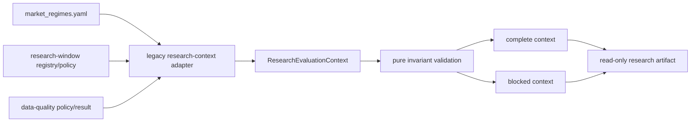

# ARCH-004B Semantic Kernel 实现说明

最后更新：2026-07-11

## 当前结论

ARCH-004B 已完成 semantic kernel、governed legacy adapter、首个 reference consumer 和全部验证；`ARCH-004C Platform Contracts` entry gate 已解锁。

当前已验证：

- scoped Ruff：PASS；
- scoped mypy（`contracts` + `legacy`）：PASS；
- semantic/window/reference/documentation focused suite：74 passed；
- contract-validation：197 passed，artifact=`outputs/validation_runtime/contract-validation_20260710T170548Z/test_runtime_summary.json`；
- full parallel validation：`5375 passed / 0 failed / 642 warnings`，819.99 秒，artifact=`outputs/validation_runtime/full_20260710T171001Z/test_runtime_summary.json`；
- strategy、threshold、weight、promotion、paper-shadow、production 和 broker 均未改变。

## 新边界



- `src/ai_trading_system/contracts/status.py`：canonical status、context status、evidence role、window role 和 policy role；legacy status 只允许显式 mapping，禁止 substring 猜测；
- `src/ai_trading_system/contracts/research_context.py`：纯、immutable、无 IO 的 ranges、coverage、policy/DQ refs 和 context contract；
- `src/ai_trading_system/legacy/research_context_adapter.py`：读取现有配置，生成带 path/hash/version/status 的 provenance，并维持 flat-field parity；
- `src/ai_trading_system/upper_state_label_feature_reset.py`：首个 additive consumer。

`contracts` 不导入 config、CLI、reports、backtest 或 domain module；配置与文件 IO 被隔离在有 sunset 要求的 legacy adapter 中。

## Complete 与 Blocked

Complete context 要求 actual data range、effective feature/prediction/portfolio start、evaluation range、per-input coverage 和 passed DQ contract 全部存在并相互一致。

Blocked context 用于真实缺口：

- requested range、regime/window、as-of 和 policy provenance 仍然存在；
- 不可得的 actual/effective/evaluation 字段保持 `null`；
- `blocking_issues` 使用稳定 code；
- `assert_complete()` 明确失败；
- 不把 requested range 复制成 actual/effective range。

## 2021 与 2022 的正确关系

合法 context 可以同时包含：

- `market_regime_id=ai_after_chatgpt`；
- `regime_start=2022-12-01`；
- `research_window_id=exact_three_asset_validated`；
- `research_window_start=2021-02-22`。

这是“项目解释 regime”和“QQQ/SGOV/TQQQ 主验证窗口”两个不同 scope。若 legacy payload 把 `exact_three_asset_validated` 的 start 声明为 `2022-12-01`，resolver 会以 `RESEARCH_WINDOW_START_CONFLICT` fail closed。

## 日期链

```text
requested range
  contains actual data range
    contains per-input effective coverage
      effective feature/prediction/portfolio start
        <= evaluation start/end
          <= as_of
```

任何越界分别产生稳定 conflict code。DQ as-of 必须与 evaluation context as-of 一致，避免使用未来质量快照为过去结论背书。

## Reference Consumer

`first_layer_v2_effective_coverage_audit` 原有字段和计算不变，只新增：

- `research_evaluation_context_id`；
- `research_evaluation_context`。

该 consumer 的真实语义是：requested primary window 从 2021 开始，但现有 composer prediction 和 portfolio effective coverage 从 2023 开始。Nested context 会把 `effective_prediction_start` 和 `evaluation_range.start` 记录为 2023，而不是让 2021 requested start 或 2022 regime start覆盖它们。

若 prediction/portfolio source 缺失，context 转为 `BLOCKED`，不会创建 placeholder coverage。旧 artifact status、安全字段和研究结论继续由原 builder 决定；semantic kernel 不重新计算策略或 promotion decision。

## 新 Artifact 约束

从 Phase B 开始，新的 investment-facing artifact 必须：

1. 使用 `research_evaluation_context.v1`；
2. 同时写入 deterministic context id；
3. 通过 `require_research_evaluation_context()`；
4. legacy flat fields 与 nested context exact parity；
5. supported conclusion 使用 complete context；真实缺口使用 blocked context；
6. unknown status/role/window 或 checksum/schema conflict fail closed。

历史 1,358 个 report family 不在本阶段一次性改写；它们按后续 domain wave 迁移，并由 ARCH-004C architecture fitness 与 ARCH-004G/H sunset gate 管理。

## 下一阶段边界

ARCH-004C 现在可以开始，负责 `ArtifactEnvelope`、`DataQualityEvidence`、typed `WorkflowSpec/RunLedger`、`ReportSpec` 和 architecture dependency gate。Phase B 没有提前实现这些 contract，也不把 reference consumer 当成全仓迁移完成。
