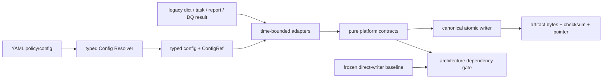

# ARCH-004C Platform Contracts 实现说明

最后更新：2026-07-11

## 当前结论

ARCH-004C 的 C1～C6 已完成并通过全部 exit gates，ARCH-004D entry gate 已解锁；投资逻辑与生产边界未改变。

已验证：

- `ArtifactEnvelope`、`DataQualityEvidence`、`WorkflowSpec/RunLedger`、`ReportSpec` pure contracts 已实现；
- canonical atomic writer 已接管 shared dynamic-strategy writer、research artifact pair、daily run manifest 和 data-quality Markdown writer，代表性路径保持 exact bytes/path/schema；
- market-regime config type/loader 已从 `config.py` 实体迁入 `platform.config`，旧 import 只作为明确 sunset 的 façade；
- scheduled task、report registry 和现有 `DataQualityReport` 有显式 legacy-to-typed adapters；
- architecture dependency/direct-writer ratchet self-scan PASS：770 个 Python files，冻结 direct writer baseline=894，当前=893，新增违规=0；
- C 阶段 focused suite：120 passed；
- scoped mypy：PASS；
- contract-validation：197 passed，artifact=`outputs/validation_runtime/contract-validation_20260710T181035Z/test_runtime_summary.json`；
- full parallel validation：`5404 passed / 0 failed / 642 warnings`，817.35 秒，artifact=`outputs/validation_runtime/full_20260710T181121Z/test_runtime_summary.json`。

## 平台边界



依赖方向：

```text
contracts <- platform <- application/domain/reporting
    ^            ^
    |            |
    +-------- legacy adapters（仅兼容期）
```

- `contracts` 无 IO、config、CLI、report renderer 或 domain calculator import；
- `platform` 可以依赖 contracts/core/yaml utility，但不能反向依赖 legacy、CLI、reports、scheduler 或 backtest；
- legacy adapter 只能做显式 mapping，未知 cadence/audience/production-effect/status 必须 fail closed；
- historical bespoke writer 不视为合格架构，只因冻结 baseline 暂时兼容，并由 ARCH-004G 分 lane 删除。

## 四类 Contract

### ArtifactEnvelope

Envelope 统一 artifact identity、producer/run/as-of/generated-at、canonical status、production effect、payload/input checksum lineage、lifecycle/visibility/retention、policy refs、limitations、next actions、DQ evidence 和 research context。

Investment-facing 且给出 `PASS|LIMITED` conclusion 时：

1. 必须有 complete `ResearchEvaluationContext`；
2. 必须有 ready `DataQualityEvidence`；
3. context/DQ `as_of` 必须与 envelope 一致；
4. 缺 report checksum、DQ fail 或 blocked context 均不能伪装为 supported conclusion。

### DataQualityEvidence

现有 `DataQualityReport` 继续是缓存校验计算结果；`DataQualityEvidence` 是 downstream 唯一可嵌入的质量契约。Adapter 原样映射 status/passed/error/warning、检查时间、as-of、输入数、error code、report path 和 checksum。报告不存在时 evidence 可被记录但 `ready=false`；consumer 调用 `assert_ready()` 会 fail closed。

### WorkflowSpec / RunLedger

`WorkflowSpec` 使用 `module:callable` typed entrypoint，legacy command 只保留为显示/兼容字段。Contract 同时定义 cadence、due policy、dependencies、expected artifacts、quality gate、timeout/retry/idempotency/lock、failure propagation 和 production effect。

`RunLedger` 只允许：

```text
NOT_DUE -> DUE -> RUNNING -> PASS|LIMITED|BLOCKED|FAILED
```

另允许 governed skip；terminal state 不可回跳。依赖未 PASS、quality-required step 缺 ready evidence、non-idempotent step 配置 retry 或无 lock 时均 fail closed。

### ReportSpec

ReportSpec 明确 canonical source、section provider、view model、renderer、audience、reader tier、cadence/freshness、actionability、owner queue action、artifact lifecycle 和 production effect。Canonical source 与 renderer 不得是同一 callable；report renderer 只呈现，不重新计算投资结论。

## 公共 writer 与兼容 parity

唯一新公共入口为 `ai_trading_system.platform.artifacts`：

- UTF-8 deterministic JSON/YAML/Markdown bytes；
- 同目录临时文件、flush/fsync、`os.replace`；
- replace 失败时保留原 target 并清理 temp；
- 返回 path/type/checksum/size，可直接转换为 `ArtifactPointer`；
- newline、sort order、indent 可显式指定，以维持旧 contract bytes。

当前 reference integrations：

| 旧入口 | 新实现 | parity |
|---|---|---|
| `dynamic_strategy_report_common.write_json_artifact` | canonical writer façade | exact bytes，无 trailing newline |
| `research_governance.write_research_artifact_pair` | canonical JSON/Markdown writer | exact JSON newline 与 Markdown |
| `run_artifacts.write_run_manifest` | canonical writer | path/schema/order/no-newline 保持 |
| `data.quality.write_data_quality_report` | canonical Markdown writer | render bytes 保持 |

## Config 拆责

`MarketRegimeConfig`、`MarketRegimesConfig`、default path、loader 和 id resolver 已迁到 `platform.config.market_regimes`。`resolve_market_regimes()` 同时返回 typed value 与 `ConfigRef(path/hash/version/status/loaded-at)`；Phase-B research-context adapter 已改用该 resolver，不再从 `config.py` 读取 market regime。

`config.py` 仍 re-export 旧符号，owner=architecture coordinator，sunset=对应 ARCH-004G migration wave 后且 consumer/full parity 通过。它不是新的 source of truth。

## Architecture Ratchet

`config/architecture/arch_004c_dependency_policy.yaml` 与 `inputs/architecture/arch_004c_direct_writer_baseline.yaml` 建立两类持续检查：

1. layer import direction；
2. direct writer 的 `path + enclosing scope + call kind + count` ratchet。

Ratchet 不是 path waiver：同一旧 function 新增第二次 `write_text` 仍会失败；删除旧调用会通过并降低 current debt。Violation 必须输出 rule、path、line、owner、message 和 remediation。

## 未改变边界

- AI regime、2021 primary research window 与日期解释未改变；
- cached data gate、PIT/as-of、source、threshold、score、backtest 和 position logic 未改变；
- promotion、paper-shadow、production、broker 和 official weights 未开启；
- report index 的 155 个 unwaived visibility findings、artifact lifecycle/Stage B/doctor FAIL 和 1,634 个 Reader Brief native gaps 仍 fail closed；
- 893 个 historical direct writer calls 仍是 ARCH-004G debt，不宣称已清零。

## ARCH-004D Handoff

Phase D 只能选择已关闭、read-only、`production_effect=none` 且 characterization 完整的 2438N/growth-tilt slice，迁移为 `ExperimentSpec -> Application Runner -> Evidence/Decision Artifact -> Report Plugin`。它必须复用本阶段的 context/envelope/DQ/workflow/report/writer/config contracts，不能再新增 task-id Python module 或另一套 writer/config/status。
