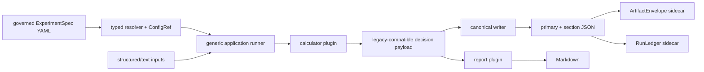

# ARCH-004D Reference Vertical Slice 实现说明

最后更新：2026-07-11

## 当前结论

ARCH-004D 的 D1～D5 已完成并通过全部 exit gates。Reference slice 已从 task-specific runner 迁到 `ExperimentSpec -> generic runner -> calculator/report plugins -> artifact/envelope/ledger`，旧 CLI 和 legacy artifacts 保持兼容；ARCH-004E entry gate 已解锁。

当前证据：

- focused characterization/platform/docs suite：77 passed；
- scoped mypy：PASS；
- architecture gate：775 Python files、baseline/current direct writer=`894/893`、0 violation；
- contract-validation：197 passed，artifact=`outputs/validation_runtime/contract-validation_20260710T185847Z/test_runtime_summary.json`；
- full parallel：`5411 passed / 0 failed / 643 warnings`，812.2 秒，artifact=`outputs/validation_runtime/full_20260710T185928Z/test_runtime_summary.json`；
- strategy、threshold、candidate、replay、research conclusion、weight、promotion、paper-shadow、production、broker 均未改变。

## 为什么选择 N1

`TRADING-2438N1 growth_tilt_candidate_family_closure` 已是 terminal negative evidence：

- status=`GROWTH_TILT_CANDIDATE_FAMILY_CLOSED_NO_EXECUTABLE_PIT_CANDIDATE`；
- closure=`CLOSED_NO_EXECUTABLE_PIT_CANDIDATE`；
- M1E prerequisite exact `2 PASS / 8 BLOCKED`；
- `pit_candidates_tested=0`、`runtime_metrics_materialized=false`、`replay_run=false`；
- `production_effect=none`、`broker_action=none`；
- calculator 已在 `research_quality`，适合把 application/IO/report concerns 抽离。

它比正在等待 owner decision、真实 PIT replay 或 fresh cache 的路径风险更低，能够把架构 parity 与研究结果变化隔离。

## 新执行链



旧 CLI 仍执行：

```text
aits research strategies growth-tilt-candidate-family-close
  -> dynamic_strategy_growth_tilt_candidate_family_closure façade
    -> resolve_experiment_spec + run_experiment
```

CLI handler、options、stdout conclusion fields 和 exit behavior 未改。

## ExperimentSpec

`config/research/experiments/growth_tilt_candidate_family_closure.yaml` 现在是 application wiring 的 source of truth，包含：

- calculator/report plugin id 与 exact version；
- 8 个 typed input slots、role、required flag、default path；
- primary/section/Markdown/envelope/run-ledger 5 类 output；
- legacy READY/BLOCKED 到 `CanonicalStatus` 的 explicit mapping；
- `ReportSpec` 所需 canonical source、section provider、view model、renderer、audience/tier/cadence/freshness/lifecycle；
- `data_quality_required=false`、`production_effect=none`、`broker_action=none`。

Spec 使用 Pydantic frozen/extra-forbid contract、deterministic `spec_id`、round-trip 与 config path/hash/version/status provenance。未知 input/output/plugin/status 均 fail closed。

## Generic Runner 边界

`research_framework.runner` 只负责：

1. 解析 input override/default path；
2. 读取 JSON/YAML/text；
3. required source validation；
4. 记录 absolute path、SHA-256、size；
5. 调用 registry 解析出的 calculator/report plugin；
6. 补 runtime/as-of/strict/safety metadata；
7. 通过 canonical writer 输出 artifact；
8. 生成 envelope 与 ledger。

Runner 源码不包含 `TRADING-2438N1`、`growth_tilt` 或 N1 terminal status。Architecture policy 也禁止 runner 反向 import 具体 N1 wrapper、calculator 或 report plugin。

## Plugin 边界

Calculator plugin 只适配已有 `build_growth_tilt_candidate_family_closure()`；closure 规则、strict validation 和 negative-result ledger 未移动或重写。

Report plugin 只提供：

- negative-result-ledger section；
- typed view model；
- 原 Markdown renderer。

它不重新判断 closure、candidate disposition、reopen policy 或 safety。

## Parity 与 additive sidecars

保持不变：

- CLI command/options/exit；
- primary JSON、negative-ledger JSON、Markdown path；
- primary/section schema、status、task id、artifact_paths；
- exact serialized bytes（固定 generated-at/path 时）；
- strict missing-source message；
- N1 conclusion 与所有 no-effect fields。

新增但不写回旧 `artifact_paths`：

- `growth_tilt_candidate_family_closure.envelope.json`；
- `growth_tilt_candidate_family_closure.run_ledger.json`。

Envelope 引用 primary 与所有存在的 input checksums、ExperimentSpec policy ref、canonical status、owner/lifecycle/production effect。由于这是 prior-governance-artifact closure，不读取 fresh cached market/macro data，`data_quality_required=false` 且 `data_quality=null`；没有伪造 DQ PASS。

RunLedger 记录单步 `NOT_DUE -> DUE -> RUNNING -> PASS|BLOCKED`。READY closure 映射 PASS，source-contract blocked 映射 BLOCKED 并保留 blocker codes。

## “只加 Spec”证明

Focused test 使用第二份 in-memory variant spec：只改变 `experiment_id/spec_version`，复用相同 calculator/report plugins和 generic runner，即可生成独立 envelope/ledger；没有新增 Python module、CLI handler、report family 或 writer。

这证明同一 capability family 的复现/配置 variant 不再需要 `dynamic_strategy_<task>.py`。新的 calculator capability 仍可新增独立 plugin，但 application orchestration、IO、runtime、envelope、ledger 与 report wiring无需复制。

## Legacy 与后续

- 旧 task wrapper 当前仅为 façade，sunset=ARCH-004G research lane；
- task-specific CLI alias 在 generic experiment entry完成 cutover/parity前保留；
- report registry command text 在 ARCH-004F3 generated registry成熟前保留；
- Phase D 不批量迁其他 task-shaped modules，也不删除旧 CLI。

## ARCH-004E Handoff

Phase E 可以复用 generic ExperimentSpec/plugin 作为 module ownership 与 scaffold 的首个已验证 target，但不得立即批量迁移 domain modules。下一步建立 module/test manifests、ownership、impact selection、architecture fitness、scaffold 与 generated aggregate，先维持现有 CLI/registry/catalog兼容。
