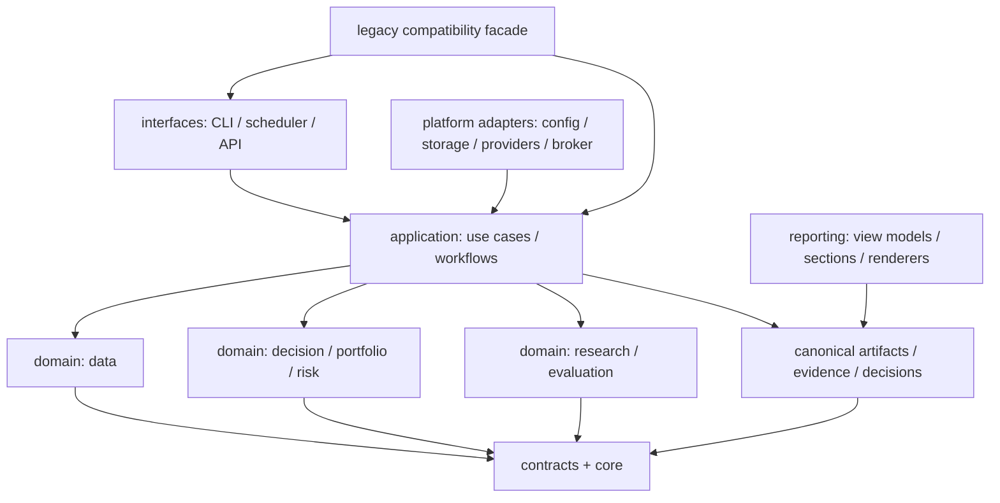
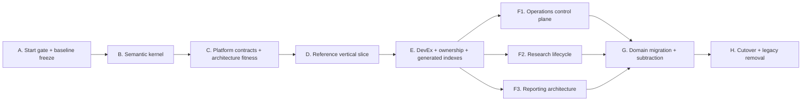

# ARCH-004：TRADING-2438N 后系统架构重构计划

最后更新：2026-07-23

## 任务信息

- 任务 ID：`ARCH-004`
- 优先级：`P0`
- 当前状态：`IN_PROGRESS`（current phase=`WAVE12_COMPLETE_WAVE13_GOV006_N1_NEXT`）
- 触发顺序：`TRADING-2438N` 完整收口之后
- 责任方：系统架构协调者 + 各 bounded context owner + 项目 owner
- 变更性质：系统级、行为保持优先、渐进迁移
- 默认 production effect：`none`
- 正式前序任务：`ARCH-001`、`ARCH-002`、`ARCH-003`、`TRADING-487_to_504_ENGINEERING_CLOSEOUT_AND_WEIGHT_RESEARCH_TURN`
- 后续执行任务：`ARCH-004G4_OPERATIONS_PERIODIC_CONSUMER_MIGRATION`、`ARCH-004G3_REPORTING_NATIVE_MIGRATION`、`ARCH-004G5_RESEARCH_WRAPPER_MIGRATION`、`ARCH-004H_CUTOVER_AND_LEGACY_REMOVAL`
- 并行研发基础设施：`ARCH-005_PARALLEL_DEVELOPMENT_CONTROL_PLANE` S0/S1已`BASELINE_DONE`；G2.4 phase exit与`arch_005_bootstrap_handoff.v1`均PASS并推送。handoff中的`next_slice_unblocked=false`作为历史证据保持不变；2026-07-23 owner通过新的显式指令恢复并完成G2.5。Wave12 G4A+D0B1、S2 shared integration 与 formal gate 已PASS；当前先进入 Wave13 `GOV-006 N1` coordinator-only 任务池归一化，再开放 Wave14 `D0B2 + bounded G3`。这不包含S5、H、G5、策略研究、consumer cutover、promotion、broker action或production dispatch

## Owner Intent

项目长期持续增加数据、研究、回测、治理、调度、报告和验证模块，但缺少同等强度的整理、抽象、退役和模块边界治理。结果是代码、配置、任务、报告和文档持续膨胀，语义入口分散，并行开发经常争用同一批中央文件。

本计划的目标不是把现有文件重新分目录，也不是为了代码整洁而重写投资逻辑，而是在 `TRADING-2438N` 收口后建立一套长期可维护的系统架构，使每个环节都具备清晰的：

- 目的与 owner；
- 输入、输出与 schema；
- market regime、research window、effective coverage 等语义；
- 数据质量、PIT、成本、风险和治理 gate；
- side effect 与 production boundary；
- cadence、due condition 与运行状态；
- public API、允许依赖和扩展点；
- 测试、报告、runbook 和退役条件。

## 前序大型重构任务继承关系

ARCH-004 不是一套与历史无关的新重构，也不重复实现已有控制面。它是以下前序工作的正式继任与完成性迁移：

| 前序任务 | 已完成基础 | ARCH-004 处理方式 |
|---|---|---|
| `ARCH-001` | 主 `cli.py` 经过 28 批迁移，收口为 Typer 注册层 | `REUSE`；继续把各 command module 变成薄 interface，不重做根 CLI 拆分 |
| `ARCH-002` | `ArtifactRef`、`ProductionEffect`、`WorkflowStep/Result` | `EXTEND`；升级为完整 envelope、workflow spec 和 run ledger，不建立竞争类型 |
| `ARCH-003` | daily workflow adapter、dashboard view model、CLI/shadow 低风险切片 | `EXTEND`；作为 characterization seam，不重开已完成切片 |
| `TRADING-487～499` | engineering surface inventory、canonical status/doctor、artifact lifecycle、Stage B readiness、Reader Brief consistency、clean-clone、platform freeze release candidate | `RECONCILE_AND_CARRY_FORWARD`；先复验，再把当时未做的实体迁移、减法和持续架构约束纳入 ARCH-004 |
| `TRADING-500～504` | 权重研究 failure taxonomy、架构 RFC、消融与 holdout 协议 | `REUSE_AS_RESEARCH_POLICY`；不与工程重构混做策略调优 |
| daily incremental refactor 系列 | 多个 CLI/report/helper 局部拆分 | `INVENTORY_AND_FOLD_IN`；保留有效 seam，停止“一边膨胀一边拆文件”的循环 |

`TRADING-487_to_504` 是用户此前记忆中的主要大型重构/工程收尾任务。它在 2026-06-19 达到当时定义的 `ENGINEERING_CLOSEOUT_READY`，该历史 DONE 状态保留，不回写成未完成；但该结论是当时的 engineering control-plane/release-candidate baseline，不等于今日项目已经完成全面减法和 domain migration。

ARCH-004 因此定位为：

> post-freeze architecture v2：复用旧控制面，复核冻结后回归，完成前序任务未执行的结构迁移、持续治理与真实退役。

### 前序工程收尾明确遗留的事项

前序文档已经明确披露：

- task-specific CLI 只保留 compatibility mapping，尚未真实删除或隐藏；
- artifact lifecycle 只有只读 inventory，没有真实 archive、deletion 或 pointer rewrite；
- Reader Brief consistency 通过 effective view model 补齐了 1,599 个 native template gaps，源报告仍未原生统一；
- README 瘦身以及 legacy command/schema cleanup 被留作后续整理；
- platform user guide 与 engineering closeout requirement 对 platform-freeze 完成状态存在文档冲突；
- 2026-06-19 的 engineering closeout artifacts 是历史快照，没有成为持续 architecture fitness gate。

ARCH-004 不得重新创建另一套 status/doctor/inventory/release commands，而应复用并加强这些已有入口。

### 前序能力处置矩阵

| 既有能力 | 当前处置 |
|---|---|
| `aits system status` / `aits system doctor` | 保留为 canonical first screen；增加 architecture/context consistency，不另建新 status 命令 |
| engineering surface inventory | 复用为 ARCH-004 baseline 输入；升级为 module/ownership/deprecation-aware continuous inventory |
| artifact lifecycle inventory | 保留只读审计；新增独立、受控的真实 deprecation/removal workflow |
| `config/config_contract_registry.yaml` | 保留并逐域拆分 source fragments；兼容 aggregate 由生成器输出 |
| central error taxonomy | 保留并扩展 adoption coverage，不创建第二套 taxonomy |
| validation tier runner/runtime artifact | 保留 xdist 与 runtime evidence；把手写 test list 迁为 test manifest/marker 生成 |
| Reader Brief consistency | 从 derived fill 转向 native typed section provider；derived compatibility 仅在迁移期存在 |
| clean-clone acceptance | 保留为每个 major cutover 的最终 gate |
| engineering closeout release candidate | 保留历史证据；ARCH-004 closeout 生成 versioned successor，不覆盖 2026-06-19 结论 |
| platform user guide | 保留为人读入口；在 predecessor reconciliation 中修复与权威 closeout 状态的冲突 |

## 为什么必须在现在重构

### 规模与集中度

2026-07-11 只读审计基线显示：

- `src/ai_trading_system` 有 752 个 Python 文件，约 981,062 行；
- 其中 325 个模块、约 424,843 行直接位于 package 根目录；
- `tests` 有 1,097 个 Python 文件，约 252,717 行；
- `docs` 有约 1,898 份 Markdown，其中 `docs/requirements` 约 645 份、`docs/research` 约 1,102 份；
- 最近 14 天约 266 次提交、238 份新增 requirement 文档、315 个 Python 文件被触达；
- 当前 report registry 有 1,358 个 report id，scheduled task 有 77 项。

主要热点包括：

| 文件 | 审计规模 | 主要风险 |
|---|---:|---|
| `src/ai_trading_system/cli_commands/etf_portfolio.py` | 约 37,604 行、993 个命令 | CLI 注册、参数、业务调用和输出逻辑集中 |
| `src/ai_trading_system/reports/reader_brief.py` | 约 29,027 行 | section、missing fallback、view model 和 HTML renderer 混合 |
| `src/ai_trading_system/etf_portfolio/dynamic_v3_system_target.py` | 约 28,805 行 | domain、workflow、artifact 和治理职责混合 |
| `src/ai_trading_system/controlled_strategy_batch.py` | 约 19,802 行 | 多研究族和多阶段控制面聚集 |
| `src/ai_trading_system/etf_portfolio/dynamic_v3_parameter_research.py` | 约 19,207 行 | 参数研究、验证和报告边界不清 |

生产代码中约有 318 个文件达到 1,000 行以上、20 个达到 5,000 行以上、11 个达到 10,000 行以上。AST 只读审计还发现约 688 组跨文件完全相同函数体、2,446 次重复出现，至少约 16,831 行精确重复；尚未包含近似复制。

### 语义分散已经造成真实错误

当前同时存在：

- 仅用于历史比较证据的 `ai_after_chatgpt` market regime 起点 `2022-12-01`；它不是活跃研究、
  回测或投资结论的默认窗口；
- QQQ/SGOV/TQQQ primary validated research window 起点 `2021-02-22`；
- 模型实际 feature、prediction 或 portfolio effective start；
- 2020 sensitivity 与 requested inception metadata window。

这些语义没有通过单一 runtime context 强制进入所有报告，导致 `2022-12-01` 被误写为策略研究默认主窗口。该事件不是单点文案问题，而是缺少统一 semantic kernel 的结构性证据。

### 局部重构追不上新增速度

`ARCH-001`、`ARCH-002` 和 `ARCH-003` 已建立 CLI 分包、`ArtifactRef`、`ProductionEffect`、`WorkflowStep`、dashboard view model 和 shadow lineage 等正确基础；`TRADING-487_to_504` 又完成了 engineering control plane、reproducibility 和 platform-freeze baseline；后续多次 daily incremental refactor 也拆过 CLI/report helper。

但既有边界承载的主体代码仍很少，拆出的命令文件会在新任务加入后快速重新增长到 6,000～9,000 行。根因是项目仍以“一个任务 ID 对应一组新模块、CLI、报告和登记行”的方式增长，而不是通过稳定的 domain contract、workflow spec、experiment runner 和 report plugin 扩展。

### 中央聚合文件成为并行开发瓶颈

最近 200 个提交中：

- `docs/task_register.md` 被触达 191 次；
- `docs/system_flow.md` 被触达 179 次；
- `config/report_registry.yaml` 被触达 168 次；
- `docs/artifact_catalog.md` 被触达 168 次；
- `docs/task_register_completed.md` 被触达 138 次。

因此，并行冲突不是单纯的执行纪律问题，而是事实源和人工双写方式造成的结构性争用。

## 重构原则

1. **语义先于搬文件**：先统一 context、contract 和状态语义，再拆目录和模块。
2. **行为保持与策略改变分离**：结构迁移不得同时调整模型、阈值、权重、回测口径或投资结论。
3. **Strangler migration**：新路径通过 compatibility façade 渐进替代旧路径，不做大爆炸重写。
4. **单一机器事实源**：聚合文档和 registry 尽量由小型模块 manifest 确定性生成。
5. **报告不重算结论**：presentation 只读取 canonical decision/evidence artifacts。
6. **周期复核不等于自动调优**：cadence 负责观察与决策，策略变更必须由证据触发并预注册。
7. **先证明实际 capability，再抽象**：至少存在两个真实实现或明确 domain invariant 后再下沉公共抽象，避免 speculative framework。
8. **每阶段必须做减法**：新增 extension point 的阶段必须定义替代和退役对象，不能只增加新层。
9. **历史证据可复现**：代码退役和 artifact retention 分开治理，不因清理代码破坏历史结论追溯。
10. **质量门禁不降级**：所有 cached-data-dependent 路径继续强制执行 `aits validate-data` 或同源代码路径。

## 2026-07-23 长期优先级与并行顺序

后续不再按“最早登记的 P0”或单纯任务数量推进，而按正确性风险、后继解锁价值、可并行边界和
等待成本排序。任一时点仍只有一个 integration coordinator 和最多两个 active domain worker；等待
真实 cadence、owner 或外部数据的任务不占用开发 worker，但必须保留独立观察状态，不能伪装成已完成。
当前GOV-006 N0可复算inventory为`435 active`，其中`269 P0`、`284 VALIDATING`、`100 BASELINE_DONE`；
30条high-confidence terminal decision应用后，预期先降至`405 active / 241 P0`。因此Wave13治理批次不是
文档美化，而是下一轮准确dispatch、工作量估算和优先级可信度的前置条件。

| 顺序 | 优先级 | 工作包 | 目的与退出边界 |
|---|---|---|---|
| 1 | P0 / 已完成并归档 | `ARCH-004G2` readiness + `DATA-GOV-001 D0A` + `GOV-006 N0` | 已通过共同 formal gate：G2 requirement 转 `DONE`、D0A 与 N0 formal complete；ARCH-004、DATA-GOV-001 与 GOV-006 的 program-level 状态仍为 `IN_PROGRESS`。该结果不自动授权下一波 dispatch。 |
| 2 | P0 / 已完成波次 | `ARCH-004G4` + `DATA-GOV-001 D0B1/S2` | Wave12 已完成最小shared DQ preflight interface、G4A=`24 passed`、D0B1=`20 passed`、canonical `aits validate-data` receipt、共享3小时provider-ready默认日期、`operations_as_of`/`data_quality_as_of`双日期、profile/as-of exact discovery pointer、strict verifier+daily step interval与1 producer/4 consumers nonexecuting sidecar。最终 Full=`6825 passed / 3 skipped / 1147.04s`；真实prices manifest blocker留给D0B2，automatic dispatch、consumer cutover、production与broker继续关闭。 |
| 3 | P0 / Wave13 组合治理 | `GOV-006 N1` high-confidence terminal reconciliation | 在Wave12 final tree提交后，由coordinator单写应用已具task-own evidence的30条高置信decision；重建task shadows/compatibility views并复核active/P0统计。先降低任务池噪声，再从真实未完成集合dispatch下一波；N2/N3仍按小批证据推进，不做一次性大扫除。G4C真实cadence观察异步积累，不占开发worker。 |
| 4 | P0/P1 / Wave14 双域 | `DATA-GOV D0B2` + bounded `ARCH-004G3` | Data lane修复download/publish/manifest事务并补market-calendar、coverage、internal-gap、finite-value gate；Reporting lane冻结首个native report slice，使presentation只投影canonical事实/解释/限制/结论。两lane不共享实现路径，coordinator最后统一接flow/catalog/manifests。 |
| 5 | P0/P1 / Wave15 受控采用 | `DATA-GOV D0B3` + `ARCH-004G4B` first consumer；并行完成G3 close/readiness | 只为一个明示consumer引入reviewed typed authorization profile并证明fail-closed parity，再逐个扩展；不做全量consumer切换。G3完成后才允许准备G5，避免research/report共同contract同时切换。 |
| 6 | P1 / contract迁移 | `ARCH-004G5` + `DATA-GOV D0C/D1`；随后`ARCH-004G6` characterization | 把task-shaped research wrapper迁到`ExperimentSpec/plugin/lifecycle`，同时补data lifecycle、backup/restore、instance lineage、bitemporal adoption；物理存储先跑真实workload/parity/rollback基准。进入decision-sensitive迁移前先冻结scoring/position/PIT/DQ/cost/golden parity，结构迁移与策略调优严格分开。 |
| 7 | P1/P2 / subtraction与closeout | `ARCH-004G7` -> `ARCH-004H`，以及证据支持后的 `DATA-GOV D2` | 统一deprecation/reachability/removal ledger后才允许小批cutover/removal；每批有rollback、历史artifact retention和clean-clone/Full证据，禁止新增抽象后长期保留双轨。 |
| 8 | P2 / 知识与产品化 | `KNOWLEDGE-001`、`PUBLISHING-001`、`PLATFORM-UX-001` | 在事实、claim/evidence和报告contracts稳定后建设知识核心、多载体发布和只读理解工作台，避免UI/文档层制造第二套结论。 |

### 长期能力建设方向

| 方向 | 长期目标 | 近期可验证交付 |
|---|---|---|
| Data Foundation | 数据、source provenance、DQ、PIT、coverage、lineage与lifecycle形成统一事实底座 | D0B2/D0B3完成真实manifest事务、actual window与首个consumer adoption；D0C/D1再补retention/backup/bitemporal与storage benchmark |
| Operations & Runtime | daily统一入口、长cadence条件编排、typed preflight、幂等恢复与可观测性 | G4B先迁一个consumer；G4C用真实cadence证据异步验证，不用等待时间阻塞domain worker |
| Reporting & Knowledge | 固定“事实→解释→限制→结论”链，renderer不重算，current/history不混淆 | G3首个native report slice与parity；contract稳定后再启动Knowledge Object和publishing clients |
| Research Lifecycle | 每个研究具备why/input/output/calculation/window/DQ/PIT/cost/holdout/limitations/optimization-space文档与可重放spec | G5只迁现有wrapper，不做新搜索；新策略任务必须独立预注册、可证伪并获owner授权 |
| Decision-sensitive Core | scoring、position、portfolio与promotion迁移前有characterization/golden parity和rollback | G6先冻结行为，再迁实现；任何阈值或heuristic变化走reviewed policy，不夹带在架构重构中 |
| Governance & Subtraction | task状态真实、owner清楚、重复逻辑持续退役、历史证据仍可追溯 | GOV-006 N1～N3小批归一化；G7/H按reachability和removal gate逐批减法 |
| Engineering Efficiency | 最多两个互不重叠domain worker、shared-path单写、分层验证、一次final Full、性能异常可撤回 | 每波记录ownership/change manifest、tail runtime与cache/repeated-scan指标；优先消除共享等待和重复计算，不以减测试换速度 |
| Product Experience | 用户能理解“现在是什么、为什么、证据如何、限制和下一步是什么” | 等G3/Knowledge contracts稳定后再做docs site、Reader Brief/Dashboard projection和只读交互工作台 |

策略线保持独立授权边界：已关闭的 Strategy A package 不因工程 readiness 自动重开，B/C、新候选
搜索、prospective access、paper-shadow、promotion、production 与 broker action 均需新任务和显式
owner 授权。没有已授权策略执行任务时，第二条 lane 优先承接 data/strategy-evidence contract、无副作用
reproducibility 或 source-quality 工作，而不是制造研究结果。

## Definition of a Clear Component

每个长期保留的 component 必须登记：

| 字段 | 要求 |
|---|---|
| `component_id` | 稳定 ID，不使用临时 task id 作为业务类型 |
| purpose | 一句话说明唯一职责 |
| ownership | 分开记录 code、policy、data、artifact、runtime owner |
| inputs / outputs | typed schema、version、lineage 和 freshness |
| context | regime、window、as-of、effective range、policy refs |
| dependencies | 允许和禁止的模块依赖 |
| side effects | cache/report/shadow/production/broker 边界 |
| failure contract | PASS/WARN/FAIL/BLOCKED/SKIPPED 与传播规则 |
| cadence | manual、daily、weekly、biweekly、monthly、quarterly 或 event-driven |
| validation | required test tier、characterization、contract 和 parity gate |
| observability | structured log、run id、elapsed time、issue taxonomy |
| lifecycle | experimental、active、deprecated、frozen、removed |
| documentation | owner guide、operator runbook、source artifact drilldown |

缺任一关键字段的模块不得成为新的公共扩展点。

## 目标架构



依赖方向必须固定为：

```text
interfaces -> application/workflows -> domain -> contracts/core
platform adapters -> application ports
reporting -> contracts/artifacts only
legacy -> compatibility facade only
```

禁止：

- domain import CLI、renderer 或具体文件路径；
- reporting 重新计算评分、权重、回测或 promotion decision；
- CLI command function 承载 domain algorithm；
- 一个 config god module 持有全域 schema、路径和 loader；
- 业务模块自行复制 data-quality gate、checksum、runtime metadata 或 safety boundary writer。

### 建议 bounded contexts

| Context | 长期职责 |
|---|---|
| `core` | 纯 ID、时间、状态、错误和不可变基础类型；不读配置、不做 IO |
| `contracts` | `ResearchEvaluationContext`、`ArtifactEnvelope`、`DataQualityEvidence`、`PolicyRef`、workflow/report schema |
| `platform.config` | typed config resolver、version、provenance 和唯一 consumer/owner |
| `platform.artifacts` | atomic IO、checksum、lineage、manifest、catalog compiler 和 lifecycle |
| `data` | provider -> raw -> normalized -> quality gate；提供唯一公开 data-quality service |
| `decision` | feature、signal、scoring、risk、allocator 和 execution policy 的纯计算边界 |
| `research` | hypothesis、experiment、candidate、PIT replay、evaluation、review 和 retirement lifecycle |
| `operations` | workflow DAG、cadence、due resolver、run ledger、lock/retry/idempotency |
| `reporting` | typed view model、section provider、renderer、audience/tier 和 drilldown |
| `interfaces` | 薄 CLI/scheduler/API adapter；只解析参数并调用 application service |
| `legacy` | 旧 CLI、import path 和 artifact schema 的有期限兼容层 |

## 四个必须统一的核心契约

### 1. ResearchEvaluationContext

所有投资解释 artifact 必须同时携带：

- `market_regime_id`、`regime_anchor`、`regime_start`；
- `research_window_id`、`window_role`；
- `requested_start/end`；
- `actual_data_start/end`；
- `effective_feature_start`；
- `effective_prediction_start`；
- `actual_portfolio_start`；
- `evaluation_start/end`；
- `as_of`、trading calendar；
- data-quality contract、caveats 和 policy refs。

不再允许一个 `default_backtest_start` 兼任以上语义。context 冲突必须 fail closed。

### 2. ArtifactEnvelope

统一字段至少包括：

- artifact/report id、schema/version、run id、generated_at、as_of；
- source refs、checksum、producer、consumer 和 lineage；
- `ResearchEvaluationContext`；
- data-quality evidence；
- status、severity、conclusion、limitations、next action；
- production/shadow/broker effect；
- lifecycle、retention 和 visibility。

### 3. WorkflowSpec + RunLedger

每个 workflow/task 必须声明：

- workflow id、domain、cadence、due policy 和 U.S. market calendar；
- dependencies、required inputs、expected outputs 和 freshness；
- data-quality gate、manual checkpoint 和 production effect；
- idempotency key、lock、retry、timeout 和 failure propagation；
- callable/application entrypoint，而不是只保存裸 CLI 字符串。

每次运行写入：`DUE|RUNNING|PASS|LIMITED|SKIPPED|BLOCKED|FAILED`、原因、输入版本、artifact refs、owner checkpoint 和下次 due 条件。

### 4. ReportSpec

每个报告声明：

- audience：operator、researcher、owner、audit；
- reader tier：daily core、periodic review、drilldown、historical；
- canonical source decision/evidence artifact；
- section provider、renderer、priority、freshness 和 actionable policy；
- retention/lifecycle 和是否进入 owner queue。

新增 report 不应要求修改 Reader Brief core。

## 周期任务与研究复盘目标模型

外部 scheduler 仍只允许统一入口 `aits ops daily-run`。内部 due resolver 根据日期、交易日、latest successful run、上游 artifacts、质量门禁和 owner checkpoint 选择到期 subgraph。

| Cadence | 目标职责 | 默认禁止 |
|---|---|---|
| Daily | 数据、质量、信号、证据、运行健康 | 参数搜索、策略变更、promotion |
| Weekly | evidence delta、robustness、cost、drawdown、candidate lifecycle | 根据单周收益自动调权 |
| Biweekly | shadow/baseline、thesis、risk attribution、研究方向复核 | 把短样本当生产证据 |
| Monthly | long-window、PIT/data-source、threshold、report lifecycle、技术债 | 无新证据也强制优化 |
| Quarterly | 架构健康、依赖/安全、容量、退役、策略研究方向 | 未经 owner 的大范围 policy mutation |
| Event-driven | 数据/契约修复、持续退化、结构变化、事故 | 事后改阈值或复用 holdout 调参 |

研究变化流程固定为：

```text
Observation
  -> EvidenceSnapshot
  -> ReviewDecision(KEEP / INVESTIGATE / RETIRE / OPEN_RESEARCH)
  -> Preregistered ChangeProposal
  -> PIT / holdout / robustness / cost / risk validation
  -> OwnerDecision
  -> Adoption or Rejection
```

周期到期本身不能创建新参数、修改权重或批准策略。

## 报告信息架构

### Owner Daily Brief

只显示固定核心内容，目标不超过 10 个一级 section：

1. 今日结论；
2. data-quality gate；
3. 与上一交易日的变化；
4. 关键风险与 blocker；
5. 需要 owner 的动作；
6. 下一步与详情链接。

不得内嵌完整 catalog、全部历史研究或所有 stale optional artifacts。

### Weekly / Monthly Research Review Pack

固定披露：

- context 与实际覆盖；
- 相比上期新增证据；
- baseline/candidate 对比；
- cost、drawdown、worst window、turnover 和 stability；
- evidence maturity 与 blockers；
- `KEEP|INVESTIGATE|RETIRE|OPEN_RESEARCH`；
- 下一触发条件和 source artifacts。

### Audit Index

承载全量 artifact、lineage、历史、deprecated、schema 和复现信息。Audit Index 与 Owner Brief 分离，历史缺失不自动进入 daily owner queue。

## 研发效率与测试体系

### Module Manifest

每个模块维护小型 manifest，声明：

- code/config/tests/docs/artifacts；
- code、policy、data、artifact、runtime owners；
- public contracts 与版本；
- allowed dependencies；
- required validation tiers；
- production boundary；
- lifecycle 与 replacement。

聚合的 report registry、artifact catalog、CLI index、task index 和 flow annex 由 manifests 确定性生成。迁移 source-of-truth 前必须显式更新项目治理规则；不得静默改变 `docs/system_flow.md` 或 `docs/task_register.md` 的既有权威地位。

### Test Manifest

每个 test 必须分类：

- component；
- unit/contract/integration/reproducibility/research regression；
- expected cost；
- data class；
- parallel safety；
- protected contract id。

validation tiers 应由 manifest/marker 生成，不再只依赖手写测试文件清单。CI 必须拒绝未分类测试。

### Developer Tooling

计划提供：

- module/experiment/report scaffold；
- architecture dependency check；
- change impact 与 required validation 解析；
- registry/catalog/flow deterministic generator；
- duplicate helper 和 unused contract 检查；
- compatibility/golden artifact diff；
- deprecation/reachability report；
- runtime budget 与 slow-test trend。

### 复杂度预算

第一阶段从真实 baseline 推导 ratchet budget，不拍任意统一阈值：

- top hot files 在重构期不得继续净增长；
- 新功能不得加入既有 god module；
- 每个 migration slice 必须减少至少一个旧入口、重复 helper 或共享文件直接编辑点；
- 任何预算例外必须有 owner、理由、退出条件和验证。

## 并行开发约束

1. 默认一个 integration coordinator + 最多两个互不重叠的 active domain worker；三个或更多长期 workstream 必须分批覆盖。
2. 开工前冻结 public contract、module manifest 和 ownership。
3. coordinator 独占共享 schema、aggregate generator、根 CLI 注册、task register、system flow 和兼容迁移。
4. worker 只编辑被分配的 module directory、fragment 和 tests；不得平行修改共享 aggregate。
5. 两个任务若需要修改同一 public contract，必须串行，或先单独合并 contract change。
6. 每个 change manifest 声明 `module_ids`、`contract_versions`、`generated_outputs`、`validation_tiers`。
7. 每个 slice 默认 behavior-preserving；策略/阈值变化必须另开任务。
8. 公共 helper 由 coordinator 提取，worker 不得为赶进度复制实现。
9. 集成顺序固定为 contract -> adapter -> domain migration -> tests/fragments -> shared wiring/docs -> generated aggregate -> compatibility removal。
10. phase closeout 才运行全量验证；slice 使用 impact-based focused tier，但不得用 focused PASS 掩盖全量新增失败。

## 真正的减法与退役机制

统一 lifecycle：

```text
EXPERIMENTAL -> ACTIVE -> DEPRECATED -> FROZEN -> REMOVED
```

进入 `DEPRECATED` 必须记录 replacement、owner、usage evidence、compatibility window 和 sunset condition。删除前必须满足：

- runtime/import/CLI/report registry reachability 为零或全部由 compatibility façade 承接；
- historical artifacts 仍可通过 commit/schema/runner reference 复现；
- callers、tests、docs 和 runbooks 已迁移；
- no data-quality、PIT、production-effect 或 owner-decision contract 丢失；
- owner signoff 和删除清单完成。

artifact retention 与代码删除分开；不能为了缩小仓库而删除研究失败证据或审计链。

## 分阶段实施计划



### ARCH-004A：Start Gate 与行为冻结

输出：

- 2438N closeout/commit/validation handoff；
- `ARCH-001/002/003` 与 `TRADING-487_to_504` predecessor reconciliation matrix；
- 重新读取并比较 latest engineering surface inventory、canonical status/doctor、artifact lifecycle、Stage B readiness、Reader Brief consistency、clean-clone 和 release-candidate evidence；
- 对前序 `KEEP|MERGE|DEPRECATE|ARCHIVE|REMOVE_AFTER_COMPATIBILITY_WINDOW` 项形成当前 disposition；
- 修复 platform user guide、implementation backlog 和当前 window/closeout 事实之间的文档冲突；
- full-suite baseline 与已知失败 ledger；
- command、config、artifact schema、module、dependency、runtime 和性能 inventory；
- golden/characterization artifacts；
- feature freeze 和 exception policy。

退出条件：

- 2438N attributable work 已完整收口；
- 所有 predecessor capability 标记为 `REUSE|EXTEND|CARRY_FORWARD|REPLACE|REMOVE`，不存在重复建设入口；
- 2026-06-19 `ENGINEERING_CLOSEOUT_READY` 被明确保留为历史 snapshot，而不是当前 architecture health 证明；
- worktree 可明确区分本计划与其他用户改动；
- 全量验证通过，或每个既有失败有独立 P0 blocker task；
- 除 correctness/data incident 外，不再向 god modules 新增功能。

### ARCH-004B：Semantic Kernel

实现 `ResearchEvaluationContext`、统一状态词典、evidence role、policy ref 和兼容 adapter。先迁 read-only/research-only artifacts，不修改策略行为。

退出条件：所有新 investment-facing artifact 强制携带完整 context；2021/2022/effective coverage 冲突测试 fail closed。

### ARCH-004C：Platform Contracts

实现 `ArtifactEnvelope`、typed `WorkflowSpec`、`RunLedger`、`ReportSpec`、统一 IO/checksum/runtime metadata/data-quality evidence 和 architecture dependency gate；拆解 `config.py` 的全域职责。

退出条件：公共 writer、quality evidence、context 和 config resolver 各只有一个权威入口；旧 import 通过有期限 façade 兼容。

### ARCH-004D：Reference Vertical Slice

选择一个已关闭、read-only、无 production effect 且 characterization 完整的 2438N/growth-tilt evidence slice，迁移为：

```text
ExperimentSpec -> Application Runner -> Evidence/Decision Artifact -> Report Plugin
```

退出条件：CLI、artifact path/schema/status、安全字段和解释语义 parity；证明新增同类研究不需要新增 task-id Python module。

### ARCH-004E：DevEx、Ownership 与生成式索引

落地 module/test manifests、ownership、impact selection、architecture fitness、scaffold 和 aggregate generators。先保持现有 aggregate 文件兼容，不立即改变 source-of-truth 治理。

退出条件：无 orphan/overlap ownership、无未分类测试、aggregate diff 可重现、共享文件不再由各 worker 手工拼接。

### ARCH-004F1：Operations Control Plane

把 `scheduled_tasks.yaml`、ETF operations schedule 和 `ops_daily.py` 硬编码链路收敛为单一 typed DAG；增加 due resolver、RunLedger、lock/retry/idempotency 和 shadow plan parity。

退出条件：所有 periodic task 都有 due/run ledger；外部仍只有 daily unified trigger；非 daily 自动执行必须通过日期、依赖、质量和 owner gate。

### ARCH-004F2：Research Lifecycle

落地 hypothesis、preregistration、candidate、evaluation、review、retire 的通用 lifecycle；将定期复盘和 event-driven optimization 分离。

退出条件：研究任务主要新增 spec/plugin，不新增一套 wrapper/CLI/report module；所有 change proposal 在结果可见前冻结 selection rule 和 policy。

### ARCH-004F3：Reporting Architecture

拆分 Owner Daily Brief、Research Review Pack 和 Audit Index；Reader Brief 改为 section provider + typed view model + renderer；report registry/catalog/flow annex 由 module fragments 生成。

退出条件：Daily Brief 不超过 10 个核心 section；owner queue 只含 due + actionable；新增 report 不修改 Reader Brief core；报告层不重算结论。

### ARCH-004G：Domain Migration 与减法波次

按 data、decision、research、portfolio/shadow、operations、reporting 分 lane 迁移。优先处理：

1. 重复 IO/checksum/data-quality/runtime metadata/safety helpers；
2. `cli_commands/etf_portfolio.py`；
3. `reports/reader_brief.py`；
4. `dynamic_v3_system_target.py`；
5. `controlled_strategy_batch.py`；
6. `dynamic_v3_parameter_research.py`；
7. task-shaped growth-tilt/dynamic-strategy wrappers；
8. 最后才迁 scoring、position gate 和 backtest 等投资解释敏感路径。

每个波次必须删除或冻结旧入口，禁止永久双轨。

### ARCH-004H：Cutover 与 Legacy Removal

切换前至少完成：

- 2 个 daily cadence parity；
- 2 个 weekly cadence parity；
- 1 个 monthly cadence parity；
- 关键 CLI/schema/artifact/Reader Brief parity；
- data-quality、PIT、cost、production-effect 和 owner-decision signoff；
- clean-clone、reproducibility、full parallel pytest 和 architecture fitness PASS。

随后按 deprecation policy 移除 legacy。任一解释差异未获 owner signoff 时不得切换。

## Feature Freeze 与分阶段解冻

### Freeze 期间允许

- P0 correctness、data quality、PIT、安全或生产事故修复；
- 完成 2438N 收口；
- ARCH-004 characterization、contract、adapter 和迁移；
- owner 明确批准的外部不可延迟事项。

### Freeze 期间禁止

- 新增研究候选族和 task-shaped Python module；
- 新增无法替代旧报告的 report family；
- 向 top god files 继续加入命令或业务逻辑；
- 同时进行结构重构和投资策略调优；
- 为赶进度复制 helper 或新增第二套事实源。

### 解冻规则

- 完成 ARCH-004D 后，只允许通过新 spec/plugin 架构新增 read-only research；
- 完成 F1/F2/F3 parity 后，分别解冻 operations、research、reporting；
- scoring/backtest/production path 只有完成 G/H signoff 后解冻结构性扩展。

## 关键验收指标

1. evaluation context resolver、cadence DAG、data-quality evidence service 和 artifact write path 各只有一个权威入口。
2. 100% 新 investment-facing artifacts 同时披露 regime、research window、requested/effective/evaluation range。
3. 100% periodic tasks 有 due policy、dependencies、expected artifacts、quality gate、owner 和 run ledger。
4. Daily Brief <= 10 个核心 section，owner queue 只含 due 且 actionable 的事项。
5. 新 report 无需修改 Reader Brief core；catalog/index 可由 manifests 确定性生成。
6. 新 research task 优先新增 spec/plugin，不新增 task-id module。
7. 所有 module/test 文件有唯一 ownership 与分类，无 orphan 或重叠。
8. top hot files 在迁移完成前不再增长，完成后持续下降。
9. 精确重复 helper 按波次减少，公共安全/IO helper 不再新增副本。
10. 每个 legacy 双轨有明确 sunset；phase closeout 不接受永久 compatibility TODO。
11. 所有 data-dependent paths 保持 data-quality fail closed。
12. 生产权重、paper-shadow、broker/order 和投资阈值不因结构重构发生未授权变化。

## 风险与防护

| 风险 | 防护 |
|---|---|
| 大爆炸重写导致长期不可用 | strangler + reference slice + progressive cutover |
| 拆模块时改变投资语义 | characterization/golden diff；策略变化另开任务 |
| 为统一而制造过度抽象 | 以真实 capability 和至少两个实现为抽象前提 |
| registry/source-of-truth 迁移破坏治理 | 先生成兼容 aggregate；显式 owner 批准后才改治理规则 |
| 双轨长期不删除 | 每阶段包含 removal gate 和 sunset condition |
| 并行 worker 冲突 | module ownership + integration coordinator + shared-file exclusivity |
| focused tests 漏覆盖 | test manifest + impacted tests + phase full validation |
| 历史研究不可复现 | code deprecation 与 artifact retention 分离；保留 commit/schema/runner refs |

## 明确不在本计划中混做的事项

- 新 alpha hypothesis、候选搜索或参数校准；
- 改变 AI regime、primary research window 或阈值 policy；
- promotion、paper-shadow、production 或 broker activation；
- 购买新数据源；
- 删除历史失败证据；
- 一次性重写全部 Python package；
- 仅为了行数指标做无语义的文件切割。

## ARCH-004B Entry Gate

ARCH-004A 已于 2026-07-11 完成。以下 entry gate 均已满足，允许从 baseline/reconciliation 进入 `ARCH-004B Semantic Kernel`：

1. `TRADING-2438N` N1/N2 closeout 和 N3/N4 disposition 已完整记录；
2. 2438N 相关实现、测试、registry、catalog、system flow 和 task status 完成一致性验证；
3. 2438N attributable work 已提交并形成 clean handoff，或能够与用户其他改动完全隔离；
4. owner 接受重构期 feature freeze 与 exception policy；
5. 创建 ARCH-004 baseline snapshot，记录 commit、command surface、schemas、artifacts、full validation 和已知 blocker；
6. 未解决的 full-suite failure 均有独立任务、owner 和退出条件，不得用结构重构掩盖。

Entry decision：`ARCH_004_PHASE_A_COMPLETE_PHASE_B_UNBLOCKED`。这只解锁 Semantic Kernel 实现，不覆盖当前 report index、artifact lifecycle、Stage B、Reader Brief native migration 或 canonical doctor findings，也不授权策略调优、promotion、paper-shadow、production 或 broker。

## Progress Log

- 2026-07-11：项目 owner 明确要求在 2438N 后启动大规模重构，覆盖周期任务、研究复盘与调优、研发效率、报告链、冗余清理、可扩展架构、模块划分和并行开发约束。
- 2026-07-11：完成代码架构、operations/reporting、DevEx/parallel 三条只读审计；任务登记为 `READY_WAITING_FOR_START_GATE`。本轮只创建 RFC 和任务登记，不修改代码、CLI、调度、数据流、阈值、权重、报告运行时或 production state，因此不更新 `docs/system_flow.md`。
- 2026-07-11：补充前序任务 reconciliation。确认用户所指的主要大型重构是 `TRADING-487_to_504_ENGINEERING_CLOSEOUT_AND_WEIGHT_RESEARCH_TURN`，同时继承 `ARCH-001/002/003`。ARCH-004 调整为 post-freeze architecture v2，不重做既有控制面；ARCH-004A 先复验历史 closeout baseline，并接回 legacy removal、native report migration、实体 lifecycle 和持续 architecture fitness 等遗留项。
- 2026-07-11：owner 要求继续推进后，ARCH-004 转为 `IN_PROGRESS_PHASE_A`，激活 `config/architecture/arch_004_refactor_policy.yaml` feature freeze，并生成 `inputs/architecture/arch_004_predecessor_reconciliation.yaml` 与 `docs/architecture/arch_004_phase_a_baseline.md`。复用既有控制面真实重跑：surface count 从历史 2,005 增至 3,812；report index=39 missing/116 stale/155 unwaived；artifact lifecycle=`BLOCKED` / validation `FAIL`；Stage B=`BLOCKED` / validation `FAIL`；Reader Brief consistency 虽 PASS 但 native gaps=1,634；canonical status=`ENGINEERING_CONTROL_PLANE_BLOCKED`、doctor=`FAIL`。未添加 waiver，full parallel validation baseline 正在运行，ARCH-004B 仍 blocked。
- 2026-07-11：首次 full parallel baseline 为 `5305 passed / 46 failed / 643 warnings`。46 项失败归并为 commit `98c976f0` 抽取 shared CLI helper 时的两项 exact-contract drift，登记并完成 `ARCH-004A1`；原 46 nodes 全部并行 PASS，exit full validation=`5358 passed / 0 failed / 643 warnings`，artifact=`outputs/validation_runtime/full_20260710T162418Z/test_runtime_summary.json`。同时冻结 semantic glossary、3,812-surface compatibility baseline 和 worktree attribution；Phase A 全部 entry gates 已闭合，Phase B 解锁，但 control-plane findings 继续 fail closed 且未新增 waiver。
- 2026-07-11：登记 `ARCH-004B_SEMANTIC_KERNEL` 并进入 B1/B2。现状盘点确认 regime config、research-window registry、backtest context 与 artifact loose dict 尚未统一；详细 contract、complete/blocked context、resolver、legacy adapter、reference consumer、冲突门禁和验收见 `docs/requirements/ARCH-004B_Semantic_Kernel.md`。Phase B 不新增 report/CLI family，不改变策略计算或生产边界。
- 2026-07-11：ARCH-004B 完成并归档。新增 `research_evaluation_context.v1` pure contract、complete/blocked state、canonical status/evidence/window/policy refs、deterministic serialization/id、explicit legacy status mapping、governed config/hash adapter 和新 investment-facing artifact enforcement；首个 consumer=`first_layer_v2_effective_coverage_audit`，旧 flat fields、status、计算和 safety parity 保持不变。验证通过 focused/docs 74、scoped mypy、contract-validation 197、full parallel `5375 passed / 0 failed / 642 warnings`；ARCH-004C entry gate 解锁。
- 2026-07-11：登记 `ARCH-004C_PLATFORM_CONTRACTS` 并进入 C1。现状盘点确认 artifact writer/checksum/runtime metadata、DQ evidence、workflow/report registry 与 config resolution 仍有多套分散实现；详细 contract、C1～C6、legacy sunset、architecture ratchet 和验收见 `docs/requirements/ARCH-004C_Platform_Contracts.md`。Phase C 不改变投资逻辑或生产边界，ARCH-004D 在 C full gate 前保持 blocked。
- 2026-07-11：ARCH-004C 完成并归档。新增 `artifact_envelope.v1`、`data_quality_evidence.v1`、`workflow_spec.v1`、`run_ledger.v1`、`report_spec.v1`、canonical atomic writer、typed config resolver/market-regime 实体拆责、scheduled/report/DQ adapters 与 dependency/direct-writer ratchet；四个 legacy writer/reference paths 保持 bytes/path/schema parity。Architecture gate=770 files、baseline/current writer calls=`894/893`、0 violation；验证通过 focused 120、scoped mypy、contract-validation 197、full parallel `5404 passed / 0 failed / 642 warnings`。ARCH-004D entry gate 解锁，历史 IO 债务与 control-plane findings 未被 waiver 或虚假清零。
- 2026-07-11：登记 `ARCH-004D_REFERENCE_VERTICAL_SLICE` 并进入 D1。选择已关闭的 `TRADING-2438N1 growth_tilt_candidate_family_closure`，按 `ExperimentSpec -> Application Runner -> Evidence/Decision Artifact -> Report Plugin` 迁移；新增 envelope/run-ledger 仅作 additive sidecar，旧 CLI/options/exit、primary/ledger/Markdown path/schema/status/safety 必须 parity。详细 D1～D5 与 sunset 见 `docs/requirements/ARCH-004D_Reference_Vertical_Slice.md`；ARCH-004E 暂不解锁。
- 2026-07-11：ARCH-004D 完成并归档。N1 reference slice 现在由 governed/deterministic ExperimentSpec、generic runner、versioned calculator/report plugins、canonical writer、ArtifactEnvelope 与 RunLedger 组成；旧 task wrapper 仅为有 sunset 的 CLI façade，原 primary/section/Markdown path/schema/status/bytes 和 strict semantics parity。Second same-plugin variant 只改 spec，不新增 Python module、CLI 或 report family。验证通过 focused 77、scoped mypy、architecture 775 files/0 violations、contract-validation 197、full parallel `5411 passed / 0 failed / 643 warnings`；ARCH-004E entry gate 解锁。
- 2026-07-11：登记 `ARCH-004E_DEVEX_OWNERSHIP_GENERATED_INDEXES` 并进入 E1。现有 engineering surface inventory、validation tier 与 dependency gate继续复用；新增 file-level module/test ownership manifests、changed-file impact selection、combined architecture fitness、module/experiment/report scaffold 和 fragment-based aggregate shadow index。Phase E 不切换现有 registry/catalog/flow source-of-truth，也不允许 worker直接改 shared aggregates；详细 E1～E5 见 `docs/requirements/ARCH-004E_DevEx_Ownership_Generated_Indexes.md`。
- 2026-07-12：A～E、F1、F2、F3、G0、G1 和 G2.1～G2.3 已完成，当前进入 G2.4 research/shadow/portfolio command-group 迁移；权威当前阶段继续由 `config/architecture/arch_004_refactor_policy.yaml` 和 task register latest increment 记录。本轮纠正文档顶部仍停留 Phase E 的状态漂移，不改 runtime、CLI 或投资语义。
- 2026-07-12：根据 owner 对后续执行方式的确认，登记 `ARCH-004G2_PARALLEL_READINESS_GATE`，用于在 G2.5 将 ownership/change manifest/shared-path/merge-order 约束变成可执行门禁；登记 `ARCH-004H_CUTOVER_AND_LEGACY_REMOVAL`，冻结 G7 handoff 后逐 surface cutover/removal 的 entry gate、顺序和验收。两个任务当前均为 `PROPOSED`，不提前解锁 H，也不改变现有 aggregate source-of-truth。
- 2026-07-12：owner 将“天然支持并行开发的任务调度系统”提升为独立 `ARCH-005_PARALLEL_DEVELOPMENT_CONTROL_PLANE`，以 `P0/READY` 登记需求。ARCH-005 负责 canonical task/event registry、DAG/readiness、resource lease、deterministic scheduler、execution lanes、validation/integration、generated views 和 self-hosting；G2 保留为 ARCH-004 首个覆盖三个 workstream、按最多两个 active domain worker 分批执行的 rehearsal。Owner后续确认：S0实现不得与G2.4并行，必须等待整个G2 callback/migration matrix、required validation、manifest/inventory/source-hash freshness和clean attribution均通过，并产出`arch_005_bootstrap_handoff.v1` PASS。Handoff必须记录commit/branch/push、shared-path owner/lease count、known unrelated files与`production_effect=none`，且明确`next_slice_unblocked=false`；完成后ARCH-004停在G2.5之前，不自动进入G2.5/G3/G4/G5。ARCH-005 S0/S1后只由新的显式指令恢复ARCH-004。当前不切换 task-register source-of-truth 或改变 runtime/production。
- 2026-07-19：G2.4 matrix仍为`715 migrated / 252 pending`，phase exit未通过。Owner方案A的`S4_FULL_TRIGGER_PROVENANCE`已闭合：expanded-focused/pre-final architecture/contract=`136/362/254 passed`，post-doc final tracked-state artifact/hash由self-excluded compatibility baseline的S4 validation节点canonical绑定；Full run count=`0`。runner/CI现有可验证trigger/task/boundary、formal failed-parent summary/profile binding、benchmark inherited-env隔离、profile binding与持久化证据。S4不迁移callback、不改变投资或生产语义；closeout后已返回G2.4协调点且`next_phase_or_slice_unblocked=false`。EB1、下一callback、ARCH-005 S0和G2.5都需要后续显式owner指令或既定phase-level handoff，不能自动启动。
- 2026-07-19：owner后续显式授权并完成G2.4-EB1。Signal Failure / Ledger / Churn / Regime / Filter Design共15 callbacks及15个domain public入口已迁至独立canonical owner并完成legacy subtraction；五类v2 input snapshots、live source/policy/chronology/lineage replay、23个views逐byte重建和tamper fail-close闭合。旧链把aggregate proxy/default伪造成dated event/forward return的语义已纠正：缺validated dated signal rows时event为空、count/return为null，后续诊断/过滤为`INSUFFICIENT_DATA`且不生成mitigation/filter。Focused=`15 passed/71.80s`，matrix=`730 migrated / 237 pending / 0 unresolved / 0 duplicate`；architecture/contract=`372/262 passed`，最终parent-bound Full=`6,295 passed/2 skipped/1,066.73s`且完整profile/provenance PASS，当前`6,297 nodes/1,069 files` COMPLETE duration profile exact重验PASS。EB1不等于whole G2.4完成，EB2需新显式owner指令，ARCH-005 S0与G2.5继续锁定，`next_phase_or_slice_unblocked=false`、`production_effect=none`。
- 2026-07-19：owner随后授权G2.4-EB2并批准其integration gate后建设非cutover ARCH-005 primitives。EB2的Filtered Backfill/Comparison/Gate/Promotion/Owner Roadmap共15 callbacks及15 public入口已迁独立canonical owner，legacy CLI减去15 callbacks/decorators，legacy domain仅保留lazy wrappers。五类v2 snapshots、validated EB1 source/policy replay、exact lineage/chronology、24 views逐byte重建与tamper fail-close已实现；空filter/0 dated event保持empty rows、null winner/candidate/confidence/rates和`INSUFFICIENT_DATA`，旧合成performance/default denominator/`CONTINUE_TESTING`正式失效。Matrix=`745/222/0/0`、CLI=`41/291/993/0`且tree hash不变；当前处于integration validation，不提前宣告gate PASS或启动pre-bootstrap/EB3/S0/G2.5，`production_effect=none`。
- 2026-07-19：G2.4-EB2 integration gate 已闭合。Focused/runtime-profile/architecture/contract=
  `183/91/374/262 passed`；最终parent-bound Full=`6,329 passed / 2 skipped / 1,029.52s`且
  profile/telemetry/performance/provenance PASS，`COMPLETE v6`精确绑定`6,331 nodes / 1,070 files`
  并通过离线全集复验。EB2=`COMPLETE_G2_4_CONTINUES`，matrix仍`745/222/0/0`；只解锁owner已批准的
  non-cutover pre-bootstrap primitives，whole G2.4 handoff、EB3、正式ARCH-005 S0与G2.5继续锁定，
  `next_phase_or_slice_unblocked=false`、`production_effect=none`。
- 2026-07-19：owner批准的`ARCH-005-PB1` non-cutover primitives已闭合。新增versioned change/
  validation contracts、path/module/contract conflict、base drift/coordinator-only guard、确定性domain waves/
  final coordinator wave及root-contained artifact SHA binding；所有输出固定不dispatch、不申请lease、不改
  task registry/view/source of truth。Focused/runtime-profile/architecture/contract=`49/23/395/262 passed`；
  natural Full=`6,350 passed / 2 skipped / 912.17s`且完整runtime evidence PASS/no fallback，`COMPLETE v8`
  精确绑定`6,352 nodes / 1,071 files`。该前置能力可供后续G2.4 rehearsal复用，但不把单个PB1完成误判为
  G2.4 phase exit；EB3、正式ARCH-005 S0、G2.5及handoff仍锁定，`next_phase_or_slice_unblocked=false`、
  `production_effect=none`。
- 2026-07-19：owner随后显式授权并完成G2.4-EB3。30个Filtered Evidence→Formalization Readiness
  callbacks/public APIs已迁canonical owner并完成legacy subtraction。10类bounded v2 snapshots、47 views、
  reviewed policy、validated EB2 source、exact lineage/chronology和逐byte重建已闭合；旧合成stress/
  performance/default confirmation及其READY结论失效。无dated outcomes时rows/targets为空、metrics为null、
  `RESEARCH_SPEC_ONLY` / `INSUFFICIENT_DATA`，formal bridge为`NOT_READY / NEEDS_MORE_EVIDENCE`并阻断
  paper-shadow。Matrix=`775/192/0/0`、CLI tree不变；final architecture/contract=`397/262 passed`，唯一
  natural Full=`6,357 passed / 2 skipped / 643 warnings / 981.25s`且profile/telemetry/performance/provenance
  全部PASS、scheduler applied/no-fallback。EB3=`COMPLETE_G2_4_CONTINUES`，不等于whole G2.4 exit；
  EB4需新显式owner指令，正式ARCH-005 S0、G2.5与handoff继续锁定，
  `next_phase_or_slice_unblocked=false`、`production_effect=none`。
- 2026-07-19：owner随后授权按EB4→EB8→phase exit→handoff推进。EB4的39 callbacks/public APIs已完成
  canonical迁移、legacy subtraction和focused gate，当前为`VALIDATING_G2_4_CONTINUES`。Evidence/
  benchmark/cost/casebook/regression、formal contract/ledger/threshold、signal-input completeness/recovery
  三条lane统一为14类v2 snapshots、63 views、live source/policy/PIT/chronology/lineage与逐byte重建；缺失
  或不合格证据只能empty/null/`INSUFFICIENT_DATA`，不得把spec、target、fixed-window proxy或默认值当作
  observed performance。Legacy CLI=`10,725/231/192 -> 9,065/192/153`，matrix=`814/153/0/0`，
  CLI冻结tree保持`41/291/993/0`且hash不变；focused=`54 + 138 passed`，changed-file max=`17.98s`
  未触发性能风险；最终architecture=`399 passed / 54.13s`、contract=`264 passed / 68.69s`均已PASS，
  最长相关节点=`24.05s`。Generated新鲜度已闭合；ARCH-005 S0/G2.5/handoff继续锁定，
  `production_effect=none`。
  首次natural Full=`6,366 passed / 7 failed / 2 skipped / 643 warnings / 894.30s`；7项均由旧测试fixture
  在formal freeze后改写source或手写legacy signal artifact导致。canonical fixture修复后focused=`7 passed /
  39.22s`；受审计`failure_fix_rerun`绑定原失败summary后=`6,373 passed / 2 skipped / 643 warnings /
  878.73s`，profile/telemetry/performance/provenance与scheduler全部PASS。EB4收口为
  `COMPLETE_G2_4_CONTINUES`，只解锁既授权EB5；whole phase exit、ARCH-005 S0、G2.5和handoff仍未触发。
- 2026-07-19：EB5～EB8后续全部闭合，最终matrix=`967/0/0/0`、phase completion=`COMPLETE`，
  legacy ETF CLI root收敛为`146 lines / 0 functions / 0 decorators`的显式兼容facade，CLI tree仍为
  `41/291/993/0`。当前ARCH-004进入独立`ARCH-004G2.4-PHASE-EXIT-HANDOFF`：先完成最终四级验证、
  manifests/inventory/source-hash/attribution闭环并提交推送source commit，再生成可校验
  `arch_005_bootstrap_handoff.v1`。在handoff提交推送前，ARCH-005 S0和G2.5均不解锁。
- 2026-07-19：whole-G2.4 phase exit已PASS：focused/architecture/contract/full=
  `292/411/265/6386 passed`，Full=`2 skipped/643 warnings/946.63s`；manifests/deprecation/
  callback/CLI/source hashes与clean attribution均闭合，shared-path active owner/lease/integration=
  `0/0/0`。ARCH-004当前只执行bootstrap handoff，不选择G2.5或其他slice；handoff必须继续保持
  `next_slice_unblocked=false`。
- 2026-07-19：ARCH-005 S0/S1以869个task shadow、0 overlap/missing/duplicate、55个诚实保留的
  legacy歧义行及两份byte-identical compatibility views闭合；fast/architecture/contract/
  reproducibility/full=`300/419/265/23/6394 passed`，`production_effect=none`。ARCH-004技术前置已满足，
  但handoff停止条件不变，当前状态转为`BLOCKED_OWNER_INPUT`并停在G2.5前。
- 2026-07-23：owner 以新的显式指令恢复 G2.5；历史 handoff 不回写。G2.5 已实现三 workstream、
  最多两名 active domain worker 的 ownership/change-manifest/fragment/readiness rehearsal，并在独立复核后
  补齐 `handoff base -> head -> source base` Git lineage、4份 validation summary 的 tracked raw-byte
  bundle、clean-clone full-history checkout 与 duplicate-YAML fail-close。当前与 DATA-GOV D0A、GOV-006
  N0 进入 shared integration/formal gate；尚未自动进入 G3/G4/G5、S5、H 或 production。
- 2026-07-23：上述 shared integration/formal gate 已正式收口。focused=`183 passed / 1 skipped`、
  architecture=`482 passed`、contract=`266 passed`；Full append-only ledger 保留 attempt 1=
  `6701 passed / 2 failed` 与 attempt 2=`6706 passed / 1 failed`，最终 attempt=
  `6710 passed / 0 failed / 3 skipped / 643 warnings`，runner=`1106.60s`。前两次 FAIL 不覆盖、不删除，
  最终 PASS 只证明本波次的架构、契约和回归门禁。G2 requirement 转 `DONE`，D0A 与 N0 formal
  complete；ARCH-004 overall 仍为 `IN_PROGRESS`，current phase=`G2_5_COMPLETE_G4_D0B_NEXT`。
  G4 + D0B 仅为下一可执行波次且尚未自动 dispatch；G3/G5、N1、S5、H、策略研究、promotion、
  broker action 与 production 均未自动启动，`production_effect=none`。
- 2026-07-23：Wave12 S0后，D0B1 canonical receipt/verifier focused=`20 passed`、G4A native
  nonexecuting parity focused=`24 passed`，交叉审计关闭future timestamp抬升、receipt producer自依赖与
  operations/DQ日期混用风险，current phase进入`W12_S2_SHARED_INTEGRATION`。S2固定无显式日期时
  `aits validate-data`与daily-run共用America/New_York最近已完成交易日+3小时provider-ready buffer；
  `operations_as_of`只负责scheduler/due/calendar，`data_quality_as_of`取实际`download_end`。Daily default
  pointer固定`outputs/data_quality/executions/discovery/daily_default/{data_quality_as_of}/current.json`且只负责
  发现；consumer必须校验pointer/receipt path/SHA/size、调用public strict verifier并确认receipt真实UTC interval
  位于本次`validate_data` step interval内。Native sidecar固定1 producer observation+4 verified consumers，
  legacy periodic preview仅typed projection；全程无dispatch/cutover/production/broker。
- 2026-07-23：当前真实`data/raw/prices_daily.csv` SHA-256仍未被`data/raw/download_manifest.csv`覆盖，
  strict gate必须输出`DQ_MANIFEST_CURRENT_CHECKSUM_MISSING`。该download/publish/manifest transaction修复
  与market-calendar freshness、逐ticker coverage/internal gap、finite checks均留在D0B2；不得在S2降级、
  伪造source id或借discovery pointer绕过。S2 formal exit仍需combined focused、architecture、contract、
  integration、required Full与最终manifest/compatibility/hash freshness，故ARCH-004整体继续`IN_PROGRESS`。
- 2026-07-23：Wave12 S2 已正式收口。combined focused=`246 passed / 1 skipped`；最终
  architecture/contract/reproducibility/integration=`525/266/23/983 passed`。首次 Full=
  `6824 passed / 1 failed / 3 skipped / 1103.75s`，暴露已关闭 TRADING-2452 package 对 live DQ policy
  漂移的旧 eligibility 断言；冻结 package bytes/id 未改写，回归改为要求 re-execution fail closed。带 parent
  provenance 的 failure-fix Full=`6825 passed / 3 skipped / 643 warnings / 1147.04s`。G4 转
  `VALIDATING` 并异步积累 G4C cadence evidence；DATA-GOV 保持 `IN_PROGRESS`，D0B2 等待 Wave13
  GOV-006 N1 后与 bounded G3 并行。ARCH-004 current phase 转为
  `WAVE12_COMPLETE_WAVE13_GOV006_N1_NEXT`；策略 B/C、新研究、G5、consumer cutover、production 与
  broker 均未自动授权。
