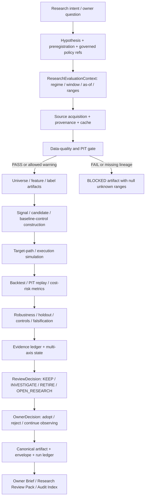

# 当前研究策略执行链路、计算逻辑与优化边界

最后更新：2026-07-12

项目级 AI market regime：`ai_after_chatgpt`，起点 `2022-12-01`

当前 QQQ/SGOV/TQQQ primary validated research window：`exact_three_asset_validated`，起点 `2021-02-22`

文档性质：ARCH-004F2 权威研究执行链路；研究治理与工程说明，不构成投资建议、策略晋升或交易授权。

## 1. 结论先行

当前研究策略应采用“固定周期观察、证据触发研究、预注册后验证、人工决定是否采用”的闭环，不应按固定周期自动改参数、换模型或改权重。

两条不可破坏的解释规则是：周期复核不等于自动调优；workflow PASS 不等于投资有效性 PASS。任何周期任务都不能自动调参、改权重或 promotion。

系统已经具备较完整的 DQ、PIT、backtest、robustness、evidence、promotion 和报告能力，但尚未全部收敛到单一 runtime framework：

- `ResearchEvaluationContext` 是新 investment-facing artifact 的 canonical 语义契约；
- `ExperimentSpec -> generic runner -> calculator/report plugin -> artifact/envelope/run ledger` 已由 growth-tilt closure 证明为可用 reference path；
- B0～B6 权重研究、tail-risk、dynamic-v3 等大量历史研究仍由 task-shaped module/CLI/report 串联，属于 legacy migration backlog；
- 当前最新 growth-tilt 结论是“没有 contract-complete、PIT-executable candidate”，不是“候选回测亏损”；
- 当前 Weight Research Program 是 `NEEDS_MORE_EVIDENCE`，B4 interaction 证据不足，B5/B6 和 untouched holdout 未解锁；
- 因此当前合理动作是补齐 baseline capability、PIT lineage 和预注册 contract，而不是继续对旧候选做参数搜索。

## 2. 状态标记

| 标记 | 含义 |
|---|---|
| `CANONICAL` | 新链路必须使用的单一 contract/service |
| `REFERENCE` | 已通过 parity 验证、用于证明目标架构的真实切片 |
| `LEGACY` | 当前仍可用但待迁移的 task-shaped module/CLI/artifact 链 |
| `BLOCKED` | contract、数据、PIT、样本或 owner gate 未满足，禁止计算或晋升 |
| `PLANNED` | ARCH-004F/G/H 目标，不能描述为当前 runtime 已完成 |

## 3. 为什么这样设计

### 3.1 先冻结语义，再运行计算

同一项目同时存在 market regime、research window、requested range、actual coverage、effective signal range 和 evaluation range。如果只传一个 `start_date`，2022-12-01 的 AI regime 很容易被误当成所有策略的 primary research start。`ResearchEvaluationContext` 因此把这些概念拆开并做一致性验证。

### 3.2 研究失败、证据不足和工程失败必须分开

负收益可以是研究 `FAIL`；缺 PIT lineage、缺 baseline consumption、缺有效样本或缺冻结阈值应是 `BLOCKED`；closure artifact 成功生成只表示 workflow `PASS`，不表示策略有效。状态分开后，系统才不会用治理 PASS 代替投资证据 PASS。

### 3.3 信号、权重映射、风险控制和执行分层

若一个函数同时生成信号、分配权重、控制回撤和计算交易成本，结果变差时无法定位原因。当前权重研究采用 B0～B6 消融，把 static baseline、execution control、fast risk scaler、slow relative tilt、interaction、confidence 和 regime value 分开验证。

### 3.4 周期复核只负责发现问题

固定 cadence 能避免长期不复盘，但也会诱发“到期就优化”。因此 cadence 只生成 Observation、EvidenceSnapshot 和 ReviewDecision；任何策略变化必须另建、预注册并验证。

## 4. End-to-end 研究链路



任何从 `E`、`J` 或 `K` 进入 BLOCKED 的路径都不得用默认值补出可比较指标，也不得继续 promotion。

## 5. 逐环节输入、输出与计算逻辑

后续每个正式研究 run 都应能按下表回答“为什么运行、消费了什么、计算了什么、产出了什么、为什么停下或继续”。某个 domain 暂无统一 canonical artifact 时，应标记 `LEGACY` 或 `PLANNED`，不能用报告文字假装链路已经统一。

| # | 环节与设计理由 | 必需输入 | 核心计算/判断 | 固定输出 | Fail-closed 条件 | 后续优化入口 |
|---:|---|---|---|---|---|---|
| 1 | Intent：先把主观问题改写为可证伪问题 | owner question、现状/负结果、baseline capability | 拆 hypothesis、candidate delta、success/kill criteria | task + requirement/protocol | 问题不可证伪、无 owner/acceptance | failure taxonomy、问题模板 |
| 2 | Preregistration：防止看结果后挑规则 | hypothesis、window、metric、threshold/cost policy | 冻结 selection checksum、版本与 result visibility | `ExperimentSpec`/protocol/policy refs | 结果已可见、阈值无治理依据 | immutable registry、single-access holdout ledger |
| 3 | Evaluation context：消除窗口/时点歧义 | regime/window registry、requested/as-of、calendar | 解析 configured/requested/actual/effective/evaluation ranges | `research_evaluation_context.v1` | registry conflict、range 越界、unknown 被默认值填充 | 历史 artifact context migration |
| 4 | Source/provenance：证明数据从哪里来 | provider、endpoint、params、download event、cache | schema/row/checksum/manifest linkage | cache + download/provenance manifest | source/available time 或 checksum 不可证明 | provider adapter、forward archive |
| 5 | DQ/PIT：先证明输入可用且当时可见 | cache、universe、as-of、manifest、PIT time | completeness/freshness/duplicate/outlier + `available_time <= decision_time` | DQ report + PIT coverage/blocker | DQ FAIL、future visibility、lineage missing | common DQ service、PIT coverage repair |
| 6 | Dataset：把 raw 输入变为可复现研究样本 | passed context/DQ、universe、feature/label spec | point-in-time join、missing/coverage classification | universe/feature/label artifact | label leakage、unknown 当 0、coverage 不足 | typed feature/label schema、feature graph |
| 7 | Signal/candidate：只表达研究假设增量 | baseline capability、features、candidate spec | score/state/confidence 或 typed mutation delta | signal/candidate artifact | baseline 未真实消费、candidate delta 含糊 | capability graph、orthogonal generator |
| 8 | Allocation/execution：把信号和交易机制分开 | signal、baseline weights、constraints、cost/execution policy | weight mapping、shrinkage、deadband、turnover cap、next-time execution | target path + trade/turnover/cost path | official/production 权重被写入、约束越界 | allocator contract、cost policy unification |
| 9 | Backtest/metrics：重放真实可执行路径 | PIT dataset、target/trade path、benchmark | equity/return/drawdown/risk/cost metrics | backtest/replay artifact | same-day lookahead、actual range 缺失、DQ lineage断裂 | common engine、metric semantic parity |
| 10 | Robustness/falsification：验证不是单窗偶然 | primary result、controls、stress、holdout | ablation、walk-forward、LOO regime、bootstrap、cost/lag stress | robustness/holdout evidence | holdout污染、control不对齐、证据不完整 | standardized control library |
| 11 | Evidence/decision：区分工程成功和投资有效 | 所有上游 artifacts、threshold registry | 多轴状态、promotion blockers、KEEP/INVESTIGATE/RETIRE/OPEN_RESEARCH | evidence ledger + ReviewDecision | 单一PASS覆盖多轴状态、缺证据自动晋升 | canonical evidence/state service |
| 12 | Report/lifecycle：只读展示并留下下一触发 | canonical artifact/envelope、run ledger、decision | 读模型、分层摘要、freshness/lineage link | Owner Brief/Research Pack/Audit Index | 报告重算指标、缺source link、过期仍声称current | 三层报告、自动freshness与定期复盘 |

“后续优化入口”只产生 observation 或新的 preregistration，不得在同一个已经看到结果的 run 内直接修改参数并重跑。若要优化第 7～10 环节，必须回到第 1～2 环节建立新的 versioned hypothesis；若只是数据、契约或报告修复，则保留原 hypothesis 和 selection checksum，并在 lineage 中记录 repair 原因。

### 5.1 Research intent 与 preregistration

| 字段 | 当前约束 |
|---|---|
| Purpose | 把“想优化什么”改写成可证伪问题，先定义 baseline、candidate delta、指标、窗口、成本和 kill criteria |
| Inputs | owner question、既有 negative-result ledger、failure taxonomy、baseline capability、最新 review decision |
| Calculation | 不做绩效计算；检查 hypothesis 是否正交、baseline capability 是否真实存在、selection rule 是否在结果可见前冻结 |
| Outputs | requirement/task row、protocol/spec、policy/threshold refs、owner、version、status、review/expiry condition |
| Failure | 缺 baseline consumption、阈值未版本化、结果可见后补 selection rule、candidate delta 单位不明 -> `BLOCKED` |
| Current implementation | `config/research/research_governance_policy.yaml`、protocols、threshold registry；generic `ExperimentSpec` 为 `REFERENCE`，大量历史研究仍为 `LEGACY` |

为什么：先冻结问题和判定标准，才能防止看完结果再换阈值、挑窗口或改 candidate 定义。

### 5.2 ResearchEvaluationContext

`CANONICAL` contract：`src/ai_trading_system/contracts/research_context.py`。

输入：

- market regime spec：anchor、start、id；
- research window spec：id、start、role、evidence role、caveats；
- requested/actual/effective/evaluation ranges；
- `as_of`、trading calendar、per-input coverage；
- DQ contract 与 policy refs。

输出：`research_evaluation_context.v1` 和 deterministic `research_evaluation_context_id`。

关键校验：

- declared regime/window start 必须与 registry 一致；
- actual 必须被 requested 包含；effective/evaluation 不能超出实际覆盖；
- sensitivity/legacy/metadata window 必须携带对应 evidence role 和 caveat；
- DQ `as_of` 必须等于 context `as_of`；
- complete context 必须 DQ passed；blocked context 保持未知 range 为 null，不能复制 requested range 伪造覆盖。

### 5.3 Window 语义

| 概念 | 当前值/用途 | 不能推出 |
|---|---|---|
| `ai_after_chatgpt` market regime | 2022-12-01 起；AI 周期归因与 generic ETF backtest default | 不是所有策略 primary research start |
| `exact_three_asset_validated` | 2021-02-22 起；QQQ/SGOV/TQQQ primary decision evidence | 不是 project-wide 所有资产的统一起点 |
| `legacy_research_window_2022_12` | 2022-12-01 起；legacy/AI comparison | 不能单独支持新 leaderboard/promotion |
| `exact_three_asset_primary_only_extension` | 2020-05-28 起；带 SGOV secondary-source gap 的 sensitivity | 不能无 caveat 进入 primary leaderboard |
| `requested_sgov_inception_range` | requested 2020-05-26；portfolio actual start 2020-05-28 | 不能计算 2020-05-26/27 组合收益 |

`config/etf_portfolio/backtest.yaml` 的 2022-12-01 是 generic ETF backtest regime default；使用 QQQ/SGOV/TQQQ primary research evidence 时，caller 必须显式解析 research-window policy，不能依赖该默认值。

任何 window-facing artifact 至少应分开披露：

| 字段 | 谁决定 | 含义 | 当前审计能力 |
|---|---|---|---|
| `market_regime_id/start` | `config/market_regimes.yaml` | 项目归因口径；`ai_after_chatgpt`从2022-12-01开始 | policy/context校验，不由实际数据起点反推 |
| `research_window_id/start/role` | research-window registry/policy | 某策略证据为何可使用2021或2020数据 | canonical context可校验；历史artifact覆盖尚不完整 |
| `configured_backtest_start` | 运行policy/config | runner未显式覆盖时的配置起点 | Dynamic-v3 Window Audit可提取 |
| `requested_start/end` | 本次run/spec；window-audit CLI的`--as-of/--end` | 本次要求评估的区间；这里`--as-of`是requested start，不是报告观察时点 | Dynamic-v3 Window Audit可提取/覆盖 |
| `actual_evaluation_start/end` | 实际可计算path | 真正进入绩效计算的区间 | missing、倒序、晚开始、早结束会fail closed或blocking |
| `effective_training/validation` | model/replay split | 训练和验证实际使用范围 | 字段已预留，但并非所有legacy artifact齐全 |

特别注意：`actual_evaluation_start=2021-02-22`与`configured_backtest_start=2022-12-01`可以同时为真。前者说明artifact实际包含更早证据，后者说明AI-cycle默认配置仍是2022-12-01；只有`research_window_id/role/caveats`才能说明更早数据是QQQ/SGOV/TQQQ primary evidence、warm-up、stress、sensitivity还是regime comparison。当前Dynamic-v3 Window Audit不会自动验证这个evidence role，因此它只能发现range缺失/截短，不能单独证明2021证据的解释合法性。

### 5.4 数据、provenance 与 DQ/PIT gate

| 项目 | 输入 | 输出/计算 |
|---|---|---|
| Source/cache | provider endpoint、params、download time、row count、checksum | raw/normalized cache + download manifest |
| DQ | prices、rates、required universe、as-of | `validate_data_cache` 检查 schema、freshness、duplicates、coverage、suspicious values，输出 `DataQualityReport` |
| PIT | source/available/event time、snapshot manifest | 按 decision time 过滤可见记录，输出 coverage/readiness；未来可见信息或无法证明 available time 时 fail closed |
| Context attach | DQ report path/hash/status + window/regime policy refs | complete 或 blocked `ResearchEvaluationContext` |

所有从 cached market/macro data 生成 feature、score、backtest 或 report 的路径必须先走 `aits validate-data` 或同一代码路径。治理-only closure 若不读取 fresh cache，可声明 `data_quality_required=false`，但必须明确 `NOT_APPLICABLE`，不能伪造 DQ PASS。

### 5.5 Universe、feature、label 与 signal

目标 contract：feature/label 都必须携带 symbol、event/available/decision time、source lineage、window/context id 和 missing reason。

当前仍有多个 domain-specific generator，尚无单一通用 feature graph。这是 `LEGACY` 事实，不在本文伪装为已统一。新研究必须至少保证：

- feature 只使用 decision time 前可见数据；
- label 与 feature 的时间边界独立；
- 缺字段产生 coverage/blocker，不用零值代表未知；
- signal 输出 score/state/confidence/diagnostics，不直接写 official target weights。

### 5.6 当前权重研究的具体计算

下列 B0～B6 是 research-only 结构，不是 production allocator。

#### B0 static baseline

来源：`config/etf_portfolio/assets.yaml` 的 `default_weight`。

当前 B000 research baseline：SPY 0.30、QQQ 0.40、SMH 0.15、SOXX 0、CASH 0.15。它是 control，不是 official target weights。

#### B1 execution control

输入：current weights、target weights、execution policy、total cost bps。

计算：

```text
drift_i = target_weight_i - current_weight_i
desired_turnover = sum(abs(drift_i))
estimated_cost = desired_turnover * total_cost_bps / 10,000
benefit_proxy = desired_turnover
benefit_cost_ratio = benefit_proxy / estimated_cost
```

若最大绝对 drift 小于 deadband，或 benefit/cost 低于阈值，则不交易；若 desired turnover 超过日上限，按 `max_daily_turnover / desired_turnover` 缩放 delta。执行后：

```text
gross_return = sum(post_trade_weight_i * asset_return_i)
transaction_cost = turnover * total_cost_bps / 10,000
strategy_return = gross_return - transaction_cost
```

当前结论：B1 是 optional execution wrapper；多数窗口降低 turnover/cost，但不是 universal default，部分趋势/震荡/recovery 窗口存在 return 或 drawdown 代价。

#### B2 fast asymmetric risk scaler

输入 feature：`realized_vol_20d`、`drawdown_63d`、`above_ma_200`。

单资产 risk score：

```text
score = 100
        - linear_penalty(realized_vol_20d; 0.20 -> 0.60, max 30)
        - drawdown_penalty(drawdown_63d; -0.05 -> -0.20, max 30)
        - (20 if below MA200 else 0)
```

portfolio risk score 是按 baseline active weight 对可用资产分数加权；confidence 是 covered weight / total active weight。State gate：`<=45 RISK_OFF`、`<=65 ELEVATED_RISK`、否则 `NORMAL`。对应 exposure scaler 为 0.55、0.85、1.00；只缩放 total equity exposure，剩余进入 CASH，不改变 active assets 的相对比例。

Coverage 最低值小于 0.80 时不能视为 READY。上述阈值来自预注册 pilot policy `weight_research_modules_v0_1`，不是证据已充分校准的 production 参数。

#### B3 slow relative tilt

输入：QQQ 的 `rs_vs_spy_60d`，SMH 的 `rs_vs_qqq_60d`/`rs_vs_spy_60d`，SPY 为 neutral anchor。

每个 return feature 线性映射：`<=-0.10 -> 0`，`>=0.10 -> 100`，中间线性插值；多字段取平均。Score `>=60` 为 overweight、`<=40` 为 underweight、否则 neutral。

```text
offset = clip((score - 50) / 50, -1, 1)
tilt_multiplier = 1 + offset * 0.25
raw_weight_i = baseline_weight_i * tilt_multiplier_i
```

随后按 baseline equity total 重新归一化，因此只做 active sleeve 内相对倾斜，保留总 equity exposure 和 CASH 水平。Coverage 最低值小于 0.80 时不 READY。

#### B4 interaction

B4 先取 B2 给出的 total equity exposure，再按 B3 active weights 的相对 share 分配：

```text
b2_equity = 1 - b2_cash
relative_share_i = b3_weight_i / sum(b3_active_weights)
b4_weight_i = relative_share_i * b2_equity
b4_cash = 1 - sum(b4_active_weights)
```

当前 mini-backfill 的 partial utility 仅作诊断：

```text
utility = total_return - 0.75 * abs(max_drawdown) - 0.25 * turnover
```

它缺 tracking error、worst-window、dispersion、cost drag、stress 和 signal-robustness penalties，因此不能当完整 selection score。当前 B4 在 6/7 diagnostic windows 与 B3 重合、7/7 cost 更差，interaction 被判为 redundant/inconclusive，不能解锁 B5。

#### B5/B6

- B5 confidence shrinkage：因 core combo evidence inconclusive 而 `BLOCKED`；没有稳定 canonical 公式可作为当前已采用逻辑。
- B6 regime incremental value：缺 pre-regime combo/完整证据而 `BLOCKED`。

### 5.7 Backtest、cost 与 metrics

Backtest 必须按 signal time -> next execution time -> return period 排序，不能同日看结果后成交。核心指标：

```text
equity_t = equity_(t-1) * (1 + strategy_return_t)
total_return = product(1 + r_t) - 1
max_drawdown = min(equity_t / running_peak_t - 1)
CAGR = (1 + total_return) ** (1 / years) - 1
Sharpe = mean(excess_return) / std(return) * sqrt(periods_per_year)
Sortino = mean(excess_return) / downside_deviation * sqrt(periods_per_year)
Calmar = CAGR / abs(max_drawdown)
turnover = sum(abs(period_turnover))
```

Transaction cost 至少包含 commission、spread、slippage、market impact、sell tax、FX 和适用的 delay term；不同 runner 当前仍有 contract 差异，必须以具体 policy/version 为准，不能跨报告直接比较未对齐的 cost proxy。

#### Weight-path 证据链

Backtest summary 只能说明最终指标，不能证明每天实际持有什么、约束何时生效或 metadata 是否与路径一致。Dynamic-v3 real evaluator 因此把候选路径拆成六类输入证据：

| 文件 | 输入 | 计算/校验 | 输出语义 |
|---|---|---|---|
| `daily_weights.csv` | 每个 signal date 的 target weights、candidate id | 日期可解析；`(date,symbol,candidate_id)`唯一；weight为有限数且在`[0,1]`；每个日期权重和在浮点容差内等于1 | 可重放的逐日目标权重，不是 official target weights |
| `rebalance_events.json` | rebalance decision、turnover、changed symbols | 顶层`events`必须为list；逐event校验date、event type、candidate id和非负turnover | 何时以及为什么发生再平衡 |
| `constraint_events.json` | constraint diagnostics/reason codes | 校验date、constraint type、reason code、candidate id | 哪类约束介入；当前before/after/limit细节可能缺失 |
| `rescue_events.json` | drawdown/risk reason codes与risk score | 校验date、trigger、candidate id | rescue触发摘要；当前post-rescue逐资产权重可能缺失 |
| `turnover_by_rebalance.csv` | trade deltas、turnover、gross buy/sell | 校验schema、date、candidate id和有限非负turnover | 成本和执行审计的逐期换手输入 |
| `weight_path_metadata.json` | exporter声明的range/count/detail/flags | count、start/end、symbol count、evaluation/candidate id和所有flags必须与上述文件重新计算结果一致 | 只是一份声明和索引，不能单独证明完整度 |

`weight-path validate/report`共用同一只读inspection path，并分别披露`declared_attribution_completeness`与`observed_attribution_completeness`：

```text
core files/content/parity invalid -> observed INCOMPLETE -> validation FAIL
core valid + detail=minimal or missing_fields non-empty -> observed PARTIAL -> validation may PASS
core valid + detail=complete + required detail columns逐行可解析 + missing_fields empty + all file flags consistent -> observed COMPLETE
declared != observed -> validation FAIL
```

当前 exporter 的真实结果是`minimal/PARTIAL`：已能解释daily target path、events和turnover，但缺`pre_constraint_weight`、`post_rescue_weight`、`constraint_limit`。后续优化空间不是把metadata改成`COMPLETE`，而是让真实计算链输出这些中间状态、增加constraint/rescue前后权重守恒测试、用独立replay核对return/cost，并在真实20-candidate run中验证不同参数的完整daily path差异。任何优化都必须保持evaluation目录唯一、source artifact不可变和no-promotion/no-production边界。

#### Candidate attribution 证据链

Candidate attribution回答“这个候选相对可复核reference具体改变了什么、这些差异来自哪份路径”，而不是重复输出candidate score。阶段边界是显式的：先由`candidate report`命令冻结candidate result视图，再由`candidate attribution`只读消费；缺candidate report时fail closed，不得在下游隐式补建或改写上游。

| 输入 | 归属/校验 | 用途 |
|---|---|---|
| `candidate_results.jsonl` | 路径必须属于`<sweep_id>`；checksum冻结；candidate id唯一命中 | 证明candidate、parameters、metrics source与real artifact link来自指定sweep |
| `candidate_report.json` | 路径必须为`<sweep>/candidates/<candidate>/`；id、sweep、parameters与result一致；checksum冻结 | attribution的显式上游视图 |
| real evaluation JSON | 必须位于`<sweep>/real_evaluation/<candidate>/`；report id与candidate metrics一致 | aggregate constraint/drawdown/turnover/static-gap分析与comparison paths |
| G2.4Q weight-path inspection | 从六类文件内容重新推导observed completeness，不相信metadata自述 | 决定daily path是否可用及其limitations |
| `static_base_candidate` daily path | 与candidate来自同一real report并具有真实`target_weights_json` | 当前可审计的latest-weight reference |

Latest weight delta按最后一个可验证signal date计算：

```text
candidate_weight(symbol, t_last) = validated daily_weights.csv 的最后日期权重
reference_weight(symbol, t_last) = 同一 real report 的 static_base_candidate 最后日期 target weight
delta(symbol) = candidate_weight - reference_weight
```

输出为`weight_path_delta.csv`、五类component attribution JSON、Markdown和manifest。Manifest记录source paths/checksums、declared/observed weight status、limitations、component status和output checksums；validator重新读取source并复算delta、lineage、status与checksum，而不是验证producer自己的声明。状态规则：source或weight core缺失、delta无法形成=`INCOMPLETE`；source和delta有效但constraint/rescue/drawdown/turnover/gap仍混合path summary与aggregate proxy=`PARTIAL`；当前`path_and_aggregate_v2`不得输出`COMPLETE`。

为什么reference不是`dynamic_v0_4`：当前real artifact只有v0.4 summary metrics，没有导出v0.4 daily weights；从summary反推权重会伪造证据。后续优化入口是先扩展exporter提供同窗v0.4 daily path，再新增candidate-vs-v0.4 delta；同时把五类component从aggregate proxy升级到逐event、逐drawdown-window和逐turnover reconciliation。升级前必须保持`PARTIAL`，不能仅修改status字段。

### 5.8 Parameter injection audit

参数进入effective policy不等于已经影响回测结果，而“不同候选总体上存在hash差异”也不能证明每个参数都有效。Dynamic-v3 Injection Audit因此采用one-factor-at-a-time matched-pair设计：

```text
base(parameters_1..7)
  + pair_1(only rescue_intensity changed)
  + pair_2(only smooth_window_days changed)
  + ...
  + pair_7(only drawdown_guard changed)
  + optional broader grid candidates
```

输入是reviewed sweep config、governed search-space version、明确的as-of/end、price/rate cache；real evaluator前仍必须通过cached DQ/PIT context。每个参数只比较“其他required parameters完全相同”的pair：

| Pair evidence | 结论 |
|---|---|
| 没有matched pair | `INSUFFICIENT_MATCHED_PAIR_EVIDENCE` |
| effective real/rescue policy hash未变化 | `NOT_CONSUMED` |
| policy hash变化，但metric与latest-weight hash均未变化 | `NO_OBSERVED_EFFECT` |
| policy hash变化，且metric或latest-weight hash变化 | `EFFECTIVE` |

固定输出包括normalized config、candidate/results JSONL、candidate parameter matrix、weight/metric diff、独立`parameter_effect_summary.json`和Markdown。缺任何required parameter pair时audit是`INCOMPLETE`，`validate-injection-audit`必须FAIL；配置中的`PARAMETER_EFFECT_FIELDS`只说明预期注入位置，不能单独证明实际消费。当前weight effect仍基于real-evaluation latest weight hash，daily path证据另标为incomplete；后续优化入口是完整daily weight/path attribution与多随机种子重复，而不是放宽matched-pair gate。

### 5.9 Robustness、holdout 与 falsification

必需检查包括：simple benchmark、fixed exposure、rebalance interval、module subset、same-turnover random、same-exposure random、no-gate model target、volatility target、cost stress、lag sensitivity、purged/walk-forward、leave-one-regime-out、block bootstrap 和 worst-window。

Holdout 在 selection rule、window、metric 和 threshold 冻结前不得访问；访问后不能反复用于调参。E0/E1/E2 evidence 只支持 test/diagnostic/component replay，不支持 promotion；promotion 至少要求 owner-reviewed E3 full-advisory PIT replay 和 E4 forward paper-shadow。

#### Dynamic-v3 true walk-forward selection

设计目的不是把全周期leaderboard重复切成多个文件，而是防止“用全样本选出赢家，再把赢家的全样本指标贴到test window”造成未来信息泄漏。G2.4S将source sweep内冻结的candidate universe、normalized config和window policy作为唯一输入；当前profile config只用于核对evaluator、candidate budget和当前policy drift，历史sweep始终按其自身normalized config解释，不能被今天的配置静默重写。

| 输入 | 必须证明 | 用途 |
|---|---|---|
| `sweep_manifest.json` | sweep id、evaluator、profile（若有）与目录一致；checksum冻结 | 运行身份和evaluator边界 |
| `sweep_config.normalized.yaml` | source run冻结版本；checksum冻结 | 生成train/test windows、hard constraints和scoring weights |
| `candidate_results.jsonl` | completed candidate id唯一；checksum冻结；不得按全周期gate预先删掉train候选 | candidate universe、parameters、real artifact link |
| profile registry +当前profile config | evaluator、candidate budget、policy projection显式比较 | 识别current-policy drift；不改写历史source policy |
| 每个candidate的real evaluation | 必须属于`<sweep>/real_evaluation/<candidate>/`，report/sweep/candidate id一致，checksum冻结 | `dynamic_candidate`和`static_base_candidate` daily paths |

每个window独立切片，日期键使用`signal_date`且dynamic/static dates必须一致：

```text
R_dynamic(w) = product(1 + strategy_return_dynamic,t) - 1
R_static(w)  = product(1 + strategy_return_static,t) - 1
dynamic_vs_static_gap(w) = R_dynamic(w) - R_static(w)
MDD(w) = min_t(equity_t / running_peak_t - 1)
drawdown_degradation_pp(w) = abs(MDD_dynamic) - abs(MDD_static)
turnover(w) = sum(turnover_dynamic,t)
constraint_hit_rate(w) = count(days with non-empty constraints_applied) / row_count
```

Train leaderboard只使用该train window重算的path metrics和冻结scoring weights；分数相同时按candidate id稳定排序，不允许candidate/date hash jitter。未导出的window false-risk-off和window robustness不会按0获得正向分：对应score contribution强制移除，gate至少`REVIEW_REQUIRED`。每个window只允许从`train_gate != reject`且`train_score`非空的候选中选择；全体reject时明确`NO_ELIGIBLE_TRAIN_CANDIDATE`，不得按candidate id挑一个占位赢家，也不得生成test result。成功选择后才从同一candidate的test slice独立重算test metrics；全周期gate不得预先排除candidate，也不得复制全周期metrics到test。

输出为`wf_windows.json`、`train_window_leaderboards.jsonl`、`selected_candidates.jsonl`、`test_window_results.jsonl`、Markdown和manifest。Manifest记录profile binding checks、source/output checksums、每个real artifact path/checksum、evidence method/completeness和limitations；validator重新读取所有source并复算windows、ranking、selection、test、summary、status和Markdown。Tiny fixture固定`PROXY_ONLY/INCOMPLETE/not_for_investment_decision=true`；real path完整时当前为`PATH_DERIVED_PARTIAL/REVIEW_REQUIRED`，因为path slicing尚未逐window重跑evaluator，且缺window false-risk-off/robustness。后续优化空间是导出window gate完整字段、实现逐fold evaluator rerun与purged/embargo policy、增加cost/lag/stress variants；这些完成前不得输出最终true walk-forward `PASS`。

#### TRADING-096/097 兼容验证入口

`walk-forward run`与`robustness run`是早期研究入口，CLI路径继续兼容，但G2.4T不再维护第二套计算公式：TRADING-096直接复用上节同一`real_daily_path_window_v1`切片函数，对source leaderboard的top-N每个candidate分别计算train/test path metrics；它与TRADING-106的区别是“不在train leaderboard中跨candidate选择赢家”，而不是允许复制全周期指标。

| 环节 | 输入 | 计算与校验 | 输出 | 当前结论上限 |
|---|---|---|---|---|
| TRADING-096 top-N window evidence | source `sweep_manifest`、normalized config、leaderboard、candidate results、每个candidate的dynamic/static daily paths | source目录/sweep/evaluator/candidate/report id归属；逐window compound return、MDD、turnover、constraint-hit与受限gate/score；禁止hash drift | windows、每candidate-window train/test rows、candidate summary、OOS summary、Markdown、manifest | real path完整仍为`PATH_DERIVED_PARTIAL/REVIEW_REQUIRED`；tiny为`PROXY_ONLY/INCOMPLETE` |
| TRADING-097 neighbor sensitivity | 同sweep candidate results及每个neighbor real artifact | 只接受completed、real metrics source、路径属于`<sweep>/real_evaluation/<neighbor>`且sweep/candidate/report id一致的相邻单轴candidate；score delta仍是full-period aggregate | `sensitivity_matrix.csv`与neighbor path/report/checksum inventory | 全neighbor有效可支持“邻域有真实结果”，不能证明fold-specific stability |
| TRADING-097 stress diagnosis | candidate real aggregate analyses、daily path summary、reviewed hard constraint | 明确区分aggregate policy check、aggregate analysis proxy与missing dedicated bucket；不再把aggregate analysis的PASS改写为stress bucket PASS | `stress_bucket_results.json` | 当前`AGGREGATE_OR_MISSING_STRESS_EVIDENCE`，不能形成robustness PASS |
| TRADING-097 regime diagnosis | real `comparison_daily_paths.dynamic_candidate` | 按`selected_regime`分组，计算row count和strategy return sum；“观察到”只表示coverage，不代表rank/gate稳定 | `regime_bucket_results.json` | 当前`PATH_DERIVED_REGIME_OBSERVATION_ONLY`，每个regime均`REVIEW_REQUIRED` |
| content-derived validation | 上述全部source与输出 | 重新生成windows/rows/summaries/sensitivity/stress/regime/diagnostics/Markdown并核对source/output checksums | validation checks | producer自报status、文件存在或同步修改checksum均不能绕过重算 |

设计原因是兼容历史命令不应等于兼容历史错误语义。旧TRADING-096曾把full-period metrics复制到40个window rows后加入stable-hash drift；旧TRADING-097曾把regime observation和aggregate stress analysis包装成`PASS`。这些artifact现在只证明历史workflow执行过，不能继续作为证据充足性依据。Shadow observation basis也只接受当前real、source identity PASS、非fixture的`PATH_DERIVED_PARTIAL` walk-forward和`PATH_AND_AGGREGATE_PARTIAL` robustness；旧manifest或tiny fixture不会形成complete basis。

后续优化顺序是：先让real evaluator导出逐window完整false-risk-off/robustness/cost/lag字段；再实现purged/embargo fold rerun和fold-specific real neighbors；随后定义有owner/version/rationale/validation的dedicated stress bucket与per-regime comparator/gate policy；最后才允许校准robustness PASS boundary。不能通过改状态名、把aggregate proxy重命名为bucket、或用观察行数替代稳定性统计来“优化”结论。

#### Shadow observation basis 登记与验证

TRADING-098把candidate report、walk-forward和robustness证据连接成observe-only登记记录。这里的“登记”是owner触发的治理动作，不是发现目录中有新文件后自动升级。

| 环节 | 输入 | 计算与校验 | 输出 | 优化边界 |
|---|---|---|---|---|
| register | `sweep_id`、`candidate_id`、candidate report；可选且必须成对的`walk_forward_id`/`robustness_id` | candidate report必须归属指定sweep/candidate且非reject；显式证据必须分别通过source-recomputing validator，walk-forward leaderboard包含candidate，两份manifest的source sweep/candidate归属一致，并满足当前usable contract | registry row：source ids、`observation_basis_status`、evaluator/metrics provenance、promotion observation floor；固定`observe_only` | 未给证据id只写`incomplete_observation_basis`；只给一个、证据失效或归属错误时fail closed；禁止按mtime隐式选择latest |
| list/report | registry row | 只读投影，不重新计算策略收益，不补写证据，不自动promotion | candidate list或JSON/Markdown shadow report | 报告中的eligibility必须以完整basis和观察期为前提；registry validation失败时不得把报告当promotion依据 |
| validate | registry、candidate report、显式source ids及其artifact目录 | 逐行重算candidate/sweep ownership、artifact validator状态、usable contract和期望basis status，并与登记字段比较；检查重复candidate与observe-only安全边界 | PASS/FAIL checks；无registry mutation | validator只能暴露stale/forged link，不得替换id、重登记或改状态 |

为什么必须显式给artifact id：文件修改时间不属于研究语义，也不能证明owner知道本次采用了哪一组证据；同一candidate可能同时存在历史、fixture、失败和新版本artifact。显式id把“谁选择了什么证据”固定在命令输入和registry lineage中，也使旧artifact在validator升级后能够被可靠识别为stale，而不是被静默替换。

当前结果：真实candidate `a72139edcaef7d22`已有通过当前validator的walk-forward `7b6db671cbd67468`和robustness `87b0fc81d6681368`，但runtime registry仍绑定旧artifact，因此当前registry validation为FAIL；系统不会自动迁移。后续优化空间包括把登记动作写入独立owner decision ledger、为证据组合生成不可变selection checksum、让shadow report直接引用最新validation artifact，以及在完整逐fold/专用stress证据可用后版本化提升usable contract。任何优化都不能自动enroll、promotion、写official weights或产生broker action。

#### Governance、研究索引与 artifact pointer 控制面

这三个环节只负责“规则是否有效、已有结果在哪里、latest引用是否健康”，不计算新的候选绩效。Governance输入reviewed parameter-governance与sweep config，validate检查policy/search-space约束，report物化只读治理摘要，diff只列出两版配置差异并要求人工复核。Research index-build扫描既有sweep和shadow registry生成可查询索引；query/compare/history只消费索引，不回读市场数据或重跑评估。Artifact latest/validate/stale只读pointer与retention policy；`repair-latest`是唯一pointer写入口，只能扫描canonical Dynamic-v3 artifact root并重建pointer，不能复制、覆盖或修改source artifact。

当前优化空间是给research index增加不可变source checksum和schema版本、让pointer repair记录选择排序与候选清单、把governance diff接入owner decision ledger。进入条件是保持CLI兼容、所有重建结果可由canonical source复算、缺失或歧义时fail closed；禁止把“latest pointer已修复”解释为研究证据更新、candidate晋升或生产状态变化。

#### Observation lifecycle 与 promotion review

Shadow monitor输入observe-only registry与`as_of`，只计算观察年龄、rebalance count、最新指标和是否达到“可进入人工promotion review”的最低观察条件；report/validate只读已有monitor artifact。Scheduled observe由daily scheduler触发，计算交易日/周度due条件、latest pointer健康度、stale状态，并可在due时运行observe-only monitor；它不运行sweep、walk-forward、robustness或promotion pack。Promotion review读取registry显示材料是否存在；promotion pack聚合candidate attribution、data provenance、window audit、walk-forward/robustness等既有证据，输出manual-review pack，validation只校验该pack，不产生production candidate。

后续优化空间是把monitor metrics改为独立forward observation ledger、让scheduled observe引用canonical periodic plan id、让promotion pack直接消费每项source validator artifact。任何优化都必须保持“到期检查不等于自动研究、review-ready不等于promotion、pack PASS不等于生产批准”，且不得写official weights或broker state。

#### Evidence readiness 链

Evidence summary从指定sweep汇总candidate证据完整度与是否可进入下一阶段；medium-real report/validate只总结或校验已有medium-real sweep；regime coverage读取指定sweep与标准ETF价格缓存，审计tech/semiconductor覆盖和AI bull-market overfit风险。Candidate interpretation把既有top candidates、weight path和限制转成人工可读材料；observe pool只把满足研究条件的候选写入独立observe-only artifact，不写shadow registry；overnight readiness根据medium-real完成/失败数与运行耗时估算判断是否具备运行更大研究的条件，但不会启动overnight sweep。

这些输出回答“证据和运行条件是否足够继续研究”，不回答“是否应晋升或交易”。优化入口包括统一各阶段的evidence completeness schema、给regime coverage增加PIT/context binding、让observe pool保存source validator checksum、用真实runtime ledger校准overnight耗时。任何ready/usable/observe-only状态都不得自动映射为promotion、production或broker动作。

#### Evidence governance 与研究决策更新

Research decision把medium-real结果转为研究建议；evidence diagnosis将阻塞项分类为hard failure、soft/manual-review blocker或warning；gate impact只模拟不同规则对observe candidate数量的影响，不改source sweep。Gate policy validate/report读取reviewed YAML，apply只能按policy允许范围调整soft blocker，data-quality、缺real artifact、缺daily path、high overfit等hard blocker必须保留。Candidate recovery只生成recovered observe-only artifact；observe-pool rebuild只写独立pool；decision update聚合diagnosis、impact和recovery形成新的go/no-go研究建议。

为什么分层：如果诊断、规则模拟、规则采用、候选恢复和owner decision混在同一函数中，系统会把“假设放宽门槛后的数量”误当成真实可用候选。优化空间是为policy apply增加owner decision id、冻结source checksums与policy version、让decision update消费每项validation artifact。任何`best_scenario`、`recovered`或`go`都不自动写shadow registry、promotion、production或broker state。

#### Candidate observation 链

Shortlist从observe pool按既有score/blocker选出人工复核集合；candidate cluster用parameter、daily weight path和metrics相似度识别重复候选并选择representatives；shadow shortlist把representatives组装成monitoring pack，但不写旧shadow registry或自动enroll。Monitor activation只建立observe-only monitoring状态，run按`as_of`生成daily/weekly观察摘要，report/validate只读或校验已有artifact。

该链分开的原因是“候选更少、更有代表性”不等于“策略更有效”，monitor active也不等于position advisory或production。优化空间是给cluster增加缺失path的显式距离状态、为shortlist selection冻结policy checksum、让monitor记录真实forward outcome与数据质量证据；所有状态变化仍需人工owner review，不得自动生成仓位或broker动作。

#### Position Advisory 链（TRADING-129 / G2.4AI）

Position Advisory位于“observe-only candidate”与“owner人工仓位复核”之间。设置这一独立层的原因是：candidate target weights回答“每个研究候选想持有什么”，consensus回答“候选是否一致”，snapshot delta回答“与owner提供的当前组合相差多少”；三者都不回答“是否已批准调仓”。如果把它们与owner decision或execution合并，`small_adjustment`很容易被误读为交易指令。

| 环节 | 输入 | 计算/校验逻辑 | 输出 | 阻断条件 |
|---|---|---|---|---|
| Source gate | 显式`shadow_shortlist_id/root`、`position_advisory_v1.yaml`、可选manual portfolio snapshot | 先调用同一`validate_shadow_shortlist_artifact`；读shortlist manifest/candidates；解析并验证policy metadata/execution safety与snapshot schema | source validation status | shadow shortlist非PASS、config非advisory-only、snapshot非法时在写件前fail closed |
| Candidate target | 每个shadow candidate的daily weight path | 取可读path中最大date作为`as_of`，读取该日symbol weights；每个candidate都必须`COMPLETE`、candidate id唯一、source file存在，权重必须有限且位于[0,1]并在weight-path schema tolerance内加总为1 | `candidate_target_weights.jsonl` | 任一candidate缺path、id重复、空/非法/不守恒weights或source file不存在即阻断，不用空值继续生成“建议” |
| Consensus | 全部candidate target rows、policy中agreement/dispersion阈值 | 按symbol计算mean、median、min、max；`dispersion=max-min`；`agreement=count(abs(w_i-median) <= max_symbol_dispersion)/candidate_count`；agreement低于阈值或dispersion超限则`DISAGREEMENT_REVIEW_REQUIRED` | `consensus_target_weights.csv`、consensus status | 无target rows为`MISSING_TARGET_WEIGHTS`；高分歧不阻断产生复核材料，但必须降为manual review |
| Snapshot delta | owner manual snapshot的current weights、candidate targets、advisory limits | `delta_i=target_i-current_i`；`total_abs=sum(abs(delta_i))`；`max_symbol=max(abs(delta_i))`。全部delta低于`min_trade_threshold`为`no_trade`；total或single-symbol超限为`requires_manual_review`；否则`within_limits` | 有snapshot时写`candidate_position_deltas.jsonl`；无snapshot时为空 | snapshot未提供不是错误，但必须切换到`TARGET_ONLY`，不得暗示当前仓位delta |
| Action classification | target/delta rows、snapshot presence、consensus status、reviewed limits | 优先级：无snapshot→`TARGET_ONLY/monitor`；任一delta超限→`manual_review`；全部低于min trade→`no_trade`；候选高分歧→`manual_review`；否则`small_adjustment`。有snapshot也始终为`READY_WITH_MANUAL_REVIEW` | `advisory_actions.json`、manifest derived fields、Markdown | 任何action都固定`owner_approval_required=true`、`broker_action_allowed=false`；不存在自动approval/execution分支 |
| Lineage + validation | 上述sources和六类position-advisory files | Run冻结shortlist manifest/candidates、config、可选snapshot及每个candidate weight path的path/checksum，并记录output checksums；validator重读source，重算targets/consensus/deltas/actions/manifest/report | `position_advisory_manifest.json`、validation checks、latest pointer | source drift、path/id不属于指定shortlist、output内容或checksum篡改均FAIL |

这些阈值不是代码中的临时数字，而是`config/etf_portfolio/dynamic_v3_rescue/position_advisory_v1.yaml`中带owner、version、status、rationale、intended effect、validation evidence和review condition的pilot policy。当前结果是：无snapshot只能生成candidate target/consensus的`TARGET_ONLY`观察材料；有合法snapshot可生成delta与review suggestion，但仍要进入独立owner review链。两种模式都固定`official_target_weights_generated=false`、`portfolio_mutated=false`、`order_ticket_generated=false`、`production_effect=none`和no broker。

后续优化顺序：

1. 先增加跨candidate的共同`as_of`与trading-calendar cutoff，避免将不同日期的latest weights直接做consensus；
2. 再增加snapshot freshness/currency/source lineage、candidate target权重守恒与缺失symbol policy，并把config/snapshot/schema升级绑定canonical `ArtifactEnvelope`；
3. 在有forward outcome和cost/slippage证据后，才能预注册校准agreement、dispersion、min-trade和adjustment limits；不能用本次已看到的advisory结果就地调阈值；
4. 最后再评估candidate-quality-weighted consensus、稳健中心、置信区间与上一期delta。任何方法变更必须新建versioned hypothesis/policy和out-of-sample验证，不得扩展为自动调仓。

#### Daily Position Advisory 链（TRADING-133 / G2.4AJ）

Daily Position Advisory不是重新做一次策略研究，而是把某个显式shadow monitor run在指定`as_of`的candidate targets转成当日人工复核材料。它与TRADING-129的区别是：TRADING-129从shortlist的latest weight path形成一次性readiness advisory；TRADING-133只消费已生成的daily monitor targets，并可用同链consensus-drift artifact做交叉印证。设置独立层是为了不把“今日观察变化”混成新candidate selection、owner approval或交易执行。

| 环节 | 输入 | 计算/校验逻辑 | 输出 | Fail-closed 条件 |
|---|---|---|---|---|
| Monitor gate | 显式`shadow_monitor_run_id/root` | 先运行同一monitor validator；manifest/summary/run id必须一致；每个daily row的`as_of`必须等于monitor `as_of`；candidate id唯一，weights有限、在[0,1]且sum=1 | validated monitor source status、daily targets | validator非PASS、空/重复candidate、日期串链、权重越界/不守恒时在任何output前阻断 |
| Daily consensus | monitor target rows、reviewed consensus policy | 按symbol计算mean/median/min/max/dispersion；`agreement=count(abs(w_i-median) <= policy.max_symbol_dispersion)/candidate_count`，不再用observed dispersion自身作tolerance；agreement低于policy threshold或dispersion超限则`DISAGREEMENT_REVIEW_REQUIRED` | `daily_consensus_weights.csv`、consensus status | 无有效target为`INSUFFICIENT_DATA`；任何非`CONSENSUS`都强制manual review，不得继续small-adjustment suggestion |
| Drift corroboration | 可选`consensus_drift` artifact root | 只考虑monitor id一致、`generated_at <= daily generated_at`、as-of一致、drift config当前checksum与daily config一致的artifact；按`generated_at, drift_id`选最新，不使用filesystem mtime；selected artifact validator必须PASS，summary disagreement必须等于daily从monitor/config重算的status | selected drift id、`CORROBORATED`/`NOT_AVAILABLE_RECOMPUTED`、drift inventory | 最新同monitor/config/as-of artifact验证失败或status不一致时阻断；future、错链、错config artifact不得被选中 |
| Snapshot delta | 可选manual snapshot、monitor `as_of`、advisory limits | 先使用strict snapshot normalization；`snapshot.as_of <= monitor.as_of`；然后按candidate计算`target-current`、total absolute adjustment、max symbol adjustment与`no_trade/within_limits/requires_manual_review` | `daily_position_deltas.jsonl` | future snapshot、schema/weight/value/broker flag失败即阻断；无snapshot不伪造delta，mode必须`TARGET_ONLY` |
| Action priority | consensus/drift status、snapshot ownership、delta limits | 优先级：任何consensus非`CONSENSUS`或drift为high/moderate/insufficient→`manual_review`；无snapshot→`monitor`；snapshot未owner-reviewed或delta超限→`manual_review`；全部低于min-trade→`no_trade`；否则`small_adjustment_review_only` | `daily_advisory_actions.json`、manifest、Markdown、Reader Brief section | 任何输出都固定manual review/owner approval/no broker；`small_adjustment_review_only`不是调仓命令 |
| Lineage validation | monitor六类files、config、可选snapshot、可选selected drift五类files、daily outputs | Run冻结source paths/checksums、drift inventory、policy id/version和output checksums；validator在原`generated_at` cutoff下重做monitor gate、drift selection、targets/consensus/deltas/actions/manifest/report/Reader Brief | `daily_advisory_manifest.json`、validation checks、latest pointer | source drift、future snapshot、selection改变、计算结果或展示文本篡改、output checksum不一致均FAIL |

当前结果上限是“指定monitor在指定日期的人工复核材料已完整产生且可从source重算”，不是策略当日有效、owner已批准、paper/real portfolio已改变或order已生成。所有artifact固定`official_target_weights_generated=false`、`portfolio_mutated=false`、`order_ticket_generated=false`、`broker_action_allowed=false`、`broker_action_taken=false`和`production_effect=none`。

后续优化空间按风险顺序为：先把snapshot freshness从“不得来自未来”提升为versioned maximum-age policy；随后增加trading-calendar/timezone、同symbol universe completeness、previous-day delta和append-only daily supersession；最后才能用forward outcomes预注册校准agreement/dispersion/min-trade/adjustment limits。Consensus-drift生产端的source checksum和content-derived validator已由G2.4AK补齐，不再作为daily consumer需要弥补的legacy缺口。这些优化都必须生成新policy/version与out-of-sample证据，不得在已看到当日结果后就地调参或自动调仓。

#### Consensus Drift 链（TRADING-134 / G2.4AK）

Consensus Drift回答的是“同一shadow shortlist中的候选在同一天希望持有的组合相差多大，以及相对上一份有效monitor是否发生结构变化”，而不是“选择哪个候选”或“是否调仓”。它必须独立于Daily Position Advisory，因为drift producer需要先形成可复算的分歧证据，daily consumer只负责引用同链证据；如果二者共用隐式latest或在报告层临时重算，错误source id、mtime顺序或被修改的monitor都可能改变投资解释。

| 环节 | 输入 | 计算/选择逻辑 | 输出 | Fail-closed 条件 |
|---|---|---|---|---|
| Current monitor gate | 显式`shadow_monitor_run_id/root`、drift `generated_at` cutoff | 先调用同一shadow-monitor validator；manifest/summary/requested id一致；manifest `generated_at <= drift cutoff`；所有daily rows与manifest同as-of，candidate id唯一，target weights非空、有限、位于[0,1]且sum=1 | validated current monitor、标准化candidate target rows | validator非PASS、id/date/generation串链、空/重复candidate或权重不守恒时在创建output目录前阻断 |
| Previous monitor selection | current shortlist/as-of、同一monitor root、drift cutoff | 只考虑同`shadow_shortlist_id`、严格早于current as-of且`generated_at <= cutoff`的目录；按`(as_of, generated_at, monitor_run_id)`取最大值，不读取filesystem mtime；selected previous再次执行完整monitor与target invariants validation | previous monitor id、validation status、带eligible/reasons的inventory、可选previous targets | latest relevant candidate时间/id/内容非法或validator失败即阻断，不静默退回更旧artifact；无prior是显式`NOT_APPLICABLE`而非错误 |
| Pairwise disagreement | 按candidate id稳定排序的target rows | 对每对候选计算`0.5 * Σ_symbol |w_left - w_right|`，缺失symbol按0处理；这是组合权重的total-variation距离，范围[0,1] | `candidate_pairwise_disagreement.csv` | target invariants未通过则不计算；pairwise输出必须由validator逐字重建 |
| Symbol consensus | target rows、versioned policy的`max_symbol_dispersion`与`agreement_threshold` | 每个symbol计算mean、median、min、max、`dispersion=max-min`；`agreement=count(|w_i-median| <= policy.max_symbol_dispersion)/N`。内部candidate values不写入CSV；任一agreement低于阈值或normal dispersion gate超限至少为moderate，高阈值超限为high | `symbol_weight_dispersion.csv`、max dispersion、min agreement ratio | policy缺owner/version metadata、阈值非有限/[0,1]或high小于normal时阻断；不得用observed dispersion自身充当tolerance |
| Exposure disagreement | 每个candidate的target weights | `risk=sum(symbol not in {CASH,TLT})`，`cash=CASH`，`defensive=sum({CASH,TLT})`；每类dispersion为candidate max-min，并与reviewed normal/high gates比较 | risk/cash/defensive exposure dispersion | candidate少于2或无symbol为`INSUFFICIENT_DATA`；不能把0值误写成已有充分共识 |
| Previous consensus change | current/prior symbol mean weights与candidate ids | 对current/prior的symbol并集计算`abs(current_mean - previous_mean)`，缺失symbol按0；取最大值；同时比较candidate id集合，输出`UNCHANGED/CHANGED`，并写真实previous monitor id | `daily_consensus_change_vs_previous` | 无prior明确输出`NO_PRIOR_MONITOR_RUN`；不得把current id冒充previous id，也不得忽略只存在于previous的symbol |
| Status与人工复核 | symbol/exposure gates、candidate count | high gate任一超限→`HIGH_DISAGREEMENT`；否则agreement或normal gate任一失败→`MODERATE_DISAGREEMENT`；少于2 candidates→`INSUFFICIENT_DATA`；其余`CONSENSUS`。只有CONSENSUS为`continue_monitoring`，其余全部`manual_review_required` | summary、position advisory implication | moderate/high/insufficient不得降成普通monitor或small-adjustment；所有状态仍固定owner approval required/no execution |
| Lineage与validator | current/prior monitor各六类files、policy config、previous inventory、四类derived outputs | Run冻结所有source paths/checksums、config content checksum、policy id/version与output checksums；validator使用原generated cutoff重做monitor selection、pairwise、symbol、exposure、previous delta、summary、manifest derived fields和Markdown | manifest、summary、Markdown、validation payload、latest pointer | source path/checksum变化、重新选择结果不同、CSV/JSON/Markdown或output checksum篡改均FAIL |

当前链路能证明：在某个明确cutoff下，指定monitor及其语义上最近的有效previous monitor产生了可从冻结sources完整重算的候选分歧证据。它不能证明candidate alpha有效、共识组合优于单候选、owner已批准，亦不允许修改monitor/config/advisory/portfolio/official weights、生成order或触发production/broker。Validator `PASS`是artifact integrity与计算忠实度结论，不是投资有效性或执行授权。

后续优化空间按依赖顺序为：第一，将shadow-monitor本身升级为content-derived source/output checksum contract，减少下游对其结构validator加额外invariants；第二，把previous selection的date/time升级为明确的U.S. trading calendar、timezone与session-close policy，并增加append-only supersession；第三，定义versioned symbol-universe completeness与candidate进入/退出归因，使`CANDIDATE_SET_CHANGED`可分解为构成变化和真实weight变化；第四，在积累独立forward outcomes后，预注册比较median、trimmed mean、quality-weighted consensus及置信区间，并用holdout/cost/risk证据校准阈值。任何优化都必须产生新policy version和独立验证，不能根据已看到的单日分歧就地调整阈值或自动调仓。

#### Owner Review Journal 链（TRADING-135 / G2.4AL）

Owner Review Journal位于Daily Position Advisory之后、paper portfolio/outcome tracking之前。它只回答“owner针对哪一份已验证建议记录了什么人工意图”，不回答“系统是否可以执行”。独立这一层的核心原因是人工决定本身也必须可审计：如果直接原地改写一行JSONL，系统无法证明该review是否曾经pending、是否被二次覆盖、决定时看到的是哪份advisory，也无法区分“最新创建的待审review”和“刚更新的旧review”。

| 环节 | 输入 | 计算/校验逻辑 | 输出 | Fail-closed 条件 |
|---|---|---|---|---|
| Daily source gate | 显式`daily_advisory_id/root` | 在任何owner-review write前调用同一daily validator；manifest/actions id必须等于requested id；冻结manifest、targets、consensus、deltas、actions、Markdown、Reader Brief七类path/checksum，并读取as-of与recommended action | validated source status、source paths/checksums | daily validator非PASS、id错链、任一source缺失或checksum为空时阻断；不以只读manifest替代完整validation |
| Review create | validated daily source、operator generated time、已有event log | 每个daily advisory只允许一个review；生成`review_id`和`OWNER_REVIEW_CREATED` event，owner decision固定`pending`；先验证已有event chain，再append，不从recommendation自动推导owner决定 | append-only create event、pending materialized review | duplicate daily review、legacy无event chain journal或既有event chain异常时不创建；legacy必须显式migration，不能后台伪造历史events |
| Event chain | 所有create/decision events | 全局`event_sequence=1..N`；`event_id=stable(sequence, review_id, type, event_at)`；首event的previous为`GENESIS`，后续`previous_event_checksum=前一event_checksum`；`event_checksum=SHA256(canonical event without self-checksum)` | `owner_review_events.jsonl` | sequence、event id/type、previous link、checksum、create/decision顺序、重复create或decision-without-create任一异常使validator FAIL；checksum用于完整性检测，不等同数字签名 |
| Decision record | pending review、review创建时的daily root/checksums、decision枚举、manual notes | 重新运行daily validator并要求七类source paths/checksums与create event完全一致；只允许一次`pending -> monitor/no_trade/paper_adjustment/manual_adjustment/reject_advisory/needs_more_data`；notes通过共享长数字及account/order/tax-lot/SSN/passport/national-id/statement-path门禁 | `OWNER_REVIEW_DECISION_RECORDED` event、final materialized decision | 已final review二次决定、source drift、root改变、非法decision、敏感notes或既有paper action均在append前阻断 |
| Paper-only evidence | final decision、daily position deltas、decision event id | 仅当decision=`paper_adjustment`时，从daily delta rows按candidate收集非空proposed deltas；记录daily delta path/checksum、decision event id与no-execution字段；不计算或写真实/运行中paper portfolio after state | `paper_action_log.jsonl`一条content-bound evidence、materialized `paper_action.enabled=true` | 非paper decision出现paper record、paper decision缺record、同review多条paper action、内容与decision event不一致均FAIL |
| Materialized compatibility views | valid event chain、paper log | 按create顺序重放events形成每review当前状态；`owner_review_journal.jsonl`保留“一review一行”供既有下游消费；`latest_owner_review.json`始终等于最后创建review的当前状态，即使刚决定的是更早review；summary/counts与Markdown从同一replay结果生成 | journal、latest、summary/report、Reader Brief可读取字段 | journal/latest/report与event replay不一致时validator FAIL；不得把“最近更新的旧review”冒充“最后创建的review” |
| Legacy read boundary | 只有旧`owner_review_journal.jsonl`、无events | list/report可读并明确返回`PASS_WITH_WARNINGS`、`event_chain_status=LEGACY_UNCHAINED`、`event_count=0` | 只读兼容摘要 | create/record mutation一律阻断并要求独立migration；legacy warning不能升级为event-chain PASS |
| Content-derived validator | review id、events、journal/latest/report/paper log及冻结daily source | 验证event chain并重放；重跑daily validator和live checksum；重建record/latest/summary/Markdown；核对notes privacy、paper action与no-broker/no-order/no-portfolio字段 | validation payload与failed check ids | event/source/view/report/paper/privacy/safety任一不一致即FAIL；PASS只证明日志忠实，不是approval或execution authorization |

当前状态语义固定：`pending`表示owner尚未记录最终决定；其他六个枚举只表示人工意图已经一次性记录。`paper_adjustment`也只是“允许把建议写入隔离paper evidence供后续模块研究”，不修改现有paper portfolio runtime，更不修改真实组合。所有记录固定`official_target_weights_generated=false`、`portfolio_mutated=false`、`order_ticket_generated=false`、`broker_action_allowed=false`、`broker_action_taken=false`和`production_effect=none`。

后续优化首先是提供独立、可审计的legacy→event-chain迁移命令，迁移必须逐条验证daily source并保留`LEGACY_IMPORTED` provenance，不能把缺失历史时间猜成真实事件；其次是把普通SHA-256链升级为owner identity、签名/可信时间戳和key rotation policy；再增加显式`SUPERSEDED/REVOKED`事件，而不是重新开放原地覆盖；最后才评估跨文件transaction/atomic append、retention与字段级加密。任何增强都不得把owner journal接到scheduler自动决定、paper apply、order或broker执行。

#### Paper Portfolio 链（TRADING-136 / G2.4AM）

Paper Portfolio位于Owner Review Journal之后、Advisory Outcome之前，只回答“若严格按已记录的owner意图做隔离纸面变化，组合状态会怎样”。它必须独立于真实组合：一方面后续outcome需要一个可重复的paper counterfactual；另一方面若把owner decision直接写进一个可任意覆盖的state文件，就无法证明某次变化使用了哪份daily advisory、哪版policy、是否重复应用或是否在事后被改写。因此canonical source被定义为“validated initial snapshot/config + append-only action event ledger”，state/history/manifest/report都只是可重建视图。

| 环节 | 输入 | 计算/校验逻辑 | 输出 | Fail-closed 条件 |
|---|---|---|---|---|
| `paper-portfolio init` | reviewed `paper_portfolio_v1.yaml`、显式manual snapshot、generated time | Policy metadata必须包含owner/version/status/rationale/intended effect/review condition；safety固定require owner review/no auto apply/no broker；min/max adjustment必须finite且在治理范围。Snapshot要求ISO as-of、owner-reviewed、非broker import、symbol唯一、权重finite/nonnegative/[0,1]/sum=1。生成前计算config/snapshot SHA-256并冻结path/checksum、policy id/version与initial weights | initial manifest、state、空`paper_action_ledger.jsonl`、sequence=0 history、report、latest pointer | policy/safety/threshold、snapshot provenance/日期/symbol/权重任一无效时，在创建portfolio目录前失败；不归一化掩盖非法输入 |
| Apply prerequisite | 显式或latest paper portfolio、final owner review id、caller config/daily roots | mutation前先要求current paper validator=`PASS`；config path/checksum必须等于init source；Owner Review validator必须PASS且decision为六个final枚举；caller daily root必须等于review创建时冻结root，七类daily source path/checksum与daily validator继续PASS；同一review id在该portfolio最多应用一次；review as-of不得早于current paper state | 只在全部prerequisite通过后构造event | legacy/invalid current state、pending/invalid review、owner/daily/config source drift、wrong root、duplicate review、倒序as-of均在ledger append前阻断 |
| Proposed delta | current paper weights `w_before`、owner decision、冻结daily consensus或显式manual JSON | `paper_adjustment`：对全symbol union计算`d_raw[s]=w_consensus[s]-w_before[s]`，manual JSON必须为空；`manual_adjustment`：manual deltas必须显式、non-empty、finite且`Σd_raw=0`；其他decision的proposal固定为空且禁止携带manual deltas | event中的`proposed_deltas`与`manual_override` | paper source不能产生非空delta、manual缺失/NaN/Inf/非零和、非manual decision携带manual delta均失败 |
| Policy limit与after state | `d_raw`、before weights、versioned simulation policy | 若所有`|d_raw| < min_trade_threshold`则no-op；否则`scale=min(1, max_total/Σ|d_raw|, max_symbol/max|d_raw|, min_{sell}|w_before/d_raw|)`，只采用适用的上界；`d_applied=round(d_raw*scale,6)`并用CASH消除舍入和差，要求sum-zero且不产生负权重；`w_after=normalize(max(0,w_before+d_applied))`。这里`max_total`明确使用gross L1 delta，不隐含除以2 | `before_weights`、`proposed_deltas`、`applied_paper_deltas`、`after_weights` | 任一数值非finite、限幅后不守恒、会造成负权重或event内容不能由同一公式重算时失败 |
| Append-only event chain | 已验证sources、proposal/applied/after、portfolio-local prior events | 每个event记录`event_sequence=1..N`、stable action id、review event id/checksum、daily七类source、config checksum/policy、previous checksum及no-execution fields；首event previous=`GENESIS`，后续链接上一checksum；`event_checksum=SHA256(canonical event without self-checksum)`。Append采用保留既有bytes的atomic replace，append前重新核对sequence/previous precondition | `paper_action_ledger.jsonl` canonical events | sequence/id/type/previous/checksum、重复review、event time倒序或append precondition变化均失败；普通checksum是完整性链，不是owner签名，也不解决跨进程锁竞争 |
| Materialized views | initial manifest + valid event chain | 按事件逐条复算source、proposal、policy limit和after；最后状态生成`paper_portfolio_state.json`，init+每event生成history，manifest只更新action count/last ids/chain status，Markdown从同一replay结果生成 | state、history、manifest、report | 任一event不能重放时不生成新的“看似成功”视图；state/history/report不能成为反向覆盖ledger的来源 |
| Content-derived validator | portfolio id、五类artifact、live config/snapshot/owner/daily sources | 重新验证init sources/checksums；逐event验证Owner Review与Daily Advisory、config policy、checksum chain和no-execution，再重算proposal/applied/after；精确核对state/history/derived manifest/Markdown | `PASS/FAIL`、event chain status、failed check ids、mutation allowed | rehashed但与source/formula不符的event、source drift、ledger/state/history/manifest/report tamper任一使FAIL；PASS只证明paper simulation可重建 |
| Legacy boundary | 无`paper_action_ledger.v2`标记的旧portfolio | 只做旧格式结构与ledger→state一致性检查，返回`PASS_WITH_WARNINGS/LEGACY_UNCHAINED`、`mutation_allowed=false` | 可读state/report和显式warning | apply一律要求current validator严格PASS，所以旧portfolio不能继续写；必须经独立migration保留legacy provenance，不能静默升级 |

当前实现结果是：同一review不能重复施加；no-trade/monitor/reject/needs-more-data只生成可审计no-op event；paper/manual adjustment都受同一versioned policy约束；event、source、config、state、history和report任一漂移都可被validator发现。所有event固定`official_target_weights_generated=false`、`portfolio_mutated=false`（指real/official portfolio）、`real_portfolio_mutated=false`、`order_ticket_generated=false`、`broker_action_allowed=false`、`broker_action_taken=false`与`production_effect=none`；唯一允许变化的是隔离paper state。

后续优化按风险排序：第一，提供显式legacy migration/repair命令与dry-run diff，保留旧row checksum和`LEGACY_IMPORTED`来源；第二，把当前atomic logical append升级为带跨进程lock、compare-and-swap及crash recovery journal的事务边界；第三，引入owner identity、签名/可信时间戳，使manual adjustment不仅“满足约束”而且能证明由谁输入；第四，为event增加supersede/revoke而不是删除或覆盖；第五，在有forward/holdout证据后校准min/max adjustment、cost/slippage，不能根据已经观察到的单次outcome就地调参；最后增加retention、字段级加密和source snapshot封存。任何优化不得把paper PASS解释为真实调仓、production promotion、order或broker授权。

#### Advisory Outcome 链（TRADING-137 / G2.4AN）

Advisory Outcome位于Paper Portfolio之后，回答的是“在某个daily advisory产生后，截至一个当时可知的时间点，paper action、保持不动、静态baseline、完整consensus target和受限调整这五条反事实路径分别表现如何”。它不回答“现在应该交易什么”。单独设置这一层有三个原因：第一，把decision-time可见信息与事后价格严格分开，防止未来paper action回填到过去窗口；第二，把每次更新使用的价格和质量证据冻结，使后来cache变化不会改写历史结论；第三，把可追加的事实事件与可重建的最新视图分开，避免重复update原地覆盖先前结果。

| 环节 | 输入 | 计算/校验逻辑 | 输出 | Fail-closed 条件与优化空间 |
|---|---|---|---|---|
| `track` source gate | 显式`daily_advisory_id/root`、reviewed `paper_portfolio_v1.yaml`、ETF baseline六类config、明确选中的paper portfolio | 在创建outcome前要求Daily Advisory与Paper Portfolio validator严格`PASS`；核对daily生成时间不晚于track；读取daily current/consensus、static ETF baseline和paper lineage；权重必须non-empty、finite、nonnegative、sum-one。同一output root内每个daily只允许一个tracker | frozen outcome config、daily七类files、baseline config files、paper manifest/state/event prefix及各自checksum | 任一上游FAIL、source缺失/漂移、时间倒置、非法权重或duplicate tracker均在canonical artifact写入前阻断。后续可把多文件freeze升级为staging+atomic directory commit，并增加显式portfolio id参数而非只选当前latest validated portfolio |
| Immutable advisory event | track时可见的daily action/current weights、consensus、baseline、limit policy、paper lineage | `no_trade`优先取daily current weights，否则取已绑定paper state；`target=consensus`；`limited`按Paper Portfolio同版limit公式由`target-no_trade`生成。只记录track时可知状态，`paper_action_status=PENDING`且weights为空；event canonical JSON计算checksum，后续update不得回写 | `advisory_event.json`、`event_checksum`、source bindings、no-trade/baseline/target/limited weights | event内容、checksum、frozen/live source或派生weights不能重算时validator FAIL。普通SHA-256不是签名；后续可增加可信时间戳与owner identity，但不能让update修改decision-time snapshot |
| Window definition | advisory `as_of`、config中的`windows_trading_days`、required-symbol price snapshot | 对五类counterfactual权重取symbol union（排除CASH）；只有该日全部required symbols价格finite且`>0`才是complete trading date。窗口终点为严格晚于start的第`N`个complete date，不用全市场date union代替 | 每个window的start/end/due state | 终点未到为`PENDING`；complete dates不足或start/end/path不完整为`INSUFFICIENT_DATA`。两者所有数值metrics必须为`null`并带reason，不能写0。后续可引入reviewed U.S. exchange calendar区分“市场休市”和“数据缺失” |
| As-of / paper action binding | track时绑定的单一paper portfolio ledger、`updated_as_of`、update `event_at` | 只搜索同一portfolio、同一daily的action；要求`created_at <= event_at`且`created_at.date <= updated_as_of`。没有合格action时保持no-trade并记录排除的future count；同daily出现多条eligible action直接失败。Action只在其日期之后首个required-symbol complete trading date生效 | `paper_action_binding`，含action id/checksum/type/created time/after weights/deltas/future excluded count | caller替换paper root、paper lineage变化、paper validator非PASS、时间倒退、重复eligible action或未来action被纳入均阻断。后续可用显式supersede/revoke event支持合法更正，不能按mtime或“最新一条”静默替换 |
| Cached data gate与immutable snapshot | 非未来`updated_as_of`、prices/rates cache、required symbols | 先调用与`aits validate-data`相同的质量路径并写DQ报告；PASS后只截取start前31日到as-of的required-symbol date/symbol/adj-close，写不可变CSV并记录原cache与snapshot checksum。未来as-of不运行DQ，也不得声称有价格证据 | `source_snapshots/<update_event_id>/required_symbol_prices.csv`、DQ Markdown、paths/checksums/status | DQ未通过不追加event；snapshot schema/checksum、DQ evidence或“未来as-of却携带证据”不一致时validator FAIL。后续应为DQ报告本身增加machine-readable envelope，并定义snapshot retention/压缩策略 |
| Static fixed-share counterfactual | start完整价格、`no_trade/baseline/target/limited`权重、cost policy | 对非CASH symbol固定份额`q_s=w_s/P_s,start`，路径`V_t=w_cash+Σ(q_s P_s,t)`；no-trade不扣换仓成本，其余静态路径按`turnover=0.5Σ|w_after-w_no_trade|`和`cost=turnover*(transaction_cost_bps+slippage_bps)/10000`在起点一次扣除，`R=(1-cost)*V_end-1` | 四条static return、各自transaction cost | 任一required symbol在start/end或中间路径缺失、NaN/Inf、非正价格或组合价值非正则该window为INSUFFICIENT，不跳过缺口。后续可版本化加入现金收益、税费、bid-ask/impact和rebalance timing，但必须保留旧policy结果可重放 |
| Piecewise paper path | no-trade path、合格paper action、action后首个complete date、after weights、cost policy | action生效日前沿用no-trade fixed-share value；生效日按`0.5Σ|applied_delta|`计算一次性成本，以`V_effective*(1-cost)`为新锚点，再按after weights固定份额延伸。若窗口结束前尚未生效，则paper return严格等于no-trade | paper return、effective date、paper cost、daily return path | 禁止把after weights从advisory start回填；effective price缺失或路径不完整即INSUFFICIENT。后续应增加execution-lag、close/next-open和liquidity scenario版本，不允许看过结果后原地换timing定义 |
| Risk/relative metrics | 完整paper daily return path及五条total return | `relative_to_no_trade=R_paper-R_no_trade`，`relative_to_baseline=R_paper-R_baseline`；drawdown从复合wealth相对running peak的最小值计算；realized volatility为daily return sample std乘`sqrt(252)` | return、relative return、max drawdown、realized volatility、四类cost | AVAILABLE时所有metric必须finite；非AVAILABLE时全部必须null。后续可增加tracking error、downside deviation、turnover attribution和置信区间，但不能用短窗口点估计自动调policy |
| Append-only update chain | 当前validator PASS的outcome、monotonic as-of/event time、binding、snapshot、重算rows | 每次写`event_sequence`、stable update id、previous checksum、event checksum、完整paper binding、DQ/snapshot binding、window rows与no-execution fields；append保留既有bytes。`outcome_windows.jsonl`、manifest和Markdown只从latest event物化；`advisory_event.json`保持不变 | `outcome_update_events.jsonl` canonical history；latest windows/manifest/report views | current validation非PASS、as-of或event time倒退、append precondition改变时不追加。后续可增加跨进程lock/CAS、crash journal和显式idempotency key；不能通过覆盖旧event实现“修复” |
| Content-derived validator | frozen/live track sources、immutable event、全部update events、每次DQ/snapshot、materialized views | 重跑Daily/Paper/config/baseline gates，重算decision-time weights；逐event验证sequence/id/previous/checksum/time和paper cutoff，用其immutable snapshot重算complete dates、五条路径、cost/risk/status；精确核对latest windows、manifest、counterfactual policy与Markdown | `PASS/FAIL`、update chain status、failed checks、mutation allowed | 即使攻击者重算event checksum，source/formula不一致仍FAIL；source/snapshot/event/view/report任一tamper均阻断后续update。旧无链artifact只读为`PASS_WITH_WARNINGS/LEGACY_UNCHAINED`且`mutation_allowed=false` |

Rollup语义固定：全部window AVAILABLE才是`AVAILABLE`；至少一个AVAILABLE且其余未完成/不足为`PARTIAL`；没有AVAILABLE且仍有未到期窗口为`PENDING`；全部无法计算为`INSUFFICIENT_DATA`。这些状态描述证据可用性，不描述策略优劣，也不授权调整参数。

当前实现结果：focused tests已证明未来才记录的paper action不会进入更早的update；有效action在其后首个完整交易日生效；advisory event在多次update后bytes不变；event ledger追加且拒绝as-of倒退；transaction/slippage按versioned turnover公式进入结果；required-symbol中间路径缺失会形成`PARTIAL/INSUFFICIENT_DATA`而不是0收益；对event指标重新计算checksum也不能绕过source/snapshot重放。四个CLI callback已从legacy root迁到`interfaces/cli/etf_portfolio/dynamic_v3_advisory_outcome.py`，但这种工程迁移本身不增加投资证据。

后续优化按依赖顺序为：先完成显式paper portfolio选择、staging/atomic directory commit、跨进程append lock和legacy migration；再引入exchange calendar、data availability timestamp、DQ machine-readable envelope与source retention；随后版本化cash yield、execution lag、spread/impact、税费和corporate-action处理，并用golden replay与独立holdout验证；积累足够forward样本后，才可预注册比较不同window、cost和counterfactual policy。任何优化都必须生成新policy/version、保持旧event可重放，并经过PIT/no-lookahead、cost、risk和owner review；不得因某个已观察window收益落后就就地改参数，更不得把validator PASS解释为official weights、portfolio mutation、order、production或broker授权。

#### Owner Attribution 链（TRADING-138 / G2.4AO）

Owner Attribution位于Owner Review与Advisory Outcome之后，只回答“系统当时建议了什么、owner记录了什么决定、这些决定后来有多少可用outcome证据”。它不是因果评估器，也不判断owner或规则“正确/错误”。单独设置这一层，是为了避免三个常见错误：把可覆盖的owner journal当历史事实、把后来生成的outcome回填到较早报告、以及把window行数误当独立owner decision样本。Canonical输入因此不是live latest view，而是“运行前已验证的upstream + 本次报告内不可变source snapshots”；summary、matrix、comparison和Markdown都是snapshot的物化视图。

| 环节 | 输入 | 计算/校验逻辑 | 输出 | Fail-closed 条件与优化空间 |
|---|---|---|---|---|
| Owner source gate | `owner_review_events.jsonl`、materialized journal/latest/report、可选paper log、attribution `generated_at` | 重放完整owner event chain并要求journal与重放records完全一致；每个selected review调用Owner Review validator且必须严格PASS；每个event time必须有效且不晚于generated cutoff。同一daily advisory只能对应一个review record | owner record snapshot、event count/last checksum、原source file paths/checksums、逐review validation status | legacy无event chain、event/journal不一致、daily source drift、invalid review或future owner event在创建attribution目录前阻断。后续可支持显式historical prefix replay，但不能静默截断future events制造“当时已知”假象 |
| Outcome source gate | Owner snapshot中的daily ids、Advisory Outcome artifact root、generated cutoff | 只选择与owner daily id匹配的outcome；每个daily允许zero-or-one，相关outcome validator必须PASS；review/outcome daily id与as-of必须一致；track time及全部update event time不得晚于cutoff。无outcome保留为unlinked，不补造结果 | selected outcome snapshot，含outcome id/status、latest update id/checksum、完整latest windows、原outcome目录递归file inventory与validation status | 相关outcome invalid、duplicate、lineage/as-of错配或future track/update一律fail before output。后续可提供显式cutoff-prefix outcome replay，但必须复用G2.4AN snapshot/event重放，不能按mtime或目录名猜历史状态 |
| Immutable attribution snapshots | 已验证owner/outcome内容、source inventories | 写`owner_review_source_snapshot.json`与`advisory_outcome_source_snapshot.json`，再写由二者确定性生成的`source_validation_summary.json`；manifest记录三个snapshot/evidence文件的path/checksum。Source checksum用于完整性检测，不是owner签名 | 两类canonical snapshots、source validation summary、snapshot schema version | snapshot schema/binding/source inventory缺失或checksum不符使validator FAIL。合法upstream后续追加不会改变已冻结report snapshot；后续可增加可信时间戳、签名和content-addressed archive来提升不可抵赖性 |
| Owner decision summary | snapshot review records | 按明确枚举统计pending、monitor、no_trade、paper/manual adjustment、reject、needs_more_data；同时区分pending/final count。Most-common出现并列时按decision name稳定排序，并保留全部ties，不依赖输入顺序 | `owner_decision_summary.json` | 非法decision、重复review/daily id或no-execution字段异常使snapshot validation失败。后续可增加decision transition/supersede统计，但不得把频率直接解释为策略质量 |
| Advisory / owner matrix | 每个review的`recommended_action`与`owner_decision` | 按recommended action分组，输出review count、完整decision counts、pending/final、monitor与paper-adjustment占final比例；分母为该recommendation下final decisions。旧`accepted_monitor`仅作为兼容字段，固定披露`monitor_count_only`，不代表接受、批准或执行 | `advisory_acceptance_matrix.json` | 无final decision时rate保持null，不能除零或写0%暗示已观察拒绝。后续可增加Wilson interval/最小样本门槛，但阈值必须进入reviewed policy并预注册 |
| Decision / outcome comparison | owner records、zero-or-one linked outcome、latest outcome windows | 样本单位分开记录：`review_count`、`linked_outcome_count`、至少一个AVAILABLE window的`available_outcome_count`、`available_window_count`。每个decision的5d/20d相对no-trade均值只使用该window且status=AVAILABLE、metric finite的rows：`mean=(Σ relative_i)/n_available`；没有样本返回null和`MISSING/NO_AVAILABLE_OUTCOME_WINDOW`。Drawdown字段明确命名为available-window平均，不冒充per-decision count | `decision_outcome_comparison.json`，含overall/group counts、evidence status、null/reason | PENDING/INSUFFICIENT rows不进入均值；缺5d/20d不转0；一个outcome的四个window不会让review/outcome count变4。后续应增加同window cohort、regime/decision-time分层、confidence interval与selection-bias披露，不能把观察相关性写成owner decision因果收益 |
| Status与报告 | summary/matrix/comparison、source validation | Manifest `status=PASS`只表示artifact工程一致；`evidence_status=AVAILABLE/INSUFFICIENT_DATA`描述结果证据。Markdown逐decision展示四类样本数、5d/20d可用均值或N/A和不足原因，并解释compat字段与非因果边界 | manifest、owner-readable Markdown、latest pointer | 工程PASS不得覆盖evidence不足；Reader Brief只读已有artifact。后续可加`PARTIAL`证据轴和sample-floor policy，但不能根据本报告自动改advisory rule |
| Content-derived validator | 两类snapshots、source validation、summary/matrix/comparison/manifest/report | 校验snapshot schema/checksum/source inventory、review/outcome一一绑定、window status与AVAILABLE finite/non-AVAILABLE null语义、全部no-execution字段；再从snapshots重算source summary、decision summary、matrix、comparison、manifest和Markdown并精确比对 | `PASS/FAIL`、source snapshot status、selected counts | 即使攻击者重算单个snapshot checksum，只要未同步且无法通过全链内容重算，derived artifacts/binding仍FAIL。旧无snapshot report只读为`PASS_WITH_WARNINGS/LEGACY_UNSNAPSHOTTED`，不能被当作当前审计级归因证据 |

当前实现结果：invalid owner journal或outcome、future owner/outcome time、同daily duplicate outcome都会在输出目录创建前失败；一个review关联四个AVAILABLE windows时，review/outcome/window count分别保持1/1/4；PENDING outcome的5d/20d均值为null而不是0；owner/outcome/source-validation snapshots及全部derived views均可重算，snapshot被修改并重新写入checksum仍会因binding或derived内容不一致而FAIL。三个CLI callback已迁至`interfaces/cli/etf_portfolio/dynamic_v3_owner_attribution.py`。这些结果只证明归因数据链可审计，不证明owner decision优于advisory，也不增加投资证据样本。

后续优化顺序：第一，增加显式historical cutoff-prefix replay与content-addressed upstream archive；第二，引入owner identity、可信时间戳/签名和合法supersede/revoke语义；第三，为同window cohort定义最小样本、置信区间、missingness与selection-bias诊断；第四，在预注册且有独立forward样本后才研究regime、recommendation、decision交互或准因果方法。任何统计增强都必须保持原始count unit、null语义、source lineage和旧snapshot可重放，不得以“某类owner decision平均收益更高”直接触发阈值修改、policy adoption、official weights、portfolio mutation、order、production或broker action。

#### Shadow Aging 链（TRADING-139 / G2.4AP）

Shadow Aging回答“某个shadow candidate已经积累了多少可核验观察、是否存在明确降级证据、是否达到进入人工复核队列的最低条件”。它不回答“candidate已经被批准”，也不负责promotion。单独设置这一层，是因为calendar span、实际观察日、monitor run、权重变化次数、shortlist级drift和candidate outcome是不同证据单位；若把“有31行monitor记录”写成“30次rebalance”，或把全目录平均outcome无差别套给所有candidate，就会系统性高估证据成熟度。Canonical链因此使用validated upstream、generated cutoff和不可变source snapshot，所有candidate状态均从snapshot重算。

| 环节 | 输入 | 计算/校验逻辑 | 输出 | Fail-closed 条件与优化空间 |
|---|---|---|---|---|
| Policy gate | reviewed `paper_portfolio_v1.yaml`、`policy_metadata`、`promotion_clock_v2` | 要求owner/version/status/rationale/intended effect/review condition完整；规范化days/rebalance、drift/disagreement/downgrade warning、minimum outcome、downgrade floor、minimum AVAILABLE windows、aggregation和drift coverage字段。`downgrade_floor <= minimum_score`，aggregation固定`mean_available_windows_equal_weight`，每monitor要求drift evidence | frozen policy id/version/path/checksum、normalized policy、simulation cost rate | 缺字段、非finite/负数、floor顺序错误、aggregation或coverage contract不匹配均在写output前阻断。当前值是`pilot_baseline`，必须在足够forward AVAILABLE证据及owner review后版本化重校准，不能因本次结果临时改阈值 |
| Shortlist gate | 显式`shadow_shortlist_id/root`、generated cutoff | Shadow Shortlist validator必须PASS；manifest candidate count与candidate rows一致，candidate id非空且唯一；shortlist generated time不得晚于cutoff | shortlist manifest/rows、全文件path/checksum inventory、validation status | invalid、duplicate candidate、count mismatch、future shortlist fail closed。后续可引入content-addressed archive与签名；普通checksum不是身份或不可抵赖证明 |
| Monitor prefix | shortlist candidates、monitor root、generated cutoff | 只选同shortlist且`as_of <= cutoff.date`、`generated_at <= cutoff`的immutable runs；每个selected run validator必须PASS；monitor id和as-of各自唯一；candidate集合必须精确等于shortlist，row as-of必须匹配，target weights须finite/nonnegative/sum-one | 按`(as_of, monitor_run_id)`稳定排序的monitor snapshots、candidate daily rows、source inventories | invalid selected run、同日重复、候选缺失/多出、row日期或权重不变量错误均fail before output；future run不进入本次prefix。后续可增加exchange-session observation count，但不得用目录mtime选择历史状态 |
| Drift binding | selected monitor ids、Consensus Drift root | 每个monitor允许zero-or-one same-lineage drift；selected drift validator必须PASS，as-of与monitor一致且generated time不晚于cutoff。Drift是shortlist级共享证据，对每个candidate披露同一coverage/status，但不会复制成candidate独立样本 | drift snapshots、`consensus_drift_evidence_count`、`missing_consensus_drift_count`、high-disagreement count | duplicate/invalid/future/as-of mismatch drift fail closed；缺drift不伪装为CONSENSUS，而形成明确blocking reason。后续可区分candidate-pair贡献，但必须保留shortlist级原始分母 |
| Candidate-linked outcome binding | candidate ids、Advisory Outcome root、cutoff | 只选择outcome冻结的`daily_candidate_targets`与shortlist candidate有交集者；每个daily zero-or-one；outcome validator严格PASS；track及所有update event不晚于cutoff。读取outcome内部冻结的candidate targets、latest immutable price snapshot、no-trade weights和versioned transaction/slippage cost | outcome snapshots、candidate target lineage、AVAILABLE/PENDING/INSUFFICIENT windows、price rows、cost rate、source inventories | invalid/duplicate candidate-linked outcome、future update、duplicate candidate target、frozen target/config/price缺失均fail closed或把该candidate-window标`INSUFFICIENT_DATA`。后续可做显式update-prefix replay，不能用未来latest window回填较早aging |
| Observation statistics | 按日期排序的每candidate monitor rows | `calendar_span=(last_date-first_date)+1`；`unique_observation_day_count=|unique dates|`；`monitor_run_count=|selected rows|`；`true_rebalance_count=Σ 1(weights_t != weights_{t-1})`，比较使用固定weight tolerance。Drift/downgrade warnings逐row计数 | 四类独立样本数、warning counts、stability score、next review date | 完全相同的连续weights不会增加rebalance；重复as-of在source gate阻断，不能重复加权。后续应新增exchange trading-session count和missing-run率，且必须另列而非覆盖calendar span |
| Candidate outcome formula | candidate weights、no-trade weights、AVAILABLE window start/end、immutable adjusted prices、cost rate | 起点固定份额路径：`V_w(t)=w_cash+Σ_s w_s·P_s(t)/P_s(t0)`；`turnover=0.5·Σ_s|w_candidate,s-w_no_trade,s|`；`cost=turnover·(transaction_bps+slippage_bps)/10000`；`R_candidate=(1-cost)·V_candidate(end)-1`，`R_no_trade=V_no_trade(end)-1`，`relative=R_candidate-R_no_trade`。只对candidate id匹配且AVAILABLE的窗口计算，`outcome_score=(Σ relative_i)/n_available_windows` | 每window candidate return/no-trade/relative/cost/status/reason、linked outcome count、AVAILABLE/insufficient window count、nullable outcome score | price path/symbol不完整写null与reason；PENDING不进入均值；`n=0`时score为null，不转0。Equal-window意味着同一outcome多horizon相关，当前仅是pilot health gate；后续需按同window cohort、independent decision count与置信区间重构，不能把四窗口当四个独立candidate试验 |
| Promotion clock decision | normalized policy、observation/drift/outcome evidence | 优先判定`outcome_score < downgrade_floor`或downgrade warning超限为`downgrade_recommended`；其次检查minimum outcome sample/score、days、true rebalances、drift warning、high disagreement和missing drift。无monitor=`not_started`；仅days/rebalance不足=`warming_up`；其他缺口=`blocked`；全部通过=`eligible_for_review` | `candidate_aging_status.jsonl`、blocking/downgrade reasons、manual-review queue status | 缺outcome或drift不能形成eligible；downgrade与blocking原因分开；eligible固定`manual_review_required=true`和`automatic_candidate_promotion=false`。后续可增加minimum independent advisory count、regime coverage和multiple-testing控制，但须预注册并版本化 |
| Snapshot、summary与validator | frozen config/shortlist/monitors/drifts/outcomes、derived rows | 写`shadow_aging_source_snapshot.json`和`source_validation_summary.json`；summary/manifest/Markdown只从snapshot物化。Validator检查snapshot checksum、current source inventories、embedded/source content、cutoff/lineage/update chain、policy/null/no-execution，再重算candidate rows、summary、manifest和report并精确比对 | manifest、promotion clock summary、owner-readable report、latest pointer、`PASS/FAIL` | snapshot被修改并重写单一checksum仍因source或derived replay失败；旧unsnapshotted artifact仅`PASS_WITH_WARNINGS/LEGACY_UNSNAPSHOTTED`。工程PASS只表示链路可审计，不证明candidate有效 |

当前实现结果：31个monitor runs但完全不变的weights会得到`true_rebalance_count=0`；缺candidate outcome或consensus drift时score保持null并进入blocked，而不是用0跨过门槛；含明确downgrade warning的candidate仍进入`downgrade_recommended`；candidate-linked outcome的四个AVAILABLE windows从冻结target/price sources重算并分别记录，candidate/outcome/window lineage保持可追溯；invalid selected monitor、duplicate monitor/as-of、future monitor、snapshot/output tamper均有fail-closed测试。三个CLI callback已迁到`interfaces/cli/etf_portfolio/dynamic_v3_shadow_aging.py`，legacy root降至26,911行/795函数/756 decorators，runtime命令树不变；相邻链路验证为`108 passed`，architecture-fitness为`225 passed`。这些结果提升的是证据可信度，不增加真实forward样本，也不产生promotion。

后续优化按证据依赖排序：第一，加入exchange calendar的expected session/missing-run coverage和显式historical prefix archive；第二，为candidate outcome改成同window cohort、独立daily/advisory sample count、minimum sample floor与置信区间，披露多horizon相关性；第三，增加regime coverage、candidate survival/selection bias和multiple-testing诊断；第四，在预注册、独立forward holdout和owner review后才校准policy阈值。任何调优都必须生成新policy version、保留旧snapshot可重放并通过PIT/no-lookahead/cost/risk/governance验证，不得用aging `eligible_for_review`直接修改official weights、portfolio、production或broker状态。

#### Weekly Advisory Review 链（TRADING-140 / G2.4AQ）

Weekly Advisory Review是前向观察链的“周度封账与人工复核包”：它回答指定周内系统实际产生了哪些validated monitor/advisory，owner当时记录了什么决定，截止该周末可见的paper/outcome/aging证据是什么，以及下周应继续观察、人工复核还是考虑降级。它不是策略自动调参器。单独设置这一层，是为了阻断三类时序错误：把周后追加的outcome写回较早周报、把全局latest paper/aging当成历史时点事实，以及把缺失的outcome均值写成0。Canonical链因此用calendar-week范围、evidence cutoff、validated source prefix、reviewed policy和不可变snapshot同时限定结论边界。

| 环节 | 输入 | 计算/校验逻辑 | 输出 | Fail-closed 条件与优化空间 |
|---|---|---|---|---|
| 周期与evidence cutoff | `week_ending`、`generated_at`、UTC日界 | 当前contract使用以`week_ending`为结束的7个calendar days：`week_start=week_ending-6 days`；`evidence_cutoff=min(generated_at, week_ending 23:59:59.999999 UTC)`。所有source必须同时满足business as-of在周内且generated/event time不晚于cutoff | requested/actual week range、cutoff、cadence、market regime | 无法解析日期/时区或source越过cutoff则排除或阻断。后续应改为NYSE exchange-session calendar与显式reporting timezone，但必须保留calendar week兼容语义或做schema migration |
| Weekly policy gate | reviewed `paper_portfolio_v1.yaml` 中`weekly_review_v2` | 要求policy id、owner、version/status、rationale、intended effect、review condition齐全；读取minimum monitor/daily/owner/AVAILABLE outcome coverage、active paper、aging requirement、maximum downgrade与recommendation precedence。当前值是`pilot_baseline`，不由本周结果反向改写 | frozen policy content/path/checksum/version | 缺字段、非法样本门槛或precedence不完整在产出前fail。后续应以多周forward证据、独立holdout和owner审批版本化校准，不得为了让当周PASS就降低门槛 |
| Daily→Monitor source anchor | Daily Advisory root、Shadow Monitor root、week/cutoff | 先选择周内且cutoff前的Daily Advisory，每个daily validator必须PASS，`daily_advisory_id`和`as_of`各自唯一；再只选择被这些daily显式引用的monitor，monitor validator必须PASS且as-of/lineage一致。不扫入本周目录里与selected daily无关的monitor | frozen daily/monitor records、source inventories、validation status、counts | duplicate daily/as-of、invalid daily/monitor、断链或时间错配在写output前阻断；周后生成的daily不进prefix。后续可引入显式`observation_chain_id`代替跨目录查找 |
| Owner decision prefix | Owner Review append-only event chain、selected daily ids、cutoff | 先验证完整event chain/journal materialization，再按event time截取cutoff prefix并重放；只绑定selected daily，每daily最多一个review，selected review validator必须PASS | owner review snapshots、pending/final与decision counts | event chain损坏、journal不一致、duplicate review、future selected event或daily binding错配fail closed。后续可增加signed reviewer identity、supersede/revoke和trusted timestamp，但不能覆盖旧决定 |
| Paper portfolio prefix | Paper Portfolio artifacts、cutoff | 每个cutoff前创建的portfolio先用current validator验证，然后从initial manifest重放cutoff前的paper action ledger prefix；当前周报要求全局只有一个eligible portfolio lineage | cutoff-time paper status/weights/action count或明确MISSING | 多个eligible portfolio是语义歧义，必须在产出前失败，不许用“最新一个”暗自选择。后续应由weekly run显式传入`paper_portfolio_id`或使用chain manifest |
| Outcome cutoff-prefix与null语义 | selected daily ids、Advisory Outcome events/windows、cutoff | 相关outcome的full validator必须PASS；每daily最多zero-or-one outcome。如果outcome在cutoff前已track，则只重放`generated_at <= cutoff`的update-event prefix；后续追加不回填本周。`available_window_count=Σ 1(status=AVAILABLE)`；每个metric的`mean=Σ x_i/n_available`，`n_available=0`时为null并附reason，不是0 | AVAILABLE/PENDING/INSUFFICIENT counts、nullable relative metrics、evidence status | duplicate/invalid outcome、track time越cutoff、event prefix不连续或AVAILABLE非finite/non-AVAILABLE非null阻断。后续应把独立daily decision count、同window cohort、confidence interval和missingness披露作为主样本轴 |
| Shadow Aging semantic selection | Shadow Aging artifacts、cutoff | 仅考虑generated time不晚于cutoff的artifact，validator必须PASS；取语义上最新的一个，如最新时间有多个则视为歧义，不按文件mtime猜测 | eligible/blocked/warming/downgrade counts、aging source binding | latest timestamp duplicate或selected aging invalid fail closed；无artifact时是可见的MISSING证据。后续应用shortlist/portfolio/observation chain id显式绑定 |
| Coverage与recommendation | reviewed policy、selected source counts、paper/aging/outcome status | 先生成coverage blockers；有downgrade且超过policy上限时优先`reduce_shortlist`，其次任一coverage不足为`manual_review_required`，全部门槛满足才是`continue_monitoring`。该precedence来自frozen policy，不是if/else中的未解释常量 | `COMPLETE_EVIDENCE/INSUFFICIENT_EVIDENCE/DOWNGRADE_REVIEW_REQUIRED`、recommendation、blocking reasons | 任一source validator失败不得降级为warning继续。`continue_monitoring`仅表示继续观察，不是promotion。后续门槛需用预注册forward evidence、regime coverage和独立样本校准 |
| Immutable snapshot与content-derived validation | 上述frozen source records/inventories/policy、derived summaries | 写`weekly_review_source_snapshot.json`和`source_validation_summary.json`；其他JSON、Markdown与Reader Brief只从snapshot确定性物化。Validator校验snapshot checksum、current immutable files/append-only prefixes、全部upstream validators、lineage/cutoff/null/no-execution，并重算validation summary、advisory/owner/paper/aging汇总、decision、manifest和两个Markdown | nine-file audit package、Reader Brief section、`PASS/FAIL`；legacy warning | snapshot/report/Reader Brief篡改或source prefix不可重放时FAIL；旧unsnapshotted artifact仅`PASS_WITH_WARNINGS/LEGACY_UNSNAPSHOTTED`。后续可增加atomic directory commit、retention lock、content-addressed archive、签名和cross-process lock |

当前实现结果：10个Weekly Advisory领域测试已覆盖基本闭环、缺outcome为null/manual review、多paper lineage歧义、duplicate daily/as-of、invalid selected daily、周后daily排除、周后outcome update不回填且仍可重放验证、snapshot/report/Reader Brief篡改和legacy warning；周内已有AVAILABLE outcome且coverage完整时可得到`continue_monitoring`，但仍不生成promotion。本切片与相邻paper/outcome/owner/aging/rolling链的focused回归为`116 passed`，architecture-fitness=`226 passed`，contract-validation=`203 passed`。三个CLI callback已迁到`interfaces/cli/etf_portfolio/dynamic_v3_weekly_advisory_review.py`，legacy root降至26,802行/792函数/753 decorators，CLI保持993 leaf/0 duplicate且tree hash不变。这些结果证明的是周报时序与计算链可审计，不是策略收益已经有统计显著性。

后续优化按风险优先级排序：第一，用exchange calendar/timezone、显式portfolio/shortlist/observation-chain id和atomic content-addressed archive补齐时间与lineage语义；第二，加入源签名、retention policy、并发写lock与disaster replay；第三，从“window数”迁移到独立decision sample、同window cohort、confidence interval、regime coverage、missingness/selection bias和multiple-testing证据；第四，只在足够多周forward holdout后评估policy校准。任何优化都必须保持旧weekly snapshot可重放，以新policy version通过PIT/no-lookahead、data quality、cost/risk和owner review；不得把周报recommendation变成scheduler自动调参、official weights mutation、portfolio action、production或broker指令。

#### Historical Replay Inventory 链（TRADING-141 / G2.4AR）

Historical Replay Inventory是历史回放前的“可用证据目录与PIT隔离层”。它回答指定日期范围内哪些Daily Advisory在本次生成截止时刻已经可见、每条记录能重建哪些decision-time输入、未来结果价格是否可用于评价，以及哪些事件必须在真正回放前排除。它不计算策略收益，也不自动启动historical replay/backfill。单独设置这一层，是为了避免目录扫描、全局latest、文件mtime、后写Owner/Paper记录或未来生成的Daily artifact悄悄改变历史样本，并避免把“未来有价格可评价”误写成“决策时使用了未来价格”。

| 环节 | 输入 | 计算/校验逻辑 | 输出 | Fail-closed 条件与优化空间 |
|---|---|---|---|---|
| Range/regime/cutoff | `start`、`end`、timezone-aware `generated_at` | 要求`start<=end`；market regime固定披露`ai_after_chatgpt`；仅选择as-of在requested range且source `generated_at<=evidence_cutoff`的Daily。as-of晚于cutoff属于时间矛盾；future-generated Daily被排除并计数 | requested/actual range、evidence cutoff、excluded count、regime | invalid range/time、future as-of或不可解析时间在任何output前阻断。后续应引入NYSE session calendar与明确reporting timezone，同时保留旧calendar-date schema可重放 |
| Daily source selection | Daily Advisory目录与manifest/files | 每个selected source要求非空且唯一的`daily_advisory_id`，每个as-of最多一个Daily；manifest和所用JSON/JSONL/CSV必须可解析。Rows从Daily actions、candidate targets、position deltas和consensus weights确定性重建 | selected daily ids、source paths/checksums、target/current inputs | duplicate id/as-of或不可读source fail closed，不按目录顺序挑一个。缺target等可解释的历史证据不足归类hard PIT limitation而非补造输入 |
| Cutoff-visible Owner/Paper/Drift | Owner journal、Paper history/action ledger、Consensus Drift、cutoff | Owner按`updated_at<=cutoff`截取且每daily最多一个；Paper position/action按`created_at<=cutoff`选择，latest tie阻断；Drift按manifest `generated_at`选择semantic latest，future版本忽略，同一latest time重复则阻断，禁止mtime选择 | owner decision、paper action/current approximation、drift lineage binding | invalid timestamps、duplicate owner或semantic latest tie在output前失败。当前source file采用全文件checksum监测漂移；后续应升级为append-only event-prefix archive，使合法后续append不使旧inventory失效 |
| Decision input与PIT分类 | Daily/Owner/Paper/config输入、price availability | Current weights优先用Daily delta snapshot，其次cutoff-visible paper history，最后baseline；target优先Daily consensus，否则从candidate targets平均重建。`limited_adjustment`只按reviewed paper config计算。Hard limitations（missing target、missing future price、Daily生成晚于as-of）映射`PIT_UNSAFE/INELIGIBLE`；baseline/paper/current-policy approximation与missing owner保持warning/partial | 每event decision inputs、available inputs、limitations、`PIT_SAFE/PIT_WARNING/PIT_UNSAFE`、eligibility | 不允许用warning opt-in重新纳入hard PIT。后续应冻结historical policy version、显式portfolio lineage、source validator结果，并把current-policy近似与historical-policy reconstruction拆成不同variant |
| Outcome availability role | cached price file及selected symbols/as-of | 这里只检查as-of之后是否存在价格，以判断未来回报能否在后续backfill计算；价格绝不进入本层target/current/owner/paper decision input | `price_data_after_as_of`、`MISSING_PRICE_DATA`、`price_data_role=outcome_availability_only_not_decision_input` | 缺价使事件PIT_UNSAFE/INELIGIBLE，不用0收益或前向填充掩盖。后续应先执行统一DQ gate并冻结最小price rows/exchange sessions，而不是冻结整份cache文件 |
| Snapshot、汇总与验证 | selected sources、config/price/source file inventory、canonical rows | 写`replay_inventory_source_snapshot.json`，冻结range/cutoff/regime、selected Daily、cutoff-visible bindings、canonical rows和每个source size/checksum；由rows重算PIT audit、coverage、manifest和Markdown。Validator重读冻结bindings与source，校验checksum/source drift并重建所有derived views | six-file inventory package、latest pointer、content-derived `PASS/FAIL` | snapshot、row、audit、coverage、manifest、report或source漂移均FAIL；不存在的artifact不能降级为legacy。确有五个旧产物但无snapshot时只做shallow validation并返回`PASS_WITH_WARNINGS/LEGACY_UNSNAPSHOTTED` |

当前实现结果：3个CLI callback已迁到`interfaces/cli/etf_portfolio/dynamic_v3_replay_inventory.py`；legacy root降至26,686行/789函数/750 decorators，CLI仍为993 leaf/0 duplicate且tree hash不变。12项inventory/replay focused测试覆盖invalid range、future-generated Daily排除、daily id/as-of歧义、cutoff后的Owner/Paper不可见、hard PIT exclusion、snapshot/report/source drift篡改和missing artifact不冒充legacy。当前证明的是inventory选择、PIT分类与审计链可重放，不代表任何replay variant已经取得有效收益证据。

后续优化顺序：第一，把Owner/Paper/Drift从全文件checksum提升为content-addressed append-only prefix snapshot，并为Daily/Monitor/Drift调用统一upstream validator；第二，只冻结本次评价所需的最小price rows、exchange calendar和data-quality evidence，避免大cache合法更新导致旧inventory漂移；第三，加入historical config/policy archive、显式portfolio/observation chain id与schema migration；第四，只有在后续replay/backfill按独立decision sample、同window cohort、cost、regime、missingness和multiple-testing完成评估后，才讨论规则调优。任何调优必须生成新policy version和owner review证据，不得由inventory status直接修改official weights、portfolio、production、order或broker状态。

#### Historical Replay 链（TRADING-142 / G2.4AS）

Historical Replay把已通过PIT目录门禁的decision-time输入展开为五条可比较但尚未计算收益的variant路径。独立成层，是为了保证“允许进入样本”“如何构造权重路径”“后续如何评价收益”三个问题不互相污染；本层不读取任何outcome price。

| 环节 | 输入 | 计算/校验逻辑 | 输出 | Fail-closed与优化空间 |
|---|---|---|---|---|
| Inventory gate | 显式inventory id/root、timezone-aware replay time | source inventory full validator必须PASS；legacy unsnapshotted、source drift、id/path/checksum错配阻断；replay time不得早于inventory cutoff | frozen inventory manifest/snapshot/checksums/rows | 不允许为兼容旧artifact跳过gate。后续可改content-addressed artifact URI与retention lock |
| PIT纳入矩阵 | frozen rows、`include_pit_warning` | 默认只纳入`PIT_SAFE/ELIGIBLE`；flag仅增加`PIT_WARNING/PARTIAL`；hard limitation、unsafe或ineligible永远进入skip ledger | selected events、skipped events/reasons、独立sample counts | status/eligibility非法组合阻断，不按flag覆盖hard PIT。后续增加policy-versioned inclusion manifest |
| Variant materialization | frozen current/consensus/limited/owner/paper inputs | 每组权重必须finite、nonnegative且sum=1；构造no_trade、consensus_target、limited_adjustment、owner_decision、paper_action。Owner/Paper缺失回退current，但写`FALLBACK_NO_TRADE_*`，不得伪装成真实action | 每event五variant、source_status、weights | missing current/target/limited或非法simplex阻断。后续应绑定historical policy/config version与explicit portfolio lineage |
| Turnover | current weights、variant weights | `turnover=Σ_symbol |w_variant-w_current|`，当前明确命名`one_way_l1_weight_change`；这是权重变化L1口径，不是双边成交额除二口径 | per-variant turnover与convention | convention缺失或重算不一致FAIL。后续若引入cost model必须版本化并由backfill层消费，不能在本层暗算收益 |
| Immutable snapshot与validation | inventory content、selection flag、derived views | 写`historical_replay_source_snapshot.json`；validator校验live inventory仍PASS及manifest/snapshot/rows完全绑定，从snapshot重算events、decision inputs、action summary、manifest、Markdown | six-file replay package、content-derived PASS/FAIL | snapshot/event/summary/report/source漂移FAIL；旧五文件unsnapshotted replay仅只读warning。后续增加签名、atomic directory publish与schema migration |

当前结果：17项focused测试覆盖SAFE/WARNING/UNSAFE矩阵、hard PIT排除、time-travel和invalid inventory在output前失败、Owner/Paper source status、turnover convention，以及snapshot/event/report/source四类tamper。结果只证明历史决策路径可审计，不代表variant有正收益、统计显著或可用于production。

后续优化顺序：先补content-addressed inventory archive与historical policy/config binding，再让backfill层在统一DQ、exchange sessions、fixed-share/cost模型下计算同window outcome；随后才做独立decision sample、regime、missingness、selection bias和multiple-testing评估。本层PASS不得触发policy、official weights、portfolio、order、production或broker变化。

#### Backfilled Outcome 链（TRADING-143 / G2.4AT）

Backfilled Outcome只回答“冻结的历史决策variant在后来可观测价格上发生了什么”。它位于PIT replay之后，是为了把decision-time evidence与future outcome evidence物理隔离：价格可以评价过去决策，但绝不能反向改变历史variant、纳入资格或权重。单独成层也让窗口、缺失、成本和样本单位可被审计，而不是把不可观测结果静默记成0。

| 环节 | 输入 | 计算/校验逻辑 | 输出 | Fail-closed与优化空间 |
|---|---|---|---|---|
| Replay/time gate | 显式replay id/root、timezone-aware `generated_at` | Historical Replay full validator必须PASS；legacy/source drift阻断；backfill time不得早于replay time | replay validation binding、evaluation cutoff | 任一source/time错误在创建output目录前失败。后续改为content-addressed URI、retention lock与atomic publish |
| DQ与source freeze | cached ETF prices/rates、paper policy config | 真实运行先调用统一DQ code path；测试skip只能显式标为`SKIPPED_EXPLICIT_TEST_FIXTURE`。冻结config/checksum、policy id/version、windows、combined cost rate、cache checksums及cutoff前所需price rows | `backfilled_outcome_source_snapshot.json`、DQ report/status | DQ failure、source checksum漂移或snapshot与live source不一致FAIL。后续冻结最小symbol/window rows、exchange calendar版本、provider manifest与DQ payload签名 |
| Session/window availability | event `as_of`、configured 1/5/10/20 windows、validated cache dates | window end为`as_of`后的第N个可用cache session；end未到为PENDING；任一required non-CASH symbol在start/end或逐日路径缺失、非finite或非正为INSUFFICIENT_DATA | event×variant×window rows、start/end/status/reason | 非AVAILABLE的gross/net/relative/drawdown/volatility/cost一律null，禁止0或forward-fill伪装。后续接入versioned NYSE calendar并披露holiday/early-close规则 |
| Fixed-share return与风险 | frozen variant weights、完整price path | `gross_return=Σ w_i(P_i,end/P_i,start-1)`，CASH回报按0；逐日portfolio value=`cash+Σw_iP_i,t/P_i,start`，相邻value return用于gross max drawdown/annualized realized volatility，保证risk path与fixed-share总收益一致 | gross return、gross-path drawdown/volatility | 权重或路径不完整不计算部分组合。AU复核已修正旧constant-weight daily return拼接。后续支持versioned cash yield、dividend/tax/corporate-action与daily rebalanced comparator，但必须保留当前schema重放 |
| Turnover/cost/comparators | replay one-way L1 turnover、reviewed transaction/slippage bps | `cost_rate=(transaction_cost_bps+slippage_bps)/10000`；`estimated_cost=turnover×cost_rate`；`net return=gross return-estimated_cost`，只扣事件初始调整一次。Relative仅在自身与对应comparator均AVAILABLE时计算 | net return、cost fields、relative metrics、cost/risk roles | 非finite/negative cost policy阻断；不得把gross risk写成net risk。后续以可校准market-impact model替代线性baseline，并做cost sensitivity |
| Summary与validator | frozen replay/config/prices、canonical rows | summary仅聚合AVAILABLE rows；best variant按5日相对no-trade现有规则生成。Validator重验live replay/DQ/source checksum，从snapshot重算rows、summary、rollup、manifest、Markdown和null contract | auditable package、content-derived PASS/FAIL | snapshot/row/summary/report/source tamper FAIL；旧四文件无snapshot只读warning。后续把best-variant heuristic迁入reviewed policy并加入独立decision sample、same-window cohort、CI、regime/missingness/selection-bias/multiple-testing门禁 |

当前结果：3个CLI callback已离开legacy root；focused tests覆盖AVAILABLE/PENDING/INSUFFICIENT_DATA、time-travel与DQ pre-output failure、10bps成本只扣一次、snapshot/rows/report/source tamper和全量重算PASS。当前证据只证明评价链可重放且缺失/成本语义清楚，不证明任何variant有正收益、统计显著或可用于production。任何后续调优必须产生新policy version、PIT/DQ/cost/risk/holdout证据与owner review；本层PASS不得修改replay、config、official weights、portfolio、production、order或broker。

#### Historical Paper Simulation 链（TRADING-144 / G2.4AU）

Historical Paper Simulation把frozen replay variant target按事件顺序重建为一条成本调整后的研究组合路径。它不是backfill的单事件窗口平均，也不是真实账户：本层回答“如果每个历史event把模拟状态重置到该variant target，event之间的完整价格路径与交易成本会形成怎样的equity/turnover/risk轨迹”。单独成层可避免把event-period return误当daily sample、把缺价写0，或把历史observed current误称为真实执行。

| 环节 | 输入 | 计算/校验逻辑 | 输出 | Fail-closed与优化空间 |
|---|---|---|---|---|
| Replay/time/DQ gate | replay id/root、timezone-aware generated time、price/rate cache | source replay full validator PASS；sim time不早于replay；真实运行统一DQ PASS后才加载price，所有gate在output前 | validation/DQ status | legacy/source drift/time/DQ failure零output。后续用content-addressed source和atomic publish |
| Immutable inputs | replay manifest/snapshot/events、reviewed paper config、cutoff price rows | 冻结replay/config/policy id/version/cost rate及cache checksums；test skip显式 | `historical_paper_sim_source_snapshot.json` | live source或snapshot不一致FAIL。后续最小row archive、provider manifest、calendar/version签名 |
| Event interval equity | simulated current weights、previous/current event dates、完整price path | 对每个interval构造`V_t=cash+Σw_iP_i,t/P_i,start`，gross interval return=`V_end/V_start-1`，相邻V return才是daily risk sample；required symbol任一日缺失/非法则停止并INSUFFICIENT，不能写0 | gross value path observations、daily sample count | fewer than two event dates或path缺失时return/risk/relative为null。后续支持cash yield、corporate action与session calendar |
| Event target reset/cost | simulated before weights、frozen variant target、reviewed cost | `turnover=Σ|w_target-w_before|`；`estimated_cost=turnover×cost_rate`；event equity乘`1-estimated_cost`后进入下一interval。每次reset、delta、cost、source event均入ledger | event state history、trade ledger、net equity | target缺失/非法由replay或本层阻断。当前是absolute target reset而非self-financing order fill；后续引入lot/notional/market impact必须新schema |
| Comparator/summary | selected variant与独立no_trade path | 两者用同source/DQ/cost重放；均AVAILABLE才计算relative。Total/annualized return、daily-path drawdown/volatility、turnover/cost/trade count分别披露 | performance summary、report | comparator不可用时relative null。后续加入same-path attribution、regime splits、CI与成本敏感性，不得用单一路径直接promotion |
| Validator | immutable snapshot与全部views | 重验live replay/DQ/source/checksum，从snapshot重算history、ledger、summary、manifest、Markdown及null/safety contract | content-derived PASS/FAIL | snapshot/history/report/source tamper FAIL；legacy五文件只读warning。后续签名、retention lock和schema migration |

当前测试覆盖成本进入event equity、time/DQ pre-output failure、空/不足样本null语义，以及snapshot/history/report/source tamper重算。当前结果证明的是模拟会计链可重放，不代表真实账户表现、PIT production backtest或投资有效性；任何policy/official weights/portfolio/order/broker变化仍需独立forward/owner gate。

#### Replay Performance Review 链（TRADING-145 / G2.4AV）

Replay Performance Review只负责把已经验证的historical replay outcome与simulation整理成人工复核证据，不负责“根据刚看到的结果自动调策略”。单独建立这一层，是为了把三个概念分开：历史窗口表现、证据是否足以支持方向性建议、owner是否批准调整。旧实现把缺失值写0，并把relative return的正负互补率命名为false alarm/missed opportunity，容易制造语义过度；AV改为只输出数据真正支持的指标，并把样本门槛放入reviewed policy。

| 环节 | 输入 | 计算/校验逻辑 | 输出 | Fail-closed与优化空间 |
|---|---|---|---|---|
| Source/time/lineage gate | 显式backfill id/root、sim id/root、timezone-aware generated time | 两个source各自full validator必须PASS；`backfill.replay_id == sim.replay_id`；review time不得早于任一source | source validation status、共同replay id | legacy/source drift/cross-replay/time travel在创建output前阻断。后续采用content-addressed IDs、atomic multi-source publish与签名 |
| Immutable evidence | backfill snapshot/manifest/rows/summary/report；sim snapshot/manifest/history/ledger/summary/report；review policy | 每个source path/content/checksum及policy path/checksum/parsed content冻结到`replay_performance_review_source_snapshot.json` | 可离线重放的source/policy bundle | live source、embedded content或policy version漂移均FAIL。后续做最小证据包、retention lock与schema migration |
| Action effectiveness | AVAILABLE `event×variant×window` rows | 按recommended action分组；5/20日relative均值只在finite值存在时计算，否则null；5日只计算`positive_rate_vs_no_trade`与`nonpositive_rate_vs_no_trade` | action event/window counts、relative means/sign rates | relative sign没有独立“建议是否错误/错失机会”标签，因此false alarm/missed opportunity保持null。后续必须先定义独立label contract，再做precision/recall、CI与regime split |
| Variant effectiveness | AVAILABLE rows、simulation summary | 按variant统计distinct events、5日comparable windows、win rate、relative mean、20日drawdown和turnover；missing保持null；simulation turnover单列，不与event平均混写 | variant evidence table | 不同window availability、同event多variant相关性和selection bias仍需披露。后续使用same-window cohort、clustered/bootstrap CI、多重检验和成本/缺失敏感性 |
| Evidence gate/recommendation | `replay_performance_review_v1.yaml`、5日finite relative rows、sim status、source best variant | pilot门槛要求至少3个distinct events、10个available variant windows且simulation AVAILABLE；未满足只能`continue_forward_tracking`。满足后也只可依据policy边界提出keep/tighten/manual review proposal | recommendation、evidence-ready、sample counts、policy id/version | 当前门槛是owner-reviewed pilot baseline，不是已校准真值；只有跨至少8个owner-reviewed forward weeks与多regime的预注册复盘才能改版。任何建议不自动改config/promotion |
| Validator/reporting | frozen bundle与所有derived views | 重验live source validators/checksums/policy，从snapshot重算effectiveness、recommendations、manifest、Markdown和Reader Brief；unsupported metrics必须null | content-derived PASS/FAIL、owner-readable report | snapshot/effectiveness/report/source/policy tamper均FAIL；legacy五文件只读warning。后续增加forward-vs-replay discrepancy、calibration reliability和independent holdout |

当前fixture只有1个具备5日comparator的distinct replay event，因此`directional_evidence_ready=false`，首要建议为`continue_forward_tracking`；这正是预期结果，不应为了产出“可调优结论”降低门槛或把缺失写0。当前结果证明review链可审计、样本不足会诚实降级、建议不会自动落地；并不证明limited adjustment、no_trade或其他variant有效。后续优化顺序应是：增加PIT-safe独立event与真实forward windows，完成same-cohort/cost/regime/missingness统计，再预注册policy版本并由owner复核，最后才讨论是否调整advisory rules。

#### Replay Diagnosis 链（TRADING-146_to_150 / G2.4AW）

Replay Diagnosis回答“整条historical replay证据为什么仍受限”，而不是重新计算策略或自动修复数据。它把Inventory、Replay、Backfill、Simulation和Performance Review五层已有事实放入同一不可变诊断快照，先证明每层有效且lineage一致，再汇总coverage、pending reasons和health；这样避免旧实现仅凭manifest/file exists把篡改或错链source写成健康。

| 环节 | 输入 | 计算/校验逻辑 | 输出 | Fail-closed与优化空间 |
|---|---|---|---|---|
| 五源preflight | 五类显式ids/roots、timezone-aware diagnosis time | 各source full validator必须PASS；`inventory→replay→backfill/sim→review` ids严格一致；diagnosis time不早于任一source | validation/lineage/time evidence | 任一legacy、tamper、cross-chain或time travel在创建output前阻断。后续采用content-addressed chain root与atomic publish |
| Immutable bundle | 五类source snapshots/manifests/rows/summaries/reports | 冻结每个path、content、checksum和validation status到`replay_diagnosis_source_snapshot.json` | 可离线重放的five-source bundle | live/embedded source drift FAIL；后续最小证据包、签名、retention lock |
| Coverage | validated manifests/rows | 分别计inventory events/PIT、replay events/generated variants、outcome variant-windows、simulation states/date range、review recommendations | `replay_coverage_breakdown.json` | 不把event/window/state当同一种sample。后续加same-cohort coverage、market-regime/session分层 |
| Pending reasons | inventory limitations、replay summary、outcome rows、sim/review status | 每个reason带`count_units`；future-window、missing-price、insufficient chain分别计数；完全健康时reason列表为空，不制造blocking unknown | `replay_pending_reason_summary.json` | 同一根因可能影响多个单位，count不是概率。后续增加root-cause DAG、dedup impact和owner/action routing |
| Comparison readiness | AV review manifest及reviewed policy结果 | 只有`directional_evidence_ready=true`才标记可进入方向性comparison；任意单个AVAILABLE window不解锁 | readiness/status | readiness仍只表示证据门槛，不是显著性、promotion或calibration批准。后续要求independent holdout/CI/regime/cost gates |
| Health/validator | source bundles与全部derived views | health记录validator PASS、snapshot schema、manifest checksum、record unit；validator重验live sources并重算coverage/reasons/health/manifest/Markdown | content-derived PASS/FAIL | snapshot/coverage/report/source tamper FAIL；legacy只读warning。后续统一ArtifactEnvelope/validation refs |

当前fixture的Inventory/Replay只有1个可用distinct event，Simulation也因此为INSUFFICIENT；Diagnosis会保留这些阻断，同时即使Backfill已有部分AVAILABLE windows，`can_enter_variant_comparison=false`。这说明“有若干收益数字”与“证据足以做方向性比较”已被正确区分。后续优化应先扩大PIT-safe独立event和forward evidence，再改进诊断root-cause图与same-cohort统计；不得通过把单window、重复variant rows或unknown默认值当作额外样本来解除门槛。

#### Backfill Repair 链（TRADING-147 / G2.4AX）

Backfill Repair解决的是“先前因窗口未到期或当时价格不完整而不可用的outcome，在当前可见历史证据下能否确定性补算”，而不是改变当时的advisory decision。把repair与原Backfilled Outcome分开，既保留decision-time/PIT事实，也允许后续在不覆写原件的前提下补充evaluation-time证据；因此future prices可以用于outcome，但绝不能回流生成variant或改写decision inputs。

| 环节 | 输入 | 计算/校验逻辑 | 输出 | Fail-closed与优化空间 |
|---|---|---|---|---|
| Source preflight | 显式backfill/diagnosis ids与roots、diagnosis绑定replay、timezone-aware repair time | Backfilled Outcome、Replay Diagnosis、Historical Replay三个content-derived validator必须PASS；backfill/replay/diagnosis lineage严格一致；repair time不得早于source generated time；以上均在创建output前完成 | source validation、lineage与time evidence | legacy、tamper、cross-chain或time travel立即阻断。后续可统一content-addressed chain root和atomic publish transaction |
| Data quality与冻结 | reviewed backfill manifest中的window/cost参数、cached ETF prices/rates、source bundles | 调用与`aits validate-data`同源DQ gate；按repair cutoff冻结价格rows、文件checksums、DQ状态、三源全部计算bundle和cost rate到`backfill_repair_source_snapshot.json` | 离线可重放snapshot与DQ报告 | DQ失败不遗留半成品目录；live source/cache drift使validator FAIL。后续可采用trading-calendar service、signed cache manifest与retention lock |
| Eligibility | 原`replay_outcome_windows` | 原`AVAILABLE`完全保留；仅`PENDING/INSUFFICIENT_DATA`进入候选。Window end尚未来到保持PENDING；required-symbol start/end/path缺失或非finite/非positive保持INSUFFICIENT | `repair_actions.jsonl` | repair action不等于repair成功。后续可把calendar/date-alignment reason细化并绑定provider/session provenance |
| Outcome重算 | frozen target weights、no_trade comparator、cutoff price rows、window与cost | 每个symbol用event start price固定shares，组合gross path=`Σ shares×price + cash`；gross return=`V_end/V_start-1`；initial one-way turnover=`Σ|w_variant-w_no_trade|`，`net=gross-turnover×cost_rate`；relative仅在自身与no_trade均AVAILABLE时计算；drawdown/volatility来自同一gross value path | `repaired_outcome_windows.jsonl` | 与AT口径不一致、缺price path或不可重算即FAIL/保留null，不以0填充。后续在预注册后增加session-aware cost、same-cohort confidence interval和更细cost attribution |
| Availability delta | original rows与recomputed rows | 按`event_variant_window`逐行比较状态；统计repaired/still-pending/still-insufficient，禁止把variant-window rows当独立event样本 | `backfill_availability_delta.json` | count是工作量/覆盖单位，不是统计独立性。后续同时披露distinct event、same-cohort与regime coverage |
| Manifest/report/validator | snapshot、actions、original/repaired rows、delta | manifest绑定snapshot/checksum、source validation status与repair count unit；validator重验live source/DQ并从snapshot重算actions、rows、delta、manifest和Markdown | content-derived PASS/FAIL、owner-readable report | source/snapshot/action/row/delta/report tamper均FAIL；legacy无snapshot只读warning。后续迁入统一ArtifactEnvelope/validation refs |

当前fixture证明原AVAILABLE行不被改写，due且价格完整的非AVAILABLE variant-window可按同一AT公式修复，time/DQ/source或任一derived view篡改都会失败。这个结果只说明repair机制可重放，不说明已有足够独立event进行variant ranking；是否进入comparison仍须遵守AV/Diagnosis evidence readiness。优化顺序应是扩大PIT-safe distinct events与完整价格覆盖、补same-cohort/regime统计、再校准cost与置信区间，最后才讨论规则提案；不得通过自动运行comparison/calibration或降低sample floor制造“可研究”结论。

#### Variant Comparison 链（TRADING-148 / G2.4AY）

Variant Comparison回答“在同一批可比历史事件上，各advisory variant的outcome是否呈现可供人工研究的方向”，而不是从所有可见数字拼出冠军。旧实现把不同window和missing cohort的均值再次等权平均，且空样本写0；这会把样本结构差异误读为策略差异。AY因此把source validity、common cohort、sample unit和ranking gate放在best-variant字段之前。

| 环节 | 输入 | 计算/校验逻辑 | 输出 | Fail-closed与优化空间 |
|---|---|---|---|---|
| Source preflight | 显式backfill id；optional repair id；timezone-aware comparison time | Backfill validator必须PASS；选择Repair时Repair validator也必须PASS且backfill/replay lineage一致；comparison time不早于source | validation/lineage/time evidence | invalid/legacy/tamper/cross-chain/time travel在output前阻断。后续统一content-addressed chain root |
| Immutable comparison set | selected source bundles、canonical outcome rows、`variant_comparison_v1.yaml` | 冻结path/content/checksum/policy；event×variant×window key重复立即FAIL，不用dict覆盖 | `variant_comparison_source_snapshot.json` | live source/policy drift FAIL。后续签名、retention lock与atomic multi-file publish |
| Window metrics | 每variant/window的AVAILABLE rows | 仅finite值进入mean/median/win-rate/drawdown/volatility/turnover；无值保持null+reason；同时披露variant-window row count与distinct event count | `variant_window_metrics.jsonl` | null不是0，row count不是独立样本。后续bootstrap CI、regime/session/cost层析 |
| Pairwise | 同event、同window的两个variant rows | 只有两侧return/drawdown/turnover均finite才形成pair；delta=`A-B`，count unit=`paired_distinct_replay_event`；无pair全部metric null | `variant_pairwise_comparison.json` | 不做非配对均值差推断。后续预注册paired test、multiple-comparison correction与economic significance floor |
| Ranking gate | policy的5d primary window、rank-eligible no_trade/consensus/limited rows | 取三个variant event-id intersection作为common cohort；每variant score只在该cohort计算`mean(relative_to_no_trade)`，return/drawdown作tie-break；禁止cross-window averaging。distinct events≥3、available variant-windows≥10、common paired events≥3才可`PILOT_ELIGIBLE`，否则ranking为空、best=MISSING | `variant_rank_summary.json` | PILOT_ELIGIBLE仍不是显著性、promotion或calibration批准。owner/paper variants只diagnostic。后续用更大forward holdout、CI、regime/cost gates替代pilot floor |
| Validator/report | snapshot及全部derived views | 重验live backfill/repair/policy，从canonical rows重算metrics/pairs/rank/manifest/Markdown | content-derived PASS/FAIL与人工报告 | source/snapshot/policy/view/report tamper FAIL；legacy只读warning。不得自动调用Rule Calibration |

当前fixture只有1个独立replay event，虽有若干repair后AVAILABLE rows和paired delta，仍不满足3 event/10 window/3 common-pair门槛，因此best=MISSING、confidence=INSUFFICIENT_DATA；这正是预期结果。后续先增加PIT-safe独立event和5d common cohort，再预注册regime/成本/置信区间与economic significance；不能通过跨window平均、重复variant rows、把missing写0或降低pilot floor来制造排名。

#### Rule Calibration 链（TRADING-149 / G2.4AZ）

Rule Calibration回答的是“经审计的comparison证据是否已经足以提出一项供owner人工审查的规则变更”，不是“技术校验通过后如何必然生成一个提案”。旧链路即使comparison已经明确INSUFFICIENT_DATA，仍会把`require_more_forward_data`包装成`proposed_policy_adjustments`，同时manifest写PASS；这混淆了证据动作与政策动作，也会让下游把“继续观察”误读为“规则已校准”。AZ把source完整性、证据资格、政策变更许可和人工批准拆成四个独立门。

| 环节 | 输入 | 计算/校验逻辑 | 输出 | Fail-closed与优化空间 |
|---|---|---|---|---|
| Source preflight | 显式comparison id/root；timezone-aware calibration time | 先运行Variant Comparison content-derived validator；source必须技术PASS，calibration time不得早于comparison | source validation/time evidence | invalid、legacy drift、tamper或time travel在创建目录前阻断。后续可统一chain root和签名时间戳 |
| Policy/source freeze | comparison snapshot/manifest/metrics/pairwise/rank/report；`rule_calibration_v1.yaml`；当前`position_advisory_v1.yaml` | 冻结每个source path/content/checksum以及两份完整policy；YAML值先规范成确定性JSON语义，避免date/string伪差异 | `rule_calibration_source_snapshot.json` | live source或任一policy byte drift均FAIL。后续增加policy registry id、审批签名和retention lock |
| Evidence eligibility | source manifest status、rank confidence、ranking rows；reviewed eligibility policy | `eligible = source_status == PASS and confidence == PILOT_ELIGIBLE and ranking非空`；技术validator PASS不参与替代证据门槛 | eligibility decision embedded in manifest/views | 不足证据不得用0填充方向、不得降低floor制造提案。后续以预注册holdout、regime覆盖、CI和economic significance替代pilot gate |
| Eligible proposal path | eligible comparison的best variant、rank与window diagnostics | 计算既有方向性diagnostics并形成manual-only proposal；固定`auto_apply=false`、`requires_owner_approval=true` | `advisory_rule_diagnostics.json`、`proposed_policy_adjustments.json` | proposal只是审查输入，不是批准或policy mutation。后续增加effect-size/uncertainty、counterfactual和rollback criteria |
| Insufficient evidence path | 未通过eligibility的validated comparison | 所有方向性diagnostic保持null；manifest status=INSUFFICIENT_DATA、proposal_count=0；独立输出`require_more_forward_data`，且`policy_change_allowed=false` | `evidence_collection_actions.json` | “继续收集证据”不得进入proposal数组。后续细分缺口为event/common-cohort/regime/cost/holdout并给出可验证completion criteria |
| Safety/validator/report | snapshot和全部derived views | 重验live comparison与两份policy，从冻结内容重算diagnostics/actions/proposals/safety/manifest/Markdown | content-derived PASS/FAIL与人工报告 | source/snapshot/policy/view/report任一tamper FAIL；不得自动写`position_advisory_v1.yaml`或触发portfolio/order/broker |

当前fixture的comparison技术校验PASS，但只有1个独立event，ranking为MISSING/INSUFFICIENT_DATA；因此校准manifest正确为INSUFFICIENT_DATA，proposal_count=0，只要求继续forward data，且明确`policy_change_allowed=false`。这说明审计链可工作，不说明规则已被校准。下一步优化应先扩充PIT-safe common cohort并完成跨regime/成本/holdout验证，再校准proposal逻辑的effect-size、置信区间、expiry和rollback；不能通过把evidence action改名为proposal、用0替代missing或绕过owner approval加速结论。

#### Replay-to-Forward Bridge 链（TRADING-150 / G2.4BA）

Replay-to-Forward Bridge回答“历史链已经确认了什么证据缺口，forward observation与weekly review接下来应追踪什么”，不是重新计算策略表现、自动排任务或批准policy。旧链直接拼接三类mutable artifacts，既不验证lineage/time，也只读取calibration proposal；AZ把`require_more_forward_data`移出proposal后，旧bridge反而会丢失真正的下一步并回落`continue_forward_tracking`。BA因此把完整source验证、证据动作传播和reviewed observation policy放在Reader Brief投影之前。

| 环节 | 输入 | 计算/校验逻辑 | 输出 | Fail-closed与优化空间 |
|---|---|---|---|---|
| Source preflight | 显式diagnosis/comparison/calibration ids与roots；timezone-aware bridge time | 三个content-derived validators必须PASS；comparison backfill/replay绑定diagnosis；calibration comparison id绑定显式comparison；bridge time不早于三源 | validation/lineage/time evidence | invalid/legacy drift/cross-chain/time travel在创建目录前阻断。后续统一chain root、trusted time和签名 |
| Immutable bridge input | 三源全部snapshot/manifest/views/reports；`replay_forward_bridge_v1.yaml` | 冻结每个path/content/checksum和完整policy；policy metadata必须有owner/version/status/rationale/intended effect/review condition | `replay_forward_bridge_source_snapshot.json` | live source或policy byte drift FAIL。后续content-addressed archive、retention lock与supersede/revoke |
| Action routing | Calibration manifest、manual proposals、`evidence_collection_actions.json`、comparison rank | policy proposal与evidence action分别读取；evidence action优先成为next action；source/校准INSUFFICIENT时bridge保持INSUFFICIENT_DATA；`policy_change_allowed`只继承校准事实 | manifest status/next action | `require_more_forward_data`不会被丢失或改名为proposal；missing best/confidence保持MISSING/INSUFFICIENT_DATA。后续为多个action增加reviewed precedence和completion criteria |
| Forward focus | diagnosis pending reasons；policy focus items/windows/required events | 每个focus从policy物化；pending reason只使用真实首项，无reason写none并说明未报告；10 events和1/5/10/20d只是pilot observation target | `forward_tracking_focus.json` | 不制造unknown blocker，10不是统计显著性或promotion floor。后续按regime/effective sample size/CI校准，并记录due/owner/cadence |
| Weekly projection | policy sections/questions与forward status | 确定性生成weekly review增补项，不运行weekly scheduler或上游任务 | `weekly_review_updates.json`、Reader Brief section | projection不重算投资结论。后续接typed ReportSpec/Knowledge Object和date-gated run ledger |
| Validator/report | snapshot与全部derived views | 重验live三源/policy，重算focus/weekly/manifest/Markdown/Reader Brief | content-derived PASS/FAIL | source/snapshot/policy/view/report/Reader Brief任一tamper FAIL；不改policy/portfolio/order/broker |

当前fixture三源技术完整，但comparison与calibration均明确INSUFFICIENT_DATA；bridge因此保持INSUFFICIENT_DATA，best=MISSING，next action=`require_more_forward_data`且`policy_change_allowed=false`。这表示forward链路知道该收集什么，不表示10个未来event一定足以校准。优化顺序应先把每个evidence action变成带due、样本单位、regime覆盖和completion criteria的可审计observation plan，再用真实forward结果复核pilot event target，最后才考虑与统一scheduler/ReportSpec集成；不得让bridge自动运行上游、降低证据门槛或把Reader Brief投影误作policy批准。

#### Outcome Due 链（TRADING-151 / G2.4BB）

Outcome Due回答“截至明确as-of，哪些已登记forward outcome windows真正到期且具备更新所需价格日期”，并在显式调用时把这些窗口追加为outcome evidence。它不是自动scheduler。旧scan在DQ前先创建目录，读取未验证且可能重复/未来生成的mutable outcomes；旧validator也无法证明ready list来自这些source。更危险的是旧`update-ready`不验证due artifact或source freshness，按outcome调用全window update且可重复执行。BB把scan decision snapshot和受限mutation gate拆开。

| 环节 | 输入 | 计算/校验逻辑 | 输出 | Fail-closed与优化空间 |
|---|---|---|---|---|
| Pre-output preflight | as-of、timezone-aware generated、price/rate cache、Advisory Outcome root | `as_of<=generated date`；cached DQ必须PASS；每个selected outcome content-derived validator PASS且source time不晚于generated；daily-advisory×window identity唯一 | 无due output的PASS/exception | DQ/invalid/future/duplicate先阻断，不留半成品目录。后续采用统一transactional preflight/run ledger |
| Immutable scan input | outcome manifest/event/windows/update ledger/source snapshots；price/rate files | 冻结完整递归source bundle、每文件content/checksum/size；冻结price/rate checksum、DQ evidence及`date<=as_of`的symbol/date availability | `outcome_due_source_snapshot.json` | future cache row不进入due判断；live source/cache/DQ drift可检测。后续用canonical trading calendar snapshot替代union price dates |
| Due classification | frozen event/window、cutoff price dates | AVAILABLE→ALREADY_AVAILABLE；elapsed sessions不足→NOT_DUE；到期但required symbol start/end缺价→PRICE_MISSING；到期、价格齐全且current=PENDING→DUE/can_update；其他→INSUFFICIENT_DATA。Missing不写0 | inventory、summary、ready list | 样本单位是daily-advisory×window，非outcome目录数。后续披露holiday calendar provenance和per-symbol gap diagnostics |
| Content-derived validator | snapshot、live inputs和全部derived files | 从frozen bundles与cutoff dates重算inventory/summary/ready/manifest/Markdown；核对snapshot/DQ/cache/source checksums | PASS/FAIL | source/snapshot/DQ/cache/view/report tamper FAIL；legacy只读warning。后续签名与retention lock |
| Explicit update-ready | validated due id、generated、live outcome/cache/paper root | due必须PASS、time ordered、无既有execution；按outcome聚合DUE windows并显式传`allowed_window_days`；每个updated outcome post-validator PASS | `update_ready_execution.json`与Advisory Outcome append-only update event | single-use；NOT_DUE/PRICE_MISSING不能更新；失败不得被包装为部分PASS。后续用transaction/compensation ledger消除多outcome中途失败风险 |

当前fixture在2026-06-15 cutoff下，1d/5d窗口为DUE，10d/20d仍NOT_DUE；移除required symbol price后相同行变为PRICE_MISSING而不是0或DUE。显式update只把[1,5]传给outcome writer，post-update chain验证PASS，第二次执行被拒绝。这个结果证明到期判定和mutation scope可审计，不证明outcome表现好坏。下一步应优先接入canonical exchange calendar、跨outcome原子execution/compensation与execution validator，再讨论自动date-gated orchestration；在此之前不得把scan命令注册成独立scheduler、更新未到期窗口或从due count推导投资结论。

#### Replay Sample Expansion 链（TRADING-152 / G2.4BC）

Replay Sample Expansion回答“在明确range与generated cutoff下，哪些既有decision events能成为唯一、可重放且具备评价数据的候选样本”。它不会运行historical replay或补造缺失输入。旧实现把未验证Daily、mutable owner journal和全部Replay Inventory直接相加，Shadow/Drift只计数也列为source，同一真实event可重复，first-win dedupe还会隐藏冲突；因此expanded count不等于可信sample count。BC把source validity、PIT safety、评价价格可用性和唯一sample identity拆开。

| 环节 | 输入 | 计算/校验逻辑 | 输出 | Fail-closed与优化空间 |
|---|---|---|---|---|
| Pre-output gate | start/end、timezone-aware generated、price/rate cache、Daily/Owner/Replay roots | `start<=end<=generated.date`；cached DQ必须PASS；range内Daily与cutoff内latest Replay Inventory执行content-derived validator；Owner仅接受append-only event validator PASS且不晚于cutoff | 无output的PASS/exception | invalid/future/duplicate/ambiguous latest先阻断。后续接统一RunLedger与transactional preflight |
| Source selection | validated Daily bundles、Owner journal/events、Replay Inventory bundles | Daily id和as-of各自唯一；一个daily最多一个cutoff-visible owner review；Replay Inventory按semantic generated time选择唯一latest；Shadow/Drift未参与计算就不列为discovered source | frozen selected source set | 不再按目录顺序或mtime；后续增加explicit inventory id与source supersession policy |
| PIT/evaluability classification | frozen decision inputs、cutoff price dates、`replay_sample_expansion_policy.v1` | 缺target/current或decision source晚于as-of date→PIT_UNSAFE；缺consensus/owner→PIT_WARNING；缺as-of后价格不改变decision-time PIT，但使replay INELIGIBLE；所有规则来自带owner/version/rationale/review condition的policy | per-source normalized candidate rows | missing不写成false evidence或0表现。后续按source family与variant capability细分partial eligibility |
| Unique event canonicalization | `daily_advisory_id|as_of` sample key、source precedence、normalized classification | 同key多source只有规范字段完全一致才合并，并保留全部source paths/types；任何冲突fail closed；expanded id只由sample key稳定生成 | `expanded_replay_events.jsonl` | count是unique decision event，不是artifact文件数。后续增加candidate/version/decision timestamp组成的强identity |
| Immutable evidence | full source bundles、policy、price/rate checksums、cutoff price dates、DQ report | 全部写入`replay_sample_expansion_source_snapshot.json`；source inventory只列真实使用的Daily/Owner/Replay/price | snapshot、inventory、summary、manifest、Markdown | 普通checksum不是签名。后续接content-addressed store、trusted timestamp与retention lock |
| Validator | snapshot、live sources/cache/policy/DQ、全部derived views | 重跑Daily/Owner/Replay validators与DQ，检查live checksums/policy equality，从snapshot重算inventory/events/summary/manifest/Markdown | PASS/FAIL；legacy为warning | source/snapshot/input/output tamper均FAIL。后续增加signature、schema migration和cross-run cohort consistency |

当前validated fixture只有一个Daily/Owner event；Daily本身是`TARGET_ONLY`且没有decision-time current weights，因此它被如实分类为`PIT_UNSAFE/INELIGIBLE`，而不是因为upstream validator PASS就自动成为可回放样本。这个结果验证了source技术完整性与PIT replay资格是两件事，也说明当前“样本扩张”仍没有增加一个合格样本。优化顺序应先补齐具有真实current weights的PIT-safe historical events、明确Replay Inventory显式选择与supersession，再用unique event cohort评估coverage/missingness；不得通过放宽PIT policy、把缺价格写0、重复计算同一event或自动运行replay来提高样本数。

#### Outcome Dashboard 链（TRADING-153 / G2.4BD）

Outcome Dashboard回答“当前冻结证据中，forward、historical replay与simulation分别有多少AVAILABLE/PENDING/INSUFFICIENT_DATA样本，以及人工下一步应处理哪类pending原因”。它只做projection，不补跑上游。旧build混合全目录mutable artifacts，repair只要存在就遮蔽backfill，simulation只凭status字符串可计AVAILABLE，Diagnosis/Due又全目录累加，因而dashboard count无法证明来自同一cutoff或唯一链。

| 环节 | 输入 | 计算/校验逻辑 | 输出 | Fail-closed与优化空间 |
|---|---|---|---|---|
| Source gate | generated cutoff、Advisory Outcome、Repair/Backfill、Paper Sim、Diagnosis、Outcome Due roots | Forward sources逐个content-derived PASS；其他mode按semantic generated time选择唯一latest PASS artifact；Repair存在合格latest时才替代Backfill；future、tie、无可验证候选但已有cutoff source均阻断 | selected source set | 不使用mtime/目录顺序。后续由RunLedger显式传source ids，减少latest选择 |
| Immutable snapshot | selected full bundles、validation evidence、`outcome_dashboard_policy.v1` | 冻结每文件content/path/size/checksum、generated cutoff与pending reason action/precedence policy | `outcome_dashboard_source_snapshot.json` | 普通checksum不是签名。后续接ArtifactEnvelope、trusted time与supersession |
| Mode rows | forward outcome windows；historical event×variant×window；simulation run | 每类使用独立sample identity与duplicate gate；missing source产生0 count，不造AVAILABLE；status仅在validated source内容上解释 | frozen rows_by_mode | artifact数不等于outcome数。后续披露unique event/date/regime与effective sample size |
| Pending routing | frozen PENDING rows、selected Diagnosis summary、selected Outcome Due inventory、reviewed policy | 只累加selected sources；未知reason未在policy注册则fail closed；next action按reviewed precedence物化 | pending dashboard | 不制造unknown/manual fallback。后续给action增加due、owner和completion criteria |
| Projection/render | rows_by_mode、pending dashboard | 计算三mode/四window status counts、source artifact counts、manifest status、Markdown与Reader Brief | matrix、mode summary、manifest/report/Reader Brief | PASS/AVAILABLE是证据状态，不是策略有效或production readiness |
| Validator | snapshot、live sources/policy、所有derived files | 重跑全部source validators与policy equality，从snapshot重算matrix/mode/pending/manifest/Markdown/Reader Brief | PASS/FAIL；legacy warning | 任一source/snapshot/policy/output drift FAIL；后续增加跨run delta与staleness proof |

当前focused fixture只有一个validated forward outcome，4个windows均PENDING，historical/simulation均为0，因此dashboard为PENDING、available count=0、top reason=`future_window_not_reached`。这证明缺source不会被填成AVAILABLE，也不证明forward strategy无效。优化顺序应先把source ids从latest选择改为显式RunLedger binding，再加入cohort/date/regime/effective-sample-size与staleness披露，最后接typed ReportSpec；不得通过扫描更多旧目录、重复pending reason或自动运行upstream让dashboard看起来更完整。

#### Limited-vs-NoTrade 链（TRADING-154 / G2.4BE）

这一链回答“在同一event、同一window且两种variant都可用的样本中，limited adjustment相对no trade表现如何”。它不是把所有outcome各自求平均，也不批准修改advisory policy。旧实现会覆盖duplicate variant、静默丢弃unpaired rows、把missing和empty aggregate写0、用paper portfolio return冒充forward limited return，并输出没有真实regime input的固定零桶；这些都会高估证据完整度。

| 环节 | 输入 | 计算/校验逻辑 | 输出 | Fail-closed与优化空间 |
|---|---|---|---|---|
| Source gate | generated cutoff、Advisory Outcome、Repair/Backfill roots | Forward逐个validator PASS；historical选择唯一latest validated Repair，否则Backfill；future/tie/invalid阻断 | selected full source bundles | 后续由显式RunLedger source ids取代latest |
| Pair construction | forward outcome event/windows；historical event×window×variant | Forward只读取明确`limited_adjustment_return`和`no_trade_return`且要求limited weights lineage；historical每key各恰好一个limited/no_trade；duplicate/conflict阻断，unpaired进入coverage | sample inventory、pair coverage | 样本单位是distinct event×window pair。后续披露event/date/cluster dependence |
| Metric semantics | paired status与finite metrics | 只有双方AVAILABLE才计算limited-no_trade relative return；缺值/非AVAILABLE保持null。Drawdown/turnover没有双边证据时也保持null | per-sample paired metrics | 不用0表示missing。后续增加paired cost/drawdown path与bootstrap CI |
| Confidence/recommendation | reviewed policy的5/20 distinct-event pilot floors、0 win threshold、equal-window aggregation | 每window按distinct pair计数；MEDIUM/HIGH只在floor后；仅confident windows参与manual recommendation | window metrics、manual recommendation | pilot floor不是promotion gate。后续按有效样本量/相关性/CI校准 |
| Regime | sample中真实regime label、reviewed taxonomy | 只聚合真实label；无label时整体UNAVAILABLE，各桶count=0且metric=null | regime breakdown | 不把unknown或0桶写成完成分析。后续绑定canonical regime artifact/checksum |
| Validator | immutable source/policy snapshot、live inputs和全部views | 重跑sources/policy并重算samples/coverage/metrics/regime/manifest/Markdown | PASS/FAIL；legacy warning | source/snapshot/policy/output tamper FAIL；不apply policy |

当前empty-source fixture产生paired=0、available=0、recommendation=`insufficient_data`，四个window的avg/median/win/drawdown/turnover全部null，regime status=`UNAVAILABLE`。这证明系统不再把“没有数据”解释成0收益或0风险。优化应先获得真实paired AVAILABLE cohort与canonical regime labels，再校准confidence floors和估计置信区间；不得通过放宽pair gate、复用paper return、填0或自动修改policy来制造方向结论。

#### Consensus Risk 链（TRADING-155 / G2.4BF）

这一链回答“明确的consensus target在独立决策日期上的风险资产/半导体暴露如何，same-lineage paired outcomes是否显示更差drawdown，以及每个独立决策事件的turnover是否过高”。它只输出人工风险观察，不回答是否应默认执行consensus target。旧实现会在Daily缺consensus weights时借candidate target替代，把同一historical event的turnover按多个window重复累计，并把missing CASH、drawdown和turnover分别解释成100% risk asset或0风险；这些都会改变风险语义。

| 环节 | 输入 | 计算/校验逻辑 | 输出 | Fail-closed与优化空间 |
|---|---|---|---|---|
| Source gate | generated cutoff、Daily Advisory、Historical Replay、Repair/Backfill roots | Daily逐个content-derived PASS且id/as-of唯一；Replay与Outcome各取semantic latest唯一PASS；Outcome必须与Replay共享replay id；future/tie/invalid阻断 | selected full bundles | 后续由RunLedger显式source ids替代latest选择 |
| Exposure identity | Daily consensus CSV、Replay consensus variant | 只接受明确consensus weights，要求explicit CASH与unit simplex；按decision as-of去重；同日Daily/Replay weights与turnover相同才合并，否则阻断 | distinct-date exposure samples、coverage | 后续增加canonical decision id，避免仅靠日期合并 |
| Drawdown pairs | outcome event×window×variant | 同event/window的consensus_target/no_trade各恰好一行；双方AVAILABLE且drawdown finite才计算delta，unpaired进coverage，其他状态metric=null | paired drawdown rows、per-window risk | 后续增加path-level tail metrics、CI与regime-conditioned paired analysis |
| Turnover | distinct exposure samples | 每个decision date最多一个turnover，不从四个outcome windows重复取值；missing保持null | average/max turnover、status | 后续统一one-way/full-L1定义和cost sensitivity |
| Policy/status | reviewed sample floors、required 5d/20d windows、exposure/drawdown/turnover levels与precedence | REVIEW_REQUIRED优先；没有完整exposure/turnover/required-window证据则INSUFFICIENT；证据完整后才PASS/PASS_WITH_WARNINGS | overall consensus risk status | pilot thresholds不是promotion gate；后续按真实cohort、effective sample size与false-negative cost校准 |
| Validator | immutable source/policy snapshot、live inputs和全部views | 重跑source validators/policy equality，从snapshot重算exposure/coverage/drawdown/turnover/manifest/Markdown | PASS/FAIL；legacy warning | source/snapshot/policy/output drift FAIL；不推荐default execution |

当前empty-source fixture产生distinct exposure=0、paired drawdown=0、turnover sample=0，overall=`INSUFFICIENT_DATA`；exposure min/mean/max、四window drawdown和turnover aggregate均为null。Positive frozen fixture用5个distinct dates、5d/20d各5个paired outcomes验证required windows PASS且turnover只计5次；这只是计算契约证明，不是当前策略的真实风险结论。优化应先积累validated same-lineage真实cohort、统一turnover定义并增加regime/tail/CI，再复核pilot thresholds；不得用candidate target fallback、重复window turnover、填0或放宽lineage来制造PASS。

#### Outcome Update Review 链（TRADING-156 / G2.4BG）

这一链回答“哪些已经到期的forward outcome窗口，在当前review cutoff可见的数据范围内具备人工执行更新的前置条件，以及若继续会影响多少行”。这样设计是为了在真正写入Outcome evidence前，把source有效性、时间边界、row identity和影响范围冻结成可重放证据。旧实现直接相信Outcome Due中的`can_update`与价格字段，`future_data_used_in_decision=false`只是常量，validator也不能证明READY推导或发现合法empty artifact；这些都会让人工审查误读成执行授权或无未来数据证明。

| 环节 | 输入 | 计算/校验逻辑 | 输出 | Fail-closed与优化空间 |
|---|---|---|---|---|
| Source gate | 显式`due_id`、Outcome Due root、timezone-aware generated cutoff | 运行content-derived Outcome Due validator；要求manifest id一致，due generated/as-of均不晚于review cutoff；在任何review output前冻结完整due bundle与validation evidence | immutable source snapshot | invalid、id mismatch、future source立即阻断；后续用RunLedger显式绑定source envelope/checksum |
| Row identity | frozen due inventory/ready list | 每个`outcome_id×window_days`必须唯一；校验due/current status、`can_update`、latest price date和必要字段，不允许dict覆盖duplicate | canonical review candidate rows | duplicate、非法status或future price阻断；后续统一canonical outcome-window id和schema version migration |
| READY推导 | canonical rows、review cutoff | 仅`DUE + PENDING + can_update=true + cutoff-visible latest_price_date`推导READY，其余明确BLOCKED与reason；不信任已有ready布尔结论 | `update_ready_review_matrix.jsonl` | 不用默认值或填0制造READY；后续增加price provenance与DQ evidence的字段级绑定 |
| 安全与影响 | source/review boundaries、derived rows | 从日期关系证明no-future-data；按READY/BLOCKED和forward pending/available变化预览影响，不写回source | safety checks、impact preview、overall status | empty rows合法为`INSUFFICIENT_DATA`；后续加入同一outcome update transaction/run id的pre/post reconciliation |
| Validator | immutable snapshot、live Outcome Due和全部views | 重验live due source并从snapshot重算matrix/safety/impact/status/manifest/Markdown | PASS/FAIL；legacy warning | source/snapshot/output drift FAIL；不执行update或data refresh |

当前完整fixture验证1个READY row、0个blocked row且date-derived future-data flag为false；empty snapshot则得到0个READY、overall=`INSUFFICIENT_DATA`，duplicate identity被阻断。这些是计算与安全契约测试，不是当前策略已获得新的forward结果，也不批准真实outcome update。后续应优先补强canonical envelope、price/DQ provenance、review→update transaction reconciliation和staleness策略；不能通过信任source布尔值、放宽cutoff、覆盖duplicate或自动串联update来提高表面ready率。

#### Outcome Update 链（TRADING-157 / G2.4BH）

这一链回答“经人工审查为READY的forward window能否作为一个可回滚、可重放的批次追加到Outcome evidence，以及实际pre→post变化是否与审查一致”。它必须位于review与rolling refresh之间，因为写Outcome是证据状态变更；若直接逐outcome更新而不先预演和冻结，后一个数据错误或文件错误可能让前一个已经提交，随后任何报告都无法判断批次究竟完整还是部分成功。

| 环节 | 输入 | 计算/校验逻辑 | 输出 | Fail-closed与优化空间 |
|---|---|---|---|---|
| Review/single-use gate | 显式`update_review_id`、timezone-aware generated、review root | 同review若已有COMMITTED transaction即阻断；review content-derived PASS，generated≥review generated且as-of≤generated date；row identity唯一且非空 | frozen review bundle、selected/ready identities | invalid/tamper/time drift在mutation前阻断；后续接RunLedger/lease避免跨进程并发 |
| Live pre-state | selected Advisory Outcome artifacts | 每个outcome validator必须PASS；冻结full bundle；每个window live status必须等于review existing status | pre bundles/validations | source drift、legacy warning、duplicate window阻断；后续增加content-addressed outcome envelope |
| Full-batch preflight | ready outcomes、cached prices/rates、paper lineage | 在isolated copy按同一as-of/generated/allowed windows运行DQ、price计算、append event和post validator；全批通过才允许真实mutation | preflight PASS | 避免数据错误造成部分提交；后续把纯plan与apply拆成canonical transaction API，减少双计算成本 |
| Transaction commit | PREPARED state、rollback backups、ready windows | 真实批次逐outcome append；任一异常恢复全部backup并记录ROLLED_BACK；全部post validators PASS才写COMMITTED | transaction state、post bundles/validations | hard crash后下次同review先恢复PREPARED；后续用跨进程lease/fsync journal增强突然掉电证明 |
| Derived views | frozen review + pre/post selected bundles | READY且post AVAILABLE形成updated row；其他形成显式skip；before/after只统计selected cohort，不扫描无关root | updated/skipped JSONL、selected-cohort delta、manifest/Markdown | missing保持INSUFFICIENT，不把全目录变化归因于本批；后续加入event-level DQ/price provenance索引 |
| Validator | snapshot、transaction、live post outcomes和全部views | 重算review bundle、time/identity、pre→post唯一append event/allowed windows、updated/skipped/delta/manifest/Markdown；核对live post full bundles | PASS/FAIL | source/snapshot/transaction/report tamper FAIL；不自动运行rolling refresh |

当前fixture的单一ready window由PENDING变为AVAILABLE，selected cohort为forward available `0→1`、pending `4→3`；另三个NOT_DUE window进入skipped audit。8个Outcome Update测试覆盖正常commit、CASH零收益语义、invalid review零mutation、single-use、post-mutation异常全量rollback，以及snapshot/report/live-post tamper。结果证明事务与重放契约，不证明forward performance有效；下一步优化应优先是跨进程lease、纯plan/apply API、fsync/掉电恢复演练与transaction artifact envelope，而不是自动触发rolling refresh或放宽DQ/review gate。

#### Rolling Evidence Refresh 链（TRADING-158 / G2.4BI）

这一链回答“一个已经COMMITTED且尚未消费的Outcome Update，能否在同一可回滚事务中刷新所有约定的下游证据，并把变化严格归因到本次selected cohort”。它不负责决定策略是否更好，也不允许把某个下游成功误写成整轮刷新成功。旧实现只检查producer声明、下游逐项写出但没有统一rollback、baseline和post来源混杂，并把Reader Brief section写成全局brief已更新，导致半刷新和错误归因风险。

| 环节 | 输入 | 计算/校验逻辑 | 输出 | Fail-closed与优化空间 |
|---|---|---|---|---|
| Update/single-use gate | 显式`outcome_update_id`、timezone-aware generated、Outcome Update root | content-derived validator必须PASS；id/time/COMMITTED/live post一致；同update已有COMMITTED refresh则阻断 | frozen update bundle与validation | invalid、future、重复消费在任何下游前阻断；后续增加跨进程lease |
| Baseline capture | 六类downstream latest pointers及其当前artifact | 只接受可验证baseline；记录每类pointer与完整bundle，不用任意历史目录替代 | validated baseline snapshot | 缺失允许显式空基线，invalid baseline阻断；后续统一RunLedger binding |
| Transaction orchestration | update、baseline、六个canonical generators | 先写PREPARED；依次刷新Dashboard、Limited、Consensus、Owner、Aging、Weekly；每个实际artifact的content-derived validator必须PASS | post artifacts/validations | 任一步失败删除本轮新目录、恢复全部latest pointer并写ROLLED_BACK；后续加强fsync/crash recovery |
| Cohort delta | frozen update selected windows、validated baseline、post Dashboard full state | forward delta只统计本update selected cohort；baseline delta只来自同事务冻结的validated baseline；post Dashboard显式排除已消费且live-invalid的旧Due | evidence delta summary | 不把全目录或不同cohort变化归因于本轮；后续增加canonical sample identity |
| Reader projection | post evidence | 只生成`reader_brief_section.md`，固定`reader_brief_updated=false` | section与manifest disclosure | 不声明全局brief已写；后续由统一publisher消费section |
| Validator | update/baseline/post full bundles、validation snapshot、transaction及全部views | 重验live update/downstream，重算inventory、delta、manifest、Markdown、section和transaction一致性 | PASS/FAIL | 任一source/output/pointer evidence drift FAIL；不改policy/portfolio/production/broker |

当前fixture证明单一COMMITTED update可以生成六类一致的post evidence，且故障注入会恢复新目录和latest pointers；post Dashboard不会重新摄入已消费、因live outcome变化而失效的Outcome Due。它只证明事务与证据归因契约，不证明forward收益或风险已改善。优化顺序是跨进程lease与幂等RunLedger、原子目录/pointer交换和掉电恢复演练、统一ArtifactEnvelope，之后才考虑调度；不得通过跳过某个validator、复用invalid Due或自动修改policy让刷新表面成功。

#### Evidence Trend 链（TRADING-159 / G2.4BJ）

这一链回答“多轮可验证刷新后，完整forward evidence state是否在样本可用性、Limited-vs-NoTrade confidence/relative return和Consensus risk上出现可解释变化”。比较单位必须是每次refresh结束后的完整Dashboard state，而不是各轮Outcome Update选中的不同cohort。旧实现扫描任何含manifest的目录，可能混入legacy、PREPARED、ROLLED_BACK、tampered或future refresh；还会把missing metric变成0，并把history floor、confidence排序、growth/return/risk/action阈值硬编码。

| 环节 | 输入 | 计算/校验逻辑 | 输出 | Fail-closed与优化空间 |
|---|---|---|---|---|
| Refresh selection | timezone-aware generated cutoff、Rolling Refresh root | ROLLED_BACK/legacy/future进入显式excluded inventory；PREPARED或invalid COMMITTED阻断；selected必须unique refresh/update id、PASS/COMMITTED且as-of不越界 | selected/excluded source snapshot | excluded也冻结full bundle并重验reason；后续改为显式refresh ids/RunLedger，不依赖目录扫描 |
| Comparable state | 每个selected refresh内的post Dashboard/Limited/Consensus full bundle | Dashboard读取full forward/historical availability summary；Limited与Consensus读取同轮post artifact；missing保持null | null-preserving timeseries | 不比较不同update selected cohort，不把缺值写0；后续加入cohort/effective sample/regime标签 |
| Trend policy | reviewed`evidence_trend_v1` | history count、confidence order、availability growth、relative-return signal、risk/manual-review routing、conflict precedence和next action全部由policy治理 | policy id/version与summary | 单轮为`INSUFFICIENT_HISTORY`且growth=null；pilot boundary不是promotion gate，需真实多轮证据校准 |
| Validator | snapshot、live selected/excluded refreshes、live policy及全部derived files | 核对bundle checksum和reason事实，重跑refresh validators，从snapshot重算timeseries、summary、manifest和Markdown | PASS/FAIL；legacy只作为排除证据 | source/snapshot/policy/output drift FAIL；不运行refresh、不apply policy |

当前fixture只有一个selected refresh，因此结论严格为`INSUFFICIENT_HISTORY`，`available_sample_growth=null`，next action是`continue_tracking`。正向两行fixture只验证policy precedence与full-state增长公式，不代表真实策略已改善。下一步应先用显式RunLedger绑定至少两个不同as-of的真实COMMITTED refresh，再加入cohort composition、有效样本量、置信区间、regime和staleness；随后基于真实误判成本复核pilot policy。不得通过纳入legacy/rollback、把missing填0、降低history floor或自动调policy制造趋势结论。

#### Forward Outcome Decision 链（TRADING-160 / G2.4BK）

这一链回答“截至本周可见且同一lineage的forward证据，是否只够继续跟踪、需要人工风险复核，或已经足以进入owner人工规则校准证据复核”。它不是规则校准器，更不是自动调参入口。旧实现直接读取三个mutable latest摘要，把缺source解释成NO_DUE/INSUFFICIENT，把missing count写0；Update、Refresh、Trend可能来自不同时间或链，trend deterioration不参与gate，READY时仍输出固定continue/do-not-change actions，7日cadence和readiness门槛没有policy provenance。

| 环节 | 输入 | 计算/校验逻辑 | 输出 | Fail-closed与优化空间 |
|---|---|---|---|---|
| Week/cutoff | `week_ending`、timezone-aware generated、reviewed policy | generated必须落在7日week window至reviewed post-week grace；evidence cutoff取generated与week-end UTC日末较早值 | week_start/end/cutoff | future week/source不进入；后续统一canonical calendar/week id |
| Source selection | optional explicit Update/Refresh/Trend ids，或三个artifact roots | cutoff内semantic latest zero-or-one；所有eligible非legacy source都必须validator PASS，tie/invalid/PREPARED阻断；future/rollback/legacy显式排除 | selected full bundles、validations、selection inventory | 真正无source为MISSING，不冒充NO_DUE；后续用RunLedger ids完全取代目录扫描 |
| Lineage | selected manifests与Trend source snapshot | Refresh的`outcome_update_id`必须等于selected Update；Trend selected refreshes必须包含selected Refresh | chain completeness | partial chain只允许Update without downstream；Refresh without Update或Trend without Refresh阻断 |
| Comparable decision state | Update updated/skipped rows、Trend latest full-Dashboard row与summary | update status按真实rows推导；forward available/pending、Limited confidence、Consensus risk、trend status从同一frozen latest row读取；missing保持null | go/no-go matrix | 不使用Refresh selected-cohort delta替代full state；后续增加cohort composition/effective sample/regime |
| Reviewed policy | 20-sample pilot floor、eligible confidence/consensus/trend、risk/trend manual route、recommendation precedence、7日due cadence | READY只表示可进入人工规则证据复核；deteriorating/high risk优先manual review；source/sample不足继续跟踪或等待 | readiness、recommended action、next actions | thresholds为PILOT_BASELINE而非promotion gate；后续用真实false-positive/negative cost与CI校准 |
| Validator | snapshot、live selection/source/policy和全部views | 重跑semantic selection和三个validators，核对bundle/lineage/policy，从snapshot重算matrix/actions/manifest/Markdown/Reader Brief | PASS/FAIL；legacy只读warning | source/snapshot/policy/output drift FAIL；不运行upstream、不apply policy |

当前完整fixture只有1个full-state forward AVAILABLE sample，Limited confidence与trend history不足，因此`evidence_status=COMPLETE`但`rule_calibration_readiness=NOT_READY`、recommended=`continue_tracking`；empty roots则明确`evidence_status=INCOMPLETE`、Update=`MISSING`、counts=null、recommended=`wait_for_more_outcomes`。20-sample/HIGH/PASS/STABLE frozen fixture只证明policy boundary可重算，READY时action仍是`review_rule_calibration_evidence + do_not_auto_apply_policy`；DETERIORATING优先manual review。下一步先积累真实多as-of committed chain并记录cohort/effective sample/CI/regime，再校准pilot policy和calendar cadence；不得通过填0、跨链latest、忽略trend/risk或把READY改写成自动calibration制造可行动结论。

#### Portfolio intake 链

Portfolio intake把“owner提供的当前组合描述”转换成后续exposure、drift和guardrail可消费的、可审计的快照，但不负责产生交易建议。G2.4AA把该入口与后续风险计算拆开，避免同一个CLI callback既解释输入、又计算目标差异、又被误解为执行授权。

| 环节 | 输入 | 计算/校验逻辑 | 输出 | 阻断条件与优化空间 |
|---|---|---|---|---|
| `portfolio-snapshot validate` | 显式`--snapshot` YAML、output root | 校验基础snapshot schema、日期、position字段、权重/市值一致性、重复或非法值及broker-import安全标志；失败以exit 1 fail closed | validation payload、snapshot id、failed checks、artifact path | 缺字段、非法权重或安全标志失败即阻断；后续可统一到canonical `ArtifactEnvelope`并冻结source checksum |
| `portfolio-snapshot normalize` | 同一snapshot YAML | 仅把已解析positions标准化并写manifest；不推导缺失仓位、不读取broker账户 | normalized positions、manifest、status | normalize PASS只证明格式/约束可消费；后续可增加schema version migration与idempotency proof |
| `portfolio-snapshot report` | 显式snapshot，或`latest/snapshot-id`已有artifact | 生成或只读展示snapshot validation summary，披露manual review状态 | owner-readable report、status、report path | latest必须保持显式且可追溯；后续可增加source/manifest checksum交叉验证 |
| `manual-portfolio validate` | owner-maintained snapshot、reviewed schema config、output root | 按schema校验source、currency、positions、total weight/value、cash/risk split、重复symbol、负值和broker flags | hardened validation artifact、failed checks、snapshot id | schema或组合约束失败即阻断；后续可把subjective tolerance迁入带owner/version/review条件的policy manifest |
| `manual-portfolio normalize/report` | snapshot或已存在snapshot id | 规范化symbol/weights并计算`total_weight`、`cash_weight`、`risk_asset_weight`；report展示已有结果 | normalized portfolio、summary report、latest pointer | 不补造缺失position，不把cash/risk split当风险建议；后续可增加position-level provenance与脱敏字段审计 |
| `validate-manual-portfolio` | 已存在snapshot id | 从artifact内容复核status与failed-check count，非PASS退出1 | validation result | 只校验intake artifact，不自动触发exposure/drift/guardrail；后续可改为content-derived checksum重算并输出统一validation reference |

设计上的关键分界是：intake回答“这份持仓描述是否结构化、完整且可供人工研究使用”，exposure回答“组合暴露是什么”，drift回答“当前与候选目标相差多少”，guardrail回答“哪些变化应被限制”，owner review才回答“是否继续人工处理”。任一intake `PASS`或normalized artifact都不等于portfolio approval、position advisory、official target weights、production state mutation或broker authorization。优化应优先增强provenance、content-derived validation、schema演进和隐私检查，不能通过自动补值或串行调用下游来制造表面完整性。

#### Portfolio risk controls 链

G2.4AB把intake之后、owner decision之前的三个计算层迁到独立模块，并保持每层只能消费显式上游artifact。它们共同生成风险解释材料，但没有任何一层拥有交易执行权。

| 环节 | 输入 | 计算逻辑 | 输出 | 阻断条件与优化空间 |
|---|---|---|---|---|
| `portfolio-exposure validate/report` | 已通过intake的snapshot id/root、`portfolio_exposure_policy_v1.yaml` | 从normalized positions按symbol/category/currency聚合single-symbol、risk asset、cash、tech、semiconductor、defensive和currency weights，再与reviewed exposure limits比较；report只读已有artifact | exposure manifest、summary、diagnostics、report与validation | snapshot或policy缺失/失配、关键暴露计算失败时fail closed；后续应冻结snapshot/policy checksum、由validator重算聚合值并显式披露policy version |
| `position-drift run/report` | snapshot id、shadow shortlist id、两者artifact roots、`position_advisory_v1.yaml` | 对每个candidate target与当前normalized weights计算symbol delta和绝对漂移；聚合candidate consensus、agreement/disagreement、cash/risk/defensive差异，并生成仅供复核的action candidates | candidate drift matrix、consensus drift summary、diagnostic action candidates、report与validation | 上游归属不一致、目标权重缺失或agreement不可计算时不能形成可执行建议；后续应增加source checksum/id binding、missing-target completeness和content-derived delta重算 |
| `execution-guardrails check/report` | 已有drift/exposure ids与roots、`execution_guardrails_v1.yaml` | 对oversized delta应用review cap，对高分歧下的risk increase标记block，生成stepwise review plan；不写回drift、snapshot或target | guardrail summary、capped/blocked rows、review plan、report与validation | source artifact无效或config不完整时fail closed；后续应把阈值全部绑定policy owner/version/evidence/review condition，并验证每个cap/block可从source内容重算 |

三层必须按intake PASS后由operator显式执行，且不会自动构建manual execution review。Exposure PASS只说明暴露分析可读，drift的`recommended_action`只表示复核优先级，guardrail cap/block只表示“若人工继续，应先受哪些限制”；三者都不等于order ticket、portfolio approval、official target weights或broker authorization。优化方向优先是lineage、checksum、content-derived validation和阈值治理，不是把三层合成一个自动执行流水线。

#### Manual execution review 链

G2.4AC把风险控制层的四类artifact汇总为单一owner-review入口。`pack`要求operator显式提供snapshot、exposure、drift和guardrail id/root；构建器读取这些artifact，汇总source evidence、风险限制、owner checklist和`manual_execution_decision`候选，写入manual review manifest/report/latest pointer。`report`仅按review id或显式latest读取已有pack；`validate-manual-execution-review`校验pack完整性并在非PASS时exit 1。

这里的计算不是新的portfolio优化器：`recommended_action`来自既有drift/guardrail结论的汇总，`order_ticket_generated`必须为false，`owner_approval_required`必须为true。字段名`manual_execution_decision`表示“系统建议owner复核的决策材料”，不表示owner已经批准、拒绝或执行；真实owner decision必须由独立的owner-review journal/decision workflow记录。

后续优化空间包括：冻结四类source artifact checksum和同一snapshot lineage；让validator从source重建checklist/decision而非只相信manifest；将owner decision id、reviewer、decision time和sign-off保留给独立治理contract；为Reader Brief增加source completeness和staleness披露。不能通过自动运行上游、自动记录approval、生成order ticket或修改portfolio来弥补证据缺口；pack PASS始终只等于“材料结构可供人工复核”。

#### Real snapshot intake 与 redaction 链

G2.4AD处理owner真实持仓信息进入研究系统前的隐私和结构门禁。`real-snapshot template`只向显式output path写入redaction-safe YAML模板，模板使用manual account label并把contains-account-number/order-id/tax-lot等声明固定为false。`lint`只读owner提供的YAML，检查payload是否为mapping，并递归识别broker import、account/order/tax-lot、personally identifying与statement path等禁止字段；出现blocking issue时`redaction_status=FAIL`并exit 1。

`intake`先运行同一lint；仅在redaction非FAIL时调用manual-portfolio artifact writer，按reviewed schema规范化positions并取得`manual_portfolio_snapshot_id`。随后写`real_snapshot_intake_manifest.json`、`redaction_check.json`、`normalized_real_snapshot.json`、Markdown与latest pointer。状态由redaction blockers和manual snapshot status共同决定；缺manual snapshot link或任一硬失败不能形成PASS。`report`只读指定id或显式latest；`validate-real-snapshot`检查必需文件、id、redaction、manual snapshot link、snapshot status以及broker/order safety。

该链只完成“脱敏输入可进入研究”的证明，不运行exposure/drift/guardrail/manual review或dry-run。`manual_portfolio_snapshot_id`是规范化研究输入的lineage，不是broker sync、真实portfolio mutation或order authorization。后续优化空间是对原始snapshot path/content、schema config和manual snapshot manifest冻结checksum；让validator验证source checksum与redaction report一致性；增加字段级privacy classification/version和artifact retention/deletion policy；对latest pointer增加staleness/owner review cadence。任何优化都不能把broker import或自动补造position作为便利路径。

#### Real snapshot dry-run orchestration 链

G2.4AE是前述逐层manual workflow之外的显式组合入口。`real-snapshot-dry-run run`要求operator同时给出已存在的`snapshot_intake_id`和`shadow_shortlist_id`；它先读取intake manifest并要求status非FAIL且含`manual_portfolio_snapshot_id`，然后使用同一generated time和reviewed defaults依次调用portfolio exposure、position drift、execution guardrails和manual execution review pack。允许写入这四类中间research artifacts以及最终dry-run artifact，但不运行intake，也不创建owner decision或paper action。

最终dry-run写`real_snapshot_dry_run_manifest.json`、`dry_run_artifact_links.json`、`real_snapshot_dry_run_summary.json`、Markdown、Reader Brief section和latest pointer。Links必须包含snapshot intake、manual snapshot、exposure、drift、guardrail和manual review ids；summary披露snapshot/exposure/drift/guardrail status与manual-review recommendation。Guardrail BLOCKED只把manifest标为`PASS_WITH_WARNINGS`，不是执行失败或自动绕过；recommendation只允许`no_trade/monitor/manual_review/paper_adjustment_review_only/blocked`。

`report`只读指定id或显式latest；validator检查五个必需文件、manifest/summary id一致、全部links存在、recommendation枚举、`order_ticket_generated=false`和统一no-broker safety。当前优化空间是把各中间artifact路径/checksum和policy version写进links、验证同一generated time与snapshot lineage、在部分中间写入后失败时记录transaction/run ledger并定义清理/恢复策略、让validator重放source-link一致性。不能把便捷orchestration扩展成scheduler自动运行、owner approval、paper action、official weights、real portfolio mutation或broker execution。

#### Real execution owner decision journal 链

G2.4AF在dry-run研究材料与任何paper-only action之间建立独立的人工决策日志。这样设计是为了把三个容易混淆的事实拆开：系统已完成风险计算、owner已表达决定、系统已执行动作。前两者可以形成审计证据，第三者必须由后续独立边界处理；owner journal中的`PASS`或非pending decision都不是order、portfolio mutation或broker authorization。

| 环节 | 输入 | 计算/校验逻辑 | 输出与写入 | 阻断条件 | 后续优化空间 |
|---|---|---|---|---|---|
| `real-execution-owner-review create` | 显式`dry_run_id`、dry-run artifact root、owner-review output root | 只读既有dry-run manifest/links/summary；生成稳定review id，复制`dry_run_id`、`manual_execution_review_id`与`recommended_action`，初始`owner_decision=pending`、`status=PENDING_OWNER_DECISION` | `real_execution_owner_review_manifest.json`、`owner_execution_decision.json`、Markdown report、latest pointer | dry-run不存在、不可读或缺关键字段时fail closed；不补跑dry-run | 冻结dry-run与manual-review checksum、记录policy/schema version、增加显式staleness与review expiry |
| `real-execution-owner-review record` | 显式`review_id`、非pending decision、可选脱敏owner notes | decision仅允许`monitor`、`no_trade`、`paper_adjustment_review_only`、`reject_advisory`、`needs_more_data`、`defer`；写入前拒绝5位及以上连续数字，以及account/order/tax-lot/SSN/passport/national-id/personal-identifier/statement-path敏感token；校验通过后更新decision、manifest、report和latest pointer | 人工decision record与更新时间；安全字段强制`broker_action_taken=false`、`order_ticket_generated=false`、`production_effect=none` | `pending`不能作为最终记录；非法枚举或敏感notes在任何artifact mutation前阻断，避免部分写入 | 将decision演进为append-only immutable journal；增加reviewer identity、签名、时间来源、reason taxonomy、supersession/reversal policy和notes分类/脱敏审计 |
| `real-execution-owner-review report` | 显式`review_id`，或operator明确选择`latest` | 只读manifest和decision，不运行上游、不改变状态 | review id、status、decision、recommended action、report path | id/latest无法解析或artifact缺失时失败 | 披露source checksum、decision version、review age、superseded状态与完整lineage |
| `validate-real-execution-owner-review` | 显式`review_id`与artifact root | 检查三个必需文件、manifest/decision id一致、decision枚举、no-broker/no-order/no-production safety，并重新扫描已落盘notes以发现绕过CLI的篡改 | content-derived validation payload；任一check失败时CLI exit 1 | 文件/id/枚举/safety/privacy任一失败即FAIL | 增加manifest/decision/report交叉重算、artifact checksum链、reviewer signature验证、append-only event sequence和retention policy |

计算边界刻意很窄：`create`只把已有dry-run推荐映射成待决策记录；`record`只做枚举、安全与隐私校验后保存owner选择，不重新计算exposure、drift、guardrail，也不把`paper_adjustment_review_only`自动应用到纸面组合。后续paper action必须消费一个显式review id并在独立模块中再次验证其资格。由此可以明确回答每个结果的含义：`pending`表示等待人工决定；其他枚举只表示人工意图已记录；validator `PASS`只表示日志结构、安全边界和privacy contract成立。

当前实现仍有可优化空间。优先级最高的是把可覆盖的单份decision JSON升级为append-only decision events，并以reviewer、时间、source checksum和签名建立不可抵赖审计链；其次是明确decision撤销/替代规则、notes retention与字段级classification；最后才是改善owner界面的可读性。任何优化都不得把decision journal变成scheduler entry、自动paper action、order ticket、official weights、真实portfolio、production state或broker执行入口。

#### Real snapshot paper action projection 链

G2.4AG把owner decision之后的TRADING-207定义为隔离的paper-state投影，而不是交易执行器或既有paper portfolio写入器。独立这一层的原因是：`paper_adjustment_review_only`表达“允许研究一个受guardrail约束的假设变化”，并不表达“批准改变真实持仓”，也不应隐式改变另一条paper portfolio runtime。Paper action必须可以由上游证据复算，并且在任何source无效时不创建半成品输出。

| 环节 | 输入 | 计算/校验逻辑 | 输出与写入 | 阻断条件 | 后续优化空间 |
|---|---|---|---|---|---|
| `real-snapshot-paper-action apply` | 显式`owner_review_id`；owner review、dry-run、manual snapshot、drift、guardrail roots | 先运行五类既有validator，要求owner review manifest为`PASS`且decision属于六个reviewed非pending枚举；校验review→dry-run→snapshot/drift/guardrail id lineage。若decision为`paper_adjustment_review_only`，逐条读取guardrail checks：blocked row取0，其他row取`capped_delta`，非cash delta之和的相反数作为CASH delta，形成self-financing projection；其他reviewed decision的全部applied delta为0。最后对before+delta做非负约束、必要归一化和残差回填 | isolated `real_snapshot_paper_action_manifest.json`、`paper_action_from_real_snapshot.json`、`paper_state_after_action.json`、Markdown、latest pointer；同时冻结九个source paths/checksums | pending/非法decision、owner/dry-run/snapshot/drift/guardrail任一validation FAIL、id lineage不一致，在创建output目录前fail closed | 增加幂等apply key、append-only action ledger、owner decision version、effective post-normalization delta披露、显式projection policy/version与reversal/supersession规则 |
| `real-snapshot-paper-action report` | 显式`paper_action_id`或operator选择`latest` | 只读manifest、action与paper-state projection，不重跑source、不改变任何状态 | action type、owner decision、broker safety与report path | id/latest缺失或artifact不可读时失败 | 增加source health、checksum drift、projection age和superseded状态摘要 |
| `validate-real-snapshot-paper-action` | 显式paper action id、output及五类source roots | 检查四个必需文件、paper action id、最终owner decision、五类source validation、source path/checksum、完整id lineage；从owner decision、normalized weights、drift consensus与guardrail checks重算action type、before/proposed/applied/after，再核对manifest/action/paper state与no-broker/no-order/no-real-mutation safety | content-derived validation payload；任一source drift或output tampering使CLI exit 1 | source缺失/变化、pending decision、deltas/weights/action type/manifest/state任一不一致均FAIL | 使用不可变ArtifactEnvelope/签名取代可编辑path/checksum字段；重算Markdown；增加跨artifact transaction id和retention policy |

当前计算结果有两类且语义固定：`paper_only`只来自`paper_adjustment_review_only`，只表示guardrail-capped假设组合；`no_action`来自其余已记录decision，权重保持before projection。Validator PASS只证明这份投影与当前锁定sources一致，不证明策略有效、不批准真实或paper runtime调仓。该链不得读取broker、生成order ticket、修改source snapshot、写official weights、更新既有paper portfolio、production state或触发broker。

#### Weekly real snapshot review 链

G2.4AH把TRADING-208定义为“截至指定周末的同链状态快照”，而不是三个全局latest artifact的展示拼接。这样设计是为了避免最危险的报告错误之一：新dry-run尚未完成owner/paper步骤时，系统误拿旧链的owner decision和paper action拼成完整周报。`week_ending`同时是source可见性截止日，周末之后生成或更新的artifact不能倒灌到该周结论。

| 环节 | 输入 | 选择与计算逻辑 | 输出 | 阻断条件 | 后续优化空间 |
|---|---|---|---|---|---|
| `weekly-real-snapshot-review run` | `week_ending`及dry-run/owner-review/paper-action/manual snapshot/drift/guardrail roots | 先按`updated_at/generated_at/created_at <= week_ending`分别构建候选集；若存在owner review，选择截止时点最新owner并解析它的`dry_run_id`，只匹配相同`owner_review_id + dry_run_id`的latest paper action；若无owner才选择latest dry-run。Selected dry/owner/paper执行既有validators；owner目录按截止日生成带manifest/decision checksum的inventory并计算各decision counts。最终根据链完整度计算status与next action | manifest、weekly summary、owner decision inventory、decision summary、Markdown、Reader Brief、latest pointer；manifest冻结selected source paths/checksums | timestamp无效、owner引用dry-run缺失、任一selected source validation FAIL、owner manifest/decision不一致时在output前fail closed；不同链paper永不补位 | 将mutable owner decision替换成append-only event time；增加明确timezone/calendar policy、week start与trading-calendar窗口、source ArtifactEnvelope签名和rerun supersession id |
| `weekly-real-snapshot-review report` | 显式weekly id或operator选择`latest` | 只读已生成weekly manifest/summary/inventory/counts，不重新选择global latest | owner-readable chain status、decision、next action和report path | weekly artifact缺失或不可读时失败 | 披露source staleness、checksum drift、rerun版本与前周状态变化 |
| `validate-weekly-real-snapshot-review` | weekly id、weekly output及六类source roots | 重新按week-ending选择source链，重新运行selected validators、重建owner inventory/counts/summary/status，核对source paths/checksums，并逐字重渲染Markdown与Reader Brief | content-derived validation；任一cross-chain/future-as-of/source drift/output tampering使CLI exit 1 | week-ending非法、selection歧义、source/checksum/count/summary/render任一不一致均FAIL | 把selection evidence物化为统一workflow envelope；增加previous-week delta验证和report registry frozen-source一致性检查 |

`chain_status`只有五种明确语义：`MISSING_DRY_RUN`要求更新snapshot/dry-run；`OWNER_REVIEW_MISSING`或`OWNER_DECISION_PENDING`要求人工review；`PAPER_ACTION_MISSING`要求补齐paper/no-action tracking；只有dry、final owner decision和同链paper action齐全时为`COMPLETE`。Manifest仅在`COMPLETE`时为`PASS`，其余诚实标记`PASS_WITH_WARNINGS`；validation PASS只证明周报忠实反映截至周末的证据状态。Reader Brief从weekly manifest冻结的source paths读取安全上下文，不能再用report index中的其他latest artifact替换缺失链节。

当前优化重点不是自动补齐缺失环节，而是把时间与lineage做得更不可变：owner decision的覆盖式更新会令历史weekly checksum失效，说明后续应采用append-only event journal；同时应把交易日历、周区间、timezone、rerun/supersession和previous-week delta纳入review policy。Weekly run始终是manual/weekly evidence任务，不运行dry-run/owner/paper上游，不写组合或official weights，不触发production、order或broker。

#### Dynamic-v3 overfit evidence

Overfit review回答“当前候选的优势是否可能来自全周期排名、局部参数、少数regime/极端日期或多重试验”，不是把candidate gate改名。输入是同一sweep的normalized config、candidate results和归属一致的real evaluation；所有路径和checksum进入manifest。五类组件当前计算边界如下：

| 组件 | 当前方法 | 当前能证明什么 | 不能证明什么 |
|---|---|---|---|
| rank stability | `global_rank_percentile_diagnostic_v2` | 全周期rank/percentile | 跨fold rank stability |
| parameter neighborhood | real neighbor full-period score deltas；缺real时synthetic proxy | 邻近参数是否有真实linked result | fold-specific sensitivity |
| regime stability | real daily path按`selected_regime`聚合 | regime覆盖和return分布 | 每个regime的selection rank稳定性 |
| extreme-day dependency | `abs(strategy_return)`最大日与Top-5占绝对收益总量比例 | 收益集中诊断 | 经校准的promotion boundary |
| multiple testing | candidate count + `PBO/DSR NOT_RUN` | 搜索规模被披露 | multiplicity-adjusted significance |

任何component仍为proxy、aggregate-only、missing或未校准时，overall最高`REVIEW_REQUIRED`；source candidate hard gate为`reject`时可重算为`HIGH_RISK`。当前`path_and_aggregate_overfit_v2`不允许`LOW_RISK`，修改manifest或component status不能升级结论。输出包括五个component JSON、Markdown和manifest；validator从candidate results/real path重新生成全部component、overall status、source/output checksums和Markdown。后续优化入口依次是消费同一walk-forward artifact的逐fold rank history、fold-specific real neighbors、per-regime gate/benchmark、预注册并校准extreme-day concentration boundary，以及PBO/DSR或等价multiple-testing correction；只有全部证据达到reviewed completeness后才讨论`LOW_RISK`。

### 5.10 Evidence ledger、state 与 decision

`research_governance.py` 当前将证据分类为 E0～E5，并输出：

- evidence ledger/audit：source class、provenance、lookahead、promotion eligibility；
- multi-axis state：engineering readiness、evidence maturity、robustness、threshold、promotion、operational、direction-review；
- sample quality 与 threshold dependency audit；
- promotion readiness、decision record、rollup/watchlist。

单一 `PASS` 不得覆盖多轴状态。例如 engineering PASS + evidence required 的正确结论仍是 promotion `NOT_READY`。

ARCH-004F2.5 已新增 canonical `research_lifecycle.v1` runtime contract：

- periodic review 只能物化 observation、evidence snapshot 与 review decision；
- `OPEN_RESEARCH` 只进入 `CHANGE_PROPOSAL_PENDING`，不会自动生成候选或参数；
- preregistration 必须在 result visibility 为 `NONE` 时冻结，并携带 context、selection checksum、metrics、policy refs和 validation plan；
- 只有 validation `PASS` 才能进入人工 owner decision；`BLOCKED/FAILED` 不能 adoption；
- `KEEP`、`INVESTIGATE`、`RETIRE` 分别进入 closed keep、investigating、retired，不复用模糊 READY 状态；
- 既有 CampaignSpec 缺 canonical binding 时由 compatibility assessment列出 blockers，不从 legacy字段猜 context或selection policy。

### 5.11 Artifact、lineage、run ledger 与报告

`REFERENCE` generic experiment runner：

```text
ExperimentSpec
  -> resolve config + ConfigRef(path/hash/version/status)
  -> load typed/text inputs + path/hash/size
  -> calculator plugin
  -> primary JSON + section JSON + Markdown
  -> ArtifactEnvelope
  -> RunLedger(DUE -> RUNNING -> PASS/BLOCKED)
```

`ArtifactEnvelope` 记录 producer、run/as-of、canonical status、payload pointer、input pointers、policy refs、DQ requirement、limitations 和 next actions。`ReportSpec` 声明 audience、reader tier、canonical source、section provider、view model、renderer、freshness、actionable 和 lifecycle。报告层只展示 canonical artifact，不重算 signal、weight、backtest 或 promotion decision。

当 PluginRegistry 提供与 report plugin同 id/version 的 lifecycle capability时，generic runner额外写 `<primary-stem>.lifecycle.json`；未提供时不生成。该 sidecar不进入旧 payload的 artifact_paths，也不改变 primary、section、Markdown、envelope或run-ledger bytes。

### 5.12 Dynamic-v3 Backtest Simulation Event Foundation（TRADING-161）

这条链用于回答“按当前 shadow shortlist 与 advisory policy，在 AI-after-ChatGPT 历史区间会产生哪些模拟观察”，而不是把历史数据伪装成当时真实可用的 PIT/forward evidence。它只构造模拟事件，不自动执行 variants、outcomes、calibration 或 policy mutation。

|环节|输入|计算/校验|输出与语义|优化空间|
|---|---|---|---|---|
|Config gate|governed simulation config、shortlist id、position policy、price/rate paths|校验 owner/version/rationale/evidence/review condition、AI regime/date、schedule、unique variants/windows、finite thresholds/limits、source files/schema与 safety|content-derived config validation；FAIL 时不创建 event artifact|把 section-specific numeric schemas 进一步 typed 化；当前仍在 monolithic simulation module 中|
|Time/DQ gate|timezone-aware `generated_at`、requested start/end、cached prices/rates|要求 `end <= generated.date()`；在临时目录执行等价 `aits validate-data`，DQ FAIL 不留 partial artifact|DQ status/report evidence；测试只能显式跳过真实 DQ|未来统一接入 canonical `ResearchEvaluationContext` 与 DQ contract|
|Immutable input binding|完整 config、shortlist raw JSONL、position-policy raw YAML、candidate manifests/daily weights、prices/rates、requested-end cutoff rows|记录内容/checksum、解析后的 candidate weights/regimes、event schedule、DQ report content/checksum|`simulation_input_snapshot.json`，schema=`backtest_sim_event_input_snapshot.v2`|candidate bundle 可迁入 typed artifact envelope；大文件 snapshot 可改 content-addressed immutable store|
|Event calculation|baseline weights、candidate weights、price dates、schedule、governed consensus/regime/limit rules|min-history gate；在 event date 截止状态上计算 candidate consensus、dispersion、regime、模拟 target/limited adjustments；无合法 date 时保持空 rows 并标记 `INSUFFICIENT_DATA`|events JSONL、manifest、Markdown；固定 `BACKTEST_SIMULATION_NOT_PIT`、no production/broker|把 event calculator 从 I/O orchestrator 拆成 pure typed service，并与 common metric semantics 对齐|
|Content-derived validation|snapshot、live sources、DQ evidence、全部输出|重验 config/source/checksum/cutoff rows/candidate identity/live DQ，随后重算 schedule、events、counts、manifest、Markdown|任一 source/snapshot/output drift 为 FAIL；PASS 才允许人工选择后续 variants slice|后续应把 same validator contract 扩展到 variants/outcome/paper 等独立 slices|

设计理由：历史模拟最危险的失真不是“算错一个收益”，而是 mutable source 变化后仍把旧输出当作可复现事实，或把 non-PIT simulation 当成 forward evidence。因此这里优先冻结输入语义、cutoff 与 DQ 证据，并用重算 validator 建立 fail-closed 边界。当前结果只证明事件生成链可审计和可复算，不证明任何 advisory variant 有投资有效性。

TRADING-162 variant层在此基础上再加一道边界：只接受BL event validator PASS且generated不晚于本次variant cutoff的source，冻结event全bundle、validation、config和exact enabled variants；每个event×variant按时间顺序维护独立state，计算before/target/after、delta、L1 turnover、risk/semiconductor/cash exposure与action ledger。Validator重验live event后逐字节重算所有JSON/JSONL/Markdown；这证明variant路径可复现，不证明某个variant优于no_trade，收益、回撤与cost结论必须等待独立outcome/paper slice。

TRADING-163 outcome层只接受BM variant validator PASS且generated不早于source的bundle，在任何output前执行cached DQ。`backtest_sim_outcome_input_snapshot.v2`冻结完整variant/event/config/validation、price/rate full-file与requested-end cutoff rows和DQ evidence；每个event×variant×window唯一，只有AVAILABLE收益/相对收益/回撤/波动为finite，PENDING/INSUFFICIENT未知值保持null且不进入汇总或best ranking。Validator重验live variant/cache/DQ并逐字节重算snapshot、windows、summary、manifest和Markdown。当前结果只证明non-PIT outcome计算可复现，不证明best variant具备forward或production有效性；优化空间是将window calculator、nullable metric schema和artifact envelope拆为typed pure services，并为后续paper/regime消费建立相同source-validation contract。

TRADING-164 paper层同样从validated/cutoff-safe variant bundle出发，在output前执行cached DQ，并冻结full variant/event/config/validation、price/rate full-file与requested-end cutoff rows、DQ evidence到`backtest_sim_paper_input_snapshot.v2`。Selected variant和no_trade分别按event时间顺序重建before/after state、区间组合价值、drawdown、turnover与trade ledger，再计算relative；无READY或任一必要区间不可计算时，history/ledger为空且performance为null/`INSUFFICIENT_DATA`，不能写0继续。当前config没有受治理的transaction/slippage cost model，因此return固定披露`GROSS_BEFORE_COSTS`/`NOT_CONFIGURED`，不得解释为net。Validator重验live variant/cache/DQ并逐字节重算全部views。优化空间是把fixed-share interval engine、cost policy和typed state/ledger contract抽出共享；cost model进入reviewed config前不能以硬编码bps补齐。

TRADING-165 regime review只接受validated且不晚于generated cutoff的Outcome，冻结完整outcome bundle与validation到`backtest_sim_regime_input_snapshot.v2`。Inventory保留原始regime/outcome-status窗口计数；metrics按known regime×variant穷举，只聚合AVAILABLE且finite的return/relative/drawdown/turnover，并同时披露distinct event count和window count。无样本均值、win rate与risk为null，summary只在finite relative存在时选择best variant。Validator重验live Outcome并逐字节重算全部views。当前结论只用于发现simulation表现是否集中于少数regime，不是因果、PIT或production证据；优化空间是引入reviewed minimum event/window floor与不确定性区间，但在治理前不能用硬编码样本门槛改变投资解释。

TRADING-166 sensitivity只接受validated且不晚于generated cutoff的Outcome；`backtest_sim_sensitivity_input_snapshot.v2`冻结完整Outcome bundle/validation，variant/event/config/price/DQ不再从平行目录独立拼接。Frequency profile按冻结5日limited-adjustment窗口抽样；adjustment-limit和shortlist grid用同一冻结event/config及Outcome requested-end重新计算counterfactual；threshold用event中的finite dispersion做过滤，缺dispersion显式计入missing而不是默认0/通过。每个grid row分别记录event count、window count、AVAILABLE与excluded windows；无样本avg为null，少于两个finite grid结果时spread为null。Overfit status只从这些可复算口径和reviewed policy产生；`LOW_RISK`之外一律`strong_calibration_allowed=false`，且任何status都不自动apply。Validator重验live Outcome并逐字节重算snapshot、四类diagnostics、warnings、manifest和Markdown。当前结果只能回答参数扰动下simulation是否脆弱，不能证明统计显著、PIT有效或production可用。优化顺序应是same-event paired deltas、effective sample size/cluster bootstrap、regime-conditioned confidence intervals、multiple-testing correction与独立holdout；在这些证据闭合前不得通过填0、放宽missing或调整status文字制造低风险。

TRADING-167 calibration pack不是调参执行器，而是把同一simulation lineage上的Outcome/Paper/Regime/Sensitivity证据整理成人工审查包。Producer先逐个运行content-derived validator、检查source generated cutoff，再冻结四份full bundle/validation和共同Outcome/variant/event ids到`backtest_sim_calibration_input_snapshot.v2`。Evidence只投影finite source metrics，缺失保持null并披露finite/missing counts；`REVIEW_REQUIRED/HIGH_RISK/INSUFFICIENT_DATA`不能借正相对收益生成keep-rule proposal，只有Sensitivity `LOW_RISK`且对应metric finite/positive时才允许提出仍需owner approval的keep-current-rule候选。无论状态如何，forward confirmation proposal保留，`auto_apply=false`、`can_trigger_production=false`。Validator重验四个live source并重算snapshot、evidence、proposals、limitations、manifest、Markdown与Reader Brief。当前包只能表达“哪些证据足以进入人工复核、哪些仍需forward confirmation”，不能改变policy。后续优化应增加same-cohort evidence matrix、proposal-specific minimum sample/CI/multiple-testing/holdout gate和显式owner decision ledger；不得用0填充或跨lineage拼接制造proposal。

TRADING-168 Simulation-to-Forward Bridge回答“在non-PIT simulation尚不能成为forward结论时，未来需收集哪些可验证样本，以什么阈值进行周期复盘”。设计上先要求Calibration content-derived PASS与generated cutoff，再冻结Calibration全bundle/validation/lineage、forward policy和policy governance metadata到`backtest_sim_forward_bridge_input_snapshot.v2`。输入是evidence readiness/finite-metric availability、manual-only proposals及policy中的required events/windows/win-rate/relative-return/drawdown criteria；计算只做原样投影、窗口子集和source availability标记，不用默认数值补missing，不将simulation metric转成forward success。输出是`TRACKING_REQUIRED` targets、weekly review questions、`TRACKING_PLAN_ONLY` manifest及Reader Brief。Validator重验live Calibration并逐字节重算所有views，因此source、snapshot、policy或报告漂移都会FAIL。当前结果只证明观察计划可审计和可重算，不证明策略有效。后续优化应按cadence积累真实forward events，区分event/window/effective sample，增加paired CI、regime/risk-off coverage、staleness和multiple-testing/holdout复核，再由owner决定是否调整policy；不得降低样本门槛、填0或自动运行后续链来制造“已确认”。

TRADING-169 Simulation Interpretation回答“当Outcome、Calibration与forward tracking plan位于同一simulation lineage时，每个variant的收益、风险与用途能被哪些已有证据支持”，不是从missing数据生成结论。输入是三个content-derived PASS且不晚于cutoff的Outcome/Calibration/Forward Bridge full bundles，并严格校验Outcome→Calibration→Bridge ids及`TRACKING_PLAN_ONLY`语义；输入和validations冻结到`sim_interpretation_input_snapshot.v2`。计算按同`sim_event_id+window_days`匹配variant与no_trade，只使用AVAILABLE finite return/drawdown/turnover，然后投影role、return/risk profile和recommended/not-recommended usage；缺pair或metric时保持null/`INSUFFICIENT_DATA`，不填0为“similar”。Findings只在存在真实paired/calibration evidence时给出MEDIUM，empty evidence与tracking-required finding为`INSUFFICIENT_DATA`，不声明forward success或defensive proof。Validator重验live三source并重算snapshot/matrix/findings/manifest/Markdown。当前结果只证明interpretation可复算，不证明variant可用于production。后续优化应增加paired effective sample/CI、regime与cost分层、finding-specific evidence floors、holdout/multiple-testing及owner decision ledger，但不得通过填0、跨lineage或硬编码confidence提升结论。

## 6. 真实 reference trace：growth-tilt closure

| 环节 | 实际内容 |
|---|---|
| Spec | `config/research/experiments/growth_tilt_candidate_family_closure.yaml` |
| Inputs | replacement contract、baseline adapter readiness、owner resolution、candidate set、requirement、registry/catalog/flow |
| Calculator | 复用 `research_quality.growth_tilt_candidate_family_closure` pure builder |
| Report plugin | negative-result section + Markdown renderer |
| Primary result | `GROWTH_TILT_CANDIDATE_FAMILY_CLOSED_NO_EXECUTABLE_PIT_CANDIDATE` |
| Canonical workflow status | closure terminal status映射为 `PASS`；source-contract blocker映射为 `BLOCKED` |
| DQ | governance-only、未读 fresh cache，`data_quality_required=false`；不能解释为 DQ PASS |
| Side effects | `production_effect=none`、no paper-shadow、no broker/order |

当前 workspace 的 primary closure JSON 来自迁移前/兼容运行，尚未包含已登记 sidecar 文件；ARCH-004D/F2 tests 已证明 generic runner 在执行时会生成 envelope、run ledger与 lifecycle sidecar。文档和 catalog 中“可生成”不能误写成“当前磁盘一定存在”。

## 7. 当前研究结果

### 7.1 Weight Research Program V1

- Overall：`WEIGHT_RESEARCH_PROGRAM_NEEDS_MORE_EVIDENCE`；
- B0：control-only；单一 2023-01-03～2023-07-31 mini window，untouched holdout 未使用；
- B1：mixed，适合作 optional wrapper，不适合 universal default；
- B2/B3：research-only mini-backfill，不能证明 production candidate；
- B4：interaction redundant/inconclusive，不能解锁 B5；
- B5/B6：blocked；
- official target weights、paper-shadow、production、broker 均未启用。

### 7.2 Growth-tilt candidate family

- approved candidates：0；M2 eligible：0；PIT candidates tested：0；
- baseline adapters：0 ready / 4 blocked；
- replacement prerequisites：2 PASS / 8 BLOCKED；
- family closed，next route 是 baseline capability graph；
- null metrics 未被解释为 FAIL；没有运行 real replay，也没有生成 runtime performance metrics。

### 7.3 目前可以与不可以得出的结论

可以：旧 growth-tilt family 缺可执行 baseline/candidate contract；B4 未证明相对 B3 的独立增益；定期复核应继续。

不可以：growth-tilt 候选“回测失败”；B2/B3 已可生产；2022-12-01 是 QQQ/SGOV/TQQQ 唯一 primary window；governance/workflow PASS 等于投资有效性 PASS。

### 7.4 Simulation Risk-Return（TRADING-170 / ARCH-004G2.4BU）

为什么这样设计：active variant 的收益、回撤和换手必须来自相同事件与相同观察窗口，否则分别聚合后再相减会产生 cohort mismatch；missing 或分母为0若被默认成0，又会把“没有证据”误读成“没有风险/成本”。因此本环节先验证并冻结 Outcome，再做严格配对和 null-preserving 计算。

| 项目 | 当前定义 |
|---|---|
| 输入 | 显式 `outcome_id`、Outcome artifact root、timezone-aware `generated_at`；Outcome 必须通过 content-derived validator，且 source generated time 不晚于本次 cutoff |
| 冻结证据 | `sim_risk_return_input_snapshot.v2`：full Outcome manifest/windows/summary/input snapshot/report/DQ file contents、Outcome validation、lineage |
| 可计算样本 | `window_days=20`、`outcome_status=AVAILABLE`，且同一 `sim_event_id` 下 active variant 与 `no_trade` 的 return/max_drawdown/turnover 均为 finite |
| 计算逻辑 | 对严格配对样本分别取均值；`return delta pp=(variant return-no_trade return)×100`；`drawdown delta pp=(variant max_drawdown-no_trade max_drawdown)×100`；`drawdown worsening=max(0,-drawdown delta)`；turnover同口径；ratio只在分母为正且有限时计算 |
| 输出 | `active_variant_tradeoff_table.csv`、`risk_adjusted_summary.json`、`risk_return_manifest.json`、冻结快照与人工可读Markdown；每个variant披露paired event/window counts和独立risk-return status |
| Fail-closed | 无配对、missing/non-finite metric或不可定义ratio保持null/`INSUFFICIENT_DATA`；validator重验live Outcome并逐字节重算全部五类输出 |
| 当前结果边界 | 当前实现提供可审计的non-PIT risk-return diagnostic；PASS只说明来源与计算一致，不证明active rule优于no_trade、defensive标签成立或可进入production |
| 后续优化空间 | 只有在独立样本增长后才评估多窗口比较、成本敏感性、置信区间/重采样、regime分层及multiple-testing控制；任何新threshold须进入governed policy并预注册，不得在本报告内事后调参 |

该环节故意不自动触发Defensive Validation、proposal review或confirmation plan。下游必须各自重新验证source、lineage和时间边界，避免一个workflow PASS被链式放大成投资结论。

### 7.5 Simulation Defensive Validation（TRADING-171 / ARCH-004G2.4BV）

为什么这样设计：`defensive_limited_adjustment`的名字不是证据。若按regime分别聚合不完整的variant样本，或把missing return/drawdown填0，overall best会被错误放大成“压力环境有效”。本环节因此要求严格配对、共同cohort排名和受治理的样本门槛。

| 项目 | 当前定义 |
|---|---|
| 输入 | 显式`outcome_id`、Outcome root、timezone-aware cutoff；Outcome content-derived PASS；reviewed `sim_defensive_validation_v1.yaml` |
| 冻结证据 | `sim_defensive_validation_input_snapshot.v2`：full Outcome bundle/validation/lineage、policy payload和原始bytes |
| 可计算样本 | policy tracked windows内，同regime+`sim_event_id`+window的defensive/no_trade rows均`AVAILABLE`且return/max_drawdown finite |
| 计算逻辑 | `relative=defensive return-no_trade return`；`drawdown delta=defensive max_drawdown-no_trade max_drawdown`；按严格pairs计算均值和win-rate；pressure status再应用policy distinct-event floor与return/drawdown boundaries |
| 排名逻辑 | `best_variant`只在五个simulation variants对相同event/window均有finite return的共同cohort上比较；无共同cohort为`INSUFFICIENT_DATA` |
| 输出 | regime matrix、failure cases、summary、manifest、冻结快照与Markdown；每个regime披露paired event/window counts和null-preserving metrics |
| 当前结果边界 | 当前fixture因pressure distinct-event证据不足会得到`INSUFFICIENT_DATA`，这是正确结论，不是0收益/0风险，也不能支持defensive label |
| 优化空间 | 独立forward pressure样本成熟后，可预注册评估sample floor、regime taxonomy、置信区间、tail loss/CVaR与transaction-cost sensitivity；不得从本次simulation事后调阈值 |

Workflow PASS只证明来源、policy binding和计算可重放，不代表防守假设成立。Proposal Review必须作为下一独立slice重新验证输入，不得由本环节自动触发。

### 7.6 Advisory Proposal Review（TRADING-172 / ARCH-004G2.4BW）

为什么这样设计：proposal是待审假设，不是采用决定。若从mutable latest views拼接四类证据、缺proposal时自动补一条、缺confidence时默认MEDIUM，人工review会在不知情下审查系统制造的主张。本环节因此冻结完整来源与policy，并保持source proposal一一对应。

| 项目 | 当前定义 |
|---|---|
| 输入 | Interpretation、Risk Return、Defensive Validation、Calibration显式ids/roots与timezone-aware cutoff；四validator均PASS且共享同一Outcome，Interpretation绑定同一Calibration |
| 冻结证据 | `advisory_proposal_review_input_snapshot.v2`：四个full bundles/validations/lineage、`advisory_proposal_review_v1.yaml` payload和原始bytes |
| 计算逻辑 | 只遍历Calibration真实proposals；proposal id按reviewed policy映射decision/conditions；reason引用risk/defensive evidence，source confidence/evidence mode原样保留，missing为null |
| 空证据 | Calibration proposals为空时输出空matrix及`INSUFFICIENT_DATA`，不自动生成`require_forward_confirmation`或默认MEDIUM confidence |
| 输出 | decision matrix、owner checklist、manifest、冻结快照、review report和Reader Brief；全部固定manual review/no auto apply/no production |
| 当前结果边界 | `ACCEPT_FOR_OBSERVATION`只表示继续观察，不是接受配置变更；conditions引用reviewed Forward Bridge criteria，不在本层复制0.55/0等数值 |
| 优化空间 | 新proposal type必须先更新policy和契约测试；后续可加入结构化evidence sufficiency、proposal supersede/revoke和owner-decision ledger，但不能由报告层重算投资结论 |

Forward Confirmation必须作为独立slice重验Proposal Review与Bridge，不得把本环节PASS写成forward success、policy adoption或production readiness。

## 8. 定期复核与优化触发

| Cadence | 输入 | 固定输出 | 允许动作 | 禁止动作 |
|---|---|---|---|---|
| Daily | DQ、freshness、latest artifacts、runtime health | Observation + blocker | 修数据/证据链 | 调参、改权重、promotion |
| Weekly | evidence delta、cost、drawdown、robustness、candidate lifecycle | `KEEP/INVESTIGATE/RETIRE/OPEN_RESEARCH` | 提议研究 | 根据单周收益改策略 |
| Biweekly | shadow/baseline、thesis、risk attribution | ReviewDecision | 开启归因或补证据 | 把短样本当生产证据 |
| Monthly | long-window、PIT/source、threshold/report lifecycle | lifecycle/technical-debt review | 冻结新问题或退役方向 | 无新证据强制优化 |
| Quarterly | architecture、capacity、dependency、security、retirement | architecture/governance decision | 批准迁移/退役 | 未审查的大范围 policy mutation |
| Event-driven | DQ/contract repair、sample maturity、structural break、incident | preregistered ChangeProposal | owner-approved validation | 事后阈值、复用 holdout 调参 |

研究变化固定为：

```text
Observation
  -> EvidenceSnapshot
  -> ReviewDecision
  -> Preregistered ChangeProposal
  -> PIT / holdout / robustness / cost / risk validation
  -> OwnerDecision
  -> Adoption or Rejection
```

## 9. 优化空间与进入条件

| 优化方向 | 当前问题 | 启动触发 | 必需验证/退出条件 |
|---|---|---|---|
| Semantic coverage | 历史 artifacts 未全部携带 context | migration wave 中发现 window/as-of 歧义 | context parity + conflict fail-closed；不改旧指标 |
| Generic experiment adoption | 多数研究仍有 task-shaped CLI/module/report | 同类第二个真实 experiment 或维护成本显著 | spec/plugin parity；删除至少一个旧 wrapper |
| Baseline capability graph | callable producer 不等于 baseline consumption | independent baseline work 补齐真实消费链 | implementation/PIT/semantics/dependency/governance 全 READY |
| DQ/PIT lineage | 部分 source/available time 和 manifest 证据不足 | source repair 或 forward archive 成熟 | validate-data + PIT manifest + no-lookahead tests |
| B2 calibration | 45/65 与 0.55/0.85 是 pilot | 独立 E3/E4 evidence 达到预注册样本 | untouched holdout、cost/risk/false-trigger、owner approval |
| B3 calibration | ±10% score map、40/60 state、25% max tilt 是 pilot | 多窗口 evidence 表明稳定增量 | parameter neighborhood、leave-one-regime-out、cost/turnover |
| B4/B5 redesign | B4 与 B3 冗余，B5 blocked | 新正交 interaction hypothesis | preregistered orthogonality + ablation + holdout；否则 retire |
| Cost model unification | runner 间 cost components/units 可能不同 | 跨研究比较或 cutover 前 | versioned cost policy、golden parity、medium/high stress |
| Holdout discipline automation | 多处靠 task-specific gate | generic lifecycle integration | immutable selection checksum、single-access ledger |
| Evidence/state unification | 多个 report family 重复表达状态 | F2/F3 reference integration | canonical evidence/state artifact；report 不重算 |
| Reporting | daily/research/audit 混杂 | ARCH-004F3 | 3-tier navigation、<=10 daily sections、source drilldown |
| Code subtraction | 研究 CLI/module 数量持续增长 | ARCH-004G migration wave | reachability zero、compat window、tests/docs迁移、真实删除 |

优化不以“收益暂时落后”为充分触发。至少需要持续独立退化、blocked prerequisite 真正补齐、可证伪的新结构假设，或候选在预注册 gate 下通过完整验证之一。

## 10. 当前架构缺口

1. Generic experiment/lifecycle runner 是 reference，不是全域 source-of-truth；
2. feature/signal/candidate schema 仍按 domain/task 分散；
3. historical artifacts 的 ResearchEvaluationContext 覆盖不足；
4. `config/etf_portfolio/backtest.yaml` 的 regime default 与策略 primary-window policy 需要 caller 显式区分；
5. 多个 cost、scorecard、promotion/report status 仍有 legacy contract；
6. current closure sidecars 尚未在 workspace materialize，只有 runner parity evidence；
7. F1 due resolver、F3 三层报告、G domain migration/subtraction、H cutover 尚未完成。

这些缺口是后续重构输入，不得用新增 façade 或复制 helper 隐藏。

## 11. 权威依据

- `config/market_regimes.yaml`
- `config/research/research_window_registry.yaml`
- `config/research/primary_research_window_policy.yaml`
- `config/research/research_governance_policy.yaml`
- `config/research/promotion_gate_thresholds.yaml`
- `config/research/experiments/growth_tilt_candidate_family_closure.yaml`
- `config/etf_portfolio/assets.yaml`
- `config/etf_portfolio/backtest.yaml`
- `config/etf_portfolio/weight_research_modules.yaml`
- `src/ai_trading_system/contracts/research_context.py`
- `src/ai_trading_system/research_framework/spec.py`
- `src/ai_trading_system/research_framework/runner.py`
- `src/ai_trading_system/etf_portfolio/weight_research_execution.py`
- `src/ai_trading_system/etf_portfolio/weight_research_b2.py`
- `src/ai_trading_system/etf_portfolio/weight_research_b3.py`
- `src/ai_trading_system/etf_portfolio/weight_research_b4.py`
- `src/ai_trading_system/backtest/engine.py`
- `src/ai_trading_system/backtest/robustness.py`
- `src/ai_trading_system/backtest/promotion_gate.py`
- `src/ai_trading_system/research_governance.py`
- `docs/research/current_research_strategy_and_periodic_optimization_review_2026-07-10.md`
- `docs/research/weight_research_program_v1_snapshot.md`
- `docs/research/growth_tilt_candidate_family_closure.md`
- `outputs/research_strategies/growth_tilt_candidate_family_closure/growth_tilt_candidate_family_closure.json`
