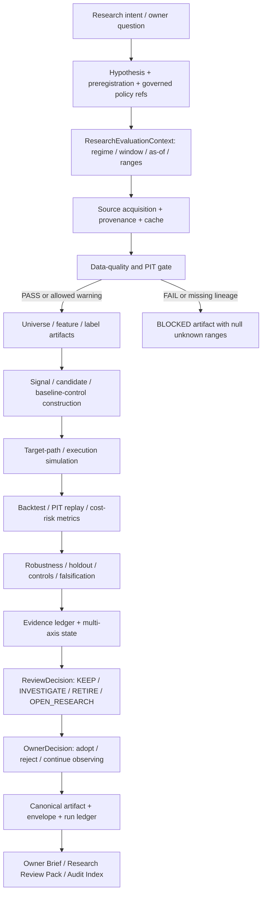

# 当前研究策略执行链路、计算逻辑与优化边界

最后更新：2026-07-11

项目级 AI market regime：`ai_after_chatgpt`，起点 `2022-12-01`

当前 QQQ/SGOV/TQQQ primary validated research window：`exact_three_asset_validated`，起点 `2021-02-22`

文档性质：ARCH-004F2 权威研究执行链路；研究治理与工程说明，不构成投资建议、策略晋升或交易授权。

## 1. 结论先行

当前研究策略应采用“固定周期观察、证据触发研究、预注册后验证、人工决定是否采用”的闭环，不应按固定周期自动改参数、换模型或改权重。

两条不可破坏的解释规则是：周期复核不等于自动调优；workflow PASS 不等于投资有效性 PASS。任何周期任务都不能自动调参、改权重或 promotion。

系统已经具备较完整的 DQ、PIT、backtest、robustness、evidence、promotion 和报告能力，但尚未全部收敛到单一 runtime framework：

- `ResearchEvaluationContext` 是新 investment-facing artifact 的 canonical 语义契约；
- `ExperimentSpec -> generic runner -> calculator/report plugin -> artifact/envelope/run ledger` 已由 growth-tilt closure 证明为可用 reference path；
- B0～B6 权重研究、tail-risk、dynamic-v3 等大量历史研究仍由 task-shaped module/CLI/report 串联，属于 legacy migration backlog；
- 当前最新 growth-tilt 结论是“没有 contract-complete、PIT-executable candidate”，不是“候选回测亏损”；
- 当前 Weight Research Program 是 `NEEDS_MORE_EVIDENCE`，B4 interaction 证据不足，B5/B6 和 untouched holdout 未解锁；
- 因此当前合理动作是补齐 baseline capability、PIT lineage 和预注册 contract，而不是继续对旧候选做参数搜索。

## 2. 状态标记

| 标记 | 含义 |
|---|---|
| `CANONICAL` | 新链路必须使用的单一 contract/service |
| `REFERENCE` | 已通过 parity 验证、用于证明目标架构的真实切片 |
| `LEGACY` | 当前仍可用但待迁移的 task-shaped module/CLI/artifact 链 |
| `BLOCKED` | contract、数据、PIT、样本或 owner gate 未满足，禁止计算或晋升 |
| `PLANNED` | ARCH-004F/G/H 目标，不能描述为当前 runtime 已完成 |

## 3. 为什么这样设计

### 3.1 先冻结语义，再运行计算

同一项目同时存在 market regime、research window、requested range、actual coverage、effective signal range 和 evaluation range。如果只传一个 `start_date`，2022-12-01 的 AI regime 很容易被误当成所有策略的 primary research start。`ResearchEvaluationContext` 因此把这些概念拆开并做一致性验证。

### 3.2 研究失败、证据不足和工程失败必须分开

负收益可以是研究 `FAIL`；缺 PIT lineage、缺 baseline consumption、缺有效样本或缺冻结阈值应是 `BLOCKED`；closure artifact 成功生成只表示 workflow `PASS`，不表示策略有效。状态分开后，系统才不会用治理 PASS 代替投资证据 PASS。

### 3.3 信号、权重映射、风险控制和执行分层

若一个函数同时生成信号、分配权重、控制回撤和计算交易成本，结果变差时无法定位原因。当前权重研究采用 B0～B6 消融，把 static baseline、execution control、fast risk scaler、slow relative tilt、interaction、confidence 和 regime value 分开验证。

### 3.4 周期复核只负责发现问题

固定 cadence 能避免长期不复盘，但也会诱发“到期就优化”。因此 cadence 只生成 Observation、EvidenceSnapshot 和 ReviewDecision；任何策略变化必须另建、预注册并验证。

## 4. End-to-end 研究链路



任何从 `E`、`J` 或 `K` 进入 BLOCKED 的路径都不得用默认值补出可比较指标，也不得继续 promotion。

## 5. 逐环节输入、输出与计算逻辑

### 5.1 Research intent 与 preregistration

| 字段 | 当前约束 |
|---|---|
| Purpose | 把“想优化什么”改写成可证伪问题，先定义 baseline、candidate delta、指标、窗口、成本和 kill criteria |
| Inputs | owner question、既有 negative-result ledger、failure taxonomy、baseline capability、最新 review decision |
| Calculation | 不做绩效计算；检查 hypothesis 是否正交、baseline capability 是否真实存在、selection rule 是否在结果可见前冻结 |
| Outputs | requirement/task row、protocol/spec、policy/threshold refs、owner、version、status、review/expiry condition |
| Failure | 缺 baseline consumption、阈值未版本化、结果可见后补 selection rule、candidate delta 单位不明 -> `BLOCKED` |
| Current implementation | `config/research/research_governance_policy.yaml`、protocols、threshold registry；generic `ExperimentSpec` 为 `REFERENCE`，大量历史研究仍为 `LEGACY` |

为什么：先冻结问题和判定标准，才能防止看完结果再换阈值、挑窗口或改 candidate 定义。

### 5.2 ResearchEvaluationContext

`CANONICAL` contract：`src/ai_trading_system/contracts/research_context.py`。

输入：

- market regime spec：anchor、start、id；
- research window spec：id、start、role、evidence role、caveats；
- requested/actual/effective/evaluation ranges；
- `as_of`、trading calendar、per-input coverage；
- DQ contract 与 policy refs。

输出：`research_evaluation_context.v1` 和 deterministic `research_evaluation_context_id`。

关键校验：

- declared regime/window start 必须与 registry 一致；
- actual 必须被 requested 包含；effective/evaluation 不能超出实际覆盖；
- sensitivity/legacy/metadata window 必须携带对应 evidence role 和 caveat；
- DQ `as_of` 必须等于 context `as_of`；
- complete context 必须 DQ passed；blocked context 保持未知 range 为 null，不能复制 requested range 伪造覆盖。

### 5.3 Window 语义

| 概念 | 当前值/用途 | 不能推出 |
|---|---|---|
| `ai_after_chatgpt` market regime | 2022-12-01 起；AI 周期归因与 generic ETF backtest default | 不是所有策略 primary research start |
| `exact_three_asset_validated` | 2021-02-22 起；QQQ/SGOV/TQQQ primary decision evidence | 不是 project-wide 所有资产的统一起点 |
| `legacy_research_window_2022_12` | 2022-12-01 起；legacy/AI comparison | 不能单独支持新 leaderboard/promotion |
| `exact_three_asset_primary_only_extension` | 2020-05-28 起；带 SGOV secondary-source gap 的 sensitivity | 不能无 caveat 进入 primary leaderboard |
| `requested_sgov_inception_range` | requested 2020-05-26；portfolio actual start 2020-05-28 | 不能计算 2020-05-26/27 组合收益 |

`config/etf_portfolio/backtest.yaml` 的 2022-12-01 是 generic ETF backtest regime default；使用 QQQ/SGOV/TQQQ primary research evidence 时，caller 必须显式解析 research-window policy，不能依赖该默认值。

### 5.4 数据、provenance 与 DQ/PIT gate

| 项目 | 输入 | 输出/计算 |
|---|---|---|
| Source/cache | provider endpoint、params、download time、row count、checksum | raw/normalized cache + download manifest |
| DQ | prices、rates、required universe、as-of | `validate_data_cache` 检查 schema、freshness、duplicates、coverage、suspicious values，输出 `DataQualityReport` |
| PIT | source/available/event time、snapshot manifest | 按 decision time 过滤可见记录，输出 coverage/readiness；未来可见信息或无法证明 available time 时 fail closed |
| Context attach | DQ report path/hash/status + window/regime policy refs | complete 或 blocked `ResearchEvaluationContext` |

所有从 cached market/macro data 生成 feature、score、backtest 或 report 的路径必须先走 `aits validate-data` 或同一代码路径。治理-only closure 若不读取 fresh cache，可声明 `data_quality_required=false`，但必须明确 `NOT_APPLICABLE`，不能伪造 DQ PASS。

### 5.5 Universe、feature、label 与 signal

目标 contract：feature/label 都必须携带 symbol、event/available/decision time、source lineage、window/context id 和 missing reason。

当前仍有多个 domain-specific generator，尚无单一通用 feature graph。这是 `LEGACY` 事实，不在本文伪装为已统一。新研究必须至少保证：

- feature 只使用 decision time 前可见数据；
- label 与 feature 的时间边界独立；
- 缺字段产生 coverage/blocker，不用零值代表未知；
- signal 输出 score/state/confidence/diagnostics，不直接写 official target weights。

### 5.6 当前权重研究的具体计算

下列 B0～B6 是 research-only 结构，不是 production allocator。

#### B0 static baseline

来源：`config/etf_portfolio/assets.yaml` 的 `default_weight`。

当前 B000 research baseline：SPY 0.30、QQQ 0.40、SMH 0.15、SOXX 0、CASH 0.15。它是 control，不是 official target weights。

#### B1 execution control

输入：current weights、target weights、execution policy、total cost bps。

计算：

```text
drift_i = target_weight_i - current_weight_i
desired_turnover = sum(abs(drift_i))
estimated_cost = desired_turnover * total_cost_bps / 10,000
benefit_proxy = desired_turnover
benefit_cost_ratio = benefit_proxy / estimated_cost
```

若最大绝对 drift 小于 deadband，或 benefit/cost 低于阈值，则不交易；若 desired turnover 超过日上限，按 `max_daily_turnover / desired_turnover` 缩放 delta。执行后：

```text
gross_return = sum(post_trade_weight_i * asset_return_i)
transaction_cost = turnover * total_cost_bps / 10,000
strategy_return = gross_return - transaction_cost
```

当前结论：B1 是 optional execution wrapper；多数窗口降低 turnover/cost，但不是 universal default，部分趋势/震荡/recovery 窗口存在 return 或 drawdown 代价。

#### B2 fast asymmetric risk scaler

输入 feature：`realized_vol_20d`、`drawdown_63d`、`above_ma_200`。

单资产 risk score：

```text
score = 100
        - linear_penalty(realized_vol_20d; 0.20 -> 0.60, max 30)
        - drawdown_penalty(drawdown_63d; -0.05 -> -0.20, max 30)
        - (20 if below MA200 else 0)
```

portfolio risk score 是按 baseline active weight 对可用资产分数加权；confidence 是 covered weight / total active weight。State gate：`<=45 RISK_OFF`、`<=65 ELEVATED_RISK`、否则 `NORMAL`。对应 exposure scaler 为 0.55、0.85、1.00；只缩放 total equity exposure，剩余进入 CASH，不改变 active assets 的相对比例。

Coverage 最低值小于 0.80 时不能视为 READY。上述阈值来自预注册 pilot policy `weight_research_modules_v0_1`，不是证据已充分校准的 production 参数。

#### B3 slow relative tilt

输入：QQQ 的 `rs_vs_spy_60d`，SMH 的 `rs_vs_qqq_60d`/`rs_vs_spy_60d`，SPY 为 neutral anchor。

每个 return feature 线性映射：`<=-0.10 -> 0`，`>=0.10 -> 100`，中间线性插值；多字段取平均。Score `>=60` 为 overweight、`<=40` 为 underweight、否则 neutral。

```text
offset = clip((score - 50) / 50, -1, 1)
tilt_multiplier = 1 + offset * 0.25
raw_weight_i = baseline_weight_i * tilt_multiplier_i
```

随后按 baseline equity total 重新归一化，因此只做 active sleeve 内相对倾斜，保留总 equity exposure 和 CASH 水平。Coverage 最低值小于 0.80 时不 READY。

#### B4 interaction

B4 先取 B2 给出的 total equity exposure，再按 B3 active weights 的相对 share 分配：

```text
b2_equity = 1 - b2_cash
relative_share_i = b3_weight_i / sum(b3_active_weights)
b4_weight_i = relative_share_i * b2_equity
b4_cash = 1 - sum(b4_active_weights)
```

当前 mini-backfill 的 partial utility 仅作诊断：

```text
utility = total_return - 0.75 * abs(max_drawdown) - 0.25 * turnover
```

它缺 tracking error、worst-window、dispersion、cost drag、stress 和 signal-robustness penalties，因此不能当完整 selection score。当前 B4 在 6/7 diagnostic windows 与 B3 重合、7/7 cost 更差，interaction 被判为 redundant/inconclusive，不能解锁 B5。

#### B5/B6

- B5 confidence shrinkage：因 core combo evidence inconclusive 而 `BLOCKED`；没有稳定 canonical 公式可作为当前已采用逻辑。
- B6 regime incremental value：缺 pre-regime combo/完整证据而 `BLOCKED`。

### 5.7 Backtest、cost 与 metrics

Backtest 必须按 signal time -> next execution time -> return period 排序，不能同日看结果后成交。核心指标：

```text
equity_t = equity_(t-1) * (1 + strategy_return_t)
total_return = product(1 + r_t) - 1
max_drawdown = min(equity_t / running_peak_t - 1)
CAGR = (1 + total_return) ** (1 / years) - 1
Sharpe = mean(excess_return) / std(return) * sqrt(periods_per_year)
Sortino = mean(excess_return) / downside_deviation * sqrt(periods_per_year)
Calmar = CAGR / abs(max_drawdown)
turnover = sum(abs(period_turnover))
```

Transaction cost 至少包含 commission、spread、slippage、market impact、sell tax、FX 和适用的 delay term；不同 runner 当前仍有 contract 差异，必须以具体 policy/version 为准，不能跨报告直接比较未对齐的 cost proxy。

### 5.8 Robustness、holdout 与 falsification

必需检查包括：simple benchmark、fixed exposure、rebalance interval、module subset、same-turnover random、same-exposure random、no-gate model target、volatility target、cost stress、lag sensitivity、purged/walk-forward、leave-one-regime-out、block bootstrap 和 worst-window。

Holdout 在 selection rule、window、metric 和 threshold 冻结前不得访问；访问后不能反复用于调参。E0/E1/E2 evidence 只支持 test/diagnostic/component replay，不支持 promotion；promotion 至少要求 owner-reviewed E3 full-advisory PIT replay 和 E4 forward paper-shadow。

### 5.9 Evidence ledger、state 与 decision

`research_governance.py` 当前将证据分类为 E0～E5，并输出：

- evidence ledger/audit：source class、provenance、lookahead、promotion eligibility；
- multi-axis state：engineering readiness、evidence maturity、robustness、threshold、promotion、operational、direction-review；
- sample quality 与 threshold dependency audit；
- promotion readiness、decision record、rollup/watchlist。

单一 `PASS` 不得覆盖多轴状态。例如 engineering PASS + evidence required 的正确结论仍是 promotion `NOT_READY`。

### 5.10 Artifact、lineage、run ledger 与报告

`REFERENCE` generic experiment runner：

```text
ExperimentSpec
  -> resolve config + ConfigRef(path/hash/version/status)
  -> load typed/text inputs + path/hash/size
  -> calculator plugin
  -> primary JSON + section JSON + Markdown
  -> ArtifactEnvelope
  -> RunLedger(DUE -> RUNNING -> PASS/BLOCKED)
```

`ArtifactEnvelope` 记录 producer、run/as-of、canonical status、payload pointer、input pointers、policy refs、DQ requirement、limitations 和 next actions。`ReportSpec` 声明 audience、reader tier、canonical source、section provider、view model、renderer、freshness、actionable 和 lifecycle。报告层只展示 canonical artifact，不重算 signal、weight、backtest 或 promotion decision。

## 6. 真实 reference trace：growth-tilt closure

| 环节 | 实际内容 |
|---|---|
| Spec | `config/research/experiments/growth_tilt_candidate_family_closure.yaml` |
| Inputs | replacement contract、baseline adapter readiness、owner resolution、candidate set、requirement、registry/catalog/flow |
| Calculator | 复用 `research_quality.growth_tilt_candidate_family_closure` pure builder |
| Report plugin | negative-result section + Markdown renderer |
| Primary result | `GROWTH_TILT_CANDIDATE_FAMILY_CLOSED_NO_EXECUTABLE_PIT_CANDIDATE` |
| Canonical workflow status | closure terminal status映射为 `PASS`；source-contract blocker映射为 `BLOCKED` |
| DQ | governance-only、未读 fresh cache，`data_quality_required=false`；不能解释为 DQ PASS |
| Side effects | `production_effect=none`、no paper-shadow、no broker/order |

当前 workspace 的 primary closure JSON 来自迁移前/兼容运行，尚未包含已登记 sidecar 文件；ARCH-004D tests 已证明 generic runner 在执行时会生成 envelope/run ledger。文档和 catalog 中“可生成”不能误写成“当前磁盘一定存在”。

## 7. 当前研究结果

### 7.1 Weight Research Program V1

- Overall：`WEIGHT_RESEARCH_PROGRAM_NEEDS_MORE_EVIDENCE`；
- B0：control-only；单一 2023-01-03～2023-07-31 mini window，untouched holdout 未使用；
- B1：mixed，适合作 optional wrapper，不适合 universal default；
- B2/B3：research-only mini-backfill，不能证明 production candidate；
- B4：interaction redundant/inconclusive，不能解锁 B5；
- B5/B6：blocked；
- official target weights、paper-shadow、production、broker 均未启用。

### 7.2 Growth-tilt candidate family

- approved candidates：0；M2 eligible：0；PIT candidates tested：0；
- baseline adapters：0 ready / 4 blocked；
- replacement prerequisites：2 PASS / 8 BLOCKED；
- family closed，next route 是 baseline capability graph；
- null metrics 未被解释为 FAIL；没有运行 real replay，也没有生成 runtime performance metrics。

### 7.3 目前可以与不可以得出的结论

可以：旧 growth-tilt family 缺可执行 baseline/candidate contract；B4 未证明相对 B3 的独立增益；定期复核应继续。

不可以：growth-tilt 候选“回测失败”；B2/B3 已可生产；2022-12-01 是 QQQ/SGOV/TQQQ 唯一 primary window；governance/workflow PASS 等于投资有效性 PASS。

## 8. 定期复核与优化触发

| Cadence | 输入 | 固定输出 | 允许动作 | 禁止动作 |
|---|---|---|---|---|
| Daily | DQ、freshness、latest artifacts、runtime health | Observation + blocker | 修数据/证据链 | 调参、改权重、promotion |
| Weekly | evidence delta、cost、drawdown、robustness、candidate lifecycle | `KEEP/INVESTIGATE/RETIRE/OPEN_RESEARCH` | 提议研究 | 根据单周收益改策略 |
| Biweekly | shadow/baseline、thesis、risk attribution | ReviewDecision | 开启归因或补证据 | 把短样本当生产证据 |
| Monthly | long-window、PIT/source、threshold/report lifecycle | lifecycle/technical-debt review | 冻结新问题或退役方向 | 无新证据强制优化 |
| Quarterly | architecture、capacity、dependency、security、retirement | architecture/governance decision | 批准迁移/退役 | 未审查的大范围 policy mutation |
| Event-driven | DQ/contract repair、sample maturity、structural break、incident | preregistered ChangeProposal | owner-approved validation | 事后阈值、复用 holdout 调参 |

研究变化固定为：

```text
Observation
  -> EvidenceSnapshot
  -> ReviewDecision
  -> Preregistered ChangeProposal
  -> PIT / holdout / robustness / cost / risk validation
  -> OwnerDecision
  -> Adoption or Rejection
```

## 9. 优化空间与进入条件

| 优化方向 | 当前问题 | 启动触发 | 必需验证/退出条件 |
|---|---|---|---|
| Semantic coverage | 历史 artifacts 未全部携带 context | migration wave 中发现 window/as-of 歧义 | context parity + conflict fail-closed；不改旧指标 |
| Generic experiment adoption | 多数研究仍有 task-shaped CLI/module/report | 同类第二个真实 experiment 或维护成本显著 | spec/plugin parity；删除至少一个旧 wrapper |
| Baseline capability graph | callable producer 不等于 baseline consumption | independent baseline work 补齐真实消费链 | implementation/PIT/semantics/dependency/governance 全 READY |
| DQ/PIT lineage | 部分 source/available time 和 manifest 证据不足 | source repair 或 forward archive 成熟 | validate-data + PIT manifest + no-lookahead tests |
| B2 calibration | 45/65 与 0.55/0.85 是 pilot | 独立 E3/E4 evidence 达到预注册样本 | untouched holdout、cost/risk/false-trigger、owner approval |
| B3 calibration | ±10% score map、40/60 state、25% max tilt 是 pilot | 多窗口 evidence 表明稳定增量 | parameter neighborhood、leave-one-regime-out、cost/turnover |
| B4/B5 redesign | B4 与 B3 冗余，B5 blocked | 新正交 interaction hypothesis | preregistered orthogonality + ablation + holdout；否则 retire |
| Cost model unification | runner 间 cost components/units 可能不同 | 跨研究比较或 cutover 前 | versioned cost policy、golden parity、medium/high stress |
| Holdout discipline automation | 多处靠 task-specific gate | generic lifecycle integration | immutable selection checksum、single-access ledger |
| Evidence/state unification | 多个 report family 重复表达状态 | F2/F3 reference integration | canonical evidence/state artifact；report 不重算 |
| Reporting | daily/research/audit 混杂 | ARCH-004F3 | 3-tier navigation、<=10 daily sections、source drilldown |
| Code subtraction | 研究 CLI/module 数量持续增长 | ARCH-004G migration wave | reachability zero、compat window、tests/docs迁移、真实删除 |

优化不以“收益暂时落后”为充分触发。至少需要持续独立退化、blocked prerequisite 真正补齐、可证伪的新结构假设，或候选在预注册 gate 下通过完整验证之一。

## 10. 当前架构缺口

1. Generic experiment runner 是 reference，不是全域 source-of-truth；
2. feature/signal/candidate schema 仍按 domain/task 分散；
3. historical artifacts 的 ResearchEvaluationContext 覆盖不足；
4. `config/etf_portfolio/backtest.yaml` 的 regime default 与策略 primary-window policy 需要 caller 显式区分；
5. 多个 cost、scorecard、promotion/report status 仍有 legacy contract；
6. current closure sidecars 尚未在 workspace materialize，只有 runner parity evidence；
7. F1 due resolver、F3 三层报告、G domain migration/subtraction、H cutover 尚未完成。

这些缺口是后续重构输入，不得用新增 façade 或复制 helper 隐藏。

## 11. 权威依据

- `config/market_regimes.yaml`
- `config/research/research_window_registry.yaml`
- `config/research/primary_research_window_policy.yaml`
- `config/research/research_governance_policy.yaml`
- `config/research/promotion_gate_thresholds.yaml`
- `config/research/experiments/growth_tilt_candidate_family_closure.yaml`
- `config/etf_portfolio/assets.yaml`
- `config/etf_portfolio/backtest.yaml`
- `config/etf_portfolio/weight_research_modules.yaml`
- `src/ai_trading_system/contracts/research_context.py`
- `src/ai_trading_system/research_framework/spec.py`
- `src/ai_trading_system/research_framework/runner.py`
- `src/ai_trading_system/etf_portfolio/weight_research_execution.py`
- `src/ai_trading_system/etf_portfolio/weight_research_b2.py`
- `src/ai_trading_system/etf_portfolio/weight_research_b3.py`
- `src/ai_trading_system/etf_portfolio/weight_research_b4.py`
- `src/ai_trading_system/backtest/engine.py`
- `src/ai_trading_system/backtest/robustness.py`
- `src/ai_trading_system/backtest/promotion_gate.py`
- `src/ai_trading_system/research_governance.py`
- `docs/research/current_research_strategy_and_periodic_optimization_review_2026-07-10.md`
- `docs/research/weight_research_program_v1_snapshot.md`
- `docs/research/growth_tilt_candidate_family_closure.md`
- `outputs/research_strategies/growth_tilt_candidate_family_closure/growth_tilt_candidate_family_closure.json`
