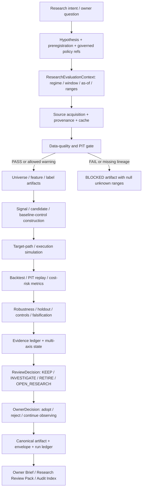

# 当前研究策略执行链路、计算逻辑与优化边界

最后更新：2026-07-12

项目级 AI market regime：`ai_after_chatgpt`，起点 `2022-12-01`

当前 QQQ/SGOV/TQQQ primary validated research window：`exact_three_asset_validated`，起点 `2021-02-22`

文档性质：ARCH-004F2 权威研究执行链路；研究治理与工程说明，不构成投资建议、策略晋升或交易授权。

## 1. 结论先行

当前研究策略应采用“固定周期观察、证据触发研究、预注册后验证、人工决定是否采用”的闭环，不应按固定周期自动改参数、换模型或改权重。

两条不可破坏的解释规则是：周期复核不等于自动调优；workflow PASS 不等于投资有效性 PASS。任何周期任务都不能自动调参、改权重或 promotion。

系统已经具备较完整的 DQ、PIT、backtest、robustness、evidence、promotion 和报告能力，但尚未全部收敛到单一 runtime framework：

- `ResearchEvaluationContext` 是新 investment-facing artifact 的 canonical 语义契约；
- `ExperimentSpec -> generic runner -> calculator/report plugin -> artifact/envelope/run ledger` 已由 growth-tilt closure 证明为可用 reference path；
- B0～B6 权重研究、tail-risk、dynamic-v3 等大量历史研究仍由 task-shaped module/CLI/report 串联，属于 legacy migration backlog；
- 当前最新 growth-tilt 结论是“没有 contract-complete、PIT-executable candidate”，不是“候选回测亏损”；
- 当前 Weight Research Program 是 `NEEDS_MORE_EVIDENCE`，B4 interaction 证据不足，B5/B6 和 untouched holdout 未解锁；
- 因此当前合理动作是补齐 baseline capability、PIT lineage 和预注册 contract，而不是继续对旧候选做参数搜索。

## 2. 状态标记

| 标记 | 含义 |
|---|---|
| `CANONICAL` | 新链路必须使用的单一 contract/service |
| `REFERENCE` | 已通过 parity 验证、用于证明目标架构的真实切片 |
| `LEGACY` | 当前仍可用但待迁移的 task-shaped module/CLI/artifact 链 |
| `BLOCKED` | contract、数据、PIT、样本或 owner gate 未满足，禁止计算或晋升 |
| `PLANNED` | ARCH-004F/G/H 目标，不能描述为当前 runtime 已完成 |

## 3. 为什么这样设计

### 3.1 先冻结语义，再运行计算

同一项目同时存在 market regime、research window、requested range、actual coverage、effective signal range 和 evaluation range。如果只传一个 `start_date`，2022-12-01 的 AI regime 很容易被误当成所有策略的 primary research start。`ResearchEvaluationContext` 因此把这些概念拆开并做一致性验证。

### 3.2 研究失败、证据不足和工程失败必须分开

负收益可以是研究 `FAIL`；缺 PIT lineage、缺 baseline consumption、缺有效样本或缺冻结阈值应是 `BLOCKED`；closure artifact 成功生成只表示 workflow `PASS`，不表示策略有效。状态分开后，系统才不会用治理 PASS 代替投资证据 PASS。

### 3.3 信号、权重映射、风险控制和执行分层

若一个函数同时生成信号、分配权重、控制回撤和计算交易成本，结果变差时无法定位原因。当前权重研究采用 B0～B6 消融，把 static baseline、execution control、fast risk scaler、slow relative tilt、interaction、confidence 和 regime value 分开验证。

### 3.4 周期复核只负责发现问题

固定 cadence 能避免长期不复盘，但也会诱发“到期就优化”。因此 cadence 只生成 Observation、EvidenceSnapshot 和 ReviewDecision；任何策略变化必须另建、预注册并验证。

## 4. End-to-end 研究链路



任何从 `E`、`J` 或 `K` 进入 BLOCKED 的路径都不得用默认值补出可比较指标，也不得继续 promotion。

## 5. 逐环节输入、输出与计算逻辑

后续每个正式研究 run 都应能按下表回答“为什么运行、消费了什么、计算了什么、产出了什么、为什么停下或继续”。某个 domain 暂无统一 canonical artifact 时，应标记 `LEGACY` 或 `PLANNED`，不能用报告文字假装链路已经统一。

| # | 环节与设计理由 | 必需输入 | 核心计算/判断 | 固定输出 | Fail-closed 条件 | 后续优化入口 |
|---:|---|---|---|---|---|---|
| 1 | Intent：先把主观问题改写为可证伪问题 | owner question、现状/负结果、baseline capability | 拆 hypothesis、candidate delta、success/kill criteria | task + requirement/protocol | 问题不可证伪、无 owner/acceptance | failure taxonomy、问题模板 |
| 2 | Preregistration：防止看结果后挑规则 | hypothesis、window、metric、threshold/cost policy | 冻结 selection checksum、版本与 result visibility | `ExperimentSpec`/protocol/policy refs | 结果已可见、阈值无治理依据 | immutable registry、single-access holdout ledger |
| 3 | Evaluation context：消除窗口/时点歧义 | regime/window registry、requested/as-of、calendar | 解析 configured/requested/actual/effective/evaluation ranges | `research_evaluation_context.v1` | registry conflict、range 越界、unknown 被默认值填充 | 历史 artifact context migration |
| 4 | Source/provenance：证明数据从哪里来 | provider、endpoint、params、download event、cache | schema/row/checksum/manifest linkage | cache + download/provenance manifest | source/available time 或 checksum 不可证明 | provider adapter、forward archive |
| 5 | DQ/PIT：先证明输入可用且当时可见 | cache、universe、as-of、manifest、PIT time | completeness/freshness/duplicate/outlier + `available_time <= decision_time` | DQ report + PIT coverage/blocker | DQ FAIL、future visibility、lineage missing | common DQ service、PIT coverage repair |
| 6 | Dataset：把 raw 输入变为可复现研究样本 | passed context/DQ、universe、feature/label spec | point-in-time join、missing/coverage classification | universe/feature/label artifact | label leakage、unknown 当 0、coverage 不足 | typed feature/label schema、feature graph |
| 7 | Signal/candidate：只表达研究假设增量 | baseline capability、features、candidate spec | score/state/confidence 或 typed mutation delta | signal/candidate artifact | baseline 未真实消费、candidate delta 含糊 | capability graph、orthogonal generator |
| 8 | Allocation/execution：把信号和交易机制分开 | signal、baseline weights、constraints、cost/execution policy | weight mapping、shrinkage、deadband、turnover cap、next-time execution | target path + trade/turnover/cost path | official/production 权重被写入、约束越界 | allocator contract、cost policy unification |
| 9 | Backtest/metrics：重放真实可执行路径 | PIT dataset、target/trade path、benchmark | equity/return/drawdown/risk/cost metrics | backtest/replay artifact | same-day lookahead、actual range 缺失、DQ lineage断裂 | common engine、metric semantic parity |
| 10 | Robustness/falsification：验证不是单窗偶然 | primary result、controls、stress、holdout | ablation、walk-forward、LOO regime、bootstrap、cost/lag stress | robustness/holdout evidence | holdout污染、control不对齐、证据不完整 | standardized control library |
| 11 | Evidence/decision：区分工程成功和投资有效 | 所有上游 artifacts、threshold registry | 多轴状态、promotion blockers、KEEP/INVESTIGATE/RETIRE/OPEN_RESEARCH | evidence ledger + ReviewDecision | 单一PASS覆盖多轴状态、缺证据自动晋升 | canonical evidence/state service |
| 12 | Report/lifecycle：只读展示并留下下一触发 | canonical artifact/envelope、run ledger、decision | 读模型、分层摘要、freshness/lineage link | Owner Brief/Research Pack/Audit Index | 报告重算指标、缺source link、过期仍声称current | 三层报告、自动freshness与定期复盘 |

“后续优化入口”只产生 observation 或新的 preregistration，不得在同一个已经看到结果的 run 内直接修改参数并重跑。若要优化第 7～10 环节，必须回到第 1～2 环节建立新的 versioned hypothesis；若只是数据、契约或报告修复，则保留原 hypothesis 和 selection checksum，并在 lineage 中记录 repair 原因。

### 5.1 Research intent 与 preregistration

| 字段 | 当前约束 |
|---|---|
| Purpose | 把“想优化什么”改写成可证伪问题，先定义 baseline、candidate delta、指标、窗口、成本和 kill criteria |
| Inputs | owner question、既有 negative-result ledger、failure taxonomy、baseline capability、最新 review decision |
| Calculation | 不做绩效计算；检查 hypothesis 是否正交、baseline capability 是否真实存在、selection rule 是否在结果可见前冻结 |
| Outputs | requirement/task row、protocol/spec、policy/threshold refs、owner、version、status、review/expiry condition |
| Failure | 缺 baseline consumption、阈值未版本化、结果可见后补 selection rule、candidate delta 单位不明 -> `BLOCKED` |
| Current implementation | `config/research/research_governance_policy.yaml`、protocols、threshold registry；generic `ExperimentSpec` 为 `REFERENCE`，大量历史研究仍为 `LEGACY` |

为什么：先冻结问题和判定标准，才能防止看完结果再换阈值、挑窗口或改 candidate 定义。

### 5.2 ResearchEvaluationContext

`CANONICAL` contract：`src/ai_trading_system/contracts/research_context.py`。

输入：

- market regime spec：anchor、start、id；
- research window spec：id、start、role、evidence role、caveats；
- requested/actual/effective/evaluation ranges；
- `as_of`、trading calendar、per-input coverage；
- DQ contract 与 policy refs。

输出：`research_evaluation_context.v1` 和 deterministic `research_evaluation_context_id`。

关键校验：

- declared regime/window start 必须与 registry 一致；
- actual 必须被 requested 包含；effective/evaluation 不能超出实际覆盖；
- sensitivity/legacy/metadata window 必须携带对应 evidence role 和 caveat；
- DQ `as_of` 必须等于 context `as_of`；
- complete context 必须 DQ passed；blocked context 保持未知 range 为 null，不能复制 requested range 伪造覆盖。

### 5.3 Window 语义

| 概念 | 当前值/用途 | 不能推出 |
|---|---|---|
| `ai_after_chatgpt` market regime | 2022-12-01 起；AI 周期归因与 generic ETF backtest default | 不是所有策略 primary research start |
| `exact_three_asset_validated` | 2021-02-22 起；QQQ/SGOV/TQQQ primary decision evidence | 不是 project-wide 所有资产的统一起点 |
| `legacy_research_window_2022_12` | 2022-12-01 起；legacy/AI comparison | 不能单独支持新 leaderboard/promotion |
| `exact_three_asset_primary_only_extension` | 2020-05-28 起；带 SGOV secondary-source gap 的 sensitivity | 不能无 caveat 进入 primary leaderboard |
| `requested_sgov_inception_range` | requested 2020-05-26；portfolio actual start 2020-05-28 | 不能计算 2020-05-26/27 组合收益 |

`config/etf_portfolio/backtest.yaml` 的 2022-12-01 是 generic ETF backtest regime default；使用 QQQ/SGOV/TQQQ primary research evidence 时，caller 必须显式解析 research-window policy，不能依赖该默认值。

任何 window-facing artifact 至少应分开披露：

| 字段 | 谁决定 | 含义 | 当前审计能力 |
|---|---|---|---|
| `market_regime_id/start` | `config/market_regimes.yaml` | 项目归因口径；`ai_after_chatgpt`从2022-12-01开始 | policy/context校验，不由实际数据起点反推 |
| `research_window_id/start/role` | research-window registry/policy | 某策略证据为何可使用2021或2020数据 | canonical context可校验；历史artifact覆盖尚不完整 |
| `configured_backtest_start` | 运行policy/config | runner未显式覆盖时的配置起点 | Dynamic-v3 Window Audit可提取 |
| `requested_start/end` | 本次run/spec；window-audit CLI的`--as-of/--end` | 本次要求评估的区间；这里`--as-of`是requested start，不是报告观察时点 | Dynamic-v3 Window Audit可提取/覆盖 |
| `actual_evaluation_start/end` | 实际可计算path | 真正进入绩效计算的区间 | missing、倒序、晚开始、早结束会fail closed或blocking |
| `effective_training/validation` | model/replay split | 训练和验证实际使用范围 | 字段已预留，但并非所有legacy artifact齐全 |

特别注意：`actual_evaluation_start=2021-02-22`与`configured_backtest_start=2022-12-01`可以同时为真。前者说明artifact实际包含更早证据，后者说明AI-cycle默认配置仍是2022-12-01；只有`research_window_id/role/caveats`才能说明更早数据是QQQ/SGOV/TQQQ primary evidence、warm-up、stress、sensitivity还是regime comparison。当前Dynamic-v3 Window Audit不会自动验证这个evidence role，因此它只能发现range缺失/截短，不能单独证明2021证据的解释合法性。

### 5.4 数据、provenance 与 DQ/PIT gate

| 项目 | 输入 | 输出/计算 |
|---|---|---|
| Source/cache | provider endpoint、params、download time、row count、checksum | raw/normalized cache + download manifest |
| DQ | prices、rates、required universe、as-of | `validate_data_cache` 检查 schema、freshness、duplicates、coverage、suspicious values，输出 `DataQualityReport` |
| PIT | source/available/event time、snapshot manifest | 按 decision time 过滤可见记录，输出 coverage/readiness；未来可见信息或无法证明 available time 时 fail closed |
| Context attach | DQ report path/hash/status + window/regime policy refs | complete 或 blocked `ResearchEvaluationContext` |

所有从 cached market/macro data 生成 feature、score、backtest 或 report 的路径必须先走 `aits validate-data` 或同一代码路径。治理-only closure 若不读取 fresh cache，可声明 `data_quality_required=false`，但必须明确 `NOT_APPLICABLE`，不能伪造 DQ PASS。

### 5.5 Universe、feature、label 与 signal

目标 contract：feature/label 都必须携带 symbol、event/available/decision time、source lineage、window/context id 和 missing reason。

当前仍有多个 domain-specific generator，尚无单一通用 feature graph。这是 `LEGACY` 事实，不在本文伪装为已统一。新研究必须至少保证：

- feature 只使用 decision time 前可见数据；
- label 与 feature 的时间边界独立；
- 缺字段产生 coverage/blocker，不用零值代表未知；
- signal 输出 score/state/confidence/diagnostics，不直接写 official target weights。

### 5.6 当前权重研究的具体计算

下列 B0～B6 是 research-only 结构，不是 production allocator。

#### B0 static baseline

来源：`config/etf_portfolio/assets.yaml` 的 `default_weight`。

当前 B000 research baseline：SPY 0.30、QQQ 0.40、SMH 0.15、SOXX 0、CASH 0.15。它是 control，不是 official target weights。

#### B1 execution control

输入：current weights、target weights、execution policy、total cost bps。

计算：

```text
drift_i = target_weight_i - current_weight_i
desired_turnover = sum(abs(drift_i))
estimated_cost = desired_turnover * total_cost_bps / 10,000
benefit_proxy = desired_turnover
benefit_cost_ratio = benefit_proxy / estimated_cost
```

若最大绝对 drift 小于 deadband，或 benefit/cost 低于阈值，则不交易；若 desired turnover 超过日上限，按 `max_daily_turnover / desired_turnover` 缩放 delta。执行后：

```text
gross_return = sum(post_trade_weight_i * asset_return_i)
transaction_cost = turnover * total_cost_bps / 10,000
strategy_return = gross_return - transaction_cost
```

当前结论：B1 是 optional execution wrapper；多数窗口降低 turnover/cost，但不是 universal default，部分趋势/震荡/recovery 窗口存在 return 或 drawdown 代价。

#### B2 fast asymmetric risk scaler

输入 feature：`realized_vol_20d`、`drawdown_63d`、`above_ma_200`。

单资产 risk score：

```text
score = 100
        - linear_penalty(realized_vol_20d; 0.20 -> 0.60, max 30)
        - drawdown_penalty(drawdown_63d; -0.05 -> -0.20, max 30)
        - (20 if below MA200 else 0)
```

portfolio risk score 是按 baseline active weight 对可用资产分数加权；confidence 是 covered weight / total active weight。State gate：`<=45 RISK_OFF`、`<=65 ELEVATED_RISK`、否则 `NORMAL`。对应 exposure scaler 为 0.55、0.85、1.00；只缩放 total equity exposure，剩余进入 CASH，不改变 active assets 的相对比例。

Coverage 最低值小于 0.80 时不能视为 READY。上述阈值来自预注册 pilot policy `weight_research_modules_v0_1`，不是证据已充分校准的 production 参数。

#### B3 slow relative tilt

输入：QQQ 的 `rs_vs_spy_60d`，SMH 的 `rs_vs_qqq_60d`/`rs_vs_spy_60d`，SPY 为 neutral anchor。

每个 return feature 线性映射：`<=-0.10 -> 0`，`>=0.10 -> 100`，中间线性插值；多字段取平均。Score `>=60` 为 overweight、`<=40` 为 underweight、否则 neutral。

```text
offset = clip((score - 50) / 50, -1, 1)
tilt_multiplier = 1 + offset * 0.25
raw_weight_i = baseline_weight_i * tilt_multiplier_i
```

随后按 baseline equity total 重新归一化，因此只做 active sleeve 内相对倾斜，保留总 equity exposure 和 CASH 水平。Coverage 最低值小于 0.80 时不 READY。

#### B4 interaction

B4 先取 B2 给出的 total equity exposure，再按 B3 active weights 的相对 share 分配：

```text
b2_equity = 1 - b2_cash
relative_share_i = b3_weight_i / sum(b3_active_weights)
b4_weight_i = relative_share_i * b2_equity
b4_cash = 1 - sum(b4_active_weights)
```

当前 mini-backfill 的 partial utility 仅作诊断：

```text
utility = total_return - 0.75 * abs(max_drawdown) - 0.25 * turnover
```

它缺 tracking error、worst-window、dispersion、cost drag、stress 和 signal-robustness penalties，因此不能当完整 selection score。当前 B4 在 6/7 diagnostic windows 与 B3 重合、7/7 cost 更差，interaction 被判为 redundant/inconclusive，不能解锁 B5。

#### B5/B6

- B5 confidence shrinkage：因 core combo evidence inconclusive 而 `BLOCKED`；没有稳定 canonical 公式可作为当前已采用逻辑。
- B6 regime incremental value：缺 pre-regime combo/完整证据而 `BLOCKED`。

### 5.7 Backtest、cost 与 metrics

Backtest 必须按 signal time -> next execution time -> return period 排序，不能同日看结果后成交。核心指标：

```text
equity_t = equity_(t-1) * (1 + strategy_return_t)
total_return = product(1 + r_t) - 1
max_drawdown = min(equity_t / running_peak_t - 1)
CAGR = (1 + total_return) ** (1 / years) - 1
Sharpe = mean(excess_return) / std(return) * sqrt(periods_per_year)
Sortino = mean(excess_return) / downside_deviation * sqrt(periods_per_year)
Calmar = CAGR / abs(max_drawdown)
turnover = sum(abs(period_turnover))
```

Transaction cost 至少包含 commission、spread、slippage、market impact、sell tax、FX 和适用的 delay term；不同 runner 当前仍有 contract 差异，必须以具体 policy/version 为准，不能跨报告直接比较未对齐的 cost proxy。

#### Weight-path 证据链

Backtest summary 只能说明最终指标，不能证明每天实际持有什么、约束何时生效或 metadata 是否与路径一致。Dynamic-v3 real evaluator 因此把候选路径拆成六类输入证据：

| 文件 | 输入 | 计算/校验 | 输出语义 |
|---|---|---|---|
| `daily_weights.csv` | 每个 signal date 的 target weights、candidate id | 日期可解析；`(date,symbol,candidate_id)`唯一；weight为有限数且在`[0,1]`；每个日期权重和在浮点容差内等于1 | 可重放的逐日目标权重，不是 official target weights |
| `rebalance_events.json` | rebalance decision、turnover、changed symbols | 顶层`events`必须为list；逐event校验date、event type、candidate id和非负turnover | 何时以及为什么发生再平衡 |
| `constraint_events.json` | constraint diagnostics/reason codes | 校验date、constraint type、reason code、candidate id | 哪类约束介入；当前before/after/limit细节可能缺失 |
| `rescue_events.json` | drawdown/risk reason codes与risk score | 校验date、trigger、candidate id | rescue触发摘要；当前post-rescue逐资产权重可能缺失 |
| `turnover_by_rebalance.csv` | trade deltas、turnover、gross buy/sell | 校验schema、date、candidate id和有限非负turnover | 成本和执行审计的逐期换手输入 |
| `weight_path_metadata.json` | exporter声明的range/count/detail/flags | count、start/end、symbol count、evaluation/candidate id和所有flags必须与上述文件重新计算结果一致 | 只是一份声明和索引，不能单独证明完整度 |

`weight-path validate/report`共用同一只读inspection path，并分别披露`declared_attribution_completeness`与`observed_attribution_completeness`：

```text
core files/content/parity invalid -> observed INCOMPLETE -> validation FAIL
core valid + detail=minimal or missing_fields non-empty -> observed PARTIAL -> validation may PASS
core valid + detail=complete + required detail columns逐行可解析 + missing_fields empty + all file flags consistent -> observed COMPLETE
declared != observed -> validation FAIL
```

当前 exporter 的真实结果是`minimal/PARTIAL`：已能解释daily target path、events和turnover，但缺`pre_constraint_weight`、`post_rescue_weight`、`constraint_limit`。后续优化空间不是把metadata改成`COMPLETE`，而是让真实计算链输出这些中间状态、增加constraint/rescue前后权重守恒测试、用独立replay核对return/cost，并在真实20-candidate run中验证不同参数的完整daily path差异。任何优化都必须保持evaluation目录唯一、source artifact不可变和no-promotion/no-production边界。

#### Candidate attribution 证据链

Candidate attribution回答“这个候选相对可复核reference具体改变了什么、这些差异来自哪份路径”，而不是重复输出candidate score。阶段边界是显式的：先由`candidate report`命令冻结candidate result视图，再由`candidate attribution`只读消费；缺candidate report时fail closed，不得在下游隐式补建或改写上游。

| 输入 | 归属/校验 | 用途 |
|---|---|---|
| `candidate_results.jsonl` | 路径必须属于`<sweep_id>`；checksum冻结；candidate id唯一命中 | 证明candidate、parameters、metrics source与real artifact link来自指定sweep |
| `candidate_report.json` | 路径必须为`<sweep>/candidates/<candidate>/`；id、sweep、parameters与result一致；checksum冻结 | attribution的显式上游视图 |
| real evaluation JSON | 必须位于`<sweep>/real_evaluation/<candidate>/`；report id与candidate metrics一致 | aggregate constraint/drawdown/turnover/static-gap分析与comparison paths |
| G2.4Q weight-path inspection | 从六类文件内容重新推导observed completeness，不相信metadata自述 | 决定daily path是否可用及其limitations |
| `static_base_candidate` daily path | 与candidate来自同一real report并具有真实`target_weights_json` | 当前可审计的latest-weight reference |

Latest weight delta按最后一个可验证signal date计算：

```text
candidate_weight(symbol, t_last) = validated daily_weights.csv 的最后日期权重
reference_weight(symbol, t_last) = 同一 real report 的 static_base_candidate 最后日期 target weight
delta(symbol) = candidate_weight - reference_weight
```

输出为`weight_path_delta.csv`、五类component attribution JSON、Markdown和manifest。Manifest记录source paths/checksums、declared/observed weight status、limitations、component status和output checksums；validator重新读取source并复算delta、lineage、status与checksum，而不是验证producer自己的声明。状态规则：source或weight core缺失、delta无法形成=`INCOMPLETE`；source和delta有效但constraint/rescue/drawdown/turnover/gap仍混合path summary与aggregate proxy=`PARTIAL`；当前`path_and_aggregate_v2`不得输出`COMPLETE`。

为什么reference不是`dynamic_v0_4`：当前real artifact只有v0.4 summary metrics，没有导出v0.4 daily weights；从summary反推权重会伪造证据。后续优化入口是先扩展exporter提供同窗v0.4 daily path，再新增candidate-vs-v0.4 delta；同时把五类component从aggregate proxy升级到逐event、逐drawdown-window和逐turnover reconciliation。升级前必须保持`PARTIAL`，不能仅修改status字段。

### 5.8 Parameter injection audit

参数进入effective policy不等于已经影响回测结果，而“不同候选总体上存在hash差异”也不能证明每个参数都有效。Dynamic-v3 Injection Audit因此采用one-factor-at-a-time matched-pair设计：

```text
base(parameters_1..7)
  + pair_1(only rescue_intensity changed)
  + pair_2(only smooth_window_days changed)
  + ...
  + pair_7(only drawdown_guard changed)
  + optional broader grid candidates
```

输入是reviewed sweep config、governed search-space version、明确的as-of/end、price/rate cache；real evaluator前仍必须通过cached DQ/PIT context。每个参数只比较“其他required parameters完全相同”的pair：

| Pair evidence | 结论 |
|---|---|
| 没有matched pair | `INSUFFICIENT_MATCHED_PAIR_EVIDENCE` |
| effective real/rescue policy hash未变化 | `NOT_CONSUMED` |
| policy hash变化，但metric与latest-weight hash均未变化 | `NO_OBSERVED_EFFECT` |
| policy hash变化，且metric或latest-weight hash变化 | `EFFECTIVE` |

固定输出包括normalized config、candidate/results JSONL、candidate parameter matrix、weight/metric diff、独立`parameter_effect_summary.json`和Markdown。缺任何required parameter pair时audit是`INCOMPLETE`，`validate-injection-audit`必须FAIL；配置中的`PARAMETER_EFFECT_FIELDS`只说明预期注入位置，不能单独证明实际消费。当前weight effect仍基于real-evaluation latest weight hash，daily path证据另标为incomplete；后续优化入口是完整daily weight/path attribution与多随机种子重复，而不是放宽matched-pair gate。

### 5.9 Robustness、holdout 与 falsification

必需检查包括：simple benchmark、fixed exposure、rebalance interval、module subset、same-turnover random、same-exposure random、no-gate model target、volatility target、cost stress、lag sensitivity、purged/walk-forward、leave-one-regime-out、block bootstrap 和 worst-window。

Holdout 在 selection rule、window、metric 和 threshold 冻结前不得访问；访问后不能反复用于调参。E0/E1/E2 evidence 只支持 test/diagnostic/component replay，不支持 promotion；promotion 至少要求 owner-reviewed E3 full-advisory PIT replay 和 E4 forward paper-shadow。

#### Dynamic-v3 true walk-forward selection

设计目的不是把全周期leaderboard重复切成多个文件，而是防止“用全样本选出赢家，再把赢家的全样本指标贴到test window”造成未来信息泄漏。G2.4S将source sweep内冻结的candidate universe、normalized config和window policy作为唯一输入；当前profile config只用于核对evaluator、candidate budget和当前policy drift，历史sweep始终按其自身normalized config解释，不能被今天的配置静默重写。

| 输入 | 必须证明 | 用途 |
|---|---|---|
| `sweep_manifest.json` | sweep id、evaluator、profile（若有）与目录一致；checksum冻结 | 运行身份和evaluator边界 |
| `sweep_config.normalized.yaml` | source run冻结版本；checksum冻结 | 生成train/test windows、hard constraints和scoring weights |
| `candidate_results.jsonl` | completed candidate id唯一；checksum冻结；不得按全周期gate预先删掉train候选 | candidate universe、parameters、real artifact link |
| profile registry +当前profile config | evaluator、candidate budget、policy projection显式比较 | 识别current-policy drift；不改写历史source policy |
| 每个candidate的real evaluation | 必须属于`<sweep>/real_evaluation/<candidate>/`，report/sweep/candidate id一致，checksum冻结 | `dynamic_candidate`和`static_base_candidate` daily paths |

每个window独立切片，日期键使用`signal_date`且dynamic/static dates必须一致：

```text
R_dynamic(w) = product(1 + strategy_return_dynamic,t) - 1
R_static(w)  = product(1 + strategy_return_static,t) - 1
dynamic_vs_static_gap(w) = R_dynamic(w) - R_static(w)
MDD(w) = min_t(equity_t / running_peak_t - 1)
drawdown_degradation_pp(w) = abs(MDD_dynamic) - abs(MDD_static)
turnover(w) = sum(turnover_dynamic,t)
constraint_hit_rate(w) = count(days with non-empty constraints_applied) / row_count
```

Train leaderboard只使用该train window重算的path metrics和冻结scoring weights；分数相同时按candidate id稳定排序，不允许candidate/date hash jitter。未导出的window false-risk-off和window robustness不会按0获得正向分：对应score contribution强制移除，gate至少`REVIEW_REQUIRED`。每个window只允许从`train_gate != reject`且`train_score`非空的候选中选择；全体reject时明确`NO_ELIGIBLE_TRAIN_CANDIDATE`，不得按candidate id挑一个占位赢家，也不得生成test result。成功选择后才从同一candidate的test slice独立重算test metrics；全周期gate不得预先排除candidate，也不得复制全周期metrics到test。

输出为`wf_windows.json`、`train_window_leaderboards.jsonl`、`selected_candidates.jsonl`、`test_window_results.jsonl`、Markdown和manifest。Manifest记录profile binding checks、source/output checksums、每个real artifact path/checksum、evidence method/completeness和limitations；validator重新读取所有source并复算windows、ranking、selection、test、summary、status和Markdown。Tiny fixture固定`PROXY_ONLY/INCOMPLETE/not_for_investment_decision=true`；real path完整时当前为`PATH_DERIVED_PARTIAL/REVIEW_REQUIRED`，因为path slicing尚未逐window重跑evaluator，且缺window false-risk-off/robustness。后续优化空间是导出window gate完整字段、实现逐fold evaluator rerun与purged/embargo policy、增加cost/lag/stress variants；这些完成前不得输出最终true walk-forward `PASS`。

#### TRADING-096/097 兼容验证入口

`walk-forward run`与`robustness run`是早期研究入口，CLI路径继续兼容，但G2.4T不再维护第二套计算公式：TRADING-096直接复用上节同一`real_daily_path_window_v1`切片函数，对source leaderboard的top-N每个candidate分别计算train/test path metrics；它与TRADING-106的区别是“不在train leaderboard中跨candidate选择赢家”，而不是允许复制全周期指标。

| 环节 | 输入 | 计算与校验 | 输出 | 当前结论上限 |
|---|---|---|---|---|
| TRADING-096 top-N window evidence | source `sweep_manifest`、normalized config、leaderboard、candidate results、每个candidate的dynamic/static daily paths | source目录/sweep/evaluator/candidate/report id归属；逐window compound return、MDD、turnover、constraint-hit与受限gate/score；禁止hash drift | windows、每candidate-window train/test rows、candidate summary、OOS summary、Markdown、manifest | real path完整仍为`PATH_DERIVED_PARTIAL/REVIEW_REQUIRED`；tiny为`PROXY_ONLY/INCOMPLETE` |
| TRADING-097 neighbor sensitivity | 同sweep candidate results及每个neighbor real artifact | 只接受completed、real metrics source、路径属于`<sweep>/real_evaluation/<neighbor>`且sweep/candidate/report id一致的相邻单轴candidate；score delta仍是full-period aggregate | `sensitivity_matrix.csv`与neighbor path/report/checksum inventory | 全neighbor有效可支持“邻域有真实结果”，不能证明fold-specific stability |
| TRADING-097 stress diagnosis | candidate real aggregate analyses、daily path summary、reviewed hard constraint | 明确区分aggregate policy check、aggregate analysis proxy与missing dedicated bucket；不再把aggregate analysis的PASS改写为stress bucket PASS | `stress_bucket_results.json` | 当前`AGGREGATE_OR_MISSING_STRESS_EVIDENCE`，不能形成robustness PASS |
| TRADING-097 regime diagnosis | real `comparison_daily_paths.dynamic_candidate` | 按`selected_regime`分组，计算row count和strategy return sum；“观察到”只表示coverage，不代表rank/gate稳定 | `regime_bucket_results.json` | 当前`PATH_DERIVED_REGIME_OBSERVATION_ONLY`，每个regime均`REVIEW_REQUIRED` |
| content-derived validation | 上述全部source与输出 | 重新生成windows/rows/summaries/sensitivity/stress/regime/diagnostics/Markdown并核对source/output checksums | validation checks | producer自报status、文件存在或同步修改checksum均不能绕过重算 |

设计原因是兼容历史命令不应等于兼容历史错误语义。旧TRADING-096曾把full-period metrics复制到40个window rows后加入stable-hash drift；旧TRADING-097曾把regime observation和aggregate stress analysis包装成`PASS`。这些artifact现在只证明历史workflow执行过，不能继续作为证据充足性依据。Shadow observation basis也只接受当前real、source identity PASS、非fixture的`PATH_DERIVED_PARTIAL` walk-forward和`PATH_AND_AGGREGATE_PARTIAL` robustness；旧manifest或tiny fixture不会形成complete basis。

后续优化顺序是：先让real evaluator导出逐window完整false-risk-off/robustness/cost/lag字段；再实现purged/embargo fold rerun和fold-specific real neighbors；随后定义有owner/version/rationale/validation的dedicated stress bucket与per-regime comparator/gate policy；最后才允许校准robustness PASS boundary。不能通过改状态名、把aggregate proxy重命名为bucket、或用观察行数替代稳定性统计来“优化”结论。

#### Shadow observation basis 登记与验证

TRADING-098把candidate report、walk-forward和robustness证据连接成observe-only登记记录。这里的“登记”是owner触发的治理动作，不是发现目录中有新文件后自动升级。

| 环节 | 输入 | 计算与校验 | 输出 | 优化边界 |
|---|---|---|---|---|
| register | `sweep_id`、`candidate_id`、candidate report；可选且必须成对的`walk_forward_id`/`robustness_id` | candidate report必须归属指定sweep/candidate且非reject；显式证据必须分别通过source-recomputing validator，walk-forward leaderboard包含candidate，两份manifest的source sweep/candidate归属一致，并满足当前usable contract | registry row：source ids、`observation_basis_status`、evaluator/metrics provenance、promotion observation floor；固定`observe_only` | 未给证据id只写`incomplete_observation_basis`；只给一个、证据失效或归属错误时fail closed；禁止按mtime隐式选择latest |
| list/report | registry row | 只读投影，不重新计算策略收益，不补写证据，不自动promotion | candidate list或JSON/Markdown shadow report | 报告中的eligibility必须以完整basis和观察期为前提；registry validation失败时不得把报告当promotion依据 |
| validate | registry、candidate report、显式source ids及其artifact目录 | 逐行重算candidate/sweep ownership、artifact validator状态、usable contract和期望basis status，并与登记字段比较；检查重复candidate与observe-only安全边界 | PASS/FAIL checks；无registry mutation | validator只能暴露stale/forged link，不得替换id、重登记或改状态 |

为什么必须显式给artifact id：文件修改时间不属于研究语义，也不能证明owner知道本次采用了哪一组证据；同一candidate可能同时存在历史、fixture、失败和新版本artifact。显式id把“谁选择了什么证据”固定在命令输入和registry lineage中，也使旧artifact在validator升级后能够被可靠识别为stale，而不是被静默替换。

当前结果：真实candidate `a72139edcaef7d22`已有通过当前validator的walk-forward `7b6db671cbd67468`和robustness `87b0fc81d6681368`，但runtime registry仍绑定旧artifact，因此当前registry validation为FAIL；系统不会自动迁移。后续优化空间包括把登记动作写入独立owner decision ledger、为证据组合生成不可变selection checksum、让shadow report直接引用最新validation artifact，以及在完整逐fold/专用stress证据可用后版本化提升usable contract。任何优化都不能自动enroll、promotion、写official weights或产生broker action。

#### Governance、研究索引与 artifact pointer 控制面

这三个环节只负责“规则是否有效、已有结果在哪里、latest引用是否健康”，不计算新的候选绩效。Governance输入reviewed parameter-governance与sweep config，validate检查policy/search-space约束，report物化只读治理摘要，diff只列出两版配置差异并要求人工复核。Research index-build扫描既有sweep和shadow registry生成可查询索引；query/compare/history只消费索引，不回读市场数据或重跑评估。Artifact latest/validate/stale只读pointer与retention policy；`repair-latest`是唯一pointer写入口，只能扫描canonical Dynamic-v3 artifact root并重建pointer，不能复制、覆盖或修改source artifact。

当前优化空间是给research index增加不可变source checksum和schema版本、让pointer repair记录选择排序与候选清单、把governance diff接入owner decision ledger。进入条件是保持CLI兼容、所有重建结果可由canonical source复算、缺失或歧义时fail closed；禁止把“latest pointer已修复”解释为研究证据更新、candidate晋升或生产状态变化。

#### Observation lifecycle 与 promotion review

Shadow monitor输入observe-only registry与`as_of`，只计算观察年龄、rebalance count、最新指标和是否达到“可进入人工promotion review”的最低观察条件；report/validate只读已有monitor artifact。Scheduled observe由daily scheduler触发，计算交易日/周度due条件、latest pointer健康度、stale状态，并可在due时运行observe-only monitor；它不运行sweep、walk-forward、robustness或promotion pack。Promotion review读取registry显示材料是否存在；promotion pack聚合candidate attribution、data provenance、window audit、walk-forward/robustness等既有证据，输出manual-review pack，validation只校验该pack，不产生production candidate。

后续优化空间是把monitor metrics改为独立forward observation ledger、让scheduled observe引用canonical periodic plan id、让promotion pack直接消费每项source validator artifact。任何优化都必须保持“到期检查不等于自动研究、review-ready不等于promotion、pack PASS不等于生产批准”，且不得写official weights或broker state。

#### Evidence readiness 链

Evidence summary从指定sweep汇总candidate证据完整度与是否可进入下一阶段；medium-real report/validate只总结或校验已有medium-real sweep；regime coverage读取指定sweep与标准ETF价格缓存，审计tech/semiconductor覆盖和AI bull-market overfit风险。Candidate interpretation把既有top candidates、weight path和限制转成人工可读材料；observe pool只把满足研究条件的候选写入独立observe-only artifact，不写shadow registry；overnight readiness根据medium-real完成/失败数与运行耗时估算判断是否具备运行更大研究的条件，但不会启动overnight sweep。

这些输出回答“证据和运行条件是否足够继续研究”，不回答“是否应晋升或交易”。优化入口包括统一各阶段的evidence completeness schema、给regime coverage增加PIT/context binding、让observe pool保存source validator checksum、用真实runtime ledger校准overnight耗时。任何ready/usable/observe-only状态都不得自动映射为promotion、production或broker动作。

#### Evidence governance 与研究决策更新

Research decision把medium-real结果转为研究建议；evidence diagnosis将阻塞项分类为hard failure、soft/manual-review blocker或warning；gate impact只模拟不同规则对observe candidate数量的影响，不改source sweep。Gate policy validate/report读取reviewed YAML，apply只能按policy允许范围调整soft blocker，data-quality、缺real artifact、缺daily path、high overfit等hard blocker必须保留。Candidate recovery只生成recovered observe-only artifact；observe-pool rebuild只写独立pool；decision update聚合diagnosis、impact和recovery形成新的go/no-go研究建议。

为什么分层：如果诊断、规则模拟、规则采用、候选恢复和owner decision混在同一函数中，系统会把“假设放宽门槛后的数量”误当成真实可用候选。优化空间是为policy apply增加owner decision id、冻结source checksums与policy version、让decision update消费每项validation artifact。任何`best_scenario`、`recovered`或`go`都不自动写shadow registry、promotion、production或broker state。

#### Candidate observation 链

Shortlist从observe pool按既有score/blocker选出人工复核集合；candidate cluster用parameter、daily weight path和metrics相似度识别重复候选并选择representatives；shadow shortlist把representatives组装成monitoring pack，但不写旧shadow registry或自动enroll。Monitor activation只建立observe-only monitoring状态，run按`as_of`生成daily/weekly观察摘要，report/validate只读或校验已有artifact。

该链分开的原因是“候选更少、更有代表性”不等于“策略更有效”，monitor active也不等于position advisory或production。优化空间是给cluster增加缺失path的显式距离状态、为shortlist selection冻结policy checksum、让monitor记录真实forward outcome与数据质量证据；所有状态变化仍需人工owner review，不得自动生成仓位或broker动作。

#### Portfolio intake 链

Portfolio intake把“owner提供的当前组合描述”转换成后续exposure、drift和guardrail可消费的、可审计的快照，但不负责产生交易建议。G2.4AA把该入口与后续风险计算拆开，避免同一个CLI callback既解释输入、又计算目标差异、又被误解为执行授权。

| 环节 | 输入 | 计算/校验逻辑 | 输出 | 阻断条件与优化空间 |
|---|---|---|---|---|
| `portfolio-snapshot validate` | 显式`--snapshot` YAML、output root | 校验基础snapshot schema、日期、position字段、权重/市值一致性、重复或非法值及broker-import安全标志；失败以exit 1 fail closed | validation payload、snapshot id、failed checks、artifact path | 缺字段、非法权重或安全标志失败即阻断；后续可统一到canonical `ArtifactEnvelope`并冻结source checksum |
| `portfolio-snapshot normalize` | 同一snapshot YAML | 仅把已解析positions标准化并写manifest；不推导缺失仓位、不读取broker账户 | normalized positions、manifest、status | normalize PASS只证明格式/约束可消费；后续可增加schema version migration与idempotency proof |
| `portfolio-snapshot report` | 显式snapshot，或`latest/snapshot-id`已有artifact | 生成或只读展示snapshot validation summary，披露manual review状态 | owner-readable report、status、report path | latest必须保持显式且可追溯；后续可增加source/manifest checksum交叉验证 |
| `manual-portfolio validate` | owner-maintained snapshot、reviewed schema config、output root | 按schema校验source、currency、positions、total weight/value、cash/risk split、重复symbol、负值和broker flags | hardened validation artifact、failed checks、snapshot id | schema或组合约束失败即阻断；后续可把subjective tolerance迁入带owner/version/review条件的policy manifest |
| `manual-portfolio normalize/report` | snapshot或已存在snapshot id | 规范化symbol/weights并计算`total_weight`、`cash_weight`、`risk_asset_weight`；report展示已有结果 | normalized portfolio、summary report、latest pointer | 不补造缺失position，不把cash/risk split当风险建议；后续可增加position-level provenance与脱敏字段审计 |
| `validate-manual-portfolio` | 已存在snapshot id | 从artifact内容复核status与failed-check count，非PASS退出1 | validation result | 只校验intake artifact，不自动触发exposure/drift/guardrail；后续可改为content-derived checksum重算并输出统一validation reference |

设计上的关键分界是：intake回答“这份持仓描述是否结构化、完整且可供人工研究使用”，exposure回答“组合暴露是什么”，drift回答“当前与候选目标相差多少”，guardrail回答“哪些变化应被限制”，owner review才回答“是否继续人工处理”。任一intake `PASS`或normalized artifact都不等于portfolio approval、position advisory、official target weights、production state mutation或broker authorization。优化应优先增强provenance、content-derived validation、schema演进和隐私检查，不能通过自动补值或串行调用下游来制造表面完整性。

#### Portfolio risk controls 链

G2.4AB把intake之后、owner decision之前的三个计算层迁到独立模块，并保持每层只能消费显式上游artifact。它们共同生成风险解释材料，但没有任何一层拥有交易执行权。

| 环节 | 输入 | 计算逻辑 | 输出 | 阻断条件与优化空间 |
|---|---|---|---|---|
| `portfolio-exposure validate/report` | 已通过intake的snapshot id/root、`portfolio_exposure_policy_v1.yaml` | 从normalized positions按symbol/category/currency聚合single-symbol、risk asset、cash、tech、semiconductor、defensive和currency weights，再与reviewed exposure limits比较；report只读已有artifact | exposure manifest、summary、diagnostics、report与validation | snapshot或policy缺失/失配、关键暴露计算失败时fail closed；后续应冻结snapshot/policy checksum、由validator重算聚合值并显式披露policy version |
| `position-drift run/report` | snapshot id、shadow shortlist id、两者artifact roots、`position_advisory_v1.yaml` | 对每个candidate target与当前normalized weights计算symbol delta和绝对漂移；聚合candidate consensus、agreement/disagreement、cash/risk/defensive差异，并生成仅供复核的action candidates | candidate drift matrix、consensus drift summary、diagnostic action candidates、report与validation | 上游归属不一致、目标权重缺失或agreement不可计算时不能形成可执行建议；后续应增加source checksum/id binding、missing-target completeness和content-derived delta重算 |
| `execution-guardrails check/report` | 已有drift/exposure ids与roots、`execution_guardrails_v1.yaml` | 对oversized delta应用review cap，对高分歧下的risk increase标记block，生成stepwise review plan；不写回drift、snapshot或target | guardrail summary、capped/blocked rows、review plan、report与validation | source artifact无效或config不完整时fail closed；后续应把阈值全部绑定policy owner/version/evidence/review condition，并验证每个cap/block可从source内容重算 |

三层必须按intake PASS后由operator显式执行，且不会自动构建manual execution review。Exposure PASS只说明暴露分析可读，drift的`recommended_action`只表示复核优先级，guardrail cap/block只表示“若人工继续，应先受哪些限制”；三者都不等于order ticket、portfolio approval、official target weights或broker authorization。优化方向优先是lineage、checksum、content-derived validation和阈值治理，不是把三层合成一个自动执行流水线。

#### Manual execution review 链

G2.4AC把风险控制层的四类artifact汇总为单一owner-review入口。`pack`要求operator显式提供snapshot、exposure、drift和guardrail id/root；构建器读取这些artifact，汇总source evidence、风险限制、owner checklist和`manual_execution_decision`候选，写入manual review manifest/report/latest pointer。`report`仅按review id或显式latest读取已有pack；`validate-manual-execution-review`校验pack完整性并在非PASS时exit 1。

这里的计算不是新的portfolio优化器：`recommended_action`来自既有drift/guardrail结论的汇总，`order_ticket_generated`必须为false，`owner_approval_required`必须为true。字段名`manual_execution_decision`表示“系统建议owner复核的决策材料”，不表示owner已经批准、拒绝或执行；真实owner decision必须由独立的owner-review journal/decision workflow记录。

后续优化空间包括：冻结四类source artifact checksum和同一snapshot lineage；让validator从source重建checklist/decision而非只相信manifest；将owner decision id、reviewer、decision time和sign-off保留给独立治理contract；为Reader Brief增加source completeness和staleness披露。不能通过自动运行上游、自动记录approval、生成order ticket或修改portfolio来弥补证据缺口；pack PASS始终只等于“材料结构可供人工复核”。

#### Real snapshot intake 与 redaction 链

G2.4AD处理owner真实持仓信息进入研究系统前的隐私和结构门禁。`real-snapshot template`只向显式output path写入redaction-safe YAML模板，模板使用manual account label并把contains-account-number/order-id/tax-lot等声明固定为false。`lint`只读owner提供的YAML，检查payload是否为mapping，并递归识别broker import、account/order/tax-lot、personally identifying与statement path等禁止字段；出现blocking issue时`redaction_status=FAIL`并exit 1。

`intake`先运行同一lint；仅在redaction非FAIL时调用manual-portfolio artifact writer，按reviewed schema规范化positions并取得`manual_portfolio_snapshot_id`。随后写`real_snapshot_intake_manifest.json`、`redaction_check.json`、`normalized_real_snapshot.json`、Markdown与latest pointer。状态由redaction blockers和manual snapshot status共同决定；缺manual snapshot link或任一硬失败不能形成PASS。`report`只读指定id或显式latest；`validate-real-snapshot`检查必需文件、id、redaction、manual snapshot link、snapshot status以及broker/order safety。

该链只完成“脱敏输入可进入研究”的证明，不运行exposure/drift/guardrail/manual review或dry-run。`manual_portfolio_snapshot_id`是规范化研究输入的lineage，不是broker sync、真实portfolio mutation或order authorization。后续优化空间是对原始snapshot path/content、schema config和manual snapshot manifest冻结checksum；让validator验证source checksum与redaction report一致性；增加字段级privacy classification/version和artifact retention/deletion policy；对latest pointer增加staleness/owner review cadence。任何优化都不能把broker import或自动补造position作为便利路径。

#### Real snapshot dry-run orchestration 链

G2.4AE是前述逐层manual workflow之外的显式组合入口。`real-snapshot-dry-run run`要求operator同时给出已存在的`snapshot_intake_id`和`shadow_shortlist_id`；它先读取intake manifest并要求status非FAIL且含`manual_portfolio_snapshot_id`，然后使用同一generated time和reviewed defaults依次调用portfolio exposure、position drift、execution guardrails和manual execution review pack。允许写入这四类中间research artifacts以及最终dry-run artifact，但不运行intake，也不创建owner decision或paper action。

最终dry-run写`real_snapshot_dry_run_manifest.json`、`dry_run_artifact_links.json`、`real_snapshot_dry_run_summary.json`、Markdown、Reader Brief section和latest pointer。Links必须包含snapshot intake、manual snapshot、exposure、drift、guardrail和manual review ids；summary披露snapshot/exposure/drift/guardrail status与manual-review recommendation。Guardrail BLOCKED只把manifest标为`PASS_WITH_WARNINGS`，不是执行失败或自动绕过；recommendation只允许`no_trade/monitor/manual_review/paper_adjustment_review_only/blocked`。

`report`只读指定id或显式latest；validator检查五个必需文件、manifest/summary id一致、全部links存在、recommendation枚举、`order_ticket_generated=false`和统一no-broker safety。当前优化空间是把各中间artifact路径/checksum和policy version写进links、验证同一generated time与snapshot lineage、在部分中间写入后失败时记录transaction/run ledger并定义清理/恢复策略、让validator重放source-link一致性。不能把便捷orchestration扩展成scheduler自动运行、owner approval、paper action、official weights、real portfolio mutation或broker execution。

#### Real execution owner decision journal 链

G2.4AF在dry-run研究材料与任何paper-only action之间建立独立的人工决策日志。这样设计是为了把三个容易混淆的事实拆开：系统已完成风险计算、owner已表达决定、系统已执行动作。前两者可以形成审计证据，第三者必须由后续独立边界处理；owner journal中的`PASS`或非pending decision都不是order、portfolio mutation或broker authorization。

| 环节 | 输入 | 计算/校验逻辑 | 输出与写入 | 阻断条件 | 后续优化空间 |
|---|---|---|---|---|---|
| `real-execution-owner-review create` | 显式`dry_run_id`、dry-run artifact root、owner-review output root | 只读既有dry-run manifest/links/summary；生成稳定review id，复制`dry_run_id`、`manual_execution_review_id`与`recommended_action`，初始`owner_decision=pending`、`status=PENDING_OWNER_DECISION` | `real_execution_owner_review_manifest.json`、`owner_execution_decision.json`、Markdown report、latest pointer | dry-run不存在、不可读或缺关键字段时fail closed；不补跑dry-run | 冻结dry-run与manual-review checksum、记录policy/schema version、增加显式staleness与review expiry |
| `real-execution-owner-review record` | 显式`review_id`、非pending decision、可选脱敏owner notes | decision仅允许`monitor`、`no_trade`、`paper_adjustment_review_only`、`reject_advisory`、`needs_more_data`、`defer`；写入前拒绝5位及以上连续数字，以及account/order/tax-lot/SSN/passport/national-id/personal-identifier/statement-path敏感token；校验通过后更新decision、manifest、report和latest pointer | 人工decision record与更新时间；安全字段强制`broker_action_taken=false`、`order_ticket_generated=false`、`production_effect=none` | `pending`不能作为最终记录；非法枚举或敏感notes在任何artifact mutation前阻断，避免部分写入 | 将decision演进为append-only immutable journal；增加reviewer identity、签名、时间来源、reason taxonomy、supersession/reversal policy和notes分类/脱敏审计 |
| `real-execution-owner-review report` | 显式`review_id`，或operator明确选择`latest` | 只读manifest和decision，不运行上游、不改变状态 | review id、status、decision、recommended action、report path | id/latest无法解析或artifact缺失时失败 | 披露source checksum、decision version、review age、superseded状态与完整lineage |
| `validate-real-execution-owner-review` | 显式`review_id`与artifact root | 检查三个必需文件、manifest/decision id一致、decision枚举、no-broker/no-order/no-production safety，并重新扫描已落盘notes以发现绕过CLI的篡改 | content-derived validation payload；任一check失败时CLI exit 1 | 文件/id/枚举/safety/privacy任一失败即FAIL | 增加manifest/decision/report交叉重算、artifact checksum链、reviewer signature验证、append-only event sequence和retention policy |

计算边界刻意很窄：`create`只把已有dry-run推荐映射成待决策记录；`record`只做枚举、安全与隐私校验后保存owner选择，不重新计算exposure、drift、guardrail，也不把`paper_adjustment_review_only`自动应用到纸面组合。后续paper action必须消费一个显式review id并在独立模块中再次验证其资格。由此可以明确回答每个结果的含义：`pending`表示等待人工决定；其他枚举只表示人工意图已记录；validator `PASS`只表示日志结构、安全边界和privacy contract成立。

当前实现仍有可优化空间。优先级最高的是把可覆盖的单份decision JSON升级为append-only decision events，并以reviewer、时间、source checksum和签名建立不可抵赖审计链；其次是明确decision撤销/替代规则、notes retention与字段级classification；最后才是改善owner界面的可读性。任何优化都不得把decision journal变成scheduler entry、自动paper action、order ticket、official weights、真实portfolio、production state或broker执行入口。

#### Real snapshot paper action projection 链

G2.4AG把owner decision之后的TRADING-207定义为隔离的paper-state投影，而不是交易执行器或既有paper portfolio写入器。独立这一层的原因是：`paper_adjustment_review_only`表达“允许研究一个受guardrail约束的假设变化”，并不表达“批准改变真实持仓”，也不应隐式改变另一条paper portfolio runtime。Paper action必须可以由上游证据复算，并且在任何source无效时不创建半成品输出。

| 环节 | 输入 | 计算/校验逻辑 | 输出与写入 | 阻断条件 | 后续优化空间 |
|---|---|---|---|---|---|
| `real-snapshot-paper-action apply` | 显式`owner_review_id`；owner review、dry-run、manual snapshot、drift、guardrail roots | 先运行五类既有validator，要求owner review manifest为`PASS`且decision属于六个reviewed非pending枚举；校验review→dry-run→snapshot/drift/guardrail id lineage。若decision为`paper_adjustment_review_only`，逐条读取guardrail checks：blocked row取0，其他row取`capped_delta`，非cash delta之和的相反数作为CASH delta，形成self-financing projection；其他reviewed decision的全部applied delta为0。最后对before+delta做非负约束、必要归一化和残差回填 | isolated `real_snapshot_paper_action_manifest.json`、`paper_action_from_real_snapshot.json`、`paper_state_after_action.json`、Markdown、latest pointer；同时冻结九个source paths/checksums | pending/非法decision、owner/dry-run/snapshot/drift/guardrail任一validation FAIL、id lineage不一致，在创建output目录前fail closed | 增加幂等apply key、append-only action ledger、owner decision version、effective post-normalization delta披露、显式projection policy/version与reversal/supersession规则 |
| `real-snapshot-paper-action report` | 显式`paper_action_id`或operator选择`latest` | 只读manifest、action与paper-state projection，不重跑source、不改变任何状态 | action type、owner decision、broker safety与report path | id/latest缺失或artifact不可读时失败 | 增加source health、checksum drift、projection age和superseded状态摘要 |
| `validate-real-snapshot-paper-action` | 显式paper action id、output及五类source roots | 检查四个必需文件、paper action id、最终owner decision、五类source validation、source path/checksum、完整id lineage；从owner decision、normalized weights、drift consensus与guardrail checks重算action type、before/proposed/applied/after，再核对manifest/action/paper state与no-broker/no-order/no-real-mutation safety | content-derived validation payload；任一source drift或output tampering使CLI exit 1 | source缺失/变化、pending decision、deltas/weights/action type/manifest/state任一不一致均FAIL | 使用不可变ArtifactEnvelope/签名取代可编辑path/checksum字段；重算Markdown；增加跨artifact transaction id和retention policy |

当前计算结果有两类且语义固定：`paper_only`只来自`paper_adjustment_review_only`，只表示guardrail-capped假设组合；`no_action`来自其余已记录decision，权重保持before projection。Validator PASS只证明这份投影与当前锁定sources一致，不证明策略有效、不批准真实或paper runtime调仓。该链不得读取broker、生成order ticket、修改source snapshot、写official weights、更新既有paper portfolio、production state或触发broker。

#### Weekly real snapshot review 链

G2.4AH把TRADING-208定义为“截至指定周末的同链状态快照”，而不是三个全局latest artifact的展示拼接。这样设计是为了避免最危险的报告错误之一：新dry-run尚未完成owner/paper步骤时，系统误拿旧链的owner decision和paper action拼成完整周报。`week_ending`同时是source可见性截止日，周末之后生成或更新的artifact不能倒灌到该周结论。

| 环节 | 输入 | 选择与计算逻辑 | 输出 | 阻断条件 | 后续优化空间 |
|---|---|---|---|---|---|
| `weekly-real-snapshot-review run` | `week_ending`及dry-run/owner-review/paper-action/manual snapshot/drift/guardrail roots | 先按`updated_at/generated_at/created_at <= week_ending`分别构建候选集；若存在owner review，选择截止时点最新owner并解析它的`dry_run_id`，只匹配相同`owner_review_id + dry_run_id`的latest paper action；若无owner才选择latest dry-run。Selected dry/owner/paper执行既有validators；owner目录按截止日生成带manifest/decision checksum的inventory并计算各decision counts。最终根据链完整度计算status与next action | manifest、weekly summary、owner decision inventory、decision summary、Markdown、Reader Brief、latest pointer；manifest冻结selected source paths/checksums | timestamp无效、owner引用dry-run缺失、任一selected source validation FAIL、owner manifest/decision不一致时在output前fail closed；不同链paper永不补位 | 将mutable owner decision替换成append-only event time；增加明确timezone/calendar policy、week start与trading-calendar窗口、source ArtifactEnvelope签名和rerun supersession id |
| `weekly-real-snapshot-review report` | 显式weekly id或operator选择`latest` | 只读已生成weekly manifest/summary/inventory/counts，不重新选择global latest | owner-readable chain status、decision、next action和report path | weekly artifact缺失或不可读时失败 | 披露source staleness、checksum drift、rerun版本与前周状态变化 |
| `validate-weekly-real-snapshot-review` | weekly id、weekly output及六类source roots | 重新按week-ending选择source链，重新运行selected validators、重建owner inventory/counts/summary/status，核对source paths/checksums，并逐字重渲染Markdown与Reader Brief | content-derived validation；任一cross-chain/future-as-of/source drift/output tampering使CLI exit 1 | week-ending非法、selection歧义、source/checksum/count/summary/render任一不一致均FAIL | 把selection evidence物化为统一workflow envelope；增加previous-week delta验证和report registry frozen-source一致性检查 |

`chain_status`只有五种明确语义：`MISSING_DRY_RUN`要求更新snapshot/dry-run；`OWNER_REVIEW_MISSING`或`OWNER_DECISION_PENDING`要求人工review；`PAPER_ACTION_MISSING`要求补齐paper/no-action tracking；只有dry、final owner decision和同链paper action齐全时为`COMPLETE`。Manifest仅在`COMPLETE`时为`PASS`，其余诚实标记`PASS_WITH_WARNINGS`；validation PASS只证明周报忠实反映截至周末的证据状态。Reader Brief从weekly manifest冻结的source paths读取安全上下文，不能再用report index中的其他latest artifact替换缺失链节。

当前优化重点不是自动补齐缺失环节，而是把时间与lineage做得更不可变：owner decision的覆盖式更新会令历史weekly checksum失效，说明后续应采用append-only event journal；同时应把交易日历、周区间、timezone、rerun/supersession和previous-week delta纳入review policy。Weekly run始终是manual/weekly evidence任务，不运行dry-run/owner/paper上游，不写组合或official weights，不触发production、order或broker。

#### Dynamic-v3 overfit evidence

Overfit review回答“当前候选的优势是否可能来自全周期排名、局部参数、少数regime/极端日期或多重试验”，不是把candidate gate改名。输入是同一sweep的normalized config、candidate results和归属一致的real evaluation；所有路径和checksum进入manifest。五类组件当前计算边界如下：

| 组件 | 当前方法 | 当前能证明什么 | 不能证明什么 |
|---|---|---|---|
| rank stability | `global_rank_percentile_diagnostic_v2` | 全周期rank/percentile | 跨fold rank stability |
| parameter neighborhood | real neighbor full-period score deltas；缺real时synthetic proxy | 邻近参数是否有真实linked result | fold-specific sensitivity |
| regime stability | real daily path按`selected_regime`聚合 | regime覆盖和return分布 | 每个regime的selection rank稳定性 |
| extreme-day dependency | `abs(strategy_return)`最大日与Top-5占绝对收益总量比例 | 收益集中诊断 | 经校准的promotion boundary |
| multiple testing | candidate count + `PBO/DSR NOT_RUN` | 搜索规模被披露 | multiplicity-adjusted significance |

任何component仍为proxy、aggregate-only、missing或未校准时，overall最高`REVIEW_REQUIRED`；source candidate hard gate为`reject`时可重算为`HIGH_RISK`。当前`path_and_aggregate_overfit_v2`不允许`LOW_RISK`，修改manifest或component status不能升级结论。输出包括五个component JSON、Markdown和manifest；validator从candidate results/real path重新生成全部component、overall status、source/output checksums和Markdown。后续优化入口依次是消费同一walk-forward artifact的逐fold rank history、fold-specific real neighbors、per-regime gate/benchmark、预注册并校准extreme-day concentration boundary，以及PBO/DSR或等价multiple-testing correction；只有全部证据达到reviewed completeness后才讨论`LOW_RISK`。

### 5.10 Evidence ledger、state 与 decision

`research_governance.py` 当前将证据分类为 E0～E5，并输出：

- evidence ledger/audit：source class、provenance、lookahead、promotion eligibility；
- multi-axis state：engineering readiness、evidence maturity、robustness、threshold、promotion、operational、direction-review；
- sample quality 与 threshold dependency audit；
- promotion readiness、decision record、rollup/watchlist。

单一 `PASS` 不得覆盖多轴状态。例如 engineering PASS + evidence required 的正确结论仍是 promotion `NOT_READY`。

ARCH-004F2.5 已新增 canonical `research_lifecycle.v1` runtime contract：

- periodic review 只能物化 observation、evidence snapshot 与 review decision；
- `OPEN_RESEARCH` 只进入 `CHANGE_PROPOSAL_PENDING`，不会自动生成候选或参数；
- preregistration 必须在 result visibility 为 `NONE` 时冻结，并携带 context、selection checksum、metrics、policy refs和 validation plan；
- 只有 validation `PASS` 才能进入人工 owner decision；`BLOCKED/FAILED` 不能 adoption；
- `KEEP`、`INVESTIGATE`、`RETIRE` 分别进入 closed keep、investigating、retired，不复用模糊 READY 状态；
- 既有 CampaignSpec 缺 canonical binding 时由 compatibility assessment列出 blockers，不从 legacy字段猜 context或selection policy。

### 5.11 Artifact、lineage、run ledger 与报告

`REFERENCE` generic experiment runner：

```text
ExperimentSpec
  -> resolve config + ConfigRef(path/hash/version/status)
  -> load typed/text inputs + path/hash/size
  -> calculator plugin
  -> primary JSON + section JSON + Markdown
  -> ArtifactEnvelope
  -> RunLedger(DUE -> RUNNING -> PASS/BLOCKED)
```

`ArtifactEnvelope` 记录 producer、run/as-of、canonical status、payload pointer、input pointers、policy refs、DQ requirement、limitations 和 next actions。`ReportSpec` 声明 audience、reader tier、canonical source、section provider、view model、renderer、freshness、actionable 和 lifecycle。报告层只展示 canonical artifact，不重算 signal、weight、backtest 或 promotion decision。

当 PluginRegistry 提供与 report plugin同 id/version 的 lifecycle capability时，generic runner额外写 `<primary-stem>.lifecycle.json`；未提供时不生成。该 sidecar不进入旧 payload的 artifact_paths，也不改变 primary、section、Markdown、envelope或run-ledger bytes。

## 6. 真实 reference trace：growth-tilt closure

| 环节 | 实际内容 |
|---|---|
| Spec | `config/research/experiments/growth_tilt_candidate_family_closure.yaml` |
| Inputs | replacement contract、baseline adapter readiness、owner resolution、candidate set、requirement、registry/catalog/flow |
| Calculator | 复用 `research_quality.growth_tilt_candidate_family_closure` pure builder |
| Report plugin | negative-result section + Markdown renderer |
| Primary result | `GROWTH_TILT_CANDIDATE_FAMILY_CLOSED_NO_EXECUTABLE_PIT_CANDIDATE` |
| Canonical workflow status | closure terminal status映射为 `PASS`；source-contract blocker映射为 `BLOCKED` |
| DQ | governance-only、未读 fresh cache，`data_quality_required=false`；不能解释为 DQ PASS |
| Side effects | `production_effect=none`、no paper-shadow、no broker/order |

当前 workspace 的 primary closure JSON 来自迁移前/兼容运行，尚未包含已登记 sidecar 文件；ARCH-004D/F2 tests 已证明 generic runner 在执行时会生成 envelope、run ledger与 lifecycle sidecar。文档和 catalog 中“可生成”不能误写成“当前磁盘一定存在”。

## 7. 当前研究结果

### 7.1 Weight Research Program V1

- Overall：`WEIGHT_RESEARCH_PROGRAM_NEEDS_MORE_EVIDENCE`；
- B0：control-only；单一 2023-01-03～2023-07-31 mini window，untouched holdout 未使用；
- B1：mixed，适合作 optional wrapper，不适合 universal default；
- B2/B3：research-only mini-backfill，不能证明 production candidate；
- B4：interaction redundant/inconclusive，不能解锁 B5；
- B5/B6：blocked；
- official target weights、paper-shadow、production、broker 均未启用。

### 7.2 Growth-tilt candidate family

- approved candidates：0；M2 eligible：0；PIT candidates tested：0；
- baseline adapters：0 ready / 4 blocked；
- replacement prerequisites：2 PASS / 8 BLOCKED；
- family closed，next route 是 baseline capability graph；
- null metrics 未被解释为 FAIL；没有运行 real replay，也没有生成 runtime performance metrics。

### 7.3 目前可以与不可以得出的结论

可以：旧 growth-tilt family 缺可执行 baseline/candidate contract；B4 未证明相对 B3 的独立增益；定期复核应继续。

不可以：growth-tilt 候选“回测失败”；B2/B3 已可生产；2022-12-01 是 QQQ/SGOV/TQQQ 唯一 primary window；governance/workflow PASS 等于投资有效性 PASS。

## 8. 定期复核与优化触发

| Cadence | 输入 | 固定输出 | 允许动作 | 禁止动作 |
|---|---|---|---|---|
| Daily | DQ、freshness、latest artifacts、runtime health | Observation + blocker | 修数据/证据链 | 调参、改权重、promotion |
| Weekly | evidence delta、cost、drawdown、robustness、candidate lifecycle | `KEEP/INVESTIGATE/RETIRE/OPEN_RESEARCH` | 提议研究 | 根据单周收益改策略 |
| Biweekly | shadow/baseline、thesis、risk attribution | ReviewDecision | 开启归因或补证据 | 把短样本当生产证据 |
| Monthly | long-window、PIT/source、threshold/report lifecycle | lifecycle/technical-debt review | 冻结新问题或退役方向 | 无新证据强制优化 |
| Quarterly | architecture、capacity、dependency、security、retirement | architecture/governance decision | 批准迁移/退役 | 未审查的大范围 policy mutation |
| Event-driven | DQ/contract repair、sample maturity、structural break、incident | preregistered ChangeProposal | owner-approved validation | 事后阈值、复用 holdout 调参 |

研究变化固定为：

```text
Observation
  -> EvidenceSnapshot
  -> ReviewDecision
  -> Preregistered ChangeProposal
  -> PIT / holdout / robustness / cost / risk validation
  -> OwnerDecision
  -> Adoption or Rejection
```

## 9. 优化空间与进入条件

| 优化方向 | 当前问题 | 启动触发 | 必需验证/退出条件 |
|---|---|---|---|
| Semantic coverage | 历史 artifacts 未全部携带 context | migration wave 中发现 window/as-of 歧义 | context parity + conflict fail-closed；不改旧指标 |
| Generic experiment adoption | 多数研究仍有 task-shaped CLI/module/report | 同类第二个真实 experiment 或维护成本显著 | spec/plugin parity；删除至少一个旧 wrapper |
| Baseline capability graph | callable producer 不等于 baseline consumption | independent baseline work 补齐真实消费链 | implementation/PIT/semantics/dependency/governance 全 READY |
| DQ/PIT lineage | 部分 source/available time 和 manifest 证据不足 | source repair 或 forward archive 成熟 | validate-data + PIT manifest + no-lookahead tests |
| B2 calibration | 45/65 与 0.55/0.85 是 pilot | 独立 E3/E4 evidence 达到预注册样本 | untouched holdout、cost/risk/false-trigger、owner approval |
| B3 calibration | ±10% score map、40/60 state、25% max tilt 是 pilot | 多窗口 evidence 表明稳定增量 | parameter neighborhood、leave-one-regime-out、cost/turnover |
| B4/B5 redesign | B4 与 B3 冗余，B5 blocked | 新正交 interaction hypothesis | preregistered orthogonality + ablation + holdout；否则 retire |
| Cost model unification | runner 间 cost components/units 可能不同 | 跨研究比较或 cutover 前 | versioned cost policy、golden parity、medium/high stress |
| Holdout discipline automation | 多处靠 task-specific gate | generic lifecycle integration | immutable selection checksum、single-access ledger |
| Evidence/state unification | 多个 report family 重复表达状态 | F2/F3 reference integration | canonical evidence/state artifact；report 不重算 |
| Reporting | daily/research/audit 混杂 | ARCH-004F3 | 3-tier navigation、<=10 daily sections、source drilldown |
| Code subtraction | 研究 CLI/module 数量持续增长 | ARCH-004G migration wave | reachability zero、compat window、tests/docs迁移、真实删除 |

优化不以“收益暂时落后”为充分触发。至少需要持续独立退化、blocked prerequisite 真正补齐、可证伪的新结构假设，或候选在预注册 gate 下通过完整验证之一。

## 10. 当前架构缺口

1. Generic experiment/lifecycle runner 是 reference，不是全域 source-of-truth；
2. feature/signal/candidate schema 仍按 domain/task 分散；
3. historical artifacts 的 ResearchEvaluationContext 覆盖不足；
4. `config/etf_portfolio/backtest.yaml` 的 regime default 与策略 primary-window policy 需要 caller 显式区分；
5. 多个 cost、scorecard、promotion/report status 仍有 legacy contract；
6. current closure sidecars 尚未在 workspace materialize，只有 runner parity evidence；
7. F1 due resolver、F3 三层报告、G domain migration/subtraction、H cutover 尚未完成。

这些缺口是后续重构输入，不得用新增 façade 或复制 helper 隐藏。

## 11. 权威依据

- `config/market_regimes.yaml`
- `config/research/research_window_registry.yaml`
- `config/research/primary_research_window_policy.yaml`
- `config/research/research_governance_policy.yaml`
- `config/research/promotion_gate_thresholds.yaml`
- `config/research/experiments/growth_tilt_candidate_family_closure.yaml`
- `config/etf_portfolio/assets.yaml`
- `config/etf_portfolio/backtest.yaml`
- `config/etf_portfolio/weight_research_modules.yaml`
- `src/ai_trading_system/contracts/research_context.py`
- `src/ai_trading_system/research_framework/spec.py`
- `src/ai_trading_system/research_framework/runner.py`
- `src/ai_trading_system/etf_portfolio/weight_research_execution.py`
- `src/ai_trading_system/etf_portfolio/weight_research_b2.py`
- `src/ai_trading_system/etf_portfolio/weight_research_b3.py`
- `src/ai_trading_system/etf_portfolio/weight_research_b4.py`
- `src/ai_trading_system/backtest/engine.py`
- `src/ai_trading_system/backtest/robustness.py`
- `src/ai_trading_system/backtest/promotion_gate.py`
- `src/ai_trading_system/research_governance.py`
- `docs/research/current_research_strategy_and_periodic_optimization_review_2026-07-10.md`
- `docs/research/weight_research_program_v1_snapshot.md`
- `docs/research/growth_tilt_candidate_family_closure.md`
- `outputs/research_strategies/growth_tilt_candidate_family_closure/growth_tilt_candidate_family_closure.json`
