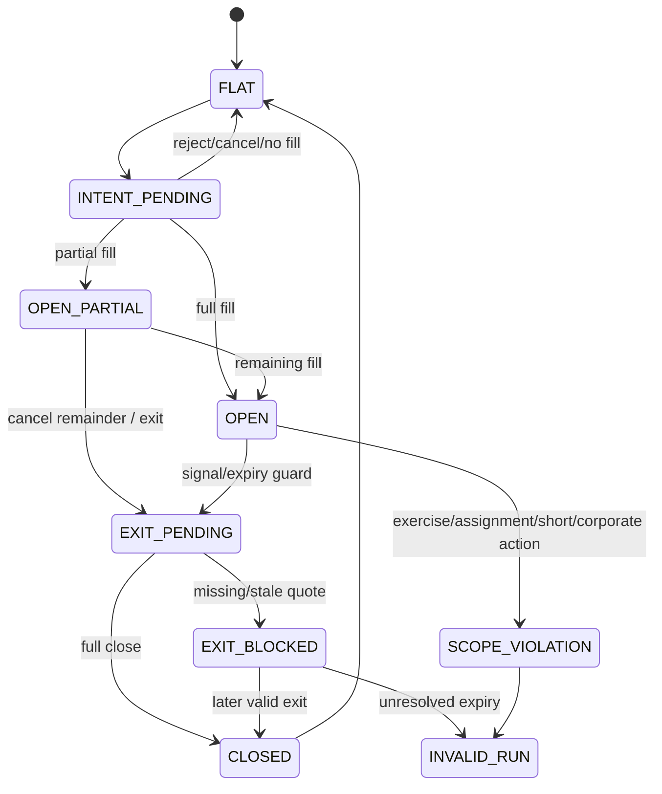
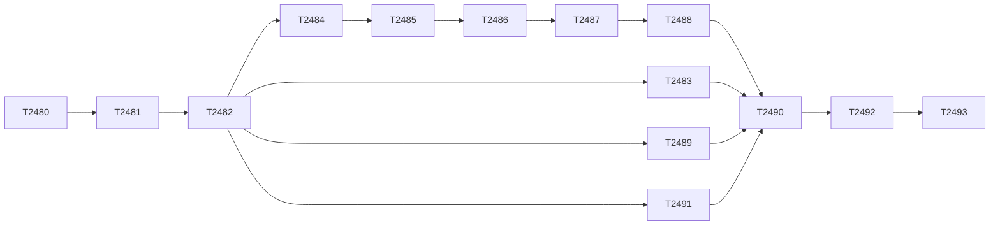

# QuantConnect QQQ 日频决策 / 分钟执行期权回测技术方案

最后更新：2026-08-02
任务：`TRADING-2478_QUANTCONNECT_QQQ_DAILY_OPTIONS_BACKTEST_CAPABILITY_TECHNICAL_PLAN_V1`
文档状态：`RECONCILED_TECHNICAL_PLAN_V1`
适用边界：research planning only；`production_effect=none`；`broker_action=none`

## 1. 结论

本模块的推荐判定是：

`CONDITIONAL_GO_FOR_CONTRACT_WAVE_AND_BOUNDED_CAPABILITY_PILOT`

同时保持：

`NO_GO_FOR_FULL_RANGE_OPTIONS_RESEARCH_OR_ANY_PROMOTION`

QuantConnect Free Cloud 可以作为 QQQ equity options 的受限云端执行与人工取证环境，适合先验证
daily signal、程序化选约、minute QuoteBar/TradeBar、订单/成交、现金账本、到期处理和结果下载。
它目前不应被当作本仓库的自动化 options data API、本地原始数据缓存、许可不受限的数据下载源，
也没有证据证明免费节点能够稳定完成从 `2021-02-22` 至今的全窗分钟期权回测。

第一阶段必须保持以下窄边界：

- underlying 仅 `QQQ`；
- initial cash 固定并由 run manifest 显式给出；
- signal/target 仍在已完成交易日上生成，沿用 daily decision grid；
- contract selection 与 order intent 程序化，但 execution 使用独立的 minute quote event；
- 只允许 single-leg、long call / long put、cash-only、无 short option、无 short QQQ；
- primary fill 不能使用 option daily close，不能使用同一选择 bar 的未来收盘；
- roll、multi-leg、short premium、LEAPS、Wheel、TQQQ Wheel 继续由独立 gate 阻断；
- 外部平台结果最多形成 `EXTERNAL_EXECUTION_EVIDENCE_*`，不能自动形成投资 PASS。

## 2. Web Pro 审阅与路由证据

- conversation：<https://chatgpt.com/c/6a6e3e7a-18ac-83ee-aca5-27f92aa0fef2>
- account plan label：`Pro`
- composer model label：`Pro`，菜单中 `Pro` 处于 checked 状态
- generation label：`Pro 思考中`
- response self-report：`GPT-5.6 Pro`
- route classification：`UI_PRO_AND_SELF_REPORT_PRO_ROUTE_UNVERIFIED`
- backend route：`CANNOT_VERIFY_EXACT_BACKEND_ROUTE`
- fallback：未观察到明确 fallback 提示，但无权威 route/fallback audit，故不能验证未发生 fallback
- advisory generation duration shown by UI：`27m 7s`

本次向网页发送的只有 public exact-commit URL、公开仓库事实、Owner 的规划问题和安全边界；没有发送
secret、cookie、credential、本地 cache、未跟踪 market data、known-unrelated artifact 或账户资料。网页回答
是外部 advisory，不是仓库 authority；本文件已按本地代码、项目治理和 QuantConnect 官方文档重新对账。

## 3. 证据分类

后续实现和报告必须区分：

1. `GIT_FIXED_COMMIT_FACT`：只来自固定提交
   `82e197399667f483aed6b5d87b20221e663e859e`；
2. `TIME_SENSITIVE_QC_OFFICIAL_FACT`：截至 2026-08-02 的 QuantConnect 官方页面事实；
3. `ENGINEERING_PROPOSAL`：尚未冻结的模块、schema、policy、时间线或测试建议；
4. `OWNER_DECISION_REQUIRED`：资金、DTE、moneyness/delta、liquidity、费用、滑点、容差等会影响
   投资解释的政策选择；
5. `UNVERIFIED`：需要真实 Free 组织 entitlement、bounded pilot 或书面许可答复才能闭合的事实。

## 4. 固定 Git 提交事实

|精确文件|读取|本地复核结论|
|---|---:|---|
|`AGENTS.md`|PASS|主研究窗口从 `2021-02-22` 开始；必须同时披露 requested/evaluated range；DQ、policy、fail-closed、serial contract wave 与 task register 规则适用。|
|`docs/research/current_research_strategy_execution_chain.md`|PASS|workflow PASS 不等于投资 PASS；PIT/no-future、input checksum 和独立证据链为现有治理基础。|
|`TRADING-865_to_878_Simple_Baseline_Portfolio_Control.md`|PASS|Options/LEAPS/Wheel 仍为 gated next stage，option-chain contract 是必要条件。|
|`TRADING-1129_to_1140_External_Backtest_Validation_Reconciliation.md`|PASS|现有 QuantConnect 只有 dry-run/preflight/manual reconciliation 设计，没有 options runner。|
|`TRADING-1155_to_1164_Manual_External_Platform_Evidence_and_Signoff.md`|PASS|人工 evidence/signoff 已有先例，平台缺证据时必须保持 blocked。|
|`simple_baseline_portfolio_control.py`|PASS|daily target 通过 lag 避免同日未来数据；`OPTIONS_RESEARCH_BLOCKED` 明列 bid/ask、IV/Greeks、expiration、assignment、early exercise 缺口。|
|`external_validation.py`|PASS|仅实现 weight-path replay、replication plan、preflight 和 manual evidence；无 API/CLI 云连接、期权链或订单生命周期实现。|
|`strategy_execution_policy_registry.yaml`|PASS|现有 `daily_close_next_day_v1` 为 after-close observation、next-trading-day execution、lag=1 的 sensitivity policy。|

`TRADING-2478` 是冻结提交之后的本地登记，只作为 Owner-authorized planning context，不声称由 Web Pro
从 Git 读取。

## 5. 截至 2026-08-02 的 QuantConnect 官方事实

以下事实均须在实现或 pilot 当日重新核验，不应永久硬编码为平台能力。

|主题|状态|官方事实与工程含义|
|---|---|---|
|Free Cloud 基础能力|CONFIRMED|Free tier 有 Web IDE、cloud backtest、Research Environment、一个免费 backtest node 和一个 research node；Free 可在 Cloud 使用 minute-to-daily Dataset Market 数据。API 与本地 CLI 属于 Quant Researcher 及以上。|
|US Equity Options 数据|CONFIRMED|AlgoSeek US Equity Options 从 2012-01 起，覆盖 minute/hour/daily，包含 TradeBar、QuoteBar 与 OI；历史请求无数据时返回 empty。QQQ 的逐日/逐合约实际完整度仍需 pilot。|
|IV/Greeks/OI 时点|CONFIRMED|option universe 的 IV/Greeks 是基于上一交易日结束数据预计算的 daily model values；OI 每日计算一次。它们不能被描述为 minute intraday market Greeks/OI。|
|Free 资源|CONFIRMED|首个组织有 `B-MICRO`（2 cores/3.3GHz/8GB），200 backtests/day；Free 只有一个 backtest node、10K orders/backtest、10KB logs/backtest、3MB logs/day；单次 backtest 最长 12h。Options processing 是内存密集场景。|
|全窗可行性|UNKNOWN|没有证据证明 8GB/12h 能完成 `2021-02-22` 至今的 minute QQQ option universe。必须从数日逐级扩到月/季/年/全窗，并记录 runtime/resource/evidence completeness。|
|Object Store|CONTRADICTED_FOR_FREE|Free algorithm 无权限写 organization Object Store，不能把它作为免费输入/输出总线。|
|本地下载与再分发|RESTRICTED|Cloud access 与 download license 分离；下载只允许 licensed organization 内部 LEAN 使用，不得再分发或转换格式。禁止把 QC raw chain/quote 写入 Git 或通过 logs 导出数据集。|
|结果出口|CONFIRMED_WITH_LIMITS|结果页可人工下载 Results、Orders CSV、Trades CSV、Logs、Report；Orders/Trades download timestamps 是 UTC。自定义完整 candidate chain、逐分钟 holdings/quotes、批量 API 拉取在 Free 的可行性仍 UNKNOWN。结果超过约 700MB 时可能无法上传。|
|默认 reality model|REQUIRES_OVERRIDE_REVIEW|Web Pro 依据官方页指出 options 会落入默认 fill/fee/exercise/assignment/settlement 行为，且默认 slippage 可能为零。项目不能把平台默认值直接当研究基准，必须显式记录并用项目 policy/validator 复核。|

主要官方来源：

- [Tier Features](https://www.quantconnect.com/docs/v2/cloud-platform/organizations/tier-features)
- [Organization Resources](https://www.quantconnect.com/docs/v2/cloud-platform/organizations/resources)
- [Backtest Deployment](https://www.quantconnect.com/docs/v2/cloud-platform/backtesting/deployment)
- [US Equity Options Dataset](https://www.quantconnect.com/docs/v2/writing-algorithms/datasets/algoseek/us-equity-options)
- [Equity Option Universes](https://www.quantconnect.com/docs/v2/writing-algorithms/universes/equity-options)
- [Option Handling Data](https://www.quantconnect.com/docs/v2/writing-algorithms/securities/asset-classes/equity-options/handling-data)
- [Backtest Results](https://www.quantconnect.com/docs/v2/cloud-platform/backtesting/results)
- [Object Store](https://www.quantconnect.com/docs/v2/cloud-platform/object-store)
- [Dataset Licensing](https://www.quantconnect.com/docs/v2/cloud-platform/datasets/licensing)
- [Fill Models](https://www.quantconnect.com/docs/v2/writing-algorithms/reality-modeling/trade-fills/key-concepts)
- [Slippage Models](https://www.quantconnect.com/docs/v2/writing-algorithms/reality-modeling/slippage/supported-models)
- [Option Exercise Orders](https://www.quantconnect.com/docs/v2/writing-algorithms/trading-and-orders/order-types/option-exercise-orders)
- [Assignment Model](https://www.quantconnect.com/docs/v2/writing-algorithms/reality-modeling/options-models/assignment)
- [Settlement](https://www.quantconnect.com/docs/v2/writing-algorithms/reality-modeling/settlement/key-concepts)
- [Corporate Actions](https://www.quantconnect.com/docs/v2/writing-algorithms/securities/asset-classes/us-equity/corporate-actions)

## 6. 本地对账：采纳、修正与保留项

### 6.1 采纳

- 先做 capability/licensing/evidence spike，再冻结 shared contract，最后才进入 adapter/pilot；
- daily signal 与 minute execution 分层，minute 数据只是 execution grid，不把策略扩成 intraday alpha；
- 第一切片只做 QQQ single-leg long premium；
- minute selection/fill 必须有严格事件序，禁止 same-bar lookahead；
- prior-day model delta/IV 与 daily OI 必须显式 freshness；
- fill、slippage、fees、cash settlement、expiry/exercise/corporate action 都必须进入版本化 policy；
- Free 结果通过 manual evidence bundle 回流，并由本地 validator 独立核对；
- bounded pilot 只验证平台合同与事件路径，不评价策略收益；
- full-range admission 是单独 gate，不能用多个重置现金的小窗口拼成全窗。

### 6.2 本地修正

1. Web Pro 使用了 `TRADING-2479` 作为 capability spike 占位，但跨线协调已将该 ID 保留给 Atlas
   historical projection review pack。本模块所有后续 ID 整体重映射为 `TRADING-2480` 至
   `TRADING-2493`，不改变依赖关系。
2. Web Pro 建议 `D+1 09:31` 选约、下一独立分钟下单。这里保留为 execution policy 候选，
   不是已审阅阈值；实现前必须由 policy owner 冻结主方案与 sensitivities。
3. 完整 `contract_candidate_snapshot` 可能包含受限 provider 字段。schema 必须支持
   `QC_ONLY_NOT_EXPORTED`、`EXPORT_ALLOWED_DERIVED`、`UNKNOWN_REQUIRES_LICENSE_REVIEW`；许可未闭合前
   不要求本地保存完整 chain 或 raw quote。
4. Web Pro 自述不能证明后端精确模型；本地记录 UI label/self-report，但结论保持
   `CANNOT_VERIFY_EXACT_BACKEND_ROUTE`。
5. 当前任务只登记开发波次，不更新 `docs/system_flow.md`。每个真正改变 CLI、schema、cache、DQ、
   backtest/report flow 的实现任务必须在同一变更更新 system flow。

### 6.3 继续 UNKNOWN

- QQQ 从 `2021-02-22` 至今目标 DTE/strike/quote 的逐日完整度；
- Free 项目文件是否能承载多年 signal artifact；
- Free B-MICRO 的真实 runtime/RAM 与全窗 admission；
- Free 结果页能否提供所需 engine/LEAN exact identity；
- 哪些 candidate/quote/Greeks/OI 派生字段允许被下载并本地留存；
- manual bundle 能否支持逐订单/账本核对，还是只能支持较弱的平台结果比对；
- paid tier 和数据许可的实际成本。

## 7. 推荐架构

```mermaid
flowchart LR
    A["Internal daily signal + DQ/PIT PASS"] --> B["Immutable run package"]
    B --> C["QC Free Cloud adapter"]
    C --> D["QQQ option universe"]
    D --> E["Deterministic contract selection"]
    E --> F["Next independent minute execution"]
    F --> G["Order/fill/cash/lifecycle ledger"]
    G --> H["Manual platform evidence bundle"]
    H --> I["Local ingest + validator"]
    I --> J["Reconciliation + Owner gate"]
    J -. "not automatic" .-> K["Research interpretation"]
```



建议模块边界：

```text
src/ai_trading_system/qqq_options_research/
  contracts.py
  signal_export.py
  policy.py
  selection.py
  execution.py
  accounting.py
  lifecycle.py
  evidence.py
  validation.py
  reconciliation.py
  qc_adapter/
    manifest_loader.py
    universe_adapter.py
    execution_adapter.py
    result_adapter.py
```

这是 proposal，不是当前已创建路径。真正实现前必须通过 governed task、contract wave、lease 和
`docs/system_flow.md` 同步。

## 8. 无未来数据时间线

推荐主语义：

|时点|允许动作|信息边界|
|---|---|---|
|D close 之后|生成 `daily_signal`|只能使用截至 D 正式收盘并已通过 DQ/PIT 的输入。|
|D close 至 D+1 open 前|冻结 run package|signal、policy、code SHA、requested range、initial cash 不可改写。|
|D+1 第一个完整 minute bar 后|生成 candidate snapshot|允许 prior-day Greeks/IV、daily OI 与截至该 bar 的 quote/trade；禁止未来 volume/quote。|
|下一独立 minute event|提交 order intent|选择事件与下单事件必须可区分；默认不允许同一 bar selection+fill。|
|submit 后首个合格 quote event|评估 fill|BUY 使用 ask-side，SELL 使用 bid-side；不得用 daily close 或未来 bar。|
|后续日|hold/exit/expiry guard|只使用当时可见信息；无有效 exit quote 时进入 typed blocked state。|

validator 默认要求：

```text
signal_as_of_ts
  < selection_snapshot_ts
  < order_intent_ts
  <= order_submit_ts
  < fill_quote_end_ts
  <= fill_ts
```

任何例外都必须由 reviewed execution policy 和 LEAN timestamp contract 显式允许。

## 9. 版本化合同

所有记录共用 envelope：`schema_name/version`、`run_id`、`created_at_utc`、`producer_version`、
`repository_code_sha`、`policy_id/version/hash`、source IDs/checksums、requested/evaluated range、timezone、
`dq_status`、`pit_status`、`content_sha256`。

|合同|主键|必要语义|
|---|---|---|
|`run_manifest`|`run_id`|initial cash、account type、range、subscriptions、normalization/mapping、signal/policy/code/engine/evidence identity。|
|`daily_signal`|artifact + signal date|as-of、generated-at、earliest effective session、LONG_CALL/LONG_PUT/FLAT mapping、lineage。|
|`contract_candidate_snapshot`|run + selection time + SID|right/expiry/strike/DTE、moneyness、prior-day model fields、daily OI、quote validity、eligibility、export classification。|
|`selection_decision`|run + decision ID|selected SID、stable rank tuple、rejected counts、no-contract reason、candidate digest。|
|`order_intent`|run + intent ID|side、quantity、order type/limit、cash reservation、not-before time、decision lineage。|
|`order` / `fill`|platform order + sequence|submit/update/cancel/reject/fill/partial、timestamps、fees、quote lineage、settlement。|
|`position_lifecycle`|position + event sequence|state transition、quantity/cash delta、expiry/exercise/assignment/corporate-action reason。|
|`portfolio_snapshot`|run + timestamp|settled/unsettled/reserved cash、option value、fees、realized/unrealized P&L。|
|`dq_report`|run + scope + version|coverage、missing sessions、quote/OI/Greeks freshness、calendar/mapping/PIT checks。|
|`platform_evidence_manifest`|run + bundle ID|backtest ID、tier、engine identity、files/checksums、collector、license classification、limitations。|
|`reconciliation_report`|run + check ID|local/platform values、delta、tolerance、difference class、explanation、status。|

金额使用 decimal/fixed-point USD；option quote 单位是每股 premium，现金影响必须乘实际 contract
multiplier。UTC 为存储权威时间，同时保留 `America/New_York` exchange time。

## 10. 选择、执行、会计与生命周期

### 10.1 Contract selection

所有 right、DTE、moneyness/delta、quote age、spread、OI、volume、premium budget、tie-break 都必须进入
带 owner/version/rationale/review/expiry 的 policy，不能散落在代码中。

候选过滤顺序：

```text
signal -> right -> expiry/DTE -> moneyness/prior-day delta
       -> quote validity -> liquidity -> deterministic rank
       -> selected SID | NO_ELIGIBLE_CONTRACT
```

无合格合约时保持 cash；不得自动放宽 DTE/spread/OI、换 right/underlying 或改用 daily close。

### 10.2 Execution/reality model

主方案应是 quote-side marketable limit，而不是乐观 market fill：

- entry buy 基于有效 ask；exit sell 基于有效 bid；
- fill event 严格晚于 intent；
- limit 是价格上/下界，允许 no-fill；
- stale、missing-side、zero ask、crossed quote 默认 fail closed；
- partial fill、reject、cancel、timeout 与 quote size 必须进入 ledger；
- 至少比较 spread-only、fixed-tick stress、fixed-bps stress、one-bar-delay stress；
- fee/slippage/fill/settlement model class 与版本必须记录。

### 10.3 Cash accounting

显式 USD cash account；`initial_cash` 只来自 run manifest。维护 settled、unsettled、reserved cash。

```text
gross_premium = fill_price_per_share * multiplier * filled_contracts
entry_cash_delta = -gross_premium - fees
exit_cash_delta  = +gross_proceeds - fees
```

multiplier 从平台 symbol properties 读取；policy 可以预期 100，但实际不匹配时必须 fail closed。不能用
通用 `SetHoldings` 隐式推导合约数；数量必须基于 premium budget、fees、buffer 和 settled cash 显式计算。

### 10.4 Lifecycle



第一阶段采用 pre-expiry mandatory exit policy。long call 自动行权可能产生 QQQ shares；long put 行权可能
产生 short QQQ；这两种结果都超出第一阶段范围。任何 assignment 事件意味着出现意外 short option 或
映射错误，run 应标记 `INVALID_UNEXPECTED_ASSIGNMENT`。underlying corporate action 导致平台关闭 option
时必须独立归类，不能伪装为策略 exit。

## 11. Free 手工证据包

Free pilot 不假设 API/CLI/Object Store。推荐人工收集：

```text
evidence/<run_id>/
  run_manifest.json
  input_manifest.json
  signal_manifest.json
  policy_manifest.json
  qc_project_file_manifest.json
  backtest_identity.json
  downloaded_results.json
  downloaded_orders.csv
  downloaded_trades.csv
  downloaded_logs.txt
  report.pdf                    # 若可用
  screenshots_manifest.json
  collection_attestation.yaml
  checksums.sha256
```

attestation 记录 collector、collected_at、platform backtest ID/name、tier、requested/evaluated range、
缺失文件、人工重命名/转换、第二人复核和所有文件 checksum。日志只允许 run ID、阶段、counts、reason
codes、hashes 和 fatal error；禁止逐合约/逐分钟 raw data dump。

## 12. Fail-closed 状态

|失败|状态|行为|
|---|---|---|
|manifest/policy/checksum 不匹配|`INVALID_INPUT_LINEAGE` / `POLICY_NOT_ACTIVE`|不启动交易逻辑。|
|DQ/PIT 或 chronology 失败|`DQ_PIT_BLOCKED` / `SIGNAL_CHRONOLOGY_INVALID`|不下单，不静默缩窗。|
|chain 为空或无合格合约|`CHAIN_UNAVAILABLE` / `NO_ELIGIBLE_CONTRACT`|保持 cash，不放宽 policy。|
|Greeks/OI as-of 不明|`FEATURE_FRESHNESS_UNKNOWN`|相关字段不得用于选择。|
|quote 缺失/过期/倒挂/零 ask|`QUOTE_INVALID`|不下单或 exit blocked。|
|same-bar/future fill|`FUTURE_DATA_OR_SAME_BAR_FILL`|run invalid。|
|cash、partial fill、fee 无法复算|`FILL_ACCOUNTING_MISMATCH`|run invalid。|
|出现 short/assignment/未解决 expiry|`PROHIBITED_SHORT_POSITION` / `UNEXPECTED_ASSIGNMENT` / `UNRESOLVED_EXPIRY`|run invalid。|
|Free 超时/RAM/10K orders|`PLATFORM_RESOURCE_LIMIT`|不拆窗后伪报全窗。|
|结果/日志/file quota 截断|`PLATFORM_EVIDENCE_TRUNCATED`|evidence incomplete。|
|字段出口许可不明|`LICENSE_EVIDENCE_BLOCKED`|不导出，后续实现 blocked。|
|人工 bundle 缺文件/checksum|`MANUAL_COLLECTION_INCOMPLETE`|reconciliation 不通过。|
|QC PASS、本地 FAIL|`EXTERNAL_PASS_INTERNAL_FAIL`|内部结论保持 FAIL。|

## 13. 测试与 reconciliation

测试层级：

- unit：calendar/timezone/DST、DTE、moneyness、freshness、quote validity、stable tie-break、cash、
  partial fill、settlement、lifecycle；
- contract：schema/enums/units/PK/checksum/lineage/range/unknown-field/migration；
- golden：valid/stale/crossed/missing quote、no-contract、partial/reject/insufficient cash、ITM call/put
  expiry、corporate action；
- property：cash non-negative、no short、fill after intent、selection deterministic、cash delta 可复算、
  quantity equals cumulative fills；
- synthetic integration：signal → selection → intent → fill → cash → lifecycle → evidence → reconciliation；
- manual cloud smoke：极短 preregistered range、最多一张合约、禁止 optimization/full-chain logs；
- local reconciliation：identity/input/execution/accounting/path metrics 分层，研究结论仍由 Owner 独立判断。

差异只能归为 `LOGIC`、`PLATFORM`、`PROVIDER`、`TIMING`、`REALITY_MODEL`、`LICENSE`、
`MANUAL_COLLECTION`，并有 owner、证据、影响和 `ACCEPTED_EXPLAINED / REQUIRES_FIX /
BLOCKED_EVIDENCE / INVALID_RUN` disposition。

## 14. 后续任务与依赖

Web Pro 的任务号已因 `TRADING-2479` 被 Atlas 线保留而整体加一。本模块使用：

|ID|scope|阶段|
|---|---|---|
|`TRADING-2480`|Free capability / licensing / evidence spike|serial admission|
|`TRADING-2481`|shared schema and policy freeze|serial contract|
|`TRADING-2482`|DQ/PIT/cache/evidence identity|serial contract|
|`TRADING-2483`|internal signal and run manifest export|parallel lane|
|`TRADING-2484`|QuantConnect project adapter contract|parallel lane|
|`TRADING-2485`|QQQ option universe and deterministic selection|parallel lane|
|`TRADING-2486`|minute execution and reality model|parallel lane|
|`TRADING-2487`|cash/premium/settlement accounting|parallel lane|
|`TRADING-2488`|lifecycle/expiry/corporate-action safety|parallel lane|
|`TRADING-2489`|platform evidence/manual bundle|parallel lane|
|`TRADING-2490`|local ingest/validator/reconciliation|integration lane|
|`TRADING-2491`|cross-layer fixtures/validation harness|shared QA|
|`TRADING-2492`|bounded Free Cloud pilot|manual external action gate|
|`TRADING-2493`|Owner stage-gate signoff|decision gate|



推荐八周排序是工作顺序，不是交付承诺：第 1 周 2480；第 2 周 2481/2482；第 3 周并行
2483/2484/2489/2491；第 4 周 2485/2486；第 5 周 2487/2488；第 6 周 2490；第 7 周 2492；
第 8 周差异闭合与 2493。若 2480 得到 `CAPABILITY_OR_LICENSE_BLOCKED`，平台实现和 pilot 不启动，
仅允许继续不依赖真实平台数据的 synthetic contract/core 或另立替代平台评估。

## 15. Owner 决策清单

在 `TRADING-2480` 之外，Owner 仍需逐项决定：

- initial cash 与是否只允许 USD；
- signal 到 LONG_CALL/LONG_PUT/FLAT 的映射；
- premium budget、最大合同数、cash/fee buffer；
- DTE 定义与范围；主选约使用 moneyness 还是 prior-day model delta；
- quote age、spread、OI、volume 和 size 的 policy；
- primary selection/submit minute 与 sensitivities；
- limit buffer、partial-fill timeout、slippage 和 fee model；
- expiry guard 与 exercise/corporate-action invalidation scope；
- permitted export fields 与 manual evidence reviewer；
- reconciliation tolerance/rounding；
- Free pilot 最大范围、资源 safety margin 与 paid-tier/许可预算门。

## 16. 最终边界

当前允许：冻结技术设计、登记任务、准备 serial contract wave，并在 Owner 另行授权后执行 bounded
capability/licensing/evidence spike。

当前不允许：创建/修改 QuantConnect 项目、登录 QuantConnect、运行 cloud backtest、下载 options raw
data、paper/live/broker action、参数优化、全窗结果宣称、strategy promotion、short/multi-leg/roll/LEAPS/Wheel。

本文件不修改运行时数据流，因此本任务不更新 `docs/system_flow.md`；后续任何真正实现上述 proposed
flow 的任务必须同步更新该 source-of-truth diagram。
