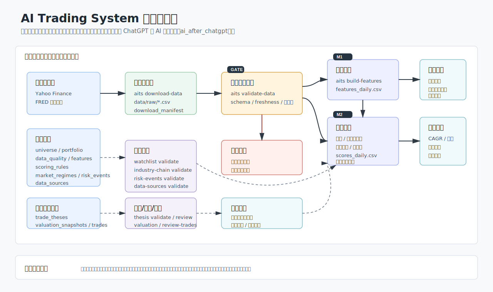
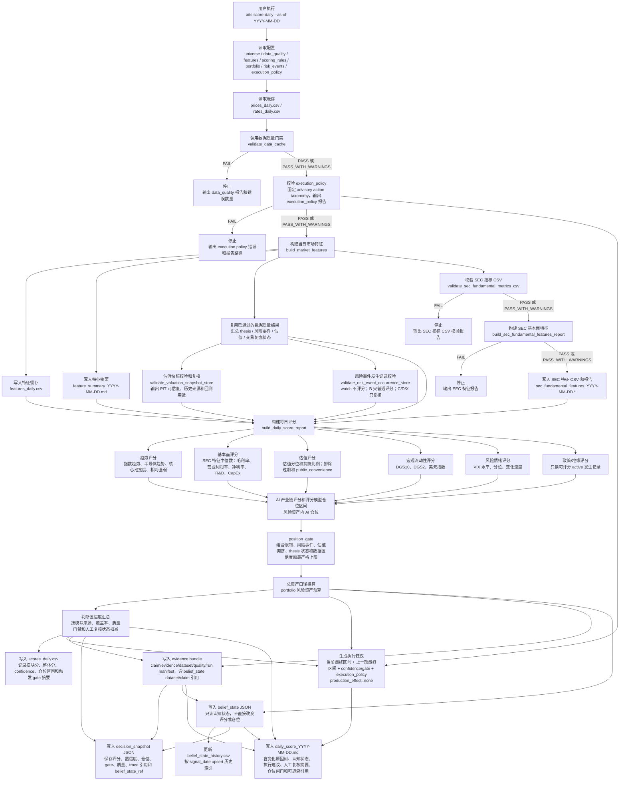
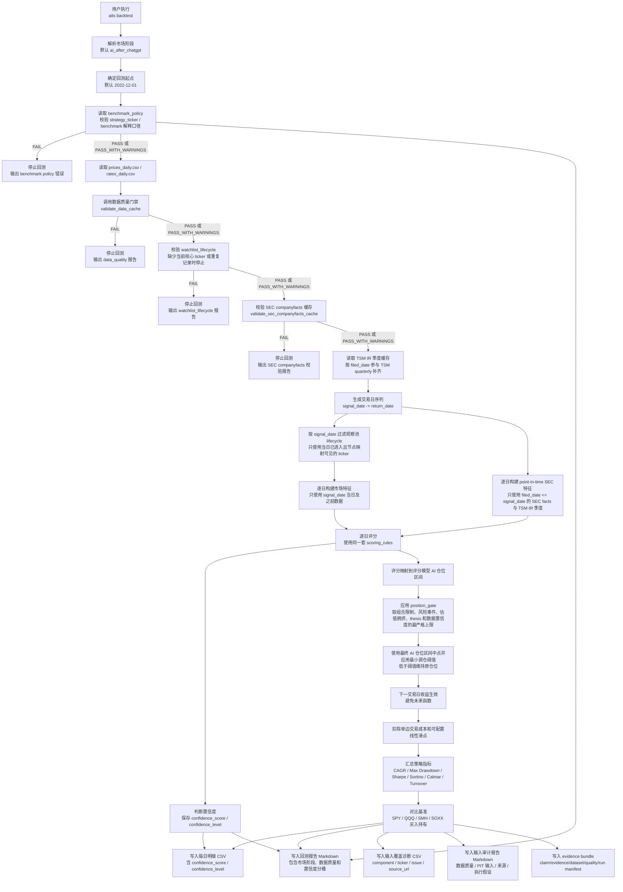
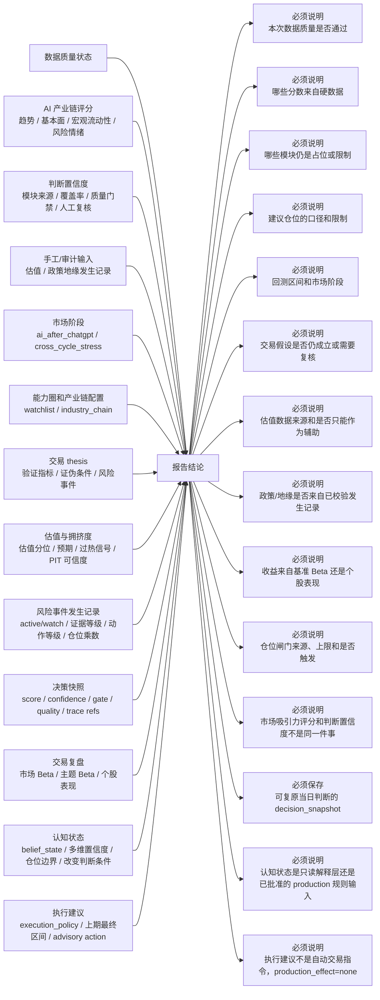
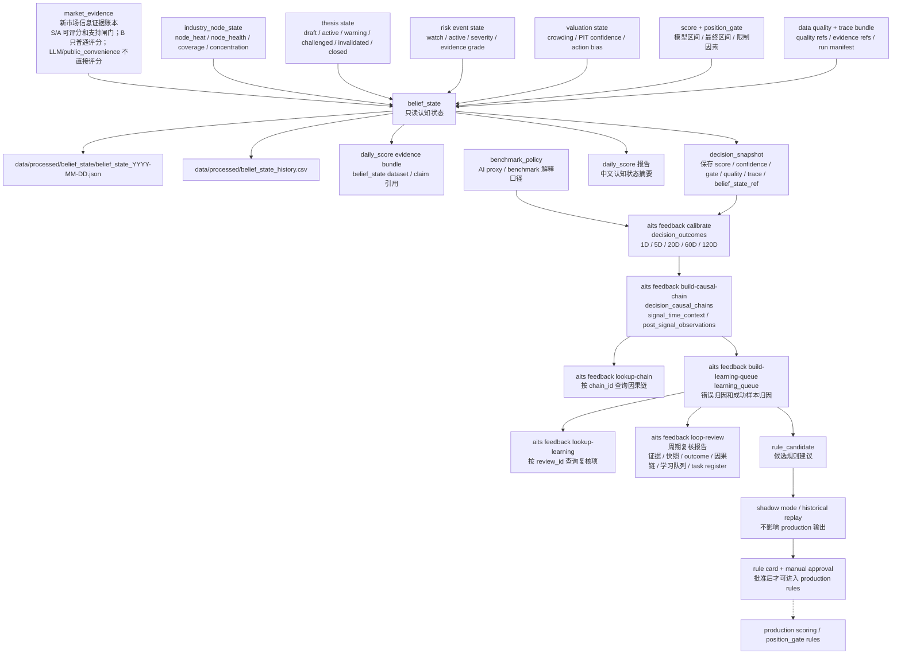
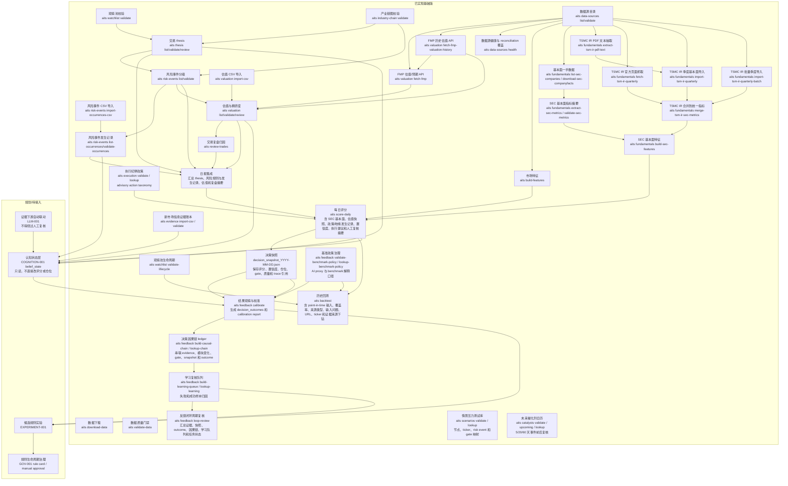

# 系统数据流示意图

本文档是系统从数据输入、中间评估到输出结论的流程图。它不是一次性说明文档，而是工程事实的一部分：后续新增命令、数据源、配置、评分模块、回测路径或报告输出时，必须同步维护本文件。

## 维护边界

必须更新本文件的情况：

- 新增、删除或改名 CLI 命令。
- 新增、删除或改名关键配置文件。
- 改变 `data/raw`、`data/processed`、`outputs/reports`、`outputs/backtests` 的核心文件结构。
- 改变数据质量门禁位置、通过条件或失败后的停止行为。
- 改变评分模块、仓位映射、回测默认市场阶段或报告结论结构。
- 接入或改变交易 thesis、风险事件、估值、新闻、认知状态、复盘归因等模块。

不需要更新本文件的情况：

- 不改变外部行为的内部重构。
- 不改变字段含义、命令输入输出或报告解释的性能优化。
- 单元测试、类型标注、格式化等纯工程维护。

## 总览

```mermaid
flowchart TD
    subgraph Source["数据输入"]
        U["config/universe.yaml<br/>标的池、基准、利率序列"]
        P["config/portfolio.yaml<br/>风险资产预算和仓位上限"]
        Q["config/data_quality.yaml<br/>质量阈值"]
        F["config/features.yaml<br/>特征窗口和相对强弱组合"]
        S["config/scoring_rules.yaml<br/>评分权重、仓位动作阈值和 position_gates 上限"]
        W["config/watchlist.yaml<br/>观察池与能力圈"]
        WL["config/watchlist_lifecycle.yaml<br/>观察池 point-in-time 生命周期"]
        I["config/industry_chain.yaml<br/>产业链节点与因果图"]
        R["config/market_regimes.yaml<br/>AI regime 与压力测试区间"]
        BPC["config/benchmark_policy.yaml<br/>AI proxy 与 benchmark 解释口径"]
        SCC["config/scenario_library.yaml<br/>AI 产业链情景压力测试库"]
        CTC["config/catalyst_calendar.yaml<br/>未来催化剂日历和事件前/后复核要求"]
        EPC["config/execution_policy.yaml<br/>advisory execution action taxonomy 和执行纪律"]
        GOVC["config/rule_cards.yaml<br/>production / candidate / retired rule cards"]
        RE["config/risk_events.yaml<br/>L1/L2/L3 风险事件动作规则"]
        REX["data/external/risk_event_occurrences/*.yaml<br/>已触发/观察的风险事件发生记录<br/>S/A/B/C/D/X、严重性、概率、动作等级"]
        REXCSV["data/external/risk_event_imports/*.csv<br/>人工复核后的风险事件发生记录导入表"]
        RPRCSV["data/external/risk_event_prereview_imports/*.csv<br/>OpenAI 结构化预审结果导入表"]
        ME["data/external/market_evidence/*.yaml<br/>新市场信息证据账本"]
        MECSV["data/external/market_evidence_imports/*.csv<br/>人工复核或 LLM 分类后的 evidence 导入表"]
        DS["config/data_sources.yaml<br/>数据源目录、审计字段、来源限制"]
        SEC["config/sec_companies.yaml<br/>SEC CIK、taxonomy 预期和指标周期"]
        FM["config/fundamental_metrics.yaml<br/>SEC 指标映射、支撑指标和派生规则"]
        FF["config/fundamental_features.yaml<br/>SEC 基本面特征公式和周期偏好"]
        TSMPDF["TSMC IR Management Report PDF<br/>官方季度资料 PDF"]
        TSMTXT["TSMC IR Management Report 文本<br/>官方季度资料的已抽取文本"]
        TSMMAN["TSMC IR 批量导入 manifest CSV<br/>季度、官方 URL 和本地文本路径"]
        TH["data/external/trade_theses/*.yaml<br/>交易假设、验证指标、证伪条件"]
        VS["data/external/valuation_snapshots/*.yaml<br/>估值、预期、拥挤度快照<br/>PIT 可信度和回测用途"]
        VSCSV["data/external/valuation_imports/*.csv<br/>结构化估值/预期导入表"]
        TD["data/external/trades/*.yaml<br/>交易记录、价格、thesis_id"]
        MD["外部数据源<br/>Yahoo Finance / FRED"]
        FMP["Financial Modeling Prep API<br/>quote / TTM metrics / historical metrics / ratios / estimates<br/>provider symbol alias 可审计记录"]
    end

    subgraph Cache["本地缓存"]
        DL["aits download-data"]
        PR["data/raw/prices_daily.csv"]
        RR["data/raw/rates_daily.csv"]
        DM["data/raw/download_manifest.csv<br/>provider / endpoint / 参数 / checksum"]
        SFD["aits fundamentals download-sec-companyfacts"]
        SFV["aits fundamentals validate-sec-companyfacts"]
        SFJ["data/raw/sec_companyfacts/*.json"]
        SFM["data/raw/sec_companyfacts/sec_companyfacts_manifest.csv"]
        SFVR["outputs/reports/sec_companyfacts_validation_YYYY-MM-DD.md"]
        SFE["aits fundamentals extract-sec-metrics"]
        SFVC["aits fundamentals validate-sec-metrics"]
        SFC["data/processed/sec_fundamentals_YYYY-MM-DD.csv"]
        SFR["outputs/reports/sec_fundamentals_YYYY-MM-DD.md"]
        SFCR["outputs/reports/sec_fundamentals_validation_YYYY-MM-DD.md"]
        SFF["aits fundamentals build-sec-features"]
        SFFC["data/processed/sec_fundamental_features_YYYY-MM-DD.csv"]
        SFFR["outputs/reports/sec_fundamental_features_YYYY-MM-DD.md"]
        TSMP["aits fundamentals extract-tsm-ir-pdf-text"]
        TSMF["aits fundamentals fetch-tsm-ir-quarterly"]
        TSMI["aits fundamentals import-tsm-ir-quarterly"]
        TSMIB["aits fundamentals import-tsm-ir-quarterly-batch"]
        TSMM["aits fundamentals merge-tsm-ir-sec-metrics"]
        TSMC["data/processed/tsm_ir_quarterly_metrics.csv"]
        TSMPR["outputs/reports/tsm_ir_pdf_text_YYYY-MM-DD.md"]
        TSMR["outputs/reports/tsm_ir_quarterly_YYYY_Qn_YYYY-MM-DD.md"]
        TSMBR["outputs/reports/tsm_ir_quarterly_batch_YYYY-MM-DD.md"]
        FMPH["data/raw/fmp_analyst_estimates/*.json<br/>FMP analyst estimates 原始历史快照"]
        FMPVH["data/raw/fmp_historical_valuation/*.json<br/>FMP historical key-metrics/ratios 原始响应"]
    end

    subgraph Gate["数据质量门禁"]
        V["aits validate-data<br/>schema / completeness / freshness / duplicate keys / suspicious values"]
        QR["outputs/reports/data_quality_YYYY-MM-DD.md"]
        Stop["停止后续评分、特征、回测或报告"]
    end

    subgraph Feature["中间评估：市场特征"]
        BF["aits build-features"]
        FT["data/processed/features_daily.csv"]
        FR["outputs/reports/feature_summary_YYYY-MM-DD.md"]
    end

    subgraph Score["中间评估：评分和仓位"]
        SD["aits score-daily"]
        PG["position_gate<br/>评分仓位、组合限制、风险事件、估值拥挤、thesis 和数据置信度取最严格上限"]
        CONF["判断置信度<br/>按模块来源、覆盖率、质量门禁和人工复核汇总"]
        SC["data/processed/scores_daily.csv<br/>模块分、整体分、confidence、仓位区间和 gate 摘要"]
        EADV["执行建议<br/>execution_policy + 最终仓位变化 + confidence/gate<br/>production_effect=none"]
        EPR["outputs/reports/execution_policy_YYYY-MM-DD.md<br/>动作词表校验和问题清单"]
        DR["outputs/reports/daily_score_YYYY-MM-DD.md<br/>评分、置信度、变化原因树、认知状态、执行建议和仓位闸门"]
        DSNAP["data/processed/decision_snapshots/decision_snapshot_YYYY-MM-DD.json<br/>当日判断快照和 belief_state_ref"]
        BS["data/processed/belief_state/belief_state_YYYY-MM-DD.json<br/>只读认知状态"]
        BSH["data/processed/belief_state_history.csv<br/>只读认知状态历史索引"]
        DRT["outputs/reports/evidence/daily_score_YYYY-MM-DD_trace.json<br/>claim / evidence / dataset / quality / run manifest / belief_state"]
    end

    subgraph Backtest["历史回测"]
        BT["aits backtest"]
        BWATCH["point-in-time 观察池<br/>按 signal_date 过滤 lifecycle 可见 ticker"]
        BSEC["point-in-time SEC 基本面特征<br/>按 signal_date 只读已披露 companyfacts 与 TSM IR"]
        BVAL["point-in-time 估值快照<br/>按 signal_date 过滤 as_of/captured_at"]
        BRISK["point-in-time 风险事件发生记录<br/>按 signal_date 过滤证据和 resolved_at"]
        BD["outputs/backtests/backtest_daily_YYYY-MM-DD_YYYY-MM-DD.csv<br/>含 confidence_score / confidence_level"]
        BR["outputs/backtests/backtest_YYYY-MM-DD_YYYY-MM-DD.md<br/>含判断置信度分桶和基准政策解释"]
        BA["outputs/backtests/backtest_audit_YYYY-MM-DD_YYYY-MM-DD.md<br/>输入审计状态、发现和修复建议"]
        BRT["outputs/backtests/evidence/backtest_YYYY-MM-DD_YYYY-MM-DD_trace.json<br/>claim / evidence / dataset / quality / run manifest"]
    end

    subgraph Trace["报告反查"]
        TLK["aits trace lookup<br/>按 claim/evidence/dataset/quality/run id 反查 evidence bundle"]
    end

    subgraph Feedback["反馈校准"]
        FBC["aits feedback calibrate<br/>先执行数据质量门禁，再观察历史 decision_snapshot"]
        DOCSV["data/processed/decision_outcomes.csv<br/>1D/5D/20D/60D/120D outcome"]
        DCR["outputs/reports/decision_calibration_YYYY-MM-DD.md<br/>分桶校准、样本限制和基准政策解释"]
        FCC["aits feedback build-causal-chain<br/>串联 snapshot、trace evidence、模块变化、gate 和 outcome"]
        DCC["data/processed/decision_causal_chains.json<br/>signal_time_context + post_signal_observations"]
        DCCR["outputs/reports/decision_causal_chains_YYYY-MM-DD.md<br/>因果链摘要和质量状态"]
        FCL["aits feedback lookup-chain<br/>按 chain_id 查询因果链"]
        FLQ["aits feedback build-learning-queue<br/>结果归因和学习复核队列"]
        DLQ["data/processed/decision_learning_queue.json<br/>归因分类、owner、next step、规则候选标记"]
        DLQR["outputs/reports/decision_learning_queue_YYYY-MM-DD.md<br/>学习队列摘要和样本限制"]
        FLL["aits feedback lookup-learning<br/>按 review_id 查询复核项"]
        FRE["aits feedback build-rule-experiments<br/>候选规则实验台账"]
        REXP["data/processed/rule_experiments.json<br/>replay / forward shadow 计划，production_effect=none"]
        REXPR["outputs/reports/rule_experiments_YYYY-MM-DD.md<br/>规则候选、验证计划和治理边界"]
        FRL["aits feedback lookup-rule-experiment<br/>按 candidate_id 查询规则实验"]
        FGV["aits feedback validate-rule-cards<br/>规则生命周期校验"]
        GVR["outputs/reports/rule_governance_YYYY-MM-DD.md<br/>rule card 校验和复核到期状态"]
        FGL["aits feedback lookup-rule-card<br/>按 rule_id 查询 rule card"]
        FBPV["aits feedback validate-benchmark-policy<br/>AI proxy / benchmark policy 校验"]
        BPR["outputs/reports/benchmark_policy_YYYY-MM-DD.md<br/>基准角色、选择口径和问题清单"]
        FBPL["aits feedback lookup-benchmark-policy<br/>按 ticker 或 basket 查询基准口径"]
        FLR["aits feedback loop-review<br/>周期性闭环复核"]
        FLRR["outputs/reports/feedback_loop_review_YYYY-MM-DD.md<br/>证据、快照、outcome、因果链、学习队列和任务状态"]
    end

    subgraph Governance["结构校验"]
        WV["aits watchlist validate"]
        WR["outputs/reports/watchlist_validation_YYYY-MM-DD.md"]
        WVL["aits watchlist validate-lifecycle"]
        WLR["outputs/reports/watchlist_lifecycle_YYYY-MM-DD.md"]
        IV["aits industry-chain validate"]
        IR["outputs/reports/industry_chain_validation_YYYY-MM-DD.md"]
        RV["aits risk-events validate"]
        RVR["outputs/reports/risk_events_validation_YYYY-MM-DD.md"]
        ROI["aits risk-events import-occurrences-csv"]
        ROIR["outputs/reports/risk_event_occurrence_import_YYYY-MM-DD.md"]
        RPI["aits risk-events import-prereview-csv<br/>OpenAI 输出只进入待人工复核队列"]
        RPQ["data/processed/risk_event_prereview_queue.json<br/>llm_extracted / pending_review 预审队列"]
        RPIR["outputs/reports/risk_event_prereview_import_YYYY-MM-DD.md"]
        ROV["aits risk-events validate-occurrences"]
        ROR["outputs/reports/risk_event_occurrences_YYYY-MM-DD.md"]
        DSV["aits data-sources validate"]
        DSR["outputs/reports/data_sources_validation_YYYY-MM-DD.md"]
        DSH["aits data-sources health<br/>provider health score + reconciliation 覆盖"]
        DSHR["outputs/reports/data_sources_health_YYYY-MM-DD.md<br/>manifest/cache/checksum/freshness/coverage"]
        EVI["aits evidence import-csv"]
        EV["aits evidence validate"]
        EVIR["outputs/reports/market_evidence_import_YYYY-MM-DD.md"]
        EVR["outputs/reports/market_evidence_YYYY-MM-DD.md"]
        SCV["aits scenarios validate<br/>情景库节点/ticker/risk event/gate 映射校验"]
        SCR["outputs/reports/scenario_library_YYYY-MM-DD.md<br/>情景映射和人工复核要求"]
        SCL["aits scenarios lookup<br/>按 scenario_id 查询情景"]
        CTV["aits catalysts validate / upcoming<br/>未来 5/20/60 天催化剂分桶"]
        CTR["outputs/reports/catalyst_calendar_YYYY-MM-DD.md<br/>upcoming catalyst 和复核要求"]
        CTL["aits catalysts lookup<br/>按 catalyst_id 查询事件"]
        EPV["aits execution validate<br/>校验 advisory action taxonomy"]
        EPRG["outputs/reports/execution_policy_YYYY-MM-DD.md<br/>执行政策校验报告"]
        EPL["aits execution lookup<br/>按 action_id 查询执行动作"]
    end

    subgraph Thesis["交易假设复核"]
        TL["aits thesis list"]
        TV["aits thesis validate"]
        TR["aits thesis review"]
        TVR["outputs/reports/thesis_validation_YYYY-MM-DD.md"]
        TRR["outputs/reports/thesis_review_YYYY-MM-DD.md"]
    end

    subgraph Valuation["估值与拥挤度复核"]
        VF["aits valuation fetch-fmp"]
        VHF["aits valuation fetch-fmp-valuation-history"]
        VFR["outputs/reports/fmp_valuation_fetch_YYYY-MM-DD.md"]
        VHFR["outputs/reports/fmp_historical_valuation_fetch_YYYY-MM-DD.md"]
        VI["aits valuation import-csv"]
        VIR["outputs/reports/valuation_import_YYYY-MM-DD.md"]
        VFH["aits valuation validate-fmp-history"]
        VFHR["outputs/reports/fmp_analyst_history_validation_YYYY-MM-DD.md"]
        VL["aits valuation list"]
        VV["aits valuation validate"]
        VR["aits valuation review"]
        VVR["outputs/reports/valuation_validation_YYYY-MM-DD.md"]
        VRR["outputs/reports/valuation_review_YYYY-MM-DD.md"]
    end

    subgraph TradeReview["交易复盘归因"]
        RT["aits review-trades"]
        RTR["outputs/reports/trade_review_YYYY-MM-DD.md"]
    end

    MD --> DL
    U --> DL
    DS --> DL
    DL --> PR
    DL --> RR
    DL --> DM
    SEC --> SFD
    DS --> SFD
    SFD --> SFJ
    SFD --> SFM
    SFJ --> SFV
    SFM --> SFV
    SFV --> SFVR
    SEC --> SFE
    FM --> SFE
    SFJ --> SFE
    SFM --> SFE
    SFE --> SFVR
    SFE --> SFC
    SFE --> SFR
    SFC --> SFVC
    SEC --> SFVC
    FM --> SFVC
    SFVC --> SFCR
    SFC --> SFF
    SEC --> SFF
    FM --> SFF
    FF --> SFF
    SFF --> SFCR
    SFF --> SFFC
    SFF --> SFFR
    DS --> TSMP
    TSMPDF --> TSMP
    TSMP --> TSMTXT
    TSMP --> TSMPR
    DS --> TSMF
    TSMF --> TSMTXT
    TSMF --> TSMC
    TSMF --> TSMR
    TSMTXT --> TSMI
    DS --> TSMI
    TSMI --> TSMC
    TSMI --> TSMR
    TSMTXT --> TSMIB
    TSMMAN --> TSMIB
    DS --> TSMIB
    TSMIB --> TSMC
    TSMIB --> TSMBR
    TSMC --> TSMM
    SEC --> TSMM
    FM --> TSMM
    TSMM --> SFC
    TSMM --> SFCR

    U --> V
    Q --> V
    DS --> V
    PR --> V
    RR --> V
    V -->|通过或 PASS_WITH_WARNINGS| QR
    V -->|FAIL| Stop

    PR --> BF
    RR --> BF
    F --> BF
    W --> BF
    QR --> BF
    BF --> FT
    BF --> FR

    FT --> SD
    QR --> SD
    S --> SD
    P --> SD
    EPC --> SD
    SEC --> SD
    FM --> SD
    FF --> SD
    SFC --> SD
    TH --> SD
    RE --> SD
    REX --> SD
    VS --> SD
    TD --> SD
    SD --> SFCR
    SD --> SFFC
    SD --> SFFR
    SD --> EPR
    SD --> PG
    PG --> SC
    PG --> DR
    PG --> DRT
    PG --> CONF
    PG --> EADV
    CONF --> SC
    CONF --> DR
    CONF --> DSNAP
    CONF --> EADV
    EPC --> EADV
    EADV --> DR
    EADV --> DRT
    DRT --> DSNAP

    PR --> BT
    RR --> BT
    F --> BT
    S --> BT
    P --> BT
    W --> BT
    WL --> BT
    R --> BT
    BPC --> BT
    QR --> BT
    SEC --> BT
    FM --> BT
    FF --> BT
    SFJ --> BT
    SFM --> BT
    TSMC --> BT
    VS --> BT
    RE --> BT
    REX --> BT
    BT --> BSEC
    BT --> BVAL
    BT --> BRISK
    BT --> BWATCH
    BWATCH --> BD
    BSEC --> BD
    BVAL --> BD
    BRISK --> BD
    BT --> BD
    BT --> BR
    BT --> BA
    BT --> BRT
    DRT --> TLK
    BRT --> TLK
    DSNAP --> FBC
    PR --> FBC
    RR --> FBC
    BPC --> FBC
    FBC --> DOCSV
    FBC --> DCR
    DSNAP --> FCC
    DOCSV --> FCC
    DRT --> FCC
    FCC --> DCC
    FCC --> DCCR
    DCC --> FCL
    DCC --> FLQ
    FLQ --> DLQ
    FLQ --> DLQR
    DLQ --> FLL
    DLQ --> FRE
    FRE --> REXP
    FRE --> REXPR
    REXP --> FRL
    GOVC --> FGV
    REXP --> FGV
    FGV --> GVR
    GOVC --> FGL
    BPC --> FBPV
    FBPV --> BPR
    BPC --> FBPL
    EVI --> FLR
    DSNAP --> FLR
    DOCSV --> FLR
    DCC --> FLR
    DLQ --> FLR
    REXP --> FLR
    FLR --> FLRR

    U --> WV
    W --> WV
    I --> WV
    WV --> WR
    WL --> WVL
    W --> WVL
    U --> WVL
    WVL --> WLR
    I --> IV
    W --> IV
    IV --> IR
    RE --> RV
    I --> RV
    W --> RV
    U --> RV
    RV --> RVR
    RPRCSV --> RPI
    RE --> RPI
    RPI --> RPQ
    RPI --> RPIR
    RPQ -->|人工确认后才可整理为 occurrence CSV| REXCSV
    RPQ --> FLR
    REXCSV --> ROI
    ROI --> REX
    ROI --> ROIR
    ROI --> ROR
    RE --> ROV
    REX --> ROV
    ROV --> ROR
    DS --> DSV
    DSV --> DSR
    DS --> DSH
    DSH --> DSHR
    MECSV --> EVI
    EVI --> ME
    EVI --> EVIR
    ME --> EV
    EV --> EVR
    SCC --> SCV
    I --> SCV
    W --> SCV
    RE --> SCV
    SCV --> SCR
    SCC --> SCL
    CTC --> CTV
    I --> CTV
    W --> CTV
    RE --> CTV
    CTV --> CTR
    CTC --> CTL
    EPC --> EPV
    EPV --> EPRG
    EPC --> EPL

    TH --> TL
    TH --> TV
    TH --> TR
    W --> TV
    I --> TV
    W --> TR
    I --> TR
    TV --> TVR
    TR --> TRR

    FMP --> VF
    FMP --> VHF
    DS --> VF
    DS --> VHF
    U --> VF
    U --> VHF
    VHF --> FMPVH
    VHF --> VS
    VHF --> VHFR
    VHF --> VVR
    FMPH --> VF
    FMPVH --> VF
    VF --> VS
    VF --> FMPH
    VF --> VFR
    VF --> VVR
    FMPH --> VFH
    VFH --> VFHR
    VSCSV --> VI
    VI --> VS
    VI --> VIR
    VI --> VVR
    VS --> VL
    VS --> VV
    VS --> VR
    U --> VV
    W --> VV
    VV --> VVR
    VR --> VRR

    TD --> RT
    PR --> RT
    RR --> RT
    QR --> RT
    RT --> RTR
```

## 每日评分链路

## 回测链路

## 结论输出与解释责任

## 认知状态层

该层对应 `COGNITION-001` 和 `docs/requirements/cognitive_model_2026-05-04.md`。第一版是只读解释层，用于把系统当日“相信什么、依据什么、置信度如何、哪些风险限制仓位、哪些条件会改变判断”结构化保存下来。它不得直接改变生产评分、`position_gate`、回测仓位或交易建议。

## 当前已实现与待接入模块

## 文件和命令责任表

|层级|命令或文件|责任|当前状态|
|---|---|---|---|
|数据源|Yahoo Finance / FRED|提供价格、VIX、DXY、利率原始输入|已接入基础版|
|下载|`aits download-data`|拉取并标准化为本地 CSV 缓存，同时追加下载审计 manifest|已实现|
|原始缓存|`data/raw/prices_daily.csv`|日线 OHLCV 和调整收盘价|已实现|
|原始缓存|`data/raw/rates_daily.csv`|FRED 利率长表|已实现|
|下载审计|`data/raw/download_manifest.csv`|记录 provider、endpoint、请求参数、下载时间、行数、输出路径和 checksum|已实现|
|质量门禁|`aits validate-data`|校验 schema、完整性、新鲜度、重复键和异常值|已实现|
|质量报告|`outputs/reports/data_quality_YYYY-MM-DD.md`|声明数据是否可用于下游结论|已实现|
|特征|`aits build-features`|生成可解释市场特征|已实现|
|特征缓存|`data/processed/features_daily.csv`|保存 tidy 格式特征|已实现|
|评分|`aits score-daily`|先执行市场数据质量门禁，再校验 `execution_policy`、SEC 指标 CSV、构建 SEC 基本面特征、复核估值快照和风险事件发生记录，并通过 `position_gate` 把评分仓位、组合限制、风险事件、估值拥挤、thesis 状态和数据置信度取最严格上限，输出 AI 产业链评分、判断置信度、最终仓位区间、advisory 执行建议、日报、decision snapshot 和只读 `belief_state`|已实现|
|评分缓存|`data/processed/scores_daily.csv`|保存每日评分结构化结果，component 行记录模块 confidence，overall 行记录整体 confidence、模型/最终/置信度调整仓位区间、总资产 AI 仓位区间和触发的仓位闸门摘要，用于日报上期对比|已实现|
|日报|`outputs/reports/daily_score_YYYY-MM-DD.md`|输出中文结论、AI 产业链评分、判断置信度、变化原因树、什么情况会改变判断、认知状态摘要、执行建议、市场数据质量状态、SEC 基本面质量状态、风险事件发生记录状态、估值 PIT 可信度、评分模型仓位、置信度调整后建议仓位、最终仓位、仓位闸门来源/上限/触发状态、限制说明、人工复核摘要和可追溯引用章节；执行建议明确 `production_effect=none`，不是自动交易指令|已实现|
|日报 Evidence Bundle|`outputs/reports/evidence/daily_score_YYYY-MM-DD_trace.json`|记录日报 `claim`、`evidence`、`dataset`、`quality` 和 `run_manifest`，包括 `belief_state` dataset/claim 引用，用于从核心结论反查输入上下文、数据快照和只读认知状态|已实现|
|决策快照|`data/processed/decision_snapshots/decision_snapshot_YYYY-MM-DD.json`|每次 `score-daily` 通过质量门禁后保存 signal_date、market regime、整体分、模块分、判断置信度、模型/最终/置信度调整仓位、position gates、质量状态、人工复核、估值状态、风险事件状态、trace bundle 引用、`belief_state_ref` 和配置路径|已实现基础版|
|决策结果校准|`aits feedback calibrate`|先校验 `benchmark_policy`，再复用 `aits validate-data` 同一质量门禁，从历史 `decision_snapshot` 和 `prices_daily.csv` 生成 1D/5D/20D/60D/120D outcome，按总分、置信度、gate、thesis、风险等级和估值状态分桶输出校准报告；结果只能进入规则复核，不能自动修改生产规则|已实现基础版|
|决策结果缓存|`data/processed/decision_outcomes.csv`|保存每个 `snapshot_id`、观察窗口、AI proxy return、最大回撤、实现波动、SPY/QQQ/SMH/SOXX return 与超额收益、hit/miss、分桶字段、gate/thesis/risk/valuation 状态和 `belief_state` 路径|已实现基础版|
|决策校准报告|`outputs/reports/decision_calibration_YYYY-MM-DD.md`|输出市场阶段、样本数量、观察窗口、数据质量状态、benchmark policy 状态、基准解释边界、样本不足限制、重叠窗口限制、全局摘要和各分桶平均收益/回撤/波动/胜率/超额收益|已实现基础版|
|决策因果链构建|`aits feedback build-causal-chain`|读取历史 `decision_snapshot`、`decision_outcomes.csv` 和 trace bundle 引用，生成 `decision_causal_chain`；`signal_time_context` 只记录 signal_date 当时可见的 evidence、模块分变化、置信度变化、gate 和仓位变化，后验 outcome 只能进入 `post_signal_observations`|已实现基础版|
|决策因果链缓存|`data/processed/decision_causal_chains.json`|保存 `chain_id`、market regime、linked evidence、linked decision snapshot、quality、affected modules、score/confidence/position delta、triggered gates、append-only outcome windows、review status 和预留 `linked_rule_candidate`|已实现基础版|
|决策因果链报告|`outputs/reports/decision_causal_chains_YYYY-MM-DD.md`|输出因果链摘要、数据质量状态、触发 gate、outcome 窗口数量和未来 outcome 不得改写 signal-time 因果解释的治理边界|已实现基础版|
|决策因果链查询|`aits feedback lookup-chain`|按 `chain_id` 从 `decision_causal_chains.json` 反查单条链路，显示市场阶段、质量状态、decision snapshot、evidence、受影响模块、触发 gate 和 outcome 窗口|已实现基础版|
|决策学习队列构建|`aits feedback build-learning-queue`|从 `decision_causal_chains.json` 生成学习复核队列，记录成功/失败方向、`data_issue`、`rule_issue`、`sample_limited` 等归因分类、evidence、owner、next step 和是否需要候选规则；样本不足不得生成规则候选|已实现基础版|
|决策学习队列缓存|`data/processed/decision_learning_queue.json`|保存 `review_id`、关联 `chain_id`、market regime、decision snapshot、evidence、触发 gate、受影响模块、outcome summary、归因分类、复核状态、owner、next step、规则候选需求和治理边界|已实现基础版|
|决策学习队列报告|`outputs/reports/decision_learning_queue_YYYY-MM-DD.md`|中文输出分类摘要、复核队列、样本限制和“不得自动修改 production scoring / position_gate / thesis / 日报结论”的治理边界|已实现基础版|
|决策学习队列查询|`aits feedback lookup-learning`|按 `review_id` 反查学习复核项，显示关联因果链、方向、归因分类、规则候选标记、owner、next step 和原因|已实现基础版|
|候选规则实验台账构建|`aits feedback build-rule-experiments`|从 `decision_learning_queue.json` 中 `rule_candidate_required=true` 且非 `sample_limited` 的复核项生成候选规则实验台账；记录触发原因、关联 causal chain、候选假设、历史 replay 计划、前向 shadow 计划、样本限制、风险、回滚条件和 `production_effect=none`|已实现基础版|
|候选规则实验缓存|`data/processed/rule_experiments.json`|保存 candidate-only 规则实验记录；历史 replay 尚未运行时标记 `NOT_RUN`，前向 shadow 标记 `PENDING`；未完成 replay/shadow 和 `GOV-001` 批准前不得影响 production scoring、position gate、thesis、日报或回测|已实现基础版|
|候选规则实验报告|`outputs/reports/rule_experiments_YYYY-MM-DD.md`|中文报告输出候选规则数量、未运行 replay、待前向 shadow、验证计划和治理边界；不声明候选规则已验证或已批准|已实现基础版|
|候选规则实验查询|`aits feedback lookup-rule-experiment`|按 `candidate_id` 反查候选规则实验，显示关联 learning review、causal chain、触发原因、候选假设、replay/shadow 计划、production effect 和治理状态|已实现基础版|
|规则治理配置|`config/rule_cards.yaml`|登记 production、candidate、retired rule card；每张卡记录 rule id、类型、版本、owner、适用范围、来源配置、上线原因、验证引用、样本限制、已知限制、回滚条件、最后复核和下次复核日期|已实现基础版|
|规则治理校验|`aits feedback validate-rule-cards`|校验 rule card schema、重复 id、production 审批/基线登记、验证引用、candidate 是否链接 rule experiment、来源配置路径和复核到期状态；不批准规则上线，只做治理台账校验|已实现基础版|
|规则治理报告|`outputs/reports/rule_governance_YYYY-MM-DD.md`|中文报告输出 rule card 数量、production/candidate 数量、类型分布、审批状态、验证状态和问题清单；`baseline_recorded` 只表示已有 production 行为已纳入审计台账|已实现基础版|
|规则治理查询|`aits feedback lookup-rule-card`|按 `rule_id` 反查 rule card，显示版本、生命周期状态、适用范围、来源配置、审批、验证、复核时间和回滚方式|已实现基础版|
|基准政策配置|`config/benchmark_policy.yaml`|登记默认 AI proxy、默认 benchmark、最低建议角色、SPY/QQQ/SMH/SOXX 的解释角色、适用场景、限制和未来 custom AI basket 治理要求|已实现基础版|
|基准政策校验|`aits feedback validate-benchmark-policy`|校验 benchmark policy schema、重复 ticker/id、默认 AI proxy、默认 benchmark、source config 路径、复核到期、自定义 AI basket 的 point-in-time lifecycle 要求，以及本次 strategy_ticker/benchmarks 是否登记|已实现基础版|
|基准政策报告|`outputs/reports/benchmark_policy_YYYY-MM-DD.md`|中文报告输出 benchmark 数量、custom basket 数量、角色覆盖、默认选择、选中口径摘要和问题清单；planned custom AI basket 不生成正式 basket return|已实现基础版|
|基准政策查询|`aits feedback lookup-benchmark-policy`|按 benchmark id、ticker 或 custom basket id 反查解释角色、适用场景、限制、是否默认基准和是否可作为 AI proxy 候选|已实现基础版|
|情景压力测试配置|`config/scenario_library.yaml`|登记 AI 产业链压力场景、类型、方向、严重度、影响节点、ticker、关联 risk event、position gate 影响、观察条件、证据要求、人工复核要求和解释边界|已实现基础版|
|情景压力测试校验|`aits scenarios validate`|校验 scenario library schema、重复 id、产业链节点、ticker、risk event、position gate、复核到期和 `not_probability_forecast=true`；情景不得伪装为概率预测或直接改 production 规则|已实现基础版|
|情景压力测试报告|`outputs/reports/scenario_library_YYYY-MM-DD.md`|中文报告输出情景数量、类型/严重度摘要、节点/ticker/risk event/gate 映射、观察条件、人工复核要求和治理边界|已实现基础版|
|情景压力测试查询|`aits scenarios lookup`|按 `scenario_id` 反查单个情景，显示类型、方向、严重度、影响节点、ticker、风险事件、gate impact、观察条件和人工复核要求|已实现基础版|
|未来催化剂日历配置|`config/catalyst_calendar.yaml`|登记 catalyst calendar schema、来源策略、复核周期和手工/审计事件；每个事件记录日期、类型、重要性、ticker/节点/risk event 映射、事件前动作、事件后复核目标、来源、采集时间、复核人和置信度|已实现基础版|
|未来催化剂日历校验|`aits catalysts validate`|校验日历 schema、重复 id、review due、未来采集/复核时间、已过期 scheduled 事件、ticker/节点/risk event 引用、高重要性事件前后复核要求和高重要性 public convenience 来源|已实现基础版|
|未来催化剂日历报告|`outputs/reports/catalyst_calendar_YYYY-MM-DD.md`|中文报告输出日历状态、事件数量、未来 5/20/60 天 upcoming catalyst、事件前动作、事件后复核目标、来源和治理边界|已实现基础版|
|未来催化剂查询|`aits catalysts lookup`|按 `catalyst_id` 反查事件日期、类型、重要性、相关 ticker/节点、风险事件、事件前动作、事件后复核目标、来源和复核元数据|已实现基础版|
|执行纪律配置|`config/execution_policy.yaml`|登记 advisory execution policy、再平衡阈值、加仓/减仓阈值、低置信度人工复核、禁止主动加仓 gate、冷却期和固定 action taxonomy|已实现基础版|
|执行纪律校验|`aits execution validate`|校验 execution policy schema、必需 action id、重复 action、报告可用性和复核到期状态；该政策只影响报告动作语言，不改变 production scoring、`position_gate` 或回测仓位|已实现基础版|
|执行纪律报告|`outputs/reports/execution_policy_YYYY-MM-DD.md`|中文报告输出政策版本、阈值、冷却期、advisory action taxonomy 和问题清单；`score-daily` 会写入该报告并在日报执行建议章节引用校验状态|已实现基础版|
|执行动作查询|`aits execution lookup`|按 `action_id` 反查固定动作定义，例如 `maintain`、`small_increase`、`no_new_position`、`reduce_to_target_range`、`wait_manual_review`、`observe_only`|已实现基础版|
|反馈闭环复核|`aits feedback loop-review`|按复核窗口汇总 market evidence、decision snapshots、decision_outcomes、decision_causal_chains、decision_learning_queue、rule_experiments 和 task register 状态；声明 `ai_after_chatgpt` 市场阶段和可执行/需复核/研究用途边界|已实现基础版|
|反馈闭环复核报告|`outputs/reports/feedback_loop_review_YYYY-MM-DD.md`|中文周期报告输出新证据、快照、outcome、因果链、学习队列、规则候选、blocked task 和状态统计；不直接生成调仓建议，也不自动修改生产规则|已实现基础版|
|认知模型需求|`docs/requirements/cognitive_model_2026-05-04.md`|定义 AI 产业链可审计认知模型边界、`belief_state` 第一阶段、阶段路线、禁止自动改生产规则的治理边界和关联任务|已登记|
|认知状态缓存|`data/processed/belief_state/belief_state_YYYY-MM-DD.json`|只读认知状态快照，结构化记录市场状态、产业链节点状态、估值、风险、thesis、仓位边界、限制因素、多维置信度、trace 引用和 `decision_snapshot` 引用；明确不直接改变评分、闸门、回测仓位或交易建议|已实现基础版|
|认知状态历史|`data/processed/belief_state_history.csv`|认知状态历史索引，按 `signal_date` upsert，记录 `belief_state_id`、路径、生成时间、production_effect、置信度、数据质量、最终仓位边界、限制数量、trace 路径和 decision snapshot 路径|已实现基础版|
|认知状态报告|`outputs/reports/daily_score_YYYY-MM-DD.md#认知状态`|日报中的中文认知状态摘要，明确 `belief_state` 是只读解释层，而不是已批准进入 production 规则的输入|已实现基础版|
|回测|`aits backtest`|先校验 `benchmark_policy` 和数据质量门禁，再基于每日评分和同一套 `position_gate` 最终仓位动态回测，默认扣除单边交易成本，可用 `--slippage-bps` 加入线性滑点/盘口冲击估算，并按 signal_date 构建 point-in-time watchlist lifecycle、SEC 基本面特征、TSM IR 季度补充、估值快照切片和风险事件发生记录切片|已实现|
|回测输入覆盖诊断|`outputs/backtests/backtest_input_coverage_YYYY-MM-DD_YYYY-MM-DD.csv`|机器可读输出评分模块覆盖、来源类型、输入问题、证据 URL、ticker 输入、SEC 特征、风险事件证据和来源类型聚合，便于跨月审计和回归分析|已实现|
|回测报告|`outputs/backtests/backtest_YYYY-MM-DD_YYYY-MM-DD.md`|输出市场阶段、绩效指标、benchmark policy 状态、基准解释边界、执行成本摘要、仓位闸门摘要、判断置信度分桶、数据质量门禁摘要、SEC 基本面、估值快照、风险事件质量摘要、模块覆盖率摘要、月度覆盖率趋势、月度来源类型趋势、月度输入问题下钻、月度输入证据 URL 摘要、月度风险事件证据 URL 明细、月度 ticker 输入摘要、月度 ticker SEC 特征明细、月度估值快照来源和月度风险事件证据来源分布|已实现|
|回测输入审计报告|`outputs/backtests/backtest_audit_YYYY-MM-DD_YYYY-MM-DD.md`|输出 PASS/PASS_WITH_WARNINGS/FAIL、数据质量、point-in-time 输入、模块覆盖率、来源类型、执行假设、审计发现和修复建议，判断本次回测是否可解释；`--fail-on-audit-warning` 可把非 PASS 审计状态转为命令失败|已实现|
|回测 Evidence Bundle|`outputs/backtests/evidence/backtest_YYYY-MM-DD_YYYY-MM-DD_trace.json`|记录回测 `claim`、`evidence`、`dataset`、`quality`、`run_manifest` 和 `benchmark_policy` 配置引用，用于从绩效、数据质量和输入覆盖结论反查上下文|已实现|
|报告反查|`aits trace lookup`|按 claim/evidence/dataset/quality/run id 读取 evidence bundle 并输出中文摘要和原始 JSON 上下文|已实现|
|数据源健康|`aits data-sources health`|读取 `config/data_sources.yaml` 和 `data/raw/download_manifest.csv`，输出 provider health score、cache path 存在性、latest manifest downloaded_at/row_count/checksum、checksum drift、manifest/cache 新鲜度和 qualified source reconciliation 覆盖状态；跨供应商不足只标记 `NOT_COVERED`，不自动平滑数据|已实现基础版|
|数据源健康报告|`outputs/reports/data_sources_health_YYYY-MM-DD.md`|中文报告展示方法边界、领域级 reconciliation 覆盖、provider health、latest manifest 明细、缓存问题和调查项；当前低成本版达到 `BASELINE_DONE`，生产级跨源校验仍依赖 owner 提供长期可用第二来源和授权策略|已实现基础版|
|能力圈|`config/watchlist.yaml`|记录核心标的、能力圈和 thesis 要求|已实现基础版|
|观察池生命周期|`config/watchlist_lifecycle.yaml`|记录 ticker 的 `added_at`、`removed_at`、`active_from`、`active_until`、能力圈状态、节点映射可见日期、thesis 要求可见日期、来源和复核人，用于回测防幸存者偏差|已实现基础版|
|观察池生命周期校验|`aits watchlist validate-lifecycle`|校验当前核心/活跃观察池是否都有 point-in-time lifecycle 记录、是否存在重复记录，以及当前活跃 ticker 在评估日是否可用于评分/回测|已实现基础版|
|观察池生命周期报告|`outputs/reports/watchlist_lifecycle_YYYY-MM-DD.md`|输出生命周期记录、当前活跃记录数、错误和警告；回测先校验该报告，失败则停止|已实现基础版|
|产业链|`config/industry_chain.yaml`|记录产业链节点和因果关系|已实现基础版|
|市场阶段|`config/market_regimes.yaml`|记录默认 AI regime 和压力测试区间|已实现|
|风险事件|`config/risk_events.yaml`|记录 L1/L2/L3 风险和动作规则|已实现基础版|
|风险事件校验|`aits risk-events validate`|校验风险等级、产业链引用、相关标的和动作规则|已实现基础版|
|风险事件发生记录|`data/external/risk_event_occurrences/`|记录真实触发或观察中的政策/地缘事件、状态、证据来源、S/A/B/C/D/X 证据等级、严重性、概率、影响范围、时效性、可逆性、动作等级、人工复核人、复核日期、复核决策、理由、下次复核日期和时间线；保守 source policy 下 `S/A` 可支持评分和仓位闸门，`B` 只支持普通评分，`C/D/X` 只复核|已实现基础版|
|风险事件发生记录 CSV 导入|`aits risk-events import-occurrences-csv`|导入人工复核后的事件发生记录 CSV，多证据行按 `occurrence_id` 合并并写入 YAML；关键字段、证据等级、动作等级和人工复核元数据冲突时停止；缺失 `action_class` 默认 `manual_review`|已实现基础版|
|风险事件发生记录导入报告|`outputs/reports/risk_event_occurrence_import_YYYY-MM-DD.md`|记录 CSV 行数、checksum、导入记录数、错误和警告|已实现基础版|
|风险事件发生记录校验|`aits risk-events validate-occurrences`|校验实际发生记录 schema、event_id、日期、新鲜度、证据来源、证据等级和动作等级；`watch` 默认只进入报告和人工复核，`B` 级 active 证据只能普通评分，`C/D/X` 或 public convenience 单源不得自动评分或触发仓位闸门|已实现基础版|
|风险事件 OpenAI 预审导入|`aits risk-events import-prereview-csv`|导入固定结构化输出，保存 model、prompt version、request id、request timestamp、source URL、输入/输出 checksum、候选 risk_id、ticker/产业链节点映射和人工复核问题；输出强制为 `llm_extracted` / `pending_review`，不写入正式发生记录|已实现基础版|
|风险事件 OpenAI 预审队列|`data/processed/risk_event_prereview_queue.json`|保存待人工复核预审记录；L2/L3 或 active 候选只作为 review queue，不得直接进入评分、仓位闸门或回测；人工确认后必须通过 reviewed occurrence CSV 和 `validate-occurrences` 进入正式发生记录|已实现基础版|
|风险事件 OpenAI 预审报告|`outputs/reports/risk_event_prereview_import_YYYY-MM-DD.md`|中文报告输出 CSV 行数、checksum、待复核数量、L2/L3 候选、active 候选、错误和警告；声明本命令不发起 OpenAI API 请求，只导入结构化预审结果|已实现基础版|
|风险事件 OpenAI 预审模板|`docs/examples/risk_event_prereview/openai_prereview_template.csv`|提供固定结构化输出字段示例；付费供应商内容只有 `external_llm_permitted=true` 时才允许进入外部 LLM 预审|已实现基础版|
|数据源目录|`config/data_sources.yaml`|记录 provider、endpoint、缓存路径、审计字段、校验项和来源限制|已实现基础版|
|数据源校验|`aits data-sources validate`|校验数据源目录是否可审计、活跃来源是否声明校验和限制|已实现基础版|
|SEC 公司映射|`config/sec_companies.yaml`|记录核心标的 ticker、CIK、taxonomy 预期和统一指标周期覆盖范围；TSM 季度通过 TSM IR 合并补齐|已实现基础版|
|SEC 指标映射|`config/fundamental_metrics.yaml`|记录 SEC/TSMC IR taxonomy/concept/unit 到内部基本面指标的映射、年度/季度偏好、支撑指标和显式派生规则；TSMC IR 保留 Management Report 的 `TWD_billions`/`USD_billions` 等披露尺度|已实现基础版|
|SEC 特征公式|`config/fundamental_features.yaml`|记录 SEC 基本面比率特征公式和周期偏好|已实现基础版|
|SEC 基本面下载|`aits fundamentals download-sec-companyfacts`|下载 SEC companyfacts 原始 JSON 并写入审计 manifest|已实现基础版|
|SEC 基本面校验|`aits fundamentals validate-sec-companyfacts`|校验 SEC companyfacts JSON、CIK、taxonomy 和 manifest checksum|已实现基础版|
|SEC 指标抽取|`aits fundamentals extract-sec-metrics`|先执行 SEC companyfacts 质量门禁，通过后抽取收入、毛利、营业利润、净利润、研发和 CapEx 等结构化摘要；只在显式配置且组件事实完全对齐时生成派生指标|已实现基础版|
|SEC 指标校验|`aits fundamentals validate-sec-metrics`|校验 SEC 基本面指标 CSV 的 schema、重复键、未来披露日期、数值合法性和按公司周期覆盖声明计算的配置覆盖率，并输出缺失 `ticker / metric_id / period_type` 观测清单|已实现基础版|
|SEC 特征构建|`aits fundamentals build-sec-features` / `aits score-daily`|先复用 SEC 指标 CSV 校验门禁，通过后生成毛利率、营业利润率、净利率、R&D 强度和年度 CapEx 强度；分子/分母周期、单位或披露来源不一致时记录覆盖警告并跳过该特征，分母非正数仍作为错误停止；日报也会运行同一条特征构建路径|已实现基础版|
|SEC 指标缓存|`data/processed/sec_fundamentals_YYYY-MM-DD.csv`|保存 SEC 基本面指标结构化抽取结果，是日报 SEC 基本面评分的输入|已实现基础版|
|SEC 特征缓存|`data/processed/sec_fundamental_features_YYYY-MM-DD.csv`|保存 SEC 基本面比率特征，是日报基本面硬数据评分的审计输出|已实现基础版|
|SEC 指标报告|`outputs/reports/sec_fundamentals_YYYY-MM-DD.md`|输出 SEC 缓存校验状态、抽取行数、缺失指标和方法限制|已实现基础版|
|SEC 指标校验报告|`outputs/reports/sec_fundamentals_validation_YYYY-MM-DD.md`|声明抽取后 CSV 是否可进入基本面特征构建和日报评分，并列出缺失观测清单供回测下钻使用|已实现基础版|
|SEC 特征报告|`outputs/reports/sec_fundamental_features_YYYY-MM-DD.md`|输出 SEC 指标 CSV 校验状态、特征公式、特征行数和限制说明|已实现基础版|
|TSMC IR PDF 文本抽取|`aits fundamentals extract-tsm-ir-pdf-text`|从本地官方 TSMC IR PDF 的可抽取文本层生成 Management Report 文本，并记录官方 URL、输入/输出路径、页数、字符数和 checksum；无文本层时停止|已实现基础版|
|TSMC IR PDF 文本抽取报告|`outputs/reports/tsm_ir_pdf_text_YYYY-MM-DD.md`|声明 PDF 文本抽取状态、官方来源、输入 PDF、输出文本、页数、字符数、checksum 和错误/警告|已实现基础版|
|TSMC IR 官方页面抓取|`aits fundamentals fetch-tsm-ir-quarterly`|从 TSMC Investor Relations 官方季度页面发现并下载 Management Report 文本，保存原始文本审计证据后生成季度指标；PDF/二进制资源会停止并要求使用 PDF 文本抽取命令|已实现基础版|
|TSMC IR 季度基本面导入|`aits fundamentals import-tsm-ir-quarterly`|解析 TSMC Investor Relations 官方 Management Report 已抽取文本，生成收入、毛利、营业利润、净利、研发、利润率和 CapEx 等季度指标；`--filed-date` 记录公开/披露日期，用于 point-in-time 回测可见性；金额保留来源披露尺度|已实现基础版|
|TSMC IR 批量季度导入|`aits fundamentals import-tsm-ir-quarterly-batch`|读取 manifest CSV 中的 `fiscal_year/fiscal_period/source_url/input_path/filed_date`，批量解析多个本地官方 Management Report 文本；重复季度、缺文件、非官方 URL 或任一季度解析错误时整批停止写入|已实现基础版|
|TSMC IR 批量 manifest 模板|`docs/examples/fundamentals/tsm_ir_quarterly_manifest_template.csv`|提供历史季度回填的 CSV 字段示例；相对 `input_path` 按 manifest 所在目录解析，`filed_date` 作为历史回测可见日期|已实现基础版|
|TSMC IR 季度指标缓存|`data/processed/tsm_ir_quarterly_metrics.csv`|保存 TSM 官方季度基本面指标、source URL、公开/披露日期、采集时间和 checksum；可通过显式合并命令进入当前统一 SEC-style 指标 CSV，也可被 `aits backtest` 按 signal_date 选择当时最新已披露季度|已实现基础版|
|TSMC IR 季度报告|`outputs/reports/tsm_ir_quarterly_YYYY_Qn_YYYY-MM-DD.md`|输出 TSMC IR 来源、指标行数、checksum、缺失指标和限制说明|已实现基础版|
|TSMC IR 批量季度报告|`outputs/reports/tsm_ir_quarterly_batch_YYYY-MM-DD.md`|输出批量 manifest、每个季度的状态、source URL、source path、checksum、行数和错误/警告；只有整批通过才写 CSV|已实现基础版|
|TSMC IR 指标合并|`aits fundamentals merge-tsm-ir-sec-metrics`|按评估日期选择最新已披露 TSM IR 季度，把收入、毛利、营业利润、净利、研发和 CapEx 转为 SEC-style 指标行，只替换重复 TSM quarterly 键，并复用 SEC 指标 CSV 校验报告|已实现基础版|
|交易假设|`data/external/trade_theses/`|记录交易 thesis、验证指标、证伪条件、状态机当前状态、前状态、状态变化原因、证据引用和人工复核要求|已实现基础版|
|交易假设模板|`docs/examples/trade_theses/`|提供可复制 YAML 模板，不提交个人记录|已实现基础版|
|假设校验|`aits thesis validate`|校验 schema、观察池引用、产业链节点、证伪约束、状态迁移、状态变化元数据和人工复核要求|已实现基础版|
|假设复核|`aits thesis review`|输出 thesis 是否仍成立、处于 warning/challenged、是否需要人工复核或是否证伪触发；日报将 invalidated 视为人工复核失败输入|已实现基础版|
|估值拥挤度|`data/external/valuation_snapshots/`|记录估值分位、预期变化、拥挤度、point-in-time 等级、历史来源等级、可信度、可信度原因和回测用途|已实现基础版|
|FMP historical valuation 原始缓存|`data/raw/fmp_historical_valuation/`|保存 FMP historical `key-metrics` / `ratios` 原始响应、请求参数、下载时间、row count 和 checksum，用于回填当前估值分位的本地历史分布|已实现基础版|
|FMP 历史估值拉取|`aits valuation fetch-fmp-valuation-history`|从 Financial Modeling Prep historical `key-metrics` 和 `ratios` 拉取年度或季度历史倍数，生成 paid vendor 历史估值快照；快照标记为 `backfilled_history_distribution`、`low` confidence 和 `captured_at_forward_only`，不能伪装为严格 point-in-time 历史输入|已实现基础版|
|FMP 历史估值拉取报告|`outputs/reports/fmp_historical_valuation_fetch_YYYY-MM-DD.md`|记录 provider、endpoint、period、limit、请求标的、provider symbol alias、下载时间、原始记录数、checksum、生成历史估值快照数、错误和警告；不输出 API key|已实现基础版|
|FMP analyst estimates 历史缓存|`data/raw/fmp_analyst_estimates/`|保存原始 annual analyst-estimates 响应、请求参数、下载时间、row count 和 checksum，用于同一 fiscal estimate date 的 90 日 EPS revision|已实现基础版|
|FMP analyst history 校验|`aits valuation validate-fmp-history`|校验原始 analyst-estimates JSON 的 schema、checksum、row_count、ticker、请求参数、日期和重复 estimate date|已实现基础版|
|FMP 估值/预期拉取|`aits valuation fetch-fmp`|从 Financial Modeling Prep 拉取 quote、TTM key metrics、TTM ratios 和 annual analyst estimates，按显式 provider symbol alias 处理 `GOOG -> GOOGL`，对负数估值倍数记录警告并跳过该指标，读取历史 analyst 快照计算 `eps_revision_90d_pct`，读取本地估值快照历史计算 `valuation_percentile`，生成 paid_vendor 当前采集快照 YAML，并复用估值快照校验；本地历史可来自真实 point-in-time 快照或 `fetch-fmp-valuation-history` 的 captured_at 审计回填|已实现基础版|
|FMP 拉取报告|`outputs/reports/fmp_valuation_fetch_YYYY-MM-DD.md`|记录 provider、endpoint、请求标的、provider symbol alias、下载时间、返回记录数、checksum、历史 analyst 快照读取数、本地估值历史读取数、生成快照数、字段口径限制、错误和警告；不输出 API key|已实现基础版|
|FMP analyst history 校验报告|`outputs/reports/fmp_analyst_history_validation_YYYY-MM-DD.md`|记录原始历史快照数量、ticker 覆盖、记录数、checksum 校验结果、错误和警告|已实现基础版|
|估值 CSV 导入|`aits valuation import-csv`|导入结构化估值/预期 CSV，转换为估值快照 YAML，并复用现有快照校验|已实现基础版|
|估值导入报告|`outputs/reports/valuation_import_YYYY-MM-DD.md`|记录 CSV 行数、checksum、导入快照数、错误和警告|已实现基础版|
|估值模板|`docs/examples/valuation_snapshots/`|提供可复制 YAML 模板，不提交个人记录|已实现基础版|
|估值校验|`aits valuation validate`|校验来源、日期、ticker、指标值、新鲜度、PIT 可信度和回测用途；回填历史分布输出警告，低可信快照不得声明 strict point-in-time 回测用途|已实现基础版|
|估值复核|`aits valuation review`|按 `as_of/captured_at` 选择每个 ticker 最新可见快照，输出估值是否偏贵、拥挤或数据过期，并显示 `valuation_percentile`、`eps_revision_90d_pct` 当前覆盖、PIT 等级、可信度和回测用途|已实现基础版|
|历史估值切片|`src/ai_trading_system/historical_inputs.py`|回测中按 signal_date 过滤估值快照，只保留 as_of/captured_at 不晚于信号日且每个 ticker 最新的快照|已实现基础版|
|历史风险事件切片|`src/ai_trading_system/historical_inputs.py`|回测中按 signal_date 过滤风险事件证据，排除当时已解决事件，并把未来 resolved/dismissed 状态重解释为 active/watch|已实现基础版|
|市场证据账本|`data/external/market_evidence/`|记录新市场信息 evidence_id、来源类型、采集时间、去重键、影响 ticker/产业链节点、S/A/B/C/D/X 证据等级、方向、置信度、人工复核状态和可链接对象；LLM 抽取证据强制 pending_review|已实现基础版|
|市场证据导入|`aits evidence import-csv`|从人工复核或 LLM 分类后的 CSV 导入 market_evidence YAML，记录 CSV 行数、checksum、导入数量和错误|已实现基础版|
|市场证据校验|`aits evidence validate`|校验证据账本 schema、重复 evidence_id/source key、未来日期和来源策略；报告显示按保守 source policy 可作为普通评分输入的 evidence 数；`B` 级须 confirmed 后才能普通评分，`C/D/X`、`llm_extracted` 与 `public_convenience` 只能进入待复核或辅助解释|已实现基础版|
|市场证据报告|`outputs/reports/market_evidence_YYYY-MM-DD.md`|输出 evidence 记录、来源类型、证据等级、复核状态、关联对象和问题清单|已实现基础版|
|交易记录|`data/external/trades/`|记录真实交易、价格、仓位和 thesis_id|已实现基础版|
|交易复盘|`aits review-trades`|先过数据质量门禁，再对比 SPY/QQQ/SMH/SOXX 做基础归因|已实现基础版|
|日报复核摘要|`aits score-daily`|汇总 thesis、风险事件规则与发生记录、估值快照和交易复盘状态；交易复盘复用同一份数据质量门禁结果|已实现基础版|
