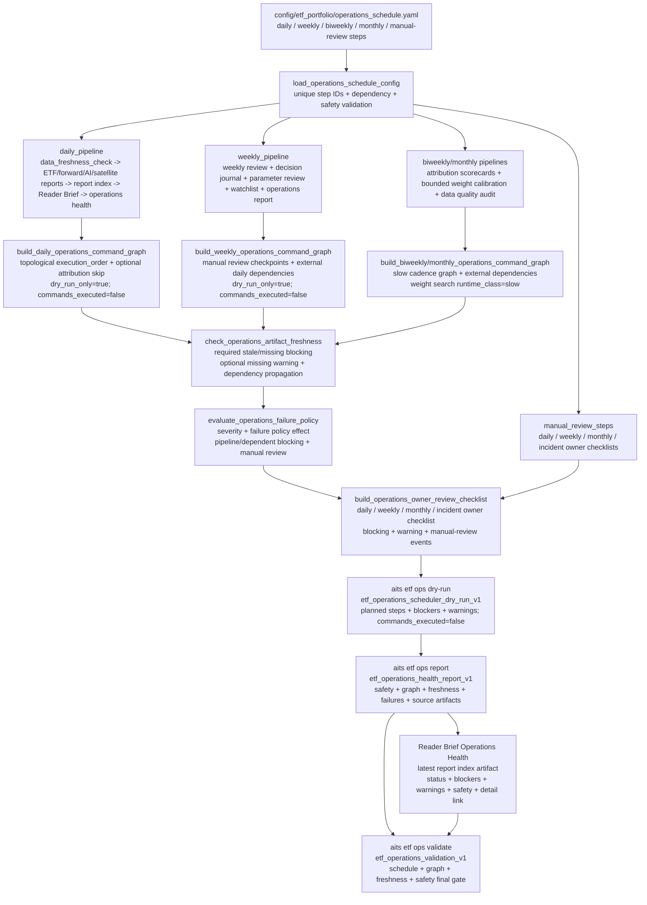
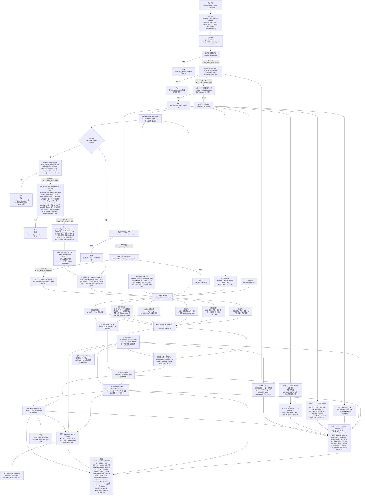
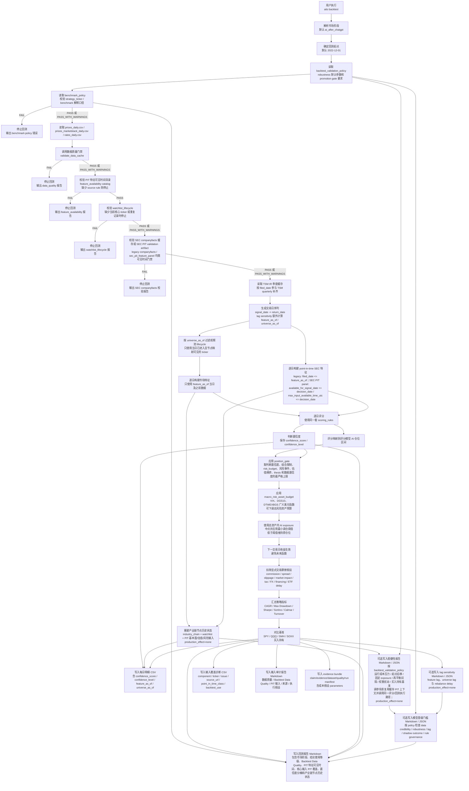
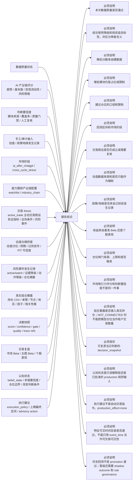
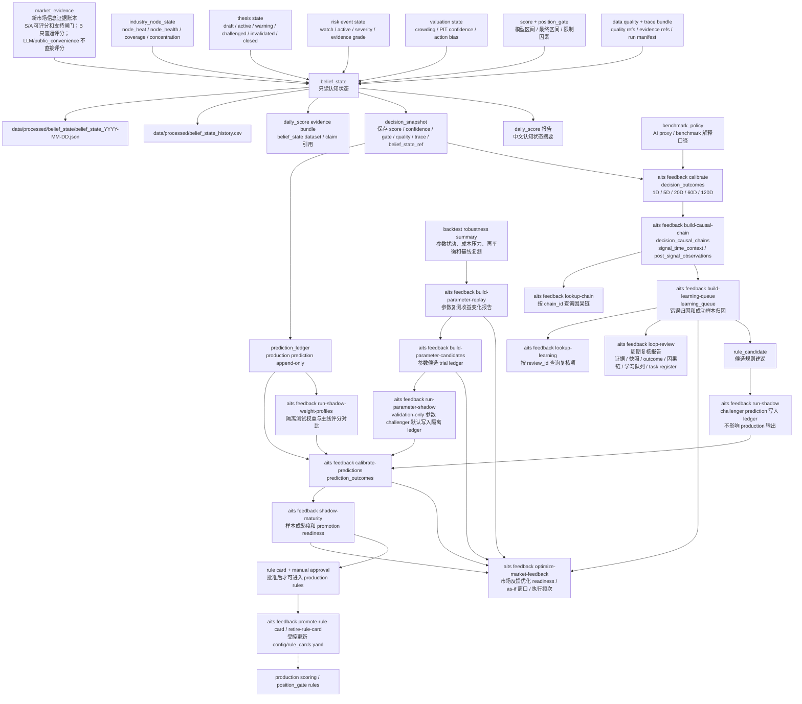
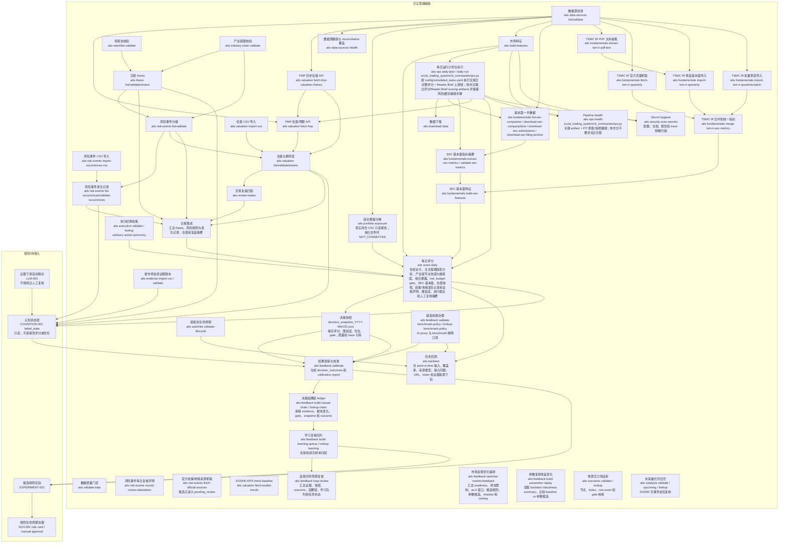

# 系统数据流示意图

本文档是系统从数据输入、中间评估到输出结论的流程图。它不是一次性说明文档，而是工程事实的一部分：后续新增命令、数据源、配置、评分模块、回测路径或报告输出时，必须同步维护本文件。

第一次理解系统时，优先阅读 `docs/learning_path.md`；如果需要从零理解输入数据如何计算成输出数据，先读 `docs/calculation_logic.md`；看到具体 CSV、JSON、Markdown 或 HTML 产物时，优先查 `docs/artifact_catalog.md`。本文继续保留全链路事实和维护边界。

结构化重构的模块边界见 `docs/architecture/module_boundaries.md`，workflow / artifact / `production_effect` 运行契约见 `docs/architecture/workflow_contract.md`。这些契约先服务于 daily-run manifest 和后续 workflow 分层，不改变本图描述的业务流向。

daily-run 会触达的核心 YAML 配置和估值/风险/thesis 输入，在进入 PyYAML 解析前先读取为稳定 UTF-8 文本快照，并通过项目统一安全 YAML loader（优先 `CSafeLoader`）解析；文件读取、解码或解析失败仍进入各自既有 fail-closed 校验路径。

`config/report_registry.yaml` 是 `aits reports index`、Reader Brief freshness 摘要和 daily task dashboard 报告导航的只读 registry。每个 report entry 必须显式记录 `freshness_sla_days`、freshness rationale、owner action、visibility flags 和 `production_effect` 边界；presence-only runtime state 也要给出审计 SLA，不能以 null freshness 静默跳过 cadence 解释。

TRADING-095 后，report registry 的 artifact 选择默认仍为 `artifact_selection_policy=as_of_or_unknown`：`aits reports index` 只选择不晚于 as_of 的可解析日期 artifact，或选择没有可解析日期的 presence-only artifact。少数明确服务 latest 研究视图的 ad-hoc entry 可以显式声明 `artifact_selection_policy=latest_available`，例如 Dynamic v3 parameter sweep leaderboard；report index 会披露 `artifact_selection_policy`、`artifact_temporal_relation` 和 `artifact_after_as_of`，让 Reader Brief 可以只读展示最新研究 leaderboard，同时不全局放宽 daily/PIT 报告的时间过滤。

ARCH-001 第二十八批后，`aits reports ...` 命令组统一由 `src/ai_trading_system/cli_commands/reports.py` 承载，`aits feedback ...` 命令组统一由 `src/ai_trading_system/cli_commands/feedback.py` 承载，根级 `aits download-data` / `aits validate-data` 统一由 `src/ai_trading_system/cli_commands/data_cache.py` 承载，根级 `aits explain` / `aits score-example` 统一由 `src/ai_trading_system/cli_commands/root_utils.py` 承载，根级 `aits review-trades` 统一由 `src/ai_trading_system/cli_commands/trade_review.py` 承载，根级 `aits build-features` 统一由 `src/ai_trading_system/cli_commands/market_features.py` 承载，根级 `aits backtest` / `aits backtest-gate-attribution` / `aits backtest-input-gaps` / `aits backtest-pit-coverage` 统一由 `src/ai_trading_system/cli_commands/backtest.py` 承载，`aits score-daily` 和 `aits score-daily backfill-baseline` 统一由 `src/ai_trading_system/cli_commands/score_daily.py` 承载；`src/ai_trading_system/cli_commands/trace_config.py` 统一提供 `score-daily` 和 `backtest` evidence bundle 的 config path 引用；`src/ai_trading_system/cli_direct.py` 的报告别名调用 `reports_cli`，feedback 路径调用 `feedback_cli`，根级数据缓存路径调用 `data_cache_cli`，`score-daily` 路径调用 `score_daily_cli`。该迁移只改变 CLI 模块边界和 trace config helper 归属，不改变数据下载 provider/cache/diagnostic、data quality gate、PIT feature availability gate、市场特征计算、字段/产物/gate 解释、示例 scoring render、交易记录校验、benchmark attribution、日报评分、baseline research backfill、prediction ledger、decision snapshot、trace bundle、报告 payload、Reader Brief、daily task dashboard、report registry、校准、shadow、rule governance、benchmark policy、parameter governance、market feedback、评分、回测或投资解释语义。

DATA-016 后，根级 `aits validate-data` 的下载 manifest provenance gate 按当前价格、第二行情源和宏观文件 checksum 的最新相关 manifest 记录判定 `RECONSTRUCTED_MANIFEST` warning；历史 reconstructed manifest 行继续留作审计历史，但当当前 checksum 已有更新的真实 provider 下载记录时，不再把当前数据质量状态降级。当前 checksum 缺失或最新相关记录仍为 reconstructed 时，门禁继续输出 warning 并要求下游披露 provenance 限制。Marketstack reconciliation companion CSV 仍逐行记录主源/二源 ticker-date 差异、分类规则、证据、主/二源数值和差异比例，只归因不改写价格缓存、评分或回测真值。

## ETF Portfolio P0 Baseline

`TRADING-062` 新增隔离的 ETF 主仓组合闭环。该闭环不修改现有 production 参数、shadow promotion、broker 或真实交易动作；默认命令入口统一为 `aits etf ...`。
为兼容开发文档中的无前缀 CLI 示例，P0/P1 workflow 同步提供根级 compatibility alias：`aits data ingest/validate`、`aits features build`、`aits signals generate`、`aits regime generate`、`aits portfolio allocate`、`aits simulation record/evaluate/report`、`aits report daily`、`aits run daily` 和 `aits experiments run/compare/register`。这些 alias 的注册逻辑位于 `src/ai_trading_system/cli_commands/etf_compat.py`，实际实现仍转发到 `aits etf ...` 命令组。根级 `aits backtest` 已由主系统每日评分回测占用，因此 ETF 回测继续使用 `aits etf backtest run/report`，避免混淆两套投资解释链路。

新增关键配置：

- `config/etf_portfolio/assets.yaml`：SPY / QQQ / SMH / SOXX / CASH 资产、默认权重、asset cap 和 risk group cap。
- `config/etf_portfolio/strategy.yaml`：ETF signal model、feature window、score 权重、score mapping、rebalance delta 和数据质量阈值。
- `config/etf_portfolio/risk.yaml`：Risk-On / Neutral / Risk-Off / Shock-Recovery / Overheated 的 cash/equity/semiconductor 约束、交易成本和 regime 规则阈值。
- `config/etf_portfolio/backtest.yaml`：默认 `ai_after_chatgpt` 回测窗口、warm-up、next-close execution lag、benchmark 和 baseline。
- `config/etf_portfolio/p1.yaml`：P1 observe-only 扩展配置，包括 satellite stocks、AI/semiconductor confirmation pairs、event calendar 和 manual-review-only weight governance。
- `config/etf_portfolio/governance.yaml`：ETF 参数候选状态、promotion gate、样本/turnover/drawdown/no-lookahead/P2-live self-promotion 阻断规则。
- `config/etf_portfolio/experiments.yaml`：TRADING-064 controlled calibration experiment registry；定义允许观察的 base allocation、regime multiplier、semiconductor cap、rebalance threshold 和 relative strength weight 实验，并强制 `observe_only=true`、`production_effect=none`、`broker_action=none`、`manual_review_required=true`。
- `config/etf_portfolio/experiment_packs.yaml`：TRADING-064 controlled pack registry；`etf_calibration_v1` 只引用 first-matrix 16 个安全 experiment，声明 `risk_adjusted_v1` ranking policy、component weights/scales、turnover/drawdown thresholds、hard rejection rules、`shadow_only_manual_review` promotion policy 的 `min_candidate_score`、blocked/rejected hard rejection 分类及 `weekly_shadow_review_v1` review policy 的最小观察天数、longer-observation excess return、drawdown/turnover 阈值；所有 policy 固定 `production_promotion_allowed=false`，不做 uncontrolled combinatorial search。
- `config/etf_portfolio/forward_simulation.yaml`：TRADING-065 forward shadow observation policy；治理 5D/20D/60D rolling windows、lifecycle thresholds、allowed statuses/actions 和 watchlist severity/action，固定 `observe_only=true`、`production_effect=none`、`broker_action=none`、`manual_review_required=true`、`production_promotion_allowed=false`。
- `config/etf_portfolio/ai_confirmation_universe.yaml`：TRADING-066A AI / semiconductor confirmation universe source config；定义 mega-cap AI、semiconductor hardware、cloud AI platform、AI ETF proxy 和 event-risk reference groups，强制 `observe_only=true`、`candidate_only=true`、`production_effect=none`、`broker_action=none`、`manual_review_required=true`，并区分 required 与 optional symbols。后续 TRADING-066B~J 的 breadth、score、report、shadow overlay、Reader Brief 和 validation gate 必须从该 config 读取 universe membership，不得把 AI confirmation 直接写入 official ETF target weights。
- `config/etf_portfolio/ai_confirmation_policy.yaml`：TRADING-066 scoring policy；治理 AI confirmation score bands、MegaCapAIScore component weights、relative-strength normalization、drawdown penalty、coverage warning floor 和 driver thresholds，固定 observe-only / candidate-only safety boundary。
- `config/etf_portfolio/satellite_universe.yaml`：TRADING-067 satellite replacement universe source config；定义 AI / semiconductor 个股、benchmark ETF、sleeve、role、optional flag、data coverage 和 event risk group，固定 ETF-first fallback、observe-only / candidate-only / no-broker 边界。
- `config/etf_portfolio/satellite_policy.yaml`：TRADING-067 replacement policy manifest；治理 score bands、component weights、eligibility thresholds、single-name/sleeve/residual ETF/risk constraints、validation evidence 和 review condition，所有会影响 replacement interpretation 的阈值从该配置读取。
- `config/etf_portfolio/weight_search.yaml`：TRADING-071A dual-track weight calibration config；定义 `etf_initial_weight_search_v1` 的 SPY/QQQ/SMH/SOXX/CASH universe、asset/sleeve constraints、5% bounded grid step、objective policy、benchmark set、AI-after-ChatGPT requested backtest window、walk-forward windows、regime splits 和固定 observe-only / candidate-only / no-broker safety boundary。TRADING-079 在同一配置中新增 `etf_initial_weight_balanced_lower_semiconductor_v1`、`etf_initial_weight_defensive_growth_v1` 和 `etf_initial_weight_ai_moderate_v1` 三个 bounded robust search pack，用于诊断更低半导体 exposure 的候选形状；这些 config 仍只允许生成 candidate initial weights 和 manual-review evidence，不允许 baseline replacement 或 production mutation。
- `config/etf_portfolio/operations_schedule.yaml`：TRADING-074A ETF operations schedule spec；定义 daily / weekly / biweekly / monthly / manual-review operations steps、commands、dependencies、expected outputs、freshness age、failure policy 和固定 observe-only / candidate-only / no-broker safety boundary。该配置是运营 workflow source config，不是外部 scheduler entry，不执行命令、不写 production weights。
- `config/etf_portfolio/data_quality.yaml`：TRADING-075 data quality and staleness governance policy；治理 price freshness、calendar coverage、missing bars、return outliers、corporate-action sanity、config/model drift、evidence completeness、validation gate freshness、report staleness 和 Reader Brief links，并固定 observe-only / candidate-only / no-broker / manual-review-only safety boundary。
- `config/etf_portfolio/evidence_dashboard.yaml`：TRADING-076 Strategy Evidence Dashboard registry；把 ETF baseline、weight calibration、forward simulation、AI confirmation / attribution、satellite replacement / attribution、parameter review、weekly review、decision journal、data quality、operations health 和 validation gates 映射到统一 evidence card，并固定 observe-only / candidate-only / no-broker / manual-review-only safety boundary。
- `config/etf_portfolio/baseline_review.yaml`：TRADING-077 baseline candidate review policy；治理 ETF allocation candidate 进入 owner baseline review 前所需 evidence、blocking conditions、review checklist、decision capture、proposal draft 和 outcome tracking，并固定 observe-only / candidate-only / no-broker / manual-review-only safety boundary。
- `config/etf_portfolio/cache_policy.yaml`：TRADING-080 weight calibration diagnostics cache policy；治理 diagnostics cache root、enabled layers、allowed modes、TTL、schema versions、parallel worker bounds、locking/pruning 和固定 observe-only / candidate-only / no-broker / manual-review-only safety boundary。该配置只服务 historical weight calibration diagnostics 的 repeatability、resume 和 performance visibility，不允许 production weight mutation、broker action 或 automatic promotion。
- `config/etf_portfolio/profiling_policy.yaml`：TRADING-081 weight calibration profiling policy；治理 diagnostics profiling `off` / `summary` / `detailed` / `cprofile` modes、step/candidate/cache/worker/cProfile visibility、slow-step/candidate/cache thresholds、top-N 和固定 observe-only / candidate-only / no-broker / manual-review-only safety boundary。该配置只服务 cold-run hotspot measurement 和后续优化建议，不允许 production weight mutation、broker action、automatic promotion 或 native kernel rewrite。
- `config/etf_portfolio/shadow_ready_review.yaml`：TRADING-082 shadow-ready review policy；治理 diagnostics artifact loading、weight-shape aggregation、review priority ranking weights、hard blockers、owner approval capture、approved-only enrollment limits、forward tracking linkage 和固定 observe-only / candidate-only / no-broker / manual-review-only safety boundary。该配置只服务 owner-reviewed forward shadow enrollment，不允许 production baseline replacement、automatic promotion、broker action 或 auto-enrollment without approval。
- `config/etf_portfolio/trend_calibration.yaml`：TRADING-083 trend signal calibration policy；治理 Layer 1 signal registry、bounded preset signal weights、score bands、forward attribution windows、redundancy diagnostics、regime stability review 和固定 observe-only / candidate-only / no-broker / manual-review-only safety boundary。该配置只服务 trend-analysis information weight calibration，不输出 ETF target weights、不修改 baseline config、不触发 broker action。
- `config/etf_portfolio/dynamic_allocation_policy.yaml`：TRADING-084 dynamic allocation policy；治理 Layer 2 base weights、regime targets、trend overlay rules、event-risk cash overlay、exposure constraints、rebalance gates 和固定 observe-only / candidate-only / no-broker / manual-review-only safety boundary。该配置只服务 candidate dynamic allocation decision records，不写 official `target_weights.csv`、不修改 baseline config、不触发 broker action。
- `config/etf_portfolio/dynamic_calibration.yaml`：TRADING-085 dynamic calibration policy；治理 two-layer candidate pack schema、two-stage search protocol、coarse-to-fine iteration、trend score / allocation path / dynamic calibration proxy cache、ranking weights、worker policy 和固定 observe-only / candidate-only / no-broker / manual-review-only safety boundary。该配置只服务 candidate batch/cache/ranking，不写 official `target_weights.csv`、不修改 baseline config、不触发 broker action、不自动 enrollment。
- `config/etf_portfolio/dynamic_robustness.yaml`：TRADING-086 dynamic robustness policy；治理真实 ETF price return backtest、dynamic/static/current/QQQ/SPY/SMH comparison、walk-forward、regime attribution、false-signal diagnostics、turnover sensitivity、AI/semiconductor attribution、event-risk overlay 和 overfit thresholds。该配置只服务 owner review 前置证据，固定 `shadow_enrollment_allowed=false`，不自动 enrollment。
- `config/etf_portfolio/dynamic_shadow.yaml`：TRADING-087 dynamic shadow policy；治理 dynamic candidate review package、owner approval、approved-only enrollment、forward tracking metrics、weekly review status 和 validation gate。该配置只服务 owner-approved forward shadow observation，不写 official `target_weights.csv`、不修改 baseline config、不触发 broker action、不允许 auto-enrollment without owner approval。
- `config/etf_portfolio/dynamic_failure_diagnostics.yaml`：TRADING-088 dynamic failure diagnostics and rescue policy；治理 failed dynamic v0.1 classification thresholds、false risk-off/on definitions、signal buckets、turnover/constraint hit thresholds、bounded v0.2-v0.5 rescue templates、improvement requirements 和固定 safety boundary。该配置只服务 failure diagnostics、candidate-only rescue evaluation 和 owner review handoff，不修改 dynamic v0.1 production/baseline config、不生成 approval、不 enroll shadow。
- `config/etf_portfolio/dynamic_v2_review.yaml`：TRADING-089 Dynamic v0.2 review policy；治理 v0.4 lower-turnover rescue candidate 的 improvement attribution、constraint hit decomposition、drawdown preservation blocker、regime robustness、benchmark comparison、shadow eligibility gate 和固定 no-enrollment safety boundary。该配置只服务 review-only owner package，不生成 approval、不 enroll shadow、不修改 production/baseline state。
- `config/etf_portfolio/dynamic_v3_constraint_aware_rescue.yaml`：TRADING-090 Dynamic v0.3 constraint-aware rescue policy；治理 v0.4 blocker targets、pre-constraint normalization、soft constraint penalty、allocation smoothing、drawdown guardrail、emergency risk-off、v0.3a-v0.3d candidate templates、evaluation thresholds 和固定 no-enrollment safety boundary。该配置只服务 candidate-only rescue evaluation，不生成 approval、不 enroll shadow、不修改 production/baseline state。
- `config/etf_portfolio/dynamic_v3_real_evaluation.yaml`：TRADING-091 Dynamic v0.3 rescue real evaluation policy；治理 v0.3 in-memory materialization、baseline/v0.2/v0.4/static/benchmark comparisons、promotion gate thresholds、overfit thresholds、Reader Brief section 和固定 no-enrollment safety boundary。该配置只服务真实历史评估和人工复核资格判定，不生成 approval、不 enroll shadow、不修改 production/baseline state。
- `config/etf_portfolio/dynamic_v3_failure_attribution.yaml`：TRADING-092 Dynamic v0.3 failure attribution and v0.4 promotion review policy；治理 latest real evaluation reject input contract、constraint bucket thresholds、v0.4 promotion-review thresholds、v0.5 recommendation labels、Reader Brief section 和固定 no-enrollment safety boundary。该配置只服务失败归因、v0.4 人工复核优先级和 v0.5 design recommendation，不生成 approval、不 enroll shadow、不修改 production/baseline state。
- `config/etf_portfolio/dynamic_v3_rescue/parameter_sweep_v1.yaml`、`config/etf_portfolio/dynamic_v3_rescue/parameter_sweep_real_smoke.yaml`、`config/etf_portfolio/dynamic_v3_rescue/parameter_sweep_profiles.yaml`、`config/etf_portfolio/dynamic_v3_rescue/parameter_governance_v1.yaml`、`config/etf_portfolio/dynamic_v3_rescue/evidence_gate_policy_v1.yaml`、`config/etf_portfolio/dynamic_v3_rescue/position_advisory_v1.yaml`、`config/etf_portfolio/dynamic_v3_rescue/model_target_portfolio_v1.yaml`、`config/etf_portfolio/dynamic_v3_rescue/paper_shadow_account_v1.yaml` 和 `config/etf_portfolio/dynamic_v3_rescue/current_portfolio_snapshot.real.template.yaml`：TRADING-093 到 TRADING-213 Dynamic v3 rescue parameter research / manual snapshot / system target policy；治理 bounded search space、hard gate、soft ranking、resume/checkpoint、evaluator mode、real execution profiles、deterministic fixed robustness evidence cache、parameter governance/search_space_version、data/injection audit、walk-forward selection、overfit review、shadow monitoring、artifact retention、promotion review、medium_real 候选发现、candidate evidence matrix、regime coverage、candidate interpretation pack、observe-only pool、overnight readiness、research decision、evidence gate recovery、shadow shortlist selection、candidate diversity clustering、target-weight consensus、position advisory、owner position review、daily shadow monitor、manual portfolio snapshot validation、daily position advisory、consensus drift gate、owner review journal、strict manual execution review、real manual snapshot redaction lint、real snapshot dry-run、owner decision loop、paper-only action projection、weekly real snapshot review、research model target weights、paper shadow account、model rebalance、paper shadow performance 和 system target review pack，固定 no-production safety boundary。默认 CI / focused tests 使用 `tiny_fixture_proxy`；manual research run 可指定 `real_dynamic_v3_rescue` 或 `small_real` / `medium_real` / `overnight_real` profile，但仍只生成 manual-review evidence，不导入 broker、不生成 order ticket、不修改真实仓位或 official target weights。

新增数据流：

```mermaid
flowchart TD
    ETFP["data/raw/prices_daily.csv 或 data/etf_portfolio/prices.csv<br/>SPY/QQQ/SMH/SOXX OHLCV<br/>standardize adds deterministic missing created_at + synthetic CASH metadata"] --> ETFDQ["aits etf data validate<br/>ETF price schema + duplicate + non-positive + return threshold gate"]
    ETFDQ --> ETFF["aits etf features build<br/>data/etf_portfolio/features.csv"]
    ETFF --> ETFS["aits etf signals generate<br/>data/etf_portfolio/signals.csv"]
    ETFF --> ETFR["aits etf regime generate<br/>data/etf_portfolio/regimes.csv"]
    ETFS --> ETFA["aits etf portfolio allocate<br/>data/etf_portfolio/target_weights.csv"]
    ETFR --> ETFA
    ETFA --> ETFL["aits etf simulation record/evaluate<br/>data/simulation/etf_ledger.csv<br/>20d forward / SPY-QQQ relative / contribution fields"]
    ETFL --> ETFSIMR["aits etf simulation report<br/>model-version hit rate + portfolio vs SPY/QQQ"]
    ETFA --> ETFB["aits etf report daily<br/>reports/etf_portfolio/YYYY-MM-DD_portfolio_brief.md"]
    ETFL --> ETFB
    ETFF --> ETBT["aits etf backtest run<br/>daily / weights / trades / summary / standardized metrics / monthly returns / stability diagnostics<br/>reports/etf_portfolio/backtests/<run_id>/"]
    ETFS --> ETBT
    ETFR --> ETBT
    ETBT --> ETFGOV["aits etf governance summary<br/>candidate promotion gate + blockers<br/>reports/etf_portfolio/governance/*_parameter_governance.json/md"]
    ETFGOV --> ETFRIDX
    ETFGOV --> ETFCRED["aits etf credibility validate<br/>TRADING-063A~J aggregate PASS/FAIL<br/>reports/etf_portfolio/credibility/*_credibility_gate.json/md"]
    ETFCRED --> ETFRIDX
    ETFB --> ETFRIDX["config/report_registry.yaml + aits reports index<br/>ETF brief / data quality / backtest / P2 readiness visibility"]
    ETBT --> ETFRIDX
    ETFP --> ETFDQG["aits etf data-quality report<br/>price freshness / coverage / outliers / drift / evidence / gate freshness / report staleness / Reader Brief links<br/>reports/etf_portfolio/data_quality/governance/data_quality_report_YYYY-MM-DD.json/md"]
    ETFRIDX --> ETFDQG
    ETFCRED --> ETFDQG
    ETFRIDX --> ETFEVD["aits etf evidence-dashboard aggregate/report/validate<br/>unified strategy evidence cards + candidate ranking + conflicts + manual review queue<br/>reports/etf_portfolio/evidence_dashboard/strategy_evidence_dashboard_YYYY-MM-DD.json/md"]
    ETFDQG --> ETFEVD
    ETFEVD --> ETFBR["aits etf baseline-review eligibility/package/validate<br/>manual baseline candidate review package + decision/proposal/outcome tracking<br/>reports/etf_portfolio/baseline_review/..."]
    ETFRIDX --> ETFBR
    ETFDQG --> ETFBR
    ETFRIDX --> ETFSHR["aits etf shadow-review package/approve/enroll-approved/validate<br/>shadow-ready shape review package + owner-approved forward shadow enrollment<br/>reports/etf_portfolio/shadow_ready_review/..."]
    ETFSHR --> ETFREAD
    ETFP --> ETFTREND["aits etf trend-calibration run/report/validate<br/>Layer 1 trend signal calibration<br/>reports/etf_portfolio/trend_calibration/..."]
    ETFTREND --> ETFRIDX
    ETFTREND --> ETFREAD
    ETFTREND --> ETFDYN["aits etf dynamic-allocation decide/report/validate<br/>Layer 2 candidate dynamic allocation decisions<br/>reports/etf_portfolio/dynamic_allocation/..."]
    ETFDYN --> ETFRIDX
    ETFDYN --> ETFREAD
    ETFDYN --> ETFDCAL["aits etf dynamic-calibration run/report/validate<br/>Two-layer candidate packs + cache + ranking<br/>reports/etf_portfolio/dynamic_calibration/..."]
    ETFDCAL --> ETFRIDX
    ETFDCAL --> ETFREAD
    ETFDCAL --> ETFROB["aits etf dynamic-robustness report/validate<br/>Price-driven dynamic vs static robustness + attribution<br/>reports/etf_portfolio/dynamic_robustness/..."]
    ETFROB --> ETFRIDX
    ETFROB --> ETFREAD
    ETFROB --> ETFDSHADOW["aits etf dynamic-shadow package/approve/enroll/update/weekly-review/validate<br/>Owner-approved dynamic candidate forward shadow workflow<br/>reports/etf_portfolio/dynamic_shadow/..."]
    ETFDSHADOW --> ETFRIDX
    ETFDSHADOW --> ETFREAD
    ETFROB --> ETFRESCUE["aits etf dynamic-rescue run/report/validate<br/>Failure diagnostics + bounded v0.2 rescue candidates<br/>reports/etf_portfolio/dynamic_rescue/..."]
    ETFDSHADOW --> ETFRESCUE
    ETFRESCUE --> ETFRIDX
    ETFRESCUE --> ETFREAD
    ETFRESCUE --> ETFV2REVIEW["aits etf dynamic-v2-review package/report/validate<br/>Review-only v0.4 robustness + shadow readiness blockers<br/>reports/etf_portfolio/dynamic_v2_review/..."]
    ETFROB --> ETFV2REVIEW
    ETFV2REVIEW --> ETFRIDX
    ETFV2REVIEW --> ETFREAD
    ETFV2REVIEW --> ETFV3RESCUE["aits etf dynamic-v3-rescue run/report/validate<br/>Constraint-aware v0.3 rescue candidates<br/>reports/etf_portfolio/dynamic_v3_rescue/..."]
    ETFV3RESCUE --> ETFRIDX
    ETFV3RESCUE --> ETFREAD
    ETFV3RESCUE --> ETFV3REAL["aits etf dynamic-v3-rescue real-evaluate/real-report/validate-real<br/>Price-driven v0.3 real evaluation + promotion gate<br/>reports/etf_portfolio/dynamic_v3_rescue/real_evaluation/..."]
    ETFV3REAL --> ETFRIDX
    ETFV3REAL --> ETFREAD
    ETFV3REAL --> ETFV3FAIL["aits etf dynamic-v3-rescue failure-attribution/failure-attribution-report/validate-attribution<br/>v0.3 reject attribution + v0.4 promotion review + v0.5 recommendation<br/>reports/etf_portfolio/dynamic_v3_rescue/failure_attribution/..."]
    ETFV3FAIL --> ETFRIDX
    ETFV3FAIL --> ETFREAD
    ETFV3FAIL --> ETFV3SWEEP["aits etf dynamic-v3-rescue data-audit/data-provenance/window-audit/weight-path/sweep-config/sweep/candidate/walk-forward/overfit/governance/research/shadow/artifacts/schedule/promotion/evidence-summary/medium-real/regime-coverage/observe-pool/overnight-readiness/research-decision/evidence-diagnosis/gate-impact/gate-policy/candidate-recovery/research-decision update/shortlist/candidate-cluster/shadow-shortlist/shadow-monitor/portfolio-snapshot/position-advisory/consensus-drift/owner-review/position-review/paper-portfolio/advisory-outcome/owner-attribution/shadow-aging/weekly-advisory-review/replay-inventory/historical-replay/backfill-outcome/historical-paper-sim/replay-performance-review/outcome-due/replay-sample-expansion/outcome-dashboard/limited-vs-notrade/consensus-risk/outcome-update-review/outcome-update/rolling-evidence-refresh/evidence-trend/forward-outcome-decision<br/>Constrained parameter research with profiles + tiny_fixture_proxy or real_dynamic_v3_rescue evaluator<br/>fixed robustness cache + data provenance + window audit + weight path + candidate attribution + train/test selection + overfit/shadow monitor + evidence matrix + gate diagnosis/impact/policy + observe-only recovery + regime coverage + observe-only pool + shortlist/diversity clustering + shadow shortlist monitoring pack + daily shadow monitor + manual snapshot validation + target-weight/daily advisory + consensus drift + owner review journal + paper portfolio ledger + advisory outcome windows + owner attribution + shadow aging v2 + weekly advisory review + historical PIT-safe replay + backfilled outcome + historical paper simulation + replay performance review + forward outcome due accumulation + replay sample expansion + outcome availability dashboard + limited/no-trade focus + consensus risk review + safe outcome update loop + rolling evidence refresh + forward outcome decision pack + owner position review + latest pointer repair/validation + daily scheduler observe gate<br/>reports/etf_portfolio/dynamic_v3_rescue/data_audit|data_provenance|window_audit|sweeps|candidate_attribution|walk_forward_selection|overfit|governance|index|shadow|shadow_monitor|shadow_monitor_runs|portfolio_snapshot|position_advisory_daily|consensus_drift|owner_review_journal|paper_portfolio|advisory_outcome|owner_attribution|shadow_aging|weekly_advisory_review|replay_inventory|historical_replay|backfilled_outcome|historical_paper_sim|replay_performance_review|outcome_due|replay_sample_expansion|outcome_dashboard|limited_vs_notrade|consensus_risk|outcome_update_review|outcome_update|rolling_evidence_refresh|evidence_trend|forward_outcome_decision|schedule_observe|promotion|evidence_summary|medium_real|regime_coverage|interpretation|observe_pool|overnight_readiness|evidence_diagnosis|gate_impact|gate_policy|candidate_recovery|research_decision|research_decision_update|shortlist|candidate_cluster|shadow_shortlist|position_advisory|position_review|latest/..."]
    ETFV3SWEEP --> ETFRIDX
    ETFV3SWEEP --> ETFREAD
    ETFV3SWEEP --> ETFV3SIMREV["aits etf dynamic-v3-rescue sim-interpretation/sim-risk-return/sim-defensive-validation/advisory-proposal-review/forward-confirmation-plan run/report/validate<br/>TRADING-169 to 173 simulation interpretation + risk-return + defensive validation + manual proposal review + forward confirmation plan<br/>reports/etf_portfolio/dynamic_v3_rescue/sim_interpretation|sim_risk_return|sim_defensive_validation|advisory_proposal_review|forward_confirmation_plan/...<br/>BACKTEST_SIMULATION_NOT_PIT / auto_apply=false / no policy mutation / production_effect=none"]
    ETFV3SIMREV --> ETFRIDX
    ETFV3SIMREV --> ETFREAD
    ETFV3SIMREV --> ETFV3CONFCYCLE["aits etf dynamic-v3-rescue confirmation-targets/confirmation-progress/confirmation-evaluate/rule-review-cycle/rule-owner-decision run|update|create|record/report/list/validate<br/>TRADING-174_to_178 forward confirmation execution + rule review + owner decision journal<br/>reports/etf_portfolio/dynamic_v3_rescue/forward_confirmation_registry|confirmation_progress|confirmation_evaluation|rule_review_cycle|rule_owner_decision/...<br/>registry/etf_portfolio/dynamic_v3_rescue_forward_confirmation_targets.yaml<br/>policy_change_allowed=false / auto_apply=false / no broker / production_effect=none"]
    ETFV3CONFCYCLE --> ETFRIDX
    ETFV3CONFCYCLE --> ETFREAD
    ETFV3CONFCYCLE --> ETFV3CONFOPS["aits etf dynamic-v3-rescue confirmation-cycle/pressure-regime-tag/confirmation-dashboard/rule-review-queue plan|runbook|validate-config|weekly-run|weekly-report|run|report|build|validate<br/>TRADING-179_to_183 confirmation cycle weekly evidence operations<br/>reports/etf_portfolio/dynamic_v3_rescue/confirmation_cycle_plan|confirmation_cycle_weekly|pressure_regime_tag|confirmation_dashboard|rule_review_queue/...<br/>dry-run default / execute-ready-updates explicit / auto_apply=false / no broker / production_effect=none"]
    ETFV3CONFOPS --> ETFRIDX
    ETFV3CONFOPS --> ETFREAD
    ETFV3CONFOPS --> ETFV3PRESSUREVAL["aits etf dynamic-v3-rescue pressure-tag-diagnosis/pressure-outcome-backfill/defensive-pressure-compare/defensive-rule-review/weekly-ops-decision-update run/report/validate<br/>TRADING-184_to_188 pressure sample expansion + defensive rule validation<br/>reports/etf_portfolio/dynamic_v3_rescue/pressure_tag_diagnosis|pressure_outcome_backfill|defensive_pressure_compare|defensive_rule_review|weekly_ops_decision_update/...<br/>source_mode preserved / SIMULATION_NOT_PIT / rule_approval_allowed=false / production_effect=none"]
    ETFV3PRESSUREVAL --> ETFRIDX
    ETFV3PRESSUREVAL --> ETFREAD
    ETFV3PRESSUREVAL --> ETFV3DEFHYP["aits etf dynamic-v3-rescue defensive-hypothesis-deep-dive/defensive-label-review/defensive-failure-study/defensive-research-note/defensive-owner-pack/forward-pressure-capture/pressure-trigger/pressure-capture/pressure-sample-ledger/weekly-defensive-evidence run|plan|scan|update/report/validate<br/>TRADING-189_to_198 defensive hypothesis review + forward evidence automation<br/>reports/etf_portfolio/dynamic_v3_rescue/defensive_hypothesis_deep_dive|defensive_label_review|defensive_failure_study|defensive_research_note|defensive_owner_pack|forward_pressure_capture|pressure_trigger|pressure_capture|pressure_sample_ledger|weekly_defensive_evidence/...<br/>RESEARCH_ONLY / auto_apply=false / policy_change_allowed=false / broker_action_allowed=false / production_effect=none"]
    ETFV3DEFHYP --> ETFRIDX
    ETFV3DEFHYP --> ETFREAD
    ETFV3SWEEP --> ETFV3MANEXEC["aits etf dynamic-v3-rescue manual-portfolio/portfolio-exposure/position-drift/execution-guardrails/manual-execution-review validate|normalize|report|run|check|pack<br/>TRADING-199_to_203 strict manual snapshot + exposure + drift + execution guardrails + owner review pack<br/>reports/etf_portfolio/dynamic_v3_rescue/manual_portfolio_snapshot|portfolio_exposure|position_drift|execution_guardrails|manual_execution_review/...<br/>broker_action_allowed=false / order_ticket_generated=false / owner_approval_required=true / production_effect=none"]
    ETFV3MANEXEC --> ETFRIDX
    ETFV3MANEXEC --> ETFREAD
    ETFV3MANEXEC --> ETFV3REALSNAP["aits etf dynamic-v3-rescue real-snapshot/real-snapshot-dry-run/real-execution-owner-review/real-snapshot-paper-action/weekly-real-snapshot-review template|lint|intake|run|create|record|apply|report|validate<br/>TRADING-204_to_208 real manual snapshot intake + dry-run + owner decision + paper-only action + weekly rollup<br/>reports/etf_portfolio/dynamic_v3_rescue/real_snapshot_intake|real_snapshot_dry_run|real_execution_owner_review|real_snapshot_paper_action|weekly_real_snapshot_review/...<br/>broker_action_allowed=false / broker_action_taken=false / order_ticket_generated=false / real_portfolio_mutated=false / production_effect=none"]
    ETFV3REALSNAP --> ETFRIDX
    ETFV3REALSNAP --> ETFREAD
    ETFV3POS --> ETFV3SYSTARGET["aits etf dynamic-v3-rescue model-target/paper-shadow/model-rebalance/paper-shadow-performance/system-target-review config-validate|generate|init|simulate|run|pack|report|validate<br/>TRADING-209_to_213 research model target + paper shadow account + performance + owner review pack<br/>reports/etf_portfolio/dynamic_v3_rescue/model_target|paper_shadow|model_rebalance|paper_shadow_performance|system_target_review/...<br/>research_target_only=true / paper_shadow_only=true / not_official_target_weights=true / broker_action_allowed=false / production_effect=none"]
    ETFV3SYSTARGET --> ETFRIDX
    ETFV3SYSTARGET --> ETFREAD
    ETFBR --> ETFREAD["aits reports reader-brief<br/>Report Navigation / ETF Backtest Summary / Task Cadence Calendar / ETF Data Quality / Strategy Evidence / Baseline / Shadow Candidate Review / Trend Signal Calibration / Dynamic Allocation Candidate / Dynamic Calibration Batch / Dynamic Robustness Review / Dynamic Shadow Review / Dynamic Strategy Rescue / Dynamic v0.2 Review / Dynamic v0.3 Rescue / Dynamic v0.3 Real Evaluation / Dynamic v0.3 Failure Attribution / Dynamic Rescue Parameter Sweep / Medium Real Evidence / Evidence Gate Diagnosis / Candidate Recovery / Observe Pool / Shortlist / Candidate Cluster / Shadow Shortlist / Position Advisory / Position Review / Manual Execution Review / Real Snapshot Advisory Review / System Target Portfolio / Paper Portfolio / Advisory Outcome / Owner Attribution / Shadow Aging / Weekly Advisory Review / Historical Replay Performance / Simulation Advisory Review / Forward Confirmation Rule Review Cycle / Weekly Confirmation Evidence Operations / Pressure Regime Defensive Validation / Defensive Hypothesis Forward Evidence / Research Decision Update 只读下钻 ETF artifacts"]
    ETFEVD --> ETFREAD
    ETFDQG --> ETFREAD
    ETFRIDX --> ETFREAD
```



ETF P0 outputs 必须披露 `data_quality_status`、`model_version`、`config_hash`、`market_regime=ai_after_chatgpt` 和实际请求/生效日期范围。Signals 与 target weights 保持分离；target weights 必须合计为 1，`CASH` 吸收未分配权重。Allocation 会执行 asset cap/floor、risk group / semiconductor sleeve cap、regime equity cap、cash floor、`min_rebalance_delta`、`max_rebalance_trade_weight` 和 `max_daily_turnover`；`target_weights.csv` 同时输出 `constraints_applied` 和结构化 `constraint_diagnostics`，后者记录 constraint id、资产或 sleeve、before/after 权重、原因和 severity。ETF daily brief 必须在顶部披露 safety banner（`observe_only=true`、`production_effect=none`、manual-review-only、no broker action），并把 current regime、asset-level scores、target weights、previous target weights、weight deltas、top positive/negative drivers、constraints applied、benchmark context、simulation status、P2/live candidate-only note 和 actionability note 组织成可读的权重变动解释；未知或 delayed evaluation-only 字段不得进入 decision sections。ETF drawdown / volatility penalty 属于 signal risk score 层，先影响 composite score，再进入 allocation，不作为后验仓位修补。No-lookahead timing contract 固定为 raw market data date = `t`、feature snapshot date = `t`、signal date = `t`、allocation decision date = `t`、最早 execution date 为 `t` 之后的下一交易日，portfolio return window 为 execution date 到后续 return date；`src/ai_trading_system/etf_portfolio/no_lookahead.py` 校验 `execution_date > signal_date`、`return_date > execution_date`、`feature_source_date <= signal_date`、decision payload 不含 future/evaluation 字段，并阻止 ETF daily brief decision sections 泄漏 evaluation-only 字段。Simulation ledger 使用 `record_type=decision` / `record_type=evaluation` 分层：decision rows 保留 decision/config/snapshot hash、asset scores、target/previous/delta JSON、`observe_only=true` 和 `production_effect=none`，且 `evaluation_only=false`；evaluation rows 才在 forward window 足够后记录 future/forward return、相对 `SPY` / `QQQ` return、权重贡献、组合级 benchmark 对比和 `evaluation_as_of_date`，且固定 `evaluation_only=true`；窗口不足或 benchmark 缺失时保持 null，不得补 0。Backtest execution 显式拆分 `signal_date < execution_date < return_date`，并输出 daily return、asset contribution、weights、trades、summary、metrics、`standardized_metrics`、`monthly_returns` 和 `allocation_stability_diagnostics`；`standardized_metrics` 使用 `config/etf_portfolio/backtest.yaml` 的 `primary_benchmark_id` 计算 benchmark excess / drawdown reduction，并用 `metric_null_reasons` 解释无法计算的 Sharpe、Sortino、Calmar、月度或 benchmark 字段，不得补 0；`monthly_returns` 输出 strategy / benchmark / excess return、月内 max drawdown 和平均 equity exposure。`aits etf backtest diagnostics --latest` 可从既有 run 的 daily/weights 重新生成 `stability_diagnostics.json/md`，披露 turnover、weight delta、regime transition、constraint hit rate、cash/equity/semiconductor exposure 和 asset exposure time。benchmark registry 包含 B001-B008：buy-and-hold SPY/QQQ/SMH/SOXX、`static_growth_balanced`、`static_ai_growth`、`ma_50_200_qqq` 和 `risk_off_cash_switch`，summary 以 `benchmark_comparisons` common schema 披露 strategy-vs-benchmark return/risk/turnover 差异。`aits etf governance summary` 使用 `config/etf_portfolio/governance.yaml` 输出 `etf_parameter_governance` JSON/Markdown，固定 `production_effect=none` 与 `manual_review_required=true`；缺 benchmark、样本不足、turnover 超阈值、drawdown 未降低且未说明、no-lookahead 未 PASS、测试未过或 P2/live self-promotion 都 fail closed，通过 gate 也只进入 `ELIGIBLE_FOR_MANUAL_REVIEW`。`aits etf credibility validate` 聚合 TRADING-063A~J 子检查并输出单一 PASS/FAIL gate，确认 runtime artifact hygiene、benchmark suite、no-lookahead、toy accounting、risk constraints、allocation stability、simulation schema、backtest metrics、brief explainability、parameter governance 和 P2/live safety；PASS 只表示可进入持续 shadow evaluation，仍不代表 production approval。Compatibility aliases 只复用同一 ETF 命令实现，不新增数据流或 production surface。`data/etf_portfolio/`、`data/simulation/` 和 `reports/` 是本地 runtime artifacts，默认不纳入源码提交；确定性 ETF 测试 fixture 只放在 `tests/fixtures/etf_portfolio/`。ETF brief、ETF data quality、ETF backtest summary、ETF parameter governance、ETF credibility gate、ETF P2 walk-forward readiness 和 TRADING-065 forward simulation artifacts 已登记到 `config/report_registry.yaml`，由 `aits reports index` 和 Reader Brief 只读显示 freshness / navigation；Reader Brief 额外只读摘录最新 ETF backtest standardized metrics、calibration experiment 和 forward simulation 摘要，但不运行 ETF 上游命令、不写 production weights、不触发 broker 或 trading action。

TRADING-075 新增 `aits etf data-quality report --as-of YYYY-MM-DD` 和 `aits etf data-quality validate`。Report 只读读取 ETF price cache、当前 ETF config hash/model version、`config/report_registry.yaml` 与既有 artifacts，输出 `etf_data_quality_report_v1` JSON / Markdown，展示 safety banner、run metadata、price freshness、missing bars/calendar coverage、return outliers/corporate-action sanity、config/model drift、evidence completeness、validation gate freshness、report staleness、Reader Brief links、blocking failures、warnings 和 manual review items；critical required findings 会阻断 dependent research interpretation，optional missing artifacts 只 warning。Validation gate 使用 deterministic probes 校验 policy、checker、report generator、Reader Brief registry integration 和 safety boundary，不把本机 cache 暂时 stale 误判为工程实现失败。Reader Brief 的 `ETF Data Quality` 区块只读 latest `etf_data_quality_governance_report`，缺失时显示 section-level `MISSING`，不运行上游、不补造质量结论。

TRADING-076 新增 `aits etf evidence-dashboard aggregate/report/validate`。该 workflow 只读读取 report index、`config/etf_portfolio/evidence_dashboard.yaml` 和既有 ETF research artifacts，把 baseline allocation、weight calibration、forward simulation、AI confirmation / attribution、satellite replacement / attribution、parameter review、weekly review、decision journal、data quality、operations health 和 validation gates 统一成 strategy component evidence cards、candidate evidence ranking、evidence conflicts、data-quality overlay 和 manual review priority queue；每张 card 都保留 source module、source report path、source metric、as-of date、freshness、data quality、validation status 和 sample count。若 report index 的 latest artifact 指向 Markdown / HTML 且同名 JSON sidecar 存在，aggregator 会读取 sidecar payload 中的 `status` / `overall_status` 等内部状态，避免把 `BLOCKED` / `FAIL` source report 误解为单纯 `AVAILABLE` artifact。Report 输出 `reports/etf_portfolio/evidence_dashboard/strategy_evidence_dashboard_YYYY-MM-DD.json/md`，validation gate 输出 `reports/etf_portfolio/evidence_dashboard/validation/strategy_evidence_validation_YYYY-MM-DD.json/md`，并固定 `observe_only=true`、`candidate_only=true`、`production_effect=none`、`broker_action=none`、`manual_review_required=true`、`commands_executed=false`、`production_state_mutated=false`。Reader Brief 的 `Strategy Evidence Dashboard` 区块只读 latest dashboard，缺失时显示 `MISSING`，不运行上游、不补造 evidence 结论。

TRADING-077 新增 `aits etf baseline-review eligibility/matrix/package/capture-decision/proposal-draft/outcome/validate`。该 workflow 只读读取 report index、`config/etf_portfolio/baseline_review.yaml`、TRADING-076 evidence dashboard 和既有 ETF evidence artifacts，判断 allocation candidate 是否可进入人工 baseline review；当 report index 或 evidence dashboard 的 latest artifact 指向 Markdown / HTML wrapper 时，baseline review 读取同名 JSON sidecar 作为审计 payload。Eligibility gate 会 fail closed 阻断 evidence dashboard blocked、critical data quality、ops validation failed、validation gate stale、forward sample too small、missing required decision journal link、parameter review blocked、unsafe `production_effect` 或 non-none `broker_action`；weight calibration 的 proposal action type 归一为 candidate evidence，不得误作 unsupported candidate type；evidence matrix 保留 required/status/source_report/latest_as_of_date/freshness/sample_count/blocking/notes。Package 输出 `reports/etf_portfolio/baseline_review/packages/baseline_review_package_YYYY-MM-DD_<candidate>.json/md`，owner decision 输出 `reports/etf_portfolio/baseline_review/decisions/`，proposal draft 输出 `reports/etf_portfolio/baseline_review/proposals/`，outcome tracker 输出 `reports/etf_portfolio/baseline_review/outcomes/`，validation gate 输出 `reports/etf_portfolio/baseline_review/validation/baseline_review_validation_YYYY-MM-DD.json/md`。Proposal draft 只能在 explicit owner decision `approve_for_proposal_draft` 且 decision journal linkage 存在后生成，仍固定 `production_effect=none`、`broker_action=none`、`production_state_mutated=false`、`baseline_config_mutated=false`。Reader Brief 的 `Baseline Candidate Review` 区块只读 latest baseline review artifacts，展示 eligible/needs-more/blocked counts、latest decision、proposal draft count、safety posture 和 detail link；缺失时显示 `MISSING`，不运行上游、不补造 eligibility 结论。

TRADING-064 experiment manifest、comparison、candidate selection、shadow registry 和 weekly review 同时接入 `config/report_registry.yaml`，由 `aits reports index` 和 Reader Brief 只读展示。Reader Brief 的 `ETF Calibration Experiments` 摘要只使用 report index 指向的既有 artifacts，不运行 experiment、backtest、shadow enrollment 或 weekly review 上游。TRADING-065 forward update / dashboard / watchlist / weekly review / validation 也接入 report registry；Reader Brief 的 `ETF Forward Simulation` 摘要只读 dashboard/watchlist，不把 forward return 作为 decision input。

## ETF Portfolio P1 Observe-Only Baseline

`TRADING-062` P1 扩展保持 `production_effect=none`，只生成研究、归因和治理 artifacts；不得修改 P0 target weights、现有 production 参数、broker 或真实交易状态。P1 使用 `config/etf_portfolio/p1.yaml` 中的人工复核边界，`auto_promotion=false`。

```mermaid
flowchart TD
    P1P["data/raw/prices_daily.csv<br/>ETF + AI/satellite stock OHLCV"] --> P1DQ["aits etf features build --include-satellites<br/>复用 ETF price quality gate"]
    P1DQ --> P1F["data/etf_portfolio/features.csv<br/>含 satellite rs_vs_SPY/QQQ/SMH features"]
    P1F --> P1RS["aits etf relative-strength report<br/>reports/etf_portfolio/p1/*_relative_strength.md/csv"]
    P1RS --> P1CONF["aits etf confirmation report<br/>AIConfirmationScore / SemiconductorLeadershipScore / MegaCapConfirmationScore"]
    P1F --> P1SIG["aits etf signals generate<br/>data/etf_portfolio/signals.csv"]
    P0R["data/etf_portfolio/regimes.csv"] --> P1SAT
    P1SIG --> P1SAT["aits etf satellite evaluate<br/>observe-only satellite candidates"]
    P0W["data/etf_portfolio/target_weights.csv"] --> P1ATTR["aits etf attribution report<br/>portfolio contribution report"]
    P1P --> P1ATTR
    P1CFG["config/etf_portfolio/p1.yaml"] --> P1EVT["aits etf events risk-flag<br/>event calendar flags"]
    P1CFG --> P1GOV["aits etf governance status<br/>manual_review_required=true / auto_promotion=false"]
    P1CFG --> P1EXP["aits etf experiments run/register/compare<br/>candidate config hash + parameter diff + optional backtest metrics<br/>reports/etf_portfolio/experiments/registry.jsonl + comparison report"]
    T064CFG["config/etf_portfolio/experiments.yaml<br/>TRADING-064 controlled experiment registry"] --> P1EXP
    T064PACK["config/etf_portfolio/experiment_packs.yaml<br/>etf_calibration_v1 controlled pack"] --> P1EXP
    T065CFG["config/etf_portfolio/forward_simulation.yaml<br/>TRADING-065 forward observation policy"] --> T065UPD
    T066CFG["config/etf_portfolio/ai_confirmation_universe.yaml<br/>TRADING-066A AI confirmation universe source<br/>observe-only / candidate-only"]
    T066POL["config/etf_portfolio/ai_confirmation_policy.yaml<br/>TRADING-066 scoring policy<br/>bands + component weights"]
    T067CFG["config/etf_portfolio/satellite_universe.yaml<br/>TRADING-067 satellite universe<br/>stock -> benchmark ETF mapping"]
    T067POL["config/etf_portfolio/satellite_policy.yaml<br/>replacement score/gate/risk policy"]
    P1P --> T066FEAT["aits etf ai-confirmation features --date YYYY-MM-DD<br/>AI / semiconductor breadth features<br/>reports/etf_portfolio/ai_confirmation/features/"]
    T066CFG --> T066FEAT
    T066FEAT --> T066MEGA["MegaCapAIScore builder<br/>trend / momentum / breadth / RS vs QQQ-SPY / drawdown / coverage"]
    T066POL --> T066MEGA
    P1P --> T066RS["AISemiconductorRelativeStrengthScore builder<br/>QQQ/SPY + SMH/SOXX vs QQQ/SPY pair features"]
    T066POL --> T066RS
    T066CFG --> T066EVT["AI event risk overlay<br/>FOMC/CPI/PCE/AI earnings/export-control risk flags"]
    T066POL --> T066EVT
    T066MEGA --> T066COMP["AIConfirmationScore composite<br/>component-driven action_hint + reason_codes"]
    T066RS --> T066COMP
    T066EVT --> T066COMP
    T066POL --> T066COMP
    T066COMP --> T066REP["aits etf ai-confirmation report --date YYYY-MM-DD<br/>ai_confirmation_report_YYYY-MM-DD.json/md<br/>safety banner + components + candidate-only note"]
    T066REP --> T066OVR["aits etf ai-confirmation overlay --candidate <id><br/>candidate/shadow/hypothetical weights only<br/>no official target weight mutation"]
    T066OVR --> T066VAL["aits etf ai-confirmation validate<br/>TRADING-066 final validation gate<br/>config / report / overlay / Reader Brief / safety"]
    T066REP --> T072DATA["aits etf ai-attribution build --as-of YYYY-MM-DD<br/>evaluation-only score-to-forward dataset<br/>ai_attribution_dataset_YYYY-MM-DD.json/csv/md"]
    P1P --> T072DATA
    T072DATA --> T072REP["aits etf ai-attribution report --as-of YYYY-MM-DD<br/>bucket/component/regime/event/redundancy analysis<br/>evidence scorecard + source links"]
    T072REP --> T072VAL["aits etf ai-attribution validate<br/>TRADING-072 final validation gate<br/>evaluation_only + Reader Brief/report registry + safety"]
    P1P --> T067FEAT["aits etf satellite features --date YYYY-MM-DD<br/>stock vs benchmark ETF relative-strength features<br/>reports/etf_portfolio/satellite/features/"]
    T067CFG --> T067FEAT
    T067FEAT --> T067SCORE["SatelliteCandidateScore<br/>RS / trend / momentum / drawdown / volatility / AI support / coverage"]
    T066REP --> T067SCORE
    T067POL --> T067SCORE
    T067SCORE --> T067GATE["Replacement eligibility gate<br/>eligible / watch / fallback_to_etf / blocked / insufficient_data"]
    T067POL --> T067GATE
    T067GATE --> T067PLAN["ETF replacement plan generator<br/>candidate/shadow/hypothetical weights only<br/>residual ETF exposure retained"]
    T067POL --> T067PLAN
    T067PLAN --> T067REP["aits etf satellite report/run --date YYYY-MM-DD<br/>satellite_replacement_report_YYYY-MM-DD.json/md"]
    T067PLAN --> T067EXP["aits etf satellite experiment --date YYYY-MM-DD<br/>ETF baseline vs satellite candidate shadow comparison"]
    T067REP --> T067VAL["aits etf satellite validate<br/>TRADING-067 final validation gate<br/>config / features / score / gate / plan / Reader Brief / safety"]
    T067EXP --> T067VAL
    T067REP --> T073DATA["aits etf satellite-attribution build --as-of YYYY-MM-DD<br/>evaluation-only satellite decision-to-forward dataset<br/>satellite_attribution_dataset_YYYY-MM-DD.json/csv/md"]
    P1P --> T073DATA
    T066REP --> T073DATA
    T073DATA --> T073REP["aits etf satellite-attribution report --as-of YYYY-MM-DD<br/>eligibility / stock-vs-ETF / fallback / risk / role / AI interaction analysis<br/>evidence scorecard + source links"]
    T073REP --> T073VAL["aits etf satellite-attribution validate<br/>TRADING-073 final validation gate<br/>evaluation_only + Reader Brief/report registry + safety"]
    T064CFG --> T064RUN["aits etf experiments run --pack/--experiment --start --end<br/>run_manifest / experiment_results / benchmark_results / metrics_summary / diagnostics_summary<br/>reports/etf_portfolio/experiments/<run_id>/"]
    T064PACK --> T064RUN
    T064RUN --> T064CMP["aits etf experiments compare --run-id/--latest<br/>comparison_report.json/md + risk_adjusted_v1 candidate ranking"]
    T064PACK --> T064CMP
    T064CMP --> T064SEL["aits etf experiments select-candidates --run-id/--latest<br/>candidate_selection_report.json/md<br/>eligible_for_shadow / needs_more_data / rejected / blocked"]
    T064PACK --> T064SEL
    T064SEL --> T064ENR["aits etf experiments enroll-shadow --run-id/--latest<br/>data/simulation/etf_shadow_candidates.json<br/>observe-only shadow registry"]
    T064ENR --> T064WEEK["aits etf experiments weekly-review --as-of/--latest<br/>weekly_review_YYYY-MM-DD.json/md<br/>candidate/baseline/benchmark review + action"]
    T064ENR --> T065UPD["aits etf forward update --date/--latest<br/>forward_update_YYYY-MM-DD.json/md + data/simulation/etf_forward_decisions.csv<br/>evaluation-only forward metrics"]
    T065UPD --> T065DASH["aits etf forward dashboard --latest<br/>candidate vs baseline vs QQQ/SPY/SMH dashboard"]
    T065DASH --> T065WEEK["aits etf forward weekly-review --latest<br/>rolling metrics + lifecycle status + manual review actions"]
    T065DASH --> T065WATCH["aits etf forward watchlist --latest<br/>local attention summary only"]
    T064WEEK --> T068AGG["aits etf weekly-review aggregate --as-of YYYY-MM-DD<br/>read existing artifacts only<br/>aggregation + missing sections + source traceability"]
    T065DASH --> T068AGG
    T065WEEK --> T068AGG
    T065WATCH --> T068AGG
    T066REP --> T068AGG
    T067REP --> T068AGG
    P0W --> T068AGG
    T068AGG --> T068REP["aits etf weekly-review generate/run --as-of YYYY-MM-DD<br/>weekly_review_YYYY-MM-DD.json/md<br/>portfolio summary + shadow/AI/satellite/risk/manual actions"]
    T068REP --> T068VAL["aits etf weekly-review validate<br/>TRADING-068 final validation gate<br/>source traceability + unsafe action block + safety"]
    T068REP --> T069JRN["aits etf decision-journal add/update/list/remove<br/>data/simulation/etf_portfolio_decision_journal.json<br/>human decisions + rationale + follow-up audit trail"]
    T069JRN --> T069REP["aits etf decision-journal report/analytics/propose-state-updates<br/>decision_journal_YYYY-MM-DD.json/md/html<br/>review outcome analytics + candidate state proposal only"]
    T069JRN --> T069VAL["aits etf decision-journal validate<br/>TRADING-069 validation gate<br/>weekly review links + action item links + safety"]
    T065DASH --> T070AGG["aits etf parameter-review aggregate --as-of YYYY-MM-DD<br/>parameter_review_evidence_YYYY-MM-DD.json/md<br/>forward evidence + weekly review + journal + experiment/candidate/validation links"]
    T065WEEK --> T070AGG
    T065WATCH --> T070AGG
    T068REP --> T070AGG
    T069REP --> T070AGG
    T064CMP --> T070AGG
    T064SEL --> T070AGG
    T064VAL --> T070AGG
    T065VAL --> T070AGG
    T068VAL --> T070AGG
    T069VAL --> T070AGG
    T070AGG --> T070CMP["parameter review comparison module<br/>candidate vs baseline/QQQ/SPY/SMH/backtest/weekly/journal<br/>outperforming / risky / underperforming / mixed / needs_more_data"]
    T070AGG --> T070JLINK["parameter review journal linker<br/>journal entries + rationale + confidence + follow-up tasks<br/>supportive / neutral / conflicted / negative / insufficient_review"]
    T070CMP --> T070PROP["parameter review proposal generator<br/>continue / defer / reject / extended shadow / baseline parameter review proposal<br/>proposal-only; no production mutation"]
    T070JLINK --> T070PROP
    T070PROP --> T070GOV["parameter review governance scorecard<br/>weighted evidence score + hard blockers<br/>eligible / needs_more_data / blocked / rejected / continue_shadow"]
    T070GOV --> T070REP["aits etf parameter-review report/run --as-of YYYY-MM-DD<br/>parameter_review_YYYY-MM-DD.json/md<br/>manual review package + source links"]
    T070REP --> T070VAL["aits etf parameter-review validate<br/>parameter_review_validation_YYYY-MM-DD.json/md<br/>proposal-only workflow + unsafe action blockers"]
    T071CFG["config/etf_portfolio/weight_search.yaml<br/>TRADING-071 bounded search config + TRADING-079 robust packs<br/>candidate-only safety boundary"] --> T071SEARCH
    T078PRE["config/etf_portfolio/weight_calibration_presets.yaml<br/>TRADING-078A historical range presets<br/>last_2y / last_3y / ai_cycle_recent / full_available"] --> T071SEARCH
    T080POL["config/etf_portfolio/cache_policy.yaml<br/>TRADING-080 cache policy<br/>cache modes + worker bounds + safety"] --> T079DIAG
    T080POL --> T080VAL["aits etf weight-calibration performance-validate<br/>cache key / manifest / parallel runner / resume / performance gate<br/>validation JSON/Markdown"]
    T081POL["config/etf_portfolio/profiling_policy.yaml<br/>TRADING-081 profiling policy<br/>off/summary/detailed/cprofile + safety"] --> T079DIAG
    T081POL --> T081VAL["aits etf weight-calibration profiling-validate<br/>profiling workflow + safety gate<br/>validation JSON/Markdown"]
    T082POL["config/etf_portfolio/shadow_ready_review.yaml<br/>TRADING-082 review ranking + approval + enrollment policy<br/>owner-approved shadow only + safety"] --> T082PKG
    T083POL["config/etf_portfolio/trend_calibration.yaml<br/>TRADING-083 signal registry + bounded signal weights + attribution policy<br/>Layer 1 only + safety"] --> T083RUN
    T084POL["config/etf_portfolio/dynamic_allocation_policy.yaml<br/>TRADING-084 regime targets + overlays + constraints + rebalance gates<br/>Layer 2 candidate decisions only + safety"] --> T084DECIDE
    T085POL["config/etf_portfolio/dynamic_calibration.yaml<br/>TRADING-085 two-layer candidate pack + cache + ranking policy<br/>calibration proxy only + safety"] --> T085RUN
    T086POL["config/etf_portfolio/dynamic_robustness.yaml<br/>TRADING-086 true price robustness policy<br/>comparison + attribution + overfit; no enrollment"] --> T086REP
    T087POL["config/etf_portfolio/dynamic_shadow.yaml<br/>TRADING-087 owner-approved dynamic shadow policy<br/>review + approval + tracking + weekly status"] --> T087PKG
    T071CFG --> T079DIAG
    T078PRE --> T079DIAG
    P1P --> T071SEARCH["aits etf weight-calibration search --search etf_initial_weight_search_v1 --preset <preset_id><br/>summary / metrics / ranking / robustness<br/>historical candidate initial weights only"]
    P1P --> T079DIAG["aits etf weight-calibration diagnostics --include-robust-packs --cache <mode> --workers <n/auto> --profile <mode><br/>historical_weight_search_diagnostics_*.json/md + stable_shapes/near_shadow CSV<br/>multi-preset stability + profiling metadata; no gate relaxation"]
    P1P --> T083RUN["aits etf trend-calibration run --start YYYY-MM-DD --end YYYY-MM-DD<br/>trend signal dataset + bounded signal-weight search + report + registry<br/>evaluation-only; no target weights"]
    T079DIAG --> T080CACHE["data/cache/weight_calibration/<layer>/<cache_key>/<br/>payload + manifest + run_manifest<br/>ignored runtime cache; validated on read"]
    T080CACHEDETAIL["price_returns_matrix / candidate_backtest / regime_robustness / diagnostics_aggregation<br/>deterministic keys with source/data/engine hashes<br/>coordinator writes cache after worker payload validation"] --> T080CACHE
    T080CACHE --> T079DIAG
    T079DIAG --> T080PERF["reports/etf_portfolio/weight_calibration/performance/<br/>weight_calibration_performance_*.json/md<br/>cache hit/miss/write + worker_count + slowest_step"]
    T080PERF --> T080VAL
    T079DIAG --> T081PROF["reports/etf_portfolio/weight_calibration/profiling/<run_id>/<br/>profiling_report.json/md + candidate_hotspots.csv/md + optional cprofile stats<br/>step/candidate/cache/worker/vectorization/regime assessment"]
    T081PROF --> T081VAL
    T079DIAG --> T082PKG["aits etf shadow-review package --latest --top N<br/>shadow-ready shape aggregation + ranking + near-shadow summary<br/>review package JSON/Markdown; no enrollment"]
    T082PKG --> T082APP["aits etf shadow-review approve --package PACKAGE --shape SHAPE<br/>owner approval capture<br/>approved_for_shadow / continue_review / needs_more_data / reject / defer"]
    T082APP --> T082ENR["aits etf shadow-review enroll-approved --approval APPROVAL --package PACKAGE<br/>approved-only forward tracking link<br/>no production mutation"]
    T082PKG --> T082VAL["aits etf shadow-review validate<br/>policy/loader/ranking/package/approval/enrollment safety gate<br/>blocks auto enrollment without approval"]
    T082ENR --> T065DASH
    T083RUN --> T083DS["reports/etf_portfolio/trend_calibration/datasets/<br/>trend-signal-dataset_*.json/csv/md<br/>forward fields evaluation_only=true"]
    T083RUN --> T083REP["reports/etf_portfolio/trend_calibration/reports/<br/>trend-calibration-report_*.json/md<br/>top signal configs + attribution + redundancy + regime stability"]
    T083RUN --> T083REG["reports/etf_portfolio/trend_calibration/registry/<br/>etf_trend_signal_config_registry.json/md<br/>candidate-only signal config registry"]
    T083REP --> T083VAL["aits etf trend-calibration validate<br/>workflow + Reader Brief/report registry + safety gate<br/>blocks target weights / production / broker outputs"]
    T083REG --> T083VAL
    T083REP --> T084DECIDE["aits etf dynamic-allocation decide --date YYYY-MM-DD --score-profile <profile><br/>candidate target weights + decision record + constraints<br/>no official target_weights.csv write"]
    T084DECIDE --> T084REP["reports/etf_portfolio/dynamic_allocation/reports/<br/>dynamic-allocation-report_*.json/md<br/>policy summary + sample decision + candidate target weights"]
    T084DECIDE --> T084REG["reports/etf_portfolio/dynamic_allocation/registry/<br/>etf_dynamic_allocation_policy_registry.json/md<br/>candidate-only dynamic policy registry"]
    T084REP --> T084VAL["aits etf dynamic-allocation validate<br/>policy/decision/report/registry/Reader Brief safety gate<br/>blocks official target weights / production / broker outputs"]
    T084REG --> T084VAL
    T083REP --> T085RUN["aits etf dynamic-calibration run --pack dynamic_etf_v1 --cache read-write --workers auto<br/>combine trend configs + dynamic allocation profiles<br/>candidate packs + ranking; no production mutation"]
    T084REP --> T085RUN
    T085RUN --> T085CACHE["data/cache/dynamic_calibration/<layer>/<cache_key>.json<br/>trend_score / allocation_path / dynamic_backtest / aggregation cache<br/>manifest includes data/config/model/engine/policy hashes"]
    T085RUN --> T085PACK["reports/etf_portfolio/dynamic_calibration/candidates/<br/>dynamic-candidate-packs_*.json/md<br/>two-layer candidate pack collection"]
    T085RUN --> T085REP["reports/etf_portfolio/dynamic_calibration/reports/<br/>dynamic-calibration-report_*.json/md<br/>top packs + cache summary + ranking components<br/>full_robustness_backtest_required=true"]
    T085REP --> T085VAL["aits etf dynamic-calibration validate<br/>pack schema/cache/ranking/Reader Brief safety gate<br/>blocks official target weights / auto promotion / auto enrollment"]
    T085PACK --> T085VAL
    T085REP --> T086REP["aits etf dynamic-robustness report --candidate <candidate_id><br/>true ETF price dynamic/static/current/QQQ/SPY/SMH comparison<br/>validate-data gate + no-lookahead daily path"]
    T084REP --> T086REP
    T071SEARCH --> T086REP
    T086REP --> T086VAL["aits etf dynamic-robustness validate<br/>price-driven backtest + comparisons + false-signal/overfit safety gate<br/>shadow_enrollment_allowed=false"]
    T086REP --> T087PKG["aits etf dynamic-shadow package --latest --top N<br/>owner review package + required gates + source links<br/>no enrollment"]
    T085VAL --> T087PKG
    T086VAL --> T087PKG
    T087PKG --> T087APP["aits etf dynamic-shadow approve --package PACKAGE --candidate CANDIDATE<br/>owner decision + rationale + decision journal link<br/>approved_for_dynamic_shadow / continue_review / needs_more_data / reject / defer"]
    T087APP --> T087ENR["aits etf dynamic-shadow enroll-approved --latest<br/>approved-only data/simulation/etf_dynamic_shadow_candidates.json<br/>no production mutation"]
    T087ENR --> T087UPD["aits etf dynamic-shadow update --latest<br/>validate-data gate + forward tracking records<br/>dynamic/static/current/QQQ/SPY/SMH metrics"]
    T087UPD --> T087WEEK["aits etf dynamic-shadow weekly-review --latest<br/>active_shadow / needs_more_data / watch / reject_pending_review / rejected / archived"]
    T087WEEK --> T087VAL["aits etf dynamic-shadow validate<br/>approved-only enrollment + forward records + Reader Brief/dashboard visibility + safety gate"]
    T071SEARCH --> T078TOP["aits etf weight-calibration export-top --latest/--run-id --top N<br/>top_weight_candidates_<run_id>_topN.json/csv/md<br/>Top-N weights + overfit/readiness + blockers"]
    T071SEARCH --> T078CMP["aits etf weight-calibration comparison --latest/--run-id --top N<br/>candidate_weight_comparison_<run_id>.json/csv/md<br/>baseline + QQQ/SPY/SMH + static refs + Top-N"]
    T078TOP --> T078CMP
    T071SEARCH --> T078HEAT["aits etf weight-calibration regime-robustness --latest/--run-id --top N<br/>regime_robustness_heatmap_<run_id>.json/csv/md<br/>candidate x regime heatmap matrix"]
    T078TOP --> T078HEAT
    T071SEARCH --> T078EXPL["aits etf weight-calibration overfit-explain --latest/--run-id --top N<br/>overfit_explanations_<run_id>.json/md<br/>human-readable overfit reasons + manual review notes"]
    T078TOP --> T078EXPL
    T078TOP --> T078REC["aits etf weight-calibration recommendation --latest/--run-id --top N<br/>initial_weight_recommendation_<run_id>.json/md<br/>Top-N + comparison + robustness + overfit + shadow recommendation"]
    T078CMP --> T078REC
    T078HEAT --> T078REC
    T078EXPL --> T078REC
    T078REC --> T079DIAG
    T078REC --> T078VAL["aits etf weight-calibration usability-validate<br/>historical_calibration_usability_validation_*.json/md<br/>A-H workflow + bounded search + safety gate"]
    T071SEARCH --> T071REG["aits etf weight-calibration register-candidates --run-id/--latest<br/>candidate_weight_registry.json<br/>weight_set_id + metrics + robustness + blockers"]
    T071REG --> T071ENR["aits etf weight-calibration enroll-forward / enroll-top / enroll<br/>forward_enrollments.json<br/>shadow-style record + source links; no production mutation"]
    T078TOP --> T071ENR
    T078CMP --> T071ENR
    T071ENR --> T078VAL
    T071ENR --> T071EV["aits etf weight-calibration aggregate-evidence --as-of YYYY-MM-DD<br/>backtest_forward_evidence_YYYY-MM-DD.json/md<br/>expectation gaps + needs_more_forward_data handling"]
    T065DASH --> T071EV
    T065WEEK --> T071EV
    T068REP --> T071EV
    T069REP --> T071EV
    T070AGG --> T071EV
    T071EV --> T071OVER["aits etf weight-calibration overfit-diagnostics<br/>overfit_diagnostics_*.json/md<br/>low/medium/high/critical risk bands"]
    T071SEARCH --> T071OVER
    T071OVER --> T078EXPL
    T071OVER --> T071PROP["aits etf weight-calibration generate-proposals<br/>candidate_weight_proposals_*.json/md<br/>proposal-only manual review routing"]
    T071EV --> T071PROP
    T071PROP --> T071REP["aits etf weight-calibration report --latest<br/>dual_track_calibration_YYYY-MM-DD.json/md<br/>manual review package + source links"]
    T071SEARCH --> T071REP
    T071EV --> T071REP
    T071OVER --> T071REP
    T071REP --> T071VAL["aits etf weight-calibration validate<br/>weight_calibration_validation_*.json/md<br/>bounded workflow + proposal-only unsafe action blockers"]
    T078REC --> T064RIDX
    T078VAL --> T064RIDX
    T079DIAG --> T064RIDX
    T080VAL --> T064RIDX
    T081PROF --> T064RIDX
    T081VAL --> T064RIDX
    T082PKG --> T064RIDX
    T082APP --> T064RIDX
    T082ENR --> T064RIDX
    T082VAL --> T064RIDX
    T086REP --> T064RIDX
    T086VAL --> T064RIDX
    T087PKG --> T064RIDX
    T087APP --> T064RIDX
    T087ENR --> T064RIDX
    T087UPD --> T064RIDX
    T087WEEK --> T064RIDX
    T087VAL --> T064RIDX
    T077CFG["config/etf_portfolio/baseline_review.yaml<br/>baseline review evidence + blocker + checklist policy"] --> T077ELIG["aits etf baseline-review eligibility/matrix --candidate<br/>fail-closed owner review readiness gate"]
    T071REP --> T077ELIG
    T070REP --> T077ELIG
    T065DASH --> T077ELIG
    T069REP --> T077ELIG
    T064RIDX --> T077ELIG
    T077ELIG --> T077PKG["aits etf baseline-review package --candidate<br/>manual review package + source links + decision options"]
    T077PKG --> T077DEC["aits etf baseline-review capture-decision<br/>owner decision capture; no production mutation"]
    T077DEC --> T069JRN
    T077DEC --> T077PROP["aits etf baseline-review proposal-draft<br/>draft only after approve_for_proposal_draft + journal link"]
    T077DEC --> T077OUT["aits etf baseline-review outcome<br/>latest review status + history + next review due"]
    T077PROP --> T077OUT
    T077PKG --> T077VAL["aits etf baseline-review validate<br/>TRADING-077 final validation gate<br/>manual-review-only safety"]
    T077OUT --> T077VAL
    T064RUN --> T064RIDX["config/report_registry.yaml + aits reports index<br/>experiment manifest / comparison / candidate selection / shadow registry / weekly review visibility"]
    T064CMP --> T064RIDX
    T064SEL --> T064RIDX
    T064ENR --> T064RIDX
    T064WEEK --> T064RIDX
    T065UPD --> T064RIDX
    T065DASH --> T064RIDX
    T065WEEK --> T064RIDX
    T065WATCH --> T064RIDX
    T066REP --> T064RIDX
    T066OVR --> T064RIDX
    T066VAL --> T064RIDX
    T072REP --> T064RIDX
    T072VAL --> T064RIDX
    T067REP --> T064RIDX
    T067EXP --> T064RIDX
    T067VAL --> T064RIDX
    T068REP --> T064RIDX
    T068VAL --> T064RIDX
    T069REP --> T064RIDX
    T069VAL --> T064RIDX
    T070REP --> T064RIDX
    T070VAL --> T064RIDX
    T071REP --> T064RIDX
    T071VAL --> T064RIDX
    T077PKG --> T064RIDX
    T077DEC --> T064RIDX
    T077PROP --> T064RIDX
    T077OUT --> T064RIDX
    T077VAL --> T064RIDX
    T064RIDX --> T064READ["aits reports reader-brief<br/>Weekly Portfolio Review + Portfolio Decision Journal + ETF Parameter Review + ETF Weight Calibration + ETF Initial Weight Candidates + ETF Historical Weight Search Diagnostics + Baseline Candidate Review + ETF Calibration + Dynamic Robustness + Dynamic Shadow + ETF Forward + AI Confirmation + AI Attribution + Satellite Replacement + Satellite Attribution<br/>latest artifacts / safety status / detail links"]
    T064CFG --> T064VAL["aits etf experiments validate --pack etf_calibration_v1<br/>TRADING-064 final validation gate<br/>registry / pack / runner / reports / P2-live safety"]
    T064PACK --> T064VAL
    T064VAL --> T064RIDX
    T065CFG --> T065VAL["aits etf forward validate<br/>TRADING-065 final validation gate<br/>state schema / reports / no-lookahead / no production promotion"]
    T065VAL --> T064RIDX
```

P1 reports must state `production_effect=none` and remain separated from P0 allocation. Reports that read cached market data rerun the ETF price quality gate and include `data_quality_status` plus the generated quality report path. Satellite candidate weights are suggestions only; actual ETF target weights continue to come from `aits etf portfolio allocate` until owner review and a later promotion task explicitly changes that boundary.
Experiment run/compare commands are registry and comparison operations only: they read candidate YAML and optional already-generated backtest summaries, record candidate hashes and parameter diffs, and output observe-only comparison deltas. They do not mutate `config/etf_portfolio/*.yaml`, do not write `target_weights.csv`, and do not promote a model version.
TRADING-064 的 `experiments.yaml` 和 `experiment_packs.yaml` 是后续 candidate gate 的 config source-of-truth；batch runner 通过 `aits etf experiments run --pack etf_calibration_v1 --start YYYY-MM-DD --end YYYY-MM-DD` 或 `--experiment <id>` 执行受控 backtest，并在 `reports/etf_portfolio/experiments/<run_id>/` 写出 manifest、experiment results、benchmark results、metrics summary 和 diagnostics summary。`aits etf experiments compare --run-id/--latest` 读取同一 run output，生成 comparison report；当 pack 声明 `risk_adjusted_v1` 时，report 输出 `candidate_score`、五个 component score、hard rejection flags 和 ranking reasons。`aits etf experiments select-candidates --run-id/--latest` 消费 ranked comparison 和 `shadow_only_manual_review` promotion policy，生成 `candidate_selection_report.json/md`，按 `min_candidate_score`、blocked hard rejection、rejected hard rejection 和 safety fields 输出 `eligible_for_shadow`、`needs_more_data`、`rejected` 或 `blocked`；`production_promotion_allowed=false` 固定写入 report，ranking 结果不能直接变成 production change。`aits etf experiments enroll-shadow --run-id/--latest --candidate <candidate_id>` 或 `--top N` 只登记 `eligible_for_shadow` candidate，写入 ignored runtime state `data/simulation/etf_shadow_candidates.json`，包含 `shadow_id`、candidate/source run、model/config hash、start date、status 和 daily/weekly evaluation schedule；重复登记同一 `shadow_id` 不追加重复记录。`aits etf experiments weekly-review --as-of/--latest` 读取 shadow registry 和 source run comparison metrics，按 `weekly_shadow_review_v1` policy 输出 candidate forward return、baseline/QQQ return、drawdown、turnover、weight stability、constraint hits、status change note、manual review notes 和 recommended action；允许动作仅为 `continue_shadow`、`needs_more_data`、`reject_candidate`、`promote_to_longer_observation`，不允许 production promotion。`aits etf experiments validate --pack etf_calibration_v1` 输出 `*_experiment_validation.json/md`，聚合 registry、pack、runner、comparison/ranking、candidate gate、shadow enrollment、weekly review、report integration、safety fields 和 P2/live production-input blocker；FAIL 必须阻断 TRADING-064 完成声明。TRADING-065 在 shadow enrollment 之后接管真实 forward observation：`aits etf forward update --date/--latest` 读取 active candidates、baseline config 和 `QQQ` / `SPY` / `SMH` benchmark，生成 evaluation-only forward metrics、rolling 5D/20D/60D metrics 和 `data/simulation/etf_forward_decisions.csv` decision ledger；decision rows 固定 `evaluation_only=false`，不得包含 `forward_*` outcome。`aits etf forward dashboard --latest` 汇总 candidate vs baseline/benchmark、risk、turnover、constraint hit 和 status；`weekly-review` 与 `watchlist` 只输出 allowed manual review actions；`aits etf forward validate` fail-closed 检查 state schema、report integration、decision/evaluation separation 和 no production promotion。TRADING-066A 的 `ai_confirmation_universe.yaml` 是后续 AI / semiconductor confirmation overlay 的 universe source-of-truth；TRADING-066B 新增 `aits etf ai-confirmation features --date YYYY-MM-DD`，先执行 ETF price quality gate，再按 config 计算 percent above moving average、positive return share、median/equal-weight returns、60D group drawdown、20D realized vol、advancing/declining ratio 和 data coverage，输出 `ai_confirmation_features_YYYY-MM-DD.json/csv`。TRADING-066C 新增 `MegaCapAIScore`，从 breadth features、mega-cap equal-weight relative strength vs `QQQ` / `SPY`、drawdown penalty 和 data coverage penalty 计算 0-100 score、score_band、component_scores、top drivers 和 warnings。TRADING-066D 新增 `AISemiconductorRelativeStrengthScore`，从 `QQQ/SPY`、`SMH/QQQ`、`SOXX/QQQ`、`SMH/SPY`、`SOXX/SPY` 和 optional AI ETF proxy pairs 计算 20D/60D/120D relative returns、relative MA state、relative drawdown、component_scores 和 drivers。TRADING-066E 新增 event risk overlay，读取事件记录的 event_date、event_type、related_symbols、severity、lookback/lookahead window、source、confidence 和 optional flag，输出 active/upcoming/recent events、affected_groups、risk_band 和 reason_codes；它是风险旗标系统，不预测事件方向。TRADING-066F 新增 `AIConfirmationScore` composite，按 `ai_confirmation_policy.yaml` 权重合成 semiconductor breadth、MegaCapAIScore、AISemiconductorRelativeStrengthScore 和 event risk adjustment，输出 action_hint、reason_codes、data coverage 和 safety fields。TRADING-066G 新增 `aits etf ai-confirmation report --date YYYY-MM-DD`，在 ETF price quality gate 和 AI universe availability check 通过后输出 `ai_confirmation_report_YYYY-MM-DD.json/md`，汇总 safety banner、composite summary、component table、breadth、mega-cap score、relative strength、event risk、coverage、drivers 和 candidate-only/shadow usage note，并登记到 `config/report_registry.yaml`。TRADING-066H 新增 `aits etf ai-confirmation overlay --date YYYY-MM-DD --candidate <candidate_id> --base-weights-path <weights>`，读取显式 base candidate weights 和 AI confirmation report，按 policy-governed score/event thresholds 输出 bounded `after_candidate_weights`、`candidate_weights`、`shadow_weights` 和 `hypothetical_weights`；high event risk 会阻断新增 AI/semiconductor overweight，semiconductor cap、cash floor 和 funding constraints 仍适用。TRADING-066I 新增 Reader Brief `AI Confirmation` 区块，只从 report index 指向的 latest `etf_ai_confirmation_report` 摘录 AIConfirmationScore、score_band、component scores、event risk、interpretation、safety_status 和 detail_report；缺失或 `insufficient_data` 时显示 no overlay recommendation，不运行 feature/report/overlay 上游。TRADING-066J 新增 `aits etf ai-confirmation validate`，使用 deterministic structural fixture 和 report registry 检查 universe config、policy config、breadth/MegaCapAIScore/relative strength/event risk/composite/report/overlay builders、Reader Brief section、report registry、安全字段、`production_weights_mutated=false` 和 `safe_for_shadow_overlay`，输出 `ai_confirmation_validation_YYYY-MM-DD.json/md`。TRADING-072 新增 `aits etf ai-attribution build/report/validate`，只读既有 AI confirmation report 和 ETF price cache，在通过 ETF price quality gate 后把 `score_date` 与 1D/5D/20D/60D forward ETF outcomes 连接成 `evaluation_only=true` dataset，并生成 bucket/component/regime/event-risk/redundancy attribution、evidence scorecard、manual review recommendation 和 validation gate；Reader Brief 的 `AI Attribution Review` 区块只读 latest `etf_ai_attribution_report`，展示 overall status、best/weak evidence、redundancy、manual review 和 detail link。Score bands、pair/event/composite/overlay policy 和 component weights 来自 `ai_confirmation_policy.yaml`。这些 features/scores/reports/overlays/Reader Brief/validation/attribution 摘要只读 `feature_date <= score_date` 的价格或日历事件；TRADING-072 forward returns 只能出现在 attribution/evaluation outputs，不得进入 decision-time records。所有输出固定 `observe_only=true`、`candidate_only=true`、`production_effect=none`、`broker_action=none`、`manual_review_required=true`；只输出 candidate/shadow/hypothetical 或 attribution evidence，不修改 P0 target weights。Experiment run manifest、comparison report、candidate selection report、shadow registry、weekly review、forward update/dashboard/watchlist/weekly review、AI confirmation report/overlay/validation、AI attribution report/validation 已登记到 `config/report_registry.yaml`；`aits reports index` 只读发现最新 artifact，Reader Brief 的 `ETF Calibration Experiments`、`ETF Forward Simulation`、`AI Confirmation` 和 `AI Attribution Review` 区块只读展示 latest artifact 状态、detail report 和 safety status；缺失 artifact 显示 `MISSING` 或 no-active，不运行 experiment、backtest、enrollment、forward update、AI confirmation、AI attribution 或 review 上游。Ranking policy 不按 total return 单一排序，且 high-return candidate 仍会因 turnover、drawdown、missing benchmark 或 unsafe production/manual-review flags 被 hard reject。Batch runner、forward updater、AI confirmation feature/report builder 和 AI attribution builder 复用 ETF price quality gate；单个 experiment 失败会写入 diagnostics，不会被静默吞掉；unsafe experiment/pack/state、AI confirmation strict required data miss 或 AI attribution safety/evaluation-only violation 在运行前 fail closed。所有输出固定 `observe_only=true`、`production_effect=none`、`broker_action=none`、`manual_review_required=true`，不改变 P0 allocation。

TRADING-067 新增 `aits etf satellite features/report/run/experiment/validate`，从 `satellite_universe.yaml` 和 `satellite_policy.yaml` 读取个股 universe、benchmark ETF mapping、score/gate/risk policy，生成 stock-vs-ETF relative strength features、SatelliteCandidateScore、replacement eligibility gate、candidate-only replacement plan、shadow experiment、standalone report 和 validation gate；Reader Brief 的 `Satellite Replacement` 区块只读摘录 latest `etf_satellite_replacement_report`，缺失时显示 no satellite replacement artifact，不补跑上游。Satellite replacement 默认 ETF first；数据不足、gate fail 或风险约束触发时输出 `fallback_to_etf=true`，只允许 `candidate_weights`、`shadow_weights`、`hypothetical_weights` 和 `replacement_plan`，不得写 official ETF target weights。所有输出固定 `observe_only=true`、`candidate_only=true`、`production_effect=none`、`broker_action=none`、`manual_review_required=true`，不改变 P0 allocation。

TRADING-073 新增 `aits etf satellite-attribution build/report/validate`，只读既有 satellite replacement report、可选 AI confirmation report 和 ETF/satellite price cache，在通过 ETF price quality gate 后把 `decision_date` / `eligibility_date` / `replacement_plan_date` 与 1D/5D/20D/60D stock-vs-benchmark forward outcomes 连接成 `evaluation_only=true` dataset，并生成 eligibility bucket、stock-vs-ETF、fallback-to-ETF、score、risk、role/group 和 AI interaction attribution、evidence scorecard、manual review recommendation 和 validation gate；Reader Brief 的 `Satellite Attribution Review` 区块只读 latest `etf_satellite_attribution_report`，展示 overall status、eligible/fallback/role/risk evidence、weak evidence、manual review 和 detail link。TRADING-073 forward returns 只能出现在 attribution/evaluation outputs，不得进入 decision-time records；positive satellite attribution 不是 official ETF replacement approval。所有输出固定 `observe_only=true`、`candidate_only=true`、`production_effect=none`、`broker_action=none`、`manual_review_required=true`，不写 production weights、不自动 promotion、不触发 broker action。

TRADING-068 新增 `aits etf weekly-review aggregate/generate/run/validate`，把 ETF baseline state、forward shadow candidates、experiment candidate status、AI confirmation、satellite replacement、risk/watchlist、validation gates 和 manual review action items 汇总为周度复核包。该 workflow 只读 existing artifacts，不运行上游 experiment / forward / AI / satellite 命令；Reader Brief 的 `Weekly Portfolio Review` 区块只读摘录 latest weekly review status、active shadow candidates、AI/satellite status、critical warnings、manual review action count 和 detail report link。Weekly review 不是 trading automation workflow；不得自动 promotion/rejection、不得写 official target weights、不得触发 broker action。

TRADING-069 新增 `aits etf decision-journal add/update/list/remove/report/analytics/propose-state-updates/validate`，把 TRADING-068 weekly review action item 的人工决定持久化为 `data/simulation/etf_portfolio_decision_journal.json`，并生成 decision journal report、review outcome analytics、candidate state update proposals 和 validation gate。Journal entries 必须链接 source weekly review 和 `manual_review_actions[].action_id`；proposal 只描述人工后续状态建议，不修改 shadow registry、official target weights、production config 或 broker state。Reader Brief 的 `Portfolio Decision Journal` 区块只读摘录 latest journal report，不运行 journal CLI。

TRADING-070B 新增 `aits etf parameter-review aggregate --as-of YYYY-MM-DD`，从 report index / report registry 指向的 latest forward dashboard、forward weekly review、watchlist、TRADING-068 weekly review、TRADING-069 decision journal、experiment comparison、candidate selection 和 validation gates 生成 `reports/etf_portfolio/parameter_review/aggregation/parameter_review_evidence_YYYY-MM-DD.json/md`。该聚合包只建立 evidence record 和 source link；缺少 forward dashboard 或 candidate forward rows 时输出 `needs_more_data` / `INSUFFICIENT_FORWARD_EVIDENCE`，缺失可选 source 只作为 warning 或 candidate-level partial evidence，不补跑上游、不写 production weights、不替换 baseline config、不触发 broker action。

TRADING-070C 新增 parameter review comparison module，消费 TRADING-070B evidence aggregation，在内存 payload 中比较 candidate vs current ETF baseline、QQQ、SPY、SMH、historical experiment expectation、weekly review status 和 human journal outcome。Comparison status 只用于后续 proposal/report/manual review 输入，允许 `outperforming_with_acceptable_risk`、`outperforming_but_risky`、`underperforming`、`needs_more_data`、`mixed_evidence` 和 `blocked_by_governance`；不写 production weights、不修改 baseline config、不触发 broker action。

TRADING-070D 新增 decision journal evidence linker，消费 TRADING-070B aggregation 中的 latest decision journal report，把 linked journal entries、human decisions、rationale、confidence、follow-up tasks 和 conflict flags 转为 candidate-level evidence。Human support status 只作为 parameter review evidence，不修改 journal state、shadow registry、baseline config、production weights 或 broker state。

TRADING-070E 新增 parameter change proposal generator，消费 comparison 和 journal linkage，只允许 `continue_observation`、`defer_parameter_change`、`reject_candidate`、`propose_candidate_for_extended_shadow` 和 `propose_baseline_parameter_review`。Proposal payload 必须携带 supporting/blocking evidence、risk summary 和 safety fields；不得输出 `apply_baseline_change`、`promote_to_production` 或 `enable_broker_action`，也不得修改 production weights、baseline config、shadow registry 或 broker state。

TRADING-070F 新增 proposal scoring and governance gate，按 forward excess return、drawdown improvement、stability、turnover penalty、journal support 和 data quality 生成 deterministic scorecard，并对 insufficient forward days、missing baseline comparison、missing journal link、failed validation、unsafe production effect、broker action、high turnover 和 high drawdown fail closed。Scorecard 只决定是否 `eligible_for_manual_review`、`needs_more_data`、`blocked`、`rejected` 或 `continue_shadow`，不应用参数变更。

TRADING-070G 新增 `aits etf parameter-review report/run --as-of YYYY-MM-DD`，生成 `reports/etf_portfolio/parameter_review/reports/parameter_review_YYYY-MM-DD.json/md`，包含 safety banner、review metadata、evidence source summary、candidate comparison、forward evidence summary、decision journal summary、proposal scorecard、generated/blocked/rejected proposals、manual review requirements、next steps 和 source report links。该 report 已登记到 report registry；报告只展示 proposal/manual-review evidence，不输出或执行 production mutation。

TRADING-070H 新增 Reader Brief `ETF Parameter Review` 区块，只读 report index 指向的 latest `etf_parameter_review_report`，展示 status、candidate/proposal counts、main reason、safety posture 和 detail report link。缺失 parameter review report 时显示 `MISSING`，不运行 TRADING-070 上游命令、不写 production weights、不触发 broker action。

TRADING-070I 新增 `aits etf parameter-review validate`，生成 `reports/etf_portfolio/parameter_review/validation/parameter_review_validation_YYYY-MM-DD.json/md`，校验 evidence schema、aggregator、comparison、decision journal linker、proposal generator、governance gate、report generator、Reader Brief registry visibility、unsafe proposal type blocking、source links 和固定 safety fields。Validation gate 只确认 TRADING-070 proposal-only workflow 完整；PASS 不应用参数变更、不代表 production promotion。

TRADING-071A/B/C/D/E/F/G/H/I/J/K 新增 `config/etf_portfolio/weight_search.yaml`、`aits etf weight-calibration search --search etf_initial_weight_search_v1`、`aits etf weight-calibration register-candidates --run-id/--latest --top N`、`aits etf weight-calibration enroll-forward --weight-set <id>` / `--latest --top N`、`aits etf weight-calibration aggregate-evidence --as-of YYYY-MM-DD`、`aits etf weight-calibration overfit-diagnostics`、`aits etf weight-calibration generate-proposals`、`aits etf weight-calibration report --latest`、`aits etf weight-calibration validate` 和 Reader Brief `ETF Weight Calibration` 区块。TRADING-078A 在该链路前新增 `config/etf_portfolio/weight_calibration_presets.yaml` 和 `search --preset <preset_id>`，把 `last_2y`、`last_3y`、`last_5y`、`post_2022_bear`、`ai_cycle_recent` 或 `full_available` 解析为实际 historical requested date range，并在 search payload 写入 `historical_range_preset`；preset 本身只定义 date policy、minimum required assets、coverage ratio、benchmark set、intended use 和 safety boundary，不运行上游、不应用权重。Search workflow 先执行 ETF price quality gate，再按 config 中 SPY/QQQ/SMH/SOXX/CASH 5% bounded grid、asset/sleeve constraints、candidate cap、objective policy 和 benchmark set 生成 historical candidate initial weights，输出 `reports/etf_portfolio/weight_calibration/<run_id>/summary.json/md`、`metrics.csv`、`ranking.json`、`robustness.json` 和 `data/etf_portfolio/weight_calibration/<run_id>/candidate_weight_sets.json/csv`。Payload 明示 total valid grid count、evaluated candidate count、market regime、historical range preset、requested date range、baseline/benchmark comparison、HistoricalWeightScore components、walk-forward/regime slice metrics、stability score、hard blockers、blocked candidates、安全字段、`production_weights_mutated=false` 和 `applied_weight_set=null`。TRADING-078B 新增 `export-top --latest/--run-id --top N`，从 search run 写出 `reports/etf_portfolio/weight_calibration/top_candidates/top_weight_candidates_<run_id>_topN.json/csv/md`，把 ranking、weights、historical metrics、benchmark comparison、overfit risk band、forward readiness status、blockers/warnings 和 safety fields 变成便于人工筛选的 Top-N 表；blocked candidates 保留并明确标记，不静默丢弃。TRADING-078C 新增 `comparison --latest/--run-id --top N`，写出 `reports/etf_portfolio/weight_calibration/comparison/candidate_weight_comparison_<run_id>.json/csv/md`，按 deterministic order 展示 current baseline、Buy & Hold QQQ/SPY/SMH、static reference candidates 和 Top-N candidate rows；缺失指标保留 null 并写入 `metric_null_reasons`。TRADING-078D 新增 `regime-robustness --latest/--run-id --top N`，写出 `reports/etf_portfolio/weight_calibration/regime_robustness/regime_robustness_heatmap_<run_id>.json/csv/md`，将 Top-N candidates 映射为 required regime matrix，覆盖 `risk_on`、`neutral`、`risk_off`、`growth_leadership`、`semiconductor_leadership`、`high_volatility` 和 `growth_underperformance`；缺失 slice 输出 `MISSING` 与 `confidence_warning`，不得补造样本。TRADING-078E 新增 `overfit-explain --latest/--run-id --top N`，写出 `reports/etf_portfolio/weight_calibration/overfit_explanations/overfit_explanations_<run_id>.json/md`，把 Top-N candidates 和可选 TRADING-071G diagnostics 转成 human-readable overfit reasons、supporting metrics、blocking metrics 和 manual review note；解释层只供人工复核，不改变 diagnostics risk band、不登记 candidate、不应用权重。`register-candidates` 只把 selected candidate 写入 ignored `data/etf_portfolio/weight_calibration/candidate_weight_registry.json`，字段包括 `weight_set_id`、source search run、rank、weights、metrics summary、robustness summary、blockers、selection reason、status 和 safety。`enroll-forward` 只把 safe candidate 写入 ignored `data/etf_portfolio/weight_calibration/forward_enrollments.json`，字段包括 `shadow_id`、nested shadow-style record、`weight_set_id`、source search run/candidate、tracking state、`forward_tracking_link`、metrics/robustness snapshot 和 safety；blocked/rejected/needs_more_data candidates fail closed，重复登记同一 `weight_set_id` 不追加重复记录。`aggregate-evidence` 输出 `reports/etf_portfolio/weight_calibration/evidence/backtest_forward_evidence_YYYY-MM-DD.json/md`，链接 historical expectation、candidate registry、forward enrollment、optional forward dashboard/weekly review/decision journal/parameter review evidence，并计算 return/drawdown/turnover/stability gaps；缺少 forward row 或 forward days 不足时输出 `needs_more_forward_data`，不得补造结论。`overfit-diagnostics` 输出 `reports/etf_portfolio/weight_calibration/overfit_diagnostics/overfit_diagnostics_*.json/md`，按 performance concentration、single-period dependency、regime fragility、turnover instability、constraint hit instability、weight extremeness、benchmark dependency 和 forward/backtest divergence 生成 low/medium/high/critical risk bands。`generate-proposals` 输出 `reports/etf_portfolio/weight_calibration/proposals/candidate_weight_proposals_*.json/md`，把 historical score、forward evidence status 和 overfit risk 转成 evidence-linked proposal-only recommendation；proposal types 只允许 `continue_forward_observation`、`reject_weight_set`、`defer_until_more_forward_data`、`propose_extended_shadow` 和 `propose_manual_baseline_review`，并 fail closed 阻断 `apply_weight_set`、`promote_to_production` 和 `enable_broker_action`。`report` 输出 `reports/etf_portfolio/weight_calibration/reports/dual_track_calibration_YYYY-MM-DD.json/md`，汇总 search configuration、top historical candidates、walk-forward/regime robustness、overfit diagnostics、forward evidence comparison、candidate registry status、proposal scorecard、manual review package、source report links 和 next steps；缺少 forward evidence 或 proposal package 时显示 `needs_more_forward_data` / missing source，不补造结论。`validate` 输出 `reports/etf_portfolio/weight_calibration/validation/weight_calibration_validation_*.json/md`，校验 default weight search config、bounded grid/candidate cap、sample historical search、walk-forward/regime robustness、candidate registry、forward enrollment、backtest-vs-forward aggregator、overfit diagnostics、proposal generator、report generator、Reader Brief/report registry visibility、unsafe proposal type blocking、evidence-linked proposals 和 proposal-only safety fields；unsafe `production_effect`、`broker_action`、missing `manual_review_required`、unbounded search 或 apply/promote/broker proposal 必须 fail closed。`config/report_registry.yaml` 的 `etf_weight_dual_track_calibration_report` 和 `etf_weight_dual_track_calibration_validation` 让 `aits reports index` 和 Reader Brief/report dashboard 只读发现 latest artifacts；Reader Brief 只展示 search pack、top candidate、forward status、overfit risk、candidate status、manual review proposal count、safety posture 和 detail link，不运行 TRADING-071 上游。TRADING-071 registry/enrollment/evidence/diagnostics/proposals/report/validation/Reader Brief visibility 是 candidate-only state，不写 `target_weights.csv`、不修改 baseline config、不写 shared experiment shadow registry、不触发 broker action。

TRADING-078F 新增 `aits etf weight-calibration enroll-top --latest/--run-id --top N` 和 `aits etf weight-calibration enroll --latest/--run-id --weight-set <weight_set_id>`，从 Top-N export 只选择 `forward_readiness_status=shadow_ready` 且无 blockers 的候选写入同一个 ignored `data/etf_portfolio/weight_calibration/forward_enrollments.json`。Enrollment record 和 latest selection output 保留 `enrollment_id`、`shadow_candidate_id`、warnings、source links、comparison/report links 和固定 safety fields；blocked / high-overfit / data-quality-blocked candidates fail closed，不登记、不修改 production weights、不写 baseline config、不触发 broker action。

TRADING-078G 新增 `aits etf weight-calibration recommendation --latest/--run-id --top N`，写出 `reports/etf_portfolio/weight_calibration/recommendations/initial_weight_recommendation_<run_id>.json/md`。该报告汇总 search metadata、data range/preset、bounded search constraints、Top-N candidates、benchmark comparison、regime robustness、overfit explanation、forward readiness、shadow enrollment recommendation、manual review notes、source artifacts 和 next steps；报告只建议 candidate-only forward shadow review，不调用 enrollment、不应用 weights、不修改 production state。

TRADING-078H 在 Reader Brief 新增 `ETF Initial Weight Candidates` 区块。该区块只读 `report_index` 指向的 latest `etf_initial_weight_recommendation_report`，展示 latest preset、top candidate、suggested action、overfit risk、best robustness、blocked candidate count、safety status 和 detail link；缺失 recommendation artifact 时显示 `MISSING`，不运行 `weight-calibration recommendation`、search、enrollment 或任何上游命令。

TRADING-078I 新增 `aits etf weight-calibration usability-validate`，写出 `reports/etf_portfolio/weight_calibration/validation/historical_calibration_usability_validation_*.json/md`。该 gate 使用 deterministic sample pipeline 校验 historical presets、bounded search、Top-N export、comparison table、regime heatmap、overfit explanation、shadow enrollment、recommendation report、Reader Brief registry visibility、benchmark comparison、overfit explanation coverage 和固定 safety boundary；unsafe `production_effect` / `broker_action`、缺失 `manual_review_required`、unbounded search 或 enrollment production mutation 必须 fail closed。

TRADING-081 新增 `config/etf_portfolio/profiling_policy.yaml`、`aits etf weight-calibration diagnostics --profile off/summary/detailed/cprofile --profile-output <path> --profile-top-n N` 和 `aits etf weight-calibration profiling-validate`。Diagnostics 在既有 TRADING-079/080 输出旁路写入 profiling metadata；`summary` 默认记录 step/cache/worker timing，`detailed` 额外输出 candidate hotspot table，`cprofile` 才生成 `cprofile.stats` 与 top functions JSON/Markdown。Profiling report 输出到 ignored `reports/etf_portfolio/weight_calibration/profiling/<run_id>/profiling_report.json/md`，并汇总 step-level runtime、candidate hotspots、cache read/write/serialization timing、parallel worker balance、optional cProfile summary、vectorization audit、regime mask precomputation assessment、optimization recommendations 和 next-step recommendation。Reader Brief `Weight Calibration Profiling` 区块只读 report index 指向的 latest profiling report，缺失时显示 `MISSING`，不运行 diagnostics 或 cProfile。`profiling-validate` fail closed 校验 policy、profiler、hotspot table、cProfile artifact mode、cache/worker breakdown、audit/assessment、report generator、Reader Brief integration 和固定 safety boundary；所有 TRADING-081 artifacts 只回答 cold run 时间分布，不改变 ranking、readiness、shadow enrollment、production weights、baseline config 或 broker state，也不引入 native / Numba / Polars rewrite。

TRADING-082 新增 `config/etf_portfolio/shadow_ready_review.yaml`、`aits etf shadow-review package --latest --top N`、`approve`、`enroll-approved` 和 `validate`。Package 只读 latest TRADING-079 diagnostics JSON、stable shapes CSV 和 near-shadow CSV，把 shadow-ready observations 按 `weight_shape` 聚合，并按配置化 ranking weights 生成 manual review priority，不只按 historical return。Owner approval capture 只允许 `approved_for_shadow`、`continue_review`、`needs_more_data`、`reject_candidate` 和 `defer_decision`，拒绝 production/broker 决策；`enroll-approved` 只有在 approval decision 为 `approved_for_shadow` 且 review package / shape / selected weight set 可追溯时才生成 forward tracking link。Runtime artifacts 写入 ignored `reports/etf_portfolio/shadow_ready_review/packages/`、`approvals/`、`enrollments/` 和 `validation/`。Reader Brief `Shadow Candidate Review` 区块只读 latest package / approval / enrollment，展示 top candidate、pending review count、approved enrollment count、latest owner decision、safety posture 和 detail link；缺失时显示 `MISSING`，不运行 shadow-review CLI。`shadow-review validate` fail closed 校验 policy、loader、aggregator、ranking、near-shadow summary、package、approval、approved-only enrollment、forward tracking linkage、Reader Brief/report registry visibility 和 no auto-enrollment without approval。所有输出固定 `observe_only=true`、`candidate_only=true`、`production_effect=none`、`broker_action=none`、`manual_review_required=true`，不写 production weights、不改 baseline config、不触发 broker。

TRADING-083 新增 `config/etf_portfolio/trend_calibration.yaml`、`aits etf trend-calibration run --start YYYY-MM-DD --end YYYY-MM-DD`、`report --latest` 和 `validate`。Run 命令在读取 cached price / macro data 并生成 signal dataset、calibration report 或 config registry 前先执行 `aits validate-data` 等价质量门禁，失败即停止；通过状态、quality report path、market regime 和 requested / resolved date range 必须写入输出。该 workflow 只做 two-layer dynamic ETF allocation roadmap 的 Layer 1：校准 trend-analysis information weights，生成 `CompositeTrendScore`、`GrowthLeadershipScore`、`SemiconductorLeadershipScore`、`RiskRegimeScore` 和 `EventRiskAdjustedTrendScore` 的 candidate-only evidence；forward return / drawdown window 只用于 bucket attribution、redundancy diagnostics 和 regime stability review，字段固定 `evaluation_only=true`。Runtime artifacts 写入 ignored `reports/etf_portfolio/trend_calibration/datasets/`、`reports/`、`registry/` 和 `validation/`；Reader Brief `Trend Signal Calibration` 区块只读 latest report，展示 top config、evidence status、redundancy risk、regime stability、data quality status、safety posture 和 detail link；缺失时显示 `MISSING`，不运行 trend-calibration CLI。`trend-calibration validate` fail closed 校验 policy、dataset builder、score engine、bounded search、forward attribution、redundancy / regime stability、registry、report、Reader Brief/report registry visibility 和 forbidden output keys。所有输出固定 `observe_only=true`、`candidate_only=true`、`production_effect=none`、`broker_action=none`、`manual_review_required=true`，不输出 ETF target weights、不写 baseline config、不触发 broker、不自动 promotion。

TRADING-084 新增 `config/etf_portfolio/dynamic_allocation_policy.yaml`、`aits etf dynamic-allocation decide --date YYYY-MM-DD --score-profile <profile>`、`report --latest` 和 `validate`。Decision engine 读取配置化 base weights、regime target templates、trend overlay rules、event-risk cash overlay、exposure caps、turnover cap、minimum holding period 和 regime confirmation window，把 Layer 1 scores 映射为 `candidate_target_weights`、rebalance decision、constraint diagnostics 和 reason codes。Runtime artifacts 写入 ignored `reports/etf_portfolio/dynamic_allocation/decisions/`、`reports/`、`registry/` 和 `validation/`；Reader Brief `Dynamic Allocation Candidate` 区块只读 latest report，展示 selected regime、candidate target weights、rebalance decision、constraint count、data quality status、safety posture 和 detail link；缺失时显示 `MISSING`，不运行 dynamic-allocation CLI。`dynamic-allocation validate` fail closed 校验 policy config、regime mapping、trend/event overlays、exposure/turnover constraints、decision records、policy registry、report、Reader Brief/report registry visibility 和 forbidden output keys。所有输出固定 `observe_only=true`、`candidate_only=true`、`production_effect=none`、`broker_action=none`、`manual_review_required=true`、`production_state_mutated=false`、`baseline_config_mutated=false`、`official_target_weights_mutated=false`；`candidate_target_weights` 不是 official `data/etf_portfolio/target_weights.csv` write，不代表 baseline replacement、production weight update、broker order 或 automatic promotion。

TRADING-085 新增 `config/etf_portfolio/dynamic_calibration.yaml`、`aits etf dynamic-calibration run --pack <pack_id> --cache <mode> --workers <n/auto>`、`report --latest` 和 `validate`。Batch runner 读取 latest/explicit TRADING-083 trend calibration report、TRADING-084 dynamic allocation policy 和 dynamic calibration policy，生成 two-layer candidate pack schema、two-stage search protocol metadata、coarse-to-fine iteration、trend score cache、allocation path cache、dynamic calibration proxy cache、candidate ranking 和 JSON/Markdown batch report。Runtime artifacts 写入 ignored `reports/etf_portfolio/dynamic_calibration/candidates/`、`reports/`、`validation/` 和 `data/cache/dynamic_calibration/`；Reader Brief `Dynamic Calibration Batch` 区块只读 latest report，展示 pack id、top candidate、ranking score、candidate count、cache hit rate、data quality status、full robustness backtest requirement、safety posture 和 detail link；缺失时显示 `MISSING`，不运行 dynamic-calibration CLI。`dynamic-calibration validate` fail closed 校验 policy config、candidate pack schema、cache layers、parallel runner visibility、ranking、report、Reader Brief/report registry visibility 和 forbidden output keys。TRADING-085 的 `dynamic_backtest` cache 是 calibration proxy，固定 `full_robustness_backtest_required=true`，完整 robustness / walk-forward / false-signal diagnostics 由 TRADING-086 完成。所有输出固定 `observe_only=true`、`candidate_only=true`、`production_effect=none`、`broker_action=none`、`manual_review_required=true`、`production_state_mutated=false`、`baseline_config_mutated=false`、`official_target_weights_mutated=false`、`automatic_candidate_promotion=false`、`auto_enrollment_without_owner_approval=false`；candidate packs 不代表 production weight update、baseline replacement、broker order、automatic promotion 或 shadow enrollment。

TRADING-086 新增 `config/etf_portfolio/dynamic_robustness.yaml`、`aits etf dynamic-robustness report --candidate <candidate_id>`、`report --latest` 和 `validate`。Report 命令在读取 cached price data 前执行 `aits validate-data` 等价 market / macro quality gate，失败即停止，并在输出中披露 `validate_data_status` 和 quality report path。Workflow 读取 TRADING-085 latest/explicit dynamic calibration report、TRADING-084 dynamic allocation policy、ETF baseline config 和真实 ETF price cache，按 `signal_date < execution_date < return_date` 构造 daily dynamic allocation path，然后比较 dynamic candidate、static base candidate、current ETF baseline、QQQ/SPY/SMH buy-and-hold 和 best static historical candidate。Report 输出 comparison table、walk-forward robustness、regime attribution、false risk-on/off diagnostics、turnover/rebalance sensitivity、AI/semiconductor contribution、event risk overlay attribution、dynamic overfit diagnostics、source artifacts 和 safety banner。Runtime artifacts 写入 ignored `reports/etf_portfolio/dynamic_robustness/reports/` 和 `validation/`；Reader Brief `Dynamic Robustness Review` 区块只读 latest report，展示 candidate、dynamic return/drawdown、excess vs static、false signal counts、overfit status、data quality status、safety posture 和 detail link；缺失时显示 `MISSING`，不运行 dynamic-robustness CLI。`dynamic-robustness validate` fail closed 校验 policy config、price-driven backtest、required comparisons、false-signal diagnostics、overfit diagnostics、Reader Brief/report registry visibility 和 forbidden output keys。所有输出固定 `observe_only=true`、`candidate_only=true`、`production_effect=none`、`broker_action=none`、`manual_review_required=true`、`production_state_mutated=false`、`baseline_config_mutated=false`、`official_target_weights_mutated=false`、`automatic_candidate_promotion=false`、`auto_enrollment_without_owner_approval=false`、`shadow_enrollment_allowed=false`；robustness PASS 也只进入 TRADING-087 owner-approved shadow review，不代表 production weight update、baseline replacement、broker order、automatic promotion 或 shadow enrollment。

TRADING-087 新增 `config/etf_portfolio/dynamic_shadow.yaml`、`aits etf dynamic-shadow package --latest --top N`、`approve`、`enroll-approved`、`update`、`weekly-review` 和 `validate`。Package 只读 latest/explicit TRADING-086 robustness report、TRADING-085 calibration report、dynamic calibration validation、dynamic robustness validation 和 operations validation，生成 owner review package、required gate status、hard blockers、warnings、source links 和 recommended owner decisions，不 enroll candidate。Approval 捕获 owner decision、rationale、confidence、conditions 和 decision journal link；`approved_for_dynamic_shadow` 缺 rationale、缺 journal link 或存在 hard blocker 时 fail closed。Enrollment 只接受 approved owner record，并写 ignored `data/simulation/etf_dynamic_shadow_candidates.json` 与 enrollment artifact，不写 official target weights、baseline config 或 broker state。`update` 在读取 cached prices 前执行 `aits validate-data` 等价 quality gate，通过后为 active dynamic shadow candidates 生成 dynamic/static/current/QQQ/SPY/SMH forward tracking metrics、drawdown、turnover、regime_switch_count、false_signal_count 和 constraint_hit_count。`weekly-review` 汇总 active_shadow / needs_more_data / watch / reject_pending_review / rejected / archived 状态，只产生 manual review actions 和 proposed decision-journal entries。Reader Brief `Dynamic Shadow Review` 区块只读 latest package/approval/enrollment/update/weekly artifacts；Strategy Evidence Dashboard 通过 `dynamic_shadow` optional source 读取 latest weekly review。`dynamic-shadow validate` fail closed 校验 approved-only enrollment、forward records、weekly review、Reader Brief/evidence dashboard/report registry visibility 和 forbidden output keys。所有输出固定 `observe_only=true`、`candidate_only=true`、`production_effect=none`、`broker_action=none`、`manual_review_required=true`、`production_state_mutated=false`、`baseline_config_mutated=false`、`official_target_weights_mutated=false`、`automatic_candidate_promotion=false`、`auto_enrollment_without_owner_approval=false`；forward shadow observation 不等于 production approval、baseline replacement、broker order 或 automatic promotion。

TRADING-088 新增 `config/etf_portfolio/dynamic_failure_diagnostics.yaml`、`aits etf dynamic-rescue run --base-candidate <candidate_id>` / `--latest-failed-package`、`report --latest` 和 `validate`。`run` 在读取 cached market / macro data 前执行 `aits validate-data` 等价质量门禁，通过后只读 failed dynamic robustness report 和 optional dynamic shadow package，生成 failure diagnostics dataset、Layer 1 trend signal failure attribution、false risk-off/on attribution、Layer 2 allocation underperformance attribution、turnover / constraint hit breakdown、bounded v0.2-v0.5 rescue templates、rescue candidate comparison 和 evaluation report。Reader Brief `Dynamic Strategy Rescue` 区块只读 latest evaluation report；`dynamic-rescue validate` fail closed 校验 policy、dataset/report builder、Reader Brief/report registry visibility 和 no approval / no enrollment safety fields。所有输出固定 `shadow_enrollment_allowed=false`、`automatic_enrollment_allowed=false`、`owner_approval_executed=false`；`rescue_success_candidate_found` 只表示可进入 TRADING-089 review-only 深度复核，不代表 owner approval、shadow enrollment、baseline replacement、production mutation 或 broker action。

TRADING-089 新增 `config/etf_portfolio/dynamic_v2_review.yaml`、`aits etf dynamic-v2-review package --latest-rescue-report` / `--rescue-report <path>` / `--candidate-robustness-report <path>`、`report --latest` 和 `validate`。Package 只读 TRADING-088 rescue evaluation、v0.4 candidate robustness report 和 optional dynamic shadow package，抽取 `dynamic_regime_overlay_v0_4_lower_turnover` 的 positive evidence、constraint hit decomposition、drawdown preservation failure、regime robustness、benchmark comparison 和 source links，并用 eligibility gate 明确 `review_candidate / not_shadow_ready`。Improvement attribution 必须承认 false risk-off reduction、turnover reduction 和 dynamic-vs-static gap improvement；同时 `CONSTRAINT_HIT_WORSENED` 与 `DRAWDOWN_PRESERVATION_FAILED` 是 hard blockers，不能被 positive evidence 抵消。Reader Brief `Dynamic v0.2 Review` 区块只读 latest package；`dynamic-v2-review validate` fail closed 校验 config、package generator、Reader Brief/report registry visibility、安全字段和 forbidden enrollment / approval keys。所有输出固定 `observe_only=true`、`candidate_only=true`、`production_effect=none`、`broker_action=none`、`manual_review_required=true`、`production_state_mutated=false`、`baseline_config_mutated=false`、`official_target_weights_mutated=false`、`automatic_candidate_promotion=false`、`auto_enrollment_without_owner_approval=false`、`shadow_enrollment_allowed=false`、`automatic_enrollment_allowed=false`、`owner_approval_executed=false`；本阶段不运行 backtest、不写 official target weights、不修改 baseline config、不生成 owner approval、不 enroll shadow、不触发 broker。

TRADING-090 新增 `config/etf_portfolio/dynamic_v3_constraint_aware_rescue.yaml`、`aits etf dynamic-v3-rescue run --latest-v2-review` / `--v2-review-package <path>`、`report --latest` 和 `validate`。`run` 只读 TRADING-089 v0.4 review package，加载 constraint hit decomposition、drawdown preservation failure review、dynamic rescue / robustness source links 和 data quality evidence，生成 root-cause-driven v0.3 candidate templates、pre-constraint target normalization、soft constraint penalty / smoothing、drawdown guardrail、emergency risk-off exception、candidate comparison 和 evaluation report。Reader Brief `Dynamic v0.3 Rescue` 区块只读 latest report；`dynamic-v3-rescue validate` fail closed 校验 config、root-cause loader、normalization、penalty/smoothing、guardrail、emergency、template generator、batch runner、evaluation report、Reader Brief/report registry visibility、安全字段和 forbidden enrollment / approval keys。所有输出固定 `observe_only=true`、`candidate_only=true`、`production_effect=none`、`broker_action=none`、`manual_review_required=true`、`production_state_mutated=false`、`baseline_config_mutated=false`、`official_target_weights_mutated=false`、`automatic_candidate_promotion=false`、`auto_enrollment_without_owner_approval=false`、`shadow_enrollment_allowed=false`、`automatic_enrollment_allowed=false`、`owner_approval_executed=false`；本阶段不写 official target weights、不修改 baseline config、不生成 owner approval、不 enroll shadow、不触发 broker。

TRADING-091 新增 `config/etf_portfolio/dynamic_v3_real_evaluation.yaml`、`aits etf dynamic-v3-rescue real-evaluate`、`real-report --latest` 和 `validate-real`。`real-evaluate` 在读取 cached market / macro data 前执行 `aits validate-data` 等价质量门禁，失败即停止；通过后把 TRADING-090 v0.3a-v0.3d templates materialize 为 in-memory DynamicAllocationPolicyConfig，并复用 TRADING-086 price-driven robustness path 评估 v0.3 vs baseline / v0.2 / v0.4 / static base / current ETF baseline / QQQ / SPY / SMH。Report 输出 v0.3 rescue evaluation、v0.3 vs baseline / v0.2 / v0.4 对比表、constraint hit / false risk-off / drawdown preservation / turnover / static gap 综合分析、walk-forward / single-window / regime concentration overfit review 和 `promote_candidate` / `observe_only` / `reject` promotion gate。Reader Brief `Dynamic v0.3 Real Evaluation` 区块只读 latest real evaluation report；`validate-real` 使用 synthetic price-driven probe 校验 config、materialization、builder、gate、Reader Brief/report registry visibility 和 no approval / no enrollment safety boundary。Gate label 只表示人工复核候选资格，固定 `automatic_candidate_promotion=false`、`shadow_enrollment_allowed=false`、`owner_approval_executed=false`、`production_state_mutated=false`；本阶段不写 official target weights、不修改 baseline config、不生成 owner approval、不 enroll shadow、不触发 broker。

TRADING-092 新增 `config/etf_portfolio/dynamic_v3_failure_attribution.yaml`、`aits etf dynamic-v3-rescue failure-attribution`、`failure-attribution-report --latest` 和 `validate-attribution`。`failure-attribution` 只读 latest TRADING-091 real evaluation report，要求 production-path 输入为 `reject`，在读取 cached market / macro data 前执行 `aits validate-data` 等价质量门禁，失败即停止；通过后从 TRADING-091/090/088/086/084 source configs 和真实 ETF price cache 重建 v0.3 / v0.4 robustness daily paths，在内存完成 constraint hit reason/regime/ticker/rebalance-window bucket attribution。Report 输出 v0.3 rejection attribution、v0.3 vs v0.4 metric delta table、constraint smooth mechanism assessment、drawdown degradation attribution、robustness overfit `REVIEW_REQUIRED` explanation、v0.4 advantage source analysis、v0.4 promotion review 和 v0.5 design recommendation。Reader Brief `Dynamic v0.3 Failure Attribution` 区块只读 latest attribution report；`validate-attribution` 使用 synthetic price-driven probe 校验 config、daily path rebuild、required sections、review labels、v0.5 recommendation labels、Reader Brief/report registry visibility 和 no approval / no enrollment safety boundary。Review / recommendation label 只表示人工复核优先级，固定 `automatic_candidate_promotion=false`、`shadow_enrollment_allowed=false`、`owner_approval_executed=false`、`production_state_mutated=false`；本阶段不写 official target weights、不修改 baseline config、不生成 owner approval、不 enroll shadow、不触发 broker。

TRADING-093 到 TRADING-110 新增 `config/etf_portfolio/dynamic_v3_rescue/parameter_sweep_v1.yaml`、`config/etf_portfolio/dynamic_v3_rescue/parameter_sweep_real_smoke.yaml`、`config/etf_portfolio/dynamic_v3_rescue/parameter_sweep_profiles.yaml`、`config/etf_portfolio/dynamic_v3_rescue/parameter_governance_v1.yaml`、`config/etf_portfolio/dynamic_v3_rescue/paper_portfolio_v1.yaml`、`src/ai_trading_system/etf_portfolio/dynamic_v3_parameter_research.py`、`src/ai_trading_system/etf_portfolio/dynamic_v3_paper_tracking.py` 和 `aits etf dynamic-v3-rescue data-audit/sweep-config/sweep/candidate/walk-forward/overfit/governance/research/shadow/artifacts/schedule/promotion/paper-portfolio/advisory-outcome/owner-attribution/shadow-aging/weekly-advisory-review` 子命令。该流程从参数空间定义和 profile 生成稳定 `candidate_id`，运行可恢复 sweep，先执行 YAML 配置的 hard gate 与 governance search-space gate，再用 soft score 排序，生成 data audit、injection audit、leaderboard、candidate report、candidate attribution、walk-forward/OOS report、true train/test walk-forward selection、robustness/sensitivity/overfit diagnostics、observe-only shadow registry、shadow monitor、research index、latest pointer repair/validation、daily scheduler lightweight observe gate 和 promotion review pack。TRADING-101 将 evaluator mode 固定为 `tiny_fixture_proxy` 与 `real_dynamic_v3_rescue`；TRADING-102 到 TRADING-110 增加 `tiny_fixture` / `small_real` / `medium_real` / `overnight_real` profile、parameter injection audit、data manifest/PIT coverage audit、attribution、selection、overfit risk control、parameter governance、history index 和 monitor。默认 CI / focused tests 使用 tiny fixture；manual research run 可用 `sweep run-profile --profile small_real` 调用 TRADING-091 price-driven real evaluation pipeline。Real mode 在读取 cached market / macro data 前执行 `aits validate-data` 等价质量门禁，先为同一 sweep 的 baseline/v0.2/v0.4 fixed policies 生成 `fixed_robustness_cache_manifest.json` 和内存中的 deterministic robustness reports；该 cache 仅在 data manifest、date range、data quality status 和 policy hash 匹配时由每个 candidate 的 `real_evaluation_cache` 字段复用，不得跨 sweep 或跨配置复用，也不得减少 v0.3 candidate sensitivity、overfit、window audit、weight path 或 data quality evidence。随后逐 candidate 写入 `sweeps/<sweep_id>/real_evaluation/<candidate_id>/dynamic-v3-real-evaluation-report_*.json/md`，且 `candidate_results.jsonl` 的 metrics 必须从该 artifact 回读派生，并披露 `evaluator_mode`、`evaluator_version`、`real_evaluation_artifact_path`、`data_quality`、`metrics_source` 和 `search_space_version`。TRADING-097 `robustness run` 会继承 source sweep evaluator provenance；real mode 的 sensitivity 只消费同一 sweep 中已完成且 linked artifact 存在的 real neighbor candidate，不再回退 `_fixture_metrics`，manifest/report/validation 必须披露 source real evaluation artifact、metrics source、data quality、real neighbor count、missing neighbor count、stress evidence status 和 regime evidence status；缺少真实邻近或 bucket 证据时最多 `REVIEW_REQUIRED`，不得伪造 PASS。TRADING-098 `shadow register` 只消费已存在的 candidate report，不自动补造上游 source artifact；rejected candidate fail closed，walk-forward / robustness observation basis 必须按 candidate 匹配，缺失时记录 `incomplete_observation_basis` 而不是静默引用无关 latest pointer。TRADING-099 `artifacts repair-latest` 只扫描 canonical dynamic-v3 report root 下已有 artifacts 并重建 `latest/*.json` pointer；`artifacts validate` 会拒绝测试临时目录或 canonical 根外 pointer。TRADING-099 `schedule observe` 由 daily-run 调用，只记录 closed-market/not-due/no-pointer/broken-pointer/stale/shadow-monitor 状态，最多运行 observe-only shadow monitor；不得运行 `run-profile`、real sweep、candidate attribution、walk-forward、overfit 或 promotion pack。Runtime artifacts 写入 ignored `reports/etf_portfolio/dynamic_v3_rescue/data_audit/`、`injection_audit/`、`sweeps/`、`candidate_attribution/`、`walk_forward/`、`walk_forward_selection/`、`robustness/`、`overfit/`、`governance/`、`index/`、`shadow/`、`shadow_monitor/`、`paper_portfolio/`、`advisory_outcome/`、`owner_attribution/`、`shadow_aging/`、`weekly_advisory_review/`、`schedule_observe/`、`promotion/` 和 `latest/`；shadow registry 写入 `registry/etf_portfolio/dynamic_v3_rescue_shadow_candidates.yaml`。Reader Brief `Dynamic Rescue Parameter Sweep` 区块只读 report index 中的 latest sweep leaderboard、promotion pack、shadow monitor、paper portfolio、advisory outcome、owner attribution、shadow aging 和 weekly advisory review，不运行 sweep、monitor、paper tracking 或 promotion CLI，并展示 evaluator provenance、fixture-only 限制、paper/outcome 状态和 observe-only monitor 状态。所有输出固定 `production_effect=none`、`broker_action=none`、`production_candidate_generated=false`；自动命令不得生成 `production_candidate`、owner approval、shadow enrollment、baseline mutation、official target weights mutation 或 broker action。Tiny fixture mode 必须标记 `not_for_investment_decision=true`，只验证 artifact contract 和 CI smoke，不得作为真实 promotion evidence，promotion pack 不允许进入 `promote_candidate`；real mode 的 leaderboard 最多进入 `observe_only` / `promote_candidate + manual_review_required`，overfit `HIGH_RISK` 必须 fail closed，PBO / DSR placeholder 只能是 `REVIEW_REQUIRED`，仍不得自动生成 production candidate。

TRADING-111 到 TRADING-113 在同一 Dynamic v3 rescue parameter research 流程上补齐真实研究证据闭环。`aits etf dynamic-v3-rescue data-provenance inspect-price-cache/repair-price-manifest/validate` 读取 cached price/rate 文件和 download manifest，输出 `reports/etf_portfolio/dynamic_v3_rescue/data_provenance/price_cache_provenance_report.json/md`，并在 data audit artifact 中同步 `data_provenance_report.json`、price cache checksum、manifest checksum coverage、`download_manifest_status` 和 `provenance_status`；`RECONSTRUCTED_MANIFEST` 只能表示从既有 cache 重建了可审计 manifest，promotion evidence 仍必须标记 provenance blocker。`window-audit run/report/inspect-artifact` 和 `validate-window-audit` 汇总 real evaluation、candidate、sweep、promotion artifacts 的 configured/requested/actual backtest date range，输出 `window_audit_manifest.json/md`，任何 `INCOMPLETE` / missing actual window / actual start 晚于 `ai_after_chatgpt` configured start 的情况都不得静默通过 promotion review。Real evaluator sweep artifact 同步导出 `weight_path_metadata.json`、`daily_weights.csv`、`rebalance_events.csv`、`constraint_events.csv`、`rescue_events.csv` 和 `turnover_path.csv`；`weight-path validate/report` 与 candidate attribution 使用这些 path-level artifacts 把 explainability 标记为 `COMPLETE`、`PARTIAL` 或 `INCOMPLETE`，缺失路径不得由 summary metrics 反推。Promotion pack 新增 `evidence_summary.json`，显式读取 canonical `latest_window_audit`、candidate/weight-path attribution、data provenance 和 overfit evidence，汇总 `backtest_window_status`、`window_audit_id`、`weight_path_status`、`candidate_attribution_status`、`provenance_status` 和 `promotion_blocking_flags`；任一 evidence gate 不完整或 latest window audit 为 `FAIL` / `INCOMPLETE` 时必须阻断 `promote_candidate`，Reader Brief 只读展示这些状态，不运行 data provenance、window audit、weight path、sweep 或 promotion 上游命令。

TRADING-121 到 TRADING-125 在 medium_real 证据链后新增 evidence gate diagnosis、gate impact simulation、reviewed evidence gate policy、candidate usability recovery、observe-pool rebuild 和 research decision update。`evidence-diagnosis run` 只读 source sweep 与 evidence summary，输出 `evidence_diagnosis/<diagnosis_id>/diagnosis_manifest.json`、blocking matrix、reason summary、gate category summary 和 Markdown 报告，把缺失/不完整证据分成 true hard failures、soft/manual-review blockers 和 warnings。`gate-impact run` 对诊断结果做 scenario simulation，不修改 source sweep；`gate-policy validate/report/apply` 读取 `config/etf_portfolio/dynamic_v3_rescue/evidence_gate_policy_v1.yaml`，只把 policy 明确允许的 soft blockers 降级为 observe-only/manual-review，保留 data quality fail、missing real artifact、missing daily weight path、high overfit、low tech/semiconductor relevance 等 hard failure；`candidate-recovery run` 只写 recovered_candidates、recovery_leaderboard 和 rejected_after_calibration。`observe-pool rebuild --recovery-id` 用 recovered candidates 生成 observe-only pool，仍不写 shadow registry；`research-decision update` 合并 diagnosis、impact、recovery、observe pool 和 overnight readiness，输出 go/no-go matrix、next action 和 Reader Brief section。该链路的所有 outputs 固定 `production_effect=none`、`broker_action=none`、`manual_review_required=true`、`production_candidate_generated=false`，不得 approval、自动 shadow enrollment、写 official target weights、改 baseline/production state、触发 broker 或把 recovered observe-only candidates 解读为 promotion/production candidates。

TRADING-126 到 TRADING-130 在 rebuilt observe pool 后新增 shadow shortlist and position advisory readiness 链。`shortlist build/report` 从 observe pool 生成 5-20 个人工复核 shortlist candidates，hard fail candidate fail closed，selected rows 保留 score breakdown、selection reasons 和 warnings；`candidate-cluster run/report` 输出 parameter / daily weight path / metric similarity matrices、clusters 和 cluster representatives，缺 daily weight path 时标记 `INCOMPLETE` 而不补造相似度；`shadow-shortlist build/report` 只把 cluster representatives 转成 monitoring pack，不写旧 shadow registry、不自动 enroll；`position-advisory run/report` 使用 `config/etf_portfolio/dynamic_v3_rescue/position_advisory_v1.yaml` 把 candidate target weights 转成 owner-review advisory，没有当前持仓 snapshot 时输出 `TARGET_ONLY`，有 snapshot 时输出 delta / consensus / review limits；`position-review pack/report` 汇总 shortlist、cluster、shadow shortlist 和 advisory，输出 owner checklist、go/no-go decision 和 Reader Brief section。该链路所有 artifacts 写入 ignored `reports/etf_portfolio/dynamic_v3_rescue/shortlist|candidate_cluster|shadow_shortlist|position_advisory|position_review/`，并登记 latest pointers 与 report registry；所有输出固定 `production_effect=none`、`broker_action=none`、`broker_action_allowed=false`、`owner_approval_required=true`、`manual_review_required=true`、`production_candidate_generated=false`、`production_readiness=NOT_READY`，不得写 official target weights、改 baseline/production state、触发 broker、执行 owner approval 或把 advisory 当作可执行交易指令。Reader Brief 只读 latest shortlist/cluster/shadow shortlist/position advisory/position review artifacts，缺失时显示 `MISSING`，不运行上游或补造仓位建议。

TRADING-131 到 TRADING-135 把一次性 shadow shortlist / position review pack 接入持续 manual-review observation。`shadow-monitor activate/run/report` 从 shadow shortlist 生成 daily target weights、weight delta、weekly summary、live-vs-backtest drift placeholder、promotion clock 和 continue/manual-review/downgrade recommendation；`portfolio-snapshot validate/report/normalize` 只接受 manual YAML snapshot，校验权重和值一致性、重复 symbol、负权重、currency、`as_of` 和 `broker_imported=false`；`position-advisory daily-run/daily-report` 从 shadow monitor run 生成 TARGET_ONLY 或 SNAPSHOT_DELTA daily advisory；`consensus-drift run/report` 计算 symbol dispersion、pairwise disagreement、risk/cash/defensive exposure disagreement，并在 HIGH_DISAGREEMENT 时强制 daily advisory manual_review；`owner-review create/list/report/record-decision` 记录 owner decision 和 paper-only action log。新增 artifacts 写入 ignored `reports/etf_portfolio/dynamic_v3_rescue/shadow_monitor_runs|portfolio_snapshot|position_advisory_daily|consensus_drift|owner_review_journal/`，Reader Brief 只读 latest monitor/advisory/drift/owner review artifacts。所有输出继续固定 `production_effect=none`、`broker_action=none`、`broker_action_allowed=false`、`broker_action_taken=false`、`owner_approval_required=true`、`manual_review_required=true`，不得 approval、official target weights mutation、baseline mutation、production state mutation、broker action 或自动实盘执行。

TRADING-136 到 TRADING-140 在 owner review journal 之后增加 paper portfolio tracking 与 advisory outcome evaluation。`paper-portfolio init/apply-review/state/report` 从 manual snapshot seed 初始化纸面组合，并把 owner decision 变成 immutable `paper_action_ledger.jsonl`；`monitor`、`no_trade`、`reject_advisory` 和 `needs_more_data` 不改变 paper state，`paper_adjustment` / `manual_adjustment` 只按配置 cap 修改 paper state。`advisory-outcome track/update/report` 为 daily advisory 建立 1/5/10/20 trading-day outcome windows，`update` 在真实缓存日期内先调用 `validate_data_cache` 等价质量门禁，随后比较 paper action、no_trade、baseline 和 consensus target；未到期保持 `PENDING`，数据不足保持 `INSUFFICIENT_DATA`。`owner-attribution run/report` 汇总 owner decision 与 advisory recommendation/outcome 的对应关系；`shadow-aging run/report` 用 observation age、rebalance count、drift warning、high disagreement、downgrade warning 和 outcome score 计算 promotion clock v2；`weekly-advisory-review run/report` 聚合本周 monitor/advisory/owner/outcome/paper/shadow aging，生成 Reader Brief section。新增 artifacts 写入 ignored `reports/etf_portfolio/dynamic_v3_rescue/paper_portfolio|advisory_outcome|owner_attribution|shadow_aging|weekly_advisory_review/`，Reader Brief 只读 latest paper/outcome/attribution/aging/weekly review artifacts。所有输出继续固定 `production_effect=none`、`broker_action=none`、`broker_action_allowed=false`、`broker_action_taken=false`、`manual_review_required=true`、`production_candidate_generated=false`；paper portfolio 不是真实 portfolio，eligible_for_review 只进入人工 promotion review，不自动 production。

TRADING-141 到 TRADING-145 在 paper / outcome 等待期之外新增 historical advisory replay and backfilled outcome evaluation。`replay-inventory build/report` 扫描 historical daily advisory artifacts，写出 `replay_artifact_inventory.jsonl`、`pit_safety_audit.json` 和 `replay_coverage_summary.json`，并区分 `PIT_SAFE`、`PIT_WARNING`、`PIT_UNSAFE`；`ADVISORY_GENERATED_AFTER_AS_OF_DATE`、`MISSING_PRICE_DATA` 和缺少 target weights 属于 hard PIT limitations，必须归入 `PIT_UNSAFE` / `INELIGIBLE`，`validate-replay-inventory` 会 fail closed 校验 hard limitation consistency；`historical-replay run/report` 默认排除 `PIT_UNSAFE`，只有显式 `--include-pit-warning` 才纳入 non-hard `PIT_WARNING`，并生成 `no_trade`、`consensus_target`、`limited_adjustment`、`owner_decision`、`paper_action` variants；`backfill-outcome run/report` 在读取价格前先执行 cached market / macro data quality gate，随后用历史价格只评估 outcome windows，不作为 decision input，输出 `AVAILABLE` / `PENDING` / `INSUFFICIENT_DATA` 和 variant performance；`historical-paper-sim run/report` 重建 simulated state history 与 trade ledger；`replay-performance-review run/report` 输出 advisory rule effectiveness、calibration recommendations 和 Reader Brief section。新增 artifacts 写入 ignored `reports/etf_portfolio/dynamic_v3_rescue/replay_inventory|historical_replay|backfilled_outcome|historical_paper_sim|replay_performance_review/` 并由 report registry/Reader Brief 只读发现。所有输出继续固定 `production_effect=none`、`broker_action=none`、`broker_action_allowed=false`、`broker_action_taken=false`、`manual_review_required=true`、`production_candidate_generated=false`、`automatic_candidate_promotion=false`；calibration recommendation 只是人工复核 artifact，不自动改 config、official target weights、paper/real portfolio、baseline/production state 或 broker。

TRADING-146 到 TRADING-150 在 historical replay artifacts 之上新增 result diagnosis、backfill availability repair、variant comparison、manual-only rule calibration 和 replay-to-forward bridge。`replay-diagnosis run/report` 只读 replay inventory / historical replay / backfill / paper sim / performance review，输出 `replay_coverage_breakdown.json`、`replay_pending_reason_summary.json` 和 source artifact health matrix，用 `future_window_not_reached`、`missing_price_data`、`missing_target_weights`、`pit_unsafe`、`insufficient_replay_events`、`no_available_outcome_windows`、`paper_sim_insufficient_data`、`review_waiting_for_backfill`、`unknown` 解释 `PARTIAL` / `PENDING`；`backfill-repair run/report` 在运行 cached market / macro data quality gate 后，仅用 current price cache 中已存在的历史价格重算 due outcome windows，写入独立 `backfill_repair/` artifacts，不覆写原始 backfill，且每条 repair action 固定 `future_data_used_in_decision=false`；`variant-comparison run/report` 比较 `no_trade`、`consensus_target`、`limited_adjustment`、`owner_decision`、`paper_action` 在 1/5/10/20 日窗口的 return/drawdown/volatility/turnover/win-rate，样本不足时标记 `INSUFFICIENT_DATA`；`rule-calibration run/report` 只输出 `proposed_policy_adjustments.json` 和 safety checks，固定 `auto_apply=false`、`owner_approval_required=true`，不修改 `position_advisory_v1.yaml`；`replay-forward-bridge run/report` 把 diagnosis/comparison/calibration 转成 forward tracking focus、weekly review updates 和 Reader Brief section。新增 artifacts 写入 ignored `reports/etf_portfolio/dynamic_v3_rescue/replay_diagnosis|backfill_repair|variant_comparison|rule_calibration|replay_forward_bridge/` 并登记 latest pointer/report registry；Reader Brief 只读 replay-forward bridge 状态、focus 和 next action，不运行上游。所有输出继续固定 `production_effect=none`、`broker_action_allowed=false`、`broker_action_taken=false`、`production_candidate_generated=false`、`automatic_candidate_promotion=false`、`official_target_weights_mutated=false`、`baseline_config_mutated=false`，不得 approval、automatic production candidate、policy mutation、portfolio mutation 或 broker action。

TRADING-151 到 TRADING-155 在 forward outcome 与 replay sample 证据链上新增 outcome due accumulation、replay sample expansion、outcome availability dashboard、limited_adjustment vs no_trade focused evaluation 和 consensus risk review。`outcome-due scan/report/update-ready` 在读取 cached price/rate 数据前执行 `aits validate-data` 等价质量门禁，按 `as_of` 和 1/5/10/20 trading-day window 生成 `due_window_inventory.jsonl`、`pending_window_summary.json` 和 `update_ready_list.json`，区分 `DUE`、`NOT_DUE`、`PRICE_MISSING`、`ALREADY_AVAILABLE`；`replay-sample-expansion run/report` 只读既有 replay / advisory / backfill artifacts，把 candidate source rows 分类为 `PIT_SAFE`、`PIT_WARNING`、`PIT_UNSAFE`，并把 `PIT_UNSAFE` 固定为 ineligible；`outcome-dashboard build/report` 只聚合 forward outcome、historical replay 和 backtest simulation 的 `AVAILABLE` / `PENDING` / `INSUFFICIENT_DATA` 状态、mode summary 与 pending reason dashboard，不补跑上游；`limited-vs-notrade run/report` 只从 available outcome samples 比较 `limited_adjustment` 相对 `no_trade` 的 1/5/10/20 日效果，样本不足时 `INSUFFICIENT_DATA`，且不自动应用 policy；`consensus-risk run/report` 只从 sample targets 汇总 consensus target exposure、risk asset exposure、drawdown 和 turnover risk，缺样本或 warning 必须显式进入 review status，不生成 default consensus execution。新增 artifacts 写入 ignored `reports/etf_portfolio/dynamic_v3_rescue/outcome_due|replay_sample_expansion|outcome_dashboard|limited_vs_notrade|consensus_risk/` 并登记 latest pointer/report registry；Reader Brief 只读 `etf_dynamic_v3_outcome_dashboard`，展示 availability counts、top pending reason 和 next action，不运行 outcome due、sample expansion、dashboard、focused evaluation 或 risk review 上游。所有输出继续固定 `production_effect=none`、`broker_action_allowed=false`、`broker_action_taken=false`、`production_candidate_generated=false`、`automatic_candidate_promotion=false`、`official_target_weights_mutated=false`、`baseline_config_mutated=false`，不得 approval、automatic production candidate、policy mutation、portfolio mutation、default consensus execution 或 broker action。

TRADING-156 到 TRADING-160 在上述 due scan 后新增 outcome update review、safe outcome update、rolling evidence refresh、evidence trend 和 forward outcome decision pack。`outcome-update-review run/report` 只读取指定 due artifact，生成 `update_ready_review_matrix.jsonl`、`update_safety_checks.json` 和 `update_impact_preview.json`，要求每个 due window 都有 `review_status`，并明确 `future_data_used_in_decision=false`；`outcome-update run/report` 只能执行 review pack 中 `READY_TO_UPDATE` 的 windows，依赖既有 `update_advisory_outcome` 数据质量门禁，并把 non-ready windows 恢复/记录为 skipped audit，输出 `updated_windows.jsonl`、`skipped_windows.jsonl` 和 `outcome_status_delta.json`；`rolling-evidence-refresh run/report` 在 update 后刷新 outcome dashboard、limited-vs-notrade、consensus-risk、owner-attribution、shadow-aging 和 weekly-advisory-review，并写出 `refreshed_artifacts.json`、`evidence_delta_summary.json` 和 Reader Brief section；`evidence-trend run/report` 从 rolling refresh 历史生成 `evidence_trend_timeseries.jsonl` 和 `confidence_trend_summary.json`，历史不足时必须标记 `INSUFFICIENT_HISTORY`；`forward-outcome-decision run/report` 汇总 update / refresh / trend，输出 `forward_go_no_go_matrix.json` 和 `forward_next_actions.json`，样本不足时只能建议 `continue_tracking` / `wait_for_more_outcomes` / `do_not_change_policy`。新增 artifacts 写入 ignored `reports/etf_portfolio/dynamic_v3_rescue/outcome_update_review|outcome_update|rolling_evidence_refresh|evidence_trend|forward_outcome_decision/` 并登记 latest pointer/report registry；Reader Brief 只读 latest update loop artifacts，展示 review ready/block、update delta、rolling evidence delta、trend status 和 forward outcome decision，不运行上游。所有输出继续固定 `production_effect=none`、`broker_action_allowed=false`、`broker_action_taken=false`、`production_candidate_generated=false`、`automatic_candidate_promotion=false`、`auto_policy_apply=false`，不得修改 advisory policy、official target weights、baseline/production state、real portfolio 或触发 broker action。

TRADING-161 到 TRADING-168 在 forward outcome 等待期之外新增 backtest simulation advisory evaluation。`backtest-sim config-validate` 校验 `config/etf_portfolio/dynamic_v3_rescue/backtest_simulation_advisory_v1.yaml` 的 `ai_after_chatgpt` date range、shadow shortlist source、variants、outcome windows、adjustment limits、regime/sensitivity thresholds 和 safety；`backtest-sim event-generate` 从 current shadow shortlist candidate daily weights 生成 simulated advisory events，默认先运行 cached data quality gate，并把所有事件标为 `outcome_mode=BACKTEST_SIMULATION` / `pit_safety_status=SIMULATION_NOT_PIT`；`variants-generate` 生成 `no_trade`、`consensus_target`、`limited_adjustment`、`defensive_limited_adjustment`、`equal_weight_shadow_candidates`；`outcome-run` 对 1/5/10/20 trading-day windows 输出 AVAILABLE/PENDING/INSUFFICIENT_DATA 和 variant summary；`paper-run` 重建 historical paper-only state/ledger；`regime-review` 汇总 regime-specific metrics；`sensitivity-run` 输出 threshold、shortlist、adjustment-limit、event-frequency sensitivity 与 overfit warning summary；`calibration-pack` 只输出 owner review proposals，`auto_apply=false`；`forward-bridge` 只输出 forward confirmation targets、weekly review questions 和 Reader Brief section。新增 artifacts 写入 ignored `reports/etf_portfolio/dynamic_v3_rescue/backtest_sim_events|backtest_sim_variants|backtest_sim_outcome|backtest_sim_paper|backtest_sim_regime|backtest_sim_sensitivity|backtest_sim_calibration|backtest_sim_forward_bridge/` 并登记 latest pointer/report registry；Reader Brief 只读 calibration / forward bridge sections，不运行 simulation 上游。该链路不是 PIT replay，也不是 production evidence；所有输出固定 `not_for_production=true`、`broker_action_allowed=false`、`broker_action_taken=false`、`auto_policy_apply=false`、`production_effect=none`，不得修改 `position_advisory_v1.yaml`、official target weights、baseline/production state、paper/real portfolio 或触发 broker action。

TRADING-179_to_183_CONFIRMATION_CYCLE_WEEKLY_OPS 在 forward confirmation registry / progress / evaluation / rule review / owner decision journal 之上新增每周 evidence operations 层。配置入口为 `config/etf_portfolio/dynamic_v3_rescue/confirmation_cycle_schedule_v1.yaml` 和 `config/etf_portfolio/dynamic_v3_rescue/pressure_regime_tagging_v1.yaml`；CLI 包括 `confirmation-cycle plan/runbook/validate-config/weekly-run/weekly-report`、`pressure-regime-tag validate-config/run/report`、`confirmation-dashboard build/report` 和 `rule-review-queue build/report`，验证入口为 `validate-confirmation-cycle-weekly`、`validate-pressure-regime-tag`、`validate-confirmation-dashboard` 和 `validate-rule-review-queue`。Artifacts 写入 ignored `reports/etf_portfolio/dynamic_v3_rescue/confirmation_cycle_plan|confirmation_cycle_weekly|pressure_regime_tag|confirmation_dashboard|rule_review_queue/` 并登记 report registry/latest pointers；Reader Brief 只读 latest weekly cycle、pressure tags、dashboard 和 owner queue，不运行上游或补造 conclusion。Weekly runner 默认 dry-run，只生成 due scan、update review、progress/evaluation/rule review、dashboard 和 queue evidence；只有显式 `--execute-ready-updates` 才允许调用 safe outcome update，并仍需先通过 cached data quality gate。Pressure regime tags 的阈值全部来自 tagging config，标签只用于 confirmation evidence accumulation，不授权 defensive label、policy mutation 或 production action。该层继续固定 `policy_change_allowed=false`、`auto_apply=false`、`broker_action_allowed=false`、`broker_action_taken=false`、`production_effect=none`，不得触发 broker、生成 automatic production candidate、修改 official target weights、portfolio、baseline state 或 `position_advisory_v1.yaml`。

TRADING-184_to_188_PRESSURE_REGIME_DEFENSIVE_VALIDATION 在 weekly pressure tagging 之后新增 pressure tag diagnosis、pressure outcome backfill、defensive pressure comparison、defensive rule review 和 weekly ops decision update。`pressure-tag-diagnosis` 解释 threshold hit、near-miss 和 outcome mapping gap，不自动调整阈值；`pressure-outcome-backfill` 从 forward outcomes、historical replay backfill 和 backtest simulation 中生成 pressure outcome inventory，并保留 `FORWARD_OUTCOME` / `HISTORICAL_REPLAY` / `BACKTEST_SIMULATION` source mode；`defensive-pressure-compare` 只在 pressure windows 内比较 `defensive_limited_adjustment`、`limited_adjustment`、`consensus_target` 和 `no_trade` 的 return、drawdown、turnover；`defensive-rule-review` 输出 owner checklist 和 decision matrix；`weekly-ops-decision-update` 把样本扩充结论接回 weekly cycle next actions。Artifacts 写入 ignored `reports/etf_portfolio/dynamic_v3_rescue/pressure_tag_diagnosis|pressure_outcome_backfill|defensive_pressure_compare|defensive_rule_review|weekly_ops_decision_update/` 并登记 report registry/latest pointers；Reader Brief 只读 latest artifacts。`BACKTEST_SIMULATION` evidence 固定 `SIMULATION_NOT_PIT` 和 `can_support_production=false`，不能支持 production rule approval；该链路继续固定 `rule_approval_allowed=false`、`policy_change_allowed=false`、`auto_apply=false`、`broker_action_allowed=false`、`production_effect=none`，不得修改 `position_advisory_v1.yaml`、policy、official target weights、portfolio、baseline/production state 或 broker。

TRADING-189_to_198_DEFENSIVE_HYPOTHESIS_FORWARD_EVIDENCE 在 pressure defensive validation 之后新增 defensive hypothesis deep dive、label review、failure study、research note、owner pack、forward pressure capture plan、pressure trigger scan、pressure capture workflow、pressure sample ledger 和 weekly defensive evidence update。`defensive-hypothesis-deep-dive` 读取 pressure outcome backfill 和 defensive pressure compare，拆分 supporting / contradicting cases、regime effect matrix 和 exposure attribution；`defensive-label-review` 只输出 label risk matrix 与 owner-gated rename candidates；`defensive-failure-study` 排序 failure cases 和 mitigation ideas，但 `auto_apply=false`；`defensive-research-note` 和 `defensive-owner-pack` 把当前结论固定为 `RESEARCH_ONLY`。`forward-pressure-capture` 读取 `config/etf_portfolio/dynamic_v3_rescue/forward_pressure_capture_v1.yaml`，生成 daily / weekly / event-driven command packs；`pressure-trigger` 在读取 cached price data 时必须执行 `aits validate-data` 等价质量门禁，只有压力触发或显式 manual force 时 `pressure-capture` 才串联 pressure-regime-tag、pressure-outcome-backfill 和 defensive-pressure-compare；`pressure-sample-ledger` 明确记录 `FORWARD_OUTCOME` / `HISTORICAL_REPLAY` / `BACKTEST_SIMULATION` 样本进度，simulation 样本仍不能支持 rule approval；`weekly-defensive-evidence` 只汇总本周新增样本和 tracking 建议。Artifacts 写入 ignored `reports/etf_portfolio/dynamic_v3_rescue/defensive_hypothesis_deep_dive|defensive_label_review|defensive_failure_study|defensive_research_note|defensive_owner_pack|forward_pressure_capture|pressure_trigger|pressure_capture|pressure_sample_ledger|weekly_defensive_evidence/` 并登记 report registry / Reader Brief latest pointers；该链路固定 `RESEARCH_ONLY`、`auto_apply=false`、`policy_change_allowed=false`、`broker_action_allowed=false`、`production_effect=none`，不得批准 defensive label、修改 `position_advisory_v1.yaml`、policy、official target weights、portfolio、baseline/production state 或触发 broker。

TRADING-199_to_203_MANUAL_PORTFOLIO_GUARDRAILS 在 shadow shortlist / position advisory 后新增 manual snapshot hardening、portfolio exposure validation、target-vs-current drift、execution guardrails 和 manual execution review pack。`manual-portfolio validate/normalize/report` 读取 owner-maintained `current_portfolio_snapshot.yaml`，按 `manual_portfolio_snapshot_schema_v1.yaml` 校验 source、weight/value sum、重复 symbol、负数、currency、broker flags 和 owner review 状态；`portfolio-exposure validate/report` 读取 normalized snapshot 并按 `portfolio_exposure_policy_v1.yaml` 输出 single-symbol、risk asset、cash、tech、semiconductor、defensive 和 currency exposure；`position-drift run/report` 读取 manual snapshot 与 shadow shortlist candidate daily weights，输出 candidate drift matrix、consensus drift summary 和 action candidates；`execution-guardrails check/report` 按 `execution_guardrails_v1.yaml` cap oversized deltas、block high-disagreement risk increase，并生成 stepwise review plan；`manual-execution-review pack/report` 汇总 snapshot/exposure/drift/guardrail evidence、owner checklist 和 Reader Brief section。Artifacts 写入 ignored `reports/etf_portfolio/dynamic_v3_rescue/manual_portfolio_snapshot|portfolio_exposure|position_drift|execution_guardrails|manual_execution_review/` 并登记 report registry / latest pointers；Reader Brief 只读 `Dynamic Rescue Manual Execution Review` 摘要，不运行上游。该链路固定 `broker_action_allowed=false`、`broker_action_taken=false`、`order_ticket_generated=false`、`owner_approval_required=true`、`production_effect=none`，不得导入 broker、生成订单、写 official target weights、改真实 portfolio、baseline 或 production state。

TRADING-209_to_213_SYSTEM_TARGET_PORTFOLIO_AND_PAPER_SHADOW 在 shadow shortlist / candidate consensus / position advisory policy 后新增不依赖 owner real portfolio 的 research model target portfolio 和 paper shadow account。`model-target config-validate/generate/report` 读取 `model_target_portfolio_v1.yaml`、latest position advisory daily targets、shadow monitor、shadow shortlist 和 consensus drift，生成 `static_baseline`、`no_trade_baseline`、`consensus_target`、`limited_adjustment`、`defensive_limited_adjustment`、`equal_weight_shadow_candidates` 和 `selected_top_candidate` weights；`paper-shadow init/state/report` 读取 `paper_shadow_account_v1.yaml` 并初始化 method-level paper state；`model-rebalance simulate/report` 只把 model target 应用到 paper shadow state；`paper-shadow-performance run/report --as-of YYYY-MM-DD` 在读取 cached price/rate data 前执行 `aits validate-data` 等价门禁，并把 `performance_start_date`、`evaluation_as_of`、`data_quality_status` 写入 artifact；`system-target-review pack/report` 汇总 target、paper shadow、performance 和 owner checklist。Artifacts 写入 ignored `reports/etf_portfolio/dynamic_v3_rescue/model_target|paper_shadow|model_rebalance|paper_shadow_performance|system_target_review/` 并登记 report registry / latest pointers；Reader Brief 只读 `Dynamic Rescue System Target Portfolio` 摘要，不运行上游。该链路固定 `research_target_only=true`、`paper_shadow_only=true`、`not_official_target_weights=true`、`broker_action_allowed=false`、`broker_action_taken=false`、`order_ticket_generated=false`、`production_effect=none`，不得读取 owner real portfolio、生成 order ticket、写 official target weights、改真实 portfolio、baseline 或 production state。

TRADING-077A-J 新增 `config/etf_portfolio/baseline_review.yaml`、`aits etf baseline-review eligibility --candidate <id>`、`matrix`、`package`、`capture-decision`、`proposal-draft`、`outcome` 和 `validate`。Eligibility gate 消费 latest strategy evidence dashboard、weight calibration report、forward dashboard、parameter review、weekly review、decision journal、data quality、operations health、validation gates、AI / satellite attribution 和 source links，输出 candidate-level `eligible_for_owner_review`、`needs_more_data`、`defer_review`、`blocked`、`rejected_by_policy` 或 `ready_for_proposal_draft`。Evidence requirement matrix 是人工 checklist，不补跑 source artifact；missing required、stale gate、critical data quality、blocked dashboard、unsafe production effect 和 broker action 都 fail closed。Review package 只生成 JSON / Markdown 人工复核包；owner decision capture 只允许 `approve_for_proposal_draft`、`continue_shadow`、`needs_more_data`、`reject_candidate`、`defer_review` 和 `request_new_experiment`，并可把 baseline review decision 链接到 decision journal。Proposal draft 只有 explicit owner approval、review package、eligibility pass、evidence matrix 和 journal link 都存在时才生成，且固定 `production_effect=none`、`broker_action=none`、`production_state_mutated=false`、`baseline_config_mutated=false`。Outcome tracker 记录 `review_pending`、`proposal_drafted`、`continue_shadow`、`needs_more_data`、`rejected`、`deferred` 或 `archived`，用于后续人工 review cycle；Reader Brief 的 `Baseline Candidate Review` 区块只读 latest package/decision/proposal/outcome，不运行 baseline-review CLI，不暗示自动 approval。

TRADING-074A 新增 `config/etf_portfolio/operations_schedule.yaml` 和 `src/ai_trading_system/etf_portfolio/operations.py` loader/validator，把 ETF portfolio research 的 daily / weekly / biweekly / monthly / manual-review command schedule 从聊天计划转成 source configuration。TRADING-074B 新增 `build_daily_operations_command_graph`，把 daily schedule 转成 dependency-aware command graph，包含 node_id、command、inputs、outputs、dependencies、required、failure_policy、estimated_runtime_class 和 safety fields；optional attribution nodes 可跳过，required nodes 不可跳过，cycle 或 missing required node fail closed。TRADING-074C 新增 `build_weekly_operations_command_graph` 和 cadence-aware builder，把 weekly review、forward weekly review、decision journal、parameter review、watchlist、operations report 和 Reader Brief weekly navigation 转成同样 dry-run-only 的 command graph；weekly graph 保留 `operations_health_check`、`forward_update` 等 daily 上游为 `external_dependencies`，并把 weekly owner review checkpoints 暴露在 node safety / `owner_review_required` 字段中。TRADING-074D 新增 `build_biweekly_operations_command_graph` 和 `build_monthly_operations_command_graph`，把 attribution scorecard review、weight calibration evidence update、monthly data quality audit、bounded historical weight search、dual-track calibration report、parameter governance、strategy dashboard 和 slow-cadence operations report 转成 dry-run-only graph；monthly graph 把 `weight_calibration_search` 标记为 `slow` runtime class，并确认它不进入 daily / weekly / biweekly graph。TRADING-074E 新增 `check_operations_artifact_freshness`，从 graph 和 schedule spec 生成只读 `etf_operations_artifact_freshness_v1` 内存报告，逐项记录 artifact_id、path、artifact_type、source_step、as_of_date、generated_at、max_allowed_age、required、freshness_status、dependency_status、dependency_steps、blocking_dependencies 和 age_days；checker 支持 JSON / text / filename 日期解析、`{run_id}` glob resolution、required stale/missing/unknown blocking、optional missing warning 和 upstream blocking propagation。TRADING-074F 新增 `evaluate_operations_failure_policy`，从 freshness report 生成只读 `etf_operations_failure_policy_v1` 内存报告，把 missing / stale / unknown / dependency-blocked artifact issue 映射为 `info` / `warning` / `error` / `critical` severity、failure policy action、pipeline/dependent-step blocking、manual review requirement、recommended action 和稳定 summary；validation gate failure 会 `fail_pipeline`，optional missing artifact 只 warning，required stale artifact 会 `block_dependent_steps`，decision-journal/manual-review failure 会 `manual_review_required`。TRADING-074G 新增 `build_operations_owner_review_checklist`，从 `manual_review_steps` 与 failure policy report 生成只读 `etf_operations_owner_review_checklist_v1` 内存 checklist，把 daily / weekly / monthly / incident owner review step、safety boundary、cadence gate、failure summary、blocking / warning / manual-review event 和 signoff 绑定为稳定 items。TRADING-074H 新增 `build_operations_scheduler_dry_run`、`write_operations_scheduler_dry_run` 和 `aits etf ops dry-run --cadence ... --as-of ...`，从 graph、freshness、failure policy 和 owner checklist 生成 `etf_operations_scheduler_dry_run_v1` 只读 dry-run JSON，输出 dry_run_id、planned_steps、execution_order、skipped_optional_steps、blocking_failures、warnings、expected_outputs、source schema versions、owner checklist status 和 safety；dry-run 固定 `dry_run_only=true`、`commands_executed=false`、`production_state_mutated=false`。TRADING-074I 新增 `build_operations_health_report`、`render_operations_health_report_markdown`、`write_operations_health_report` 和 `aits etf ops report --cadence ... --as-of ...`，从 graph、freshness、failure policy、owner checklist 和 dry-run report 生成 `etf_operations_health_report_v1` JSON / Markdown，输出 safety banner、run metadata、pipeline schedule、command graph summary、artifact freshness summary、dependency status、failures / warnings、owner checklist、expected next run 和 source artifacts；report 固定 `commands_executed=false`、`production_state_mutated=false`。TRADING-074J 新增 Reader Brief `Operations Health` 区块和 `etf_operations_health_report` registry entry，只读 report index 指向的 latest `etf_operations_health_report_v1`，展示 cadence/status、blocking failures、warnings、stale/missing artifacts、next owner review、safety posture、detailed report link、`production_effect=none` 和 `broker_action=none`；缺失 health report 时 section-level `MISSING`，不运行上游、不补造状态。TRADING-074K 新增 `build_operations_validation_report`、`render_operations_validation_report_markdown`、`write_operations_validation_report` 和 `aits etf ops validate --as-of ...`，生成 `etf_operations_validation_v1` JSON / Markdown，复用 schedule spec、daily/weekly/biweekly/monthly graph、deterministic freshness probes、failure policy report、owner checklist、scheduler dry-run、operations health report 和 Reader Brief operations health registry integration，fail-closed 校验 invalid schedule、required step missing、dependency cycle、unsafe `production_effect` / `broker_action` / missing `manual_review_required` 和固定 safety boundary。所有 TRADING-074A-K graph/checker/evaluator/checklist/dry-run/report/Reader Brief/validation integration 均不执行 planned commands、不写 production state、不改变 `aits ops daily-run` 统一外部入口，并保持 `observe_only=true`、`candidate_only=true`、`production_effect=none`、`broker_action=none`、`manual_review_required=true`。



## ETF Portfolio P2 Observe-Only Contracts

`TRADING-062` P2 扩展先实现可审计 contract/report 底座，不接入未批准 provider，不伪造 EDGAR/news/options/holdings/live broker 数据。所有 P2 命令固定 `production_effect=none`；ML ranking 和 ensemble 只能输出 `candidate_only`；live interface 只做 read-only preflight，默认 `broker_routing_allowed=false`。

```mermaid
flowchart TD
    P2CFG["config/etf_portfolio/p2.yaml<br/>P2 source contracts、PIT timestamp columns、advanced risk/walk-forward/ML/ensemble/live safety policy"] --> P2EDGDER["aits etf p2 derive-edgar-events<br/>SEC filing timeline -> edgar_text_events.csv"]
    P2CFG --> P2EDGTXT["aits etf p2 fetch-edgar-text<br/>bounded official SEC filing text fetch/cache"]
    P2CFG --> P2EDGTOP["aits etf p2 edgar-topics<br/>governed keyword topic audit; no sentiment"]
    P2CFG --> P2EDG["aits etf p2 edgar-text<br/>reports/etf_portfolio/p2/*_edgar_text.md/csv"]
    P2CFG --> P2NEWSN["aits etf p2 normalize-news<br/>vendor/manual news CSV -> news_theme_events.csv"]
    P2CFG --> P2NEWS["aits etf p2 news-themes<br/>source contract or symbol/theme tracking report"]
    P2CFG --> P2OPTDER["aits etf p2 derive-options-risk<br/>^VIX local market cache -> options_iv_skew.csv"]
    P2CFG --> P2OPTN["aits etf p2 normalize-options-risk<br/>vendor/manual IV/VXN/skew CSV -> options_iv_skew.csv"]
    P2CFG --> P2OPT["aits etf p2 options-risk<br/>reports/etf_portfolio/p2/*_options_iv_skew.md/csv"]
    P2CFG --> P2HOLDN["aits etf p2 normalize-holdings<br/>issuer/vendor/manual holdings CSV -> etf_holdings.csv"]
    P2CFG --> P2HOLD["aits etf p2 holdings-lookthrough<br/>reports/etf_portfolio/p2/*_holdings_lookthrough.md/csv"]
    P2SECTL["data/processed/sec_edgar/filing_timeline.csv<br/>SEC PIT acceptance / available_for_signal_date / checksum"] --> P2EDGDER
    P2SECTL --> P2EDGTXT
    P2EDGDER --> P2EXT
    P2EDGTXT --> P2DOCS["data/etf_portfolio/p2/edgar_text_documents.csv + edgar_text_documents/*.txt<br/>official text cache index + document checksum"]
    P2DOCS --> P2EDGTOP
    P2VIX["data/raw/prices_daily.csv<br/>^VIX close series + ETF data quality gate"] --> P2OPTDER
    P2OPTDER --> P2EXT
    P2RAW["外部下载或人工审计 CSV/Parquet<br/>EDGAR/news/options/holdings 原始结构化输入"] --> P2IMP["aits etf p2 import-source<br/>校验 p2.yaml required_columns；写 canonical CSV + source_manifest.csv"]
    P2IMP --> P2EXT["data/etf_portfolio/p2/*.csv<br/>canonical P2 inputs + source_manifest.csv：provider/source_url/downloaded_at/row_count/checksum"]
    P2DOCS --> P2EXT
    P2NEWSN --> P2EXT
    P2OPTN --> P2EXT
    P2HOLDN --> P2EXT
    P2EXT --> P2EDG
    P2EXT --> P2NEWS
    P2EXT --> P2OPT
    P2EXT --> P2HOLD
    P2PRICE["data/raw/prices_daily.csv<br/>ETF cached prices"] --> P2DQ["ETF price quality gate"]
    P2DQ --> P2RISK["aits etf p2 advanced-risk<br/>covariance/concentration/correlation diagnostics"]
    P0W2["data/etf_portfolio/target_weights.csv"] --> P2RISK
    P0S2["data/etf_portfolio/signals.csv"] --> P2ML["aits etf p2 ml-ranking<br/>candidate_only ranking"]
    P2ML --> P2ENS["aits etf p2 ensemble<br/>candidate_only ensemble score"]
    P2CFG --> P2WF["aits etf p2 walk-forward<br/>backtest/model-version readiness"]
    P2BT["reports/etf_portfolio/backtests/*/summary.json"] --> P2WF
    P2CFG --> P2WOPT["aits etf p2 weight-optimizer<br/>candidate-only optimizer weights; no target_weights write"]
    P0S2 --> P2WOPT
    P2DQ --> P2WOPT
    P2CFG --> P2LIVE["aits etf p2 live-preflight<br/>read_only / no broker route"]
```



P2 EDGAR metadata 可以从既有 SEC PIT filing timeline 派生；该 feed 只表示 filing 元数据，`sentiment_score=0.0`，不是文本解释模型。P2 EDGAR filing text cache 只能从同一 timeline 中按 as-of / availability gate 选择有限候选，HTTP 获取要求 SEC User-Agent，输出 document index、text cache、checksum 和 source manifest；该缓存仍不是财报解释模型，不产生 sentiment 或投资结论。P2 EDGAR topic audit 只读取已缓存 official filing text，关键词主题由 `p2.yaml` 治理，输出 topic counts 和 matched keywords；该报告仍不得生成 sentiment、财务结论、权重或交易建议。P2 weight optimizer 复用 ETF price data quality gate 和 P0 signals，只输出 candidate-only 权重、component score、config hash 和 limitation；不得写入 `target_weights.csv`，不得替代正式 allocation。P2 news themes 可以规范化 vendor/manual CSV；缺少显式 sentiment 时只使用 `p2.yaml` 的中性默认并在 limitation 中披露，不调用 LLM 推断新闻情绪；有 canonical input 时，`news-themes` 输出 symbol/theme event count、weighted sentiment、avg relevance、latest summary 和 source limitation，缺输入时仍为明确 report state。P2 options risk 可以从本地 `^VIX` cache 派生 IV-rank proxy，但报告必须披露 VXN 和 skew vendor 字段缺失，不能把该 proxy 当成完整期权数据；若 owner/vendor 提供本地审计 CSV，`normalize-options-risk` 可规范化 IV rank、skew z-score 和 VXN level，记录 provider、source URL、downloaded_at、checksum 和 source manifest，仍保持 observe-only。P2 holdings 可以把 issuer/vendor/manual CSV 规范化为 canonical holdings，并用 `downloaded_at` 执行 PIT gate；历史 as-of 若使用未来接收的 holdings，`holdings-lookthrough` 必须失败。P2 source reports 校验 required columns 和 PIT availability metadata。缺失外部数据是明确 report state，不是通过条件，也不能推导为市场结论。P2 reports 可供后续 owner review 使用，但不得写入 production weights、active shadow weights、broker orders、approved overlays 或 trading actions。


## 维护边界

必须更新本文件的情况：

- 新增、删除或改名 CLI 命令。
- 新增、删除或改名关键配置文件。
- 改变 `data/raw`、`data/processed`、`outputs/reports`、`outputs/runs`、`outputs/backtests` 的核心文件结构。
- 改变数据质量门禁位置、通过条件或失败后的停止行为。
- 改变评分模块、仓位映射、回测默认市场阶段或报告结论结构。
- 接入或改变交易 thesis、风险事件、估值、新闻、认知状态、复盘归因等模块。

不需要更新本文件的情况：

- 不改变外部行为的内部重构。
- 不改变字段含义、命令输入输出或报告解释的性能优化。
- 单元测试、类型标注、格式化等纯工程维护。

## 总览

```mermaid
flowchart TD
    subgraph Source["数据输入"]
        U["config/universe.yaml<br/>标的池、基准、FRED 宏观序列"]
        P["config/portfolio.yaml<br/>风险资产预算、仓位上限和 risk_budget gate 参数"]
        Q["config/data_quality.yaml<br/>质量阈值 + 价格一致性窗口 + FRED series 级 freshness<br/>指数 volume / 已知拆股 / corporate-action window / 二源自检规则"]
        F["config/features.yaml<br/>特征窗口和相对强弱组合"]
        FAVC["config/feature_availability.yaml<br/>PIT feature availability 目录<br/>event_time / available_time / decision_time"]
        S["config/scoring_rules.yaml<br/>评分模块、signal 规则、score->position band、日报结论 policy、confidence/source-type policy、仓位动作阈值和 position_gates 上限<br/>legacy weights 只作未接入 resolver 时的 fallback"]
        MEC["config/metric_explainers.yaml<br/>关键指标公式、输入字段、PIT policy、常见误读和报告章节映射"]
        RREG["config/report_registry.yaml<br/>报告 cadence、freshness SLA、owner action、audience、artifact glob 和 production_effect 可见性 policy"]
        WPC["config/weights/weight_profile_current.yaml<br/>生产评分/回测基础权重 profile、bounds、score-point confidence delta 语义"]
        SWPC["config/weights/shadow_weight_profiles.yaml<br/>隔离测试权重 profile：production_effect=none，用于长期观察和主线评分对比"]
        SGPC["config/weights/shadow_position_gate_profiles.yaml<br/>隔离测试 hard gate / confidence / risk budget cap：production_effect=none"]
        SPSC["config/weights/shadow_parameter_search_space.yaml<br/>validation-only shadow weight/gate 参数搜索空间"]
        SPOC["config/weights/shadow_parameter_objective.yaml<br/>shadow 参数搜索目标函数、样本门槛、生产邻近性 regularization 和 top-N 策略"]
        SPPC["config/weights/shadow_parameter_promotion_contract.yaml<br/>shadow 参数 search 与 production 晋级分层 contract；production_effect=none"]
        PPBC["config/parameters/production/current.yaml<br/>production 参数 baseline 快照；shadow backtest 只读读取，不自动改写"]
        SPBTC["config/parameters/shadow/shadow_backtest.yaml<br/>Shadow Parameter Backtest v0.1 policy、walk-forward、成本、搜索空间和数据质量规则；production_effect=none"]
        WTUNEC["config/parameters/weight_tuning_v0_1.yaml<br/>Restricted weight tuning policy、受限 signal weights、L1/search/guardrail 和 safety policy；production_effect=none"]
        WSTABC["config/parameters/weight_tuning_v0_2_stability.yaml<br/>Weight search stability policy、baseline proximity、baseline-aligned fallback fixed values、单 signal delta、trend/sector cap、turnover prefilter 和 cost drag objective penalty；production_effect=none"]
        SABLC["config/parameters/signal_ablation.yaml<br/>Signal Ablation v0.1 policy、贡献分类阈值、diagnostic epsilon、walk-forward stability 和输出目录；production_effect=none / auto_promotion=false"]
        SCALC["config/signals/signal_calibration_profiles.yaml<br/>Trend/Sector signal calibration profiles、distribution/correlation thresholds、ranking policy 和输出目录；production_effect=none / auto_promotion=false"]
        PSENSC["config/portfolio/portfolio_sensitivity_profiles.yaml<br/>Portfolio sensitivity profiles、score-to-weight diagnostics、rebalance/constraint thresholds 和 ranking policy；production_effect=none / auto_promotion=false"]
        PCANDC["config/portfolio/portfolio_candidate_profiles.yaml<br/>Portfolio construction candidate profiles、guardrails、ranking policy 和 output/report alias 目录；production_effect=none / auto_promotion=false"]
        PCREVC["config/portfolio/portfolio_candidate_review.yaml<br/>Portfolio candidate manual review status、hard rejection、allowed next steps 和 safety policy；production_effect=none / auto_promotion=false"]
        PCTRACKC["config/portfolio/portfolio_candidate_tracking.yaml<br/>Shadow candidate tracking eligibility、roll-forward、state/output 目录和 safety policy；production_effect=none / auto_promotion=false"]
        PTRC["config/portfolio/portfolio_tracking_review.yaml<br/>Shadow candidate rolling performance review windows、guardrails、recommendation policy 和 safety policy；production_effect=none / auto_promotion=false"]
        PTRWC["config/portfolio/portfolio_tracking_review_windows.yaml<br/>Tracking window stage policy、short/extended review 样本门槛、needs_more_data 强制规则和 anti-backfill safety；production_effect=none / auto_promotion=false"]
        MDFC["config/data/market_data_freshness.yaml<br/>Market data close/ready window、acceptable lag、required assets、freshness output 和 safety policy；production_effect=none / auto_promotion=false"]
        MDRC["config/data/market_data_refresh.yaml<br/>Market data refresh source order、required assets、shadow required-history coverage、registry/manifest recovery 和 safety policy；production_effect=none / auto_promotion=false"]
        PPRC["config/parameters/promotion/promotion_rules.yaml<br/>Shadow 参数晋升建议规则；manual_review_required=true / auto_promotion=false"]
        WPM["config/weights/calibration_protocol.yaml<br/>调权实验 protocol manifest：数据、成本、执行、切分、trial 和 benchmark"]
        FSP["config/feedback_sample_policy.yaml<br/>市场反馈优化样本政策：reporting / pilot / diagnostic / promotion floor"]
        BVP["config/backtest_validation_policy.yaml<br/>回测数据可信度覆盖率、默认执行成本、PIT coverage readiness、Gate/event 左尾阈值、稳健性默认实验参数、解释阈值、candidate 多目标 veto 阈值和 promotion gate policy"]
        PGM["config/parameter_governance.yaml<br/>可调参数面治理 manifest：source level、owner 输入状态、证据要求、行动边界和 production_effect=none"]
        W["config/watchlist.yaml<br/>观察池与能力圈<br/>decision_stage: watch_only / active_trade"]
        WL["config/watchlist_lifecycle.yaml<br/>观察池 point-in-time 生命周期"]
        I["config/industry_chain.yaml<br/>产业链节点与因果图"]
        R["config/market_regimes.yaml<br/>AI regime 与压力测试区间"]
        BPC["config/benchmark_policy.yaml<br/>AI proxy 与 benchmark 解释口径"]
        SCC["config/scenario_library.yaml<br/>AI 产业链情景压力测试库"]
        CTC["config/catalyst_calendar.yaml<br/>未来催化剂日历和事件前/后复核要求"]
        EPC["config/execution_policy.yaml<br/>advisory execution action taxonomy 和执行纪律"]
        PSQP["config/paper_signal_quality_policy.yaml<br/>paper signal quality evaluation gate pilot baseline；production_effect=none"]
        SPIP["config/shadow_parameter_impact_policy.yaml<br/>shadow parameter impact gate pilot baseline；production_effect=none"]
        WACP["config/weight_adjustment_candidate_policy.yaml<br/>weight adjustment candidate gate pilot baseline；production_effect=none"]
        WCEP["config/weight_candidate_evaluation_policy.yaml<br/>weight candidate evaluation gate pilot baseline；production_effect=none"]
        WPGP["config/weight_promotion_gate_policy.yaml<br/>manual-review-only weight promotion gate pilot baseline；production_effect=none"]
        DSWIP["config/daily_shadow_weight_iteration_policy.yaml<br/>TRADING-018B shadow-only daily iteration pilot baseline；thresholds/confidence defaults/conservative weights；production_effect=none"]
        SPPP["config/shadow_promotion_proposal_policy.yaml<br/>TRADING-018D manual proposal gate pilot baseline；thresholds 仅用于人工审核 proposal；production_effect=none"]
        SPAPPR["data/manual_approvals/shadow_promotion_approval_YYYY-MM-DD.json<br/>TRADING-018E1 人工 approval artifact；只授权 apply preflight，不授权 production modification 或 apply"]
        SPAPPAPPR["data/manual_approvals/shadow_promotion_apply_approval_YYYY-MM-DD.json<br/>TRADING-018E2 单独 apply approval artifact；授权 weights-only production modification；禁止 scheduler/broker/replay/trading"]
        SPRBAPPR["data/manual_approvals/shadow_promotion_rollback_approval_YYYY-MM-DD.json<br/>TRADING-018E3 单独 rollback approval artifact；授权 weights-only rollback；禁止 scheduler/broker/replay/trading"]
        PBFMCP["config/paperbroker_fill_model_calibration_policy.yaml<br/>PaperBroker fill model calibration diagnostic policy；production_effect=none"]
        IBKRCFG["config/ibkr_paper_readonly.yaml<br/>IBKR Paper 只读同步配置；enabled=false、paper、readonly=true、production_effect=none；不保存凭证"]
        IBKROCFG["config/ibkr_paper_order.yaml<br/>IBKR Paper order lifecycle / comparison 配置；默认 disabled；只允许 paper、DUP account、production_effect=none；comparison 需显式 ibkr_paper_comparison_enabled=true；不保存凭证"]
        IBKRCFCFG["config/ibkr_paper_controlled_fill.yaml<br/>IBKR Paper controlled small fill 配置；默认 disabled；只允许 paper、DUP account、BUY LIMIT DAY quantity=1、manual limit price、production_effect=none；exchange_timezone=US/Eastern；不保存凭证"]
        GOVC["config/rule_cards.yaml<br/>production / candidate / retired rule cards"]
        RE["config/risk_events.yaml<br/>L1/L2/L3 风险事件动作规则"]
        REX["data/external/risk_event_occurrences/*.yaml<br/>已触发/观察的风险事件发生记录<br/>S/A/B/C/D/X、严重性、概率、动作等级、lifecycle_state、dedup_group、expiry_time"]
        REXATT["data/external/risk_event_occurrences/review_attestation_*.yaml<br/>人工复核声明：覆盖窗口、复核人、来源范围和下次复核"]
        REXCSV["data/external/risk_event_imports/*.csv<br/>人工复核后的风险事件发生记录导入表"]
        RPRCSV["data/external/risk_event_prereview_imports/*.csv<br/>OpenAI 结构化预审结果导入表"]
        OPSRC["Federal Register / BIS / OFAC / USTR / Congress.gov / GovInfo / Trade.gov CSL<br/>低成本官方政策/地缘来源"]
        LLMI["docs/examples/llm_claim_prereview/*.yaml<br/>LLM claim 预审输入：source_id、source URL、采集时间和待发送内容级别"]
        ME["data/external/market_evidence/*.yaml<br/>新市场信息证据账本"]
        MECSV["data/external/market_evidence_imports/*.csv<br/>人工复核或 LLM 分类后的 evidence 导入表"]
        DS["config/data_sources.yaml<br/>数据源目录、审计字段、来源限制和 provider LLM 权限"]
        SEC["config/sec_companies.yaml<br/>SEC CIK、taxonomy 预期和指标周期"]
        TICKALIAS["config/ticker_aliases.yaml<br/>SEC PIT canonical ticker alias<br/>GOOGL -> GOOG 等"]
        FM["config/fundamental_metrics.yaml<br/>SEC 指标映射、支撑指标和派生规则"]
        FF["config/fundamental_features.yaml<br/>SEC 基本面特征公式和周期偏好"]
        SEPEP["config/sec_pit_evaluation.yaml<br/>SEC PIT 解释性阈值、PIT quality、shadow candidate 样本门槛和 policy version"]
        SEPSO["config/sec_pit_shadow_observe.yaml<br/>TRADING-044/045 observe-only lane、candidate approval、weight 上限、安全门禁、monitoring bucket、coverage quality gate 和 rollback 条件<br/>production_effect=none"]
        TSMPDF["TSMC IR Management Report PDF<br/>官方季度资料 PDF"]
        TSMTXT["TSMC IR Management Report 文本<br/>官方季度资料的已抽取文本"]
        TSMMAN["TSMC IR 批量导入 manifest CSV<br/>季度、官方 URL 和本地文本路径"]
        TH["data/external/trade_theses/*.yaml<br/>主动交易假设、验证指标、证伪条件<br/>created_at / status_updated_at / nested updated_at<br/>watch_only 标的不要求 thesis"]
        VS["data/external/valuation_snapshots/*.yaml<br/>估值、预期、拥挤度快照<br/>PIT 可信度和回测用途"]
        VSCSV["data/external/valuation_imports/*.csv<br/>结构化估值/预期导入表"]
        TD["data/external/trades/*.yaml<br/>交易记录、价格、thesis_id<br/>recorded_at / updated_at / opened_at / closed_at"]
        POS["data/external/portfolio_positions/current_positions.csv<br/>真实账户持仓快照<br/>ticker、市值、AI 暴露、节点/地区/因子/相关性标签"]
        MD["外部数据源<br/>FMP / Cboe VIX / Marketstack / FRED<br/>暂无新增 macro/price source 计划"]
        YFD["Yahoo Finance<br/>public_convenience 诊断性第三来源<br/>production_effect=none"]
        FMP["Financial Modeling Prep API<br/>historical-price-eod/non-split-adjusted + dividend-adjusted / quote / TTM metrics / ratios / estimates<br/>price target / ratings / earnings calendar<br/>provider symbol alias 可审计记录"]
        CBOEVIX["Cboe VIX official historical data<br/>VIX_History.csv<br/>^VIX OHLC / no volume"]
        EODHDT["EODHD Earnings Trends API<br/>calendar/trends<br/>epsTrendCurrent / epsTrend90daysAgo"]
        PITMAN["data/raw/pit_snapshots/manifest.csv<br/>forward-only PIT raw snapshot manifest<br/>available_time / checksum / row count"]
    end

    subgraph Cache["本地缓存"]
        ERC["data/raw/external_request_cache/<provider>/<api_family>/<cache_key>/<br/>response.body + metadata.json<br/>外部供应商请求级缓存：HIT 不再请求供应商；MISS 才发送并归档<br/>FRED daily refresh 可用同 series/start 最近 2xx cache 作 seed，仅请求 latest_observation_date..as_of tail window 后合并去重<br/>Cboe VIX 静态 CSV cache key 包含 ticker/start/end 窗口，且缓存体必须覆盖 end<br/>params/headers 先稳定快照再脱敏生成 identity；API key / token / Cookie / User-Agent 脱敏"]
        DL["aits download-data"]
        PR["data/raw/prices_daily.csv<br/>FMP 股票/ETF + Cboe ^VIX 主价格缓存"]
        MSPR["data/raw/prices_marketstack_daily.csv<br/>Marketstack 第二行情源<br/>cross-provider reconciliation"]
        RR["data/raw/rates_daily.csv<br/>FRED DGS2 / DGS10 / DTWEXBGS"]
        DM["data/raw/download_manifest.csv<br/>provider / endpoint / 参数 / checksum"]
        DLF["outputs/reports/download_data_diagnostics_YYYY-MM-DD.md<br/>download-data 失败诊断<br/>provider / cache status / cache key / 脱敏请求参数 / 下游影响"]
        SFD["aits fundamentals download-sec-companyfacts"]
        SFV["aits fundamentals validate-sec-companyfacts"]
        SFJ["data/raw/sec_companyfacts/*.json<br/>优先保存 raw response bytes；fallback compact streaming JSON"]
        SFM["data/raw/sec_companyfacts/sec_companyfacts_manifest.csv"]
        SFSD["aits fundamentals download-sec-submissions"]
        SFSJ["data/raw/sec_submissions/*.json<br/>filing history / accepted time metadata"]
        SFAD["aits fundamentals download-sec-filing-archive"]
        SFAJ["data/raw/sec_filings/<ticker>/<accession>/index.json<br/>accession directory raw index"]
        SFAC["aits fundamentals sec-accession-coverage"]
        SFACR["outputs/reports/sec_accession_coverage_YYYY-MM-DD.md"]
        SFVR["outputs/reports/sec_companyfacts_validation_YYYY-MM-DD.md"]
        SFE["aits fundamentals extract-sec-metrics"]
        SFVC["aits fundamentals validate-sec-metrics"]
        SFC["data/processed/sec_fundamentals_YYYY-MM-DD.csv"]
        SFR["outputs/reports/sec_fundamentals_YYYY-MM-DD.md"]
        SFCR["outputs/reports/sec_fundamentals_validation_YYYY-MM-DD.md"]
        SFF["aits fundamentals build-sec-features"]
        SFFC["data/processed/sec_fundamental_features_YYYY-MM-DD.csv"]
        SFFR["outputs/reports/sec_fundamental_features_YYYY-MM-DD.md"]
        SECPIT["aits sec-pit backfill<br/>fetch-raw / build-filing-timeline / build-facts / build-metrics / build-panel / validate"]
        SECPITRAW["data/raw/sec_edgar/submissions + companyfacts<br/>raw JSON + manifest checksum / row count"]
        SECPITTL["data/processed/sec_edgar/filing_timeline.csv<br/>acceptance_datetime_utc / available_for_signal_date / PIT grade"]
        SECPITFACT["data/processed/sec_edgar/xbrl_facts_long.csv<br/>fact-level accession join 和 availability"]
        SECPITPAN["data/processed/sec_edgar/mapped_metrics_long.csv<br/>fundamental_pit_intervals.csv / daily panel / sec_pit_feature_panel.csv<br/>保留 SEC provenance 和 source_lineage；feature panel 按 ticker/feature/date deterministic dedupe"]
        SECPITR["outputs/reports/sec_pit_backfill/*<br/>validation JSON、coverage、leakage、run.log<br/>backtest_data_grade=B_RECONSTRUCTED_SEC_FILING_PIT"]
        SECPITEVAL["aits sec-pit evaluate<br/>先运行 validate_data_cache，再做 available_time gate、coverage、IC/RankIC、top-bottom spread、non-positive forward drawdown label、signal attribution 和 shadow/research/downweight/excluded 分层"]
        SECPITEVALR["outputs/sec_pit_evaluation/*<br/>summary JSON/Markdown、feature effectiveness CSV、signal attribution CSV、shadow candidate weights CSV、run.log<br/>manual_review_required=true / production_effect=none"]
        SECPITCMP["aits sec-pit compare-baseline<br/>只读比较 baseline score、SEC PIT enhanced contribution、rank shift、decision impact 和 incremental alpha bucket"]
        SECPITCMPR["outputs/sec_pit_baseline_comparison/*<br/>summary JSON/Markdown、decision impact CSV、rank shift CSV、incremental alpha CSV、run.log<br/>baseline artifact status + SEC lineage<br/>manual_review_required=true / production_effect=none"]
        SECPITBLCOV["aits sec-pit audit-baseline-coverage<br/>只读审计 baseline score CSV 对 SEC PIT feature panel 的 historical coverage、completeness 和 gaps"]
        SECPITBLCOVR["outputs/sec_pit_baseline_coverage/*<br/>summary JSON/Markdown、by-ticker CSV、by-date CSV、gap CSV<br/>production_effect=none"]
        SECPITDIAG["aits sec-pit diagnose-run<br/>只读诊断 provenance gap、alias、baseline artifact、label coverage、coverage ratio 和 candidate sensitivity"]
        SECPITDIAGR["outputs/sec_pit_diagnostics/*<br/>real-run diagnostics JSON/Markdown + provenance/coverage/alias/label/sensitivity CSV<br/>manual_review_required=true / production_effect=none"]
        SECPITREVIEW["aits sec-pit review-candidates<br/>只读生成 shadow candidate evidence pack、ticker/period 拆解、baseline overlap 和 observe-only proposal"]
        SECPITREVIEWR["outputs/sec_pit_candidate_review/*<br/>candidate review JSON/Markdown + evidence/by-ticker/by-period/overlap/proposal CSV<br/>manual_review_required=true / production_effect=none"]
        SECPITOBS["aits sec-pit shadow-observe --latest --end YYYY-MM-DD<br/>只读生成隔离 SEC PIT observe-only score、rank shift、bucket comparison、monitoring plan 和 safety audit<br/>daily-run 用 as_of 绑定 --end；默认 baseline dir 优先读取 research-only scores_daily_backfill_sec_pit_2023_2026.csv"]
        SECPITOBSR["outputs/sec_pit_shadow_observe/*<br/>shadow observe JSON/Markdown + scores/rank/bucket/monitoring/safety CSV；daily-run PASS 时声明的 as_of summary 必须存在<br/>manual_review_required=true / production_effect=none"]
        SECPITMON["aits sec-pit shadow-monitor --latest --as-of YYYY-MM-DD<br/>只读滚动监控 SEC PIT observe-only lane 的 RankIC、bucket、relative return、drawdown 和观察期状态<br/>显式 --as-of 要求同日 shadow observe summary，不得回退旧 observe artifact"]
        SECPITMONR["outputs/sec_pit_shadow_monitor/*<br/>monitor summary JSON/Markdown、monitor maturity、rolling metrics availability、warning events CSV；daily-run PASS 时声明的 as_of summary 必须存在<br/>manual_review_required=true / production_effect=none"]
        TSMP["aits fundamentals extract-tsm-ir-pdf-text"]
        TSMF["aits fundamentals fetch-tsm-ir-quarterly"]
        TSMI["aits fundamentals import-tsm-ir-quarterly"]
        TSMIB["aits fundamentals import-tsm-ir-quarterly-batch"]
        TSMM["aits fundamentals merge-tsm-ir-sec-metrics"]
        TSMC["data/processed/tsm_ir_quarterly_metrics.csv"]
        TSMPR["outputs/reports/tsm_ir_pdf_text_YYYY-MM-DD.md"]
        TSMR["outputs/reports/tsm_ir_quarterly_YYYY_Qn_YYYY-MM-DD.md"]
        TSMBR["outputs/reports/tsm_ir_quarterly_batch_YYYY-MM-DD.md"]
        FMPH["data/raw/fmp_analyst_estimates/<ticker>/*.json<br/>FMP analyst estimates 原始历史快照<br/>文件名含 captured_at / downloaded_at / checksum，避免覆盖 PIT manifest payload"]
        FMPVH["data/raw/fmp_historical_valuation/*.json<br/>FMP historical key-metrics/ratios 原始响应"]
        FMPFP["data/raw/fmp_forward_pit/*.json<br/>FMP forward-only PIT raw archive"]
        FMPFPN["data/processed/pit_snapshots/fmp_forward_pit_YYYY-MM-DD.csv<br/>FMP as-of 标准化索引<br/>normalized_id 使用有界 ASCII slug + checksum"]
        FMPFPR["outputs/reports/fmp_forward_pit_fetch_YYYY-MM-DD.md<br/>FMP PIT 抓取报告"]
        EODHDTR["data/raw/eodhd_earnings_trends/*.json<br/>EODHD Earnings Trends 原始响应"]
        PITF["aits pit-snapshots fetch-fmp-forward<br/>抓取 FMP estimates / price target / ratings / earnings calendar"]
        PITB["aits pit-snapshots build-manifest<br/>从现有 FMP/EODHD raw cache 建立通用 PIT manifest"]
        PITV["aits pit-snapshots validate<br/>校验 PIT manifest / payload checksum / available_time"]
        PITR["outputs/reports/pit_snapshots_validation_YYYY-MM-DD.md<br/>PIT 快照归档质量报告"]
        OPRAW["data/raw/official_policy_sources/YYYY-MM-DD/*<br/>官方来源 raw payload、row count 和 sha256"]
        OPCAND["data/processed/official_policy_source_candidates_YYYY-MM-DD.csv<br/>pending_review 人工复核候选；production_effect=none"]
        OPTRI["data/processed/official_policy_candidate_triage_YYYY-MM-DD.csv<br/>AI 模块相关性 triage；降低无明显联系候选优先级；production_effect=none"]
    end

    subgraph Gate["数据质量门禁"]
        V["aits validate-data<br/>schema / completeness / freshness / duplicate keys / suspicious values<br/>按 consistency_start_date 执行价格波动/复权、宏观变化和 Marketstack reconciliation<br/>可解释项转 INFO；已知拆股窗口日期口径差异可归因；主源和 raw close 未解决冲突仍 fail closed"]
        QR["outputs/reports/data_quality_YYYY-MM-DD.md<br/>+ data_quality_YYYY-MM-DD_marketstack_reconciliation.csv<br/>问题表标注价格主源 / 第二行情源 / 跨源核验 / FRED / manifest 来源"]
        YDG["aits data-sources yahoo-price-diagnostic<br/>只对 Marketstack self-check 异常 ticker/date 拉取 Yahoo raw OHLC<br/>不写主缓存、二源缓存、评分或回测真值"]
        YDR["outputs/reports/yahoo_price_diagnostic_YYYY-MM-DD.md<br/>provider、endpoint、request params、row count、checksum、FMP/Marketstack/Yahoo 对比"]
        Stop["错误时停止后续评分、特征、回测或报告"]
    end

    subgraph Feature["中间评估：市场特征"]
        BF["aits build-features"]
        FT["data/processed/features_daily.csv"]
        FR["outputs/reports/feature_summary_YYYY-MM-DD.md"]
        FAVR["outputs/reports 或 outputs/backtests/feature_availability_YYYY-MM-DD.md<br/>PIT 特征可见时间规则和 source 覆盖"]
    end

    subgraph Score["中间评估：评分和仓位"]
        SD["aits score-daily<br/>默认运行官方来源抓取 + OpenAI 预审 + LLM formal 写入<br/>可用 --skip-risk-event-openai-precheck 跳过<br/>可选 --run-id 贯穿 trace / Decision Card"]
        SDBF["aits score-daily backfill-baseline<br/>research-only historical baseline score backfill；默认写 data/processed/research；production scores_daily.csv 需 --overwrite-production-path；先跑 validate_data_cache"]
        EWR["effective weight resolver<br/>weight_profile + approved overlay + signal context + as_of<br/>输出 effective_weights / overlay ids / confidence_delta / position_multiplier"]
        MBG["macro_risk_asset_budget<br/>VIX、DGS10、DTWEXBGS 广义美元指数触发总风险资产预算下调"]
        PG["position_gate<br/>评分仓位、判断置信度、组合限制、风险预算、风险事件、估值拥挤、thesis 和数据置信度取最严格上限<br/>输出 gate_class / target_effect / execution_effect 审计"]
        CONF["判断置信度<br/>按模块来源、覆盖率、质量门禁和人工复核汇总<br/>生成 confidence position gate"]
        FST["关注股票趋势分析<br/>core_watchlist ticker 的 1/5/20 日收益 + MA20/50/100/200 位置<br/>production_effect=none"]
        NH["产业链节点热度与健康度<br/>industry_chain/watchlist + 市场特征 + 基本面/估值/风险/thesis 复核<br/>watch_only 缺 thesis 不触发 gate；production_effect=none"]
        PEX["组合暴露分解<br/>真实持仓 CSV + industry_chain/watchlist 映射<br/>production_effect=none"]
        PER["outputs/reports/portfolio_exposure_YYYY-MM-DD.md<br/>ticker / node / region / customer chain / factor / correlation cluster"]
        SC["data/processed/scores_daily.csv<br/>production 行：模块分、整体分、confidence、仓位区间、effective weights 和 gate 摘要"]
        SBR["data/processed/research/scores_daily_backfill_*.csv<br/>research baseline score/rank/action、completeness、research_backfill=true、production_effect=none"]
        EADV["执行建议<br/>execution_policy + 最终仓位变化 + confidence/gate<br/>production_effect=none"]
        EPR["outputs/reports/execution_policy_YYYY-MM-DD.md<br/>动作词表校验和问题清单"]
        DR["outputs/reports/daily_score_YYYY-MM-DD.md<br/>Decision Card v2：Data Gate、Run ID / Trace、Main Invalidator、Next Checks<br/>Data Lineage Card、Score-to-Position Funnel、Binding Gate Ladder、复核五问<br/>Base Signal / Risk Caps、结论使用等级、变化原因树、关注股票趋势、认知状态、执行建议和仓位闸门"]
        DSNAP["data/processed/decision_snapshots/decision_snapshot_YYYY-MM-DD.json<br/>当日判断快照、score_architecture、risk lifecycle 和 belief_state_ref"]
        PLED["data/processed/prediction_ledger.csv<br/>append-only production/challenger prediction ledger"]
        BS["data/processed/belief_state/belief_state_YYYY-MM-DD.json<br/>只读认知状态"]
        BSH["data/processed/belief_state_history.csv<br/>只读认知状态历史索引"]
        DRT["outputs/reports/evidence/daily_score_YYYY-MM-DD_trace.json<br/>claim / evidence / dataset / quality / run_id / run manifest / belief_state / rule_versions"]
        CEXP["aits reports calculation-explainers<br/>或 score-daily 自动生成；只读绑定 metric registry 公式与 decision snapshot 当日值"]
        CEXPR["outputs/reports/calculation_explainers_YYYY-MM-DD.json<br/>formula、input_values、source_artifacts、PIT policy、limitations；production_effect=none"]
    end

    subgraph Backtest["历史回测"]
        BT["aits backtest"]
        BTG["aits backtest-input-gaps"]
        BTPC["aits backtest-pit-coverage<br/>forward-only PIT 覆盖持续验证"]
        BPCR["outputs/backtests/backtest_pit_coverage_YYYY-MM-DD.md<br/>B/A readiness、历史 C 级原因和升级日期"]
        BWATCH["point-in-time 观察池<br/>按 signal_date 过滤 lifecycle 可见 ticker"]
        BSEC["point-in-time SEC 基本面特征<br/>按 signal_date 只读已披露 companyfacts 与 TSM IR"]
        BVAL["point-in-time 估值快照<br/>按 signal_date 过滤 as_of/captured_at"]
        BRISK["point-in-time 风险事件发生记录和复核声明<br/>按 signal_date 过滤证据、resolved_at 和 reviewed_at"]
        BIG["outputs/backtests/backtest_input_gaps_YYYY-MM-DD_YYYY-MM-DD.md<br/>历史估值/风险事件输入缺口诊断"]
        BD["outputs/backtests/backtest_daily_YYYY-MM-DD_YYYY-MM-DD.csv<br/>含 confidence_score / confidence_level / feature_as_of / universe_as_of / industry_node 状态 / effective_weights_json"]
        BIC["outputs/backtests/backtest_input_coverage_YYYY-MM-DD_YYYY-MM-DD.csv<br/>signal_date 输入覆盖、source_type 和 PIT 字段"]
        BR["outputs/backtests/backtest_YYYY-MM-DD_YYYY-MM-DD.md<br/>含结论使用等级、Backtest Data Quality、判断置信度分桶、产业链节点历史状态和基准政策解释"]
        BROB["outputs/backtests/backtest_robustness_YYYY-MM-DD_YYYY-MM-DD.md/json<br/>按 backtest validation policy 运行成本压力、起点后移、固定/vol-targeted/no-gate 仓位、再平衡频率、趋势/alpha/risk/gate 架构基线、权重扰动、same-turnover/same-exposure random、样本外切分和买入持有基准对比<br/>摘要记录 as-run policy、data credibility、coverage/source veto、bootstrap CI、effective weights 和 scenario weight metadata"]
        BLAG["outputs/backtests/backtest_lag_sensitivity_YYYY-MM-DD_YYYY-MM-DD.md/json<br/>feature/universe lag 0/1/3/5/10/20 敏感性"]
        BMP["outputs/backtests/model_promotion_YYYY-MM-DD_YYYY-MM-DD.md/json<br/>按 backtest validation policy + feedback sample policy 检查数据可信度、robustness、lag、shadow outcome 和 rule governance 晋级门槛"]
        BGA["aits backtest-gate-attribution<br/>读取 backtest daily + input coverage；production_effect=none"]
        BGAR["outputs/backtests/gate_event_attribution_YYYY-MM-DD_YYYY-MM-DD.md<br/>gate avoided_drawdown / missed_upside 与 event label readiness"]
        BA["outputs/backtests/backtest_audit_YYYY-MM-DD_YYYY-MM-DD.md<br/>输入审计状态、发现和修复建议"]
        BRT["outputs/backtests/evidence/backtest_YYYY-MM-DD_YYYY-MM-DD_trace.json<br/>claim / evidence / dataset / quality / run manifest / rule_versions"]
    end

    subgraph Trace["报告反查"]
        TLK["aits trace lookup<br/>按 claim/evidence/dataset/quality/run id 反查 evidence bundle"]
    end

    subgraph Feedback["反馈校准"]
        FBC["aits feedback calibrate<br/>先执行数据质量门禁，再观察历史 decision_snapshot"]
        DOCSV["data/processed/decision_outcomes.csv<br/>1D/5D/20D/60D/120D outcome"]
        DCR["outputs/reports/decision_calibration_YYYY-MM-DD.md<br/>分桶校准、样本限制和基准政策解释"]
        FPC["aits feedback calibrate-predictions<br/>先执行数据质量门禁，再观察 prediction ledger"]
        POCSV["data/processed/prediction_outcomes.csv<br/>production/challenger prediction outcome"]
        POR["outputs/reports/prediction_outcomes_YYYY-MM-DD.md<br/>按 candidate/model version 分桶"]
        FCO["aits feedback apply-calibration-overlay<br/>读取 context + weight profile + approved overlays<br/>只计算并导出 effective_weights；score-daily/backtest 通过 resolver 读取同一逻辑"]
        ACO["data/processed/approved_calibration_overlay.json<br/>approved_soft 历史校准 overlay；approved_hard hard effect 未接入执行层前 fail closed<br/>candidate 或过期项不得影响 production"]
        CTX["outputs/current_context.json<br/>最近一次默认 score-daily 的校准匹配上下文"]
        EW["outputs/current_effective_weights.json<br/>matched overlays、base/effective weights、confidence_delta、position_multiplier 和审计原因"]
        FSWP["aits feedback run-shadow-weight-profiles<br/>读取 production decision_snapshot，组合隔离测试权重和 shadow gate profile<br/>计算 shadow score / model band / gated band"]
        SWPO["data/processed/shadow_weight_profile_observations.csv<br/>按 as_of/profile 记录主线评分、shadow 评分、分数差、模型仓位、gate profile 和 gate 后观察仓位"]
        SWPR["outputs/reports/shadow_weight_profiles_YYYY-MM-DD.md<br/>shadow weight + shadow gate profile 与主线评分对比报告"]
        SWPL["data/processed/shadow_weight_profile_prediction_ledger.csv<br/>可选隔离 challenger prediction ledger；production_effect=none"]
        FSWPE["aits feedback evaluate-shadow-weight-performance<br/>比较 production vs shadow weight/gate 后仓位的 position-weighted return / MDD / turnover / cost"]
        SWPERF["outputs/reports/shadow_weight_performance_YYYY-MM-DD.md/.csv<br/>return-leading profile 与主线表现差异；validation-only"]
        FSPS["aits feedback search-shadow-parameters<br/>按指定区间枚举 validation-only shadow weight/gate 参数候选<br/>计算 objective、factorial attribution、cap-level attribution、最终仓位变化解释、Pareto front 和 best/diagnostic profile"]
        SPSR["outputs/parameter_search/<run_id>/{manifest.json,trials.csv,pareto_front.csv,best_profiles.yaml,search_report.md}<br/>可复现搜索登记、lineage checksum、factorial/cap attribution、最优/诊断候选和治理边界"]
        FSPP["aits feedback evaluate-shadow-parameter-promotion<br/>读取 search bundle + promotion contract；只评估晋级 readiness"]
        SPPR["outputs/parameter_search/<run_id>/shadow_parameter_promotion_<run_id>.md/json<br/>NOT_PROMOTABLE / READY_FOR_FORWARD_SHADOW / READY_FOR_OWNER_REVIEW；production_effect=none"]
        SSB["aits signals build-snapshot / validate-snapshot<br/>从价格缓存生成 v0.1 signal_snapshot；trend/sector 为 price-derived，其余 proxy/neutral fallback 明确标记质量"]
        SSBR["artifacts/signal_snapshots/YYYY-MM-DD/signal_snapshot.json/md<br/>required_signals、signal status/quality/method/coverage、values、overall_quality；production_effect=none"]
        SABL["aits signals ablation / validate-ablation<br/>先通过同一路 data quality / backtest input diagnostics，再对 required signals 执行 remove-one-signal contribution validation"]
        SABLR["artifacts/signal_ablation/YYYY-MM-DD/signal_ablation_summary.json/md<br/>baseline metrics、per-signal delta、walk-forward stability、proxy/fallback warnings、promotion_credit_signals；production_effect=none"]
        SCAL["aits signals calibrate<br/>比较 trend/sector 多组 signal formula profile，输出 distribution、correlation、shadow metrics、ablation contribution 和 profile ranking"]
        SCALR["artifacts/signal_calibration/YYYY-MM-DD/signal_calibration_summary.json/md<br/>+ recommended_signal_profile.yaml + profiles/*/signal_snapshot.json/md<br/>best profile、neutral/correlation warning、promotion impact；production_effect=none"]
        PSENS["aits portfolio sensitivity / validate-sensitivity<br/>先解析 latest valid backtest_input_manifest 并带 manifest context 调用 validate-data，再诊断 score -> target_weight -> actual_weight -> performance 传导"]
        PSENSR["artifacts/portfolio_sensitivity/YYYY-MM-DD/portfolio_sensitivity_summary.json/md<br/>+ recommended_portfolio_sensitivity_profile.yaml<br/>data_gate、best profile、primary bottleneck、rebalance suppression、constraint warning、promotion impact；production_effect=none"]
        PCAND["aits portfolio candidates / validate-candidates<br/>读取 latest portfolio_sensitivity blocker、signal_snapshot 和 data gate，对 portfolio construction candidate profiles 做 shadow simulation + signal ablation 摘要"]
        PCANDR["artifacts/portfolio_candidates/YYYY-MM-DD/portfolio_candidates_summary.json/md<br/>+ recommended_portfolio_candidate.yaml<br/>signal transmission、performance/risk/turnover、guardrails、ranking、promotion impact；production_effect=none"]
        PCREV["aits portfolio review-candidate / decide-candidate / validate-review<br/>读取 recommended portfolio candidate 与 supporting artifacts，生成人工 review package 和显式 decision；approved_for_shadow_candidate 仅表示 shadow tracking"]
        PCREVR["artifacts/portfolio_candidate_reviews/YYYY-MM-DD/portfolio_candidate_review_package.json/md<br/>+ portfolio_candidate_review_decision.json/md<br/>review status、reviewer、reason、production hash、hard rejections、rollback reference；production_effect=none"]
        MDF["aits data freshness / validate-freshness<br/>CLI module: src/ai_trading_system/cli_commands/data.py<br/>读取 price cache、latest valid manifest、price registry 和 U.S. market calendar，判断 tracking date vs effective data date readiness"]
        MDFR["artifacts/data_freshness/YYYY-MM-DD/market_data_freshness_summary.json/md<br/>freshness_status、calendar、asset coverage、tracking_readiness、suggested_actions；production_effect=none"]
        MDR["aits data refresh-market / validate-refresh / recover-freshness<br/>CLI module: src/ai_trading_system/cli_commands/data.py<br/>当 freshness 为 STALE/MISSING 时生成 refresh plan，合并 audited raw cache 历史段/单日段或调用 provider 补齐 required asset history 至 target date，更新 registry/manifest，并重跑 freshness 与 tracking；after freshness 非 OK 时 fail closed"]
        MDRR["artifacts/data_refresh/YYYY-MM-DD/market_data_refresh_plan.json + market_data_refresh_summary.json/md<br/>refresh_status、required_start_date/target_date、source artifacts、source/symbol mapping、before/after freshness、registry/manifest/tracking recovery；production_effect=none"]
        PCTRACK["aits portfolio track-candidate / validate-tracking / tracking-status<br/>读取 latest eligible review decision、market data freshness 和 latest valid manifest，按 readiness 输出 active/degraded/blocked shadow tracking"]
        PCTRACKR["artifacts/portfolio_candidate_tracking/YYYY-MM-DD/portfolio_candidate_tracking_summary.json/md<br/>+ state/active_shadow_candidates.json<br/>baseline vs candidate tracking metrics、date_resolution、data_gate、market_data_freshness/refresh、promotion impact；production_effect=none"]
        PTR["aits portfolio review-tracking / validate-tracking-review / tracking-window-status<br/>读取 active shadow candidate state、daily tracking summaries 和 tracking window policy，输出 rolling performance review、stage、剩余天数与 advisory recommendation"]
        PTRR["artifacts/portfolio_tracking_reviews/YYYY-MM-DD/portfolio_tracking_review_summary.json/md<br/>tracking days、tracking window stage、days until short/extended review、data readiness、performance、relative metrics、risk guardrails、recommendation、promotion impact；production_effect=none"]
        WTUNE["aits parameters tune-weights / validate-weight-tuning / explain-weight-tuning<br/>CLI module: src/ai_trading_system/cli_commands/parameters.py<br/>受限搜索 shadow-only signal weights，保留全部 candidates 审计明细"]
        WTUNER["artifacts/weight_tuning/YYYY-MM-DD/weight_tuning_summary.json/md<br/>+ recommended_shadow_weights.yaml + weight_tuning_candidates.json<br/>recommended candidate status、guardrails、walk-forward、promotion impact；production_effect=none"]
        WTFATTR["aits parameters explain-weight-tuning-failure / validate-weight-tuning-failure<br/>CLI module: src/ai_trading_system/cli_commands/parameters.py<br/>只读解释 NO_CANDIDATE / guardrail failure，不重新调参"]
        WTFATTRR["artifacts/weight_tuning_failure/YYYY-MM-DD/weight_tuning_failure_summary.json/md<br/>candidate rejection ranking、near-miss、root cause、recommended next action；production_effect=none"]
        PTURN["aits portfolio explain-turnover / validate-turnover-attribution<br/>只读解释 rejected weight candidates 的 turnover / cost drag 来源"]
        PTURNR["artifacts/portfolio_turnover_attribution/YYYY-MM-DD/portfolio_turnover_attribution_summary.json/md<br/>candidate turnover、asset/rebalance/cost attribution、root cause、recommended next action；production_effect=none"]
        WSTAB["aits parameters tune-weights-stable / validate-weight-stability / explain-weight-stability<br/>CLI module: src/ai_trading_system/cli_commands/parameters.py<br/>用 baseline proximity、single-signal delta、trend/sector cap 和 turnover prefilter 收敛 shadow-only weight search"]
        WSTABR["artifacts/weight_stability/YYYY-MM-DD/weight_stability_summary.json/md<br/>+ stable_weight_candidates.json + 可选 recommended_stable_shadow_weights.yaml<br/>stability diagnostics、turnover prefilter、comparison to TRADING-059；production_effect=none"]
        WSTABRD["aits parameters diagnose-weight-stability-inputs / recover-weight-stability-inputs --dry-run / validate-weight-stability-readiness<br/>CLI module: src/ai_trading_system/cli_commands/parameters.py<br/>只读诊断 stable tuning freshness、recover result、signal snapshot、manifest 和 price coverage readiness"]
        WSTABRDR["artifacts/weight_stability_readiness/YYYY-MM-DD/weight_stability_readiness_summary.json/md<br/>readiness status、blocking checks、recovery plan、stable tuning eligibility；production_effect=none"]
        PBDIAG["aits data diagnose-backtest-inputs<br/>CLI module: src/ai_trading_system/cli_commands/data.py<br/>检查 shadow backtest asset/date/price/signal/cache 输入闭环，输出 can_run / can_promote / backtest_mode；production_effect=none"]
        PBDIAGR["artifacts/data_quality/YYYY-MM-DD/backtest_input_diagnostics.json/md<br/>+ artifacts/backtest_snapshots/YYYY-MM-DD/backtest_input_manifest.json<br/>blocking_errors、repair_plan、symbol_mapping、signal_snapshot_files、可复现输入 manifest"]
        DREG["aits data inspect-registry / validate-backtest-manifest<br/>CLI module: src/ai_trading_system/cli_commands/data.py<br/>统一 repair、manifest、validate-data、portfolio sensitivity 的 price cache 和 latest resolution 视图"]
        DREGR["artifacts/data_quality/YYYY-MM-DD/data_registry_consistency.json/md<br/>latest_resolution、asset_registry、symbol_mapping、price_cache_registry、path_consistency、repair/reconcile plan；production_effect=none"]
        PCREC["aits data reconcile-price-cache --latest/--date<br/>CLI module: src/ai_trading_system/cli_commands/data.py<br/>--dry-run / --refresh-manifest-only / --register-repaired-only / --symbols<br/>从已审计 repaired raw cache 注册真实价格行，刷新 latest valid manifest；不生成伪价格"]
        PCRECR["artifacts/data_quality/YYYY-MM-DD/price_cache_reconcile_summary.json/md<br/>+ artifacts/data_registry/price_cache_registry.json<br/>before/after latest resolution、registered assets、manifest refresh、remaining limitations；production_effect=none"]
        BMREF["aits data refresh-backtest-manifest --latest/--date/--dry-run<br/>CLI module: src/ai_trading_system/cli_commands/data.py<br/>只重生 backtest_input_manifest 与 diagnostics，不改主价格缓存"]
        PBREPAIR["aits data repair-backtest-inputs --latest/--date/--price-only/--symbols<br/>CLI module: src/ai_trading_system/cli_commands/data.py<br/>复用 market data adapter 补齐缺失日频价格，写入主价格 cache 与 download_manifest，并重生 diagnostics/manifest"]
        PSPBT["aits parameters shadow-backtest<br/>CLI module: src/ai_trading_system/cli_commands/parameters.py<br/>先执行 validate_data_cache 并引用 diagnostics；snapshot missing 进入 price-only，snapshot limited 进入 full_signal_backtest_limited，OK 才 full_signal_backtest；可只读引用 signal_ablation / signal_calibration / latest portfolio_sensitivity / portfolio_candidates / portfolio_candidate_review / market_data_freshness / market_data_refresh / portfolio_candidate_tracking / portfolio_tracking_review / weight_tuning / weight_tuning_failure / weight_stability / weight_stability_readiness / portfolio_turnover_attribution"]
        PSPBTR["artifacts/shadow_backtest/YYYY-MM-DD/shadow_backtest_summary.json/md<br/>baseline vs candidate metrics、walk-forward windows、score_calculation、score_attribution、parameter contribution、data_quality、backtest_mode、promotion_constraints、promotion_decision、可选 signal_ablation / signal_calibration / portfolio_sensitivity / portfolio_candidates / portfolio_candidate_review / market_data_freshness / market_data_refresh / portfolio_candidate_tracking / portfolio_tracking_review / weight_tuning / weight_tuning_failure / weight_stability / weight_stability_readiness / portfolio_turnover_attribution supporting artifact；production_effect=none"]
        PSPVAL["aits parameters validate-shadow-backtest<br/>CLI module: src/ai_trading_system/cli_commands/parameters.py<br/>校验 shadow_backtest_summary JSON schema 和只读安全字段"]
        PSPREP["aits reports shadow-parameter-backtest / parameter-promotion / signal-snapshot / signal-ablation / signal-calibration / portfolio-sensitivity / portfolio-candidates / portfolio-candidate-review / data-freshness / data-refresh / portfolio-candidate-tracking / portfolio-tracking-review / weight-tuning / weight-tuning-failure / weight-stability / weight-stability-readiness / portfolio-turnover-attribution<br/>从 artifacts 生成 outputs/reports alias；不重跑上游、不修改 production"]
        PSPPROM["artifacts/parameter_promotion/YYYY-MM-DD/parameter_promotion_decision.json/md<br/>rejected/watch/candidate/manual_review_required；manual_review_required=true / auto_promotion=false"]
        FSPI["aits feedback run-shadow-iteration<br/>读取已有 search bundle + promotion contract<br/>分类 weight_only / gate_only / weight_gate_bundle，维护 shadow-only iteration 状态"]
        SPIR["data/processed/shadow_iteration_registry.csv<br/>+ outputs/reports/shadow_iteration_YYYY-MM-DD.md/json<br/>+ outputs/shadow_iterations/<run_id>/*<br/>dashboard 只读候选状态、Trial Card、blocked reasons 和 lineage；production_effect=none"]
        FSRFS["aits feedback register-forward-shadow<br/>仅把 registry 中指定候选标记为 FORWARD_SHADOW_ACTIVE<br/>不修改 production 配置、approved overlay 或正式 ledger"]
        FCP["aits feedback validate-calibration-protocol<br/>校验 nested walk-forward、purging/embargo、trial、benchmark 和 production boundary"]
        FCPR["outputs/reports/calibration_protocol_YYYY-MM-DD.md<br/>调权防过拟合 protocol 校验报告"]
        FSH["aits feedback run-shadow<br/>从 production snapshot/trace 派生 challenger prediction；production_effect=none"]
        FSM["aits feedback shadow-maturity<br/>按 candidate/horizon 评估 forward shadow 样本成熟度；支持 promotion / validation mode"]
        FSMR["outputs/reports/shadow_maturity_YYYY-MM-DD.md<br/>READY_FOR_SHADOW / READY_FOR_VALIDATION_REVIEW / READY_FOR_GOV_REVIEW 样本门槛"]
        FCC["aits feedback build-causal-chain<br/>串联 snapshot、trace evidence、模块变化、gate 和 outcome"]
        DCC["data/processed/decision_causal_chains.json<br/>signal_time_context + post_signal_observations"]
        DCCR["outputs/reports/decision_causal_chains_YYYY-MM-DD.md<br/>因果链摘要和质量状态"]
        FCL["aits feedback lookup-chain<br/>按 chain_id 查询因果链"]
        FLQ["aits feedback build-learning-queue<br/>结果归因和学习复核队列"]
        DLQ["data/processed/decision_learning_queue.json<br/>归因分类、owner、next step、规则候选标记"]
        DLQR["outputs/reports/decision_learning_queue_YYYY-MM-DD.md<br/>学习队列摘要和样本限制"]
        FLL["aits feedback lookup-learning<br/>按 review_id 查询复核项"]
        FRE["aits feedback build-rule-experiments<br/>候选规则实验台账"]
        REXP["data/processed/rule_experiments.json<br/>replay / forward shadow 计划，production_effect=none"]
        REXPR["outputs/reports/rule_experiments_YYYY-MM-DD.md<br/>规则候选、验证计划和治理边界"]
        FRL["aits feedback lookup-rule-experiment<br/>按 candidate_id 查询规则实验"]
        FPR["aits feedback build-parameter-replay<br/>读取 backtest robustness summary；production_effect=none"]
        FPRR["outputs/reports/parameter_replay_YYYY-MM-DD.md/json<br/>baseline vs 参数候选收益、回撤和换手变化<br/>汇总 OOS、same-turnover random、signal-family baseline 和 data credibility 证据"]
        FPCAND["aits feedback build-parameter-candidates<br/>从 parameter replay 生成 candidate-only trial ledger<br/>支持 strict / flow_validation 门禁模式"]
        PCAND["data/processed/parameter_candidates.json<br/>参数 trial、候选状态、material 标记、多目标 veto、evaluation_mode 和治理下一步"]
        PCANDR["outputs/reports/parameter_candidates_YYYY-MM-DD.md<br/>参数候选台账、trial registry、OOS/random/data veto 证据；flow_validation 只作接线验证"]
        FPSH["aits feedback run-parameter-shadow<br/>默认写入 data/processed/prediction_ledger_flow_validation.csv；production_effect=none"]
        FPSHR["outputs/reports/parameter_shadow_predictions_YYYY-MM-DD.md<br/>parameter shadow 写入行数、来源 ledger 和 no-production 边界"]
        FPG["aits feedback evaluate-parameter-governance<br/>读取参数治理 manifest 和 candidate ledger；owner 暂缺量化输入时只输出治理动作"]
        FPGR["outputs/reports/parameter_governance_YYYY-MM-DD.md/json<br/>参数面 action 分布、blocked reason、owner-required 边界和 config checksum"]
        FGV["aits feedback validate-rule-cards<br/>规则生命周期校验"]
        GVR["outputs/reports/rule_governance_YYYY-MM-DD.md<br/>rule card 校验和复核到期状态"]
        FGL["aits feedback lookup-rule-card<br/>按 rule_id 查询 rule card"]
        FGP["aits feedback promote-rule-card / retire-rule-card<br/>owner approval 后受控切换 production/retired rule"]
        GLR["outputs/reports/rule_lifecycle_promote/retire_YYYY-MM-DD.md<br/>规则生命周期操作审计"]
        FBPV["aits feedback validate-benchmark-policy<br/>AI proxy / benchmark policy 校验"]
        BPR["outputs/reports/benchmark_policy_YYYY-MM-DD.md<br/>基准角色、选择口径和问题清单"]
        FBPL["aits feedback lookup-benchmark-policy<br/>按 ticker 或 basket 查询基准口径"]
        FLR["aits feedback loop-review<br/>周期性闭环复核"]
        FLRR["outputs/reports/feedback_loop_review_YYYY-MM-DD.md<br/>证据、快照、decision/prediction outcome、因果链、学习队列和任务状态"]
        MFO["aits feedback optimize-market-feedback<br/>独立市场反馈优化编排；production_effect=none"]
        MFOR["outputs/reports/market_feedback_optimization_YYYY-MM-DD.md<br/>readiness、样本门槛、as-if 窗口、错误复盘、参数 replay/候选/治理和执行频次"]
        PIR["aits reports investment-review<br/>周报/月报投资复盘"]
        PIRR["outputs/reports/investment_weekly/monthly_review_YYYY-MM-DD.md<br/>判断变化、仓位变化、证据、production vs challenger outcome 和规则学习"]
        EDASH["aits reports dashboard<br/>证据下钻型静态 dashboard v2"]
        EDASHR["outputs/reports/evidence_dashboard_YYYY-MM-DD.html/json<br/>Decision Card、alerts、history、feedback review、trace 下钻"]
        DTASKD["aits reports daily-tasks<br/>每日关键结论展示页"]
        DTASKDR["outputs/reports/daily_task_dashboard_YYYY-MM-DD.html/json<br/>key_conclusions、shadow parameter 结果/参数对比表、Signal Ablation / Calibration / Portfolio Sensitivity / Portfolio Turnover Attribution / Weight Search Stability / Stable Weight Tuning Readiness 只读卡片、SEC PIT baseline coverage / shadow observe / shadow monitor 只读卡片、Research Governance Summary 只读卡片、Paper Trading Summary + 7/14/30 日 Paper Trading Trend + latest replay summary、Paper Signal Quality 轻量卡片、Shadow Impact 轻量卡片、Weight Adjustment Candidate / Evaluation / Promotion Gate / Daily Summary 轻量卡片、synthetic snapshot 比例、top blocked_by/reason_code、return 口径、重要风险、任务状态和可点击子报告链接"]
        DDBUS["outputs/reports/daily_decision_summary_YYYY-MM-DD.json<br/>每日决策总线 JSON：data_gate、investment_conclusion、parameter_governance、feedback_review、system_health、source_artifacts；production_effect=none"]
        SCA["aits reports score-change-attribution<br/>只读比较今日与上一条 signal-time decision snapshot"]
        SCAR["outputs/reports/score_change_attribution_YYYY-MM-DD.md/json<br/>overall/component/weight/coverage/confidence/gate/data quality delta；production_effect=none"]
        MPANEL["aits reports market-panel<br/>先运行 data quality gate，再只读读取已验证价格/利率缓存"]
        MPANELR["outputs/reports/market_panel_YYYY-MM-DD.md/json<br/>SPY/QQQ、SMH/SOXX、VIX、DGS10 proxy price panel；production_effect=none"]
        RGS["aits reports research-governance-summary --date/--latest<br/>统一只读汇总 backtest、weight、shadow observe、SEC PIT、documentation / registry 和 owner action artifacts"]
        RGSR["outputs/reports/research_governance_summary_YYYY-MM-DD.md/json<br/>governance_status、research_readiness、promotion_status、manual_review_queue、limitations、source_artifacts；production_effect=none"]
        RIDX["aits reports index --date/--as-of/--latest<br/>按 report_registry 只读扫描 latest report artifacts、freshness、missing/stale 和 owner action"]
        RIDXR["outputs/reports/report_index_YYYY-MM-DD.html/json<br/>report freshness、cadence、missing/stale、required_missing、owner action 和 production_effect 边界"]
        DCON["aits docs report-contract --as-of/--latest<br/>只读校验 report_registry 与 artifact_catalog 契约覆盖"]
        DCONR["outputs/reports/documentation_contract_YYYY-MM-DD.md/json<br/>report registry 覆盖、schema/status terms、production_effect 和 common misread"]
        HGOV["aits docs heuristic-audit --as-of<br/>扫描投资解释路径 numeric literal baseline，并校验关键 policy metadata 和 threshold rationale map"]
        HGOVR["outputs/reports/heuristic_governance_audit_YYYY-MM-DD.md/json<br/>unregistered numeric literal、baseline、policy metadata、policy rationale map、production_effect=none"]
        RBRIEF["aits reports reader-brief --date/--as-of/--latest<br/>统一每日读者入口；只读汇总 decision summary、dashboard、task dashboard、signal ablation/calibration/portfolio sensitivity/candidates/review/tracking/tracking window/turnover attribution/weight stability readiness、calculation explainers、score change、market panel、research governance、report index、documentation contract、snapshot、trace；缺 report_index 时只读 registry fallback"]
        RBRIEFR["outputs/reports/reader_brief_YYYY-MM-DD.html/json<br/>Narrative Executive Summary + Action Checklist；首屏拆分 Build Status / Decision Usability / Research Promotion Status；Parameter Shadow Review 含 signal ablation / calibration / portfolio sensitivity / portfolio candidates / candidate review / candidate tracking / portfolio turnover attribution / weight stability readiness 简洁结论；funnel 人读版、artifact 三链路影响、Top 3 manual review、cadence label；details 保留审计；production_effect=none"]
        RBRIEFQ["aits reports validate-reader-brief --date/--latest<br/>只读校验既有 Reader Brief JSON；不运行上游报告"]
        RBRIEFQR["outputs/reports/reader_brief_quality_YYYY-MM-DD.json/md<br/>quality checks、missing artifact impact summary、manual review groups 和 production_effect 边界"]
        OICAND["outputs/reports/order_intent_candidates_YYYY-MM-DD.json<br/>OrderIntentCandidate schema-compatible 候选方向：来自 daily_decision_summary、decision snapshot、position/gate；默认 blocked，Data Gate 缺失用 data_gate_blocked，不接入 broker"]
        ALERT["score-daily alert evaluation<br/>data/system + investment/risk 只读告警"]
        ALERTR["outputs/reports/alerts_YYYY-MM-DD.md<br/>等级、触发/解除条件、引用和去重键"]
    end

    subgraph Governance["结构校验"]
        WV["aits watchlist validate"]
        WR["outputs/reports/watchlist_validation_YYYY-MM-DD.md"]
        WVL["aits watchlist validate-lifecycle"]
        WLR["outputs/reports/watchlist_lifecycle_YYYY-MM-DD.md"]
        IV["aits industry-chain validate"]
        IR["outputs/reports/industry_chain_validation_YYYY-MM-DD.md"]
        RV["aits risk-events validate"]
        RVR["outputs/reports/risk_events_validation_YYYY-MM-DD.md"]
        ROI["aits risk-events import-occurrences-csv"]
        ROIR["outputs/reports/risk_event_occurrence_import_YYYY-MM-DD.md"]
        RPI["aits risk-events import-prereview-csv<br/>OpenAI 输出只进入待人工复核队列"]
        LLMCFG["config/llm_request_profiles.yaml<br/>按请求类型配置 model / reasoning / timeout / cache TTL / retry / candidate limit"]
        RPO["aits risk-events precheck-openai<br/>Responses API live 风险事件整理<br/>读取 risk_event_single_prereview profile<br/>短 TTL agent 精确请求缓存<br/>provider 权限 fail closed"]
        RPQ["data/processed/risk_event_prereview_queue.json<br/>schema v2：llm_extracted / pending_review 预审队列<br/>记录 model 与 reasoning effort"]
        RPIR["outputs/reports/risk_event_prereview_import_YYYY-MM-DD.md"]
        RPOR["outputs/reports/risk_event_prereview_openai_YYYY-MM-DD.md<br/>request id、response id、checksum 和权限边界"]
        OPF["aits risk-events fetch-official-sources<br/>抓取低成本官方来源；缺 API key 显式跳过"]
        OPFR["outputs/reports/official_policy_sources_YYYY-MM-DD.md<br/>官方来源抓取报告：row count/checksum/候选/跳过来源/逐 source 解析错误"]
        OPT["aits risk-events triage-official-candidates<br/>按 AI 模块相关性分类官方候选"]
        OPTR["outputs/reports/risk_event_candidate_triage_YYYY-MM-DD.md<br/>must_review / review_next / sample_review / auto_low_relevance"]
        OPLLM["aits risk-events precheck-triaged-official-candidates<br/>只对高优先级官方候选做 OpenAI 风险等级预审<br/>读取 risk_event_triaged_official_candidates profile"]
        OPLLMR["outputs/reports/risk_event_prereview_triaged_openai_YYYY-MM-DD.md<br/>LLM level_suggestion / status_suggestion / 人工复核问题 / cache HIT-MISS"]
        OPLLMF["aits risk-events apply-llm-formal-assessment / score-daily 自动 LLM formal<br/>将 LLM 预审队列写为正式评估 occurrence / attestation"]
        OPLLMFR["outputs/reports/risk_event_llm_formal_assessment_YYYY-MM-DD.md<br/>LLM formal assessment 导入报告"]
        LLMP["aits llm precheck-claims<br/>Responses API + Structured Outputs<br/>读取 llm_claim_prereview profile<br/>短 TTL agent 精确请求缓存<br/>provider 权限 fail closed"]
        LLMQ["data/processed/llm_claim_prereview_queue.json<br/>schema v2：claim-centric llm_extracted / pending_review 队列<br/>记录 model 与 reasoning effort"]
        LLMR["outputs/reports/llm_claim_prereview_YYYY-MM-DD.md<br/>request id、model、reasoning effort、prompt version、checksum、cache 状态和权限边界"]
        OAC["data/processed/agent_request_cache/*.json<br/>archive/{provider}/{api_family}/YYYY-MM-DD/*.json<br/>Authorization 脱敏；cache_allowed gate"]
        LLMCFG --> RPO
        LLMCFG --> OPLLM
        LLMCFG --> LLMP
        RAT["aits risk-events record-review-attestation<br/>人工确认无未记录重大风险事件"]
        ROV["aits risk-events validate-occurrences"]
        ROR["outputs/reports/risk_event_occurrences_YYYY-MM-DD.md"]
        DSV["aits data-sources validate"]
        DSR["outputs/reports/data_sources_validation_YYYY-MM-DD.md"]
        DSH["aits data-sources health<br/>provider health score + reconciliation 覆盖"]
        DSHR["outputs/reports/data_sources_health_YYYY-MM-DD.md<br/>manifest/cache/checksum/freshness/coverage"]
        PSMF["aits pit-snapshots fetch-fmp-forward<br/>阶段 2：FMP forward-only PIT 抓取<br/>--continue-on-failure 可用于日常调度非阻断失败报告"]
        PSMB["aits pit-snapshots build-manifest<br/>现有 raw cache 归档"]
        PSV["aits pit-snapshots validate<br/>PIT raw snapshot 质量门禁"]
        PSR["outputs/reports/pit_snapshots_validation_YYYY-MM-DD.md<br/>缺跑不能事后补 strict PIT"]
        EVI["aits evidence import-csv"]
        EV["aits evidence validate"]
        EVIR["outputs/reports/market_evidence_import_YYYY-MM-DD.md"]
        EVR["outputs/reports/market_evidence_YYYY-MM-DD.md"]
        SCV["aits scenarios validate<br/>情景库节点/ticker/risk event/gate 映射校验"]
        SCR["outputs/reports/scenario_library_YYYY-MM-DD.md<br/>情景映射和人工复核要求"]
        SCL["aits scenarios lookup<br/>按 scenario_id 查询情景"]
        CTV["aits catalysts validate / upcoming<br/>未来 5/20/60 天催化剂分桶"]
        CTR["outputs/reports/catalyst_calendar_YYYY-MM-DD.md<br/>upcoming catalyst 和复核要求"]
        CTL["aits catalysts lookup<br/>按 catalyst_id 查询事件"]
        EPV["aits execution validate<br/>校验 advisory action taxonomy"]
        EPRG["outputs/reports/execution_policy_YYYY-MM-DD.md<br/>执行政策校验报告"]
        EPL["aits execution lookup<br/>按 action_id 查询执行动作"]
        PEV["aits portfolio exposure<br/>真实持仓只读暴露分解；缺少文件时 NOT_CONNECTED"]
        STCFG["config/scheduled_tasks.yaml<br/>OPS-059 统一登记 daily / weekly / biweekly / monthly / ad hoc 调度链；daily-plan/daily-run 按 daily_trading_day 顺序校验；TRADING-099 daily 只允许 dynamic-v3-rescue schedule observe 轻量门控，research run-profile/promotion pack 仍只登记为 weekly/manual/ad hoc；SEC PIT shadow daily 命令显式传入 {as_of}"]
        ODP["aits ops daily-plan / daily-run<br/>src/ai_trading_system/cli_commands/ops.py<br/>每日运行计划、America/New_York 最新已完成交易日默认 as-of、交易日历判断、凭据检查、输入可见性预检查、真实执行和调度顺序<br/>交易日顺序由 config/scheduled_tasks.yaml 约束；daily-run direct dispatcher 覆盖 daily_trading_day 全链路，包括 market data freshness、freshness recovery、portfolio candidate tracking、tracking review、SEC PIT shadow observe/monitor as_of binding、Reader Brief、Dynamic v3 rescue schedule observe gate 和 health/secret scan；daily-run 支持 --run-output-root / --run-id / --legacy-output-mode"]
        ODPR["outputs/runs/daily/<executed_at_utc>/as_of_YYYY-MM-DD__<safe_run_id>/{manifest.json,reports/,traces/,metadata/}<br/>legacy mirror: outputs/reports/daily_ops_* 与 daily_score_*；Dynamic v3 rescue schedule observe 输出 reports/etf_portfolio/dynamic_v3_rescue/schedule_observe/dynamic_v3_rescue_schedule_observe_YYYY-MM-DD.json/md<br/>market session、上一交易日、步骤、环境变量 presence、input visibility status、pre-run input checksum、ArtifactRef artifact checksum、visibility cutoff、git/config/rule hash、执行状态、失败步骤脱敏诊断、跳过声明；PASS 步骤声明的 produced_paths 必须存在或明确失败/降级"]
        DOCF["aits docs validate-freshness<br/>检查任务/需求文档最后更新日期"]
        DOCFR["可选 outputs/reports/docs_freshness_YYYY-MM-DD.md<br/>缺失最后更新或状态日期更新时 fail closed"]
        ODR["aits ops replay-day / replay-window<br/>src/ai_trading_system/cli_commands/ops.py<br/>历史交易日 cache-only 归档回放<br/>冻结 as-of 可见输入窗口、市场/宏观 raw cache 过滤、手工输入隔离视图、OpenAI disabled/cache-only 可见性过滤、dashboard、可选 production diff、窗口批量回放与失败原因摘要"]
        ODRR["outputs/replays/YYYY-MM-DD/<run-id>/ 与 outputs/replays/windows/<run-id>/<br/>input freeze manifest、prices/rates replay raw cache、OpenAI cache-only 过滤报告/source_report_status、trade_theses/trades 过滤视图、replay_run、diff_vs_production、replay_window failure_summary、score/dashboard/health/secret 输出"]
        OPH["aits ops health<br/>src/ai_trading_system/cli_commands/ops.py<br/>关键 pipeline artifact + PIT 抓取/快照健康检查<br/>休市日可用 --non-trading-day"]
        OPR["outputs/reports/pipeline_health_YYYY-MM-DD.md<br/>market session、存在性、mtime、row count、freshness、checksum、fetch status"]
        SCS["aits security scan-secrets<br/>本地 secret hygiene 扫描"]
        SCSR["outputs/reports/secret_hygiene_YYYY-MM-DD.md<br/>疑似 secret 脱敏问题清单"]
    end

    subgraph Thesis["交易假设复核"]
        TL["aits thesis list"]
        TV["aits thesis validate"]
        TR["aits thesis review"]
        TVR["outputs/reports/thesis_validation_YYYY-MM-DD.md"]
        TRR["outputs/reports/thesis_review_YYYY-MM-DD.md"]
    end

    subgraph Valuation["估值与拥挤度复核"]
        VF["aits valuation fetch-fmp"]
        VHF["aits valuation fetch-fmp-valuation-history"]
        VET["aits valuation fetch-eodhd-trends"]
        VFR["outputs/reports/fmp_valuation_fetch_YYYY-MM-DD.md"]
        VHFR["outputs/reports/fmp_historical_valuation_fetch_YYYY-MM-DD.md"]
        VETR["outputs/reports/eodhd_earnings_trends_fetch_YYYY-MM-DD.md"]
        VI["aits valuation import-csv"]
        VIR["outputs/reports/valuation_import_YYYY-MM-DD.md"]
        VFH["aits valuation validate-fmp-history"]
        VFHR["outputs/reports/fmp_analyst_history_validation_YYYY-MM-DD.md"]
        VL["aits valuation list"]
        VV["aits valuation validate"]
        VR["aits valuation review"]
        VVR["outputs/reports/valuation_validation_YYYY-MM-DD.md"]
        VRR["outputs/reports/valuation_review_YYYY-MM-DD.md"]
    end

    subgraph TradeReview["交易复盘归因"]
        RT["aits review-trades"]
        RTR["outputs/reports/trade_review_YYYY-MM-DD.md"]
    end

    subgraph PaperTrading["Paper Trading Engine MVP"]
        TECFG["config/trading_engine.yaml<br/>paper-only mode、real_trading_enabled=false、风险阈值 policy metadata"]
        TEDMO["python scripts/run_paper_trading_demo.py --date YYYY-MM-DD<br/>模拟趋势候选，不读取真实券商 API key"]
        TEOIB["OrderIntentBuilder / order intent candidate adapter<br/>只允许 blocked=false 且 mode=paper 的 candidate 转成 OrderIntent"]
        TEOCR["python scripts/run_paper_trading_from_candidates.py<br/>读取 order_intent_candidates JSON，执行 paper-only 闭环"]
        TEMSP["MarketSnapshotProvider<br/>historical_ohlc 优先；candidate_metadata 次之；synthetic_limit_price 兜底"]
        TEREPLAY["python scripts/run_paper_trading_replay.py --start YYYY-MM-DD --end YYYY-MM-DD --mode daily-independent / continuous-portfolio<br/>daily-independent 逐日独立；continuous-portfolio 结转同一个 PaperPortfolio；不读取 broker API key"]
        TEQUAL["python scripts/run_paper_signal_quality.py --date YYYY-MM-DD<br/>只读读取 summary/candidates/可选 replay；不触发 runner 或 replay"]
        TEIMPACT["python scripts/run_shadow_parameter_impact.py --date YYYY-MM-DD<br/>只读比较 production / shadow / unknown profile；记录 policy snapshot 与 continuous replay source；不触发 runner、replay、broker 或参数晋级"]
        TEWAC["python scripts/run_weight_adjustment_candidates.py --date YYYY-MM-DD<br/>只读读取 daily decision summary、paper signal quality、shadow impact、可选 replay、parameter governance、production profile 和 existing shadow profile；mode=observe_only；不写 production profile、不触发交易"]
        TEWCE["python scripts/run_weight_candidate_evaluation.py --date YYYY-MM-DD<br/>只读评估 weight adjustment candidates 的 backtest/replay/signal quality/shadow impact 证据；evaluation_mode=observe_only；不重跑 replay、不写 production profile"]
        TEWPG["python scripts/run_weight_promotion_gate.py --date YYYY-MM-DD<br/>manual-review-only 读取候选评估、候选、paper quality、shadow impact、可选 replay/daily summary/governance/profile；不重跑 gate、不写 production profile、不触发交易"]
        TEWDA["python scripts/run_daily_weight_adjustment.py --date YYYY-MM-DD<br/>只读串联同日 weight adjustment candidates、candidate evaluation 和 promotion gate JSON/MD；mode=observe_only；production_effect=none；缺失只标记 LIMITED / INSUFFICIENT_DATA；不触发上游 runner、replay、broker 或参数应用"]
        TEWDAS["python scripts/run_daily_weight_adjustment_scheduler_dry_run.py --date YYYY-MM-DD<br/>dry-run 封装 daily weight adjustment summary pipeline；记录 invoked_command、duration、generated/missing artifacts 和 safety checks；不写 profile、不触发 broker/replay、不自动 commit"]
        TEWSI["python scripts/run_daily_shadow_weight_iteration.py --date YYYY-MM-DD<br/>TRADING-018B 读取 015/016/017/018/018A 既有 artifacts；维护 shadow-only current weights；缺失/安全失败/低信号不更新 current；不写 production profile、不 promotion、不触发交易"]
        TEWSC["python scripts/run_daily_shadow_vs_production_comparison.py --date YYYY-MM-DD<br/>TRADING-018C 离线读取 production profile、current shadow weights、decision snapshot 和 018B candidate；同一组件分下比较 score/decision/risk/contribution；不跑 broker/replay、不写 production profile、不 promotion"]
        TEWSMR["python scripts/run_shadow_vs_production_multi_day_review.py --date YYYY-MM-DD --lookback-days 7<br/>TRADING-018C2 只读读取最近 N 日 018C comparison artifacts；聚合 score、decision stability、risk flag 和 weight driver；不重跑 scoring/comparison、不写 production profile、不 promotion"]
        TEWSP["python scripts/run_shadow_promotion_proposal.py --date YYYY-MM-DD<br/>TRADING-018D 只读读取 current shadow、production snapshot、latest 018C2 review、最近 018C comparisons 和 018B evidence；只生成人工 promotion proposal；不 apply、不写 production、不触发交易"]
        TEWSPF["python scripts/run_shadow_promotion_apply_preflight.py --date YYYY-MM-DD<br/>TRADING-018E1 只读读取 018D proposal、人工 approval、production profile 和 current shadow weights；校验 hash/date/target/weights；只生成 diff preview、rollback plan 和 checklist；不 apply、不写 production"]
        TEWSPA["python scripts/run_shadow_promotion_apply.py --date YYYY-MM-DD --preflight-file ... --apply-approval-file ... --target-profile ... --i-understand-this-writes-production<br/>TRADING-018E2 explicit approved apply；单独 approval + danger flag + target hash + rollback snapshot + post-apply validation；仅原子更新 target profile weights；禁止 scheduler 自动运行"]
        TEWSPRBR["python scripts/run_shadow_promotion_rollback.py --date YYYY-MM-DD --apply-result-file ... --rollback-approval-file ... --target-profile ... --i-understand-this-rolls-back-production<br/>TRADING-018E3 explicit approved rollback；单独 rollback approval + danger flag + apply result + rollback snapshot + current profile hash；仅原子恢复 target profile weights；禁止 scheduler 自动运行"]
        TEWSPLA["python scripts/run_shadow_promotion_lifecycle_audit.py --date YYYY-MM-DD --promotion-date YYYY-MM-DD<br/>TRADING-018F 只读读取 018D proposal、018E1 preflight、018E2 apply result、可选 018E3 rollback result 和可选 approval/snapshot metadata；校验 artifact chain、安全边界和 weight lifecycle；不重跑上游、不 apply、不 rollback、不写 production"]
        TEWSG["python scripts/run_parameter_governance_summary.py --date YYYY-MM-DD<br/>TRADING-019 只读聚合 production profile、current shadow weights、latest 018C2/018D/018E1/018E2/018E3/018F artifacts；输出 governance_state、action_required、pending_items 和 safety boundary；不重跑上游、不 apply、不 rollback、不写 production/shadow"]
        TEWSGV["python scripts/render_parameter_governance_web_view.py --date YYYY-MM-DD<br/>TRADING-020 只读读取 TRADING-019 summary artifact；校验 summary 安全边界；渲染静态 HTML 和 render metadata；不重跑 019 或任何上游、不 apply、不 rollback、不写 production/shadow"]
        TEWSGD["python scripts/run_parameter_governance_daily_digest.py --date YYYY-MM-DD<br/>TRADING-021 只读读取 latest TRADING-019 summary 和可选 TRADING-020 metadata；生成每日治理摘要；不重跑 019/020 或任何上游、不 apply、不 rollback、不写 production/shadow"]
        TEWSOB["python scripts/run_daily_trading_system_operator_brief.py --date YYYY-MM-DD<br/>TRADING-022 只读读取 latest TRADING-021 digest、TRADING-023 pipeline health summary、TRADING-024 data freshness summary 和可选 market/weight artifacts；生成系统级每日 operator brief；不重跑任何上游、不写 production/shadow、不触发 broker/replay/trading"]
        TEWSODS["python scripts/run_daily_operator_brief_scheduler_dry_run.py --date YYYY-MM-DD<br/>TRADING-026 只读检查 latest TRADING-021/023/024/022 artifacts、freshness 和 safety fields；不运行 021/022/023/024，不创建真实 scheduler，不触发 market/backtest/scoring/data download/broker/replay/trading"]
        TEWSOMI["docs/runbooks/daily_operator_brief_scheduler_manual_installation.md<br/>TRADING-027 scheduler manual installation guide；documentation-only；不创建 Windows Task Scheduler / cron / GitHub Actions workflow，不运行 021/022/023/024/026，不触发 apply/rollback/broker/replay/trading"]
        TEWSOT["python scripts/generate_daily_operator_brief_scheduler_templates.py --date YYYY-MM-DD<br/>TRADING-028 生成可审阅 scheduler 配置模板；template-only；不安装或启用 scheduler，不写 .github/workflows，不运行 021/022/023/024/026，不触发 market/backtest/scoring/data download/broker/replay/trading"]
        TEWSOTV["python scripts/validate_daily_operator_brief_scheduler_templates.py --date YYYY-MM-DD<br/>TRADING-029 静态验证 TRADING-028 metadata 和 .template 文件；不安装或执行 scheduler template，不运行 operator brief，不触发 market/backtest/scoring/data download/broker/replay/trading"]
        TEWSON["python scripts/generate_operator_brief_notification_draft.py --date YYYY-MM-DD<br/>TRADING-030 只读读取 latest TRADING-022 operator brief 和可选 021/023/024/026 artifacts；生成 email/chat/mobile notification drafts 和 metadata；不发送通知、不创建 Gmail draft、不调用 webhook、不运行 operator brief 或 pipeline"]
        TEWSONP["python scripts/run_operator_brief_notification_delivery_preflight.py --date YYYY-MM-DD<br/>TRADING-031 只读读取 latest TRADING-030 notification draft metadata 和 email/chat/mobile drafts；检查 redaction、敏感字段、approval need 和 channel readiness；不发送通知、不创建或修改 Gmail draft、不调用 webhook"]
        TEWSONDP["python scripts/run_operator_brief_notification_dispatch_preview.py --date YYYY-MM-DD<br/>TRADING-032 只读读取 latest TRADING-031 preflight、TRADING-022 operator brief 和 TRADING-030 drafts；生成 dry-run dispatch plan、masked targets、message preview 和 final decision；不发送通知、不访问网络、不读取 secrets"]
        TEWSONAG["python scripts/run_operator_brief_notification_approval_gate.py --date YYYY-MM-DD<br/>TRADING-033 只读读取 latest TRADING-032 dispatch preview 和可选本地 approval marker；计算稳定 preview hash 并判断 approval gate；不发送通知、不访问网络、不读取 secrets、不自动审批"]
        TEWSONDD["python scripts/run_operator_brief_notification_draft_dispatch.py --date YYYY-MM-DD<br/>TRADING-034 只读读取 latest TRADING-033 approval gate 和 TRADING-032 dispatch preview；生成最终本地 draft dispatch artifact、draft hash 和 masked channels；不发送通知、不创建 Gmail draft、不访问网络、不读取 secrets"]
        TEWSONA["python scripts/run_notification_delivery_audit_summary.py --date YYYY-MM-DD<br/>TRADING-035 只读读取 latest TRADING-030 draft metadata、TRADING-031 delivery preflight 和 TRADING-034 draft dispatch latest/artifact；校验 artifact chain、hash/latest、一致性和外部副作用；不发送通知、不创建 Gmail draft、不运行上游或交易 pipeline"]
        TEWSONC["python scripts/run_notification_delivery_failure_classification.py [--audit-summary ...] [--as-of-date YYYY-MM-DD]<br/>TRADING-036 只读读取 latest 或指定 TRADING-035 audit summary；分类 failure category、manual review、retry readiness 和 notification chain blocking；不发送通知、不自动 retry、不修改状态或 production 参数"]
        TEWSONQ["python scripts/run_retry_candidate_queue.py [--classification-report ...] [--as-of-date YYYY-MM-DD]<br/>TRADING-037 只读读取 latest 或指定 TRADING-036 classification JSON；生成 retry candidate queue、blocked items 和 manual approval gate；不执行 retry、不发送 notification、不修改 delivery/approval state 或 production 参数"]
        TEWSONDR["python scripts/run_retry_execution_dry_run.py [--queue-report ...] [--approval-record ...] [--as-of-date YYYY-MM-DD]<br/>TRADING-038 只读读取 latest 或指定 TRADING-037 queue 和可选人工 approval record；生成 retry execution dry-run；不执行 retry、不发送 notification、不修改 approval/delivery state 或 production 参数"]
        TEWSONFAD["Future Actual Dispatch<br/>未来真实发送任务只能读取 DRAFT_READY draft dispatch artifact；当前未实现，TRADING-034 不执行发送"]
        TEWSONFRETRY["Future Retry Execution Adapter<br/>未来真实 retry executor 必须读取 TRADING-038 dry-run artifact 和独立 executor disable policy；当前未实现，TRADING-038 不执行 retry"]
        TEWSPH["python scripts/run_pipeline_health_summary.py --date YYYY-MM-DD<br/>TRADING-023 只读扫描既有 pipeline artifacts、日期、status field、新鲜度和安全字段；不运行 018B-022、market/backtest/scoring、broker/replay/trading"]
        TEWSDF["python scripts/run_data_freshness_summary.py --date YYYY-MM-DD<br/>TRADING-024 只读扫描既有数据/artifacts、日期字段、metadata、modified time、status field 和安全字段；不下载数据、不运行 018B-023、market/backtest/scoring、broker/replay/trading"]
        TEFMCAL["python scripts/run_paperbroker_fill_model_calibration.py --date YYYY-MM-DD<br/>只读读取最近 PaperBroker vs IBKR Paper comparison、controlled fill no-fill artifacts、可选 replay quality flags 和 paper_signal_quality；calibration_mode=diagnostic_only；不触发 runner、replay、broker 或 fill model 修改"]
        TEIBKR["python scripts/run_ibkr_paper_readonly_snapshot.py --date YYYY-MM-DD --config config/ibkr_paper_readonly.local.yaml<br/>IB Gateway / TWS Paper 只读账户 snapshot；默认 disabled；非 paper/read-only fail closed；local config 不提交"]
        TEIBKRA["IBKRPaperReadOnlyAdapter<br/>connect/disconnect/account summary/positions/open orders/executions/contract details only；submit_order 明确报错"]
        TEIBKRO["python scripts/run_ibkr_paper_order_lifecycle.py --date YYYY-MM-DD --config config/ibkr_paper_order.local.yaml --symbol NVDA --side BUY --quantity 1 --limit-price 10<br/>人工显式运行 IBKR Paper order lifecycle；submit/status/cancel/report；不接 production 自动交易"]
        TEIBKROA["IBKRPaperOrderLifecycleAdapter<br/>paper-only、DUP-only、LIMIT DAY stock whitelist、极小 quantity；禁止 market/option/short/margin/GTC/bracket/stop/trailing/algo"]
        TEIBKRCMP["python scripts/run_paperbroker_vs_ibkr_paper_comparison.py --date YYYY-MM-DD --config config/ibkr_paper_order.local.yaml --symbol NVDA --side BUY --quantity 1 --limit-price 10<br/>人工显式诊断比较 Local PaperBroker vs IBKR Paper open/cancel/fill；comparison_mode=diagnostic_only；不触发 daily-run、dashboard、paper signal quality、shadow impact 或参数晋级"]
        TEIBKRFILL["python scripts/run_ibkr_paper_controlled_fill_test.py --date YYYY-MM-DD --config config/ibkr_paper_controlled_fill.local.yaml --symbol NVDA --side BUY --quantity 1 --limit-price <manual_limit_price> [--allow-outside-rth-diagnostic]<br/>人工显式 IBKR Paper controlled small fill test；submit 前读取 contract details tradingHours/liquidHours 并默认只允许 REGULAR；非 regular blocked_by_session_guard；override 仅诊断且解释受限；不接 production 自动交易"]
        TEINT["OrderIntent<br/>趋势系统与交易引擎边界 schema"]
        TERISK["PreTradeRiskChecker<br/>kill switch、asset/order type、confidence、notional、仓位、现金、重复订单、事件 blackout"]
        TEBR["PaperBroker<br/>LIMIT order submit/cancel/query、market snapshot fill simulation"]
        TEPORT["PaperPortfolio / PortfolioState<br/>cash、position、avg cost、realized/unrealized PnL"]
        TEREC["ReconciliationResult<br/>从 fill log / ExecutionReport 重建 expected portfolio；cash、quantity、avg cost 不一致则 BLOCK"]
        TEIBKRREC["IBKRPaperReadOnlyReconciliation<br/>只读 scaffold：symbol、quantity、cash summary 和 unknown positions；PASS/LIMITED/BLOCK"]
        TEAUD["data/trading_engine/audit/*/*.jsonl<br/>order intent、risk check、order、execution report、fill、portfolio snapshot；intent_id lineage 可 replay"]
        TERPT["reports/trading_daily/YYYY-MM-DD.md<br/>paper trading 执行复盘；production_effect=none"]
        TESUM["outputs/reports/paper_trading_summary_YYYY-MM-DD.json<br/>dashboard 读取的 paper trading summary；trend 汇总 snapshot source；production_effect=none"]
        TEREPLAYSUM["outputs/reports/paper_trading_replay_START_END.json/md<br/>replay_mode、portfolio_carry_forward、quality_flags、reconciliation 分布；continuous 指标含 equity_curve / drawdown / exposure；production_effect=none"]
        TEQUALR["outputs/reports/paper_signal_quality_YYYY-MM-DD.json/md<br/>allowed evaluation_status / quality_status、policy snapshot、evaluation_gate explanation、PAPER_ONLY_SIMULATION warning、daily-independent 时 DAILY_INDEPENDENT_ONLY warning、strategy/symbol/reason/blocked/confidence/source 聚合；observe-only；production_effect=none"]
        TEIMPACTR["outputs/reports/shadow_parameter_impact_YYYY-MM-DD.json/md<br/>保守 impact_status、policy id/version/threshold snapshot、impact_gate explanation、blocked_by/warning explanations、7/14/30 日 production vs shadow 样本/成交/PnL、数据质量、reconciliation、blocked_by/reason_code/confidence bucket、continuous replay source path/mode/date range；缺 continuous replay 写 continuous_replay_missing；observe-only；production_effect=none"]
        TEWACR["outputs/reports/weight_adjustment_candidates_YYYY-MM-DD.json/md<br/>mode=observe_only、production_effect=none、candidate gate、source/target profile、parameter_changes、reason_codes、expected_effect、risk_notes、blocked_by、required_validations；小幅权重候选；不修改 production profile"]
        TEWCER["outputs/reports/weight_candidate_evaluation_YYYY-MM-DD.json/md<br/>evaluation_mode=observe_only、production_effect=none、7/14/30 日窗口、candidate scorecard、blocked_by、recommendation；不 promotion、不触发交易、不影响 dashboard 主结论"]
        TEWPGR["outputs/reports/weight_promotion_gate_YYYY-MM-DD.json/md<br/>gate_mode=manual_review_only、production_effect=none、promotion_gate_status、blocked_by、improvement/risk/data quality summary、manual review items；不自动晋级、不写 production profile、不触发交易"]
        TEWDAR["outputs/reports/daily_weight_adjustment_summary_YYYY-MM-DD.json/md<br/>mode=observe_only、production_effect=none、candidate/evaluation/gate status、candidate_count、evaluable/ready/blocked count、top_candidate_id、main blocked_by、warnings、source/missing artifacts、manual review items 和 recommendation；不补造 improvement、不写 profile、不触发交易"]
        TEWDASR["outputs/reports/daily_weight_adjustment_scheduler_dry_run_YYYY-MM-DD.json/md<br/>mode=dry_run、production_effect=none、manual_review_only=true、started/completed/duration、pipeline_status、invoked_command、generated/missing artifacts、warnings 和 safety checks；缺上游时 LIMITED"]
        TEWSIR["data/derived/weight_iterations/shadow/current_shadow_weights.json + candidates/history/logs<br/>shadow_only、production_effect=none、manual_review_only=true、UPDATE/NO_UPDATE/INSUFFICIENT_DATA/SAFETY_BLOCKED；current 原子替换；不被 production 直接读取"]
        TEWSCR["data/derived/weight_iterations/comparison/daily_shadow_vs_production_YYYY-MM-DD.json/md<br/>offline_comparison、production_effect=none、manual_review_only=true；production/shadow score、decision、risk_flags、top contributors、contribution breakdown、score_delta、decision_changed 和 main reason"]
        TEWSMRR["data/derived/weight_iterations/comparison/reviews/shadow_vs_production_review_YYYY-MM-DD.json/md<br/>TRADING-018C2 multi-day review；production_effect=none、manual_review_only=true、promotion_readiness.ready=false；review_decision、coverage、average_score_delta、decision stability、risk delta、dominant weight keys"]
        TEWSPR["data/derived/weight_iterations/promotion/proposals/shadow_promotion_proposal_YYYY-MM-DD.json/md + logs/<br/>TRADING-018D manual promotion proposal；promotion_proposed true/false、promotion_executed=false、production_effect=none、manual_review_only=true、safe_for_production=false"]
        TEWSPFR["data/derived/weight_iterations/promotion/preflight/shadow_promotion_apply_preflight_YYYY-MM-DD.json/md + logs/<br/>TRADING-018E1 approved apply preflight only；preflight_decision、approval/proposal/weight/target validation、diff preview、rollback plan；apply_executed=false、production_effect=none、safe_for_production=false"]
        TEWSPAR["data/derived/weight_iterations/promotion/apply/shadow_promotion_apply_result_YYYY-MM-DD.json/md + apply/logs/ + rollback/<br/>TRADING-018E2 explicit apply result；APPLIED 时 apply_executed=true、production_effect=profile_updated_only_if_apply_executed；blocked 时 production_effect=none；broker/replay/trading=false"]
        TEWSPRBRR["data/derived/weight_iterations/promotion/rollback_results/shadow_promotion_rollback_result_YYYY-MM-DD.json/md + rollback_results/logs/ + rollback_current_snapshots/<br/>TRADING-018E3 explicit rollback result；ROLLED_BACK 时 rollback_executed=true、production_effect=profile_rolled_back_only_if_rollback_executed；blocked 时 production_effect=none；broker/replay/trading=false"]
        TEWSPLAR["data/derived/weight_iterations/promotion/audit/shadow_promotion_lifecycle_audit_YYYY-MM-DD.json/md + audit/logs/<br/>TRADING-018F lifecycle audit；production_effect=none、manual_review_only=true、audit_only=true、safe_for_scheduler=true；lifecycle_decision、artifact_chain、安全边界、weight lifecycle 和 traceability"]
        TEWSGR["data/derived/weight_iterations/governance/parameter_governance_summary_YYYY-MM-DD.json/md + governance/logs/<br/>TRADING-019 parameter governance summary；production_effect=none、manual_review_only=true、governance_only=true、safe_for_scheduler=true；governance_state、action_level、pending_items、promotion_status、安全边界和 report path"]
        TEWSGVR["data/derived/weight_iterations/governance/web/parameter_governance_web_view_YYYY-MM-DD.html/json<br/>TRADING-020 static web view；render_decision、summary safety validation、production/shadow weights table、timeline、pending items、safety audit、findings 和 artifact paths；web_view_only=true"]
        TEWSGDR["data/derived/weight_iterations/governance/digests/parameter_governance_daily_digest_YYYY-MM-DD.json/md + digests/logs/<br/>TRADING-021 daily digest；digest_status、summary_level、headline、daily_readout、weight_snapshot、pending_items、alerts、recommended_next_steps；digest_only=true"]
        TEWSOBR["data/derived/operator_briefs/daily_trading_system_operator_brief_YYYY-MM-DD.json/md + operator_briefs/logs/<br/>TRADING-022 daily operator brief；brief_status、summary_level、system_snapshot、parameter_governance、pipeline_health、data_freshness、market_report_status、pending_manual_actions、alerts 和 safety_validation；operator_brief_only=true、read_only=true"]
        TEWSODSR["data/derived/operator_briefs/scheduler_dry_run/daily_operator_brief_scheduler_dry_run_YYYY-MM-DD.json/md + scheduler_dry_run/logs/<br/>TRADING-026 scheduler dry run；dry_run_decision、dry_run_status、dependency_check、safety_check、expected_operator_brief_behavior；scheduler_dry_run_only=true、read_only=true、scheduler_created=false"]
        TEWSOMIR["docs/runbooks/daily_operator_brief_scheduler_manual_installation.md + docs/requirements/daily_operator_brief_scheduler_manual_installation_YYYY-MM-DD.md<br/>TRADING-027 documentation artifacts only；production_effect=none、manual_review_only=true、runbook_only=true、scheduler_created=false；无 runtime data artifact"]
        TEWSOTR["data/derived/operator_briefs/scheduler_templates/daily_operator_brief_scheduler_templates_YYYY-MM-DD.json/md + windows/cron/github_actions/*.template<br/>TRADING-028 scheduler configuration templates；template_generation_status、output_templates、safety_validation、manual_review_required；scheduler_template_only=true、read_only=true、scheduler_created=false、scheduler_installed=false、scheduler_enabled=false"]
        TEWSOTVR["data/derived/operator_briefs/scheduler_template_validation/daily_operator_brief_scheduler_template_validation_YYYY-MM-DD.json/md + scheduler_template_validation/logs/<br/>TRADING-029 scheduler template validation；validation_status、template_results、coverage、safety_validation、alerts；scheduler_template_validation_only=true、read_only=true、scheduler_created=false、scheduler_installed=false、scheduler_enabled=false、templates_executed_by_validator=false"]
        TEWSONR["data/derived/operator_briefs/notifications/operator_brief_notification_draft_YYYY-MM-DD.json/md + email/chat/mobile drafts + notifications/logs/<br/>TRADING-030 notification draft；draft_status、notification_severity、source_snapshot、draft_outputs、content_summary、safety_validation；notification_draft_only=true、read_only=true、email/slack/discord/mobile_sent=false"]
        TEWSONPR["data/derived/operator_briefs/notifications/delivery_preflight/operator_brief_notification_delivery_preflight_YYYY-MM-DD.json/md + delivery_preflight/logs/<br/>TRADING-031 delivery preflight；preflight_status、delivery_readiness、draft_validation、approval_validation、channel_readiness、safety_validation；notification_delivery_preflight_only=true、read_only=true、all sent/webhook/execution flags=false"]
        TEWSONDPR["data/derived/operator_briefs/notifications/dispatch_preview/operator_brief_notification_dispatch_preview_YYYY-MM-DD.json/md + latest.json/latest.md + run.log<br/>TRADING-032 dry-run dispatch preview；metadata、input_refs、preflight_summary、dispatch_preview、safety、decision；dispatch_preview_only=true、read_only=true、external_side_effects=false、all sent/webhook/execution flags=false"]
        TEWSONAGR["data/derived/operator_briefs/notifications/approval_gate/operator_brief_notification_approval_gate_YYYY-MM-DD.json/md + latest.json/latest.md + run.log<br/>TRADING-033 approval gate；dispatch_preview_summary、approval_marker_summary、hashes、decision.allowed_to_enter_dispatch；approval_gate_only=true、read_only=true、external_side_effects=false、all sent/webhook/execution flags=false"]
        TEWSONDDR["data/derived/operator_briefs/notifications/draft_dispatch/operator_brief_notification_draft_dispatch_YYYY-MM-DD.json/md + latest.json/latest.md + run.log<br/>TRADING-034 draft dispatch；approval_gate_summary、draft channels/message、hashes.draft_hash、decision.ready_for_actual_dispatch；draft_dispatch_only=true、read_only=true、external_side_effects=false、all sent/webhook/execution flags=false"]
        TEWSONAR["data/derived/operator_briefs/notifications/delivery_audit/notification_delivery_audit_summary_YYYY-MM-DD.json/md + delivery_audit/logs/<br/>TRADING-035 notification delivery audit summary；audit_status、notification_lifecycle_status、artifact_chain、draft/preflight/dispatch summary、external_side_effect_audit、安全边界和 run log；notification_delivery_audit_only=true、read_only=true、all sent/webhook/execution flags=false"]
        TEWSONCR["outputs/notification_delivery_failure_classification/notification_delivery_failure_classification_YYYY-MM-DD.json/md/log<br/>TRADING-036 failure classification / retry readiness；source_audit、classification_summary、failure_categories、retry_readiness、recommended_actions 和 safety_invariants；classification_only=true、read_only=true、no external delivery / retry / state mutation / production parameter change"]
        TEWSONQR["outputs/retry_candidate_queue/retry_candidate_queue_YYYY-MM-DD.json/md/log<br/>TRADING-037 retry candidate queue / manual approval gate；source_classification、queue_summary、candidate_queue、blocked_items、approval_gate、recommended_actions 和 safety_invariants；queue_only=true、read_only=true、no external delivery / retry execution / state mutation / approval state mutation / production parameter change"]
        TEWSONAPPR["inputs/manual_retry_approvals/manual_retry_approval_YYYY-MM-DD.json<br/>TRADING-038 manual retry approval record；人工创建或编辑，程序只读；APPROVED_FOR_DRY_RUN / REJECTED；safety_constraints dry_run_only=true、real_retry_allowed=false、external_delivery_allowed=false"]
        TEWSONDRR["outputs/retry_execution_dry_run/retry_execution_dry_run_YYYY-MM-DD.json/md/log<br/>TRADING-038 retry execution dry-run；source_queue、approval_record、dry_run_summary、simulated_retry_actions、blocked_items、recommended_actions 和 safety_invariants；dry_run_only=true、no external delivery / retry execution / state mutation / approval record mutation / production parameter change"]
        TEWSPHR["data/derived/pipeline_health/pipeline_health_summary_YYYY-MM-DD.json/md + pipeline_health/logs/<br/>TRADING-023 pipeline health summary；health_status、coverage、pipeline_results、missing/stale/critical/warning lists、operator_brief_integration 和 safety_validation；pipeline_health_only=true、read_only=true"]
        TEWSDR["data/derived/data_freshness/data_freshness_summary_YYYY-MM-DD.json/md + data_freshness/logs/<br/>TRADING-024 data freshness summary；freshness_status、coverage、source_results、missing/stale/critical/warning lists、operator_brief_integration 和 safety_validation；data_freshness_only=true、read_only=true"]
        TEIBKRR["outputs/reports/ibkr_paper_account_snapshot_YYYY-MM-DD.json/md<br/>masked account、connection status、summary、positions、open orders、executions、contract sample、reconciliation；readonly=true；production_effect=none"]
        TEIBKROR["outputs/reports/ibkr_paper_order_lifecycle_YYYY-MM-DD.json/md<br/>lifecycle_status、connection_status、masked account、submitted_order、broker_order_id、status events、cancel confirmation、fills_seen、safety_checks、issues；production_effect=none"]
        TEIBKRCMPR["outputs/reports/paperbroker_vs_ibkr_paper_comparison_YYYY-MM-DD.json/md<br/>local PaperBroker status/open/fill/cancel/reconciliation、IBKR redacted broker order id/openOrder/orderStatus/cancel/fills/reconciliation、diff labels、quality recommendations；production_effect=none；diagnostic_only"]
        TEFMCALR["outputs/reports/paperbroker_fill_model_calibration_YYYY-MM-DD.json/md<br/>calibration_status、comparison_count、controlled_fill_count、lifecycle/status/fill/cancel match ratios、local optimistic / broker rejection / market data / synthetic / no-fill lifecycle counts、NO_FILL_LIFECYCLE_VALIDATED classification、recommendations；production_effect=none；diagnostic_only"]
        TEIBKRFILLR["outputs/reports/ibkr_paper_controlled_fill_YYYY-MM-DD.json/md<br/>test_status、market_session_status、exchange_timezone、trading/liquid hours source、controlled_fill_submission、outside_rth_override、session_guard_reason、masked account、redacted broker order id、order_status_events、fill/final status、PaperBroker comparison 或 INSUFFICIENT_MARKET_DATA；production_effect=none"]
    end

    MD --> ERC
    FMP --> ERC
    CBOEVIX --> ERC
    EODHDT --> ERC
    OPSRC --> ERC
    SEC --> ERC
    TSMTXT -. "HTTP fetch only；本地导入不经外部请求" .-> TSMI
    ERC -. "HIT 复用；MISS 后归档" .-> DL
    ERC -. "HIT 复用；MISS 后归档" .-> SFD
    ERC -. "HIT 复用；MISS 后归档" .-> SFSD
    ERC -. "HIT 复用；MISS 后归档" .-> SFAD
    ERC -. "HIT 复用；MISS 后归档" .-> SECPIT
    ERC -. "HIT 复用；MISS 后归档" .-> TSMF
    ERC -. "HIT 复用；MISS 后归档" .-> OPF
    ERC -. "HIT 复用；MISS 后归档" .-> PSMF
    ERC -. "HIT 复用；MISS 后归档" .-> VF
    ERC -. "HIT 复用；MISS 后归档" .-> VHF
    ERC -. "HIT 复用；MISS 后归档" .-> VET
    FMP --> DL
    CBOEVIX --> DL
    U --> DL
    DS --> DL
    DL --> PR
    DL --> MSPR
    DL --> RR
    DL --> DM
    DL -. "失败时 fail closed 并写入脱敏诊断" .-> DLF
    SEC --> SFD
    DS --> SFD
    SFD --> SFJ
    SFD --> SFM
    SEC --> SFSD
    DS --> SFSD
    SFSD --> SFSJ
    SFC --> SFAD
    DS --> SFAD
    SFAD --> SFAJ
    SFC --> SFAC
    SFSJ --> SFAC
    SFAJ --> SFAC
    SFAC --> SFACR
    SFJ --> SFV
    SFM --> SFV
    SFV --> SFVR
    SEC --> SFE
    FM --> SFE
    SFJ --> SFE
    SFM --> SFE
    SFE --> SFVR
    SFE --> SFC
    SFE --> SFR
    SFC --> SFVC
    SEC --> SFVC
    FM --> SFVC
    SFVC --> SFCR
    SFC --> SFF
    SEC --> SFF
    FM --> SFF
    FF --> SFF
    SFF --> SFCR
    SFF --> SFFC
    SFF --> SFFR
    SEC --> SECPIT
    DS --> SECPIT
    FM --> SECPIT
    FF --> SECPIT
    TICKALIAS --> SECPIT
    SECPIT --> SECPITRAW
    SECPITRAW --> SECPITTL
    SECPITRAW --> SECPITFACT
    SECPITTL --> SECPITFACT
    SECPITFACT --> SECPITPAN
    SECPITPAN --> SECPITR
    SECPITPAN --> SECPITEVAL
    SEPEP --> SECPITEVAL
    SEC --> SECPITEVAL
    TICKALIAS --> SECPITEVAL
    R --> SECPITEVAL
    PR --> SECPITEVAL
    RR --> SECPITEVAL
    QR --> SECPITEVAL
    SECPITEVAL --> SECPITEVALR
    SECPITEVALR --> SECPITCMP
    TICKALIAS --> SECPITCMP
    SC --> SECPITCMP
    SECPITCMP --> SECPITCMPR
    SECPITPAN --> SECPITBLCOV
    SBR --> SECPITBLCOV
    SC -. "显式 production baseline path 兼容输入" .-> SECPITBLCOV
    SECPITBLCOV --> SECPITBLCOVR
    SECPITPAN --> SECPITDIAG
    SECPITEVALR --> SECPITDIAG
    SECPITCMPR --> SECPITDIAG
    SC --> SECPITDIAG
    TICKALIAS --> SECPITDIAG
    SECPITDIAG --> SECPITDIAGR
    SECPITEVALR --> SECPITREVIEW
    SECPITCMPR --> SECPITREVIEW
    SECPITDIAGR --> SECPITREVIEW
    SECPITREVIEW --> SECPITREVIEWR
    SEPSO --> SECPITOBS
    SECPITREVIEWR --> SECPITOBS
    SECPITEVALR --> SECPITOBS
    SECPITCMPR --> SECPITOBS
    SECPITBLCOVR -. "coverage audit 只读诊断；shadow-observe 仍按 baseline CSV 自检 gates" .-> SECPITOBS
    SECPITDIAGR --> SECPITOBS
    SECPITPAN --> SECPITOBS
    SBR --> SECPITOBS
    SC -. "显式 production baseline path 兼容输入" .-> SECPITOBS
    SECPITOBS --> SECPITOBSR
    SECPITOBSR --> SECPITMON
    SECPITBLCOVR --> SECPITMON
    SBR --> SECPITMON
    SECPITMON --> SECPITMONR
    DS --> TSMP
    TSMPDF --> TSMP
    TSMP --> TSMTXT
    TSMP --> TSMPR
    DS --> TSMF
    TSMF --> TSMTXT
    TSMF --> TSMC
    TSMF --> TSMR
    TSMTXT --> TSMI
    DS --> TSMI
    TSMI --> TSMC
    TSMI --> TSMR
    TSMTXT --> TSMIB
    TSMMAN --> TSMIB
    DS --> TSMIB
    TSMIB --> TSMC
    TSMIB --> TSMBR
    TSMC --> TSMM
    SEC --> TSMM
    FM --> TSMM
    TSMM --> SFC
    TSMM --> SFCR

    U --> V
    Q --> V
    DS --> V
    WPC --> FCO
    WPM --> FCP
    FCP --> FCPR
    ACO --> FCO
    CTX --> FCO
    FCO --> EW
    PR --> V
    MSPR --> V
    RR --> V
    V -->|通过或 PASS_WITH_WARNINGS| QR
    V -->|FAIL| Stop
    QR --> YDG
    PR --> YDG
    MSPR --> YDG
    RR --> YDG
    YFD --> YDG
    YDG --> YDR

    PR --> BF
    RR --> BF
    F --> BF
    FAVC --> BF
    W --> BF
    QR --> BF
    BF --> FT
    BF --> FR
    BF --> FAVR

    WPC --> EWR
    ACO --> EWR
    QR --> SDBF
    PR --> SDBF
    RR --> SDBF
    S --> SDBF
    R --> SDBF
    SDBF --> SBR
    FT --> SD
    QR --> SD
    FAVC --> SD
    FAVR --> SD
    S --> SD
    EWR --> SD
    P --> SD
    EPC --> SD
    GOVC --> SD
    SEC --> SD
    FM --> SD
    FF --> SD
    SFC --> SD
    TH --> SD
    RE --> SD
    REX --> SD
    REXATT --> SD
    VS --> SD
    TD --> SD
    POS --> SD
    SD -. "--risk-event-openai-precheck" .-> OPF
    I --> NH
    W --> NH
    FT --> NH
    POS --> PEX
    I --> PEX
    W --> PEX
    SD --> SFCR
    SD --> SFFC
    SD --> SFFR
    SD --> EPR
    SD --> MBG
    SD --> PG
    MBG --> SC
    MBG --> DR
    MBG --> DRT
    MBG --> CONF
    PG --> SC
    PG --> DR
    PG --> DRT
    PG --> CONF
    PG --> EADV
    CONF --> SC
    CONF --> DR
    CONF --> DSNAP
    CONF --> EADV
    EPC --> EADV
    SD --> CTX
    EWR --> EW
    NH --> DR
    NH --> DRT
    PEX --> PER
    PEX --> DR
    EADV --> DR
    EADV --> DRT
    DR -. "当前不直接下单；未来只能经标准 OrderIntent adapter" .-> TEINT
    EADV -. "advisory signal 不能绕过风控" .-> TEINT
    OICAND -. "daily-run 生成项默认 blocked；非 blocked paper candidate 才能转换" .-> TEOIB
    TEOCR --> TEOIB
    TEOCR --> TEMSP
    TEREPLAY --> TEOCR
    TEOIB -. "通过标准 schema 后才可能进入" .-> TEINT
    TECFG --> TERISK
    TECFG --> TEBR
    TEDMO --> TEINT
    TEINT --> TERISK
    TERISK --> TEBR
    TEBR --> TEPORT
    TEPORT --> TEREC
    TEAUD --> TEREC
    TERISK --> TEAUD
    TEBR --> TEAUD
    TEPORT --> TEAUD
    TEREC --> TERPT
    TEREC --> TESUM
    TEREPLAY --> TEREPLAYSUM
    TEMSP --> TESUM
    TEAUD --> TERPT
    PSQP --> TEQUAL
    TESUM --> TEQUAL
    OICAND --> TEQUAL
    TEREPLAYSUM -. "可选，只读补充 replay 可见性" .-> TEQUAL
    TEQUAL --> TEQUALR
    SPIP --> TEIMPACT
    OICAND --> TEIMPACT
    TESUM --> TEIMPACT
    TEQUALR --> TEIMPACT
    TEREPLAYSUM -. "可选，只读补充 continuous replay 指标" .-> TEIMPACT
    TEIMPACT --> TEIMPACTR
    WACP --> TEWAC
    DDBUS --> TEWAC
    TEQUALR --> TEWAC
    TEIMPACTR --> TEWAC
    TEREPLAYSUM -. "可选读取 continuous replay；不触发 replay" .-> TEWAC
    PGM --> TEWAC
    WPC --> TEWAC
    SWPC -. "可选 existing shadow profile" .-> TEWAC
    TEWAC --> TEWACR
    WCEP --> TEWCE
    TEWACR --> TEWCE
    TEQUALR --> TEWCE
    TEIMPACTR --> TEWCE
    TEREPLAYSUM -. "可选读取 continuous replay summary；不触发 replay" .-> TEWCE
    DDBUS -. "可选读取 daily decision summary" .-> TEWCE
    PGM --> TEWCE
    WPC --> TEWCE
    SWPC -. "读取 profile metadata" .-> TEWCE
    TEWCE --> TEWCER
    WPGP --> TEWPG
    TEWCER --> TEWPG
    TEWACR --> TEWPG
    TEQUALR --> TEWPG
    TEIMPACTR --> TEWPG
    TEREPLAYSUM -. "可选读取 continuous replay；不触发 replay" .-> TEWPG
    DDBUS -. "可选读取 daily decision summary" .-> TEWPG
    PGM -. "可选读取 parameter governance metadata" .-> TEWPG
    WPC -. "可选读取 production profile metadata" .-> TEWPG
    TEWPG --> TEWPGR
    DSWIP --> TEWSI
    TEWACR --> TEWDA
    TEWCER --> TEWDA
    TEWPGR --> TEWDA
    TEWDA --> TEWDAR
    TEWDA --> TEWDAS
    TEWDAS --> TEWDASR
    TEWACR --> TEWSI
    TEWCER --> TEWSI
    TEWPGR --> TEWSI
    TEWDAR --> TEWSI
    TEWDASR --> TEWSI
    WPC -. "首次初始化 shadow current 时只复制快照，不引用 production" .-> TEWSI
    TEWSI --> TEWSIR
    WPC --> TEWSC
    TEWSIR --> TEWSC
    DSNAP --> TEWSC
    S --> TEWSC
    DDBUS -. "可选读取 daily decision summary" .-> TEWSC
    TEWDAR -. "可选读取 daily weight adjustment summary" .-> TEWSC
    TEWCER -. "可选读取 candidate evaluation" .-> TEWSC
    TEWPGR -. "可选读取 promotion gate" .-> TEWSC
    TEWSC --> TEWSCR
    TEWSCR -. "最近 N 日只读读取" .-> TEWSMR
    TEWSMR --> TEWSMRR
    SPPP --> TEWSP
    WPC -. "只读 production snapshot；不写回" .-> TEWSP
    TEWSIR --> TEWSP
    TEWSCR -. "最近 N 日只读 comparison evidence" .-> TEWSP
    TEWSMRR --> TEWSP
    TEWSP --> TEWSPR
    TEWSPR --> TEWSPF
    SPAPPR --> TEWSPF
    WPC -. "只读 target production profile；不写回" .-> TEWSPF
    TEWSIR --> TEWSPF
    TEWSPF --> TEWSPFR
    TEWSPFR --> TEWSPA
    TEWSPR --> TEWSPA
    SPAPPAPPR --> TEWSPA
    WPC -. "读取并校验 target hash；APPLIED 时仅原子写 weights" .-> TEWSPA
    TEWSPA --> TEWSPAR
    TEWSPA -. "APPLIED only：weights-only update" .-> WPC
    TEWSPAR --> TEWSPRBR
    SPRBAPPR --> TEWSPRBR
    WPC -. "读取并校验 apply 后 target hash；ROLLED_BACK 时仅原子恢复 weights" .-> TEWSPRBR
    TEWSPRBR --> TEWSPRBRR
    TEWSPRBR -. "ROLLED_BACK only：weights-only restore" .-> WPC
    TEWSPR -. "只读 proposal artifact" .-> TEWSPLA
    TEWSPFR -. "只读 preflight artifact" .-> TEWSPLA
    TEWSPAR -. "只读 apply result artifact" .-> TEWSPLA
    TEWSPRBRR -. "可选只读 rollback result artifact" .-> TEWSPLA
    TEWSPLA --> TEWSPLAR
    WPC -. "只读 production profile snapshot" .-> TEWSG
    TEWSIR -. "只读 current shadow weights" .-> TEWSG
    TEWSMRR -. "latest 018C2 review" .-> TEWSG
    TEWSPR -. "latest 018D proposal" .-> TEWSG
    TEWSPFR -. "latest 018E1 preflight" .-> TEWSG
    TEWSPAR -. "latest 018E2 apply result" .-> TEWSG
    TEWSPRBRR -. "latest 018E3 rollback result" .-> TEWSG
    TEWSPLAR -. "latest 018F lifecycle audit" .-> TEWSG
    TEWSG --> TEWSGR
    TEWSGR -. "只读 TRADING-019 summary artifact" .-> TEWSGV
    TEWSGV --> TEWSGVR
    TEWSGR -. "latest TRADING-019 summary artifact" .-> TEWSGD
    TEWSGVR -. "可选 TRADING-020 metadata" .-> TEWSGD
    TEWSMRR -. "可选 latest 018C2 review reference" .-> TEWSGD
    TEWSPLAR -. "可选 latest 018F lifecycle reference" .-> TEWSGD
    TEWSGD --> TEWSGDR
    TEWSGDR -. "必需 TRADING-021 daily digest" .-> TEWSOB
    TEWSPHR -. "可选但优先读取 TRADING-023 pipeline health summary；缺失则 pipeline_health UNKNOWN 并降级 WATCH" .-> TEWSOB
    TEWSDR -. "可选但优先读取 TRADING-024 data freshness summary；缺失则 data_freshness UNKNOWN 并降级 WATCH" .-> TEWSOB
    DR -. "可选 market report artifact" .-> TEWSOB
    TEWSIR -. "可选 018B shadow iteration artifact" .-> TEWSOB
    TEWSCR -. "可选 018C comparison artifact" .-> TEWSOB
    TEWSMRR -. "可选 018C2 review artifact" .-> TEWSOB
    TEWSPLAR -. "可选 018F lifecycle audit artifact" .-> TEWSOB
    TEWSOB --> TEWSOBR
    TEWSOBR -. "必需 TRADING-022 operator brief；只读转换为人工审阅通知草稿" .-> TEWSON
    TEWSGDR -. "可选 TRADING-021 digest link/checksum" .-> TEWSON
    TEWSPHR -. "可选 TRADING-023 health link/checksum" .-> TEWSON
    TEWSDR -. "可选 TRADING-024 freshness link/checksum" .-> TEWSON
    TEWSODSR -. "可选 TRADING-026 scheduler dry-run link/checksum" .-> TEWSON
    TEWSON --> TEWSONR
    TEWSONR -. "必需 TRADING-030 metadata 和 email/chat/mobile drafts；只检查 delivery readiness" .-> TEWSONP
    TEWSONP --> TEWSONPR
    TEWSONPR -. "必需 TRADING-031 preflight；聚合 operator brief 与 draft content；只生成 dispatch preview" .-> TEWSONDP
    TEWSONDP --> TEWSONDPR
    TEWSONDPR -. "必需 TRADING-032 dispatch preview；可选本地 approval marker；只判断审批门控" .-> TEWSONAG
    TEWSONAG --> TEWSONAGR
    TEWSONAGR -. "必需 TRADING-033 approval gate；读取 TRADING-032 preview 并生成本地最终发送草稿" .-> TEWSONDD
    TEWSONDPR -. "必需 TRADING-032 dispatch preview；hash 必须与 TRADING-033 对齐" .-> TEWSONDD
    TEWSONDD --> TEWSONDDR
    TEWSONR -. "TRADING-035 只读审计 draft metadata，不重跑 030" .-> TEWSONA
    TEWSONPR -. "TRADING-035 只读审计 delivery preflight，不重跑 031" .-> TEWSONA
    TEWSONDDR -. "TRADING-035 只读审计 draft dispatch latest/artifact，不重跑 034" .-> TEWSONA
    TEWSONA --> TEWSONAR
    TEWSONAR -. "TRADING-036 只读分类 audit status；不重跑 035、不发送、不 retry" .-> TEWSONC
    TEWSONC --> TEWSONCR
    TEWSONCR -. "TRADING-037 只读读取 classification JSON；不重跑 036、不发送、不 retry" .-> TEWSONQ
    TEWSONQ --> TEWSONQR
    TEWSONQR -. "TRADING-038 只读读取 retry candidate queue；不重跑 037、不发送、不 retry" .-> TEWSONDR
    TEWSONAPPR -. "人工 approval record 是 input-only；TRADING-038 不创建、不修改、不反写" .-> TEWSONDR
    TEWSONDR --> TEWSONDRR
    TEWSONDRR -. "dry-run artifact 只进入未来 disabled-by-default retry executor skeleton；不授权真实 retry" .-> TEWSONFRETRY
    TEWSGDR -. "检查 required TRADING-021 digest 是否存在、fresh 且 safety pass" .-> TEWSODS
    TEWSPHR -. "检查 optional TRADING-023 pipeline health summary；缺失/stale 只降级 WATCH" .-> TEWSODS
    TEWSDR -. "检查 optional TRADING-024 data freshness summary；缺失/stale 只降级 WATCH" .-> TEWSODS
    TEWSOBR -. "可选检查 existing TRADING-022 operator brief safety fields；不运行 022" .-> TEWSODS
    TEWSODS --> TEWSODSR
    TEWSODSR -. "人工安装 scheduler 前的 dry-run 决策输入；TRADING-027 不运行 dry-run" .-> TEWSOMI
    TEWSOMI --> TEWSOMIR
    TEWSOMIR -. "人工安装指南后的可审阅模板生成；只输出 .template，不安装 scheduler" .-> TEWSOT
    TEWSOT --> TEWSOTR
    TEWSOTR -. "读取 TRADING-028 metadata 和声明的 .template 文件；只做静态验证" .-> TEWSOTV
    TEWSOTV --> TEWSOTVR
    TEWSIR -. "扫描 latest 018B artifact" .-> TEWSPH
    TEWSCR -. "扫描 latest 018C artifact" .-> TEWSPH
    TEWSMRR -. "扫描 latest 018C2 artifact" .-> TEWSPH
    TEWSPR -. "扫描 latest 018D artifact" .-> TEWSPH
    TEWSPFR -. "可选扫描 018E1 preflight" .-> TEWSPH
    TEWSPAR -. "可选扫描 018E2 apply result" .-> TEWSPH
    TEWSPRBRR -. "可选扫描 018E3 rollback result" .-> TEWSPH
    TEWSPLAR -. "可选扫描 018F lifecycle audit" .-> TEWSPH
    TEWSGR -. "扫描 TRADING-019 summary" .-> TEWSPH
    TEWSGVR -. "扫描 TRADING-020 metadata" .-> TEWSPH
    TEWSGDR -. "扫描 TRADING-021 digest" .-> TEWSPH
    TEWSOBR -. "扫描 TRADING-022 operator brief" .-> TEWSPH
    TEWSPH --> TEWSPHR
    TEWSGDR -. "扫描 TRADING-021 digest" .-> TEWSDF
    TEWSPHR -. "扫描 TRADING-023 health artifact" .-> TEWSDF
    TEWSOBR -. "扫描 TRADING-022 operator brief" .-> TEWSDF
    QR -. "可选 data quality artifact" .-> TEWSDF
    TEWSDF --> TEWSDR
    IBKRCFG --> TEIBKR
    IBKRCFG --> TEIBKRA
    TEIBKR --> TEIBKRA
    TEIBKRA --> TEIBKRREC
    TEPORT -. "可选本地 PaperPortfolio 对账输入" .-> TEIBKRREC
    TEIBKRA --> TEIBKRR
    TEIBKRREC --> TEIBKRR
    IBKROCFG --> TEIBKRO
    IBKROCFG --> TEIBKROA
    TEIBKRO --> TEIBKROA
    TEIBKROA --> TEIBKROR
    IBKROCFG --> TEIBKRCMP
    TEINT --> TEIBKRCMP
    TEBR --> TEIBKRCMP
    TEIBKROA --> TEIBKRCMP
    TEIBKRCMP --> TEIBKRCMPR
    IBKRCFCFG --> TEIBKRFILL
    TEIBKROA --> TEIBKRFILL
    TEBR --> TEIBKRFILL
    PR -. "可选可靠 MarketSnapshot；缺失则不比较" .-> TEIBKRFILL
    TEIBKRFILL --> TEIBKRFILLR
    PBFMCP --> TEFMCAL
    TEIBKRCMPR --> TEFMCAL
    TEIBKRFILLR -. "no-fill/cancelled 只作为 lifecycle evidence；fill_tested=false" .-> TEFMCAL
    TEREPLAYSUM -. "可选读取 quality_flags；不触发 replay" .-> TEFMCAL
    TEQUALR -. "可选读取 paper_signal_quality；不反写 quality" .-> TEFMCAL
    TEFMCAL --> TEFMCALR
    SECPITBLCOVR -. "dashboard 只显示 SEC PIT Baseline Coverage 卡片，不触发 audit 或 backfill" .-> DTASKDR
    SECPITOBSR -. "dashboard 只显示 Shadow Observe 卡片，不触发 observe run 或写 production/shadow 权重" .-> DTASKDR
    SECPITMONR -. "dashboard 只显示 SEC PIT Shadow Monitor 卡片，不触发 rolling monitor 或上游重跑" .-> DTASKDR
    RGSR -. "dashboard 只显示 Research Governance Summary 卡片，不触发 backtest/SEC PIT/shadow/weight governance 上游重跑" .-> DTASKDR
    TESUM -. "daily task dashboard 只读展示" .-> DTASKDR
    TESUM -. "dashboard Trend 只读读取最近 N 日；缺失显示 LIMITED" .-> DTASKDR
    TEQUALR -. "dashboard 只显示轻量 quality 卡片，不展示详细表格" .-> DTASKDR
    TEIMPACTR -. "dashboard 只显示轻量 Shadow Impact 卡片，不展示大表" .-> DTASKDR
    TEWACR -. "dashboard 只显示轻量 Weight Adjustment Candidate 卡片，不生成或应用候选" .-> DTASKDR
    TEWCER -. "dashboard 只显示轻量 Weight Candidate Evaluation 卡片，不触发评估重跑" .-> DTASKDR
    TEWPGR -. "dashboard 只显示轻量 Weight Promotion Gate 卡片，不触发 gate 重跑" .-> DTASKDR
    TEWDAR -. "dashboard 只显示 Daily Weight Adjustment Summary 卡片，不触发 pipeline 重跑" .-> DTASKDR
    TEWSIR -. "dashboard 只显示 Shadow Weight Iteration 卡片，不触发 shadow learn 重跑" .-> DTASKDR
    TEWSCR -. "dashboard 只显示 Shadow vs Production Comparison 卡片，不触发比较重跑或应用 shadow" .-> DTASKDR
    TEWSMRR -. "dashboard 只显示 Multi-day Review 卡片，不触发 review 或 comparison 重跑" .-> DTASKDR
    TEWSPR -. "dashboard 只显示 Shadow Promotion Proposal 卡片，不触发 proposal/apply 或上游重跑" .-> DTASKDR
    TEWSPFR -. "dashboard 只显示 Apply Preflight 卡片，不触发 018E1 或 apply" .-> DTASKDR
    TEWSPAR -. "dashboard 只显示 Apply Result 卡片，不触发 018E2/scoring/broker/replay/交易" .-> DTASKDR
    TEWSPRBRR -. "dashboard 只显示 Rollback Result 卡片，不触发 018E3/scoring/broker/replay/交易" .-> DTASKDR
    TEWSPLAR -. "dashboard 只显示 Lifecycle Audit 卡片，不触发 018F 或任何上游/交易 pipeline" .-> DTASKDR
    TEWSGR -. "dashboard 只显示 Parameter Governance Summary 卡片，不触发 019 或任何 018B-018F/交易 pipeline" .-> DTASKDR
    TEWSGVR -. "dashboard 只显示 Web View metadata 卡片，不触发 020、019 或任何 018B-018F/交易 pipeline" .-> DTASKDR
    TEWSGDR -. "dashboard 只显示 Daily Digest 卡片，不触发 021、020、019 或任何 018B-018F/交易 pipeline" .-> DTASKDR
    TEWSOBR -. "dashboard 只显示 Operator Brief 卡片，不触发 022、021、020、019、018B-018F、market/backtest/scoring/broker/replay/trading pipeline" .-> DTASKDR
    TEWSONR -. "dashboard 只显示 Operator Brief Notification Draft 卡片，不触发 030 script、operator brief、email/Gmail/Slack/Discord/mobile push 或交易 pipeline" .-> DTASKDR
    TEWSONPR -. "dashboard 只显示 Operator Brief Notification Delivery Preflight 卡片，不触发 031 script、030 generator、email/Gmail/webhook/mobile/broker/replay/trading" .-> DTASKDR
    TEWSONDPR -. "dashboard 只显示 Operator Brief Notification Dispatch Preview 卡片，不触发 032 script、031 preflight、030 generator、email/Gmail/Slack/Telegram/Discord/webhook/mobile/broker/replay/trading" .-> DTASKDR
    TEWSONAGR -. "dashboard 只显示 Operator Brief Notification Approval Gate 卡片，不触发 033 script、032 preview、031 preflight、030 generator、email/Gmail/SMTP/webhook/mobile/broker/replay/trading" .-> DTASKDR
    TEWSONDDR -. "dashboard 只显示 Operator Brief Notification Draft Dispatch 卡片，只读 latest.json，不触发 034 script、033 gate、032 preview、email/Gmail/SMTP/webhook/mobile/broker/replay/trading" .-> DTASKDR
    TEWSONAR -. "dashboard 只显示 Notification Delivery Audit Summary 卡片，只读 TRADING-035 artifact，不触发 035 script、030/031/034 或任何发送/交易 pipeline" .-> DTASKDR
    TEWSONCR -. "dashboard 只显示 Notification Delivery Failure Classification 卡片，只读 TRADING-036 JSON，不运行 classifier、035、发送、retry 或交易 pipeline" .-> DTASKDR
    TEWSONQR -. "dashboard 只显示 Retry Candidate Queue 卡片，只读 TRADING-037 JSON，不运行 queue generator、036、035、发送、retry 或修改 approval state" .-> DTASKDR
    TEWSONDRR -. "dashboard 只显示 Retry Execution Dry Run 卡片，只读 TRADING-038 JSON，不运行 dry-run generator、037、036、035、发送、retry 或修改 approval/delivery state" .-> DTASKDR
    TEWSDR -. "dashboard 只显示 Data Freshness Summary 卡片，不触发 024、023、022、021、018B-018F、data download、market/backtest/scoring/broker/replay/trading pipeline" .-> DTASKDR
    DRT --> DSNAP
    MEC --> CEXP
    DSNAP --> CEXP
    SC --> CEXP
    CEXP --> CEXPR
    BR -. "latest backtest report" .-> RGS
    BROB -. "latest robustness summary" .-> RGS
    BGAR -. "latest gate attribution report" .-> RGS
    FPGR -. "parameter governance JSON" .-> RGS
    SECPITEVALR -. "SEC PIT evaluation summary" .-> RGS
    SECPITCMPR -. "SEC PIT baseline comparison summary" .-> RGS
    SECPITDIAGR -. "SEC PIT diagnostics summary" .-> RGS
    SECPITREVIEWR -. "SEC PIT candidate review summary" .-> RGS
    SECPITBLCOVR -. "SEC PIT baseline coverage summary" .-> RGS
    SECPITOBSR -. "SEC PIT shadow observe summary" .-> RGS
    SECPITMONR -. "SEC PIT shadow monitor summary" .-> RGS
    TEIMPACTR -. "shadow impact summary" .-> RGS
    TEWACR -. "weight adjustment candidate summary" .-> RGS
    TEWCER -. "weight candidate evaluation summary" .-> RGS
    TEWPGR -. "weight promotion gate summary" .-> RGS
    TEWDAR -. "daily weight adjustment summary" .-> RGS
    RGS --> RGSR
    RREG --> RIDX
    QR -. "data quality report freshness" .-> RIDX
    DR -. "daily score report freshness" .-> RIDX
    EDASHR -. "evidence dashboard freshness" .-> RIDX
    DTASKDR -. "daily task dashboard freshness" .-> RIDX
    DDBUS -. "daily decision summary freshness" .-> RIDX
    CEXPR -. "calculation explainers freshness" .-> RIDX
    SCAR -. "score change attribution freshness" .-> RIDX
    MPANELR -. "market panel freshness" .-> RIDX
    RGSR -. "research governance summary freshness" .-> RIDX
    RBRIEFR -. "reader brief freshness" .-> RIDX
    RBRIEFQR -. "reader brief quality freshness" .-> RIDX
    FPGR -. "parameter governance freshness" .-> RIDX
    SECPITOBSR -. "SEC PIT observe freshness" .-> RIDX
    SECPITMONR -. "SEC PIT monitor freshness" .-> RIDX
    TEWCER -. "weight candidate evaluation freshness" .-> RIDX
    TEWPGR -. "weight promotion gate freshness" .-> RIDX
    BR -. "backtest report freshness" .-> RIDX
    BROB -. "backtest robustness freshness" .-> RIDX
    RIDX --> RIDXR
    DSNAP --> PLED

    PR --> BT
    RR --> BT
    F --> BT
    FAVC --> BT
    S --> BT
    EWR --> BT
    BVP --> BT
    BVP --> BROB
    BVP --> BMP
    P --> BT
    W --> BT
    WL --> BT
    R --> BT
    BPC --> BT
    GOVC --> BT
    QR --> BT
    SEC --> BT
    FM --> BT
    FF --> BT
    SFJ --> BT
    SFM --> BT
    TSMC --> BT
    VS --> BT
    RE --> BT
    REX --> BT
    REXATT --> BT
    PR --> BTG
    RR --> BTG
    VS --> BTG
    RE --> BTG
    REX --> BTG
    REXATT --> BTG
    BTG --> BIG
    PITMAN --> BTPC
    BTPC --> BPCR
    BT --> BSEC
    BT --> BVAL
    BT --> BRISK
    BT --> BWATCH
    BWATCH --> BD
    BSEC --> BD
    BVAL --> BD
    BRISK --> BD
    BT --> BD
    BT --> BIC
    BT --> BR
    BT --> BROB
    BT --> BLAG
    BT --> FAVR
    BT --> BMP
    BT --> BA
    BT --> BRT
    BD --> BGA
    BIC --> BGA
    BGA --> BGAR
    FCPR -. "实验准入证据" .-> REXP
    BROB --> FPR
    FPR --> FPRR
    FPRR --> FPCAND
    FPCAND --> PCAND
    FPCAND --> PCANDR
    PGM --> FPG
    PCAND --> FPG
    FPG --> FPGR
    SWPC --> FSWP
    SGPC --> FSWP
    DSNAP --> FSWP
    FSWP --> SWPO
    FSWP --> SWPR
    SWPO --> FSWPE
    PR --> FSWPE
    FSWPE --> SWPERF
    SPSC --> FSPS
    SPOC --> FSPS
    WPC --> FSPS
    DSNAP --> FSPS
    PR --> FSPS
    FSPS --> SPSR
    SPPC --> FSPP
    SPSR --> FSPP
    FSPP --> SPPR
    PPBC --> PBDIAG
    SPBTC --> PBDIAG
    PR --> PBDIAG
    RR --> PBDIAG
    DM --> PBDIAG
    PR --> SSB
    PPBC --> SSB
    SPBTC --> SSB
    SSB --> SSBR
    SSBR --> PBDIAG
    PBDIAG --> PBDIAGR
    PBDIAGR --> PBREPAIR
    PBDIAGR --> DREG
    PR --> DREG
    DREG --> DREGR
    DREGR --> PCREC
    ERC --> PCREC
    PR --> PCREC
    PCREC --> PR
    PCREC --> PCRECR
    PCREC --> PBDIAGR
    PCRECR --> DREG
    BMREF --> PBDIAGR
    SABLC --> SABL
    SPBTC --> SABL
    PPBC --> SABL
    PR --> SABL
    RR --> SABL
    Q --> SABL
    SSBR --> SABL
    PBDIAGR --> SABL
    SABL --> SABLR
    SCALC --> SCAL
    SABLC --> SCAL
    SPBTC --> SCAL
    PPBC --> SCAL
    PR --> SCAL
    RR --> SCAL
    Q --> SCAL
    SCAL --> SCALR
    PSENSC --> PSENS
    SPBTC --> PSENS
    PPBC --> PSENS
    PR --> PSENS
    RR --> PSENS
    Q --> PSENS
    SSBR --> PSENS
    PBDIAGR --> PSENS
    PCRECR -. "reconcile status / latest resolution；Reader Brief 和 dashboard 只读展示" .-> PSENS
    DREGR -. "data_gate context；latest/manifest/cache blocker 显式化" .-> PSENS
    SCALR -. "optional input artifact；只作 sensitivity lineage，不解除 promotion 限制" .-> PSENS
    PSENS --> PSENSR
    PSENSR -. "required context；primary_bottleneck 指向 construction candidate scope" .-> PCAND
    PBDIAGR --> PCAND
    SSBR --> PCAND
    SABLC --> PCAND
    PCANDC --> PCAND
    PCAND --> PCANDR
    PCANDR --> PCREV
    PCREVC --> PCREV
    PSENSR -. "supporting artifact；candidate review evidence" .-> PCREV
    SABLR -. "supporting artifact；missing 时显式 missing_supporting_artifacts" .-> PCREV
    SCALR -. "supporting artifact；只作人工 review evidence" .-> PCREV
    SSBR -. "signal quality evidence；LIMITED 不允许 production promotion" .-> PCREV
    PBDIAGR -. "backtest manifest evidence" .-> PCREV
    PCRECR -. "price cache reconcile evidence" .-> PCREV
    PSPBTR -. "shadow promotion status evidence" .-> PCREV
    PPBC -. "hash only；不写 production 参数" .-> PCREV
    PCREV --> PCREVR
    MDFC --> MDF
    DREG -. "latest manifest / registry context" .-> MDF
    DREGR -. "price cache registry consistency evidence" .-> MDF
    MDF --> MDFR
    MDRC --> MDR
    MDFR -. "STALE/MISSING freshness input" .-> MDR
    ERC -. "audited raw cache / provider request cache" .-> MDR
    PR -. "primary price cache read/write only for required assets" .-> MDR
    MDR --> PR
    MDR --> MDRR
    MDR -. "refresh_backtest_manifest" .-> PBDIAGR
    MDRR -. "refresh recovery evidence" .-> MDF
    PCREVR --> PCTRACK
    MDFR -. "freshness readiness gate；STALE/MISSING 阻断 tracking" .-> PCTRACK
    MDRR -. "latest refresh report / recovery status" .-> PCTRACK
    PBDIAGR -. "effective data manifest context" .-> PCTRACK
    PCTRACK --> PCTRACKR
    PTRC --> PTR
    PTRWC --> PTR
    PCTRACKR --> PTR
    MDFR -. "freshness/data readiness evidence；不伪造 tracking days" .-> PTR
    PTR --> PTRR
    WTUNEC --> WTUNE
    WSTABC --> WSTAB
    SPBTC --> WTUNE
    PPBC --> WTUNE
    PCANDC --> WTUNE
    PBDIAGR --> WTUNE
    SSBR --> WTUNE
    Q --> WTUNE
    WTUNE --> WTUNER
    WTUNER --> WTFATTR
    WTFATTR --> WTFATTRR
    WTUNER --> PTURN
    WTFATTRR --> PTURN
    SSBR -. "optional replay input；只读补充 asset/rebalance attribution" .-> PTURN
    PTURN --> PTURNR
    PTURNR --> WSTAB
    MDFR --> WSTABRD
    MDRR --> WSTABRD
    SSBR --> WSTABRD
    PBDIAGR --> WSTABRD
    WSTABR -. "previous stable tuning status / candidates_backtested" .-> WSTABRD
    WSTABRD --> WSTABRDR
    WSTABRDR -. "input_readiness evidence；阻塞时 tune-weights-stable 不进入 candidate backtest" .-> WSTAB
    WSTAB --> WSTABR
    PBDIAGR --> PSPBT
    SSBR --> PSPBT
    SABLR -. "supporting artifact only；不解除 full_signal_backtest_limited promotion 限制" .-> PSPBT
    SCALR -. "supporting artifact only；best profile 不解除 promotion 限制" .-> PSPBT
    PSENSR -. "supporting artifact only；best sensitivity profile 不解除 promotion 限制" .-> PSPBT
    PCANDR -. "supporting artifact only；recommended candidate 不解除 promotion 限制" .-> PSPBT
    PCREVR -. "supporting artifact only；manual watch / shadow tracking 不解除 rejected" .-> PSPBT
    MDFR -. "supporting artifact only；freshness OK 不解除 promotion 限制" .-> PSPBT
    MDRR -. "supporting artifact only；refresh OK 不解除 promotion 限制" .-> PSPBT
    PCTRACKR -. "supporting artifact only；tracking active/degraded 不解除 rejected" .-> PSPBT
    PTRR -. "supporting artifact only；window stage 不解除 rejected" .-> PSPBT
    WTUNER -. "supporting artifact only；shadow-only weights 不解除 promotion 限制" .-> PSPBT
    WTFATTRR -. "supporting artifact only；failure root cause 不触发 promotion" .-> PSPBT
    WSTABR -. "supporting artifact only；stable search 不触发 promotion" .-> PSPBT
    WSTABRDR -. "supporting artifact only；readiness blocker 不触发 promotion" .-> PSPBT
    PTURNR -. "supporting artifact only；turnover root cause 不降低 guardrail" .-> PSPBT
    PPBC --> PSPBT
    SPBTC --> PSPBT
    PPRC --> PSPBT
    PR --> PSPBT
    RR --> PSPBT
    Q --> PSPBT
    PSPBT --> PSPBTR
    PSPBT --> PSPPROM
    PSPBTR --> PSPVAL
    PSPBTR --> PSPREP
    SSBR --> PSPREP
    SABLR --> PSPREP
    SCALR --> PSPREP
    PSENSR --> PSPREP
    PCANDR --> PSPREP
    PCREVR --> PSPREP
    MDFR --> PSPREP
    MDRR --> PSPREP
    PCTRACKR --> PSPREP
    PTRR --> PSPREP
    WTUNER --> PSPREP
    WTFATTRR --> PSPREP
    WSTABR --> PSPREP
    WSTABRDR --> PSPREP
    PTURNR --> PSPREP
    PSPPROM --> PSPREP
    PBDIAGR --> DTASKD
    PSPBTR --> DTASKD
    SABLR --> DTASKD
    SCALR --> DTASKD
    PCANDR --> DTASKD
    PCREVR --> DTASKD
    WTUNER --> DTASKD
    WTFATTRR --> DTASKD
    WSTABR --> DTASKD
    WSTABRDR --> DTASKD
    PTURNR --> DTASKD
    MDFR --> DTASKD
    MDRR --> DTASKD
    PCTRACKR --> DTASKD
    PTRR --> DTASKD
    PSENSR --> DTASKD
    SPSR --> FSPI
    SPPC --> FSPI
    FSPI --> SPIR
    SPIR --> FSRFS
    FSRFS --> SPIR
    SPIR --> DTASKD
    FSP --> FBC
    FSP --> FPC
    FSP --> FSM
    FSP --> FLR
    FSP --> PIR
    FSP --> BMP
    DRT --> TLK
    BRT --> TLK
    DSNAP --> FBC
    PR --> FBC
    RR --> FBC
    BPC --> FBC
    FBC --> DOCSV
    FBC --> DCR
    PLED --> FPC
    PR --> FPC
    RR --> FPC
    FPC --> POCSV
    FPC --> POR
    DSNAP --> FCC
    DOCSV --> FCC
    POCSV --> BMP
    DRT --> FCC
    FCC --> DCC
    FCC --> DCCR
    DCC --> FCL
    DCC --> FLQ
    FLQ --> DLQ
    FLQ --> DLQR
    DLQ --> FLL
    DLQ --> FRE
    FRE --> REXP
    FRE --> REXPR
    REXP --> FRL
    REXP --> FSH
    DSNAP --> FSH
    DRT --> FSH
    FSH --> PLED
    POCSV --> FSM
    FSM --> FSMR
    GOVC --> FGV
    REXP --> FGV
    FGV --> GVR
    GOVC --> FGL
    BPC --> FBPV
    FBPV --> BPR
    BPC --> FBPL
    EVI --> FLR
    DSNAP --> FLR
    DOCSV --> FLR
    DCC --> FLR
    DLQ --> FLR
    REXP --> FLR
    FLR --> FLRR
    QR --> MFO
    DOCSV --> MFO
    POCSV --> MFO
    DCC --> MFO
    DLQ --> MFO
    REXP --> MFO
    FSMR --> MFO
    FPRR --> MFO
    PCAND --> MFO
    FPGR --> MFO
    ACO --> MFO
    EW --> MFO
    FSP --> MFO
    FLRR --> MFO
    MFO --> MFOR
    MFOR --> PIR
    SC --> PIR
    DSNAP --> PIR
    DOCSV --> PIR
    DLQ --> PIR
    REXP --> PIR
    BS --> PIR
    PIR --> PIRR
    DR --> EDASH
    DRT --> EDASH
    DSNAP --> EDASH
    BS --> EDASH
    EDASH --> EDASHR
    EDASHR --> TLK
    ODPR --> DTASKD
    EDASHR --> DTASKD
    MFOR --> DTASKD
    FLRR --> DTASKD
    PIRR --> DTASKD
    OPR --> DTASKD
    SCSR --> DTASKD
    DTASKD --> DTASKDR
    DTASKDR --> DDBUS
    DSNAP --> SCA
    SCA --> SCAR
    PR --> MPANEL
    RR --> MPANEL
    MPANEL --> MPANELR
    RIDX --> RIDXR
    DCON --> DCONR
    HGOV --> HGOVR
    DR --> RBRIEF
    DRT --> RBRIEF
    DSNAP --> RBRIEF
    CEXPR --> RBRIEF
    SCAR --> RBRIEF
    MPANELR --> RBRIEF
    RGSR --> RBRIEF
    RIDXR --> RBRIEF
    DCONR --> RBRIEF
    EDASHR --> RBRIEF
    DTASKDR --> RBRIEF
    DDBUS --> RBRIEF
    SABLR --> RBRIEF
    SCALR --> RBRIEF
    PSENSR --> RBRIEF
    PCANDR --> RBRIEF
    PCREVR --> RBRIEF
    WTUNER --> RBRIEF
    WTFATTRR --> RBRIEF
    WSTABR --> RBRIEF
    WSTABRDR --> RBRIEF
    PTURNR --> RBRIEF
    MDFR --> RBRIEF
    MDRR --> RBRIEF
    PCTRACKR --> RBRIEF
    PTRR --> RBRIEF
    RBRIEF --> RBRIEFR
    RBRIEFR --> RBRIEFQ
    RBRIEFQ --> RBRIEFQR
    DDBUS --> OICAND
    DSNAP --> OICAND
    QR --> ALERT
    FT --> ALERT
    SC --> ALERT
    DSNAP --> ALERT
    ROR --> ALERT
    CTV --> ALERT
    ALERT --> ALERTR
    ALERT --> DR

    U --> WV
    W --> WV
    I --> WV
    WV --> WR
    WL --> WVL
    W --> WVL
    U --> WVL
    WVL --> WLR
    I --> IV
    W --> IV
    IV --> IR
    RE --> RV
    I --> RV
    W --> RV
    U --> RV
    RV --> RVR
    RPRCSV --> RPI
    RE --> RPI
    RPI --> RPQ
    RPI --> RPIR
    LLMI --> RPO
    OPCAND -->|日报前自动 metadata_only 预审| RPO
    DS --> RPO
    RE --> RPO
    OAC -->|TTL HIT| RPO
    RPO -->|MISS/EXPIRED 实际请求归档| OAC
    RPO --> RPQ
    RPO --> RPOR
    RPQ -->|pending_review；不直接评分| SD
    RPQ -->|人工确认后才可整理为 occurrence CSV| REXCSV
    RPQ --> FLR
    OPSRC --> OPF
    DS --> OPF
    OPF --> OPRAW
    OPF --> OPCAND
    OPF --> OPFR
    OPCAND --> OPT
    OPT --> OPTRI
    OPT --> OPTR
    OPCAND --> OPLLM
    OPTRI --> OPLLM
    OAC -->|TTL HIT| OPLLM
    OPLLM -->|MISS/EXPIRED 实际请求归档| OAC
    OPLLM --> RPQ
    OPLLM --> OPLLMR
    RPQ --> OPLLMF
    OPLLMF --> OPLLMFR
    OPLLMF --> ROV
    OPF --> DM
    OPCAND -->|人工复核后才可整理为 occurrence CSV| REXCSV
    OPCAND -->|可作为每日复核 checked_sources 依据| RAT
    LLMI --> LLMP
    DS --> LLMP
    OAC -->|TTL HIT| LLMP
    LLMP -->|MISS/EXPIRED 实际请求归档| OAC
    LLMP --> LLMQ
    LLMP --> LLMR
    LLMQ -->|人工确认后才可整理为 evidence CSV| MECSV
    LLMQ -->|风险事件人工确认后才可整理为 occurrence CSV| REXCSV
    LLMQ --> FLR
    RAT --> REXATT
    RAT --> ROR
    REXCSV --> ROI
    ROI --> REX
    ROI --> ROIR
    ROI --> ROR
    RE --> ROV
    REX --> ROV
    REXATT --> ROV
    ROV --> ROR
    DS --> DSV
    DSV --> DSR
    DS --> DSH
    DSH --> DSHR
    DS --> PSMF
    FMP --> PSMF
    PSMF --> FMPFP
    PSMF --> FMPFPN
    PSMF --> FMPFPR
    DS --> PSMB
    FMPH --> PSMB
    FMPVH --> PSMB
    FMPFP --> PSMB
    EODHDTR --> PSMB
    PSMB --> PITMAN
    PITMAN --> PSV
    PSV --> PSR
    MECSV --> EVI
    EVI --> ME
    EVI --> EVIR
    ME --> EV
    EV --> EVR
    SCC --> SCV
    I --> SCV
    W --> SCV
    RE --> SCV
    SCV --> SCR
    SCC --> SCL
    CTC --> CTV
    I --> CTV
    W --> CTV
    RE --> CTV
    CTV --> CTR
    CTC --> CTL
    EPC --> EPV
    EPV --> EPRG
    EPC --> EPL
    POS --> PEV
    I --> PEV
    W --> PEV
    PEV --> PER
    STCFG --> ODP
    ODP --> ODPR
    ODP -.-> DL
    ODP -.-> PSMF
    ODP -.-> PSMB
    ODP -.-> PSV
    ODP -.-> SD
    ODP -.-> EDASH
    ODP -.-> SCA
    ODP -.-> MPANEL
    ODP -.-> RIDX
    ODP -.-> DCON
    ODP -.-> RGS
    ODP -.-> RBRIEF
    ODP -.-> RBRIEFQ
    ODP -.-> OPH
    ODP -.-> SCS
    DOCF --> DOCFR
    PITMAN -.-> ODR
    FMPFPN -.-> ODR
    VS -.-> ODR
    ODR -.-> SD
    ODR -.-> OPH
    ODR -.-> SCS
    ODR --> ODRR
    PR --> OPH
    RR --> OPH
    FT --> OPH
    SC --> OPH
    QR --> OPH
    DR --> OPH
    OPH --> OPR
    SCS --> SCSR

    TH --> TL
    TH --> TV
    TH --> TR
    W --> TV
    I --> TV
    W --> TR
    I --> TR
    TV --> TVR
    TR --> TRR

    FMP --> VF
    FMP --> VHF
    FMP --> PITF
    EODHDT --> VET
    DS --> VF
    DS --> VHF
    DS --> PITF
    DS --> VET
    U --> VF
    U --> VHF
    U --> PITF
    U --> VET
    VHF --> FMPVH
    VHF --> VS
    VHF --> VHFR
    VHF --> VVR
    FMPH --> VF
    FMPVH --> VF
    FMPFPN --> VF
    VF --> VS
    VF --> FMPH
    VF --> VFR
    VF --> VVR
    VS --> VET
    VET --> EODHDTR
    VET --> VS
    VET --> VETR
    VET --> VVR
    PITF --> FMPFP
    PITF --> FMPFPN
    PITF --> FMPFPR
    FMPH --> PITB
    FMPVH --> PITB
    FMPFP --> PITB
    EODHDTR --> PITB
    DS --> PITB
    PITB --> PITMAN
    PITMAN --> PITV
    PITV --> PITR
    FMPH --> VFH
    VFH --> VFHR
    VSCSV --> VI
    VI --> VS
    VI --> VIR
    VI --> VVR
    VS --> VL
    VS --> VV
    VS --> VR
    U --> VV
    W --> VV
    VV --> VVR
    VR --> VRR

    TD --> RT
    PR --> RT
    RR --> RT
    QR --> RT
    RT --> RTR
```

## 每日评分链路



## 回测链路



## 结论输出与解释责任



## 认知状态层

该层对应 `COGNITION-001` 和 `docs/requirements/cognitive_model_2026-05-04.md`。第一版是只读解释层，用于把系统当日“相信什么、依据什么、置信度如何、哪些风险限制仓位、哪些条件会改变判断”结构化保存下来。它不得直接改变生产评分、`position_gate`、回测仓位或交易建议。



## 当前已实现与待接入模块



## 文件和命令责任表

|层级|命令或文件|责任|当前状态|
|---|---|---|---|
|学习入口|`docs/learning_path.md`|按使用者阅读顺序解释系统做什么、不做什么，以及数据来源、质量门禁、特征、评分、权重、仓位 gate、日报、trace、ledger、shadow 参数搜索和 feedback 的关系；不替代本文的工程事实维护责任|已实现基础版|
|计算逻辑说明|`docs/calculation_logic.md`|面向无金融背景读者解释价格、收益率、移动平均、相对强弱、VIX、利率、基本面、估值、confidence、gate 和 position，并按输入、输出、计算逻辑、原因、设计思路和常见误解说明数据质量门禁、feature building、signal normalization、component score、overall score、仓位映射、macro budget、position gates、日报/snapshot/trace/ledger 与 shadow 参数搜索；不改变任何 production 计算|已实现基础版|
|产物目录|`docs/artifact_catalog.md`|按 artifact 说明生成者、上游输入、关键字段或内容、下游使用、production_effect 和常见误解；帮助使用者看到文件后判断其来源、用途和是否影响 production|已实现基础版|
|字段字典|`docs/schema/fields.yaml`|机器可读字段解释字典，覆盖 `scores_daily.csv`、decision snapshot、trace bundle、prediction ledger 和 shadow parameter search 核心字段；记录 meaning、produced_by、upstream_fields、downstream_usage、production_effect 和 common_misunderstanding；只做文档解释，不改变 schema 或运行逻辑|已实现基础版|
|只读解释入口|`aits explain` / `src/ai_trading_system/cli_commands/root_utils.py` / `src/ai_trading_system/explain.py`|从字段字典、gate explainer 和产物目录反查字段、gate 或 artifact 的含义、来源、上游、下游、production_effect 和常见误解；CLI wrapper 已迁入 root utility 模块，只读解释逻辑仍由 `src/ai_trading_system/explain.py` 承载；不运行上游命令、不重算 score、不修改报告或缓存|已实现基础版；ARCH-001 第二十四批迁移 CLI 边界|
|数据源|FMP / Cboe VIX / Marketstack / FRED|FMP 提供股票/ETF 主价格；Cboe VIX official historical data 提供内部 `^VIX`；Marketstack 提供股票/ETF 第二行情源；FRED 提供 DGS2、DGS10 和 `DTWEXBGS` 广义美元指数原始输入|已实现基础版；owner 2026-05-10 决定暂无新增 macro/price qualified source 计划；主源异常或跨源 raw close 未解决冲突仍阻断质量门禁，第二源自身异常默认进入可审计 INFO/reconciliation，宏观单源限制继续披露|
|下载|`aits download-data` / `src/ai_trading_system/cli_commands/data_cache.py`|拉取并标准化为本地 CSV 缓存，同时追加下载审计 manifest；默认要求 `FMP_API_KEY` 写入 FMP 股票/ETF 主价格，并从 Cboe 补 `^VIX` 到主价格缓存；Cboe `VIX_History.csv` 是可变静态文件，请求级 cache identity 额外包含 `ticker`、`start`、`end` 和 `interval`，且命中缓存体必须覆盖请求 `end`，避免新评估窗口或同窗口旧响应复用旧 CSV；默认要求 `MARKETSTACK_API_KEY` 写入 Marketstack 第二行情源缓存，临时无 Marketstack key 环境必须显式 `--without-marketstack`；Yahoo 仅可通过 `--price-provider yahoo` 显式迁移调查使用；FRED response 前网络异常使用 60 秒 timeout、最多 2 次尝试并记录 attempt 诊断；FRED daily refresh 在 exact full-window cache 缺失时可复用同 series/start 最近 2xx cache，解析最近有效观测日后请求 `latest_observation_date..as_of` tail window 并合并去重，仍由 `validate-data` 判定 freshness，不伪造 as_of 当日值；失败时写入 `download_data_diagnostics_YYYY-MM-DD.md`，记录 provider、失败阶段、cache status、cache key、脱敏请求参数和下游影响，不保存 secret、stdout/stderr 原文或供应商响应正文|已实现基础版；ARCH-001 第二十三批迁移 CLI 边界|
|原始缓存|`data/raw/prices_daily.csv`|FMP 股票/ETF 日线 OHLCV 和调整收盘价主缓存，加 Cboe `^VIX` OHLC；价格主源、Marketstack 第二源和跨源核验问题需在质量报告中分源归因|已实现基础版；主源异常仍阻断质量门禁|
|原始缓存|`data/raw/prices_marketstack_daily.csv`|Marketstack 股票/ETF 日线第二来源缓存，用于 cross-provider reconciliation；self-check 异常默认作为第二源健康告警，不覆盖主价格缓存|已实现基础版|
|原始缓存|`data/raw/rates_daily.csv`|FRED 宏观序列长表，当前包含 DGS2、DGS10 和 `DTWEXBGS`；`DTWEXBGS` 不是 ICE DXY|已实现|
|下载审计|`data/raw/download_manifest.csv`|记录 provider、endpoint、请求参数、下载时间、行数、输出路径和 checksum|已实现|
|质量门禁|`aits validate-data` / `src/ai_trading_system/cli_commands/data_cache.py`|校验 schema、完整性、新鲜度、重复键、异常值；价格波动、复权比例和主价格缓存与 Marketstack 第二来源 reconciliation 默认只统计 `config/data_quality.yaml:prices.consistency_start_date` 以来样本；宏观 freshness 先用 `config/data_quality.yaml:rates.max_stale_calendar_days`，再应用 `rates.series_overrides` 的 series 级阈值，当前 `DTWEXBGS` 因 Federal Reserve H.10 周度发布机制允许更长日历滞后，DGS2/DGS10 仍保持默认阈值；宏观单日变化默认只统计 `config/data_quality.yaml:rates.consistency_start_date` 以来样本；配置化指数 volume 缺失、已知拆股复权跳变、已知拆股窗口内主源/二源 raw close 日期口径差异、Marketstack 自身坏点和 raw close 已核验的 adjusted close 分红复权口径差异进入 INFO 与 reconciliation 记录；主源错误、第二源缺失/不可读、重叠覆盖不足和 raw close 跨源未解决冲突仍 fail closed；根级命令和 direct dispatcher 均调用同一 data cache CLI 模块，不改变 quality report、Marketstack reconciliation 或下游停止条件|已实现；ARCH-001 第二十三批迁移 CLI 边界|
|质量报告|`outputs/reports/data_quality_YYYY-MM-DD.md` / `data_quality_YYYY-MM-DD_marketstack_reconciliation.csv`|声明数据是否可用于下游结论，显示价格一致性和宏观变化检查窗口，并在问题表标注价格主源、第二行情源、跨源核验、FRED 宏观序列或下载审计清单来源；Marketstack reconciliation CSV 逐行记录 ticker/date、主/二源数值、分类规则、证据和 severity，不改写任何价格缓存|已实现|
|PIT 特征可见时间目录|`config/feature_availability.yaml` / `outputs/reports/feature_availability_YYYY-MM-DD.md`|统一记录价格、宏观、观察池、SEC/TSM 基本面、估值、风险事件和市场证据等输入族的 `event_time`、`source_published_at`、`available_time`、`decision_time`、默认保守滞后和缺少可见时间时的 A/B 级使用策略；`build-features`、`score-daily`、`backtest` 会写出 PIT 特征可见时间报告，报告包含字段级 source 检查、`available_time` 覆盖率、未来可见时间行数和保守 fallback 策略，失败时停止，trace bundle 记录该目录摘要|已实现基础版|
|特征|`aits build-features` / `src/ai_trading_system/cli_commands/market_features.py`|先执行数据质量门禁，再生成可解释市场特征，并输出 PIT 特征可见时间报告；缺少 availability rule 的 source 会 fail closed，特征摘要引用该报告；CLI wrapper 已迁入 market features 命令模块，市场特征计算、PIT feature availability gate、数据质量报告和特征摘要输出语义不变|已实现；ARCH-001 第二十六批迁移 CLI 边界|
|特征缓存|`data/processed/features_daily.csv`|保存 tidy 格式特征|已实现|
|组合与风险预算配置|`config/portfolio.yaml`|定义静态总风险资产预算、`macro_risk_asset_budget` 下调阈值、AI 总资产上限、真实组合集中度提示阈值和 `risk_budget` gate 参数；宏观预算层用 VIX、DGS10 和 `DTWEXBGS` 广义美元指数下调总风险资产预算，`risk_budget` gate 继续约束风险资产内 AI 仓位上限|已实现基础版|
|评分规则配置|`config/scoring_rules.yaml`|定义评分模块、signal 规则、score->position band、日报结论边界、confidence cutoff、confidence cap multiplier、source_type confidence、仓位动作阈值和 position gate 上限；带 `policy_metadata`，用于追踪 owner/status/rationale/validation；模块权重的生产入口由 `weight_profile_current.yaml` + approved overlay resolver 提供，`scoring_rules.weights` 只作为未接入 resolver 时的 legacy fallback 和信号族基线参考；`score-daily`、回测评分和 robustness 信号族基线不再从散落的 if/else 推断仓位带或结论边界|已实现基础版|
|Shadow weight profile manifest|`config/weights/shadow_weight_profiles.yaml`|维护若干套隔离测试权重 profile，初始值参考生产 `weight_profile_current.yaml`，每套都必须 `production_effect=none`、信号集合与生产 profile 一致、权重和为 1 且不越过生产 profile bounds；用于长期观察、日报级主线评分对比和隔离 prediction outcome，不替换生产权重|已实现基础版|
|Shadow 参数搜索配置|`config/weights/shadow_parameter_search_space.yaml` / `config/weights/shadow_parameter_objective.yaml`|定义 validation-only 参数搜索的权重网格、gate cap 网格、目标函数、验证级样本门槛、gate relaxation / weight distance / changed dimension regularization、生产邻近性限制和 top-N 输出策略；配置 checksum 会写入搜索 manifest 和报告；报告输出 weight-only / gate-only / combined factorial attribution、cap-level attribution 和最终仓位变化解释，未达 objective 门槛时只展示 diagnostic-leading trial，不批准生产替换|已实现基础版|
|Shadow 参数晋级 contract|`config/weights/shadow_parameter_promotion_contract.yaml`|把 search ranking 与生产晋级检查分离；要求 eligible best、样本 floor、正 excess、回撤/换手约束、gate 主导 cap review、forward shadow、owner approval、rollback condition，并保持 `approved_hard_allowed=false`；输出只用于 readiness，不写 production 配置|已实现基础版|
|Production 参数 baseline|`config/parameters/production/current.yaml`|Shadow Parameter Backtest 的只读 production 参数快照，包含资产池、日频/周频决策设置、signal weights、hard gates 和 position limits；`aits parameters shadow-backtest` 只读取它作为 baseline，不自动改写|CALIBRATION-020 新增|
|Shadow backtest policy|`config/parameters/shadow/shadow_backtest.yaml`|定义 v0.1 observe-only 参数回测的 market regime、walk-forward 窗口、交易成本、搜索空间、guardrails、数据质量规则、cache freshness、PIT 限制、signal snapshot 目录、backtest mode 晋升上限和输出目录；固定 `production_effect=none`、`manual_review_required=true`、`auto_promotion=false`|CALIBRATION-020 新增；BTINPUT-002 补充输入诊断 freshness policy；TRADING-050 增加 `full_signal_backtest_limited`|
|Signal ablation policy|`config/parameters/signal_ablation.yaml`|定义 TRADING-051 remove-one-signal ablation 的 policy metadata、默认模式、贡献分类 noise band、最少 walk-forward window、diagnostic epsilon、正式 artifact 目录和 report alias 目录；固定 `production_effect=none`、`manual_review_required=true`、`auto_promotion=false`，不得用于自动调权或自动 promotion|TRADING-051 新增；TRADING-051A 增加 diagnostics threshold|
|Signal calibration profiles|`config/signals/signal_calibration_profiles.yaml`|定义 TRADING-052 trend/sector signal formula profiles、normalization policy、neutral compression / correlation diagnostics thresholds、profile ranking weights、正式 artifact 目录和 report alias 目录；固定 `production_effect=none`、`manual_review_required=true`、`auto_promotion=false`，recommended profile 只供人工复核，不写 production|TRADING-052 新增|
|Portfolio sensitivity profiles|`config/portfolio/portfolio_sensitivity_profiles.yaml`|定义 TRADING-053 portfolio sensitivity profile、score sensitivity multiplier、rebalance threshold、position/sector/cash limits、score-to-weight method、diagnostic thresholds、ranking weights、正式 artifact 目录和 report alias 目录；固定 `production_effect=none`、`manual_review_required=true`、`auto_promotion=false`，recommended profile 只供人工复核，不写 production|TRADING-053 新增|
|Portfolio candidate profiles|`config/portfolio/portfolio_candidate_profiles.yaml`|定义 TRADING-054 portfolio construction candidate profiles、rebalance threshold、score sensitivity multiplier、score-to-weight method、position/sector/cash limits、risk guardrails、ranking weights、一票否决规则、正式 artifact 目录和 report alias 目录；固定 `production_effect=none`、`manual_review_required=true`、`auto_promotion=false`，recommended candidate 只供人工复核，不写 production|TRADING-054 新增|
|Portfolio candidate review policy|`config/portfolio/portfolio_candidate_review.yaml`|定义 TRADING-055 portfolio candidate manual review 状态、默认 pending decision、hard rejection、allowed next steps、输入/输出目录和 safety policy；`approved_for_shadow_candidate` 只代表 shadow tracking，不代表 production approval；固定 `production_effect=none`、`manual_review_required=true`、`auto_promotion=false`|TRADING-055 新增|
|Portfolio candidate tracking policy|`config/portfolio/portfolio_candidate_tracking.yaml`|定义 TRADING-056 shadow candidate tracking eligibility、tracking 状态、roll-forward 输入/输出目录、active state 和 safety policy；`watch` 与 `approved_for_shadow_candidate` 只进入 advisory tracking，不代表 production approval；固定 `production_effect=none`、`manual_review_required=true`、`auto_promotion=false`|TRADING-056 新增|
|Portfolio tracking review policy|`config/portfolio/portfolio_tracking_review.yaml`；`config/portfolio/portfolio_tracking_review_windows.yaml`|定义 TRADING-058 active shadow candidate rolling performance review 窗口、tracking guardrails、minimum tracking days、extended review 条件、hard rejection 和 safety policy；TRADING-058A 把 1-4 天 `initial_observation`、5-19 天 `short_window_review`、20+ 天 `extended_review_ready`、days-until 进度、anti-backfill / anti-synthetic safety 和 `tracking_days<5` 强制 `needs_more_data` 配置化；`eligible_for_extended_review` 只表示可进入更长人工复核，不代表 production approval；固定 `production_effect=none`、`manual_review_required=true`、`auto_promotion=false`|TRADING-058 新增；TRADING-058A 增加 tracking window policy|
|Restricted weight tuning policy|`config/parameters/weight_tuning_v0_1.yaml`|定义 TRADING-059 受限 signal weight tuning 的输入门禁、默认 `lower_rebalance_threshold_2pct` portfolio profile、tunable/capped/fixed signal 范围、fallback free tuning 禁止、L1 约束、walk-forward 窗口、objective ranking weights、candidate status pilot threshold、guardrails 和 safety policy；搜索只生成 shadow-only advisory candidate，不写 `config/parameters/production/current.yaml`，不自动 promotion，不解除 signal quality `LIMITED`|TRADING-059 新增|
|Weight search stability policy|`config/parameters/weight_tuning_v0_2_stability.yaml`|定义 TRADING-061 stable weight tuning profile，在 TRADING-060 的 `weight_search_too_aggressive` 结论后新增 baseline proximity、single signal delta、trend/sector combined cap、macro liquidity 下限、fallback fixed rule、valuation cap、turnover prefilter 和 cost drag objective penalty；fallback fixed rule 的固定值对齐当前 production baseline，用于禁止 fallback 自由调参，不能把 neutral fallback 人为降到远离 baseline 的权重；不降低 turnover guardrail、不修改 cost model、不写 `config/parameters/production/current.yaml`、不自动 promotion|TRADING-061 新增；2026-06-09 修正 fallback fixed value 口径|
|Weight tuning failure attribution|`aits parameters explain-weight-tuning-failure --latest` / `--date YYYY-MM-DD` / `--summary ...` / `--debug`；`aits parameters validate-weight-tuning-failure --latest`；CLI 实现位于 `src/ai_trading_system/cli_commands/parameters.py`，latest/date artifact resolver 位于 `src/ai_trading_system/cli_commands/parameter_artifacts.py`|读取 TRADING-059 latest 或指定日期的 `weight_tuning_summary.json` 与 `weight_tuning_candidates.json`，对 `NO_CANDIDATE` / guardrail failure 做 candidate rejection summary、failure ranking、guardrail/performance/walk-forward breakdown、near-miss candidates、root cause 和 recommended next action；缺 summary 或 candidates 时输出 `BLOCKED`；只生成 `artifacts/weight_tuning_failure/YYYY-MM-DD/weight_tuning_failure_summary.json/md` 和可选 debug JSON，不重新调参、不降低 guardrail、不写 `config/parameters/production/current.yaml`|TRADING-059A 新增|
|Portfolio turnover attribution|`aits portfolio explain-turnover --latest` / `--date YYYY-MM-DD` / `--weight-tuning ...` / `--near-miss-only` / `--debug`；`aits portfolio validate-turnover-attribution --latest`；CLI 实现位于 `src/ai_trading_system/cli_commands/portfolio.py`|读取 latest 或指定 `weight_tuning_summary.json`、`weight_tuning_candidates.json` 和 `weight_tuning_failure_summary.json`，只读解释 rejected weight candidates 的 turnover / cost drag、candidate-level guardrail distance、asset-level contribution、walk-forward turnover、rebalance attribution、near-miss candidates、root cause 和 recommended next action；缺 failure summary 时 `BLOCKED`，candidate 明细不足时 `LIMITED`；生成 `artifacts/portfolio_turnover_attribution/YYYY-MM-DD/portfolio_turnover_attribution_summary.json/md` 和可选 debug JSON，不重新调参、不降低 turnover guardrail、不修改 cost model、不启用 rejected candidate、不写 `config/parameters/production/current.yaml`|TRADING-060 新增|
|Weight search stability|`aits parameters tune-weights-stable --latest` / `--date YYYY-MM-DD`；`aits parameters validate-weight-stability --latest`；`aits parameters explain-weight-stability --latest`；CLI 实现位于 `src/ai_trading_system/cli_commands/parameters.py`，latest/date artifact resolver 位于 `src/ai_trading_system/cli_commands/parameter_artifacts.py`|读取 latest data gate、signal snapshot、production baseline、TRADING-060 turnover attribution context、stable profile 和 latest input readiness；对 candidate weights 输出 L1、max single delta、trend/sector combined weight、turnover prefilter 和 rejection reasons，fallback signals 固定在 production baseline 权重但不进入自由搜索，只有通过 stability/prefilter 且 readiness `can_run=true` 后才进入 walk-forward backtest；若上游输入阻塞则输出 `reason=input_readiness_blocked`、`candidates_backtested=0` 并引用 readiness summary；生成 `artifacts/weight_stability/YYYY-MM-DD/weight_stability_summary.json/md`、`stable_weight_candidates.json` 和可选 `recommended_stable_shadow_weights.yaml`；不降低 guardrail、不修改 cost model、不放开 fallback signals、不写 production|TRADING-061 新增；TRADING-061A 增加 input readiness 引用；2026-06-09 修正 baseline-aligned fallback fixed search|
|Weight stability input readiness|`aits parameters diagnose-weight-stability-inputs --latest` / `--date YYYY-MM-DD` / `--config ...`；`aits parameters recover-weight-stability-inputs --latest --dry-run`；`aits parameters validate-weight-stability-readiness --latest`；`aits reports weight-stability-readiness --latest`；CLI 实现位于 `src/ai_trading_system/cli_commands/parameters.py`，latest/date artifact resolver 位于 `src/ai_trading_system/cli_commands/parameter_artifacts.py`|只读读取 market data freshness、recover-freshness result、signal snapshot、backtest input diagnostics / manifest 和 previous weight stability artifact；区分 `freshness_status != OK`、signal snapshot missing/stale/date mismatch、backtest manifest mismatch、price registry / coverage blocker，并输出 stable tuning eligibility、blocking checks、recovery plan、promotion impact 和 safety fields；第一版 recovery 只输出计划，不自动改 cache、不生成 synthetic price history、不降低 data quality gate|TRADING-061A 新增；`production_effect=none` / `manual_review_required=true` / `auto_promotion=false`|
|Market data freshness policy|`config/data/market_data_freshness.yaml`|定义 TRADING-057 market timezone、close time、expected data ready window、acceptable lag、required assets、输入/输出目录和 safety policy；freshness OK/lag/non-trading 只影响 shadow tracking readiness，不允许 production promotion；固定 `production_effect=none`、`manual_review_required=true`、`auto_promotion=false`|TRADING-057 新增|
|Market data refresh policy|`config/data/market_data_refresh.yaml`|定义 TRADING-057A refresh source order、required assets、audited raw cache / FMP / Yahoo 使用顺序、shadow backtest required-history 覆盖、registry/manifest recovery 要求和 safety policy；audited raw cache 可合并历史段与后续单日段，只有补齐 required history 且 rerun freshness 为 `OK` 时 refresh summary 才能为 `OK`；source delayed 或 target-only history 不足时保持 fail-closed，不生成 mock 或 synthetic latest bar；固定 `production_effect=none`、`manual_review_required=true`、`auto_promotion=false`|TRADING-057A 更新|
|Shadow promotion rules|`config/parameters/promotion/promotion_rules.yaml`|定义 `rejected` / `watch` / `candidate` / `manual_review_required`、保守晋升条件和一票否决规则；只输出人工复核建议，不批准 production 修改|CALIBRATION-020 新增|
|Signal Snapshot Builder|`aits signals build-snapshot --latest` / `--date YYYY-MM-DD` / `--dry-run` / `--price-derived-only`|CLI 命令实现位于 `src/ai_trading_system/cli_commands/signals.py`；读取 shadow backtest 配置、production baseline asset universe 和价格缓存，生成 `trend_momentum`、`sector_strength`、`macro_liquidity`、`earnings_quality`、`valuation_risk`、`event_risk` 的 v0.1 snapshot；price-derived 信号输出 0..1 分数，proxy/neutral fallback 明确标记 `quality` 和 `status`；不使用 LLM 生成数值，不写 production 参数|TRADING-050 新增；`production_effect=none`|
|Signal Snapshot Validation / Report|`aits signals validate-snapshot --latest` / `aits reports signal-snapshot --latest`|CLI 校验命令实现位于 `src/ai_trading_system/cli_commands/signals.py`；校验 `signal_snapshot.json` schema、required signals、安全字段和 signal quality summary；报告 alias 仍由主 CLI 只读写入 `outputs/reports/signal_snapshot_YYYY-MM-DD.json/md`，不重建 snapshot、不运行 backtest|TRADING-050 新增|
|Signal Ablation & Contribution Validation|`aits signals ablation --latest --debug` / `--date YYYY-MM-DD` / `--signals ...` / `--dry-run`；`aits signals explain-ablation --latest`；`aits signals validate-ablation --latest`；`aits reports signal-ablation --latest`|CLI ablation / explain / validate 命令实现位于 `src/ai_trading_system/cli_commands/signals.py`；先复用 shadow backtest 的 `validate_data_cache` 与 backtest input diagnostics gate，再读取同日 signal snapshot 和 production baseline 参数，对 required signals 执行 `remove_one_signal` ablation；输出 baseline metrics、ablation metrics、full-sample delta、walk-forward window classification、signal usage diagnostics、score impact、portfolio impact、threshold diagnostics、classification reason、diagnostic_status、no promotion-credit reason、proxy/fallback warnings、promotion_credit_signals 和 safety 字段；fallback/proxy 不允许作为 promotion 正面证据；debug/explain CLI 只读解释 snapshot -> score -> portfolio -> metrics -> classification；报告 alias 只读读取既有 artifact，不重跑 ablation|TRADING-051 新增；TRADING-051A 增强 diagnostics；`production_effect=none` / `manual_review_required=true` / `auto_promotion=false`|
|Trend/Sector Signal Calibration|`aits signals calibrate --latest` / `--date YYYY-MM-DD` / `--profile ...` / `--profiles ...` / `--dry-run`；`aits reports signal-calibration --latest`|CLI calibration 命令实现位于 `src/ai_trading_system/cli_commands/signals.py`；先复用 shadow backtest 的 `validate_data_cache`，对 `config/signals/signal_calibration_profiles.yaml` 中多组 profile 构建隔离 calibrated signal snapshot，再在 `full_signal_backtest_limited` 语义下计算 profile metrics、trend/sector remove-one-signal ablation、signal distribution、neutral compression warning、trend/sector correlation warning、portfolio impact 和 ranking；输出 recommended profile artifact 仅供人工复核；报告 alias 仍由主 CLI 只读读取既有 artifact；不写 `config/parameters/production/current.yaml`，不自动 candidate promotion|TRADING-052 新增；`production_effect=none` / `manual_review_required=true` / `auto_promotion=false`|
|Portfolio Sensitivity Diagnostics|`aits portfolio sensitivity --latest` / `--date YYYY-MM-DD` / `--profile ...` / `--profiles ...` / `--dry-run`；`aits portfolio validate-sensitivity --latest`；CLI 实现位于 `src/ai_trading_system/cli_commands/portfolio.py`；`aits reports portfolio-sensitivity --latest` 仍为只读 alias|先解析 latest valid `backtest_input_manifest.json`，把 manifest context 传给 shadow backtest 的 `validate_data_cache`；`--latest` 下 data quality gate 以滚动价格缓存最新日期验证，sensitivity 样本仍按 manifest 日期截断，避免 latest cache 中较新行触发历史 manifest 的 future-date 误判；再读取 production baseline、同日或最近 signal snapshot、可选 latest signal calibration artifact，对多组 portfolio sensitivity profile 诊断 `score -> target_weight -> actual_weight -> portfolio return` 传导链路；输出 `data_gate`（manifest、latest_resolution、registry status、error_code/suggested_action）、score dispersion、score-to-target-weight、target-to-actual-weight、rebalance suppression、constraint binding、turnover/cost、performance、profile ranking、primary bottleneck、recommended profile artifact 和 promotion impact；不写 `config/parameters/production/current.yaml`，不自动 candidate promotion|TRADING-053 新增；TRADING-053A 增强 manifest/data registry gate；TRADING-053B 修正 latest cache/manifest data quality 日期边界；`production_effect=none` / `manual_review_required=true` / `auto_promotion=false`|
|Portfolio Construction Candidate Profiles|`aits portfolio candidates --latest` / `--date YYYY-MM-DD` / `--profile ...` / `--profiles ...` / `--dry-run`；`aits portfolio validate-candidates --latest`；CLI 实现位于 `src/ai_trading_system/cli_commands/portfolio.py`；`aits reports portfolio-candidates --latest` 仍为只读 alias|先读取 latest portfolio sensitivity summary 并确认 sensitivity blocker context，再用 latest valid `backtest_input_manifest.json` 的 manifest context 调用同一路 `validate-data` gate；读取 production baseline、同日或最近 signal snapshot、signal ablation policy 和可选 latest signal calibration / shadow backtest artifacts，对多组 portfolio construction candidate profile 执行 shadow simulation 与 remove-one-signal ablation 摘要；输出 baseline、candidate `signal_transmission`、`delta_vs_baseline`、performance/risk/turnover/cost、risk guardrails、signal contribution、ranking score、hard rejection reason、recommended candidate artifact 和 promotion impact；Dashboard/Reader Brief 只读选择不晚于 report `as_of` 的最大 artifact 日期，不得用文件修改时间覆盖时间顺序；不写 `config/parameters/production/current.yaml`，不自动 candidate promotion|TRADING-054 新增；2026-06-09 明确 report selector as-of 语义；`production_effect=none` / `manual_review_required=true` / `auto_promotion=false`|
|Portfolio Candidate Manual Review Workflow|`aits portfolio review-candidate --latest` / `--date YYYY-MM-DD` / `--candidate ...`；`aits portfolio decide-candidate --latest --decision watch|rejected|needs_more_data|approved_for_shadow_candidate --reason ...`；`aits portfolio validate-review --latest`；CLI 实现位于 `src/ai_trading_system/cli_commands/portfolio.py`；`aits reports portfolio-candidate-review --latest` 仍为只读 alias|读取 latest recommended portfolio candidate、portfolio candidates summary、portfolio sensitivity、signal calibration、signal ablation、signal snapshot、backtest input manifest、price cache reconcile、shadow backtest summary 和 production 参数 hash；生成 review package、pending/explicit decision、candidate version、rollback reference、manual checklist、missing supporting artifacts 和 hard rejection reason；`approved_for_shadow_candidate` 只允许 shadow tracking，不写 production；若 data gate 非 OK、production config 已变化、candidate artifact/summary 缺失、auto_promotion=true 或 production_effect 非 none，则拒绝 shadow candidate approval|TRADING-055 新增；`production_effect=none` / `manual_review_required=true` / `auto_promotion=false`|
|Market Data Freshness & Tracking Readiness|`aits data freshness --latest` / `--date YYYY-MM-DD` / `--market US` / `--dry-run`；`aits data validate-freshness --latest`；`aits reports data-freshness --latest`；CLI 实现位于 `src/ai_trading_system/cli_commands/data.py`，latest/date artifact resolver 位于 `src/ai_trading_system/cli_commands/data_artifacts.py`|读取 price cache、latest valid backtest manifest、price cache registry 和 U.S. market calendar，输出 tracking date、expected/effective data date、latest raw/registry/manifest date、asset coverage、freshness status、tracking readiness 和 suggested actions；区分 `OK`、`ACCEPTABLE_LAG`、`NON_TRADING_DAY`、`STALE`、`MISSING`、`SOURCE_DELAYED`、`MARKET_CALENDAR_UNKNOWN`、`FAILED`；不下载数据、不伪造价格、不刷新 manifest、不修改 production|TRADING-057 新增；`production_effect=none` / `manual_review_required=true` / `auto_promotion=false`|
|Portfolio Candidate Shadow Tracking|`aits portfolio track-candidate --latest` / `--date YYYY-MM-DD` / `--review ...` / `--dry-run`；`aits portfolio validate-tracking --latest`；`aits portfolio tracking-status --latest`；CLI 实现位于 `src/ai_trading_system/cli_commands/portfolio.py`；`aits reports portfolio-candidate-tracking --latest` 仍为只读 alias|读取 latest eligible review decision（`watch` 或 `approved_for_shadow_candidate`）、market data freshness、review package、recommended candidate、portfolio candidates summary、signal snapshot、backtest input manifest、price cache registry 和 shadow backtest summary；按 freshness readiness 把 `OK` / `NON_TRADING_DAY` 映射为 `active_tracking`，`ACCEPTABLE_LAG` / `SOURCE_DELAYED` 映射为 `degraded_tracking`，`STALE` / `MISSING` / `FAILED` 映射为 `tracking_blocked`；写 daily summary 和 active state，不写 `config/parameters/production/current.yaml`，不自动 candidate promotion|TRADING-056 新增；TRADING-057 增加 market data freshness readiness gate；`production_effect=none` / `manual_review_required=true` / `auto_promotion=false`|
|Shadow backtest input diagnostics|`aits data diagnose-backtest-inputs --latest` / `--date YYYY-MM-DD` / `--config ...`；CLI 实现位于 `src/ai_trading_system/cli_commands/data.py`|只读检查 shadow backtest 所需 asset coverage、date coverage、price completeness、signal snapshot availability 和 local cache freshness；snapshot 缺失时 `signal_snapshots_status=MISSING` 且 `backtest_mode=price_only_shadow_backtest`，snapshot 含 fallback 时 `LIMITED` 且 `backtest_mode=full_signal_backtest_limited`，全部 OK 时进入 `full_signal_backtest`；输出 blocking_errors、warnings、price_data_status、signal_snapshots_status、backtest_mode、can_run_shadow_backtest、can_promote_candidate、repair_plan、symbol_mapping、signal snapshot summary 和 snapshot manifest；不下载数据、不改 production 参数或 promotion criteria|BTINPUT-002 新增；TRADING-049 增加 price-only runnable mode；TRADING-050 增加 full-signal-limited mode；`production_effect=none`|
|Data Registry Consistency|`aits data inspect-registry --latest` / `--date YYYY-MM-DD`；`aits data validate-backtest-manifest --latest`；CLI 实现位于 `src/ai_trading_system/cli_commands/data.py`|统一解析 repair write path、validate-data read path、diagnostics manifest path 和 portfolio sensitivity read path；优先选择 latest valid backtest input manifest，忽略 price_data_files 不存在或不匹配配置价格缓存的失效 manifest；latest market data date 使用 required asset common date，若缺少 required asset 则保留全局价格最新日期作为 blocker；用统一 symbol resolver 输出 `BRK.B -> BRK-B` mapping；读取 `artifacts/data_registry/price_cache_registry.json`；missing price source 细分为 `MISSING_PRICE_SOURCE`、`UNREGISTERED_REPAIR_ARTIFACT`、`SYMBOL_MAPPING_MISSING`、`LATEST_DATE_MISMATCH`、`MANIFEST_PRICE_CACHE_MISMATCH`、`STALE_CACHE`|TRADING-053A 新增；TRADING-053B 增强 required-asset latest resolution 和 price_cache_registry 展示；`production_effect=none` / `manual_review_required=true` / `auto_promotion=false`|
|Price Cache Reconcile / Manifest Refresh|`aits data reconcile-price-cache --latest` / `--date YYYY-MM-DD` / `--dry-run` / `--refresh-manifest-only` / `--register-repaired-only` / `--symbols ...`；`aits data refresh-backtest-manifest --latest` / `--dry-run`；CLI 实现位于 `src/ai_trading_system/cli_commands/data.py`|dry-run 只输出计划；实际 reconcile 只从已有 audited raw cache / repaired artifacts 恢复真实价格行，写入 `data/raw/prices_daily.csv` 和 lightweight `artifacts/data_registry/price_cache_registry.json`，再刷新 backtest input diagnostics / manifest；如果 repaired rows 未覆盖全局最新交易日，不补造价格，而是回退到 required asset common date 的 latest valid manifest 并在 remaining limitations 说明；缺少可审计 raw rows 时 fail closed；当前 price cache / manifest 已一致时可返回幂等 `NOT_REQUIRED`，impact summary 以 after registry status 为准，OK/LIMITED after-state 不得误写为 portfolio sensitivity 或 shadow backtest 仍被数据一致性 blocker 阻断|TRADING-053B 新增；2026-06-09 修正 `NOT_REQUIRED` impact 文案语义；`production_effect=none` / `manual_review_required=true` / `auto_promotion=false`|
|Shadow backtest input repair|`aits data repair-backtest-inputs --latest --price-only` / `--date YYYY-MM-DD` / `--symbols GOOGL BRK.B SGOV` / `--dry-run`；CLI 实现位于 `src/ai_trading_system/cli_commands/data.py`|读取同一路诊断；dry-run 只输出 repair plan，实际执行时复用 market data adapter 下载缺失日频 OHLCV/adjusted close，标准化写入 `data/raw/prices_daily.csv`，在 `download_manifest.csv` 记录 provider、endpoint、请求参数、row count、checksum 和 canonical/source symbol mapping，并重新生成 diagnostics 与 manifest；单资产失败不会中断其他资产 repair|TRADING-049 新增；`production_effect=none`|
|Shadow Parameter Backtest|`aits parameters shadow-backtest --latest` / `--date YYYY-MM-DD` / `--config ...`；CLI 实现位于 `src/ai_trading_system/cli_commands/parameters.py`，latest/date artifact resolver 位于 `src/ai_trading_system/cli_commands/parameter_artifacts.py`|复用 `validate_data_cache` 作为 cached market/macro 数据质量门禁，并引用最新 backtest input diagnostics；读取 production baseline 参数，按 bounded grid 生成 shadow candidate，用日频 walk-forward 验证 baseline vs candidate；snapshot 缺失时只跑 `price_only_shadow_backtest` 且 promotion 只能 rejected；snapshot 含 fallback 时读取 `signal_snapshot.json` 进入 `full_signal_backtest_limited`，输出 score calculation、score attribution、parameter contribution summary 且 promotion 最多 watch；若同日 signal ablation summary、latest signal calibration summary、latest portfolio sensitivity summary、latest portfolio candidates summary、latest portfolio candidate review decision、latest market data freshness summary、latest market data refresh summary、latest portfolio candidate tracking summary、latest portfolio tracking review summary、latest weight tuning summary、latest weight tuning failure summary、latest weight stability summary、latest weight stability readiness summary 或 latest portfolio turnover attribution summary 已存在，promotion decision 只把它们作为 supporting artifact 引用，不能解除 LIMITED / fallback promotion 限制；portfolio sensitivity/candidates/review/freshness/refresh/tracking/tracking review/weight tuning/failure attribution/weight stability/readiness/turnover attribution 即使提示更好 construction profile、人工 watch/approved_for_shadow_candidate、freshness OK、active tracking、short-window、extended-review ready、shadow-only weights、failure root cause、readiness restored 或 turnover root cause，也只作为 advisory/shadow-tracking evidence，promotion_status 仍 rejected；当 tracking_days<5 时 reason 明确说明最小窗口不足；当 weight tuning 无候选通过时 reason 明确说明 baseline remains reference，failure attribution、stability readiness 和 turnover attribution 可说明 root cause 但不触发 promotion；全部 OK 时进入 `full_signal_backtest`，candidate 仍需人工复核；`--dry-run` 只写 `outputs/dry_runs/shadow_backtest`，不写正式 shadow artifacts|CALIBRATION-020 新增；BTINPUT-002 增强诊断引用；TRADING-049 增加 price-only observe-only baseline；TRADING-050 增加 signal snapshot 消费；TRADING-051 增加 ablation supporting artifact；TRADING-052 增加 calibration supporting artifact；TRADING-053 增加 portfolio sensitivity supporting artifact；TRADING-054 增加 portfolio candidates supporting artifact；TRADING-055 增加 portfolio candidate review supporting artifact；TRADING-056 增加 portfolio candidate tracking supporting artifact；TRADING-057 增加 market data freshness supporting artifact；TRADING-057A 增加 market data refresh supporting artifact；TRADING-058/TRADING-058A 增加 portfolio tracking review window supporting artifact；TRADING-059 增加 weight tuning supporting artifact；TRADING-059A 增加 weight tuning failure supporting artifact；TRADING-060 增加 portfolio turnover attribution supporting artifact；TRADING-061/TRADING-061A 增加 stability / readiness supporting artifact；production promotion 仍禁用|
|Shadow backtest validation|`aits parameters validate-shadow-backtest --latest`；CLI 实现位于 `src/ai_trading_system/cli_commands/parameters.py`，latest/date artifact resolver 位于 `src/ai_trading_system/cli_commands/parameter_artifacts.py`|校验 `shadow_backtest_summary.json` 的 schema、`production_effect=none`、`manual_review_required=true` 和 `auto_promotion=false`；不重跑回测、不改 production|CALIBRATION-020 新增|
|Shadow / signal / portfolio reports|`aits reports shadow-parameter-backtest --latest` / `aits reports parameter-promotion --latest` / `aits reports signal-snapshot --latest` / `aits reports signal-ablation --latest` / `aits reports signal-calibration --latest` / `aits reports portfolio-sensitivity --latest` / `aits reports portfolio-candidates --latest` / `aits reports portfolio-candidate-review --latest` / `aits reports data-freshness --latest` / `aits reports data-refresh --latest` / `aits reports portfolio-candidate-tracking --latest` / `aits reports portfolio-tracking-review --latest` / `aits reports weight-tuning --latest` / `aits reports weight-tuning-failure --latest` / `aits reports weight-stability --latest` / `aits reports weight-stability-readiness --latest` / `aits reports portfolio-turnover-attribution --latest`|从 `artifacts/shadow_backtest`、`artifacts/parameter_promotion`、`artifacts/signal_snapshots`、`artifacts/signal_ablation`、`artifacts/signal_calibration`、`artifacts/portfolio_sensitivity`、`artifacts/portfolio_candidates`、`artifacts/portfolio_candidate_reviews`、`artifacts/data_freshness`、`artifacts/data_refresh`、`artifacts/portfolio_candidate_tracking`、`artifacts/portfolio_tracking_reviews`、`artifacts/weight_tuning`、`artifacts/weight_tuning_failure`、`artifacts/weight_stability`、`artifacts/weight_stability_readiness` 与 `artifacts/portfolio_turnover_attribution` 读取既有 JSON 并写入 `outputs/reports` alias；data artifact path resolver 位于 `src/ai_trading_system/cli_commands/data_artifacts.py` 并与 `aits data ...` 命令共用；parameter artifact path resolver 位于 `src/ai_trading_system/cli_commands/parameter_artifacts.py` 并与 `aits parameters ...` 命令共用；portfolio artifact path resolver 位于 `src/ai_trading_system/cli_commands/portfolio_artifacts.py` 并与 `aits portfolio ...` 命令共用；不运行上游回测、不生成 candidate、不修改 production|CALIBRATION-020 新增；TRADING-050 增加 signal snapshot alias；TRADING-051 增加 signal ablation alias；TRADING-052 增加 signal calibration alias；TRADING-053 增加 portfolio sensitivity alias；TRADING-054 增加 portfolio candidates alias；TRADING-055 增加 portfolio candidate review alias；TRADING-056 增加 portfolio candidate tracking alias；TRADING-057 增加 market data freshness alias；TRADING-057A 增加 market data refresh alias；TRADING-058 增加 portfolio tracking review alias；TRADING-059 增加 weight tuning alias；TRADING-059A 增加 weight tuning failure alias；TRADING-061 增加 weight stability alias；TRADING-061A 增加 weight stability readiness alias；TRADING-060 增加 portfolio turnover attribution alias|
|LLM 请求 profile 配置|`config/llm_request_profiles.yaml`|按请求类型配置 OpenAI Responses endpoint、model、reasoning effort、请求读超时、HTTP client、本地 request cache TTL、最大重试次数、候选上限、官方来源抓取 limit 和 LLM formal 写入参数；`llm precheck-claims`、`risk-events precheck-openai`、`risk-events precheck-triaged-official-candidates`、`score-daily` 和 `daily-run` 默认读取 profile，CLI 显式参数只覆盖本次运行；不开放 prompt/schema 版本配置，避免破坏结构化输出契约|已实现基础版|
|SEC PIT 认知评估|`aits sec-pit evaluate` / `outputs/sec_pit_evaluation/sec_pit_evaluation_summary_YYYY-MM-DD.json/md` / `sec_pit_feature_effectiveness_YYYY-MM-DD.csv` / `sec_pit_signal_attribution_YYYY-MM-DD.csv` / `sec_pit_shadow_candidate_weights_YYYY-MM-DD.csv`|复用 `validate_data_cache` 作为 market/macro quality gate，读取 TRADING-039 `sec_pit_feature_panel.csv`、SEC universe、价格标签和 `config/sec_pit_evaluation.yaml`；historical evaluation 中 `--end` 表示 feature/decision window 结束日，`--quality-as-of` 表示 cached market/macro 质量门禁日期，当前 cache 含 `--end` 之后 outcome label 数据时必须显式传入 quality-as-of，不得绕过质量门禁；主评估逐行强制 `available_time <= decision_time`，缺少 `available_time` 或未来可见行只计入 exclusion，不进入 IC / attribution；按 decision_date 做横截面 winsorize/z-score，输出 IC/RankIC、top-bottom spread、coverage、stability、PIT quality、signal attribution、非正数 `max_drawdown_forward_20d` label 和 shadow candidate weights；所有 shadow 输出固定 `manual_review_required=true`、`production_effect=none`，不修改 production weights|已实现基础版|
|SEC PIT baseline comparison|`aits sec-pit compare-baseline` / `outputs/sec_pit_baseline_comparison/sec_pit_baseline_comparison_summary_YYYY-MM-DD.json/md` / `sec_pit_decision_impact_YYYY-MM-DD.csv` / `sec_pit_rank_shift_YYYY-MM-DD.csv` / `sec_pit_incremental_alpha_YYYY-MM-DD.csv`|读取 TRADING-040 SEC PIT evaluation artifacts 和 baseline score CSV，不创建新的市场数据管线；baseline resolver 按显式 path、显式 dir、默认 `outputs/daily_score`、`data/processed/scores_daily.csv` fallback、LIMITED 顺序选择并在 summary 披露；逐行排除 `available_time > decision_date` 的 attribution，按 canonical ticker/date 计算 SEC PIT enhanced score、rank shift、action change、incremental alpha bucket 和 feature driver；decision impact 保留 SEC provenance，并把多 feature `source_lineage` 汇总为稳定 JSON 字符串；所有 decision impact 行固定 `manual_review_required=true`、`production_effect=none`，不修改 production weights/actions|已实现基础版|
|Baseline score research backfill|`aits score-daily backfill-baseline` / `data/processed/research/scores_daily_backfill_*.csv`|先复用 `validate_data_cache` 门禁，再用既有 score-daily market score logic 为 historical ticker/date 生成 `baseline_score`、`baseline_rank`、`baseline_action`、score source/version、feature completeness、data quality metadata 和 limitations；默认 `--mode research_backfill`、`research_backfill=true`、`production_effect=none`，默认输出到 research-only 路径；若显式写 `data/processed/scores_daily.csv` 必须额外传 `--overwrite-production-path`，且存在输出文件时仍必须显式 `--overwrite`|已实现基础版|
|SEC PIT baseline coverage audit|`aits sec-pit audit-baseline-coverage` / `outputs/sec_pit_baseline_coverage/sec_pit_baseline_coverage_summary_YYYY-MM-DD.json/md` / by-ticker、by-date、gap CSV|只读读取 baseline score CSV 和 SEC PIT feature panel，按 expected ticker/date 计算 actual rows、missing rows、coverage ratio、score completeness、gap type 和 recommended action；状态只允许 `OK`、`LIMITED_COVERAGE`、`INSUFFICIENT_COVERAGE`、`MISSING_BASELINE`、`FAILED_VALIDATION`；dashboard 只读读取 summary，不运行 audit 或 backfill|已实现基础版|
|SEC PIT real-run diagnostics|`aits sec-pit diagnose-run` / `outputs/sec_pit_diagnostics/sec_pit_real_run_diagnostics_YYYY-MM-DD.json/md` / provenance、coverage、alias、label、candidate sensitivity CSV|只读读取 SEC PIT feature panel、latest evaluation、latest baseline comparison 和 baseline score artifact；诊断 downstream provenance loss、GOOG/GOOGL alias、baseline artifact fallback、label coverage、coverage ratio 修正前后和 duplicate observations，并生成 near-promotion sensitivity；tail 20D forward label 缺失会标记为未来价格窗口限制；`--latest` 自动发现最新 evaluation/comparison；dashboard 只读读取 summary，不运行 diagnostics|已实现基础版|
|SEC PIT candidate review|`aits sec-pit review-candidates` / `outputs/sec_pit_candidate_review/sec_pit_candidate_review_summary_YYYY-MM-DD.json/md` / candidate evidence、by-ticker、by-period、baseline overlap、shadow proposal CSV|只读读取 TRADING-040 evaluation artifacts、TRADING-041 baseline comparison artifacts 和 TRADING-042 diagnostics artifacts；为 `capex_intensity` 等 manual-review shadow candidate 输出 candidate evidence、ticker concentration、period stability、baseline redundancy / overlap 和 observe-only proposal；缺 baseline fields 时 overlap 降级为 `LIMITED_BASELINE_FIELDS_MISSING`；所有 evidence/proposal 固定 `manual_review_required=true`、`production_effect=none`，不修改 production weights 或 active shadow weights；dashboard 只读读取 summary，不运行 review|已实现基础版|
|SEC PIT observe-only shadow lane|`aits sec-pit shadow-observe` / `outputs/sec_pit_shadow_observe/sec_pit_shadow_observe_summary_YYYY-MM-DD.json/md` / shadow scores、rank shift、bucket comparison、monitoring plan、safety audit CSV|只读读取 TRADING-043 candidate review、TRADING-040 evaluation attribution、TRADING-041 baseline comparison、TRADING-042 diagnostics、SEC PIT feature panel、baseline score CSV 和 `config/sec_pit_shadow_observe.yaml`；当前只支持 owner 已批准 observe-only 的 `capex_intensity`，按 `normalized_feature_value * observe_weight` 计算隔离 SEC PIT component，并生成 observe-only score/rank 影响、bucket 对比和 monitoring plan；`monitoring_quality_gate` 要求 baseline coverage、label coverage 和 sample count 达标后才允许 `ROLLBACK_TRIGGERED_BY_FACTOR`，否则输出 `LIMITED_BASELINE_MISSING`、`LIMITED_LABELS_MISSING`、`INSUFFICIENT_MONITORING_SAMPLE` 或数据类 rollback；critical safety check 失败时只写 safety audit 和 degraded summary；所有输出固定 `manual_review_required=true`、`production_effect=none`，不修改 production weights、active shadow weights、score-daily 或 production action；dashboard 只读读取 summary，不运行 shadow-observe|已实现基础版|
|SEC PIT shadow observe rolling monitor|`aits sec-pit shadow-monitor` / `outputs/sec_pit_shadow_monitor/sec_pit_shadow_monitor_summary_YYYY-MM-DD.json/md` / rolling metrics、warning events CSV|只读读取 TRADING-044 shadow observe scores/bucket/monitoring plan、TRADING-045 baseline coverage summary 和 research-only baseline score CSV；输出 `rolling_rank_ic_20d`、`rolling_rank_ic_60d`、hit rate、relative return vs baseline、drawdown improvement、semiconductor/platform bucket RankIC、monitoring sample count、elapsed/remaining days、`monitor_maturity`、`rolling_metrics_available`、`state_transition_reason`、warning events 和 rollback recommendation；状态只允许 `INSUFFICIENT_MONITORING_SAMPLE`（历史兼容）、`MONITORING_ACTIVE`、`OK_MONITORING`、`WARNING`、`ROLLBACK_RECOMMENDED`、`FAILED_VALIDATION`；coverage gate 通过但 minimum evidence 未达标时输出 `MONITORING_ACTIVE`，minimum sample / observation days 达标且无 warning/rollback 时输出 `OK_MONITORING`；coverage gate 未通过、rolling metrics 不可用或 factor underperformance 未经 RankIC + outcome 双重确认时不得 rollback；所有输出固定 `manual_review_required=true`、`production_effect=none`，不修改 production weights、active shadow weights、score-daily、baseline CSV 或 production action；dashboard 只读读取 summary，不运行 monitor 或上游任务|已实现基础版|
|评分|`aits score-daily`|先执行市场数据质量门禁和 PIT feature availability 校验，再校验 `execution_policy`、SEC 指标 CSV、构建 SEC 基本面特征、复核估值快照、风险事件发生记录和当前有效复核声明，读取真实持仓 CSV 生成只读组合暴露；默认会在风险事件发生记录校验前抓取官方政策/地缘来源并调用 OpenAI 风险事件 `metadata_only` 预审，可用 `--skip-risk-event-openai-precheck` 跳过；预审成功后默认按 LLM request profile 的 formal assessment 设置把队列写入 LLM formal occurrence/attestation，full coverage `llm_formal_assessment` 置信度为 65%，低于人工复核但不再触发低置信模块，且不得单独触发 position gate；可选 `--run-id` 会写入日报 trace bundle 和 Decision Card，未传入时保持 `run:daily_score:YYYY-MM-DD`；默认读取 `risk_event_daily_official_precheck` profile，当前成本 pilot 包含 10 条官方候选上限、每源官方抓取 limit 30、`gpt-5.5`、`reasoning.effort=medium`、120 秒读超时、`requests` HTTP client、24 小时本地 agent request cache TTL 和 2 次最大重试；可用 `--llm-request-profile` 切换 profile，或用 `--official-policy-limit`、`--openai-cache-ttl-hours`、`--openai-model`、`--openai-reasoning-effort`、`--openai-timeout-seconds`、`--openai-http-client urllib`、`--risk-event-openai-precheck-max-candidates` 和 latest production 专用 `--risk-event-openai-precheck-visibility-cutoff` 覆盖本次运行；完全相同 request payload 在 TTL 内 cache HIT 不重新发送，MISS/EXPIRED 才实际请求并写入 `data/processed/agent_request_cache` 审计归档；provider `cache_allowed=false` 时 fail closed；单个 OpenAI 请求最终失败则整批 fail closed；随后基于已通过校验/复核的市场特征生成只读关注股票趋势分析，并基于市场特征、SEC/TSM/ADR 基本面、估值、风险事件和 thesis 生成只读产业链节点热度与健康度；`watch_only` 观察阶段 ticker 缺少主动交易 thesis 不触发 thesis warning 或 thesis gate，`active_trade` 阶段仍按 thesis 纪律约束；评分模块权重先由 effective weight resolver 读取 `weight_profile_current.yaml` 和 approved overlay 按 as-of/context 解析，approved overlay 中未知 signal fail closed；命中 overlay 可调整 effective weights、confidence delta 和 soft position multiplier，并在日报、CSV 和 trace 中记录 profile version、overlay ids、effective weights 与审计原因；再用 `macro_risk_asset_budget` 下调总风险资产预算，并通过 `position_gate` 把评分仓位、判断置信度、历史校准 overlay soft cap、组合限制、风险预算、风险事件、估值拥挤、thesis 状态和数据置信度取最严格上限，输出 AI 产业链评分、判断置信度、最终仓位区间、advisory 执行建议、日报、decision snapshot、prediction ledger 行和只读 `belief_state`|已实现|
|评分缓存|`data/processed/scores_daily.csv`|保存每日评分结构化结果，component 行记录模块 confidence、`weight_profile_version`、matched overlay ids 和单模块 effective weight；overall 行记录整体 confidence、模型/最终/置信度调整仓位区间、静态和宏观调整后总风险资产预算、总资产 AI 仓位区间、宏观预算触发等级、仓位闸门摘要和 `effective_weights_json`；research backfill 默认写入 `data/processed/research/`，不得静默混入 production score cache|已实现|
|日报|`outputs/reports/daily_score_YYYY-MM-DD.md`|开头输出 Decision Card v2，固定呈现状态标签、市场吸引力、判断置信度、`Data Gate`、`Run ID / Trace`、评分映射仓位、风险闸门后最终仓位、总风险资产预算、执行动作、主结论、三个核心原因、最大限制、下一步触发条件、`Main Invalidator` 和 `Next Checks`；随后输出 `Data Lineage Card`，列出生成命令、market regime、关键输入、关键输出、trace 和 `production_effect`；`Base Signal / Risk Caps` 内含 `Score-to-Position Funnel` 和 `Binding Gate Ladder`，按 component score、effective weights、overall score、score band、confidence、macro risk budget、position gates 和 final position 解释分数到仓位路径，并标明 binding gate；正文继续输出复核五问、结论使用等级、适用范围、变化原因树、什么情况会改变判断、关注股票趋势分析、产业链节点热度与健康度、组合暴露、认知状态摘要、执行建议、宏观风险资产预算、市场数据质量状态、SEC 基本面质量状态、风险事件发生记录状态、当前有效风险事件复核声明数量、估值 PIT 可信度、仓位闸门来源/上限/触发状态、置信度调整后模型仓位、限制说明、人工复核摘要和可追溯引用章节；关注股票趋势分析按 `core_watchlist` 显示逐 ticker 1/5/20 日收益、20/50/100/200 日均线位置、相对均线偏离和数据覆盖；当前项目范围为趋势判断/投研辅助，不触发交易；执行建议、关注股票趋势、节点热度/健康度和组合暴露均明确 `production_effect=none`，不是自动交易指令|已实现|
|结论使用等级|`outputs/reports/daily_score_YYYY-MM-DD.md#结论使用等级` / `outputs/backtests/backtest_YYYY-MM-DD_YYYY-MM-DD.md#结论使用等级`|报告输出 `trend_only`、`actionable`、`review_required`、`research_only`、`data_limited` 或 `backtest_limited` 等使用边界，并与投资姿态标签分开；当前 `score-daily` 和回测以 `trend_judgment` 范围运行，干净通过时也只能显示“趋势判断，不触发交易”，不能自动升级为仓位复核或交易执行；低置信度、人工复核失败、来源不足、数据质量失败和回测覆盖不足会自动降级，说明原因、解除条件和证据引用|已实现基础版|
|统一计划任务配置|`config/scheduled_tasks.yaml`|OPS-059 统一登记 `daily_trading_day`、`weekly`、`biweekly`、`monthly` 和 `ad_hoc_research` 链路；daily 链路由 `daily_plan_step_id` 绑定 `aits ops daily-plan/daily-run`，非 daily 链路只登记 cadence、命令和安全边界，不进入每日执行；TRADING-099 只允许 `dynamic-v3-rescue schedule observe` 作为 daily lightweight gate，所有 `run-profile`、candidate attribution、walk-forward、overfit 和 promotion pack 仍在 weekly/manual/ad hoc cadence 登记并要求 `date_gate`、`trigger_condition`、`data_quality_gate`、`manual_review_required`；Reader Brief、governance、shadow monitor、documentation/report registry 任务固定 `production_effect=none`、不写 production weights、不写 active shadow weights、不触发 broker/trading；默认 backtest regime 为 `ai_after_chatgpt`，默认回测起点记录为 2022-12-01|OPS-059；TRADING-099|
|每日运行计划|`aits ops daily-plan` / `src/ai_trading_system/cli_commands/ops.py`|生成本地或云 VM 可用的每日运行计划，并校验默认交易日步骤顺序必须匹配 `config/scheduled_tasks.yaml` 的 `daily_trading_day`；`ops` Typer 命令组已迁入低耦合命令模块，主入口仍保持命令名、参数、退出码和报告语义兼容；未显式传入 `--as-of` 时按 `America/New_York` 的 U.S. equity market 日历选择最新已完成交易日；交易日列出 `download-data`、`validate-data`、`pit-snapshots fetch-fmp-forward --continue-on-failure`、`pit-snapshots build-manifest`、`pit-snapshots validate`、SEC companyfacts、SEC metrics extract/merge/validate、FMP valuation、`score-daily`、`reports dashboard`、SEC PIT shadow observe/monitor、score change attribution、market panel、market data freshness、freshness recovery、portfolio candidate tracking、portfolio tracking review window progress、portfolio tracking review report alias、report index、documentation contract、research governance summary、Reader Brief、Reader Brief quality、Dynamic v3 rescue schedule observe gate、`ops health` 和 secret scan 的顺序、环境变量、输出、质量门禁和阻断关系；休市日若上一交易日价格缓存已覆盖则跳过 `download-data`，仍运行 `validate-data`（以上一交易日为 as-of）、官方政策来源、PIT、SEC、valuation、Dynamic v3 rescue schedule observe gate、`ops health --non-trading-day` 和 secret scan，并跳过 `score-daily` 与 Reader Brief scoring artifacts|OPS-059；TRADING-058A 增加 daily tracking window review；TRADING-099|
|每日运行执行器|`aits ops daily-run` / `src/ai_trading_system/cli_commands/ops.py`|复用 `daily-plan` 的受控步骤顺序真实调用本地 CLI；交易日执行完整 daily chain，`score-daily` 后依次生成 dashboard、SEC PIT shadow observe、SEC PIT shadow monitor、score change attribution、market panel、market data freshness、freshness recovery、portfolio candidate tracking、portfolio tracking review window progress、portfolio tracking review report alias、report index、documentation contract、research governance summary、Reader Brief、Reader Brief quality 和 `aits etf dynamic-v3-rescue schedule observe --as-of YYYY-MM-DD`，再运行 health 与 secret scan；schedule observe 只写 `reports/etf_portfolio/dynamic_v3_rescue/schedule_observe/dynamic_v3_rescue_schedule_observe_YYYY-MM-DD.json/md`，记录 weekly due/skip/block、latest pointer validation、stale 检查和可选 observe-only shadow monitor，不运行 real sweep、不生成 promotion pack 或 `production_candidate`；weekly/biweekly/monthly/ad hoc research tasks 只由 `scheduled_tasks.yaml` 登记，不在 daily-run 自动执行；`daily-run` 仍是生产调度入口，不用于历史时点复现，显式未来或历史 `as_of` 在输入可见性预检查处 fail closed；默认写入 canonical run bundle，并生成 daily task dashboard、daily decision summary 和 blocked-only order intent candidates；direct dispatcher 支持 daily 子命令（`download-data`、`validate-data`、PIT fetch/build/validate、valuation fetch、SEC PIT shadow observe/monitor、report index `--latest`、docs report-contract `--latest`、Reader Brief 链、Dynamic v3 rescue schedule observe gate），其中模块化迁移后的根级数据缓存命令调用 `src/ai_trading_system/cli_commands/data_cache.py`，PIT 命令调用 `src/ai_trading_system/cli_commands/pit_snapshots.py`，估值抓取调用 `src/ai_trading_system/cli_commands/valuation.py`，portfolio tracking / review 调用 `src/ai_trading_system/cli_commands/portfolio.py`，ops health 调用 `src/ai_trading_system/cli_commands/ops.py`；缺少阻断性 env、子命令退出非 0 或关键 artifact 状态非 `PASS*` 时停止；`needs_more_data` 是 tracking review 的正常 VALIDATING 结果，不允许被解释为失败或 production approval；只读报告、governance、shadow monitor、schedule observe 和 Reader Brief 链失败不允许被解释为生产权重、active shadow 权重或交易动作|OPS-059；TRADING-058A 增加 daily tracking window review；TRADING-099；ARCH-001 direct dispatcher 模块化兼容|
|本地 Python 运行环境|`.python-version` / `.venv` / `pyproject.toml` optional dependencies|项目主线开发和本地运行标准化为 Python 3.11，与 GitHub Actions、Ruff/Black/Mypy target version 对齐；README 使用 `py -3.11 -m venv .venv` 和 `.[dev,data,dashboard,brokers]` 安装路径；`dev` extra 包含 `pyarrow` 以便 CI 覆盖 SEC PIT Arrow string dtype 稳健性测试；`brokers` optional dependency group 提供 IBKR Paper read-only snapshot 所需的 `ib-insync`；裸 `python` 可保留其他版本，但 daily-run、pytest、ruff、black 和 IBKR snapshot 应优先用 `.venv` Python 3.11 执行|已实现基础版|
|Reports CLI 命令边界|`aits reports ...` / `src/ai_trading_system/cli_commands/reports.py` / `src/ai_trading_system/cli_direct.py` report aliases|集中承载 investment review、evidence dashboard、daily task dashboard、Reader Brief / quality、report index、calculation explainers、score-change attribution、market panel、research governance summary、shadow/parameter/signal/portfolio/weight/data report aliases；direct dispatcher 的报告路径统一调用 `reports_cli`，避免报告命令继续散落在主 `cli.py`；所有命令保持只读或既有 fail-closed 语义，不新增数据流、不绕过 `aits validate-data` 要求、不改变 report registry 或下游投资解释|ARCH-001 第二十一批完成|
|Feedback CLI 命令边界|`aits feedback ...` / `src/ai_trading_system/cli_commands/feedback.py` / `src/ai_trading_system/cli_direct.py` feedback aliases|集中承载 calibration、outcome ledger、shadow run/weight/parameter/iteration、causal chain、learning queue、rule experiments/cards、benchmark policy、feedback loop review、parameter replay/candidates/governance 和 market feedback optimization；direct dispatcher 的 feedback 路径统一调用 `feedback_cli`，避免反馈命令继续散落在主 `cli.py`；所有命令保持 observe-only、manual governance 或既有 fail-closed 语义，不新增数据流、不绕过 `aits validate-data` 要求、不改变校准、shadow、rule governance、benchmark policy、parameter governance、market feedback、评分、回测或下游投资解释|ARCH-001 第二十二批完成|
|Root Data Cache CLI 命令边界|`aits download-data` / `aits validate-data` / `src/ai_trading_system/cli_commands/data_cache.py` / `src/ai_trading_system/cli_direct.py` data cache aliases|集中承载根级数据下载和缓存质量门禁；direct dispatcher 的 daily data cache 路径统一调用 `data_cache_cli`，避免根级数据命令继续散落在主 `cli.py`；`aits data ...` 主系统子命令组、ETF compatibility alias `data ingest/validate` 和其他内部 `validate_data_cache` 调用保持原边界；所有命令保持 provider/cache/diagnostic、quality report、Marketstack reconciliation、fail-closed 和 downstream stop 语义，不新增数据流、不绕过 `aits validate-data` 要求、不改变评分、回测或日报投资解释|ARCH-001 第二十三批完成|
|Root Utility CLI 命令边界|`aits explain` / `aits score-example` / `src/ai_trading_system/cli_commands/root_utils.py`|集中承载根级只读解释入口和示例仓位建议命令，避免 utility wrapper 继续散落在主 `cli.py`；`aits explain` 仍只调用字段字典、gate explainer 和 artifact catalog，不运行上游或重算结论；`aits score-example` 仍只渲染固定示例评分建议，不写 artifact、不触发数据质量门禁、不影响生产评分、回测或日报|ARCH-001 第二十四批完成|
|Root Trade Review CLI 命令边界|`aits review-trades` / `src/ai_trading_system/cli_commands/trade_review.py`|集中承载根级交易复盘 wrapper；命令仍在内部先调用 `validate_data_cache` 并写出数据质量报告，失败即停止，不依赖外部预跑门禁；交易记录 YAML 校验、watchlist/universe 校验、benchmark attribution、trade review Markdown 输出和 `production_effect=none` 解释边界保持不变，不新增数据流、不改变评分、回测或日报投资解释|ARCH-001 第二十五批完成|
|Root Market Features CLI 命令边界|`aits build-features` / `src/ai_trading_system/cli_commands/market_features.py`|集中承载根级市场特征构建 wrapper；命令仍在内部先调用 `validate_data_cache` 并写出数据质量报告，失败即停止；随后运行 PIT feature availability gate，缺少 source rule 或未来可见时间仍 fail closed；市场特征 CSV、特征摘要、PIT 可见时间报告、数据质量报告和下游评分输入语义保持不变，不新增数据流、不改变评分、回测或日报投资解释|ARCH-001 第二十六批完成|
|Root Backtest CLI 命令边界|`aits backtest` / `aits backtest-gate-attribution` / `aits backtest-input-gaps` / `aits backtest-pit-coverage` / `src/ai_trading_system/cli_commands/backtest.py`|集中承载根级每日评分回测、gate/event 归因、历史输入缺口诊断和 forward-only PIT 覆盖验证 wrapper；`backtest` 仍先校验 benchmark policy、data quality gate、PIT feature availability 和 watchlist lifecycle，再运行同一每日评分回测路径并写出 daily CSV、input coverage、audit、trace、robustness、lag sensitivity、promotion 和报告；`backtest-input-gaps` 仍先执行数据质量门禁并只诊断缺口；`backtest-pit-coverage` 仍校验 PIT manifest 后输出覆盖成熟度；`backtest-gate-attribution` 仍只读解释既有回测产物；trace config path 引用由共享 helper 提供，不新增数据流、不改变评分、日报或投资解释语义|ARCH-001 第二十七批完成|
|Score Daily CLI 命令边界|`aits score-daily` / `aits score-daily backfill-baseline` / `src/ai_trading_system/cli_commands/score_daily.py`|集中承载默认日报评分 callback 和 research baseline backfill wrapper；`score-daily` 仍先执行数据质量门禁和 PIT feature availability gate，随后生成市场特征、SEC/TSM 基本面特征、估值/风险/thesis/交易复核、日报 Markdown、alerts、portfolio exposure、decision snapshot、belief_state、calculation explainers、evidence trace bundle 和 prediction ledger；`backfill-baseline` 仍强制 research-only 输出并默认禁止写 production `scores_daily.csv`；direct dispatcher 的 daily-run `score-daily` 调用改为 `score_daily_cli`，不新增数据流、不改变评分、报告或投资解释语义|ARCH-001 第二十八批完成|
|每日运行报告|`outputs/runs/daily/<executed_at_utc>/as_of_YYYY-MM-DD__<safe_run_id>/reports/daily_ops_plan_YYYY-MM-DD.md` / `reports/daily_ops_run_YYYY-MM-DD.md` / `reports/diagnostics/daily_ops_step_failure_YYYY-MM-DD_<step>_<timestamp>.md` / `metadata/daily_ops_run_metadata_YYYY-MM-DD.json`，默认镜像到 `outputs/reports/daily_ops_*`|计划报告中文输出计划状态、评估日期、market session、上一交易日、休市原因、必需环境变量是否可见、逐步骤命令、输入可见性类别、输出路径、质量门禁和显式跳过声明；执行报告中文输出真实执行状态、开始/结束时间、退出码、耗时、stdout/stderr 行数、输入可见性阻断和预期 artifact 路径，不在主报告保存 stdout/stderr 原文、API key、token 或付费内容原文；子命令失败时额外写入单独脱敏诊断 artifact，记录命令、退出码、stdout/stderr 行数和脱敏输出，执行报告阻断步骤与 metadata `step_results[].diagnostic_path` 记录路径；`download_data` 失败时预期产物包含 `download_data_diagnostics_YYYY-MM-DD.md`，用于定位 provider/cache 阶段但不改变 fail-closed 行为，成功运行时该失败专用诊断路径只留在计划说明，不进入 metadata/manifest produced artifacts；metadata sidecar 结构化记录 run id、git commit/dirty diff hash、config/rule card hash、命令清单、必需 env presence、input visibility status/issues、production visibility cutoff、pre-run input checksum、step result 摘要、失败诊断路径和 produced artifact checksum，不保存 secret 值、未脱敏 stdout/stderr 原文或付费内容原文；当前仍未接入主动 GitHub Actions 生产 cron、通知或云备份|已实现|
|每日关键结论 Dashboard|`aits reports daily-tasks` / `outputs/runs/daily/<executed_at_utc>/as_of_YYYY-MM-DD__<safe_run_id>/reports/daily_task_dashboard_YYYY-MM-DD.html` / `.json`，默认镜像到 `outputs/reports/daily_task_dashboard_*`|读取 `daily_ops_run_metadata_YYYY-MM-DD.json`、执行报告路径、本轮同日子报告、evidence dashboard JSON、最近一个 search window 不晚于 as-of 的 shadow parameter search bundle、最近 7/14/30 日已存在的 `paper_trading_summary_YYYY-MM-DD.json` 和 `order_intent_candidates_YYYY-MM-DD.json`、可选最近不晚于 as-of 的 `paper_trading_replay_START_END.json`、可选同日 `shadow_parameter_impact_YYYY-MM-DD.json` 和 `weight_adjustment_candidates_YYYY-MM-DD.json`，以及该 search window 内 production decision snapshots；首屏输出 `key_conclusions`，按投资结论、数据可信度、参数治理、反馈复盘、运行健康汇总关键业务结论、支撑要点、重点风险和来源步骤；Paper Trading Summary 只读展示 candidate_count、blocked_candidates、generated_intents、approved/rejected、submitted、filled/open、reconciliation_status、`production_effect=none`、trading daily report 和 audit root；Paper Trading Trend 同时聚合 7/14/30 日窗口，缺 summary 或 candidate 数据时显示 `LIMITED` 且不运行 replay、不补造趋势结论；若没有 continuous replay，趋势继续显示 `daily_independent` / `portfolio_carry_forward=false` warning；若最近 replay 为 `continuous_portfolio`，趋势顶层显示 latest `replay_mode`、`portfolio_carry_forward=true`、final_equity、max_drawdown、exposure_peak、final_positions count 和 expired DAY orders，但窗口 totals 仍来自既有 summary/candidate JSON；Shadow Impact 只读展示 impact_status、主要 blocked_by/warnings、样本数、filled count、paper PnL、continuous replay availability/mode 和 report link，不展示长表；Weight Adjustment Candidate 只读展示 candidate_count、top_candidate_id、gate_status、main blocked_by、report link 和 `production_effect=none`，不生成候选、不应用参数、不触发交易，也不改变 key_conclusions；SEC PIT Baseline Coverage、Shadow Observe 和 Shadow Monitor 卡片只读展示 coverage ratio/status、monitoring reason、factor rollback flag、data limitation flag、rolling RankIC、monitor maturity、rolling metrics availability、state transition reason、warning count 和 rollback recommendation，不运行 audit/backfill/shadow-observe/shadow-monitor；反馈复盘会展示 shadow parameter 诊断领先 trial、shadow vs production return、excess、主因、关键 cap、promotion 状态和阻断条件，并先输出 production/current vs shadow candidate 的结果对比（Total return、Max drawdown、Turnover、Beat rate、样本覆盖和 return 计算口径），再把参数对比拆成 Gate cap override 与权重参数两个分区；Gate cap override 的 production/current 列展示回测窗口内实际 production gate cap 数值或区间，声明诊断领先不等于可上线；子任务详情入口以卡片形式展示阶段性结论、风险和同目录 Markdown/HTML/JSON 子报告相对链接，作为后续 PIT、SEC、valuation、score、feedback、health、secret hygiene 专属网页的统一入口；运行状态摘要、失败/跳过/风险限制计数、visibility cutoff、逐步骤状态、耗时、return code、stdout/stderr 行数、输入可见性类别和详情报告路径后置为审计/排错信息；缺失子报告、`PASS_WITH_*`、`ACTIVE_WARNINGS` 或 `SKIPPED` 均显式进入风险区；该页不替代 evidence dashboard 的投资论证，也不替代各子任务 Markdown/HTML 审计源；Paper Trading Trend / latest replay summary、Shadow Impact、SEC PIT 卡片和 Weight Adjustment Candidate 卡片只读展示 paper-only / observe-only 复盘信息，不触发 replay、不调用 broker、不改变 production 仓位建议、参数晋级或正式 ledger，continuous 摘要、SEC PIT shadow observe / monitor 和 weight candidate 均不是实盘收益或上线依据|已实现基础版|
|Daily Task Dashboard Signal Ablation 卡片|同上，读取最近不晚于 as-of 的 `artifacts/signal_ablation/YYYY-MM-DD/signal_ablation_summary.json`|展示 latest status、backtest_mode、positive/negative/unstable/fallback signal counts、promotion_credit_signals、real signals used in score、ablation changed scores、ablation changed portfolio、implementation warning count、no-promotion-credit reason、can_support_candidate_promotion、latest artifact links、`production_effect=none` 和 manual review 边界；缺失时显示 `MISSING`，不运行 ablation、不重跑 shadow backtest、不修改 production|TRADING-051 新增；TRADING-051A 增强 diagnostics|
|Daily Task Dashboard Portfolio Sensitivity 卡片|同上，读取最近不晚于 as-of 的 `artifacts/portfolio_sensitivity/YYYY-MM-DD/portfolio_sensitivity_summary.json`|展示 latest status、profiles tested、best profile、primary bottleneck、portfolio_is_too_insensitive、best profile 的 rebalance_suppression_ratio、constraint binding warning、turnover delta、Data Registry Consistency、Latest Resolution、Price Cache Registry、Symbol Mapping、can_support_candidate_promotion、artifact links、`production_effect=none` 和 manual review 边界；缺失时显示 `MISSING`，不运行 sensitivity、不重跑 shadow backtest、不修改 production 或 promotion 状态|TRADING-053 新增；TRADING-053A 增加 data registry blocker|
|Daily Task Dashboard Market Data Freshness 卡片|同上，读取最近不晚于 as-of 的 `artifacts/data_freshness/YYYY-MM-DD/market_data_freshness_summary.json`|展示 tracking date、effective data date、freshness status、market calendar status、lag trading days、latest registry date、latest manifest date、tracking readiness、suggested action、artifact links、`production_effect=none` 和 safety risk；缺失时显示 `MISSING`，不运行 freshness gate、不刷新 cache、不修改 production 或 promotion 状态|TRADING-057 新增|
|Daily Task Dashboard Market Data Refresh 卡片|同上，读取最近不晚于 as-of 的 `artifacts/data_refresh/YYYY-MM-DD/market_data_refresh_summary.json`|展示 refresh status、target date、refreshed assets、source、before/after freshness、registry updated、manifest refreshed、candidate tracking recovery、artifact links、`production_effect=none` 和 safety risk；缺失时显示 `MISSING`，不运行 refresh、不下载数据、不修改 production 或 promotion 状态|TRADING-057A 新增|
|Daily Task Dashboard Portfolio Candidate Tracking 卡片|同上，读取最近不晚于 as-of 的 `artifacts/portfolio_candidate_tracking/YYYY-MM-DD/portfolio_candidate_tracking_summary.json`|展示 candidate profile、review/tracking status、tracking start、effective data date、market data freshness status/readiness、market data refresh status/tracking recovery、baseline/candidate cumulative return、excess return、drawdown、turnover、risk guardrail、promotion impact 和 artifact links；缺失时显示 `MISSING`，不运行 tracking、不重跑 candidates/backtest、不修改 production 或 promotion 状态|TRADING-056 新增；TRADING-057 增加 freshness 可见性；TRADING-057A 增加 refresh/recovery 可见性|
|Daily Task Dashboard Portfolio Tracking Review 卡片|同上，读取最近不晚于 as-of 的 `artifacts/portfolio_tracking_reviews/YYYY-MM-DD/portfolio_tracking_review_summary.json`|展示 candidate profile、tracking days、review stage、days until short review、days until extended review、short-window / extended-review conclusion allowed、done condition、freshness status、baseline/candidate cumulative return、excess return、drawdown delta、turnover delta、guardrail status、recommendation、artifact links 和 `production_effect=none`；缺失时显示 `MISSING`，不运行 review、不重跑 tracking/candidates/backtest、不修改 production 或 promotion 状态|TRADING-058 新增；TRADING-058A 增加 window progress|
|Daily Task Dashboard Weight Tuning 卡片|同上，读取最近不晚于 as-of 的 `artifacts/weight_tuning/YYYY-MM-DD/weight_tuning_summary.json`|展示 latest status、portfolio profile、candidates evaluated、recommended candidate status、baseline/candidate Sharpe、baseline/candidate max drawdown、non-worse walk-forward ratio、guardrail status、artifact links 和 `production_effect=none`；缺失时显示 `MISSING`，不运行 tuning、不重跑 backtest、不生成候选、不修改 production 或 promotion 状态|TRADING-059 新增|
|Daily Task Dashboard Weight Tuning Failure Attribution 卡片|同上，读取最近不晚于 as-of 的 `artifacts/weight_tuning_failure/YYYY-MM-DD/weight_tuning_failure_summary.json`|展示 latest status、tuning result、candidate status、guardrail status、total candidates、top failure reason、near-miss count、root cause category、recommended next action、artifact links 和 `production_effect=none`；缺失时显示 `MISSING`，不运行 attribution、不重跑 tuning、不降低 guardrail、不修改 production 或 promotion 状态|TRADING-059A 新增|
|Daily Task Dashboard Weight Search Stability 卡片|同上，读取最近不晚于 as-of 的 `artifacts/weight_stability/YYYY-MM-DD/weight_stability_summary.json`|展示 latest status、previous root cause、candidates generated、rejected by stability、rejected by turnover prefilter、candidates backtested、recommended status、turnover failures reduced、artifact links 和 `production_effect=none`；缺失时显示 `MISSING`，不运行 stability search、不降低 guardrail、不修改 cost model、不写 production|TRADING-061 新增|
|Daily Task Dashboard Stable Weight Tuning Readiness 卡片|同上，读取最近不晚于 as-of 的 `artifacts/weight_stability_readiness/YYYY-MM-DD/weight_stability_readiness_summary.json`|展示 latest status、can run stable tuning、previous candidates backtested、freshness status、signal snapshot status、backtest manifest status、price coverage status、blocking checks、next action、artifact links 和 `production_effect=none`；缺失时显示 `MISSING`，不运行 readiness 诊断、不恢复数据、不触发 stable tuning|TRADING-061A 新增|
|Daily Task Dashboard Portfolio Turnover Attribution 卡片|同上，读取最近不晚于 as-of 的 `artifacts/portfolio_turnover_attribution/YYYY-MM-DD/portfolio_turnover_attribution_summary.json`|展示 latest status、root cause category、top failure reason、guardrail failure、failed candidate count、near-miss count、top turnover assets、avg cost drag delta、recommended next action、artifact links 和 `production_effect=none`；缺失时显示 `MISSING`，不运行 attribution、不重跑 tuning、不降低 turnover guardrail、不修改 cost model、不改变 production 或 promotion 状态|TRADING-060 新增|
|Daily Task Dashboard Price Cache Reconcile 卡片|同上，读取最近不晚于 as-of 的 `artifacts/data_quality/YYYY-MM-DD/price_cache_reconcile_summary.json`|展示 Price Cache Reconcile status、latest resolution、market data date、manifest date、registered assets、remaining limitations、artifact links、`production_effect=none` 和 manual review 边界；缺失时显示 `MISSING`，不运行 reconcile、不写 cache、不刷新 manifest、不修改 production 或 promotion 状态|TRADING-053B 新增|
|每日决策总线 JSON|`outputs/reports/daily_decision_summary_YYYY-MM-DD.json` / canonical run bundle 同名文件|由 `aits reports daily-tasks` 和 `aits ops daily-run` 在 dashboard view model 上生成，读取同一批子报告、evidence dashboard JSON、parameter governance JSON、shadow parameter/iteration 只读摘要、pipeline health 和 source artifact 信息；固定输出 `schema_version=1`、`report_type=daily_decision_summary`、`as_of`、`run_id`、`production_effect=none`、`decision_bus_role`、data_gate、investment_conclusion、parameter_governance、feedback_review、system_health、source_artifacts、hrefs 和 checksums；缺少 evidence dashboard / parameter governance / feedback / health 子报告时标记 `missing` 或 `limited` 并写入 blocking reasons，不从任务成功状态补造投资动作、置信度或仓位；该 JSON 是后续 OrderIntentBuilder / order intent candidate adapter 的上游输入，但本身不生成 `OrderIntent`、不调用 trading engine、不触发交易|已实现基础版|
|Score Change Attribution|`aits reports score-change-attribution` / `outputs/reports/score_change_attribution_YYYY-MM-DD.md` / `.json`|读取当前 decision snapshot 和上一条 signal-time decision snapshot；显式 previous path 优先，否则从 snapshot 目录按日期发现最新 prior；输出 comparison window、overall score delta、component score/effective weight/coverage/confidence/contribution delta、gate cap/binding delta、final position delta、data quality status delta 和 top changes；缺少上一快照、上一快照不是 prior 或字段不足时输出 `INSUFFICIENT_DATA`，不补造变化原因；固定 `production_effect=none`，不重算 score、不修改 weights/gates、不读取后验 outcome|已实现基础版|
|Market Price Panel|`aits reports market-panel` / `outputs/reports/market_panel_YYYY-MM-DD.md` / `.json`|先运行 `validate_data_cache` 质量门禁并披露 data quality report；门禁通过后只读读取 `data/raw/prices_daily.csv` 与 `data/raw/rates_daily.csv`，输出 SPY/QQQ benchmark、SMH/SOXX AI sector、`^VIX` risk、DGS10 liquidity proxy 的 last price、1D/5D/20D、trend label、risk interpretation、data status 和 source artifact；门禁失败时写出 `MISSING_MARKET_PRICE_DATA` 降级 artifact 且不读取/展示未验证涨跌；固定 `production_effect=none`，不下载数据、不生成交易指令|REPORT-055 新增|
|Research Governance Summary|`aits reports research-governance-summary --date YYYY-MM-DD` / `--latest` / `outputs/reports/research_governance_summary_YYYY-MM-DD.md` / `.json`|只读读取 latest backtest / robustness / gate attribution、parameter governance、SEC PIT backfill / evaluation / baseline comparison / diagnostics / candidate review / baseline coverage / shadow observe / shadow monitor、shadow impact、weight adjustment candidates / candidate evaluation / promotion gate / daily summary artifacts、report index 和 documentation contract；输出 `governance_status`、`research_readiness`、`promotion_status`、`manual_review_required`、Backtest Status、Weight Iteration Status、Shadow Observe Status、SEC PIT Research Status、Documentation / Registry Status、manual_review_queue、limitations、source_artifacts，并保留 cards/groups；缺失 artifact 只标记 `MISSING` / `LIMITED`，不运行任何上游任务；默认不允许 promotion，缺 `weight_promotion_gate` 时 `promotion_status=BLOCKED_BY_MISSING_ARTIFACTS`；固定 `production_effect=none`，不修改 production scoring、weights、position gates 或 trading 行为|REPORT-056 聚合增强|
|Report Registry / Cadence Index|`config/report_registry.yaml` + `aits reports index` / `outputs/reports/report_index_YYYY-MM-DD.html` / `.json`|registry 登记 report_id、title、group、cadence、audience、owner、command、artifact_globs、freshness_sla_days、freshness_rationale、owner_action、Reader Brief / daily task dashboard 可见性和 required_for_daily_reading；命令只读扫描 latest artifact，输出 freshness_status、age_days、missing/stale/required_missing、artifact_status、artifact production_effect risk 和 owner action；缺失或过期只进入 warning，不运行上游报告、不修改 production、不替代 `docs/artifact_catalog.md`|已实现基础版|
|Documentation Contract|`aits docs report-contract` / `outputs/reports/documentation_contract_YYYY-MM-DD.md` / `.json`|只读读取 `config/report_registry.yaml` 与 `docs/artifact_catalog.md`，按 registry report 生成 documentation contract / generated catalog 摘要；每项 report 显示 matched source artifact、command_documented、schema/status terms、catalog production_effect、common misread 和 documentation_issues；缺 artifact catalog 覆盖、production_effect 或 common misread 时 `FAIL`，命令或 schema/status 缺口可作为 warning；固定 `production_effect=none`，不运行上游报告、不自动改写 artifact catalog、不拆分 task register 或 system flow|已实现基础版|
|Heuristic Governance Audit|`config/heuristic_governance.yaml` + `aits docs heuristic-audit` / `outputs/reports/heuristic_governance_audit_YYYY-MM-DD.md` / `.json`|只读扫描 `config/heuristic_governance.yaml` 登记的投资解释源码路径，发现未登记 numeric literal 比较或函数默认参数时 `FAIL`；已登记 baseline 必须包含 category、rationale 和 validation；同时校验 `config/feedback_sample_policy.yaml`、`config/scoring_rules.yaml` 和 `config/backtest_validation_policy.yaml` 的 owner/status/rationale/validation/review metadata，以及 `threshold_rationale_map` 对 `position_bands`、`daily_conclusion`、`confidence_policy`、source-type confidence、data credibility、execution costs、PIT coverage、gate attribution、robustness、promotion 和 feedback sample floor 的 coverage、missing rationale / validation 与 stale target path；固定 `production_effect=none`，不运行评分、回测、数据下载或报告上游，不修改 policy 数值|GOV-004 新增；GOV-005 增强 rationale map 校验|
|Reader Brief|`aits reports reader-brief --date YYYY-MM-DD` / `--as-of YYYY-MM-DD` / `--latest` + `outputs/reports/reader_brief_YYYY-MM-DD.html` / `.json`|只读读取 `daily_decision_summary`、Markdown 日报、evidence dashboard JSON、daily task dashboard JSON、calculation explainers JSON、score change attribution JSON、market panel JSON、research governance summary JSON、report index JSON、documentation contract JSON、decision snapshot 和日报 trace bundle；`--latest` 只从默认 decision snapshot 目录选择最新 signal-date snapshot，不运行上游任务；首屏 narrative Executive Summary 说明 today conclusion、market movement、why、positive/negative drivers、binding constraint、research governance / promotion status、manual review summary 和 `production_effect_statement`；HTML 额外用 summary cards 展示 final action、final AI position、binding gate、market movement、manual review count 和 `production_effect`，用 status badges 展示 OK / PASS_WITH_WARNINGS / LIMITED_READER_CONTEXT / NOT_PROMOTABLE / BLOCKED_BY_MISSING_ARTIFACTS / `production_effect=none` 等状态；正文包含 SPY/QQQ/SMH/SOXX/VIX/DGS10 compact market cards、Score -> raw position -> confidence adjustment -> gate cap -> final position funnel flow、Missing / Limited Artifact Impact 分 impact group、Score Change Attribution、Report Index Freshness、Task Cadence Calendar、Contribution Summary、Component Explainability、Binding Gate Ladder 高亮 binding gate、Data/PIT Safety、Backtest/Shadow/Governance、Documentation Contract、grouped Manual Review Queue、同组 artifact_id 去重的 grouped Report Navigation；关键 funnel 数字、source artifacts、full paths、PIT policy、common misread 和 navigation sources 用 `<details>` 保留审计；缺少 `report_index` 时从 `config/report_registry.yaml` 只读生成 cadence fallback；缺少可选 artifact 时输出 `LIMITED_READER_CONTEXT`、`PASS_WITH_WARNINGS`、`MISSING` 或 `LIMITED` 和 impact level，不得补造投资结论；固定 `production_effect=none`，不重算 score、不修改 weights/gates、不运行 market-panel/score-change 上游、不触发 paper trading、SEC PIT、backtest、shadow/weight、docs 上游或 broker|REPORT-057 只改 HTML 阅读优先级；REPORT-056 已集成 research governance aggregator 与 navigation 去重|
|Reader Brief Signal Ablation 摘要|同上，读取最近不晚于 as-of 的 `artifacts/signal_ablation/YYYY-MM-DD/signal_ablation_summary.json`|在 Parameter Shadow Review 中输出 3-5 行 signal ablation 摘要，列出 promotion-credit-eligible signals、fallback/proxy 限制、no-promotion-credit reason 和 potential negative contribution；若存在 implementation warning，优先提示该结果暂不应用于参数复核；缺失时显示 `MISSING`，不运行 ablation、不改变 shadow promotion 结论|TRADING-051 新增；TRADING-051A 增强 diagnostics|
|Reader Brief Portfolio Sensitivity 摘要|同上，读取最近不晚于 as-of 的 `artifacts/portfolio_sensitivity/YYYY-MM-DD/portfolio_sensitivity_summary.json`，可选最近 `price_cache_reconcile_summary.json`|在 Parameter Shadow Review 中输出 3-5 行 portfolio sensitivity、data registry blocker 或 price cache reconcile 摘要，说明是否存在 score-to-weight 传导瓶颈、best sensitivity profile、primary bottleneck、registry/latest/cache/symbol mapping blocker 和 candidate promotion 仍 disabled；缺失时显示 `MISSING`，不运行 sensitivity、不运行 reconcile、不改变 shadow promotion 结论|TRADING-053 新增；TRADING-053A 增加 registry blocker 摘要；TRADING-053B 增加 reconcile 摘要|
|Reader Brief Portfolio Turnover Attribution 摘要|同上，读取最近不晚于 as-of 的 `artifacts/portfolio_turnover_attribution/YYYY-MM-DD/portfolio_turnover_attribution_summary.json`|在 Parameter Shadow Review 中输出 turnover attribution status、摘要、root cause、top turnover assets 和 recommended next action，说明 rejected weight candidates 主要来自 rebalance threshold、score volatility、weight search distance、asset rotation 或 cost drag；缺失时显示 `MISSING`，不运行 attribution、不改变 shadow promotion 结论、不降低 guardrail|TRADING-060 新增|
|Reader Brief Weight Search Stability 摘要|同上，读取最近不晚于 as-of 的 `artifacts/weight_stability/YYYY-MM-DD/weight_stability_summary.json`|在 Parameter Shadow Review 中输出 weight stability status、摘要、candidate status、candidates generated、stability/turnover prefilter rejection 和 turnover failure reduction；缺失时显示 `MISSING`，不运行 stability search、不改变 shadow promotion 结论、不降低 guardrail|TRADING-061 新增|
|Reader Brief Weight Stability Readiness 摘要|同上，读取最近不晚于 as-of 的 `artifacts/weight_stability_readiness/YYYY-MM-DD/weight_stability_readiness_summary.json`|在 Parameter Shadow Review 中输出 stable tuning readiness status、can_run、blocking checks、next action 和一句话 blocker 摘要；缺失时显示 `MISSING`，不运行 readiness 诊断、不恢复数据、不改变 shadow promotion 结论|TRADING-061A 新增|
|Reader Brief Decision View|`aits reports reader-brief --latest` / `outputs/reports/reader_brief_YYYY-MM-DD.html` / `.json`|REPORT-058 后 Reader Brief 首屏把单一 build status 拆成 `Reader Brief Build Status`、`Decision Usability` 和 `Research Promotion Status`，避免把 `OK` 误读为可直接行动；新增 Action Checklist、Score Change Narrative、今日评分链路 / 阅读上下文 / 研究权重晋升三层 artifact impact、Top 3 Review Items Today、按影响今日结论 / 影响研究晋升 / 仅审计观察的 manual review 分组；Score & Decision Funnel 首页展示人读版 `score -> raw position -> confidence -> portfolio limit -> gate -> final position`，完整公式、source artifact、raw metric value 和 PIT policy 仍在 `<details>` 审计；Task Cadence Calendar 显示 runbook 口径 cadence label（daily、weekly、biweekly、on policy/registry change），不新增 scheduler trigger、不补造缺失 upstream artifact；`aits ops daily-run` 在写出 current-run `daily_decision_summary` / `daily_task_dashboard` 后最终刷新 Reader Brief 和 quality mirror，避免同一 as_of 保留旧失败 run 的 Core Decision；固定 `production_effect=none`，不重算 score、不写 weights/gates、不触发 broker/trading action|REPORT-058；OPS-016|
|Reader Brief Quality|`aits reports validate-reader-brief --date YYYY-MM-DD` / `--latest` + `outputs/reports/reader_brief_quality_YYYY-MM-DD.json` / `.md`|只读读取既有 Reader Brief JSON，可记录同日 HTML 路径；输出 `OK` / `PASS_WITH_WARNINGS` / `LIMITED_READER_CONTEXT` / `FAILED`、narrative/impact/manual review/contribution/market/navigation/production_effect checks、missing artifact impact summary、manual review groups 和 methodology；不生成 Reader Brief、不运行上游 score/backtest/shadow/SEC PIT/weight/docs 任务、不修改 production；用于发布前后确认 Reader Brief 是否具备读者首屏和审计解释层|已实现基础版；REPORT-054 进入验证|
|Order intent candidate JSON|`outputs/reports/order_intent_candidates_YYYY-MM-DD.json` / canonical run bundle 同名文件|由 `aits reports daily-tasks` 和 `aits ops daily-run` 在 `daily_decision_summary` 写出后生成；default `scripts/run_paper_trading_from_candidates.py --date YYYY-MM-DD` 在候选文件缺失时也会先补齐 limited/missing `daily_decision_summary` 和正式 candidate JSON；读取 `daily_decision_summary`、decision snapshot 的 score snapshot 和 position/gate 结论，输出 `schema_version=1`、`report_type=order_intent_candidates`、`production_effect=none`、`execution_boundary`、`source_inputs`、`source_artifacts`、OrderIntentCandidate schema-compatible candidate、`source_decision`、score snapshot 和 position context；自动生成的 candidate 默认 `blocked=true`，`blocked_by` 至少包含 `trading_engine_not_enabled` 和 `manual_approval_required`，Data Gate 不通过或缺失时包含 `data_gate_blocked`；缺少 snapshot 或上游结论时只能标记 missing/blocked reason，不补造订单方向、数量、金额或价格；该 JSON 只表达“如果未来允许交易，系统可能想做什么”，默认不生成 `OrderIntent`、不调用真实 broker API、真实下单接口或账户状态；只有外部审查后显式 `blocked=false` 且 `mode=paper` 的 candidate 才能通过 adapter 转换为 paper `OrderIntent`|已实现基础版|
|每日运行 Bundle|`outputs/runs/daily/<executed_at_utc>/as_of_YYYY-MM-DD__<safe_run_id>/manifest.json` / `reports/` / `traces/` / `metadata/`|`daily-run` 的 canonical artifact bundle；第一层 `<executed_at_utc>` 表示本轮实际执行 UTC 时间，第二层同时记录评估日 `as_of` 和 safe run id，便于同一 as-of 多次运行按执行时间归档；manifest 记录 schema version、run id、safe run id、execution timestamp、as_of、run root、状态、visibility cutoff、legacy output mode、输入 artifact、canonical 输出 artifact、legacy mirror artifact、checksum、size 和 file count；artifact 记录由 `ArtifactRef` 统一生成；`daily-run` 子命令经 direct dispatcher 执行，dispatcher coverage 必须跟 `config/scheduled_tasks.yaml:daily_trading_day` 同步，覆盖 data freshness/recovery、portfolio tracking/review、Reader Brief、health 和 secret scan；finalization 写入 daily task dashboard、daily decision summary、order intent candidates 后，若 Reader Brief step 已通过，会用 current-run summary 重建 canonical Reader Brief / quality 并 mirror 到 legacy 路径；`data/raw` 与 `data/processed` 仍是状态缓存和校验引用来源，不是每轮完整复制的归档副本，bundle 只归档本次运行报告、trace 和 metadata；legacy mirror 迁移期保留旧路径可读性|OPS-061 更新 dispatcher coverage；OPS-016 current-run Reader Brief refresh；已实现基础版|
|文档新鲜度检查|`aits docs validate-freshness` / 可选 `outputs/reports/docs_freshness_YYYY-MM-DD.md`|CI 中检查 task register、implementation backlog、runbook 和 `docs/requirements/*.md` 是否包含 `最后更新：YYYY-MM-DD`，且该日期不得早于文档内部最新状态记录日期；失败时命令返回非 0，防止任务状态和需求文档继续漂移|已实现|
|历史交易日归档回放|`aits ops replay-day` / `src/ai_trading_system/cli_commands/ops.py`|单日 cache-only replay 入口，默认不调用 live provider 或 OpenAI；默认可见窗口优先读取 production `daily_ops_run_metadata_YYYY-MM-DD.json` 的 `visibility_cutoff`，缺失时退回 as-of 当日 UTC 末尾；先生成 input freeze manifest，`prices_daily.csv`、`prices_marketstack_daily.csv` 和 `rates_daily.csv` 会按 `date <= as_of` 写入 replay raw cache，并生成 replay 专用 download manifest，避免生产缓存中的未来行情/宏观行触发历史复现误读；PIT manifest/normalized 使用不晚于 as-of 日末的 effective input cutoff 过滤，production normalized CSV 已被补跑覆盖为未来 `available_time` 时会从 filtered raw manifest 按 ticker 选择 as-of 当天最新 raw payload 重建 replay-scoped normalized；valuation snapshots、`risk_event_occurrences`、`trade_theses` 和 `trades` 均写入 as-of 可见隔离视图，`score-daily` 通过 path override 读取 replay bundle；thesis 按 `created_at/status_updated_at` 和嵌套 `updated_at/triggered_at` 整条过滤，交易记录按 `recorded_at/opened_at/closed_at/updated_at` 过滤且未来平仓信息在 replay 视图中还原为未平仓；随后把 `score-daily`、`reports dashboard`、`ops health` 和 secret scan 的输出写入 `outputs/replays/YYYY-MM-DD/<run-id>/`；`features_daily.csv`、`scores_daily.csv`、daily score、alerts、decision snapshot、evidence bundle、dashboard HTML/JSON、prediction ledger、PIT manifest、market/macro raw cache、valuation snapshots、risk event occurrences、trade thesis 和 trade records 均不改写生产路径；缺少关键输入或可见窗口内无数据时 fail closed，手工输入缺失或被全量排除会进入限制/警告而不是读取 production 目录；`--inventory-only` 只生成输入清单和诊断；`--compare-to-production` 生成本地 production artifact 与 replay artifact 的结构化 checksum/row diff；OpenAI replay 默认为 `disabled`，`--openai-replay-policy cache-only` 读取历史预审队列和报告，但只复用 `request_timestamp/cache_created_at` 或匹配 cache 文件中的生成/请求时间不晚于 effective OpenAI replay cutoff 的记录，晚于 cutoff 或缺少可证明时间戳的记录进入排除审计，不调用 live OpenAI；命令语义随 `ops` 模块化迁移保持兼容|已实现|
|历史回放 full-universe 期望集合|`outputs/replays/YYYY-MM-DD/<run-id>/input/config/expected_price_tickers.csv` + `aits score-daily --expected-price-tickers-path`|`replay-day --full-universe` 从当前 `config/universe.yaml` 和 replay 过滤后的 `prices_daily.csv` 生成本次回放的 expected price ticker manifest；baseline/core/benchmark ticker 始终保持 included，缺价格时仍交由 `score-daily` 数据质量门禁 fail closed；full-universe 扩展组中没有 replay 可见价格的 ticker 记录为 excluded，并写入 `input_freeze_manifest.csv/json` 的 included/excluded 计数、原因和 checksum。`score-daily` 仅在显式收到 `--expected-price-tickers-path` 时读取该 manifest，生产 `score-daily --full-universe` 仍使用当前配置完整集合并 fail closed；replay 不补造历史价格、不静默删除配置 ticker、不放宽生产数据质量门禁|VIS-001 2026-06-09 更新|
|历史交易日批量回放|`aits ops replay-window` / `src/ai_trading_system/cli_commands/ops.py`|按 U.S. equity trading day 枚举日期窗口，逐日复用 `replay-day` 的 cache-only 输入冻结和隔离输出；周末和 NYSE 常规整日休市日默认跳过并记录原因；默认某个交易日失败即停止，`--continue-on-failure` 可继续后续交易日；窗口报告只做索引、状态汇总和失败日诊断摘要，不改写任何 production artifact；失败日摘要从单日 replay 的 input blockers、failed step 和 blocker artifact/status/reason 派生，避免窗口层只给 `FAIL` 而隐藏归档输入缺口；命令语义随 `ops` 模块化迁移保持兼容|VIS-001 2026-06-09 更新|
|历史回放报告|`outputs/replays/YYYY-MM-DD/<run-id>/replay_run.md` / `input_freeze_manifest.csv` / `diff_vs_production.md`；`outputs/replays/windows/<run-id>/replay_window.md/json`|中文输出 replay 状态、as-of、run id、visible cutoff、方法边界、输入冻结清单、被排除的未来 PIT/valuation/manual/OpenAI input 数量、子命令状态、stdout/stderr 行数和关键 replay 输出路径；OpenAI cache-only 若 prereview report 缺失，queue 仍先按 replay cutoff 过滤并写入 `source_report_status=MISSING`，随后因必需 report 缺失 fail closed；production diff 报告输出日报、alerts、dashboard、decision snapshot、trace、features/scores 当日行等比较状态、row count 和 checksum；窗口报告输出交易日状态、diff 状态、bundle/report 路径、跳过日期和失败日 `failure_summary`；结构化 JSON 同步保存，不包含 API key、token 或付费内容原文|VIS-001 2026-06-09 更新|
|Pipeline health|`aits ops health` / `src/ai_trading_system/cli_commands/ops.py`|只读检查关键 pipeline artifact；交易日检查价格缓存、利率缓存、数据质量报告、特征缓存、评分缓存、日报、FMP PIT 抓取报告、PIT manifest、PIT 质量报告和 FMP PIT normalized as-of CSV 是否存在、是否为空、mtime、row count、`available_time` 新鲜度、raw payload checksum 和 FMP PIT 抓取报告状态；当 `as_of` 等于当前最新已完成美股交易日时，PIT 新鲜度按本次 health 运行时间作为 production visibility cutoff，允许收盘后/JST 次日生成的 forward-only PIT；历史 as-of 未进入 production cutoff 时仍按 as_of 严格阻断未来 `available_time`；休市日可用 `--non-trading-day`，不要求当日 data_quality、features、scores 或 daily_score 报告存在，但仍检查市场缓存和 PIT 健康；不把运行健康解释为投资结论有效；命令语义随 `ops` 模块化迁移保持兼容|已实现基础版|
|Pipeline health 报告|`outputs/reports/pipeline_health_YYYY-MM-DD.md`|中文输出 market session、artifact 检查表、PIT 抓取失败、PIT 缺跑/断更/row count/checksum 问题、错误/警告数量、问题清单和方法边界；第一阶段未接入结构化 run log、后台调度器、异常栈或 API 错误采集|已实现基础版|
|Pipeline health 告警|`outputs/reports/pipeline_health_alerts_YYYY-MM-DD.md`|`aits ops health` 把失败或警告的 health check 转成只读 data/system alert，记录触发/解除条件、claim/evidence 引用和去重键；`production_effect=none`，不改变评分、仓位、回测或执行建议|已实现基础版|
|Secret hygiene 扫描|`aits security scan-secrets` / `src/ai_trading_system/cli_commands/security.py`|扫描配置、文档、报告、manifest、trace bundle 等文本文件中的疑似 API key、token、secret、password 或 bearer credential；`security` Typer 命令组已从主 `cli.py` 迁入低耦合命令模块，主入口和 `cli_direct` 仍保持命令名、参数、退出码和报告语义兼容；报告只输出脱敏片段，不输出完整疑似密钥|已实现基础版|
|Secret hygiene 报告|`outputs/reports/secret_hygiene_YYYY-MM-DD.md`|中文输出扫描入口、扫描文件数、疑似 secret 脱敏问题清单和方法边界；第一阶段不替代企业密钥管理、pre-commit hook、CI secret scan 或供应商权限审批|已实现基础版|
|产业链节点热度与健康度|`score-daily` 日报章节 / `backtest_daily_*.csv` / 回测报告摘要|基于 `config/industry_chain.yaml`、`config/watchlist.yaml`、已通过门禁的市场趋势特征、SEC/TSM 基本面特征、估值快照、风险事件发生记录和 thesis 复核，按节点输出热度等级、市场覆盖率、集中度、健康度、健康覆盖率、支持项、风险/限制和数据缺口；`watch_only` ticker 用于行业趋势观察，缺少主动交易 thesis 不作为仓位约束；回测中按 `signal_date` 重建并在每日明细保存 top 节点、热度、健康等级和数据缺口，同时输出历史状态摘要；只做解释和诊断，不把价格热度写成基本面健康度，也不把估值拥挤或风险事件写成基本面证伪；不改变 production scoring、`position_gate`、回测仓位或执行建议|已实现基础版|
|关注股票趋势分析|`score-daily` 日报章节 / `daily_score` trace bundle|基于 `config/universe.yaml` 的 `ai_chain.core_watchlist` 和已通过门禁的 `features_daily` 价格/趋势特征，逐 ticker 输出 1/5/20 日收益、20/50/100/200 日均线位置、相对 50/200 日均线偏离、趋势状态和缺失窗口；只做趋势判断解释，`production_effect=none`，不改变评分、仓位闸门、执行建议或 prediction ledger|已实现基础版|
|组合暴露分解|`aits portfolio exposure` / `score-daily` 日报章节|基于 `data/external/portfolio_positions/current_positions.csv` 或显式传入的真实持仓 CSV，按 ticker、产业链节点、地区、客户链、因子和相关性簇分解 AI 名义暴露；缺少持仓文件时显示 `NOT_CONNECTED`，存在但格式错误时停止；不得用观察池、模型建议仓位或 AI 产业链评分替代真实账户持仓|已实现基础版|
|组合暴露报告|`outputs/reports/portfolio_exposure_YYYY-MM-DD.md`|中文输出持仓快照日期、总市值、AI 名义暴露、AI 占比、最大单票占 AI 暴露、ETF beta 覆盖率、暴露分组表和问题清单；第一阶段 `production_effect=none`，不改变评分、仓位闸门、执行建议或回测仓位|已实现基础版|
|风险预算 gate|`score-daily` / `backtest` 仓位闸门|在共享 `position_gate` 层读取 `config/portfolio.yaml:risk_budget`；高 VIX 或高 VIX 分位会压低最终 AI 仓位上限，真实持仓接入后单票、节点、相关性簇集中或 ETF beta 覆盖不足也会压低上限；缺少真实持仓时不使用观察池替代组合集中度|已实现基础版|
|日报 Evidence Bundle|`outputs/reports/evidence/daily_score_YYYY-MM-DD_trace.json`|记录日报 `claim`、`evidence`、`dataset`、`quality` 和 `run_manifest`；`run_manifest.run_id` 可由 `score-daily --run-id` 或 `daily-run --run-id` 贯穿到 Decision Card；bundle 包括 `belief_state`、关注股票趋势分析 dataset/claim 引用、本次运行适用的 production rule version manifest 和 weight calibration 参数，用于从核心结论反查输入上下文、数据快照、effective weights、只读认知状态和规则版本|已实现|
|决策快照|`data/processed/decision_snapshots/decision_snapshot_YYYY-MM-DD.json`|每次 `score-daily` 通过质量门禁后保存 signal_date、market regime、整体分、模块分、判断置信度、模型/最终/置信度调整仓位、静态和宏观调整后总风险资产预算、position gates、质量状态、人工复核、估值状态、风险事件状态、trace bundle 引用、`belief_state_ref`、rule version manifest 和配置路径|已实现基础版|
|计算解释 JSON|`outputs/reports/calculation_explainers_YYYY-MM-DD.json` / `aits reports calculation-explainers`|由 `score-daily` 自动生成，也可用只读命令重建；读取 `config/metric_explainers.yaml`、decision snapshot 和可选 `scores_daily.csv`，输出 `schema_version=1`、`report_type=calculation_explainers`、`production_effect=none`、每个 metric 的 formula、input fields / values、source artifacts、PIT policy、limitations 和 common misread；首版覆盖 overall score、component score、effective weight、confidence、model / confidence-adjusted / final position、macro risk budget、position gate、RankIC、max drawdown 和 baseline coverage，其中回测/研究指标在非回测上下文为 `DEFINITION_ONLY`；缺少 optional scores cache 只进入 warning，不补造结论，不修改 production scoring、weights、position gates 或 trading 行为|已实现基础版|
|当前校准上下文与有效权重|`outputs/current_context.json` / `outputs/current_effective_weights.json`|默认 `score-daily` 在生产输出路径下写出最近一次校准匹配上下文和 resolver 结果，供 `aits feedback apply-calibration-overlay`、市场反馈 dashboard 和人工审计读取；自定义测试/临时输出不覆盖全局 current 文件；当没有 approved overlay 时，独立 overlay 命令允许缺少 current context 并只输出 base/effective weights 相等的审计结果；一旦存在 approved overlay 但缺 context，仍然 fail closed；该产物不批准 overlay、不改变 production scoring 或 position gate|已实现基础版|
|Shadow weight profile 观察|`aits feedback run-shadow-weight-profiles` / `data/processed/shadow_weight_profile_observations.csv` / `outputs/reports/shadow_weight_profiles_YYYY-MM-DD.md`|读取 production `decision_snapshot` 的组件分数和当前 gate，按 `shadow_weight_profiles.yaml` 中每套测试权重计算 shadow overall score、score delta、模型仓位和 gate 后观察仓位；默认只 upsert 独立 observation ledger，可显式提供隔离 prediction ledger 路径写入 `production_effect=none` challenger prediction，再由 `calibrate-predictions` 和 `shadow-maturity` 长期观察；observation ledger 同步记录 production/shadow 的模型目标仓位和 gate 后目标仓位；不修改 production `weight_profile_current.yaml`、approved overlay、正式 prediction ledger、日报结论或仓位 gate|已实现基础版|
|Shadow weight 表现评估|`aits feedback evaluate-shadow-weight-performance` / `outputs/reports/shadow_weight_performance_YYYY-MM-DD.md` / `.csv`|读取隔离 shadow weight observation ledger 和价格缓存，按同一 signal date 比较 production gate 后仓位与 shadow gate 后仓位的 position-weighted return、最大回撤、换手和显式成本，输出 return-leading profile；该报告只用于 validation 调参方向，不批准 overlay、不写生产权重、不改变正式 prediction ledger、日报结论或仓位 gate|已实现基础版|
|Shadow 参数搜索器|`aits feedback search-shadow-parameters` / `outputs/parameter_search/<run_id>/manifest.json` / `trials.csv` / `pareto_front.csv` / `best_profiles.yaml` / `search_report.md`|读取指定区间的 production decision snapshots、价格缓存、生产权重 profile、搜索空间和目标函数，枚举 shadow weight/gate 组合并计算 position-weighted return、最大回撤、换手、beat rate、objective、生产邻近性指标和 Pareto front；输出 source weight / price / decision snapshot checksum、resolver version、git commit sha、dirty worktree 标记、factorial attribution、cap-level attribution 和最终仓位变化解释；不写 production 权重、approved overlay、正式 prediction ledger、日报结论或仓位 gate|已实现基础版|
|Shadow 参数 promotion contract|`aits feedback evaluate-shadow-parameter-promotion` / `outputs/parameter_search/<run_id>/shadow_parameter_promotion_<run_id>.md/json`|读取 search bundle 和 `shadow_parameter_promotion_contract.yaml`，输出 `NOT_PROMOTABLE`、`READY_FOR_FORWARD_SHADOW` 或 `READY_FOR_OWNER_REVIEW`；无 eligible best、样本不足、非正 excess、回撤/换手恶化、gate 主导未完成 cap review、缺 forward shadow、缺 owner/rollback 或 approved_hard 未接入时不得给 production-ready 结论；`production_effect=none`|已实现基础版|
|Forward shadow candidate lifecycle|`aits feedback run-shadow-iteration` / `aits feedback register-forward-shadow` / `aits feedback evaluate-forward-shadow` / `data/processed/shadow_iteration_registry.csv` / `outputs/reports/forward_shadow_evaluation_YYYY-MM-DD.md/json`|把 shadow parameter search top group 登记为 shadow-only registry 候选，支持显式 `FORWARD_SHADOW_ACTIVE`、每日评估和 `REVIEW_PENDING` / `RETIRED` 状态；`evaluate-forward-shadow` 只输出 `CONTINUE`、`RETIRE`、`REVIEW_GATE_POLICY` 或 `REVIEW_WEIGHT_CANDIDATE`，其中 `gate_only` 只能进入 gate policy review，`weight_gate_bundle` 不能直接进入 weight review，`primary_driver != weight` 的候选不得进入 weight review；重复运行同一 `as_of` 不产生重复 registry 行或重复累计 missing-top-group evidence；只写 shadow registry 与 forward evaluation 报告，不修改 production weights、production gates、approved overlay 或正式 prediction ledger|已实现基础版|
|Prediction / shadow ledger|`data/processed/prediction_ledger.csv` / `data/processed/prediction_ledger_flow_validation.csv` / `src/ai_trading_system/cli_commands/score_daily.py`|每次 `score-daily` 通过质量门禁后追加 production prediction 行到正式 `prediction_ledger.csv`，记录 run id、model/rule version、candidate_id、`production_effect`、features/data/trace 引用、decision_time、signal、score、confidence、模型目标仓位和 gate 后仓位；`aits feedback run-shadow` 可从 production `decision_snapshot` 和 trace 派生 challenger prediction 行并强制 `production_effect=none`；`aits feedback run-parameter-shadow` 默认把 validation-only 参数 challenger 写入隔离 `prediction_ledger_flow_validation.csv`，避免 flow validation 默认污染正式 production ledger，显式传入 ledger 路径时仍由调用方承担隔离责任；score-daily CLI wrapper 已迁入命令模块，ledger 写入语义不变；后验 outcome 字段初始为 `PENDING`，不得改写 signal-time 输入|已实现基础版；ARCH-001 第二十八批迁移 CLI 边界|
|证据下钻 dashboard|`aits reports dashboard` / `outputs/reports/evidence_dashboard_YYYY-MM-DD.html` / `outputs/reports/evidence_dashboard_YYYY-MM-DD.json`|读取日报 Markdown、日报 evidence bundle、decision snapshot、可选 belief_state、可选 `alerts_YYYY-MM-DD.md`、可选 `scores_daily.csv`、可选既有 `market_feedback_optimization_YYYY-MM-DD.md`、`feedback_loop_review_YYYY-MM-DD.md` 和 `investment_weekly_review_YYYY-MM-DD.md`，生成本地静态 HTML 与 JSON payload；OPS-059 后交易日 `daily-run` 在 `score-daily` 后先生成 dashboard，再按 `config/scheduled_tasks.yaml` 继续生成 SEC PIT shadow observe/monitor、score change attribution、market panel、report index、documentation contract、research governance summary、Reader Brief 和 Reader Brief quality；weekly/biweekly feedback、parameter 和 investment review 只登记为非 daily cadence，手工单独运行 dashboard 时若这些报告缺失则降级显示未接入；顶部 Decision Card 展示执行动作、最终仓位、总风险预算、置信度、Data Gate、最大限制、上期变化、Top evidence、invalidators 和 Next Checks；后续按快速读者、投资复核者和系统审计者分层展示论证链、仓位 gate、thesis/risk/valuation 状态、claim/evidence/dataset/quality refs、输入路径、row count、checksum、告警聚合、近 20 个交易日趋势、反馈复盘/学习闭环摘要和 trace lookup 命令；缺少 alerts、历史 CSV 或反馈复盘报告时降级显示限制；`production_effect=none`，不改变评分、仓位、回测或执行建议，也不替代 Markdown 日报和 trace bundle 的审计责任|已实现基础版|
|决策结果校准|`aits feedback calibrate`|先校验 `benchmark_policy`，再复用 `aits validate-data` 同一质量门禁，从历史 `decision_snapshot` 和 `prices_daily.csv` 生成 1D/5D/20D/60D/120D outcome，按总分、置信度、gate、thesis、风险等级和估值状态分桶输出校准报告；结果只能进入规则复核，不能自动修改生产规则|已实现基础版|
|Prediction outcome 校准|`aits feedback calibrate-predictions`|先复用 `aits validate-data` 同一质量门禁，从 append-only prediction ledger 和 `prices_daily.csv` 生成指定 horizon 的 `prediction_outcomes.csv`，按 candidate、model version、production/shadow、置信度和 benchmark excess return 分桶输出报告；结果只能进入 promotion gate、复盘和规则治理，不能改写 prediction ledger 的 signal-time 字段|已实现基础版|
|调权协议校验|`aits feedback validate-calibration-protocol` / `outputs/reports/calibration_protocol_YYYY-MM-DD.md`|读取调权实验 protocol manifest，校验必填数据/配置版本、`ai_after_chatgpt` 日期范围、nested walk-forward、purging/embargo、trial 次数、benchmark set、参数分层、多重测试折扣和 `production_effect=none` 边界；通过只表示实验协议可进入后续研究，不批准 overlay、不改变 production scoring、position_gate 或回测仓位|已实现基础版|
|参数 replay 收益变化报告|`aits feedback build-parameter-replay` / `outputs/reports/parameter_replay_YYYY-MM-DD.md` / `.json`|读取已通过回测链路生成的 `backtest_robustness_*.json`，把模块权重扰动、再平衡频率、成本压力、起点后移、fixed/vol-targeted/no-gate exposure、信号族基线、alpha/risk/gate 架构基线、same-turnover/same-exposure random 和 OOS holdout 等场景接入 feedback 闭环；输出 baseline vs challenger 的总收益、回撤、Sharpe、换手、bootstrap CI 和 material delta 标记，同时汇总 `robustness_evidence`：data quality / data credibility grade、coverage/source veto、有效独立窗口、OOS 退化、random percentile、signal-family / score-architecture baseline 是否被基础策略跑赢、bootstrap 与明确标注为 proxy 的 Deflated Sharpe / PBO 统计证据状态；material 判定优先使用 robustness summary 内嵌 policy，旧 summary 缺少 policy 时读取当前 `config/backtest_validation_policy.yaml` 并披露 limitation；只做 candidate-only 解释，不能自动生成 approved overlay 或修改 production scoring|已实现|
|参数候选台账|`aits feedback build-parameter-candidates` / `data/processed/parameter_candidates.json` / `outputs/reports/parameter_candidates_YYYY-MM-DD.md`|读取 `parameter_replay_YYYY-MM-DD.json`，把每个参数复测场景登记为 trial，并只将可评估的参数类场景登记为 candidate-only 参数候选；记录 candidate id、linked trial、来源场景、收益差异、回撤变化、换手、material 标记、data quality、data credibility、coverage/placeholder/source veto、有效独立窗口、OOS、same-turnover random、signal-family baseline、score-architecture baseline、bootstrap CI、label horizon、veto reasons、recommendation status、`evaluation_mode`、shadow/governance 状态和下一步；默认 `strict` 下正向 material 变化必须同时通过 data/OOS/random/baseline/drawdown/statistical/sample 多目标门禁，才能进入 `READY_FOR_FORWARD_SHADOW`；显式 `flow_validation` 只用于流程接线验证，会保留严格 veto 并追加 `flow_validation_override`，允许 validation-only shadow，但不得作为 production 晋级证据；不批准参数上线、不生成 approved overlay|已实现|
|参数治理 manifest|`config/parameter_governance.yaml`|登记可调参数面、source level、owner/status/rationale、validation evidence、review/exit 条件、candidate category 映射、owner quantitative input 状态、允许动作和 `production_effect=none`；`validation_shadow` source level 只表示 validation-only shadow 参数面，不是 production prior；owner 暂缺量化输入时只允许保持当前、继续收集证据、准备 shadow、owner-required 或 blocked-by-data/policy，不允许系统代填生产参数|已实现基础版|
|参数治理报告|`aits feedback evaluate-parameter-governance` / `outputs/reports/parameter_governance_YYYY-MM-DD.md` / `.json`|读取参数治理 manifest 和 `data/processed/parameter_candidates.json`，按参数面汇总 candidate status、veto reasons、config checksum、owner 输入状态和建议动作；缺配置或治理字段 fail closed，缺 owner 量化输入输出 `PASS_WITH_LIMITATIONS`；当 candidate ledger 为 `flow_validation` 时只能输出 validation-only shadow 准备/观察动作并附带 no-production 约束，不得进入 owner approval 或 production；不修改 `scoring_rules`、`backtest_validation_policy`、`feedback_sample_policy`、weight profile、approved overlay 或 rule card；OPS-059 后该命令登记为 weekly cadence，不由 `daily-run` 自动触发；Reader Brief 的 daily governance 视图读取只读 `research-governance-summary`，并把缺失的参数治理证据标为 `MISSING` / `LIMITED`，不得补造参数晋级结论|已实现基础版|
|参数 shadow runner|`aits feedback run-parameter-shadow` / `outputs/reports/parameter_shadow_predictions_YYYY-MM-DD.md`|读取 parameter candidate ledger 中 `READY_FOR_FORWARD_SHADOW` 且 `production_effect=none` 的候选，复用 production `decision_snapshot`、trace、feature snapshot 和 data quality 引用，默认追加 validation-only prediction 到 `data/processed/prediction_ledger_flow_validation.csv`；常用于 `flow_validation` 接线验证；不写正式日报动作、不改变 `scores_daily.csv`、position gate、belief_state、approved overlay、正式 prediction ledger 或 production 权重|已实现基础版|
|Gate/event 归因报告|`aits backtest-gate-attribution` / `src/ai_trading_system/cli_commands/backtest.py` / `outputs/backtests/gate_event_attribution_YYYY-MM-DD_YYYY-MM-DD.md`|读取已生成的 `backtest_daily_*.csv` 和 `backtest_input_coverage_*.csv`，按 gate 估算 trigger_count、average_position_reduction、avoided_drawdown、missed_upside、net_effect、false_alarm 和 late_trigger，并汇总风险事件 label readiness；未显式传入左尾收益阈值时读取 `config/backtest_validation_policy.yaml` 的 `gate_attribution.left_tail_threshold`；结果是一阶历史解释，不是完整反事实回测，不得相加为生产收益结论；CLI wrapper 已迁入 backtest 命令模块，只改变命令边界|已实现基础版；ARCH-001 第二十七批迁移 CLI 边界|
|Challenger shadow runner|`aits feedback run-shadow` / `outputs/reports/shadow_predictions_YYYY-MM-DD.md`|读取 `rule_experiments.json` 中 forward shadow 状态可运行的 candidate，复用 production `decision_snapshot`、trace、feature snapshot 和 data quality 引用，追加 challenger prediction 到 `prediction_ledger.csv`；不写正式日报动作、不改变 `scores_daily.csv`、position gate、belief_state 或 production rule|已实现基础版|
|Forward shadow 样本成熟度|`aits feedback shadow-maturity` / `outputs/reports/shadow_maturity_YYYY-MM-DD.md`|读取 `prediction_outcomes.csv`，按 candidate、horizon、market regime 和 `production_effect` 汇总 available/pending/missing、平均收益、胜率、最大回撤和 benchmark excess；默认 `promotion` mode 使用 feedback sample policy 的 promotion floor，只有达标才进入 `READY_FOR_GOV_REVIEW`；显式 `--review-mode validation` 使用 pilot floor 或显式 `--min-available-samples`，只允许进入 `READY_FOR_VALIDATION_REVIEW`，不能作为 production rule 晋级证据；样本不足时保持 `READY_FOR_SHADOW` 或 `MISSING`|已实现基础版|
|决策结果缓存|`data/processed/decision_outcomes.csv`|保存每个 `snapshot_id`、观察窗口、AI proxy return、最大回撤、实现波动、SPY/QQQ/SMH/SOXX return 与超额收益、hit/miss、分桶字段、gate/thesis/risk/valuation 状态和 `belief_state` 路径|已实现基础版|
|决策校准报告|`outputs/reports/decision_calibration_YYYY-MM-DD.md`|输出市场阶段、样本数量、观察窗口、数据质量状态、benchmark policy 状态、基准解释边界、样本不足限制、重叠窗口限制、全局摘要和各分桶平均收益/回撤/波动/胜率/超额收益|已实现基础版|
|决策因果链构建|`aits feedback build-causal-chain`|读取历史 `decision_snapshot`、`decision_outcomes.csv` 和 trace bundle 引用，生成 `decision_causal_chain`；`signal_time_context` 只记录 signal_date 当时可见的 evidence、模块分变化、置信度变化、gate 和仓位变化，后验 outcome 只能进入 `post_signal_observations`|已实现基础版|
|决策因果链缓存|`data/processed/decision_causal_chains.json`|保存 `chain_id`、market regime、linked evidence、linked decision snapshot、quality、affected modules、score/confidence/position delta、triggered gates、append-only outcome windows、review status 和预留 `linked_rule_candidate`|已实现基础版|
|决策因果链报告|`outputs/reports/decision_causal_chains_YYYY-MM-DD.md`|输出因果链摘要、数据质量状态、触发 gate、outcome 窗口数量和未来 outcome 不得改写 signal-time 因果解释的治理边界|已实现基础版|
|决策因果链查询|`aits feedback lookup-chain`|按 `chain_id` 从 `decision_causal_chains.json` 反查单条链路，显示市场阶段、质量状态、decision snapshot、evidence、受影响模块、触发 gate 和 outcome 窗口|已实现基础版|
|决策学习队列构建|`aits feedback build-learning-queue`|从 `decision_causal_chains.json` 生成学习复核队列，记录成功/失败方向、`data_issue`、`rule_issue`、`sample_limited` 等归因分类、evidence、owner、next step 和是否需要候选规则；样本不足不得生成规则候选|已实现基础版|
|决策学习队列缓存|`data/processed/decision_learning_queue.json`|保存 `review_id`、关联 `chain_id`、market regime、decision snapshot、evidence、触发 gate、受影响模块、outcome summary、归因分类、复核状态、owner、next step、规则候选需求和治理边界|已实现基础版|
|决策学习队列报告|`outputs/reports/decision_learning_queue_YYYY-MM-DD.md`|中文输出分类摘要、复核队列、样本限制和“不得自动修改 production scoring / position_gate / thesis / 日报结论”的治理边界|已实现基础版|
|决策学习队列查询|`aits feedback lookup-learning`|按 `review_id` 反查学习复核项，显示关联因果链、方向、归因分类、规则候选标记、owner、next step 和原因|已实现基础版|
|候选规则实验台账构建|`aits feedback build-rule-experiments`|从 `decision_learning_queue.json` 中 `rule_candidate_required=true` 且非 `sample_limited` 的复核项生成候选规则实验台账；记录触发原因、关联 causal chain、候选假设、历史 replay 计划、前向 shadow 计划、样本限制、风险、回滚条件和 `production_effect=none`|已实现基础版|
|候选规则实验缓存|`data/processed/rule_experiments.json`|保存 candidate-only 规则实验记录；历史 replay 尚未运行时标记 `NOT_RUN`，前向 shadow 标记 `PENDING`；未完成 replay/shadow 和 `GOV-001` 批准前不得影响 production scoring、position gate、thesis、日报或回测|已实现基础版|
|候选规则实验报告|`outputs/reports/rule_experiments_YYYY-MM-DD.md`|中文报告输出候选规则数量、未运行 replay、待前向 shadow、验证计划和治理边界；不声明候选规则已验证或已批准|已实现基础版|
|候选规则实验查询|`aits feedback lookup-rule-experiment`|按 `candidate_id` 反查候选规则实验，显示关联 learning review、causal chain、触发原因、候选假设、replay/shadow 计划、production effect 和治理状态|已实现基础版|
|规则治理配置|`config/rule_cards.yaml`|登记 production、candidate、retired rule card；每张卡记录 rule id、类型、版本、owner、适用范围、来源配置、上线原因、验证引用、样本限制、已知限制、回滚条件、最后复核和下次复核日期；`score-daily` 和 `backtest` 会校验该 registry，并把适用的 production rule versions 写入 run manifest|已实现基础版|
|规则治理校验|`aits feedback validate-rule-cards`|校验 rule card schema、重复 id、production 审批/基线登记、验证引用、candidate 是否链接 rule experiment、来源配置路径和复核到期状态；不批准规则上线，只做治理台账校验|已实现基础版|
|Rule card promotion / retirement|`aits feedback promote-rule-card` / `aits feedback retire-rule-card` / `outputs/reports/rule_lifecycle_*_YYYY-MM-DD.md`|promotion 只允许 candidate rule card，必须提供 owner、批准理由、model promotion report 引用和 prediction/shadow outcome 引用，写入 `approval=approved`、`validation=shadow_passed` 和 production 生效日；retirement 只允许 production rule card，必须写明退役原因和 `retired_at`；输出后立即复用 rule card validator 校验|已实现基础版|
|规则治理报告|`outputs/reports/rule_governance_YYYY-MM-DD.md`|中文报告输出 rule card 数量、production/candidate 数量、类型分布、审批状态、验证状态和问题清单；`baseline_recorded` 只表示已有 production 行为已纳入审计台账|已实现基础版|
|规则治理查询|`aits feedback lookup-rule-card`|按 `rule_id` 反查 rule card，显示版本、生命周期状态、适用范围、来源配置、审批、验证、复核时间和回滚方式|已实现基础版|
|基准政策配置|`config/benchmark_policy.yaml`|登记默认 AI proxy、默认 benchmark、最低建议角色、SPY/QQQ/SMH/SOXX 的解释角色、适用场景、限制和未来 custom AI basket 治理要求|已实现基础版|
|基准政策校验|`aits feedback validate-benchmark-policy`|校验 benchmark policy schema、重复 ticker/id、默认 AI proxy、默认 benchmark、source config 路径、复核到期、自定义 AI basket 的 point-in-time lifecycle 要求，以及本次 strategy_ticker/benchmarks 是否登记|已实现基础版|
|基准政策报告|`outputs/reports/benchmark_policy_YYYY-MM-DD.md`|中文报告输出 benchmark 数量、custom basket 数量、角色覆盖、默认选择、选中口径摘要和问题清单；planned custom AI basket 不生成正式 basket return|已实现基础版|
|基准政策查询|`aits feedback lookup-benchmark-policy`|按 benchmark id、ticker 或 custom basket id 反查解释角色、适用场景、限制、是否默认基准和是否可作为 AI proxy 候选|已实现基础版|
|情景压力测试配置|`config/scenario_library.yaml`|登记 AI 产业链压力场景、类型、方向、严重度、影响节点、ticker、关联 risk event、position gate 影响、观察条件、证据要求、人工复核要求和解释边界|已实现基础版|
|情景压力测试校验|`aits scenarios validate` / `src/ai_trading_system/cli_commands/scenarios.py`|校验 scenario library schema、重复 id、产业链节点、ticker、risk event、position gate、复核到期和 `not_probability_forecast=true`；`scenarios` Typer 命令组已迁入低耦合命令模块，主入口仍保持命令名、参数、退出码和报告语义兼容；情景不得伪装为概率预测或直接改 production 规则|已实现基础版|
|情景压力测试报告|`outputs/reports/scenario_library_YYYY-MM-DD.md`|中文报告输出情景数量、类型/严重度摘要、节点/ticker/risk event/gate 映射、观察条件、人工复核要求和治理边界|已实现基础版|
|情景压力测试查询|`aits scenarios lookup` / `src/ai_trading_system/cli_commands/scenarios.py`|按 `scenario_id` 反查单个情景，显示类型、方向、严重度、影响节点、ticker、风险事件、gate impact、观察条件和人工复核要求；命令语义随 `scenarios` 命令组模块化迁移保持兼容|已实现基础版|
|未来催化剂日历配置|`config/catalyst_calendar.yaml`|登记 catalyst calendar schema、来源策略、复核周期和手工/审计事件；每个事件记录日期、类型、重要性、ticker/节点/risk event 映射、事件前动作、事件后复核目标、来源、采集时间、复核人和置信度|已实现基础版|
|未来催化剂日历校验|`aits catalysts validate` / `src/ai_trading_system/cli_commands/catalysts.py`|校验日历 schema、重复 id、review due、未来采集/复核时间、已过期 scheduled 事件、ticker/节点/risk event 引用、高重要性事件前后复核要求和高重要性 public convenience 来源；`catalysts` Typer 命令组已迁入低耦合命令模块，主入口仍保持命令名、参数、退出码和报告语义兼容|已实现基础版|
|未来催化剂日历报告|`outputs/reports/catalyst_calendar_YYYY-MM-DD.md`|中文报告输出日历状态、事件数量、未来 5/20/60 天 upcoming catalyst、事件前动作、事件后复核目标、来源和治理边界|已实现基础版|
|未来催化剂查询|`aits catalysts lookup` / `src/ai_trading_system/cli_commands/catalysts.py`|按 `catalyst_id` 反查事件日期、类型、重要性、相关 ticker/节点、风险事件、事件前动作、事件后复核目标、来源和复核元数据；命令语义随 `catalysts` 命令组模块化迁移保持兼容|已实现基础版|
|执行纪律配置|`config/execution_policy.yaml`|登记 advisory execution policy、再平衡阈值、加仓/减仓阈值、低置信度人工复核、禁止主动加仓 gate、冷却期和固定 action taxonomy|已实现基础版|
|执行纪律校验|`aits execution validate` / `src/ai_trading_system/cli_commands/execution.py`|校验 execution policy schema、必需 action id、重复 action、报告可用性和复核到期状态；该政策只影响报告动作语言，不改变 production scoring、`position_gate` 或回测仓位；`execution` Typer 命令组已迁入低耦合命令模块，主入口仍保持命令名、参数、退出码和报告语义兼容|已实现基础版|
|执行纪律报告|`outputs/reports/execution_policy_YYYY-MM-DD.md`|中文报告输出政策版本、阈值、冷却期、advisory action taxonomy 和问题清单；`score-daily` 会写入该报告并在日报执行建议章节引用校验状态|已实现基础版|
|执行动作查询|`aits execution lookup` / `src/ai_trading_system/cli_commands/execution.py`|按 `action_id` 反查固定动作定义，例如 `maintain`、`small_increase`、`no_new_position`、`reduce_to_target_range`、`wait_manual_review`、`observe_only`；命令语义随 `execution` 命令组模块化迁移保持兼容|已实现基础版|
|Paper trading 配置|`config/trading_engine.yaml`|登记第二交易引擎 MVP 的 paper-only mode、`real_trading_enabled=false`、风险阈值、policy owner/version/status/rationale/validation/review condition、初始 cash、commission 和 slippage；这些阈值是 pilot baseline，不是实盘校准结论；真实交易接入前必须另行设计和审批|已实现基础版|
|Paper trading engine|`src/ai_trading_system/trading_engine/`|独立交易执行子系统；只接受标准 `OrderIntent`，通过 `PreTradeRiskChecker` 聚合 kill switch、asset/order type、side/short sell、confidence、单笔 notional、单标的仓位、总 exposure、cash、重复订单和事件 blackout；`ExecutionService` 是唯一执行入口，内部强制风控并提交到 `PaperBroker`；`PaperPortfolio` reconciliation 从 fill log 或 `ExecutionReport` 重建 expected portfolio，并在 cash、position quantity、avg cost 不一致时输出 `ReconciliationResult(status=BLOCK)`；不反向依赖现有趋势评分内部实现|已实现基础版|
|IBKR Paper 只读配置|`config/ibkr_paper_readonly.yaml`|登记 IBKR Paper Account 只读同步 spike；默认 `enabled=false`，只允许 `trading_mode=paper`、`readonly=true`、`production_effect=none`；不保存 password、token、API key、session cookie 或其他敏感凭证；真实连接只在显式启用且 account id 看起来是 Paper / DUP 账号时尝试|已实现基础版|
|IBKR Paper 只读 adapter|`src/ai_trading_system/trading_engine/brokers/ibkr_readonly.py`|只读 broker adapter；允许 `connect`、`disconnect`、`get_account_summary`、`list_positions`、`list_open_orders`、`list_executions` 和 `get_contract_details`；`submit_order` 必须抛出明确错误；非 paper、`readonly=false` 或非 `production_effect=none` fail closed；所有输出隐藏完整 account id；`IBKRPaperReadOnlyReconciliation` 第一版只比较 symbol、quantity、cash summary 是否存在和 unknown positions，输出 `PASS` / `LIMITED` / `BLOCK`|已实现基础版|
|IBKR Paper 本机验证 runbook|`docs/runbooks/ibkr_paper_readonly_local_validation.md` / `config/ibkr_paper_readonly.local.yaml`|记录 TWS / IB Gateway Paper 启动、API socket 开启、推荐 port/client_id、local YAML 准备、snapshot 命令、常见错误和本机 checklist；`config/*.local.yaml` 被 `.gitignore` 忽略，不提交完整账号、密码、token、API key、session cookie、姓名、邮箱或现金细节|已实现基础版|
|IBKR Paper 账户 snapshot|`python scripts/run_ibkr_paper_readonly_snapshot.py --date YYYY-MM-DD --config config/ibkr_paper_readonly.local.yaml` / `outputs/reports/ibkr_paper_account_snapshot_YYYY-MM-DD.json` / `.md`|只读读取 IB Gateway / TWS Paper 账户状态并输出 JSON/Markdown；`--config` 与 `--config-path` 等价；内容包括 connection status、masked account id、account summary、positions、open orders、recent executions、contract details sample、reconciliation status、`readonly=true` 和 `production_effect=none`；默认配置关闭时不连接 broker；account id 不像 Paper / DUP 账号时 BLOCK 且不连接；输出不得包含完整 account id 或 broker 密钥；本机 snapshot 输出被 `.gitignore` 忽略，测试样例使用 `tests/fixtures/ibkr_paper_account_snapshot_sanitized.json`|已实现基础版|
|IBKR Paper order lifecycle / comparison 配置|`config/ibkr_paper_order.yaml`|登记 IBKR Paper submit/status/cancel/report lifecycle 测试和 Local PaperBroker vs IBKR Paper diagnostic comparison 配置；默认 `paper_order_lifecycle_enabled=false` 且 `ibkr_paper_comparison_enabled=false`，只允许显式 local 配置启用；只允许 `trading_mode=paper`、`production_effect=none`、`DUP` account、股票白名单、`LIMIT`、`DAY`、极小 `quantity` 和远离市场价限价；不保存 password、token、API key、session cookie 或其他敏感凭证|已实现基础版|
|IBKR Paper order lifecycle adapter|`src/ai_trading_system/trading_engine/brokers/ibkr_paper_order.py`|Paper 专用 order lifecycle adapter；连接前 fail closed 于非 `DUP` account、非 paper mode、未启用 lifecycle 或非 `production_effect=none`；拒绝 market、option、short、margin、GTC、bracket、stop、trailing、algo 和非白名单 symbol；仅用于人工显式 lifecycle 测试，不写 production dashboard，不影响 paper signal quality、shadow impact 或 production conclusion|已实现基础版|
|IBKR Paper order lifecycle report|`python scripts/run_ibkr_paper_order_lifecycle.py --date YYYY-MM-DD --config config/ibkr_paper_order.local.yaml --symbol NVDA --side BUY --quantity 1 --limit-price 10` / `outputs/reports/ibkr_paper_order_lifecycle_YYYY-MM-DD.json` / `.md`|人工显式运行 Paper 订单生命周期测试，输出 `lifecycle_status`、`connection_status`、masked account、submitted order、broker order id、order status events、open order seen、cancel requested、final order status、cancelled confirmed、fills seen、safety checks 和 issues；无法取得参考价时不提交并输出 `LIMITED`；submit 后异常也写 `BLOCK` / `ERROR` 报告；所有输出固定 `production_effect=none`，不得包含完整 account id 或 broker 密钥|已实现基础版|
|Local PaperBroker vs IBKR Paper comparison|`python scripts/run_paperbroker_vs_ibkr_paper_comparison.py --date YYYY-MM-DD --config config/ibkr_paper_order.local.yaml --symbol NVDA --side BUY --quantity 1 --limit-price 10` / `outputs/reports/paperbroker_vs_ibkr_paper_comparison_YYYY-MM-DD.json` / `.md`|人工显式运行 diagnostic-only 比较；同一 `OrderIntent` 先进入本地 `PaperBroker` 模拟，再进入 IBKR Paper lifecycle；只允许 `stock` / `LIMIT` / `DAY` / `BUY` / `quantity=1` / 白名单 symbol；需要 `paper_order_lifecycle_enabled=true` 和 `ibkr_paper_comparison_enabled=true`；输出 local status/open/fill/avg price/cancel/final/reconciliation、IBKR redacted broker order id/openOrder/orderStatus/cancel/final/fills/reconciliation、status/fill/cancel diff、`LOCAL_SIM_TOO_OPTIMISTIC` / `BROKER_REJECTED` 等差异标签和 quality recommendations；固定 `comparison_mode=diagnostic_only`、`production_effect=none`，不写 dashboard、不影响 paper signal quality、shadow impact、参数晋级或交易建议|已实现基础版|
|IBKR Paper controlled small fill config|`config/ibkr_paper_controlled_fill.yaml`|登记 TRADING-013/014 受控小额成交测试配置；默认 `controlled_fill_enabled=false`，只允许显式 local 配置启用；固定 `trading_mode=paper`、`production_effect=none`、`DUP` account、股票白名单、`BUY`、`LIMIT`、`DAY`、`quantity=1`、人工确认 `limit_price`、`exchange_timezone=US/Eastern`；`allow_market_order`、`allow_sell`、`allow_option`、`allow_margin`、`allow_short` 均必须为 `false`；不保存 password、token、API key、session cookie 或其他敏感凭证|已实现基础版|
|IBKR Paper controlled small fill report|`python scripts/run_ibkr_paper_controlled_fill_test.py --date YYYY-MM-DD --config config/ibkr_paper_controlled_fill.local.yaml --symbol NVDA --side BUY --quantity 1 --limit-price <manual_limit_price> [--allow-outside-rth-diagnostic]` / `outputs/reports/ibkr_paper_controlled_fill_YYYY-MM-DD.json` / `.md`|人工显式运行 IBKR Paper controlled fill test；连接前 fail closed 于 disabled、非 paper、非 `DUP`、非 `production_effect=none`、SELL、market order、quantity 大于 1 或缺手工 limit price；连接后、提交前读取 IBKR contract details `tradingHours` / `liquidHours` 和 exchange timezone，默认仅 `REGULAR` session 提交；`CLOSED` / `OUTSIDE_RTH` / `UNKNOWN` 不提交并输出 `controlled_fill_submission=blocked_by_session_guard`、issue `market_session_closed` / `outside_regular_trading_hours` / `market_session_unknown`；`--allow-outside-rth-diagnostic` 只允许已知 `OUTSIDE_RTH` 诊断提交，并标记 `outside_rth_override=true`、`fill_interpretation=limited`；提交后等待 `orderStatus`、`execDetails` 和 `commissionReport`，timeout 未成交则 cancel；无论 `BLOCK` / `ERROR` / `LIMITED` 都写报告；成交时记录 fill 字段，并在可靠 `MarketSnapshot` 存在时用同一 `OrderIntent` 跑本地 `PaperBroker` 对比，缺 snapshot 标记 `INSUFFICIENT_MARKET_DATA`；输出只保留 masked account 和 redacted broker order id，固定 `production_effect=none`，不触发 daily-run、replay、dashboard、paper signal quality、shadow impact 或 `PaperBroker` fill model 修改|已实现基础版|
|Paper trading demo|`python scripts/run_paper_trading_demo.py --date YYYY-MM-DD`|从模拟趋势候选构造 `OrderIntent`，执行 `OrderIntent -> RiskCheck -> PaperBroker -> Fill simulation -> PortfolioState -> ReconciliationResult -> TradingDailyReport` 闭环；默认输出 JSONL 审计日志和 `reports/trading_daily/YYYY-MM-DD.md`；不读取真实 broker API key，不执行真实订单|已实现基础版|
|Paper trading candidate runner|`python scripts/run_paper_trading_from_candidates.py --date YYYY-MM-DD`|默认读取 `outputs/reports/order_intent_candidates_YYYY-MM-DD.json`；默认候选文件缺失时先生成 `outputs/reports/daily_decision_summary_YYYY-MM-DD.json` 和正式 `order_intent_candidates`，缺少 upstream 报告只能标记 `limited` / `missing`，不得补造投资动作、置信度、仓位或订单字段；仅将 `blocked=false` 且 `mode=paper` 的 `OrderIntentCandidate` 转换为 `OrderIntent`，再通过 `ExecutionService` 走 paper-only 风控、PaperBroker、fill simulation、reconciliation 和 report writer；MarketSnapshotProvider 优先读取 historical OHLC，其次 candidate metadata，最后才用 `candidate.limit_price` synthetic snapshot，并把 `market_snapshot_source` 写入 summary；blocked、非 paper mode 或字段不足的 candidate 不会产生执行动作；不依赖真实账户状态、真实 broker API key、paper broker 以外的 adapter 或实盘下单接口|已实现基础版|
|Paper trading replay|`python scripts/run_paper_trading_replay.py --start YYYY-MM-DD --end YYYY-MM-DD --mode daily-independent` 或 `--mode continuous-portfolio` / `outputs/reports/paper_trading_replay_START_END.json` / `.md`|`daily-independent` 写入 `replay_mode=daily_independent`、`portfolio_carry_forward=false`、`continuous_metrics_available=false`，逐日独立创建 paper portfolio，不结转前一日持仓、cash 或 open order，因此不是连续组合收益；`continuous-portfolio` 写入 `replay_mode=continuous_portfolio`、`portfolio_carry_forward=true`、`continuous_metrics_available=true`，在 start date 初始化一个 `PaperPortfolio`，每日读取 `order_intent_candidates_YYYY-MM-DD.json`、转换可执行 candidate、经过 `PreTradeRiskChecker`、使用同一个 portfolio 连续执行、每日结束生成带 date/cash/positions/equity/exposure 的 snapshot，并运行 reconciliation；DAY order 当日未成交则过期，不结转 open DAY order，顶层输出 `order_expiration_policy` 和 `expired_day_orders`；本阶段不支持 GTC / non-DAY time_in_force，candidate 直接 rejected / limited，并输出 `unsupported_order_policy` 和 `rejected_gtc_orders`；两种模式均默认读取候选文件，候选缺失时生成 limited `daily_decision_summary` 和 `order_intent_candidates`；汇总 candidate_count、blocked_candidates、generated_intents、approved/rejected、submitted、filled/open/cancelled、realized/unrealized PnL、reconciliation_status 和 market_snapshot_source 分布，输出 quality_flags 并按 symbol / strategy_id / reason_code / blocked_by 聚合；continuous 额外输出 equity_curve、daily_equity、daily_cash、daily_exposure、daily_realized_pnl、daily_unrealized_pnl、cumulative_realized_pnl、cumulative_unrealized_pnl、max_drawdown、`max_drawdown_pct`、exposure_peak、position_concentration_peak、`max_position_concentration`、`final_cash`、`final_equity`、`final_positions` 和 `carried_positions_count`；Markdown 展示 final portfolio summary、max drawdown、exposure peak、expired DAY orders，并明确 continuous replay 不是真实账户收益、真实 broker 成交、完整税费/滑点模拟或实盘上线依据；任一天 reconciliation 非 PASS 时整体 status 至少 LIMITED；输出明确 `production_effect=none`、paper-only、不读取 broker API key、不调用真实 broker、不改变 production 仓位建议|已实现基础版|
|Paper signal quality evaluation|`python scripts/run_paper_signal_quality.py --date YYYY-MM-DD` / `outputs/reports/paper_signal_quality_YYYY-MM-DD.json` / `.md`|只读读取最近 7/14/30 日 `paper_trading_summary_YYYY-MM-DD.json`、`order_intent_candidates_YYYY-MM-DD.json` 和可选既有 `paper_trading_replay_START_END.json`；不会触发 paper runner 或 replay；按 `config/paper_signal_quality_policy.yaml` 输出顶层 `policy_id`、`policy_version`、thresholds snapshot 和 evaluation_gate；`evaluation_status` / `quality_status` 只允许 `INSUFFICIENT_DATA`、`OBSERVE_ONLY`、`PROMISING_BUT_LIMITED`、`LOW_DATA_QUALITY`、`UNRELIABLE`，禁止 live/trade/promotion/approval 语义；evaluation_gate 记录 `blocked_by`、human-readable explanation 和逐 reason 解释；始终输出 `PAPER_ONLY_SIMULATION` warning，说明 paper signal quality 只解释 paper-only 模拟执行质量；daily-independent / no carry-forward 语义才输出 `DAILY_INDEPENDENT_ONLY` warning，说明不是连续组合收益，不能解释现金占用、持仓结转、open order 跨日处理或最大回撤；使用 continuous-portfolio replay 时不输出 `DAILY_INDEPENDENT_ONLY`，但仍不得解释为 `READY_FOR_LIVE`、`SHOULD_TRADE` 或 `PROMOTE`；按 strategy_id、symbol、reason_code、blocked_by、confidence bucket 和 market_snapshot_source 聚合 sample_count、candidate_count、generated_intents、filled_count、avg_paper_pnl、synthetic_snapshot_ratio、quality_status；输出明确 observe-only、`production_effect=none`、不读取 broker API key、不调用真实 broker、不改变 production 仓位建议、不影响参数晋级，paper PnL 不作为上线依据|已实现基础版|
|Weight adjustment candidate generator|`python scripts/run_weight_adjustment_candidates.py --date YYYY-MM-DD` / `outputs/reports/weight_adjustment_candidates_YYYY-MM-DD.json` / `.md`|只读读取同日 `daily_decision_summary_YYYY-MM-DD.json`、`paper_signal_quality_YYYY-MM-DD.json`、`shadow_parameter_impact_YYYY-MM-DD.json`、可选已有 `paper_trading_replay_START_END.json`、`config/parameter_governance.yaml`、`config/weights/weight_profile_current.yaml` 和可选 existing shadow profile；按 `config/weight_adjustment_candidate_policy.yaml` 输出 `mode=observe_only`、`production_effect=none`、policy id/version/thresholds snapshot、candidate gate、source/target profile、parameter_changes、reason_codes、expected_effect、risk_notes、blocked_by 和 required_validations；第一版只允许向 existing shadow profile 小步靠近，单日最大权重变化受 policy 限制，权重总和保持平衡；candidate gate 阻断 insufficient sample、low data quality、synthetic snapshot ratio too high、continuous replay missing、shadow impact insufficient、paper signal quality unreliable 和 manual approval required；缺少关键输入时输出 `LIMITED` / blocked candidate；脚本不写 production profile、不写 approved overlay、不改变 daily dashboard 主结论、不触发 paper runner/replay/broker/交易，也不根据单日 paper PnL 调高权重|已实现基础版|
|Weight candidate evaluation|`python scripts/run_weight_candidate_evaluation.py --date YYYY-MM-DD` / `outputs/reports/weight_candidate_evaluation_YYYY-MM-DD.json` / `.md`|只读读取同日 `weight_adjustment_candidates_YYYY-MM-DD.json`、`paper_signal_quality_YYYY-MM-DD.json`、`shadow_parameter_impact_YYYY-MM-DD.json`、可选已有 `paper_trading_replay_START_END.json` 或 continuous replay summary、`config/parameter_governance.yaml`、`config/weights/weight_profile_current.yaml`、可选 shadow profile metadata 和可选 `daily_decision_summary_YYYY-MM-DD.json`；按 `config/weight_candidate_evaluation_policy.yaml` 输出 `evaluation_mode=observe_only`、`production_effect=none`、policy id/version/thresholds snapshot、7/14/30 日窗口统计、candidate scorecard、blocked_by、warnings 和 recommendation；candidate 级 `evaluation_status` 只允许 `INSUFFICIENT_DATA`、`OBSERVE_ONLY`、`CANDIDATE_PROMISING_BUT_LIMITED`、`NO_CLEAR_IMPROVEMENT`、`CANDIDATE_UNRELIABLE`、`LOW_DATA_QUALITY`；gate 阻断 candidate blocked、manual approval、样本不足、低数据质量、synthetic snapshot ratio 过高、continuous replay missing、shadow impact insufficient、paper signal quality unreliable、reconciliation unreliable、max drawdown / exposure / concentration worse；第一版只读取已有产物，不主动重跑历史任务；脚本不写 production profile、不触发 IBKR / PaperBroker / replay runner / 交易，不影响 daily dashboard 主结论；看起来更好的 candidate 也只能进入 manual review|已实现基础版|
|Weight promotion gate|`python scripts/run_weight_promotion_gate.py --date YYYY-MM-DD` / `outputs/reports/weight_promotion_gate_YYYY-MM-DD.json` / `.md`|只读读取同日 `weight_adjustment_candidates_YYYY-MM-DD.json`、`weight_candidate_evaluation_YYYY-MM-DD.json`、`paper_signal_quality_YYYY-MM-DD.json`、`shadow_parameter_impact_YYYY-MM-DD.json`、可选已有 `paper_trading_replay_START_END.json`、可选 `daily_decision_summary_YYYY-MM-DD.json`、可选 `config/parameter_governance.yaml` 和可选 `config/weights/weight_profile_current.yaml`；按 `config/weight_promotion_gate_policy.yaml` 输出 `gate_mode=manual_review_only`、`production_effect=none`、policy id/version/thresholds snapshot、candidate 级 `promotion_gate_status`、blocked_by、warnings、improvement/risk/data quality summary、required_manual_review_items 和 recommendation；status 只允许 `INSUFFICIENT_DATA`、`OBSERVE_ONLY`、`BLOCKED`、`NO_CLEAR_IMPROVEMENT`、`CANDIDATE_PROMISING_BUT_LIMITED`、`READY_FOR_MANUAL_REVIEW`；缺 candidate evaluation、candidate hard blocked、manual_approval_required 缺失、样本/filled 不足、数据质量差、continuous replay 缺失、risk delta 恶化、shadow/paper unreliable、data gate BLOCK 或重大 risk warning 都必须 blocked；`READY_FOR_MANUAL_REVIEW` 也只表示可准备人工复核，不自动晋级、不写 production profile、不触发 IBKR / PaperBroker / replay runner / 交易、不代表 live readiness|已实现基础版|
|Daily weight adjustment summary|`python scripts/run_daily_weight_adjustment.py --date YYYY-MM-DD` / `outputs/reports/daily_weight_adjustment_summary_YYYY-MM-DD.json` / `.md`|只读读取同日 `weight_adjustment_candidates_YYYY-MM-DD.json/md`、`weight_candidate_evaluation_YYYY-MM-DD.json/md` 和 `weight_promotion_gate_YYYY-MM-DD.json/md`；输出 `mode=observe_only`、`production_effect=none`、`candidate_status`、`evaluation_status`、`promotion_gate_status`、candidate/evaluable/ready/blocked counts、`top_candidate_id`、`main_blocked_by`、warnings、source artifacts、missing artifacts、required manual review items 和 recommendation；缺任一上游 JSON/Markdown 时只标记 `LIMITED` / `INSUFFICIENT_DATA`，不补造 improvement，且 summary 不把 promotion gate 展示为 `READY_FOR_MANUAL_REVIEW`；脚本不修改 production profile、不写 approved profile、不触发 IBKR / PaperBroker / replay runner / controlled fill / lifecycle / comparison 脚本、不改变 dashboard 主投资结论；当前只预留调度入口，不自动启用定时任务|已实现基础版|
|Daily shadow weight iteration|`python scripts/run_daily_shadow_weight_iteration.py --date YYYY-MM-DD` / `data/derived/weight_iterations/shadow/current_shadow_weights.json` / `candidates/shadow_weight_candidate_YYYY-MM-DD.json` / `.md` / `history/` / `logs/`|读取同日 `weight_adjustment_candidates_YYYY-MM-DD.json`、`weight_candidate_evaluation_YYYY-MM-DD.json`、`weight_promotion_gate_YYYY-MM-DD.json`、`daily_weight_adjustment_summary_YYYY-MM-DD.json` 和 TRADING-018A scheduler dry-run safety JSON；按 `config/daily_shadow_weight_iteration_policy.yaml` 输出 `mode=shadow_only`、`production_effect=none`、`manual_review_only=true`、candidate decision、input artifacts、safety checks、policy file_exists/thresholds/confidence defaults、previous/proposed/new shadow weights、clamp/normalization 约束和 evidence；首次缺 current 时从 production profile snapshot 复制，缺 production source 时使用 policy conservative default；policy 缺失、scheduler `report_type` 不匹配或缺任一 artifact 输出 `INSUFFICIENT_DATA`，scheduler safety 非 PASS 输出 `SAFETY_BLOCKED`，信号不足输出 `NO_UPDATE`，只有 `UPDATE` 才写 history 并原子替换 current；不写 production profile、不写 approved profile、不触发 broker/replay/交易、不实现 promotion；dashboard 只读展示 current weights、latest decision、delta 和 candidate report link|已实现基础版|
|Shadow vs production weight comparison|`python scripts/run_daily_shadow_vs_production_comparison.py --date YYYY-MM-DD` / `data/derived/weight_iterations/comparison/daily_shadow_vs_production_YYYY-MM-DD.json` / `.md`|读取 production profile snapshot、`current_shadow_weights.json`、同日 `decision_snapshot_YYYY-MM-DD.json` 组件分、TRADING-018B candidate/result、`config/scoring_rules.yaml` 和可选当日 scoring/backtest/feedback artifacts；同一批输入信号下分别用 production/shadow weights 计算 weighted score，比较 decision、score_delta、risk flags、top contributors 和 contribution breakdown；权重 key 必须覆盖同一组 scoring components，缺失时输出 `INSUFFICIENT_DATA`，不做静默别名映射；输出固定 `mode=offline_comparison`、`production_effect=none`、`manual_review_only=true`；不接 broker runner、不接 replay runner、不写 production profile、不写 approved profile、不 promotion、不改变 dashboard 主投资结论；dashboard 只读展示 status、production/shadow decision、score_delta、decision_changed、main reason 和 report link|已实现基础版|
|Shadow vs production multi-day review|`python scripts/run_shadow_vs_production_multi_day_review.py --date YYYY-MM-DD --lookback-days 7` / `data/derived/weight_iterations/comparison/reviews/shadow_vs_production_review_YYYY-MM-DD.json` / `.md`|只读读取最近 N 日既有 `daily_shadow_vs_production_YYYY-MM-DD.json`，不重跑 scoring 或 comparison pipeline；聚合 available/missing/insufficient/safety blocked coverage、average score delta、shadow better/worse/equal day counts、decision difference 与 production/shadow decision change count、risk flag delta/new flags、dominant changed weight keys；输出固定 `production_effect=none`、`manual_review_only=true`、`promotion_readiness.ready=false`、`audit.safe_for_production=false`；`SHADOW_LOOKS_BETTER` 只代表人工观察证据更积极，不允许 promotion；dashboard 只读 latest review artifact，缺失显示 `MISSING`，不触发 review、comparison、broker、paper 或 replay runner|已实现基础版|
|Manual shadow promotion proposal gate|`python scripts/run_shadow_promotion_proposal.py --date YYYY-MM-DD --lookback-days 7` / `data/derived/weight_iterations/promotion/proposals/shadow_promotion_proposal_YYYY-MM-DD.json` / `.md` / `logs/shadow_promotion_proposal_run_YYYY-MM-DD.json` / `.md`|只读读取 `current_shadow_weights.json`、`config/weights/weight_profile_current.yaml`、latest TRADING-018C2 multi-day review、最近 N 日 TRADING-018C comparison artifacts、最近 TRADING-018B candidate/history 和 `config/shadow_promotion_proposal_policy.yaml`；输出 `mode=manual_promotion_proposal_only`、`proposal_decision`、readiness checks、production/shadow/proposed weights、delta、impact summary、manual approval requirement 和 pipeline contract；只有 review=SHADOW_LOOKS_BETTER、history 足够、无 insufficient/safety blocked days、score delta 正、风险未增加、decision difference 不超阈值、weight keys 完全一致且 shadow sum≈1.0 时才 `promotion_proposed=true`；永远 `promotion_executed=false`、`production_effect=none`、`manual_review_only=true`、`safe_for_production=false`；dashboard 只读 latest proposal artifact，不触发 018B/018C/018C2/proposal/scoring/broker/replay，也不 apply production|已实现基础版|
|Approved shadow promotion apply preflight|`python scripts/run_shadow_promotion_apply_preflight.py --date YYYY-MM-DD` / `data/derived/weight_iterations/promotion/preflight/shadow_promotion_apply_preflight_YYYY-MM-DD.json` / `.md` / `preflight/logs/shadow_promotion_apply_preflight_run_YYYY-MM-DD.json` / `.md`|只读读取 018D `shadow_promotion_proposal_YYYY-MM-DD.json`、`data/manual_approvals/shadow_promotion_approval_YYYY-MM-DD.json`、target production profile 和 `current_shadow_weights.json`；校验 approval approved/hash/date/target/safety acknowledgement、proposal `PROPOSE_FOR_MANUAL_REVIEW` 和 018D 安全边界、production/shadow/proposed weight keys 完全一致、权重 sum 合法、shadow 与 proposed weights 一致、production profile metadata 与 target 兼容；输出 `mode=approved_apply_preflight_only`、`preflight_decision`、input artifacts、validation sections、production diff preview、rollback plan preview、safety checklist 和 audit；永远 `production_effect=none`、`manual_review_only=true`、`promotion_executed=false`、`apply_executed=false`、`preflight_only=true`、`safe_for_production=false`；dashboard 只读 latest preflight artifact，不触发 018B/018C/018C2/018D/018E1/scoring/broker/replay，也不 apply production；后续 future TRADING-018E2 需要单独 apply approval 和显式写 production 命令|已实现基础版|
|Explicit approved shadow promotion apply|`python scripts/run_shadow_promotion_apply.py --date YYYY-MM-DD --preflight-file ... --apply-approval-file ... --target-profile ... --i-understand-this-writes-production` / `data/derived/weight_iterations/promotion/apply/shadow_promotion_apply_result_YYYY-MM-DD.json` / `.md` / `apply/logs/shadow_promotion_apply_run_YYYY-MM-DD.json` / `.md` / `promotion/rollback/production_profile_before_shadow_promotion_YYYY-MM-DD.json` / `.sha256`|读取 TRADING-018E1 PASS preflight、单独 TRADING-018E2 apply approval、018D proposal 和 target production profile；校验 danger flag、preflight safety、approval authorization、proposal hash、target path/profile metadata、当前 target profile sha256 与 preflight/approval 一致、expected weights keys/sum/range；写 production 前必须创建 rollback snapshot；成功后原子写 target profile weights 并重新读取校验 weights、keys、sum、非 allowed fields 和 hash change；成功输出 `apply_decision=APPLIED`、`production_effect=profile_updated_only_if_apply_executed`、`promotion_executed=true`、`apply_executed=true`；blocked 输出 `production_effect=none`、`promotion_executed=false`、`apply_executed=false`；所有输出固定 `manual_review_only=true`、`safe_for_scheduler=false`、`broker_execution=false`、`replay_execution=false`、`trading_execution=false`；dashboard 只读 latest apply result，不触发 018E2 或任何上游/交易 pipeline；rollback command 留给 TRADING-018E3|已实现基础版|
|Explicit approved shadow promotion rollback|`python scripts/run_shadow_promotion_rollback.py --date YYYY-MM-DD --apply-result-file ... --rollback-approval-file ... --target-profile ... --i-understand-this-rolls-back-production` / `data/derived/weight_iterations/promotion/rollback_results/shadow_promotion_rollback_result_YYYY-MM-DD.json` / `.md` / `rollback_results/logs/shadow_promotion_rollback_run_YYYY-MM-DD.json` / `.md` / `promotion/rollback_current_snapshots/production_profile_before_rollback_YYYY-MM-DD.json` / `.sha256`|读取 TRADING-018E2 `APPLIED` apply result、单独 TRADING-018E3 rollback approval、018E2 rollback snapshot 和当前 target production profile；校验 danger flag、apply result successful、rollback approval authorization、apply result sha256、rollback snapshot sha256、target path/profile metadata、当前 target profile sha256 与 apply 后 expected hash / approval expected current hash 一致、rollback snapshot weights keys/sum/range；写 production 前必须创建 rollback-current snapshot；本阶段采用 weights-only restore，成功后原子恢复 target profile weights 并重新读取校验 weights、keys、sum、非 allowed fields 和禁改字段；成功输出 `rollback_decision=ROLLED_BACK`、`production_effect=profile_rolled_back_only_if_rollback_executed`、`rollback_executed=true`；blocked 且未写入时输出 `production_effect=none`、`rollback_executed=false`；所有输出固定 `manual_review_only=true`、`safe_for_scheduler=false`、`broker_execution=false`、`replay_execution=false`、`trading_execution=false`；dashboard 只读 latest rollback result，不触发 018E3 或任何上游/交易 pipeline|已实现基础版|
|Shadow promotion lifecycle audit|`python scripts/run_shadow_promotion_lifecycle_audit.py --date YYYY-MM-DD --promotion-date YYYY-MM-DD` / `data/derived/weight_iterations/promotion/audit/shadow_promotion_lifecycle_audit_YYYY-MM-DD.json` / `.md` / `audit/logs/shadow_promotion_lifecycle_audit_run_YYYY-MM-DD.json` / `.md`|只读读取 018D proposal、018E1 apply preflight、018E2 apply result、可选 018E3 rollback result、可选 approval artifacts 和 snapshot metadata；校验 proposal→preflight、preflight→apply、apply→rollback 的 path、sha256、日期、决策、target profile hash 和 rollback snapshot hash；汇总 proposal/preflight/apply/rollback stage summary、apply 前后和 rollback 后 weights、apply delta、rollback delta、net delta、安全边界和 traceability；输出 `lifecycle_decision` 只允许 `COMPLETE_WITH_ROLLBACK`、`COMPLETE_APPLIED_NO_ROLLBACK`、`PROPOSAL_ONLY`、`PREFLIGHT_ONLY`、`APPLY_FAILED_OR_BLOCKED`、`ROLLBACK_FAILED_OR_BLOCKED`、`INCOMPLETE_ARTIFACTS`、`SAFETY_ANOMALY`、`ERROR`；所有输出固定 `production_effect=none`、`manual_review_only=true`、`audit_only=true`、`apply_executed_by_audit=false`、`rollback_executed_by_audit=false`、`broker_execution=false`、`replay_execution=false`、`trading_execution=false`、`safe_for_scheduler=true`；dashboard 只读 latest audit artifact，不触发 018F 或任何上游/交易 pipeline|已实现基础版|
|Parameter governance summary|`python scripts/run_parameter_governance_summary.py --date YYYY-MM-DD` / `data/derived/weight_iterations/governance/parameter_governance_summary_YYYY-MM-DD.json` / `.md` / `governance/logs/parameter_governance_summary_run_YYYY-MM-DD.json` / `.md`|只读读取 production profile、`current_shadow_weights.json`、latest 018C2 review、018D proposal、018E1 preflight、018E2 apply result、018E3 rollback result 和 018F lifecycle audit；输出 `governance_state`、`governance_reason`、`action_required`、`action_level`、production/shadow weights、delta、review status、promotion status、pending items、safety boundary audit 和 findings；`SAFETY_ANOMALY` 优先于其他状态，rollback completed 高于 applied monitoring；所有输出固定 `production_effect=none`、`manual_review_only=true`、`governance_only=true`、`apply_executed_by_governance=false`、`rollback_executed_by_governance=false`、`broker_execution=false`、`replay_execution=false`、`trading_execution=false`、`safe_for_scheduler=true`；dashboard 只读 latest summary artifact，不触发 TRADING-019、018B-018F 或任何 scoring/broker/replay/trading pipeline|已实现基础版|
|Parameter governance web view|`python scripts/render_parameter_governance_web_view.py --date YYYY-MM-DD` / `data/derived/weight_iterations/governance/web/parameter_governance_web_view_YYYY-MM-DD.html` / `.json`|只读读取 TRADING-019 `parameter_governance_summary_YYYY-MM-DD.json`，不重跑 summary builder 或上游；渲染前校验 `task_id=TRADING-019`、`production_effect=none`、`governance_only=true`、`apply_executed_by_governance=false`、`rollback_executed_by_governance=false`、`broker_execution=false`、`replay_execution=false`、`trading_execution=false`；metadata 输出 `render_decision`（`RENDERED` / `SAFETY_BLOCKED` / `INPUT_MISSING` / `INPUT_INVALID` / `ERROR`）、input summary path/sha256、output HTML path、render summary、safety validation、pipeline contract 和 audit；HTML 静态展示 governance state、action、recommended action、production vs shadow weights、shadow review、promotion lifecycle timeline、pending items、safety audit、findings/warnings/notes 和 artifact paths；所有输出固定 `production_effect=none`、`manual_review_only=true`、`governance_only=true`、`web_view_only=true`、`apply_executed_by_web_view=false`、`rollback_executed_by_web_view=false`、`broker_execution=false`、`replay_execution=false`、`trading_execution=false`；dashboard 只读 latest render metadata，不触发 TRADING-020、019、018B-018F 或任何 scoring/broker/replay/trading pipeline|已实现基础版|
|Parameter governance daily digest|`python scripts/run_parameter_governance_daily_digest.py --date YYYY-MM-DD` / `data/derived/weight_iterations/governance/digests/parameter_governance_daily_digest_YYYY-MM-DD.json` / `.md` / `digests/logs/parameter_governance_daily_digest_run_YYYY-MM-DD.json` / `.md`|只读读取 latest TRADING-019 `parameter_governance_summary_YYYY-MM-DD.json`，可选读取 latest TRADING-020 metadata、018C2 review 和 018F lifecycle audit；不重跑 summary builder、web renderer 或上游；生成 `digest_status`（`OK` / `WATCH` / `ACTION_REQUIRED` / `URGENT` / `INPUT_MISSING` / `INPUT_INVALID` / `SAFETY_BLOCKED` / `ERROR`）、`summary_level`、headline、governance snapshot、daily readout、weight snapshot、pending items、alerts、recommended next steps、links 和 run log；所有输出固定 `production_effect=none`、`manual_review_only=true`、`digest_only=true`、`governance_only=true`、`apply_executed_by_digest=false`、`rollback_executed_by_digest=false`、`broker_execution=false`、`replay_execution=false`、`trading_execution=false`、`safe_for_scheduler=true`；dashboard 只读 latest digest artifact，不触发 TRADING-021、020、019、018B-018F 或任何 scoring/broker/replay/trading pipeline|已实现基础版|
|Daily trading system operator brief|`python scripts/run_daily_trading_system_operator_brief.py --date YYYY-MM-DD` / `data/derived/operator_briefs/daily_trading_system_operator_brief_YYYY-MM-DD.json` / `.md` / `operator_briefs/logs/daily_trading_system_operator_brief_run_YYYY-MM-DD.json` / `.md`|只读读取 latest TRADING-021 `parameter_governance_daily_digest_YYYY-MM-DD.json`、可选但优先读取 latest TRADING-023 `pipeline_health_summary_YYYY-MM-DD.json` 和 TRADING-024 `data_freshness_summary_YYYY-MM-DD.json`，并可选读取 market report、backtest / weight iteration artifacts；不重跑 TRADING-021/023/024、019/020、018B-018F、market/backtest/scoring/data download 或任何上游；生成 `brief_status`（`OK` / `WATCH` / `ACTION_REQUIRED` / `URGENT` / `INPUT_MISSING` / `INPUT_INVALID` / `SAFETY_BLOCKED` / `ERROR`）、`summary_level`、system snapshot、parameter governance、pipeline health、data freshness、market report status、weight iteration status、pending manual actions、alerts、recommended next steps、links、input safety validation 和 run log；所有输出固定 `production_effect=none`、`manual_review_only=true`、`operator_brief_only=true`、`read_only=true`、`apply_executed_by_operator_brief=false`、`rollback_executed_by_operator_brief=false`、`broker_execution=false`、`replay_execution=false`、`trading_execution=false`、`safe_for_scheduler=true`；023/024 缺失只让对应模块 `UNKNOWN`，不导致 `INPUT_MISSING`，但默认降级 `WATCH`；dashboard 只读 latest operator brief artifact，不触发 TRADING-022/023/024/025 或任何上游/交易 pipeline|TRADING-025 更新中|
|Operator brief notification draft|`python scripts/generate_operator_brief_notification_draft.py --date YYYY-MM-DD` / `data/derived/operator_briefs/notifications/operator_brief_notification_draft_YYYY-MM-DD.json` / `.md` / `notifications/email/operator_brief_email_draft_YYYY-MM-DD.md` / `notifications/chat/operator_brief_chat_draft_YYYY-MM-DD.md` / `notifications/mobile/operator_brief_mobile_summary_YYYY-MM-DD.md` / `notifications/logs/operator_brief_notification_draft_run_YYYY-MM-DD.json` / `.md`|TRADING-030 只读读取 latest TRADING-022 operator brief，校验 `task_id=TRADING-022`、`production_effect=none`、`operator_brief_only=true`、`read_only=true` 和 no execution flags；可选读取 latest TRADING-021/023/024/026 artifact path/sha256；生成 `draft_status`（`GENERATED` / `GENERATED_WITH_WARNINGS` / `INPUT_MISSING` / `INPUT_INVALID` / `SAFETY_BLOCKED` / `ERROR`）、`notification_severity`（`NORMAL` / `WATCH` / `ACTION` / `URGENT` / `BLOCKED` / `UNKNOWN`）、email/chat/mobile 草稿、metadata、summary Markdown、redaction warnings 和 run log；所有输出固定 `production_effect=none`、`manual_review_only=true`、`notification_draft_only=true`、`read_only=true`、`email_sent=false`、`gmail_draft_created=false`、`slack_sent=false`、`discord_sent=false`、`mobile_push_sent=false`、`operator_brief_executed_by_notification_draft=false`、`pipelines_executed_by_notification_draft=false`、`data_downloaded_by_notification_draft=false`、`apply_executed_by_notification_draft=false`、`rollback_executed_by_notification_draft=false`、`broker_execution=false`、`replay_execution=false`、`trading_execution=false`、`safe_for_scheduler=true`；dashboard 只读 latest TRADING-030 metadata artifact，不触发 018B-029、030 script、operator brief、email/Gmail/Slack/Discord/mobile push 或任何上游/交易 pipeline|通知草稿只供人工审阅；不代表任何通知已发送|
|Operator brief notification delivery preflight|`python scripts/run_operator_brief_notification_delivery_preflight.py --date YYYY-MM-DD` / `data/derived/operator_briefs/notifications/delivery_preflight/operator_brief_notification_delivery_preflight_YYYY-MM-DD.json` / `.md` / `delivery_preflight/logs/operator_brief_notification_delivery_preflight_run_YYYY-MM-DD.json` / `.md`|TRADING-031 只读读取 latest TRADING-030 notification draft metadata 及其声明的 email/chat/mobile draft；校验 `task_id=TRADING-030`、TRADING-030 safety fields、draft 存在性、非空、checksum、redaction、敏感字段、可选 recipient/channel/approval config、approval need 和 channel readiness；生成 `preflight_status`（`PASS` / `PASS_WITH_WARNINGS` / `BLOCKED` / `INPUT_MISSING` / `INPUT_INVALID` / `SAFETY_BLOCKED` / `ERROR`）和 `delivery_readiness`（`READY_FOR_MANUAL_REVIEW` / `NEEDS_APPROVAL` / `BLOCKED` / `SAFETY_BLOCKED` / `UNKNOWN`）；所有输出固定 `production_effect=none`、`manual_review_only=true`、`notification_delivery_preflight_only=true`、`read_only=true`、`email_sent=false`、`gmail_draft_created=false`、`gmail_draft_modified=false`、`slack_sent=false`、`discord_sent=false`、`webhook_called=false`、`mobile_push_sent=false`、`operator_brief_executed_by_delivery_preflight=false`、`notification_draft_executed_by_delivery_preflight=false`、`pipelines_executed_by_delivery_preflight=false`、`data_downloaded_by_delivery_preflight=false`、`apply_executed_by_delivery_preflight=false`、`rollback_executed_by_delivery_preflight=false`、`broker_execution=false`、`replay_execution=false`、`trading_execution=false`、`safe_for_scheduler=true`；dashboard 只读 latest TRADING-031 artifact，不触发 018B-030、031 script、operator brief、notification draft generator、email/Gmail/Slack/Discord/webhook/mobile/broker/replay/trading|TRADING-031 只检查 delivery readiness；不发送通知、不创建或修改 Gmail draft、不调用 webhook；`safe_for_scheduler=true` 不表示允许自动发送|
|Operator brief notification dispatch preview|`python scripts/run_operator_brief_notification_dispatch_preview.py --date YYYY-MM-DD` / `data/derived/operator_briefs/notifications/dispatch_preview/operator_brief_notification_dispatch_preview_YYYY-MM-DD.json` / `.md` / `dispatch_preview/latest.json` / `dispatch_preview/latest.md` / `dispatch_preview/run.log`|TRADING-032 只读读取 latest TRADING-031 preflight、latest TRADING-022 operator brief JSON/Markdown 和 TRADING-031 声明的 TRADING-030 notification draft metadata / draft text；生成 `metadata`、`input_refs`、`preflight_summary`、`dispatch_preview.channels`、masked `target_ref`、message subject/title/body excerpt、`body_markdown`、`safety`、`decision.final_status`（`WOULD_SEND` / `NEEDS_APPROVAL` / `SAFETY_BLOCKED` / `BLOCKED` / `NOOP`）和 latest/run.log；所有输出固定 `production_effect=none`、`manual_review_only=true`、`dispatch_preview_only=true`、`read_only=true`、`external_side_effects=false`、`network_access_required=false`、`secrets_required=false`、`email_sent=false`、`gmail_draft_created=false`、`gmail_draft_modified=false`、`slack_sent=false`、`telegram_sent=false`、`discord_sent=false`、`webhook_called=false`、`mobile_push_sent=false`、`operator_brief_executed_by_dispatch_preview=false`、`notification_draft_executed_by_dispatch_preview=false`、`delivery_preflight_executed_by_dispatch_preview=false`、`pipelines_executed_by_dispatch_preview=false`、`data_downloaded_by_dispatch_preview=false`、`apply_executed_by_dispatch_preview=false`、`rollback_executed_by_dispatch_preview=false`、`broker_execution=false`、`replay_execution=false`、`trading_execution=false`；dashboard 只读 latest TRADING-032 artifact，不触发 018B-031、032 script、031 preflight、030 generator、email/Gmail/Slack/Telegram/Discord/webhook/mobile/broker/replay/trading|这是 dry-run dispatch preview，不是真实发送；不创建 Gmail draft、不访问网络、不读取 `.env` secrets、不输出完整 recipient；`WOULD_SEND` 只代表未来真实 dispatch 理论可发送|
|Daily operator brief scheduler dry run|`python scripts/run_daily_operator_brief_scheduler_dry_run.py --date YYYY-MM-DD` / `data/derived/operator_briefs/scheduler_dry_run/daily_operator_brief_scheduler_dry_run_YYYY-MM-DD.json` / `.md` / `scheduler_dry_run/logs/daily_operator_brief_scheduler_dry_run_log_YYYY-MM-DD.json` / `.md`|只读检查 latest TRADING-021 `parameter_governance_daily_digest_YYYY-MM-DD.json`、可选 latest TRADING-023 `pipeline_health_summary_YYYY-MM-DD.json`、可选 latest TRADING-024 `data_freshness_summary_YYYY-MM-DD.json` 和可选 existing TRADING-022 operator brief；不运行 TRADING-021/022/023/024、不创建 Windows Task Scheduler / cron / GitHub Actions workflow、不运行 market/backtest/scoring/data download/broker/replay/trading；生成 `dry_run_decision`（`READY` / `READY_WITH_WARNINGS` / `NOT_READY` / `SAFETY_BLOCKED` / `ERROR`）、`dry_run_status`（`OK` / `WATCH` / `ACTION_REQUIRED` / `SAFETY_BLOCKED` / `ERROR`）、schedule plan、input artifact sha256/freshness、dependency check、safety check、expected operator brief behavior、alerts、recommended next steps 和 run log；所有输出固定 `production_effect=none`、`manual_review_only=true`、`scheduler_dry_run_only=true`、`read_only=true`、`scheduler_created=false`、`operator_brief_executed_by_scheduler_dry_run=false`、`pipelines_executed_by_scheduler_dry_run=false`、`data_downloaded_by_scheduler_dry_run=false`、`apply_executed_by_scheduler_dry_run=false`、`rollback_executed_by_scheduler_dry_run=false`、`broker_execution=false`、`replay_execution=false`、`trading_execution=false`、`safe_for_scheduler=true`；dashboard 只读 latest TRADING-026 artifact，不触发 018B-025、026 script、operator brief、scheduler creation 或任何上游/交易 pipeline|已实现基础版；进入验证|
|Daily operator brief scheduler manual installation guide|`docs/runbooks/daily_operator_brief_scheduler_manual_installation.md` / `docs/requirements/daily_operator_brief_scheduler_manual_installation_YYYY-MM-DD.md`|TRADING-027 documentation-only；记录 021 parameter governance daily digest、023 pipeline health summary、024 data freshness summary -> 022 daily operator brief -> 026 scheduler dry run -> 027 manual installation guide 的人工安装关系；不创建 scheduler，不运行 TRADING-021/022/023/024/026，不提交 GitHub Actions workflow，不写 Windows Task Scheduler XML 或 cron file，不运行 market/backtest/scoring/data download/broker/replay/trading；文档固定声明 `production_effect=none`、`manual_review_only=true`、`runbook_only=true`、`scheduler_created=false`、`operator_brief_executed_by_runbook=false`、`pipelines_executed_by_runbook=false`、`data_downloaded_by_runbook=false`、`apply_executed_by_runbook=false`、`rollback_executed_by_runbook=false`、`broker_execution=false`、`replay_execution=false`、`trading_execution=false`；覆盖 Windows Task Scheduler、cron、GitHub Actions 示例、pre-installation checklist、safety checklist、dry-run decision handling、manual validation、failure handling 和 pause/disable steps|人工安装 scheduler 前的 runbook 和审计 checklist；无 dashboard runtime artifact|DONE|
|Daily operator brief scheduler configuration templates|`python scripts/generate_daily_operator_brief_scheduler_templates.py --date YYYY-MM-DD` / `data/derived/operator_briefs/scheduler_templates/daily_operator_brief_scheduler_templates_YYYY-MM-DD.json` / `.md` / `windows/*.template` / `cron/*.template` / `github_actions/*.template`|TRADING-028 只根据 repo root、Python path、expected run time、timezone、operator brief script 和 dry-run script 渲染可审阅模板；生成 Windows Task Scheduler XML template、PowerShell wrapper template、batch wrapper template、cron line template、GitHub Actions workflow template、metadata JSON 和 summary Markdown；所有模板文件以 `.template` 结尾；不安装或启用 scheduler，不写系统 Task Scheduler、crontab 或 `.github/workflows/*.yml`，不运行 TRADING-021/022/023/024/026，不运行 market/backtest/scoring/data download/broker/replay/trading；输出固定 `production_effect=none`、`manual_review_only=true`、`scheduler_template_only=true`、`read_only=true`、`scheduler_created=false`、`scheduler_installed=false`、`scheduler_enabled=false`、`operator_brief_executed_by_template_generator=false`、`pipelines_executed_by_template_generator=false`、`data_downloaded_by_template_generator=false`、`apply_executed_by_template_generator=false`、`rollback_executed_by_template_generator=false`、`broker_execution=false`、`replay_execution=false`、`trading_execution=false`；dashboard 只读 latest TRADING-028 metadata artifact，不触发 018B-027、028 script、operator brief、scheduler creation 或任何上游/交易 pipeline|可审阅模板 artifact；manual review only；不代表 scheduler 已安装或启用|VALIDATING|
|Daily operator brief scheduler template validation|`python scripts/validate_daily_operator_brief_scheduler_templates.py --date YYYY-MM-DD` / `data/derived/operator_briefs/scheduler_template_validation/daily_operator_brief_scheduler_template_validation_YYYY-MM-DD.json` / `.md` / `scheduler_template_validation/logs/daily_operator_brief_scheduler_template_validation_run_YYYY-MM-DD.json` / `.md`|TRADING-029 只读读取 TRADING-028 metadata JSON 和其中声明的 Windows XML、PowerShell、batch、cron、GitHub Actions `.template` 文件；静态校验 metadata safety fields、模板存在性、`.template` 后缀、路径安全、XML/YAML/cron 基础语法、PowerShell/batch safety text、命令 allowlist、危险命令和危险路径；不安装 scheduler、不运行模板、不运行 operator brief、不运行 TRADING-021/022/023/024/026/028，不运行 market/backtest/scoring/data download/broker/replay/trading；输出固定 `production_effect=none`、`manual_review_only=true`、`scheduler_template_validation_only=true`、`read_only=true`、`scheduler_created=false`、`scheduler_installed=false`、`scheduler_enabled=false`、`templates_executed_by_validator=false`、`operator_brief_executed_by_validator=false`、`pipelines_executed_by_validator=false`、`data_downloaded_by_validator=false`、`apply_executed_by_validator=false`、`rollback_executed_by_validator=false`、`broker_execution=false`、`replay_execution=false`、`trading_execution=false`、`safe_for_scheduler=true`；dashboard 只读 latest TRADING-029 validation artifact，不触发 018B-028、029 script、template generator、operator brief、scheduler creation 或任何上游/交易 pipeline|人工安装 scheduler 前的独立模板静态验证报告；不代表 scheduler 已安装或启用|VALIDATING|
|Pipeline health summary|`python scripts/run_pipeline_health_summary.py --date YYYY-MM-DD` / `data/derived/pipeline_health/pipeline_health_summary_YYYY-MM-DD.json` / `.md` / `pipeline_health/logs/pipeline_health_summary_run_YYYY-MM-DD.json` / `.md`|只读扫描既有 TRADING-018B/018C/018C2/018D/018E1/018E2/018E3/018F/019/020/021/022 artifacts；按 registry glob 查找 latest artifact，读取 status field、artifact date、sha256、新鲜度和安全字段；默认扫描 required registry，`--include-optional-pipelines` 扫描 optional promotion/lifecycle artifacts；生成 `health_status`（`OK` / `WATCH` / `ACTION_REQUIRED` / `CRITICAL` / `INCOMPLETE` / `ERROR`）、coverage、pipeline_results、missing_required_pipelines、stale_pipelines、critical_pipelines、warning_pipelines、operator_brief_integration、alerts、recommended_next_steps、safety_validation 和 run log；所有输出固定 `production_effect=none`、`manual_review_only=true`、`pipeline_health_only=true`、`read_only=true`、`pipelines_executed_by_health_check=false`、`apply_executed_by_health_check=false`、`rollback_executed_by_health_check=false`、`broker_execution=false`、`replay_execution=false`、`trading_execution=false`、`safe_for_scheduler=true`；dashboard 只读 latest TRADING-023 artifact，不运行 TRADING-023 script；TRADING-022 只读消费该 artifact 作为 `pipeline_health` 输入|已实现基础版；TRADING-025 接入|
|Data freshness summary|`python scripts/run_data_freshness_summary.py --date YYYY-MM-DD` / `data/derived/data_freshness/data_freshness_summary_YYYY-MM-DD.json` / `.md` / `data_freshness/logs/data_freshness_summary_run_YYYY-MM-DD.json` / `.md`|只读扫描既有数据文件和 artifacts；按 source registry glob 查找 latest artifact，优先读取 JSON `date_fields`，其次文件名 `YYYY-MM-DD` / `YYYY_MM_DD`，最后 modified time；读取 status field、sha256、新鲜度和安全字段；默认扫描 required registry，`--include-optional-sources` 扫描 optional market/backtest/cache/support sources；生成 `freshness_status`（`OK` / `WATCH` / `STALE` / `MISSING` / `CRITICAL` / `ERROR`）、coverage、source_results、missing_required_sources、stale_sources、critical_sources、warning_sources、operator_brief_integration、alerts、recommended_next_steps、safety_validation 和 run log；所有输出固定 `production_effect=none`、`manual_review_only=true`、`data_freshness_only=true`、`read_only=true`、`data_downloaded_by_freshness_check=false`、`pipelines_executed_by_freshness_check=false`、`apply_executed_by_freshness_check=false`、`rollback_executed_by_freshness_check=false`、`broker_execution=false`、`replay_execution=false`、`trading_execution=false`、`safe_for_scheduler=true`；dashboard 只读 latest TRADING-024 artifact，不运行 TRADING-024 script；TRADING-022 只读消费该 artifact 作为 `data_freshness` 输入|已实现基础版；TRADING-025 接入|
|Paper trading 审计日志|`data/trading_engine/audit/{order_intent_log,risk_check_log,order_log,execution_report_log,fill_log,portfolio_snapshot}/YYYY-MM-DD.jsonl`|每条记录包含 timestamp、run_id、strategy_id、schema_version、source object id、payload 和 `intent_id` / `related_intent_ids` lineage 字段；`replay_intent_audit_trace` 可按单个 `intent_id` 读取完整轨迹，用于回答交易意图为何生成、风控为何放行或拦截、订单是否提交、执行报告状态、是否成交、成交价和组合状态如何变化；rejected intent 不应出现 broker order 或 fill|已实现基础版|
|Paper trading 日报|`reports/trading_daily/YYYY-MM-DD.md`|中文 paper trading 执行复盘，列出当日 OrderIntent、风控通过/拒绝、PaperBroker 订单、成交/未成交/取消、持仓、cash、exposure、realized/unrealized PnL、reconciliation status、审计目录、数据质量状态和人工关注事项；固定声明 `production_effect=none`，不是实盘交易指令|已实现基础版|
|Paper trading summary JSON|`outputs/reports/paper_trading_summary_YYYY-MM-DD.json`|由 candidate runner 或 trading report writer 生成，供 daily task dashboard 只读展示；包含 status、candidate_count、blocked_candidates、generated_intents、approved/rejected、submitted、filled/open/cancelled、realized/unrealized PnL、reconciliation_status、market_snapshot_source / counts、audit_log_path、trading daily report path 和 `production_effect=none`；该 JSON 不触发交易，`LIMITED` / `ERROR` 不阻断主报告或改变 production 仓位建议，只把 paper trading 执行结果带回每日主入口|已实现基础版|
|反馈闭环复核|`aits feedback loop-review`|按复核窗口汇总 market evidence、decision snapshots、decision_outcomes、prediction_outcomes、decision_causal_chains、decision_learning_queue、rule_experiments 和 task register 状态；声明 `ai_after_chatgpt` 市场阶段和可执行/需复核/研究用途边界|已实现基础版|
|反馈闭环复核报告|`outputs/reports/feedback_loop_review_YYYY-MM-DD.md`|中文周期报告输出新证据、快照、decision/prediction outcome、因果链、学习队列、规则候选、blocked task 和状态统计；prediction/shadow 样本不足时只标记研究用途，不直接生成调仓建议，也不自动修改生产规则|已实现基础版|
|市场反馈优化编排|`aits feedback optimize-market-feedback`|只读汇总 data quality、decision/prediction outcomes、decision causal chains、learning queue、rule experiments、parameter replay、parameter candidates、approved calibration overlay 和 current effective weights；输出 readiness、样本门槛、as-if 回放窗口、错误复盘、候选规则、参数复测收益变化、参数候选状态、overlay 状态和周/月执行频次；`production_effect=none`，不改变 `score-daily`、`position_gate`、thesis、日报结论或回测仓位|已实现基础版|
|市场反馈样本政策|`config/feedback_sample_policy.yaml`|配置 feedback / shadow / promotion 路径的 reporting、pilot、diagnostic 和 promotion 样本 floor；`feedback calibrate`、`feedback calibrate-predictions`、`feedback shadow-maturity`、`feedback loop-review`、`investment-review`、model promotion 和 `optimize-market-feedback` 读取该政策；当前 `feedback_sample_policy_v2` 将 diagnostic floor 下调到当前已积累 outcome 样本刚好可启动后续验证，promotion floor 不下调；pilot/validation 阶段允许启动因果链、学习队列、候选规则整理、shadow 复核和诊断复盘，但不得输出正式调权结论或晋级 production|已实现基础版|
|市场反馈优化报告|`outputs/reports/market_feedback_optimization_YYYY-MM-DD.md`|中文输出市场阶段、复核窗口、默认 `ai_after_chatgpt` as-if 窗口、产物状态、样本不足限制、learning queue 分类、rule experiment replay/shadow 状态、parameter replay 场景数与 material delta、parameter candidate/trial/owner review/risk review 数量、parameter governance action 分布、approved overlay 命中状态、与 daily-run/loop-review/investment-review 的兼容边界和下一步|已实现基础版|
|投资周报/月报复盘|`aits reports investment-review` / `outputs/reports/investment_weekly_review_YYYY-MM-DD.md` / `investment_monthly_review_YYYY-MM-DD.md`|读取 `scores_daily.csv`、decision snapshots、belief_state、decision outcomes、prediction outcomes、learning queue 和 rule experiments，面向投资复核者回答本期结论/仓位是否变化、前三个证据、产业链节点状态、thesis/risk/valuation 状态、production vs challenger shadow 表现、市场验证和规则学习；`production_effect=none`，不改变评分、仓位、回测或执行建议|已实现基础版|
|投资与数据告警|`outputs/reports/alerts_YYYY-MM-DD.md` / `outputs/reports/daily_score_YYYY-MM-DD.md#告警摘要`|`score-daily` 基于数据质量、特征警告、低可信模块、估值健康、risk event gate、thesis 复核、仓位上限变化和未来 5 天 high/critical catalyst 生成只读 data/system 与 investment/risk 告警；每条告警记录等级、触发/解除条件、claim/evidence 引用和去重键；`production_effect=none`，不改变评分、仓位、回测或执行建议|已实现基础版|
|认知模型需求|`docs/requirements/cognitive_model_2026-05-04.md`|定义 AI 产业链可审计认知模型边界、`belief_state` 第一阶段、阶段路线、禁止自动改生产规则的治理边界和关联任务|已登记|
|认知状态缓存|`data/processed/belief_state/belief_state_YYYY-MM-DD.json`|只读认知状态快照，结构化记录市场状态、产业链节点状态、估值、风险、thesis、仓位边界、宏观总风险资产预算、限制因素、多维置信度、trace 引用和 `decision_snapshot` 引用；明确不直接改变评分、闸门、回测仓位或交易建议|已实现基础版|
|认知状态历史|`data/processed/belief_state_history.csv`|认知状态历史索引，按 `signal_date` upsert，记录 `belief_state_id`、路径、生成时间、production_effect、置信度、数据质量、最终仓位边界、限制数量、trace 路径和 decision snapshot 路径|已实现基础版|
|认知状态报告|`outputs/reports/daily_score_YYYY-MM-DD.md#认知状态`|日报中的中文认知状态摘要，明确 `belief_state` 是只读解释层，而不是已批准进入 production 规则的输入|已实现基础版|
|回测验证政策|`config/backtest_validation_policy.yaml`|定义 backtest data credibility 的模块覆盖率阈值、默认执行成本、PIT coverage B 级最小 forward-only 覆盖日期数、PIT 最新快照最大允许日龄、Gate/event attribution 左尾收益阈值、robustness 默认起点后移、成本压力、权重扰动、随机种子、样本外切分、固定 exposure、vol-targeted exposure、再平衡间隔、coverage/source veto、bootstrap CI、有效独立样本/purging 口径、解释阈值，以及 promotion gate 阻断数据可信度等级、必需 robustness category、最小 lag sensitivity 天数和 rule governance 状态；带 `policy_metadata`，回测、PIT coverage、gate attribution、稳健性和模型晋级报告读取该 policy|已实现基础版|
|回测|`aits backtest` / `src/ai_trading_system/cli_commands/backtest.py`|先校验 `benchmark_policy`、数据质量门禁和 PIT feature availability，再基于每日评分、`macro_risk_asset_budget` 和同一套 `position_gate` 动态回测；策略实际敞口使用总资产内 AI exposure，风险资产内 AI 相对权重和总风险资产预算在每日明细中分别保留；按显式成本假设扣除 commission、bid-ask spread、linear slippage、market impact、tax、FX、annual financing carry 和 ETF delay，未显式传入核心执行成本时读取 `config/backtest_validation_policy.yaml` 的 `execution_costs.default_cost_bps`；并按 signal_date 构建 point-in-time watchlist lifecycle、SEC 基本面特征、TSM IR 季度补充、估值快照切片、风险事件发生记录、复核声明切片和只读产业链节点热度/健康度历史状态；feature/universe lag 场景会改用更早的 `feature_as_of` 和 `universe_as_of`；可通过 `--robustness-report`、`--lag-sensitivity-report` 或 `--promotion-report` 生成可选稳健性、滞后敏感性和模型晋级门槛报告，robustness/promotion 默认参数读取 `config/backtest_validation_policy.yaml`；CLI wrapper 已迁入 backtest 命令模块，计算和报告语义不变|已实现；ARCH-001 第二十七批迁移 CLI 边界|
|回测历史输入缺口诊断|`aits backtest-input-gaps` / `src/ai_trading_system/cli_commands/backtest.py`|先执行数据质量门禁，再按回测 signal_date 诊断历史估值快照、严格 PIT 估值、风险事件 occurrence 和人工复核声明覆盖；报告只列缺口和补数入口，不生成或伪造历史估值/风险事件/无风险声明；CLI wrapper 已迁入 backtest 命令模块，只改变命令边界|已实现基础版；ARCH-001 第二十七批迁移 CLI 边界|
|回测历史输入缺口报告|`outputs/backtests/backtest_input_gaps_YYYY-MM-DD_YYYY-MM-DD.md`|中文报告列出每个 signal_date 的估值状态、估值快照数量、严格 PIT 估值数量、风险事件 occurrence 数量、当前有效人工复核声明数量和风险覆盖状态；明确 occurrence 为 0 不能自动代表历史无事件|已实现基础版|
|Forward-only PIT 覆盖验证|`aits backtest-pit-coverage` / `src/ai_trading_system/cli_commands/backtest.py`|读取并校验 PIT raw snapshot manifest 后，按输入族、source、ticker 和 `available_time` 汇总自建 forward-only 快照覆盖，输出历史 C 级原因、B/A readiness、first eligible date 和解除条件；manifest 校验失败时停止，不把未通过校验的快照计入回测可信度；CLI wrapper 已迁入 backtest 命令模块，只改变命令边界|已实现基础版；ARCH-001 第二十七批迁移 CLI 边界|
|Forward-only PIT 覆盖报告|`outputs/backtests/backtest_pit_coverage_YYYY-MM-DD.md`|中文报告输出 manifest 状态、快照数、row count、B 级最小覆盖日期数、最新快照日龄、source 覆盖摘要、升级日期判断和历史 C 级原因；B 级最小覆盖日期数和最新快照最大允许日龄默认读取 `config/backtest_validation_policy.yaml` 的 `pit_coverage`；A 级仍要求 strict PIT vendor archive 或等价一手可见时间证明|已实现基础版|
|回测输入覆盖诊断|`outputs/backtests/backtest_input_coverage_YYYY-MM-DD_YYYY-MM-DD.csv`|机器可读输出评分模块覆盖、来源类型、输入问题、证据 URL、ticker 输入、SEC 特征、风险事件证据、来源类型、估值 `point_in_time_class`、`history_source_class`、`backtest_use` 和 `confidence_level` 聚合，便于跨月审计和回归分析|已实现|
|回测报告|`outputs/backtests/backtest_YYYY-MM-DD_YYYY-MM-DD.md`|输出市场阶段、结论使用等级、Backtest Data Quality A/B/C、vendor historical estimates 使用声明、自建快照使用声明、Minimum Feature Lag、Universe PIT、Corporate Actions Handling、核心输入 PIT 覆盖、绩效指标、benchmark policy 状态、基准解释边界、执行成本摘要、宏观风险资产预算摘要、仓位闸门摘要、判断置信度分桶、产业链节点历史状态摘要、数据质量门禁摘要、SEC 基本面、估值快照、风险事件质量摘要、模块覆盖率摘要、月度覆盖率趋势、月度来源类型趋势、月度输入问题下钻、月度输入证据 URL 摘要、月度风险事件证据 URL 明细、月度 ticker 输入摘要、月度 ticker SEC 特征明细、月度估值快照来源和月度风险事件证据来源分布；C 级输入下 Sharpe/CAGR/收益表只作探索性诊断|已实现|
|回测成本假设|`aits backtest --cost-bps --spread-bps --slippage-bps --market-impact-bps --tax-bps --fx-bps --financing-annual-bps --etf-delay-bps`|成本模型第一阶段是显式假设拆分，不等同于真实券商成交回报；每日明细保存每类成本扣减，回测报告显示成本摘要，trace run manifest 记录 `cost_assumptions` 便于复现|已实现基础版|
|回测稳健性报告|`outputs/backtests/backtest_robustness_YYYY-MM-DD_YYYY-MM-DD.md` / `.json`|可选输出，复用同一 point-in-time 输入，按 `config/backtest_validation_policy.yaml` 运行基础动态策略、成本压力、起点后移、固定总资产 AI exposure、vol-targeted exposure、no-gate model target、配置化再平衡频率、趋势-only / 趋势+风险情绪信号族基线、alpha-only / risk-state-only / gate-modules score 架构基线、单模块权重上下扰动、same-turnover random、same-exposure random，以及时间顺序 in-sample / out-of-sample holdout，并把结果与买入持有 SPY/QQQ/SMH/SOXX 或用户配置基准对比；成本、窗口切片、样本内/样本外和权重扰动场景缓存昂贵的 PIT feature/report 上下文，但重新调用同一评分与回测执行路径；权重扰动通过 effective weight resolver 的 per-scenario multiplier 进入同一评分链路，不复制评分逻辑；benchmark、架构基线和随机策略作为执行/信号/分层诊断，不作为生产评分替代逻辑；Markdown 报告和机器可读 JSON 摘要均声明 `production_effect=none`、输出 policy metadata、data credibility grade、coverage/source veto、bootstrap CI、weight profile version、matched overlay ids 和 effective weights，`remaining_gaps` 为空时仍保留数据可信度、样本长度和 owner 审批限制|已实现|
|回测滞后敏感性报告|`outputs/backtests/backtest_lag_sensitivity_YYYY-MM-DD_YYYY-MM-DD.md` / `.json`|可选输出，默认测试 feature/universe lag `0,1,3,5,10,20` 个交易日并保留 1 个交易日 rebalance delay；复用同一数据质量门禁、同一成本假设和同一 universe PIT 规则；C 级输入下仅用于识别未来函数风险，不解除输入可信度降级|已实现基础版|
|模型晋级门槛报告|`outputs/backtests/model_promotion_YYYY-MM-DD_YYYY-MM-DD.md` / `.json`|可选输出，按 `config/backtest_validation_policy.yaml` 和 `config/feedback_sample_policy.yaml` 汇总 Backtest Data Quality、robustness、lag sensitivity、prediction/shadow outcome 和 rule card registry 状态；阻断数据可信度等级、必需 robustness category、最小 lag sensitivity 天数和 shadow outcome floor 均来自 policy；缺少 shadow outcome 或关键证据时只允许进入 `READY_FOR_SHADOW`，`READY_FOR_GOV_REVIEW` 仍需 owner approval 和 rule governance|已实现基础版|
|回测输入审计报告|`outputs/backtests/backtest_audit_YYYY-MM-DD_YYYY-MM-DD.md`|输出 PASS/PASS_WITH_WARNINGS/FAIL、数据质量、Backtest Data Quality、point-in-time 输入、模块覆盖率、来源类型、执行假设、审计发现和修复建议，判断本次回测是否可解释；`--fail-on-audit-warning` 可把非 PASS 审计状态转为命令失败|已实现|
|回测 Evidence Bundle|`outputs/backtests/evidence/backtest_YYYY-MM-DD_YYYY-MM-DD_trace.json` / `src/ai_trading_system/cli_commands/trace_config.py`|记录回测 `claim`、`evidence`、`dataset`、`quality`、`run_manifest`、`benchmark_policy`、feature availability 配置引用和本次运行适用的 production rule version manifest，用于从绩效、数据质量、输入覆盖、PIT 可见时间和规则版本结论反查上下文；`score-daily` 和 `backtest` 的 config path 引用由共享 trace config helper 生成，路径清单语义不变|已实现；ARCH-001 第二十七批 helper 归属调整|
|报告反查|`aits trace lookup` / `src/ai_trading_system/cli_commands/trace.py`|按 claim/evidence/dataset/quality/run id 读取 evidence bundle 并输出中文摘要和原始 JSON 上下文；`trace` Typer 命令组已迁入低耦合命令模块，主入口仍保持命令名、参数、退出码和查询语义兼容|已实现|
|数据源健康|`aits data-sources health` / `src/ai_trading_system/cli_commands/data_sources.py`|读取 `config/data_sources.yaml` 和 `data/raw/download_manifest.csv`，输出 provider health score、cache path 存在性、latest manifest downloaded_at/row_count/checksum、checksum drift、manifest/cache 新鲜度和 source reconciliation 覆盖状态；`market_prices` 在 FMP + Marketstack 低成本组合下评估覆盖，跨供应商不足不自动平滑数据；inactive/diagnostic-only 来源的历史 manifest checksum 漂移只记为调查警告，active 来源 checksum mismatch 仍 fail closed；`data-sources` Typer 命令组已迁入低耦合命令模块，主入口仍保持命令名、参数、退出码和报告语义兼容|已实现基础版|
|数据源健康报告|`outputs/reports/data_sources_health_YYYY-MM-DD.md`|中文报告展示方法边界、领域级 reconciliation 覆盖、provider health、latest manifest 明细、缓存问题和调查项；当前低成本版达到 `BASELINE_DONE`，生产级跨源校验仍依赖 owner 提供长期可用第二来源和授权策略|已实现基础版|
|外部供应商请求级缓存|`data/raw/external_request_cache/<provider>/<api_family>/<cache_key>/metadata.json` + `response.body`|所有接入缓存 wrapper 的外部供应商请求先按 schema version、provider、api family、HTTP method、endpoint、脱敏 query/body/header identity 生成 cache key；FMP、Marketstack、Cboe VIX、FRED、SEC、TSMC IR、official policy、EODHD 和 yfinance 路径命中 cache 时不再请求供应商，MISS 才发送请求并写入响应体、status code、headers、body checksum 和脱敏请求身份；params、headers、json payload 和 response headers 在脱敏前先稳定快照，避免可变 mapping 在 identity/metadata 生成时阻断下载；Cboe VIX 的 `VIX_History.csv` 虽然 URL 固定，但 cache identity 包含 ticker/start/end/interval 业务窗口，且命中响应需校验 CSV 最大日期覆盖 `end`，避免可变静态 CSV 在后续交易日或同窗口 stale cache 中误用旧响应；API key、token、Authorization、Cookie、User-Agent 不写入原文；该底层请求 cache 不替代业务 raw cache、download manifest、PIT manifest 或日报质量门禁|已实现基础版|
|PIT raw snapshot manifest|`data/raw/pit_snapshots/manifest.csv`|forward-only 自建 PIT 快照索引，记录 source、endpoint、request params、canonical/provider symbol、raw payload path、sha256、bytes、row count、`ingested_at`、`available_time`、PIT 可信度、回测用途和 provider 授权字段；缺跑日期不能事后补写成 strict PIT|已实现基础版|
|FMP forward-only PIT 抓取|`aits pit-snapshots fetch-fmp-forward` / `src/ai_trading_system/cli_commands/pit_snapshots.py`|抓取 FMP analyst estimates、price target、ratings 和 earnings calendar，写入 `data/raw/fmp_forward_pit/` 与 `data/processed/pit_snapshots/fmp_forward_pit_YYYY-MM-DD.csv`，`available_time` 固定为本系统下载写入时间；标准化 `normalized_id` 使用有界 ASCII slug + SHA256 checksum 短摘要，避免供应商非 ASCII/超长字段影响 PIT 标识稳定性；供应商、权限、写入或校验失败时输出脱敏中文失败报告；显式 `--continue-on-failure` 仅用于日常调度继续后续自带质量门禁的步骤，不把失败快照作为可用 PIT 输入；`pit-snapshots` Typer 命令组已迁入低耦合命令模块，主入口和 `cli_direct` 仍保持命令名、参数、退出码和报告语义兼容；不改变当前评分语义|已实现基础版|
|FMP PIT as-of 修正查询|`aits valuation fetch-fmp --pit-normalized-path` / `src/ai_trading_system/cli_commands/valuation.py`|`eps_revision_90d_pct` 默认从 FMP PIT normalized 索引读取 analyst-estimates 历史，只使用 `available_time <= decision_time` 的同一 fiscal estimate date；自建历史不足 90 天时明确降级，不用未来快照或供应商当前历史视图补洞；`valuation` Typer 命令组已迁入低耦合命令模块，主入口仍保持命令名、参数、退出码和报告语义兼容|已实现基础版|
|PIT manifest 生成|`aits pit-snapshots build-manifest` / `src/ai_trading_system/cli_commands/pit_snapshots.py`|从现有 FMP analyst estimates、FMP historical valuation、FMP forward PIT 和 EODHD Earnings Trends raw cache 生成通用 PIT manifest，并立即复用校验报告；命令语义随 `pit-snapshots` 命令组模块化迁移保持兼容；不改变当前评分或估值复核语义|已实现基础版|
|PIT manifest 校验|`aits pit-snapshots validate` / `src/ai_trading_system/cli_commands/pit_snapshots.py`|校验 manifest schema、必填字段、raw payload 存在性、sha256、bytes、row count、重复 snapshot id、`available_time <= ingested_at`、strict PIT 误标、低可信 strict 声明和 provider LLM/再分发权限；命令语义随 `pit-snapshots` 命令组模块化迁移保持兼容；失败时后续不得使用这些快照|已实现基础版|
|PIT 快照质量报告|`outputs/reports/pit_snapshots_validation_YYYY-MM-DD.md`|中文输出状态、manifest 路径、快照数量、来源摘要、样例、错误/警告和方法边界；通过不代表已进入评分，下游仍必须通过 `available_time <= decision_time` 查询|已实现基础版|
|PIT 日常健康检查/告警|`aits ops health` / `outputs/reports/pipeline_health_alerts_YYYY-MM-DD.md`|每日 health 检查要求 FMP PIT 抓取报告、PIT manifest、当日 FMP PIT normalized CSV 和 PIT 质量报告可见，并检查抓取报告状态、manifest/normalized row count、latest `available_time` 和 raw payload sha256；最新生产交易日允许 `available_time <= visibility_cutoff` 的 forward-only PIT，历史回放/旧 as-of 仍要求不读未来可见输入；抓取 FAIL/PASS_WITH_WARNINGS、缺跑、断更、row count 异常或 checksum 异常进入 data/system alert|已实现基础版|
|能力圈|`config/watchlist.yaml` / `aits watchlist list` / `aits watchlist validate` / `src/ai_trading_system/cli_commands/watchlist.py`|记录核心标的、能力圈、`decision_stage` 和 thesis 要求；当前核心观察池已扩展到云 CapEx、GPU/ASIC、HBM/存储、先进制程/设备、应用商业化等代表性 ticker；`watch_only` 用于观察分析，`active_trade` 才要求主动交易 thesis 纪律；`watchlist` Typer 命令组已迁入低耦合命令模块，主入口仍保持命令名、参数、退出码和报告语义兼容|已实现基础版|
|观察池生命周期|`config/watchlist_lifecycle.yaml`|记录 ticker 的 `added_at`、`removed_at`、`active_from`、`active_until`、能力圈状态、节点映射可见日期、thesis 要求可见日期、来源和复核人，用于回测防幸存者偏差|已实现基础版|
|观察池生命周期校验|`aits watchlist validate-lifecycle` / `src/ai_trading_system/cli_commands/watchlist.py`|校验当前核心/活跃观察池是否都有 point-in-time lifecycle 记录、是否存在重复记录，以及当前活跃 ticker 在评估日是否可用于评分/回测；命令语义随 `watchlist` 命令组模块化迁移保持兼容|已实现基础版|
|观察池生命周期报告|`outputs/reports/watchlist_lifecycle_YYYY-MM-DD.md`|输出生命周期记录、当前活跃记录数、错误和警告；回测先校验该报告，失败则停止|已实现基础版|
|产业链|`config/industry_chain.yaml` / `aits industry-chain list` / `aits industry-chain validate` / `src/ai_trading_system/cli_commands/industry_chain.py`|记录产业链节点和因果关系；`industry-chain` Typer 命令组已迁入低耦合命令模块，主入口仍保持命令名、参数、退出码和报告语义兼容|已实现基础版|
|市场阶段|`config/market_regimes.yaml`|记录默认 AI regime 和压力测试区间|已实现|
|风险事件|`config/risk_events.yaml`|记录 L1/L2/L3 风险和动作规则|已实现基础版|
|风险事件校验|`aits risk-events validate` / `src/ai_trading_system/cli_commands/risk_events.py`|校验风险等级、产业链引用、相关标的和动作规则；`risk-events` Typer 命令组已迁入低耦合命令模块，主入口仍保持命令名、参数、退出码和报告语义兼容|已实现基础版|
|风险事件发生记录|`data/external/risk_event_occurrences/`|记录真实触发或观察中的政策/地缘事件、状态、证据来源、S/A/B/C/D/X 证据等级、严重性、概率、影响范围、时效性、可逆性、动作等级、人工复核人、复核日期、复核决策、理由、下次复核日期和时间线；也可记录人工复核声明，说明指定窗口内已检查来源范围且未发现未记录重大风险事件；保守 source policy 下 `S/A` 可支持评分和仓位闸门，`B` 只支持普通评分，`C/D/X` 只复核|已实现基础版|
|风险事件每日复核声明|`aits risk-events record-review-attestation` / `src/ai_trading_system/cli_commands/risk_events.py`|在用户显式提供复核人、来源范围和理由后写入 `review_attestation` YAML；声明只表示人工复核覆盖窗口和列出的来源范围，不会自动触发仓位闸门，也不会覆盖已记录 active/watch 发生记录；命令语义随 `risk-events` 模块化迁移保持兼容|已实现基础版|
|风险事件官方来源抓取|`aits risk-events fetch-official-sources` / `src/ai_trading_system/cli_commands/risk_events.py`|按 owner 确认的低成本官方来源组合抓取 Federal Register/BIS/OFAC/USTR/Congress.gov/GovInfo/Trade.gov CSL；写入 raw payload、download manifest、待复核候选 CSV 和中文报告；Congress.gov/GovInfo 缺 API key 时显式跳过并报告；候选强制 `pending_review` 和 `production_effect=none`，不得直接评分、触发仓位闸门或写入正式 occurrence；命令语义随 `risk-events` 模块化迁移保持兼容|已实现基础版|
|官方政策来源原始缓存|`data/raw/official_policy_sources/YYYY-MM-DD/*`|保存官方来源原始 JSON/XML/HTML payload，文件名包含 source_id 和 checksum 前缀；manifest 记录 provider、endpoint、请求参数、下载时间、row count、输出路径和 checksum；API key 不写入报告或 manifest|已实现基础版|
|官方政策来源待复核候选|`data/processed/official_policy_source_candidates_YYYY-MM-DD.csv`|从官方来源 metadata/title/summary 中抽取政策/地缘候选，记录 source_id、provider、source URL、published_at、matched risk_id/ticker/node、raw payload checksum 和人工复核问题；只能作为 owner 每日复核、AI 模块相关性 triage 和 reviewed occurrence CSV 的输入|已实现基础版|
|官方政策来源抓取报告|`outputs/reports/official_policy_sources_YYYY-MM-DD.md`|中文输出抓取状态、来源数、payload 数、候选数、错误/警告、跳过来源、每个 payload 的 row count/checksum、逐 source 解析错误和候选摘要；报告声明不代表已确认事件或无事件结论；raw payload 写入后 parser 异常必须 fail closed 并保留结构化错误，不得裸 traceback 中断报告生成|已实现基础版|
|官方政策来源 AI 模块 triage|`aits risk-events triage-official-candidates` / `src/ai_trading_system/cli_commands/risk_events.py`|读取官方来源待复核候选 CSV，按 AI 模块直接相关性输出 `must_review`、`review_next`、`sample_review`、`auto_low_relevance`、`duplicate_or_noise`；分类优先看标题、URL、来源名称和明确 metadata，不盲目继承宽泛 sanctions/geopolitics 自动映射出的 ticker 或 risk_id；输出强制 `production_effect=none`，不得写入正式 occurrence、评分或仓位闸门；命令语义随 `risk-events` 模块化迁移保持兼容|已实现基础版|
|官方政策来源 AI 模块 triage CSV|`data/processed/official_policy_candidate_triage_YYYY-MM-DD.csv`|保存原始候选引用、matched topic/risk/ticker/node、triage bucket、AI relevance score、命中信号、分类理由和复核策略；`auto_low_relevance` 只代表低优先级，不代表已确认无风险|已实现基础版|
|官方政策来源 AI 模块 triage 报告|`outputs/reports/risk_event_candidate_triage_YYYY-MM-DD.md`|中文输出 bucket 统计、高优先级候选、降低优先级候选摘要、方法边界和问题清单；用于减少人工复核面，不替代复核声明|已实现基础版|
|高优先级官方候选 OpenAI 风险等级预审|`aits risk-events precheck-triaged-official-candidates` / `src/ai_trading_system/cli_commands/risk_events.py`|读取官方候选 CSV 和 triage CSV，默认按 `risk_event_triaged_official_candidates` profile 只把 `must_review/review_next` 送入 OpenAI metadata-only 预审，输出 `status_suggestion`、`level_suggestion`、matched risk/ticker/node 和人工复核问题；provider LLM 授权未知或 `cache_allowed=false` 时 fail closed；完全相同 request payload 在 TTL 内复用本地缓存；输出强制 `llm_extracted / pending_review`，不得写入正式 occurrence、评分或仓位闸门；命令语义随 `risk-events` 模块化迁移保持兼容|已实现|
|高优先级官方候选 OpenAI 预审报告|`outputs/reports/risk_event_prereview_triaged_openai_YYYY-MM-DD.md`|中文输出模型、reasoning effort、输入 checksum、待复核数量、L2/L3 候选、active 候选、cache HIT/MISS、错误/警告和请求诊断；风险等级只作为人工复核建议|已实现|
|LLM 正式风险评估导入|`aits risk-events apply-llm-formal-assessment` / `src/ai_trading_system/cli_commands/risk_events.py` / 默认 `aits score-daily`|读取 `risk_event_prereview_queue.json`，按 owner 决策把 LLM 预审结果写入正式 risk occurrence YAML 和 LLM formal attestation；`reviewer` 必须为 `llm_formal_assessment:<model>`，不得伪装成人工复核；LLM formal evidence 默认最高 B 级，可进入普通评分但不能单独触发 position gate；2026-05-12 起 `score-daily` 在 OpenAI 预审成功后默认自动执行该写入，以缓解人工复核不可用导致的 `policy_geopolitics` 低置信；独立命令语义随 `risk-events` 模块化迁移保持兼容|已实现基础版|
|LLM 正式风险评估报告|`outputs/reports/risk_event_llm_formal_assessment_YYYY-MM-DD.md`|中文输出输入队列 checksum、写入 occurrence 数、active/watch 数、attestation 状态、model/request/checksum 追踪和“未人工复核”边界；日报政策/地缘来源类型显示为 `llm_formal_assessment`，full coverage 置信度为 65%，低于人工复核但不再触发低置信模块|已实现基础版|
|风险事件发生记录 CSV 导入|`aits risk-events import-occurrences-csv` / `src/ai_trading_system/cli_commands/risk_events.py`|导入人工复核后的事件发生记录 CSV，多证据行按 `occurrence_id` 合并并写入 YAML；关键字段、证据等级、动作等级和人工复核元数据冲突时停止；缺失 `action_class` 默认 `manual_review`；命令语义随 `risk-events` 模块化迁移保持兼容|已实现基础版|
|风险事件发生记录导入报告|`outputs/reports/risk_event_occurrence_import_YYYY-MM-DD.md`|记录 CSV 行数、checksum、导入记录数、错误和警告|已实现基础版|
|风险事件发生记录校验|`aits risk-events validate-occurrences` / `src/ai_trading_system/cli_commands/risk_events.py`|校验实际发生记录 schema、event_id、日期、新鲜度、证据来源、证据等级和动作等级，并校验复核声明的覆盖窗口、复核人、结论、来源范围和过期状态；按评估日过滤可见 occurrence/evidence/attestation，晚于评估日的后续记录以 warning 记录并排除，不进入历史日评分、仓位闸门或当前有效声明；`watch` 默认只进入报告和人工复核，`B` 级 active 证据只能普通评分，`C/D/X` 或 public convenience 单源不得自动评分或触发仓位闸门；只有当前有效复核声明才能让空发生记录脱离 `insufficient_data`；命令语义随 `risk-events` 模块化迁移保持兼容|已实现基础版|
|风险事件 OpenAI 预审导入|`aits risk-events import-prereview-csv` / `src/ai_trading_system/cli_commands/risk_events.py`|导入固定结构化输出，保存 model、reasoning effort、prompt version、request id、request timestamp、source URL、输入/输出 checksum、候选 risk_id、ticker/产业链节点映射和人工复核问题；无生产 visibility cutoff 时，晚于 `as_of` 当日 UTC 末尾的 request timestamp 会 fail closed；输出强制为 `llm_extracted` / `pending_review`，不写入正式发生记录；命令语义随 `risk-events` 模块化迁移保持兼容|已实现基础版|
|Agent 请求缓存与审计归档|`data/processed/agent_request_cache/*.json` / `archive/{provider}/{api_family}/YYYY-MM-DD/*.json`|所有启用缓存的 live agent 请求先按 cache schema version、provider、api family、endpoint、完整 request payload checksum 和 input checksum 生成 cache key；OpenAI Responses 是首个接入 adapter，prompt version、model、reasoning effort、结构化输出 schema、source permission 和 content sent level 都包含在 request payload/input checksum 中；默认 TTL 来自 `config/llm_request_profiles.yaml`，可用 `--openai-cache-ttl-hours` 覆盖本次 OpenAI adapter；TTL 内 HIT 复用成功响应，MISS/EXPIRED 才重新发送；每次实际发送均归档 sanitized request headers、request payload、response status/header/body、attempt diagnostics、client request id、provider request id、input/output checksum 和 cache key；Authorization/API key 不写入；`cache_allowed=false` 时 fail closed，不发起 live 请求|已实现|
|风险事件 OpenAI live 预审|`aits risk-events precheck-openai` / `src/ai_trading_system/cli_commands/risk_events.py` / `aits score-daily --risk-event-openai-precheck`|独立命令读取 JSON/YAML source-permission 输入，默认使用 `risk_event_single_prereview` profile；日报前自动预审读取官方来源候选 CSV 并默认只发送 `metadata_only`，默认使用 `risk_event_daily_official_precheck` profile；两者都会按 provider `llm_permission` 和 `cache_allowed` fail closed 后调用或复用 OpenAI Responses API；profile 配置 model、reasoning effort、timeout、HTTP client、cache TTL、重试次数、候选上限和 LLM formal 写入参数，CLI 显式参数只覆盖本次运行；`score-daily` 仅在评估日等于最新已完成美股交易日时，把本轮运行时间作为 OpenAI 预审 visibility cutoff，允许收盘后 UTC/JST 次日生成前一美股交易日的 request timestamp，历史 as-of 或无 cutoff 路径仍按 as-of 当日 UTC 末尾 fail closed；单个请求最终失败则整批停止且不写部分队列；失败报告输出 sanitized transport diagnostics，包括 attempt、HTTP client、client request id、endpoint host、payload byte size、input checksum、HTTP status、OpenAI x-request-id 或异常类型，不输出 API key、Authorization header 或未授权全文；`score-daily` 预审成功后默认继续写入 LLM formal occurrence/attestation，作为政策/地缘正式评估输入；LLM formal 不伪装成人工复核、不单独触发 position gate；保存 request/response id、model、reasoning effort、prompt version、source permission、输入/输出 checksum、cache 状态、候选 risk_id、ticker/节点映射和人工复核问题；独立命令语义随 `risk-events` 模块化迁移保持兼容|已实现|
|风险事件 OpenAI 预审队列|`data/processed/risk_event_prereview_queue.json`|保存 schema v2 的待人工复核预审记录、model、reasoning effort 和 cache 状态；L2/L3 或 active 候选只作为 review queue，不得直接进入评分、仓位闸门或回测；人工确认后必须通过 reviewed occurrence CSV 和 `validate-occurrences` 进入正式发生记录|已实现|
|风险事件 OpenAI 预审报告|`outputs/reports/risk_event_prereview_import_YYYY-MM-DD.md` / `outputs/reports/risk_event_prereview_openai_YYYY-MM-DD.md`|中文报告输出输入行数或 LLM claim 数、model、reasoning effort、checksum、cache HIT/MISS、待复核数量、L2/L3 候选、active 候选、错误和警告；live 报告显示 Responses API 调用边界、`request_timestamp`、`as_of` 与 `visibility_cutoff` 的校验关系，并在失败或重试成功时输出 sanitized attempt diagnostics 和 HTTP client；CSV 报告声明不发起 API 请求|已实现|
|风险事件 OpenAI 预审模板|`docs/examples/risk_event_prereview/openai_prereview_template.csv` / `docs/examples/risk_event_prereview/openai_live_precheck_template.yaml`|提供固定结构化 CSV 导入示例和 live API source-permission 输入示例；owner 2026-05-10 允许个人研究、非商用目的下的已授权 paid vendor 文本进入 OpenAI 预审，但付费供应商内容仍只有 `external_llm_permitted=true` 或 provider `llm_permission.external_llm_allowed=true` 且内容级别不超过授权范围时才允许发送|已实现基础版|
|LLM claim 预审|`aits llm precheck-claims` / `src/ai_trading_system/cli_commands/llm.py`|从 JSON/YAML 输入读取 source_id、来源引用、采集时间和待发送内容，先按 `config/data_sources.yaml` 的 provider LLM 权限和 `cache_allowed` fail closed，再按 `llm_claim_prereview` profile 调用或复用 OpenAI Responses API 固定结构化输出；profile 配置 endpoint、model、reasoning effort、timeout、HTTP client、cache TTL 和重试次数，请求默认 `store=false`，可用 CLI 参数覆盖本次运行或用 `--llm-request-profile` 切换 profile，失败报告输出 sanitized transport diagnostics；报告和队列保存 request id、model、reasoning effort、prompt version、输入/输出 checksum、source permission、cache 状态和结构化 claim，不保存 API key、Authorization header 或未授权全文；`llm` Typer 命令组已迁入低耦合命令模块，主入口仍保持命令名、参数、退出码、provider permission gate、request cache、报告和队列语义兼容|已实现|
|LLM claim 预审队列|`data/processed/llm_claim_prereview_queue.json`|保存 schema v2 的 claim-centric `llm_extracted` / `pending_review` 记录、model、reasoning effort、risk_event_candidate 和 thesis_signal_match 候选；不得直接进入评分、thesis 状态迁移、仓位闸门或回测；人工确认后才可整理为 market_evidence 或 reviewed risk occurrence 导入|已实现基础版|
|LLM claim 预审报告|`outputs/reports/llm_claim_prereview_YYYY-MM-DD.md`|中文报告输出 provider、source、model、reasoning effort、request id、内容发送级别、claim 数量、错误/警告和“不得评分/不得触发仓位闸门”边界；不输出 API key 或未授权全文|已实现基础版|
|LLM claim 输入模板|`docs/examples/llm_claim_prereview/openai_claim_precheck_template.yaml`|提供 source-permission envelope/catalog 驱动输入示例；真实运行前必须确认 provider 的 `llm_permission.external_llm_allowed=true` 且内容级别不超过授权范围|已实现基础版|
|数据源目录|`config/data_sources.yaml`|记录 provider、endpoint、缓存路径、审计字段、校验项、来源限制和 provider 级 LLM 处理权限；paid vendor 文本进入 OpenAI 预审必须记录 personal-use approval、`external_llm_allowed`、`content_sent_level`、`cache_allowed`、`redistribution_allowed` 和 `approval_ref`；外部 LLM 授权未知时默认 fail closed|已实现基础版|
|数据源校验|`aits data-sources list/validate` / `src/ai_trading_system/cli_commands/data_sources.py`|校验数据源目录是否可审计、活跃来源是否声明校验和限制，并校验外部 LLM 处理授权是否有 approval_ref、reviewed_at 和付费供应商 license_scope；命令语义随 `data-sources` 命令组模块化迁移保持兼容|已实现基础版|
|SEC 公司映射|`config/sec_companies.yaml`|记录核心标的 ticker、CIK、taxonomy 预期和统一指标周期覆盖范围；US 公司使用 SEC companyfacts，TSM 季度通过 TSM IR 合并补齐，ASML 等 ADR/foreign issuer 按 SEC companyfacts 实际 taxonomy 和可披露年度覆盖进入审计|已实现基础版|
|SEC 指标映射|`config/fundamental_metrics.yaml`|记录 SEC/TSMC IR taxonomy/concept/unit 到内部基本面指标的映射、年度/季度偏好、支撑指标和显式派生规则；ASML 等非美元披露公司保留 SEC companyfacts 原始 `EUR` 单位用于公司内比率，TSMC IR 保留 Management Report 的 `TWD_billions`/`USD_billions` 等披露尺度|已实现基础版|
|SEC 特征公式|`config/fundamental_features.yaml`|记录 SEC 基本面比率特征公式和周期偏好|已实现基础版|
|SEC 基本面下载|`aits fundamentals download-sec-companyfacts` / `src/ai_trading_system/cli_commands/fundamentals.py`|下载 SEC companyfacts 原始 JSON，优先保存 raw response bytes；fallback 使用 compact streaming JSON 写入，并把实际落盘 checksum 写入审计 manifest|已实现基础版|
|SEC 基本面校验|`aits fundamentals validate-sec-companyfacts` / `src/ai_trading_system/cli_commands/fundamentals.py`|校验 SEC companyfacts JSON、CIK、taxonomy 和 manifest checksum|已实现基础版|
|SEC 指标抽取|`aits fundamentals extract-sec-metrics` / `src/ai_trading_system/cli_commands/fundamentals.py`|先执行 SEC companyfacts 质量门禁，通过后抽取收入、毛利、营业利润、净利润、研发和 CapEx 等结构化摘要；只在显式配置且组件事实完全对齐时生成派生指标|已实现基础版|
|SEC 指标校验|`aits fundamentals validate-sec-metrics` / `src/ai_trading_system/cli_commands/fundamentals.py`|校验 SEC 基本面指标 CSV 的 schema、重复键、未来披露日期、数值合法性和按公司周期覆盖声明计算的配置覆盖率，并输出缺失 `ticker / metric_id / period_type` 观测清单|已实现基础版|
|SEC submissions 下载|`aits fundamentals download-sec-submissions` / `src/ai_trading_system/cli_commands/fundamentals.py`|下载 active CIK 的 submissions filing history JSON，写入 `data/raw/sec_submissions/` 和 manifest，记录 filing count、additional files、checksum 和请求参数|已实现基础版|
|SEC accession archive 下载|`aits fundamentals download-sec-filing-archive` / `src/ai_trading_system/cli_commands/fundamentals.py`|按 SEC 指标 CSV 当日实际使用的 accession 下载 accession directory `index.json`，写入 `data/raw/sec_filings/<ticker>/<accession>/index.json` 和 manifest；默认节流低于 SEC fair access 限制，不下载全量历史 filing|已实现基础版|
|SEC accession 覆盖报告|`aits fundamentals sec-accession-coverage` / `src/ai_trading_system/cli_commands/fundamentals.py` / `outputs/reports/sec_accession_coverage_YYYY-MM-DD.md`|检查 SEC 指标 CSV 已使用 accession 是否有 submissions metadata、accepted time 和 archive index checksum 覆盖；报告 `production_effect=none`，只提高审计追溯，不直接改变评分|已实现基础版|
|SEC 特征构建|`aits fundamentals build-sec-features` / `src/ai_trading_system/cli_commands/fundamentals.py` / `aits score-daily`|先复用 SEC 指标 CSV 校验门禁，通过后生成毛利率、营业利润率、净利率、R&D 强度和年度 CapEx 强度；分子/分母周期、单位或披露来源不一致时记录覆盖警告并跳过该特征，分母非正数仍作为错误停止；日报会在本地 TSMC IR 缓存存在时先按 as-of 合并 TSM 季度指标，再运行同一条特征构建路径|已实现基础版|
|SEC 指标缓存|`data/processed/sec_fundamentals_YYYY-MM-DD.csv`|保存 SEC 基本面指标结构化抽取结果，是日报 SEC 基本面评分的输入|已实现基础版|
|SEC 特征缓存|`data/processed/sec_fundamental_features_YYYY-MM-DD.csv`|保存 SEC 基本面比率特征，是日报基本面硬数据评分的审计输出|已实现基础版|
|SEC 指标报告|`outputs/reports/sec_fundamentals_YYYY-MM-DD.md`|输出 SEC 缓存校验状态、抽取行数、缺失指标和方法限制|已实现基础版|
|SEC 指标校验报告|`outputs/reports/sec_fundamentals_validation_YYYY-MM-DD.md`|声明抽取后 CSV 是否可进入基本面特征构建和日报评分，并列出缺失观测清单供回测下钻使用|已实现基础版|
|SEC 特征报告|`outputs/reports/sec_fundamental_features_YYYY-MM-DD.md`|输出 SEC 指标 CSV 校验状态、特征公式、特征行数和限制说明|已实现基础版|
|TSMC IR PDF 文本抽取|`aits fundamentals extract-tsm-ir-pdf-text` / `src/ai_trading_system/cli_commands/fundamentals.py`|从本地官方 TSMC IR PDF 的可抽取文本层生成 Management Report 文本，并记录官方 URL、输入/输出路径、页数、字符数和 checksum；无文本层时停止|已实现基础版|
|TSMC IR PDF 文本抽取报告|`outputs/reports/tsm_ir_pdf_text_YYYY-MM-DD.md`|声明 PDF 文本抽取状态、官方来源、输入 PDF、输出文本、页数、字符数、checksum 和错误/警告|已实现基础版|
|TSMC IR 官方页面抓取|`aits fundamentals fetch-tsm-ir-quarterly` / `src/ai_trading_system/cli_commands/fundamentals.py`|从 TSMC Investor Relations 官方季度页面发现并下载 Management Report 文本，保存原始文本审计证据后生成季度指标；PDF/二进制资源会停止并要求使用 PDF 文本抽取命令|已实现基础版|
|TSMC IR 季度基本面导入|`aits fundamentals import-tsm-ir-quarterly` / `src/ai_trading_system/cli_commands/fundamentals.py`|解析 TSMC Investor Relations 官方 Management Report 已抽取文本，生成收入、毛利、营业利润、净利、研发、利润率和 CapEx 等季度指标；`--filed-date` 记录公开/披露日期，用于 point-in-time 回测可见性；金额保留来源披露尺度|已实现基础版|
|TSMC IR 批量季度导入|`aits fundamentals import-tsm-ir-quarterly-batch` / `src/ai_trading_system/cli_commands/fundamentals.py`|读取 manifest CSV 中的 `fiscal_year/fiscal_period/source_url/input_path/filed_date`，批量解析多个本地官方 Management Report 文本；重复季度、缺文件、非官方 URL 或任一季度解析错误时整批停止写入|已实现基础版|
|TSMC IR 批量 manifest 模板|`docs/examples/fundamentals/tsm_ir_quarterly_manifest_template.csv`|提供历史季度回填的 CSV 字段示例；相对 `input_path` 按 manifest 所在目录解析，`filed_date` 作为历史回测可见日期|已实现基础版|
|TSMC IR 季度指标缓存|`data/processed/tsm_ir_quarterly_metrics.csv`|保存 TSM 官方季度基本面指标、source URL、公开/披露日期、采集时间和 checksum；可通过显式合并命令、`score-daily` 自动合并或 `aits backtest` 按 signal_date 选择当时最新已披露季度进入 SEC-style 指标口径|已实现基础版|
|TSMC IR 季度报告|`outputs/reports/tsm_ir_quarterly_YYYY_Qn_YYYY-MM-DD.md`|输出 TSMC IR 来源、指标行数、checksum、缺失指标和限制说明|已实现基础版|
|TSMC IR 批量季度报告|`outputs/reports/tsm_ir_quarterly_batch_YYYY-MM-DD.md`|输出批量 manifest、每个季度的状态、source URL、source path、checksum、行数和错误/警告；只有整批通过才写 CSV|已实现基础版|
|TSMC IR 指标合并|`aits fundamentals merge-tsm-ir-sec-metrics` / `src/ai_trading_system/cli_commands/fundamentals.py` / `aits score-daily`|按评估日期选择最新已披露 TSM IR 季度，把收入、毛利、营业利润、净利、研发和 CapEx 转为 SEC-style 指标行，只替换重复 TSM quarterly 键，并复用 SEC 指标 CSV 校验报告；日报计划在 `validate-sec-metrics` 前显式运行该合并，`score-daily` 也会在校验前合并本地 TSM IR 缓存|已实现基础版|
|交易假设|`data/external/trade_theses/`|记录主动交易 thesis、验证指标、证伪条件、状态机当前状态、前状态、状态变化原因、证据引用和人工复核要求；`created_at`、`status_updated_at`、验证指标 `updated_at`、证伪条件 `triggered_at` 和风险事件 `updated_at` 是 replay 可见性过滤输入；当前没有任何活跃 ticker 要求 thesis 时，目录缺失不触发 thesis gate|已实现基础版|
|交易假设模板|`docs/examples/trade_theses/`|提供可复制 YAML 模板，不提交个人记录|已实现基础版|
|假设校验|`aits thesis list/validate` / `src/ai_trading_system/cli_commands/thesis.py`|校验 schema、观察池引用、产业链节点、证伪约束、状态迁移、状态变化元数据和人工复核要求；`thesis` Typer 命令组已迁入低耦合命令模块，主入口仍保持命令名、参数、退出码和报告语义兼容|已实现基础版|
|假设复核|`aits thesis review` / `src/ai_trading_system/cli_commands/thesis.py`|输出 thesis 是否仍成立、处于 warning/challenged、是否需要人工复核或是否证伪触发；日报将 invalidated 视为人工复核失败输入；命令语义随 `thesis` 命令组模块化迁移保持兼容|已实现基础版|
|估值拥挤度|`data/external/valuation_snapshots/`|记录估值分位、预期变化、拥挤度、point-in-time 等级、历史来源等级、可信度、可信度原因和回测用途|已实现基础版|
|FMP historical valuation 原始缓存|`data/raw/fmp_historical_valuation/`|保存 FMP historical `key-metrics` / `ratios` 原始响应、请求参数、下载时间、row count 和 checksum，用于回填当前估值分位的本地历史分布|已实现基础版|
|FMP 历史估值拉取|`aits valuation fetch-fmp-valuation-history` / `src/ai_trading_system/cli_commands/valuation.py`|从 Financial Modeling Prep historical `key-metrics` 和 `ratios` 拉取年度或季度历史倍数，生成 paid vendor 历史估值快照；快照标记为 `backfilled_history_distribution`、`low` confidence 和 `captured_at_forward_only`，不能伪装为严格 point-in-time 历史输入；命令语义随 `valuation` 命令组模块化迁移保持兼容|已实现基础版|
|FMP 历史估值拉取报告|`outputs/reports/fmp_historical_valuation_fetch_YYYY-MM-DD.md`|记录 provider、endpoint、period、limit、请求标的、provider symbol alias、下载时间、原始记录数、checksum、生成历史估值快照数、错误和警告；不输出 API key|已实现基础版|
|FMP analyst estimates 历史缓存|`data/raw/fmp_analyst_estimates/`|保存原始 annual analyst-estimates 响应、请求参数、下载时间、row count 和 checksum，用于同一 fiscal estimate date 的 90 日 EPS revision；文件名包含 captured date、downloaded_at 和 checksum 前缀，同日多次运行不得覆盖已被 PIT manifest 引用的 raw payload|已实现基础版|
|FMP analyst history 校验|`aits valuation validate-fmp-history` / `src/ai_trading_system/cli_commands/valuation.py`|校验原始 analyst-estimates JSON 的 schema、checksum、row_count、ticker、请求参数、日期和重复 estimate date；命令语义随 `valuation` 命令组模块化迁移保持兼容|已实现基础版|
|FMP 估值/预期拉取|`aits valuation fetch-fmp` / `src/ai_trading_system/cli_commands/valuation.py`|从 Financial Modeling Prep 拉取 quote、TTM key metrics、TTM ratios 和 annual analyst estimates，按显式 provider symbol alias 处理 `GOOG -> GOOGL`，对负数估值倍数记录警告并跳过该指标，读取历史 analyst 快照计算 `eps_revision_90d_pct`，读取本地估值快照历史计算 `valuation_percentile`，生成 paid_vendor 当前采集快照 YAML，并复用估值快照校验；本地历史可来自真实 point-in-time 快照或 `fetch-fmp-valuation-history` 的 captured_at 审计回填；命令语义随 `valuation` 命令组模块化迁移保持兼容|已实现基础版|
|FMP 拉取报告|`outputs/reports/fmp_valuation_fetch_YYYY-MM-DD.md`|记录 provider、endpoint、请求标的、provider symbol alias、下载时间、返回记录数、checksum、历史 analyst 快照读取数、本地估值历史读取数、生成快照数、字段口径限制、错误和警告；不输出 API key|已实现基础版|
|FMP analyst history 校验报告|`outputs/reports/fmp_analyst_history_validation_YYYY-MM-DD.md`|记录原始历史快照数量、ticker 覆盖、记录数、checksum 校验结果、错误和警告|已实现基础版|
|EODHD Earnings Trends 原始缓存|`data/raw/eodhd_earnings_trends/`|保存 EODHD `calendar/trends` 原始响应、请求参数、下载时间、row count 和 checksum，用于当前采集日可见的 EPS 90 日修正 baseline|已实现基础版|
|EODHD EPS trend baseline 拉取|`aits valuation fetch-eodhd-trends` / `src/ai_trading_system/cli_commands/valuation.py`|从 EODHD Earnings Trends 拉取 `epsTrendCurrent` 和 `epsTrend90daysAgo`，合并进当前可见基础估值快照，生成带 `vendor_current_trend` 和 `captured_at_forward_only` 的 paid vendor 快照；估值倍数、估值分位和拥挤度继承基础快照，不由 trends 推断；命令语义随 `valuation` 命令组模块化迁移保持兼容|已实现基础版|
|EODHD EPS trend baseline 报告|`outputs/reports/eodhd_earnings_trends_fetch_YYYY-MM-DD.md`|记录 provider、endpoint、请求标的、provider symbol、下载时间、trend 记录数、checksum、基础估值快照读取数、生成合并快照数、错误和警告；不输出 API key；报告声明采集日前严格回测不可见|已实现基础版|
|估值 CSV 导入|`aits valuation import-csv` / `src/ai_trading_system/cli_commands/valuation.py`|导入结构化估值/预期 CSV，转换为估值快照 YAML，并复用现有快照校验；命令语义随 `valuation` 命令组模块化迁移保持兼容|已实现基础版|
|估值导入报告|`outputs/reports/valuation_import_YYYY-MM-DD.md`|记录 CSV 行数、checksum、导入快照数、错误和警告|已实现基础版|
|估值模板|`docs/examples/valuation_snapshots/`|提供可复制 YAML 模板，不提交个人记录|已实现基础版|
|估值校验|`aits valuation validate` / `src/ai_trading_system/cli_commands/valuation.py`|校验来源、日期、ticker、指标值、新鲜度、PIT 可信度和回测用途；读取每个 YAML 时先取得稳定 UTF-8 文本快照，再交给 parser，文件读取、解码或 YAML 解析失败进入 `valuation_load_error` 并 fail closed；按 `as_of/captured_at <= 评估日` 过滤可见快照，晚于评估日的后续快照以 warning 记录并排除，不进入历史日评分/复核；回填历史分布输出警告，低可信快照不得声明 strict point-in-time 回测用途；命令语义随 `valuation` 命令组模块化迁移保持兼容|已实现基础版|
|估值复核|`aits valuation review` / `src/ai_trading_system/cli_commands/valuation.py`|按 `as_of/captured_at` 选择每个 ticker 最新可见快照，输出估值是否偏贵、拥挤或数据过期，并显示 `valuation_percentile`、`eps_revision_90d_pct` 当前覆盖、PIT 等级、可信度和回测用途；命令语义随 `valuation` 命令组模块化迁移保持兼容|已实现基础版|
|历史估值切片|`src/ai_trading_system/historical_inputs.py`|回测中按 signal_date 过滤估值快照，只保留 as_of/captured_at 不晚于信号日且每个 ticker 最新的快照|已实现基础版|
|历史风险事件切片|`src/ai_trading_system/historical_inputs.py`|回测中按 signal_date 过滤风险事件证据和复核声明，排除当时已解决事件，并把未来 resolved/dismissed 状态重解释为 active/watch；复核声明只保留当时已 review 且 checked_sources 已可见的记录|已实现基础版|
|市场证据账本|`data/external/market_evidence/`|记录新市场信息 evidence_id、来源类型、采集时间、去重键、影响 ticker/产业链节点、S/A/B/C/D/X 证据等级、方向、置信度、人工复核状态和可链接对象；LLM 抽取证据强制 pending_review|已实现基础版|
|市场证据导入|`aits evidence import-csv` / `src/ai_trading_system/cli_commands/evidence.py`|从人工复核或 LLM 分类后的 CSV 导入 market_evidence YAML，记录 CSV 行数、checksum、导入数量和错误；`evidence` Typer 命令组已迁入低耦合命令模块，主入口仍保持命令名、参数、退出码和导入报告语义兼容|已实现基础版|
|市场证据校验|`aits evidence validate` / `src/ai_trading_system/cli_commands/evidence.py`|校验证据账本 schema、重复 evidence_id/source key、未来日期和来源策略；报告显示按保守 source policy 可作为普通评分输入的 evidence 数；`B` 级须 confirmed 后才能普通评分，`C/D/X`、`llm_extracted` 与 `public_convenience` 只能进入待复核或辅助解释；命令语义随 `evidence` 命令组模块化迁移保持兼容|已实现基础版|
|市场证据报告|`outputs/reports/market_evidence_YYYY-MM-DD.md`|输出 evidence 记录、来源类型、证据等级、复核状态、关联对象和问题清单|已实现基础版|
|交易记录|`data/external/trades/`|记录真实交易、价格、仓位和 thesis_id；`recorded_at` 用于证明记录可见性，`updated_at/opened_at/closed_at` 用于 replay 过滤和未来平仓信息隔离|已实现基础版|
|交易复盘|`aits review-trades` / `src/ai_trading_system/cli_commands/trade_review.py`|先过数据质量门禁，再对比 SPY/QQQ/SMH/SOXX 做基础归因；CLI wrapper 已迁入 trade review 命令模块，交易记录校验、数据质量门禁、benchmark attribution 和报告输出语义不变|已实现基础版；ARCH-001 第二十五批迁移 CLI 边界|
|日报复核摘要|`aits score-daily` / `src/ai_trading_system/cli_commands/score_daily.py`|汇总 thesis、风险事件规则与发生记录、估值快照和交易复盘状态；交易复盘复用同一份数据质量门禁结果；CLI wrapper 已迁入 score_daily 命令模块，日报评分、人工复核摘要、baseline research backfill 和投资解释语义不变|已实现基础版；ARCH-001 第二十八批迁移 CLI 边界|
|Operator brief notification approval gate|`python scripts/run_operator_brief_notification_approval_gate.py --date YYYY-MM-DD` / `data/derived/operator_briefs/notifications/approval_gate/operator_brief_notification_approval_gate_YYYY-MM-DD.json` / `.md` / `approval_gate/latest.json` / `approval_gate/latest.md` / `approval_gate/run.log`|TRADING-033 只读读取 latest TRADING-032 dispatch preview 和可选本地 approval marker；生成 `dispatch_preview_summary`、`approval_marker_summary`、`hashes.dispatch_preview_hash`、`decision.approval_gate_status`（`APPROVED` / `APPROVAL_REQUIRED` / `APPROVAL_EXPIRED` / `APPROVAL_MISMATCH` / `SAFETY_BLOCKED` / `BLOCKED` / `NOOP`）和 `allowed_to_enter_dispatch`；所有输出固定 `production_effect=none`、`manual_review_only=true`、`approval_gate_only=true`、`read_only=true`、`external_side_effects=false`、`network_access_required=false`、`secrets_required=false` 和全部 sent/webhook/execution flags=false；dashboard 只读 latest TRADING-033 artifact，不触发 033 script、032 preview、031 preflight、030 generator、email/Gmail/SMTP/Slack/Telegram/Discord/webhook/mobile/broker/replay/trading；approval marker 不能覆盖 `SAFETY_BLOCKED`、hash mismatch 或 expired approval|这是人工审批门控，不是真实发送；`APPROVED` 只表示未来真实 dispatch 可读取该 gate artifact，TRADING-033 不发送通知|
|Operator brief notification draft dispatch|`python scripts/run_operator_brief_notification_draft_dispatch.py --date YYYY-MM-DD` / `data/derived/operator_briefs/notifications/draft_dispatch/operator_brief_notification_draft_dispatch_YYYY-MM-DD.json` / `.md` / `draft_dispatch/latest.json` / `draft_dispatch/latest.md` / `draft_dispatch/run.log`|TRADING-034 只读读取 latest TRADING-033 approval gate 和 latest TRADING-032 dispatch preview；生成 `approval_gate_summary`、`draft.channels`、`draft.message.subject/body_markdown`、`hashes.dispatch_preview_hash`、`hashes.draft_hash`、`decision.final_status`（`DRAFT_READY` / `APPROVAL_REQUIRED` / `APPROVAL_EXPIRED` / `APPROVAL_MISMATCH` / `SAFETY_BLOCKED` / `BLOCKED` / `NOOP`）和 `ready_for_actual_dispatch`；所有输出固定 `production_effect=none`、`manual_review_only=true`、`draft_dispatch_only=true`、`read_only=true`、`external_side_effects=false`、`network_access_required=false`、`secrets_required=false` 和全部 sent/webhook/execution flags=false；dashboard 只读 TRADING-034 `latest.json`，不触发 034 script、033 gate、032 preview、031 preflight、030 generator、email/Gmail/SMTP/Slack/Telegram/Discord/webhook/mobile/broker/replay/trading；hash mismatch、未审批和 safety block 都不能生成 `DRAFT_READY`|这是本地最终发送草稿 artifact，不是真实发送，不创建 Gmail draft；未来真实发送任务只能读取 `DRAFT_READY` draft dispatch artifact|
|Notification delivery audit summary|`python scripts/run_notification_delivery_audit_summary.py --date YYYY-MM-DD` / `data/derived/operator_briefs/notifications/delivery_audit/notification_delivery_audit_summary_YYYY-MM-DD.json` / `.md` / `delivery_audit/logs/notification_delivery_audit_summary_run_YYYY-MM-DD.json` / `.md`|TRADING-035 只读读取 latest TRADING-030 notification draft metadata、latest TRADING-031 delivery preflight、TRADING-034 `draft_dispatch/latest.json` 和 dated draft dispatch artifact；校验 draft→preflight、preflight→dispatch、latest→dispatch 的 path/hash/date/status 一致性，扫描 email/Gmail/Slack/Discord/webhook/mobile side effects、pipeline/data/apply/rollback/broker/replay/trading execution flags，输出 `audit_status`（`PASS` / `PASS_WITH_WARNINGS` / `INCOMPLETE` / `MISMATCH` / `SAFETY_BLOCKED` / `ERROR`）、`notification_lifecycle_status`（`DRAFT_ONLY` / `PREFLIGHT_READY` / `DRAFT_READY` / `BLOCKED` / `APPROVAL_MISMATCH` / `SAFETY_BLOCKED` / `INCOMPLETE` / `UNKNOWN`）、artifact chain、draft/preflight/dispatch summary、external side effect audit、safety validation、alerts、manual review instructions 和 run log；所有输出固定 `production_effect=none`、`manual_review_only=true`、`notification_delivery_audit_only=true`、`read_only=true`、`safe_for_scheduler=true` 和全部 sent/webhook/execution flags=false；dashboard 只读 TRADING-035 audit artifact，不触发 018B-034、035 script、030 generator、031 preflight、034 draft dispatch、operator brief、email/Gmail/webhook/mobile 或任何 market/backtest/scoring/data download/broker/replay/trading|TRADING-035 audits notification delivery readiness only. It does not send notifications or create Gmail drafts；`safe_for_scheduler=true` 只表示 audit summary 可定时生成，不表示允许自动发送|
|Notification delivery failure classification|`python scripts/run_notification_delivery_failure_classification.py [--audit-summary ...] [--output-dir ...] [--as-of-date YYYY-MM-DD] [--fail-on-critical]` / `outputs/notification_delivery_failure_classification/notification_delivery_failure_classification_YYYY-MM-DD.json` / `.md` / `.log`|TRADING-036 只读读取 latest 或指定 TRADING-035 audit summary；分类 `TRANSIENT_DELIVERY_FAILURE`、`CONFIGURATION_FAILURE`、`SAFETY_BLOCKED`、`CONTENT_MISMATCH`、`MISSING_ARTIFACT`、`UNKNOWN`；输出 `source_audit`、`classification_summary`、`failure_categories`、`retry_readiness`、`recommended_actions` 和 `safety_invariants`；所有输出固定 `mode=read_only`、`production_effect=none`、`manual_review_only=true`、`notification_delivery_failure_classification_only=true`、`read_only=true` 和全部 sent/webhook/retry/state mutation/upstream execution/data/apply/rollback/broker/replay/trading flags=false；dashboard 只读 TRADING-036 JSON，不运行 classifier、TRADING-035、发送、retry 或交易 pipeline|TRADING-036 只做 failure classification / retry readiness 报告；`safe_to_retry` 不是自动发送或自动重试授权；未来 TRADING-037 retry candidate queue 必须单独设计和审批|
|Retry candidate queue / manual approval gate|`python scripts/run_retry_candidate_queue.py [--classification-report ...] [--output-dir ...] [--as-of-date YYYY-MM-DD] [--fail-on-safety-blocked]` / `outputs/retry_candidate_queue/retry_candidate_queue_YYYY-MM-DD.json` / `.md` / `.log`|TRADING-037 只读读取 latest 或指定 TRADING-036 classification JSON；把 retryable failure 转为 `PENDING_APPROVAL` candidate，把 non-retryable failure 转为 blocked item；输出 `source_classification`、`queue_summary`（`EMPTY` / `PENDING_APPROVAL` / `BLOCKED` / `SAFETY_BLOCKED` / `SOURCE_UNAVAILABLE`）、`candidate_queue`、`blocked_items`、`approval_gate`、`recommended_actions` 和 `safety_invariants`；所有输出固定 `mode=read_only`、`production_effect=none`、`manual_review_only=true`、`retry_candidate_queue_only=true`、`read_only=true` 和全部 sent/webhook/retry/state mutation/approval state/upstream execution/data/apply/rollback/broker/replay/trading flags=false；dashboard 只读 TRADING-037 JSON，不运行 queue generator、TRADING-036、TRADING-035、发送、retry 或交易 pipeline|TRADING-037 只做 read-only queue generation + manual approval gate report；`PENDING_APPROVAL` 不是 retry 授权，`retry_execution_allowed=false`；未来 TRADING-038 可在此基础上记录人工批准意图并做 retry dry-run|
|Manual approval record / retry execution dry-run|`python scripts/run_retry_execution_dry_run.py [--queue-report ...] [--approval-record ...] [--output-dir ...] [--as-of-date YYYY-MM-DD] [--fail-on-safety-blocked] [--fail-on-approval-mismatch]` / `inputs/manual_retry_approvals/manual_retry_approval_YYYY-MM-DD.json` / `outputs/retry_execution_dry_run/retry_execution_dry_run_YYYY-MM-DD.json` / `.md` / `.log`|TRADING-038 只读读取 latest 或指定 TRADING-037 retry candidate queue JSON 和可选人工 approval record；输出 `source_queue`、`approval_record`、`dry_run_summary`（`SOURCE_QUEUE_UNAVAILABLE` / `NOTHING_TO_DRY_RUN` / `WAITING_FOR_MANUAL_APPROVAL` / `READY_FOR_DRY_RUN` / `APPROVAL_MISMATCH` / `SAFETY_BLOCKED`）、`simulated_retry_actions`、`blocked_items`、`recommended_actions` 和 `safety_invariants`；所有输出固定 `mode=dry_run_only`、`production_effect=none`、`manual_review_only=true`、`retry_execution_dry_run_only=true`、`dry_run_only=true`、`read_only=true` 和全部 sent/webhook/retry/state mutation/approval record mutation/upstream execution/data/apply/rollback/broker/replay/trading flags=false；每个 simulated action 固定 `actual_retry_executed=false`、`external_delivery_executed=false`、`state_mutation_executed=false`；dashboard 只读 TRADING-038 JSON，不运行 dry-run generator、TRADING-037、TRADING-036、TRADING-035、发送、retry 或交易 pipeline|TRADING-038 只做 manual approval record read + retry dry-run report；`APPROVED_FOR_DRY_RUN` 不是真实 retry 授权，`READY_FOR_DRY_RUN` 也不允许发送 notification 或修改 state；approval record 是 input-only，程序不得创建、修改或反写|
