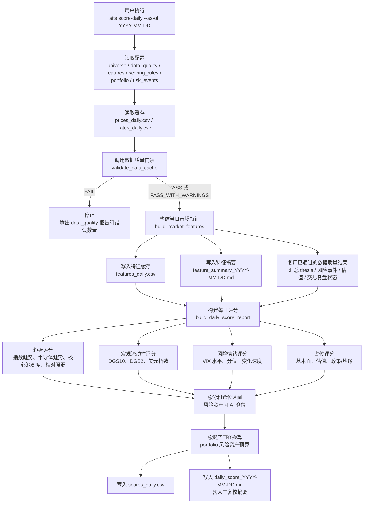
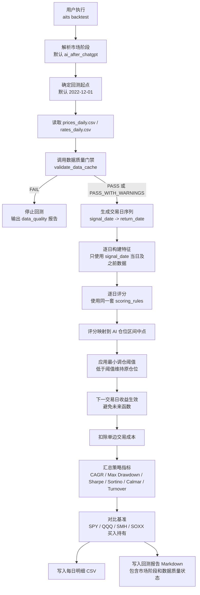
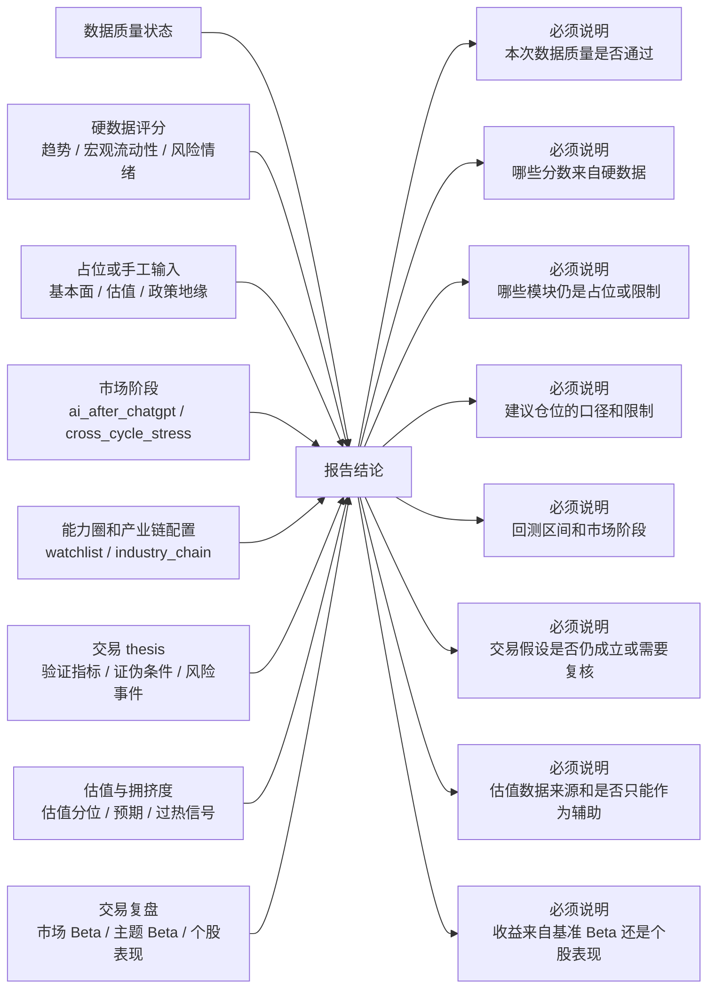
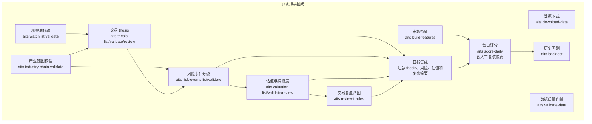

# 系统数据流示意图

本文档是系统从数据输入、中间评估到输出结论的流程图。它不是一次性说明文档，而是工程事实的一部分：后续新增命令、数据源、配置、评分模块、回测路径或报告输出时，必须同步维护本文件。

## 维护边界

必须更新本文件的情况：

- 新增、删除或改名 CLI 命令。
- 新增、删除或改名关键配置文件。
- 改变 `data/raw`、`data/processed`、`outputs/reports`、`outputs/backtests` 的核心文件结构。
- 改变数据质量门禁位置、通过条件或失败后的停止行为。
- 改变评分模块、仓位映射、回测默认市场阶段或报告结论结构。
- 接入或改变交易 thesis、风险事件、估值、新闻、复盘归因等模块。

不需要更新本文件的情况：

- 不改变外部行为的内部重构。
- 不改变字段含义、命令输入输出或报告解释的性能优化。
- 单元测试、类型标注、格式化等纯工程维护。

## 总览

```mermaid
flowchart TD
    subgraph Source["数据输入"]
        U["config/universe.yaml<br/>标的池、基准、利率序列"]
        P["config/portfolio.yaml<br/>风险资产预算和仓位上限"]
        Q["config/data_quality.yaml<br/>质量阈值"]
        F["config/features.yaml<br/>特征窗口和相对强弱组合"]
        S["config/scoring_rules.yaml<br/>评分权重和仓位动作阈值"]
        W["config/watchlist.yaml<br/>观察池与能力圈"]
        I["config/industry_chain.yaml<br/>产业链节点与因果图"]
        R["config/market_regimes.yaml<br/>AI regime 与压力测试区间"]
        RE["config/risk_events.yaml<br/>L1/L2/L3 风险事件动作规则"]
        TH["data/external/trade_theses/*.yaml<br/>交易假设、验证指标、证伪条件"]
        VS["data/external/valuation_snapshots/*.yaml<br/>估值、预期、拥挤度快照"]
        TD["data/external/trades/*.yaml<br/>交易记录、价格、thesis_id"]
        MD["外部数据源<br/>Yahoo Finance / FRED"]
    end

    subgraph Cache["本地缓存"]
        DL["aits download-data"]
        PR["data/raw/prices_daily.csv"]
        RR["data/raw/rates_daily.csv"]
    end

    subgraph Gate["数据质量门禁"]
        V["aits validate-data<br/>schema / completeness / freshness / duplicate keys / suspicious values"]
        QR["outputs/reports/data_quality_YYYY-MM-DD.md"]
        Stop["停止后续评分、特征、回测或报告"]
    end

    subgraph Feature["中间评估：市场特征"]
        BF["aits build-features"]
        FT["data/processed/features_daily.csv"]
        FR["outputs/reports/feature_summary_YYYY-MM-DD.md"]
    end

    subgraph Score["中间评估：评分和仓位"]
        SD["aits score-daily"]
        SC["data/processed/scores_daily.csv"]
        DR["outputs/reports/daily_score_YYYY-MM-DD.md"]
    end

    subgraph Backtest["历史回测"]
        BT["aits backtest"]
        BD["outputs/backtests/backtest_daily_YYYY-MM-DD_YYYY-MM-DD.csv"]
        BR["outputs/backtests/backtest_YYYY-MM-DD_YYYY-MM-DD.md"]
    end

    subgraph Governance["结构校验"]
        WV["aits watchlist validate"]
        WR["outputs/reports/watchlist_validation_YYYY-MM-DD.md"]
        IV["aits industry-chain validate"]
        IR["outputs/reports/industry_chain_validation_YYYY-MM-DD.md"]
        RV["aits risk-events validate"]
        RVR["outputs/reports/risk_events_validation_YYYY-MM-DD.md"]
    end

    subgraph Thesis["交易假设复核"]
        TL["aits thesis list"]
        TV["aits thesis validate"]
        TR["aits thesis review"]
        TVR["outputs/reports/thesis_validation_YYYY-MM-DD.md"]
        TRR["outputs/reports/thesis_review_YYYY-MM-DD.md"]
    end

    subgraph Valuation["估值与拥挤度复核"]
        VL["aits valuation list"]
        VV["aits valuation validate"]
        VR["aits valuation review"]
        VVR["outputs/reports/valuation_validation_YYYY-MM-DD.md"]
        VRR["outputs/reports/valuation_review_YYYY-MM-DD.md"]
    end

    subgraph TradeReview["交易复盘归因"]
        RT["aits review-trades"]
        RTR["outputs/reports/trade_review_YYYY-MM-DD.md"]
    end

    MD --> DL
    U --> DL
    DL --> PR
    DL --> RR

    U --> V
    Q --> V
    PR --> V
    RR --> V
    V -->|通过或 PASS_WITH_WARNINGS| QR
    V -->|FAIL| Stop

    PR --> BF
    RR --> BF
    F --> BF
    W --> BF
    QR --> BF
    BF --> FT
    BF --> FR

    FT --> SD
    QR --> SD
    S --> SD
    P --> SD
    TH --> SD
    RE --> SD
    VS --> SD
    TD --> SD
    SD --> SC
    SD --> DR

    PR --> BT
    RR --> BT
    F --> BT
    S --> BT
    P --> BT
    W --> BT
    R --> BT
    QR --> BT
    BT --> BD
    BT --> BR

    U --> WV
    W --> WV
    I --> WV
    WV --> WR
    I --> IV
    W --> IV
    IV --> IR
    RE --> RV
    I --> RV
    W --> RV
    U --> RV
    RV --> RVR

    TH --> TL
    TH --> TV
    TH --> TR
    W --> TV
    I --> TV
    W --> TR
    I --> TR
    TV --> TVR
    TR --> TRR

    VS --> VL
    VS --> VV
    VS --> VR
    U --> VV
    W --> VV
    VV --> VVR
    VR --> VRR

    TD --> RT
    PR --> RT
    RR --> RT
    QR --> RT
    RT --> RTR
```

## 每日评分链路

## 回测链路

## 结论输出与解释责任

## 当前已实现与待接入模块

## 文件和命令责任表

|层级|命令或文件|责任|当前状态|
|---|---|---|---|
|数据源|Yahoo Finance / FRED|提供价格、VIX、DXY、利率原始输入|已接入基础版|
|下载|`aits download-data`|拉取并标准化为本地 CSV 缓存|已实现|
|原始缓存|`data/raw/prices_daily.csv`|日线 OHLCV 和调整收盘价|已实现|
|原始缓存|`data/raw/rates_daily.csv`|FRED 利率长表|已实现|
|质量门禁|`aits validate-data`|校验 schema、完整性、新鲜度、重复键和异常值|已实现|
|质量报告|`outputs/reports/data_quality_YYYY-MM-DD.md`|声明数据是否可用于下游结论|已实现|
|特征|`aits build-features`|生成可解释市场特征|已实现|
|特征缓存|`data/processed/features_daily.csv`|保存 tidy 格式特征|已实现|
|评分|`aits score-daily`|输出评分、仓位区间和日报|已实现|
|评分缓存|`data/processed/scores_daily.csv`|保存每日评分结构化结果|已实现|
|日报|`outputs/reports/daily_score_YYYY-MM-DD.md`|输出中文结论、数据质量状态、限制说明和人工复核摘要|已实现|
|回测|`aits backtest`|基于每日评分动态仓位回测|已实现|
|回测报告|`outputs/backtests/backtest_YYYY-MM-DD_YYYY-MM-DD.md`|输出市场阶段、质量状态和绩效指标|已实现|
|能力圈|`config/watchlist.yaml`|记录核心标的、能力圈和 thesis 要求|已实现基础版|
|产业链|`config/industry_chain.yaml`|记录产业链节点和因果关系|已实现基础版|
|市场阶段|`config/market_regimes.yaml`|记录默认 AI regime 和压力测试区间|已实现|
|风险事件|`config/risk_events.yaml`|记录 L1/L2/L3 风险和动作规则|已实现基础版|
|风险事件校验|`aits risk-events validate`|校验风险等级、产业链引用、相关标的和动作规则|已实现基础版|
|交易假设|`data/external/trade_theses/`|记录交易 thesis、验证指标和证伪条件|已实现基础版|
|交易假设模板|`docs/examples/trade_theses/`|提供可复制 YAML 模板，不提交个人记录|已实现基础版|
|假设校验|`aits thesis validate`|校验 schema、观察池引用、产业链节点和证伪约束|已实现基础版|
|假设复核|`aits thesis review`|输出 thesis 是否仍成立、是否需要人工复核、是否证伪触发|已实现基础版|
|估值拥挤度|`data/external/valuation_snapshots/`|记录估值分位、预期变化和拥挤度|已实现基础版|
|估值模板|`docs/examples/valuation_snapshots/`|提供可复制 YAML 模板，不提交个人记录|已实现基础版|
|估值校验|`aits valuation validate`|校验来源、日期、ticker、指标值和新鲜度|已实现基础版|
|估值复核|`aits valuation review`|输出估值是否偏贵、拥挤或数据过期|已实现基础版|
|交易记录|`data/external/trades/`|记录真实交易、价格、仓位和 thesis_id|已实现基础版|
|交易复盘|`aits review-trades`|先过数据质量门禁，再对比 SPY/QQQ/SMH/SOXX 做基础归因|已实现基础版|
|日报复核摘要|`aits score-daily`|汇总 thesis、风险事件、估值快照和交易复盘状态；交易复盘复用同一份数据质量门禁结果|已实现基础版|
