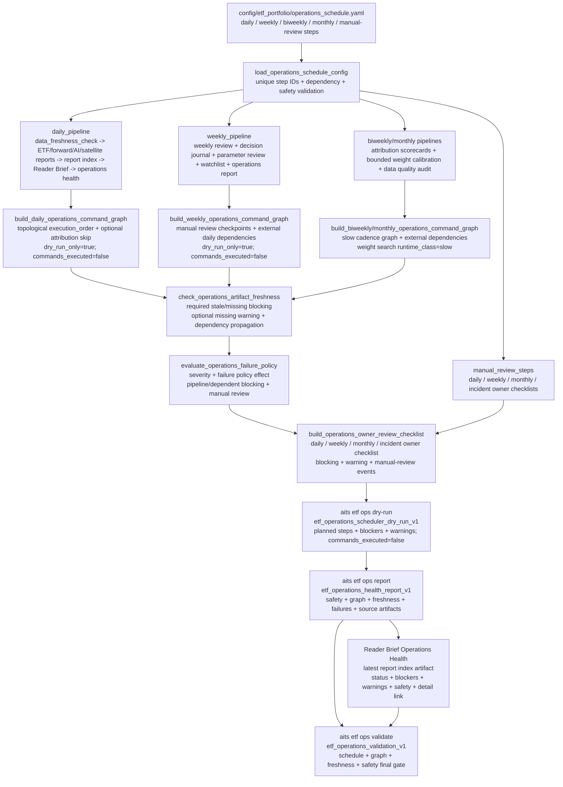
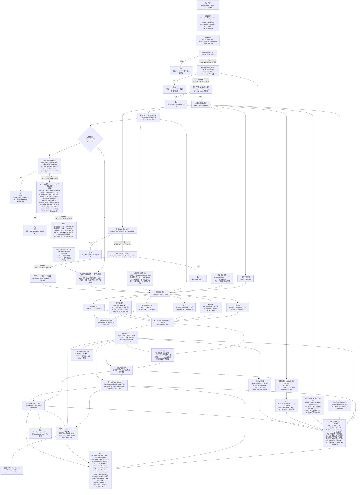
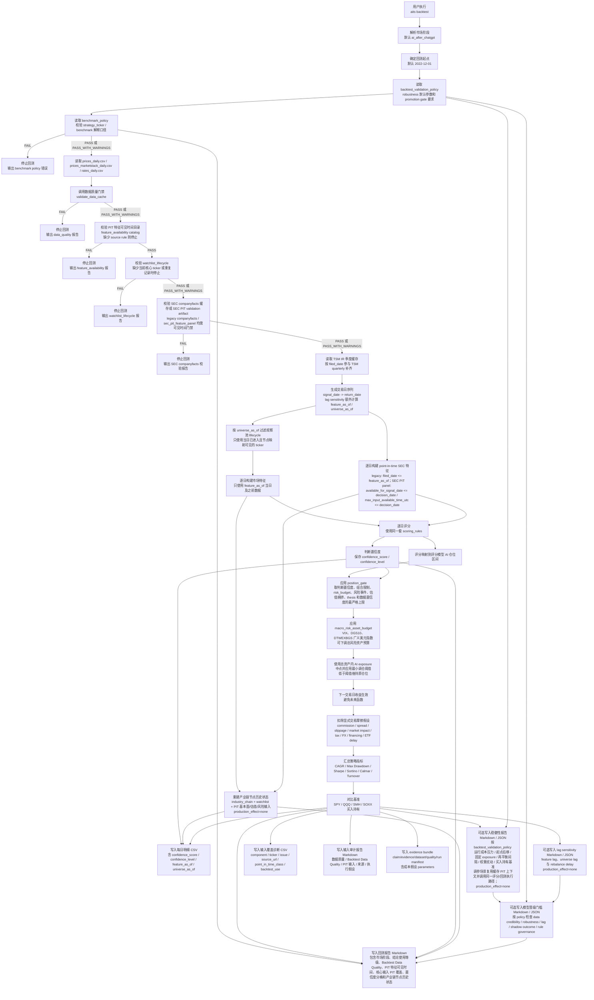
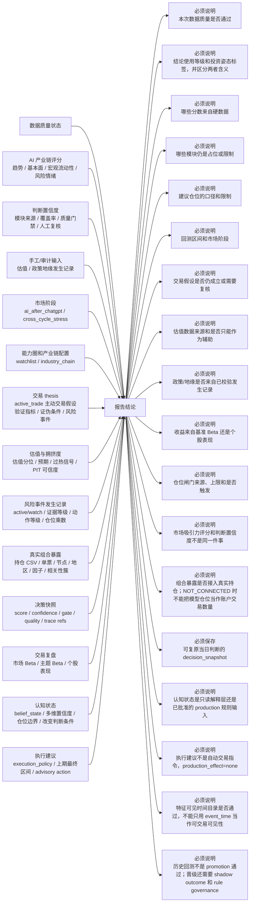
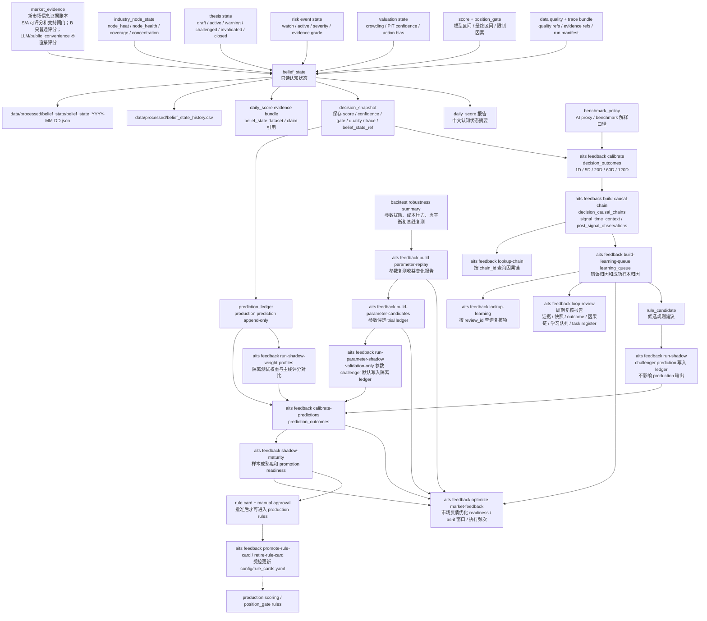
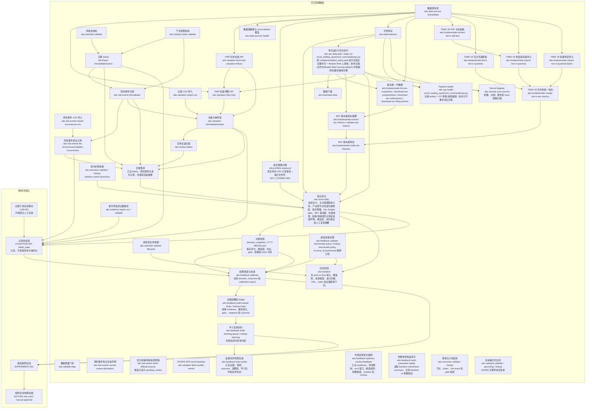

# 系统数据流示意图

本文档是系统从数据输入、中间评估到输出结论的流程图。它不是一次性说明文档，而是工程事实的一部分：后续新增命令、数据源、配置、评分模块、回测路径或报告输出时，必须同步维护本文件。

ARCH-004G2.4BT 把 Simulation Interpretation的三个CLI callback迁至`interfaces/cli/etf_portfolio/dynamic_v3_sim_interpretation.py`，数据流固定为：显式Outcome+Calibration+Forward Bridge ids/roots → 三个content-derived validators → timezone/cutoff + same-Outcome lineage + Bridge `TRACKING_PLAN_ONLY` gate → full three-source bundles/validations → `sim_interpretation_input_snapshot.v2` → same-event/window AVAILABLE finite variant/no_trade pairs → null-preserving role/return/risk/usage matrix + evidence-derived findings/confidence → manifest/Markdown → live-source/content-derived byte validator。Missing不转0/“similar”，empty evidence为`INSUFFICIENT_DATA`，tracking target不声明forward success或defensive proof。该链只作non-PIT manual interpretation，不运行Risk Return或后续链，不改policy/config/portfolio/production/order/broker。

ARCH-004G2.4BS 把 Backtest Simulation Forward Bridge 的三个CLI callback迁至`interfaces/cli/etf_portfolio/dynamic_v3_backtest_sim_forward_bridge.py`，数据流固定为：显式Calibration pack → Calibration content-derived validator/time cutoff → full Calibration bundle/validation/lineage + reviewed forward policy/governance metadata → `backtest_sim_forward_bridge_input_snapshot.v2` → policy-derived events/windows/criteria → `TRACKING_REQUIRED` targets + weekly questions + manifest/Markdown/Reader Brief → live Calibration/content-derived byte validator。Missing policy字段、重复/非法windows或non-finite criteria直接fail closed，不注入默认值；source metric availability只作披露，不声明forward success、production candidate或自动policy调整。该链只生成manual/ad-hoc observation plan，不运行后续链、scheduler或broker，`production_effect=none`。

ARCH-004G2.4AT 把 Dynamic-v3 Backfilled Outcome 的三个CLI callback迁至`interfaces/cli/etf_portfolio/dynamic_v3_backfilled_outcome.py`，数据流固定为：显式Historical Replay id/root → full content-derived replay validation → timezone/cutoff gate → reviewed paper policy的window/cost版本 → cached market/rate统一DQ gate → cutoff前validated price-cache sessions与required-symbol price rows → event×variant×window的AVAILABLE/PENDING/INSUFFICIENT_DATA → immutable `backfilled_outcome_source_snapshot.json` → outcome rows/variant summary/manifest/Markdown → content-derived validator。Price只进入future outcome evaluation，不回流修改replay decision inputs。AVAILABLE按fixed-share gross path计算，`net return=gross return-one_way_l1_turnover×(transaction_cost_bps+slippage_bps)/10000`，成本只在事件初始调整扣一次；drawdown/volatility明确是gross path。PENDING/INSUFFICIENT的gross/net/relative/risk/cost为null+reason。任何replay/DQ/source/snapshot/output drift均fail closed；测试DQ skip必须显式，legacy unsnapshotted artifact只读warning。该链路不改config/policy/official weights/paper或real portfolio/production/order/broker，`production_effect=none`。

ARCH-004G2.4AU 把 Dynamic-v3 Historical Paper Simulation 的三个CLI callback迁至`interfaces/cli/etf_portfolio/dynamic_v3_historical_paper_sim.py`，数据流固定为：显式Historical Replay → full replay validation/time gate → reviewed cost policy → cached market/rate DQ → cutoff price rows → event-ordered fixed-share interval value paths → simulated-before到variant-target的one-way L1 reset/cost → state history/trade ledger/net performance/no_trade comparator → immutable source snapshot → content-derived validator。缺required-symbol path或少于两个event dates时return/risk/relative为null且simulation=INSUFFICIENT_DATA，不再用0继续。AU同时把共享portfolio daily risk path改为由fixed-share portfolio value相邻变化推导，使AT的drawdown/volatility与gross total return同口径。该链不是真实账户或order replay，不改replay/config/policy/official weights/paper/real portfolio/production/order/broker，`production_effect=none`。

ARCH-004G2.4AV 把 Dynamic-v3 Replay Performance Review 的三个CLI callback迁至`interfaces/cli/etf_portfolio/dynamic_v3_replay_performance_review.py`，数据流固定为：显式Backfilled Outcome+Historical Paper Simulation → 两个full content-derived validators → same-replay/time gate → reviewed `replay_performance_review_v1.yaml` → immutable source/policy bundle → event/action/variant effectiveness → evidence-floor-gated manual proposal → manifest/Markdown/Reader Brief → content-derived validator。5日relative return只支持positive/nonpositive rate；没有独立分类标签时false alarm/missed opportunity和所有missing metrics保持null。未同时满足distinct-event、available-window与simulation门槛时只允许continue forward tracking，任何source/snapshot/policy/output drift均fail closed。该链不自动更新config或promotion，不改official weights/paper或real portfolio/production/order/broker，`production_effect=none`。

ARCH-004G2.4AW 把 Dynamic-v3 Replay Diagnosis 的三个CLI callback迁至`interfaces/cli/etf_portfolio/dynamic_v3_replay_diagnosis.py`，数据流固定为：显式Inventory/Replay/Backfill/Simulation/Review ids+roots → 五个full validators → 完整lineage/time gate → immutable five-source bundle → unit-aware coverage/pending reasons/health matrix → AV evidence-gated comparison readiness → manifest/Markdown → content-derived validator。无pending reason为空列表；event、variant-window、simulation-chain单位不混写；任意AVAILABLE window不再自动解锁方向性comparison。Source/snapshot/view/report drift均fail closed。本层只诊断，不运行repair/comparison/calibration，不改source/config/policy/weights/portfolio/production/order/broker。

ARCH-004G2.4AX 把 Dynamic-v3 Backfill Repair 的三个CLI callback迁至`interfaces/cli/etf_portfolio/dynamic_v3_backfill_repair.py`，数据流固定为：显式Backfilled Outcome+Replay Diagnosis ids/roots和关联Historical Replay → 三个full content-derived validators → 同链lineage/time gate → cached price/rate统一DQ gate → reviewed backfill window/cost语义 → cutoff price rows → immutable `backfill_repair_source_snapshot.json` → 仅原PENDING/INSUFFICIENT的event×variant×window重算 → repair actions/repaired rows/availability delta/manifest/Markdown → live-source与snapshot双重content-derived validator。原AVAILABLE保持immutable；重算复用AT fixed-share gross path与`net=gross-one_way_l1_turnover×cost_rate`，缺required-symbol path继续null+reason，future price只作outcome evidence且不回流decision。`repaired_count`显式是`event_variant_window`单位。任一source/DQ/snapshot/output drift均fail closed；该层不覆写原backfill、不自动运行comparison/calibration，不改config/policy/official weights/portfolio/production/order/broker，`production_effect=none`。

ARCH-004G2.4AY 把 Dynamic-v3 Variant Comparison 的三个CLI callback迁至`interfaces/cli/etf_portfolio/dynamic_v3_variant_comparison.py`，数据流固定为：显式Backfilled Outcome+optional Repair → full validators/lineage/time gate → reviewed `variant_comparison_v1.yaml` → duplicate-key gate → immutable source/policy/canonical-row snapshot → null-preserving window metrics → same-event/window finite pairwise → 5d same-event common-cohort ranking gate → manifest/Markdown → live-source/policy/content-derived validator。3 distinct events、10 available rank-eligible variant-windows和3 paired common events任一未过，best=MISSING/confidence=INSUFFICIENT_DATA；不跨window或missing cohort等权混排，owner/paper variants只作diagnostic。该链只产出人工comparison evidence，不自动运行calibration，不改source/config/policy/weights/portfolio/production/order/broker，`production_effect=none`。

ARCH-004G2.4AZ 把 Dynamic-v3 Rule Calibration 的三个CLI callback迁至`interfaces/cli/etf_portfolio/dynamic_v3_rule_calibration.py`，数据流固定为：显式Variant Comparison → content-derived source validator/time gate → reviewed `rule_calibration_v1.yaml`+当前`position_advisory_v1.yaml` → immutable comparison/policy snapshot → evidence eligibility gate → diagnostics + manual proposals或non-policy evidence actions + safety + manifest/Markdown → live-source/policy/content-derived validator。只有source status=PASS且ranking=PILOT_ELIGIBLE才允许方向性人工proposal；否则status=INSUFFICIENT_DATA、proposal_count=0、`policy_change_allowed=false`并要求继续forward evidence。该链不自动应用proposal，不改target policy/config/weights/portfolio/production/order/broker，`production_effect=none`。

ARCH-004G2.4BA 把 Dynamic-v3 Replay-to-Forward Bridge 的三个CLI callback迁至`interfaces/cli/etf_portfolio/dynamic_v3_replay_forward_bridge.py`，数据流固定为：显式Diagnosis+Comparison+Calibration → 三个content-derived validators → backfill/replay/comparison lineage与time gate → reviewed `replay_forward_bridge_v1.yaml` → immutable三源/policy snapshot → proposal/evidence-action分流 → forward focus + weekly updates + manifest/Markdown/Reader Brief section → live-source/policy/content-derived validator。INSUFFICIENT_DATA继承`require_more_forward_data` non-policy action而不伪造proposal；无pending reason保持none；10-event pilot target、windows/focus/questions均由policy治理。该链只提供observation/review guidance，不运行上游或scheduler，不改policy/config/weights/portfolio/production/order/broker，`production_effect=none`。

ARCH-004G2.4BJ 把 Dynamic-v3 Evidence Trend 的三个CLI callback迁至`interfaces/cli/etf_portfolio/dynamic_v3_evidence_trend.py`，数据流固定为：timezone-aware generated + reviewed trend policy → 扫描Rolling Refresh directories → ROLLED_BACK/legacy/future进入explicit excluded inventory、PREPARED/invalid COMMITTED fail closed → selected refresh content-derived PASS/COMMITTED + unique refresh/update identity → freeze full bundles/validation evidence/policy → 从每个refresh frozen post-Dashboard读取full forward/historical availability state，并从post Limited/Consensus读取null-preserving metrics → reviewed history/confidence/growth/return/risk/action rules → timeseries + summary + manifest/Markdown。Validator重验live refresh/policy并重算全部views。该层只观察历史趋势，不运行上游、不改policy/config/weights/portfolio/production/order/broker。

ARCH-004G2.4BK 把 Dynamic-v3 Forward Outcome Decision 的三个CLI callback迁至`interfaces/cli/etf_portfolio/dynamic_v3_forward_outcome_decision.py`，数据流固定为：week-ending + timezone-aware generated + reviewed decision policy → generated/week evidence cutoff → 显式id或cutoff内semantic-latest Outcome Update / Rolling Refresh / Evidence Trend → 各source content-derived PASS + full bundle/validation freeze → Update→Refresh→Trend lineage gate → 从Trend frozen latest full-Dashboard state读取null-preserving availability/confidence/risk/trend → reviewed sample/confidence/risk/trend/manual-review/recommendation/cadence rules → source snapshot + go/no-go matrix + next actions + manifest/Markdown/Reader Brief。Validator重验live selection/source/policy并重算全部views。该层只生成owner decision support，不运行上游、不改policy/config/weights/portfolio/production/order/broker。

ARCH-004G2.4BI 把 Dynamic-v3 Rolling Evidence Refresh 的三个CLI callback迁至`interfaces/cli/etf_portfolio/dynamic_v3_rolling_evidence_refresh.py`，数据流固定为：显式Outcome Update id + timezone-aware generated → update content-derived PASS/COMMITTED/time/live/single-use gate → 捕获validated Limited/Consensus baseline、六output roots与latest pointer prestate → PREPARED transaction → Outcome Dashboard（post-update显式排除已消费Due）→ Limited-vs-NoTrade → Consensus Risk → Owner Attribution → optional Shadow Aging → Weekly Review → 每个实际下游content-derived validator PASS → 冻结update/baseline/post bundles与validation evidence → selected-cohort forward delta + transaction baseline delta → manifest/Markdown/Reader Brief section → refresh全view self-validation → COMMITTED + latest pointer。任一异常删除本次新增下游artifacts、恢复全部captured pointers并记录ROLLED_BACK。该层只编排证据刷新，不改policy/config/weights/portfolio/production/order/broker。

ARCH-004G2.4BH 把 Dynamic-v3 Outcome Update 的三个CLI callback迁至`interfaces/cli/etf_portfolio/dynamic_v3_outcome_update.py`，数据流固定为：显式review id + timezone-aware generated → single-use gate → Outcome Update Review content-derived PASS与review/generated/as-of ordering → unique review identities + selected Advisory Outcome live pre-state/full bundles → isolated full-batch DQ/price/update/post-validation preflight → PREPARED transaction + rollback backups → selected READY windows append-only update → all post validators PASS → frozen post bundles + selected-cohort updated/skipped/delta → manifest/Markdown → COMMITTED transaction；任一异常走全selected restore并记录ROLLED_BACK。Validator从immutable snapshot重算review、pre→post唯一event append、rows/delta/manifest/Markdown并核对live post bundles。该层只追加forward outcome evidence，不自动refresh、不改policy/weights/portfolio/production/order/broker。

ARCH-004G2.4BG 把 Dynamic-v3 Outcome Update Review 的三个CLI callback迁至`interfaces/cli/etf_portfolio/dynamic_v3_outcome_update_review.py`，数据流固定为：显式due id + timezone-aware review cutoff → Outcome Due content-derived validator PASS/id/time边界校验 → 完整due bundle与validation evidence immutable snapshot → unique `outcome_id×window_days` identity与status/price-date gate → 由`DUE + PENDING + can_update + cutoff-visible price`确定性推导READY → safety checks + impact preview + manifest/Markdown → live due revalidation与全view重算。`future_data_used_in_decision`由日期边界证明；duplicate、future source/price或source/snapshot/output drift均fail closed，合法empty artifact为`INSUFFICIENT_DATA`。该层只生成owner review input，不执行outcome update、不刷新数据、不改policy/portfolio/production/order/broker。

ARCH-004G2.4BF 把 Dynamic-v3 Consensus Risk 的三个CLI callback迁至`interfaces/cli/etf_portfolio/dynamic_v3_consensus_risk.py`，数据流固定为：timezone-aware generated cutoff → validated unique Daily Advisory + unique latest Historical Replay + same-replay-lineage Repair-or-Backfill → reviewed risk policy + full source bundles immutable snapshot → explicit consensus weights/distinct decision-as-of overlap gate → exposure summary + strict consensus/no_trade paired drawdown + distinct-event turnover → policy-governed required-window/evidence/status precedence → manifest/Markdown → live source/policy revalidation与全view重算。Daily缺consensus weights不会回退candidate target；同日Daily/Replay不一致、duplicate outcome pair、lineage mismatch或AVAILABLE非finite drawdown均fail closed；empty exposure/drawdown/turnover为null。该层manual observation only，不推荐default execution、不apply policy、不改config/portfolio/production/order/broker。

ARCH-004G2.4BE 把 Dynamic-v3 Limited-vs-NoTrade 的三个CLI callback迁至`interfaces/cli/etf_portfolio/dynamic_v3_limited_vs_notrade.py`，数据流固定为：timezone-aware generated cutoff → validated Advisory Outcome与唯一latest Repair-or-Backfill → reviewed paired-comparison policy + full source snapshot → strict event×window limited/no_trade pair/coverage gate → AVAILABLE finite metrics与PENDING/INSUFFICIENT null语义 → policy-governed window confidence/equal-window recommendation → only-real-label regime breakdown → manifest/Markdown → live source/policy revalidation与全view重算。Forward只使用明确`limited_adjustment_return`，不再用paper return冒充；缺样本的avg/median/win/drawdown/turnover均为null，无regime label时breakdown=UNAVAILABLE。该层manual research only，不自动apply policy、不改config/portfolio/production/order/broker。

ARCH-004G2.4BD 把 Dynamic-v3 Outcome Dashboard 的三个CLI callback迁至`interfaces/cli/etf_portfolio/dynamic_v3_outcome_dashboard.py`，数据流固定为：timezone-aware generated cutoff → selected Advisory Outcome/Repair-or-Backfill/Paper Sim/Diagnosis/Outcome Due content-derived validators → unique semantic-latest/duplicate-lineage gate → reviewed pending-action policy + full source bundles immutable snapshot → forward-window/historical-event×variant×window/simulation-run三类sample rows → availability matrix/mode summary/selected pending reasons/manifest/Markdown/Reader Brief → live source/policy revalidation与全view重算。Repair只在存在唯一validated latest时替代Backfill；Diagnosis/Due只取冻结selected source，不再全目录重复聚合；缺source保持0/MISSING。该层不运行upstream、不修改policy/config/portfolio/production/order/broker，`production_effect=none`。

ARCH-004G2.4BC 把 Dynamic-v3 Replay Sample Expansion 的三个CLI callback迁至`interfaces/cli/etf_portfolio/dynamic_v3_replay_sample_expansion.py`，数据流固定为：显式start/end/generated cutoff → range/future gate → cached price/rate DQ → Daily Advisory与latest Replay Inventory content-derived validators + append-only Owner Review validator/cutoff → duplicate daily/id/as-of及跨源sample conflict gate → reviewed PIT eligibility policy + 完整source bundles/DQ/cache checksum/cutoff price-date immutable snapshot → canonical unique expanded events/source inventory/PIT summary/manifest/Markdown → live source/DQ/policy revalidation及全view重算。Shadow Monitor/Consensus Drift不再以`discovered_count=0`伪装成参与样本计算的source；PIT safety与outcome-price evaluability分离，PIT_UNSAFE和缺评价价格均不得进入default replay。该层不运行historical replay/backfill，不修改policy/config/portfolio/production/order/broker，`production_effect=none`。

ARCH-004G2.4BB 把 Dynamic-v3 Outcome Due 的四个CLI callback迁至`interfaces/cli/etf_portfolio/dynamic_v3_outcome_due.py`，数据流固定为：显式as-of → timezone/future gate → cached price/rate DQ → 全部selected Advisory Outcome content-derived validators + generated/duplicate gate → immutable outcome/DQ/cache-checksum/cutoff-price-date snapshot → due inventory/summary/update-ready/manifest/Markdown → snapshot/live-input content-derived validator。显式`update-ready`在due PASS、live-match、time和single-use gate后，只把每个outcome的DUE windows作为`allowed_window_days`追加到Advisory Outcome evidence ledger并要求post-update validator PASS；NOT_DUE/PRICE_MISSING不更新。该层不自动调度后续链，不改policy/config/weights/portfolio/production/order/broker；合法append-only forward evidence mutation仍为`production_effect=none`。

ARCH-004B 新增统一 semantic-kernel path：`config/market_regimes.yaml`、`config/research/research_window_registry.yaml`、primary-window policy 与 data-quality policy 先经 `legacy.research_context_adapter` 转为带 path/hash/version/status provenance 的 typed specs，再由纯 `contracts.research_context` 校验并生成 complete 或 blocked `ResearchEvaluationContext`。Context 明确区分 regime anchor/start、research-window id/start/role、requested/actual/effective/evaluation range、PIT `as_of`、trading calendar、per-input coverage、DQ contract、caveats 和 policy refs；window-id/start、actual/requested、effective/evaluation 或 DQ-as-of 冲突全部 fail closed，blocked path 保持缺失字段为 null，不复制 requested range 伪造 coverage。首个 reference consumer 是既有 `first_layer_v2_effective_coverage_audit`：旧 status、flat fields、计算与 safety boundary 保持不变，只 additive 写入 deterministic `research_evaluation_context_id` 和 nested context；其 late prediction start 继续解释为 coverage limitation，不把合法的 2021 primary window 与 2022 AI regime 混为一谈。该链路不新增 CLI/report family，不改变策略、阈值、权重、promotion、paper-shadow、production 或 broker。

ARCH-004C 新增 platform-contract path：纯 `contracts` 定义 `ArtifactEnvelope`、`DataQualityEvidence`、`WorkflowSpec/RunLedger` 和 `ReportSpec`；`platform.config` 把 YAML 解析为 typed value 与 `ConfigRef(path/hash/version/status/loaded-at)`，market-regime loader 已从 `config.py` 实体迁出，旧 import 只保留到 ARCH-004G 的 façade；`legacy.platform_contract_adapters` 将现有 `ScheduledTask`、report-registry entry 和 `DataQualityReport` 显式映射为 typed contract，unknown cadence/audience/production effect/status 不做猜测。Artifact 输出统一经 `platform.artifacts` 生成 deterministic UTF-8 bytes、同目录 atomic replace、checksum/size/pointer；shared dynamic-strategy writer、research artifact pair、daily run manifest 和 data-quality Markdown writer 已保持旧 path/schema/bytes parity 接入。`arch_004c_dependency_policy` + frozen direct-writer baseline 对 contracts/platform 反向 import 与新增 direct writer fail closed；历史 direct writer debt 从 baseline 894 降至 893，但仍由 ARCH-004G 分 lane 迁移，不能解释为已清零。该平台链只规范 contract/config/IO/lineage，不重算研究或投资结论，不改变 DQ/PIT、阈值、回测、权重、promotion、paper-shadow、production 或 broker。

TRADING-2438N2 新增 `aits research strategies growth-tilt-baseline-capability-graph --as-of YYYY-MM-DD --strict` read-only contract-first inventory。命令读取 N1 closure、M1C signal inventory、M1D2 adapters、base overlay/veto config和 compiler、metric/screening contracts及 typed executor code，输出 versioned node/edge graph和中文报告。Capability READY与 mutation-ready分离：后者必须 callable、baseline consumed、PIT valid、semantics approved、missing policy明确、runner binding可用、至少一个 approved mutable dimension且 hard-veto/transition/exposure dependencies全 READY；callable-but-unconsumed 绝不通过。真实 status=`GROWTH_TILT_BASELINE_CAPABILITY_GRAPH_READY_NO_MUTATION_READY_CAPABILITY`、mutation-ready capability=0，故 `TRADING-2438N3_NOT_STARTED`且N4不启动。N2不新增 transition/persistence/veto/exposure unit/threshold，不生成 candidate，不运行 replay/metrics或生产路径。

TRADING-2438N1 新增 `aits research strategies growth-tilt-candidate-family-close --source-m1e <artifact> --strict` terminal family closure。命令读取 M1E、M1D2、D1A owner resolution和2433 candidate set，原样复制 M1E `2 PASS/8 BLOCKED` prerequisite identity/order/status/blocker codes；输出 closure、negative-result ledger和中文报告。真实 status=`GROWTH_TILT_CANDIDATE_FAMILY_CLOSED_NO_EXECUTABLE_PIT_CANDIDATE`、closure=`CLOSED_NO_EXECUTABLE_PIT_CANDIDATE`、A/C REDEFINE、B WITHDRAW、replacement A=`KEEP_REDEFINED_BLOCKED`、pit_candidates_tested=0、M2 route disabled。Reopen只接受 candidate-independent baseline evidence并要求 owner reapproval与 screening-policy refreeze；family closed不推断 candidate FAIL，不运行 replay/metrics，不增加 baseline/candidate behavior。下一步只允许 TRADING-2438N2 read-only capability graph。

ARCH-004D 将上述 N1 closed/read-only/no-effect path 迁为首个 reference vertical slice：`config/research/experiments/growth_tilt_candidate_family_closure.yaml` 经 typed resolver 生成 deterministic `ExperimentSpec + ConfigRef`，generic `research_framework.runner` 统一读取 structured/text inputs并记录 path/hash/size，calculator plugin 复用原 `research_quality` pure builder，report plugin只生成原 negative-ledger section和 Markdown。旧 `growth-tilt-candidate-family-close` CLI/options/exit 继续由 time-bounded façade转入 generic runner，primary/section/Markdown 的 path/schema/status/bytes不变；额外写出 `artifact_envelope.v1` 与 one-step `run_ledger.v1` sidecars，explicit status map只允许 terminal closure -> PASS、source-contract blocked -> BLOCKED。该 governance-only slice不读取 fresh cached market/macro data，故 `data_quality_required=false` 且不伪造 DQ PASS；sidecar PASS只证明旧 closure复现成功，不改变 N1结论，也不表示 candidate/replay/promotion/paper-shadow/production/broker ready。

ARCH-004E 新增持续 DevEx/ownership 控制链：`config/architecture/devex_ownership_policy.yaml` 以互斥 specific rule + fail-closed fallback 为全部 source/test/support Python 文件生成 deterministic module/test manifests，并将 code、policy、data、artifact、runtime 五类 owner 分开记录；changed-file impact selector 只提供 focused feedback，shared aggregate 或 unknown path 会升级到 architecture coordinator/full gate，绝不替代 phase full validation。ARCH-004C dependency/direct-writer ratchet、manifest freshness、ownership coverage 与 aggregate reproducibility 被汇总为单一 architecture fitness；`scripts/run_validation_tier.py architecture-fitness` 从 generated test manifest 解析测试集合，不维护第二份手写路径。module/experiment/report scaffold 只创建 skeleton/spec/fragment，并在目标存在时 fail closed；4 个 fragment 只生成覆盖 report registry、artifact catalog、system flow 三个 target 的 shadow index，现有 aggregate 仍是 source-of-truth 且由 coordinator 独占。engineering surface inventory 只链接上述 control artifacts，不改变既有 report schema 的核心解释。该链路只改研发治理，不改变 scheduler cadence、研究结果、报告结论、DQ/PIT、阈值、权重、promotion、paper-shadow、production 或 broker。

ARCH-004F2 以 `docs/research/current_research_strategy_execution_chain.md` 建立研究执行链路的人读权威说明：owner question 先转为 hypothesis/preregistration，再解析 `ResearchEvaluationContext`，经过 source provenance、DQ/PIT gate、feature/label/signal、candidate/baseline、target/execution、backtest/cost/risk、robustness/holdout/falsification、evidence multi-axis state、ReviewDecision/OwnerDecision，最后由 canonical artifact/envelope/run ledger 进入分层报告。文档逐步链接真实配置、源码和 artifact，并把 `CANONICAL`、已验证 `REFERENCE`、待迁移 `LEGACY`、`BLOCKED` 与 `PLANNED` 分开；其中 2022-12-01 AI regime 与 2021-02-22 QQQ/SGOV/TQQQ primary window 明确不可互换。B0～B4 的 research-only公式和当前 evidence limitation 被记录，B5/B6、growth-tilt PIT replay/promotion仍保持 blocked；fixed cadence只产生 observation/review/proposal，不能自动调参、改权重或 promotion。该说明不运行上游、不改变计算或报告结论，F2 后续 runtime migration仍必须逐 slice parity。

ARCH-004F2.5 将上述 lifecycle 落为 `contracts.research_lifecycle` pure state machine：`ResearchPreregistration` 强制 hypothesis/baseline/candidate/context、selection-rule SHA-256、metrics、policy refs、validation plan、timezone-aware freeze time、`result_visibility=NONE`、manual review和 no-production；`ResearchLifecycleRecord` 只允许 observation -> evidence -> `KEEP|INVESTIGATE|RETIRE|OPEN_RESEARCH`，OPEN_RESEARCH 后仍须单独 freeze proposal、记录 `PASS|FAILED|BLOCKED` validation，再由人工 owner决定 ADOPT/REJECT/CONTINUE。`apply_periodic_research_review` 只能停在 review outcome，不能创建 preregistration、validation、owner decision或 adoption。既有 `research_campaign.py` 保留为 campaign control plane，`legacy.research_campaign_adapter` 在缺 context/selection checksum/result visibility/policy refs 时显式 BLOCKED，不推断 READY。Generic Experiment runner 通过 optional lifecycle plugin capability写派生 `.lifecycle.json`；未注册 lifecycle plugin 的 spec完全不变。Growth-tilt closure reference 中 terminal negative evidence进入 `RETIRE -> RETIRED`，source-contract blocker进入 `INVESTIGATE -> INVESTIGATING`；旧 primary/section/Markdown/envelope/run-ledger path/schema/status/bytes保持，lifecycle只作 additive sidecar。该 runtime contract不改变研究结论、阈值、权重、DQ/PIT、promotion、paper-shadow、production或broker。

ARCH-004F1 当前建立 operations shadow control path：`config/scheduled_tasks.yaml` 的 37 daily + 41 non-daily tasks 先经 `legacy.scheduled_tasks_adapter` 的显式 owner/timezone/due-policy binding 转为 canonical `WorkflowSpec`；legacy `none/local_cache_write/local_report_write` 通过命名兼容表映射为 no-production boundary，未知 cadence/effect 直接 BLOCKED。Pure `contracts.operations` 用 typed policy/context 解析 daily trigger、period-end、biweekly anchor 和 explicit trigger，并在真正 DUE 后依次检查 completed daily、DQ evidence id、required artifact ids 和 owner decision id，输出 deterministic `DUE|NOT_DUE|BLOCKED` resolution；non-executing `OperationsShadowPlan` 将 resolution 传播到 canonical RunLedger，但 `execution_enabled=false` 且 legacy dispatcher硬阻断。原先只在 `ops_daily.py` 出现的 `official_policy_sources` 已正式登记为 `activation_condition=closed_market_only`，loader、legacy daily validator和shadow WorkflowSpec按同一 market-session activation选择步骤；2个 trading-day和2个 closed-market plan parity均PASS。`aits ops daily-plan`与`daily-run`现在保留旧Markdown bytes/path，同时原子写相邻`*.operations_shadow.json`：sidecar固定`daily_operations_shadow.v1`、source config path/hash、activated WorkflowSpec、DUE resolution、non-executing RunLedger、parity PASS、`commands_executed=false`、`non_daily_dispatch_enabled=false`、`production_effect=none`、`broker_action=none`；parity非PASS则fail closed。F1.2完成，F1.3开始处理lock/retry/idempotency/resume。外部入口仍只有`aits ops daily-run`，non-daily自动dispatch保持disabled。

ARCH-004F1.3 新增尚未cut-in legacy daily executor的canonical runtime-control层。`config/operations/runtime_control.yaml`治理6小时lock TTL、2次run attempt上限、idempotent-only resume及daily/non-daily cut-in flags；`OperationsRunControl`以`workflow_id + workflow_spec_id + as_of`生成deterministic idempotency key，以workflow/date原子目录lock阻断并发，只在`expires_at`已过时原子回收stale lock，并通过canonical atomic writer持久化`operations_execution_state.v1`。Run state逐步记录current/completed step和每步attempt；`WorkflowStepSpec.max_attempts`参与真实retry gate，completed/current partial state只有明确`idempotent=true`才可resume；non-idempotent、run/step exhausted、invalid/corrupt state全部fail closed；terminal PASS同key重触发返回`ALREADY_COMPLETE`而不获取lease。Daily shadow sidecar记录runtime policy path/hash及`legacy_daily_executor_cut_in_enabled=false`，因此F1.3只证明runtime capability与边界，真正让`run_daily_ops_plan`消费lease/skip completed steps/写terminal state属于F1.4。Non-daily dispatch仍false，不改变DQ、score、weight、paper-shadow、production或broker。

ARCH-004F1.4 已把上述控制层切入唯一 daily CLI 路径：`aits ops daily-run` 先从market-session activated schedule生成同一`WorkflowSpec`，再按`workflow/spec/as_of`获取lease，最后由受控adapter调用原`run_daily_ops_plan` façade。Observer把legacy step事件映射为canonical start/PASS/SKIPPED/FAILED；resume只跳过此前PASS步骤，重复完成、并发、run/step attempt耗尽在调用runner前返回显式control status。每次`operations_execution_state.v1`原子更新旁都写`*.run_ledger.json`：PASS与SKIPPED都满足后续依赖，实际失败步骤为FAILED，其后未运行步骤为BLOCKED；因此`validate_data`失败会留下`download_data=PASS / validate_data=FAILED / score_daily=BLOCKED`且不执行score。Trading-day、closed-market、resume、duplicate、concurrent与failure fixtures均保留旧DailyOpsStepResult/report contract；CLI对已完成duplicate安全返回，对control blocker fail closed，不生成误导性dashboard/Reader Brief refresh。Runtime policy现为`legacy_daily_executor_cut_in_enabled=true`，但`non_daily_dispatch_enabled=false`，所以F1.5前weekly/biweekly/monthly仍不会自动运行，也不改变DQ、score、weight、paper-shadow、production或broker边界。

ARCH-004F1.5 将41个non-daily登记项收敛到typed periodic control，而没有把它们拼成一个会互相拖累的串行DAG。`config/operations/periodic_control.yaml`为weekly、biweekly、monthly、ad-hoc分别治理period-end/2-week anchor/explicit-trigger、daily/DQ/artifact/owner evidence和dispatch mode；legacy adapter为每个task生成独立one-step WorkflowSpec。`daily-run`完成或读取duplicate PASS后，在canonical run metadata中写`periodic_operations_plan.v1`：每项都包含原command template、WorkflowSpec、DueResolution和non-executing RunLedger；weekly/monthly以美股下个交易日是否跨周/月判断period end，biweekly锚点为reviewed 2026-07-10，ad-hoc默认未触发。缺DQ evidence id、source artifact ids或owner decision的due项为BLOCKED，非period-end/event未触发为NOT_DUE，均不改变daily PASS。人工`aits ops periodic-dispatch`必须显式选择task并提供daily/DQ status、DQ evidence、source artifacts、owner decision与confirm flag；只接受governed `aits`/`python scripts/`前缀，`{...}`、`<...>`或自然语言checkpoint在runner前BLOCKED。可执行项复用F1.3 lock/idempotency/attempt与terminal state/ledger，duplicate PASS不重跑、失败后attempt exhausted。Runtime non-daily lease已开启，但policy `automatic_command_dispatch_enabled=false`，所以唯一外部scheduler仍是daily-run且只自动评估，不会自动跑weekly/monthly/research，也不自动调参、改权重、promotion、paper-shadow、production或broker。

ARCH-004F3 建立三层typed reporting kernel：`config/reporting/reporting_architecture.yaml`冻结Owner Daily Brief最多10个core section、owner queue必须typed `DUE + actionable`、Research Review Pack不得auto-tune或把proposal当adoption、Report Audit Index必须覆盖全部registry与legacy-unclassified、Reader Brief native cut-in=false/additive-only/no-recompute/no-production/no-broker。旧`build_reader_brief_payload`仍先生成兼容payload/JSON/HTML；随后`platform.reporting.owner_daily`只读该payload并按固定source keys投影`section provider -> OwnerDailyBriefViewModel -> JSON/HTML sidecar`，`reports reader-brief`和daily-run都写`owner_daily_brief_YYYY-MM-DD.*`，canonical run到legacy目录的mirror显式包含这两项，不替换旧path/schema/status。`ResearchLifecycleRecord -> ResearchReviewItem -> ResearchReviewPackViewModel -> JSON/Markdown`只传播observation/evidence/review/preregistration/validation/owner decision，未通过validation+人工owner decision的proposal永不显示为adopted。legacy registry adapter把1,358项逐项转为typed或`AUDIT_INDEX_LIMITED_UNCLASSIFIED` assessment，platform audit renderer只消费typed catalog，0 silent drop。`platform.reporting.inventory`继续冻结`reader_brief.py` 29,027行/366函数、registry 1,358项/689项effect gap；F3新增Owner/Research/Audit三组report/artifact/flow fragments后report fragment为4、全部仍是shadow source，native Reader Brief cut-in与legacy删除留给ARCH-004G/H并以parity gate控制。

ARCH-004G0 建立真实减法的控制入口：`config/architecture/arch_004g_deprecation_policy.yaml`统一`EXPERIMENTAL -> ACTIVE -> DEPRECATED -> FROZEN -> REMOVED`，每个target必须声明owner、replacement及其真实状态、compatibility window、sunset condition、usage evidence和12项removal gate；unknown reachability永不视为ready，code removal与historical artifact retention分离，G0禁止runtime删除。`platform.architecture.deprecation` deterministic扫描priority surface的文件/行数/bytes/hash/AST functions/classes/CLI decorators、direct static import、test与docs/config保守引用、direct-writer ratchet、legacy adapter和dynamic wrapper配对，并与`inputs/architecture/arch_004g_deprecation_inventory.yaml`逐字段比对。当前9个target为6 ACTIVE/3 DEPRECATED、removal-ready=0；ETF CLI=37,604行/993 commands，Reader Brief=29,027行，99个dynamic wrapper中48个存在`research_quality`名称对应。后续G1～G6只有在slice parity与reachability证据闭合后才能迁移状态，不能以行数目标批量删除。

ARCH-004G1首个shared-writer slice将`cache_catalog`、`data_refresh_audit`、`data_source_fallback_policy`的JSON/text输出统一到`platform.artifacts` atomic writer。为保持既有artifact bytes，JSON使用`write_json_atomic_without_trailing_newline`（UTF-8、indent=2、sort_keys、ensure_ascii=false、无末尾换行）；text逐字节写入。三个模块的6个direct `Path.write_text`从893-call基线中移除，内部caller直接使用canonical API，原6个private wrapper已删除；输出path/schema/status/bytes与`None|Path`私有返回依赖不存在，不改变DQ、fallback、catalog计算或production boundary。

ARCH-004G1.3a继续收敛`trading_engine` summary/governance writer family：`data_freshness_summary`、`pipeline_health_summary`、`parameter_governance_summary`、`parameter_governance_daily_digest`、`notification_delivery_audit_summary`的JSON与Markdown/run-log输出直接调用`platform.artifacts.write_json_atomic/write_text_atomic`，并删除10个private writer。JSON显式`sort_keys=false`以保留旧dict insertion order，同时保持UTF-8、indent=2、ensure_ascii=false和末尾换行；text不添加或删除任何bytes，写入失败仍暴露`OSError`兼容边界。该slice把全库direct writer从887降至877，不改变报告payload/schema/status、DQ判断、governance safety、notification审计结论或production effect。

ARCH-004G1.3b将notification/retry workflow的8个模块统一到同一canonical atomic writer：approval gate、delivery failure classification、delivery preflight、dispatch preview、notification draft、draft dispatch、retry dry-run和retry candidate queue不再保留本地JSON/text helper。13个真实JSON caller显式`sort_keys=false`，全部text caller逐字节写入；latest、run-log、draft channel和retry artifacts继续保持原path/schema/status/bytes，异常仍满足`OSError`边界。该slice删除16个private writer，使direct writer从877降至861，不发送通知、不执行retry、不改变approval/failure/preflight/dispatch判断，也不产生production或broker effect。

ARCH-004G1.3c新增`platform.artifacts.sha256_path`作为文件checksum唯一实现：默认以1 MiB chunk流式读取，返回SHA-256 lowercase hex，missing/unreadable path继续暴露`OSError`。data freshness、pipeline health、notification audit、approval gate、delivery preflight、dispatch preview、notification draft和draft dispatch的13个caller直接使用canonical helper，8个本地`_sha256/_sha256_path`删除；模块中用于canonical payload的独立`hashlib.sha256(bytes)`不受影响。该slice不改变artifact checksum、path/schema/status或workflow decision，direct writer保持861，production/broker effect仍为none。

ARCH-004G1.3d先把42个`_with_runtime_metadata`按AST与注入字段分为14组，不允许用generic `extra_fields`抹平语义。首个canonical family位于`research_framework.runtime_metadata`：`with_pit_replay_observe_only_runtime_metadata`固定AI regime、source validation、manual-review-only、observe-only、task/report identity、no-production/no-broker以及39项PIT replay safety-false字段。10个closure/recheck模块直接调用该helper并删除本地实现；模块级`SAFETY_FALSE_FIELDS`仅保留为canonical tuple alias供报告测试与审计。字段插入顺序、UTC秒级`Z`时间格式、existing `as_of`回退和所有safety值保持兼容，不运行PIT replay/backtest/scoring，不改变研究或投资结论。

ARCH-004G1.3e把15个完全同构的growth-tilt required DQ gate迁到`research_framework.data_quality_gate.run_growth_tilt_data_quality_gate`。Canonical helper仍直接读取`load_universe/load_data_quality`，调用`validate_data_cache`时固定`include_full_ai_chain=false`、同目录download manifest与Marketstack secondary路径，并只对主`data/raw/prices_daily.csv`要求secondary；随后直接`write_data_quality_report`并返回原8字段summary。15个caller不再经本地wrapper，15个gate与15个Marketstack判断helper删除；任何validation/write异常继续向上抛出，禁止降级或fabricated PASS。该slice不改变DQ config、PIT、as-of、artifact path/schema或投资结论，direct writer保持861。

ARCH-004G1现已完成并把控制权交给G2 Interfaces/ETF CLI。六类canonical helper family共删除80个private helper，selected-family legacy caller=0，direct writer从893降至861；G1.3d～G1.3e使dynamic wrapper从89,805行/2,154个函数降至88,315行/2,114个函数。29组safety assertion经语义审计后保持独立，避免把不同workflow safety contract错误抽象成generic helper。G2将先冻结`etf_portfolio.py`的command/options/default/exit/help golden contract，再按data、research、portfolio、shadow、operations、reporting group拆分；root只保留注册与兼容导入，结构迁移不得混入策略、阈值、DQ/PIT、报告结论或production/broker变化。

ARCH-004G2.1通过`platform.architecture.cli_contract`递归读取runtime Click/Typer tree，并将41个root command、291个group、993个leaf、1284个unique node冻结到`inputs/architecture/arch_004g2_etf_cli_contract.yaml`。每个node的hash包含完整path、group invoke/no-args/chain、help/short-help/epilog以及parameter的option alias、required、nargs、multiple、default、type、flag/count/hidden/help；全树另有aggregate SHA-256。Scanner同时核对Typer raw registered leaf count，任何同级duplicate、注册丢失、非确定default或tracked drift都fail closed。Callback module/location不进入contract，使后续移动函数不会被误报为用户CLI变化；callback是否存在仍被记录。G2.1只冻结接口，不执行command、不读取交易数据、不生成投资artifact。

G2.1现已通过171项正式architecture-fitness并关闭，G2.2 registration shell开始。下一slice只分离Typer app definition/composition、registration ownership与兼容export；任何移动后都必须保持上述tree hash、source command count与两组真实fixture。Callback实现、计算、artifact write、DQ/PIT和投资语义不得在registration slice中同时改动。

ARCH-004G2.2将291个Typer app定义和290条group registration关系迁入`interfaces.cli.etf_portfolio.registration`，legacy `cli_commands/etf_portfolio.py`改为显式导入这些app后继续原地注册993个callback。Canonical package只负责接口拓扑，不依赖callback模块，因此无反向循环；legacy root中`Typer()`与`add_typer()`均归零，但1,049个函数、993个decorator及所有计算仍留在原处等待后续按group迁移。Golden tree的41 root/291 group/993 leaf、1,284 node hash和aggregate hash完全不变；`data --help`、`portfolio --help`另以固定terminal width冻结输出bytes。该slice只减少legacy root 1,559行，不改变command执行、DQ/PIT、artifact或投资语义。

G2.2已通过341项ETF consumer与174项architecture-fitness并关闭；G2.3开始按data、operations、reporting ownership迁移callback。每个group slice必须把decorator、callback及其专属imports一起迁到canonical module，legacy root不得保留wrapper或第二份实现；共享helper只在语义与真实caller证据一致时移动。完整CLI tree、两组help bytes、DQ/exit/artifact contract和相关domain tests必须同时PASS。

ARCH-004G2.3首个slice将`data ingest`、`data validate`与`features build`三个callback迁入canonical `interfaces.cli.etf_portfolio.data`，date/latest/satellite解析进入`common`并由legacy root直接复用同一实现。旧root未保留callback/helper wrapper；`etf_compat`的旧路径alias直接绑定canonical callback。Data validate与feature build仍走原price schema/DQ判断及fail-closed exit，完整CLI tree和help bytes不变。

ARCH-004G2.3B将`data-quality price-freshness/report/validate`迁入canonical `interfaces.cli.etf_portfolio.data_quality`，直接复用common date helper；`cli_direct`同步绑定canonical report/validate callback。BLOCKED、failed check与freshness blocking仍以exit 1 fail closed，report path/schema和observe-only/no-production字段不变；legacy root不保留wrapper，CLI tree仍为993 leaf。

ARCH-004G2.3C将`ops dry-run/report/validate`三个callback、cadence parser和三项输出目录常量迁入canonical `interfaces.cli.etf_portfolio.operations`；`cli_direct`直接调用canonical callback与常量，legacy dynamic-shadow caller只导入同一validation目录常量，不保留wrapper或第二份定义。输入仍是cadence/as-of/root/config与既有artifacts，计算仍由`build_operations_scheduler_dry_run`、`build_operations_health_report`和`build_operations_validation_report`完成，输出JSON/Markdown路径、validation exit以及`commands_executed=false / production_state_mutated=false / observe_only=true / production_effect=none / broker_action=none`安全边界不变；完整CLI仍为993 leaf。

ARCH-004G2.3D将`evidence-dashboard aggregate/report/validate`迁入canonical `interfaces.cli.etf_portfolio.reporting`，复用canonical date parser和既有report registry contract；`cli_direct`直接调用canonical callback与默认路径。输入仍是as-of、source registry、report index/registry、root artifacts，计算仍由strategy-evidence aggregation/dashboard/validation builders完成；JSON/Markdown schema与路径、validation非PASS exit 1、`observe_only=true / candidate_only=true / production_effect=none / broker_action=none / manual_review_required=true`保持不变，legacy root不保留callback或专属strategy-evidence imports。

ARCH-004G2.3E将`weekly-review aggregate/generate/run/validate`及generate编排迁入canonical `interfaces.cli.etf_portfolio.weekly_review`；日期解析成为同模块canonical helper，未迁移的decision-journal/parameter-review等caller直接复用而不复制。输入仍为as-of/latest、report index/registry、target weights和required reports，计算仍由weekly aggregation/report/validation builders完成；aggregation FAIL与validation非PASS继续exit 1，`generate`/`run`保持同源别名，JSON/Markdown path/bytes和`observe_only/candidate_only/production_effect=none/broker_action=none/manual_review_required`不变。

ARCH-004G2.3F将`parameter-review aggregate/report/run/validate`和共享report编排迁入canonical `interfaces.cli.etf_portfolio.parameter_review`，直接复用G2.3E `weekly_review_date`而不复制日期语义。输入仍为as-of/latest与report index/registry，计算仍由parameter-review aggregation/report/validation builders完成；`report`/`run`保持同源、validation非PASS仍exit 1，artifact path/bytes与`observe_only/candidate_only/production_effect=none/broker_action=none/manual_review_required`不变。Satellite Attribution因跨价格DQ及AI-regime日期解释未混入本切片。

ARCH-004G2.3G将`satellite-attribution build/report/validate`迁入canonical `interfaces.cli.etf_portfolio.satellite_attribution`，并把`quality_metadata`、`load_optional_json_payload`升级为common services，legacy 15/60个caller直接alias复用。Build/report通过同一prepare helper加载config/universe/standard prices、检查quality PASS、解析as-of/start、写DQ report lineage、加载satellite/AI reports并构造dataset；invalid-price fixture证明失败时不生成dataset。默认start仍为AI regime `2022-12-01`，market regime/requested range/DQ status/report、dataset/report/validation schema/path、validation exit及evaluation-only/observe-only/no-production边界不变。

ARCH-004G2.3H将`trend-calibration run/report/validate`迁入canonical `interfaces.cli.etf_portfolio.trend_calibration`，并把download manifest、Marketstack secondary path/requirement和cached DQ gate迁入canonical data-quality module。Run先执行同一cache DQ validation/write/exit path，只有PASS或允许warning后才加载standard prices、构建features、生成evaluation-only dataset/search report和candidate registry；新增fixture证明DQ失败不会触发price/feature阶段。Policy的`ai_after_chatgpt` regime、start/end、top、标准价格BadParameter、dataset/report/registry path/schema、只读report、validation exit及no-production/no-broker边界不变，未调整任何strategy threshold或候选选择规则。

ARCH-004G2.3已完成并把控制权交给G2.4。八个slice共迁移26个callback、13个helper到9个canonical module；selected data/operations/reporting callback、helper和旧domain import在legacy root中的定义均为0。Root从36,045行/1,049函数/993 decorators降至34,440行/1,010函数/967 decorators，direct writer从861降至860；完整CLI仍为41 root/291 group/993 leaf/0 duplicate，tree hash不变。G2.4先处理owner-decision-sensitive Baseline Review，结构迁移不得把proposal/decision变成adoption，不得改变eligibility、threshold、runtime state、production或broker边界。

ARCH-004G2.4A把`aits etf baseline-review eligibility/matrix/package/capture-decision/proposal-draft/outcome/validate`的7个callback从legacy root迁到`interfaces/cli/etf_portfolio/baseline_review.py`，并把跨baseline/shadow review复用的artifact stem规范化helper放入canonical common。输入仍为baseline review policy、report index/registry、candidate evidence、owner decision和可选decision journal；输出路径、JSON/Markdown结构、blocked exit与CLI tree均不变。Eligibility/matrix的JSON落盘改经atomic writer但保持bytes。`capture-decision --link-journal`可显式写governance decision journal，这是审计记录而非production runtime mutation；proposal只生成draft，禁止修改baseline config、target weights、production state或broker。Root降至33,950行/1,002函数/960 decorators，direct writer降至858。

ARCH-004G2.4B把`aits etf shadow-review package/approve/enroll-approved/validate`四个callback迁到`interfaces/cli/etf_portfolio/shadow_review.py`。输入仍为diagnostics JSON、stable-shapes/near-shadow CSV、review policy、review package与owner approval；输出仍是package、approval、approved-enrollment和validation JSON/Markdown。Approval中的decision-journal字段只是外部link，不写journal；approved enrollment是candidate governance/forward-tracking artifact，不自动启动paper shadow、不写runtime registry、production weights或broker。Root降至33,656行/998函数/956 decorators，CLI tree与direct writer=858保持不变。

ARCH-004G2.4C把`aits etf dynamic-allocation decide/report/validate`迁到`interfaces/cli/etf_portfolio/dynamic_allocation.py`，并把通用mapping规范化helper迁入common。输入仍为policy、score profiles/显式scores、previous weights/scores、trend report与DQ lineage；输出仍为candidate decision、summary report、policy registry及validation artifacts。Policy registry是审计快照而非runtime registry，candidate target weights不写official target；production rebalance和broker保持禁止。Root降至33,405行/993函数/953 decorators，CLI tree和direct writer=858不变。

ARCH-004G2.4D把`aits etf dynamic-calibration run/report/validate`迁到`interfaces/cli/etf_portfolio/dynamic_calibration.py`。输入仍为dynamic policy、allocation policy、trend report、cache mode/root及candidate selection；输出仍为candidate packs、calibration report、validation和可复算research cache。Cache只承载trend/allocation/backtest proxy，不是production state；auto promotion、无owner approval enrollment、official target和broker保持禁止。Validation的CLI visibility改查canonical registration与command owner。Root降至33,199行/990函数/950 decorators，CLI tree/direct writer不变。

ARCH-004G2.4E把`aits etf dynamic-robustness report/validate`迁到canonical module。生成路径保持cached DQ gate、standard-price validation、robustness计算的严格顺序并fail closed；latest模式只读既有artifact。Requested range、DQ lineage、candidate-only及no-enrollment/production/broker不变。Root降至32,979行/988函数/948 decorators，CLI tree/direct writer不变。

ARCH-004G2.4F把`aits etf dynamic-rescue run/report/validate`迁到`interfaces/cli/etf_portfolio/dynamic_rescue.py`。输入仍为failed dynamic shadow package、source robustness report、dynamic/allocation policy、ETF price cache与显式日期范围；执行仍先通过cached DQ gate，再走standard-price validation，最后构建failure dataset并运行有界rescue candidate comparison，任一质量门失败即fail closed。输出仍是failure dataset、candidate comparison、evaluation report与validation artifact，它们只用于治理复核，不会自动enroll、执行owner approval、promote、改official target或触发broker。Validation的CLI visibility同步读取canonical registration与command owner。Root降至32,713行/985函数/945 decorators，CLI tree/direct writer不变。

ARCH-004G2.4G把`aits etf dynamic-v2-review package/report/validate`迁到`interfaces/cli/etf_portfolio/dynamic_v2_review.py`。Package只读existing rescue、candidate robustness与optional shadow artifacts，不重跑market backtest；mandatory rescue/robustness缺失fail closed，optional shadow缺失只产生显式warning。输入中的source DQ、range、lineage、AI-regime policy与eligibility blocker继续进入review package；report latest保持只读。输出仅为review package与validation治理artifact，不执行owner approval、shadow enrollment、automatic promotion、official target、production或broker。Validation改查canonical registration与command owner。Root降至32,546行/982函数/942 decorators，CLI tree/direct writer不变。

ARCH-004G2.4H只迁`aits etf dynamic-v3-rescue run/report/validate`三个TRADING-090基础命令到`interfaces/cli/etf_portfolio/dynamic_v3_rescue.py`；该app其余real evaluation、failure attribution及后续跨阶段命令继续由legacy root承载，等待独立语义slice，避免生成新的god module。Run只读latest/explicit v0.4 review package并强制base candidate匹配reviewed policy；输出仅为constraint-aware candidate evaluation/validation，report latest只读。Validation同时读取canonical base owner、registration与legacy remaining-command owner。No approval/enrollment/promotion/official-target/production/broker边界不变。Root降至32,389行/979函数/939 decorators，CLI tree/direct writer不变。

ARCH-004G2.4I把`aits etf dynamic-v3-rescue real-evaluate/real-report/validate-real`迁到`interfaces/cli/etf_portfolio/dynamic_v3_real_evaluation.py`。生成路径保持cached DQ gate、standard ETF price validation、PIT/no-lookahead real evaluation的严格顺序并fail closed；requested start/end与`ai_after_chatgpt` regime分别披露，默认start来自reviewed policy，pre-regime不得成为未解释的主结论窗。Promotion gate只生成治理decision，不执行promotion、approval、enrollment、official target、production或broker；latest report只读，validation检查canonical owner。Root降至32,166行/976函数/936 decorators，CLI tree/direct writer不变。

ARCH-004G2.4J把`aits etf dynamic-v3-rescue failure-attribution/failure-attribution-report/validate-attribution`迁到`interfaces/cli/etf_portfolio/dynamic_v3_failure_attribution.py`。命令先解析explicit/latest real-evaluation lineage及source requested range，再按explicit as-of、explicit end或source end确定DQ日期，然后依次执行cached DQ gate、standard ETF price validation与PIT attribution；任一质量门失败即fail closed。Override不改写source artifact，requested range与AI regime继续分开披露。v0.4 review/v0.5 recommendation只输出治理建议，不执行promotion、approval、enrollment、official target、production或broker；latest report只读，validation检查canonical owner。Root降至31,876行/973函数/933 decorators，CLI tree/direct writer不变。

ARCH-004G2.4K把`aits etf dynamic-v3-rescue sweep-config validate/preview`迁到`interfaces/cli/etf_portfolio/dynamic_v3_sweep_config.py`，并明确与Sweep Runtime拆分。两命令仅读取reviewed config、校验schema/safety并稳定枚举candidate id；不运行evaluator、backtest、PIT或fresh-data DQ，不写runtime artifact，不生成production candidate。Preview limit只影响展示条数，不改变candidate universe/count。Runtime profile/run/status/leaderboard/report留待G2.4L。Root降至31,833行/971函数/931 decorators，CLI tree/direct writer不变。

ARCH-004G2.4L把`aits etf dynamic-v3-rescue sweep profile-list/profile-validate/run-profile/run/status/validate/leaderboard/report`及独占latest-id resolver迁到`interfaces/cli/etf_portfolio/dynamic_v3_sweep_runtime.py`。Profile查询/校验只读；run可写research sweep、checkpoint、leaderboard和report artifacts。Real evaluator继续走domain内建DQ/PIT/source-lineage路径，tiny fixture必须标记not-for-investment；resume不得改变既有evaluator mode，worker override记录到manifest。Leaderboard/report保持原derived artifact补建语义。所有输出candidate-only，不生成production candidate，不执行promotion、approval、enrollment、official target或broker。Root降至31,548行/962函数/923 decorators，CLI tree/direct writer不变。

ARCH-004G2.4M把`aits etf dynamic-v3-rescue data-audit run/report`和`validate-data-audit`迁到`interfaces/cli/etf_portfolio/dynamic_v3_data_audit.py`。Run要求显式as-of/end，调用同一validate-data实现并写入quality report、price cache manifest、checksum/provenance、PIT coverage、data gap、issues及latest pointer。作为质量诊断，DQ FAIL允许落盘为FAIL证据但不得被报告为PASS；validation要求全部required artifacts且DQ非FAIL。Report latest/explicit只读。不修改cache/download manifest，不生成candidate，不运行backtest/PIT evaluation，不产生promotion/production/broker effect。Root降至31,464行/959函数/920 decorators，CLI tree/direct writer不变。

ARCH-004G2.4N把`aits etf dynamic-v3-rescue data-provenance inspect-price-cache/repair-price-manifest/validate`迁到`interfaces/cli/etf_portfolio/dynamic_v3_data_provenance.py`。Inspect/validate只读cache与manifest；inspect可写provenance report/latest pointer。Repair是唯一受控manifest写路径，只接受显式`reconstruct-from-cache`并要求cache文件齐全，用当前文件checksum替换相同output path rows；重建结果强制标为`source=cache_rebuild_from_existing_file`、`provenance_status=RECONSTRUCTED_MANIFEST`并披露`original_download_event_not_available`。不得伪造provider/endpoint/download timestamp或把reconstructed提升为primary-download provenance。No candidate/backtest/promotion/production/broker。Root降至31,379行/956函数/917 decorators，CLI tree/direct writer不变。

ARCH-004G2.4O把`aits etf dynamic-v3-rescue window-audit run/report/inspect-artifact`与`validate-window-audit`迁到`interfaces/cli/etf_portfolio/dynamic_v3_window_audit.py`。`run --as-of`固定表示本次requested start，并与requested end、policy解析的configured backtest start、artifact实际evaluation start/end分别保留；`ai_after_chatgpt=2022-12-01`仍是项目默认AI周期主结论起点。早于该日的2021/2020实际范围本身不构成违规，其证据角色必须由research-window policy/context另行说明；Window Audit当前只对missing/invalid range、actual start晚于configured start、actual end早于requested end实施fail-closed/promotion blocker，不声称自动验证pre-regime evidence role。Report/inspect只读，run仅生成audit artifacts/latest pointer，validate只校验artifact完整性；no candidate/backtest/promotion/production/broker。研究链路why/input/calculation/output/blocker/optimization trigger详见`docs/research/current_research_strategy_execution_chain.md`。Root降至31,277行/952函数/913 decorators，CLI tree/direct writer不变。

ARCH-004G2.4P把`aits etf dynamic-v3-rescue injection-audit run/report`与`validate-injection-audit`迁到`interfaces/cli/etf_portfolio/dynamic_v3_injection_audit.py`，并修复旧参数归因的混杂缺陷。Run先通过governance及cached DQ/PIT real-evaluation context，再按共同base为7个required parameters各生成仅单轴变化的OFAT matched pair，剩余candidate budget才由普通grid补齐；effect summary不再把全体候选的总hash差异重复归因到每个参数。实际effective policy hash不变=`NOT_CONSUMED`，policy变而metric/weight均不变=`NO_OBSERVED_EFFECT`，matched pair上policy及metric/weight有变化=`EFFECTIVE`，缺pair=`INSUFFICIENT_MATCHED_PAIR_EVIDENCE`。新增`parameter_effect_summary.json`；pair coverage不全时audit=`INCOMPLETE`且validate FAIL。Report/latest只读，不运行补算；no promotion/production/broker。Root降至31,183行/949函数/910 decorators，CLI tree/direct writer不变。

TRADING-2438M1E 新增 `aits research strategies growth-tilt-replacement-candidate-contract --as-of YYYY-MM-DD --strict` evidence-only approval gate。命令消费 M1D1A owner resolution、M1D2 adapter readiness 和 screening policy，固定十项 prerequisite identity/order。真实 recovery PIT/threshold、hard-veto aggregate、requested/applied transition、native scalar/native-unit cap、screening policy freeze与 second-owner approval 未全部闭合，因此 status=`GROWTH_TILT_REPLACEMENT_CANDIDATE_CONTRACT_READY_BLOCKED`、replacement=`capped_recovery_permission_overlay`、disposition=`KEEP_REDEFINED_BLOCKED`、approved candidate=0、M2 eligible=0。该 gate 不生成 APPROVE runtime spec/executor binding，不填写 policy approval metadata，不调用 replay/runtime metrics或修改 baseline/candidate/production/broker state。

TRADING-2438M1D2 新增 `aits research strategies growth-tilt-baseline-contract-adapters-readiness --as-of YYYY-MM-DD --strict` existing-behavior adapter gate。命令读取 M1D1A resolution、M1D1 hard-veto matrix、M1C signal/exposure inventory、tracked transition rows和 channel prediction header；输出 hard-veto aggregate adapter、current/requested/applied transition trace adapter、native exposure scalar adapter、recovery permission semantic/PIT adapter、primary readiness和中文报告。hard-veto aggregate adapter固定五项 baseline component，任何 unresolved/missing/PIT-invalid 值都 `BLOCKED_NOT_FALSE`；transition不使用相邻行推断 requested/applied、不允许 same-step；native scalar absence 固定 `BLOCKED_NO_GOVERNED_NATIVE_SCALAR`，禁止 QQQ/TQQQ substitution；recovery 保持 `UNSCALED_SCORE`，无 PIT lineage和 preregistered threshold时不产生 trigger。真实 status=`GROWTH_TILT_BASELINE_CONTRACT_ADAPTERS_READY_WITH_BLOCKERS`、M2 eligible=0；不调用 runtime/replay，不创建 baseline recovery persistence/transition 或 candidate overlay。

TRADING-2438M1D1A 新增 `aits research strategies growth-tilt-owner-decision-resolution --as-of YYYY-MM-DD --strict` owner-decision gate。命令读取 D01～D18 resolution、channel producer/compiler code、tracked channel prediction header、pending screening policy、M1D1 report、M1D1A requirement、registry/catalog/system flow；输出 owner resolution、candidate disposition、M1D2 adapter scope、replacement-A readiness 和中文报告。18/18 决议均完成，真实 status=`GROWTH_TILT_OWNER_DECISION_RESOLUTION_READY_WITH_BLOCKERS`；其中 D02/D04/D11/D12/D13/D15/D18 是 `RESOLVED_BLOCKED`，代表明确 blocker outcome 而非 missing owner input。A 从 baseline speedup REDEFINE 为 `capped_recovery_permission_overlay`，B WITHDRAW，C REDEFINE/out-of-route，真实 approved/redefine/withdraw=0/2/1、M2 eligible=0。recovery output 按 code evidence 分类为 `UNSCALED_SCORE`，现有 channel CSV 无 per-signal as-of/known-at/source cutoff，0.55 pilot threshold不得自动批准；risk-off alias、event/trend veto、requested/applied transition fields 与 native scalar继续 blocked。M1D2 仅获准实现 hard-veto aggregate、transition trace、native-scalar trace、recovery PIT-lineage/semantic adapters，禁止改变 baseline decisions或运行 replay/runtime metrics。

TRADING-2438M1D1 新增 `aits research strategies growth-tilt-baseline-contract-decision-pack --as-of YYYY-MM-DD --strict` 只读 baseline-contract decision 节点。命令读取 channel-v3 config/final selection/code、signal usage、base overlay/veto policy 与 compiler、hard-veto policy、canonical trend-state registry、M1C report、`inputs/research_reviews/growth_tilt_baseline_contract_decision_review.yaml`、registry/catalog/system flow 和 M1D requirement；输出 `growth_tilt_baseline_contract_decision_pack.json`、candidate disposition、hard-veto resolution、transition/exposure decision 和中文报告。该节点明确 `do_not_de_risk_pass` 是 `OFFLINE_SELECTION_RESULT_NOT_RUNTIME_VALUE`：offline selection=false 不单独使 callable producer mapping 失败，mapping readiness 必须独立核对 output path、registered semantics、PIT lineage 和 baseline consumption。真实 compute-path audit 显示 `re_risk_allowed_probability` producer/output/usage semantics 可定位，但 baseline compiler 不消费 recovery permission、没有 PIT lineage ref 或 persistence/reset/effective-timing contract；`defensive_hold` 仅是 compiler 可接受的 input，没有 callable producer，仓库也没有 exactly-one callable PIT soft confirmation，因此 A 保持 APPROVE-but-blocked，B 转 REDEFINE 但实现被 `NO_CALLABLE_AGGREGATE_NON_HARD_DEFENSIVE_REQUEST_PRODUCER` 阻断并需 owner 最终确认 WITHDRAW/新 baseline behavior，C 保持 REDEFINE。hard-veto aggregate 中 volatility/TQQQ component 可定位，risk-off alias、event-risk、trend-break 仍为 `BLOCKED_NO_PIT_CONTRACT`；canonical trend states 已存在但 requested/applied split 和 priority/timing 未治理；compiler 的 `QQQ + 3*TQQQ` 与 0.75 cap 是现有 governed cap-only conversion，不等于可直接用于 candidate delta 的 baseline-native scalar。真实 status=`GROWTH_TILT_BASELINE_CONTRACT_DECISION_PACK_READY_OWNER_DECISIONS_REQUIRED`、M1D2=`BLOCKED_PENDING_OWNER_DECISIONS_AND_BASELINE_CONTRACTS`、M2 eligible=0。该节点 data-quality gate not applicable；不运行 replay/backtest/scoring/runtime metrics，不实现 candidate behavior，不修改参数/阈值/权重，不启用 paper-shadow/production/broker。

TRADING-2438M1C 新增 `aits research strategies growth-tilt-owner-mapping-inventory --as-of YYYY-MM-DD --strict` 只读 inventory 节点。命令读取 channel-specific first-layer v3 config/code/final selection、signal usage matrix、first-layer composer config、由 prior predictions 派生且带原文件 SHA-256 的 tracked `inputs/research_reviews/growth_tilt_baseline_transition_trace_source.csv`、base overlay/veto policy 与 compiler、risk-on veto policy、second-layer probe registry、dynamic allocation confirmation policy、prior channel predictions/compiler trace、registry/catalog/system flow 和 M1C requirement；每个直接 source 记录 absolute path、SHA-256、schema 和 size。输出 `baseline_signal_inventory.json`、`baseline_confirmation_inventory.json`、`baseline_veto_inventory.json`、`baseline_regime_inventory.json`、`baseline_exposure_unit_inventory.json`、`baseline_transition_trace_sample.json`、primary result 和中文 report。M1D 纠正了早期解释：`re_risk_allowed_probability` 有 defensive-channel callable output，`do_not_de_risk_pass=false` 只表示该 research channel 未通过 offline final selection，不是 runtime value，也不单独证明 producer mapping 失败；实际 mapping blocker 是 PIT lineage、baseline consumption、persistence/reset/effective-timing contract 未闭合。现有 same-row neutralization confirmation 没有 soft classification/sole-cause trace，另一个三步 regime confirmation 属于不同 asset universe/policy；B 因而没有 eligible callable PIT soft confirmation。baseline hard-veto policy 声明 `risk_off_veto`、`volatility_veto`、`event_risk_veto`、`trend_break_veto`、`tqqq_veto`，但 risk-off alias 语义含混、event-risk PIT family blocked、trend-break 无 producer、rates-liquidity 没有独立 veto ID，complete callable PIT-valid set 未闭合。first-layer trend states 有实际 prior rows，但 allowed transitions 仅 observed、没有 governed transition contract；QQQ-equivalent unit 可定义为 `QQQ + 3*TQQQ` 且有 0.75 cap，但 minimum increment 和 growth-tilt scalar current/target binding 未治理。因此 inventory 自身 status=`GROWTH_TILT_OWNER_MAPPING_INVENTORY_READY_OWNER_REVIEW_REQUIRED`，M2 mapping status=`BLOCKED_UNRESOLVED_BASELINE_RUNTIME_MAPPING`，`owner_mapping_ready=0/2`、M2 eligible=0、next route 保持 TRADING-2438M1C。该节点 data-quality gate 为 not applicable，因为只读取 versioned config/code/prior research artifacts；不读取 fresh/cached market data，不计算 features/metrics，不运行 replay/backtest/scoring，不记录虚假 owner approval，不启用 paper-shadow/production/broker，不生成 signal/trading advice，不修改 weights。

TRADING-2438M2A 新增 research-only `GrowthTiltCandidateOverlayExecutor` compute plane。executor 只从 owner-approved `candidate_runtime_spec.operation_type` 分派 `EARLY_REENTRY_PROVISIONAL_EXPOSURE`、`DEFENSIVE_SOFT_CONFIRMATION_GRACE` 或二次批准后的 `POST_CONFIRMATION_RAMP_ACCELERATION`，candidate id 仅作 provenance，禁止解析名称推断行为。输入必须显式包含 as-of、baseline config/state/target/decision trace、PIT signal snapshot、全部 mapped hard-veto state、regime、candidate runtime/current state、cost-model ref 和 input provenance；任何缺失、owner placeholder、baseline binding mismatch、unmapped hard veto、invalid/NaN/Inf exposure 或未注册 operation 都输出 `runtime_status=BLOCKED` 并保持 baseline target。A 只有 recovery core=true、仅一项 named soft confirmation 未满足、其他 confirmation=true、hard veto=false、regime allowed、active-step/cap/gap guard 通过时才增加有限 provisional exposure；baseline 已确认后保持 confirmed ramp 不变。B 只有 named soft confirmation 是唯一 defensive cause、baseline state 与 owner mapping 相同、regime allowed、hard veto=false 且 grace 未使用时才恢复到不高于 pre-defensive target 的一步 exposure，下一步或 veto 时回 baseline。C 必须 `second_owner_approval_status=APPROVED`、trigger lead=0 且 baseline recovery 已确认，只加速 remaining-gap ramp；hard veto 立即重置 baseline。相同 PIT input 输出 deterministic；每个非零 exposure delta 都有 reason code、guard/veto/expiry/rollback/decision trace；模块固定 observe-only、`production_effect=none`、`broker_action=none`。TRADING-2438M2B 仍必须从 M1 `approved_candidate_runtime_specs.json` 读取候选并先执行 data-quality/PIT/comparability gate，当前真实 M1 为 BLOCKED，因此 executor 只有 deterministic fixture validation，尚未运行真实 replay。

TRADING-2438M1A / TRADING-2438M1B 在 TRADING-2438M 将 first failed stage 收敛到 `RUNTIME_CONTRACT_RESOLVED` 后，把三个研究假设转换为 mixed-decision、可执行且可审计的 experiment contract。`aits research strategies growth-tilt-candidate-runtime-spec-threshold-policy-approval --as-of 2026-07-08 --strict` 同时读取 2438M blocked resolution artifact、`inputs/research_reviews/growth_tilt_candidate_runtime_spec_threshold_policy_review.yaml`、`config/research/growth_tilt_candidate_replay_metric_contract.yaml`、`config/research/growth_tilt_candidate_pit_screening_policy.yaml`、report registry、artifact catalog、system flow 和修订版 M1/M2 requirement。candidate selection 固定为 `selection_basis=CONFIG_DECLARATION_ORDER`、`performance_ranked=false`、`pit_evidence_available=false`；`selection_order=1/2/3` 只表示配置声明顺序，不是业绩排名。A=`recovery_reentry_speedup_guard` 记录为 APPROVE，但只能提前一个 evaluation step 开始有限 provisional re-entry，confirmed ramp multiplier 必须保持 1.0；M1C 进一步把 provisional cap 固定为 remaining gap 的 0.25、绝对上限 0.05 QQQ-equivalent、最多两步，并排除从 `risk_off` 提前恢复。B=`false_risk_off_confirmation_relaxation` 记录为 APPROVE，但只能给一个明确命名的 soft confirmation 一步 grace，hard veto 不得绕过；C=`missed_upside_reentry_accelerator` 记录为 REDEFINE，重定义为 `post_confirmation_reentry_ramp_accelerator`，必须在 baseline confirmation 同时触发、只改变 post-confirmation ramp，并在二次 owner approval 前排除于 M2。REDEFINE/WITHDRAW 不再使整批候选失败，M2 只读取 `approved_candidate_runtime_specs.json` 中 contract 完整的 APPROVE 候选，候选数量不是 readiness gate。shared metric contract 固定六个 metric 的 definition/unit/direction/calculator/missing-policy/provenance 和相同 PIT timeline/baseline/benchmark/cost/missing-data comparability；M1C 已具体化 numerical epsilon=`1e-12`、minimum semantic denominator=`1e-8`、小分母/empty-event fail-closed 分支以及三项 opportunity-cost/reversal event definitions。screening policy 固定六项 finite evaluation、minimum primary event count=5 及首次 replay 推荐边界，并要求 stable owner、approval timestamp、40 位 commit、64 位 SHA-256 和 result visibility=`NONE`。任何 runtime `OWNER_MUST_*`、metric/policy `PENDING_OWNER_PREREGISTRATION` 或缺失 approval provenance 都必须 status=`GROWTH_TILT_CANDIDATE_RUNTIME_SPEC_AND_THRESHOLD_POLICY_BLOCKED`、next route=`TRADING-2438M1B_GROWTH_TILT_SHARED_METRIC_AND_SCREENING_POLICY_APPROVAL`。只有全部 APPROVE contract 完整且 C redefinition contract 完整时才 status=`GROWTH_TILT_CANDIDATE_RUNTIME_SPEC_AND_THRESHOLD_POLICY_APPROVED`、route=`TRADING-2438M2A_GROWTH_TILT_TYPED_OVERLAY_EXECUTOR`；APPROVE=0 也是合法 decision state，但不调用 M2。输出 primary readiness JSON/Markdown、candidate/metric/threshold matrices、`owner_review_validation.json`、`approved_candidate_runtime_specs.json`、owner checklist 和 no-effect boundary。该节点只验证 prior evidence/config/owner input，data-quality gate 为 not applicable；不运行 replay/backtest/scoring，不把待预注册阈值当 production/promotion policy，不从 candidate name 推断 operation，不启用 paper-shadow/production/broker，不生成 trading advice/signal/allocation，不修改组合权重。

M1D1A candidate disposition amendment 取代上段的历史 owner 状态：当前 tracked owner review 为 A/C=`REDEFINE`、B=`WITHDRAW`，真实 strict M1 输出 approved/redefine/withdraw=`0/2/1`、owner gaps=0、M2 eligible=0，并路由到 no-approved-candidate disposition。历史 B proposal=`non_hard_defensive_entry_persistence_guard` 已撤回；A 的历史 0.05 QQQ-equivalent cap 也不再是候选合同。replacement A 只有在 recovery PIT lineage、threshold、完整 hard-veto aggregate、requested/applied transition trace 和 baseline-native scalar 均受治理后，才可进入 M1E 二次 owner 审批。

TRADING-2438M 在 TRADING-2438L 返回 post-runtime `0/0/3` BLOCKED 后新增 runtime metric 与 threshold evaluation 证据闭环。`aits research strategies growth-tilt-post-runtime-candidate-pit-replay-blocker-resolution --as-of 2026-07-08 --strict` 读取 2438L blocked recheck、2433 governed candidate config、2438B engine contract、可选 current-run compute-plane evidence、report registry、artifact catalog、system flow 和 2438M requirement，并先执行 `aits validate-data` 或同源 cached data quality code path。该节点按 `CANDIDATE_SELECTED -> RUNTIME_CONTRACT_RESOLVED -> RUNTIME_INPUT_HYDRATED -> REPLAY_RUNNER_INVOKED -> RAW_REPLAY_OUTPUT_EMITTED -> METRIC_DEPENDENCIES_RESOLVED -> RUNTIME_METRICS_COMPUTED -> RUNTIME_METRICS_NORMALIZED -> THRESHOLD_SPECS_RESOLVED -> THRESHOLDS_EVALUATED -> CANDIDATE_OUTCOME_RESOLVED -> ARTIFACT_PERSISTED -> ARTIFACT_RELOADED` 输出 stage trace，并把最终 blocker 绑定到第一个未通过 required stage。`RUNTIME_CONTRACT_RESOLVED` 只有在 2438K source readiness claim、显式 `candidate_runtime_compute_plane` engine role、`growth_tilt_candidate_replay_runner.v1` interface、runtime execution support、runtime output schema、callable entrypoint 和 candidate-specific executor id/version/input contract binding 同时成立时才 PASS；通用 readiness shell 或 control-plane builder 不得代替 compute plane/binding。每个 required metric 必须是带 calculator provenance 的 finite current-run value，否则用精确 blocker 保持 BLOCKED；每个 threshold 必须有 reviewed policy/version、metric binding、operator/value 和真实 PASS/FAIL/BLOCKED evaluation。当前 stage audit 已确认 2438B 缺少 compute-plane role/interface/runtime-output contract，三个 candidate 的 executor binding fields、参数化 executable spec 和 threshold values 也全部缺失，2438L 从未调用真实 compute-plane，因此真实 run 应输出 `GROWTH_TILT_POST_RUNTIME_CANDIDATE_PIT_REPLAY_BLOCKER_RESOLUTION_BLOCKED`，首个失败 stage=`RUNTIME_CONTRACT_RESOLVED`，并以 `CANDIDATE_RUNTIME_ENGINE_CONTRACT_UNRESOLVED`、`CANDIDATE_RUNTIME_EXECUTOR_MAPPING_MISSING`、`CANDIDATE_RUNTIME_INPUT_CONTRACT_MISSING`、`CANDIDATE_RUNTIME_REPLAY_RUNNER_NOT_INVOKED`、`CANDIDATE_RUNTIME_THRESHOLD_SPEC_MISSING` 等精确代码 route 到 `TRADING-2438M1_Growth_Tilt_Candidate_Runtime_Spec_And_Threshold_Policy_Approval`。若 owner runtime/threshold input 已完整但只剩 engine/executor binding blocker，则 route 到 `TRADING-2438M2_Growth_Tilt_Candidate_Runtime_Compute_Plane_Binding`；若 blocked=0 且至少一项 PASS，则 status=`GROWTH_TILT_POST_RUNTIME_CANDIDATE_PIT_REPLAY_BLOCKER_RESOLUTION_READY` 并 route 到 TRADING-2438N qualification rollup；若 blocked=0 且三项 FAIL，则同为 READY 但 route 到 TRADING-2438N failure attribution/pivot；若仅部分 candidate 解阻，则 status=`GROWTH_TILT_POST_RUNTIME_CANDIDATE_PIT_REPLAY_BLOCKER_RESOLUTION_PARTIAL`。输出 primary resolution JSON/Markdown，以及 SUPPORTING/DEBUG stage trace、metric materialization、threshold evaluations、blocker matrix 和 provenance JSON。该节点禁止从 candidate name/rationale 猜参数，禁止 `null -> 0`，禁止复用 fixture/旧 run 或把 static threshold contract 当 runtime output；不修改 PIT/data-quality/threshold gate，不启用 paper-shadow/production/broker，不生成 trading advice，不修改组合权重。

TRADING-2438L 在 TRADING-2438K runtime remediation READY 后新增 top-3 candidate PIT replay recheck after runtime remediation gate。`aits research strategies growth-tilt-top3-candidate-pit-replay-recheck-after-runtime-remediation --as-of 2026-07-08` 读取 TRADING-2438K runtime remediation result、executable replay readiness handoff、runtime materialization remediation、runtime execution audit trail、TRADING-2438D candidate replay output records、report registry、artifact catalog、system flow、2438L requirement doc 和 research docs，并运行 `aits validate-data` 或同源 cached data quality code path；该节点在 runtime executable 后独立重判 3 个 candidate 的 `PASS` / `FAIL` / `BLOCKED`，不继续修 runtime remediation、不补 output completeness、不生成 forward-aging pack、不启用 paper-shadow/production/broker、不生成 trading advice。若 source 2438K status=`GROWTH_TILT_PERSISTENT_CANDIDATE_PIT_REPLAY_BLOCKER_ROOT_CAUSE_REMEDIATION_READY` 且 route 到 `TRADING-2438L_Growth_Tilt_Top3_Candidate_PIT_Replay_Recheck_After_Runtime_Remediation`、runtime_blocker_count_after=0、candidate_replay_runtime_executable_count=3、executable handoff ready、runtime records complete、candidate output records complete、data-quality gate passed，则执行 after-runtime-remediation recheck 并输出 `candidate_replay_outcome_rechecked=true`。若任一 candidate runtime metric values、baseline comparison、threshold evaluation、source traceability、as-of boundary、valid-until policy、outcome linkage 或 forward-aging handoff evidence 仍缺失，则该 candidate 保持 `BLOCKED` 并写入 `post_runtime_candidate_replay_blockers`。若任一 candidate 仍为 `BLOCKED`，status=`GROWTH_TILT_TOP3_CANDIDATE_PIT_REPLAY_RECHECK_AFTER_RUNTIME_REMEDIATION_BLOCKED`、forward_aging_handoff_ready=false、next route=`TRADING-2438M_Growth_Tilt_Post_Runtime_Candidate_PIT_Replay_Blocker_Resolution`；若无 BLOCKED 且 candidate_replay_pass_count>0，status=`GROWTH_TILT_TOP3_CANDIDATE_PIT_REPLAY_RECHECK_AFTER_RUNTIME_REMEDIATION_READY`、forward_aging_handoff_ready=true、next route=`TRADING-2439A_Growth_Tilt_Forward_Aging_Candidate_Pack_Rebuild_After_PIT_Replay_Recheck`；若 pass/fail/blocked=`0/3/0`，status=`GROWTH_TILT_TOP3_CANDIDATE_PIT_REPLAY_RECHECK_AFTER_RUNTIME_REMEDIATION_NO_PASSING_CANDIDATE`、forward_aging_handoff_ready=false、next route=`TRADING-2439A_Growth_Tilt_No_Passing_PIT_Candidate_Evidence_Review`。输出写入 `outputs/research_strategies/growth_tilt_top3_candidate_pit_replay_recheck_after_runtime_remediation/recheck_after_runtime_remediation_result.json`、`runtime_remediation_after_recheck.json`、`candidate_pass_fail_blocked_decision_matrix.json`、`forward_aging_handoff_readiness_summary.json`、`post_runtime_candidate_replay_blocker_summary.json`、`no_effect_boundary.json`，并同步 `docs/research/growth_tilt_top3_candidate_pit_replay_recheck_after_runtime_remediation.md`、`growth_tilt_runtime_remediation_after_recheck.md`、`growth_tilt_candidate_runtime_recheck_decision_matrix.md`、`growth_tilt_candidate_forward_aging_after_runtime_remediation_handoff_summary.md`、`growth_tilt_post_runtime_candidate_replay_blocker_summary.md`、`growth_tilt_candidate_recheck_after_runtime_remediation_no_effect_boundary.md` 和 `dynamic_strategy_2438M_or_2439A_route.md`。2438L READY 只表示至少一个 candidate 通过 PIT replay recheck 且没有 BLOCKED candidate，可进入 forward-aging rebuild；它不表示 paper-shadow candidate found、2440 no-candidate、production 或 broker ready。该节点不得把 BLOCKED 误标为 FAIL，不得把 `0/0/3` 误标为 NO_PASSING_CANDIDATE，不得跳过 forward-aging gate，不得直接重跑 2440，不得启用 paper-shadow/schedule/production/broker，不得生成交易建议，不得修改组合权重。

TRADING-2438K 在 TRADING-2438J 将 persistent `0/0/3` BLOCKED 根因定位为 `replay_engine_contract_ready_but_runtime_not_executable` 后新增 candidate PIT replay runtime remediation gate。`aits research strategies growth-tilt-persistent-candidate-pit-replay-blocker-root-cause-remediation --as-of 2026-07-08` 读取 TRADING-2438J escalation result、TRADING-2438J root-cause matrix、TRADING-2438I blocked recheck result、TRADING-2438H remaining blocker closure result、TRADING-2438F candidate-level blocker closure result、TRADING-2438D output closure result 和 candidate replay output records、TRADING-2438B PIT replay engine blocker closure result、report registry、artifact catalog、system flow、2438K requirement doc 和 research docs，并运行 `aits validate-data` 或同源 cached data quality code path；该节点只 materialize runtime shell，不运行 replay outcome recheck/backtest/scoring/daily report/outcome binding，不启用 paper-shadow/production/broker，不生成 trading advice。若 source 2438J status=`GROWTH_TILT_PERSISTENT_CANDIDATE_PIT_REPLAY_BLOCKER_ESCALATION_READY` 且 route 到 `TRADING-2438K_Growth_Tilt_Persistent_Candidate_PIT_Replay_Blocker_Root_Cause_Remediation`、3 个 root cause 均为 `replay_engine_contract_ready_but_runtime_not_executable`，并且 2438I 仍 pass/fail/blocked=`0/0/3`、2438B/D/F/H closure history 均 READY、candidate output records complete、data-quality gate passed，则为每个 still-BLOCKED candidate 生成 runtime remediation record，包含 candidate spec to runtime input adapter、replay runtime entrypoint、replay window materialization、baseline comparison runtime、metric materialization runtime、pass/fail threshold evaluator、source traceability runtime bindings、as-of boundary enforcement、valid-until policy binding、outcome linkage key binding、forward-aging handoff key binding、execution audit trail 和 deterministic runtime output smoke check。若 3 条 runtime smoke check 均 PASS，status=`GROWTH_TILT_PERSISTENT_CANDIDATE_PIT_REPLAY_BLOCKER_ROOT_CAUSE_REMEDIATION_READY`、`replay_runtime_materialization_ready=true`、`candidate_replay_runtime_executable=true`、`candidate_replay_outcome_rechecked=false`、`replay_outcome_after_remediation=NOT_RECHECKED`、pass/fail/blocked 仍为 `0/0/3`、forward_aging_handoff_ready=false、next route=`TRADING-2438L_Growth_Tilt_Top3_Candidate_PIT_Replay_Recheck_After_Runtime_Remediation`；若任一 runtime materialization 或 smoke check 缺失，status=`GROWTH_TILT_PERSISTENT_CANDIDATE_PIT_REPLAY_BLOCKER_ROOT_CAUSE_REMEDIATION_BLOCKED`、next route=`TRADING-2438L_Growth_Tilt_Persistent_Replay_Runtime_Blocker_Remediation_Continuation`。输出写入 `outputs/research_strategies/growth_tilt_persistent_candidate_pit_replay_blocker_root_cause_remediation/root_cause_remediation_result.json`、`runtime_materialization_remediation.json`、`runtime_before_after_matrix.json`、`executable_replay_readiness_handoff.json`、`remaining_runtime_blocker_summary.json`、`runtime_execution_audit_trail.json`，并同步 `docs/research/growth_tilt_persistent_candidate_pit_replay_blocker_root_cause_remediation.md`、`growth_tilt_candidate_replay_runtime_materialization.md`、`growth_tilt_runtime_before_after_matrix.md`、`growth_tilt_executable_replay_readiness_handoff.md`、`growth_tilt_remaining_replay_runtime_blockers.md`、`growth_tilt_runtime_execution_audit_trail.md` 和 `dynamic_strategy_2438L_route.md`。2438K READY 只表示 replay runtime materialization 可执行，不表示 replay PASS/FAIL、NO_PASSING_CANDIDATE、forward-aging ready、paper-shadow candidate、2440 no-candidate、production 或 broker ready；该节点不得把 BLOCKED 改成 FAIL、不得生成 forward-aging pack、不得跳过 2438L、不得启用 paper-shadow/schedule/production/broker，不得生成交易建议，不得修改组合权重。

TRADING-2438J 在 TRADING-2438I 仍返回 persistent `0/0/3` BLOCKED 后新增 candidate PIT replay blocker escalation gate。`aits research strategies growth-tilt-persistent-candidate-pit-replay-blocker-escalation --as-of 2026-07-08` 读取 TRADING-2438I blocked recheck result、TRADING-2438I persistent candidate replay blocker summary、TRADING-2438H remaining blocker closure result、TRADING-2438F candidate-level blocker closure result、TRADING-2438D output closure result 和 candidate replay output records、TRADING-2438B PIT replay engine blocker closure result、report registry、artifact catalog、system flow、2438J requirement doc 和 research docs，并运行 `aits validate-data` 或同源 cached data quality code path；该节点只确认 repeated closure history 并生成 root-cause escalation，不运行新的 PIT replay/backtest/scoring/daily report/outcome binding，不启用 paper-shadow/production/broker，不生成 trading advice。若 source 2438I status=`GROWTH_TILT_TOP3_CANDIDATE_PIT_REPLAY_RECHECK_AFTER_REMAINING_BLOCKER_CLOSURE_BLOCKED` 且 route 到 `TRADING-2438J_Growth_Tilt_Persistent_Candidate_PIT_Replay_Blocker_Escalation`、pass/fail/blocked=`0/0/3`、persistent blocker count=3、candidate output records complete、data-quality gate passed，并且 2438B status=`GROWTH_TILT_PIT_REPLAY_ENGINE_BLOCKER_CLOSURE_READY`、2438D status=`GROWTH_TILT_TOP3_CANDIDATE_PIT_REPLAY_RECHECK_BLOCKER_CLOSURE_READY`、2438F status=`GROWTH_TILT_TOP3_CANDIDATE_LEVEL_PIT_REPLAY_BLOCKER_CLOSURE_READY`、2438H status=`GROWTH_TILT_REMAINING_CANDIDATE_PIT_REPLAY_BLOCKER_CLOSURE_READY`，则为每个 still-BLOCKED candidate 生成 escalation record，包含 persistent_blocker_category、persistent_blocker_reason、repeated_closure_attempt_count、why_previous_closure_was_insufficient、root_cause_layer、recommended_next_action、`replay_outcome_after_escalation=NOT_RECHECKED`、`eligible_for_forward_aging=false` 和 no-effect safety fields。若 3 条 escalation record 的 root-cause category / layer / blocker reason / recommended next action 均完整，则 status=`GROWTH_TILT_PERSISTENT_CANDIDATE_PIT_REPLAY_BLOCKER_ESCALATION_READY`、forward_aging_handoff_ready=false、next route=`TRADING-2438K_Growth_Tilt_Persistent_Candidate_PIT_Replay_Blocker_Root_Cause_Remediation`；若 evidence 不完整，则 status=`GROWTH_TILT_PERSISTENT_CANDIDATE_PIT_REPLAY_BLOCKER_ESCALATION_BLOCKED`、next route=`TRADING-2438K_Growth_Tilt_Persistent_PIT_Replay_Blocker_Manual_Review`；若 root cause 表明 candidate definition 或 top-3 selection artifact 不可 replay，则 next route=`TRADING-2438K_Growth_Tilt_Top3_Candidate_Definition_Rebuild_Or_Reselection`。输出写入 `outputs/research_strategies/growth_tilt_persistent_candidate_pit_replay_blocker_escalation/escalation_result.json`、`candidate_persistent_blocker_root_cause_matrix.json`、`repeated_closure_failure_summary.json`、`recommended_remediation_route.json`、`no_forward_aging_safety_decision.json`，并同步 `docs/research/growth_tilt_persistent_candidate_pit_replay_blocker_escalation.md`、`growth_tilt_candidate_persistent_blocker_root_cause_matrix.md`、`growth_tilt_repeated_closure_failure_summary.md`、`growth_tilt_persistent_blocker_recommended_remediation_route.md`、`growth_tilt_no_forward_aging_safety_decision.md` 和 `dynamic_strategy_2438K_route.md`。2438J READY 只表示 persistent blocker root-cause classification artifact 完整，不表示 replay PASS/FAIL、NO_PASSING_CANDIDATE、forward-aging ready、paper-shadow candidate、2440 no-candidate、production 或 broker ready；该节点不得继续普通 closure、不得把 BLOCKED 改成 FAIL、不得跳过 2438K、不得启用 paper-shadow/schedule/production/broker，不得生成交易建议，不得修改组合权重。

TRADING-2438I 在 TRADING-2438H remaining blocker closure READY 后新增 top-3 candidate PIT replay recheck after remaining blocker closure gate。`aits research strategies growth-tilt-top3-candidate-pit-replay-recheck-after-remaining-blocker-closure --as-of 2026-07-08` 读取 TRADING-2438H remaining blocker closure result、replay recheck readiness handoff、remaining blocker before/after matrix、TRADING-2438D candidate replay output records、report registry、artifact catalog、system flow 和 research docs，并运行 `aits validate-data` 或同源 cached data quality code path；该节点在 remaining blockers 关闭后独立重判 3 个 candidate 的 `PASS` / `FAIL` / `BLOCKED`，不继续关闭 blocker、不运行新的 PIT replay/backtest/scoring、不启用 paper-shadow/production/broker、不生成 trading advice。若 source 2438H status=`GROWTH_TILT_REMAINING_CANDIDATE_PIT_REPLAY_BLOCKER_CLOSURE_READY` 且 route 到 `TRADING-2438I_Growth_Tilt_Top3_Candidate_PIT_Replay_Recheck_After_Remaining_Blocker_Closure`、remaining_candidate_blocker_count_after=0、replay_recheck_handoff_ready=true、candidate_recheckable_after_closure_count=3、candidate output records complete、candidate output record count=3、data-quality gate passed，并且每条 candidate record 可判定 PASS / FAIL / BLOCKED，则执行 after-remaining-blocker-closure recheck。若任一 candidate 仍为 `BLOCKED`，status=`GROWTH_TILT_TOP3_CANDIDATE_PIT_REPLAY_RECHECK_AFTER_REMAINING_BLOCKER_CLOSURE_BLOCKED`、persistent_candidate_replay_blocker_count>0、forward_aging_handoff_ready=false、next route=`TRADING-2438J_Growth_Tilt_Persistent_Candidate_PIT_Replay_Blocker_Escalation`；若无 BLOCKED 且 candidate_replay_pass_count>0，则 status=`GROWTH_TILT_TOP3_CANDIDATE_PIT_REPLAY_RECHECK_AFTER_REMAINING_BLOCKER_CLOSURE_READY`、forward_aging_handoff_ready=true、forward_aging_candidate_count 只包含 PASS candidate、next route=`TRADING-2439A_Growth_Tilt_Forward_Aging_Candidate_Pack_Rebuild_After_PIT_Replay_Recheck`；若 pass/fail/blocked=`0/3/0`，则 status=`GROWTH_TILT_TOP3_CANDIDATE_PIT_REPLAY_RECHECK_AFTER_REMAINING_BLOCKER_CLOSURE_NO_PASSING_CANDIDATE`、forward_aging_handoff_ready=false、next route=`TRADING-2439A_Growth_Tilt_No_Passing_PIT_Candidate_Evidence_Review`。输出写入 `outputs/research_strategies/growth_tilt_top3_candidate_pit_replay_recheck_after_remaining_blocker_closure/recheck_after_remaining_blocker_closure_result.json`、`candidate_pass_fail_blocked_decision_matrix.json`、`forward_aging_handoff_readiness_summary.json`、`persistent_candidate_replay_blocker_summary.json`、`no_effect_boundary.json`，并同步 `docs/research/growth_tilt_top3_candidate_pit_replay_recheck_after_remaining_blocker_closure.md`、`growth_tilt_candidate_recheck_after_remaining_blocker_decision_matrix.md`、`growth_tilt_candidate_forward_aging_after_remaining_blocker_handoff_summary.md`、`growth_tilt_persistent_candidate_replay_blocker_summary.md`、`growth_tilt_candidate_recheck_after_remaining_blocker_no_effect_boundary.md` 和 `dynamic_strategy_2438J_or_2439A_route.md`。当前真实 2438H READY 只表示 remaining blockers 已关闭到 recheck handoff；2438D candidate records 仍为 pass/fail/blocked=`0/0/3` 且 metric summary 为空，因此 2438I 必须继续 BLOCKED 并 route 到 2438J，而不是 NO_PASSING_CANDIDATE、forward-aging ready、paper-shadow candidate found 或 2440 no-candidate。该节点不得把 BLOCKED 误标为 FAIL，不得把 PASS 直接当作 paper-shadow candidate found，不得跳过 forward-aging gate，不得重跑 2440，不得启用 paper-shadow/schedule/production/broker，不得生成交易建议，不得修改组合权重。

TRADING-2441/2442 只调整 growth tilt research CLI adapter 的实现边界，不改变外部数据流。`src/ai_trading_system/cli_commands/research_execution_semantics.py` 继续作为 `aits research strategies` execution-semantics command group 的注册入口；TRADING-2406 至 TRADING-2440 growth tilt / paper-shadow gate 相关命令由 `src/ai_trading_system/cli_commands/research_execution_growth_tilt.py` 聚合注册，日期解析、默认 `ai_after_chatgpt` backtest start 和 Rich payload 输出由 `src/ai_trading_system/cli_commands/research_execution_common.py` 共享。TRADING-2438 至 TRADING-2438L top-3 candidate PIT replay、blocker closure、persistent blocker escalation 和 runtime remediation command adapters 进一步由 `src/ai_trading_system/cli_commands/research_execution_growth_tilt_pit_replay.py` 承载，并通过 growth tilt 聚合入口委托注册。外部命令名、参数、artifact path、report output contract、data-quality gate requirement、market-regime interpretation、paper-shadow / production / broker disabled boundary 均保持不变。

TRADING-2440 在 TRADING-2439 forward aging candidate pack 后新增 paper-shadow candidate promotion review gate。`aits research strategies growth-tilt-paper-shadow-candidate-promotion-review --as-of 2026-07-08` 读取 TRADING-2431 existing candidate evidence matrix、TRADING-2432 candidate gauntlet harness、TRADING-2434 defensive limited adjustment component validation、TRADING-2437 regime slice attribution review、TRADING-2438 top-3 candidate PIT replay、TRADING-2439 forward aging candidate pack、report registry、artifact catalog、system flow 和 research docs，并运行 `aits validate-data` 或同源 cached data quality code path；因为该节点是进入 candidate-specific paper-shadow gate 前的策略有效性 review，必须明确 upstream source status、forward aging gate status 和 data-quality status。当前 authoritative 2439 status=`GROWTH_TILT_FORWARD_AGING_CANDIDATE_PACK_BLOCKED_BY_PIT_REPLAY_GATE`、forward_aging_candidate_count=0、next route=`TRADING-2438A_Growth_Tilt_Top3_Candidate_PIT_Replay_Engine_Remediation`，因此 2440 必须 fail-closed，真实 run 目标 status=`GROWTH_TILT_PAPER_SHADOW_CANDIDATE_PROMOTION_REVIEW_BLOCKED_BY_FORWARD_AGING_GATE`，输出 promotion review result、evidence summary、candidate decision matrix、blocked promotion route、no-effect boundary 和 `dynamic_strategy_2440_blocked_route.md`；固定 source_2439_forward_aging_ready=false、forward_aging_source_status=`GROWTH_TILT_FORWARD_AGING_CANDIDATE_PACK_BLOCKED_BY_PIT_REPLAY_GATE`、data_quality_gate_executed=true、data_quality_gate_passed=true、promotion_review_ready=false、evidence_summary_ready=true、candidate_decision_matrix_ready=true、blocked_promotion_route_ready=true、no_effect_boundary_ready=true、forward_aging_candidate_count=0、review_candidate_count=0、paper_shadow_candidate_found=false、paper_shadow_candidate_count=0、selected_candidates=[]、forward_aging_observation_started=false、forward_aging_observation_written=false、candidate_tracking_started=false、historical_screen_run=false、pit_replay_run=false、backtest_run=false、scoring_run=false、daily_report_run=false、fresh_market_data_read=false、fresh_outcome_data_read=false、generated_signal=false、new_signal_generated=false、generated_trading_advice=false、outcome_backfilled=false、outcome_binding_executed=false、outcome_store_mutated=false、paper_shadow_enabled=false、paper_shadow_schedule_enabled=false、paper_shadow_daily_job_run=false、scheduler_enabled=false、production_enabled=false、broker_enabled=false、broker_order_generated=false、portfolio_weight_mutated=false、automatic_execution_allowed=false，next route=`TRADING-2438A_Growth_Tilt_Top3_Candidate_PIT_Replay_Engine_Remediation`。该节点不得把 2439 blocked pack 当作 no-candidate 策略结论；只有后续 2438A/2438/2439 真实生成 READY forward aging candidate pack 后，2440 才允许输出 `GROWTH_TILT_PAPER_SHADOW_CANDIDATE_PROMOTION_REVIEW_NO_CANDIDATE` 或 `GROWTH_TILT_PAPER_SHADOW_CANDIDATE_PROMOTION_REVIEW_CANDIDATE_FOUND`，且即使 candidate found 也只 route 到 candidate-specific paper-shadow gate，不启用 production/broker。

TRADING-2438A 在 TRADING-2440 blocked-by-forward-aging-gate 后新增 top-3 candidate PIT replay engine remediation gate。`aits research strategies growth-tilt-top3-candidate-pit-replay-engine-remediation --as-of 2026-07-08` 回读 TRADING-2440 promotion review、TRADING-2439 forward aging candidate pack、TRADING-2438 top-3 candidate PIT replay result、PIT replay evidence、PIT replay blocker summary、report registry、artifact catalog、system flow 和 research docs，并运行 `aits validate-data` 或同源 cached data quality code path；因为该节点只修复/检查 replay engine remediation evidence，必须明确 prior 2440 status=`GROWTH_TILT_PAPER_SHADOW_CANDIDATE_PROMOTION_REVIEW_BLOCKED_BY_FORWARD_AGING_GATE` 不是 no-candidate，且 current blocker 来源于 2438 replay engine / input specs / source traceability / as-of / valid-until / outcome linkage / forward-aging handoff。若 candidate selection、top-3 candidate ids、PIT replay artifacts、candidate-specific replay engine、candidate replay input specs、source traceability、as-of boundary、valid-until boundary、outcome linkage、PIT replay evidence completeness、forward-aging handoff 和 registry/catalog/docs references 全部 ready，则 status=`GROWTH_TILT_TOP3_CANDIDATE_PIT_REPLAY_ENGINE_REMEDIATION_READY`、remediation_ready=true、unresolved_engine_blocker_count=0、next route=`TRADING-2438B_Growth_Tilt_Top3_Candidate_PIT_Replay_Recheck`；若任一 evidence 缺失，则 status=`GROWTH_TILT_TOP3_CANDIDATE_PIT_REPLAY_ENGINE_REMEDIATION_BLOCKED`、remediation_ready=false、remaining blocker summary 必须列出具体 blocker、next route=`TRADING-2438B_Growth_Tilt_PIT_Replay_Engine_Blocker_Closure`。输出写入 `outputs/research_strategies/growth_tilt_top3_candidate_pit_replay_engine_remediation/remediation_result.json`、`remediation_evidence.json`、`before_after_comparison.json`、`remaining_blocker_summary.json`、`no_effect_boundary.json`，并同步 `docs/research/growth_tilt_top3_candidate_pit_replay_engine_remediation.md`、`growth_tilt_top3_candidate_pit_replay_engine_remediation_evidence.md`、`growth_tilt_top3_candidate_pit_replay_engine_remediation_before_after.md`、`growth_tilt_top3_candidate_pit_replay_engine_remediation_remaining_blockers.md`、`growth_tilt_top3_candidate_pit_replay_engine_remediation_no_effect_boundary.md` 和 `dynamic_strategy_2438B_route.md`。该节点不得伪造 PIT replay pass，不得重新宣布 paper-shadow candidate found，不得写 forward-aging observation，不得启用 paper-shadow/schedule/production/broker，不得生成 trading advice，不得修改组合权重。

TRADING-2438B 在 TRADING-2438A remediation blocked 后新增 PIT replay engine blocker closure gate。`aits research strategies growth-tilt-pit-replay-engine-blocker-closure --as-of 2026-07-08` 读取 TRADING-2438A remediation result、TRADING-2438 top-3 candidate PIT replay result、PIT replay evidence、PIT replay blocker summary、report registry、artifact catalog、system flow 和 research docs，并运行 `aits validate-data` 或同源 cached data quality code path；该节点只关闭 replay engine / input specs / evidence completeness / source traceability / as-of boundary / valid-until boundary / outcome linkage / forward-aging handoff 8 项基础 blocker，为后续 2438C replay recheck 提供可审计 contract。若 8 项 closure evidence 全部 ready，则 status=`GROWTH_TILT_PIT_REPLAY_ENGINE_BLOCKER_CLOSURE_READY`、blocker_closure_ready=true、blocker_count_before=8、blocker_count_after=0、next route=`TRADING-2438C_Growth_Tilt_Top3_Candidate_PIT_Replay_Recheck`；若任一 closure evidence 缺失，则 status=`GROWTH_TILT_PIT_REPLAY_ENGINE_BLOCKER_CLOSURE_BLOCKED`、blocker_closure_ready=false、remaining blocker summary 必须列出具体 blocker、next route=`TRADING-2438C_Growth_Tilt_PIT_Replay_Remaining_Blocker_Closure`。输出写入 `outputs/research_strategies/growth_tilt_pit_replay_engine_blocker_closure/blocker_closure_result.json`、`pit_replay_engine_contract.json`、`input_specs.json`、`evidence_completeness_contract.json`、`source_traceability_manifest.json`、`as_of_boundary_manifest.json`、`valid_until_boundary_manifest.json`、`outcome_linkage_map.json`、`forward_aging_handoff_contract.json`、`blocker_before_after_matrix.json`、`unresolved_blocker_summary.json`、`no_effect_boundary.json`，并同步 `docs/research/growth_tilt_pit_replay_engine_blocker_closure.md`、`growth_tilt_pit_replay_engine_blocker_before_after.md`、`growth_tilt_pit_replay_engine_unresolved_blockers.md`、`growth_tilt_pit_replay_engine_no_effect_boundary.md` 和 `dynamic_strategy_2438C_route.md`。该节点不得执行真实 candidate PIT replay，不得把 blocker closure READY 当作 candidate pass、paper-shadow candidate found 或 no-candidate 结论，不得直接重跑 2439/2440，不得启用 paper-shadow/schedule/production/broker，不得生成 trading advice，不得修改组合权重。

TRADING-2438C 在 TRADING-2438B blocker closure READY 后新增 top-3 candidate PIT replay recheck gate。`aits research strategies growth-tilt-top3-candidate-pit-replay-recheck --as-of 2026-07-08` 读取 TRADING-2438B blocker closure result、TRADING-2438A remediation result、TRADING-2438 top-3 candidate PIT replay result、PIT replay evidence、PIT replay blocker summary、report registry、artifact catalog、system flow 和 research docs，并运行 `aits validate-data` 或同源 cached data quality code path；该节点独立复核 top-3 candidate selection、PIT replay engine readiness、input specs、evidence completeness、source traceability、as-of boundary、valid-until boundary、outcome linkage、forward-aging handoff 和 candidate replay pass/fail/blocked evidence。若 recheck 完整且 `candidate_replay_pass_count>0`，则 status=`GROWTH_TILT_TOP3_CANDIDATE_PIT_REPLAY_RECHECK_READY`、pit_replay_recheck_ready=true、candidate_replay_blocked_count=0、next route=`TRADING-2439A_Growth_Tilt_Forward_Aging_Candidate_Pack_Rebuild_After_PIT_Replay_Recheck`；若 recheck 完整但 pass_count=0，则 status=`GROWTH_TILT_TOP3_CANDIDATE_PIT_REPLAY_RECHECK_NO_PASSING_CANDIDATE`、next route=`TRADING-2439A_Growth_Tilt_No_Passing_PIT_Candidate_Evidence_Review`；若任一 replay evidence 或 candidate replay output 不完整，则 status=`GROWTH_TILT_TOP3_CANDIDATE_PIT_REPLAY_RECHECK_BLOCKED`、remaining_recheck_blockers 必须列出具体 blocker、next route=`TRADING-2438D_Growth_Tilt_Top3_Candidate_PIT_Replay_Recheck_Blocker_Closure`。当前 authoritative 2438B closure 可为 READY，但原 2438 candidate replay rows 仍是 `blocked_replay_engine_gap` 且 `pit_replay_executed=false`，因此 2438C 必须 fail-closed 为 BLOCKED，而不是伪造 READY、NO_PASSING_CANDIDATE 或 paper-shadow candidate。输出写入 `outputs/research_strategies/growth_tilt_top3_candidate_pit_replay_recheck/pit_replay_recheck_result.json`、`candidate_replay_evidence.json`、`candidate_replay_summary.json`、`remaining_recheck_blocker_summary.json`、`no_effect_boundary.json`，并同步 `docs/research/growth_tilt_top3_candidate_pit_replay_recheck.md`、`growth_tilt_top3_candidate_replay_evidence.md`、`growth_tilt_top3_candidate_replay_summary.md`、`growth_tilt_top3_candidate_recheck_remaining_blockers.md`、`growth_tilt_top3_candidate_recheck_no_effect_boundary.md` 和 `dynamic_strategy_2439A_or_2438D_route.md`。该节点不得跳过 forward-aging handoff，不得直接重跑 2440，不得把 no passing candidate 误标为 2440 no-candidate，不得启用 paper-shadow/schedule/production/broker，不得生成 trading advice，不得修改组合权重。

TRADING-2438D 在 TRADING-2438C recheck blocked by output gap 后新增 candidate replay output completeness closure gate。`aits research strategies growth-tilt-top3-candidate-pit-replay-recheck-blocker-closure --as-of 2026-07-08` 读取 TRADING-2438C recheck blocked result、TRADING-2438B blocker closure result、TRADING-2438 top-3 candidate PIT replay result、PIT replay evidence、PIT replay blocker summary、report registry、artifact catalog、system flow 和 research docs，并运行 `aits validate-data` 或同源 cached data quality code path；该节点只关闭 2438C 暴露的 `candidate_replay_outputs_complete=false` 输出完整性 blocker。若 source 2438C status=`GROWTH_TILT_TOP3_CANDIDATE_PIT_REPLAY_RECHECK_BLOCKED` 且 route 到 `TRADING-2438D_Growth_Tilt_Top3_Candidate_PIT_Replay_Recheck_Blocker_Closure`、2438B status=`GROWTH_TILT_PIT_REPLAY_ENGINE_BLOCKER_CLOSURE_READY`、2438 PIT replay artifact 可追溯、data-quality gate passed、top3 ids present、candidate output record count=3，且每条 record 均含 replay status、status reason、input spec ref、source traceability ref、evidence ref、as-of boundary、valid-until policy ref、outcome linkage key 和 forward-aging handoff key，则 status=`GROWTH_TILT_TOP3_CANDIDATE_PIT_REPLAY_RECHECK_BLOCKER_CLOSURE_READY`、candidate_replay_outputs_complete=true、candidate_replay_output_record_count=3、next route=`TRADING-2438E_Growth_Tilt_Top3_Candidate_PIT_Replay_Recheck_After_Output_Closure`；若任一输出 requirement 缺失，则 status=`GROWTH_TILT_TOP3_CANDIDATE_PIT_REPLAY_RECHECK_BLOCKER_CLOSURE_BLOCKED`、remaining_output_blockers 必须列出具体 blocker、next route=`TRADING-2438E_Growth_Tilt_Candidate_Replay_Output_Remaining_Blocker_Closure`。输出写入 `outputs/research_strategies/growth_tilt_top3_candidate_pit_replay_recheck_blocker_closure/blocker_closure_result.json`、`candidate_replay_output_records.json`、`output_completeness_closure.json`、`before_after_matrix.json`、`remaining_output_blocker_summary.json`、`no_effect_boundary.json`，并同步 `docs/research/growth_tilt_top3_candidate_pit_replay_recheck_blocker_closure.md`、`growth_tilt_candidate_replay_output_records.md`、`growth_tilt_candidate_replay_output_completeness_closure.md`、`growth_tilt_candidate_replay_output_before_after.md`、`growth_tilt_candidate_replay_output_remaining_blockers.md`、`growth_tilt_candidate_replay_output_no_effect_boundary.md` 和 `dynamic_strategy_2438E_route.md`。该节点 READY 只表示 output records 完整，不代表 `candidate_replay_pass_count>0`、paper-shadow candidate found、forward-aging eligibility 或 2440 no-candidate；当前 3 条 record 可全部保持 `BLOCKED`。该节点不得伪造 replay pass，不得重跑 2440，不得跳过 forward-aging gate，不得启用 paper-shadow/schedule/production/broker，不得生成 trading advice，不得修改组合权重。

TRADING-2438E 在 TRADING-2438D output completeness READY 后新增 top-3 candidate PIT replay recheck after output closure gate。`aits research strategies growth-tilt-top3-candidate-pit-replay-recheck-after-output-closure --as-of 2026-07-08` 读取 TRADING-2438D output closure result、candidate replay output records、TRADING-2438C blocked recheck result、TRADING-2438B blocker closure result、report registry、artifact catalog、system flow 和 research docs，并运行 `aits validate-data` 或同源 cached data quality code path；该节点只在 output records 完整后复核 3 个 candidate 的 `PASS` / `FAIL` / `BLOCKED` 判定，不补 output record、不修 candidate-level blockers。若 source 2438D status=`GROWTH_TILT_TOP3_CANDIDATE_PIT_REPLAY_RECHECK_BLOCKER_CLOSURE_READY` 且 route 到 `TRADING-2438E_Growth_Tilt_Top3_Candidate_PIT_Replay_Recheck_After_Output_Closure`、2438C status=`GROWTH_TILT_TOP3_CANDIDATE_PIT_REPLAY_RECHECK_BLOCKED`、2438B status=`GROWTH_TILT_PIT_REPLAY_ENGINE_BLOCKER_CLOSURE_READY`、data-quality gate passed、`candidate_replay_outputs_complete=true`、record count=3、每条 record 均含 replay status 和 status reason、pass/fail/blocked counts 一致，且 BLOCKED candidate 均含 blocker reason，则执行 after-output-closure recheck。若至少 1 个 candidate 仍为 `BLOCKED`，则 status=`GROWTH_TILT_TOP3_CANDIDATE_PIT_REPLAY_RECHECK_AFTER_OUTPUT_CLOSURE_BLOCKED_BY_CANDIDATE_LEVEL_REPLAY_BLOCKERS`、candidate_level_blocker_count>0、forward_aging_handoff_ready=false、next route=`TRADING-2438F_Growth_Tilt_Top3_Candidate_Level_PIT_Replay_Blocker_Closure`；若无 BLOCKED 且 candidate_replay_pass_count>0，则 status=`GROWTH_TILT_TOP3_CANDIDATE_PIT_REPLAY_RECHECK_AFTER_OUTPUT_CLOSURE_READY`、forward_aging_handoff_ready=true、forward_aging_candidate_count 只包含 PASS candidate、next route=`TRADING-2439A_Growth_Tilt_Forward_Aging_Candidate_Pack_Rebuild_After_PIT_Replay_Recheck`；若无 BLOCKED 且 3 个 candidate 均为 FAIL，则 status=`GROWTH_TILT_TOP3_CANDIDATE_PIT_REPLAY_RECHECK_AFTER_OUTPUT_CLOSURE_NO_PASSING_CANDIDATE`、forward_aging_handoff_ready=false、next route=`TRADING-2439A_Growth_Tilt_No_Passing_PIT_Candidate_Evidence_Review`；若 output 或上游证据不完整，则 status=`GROWTH_TILT_TOP3_CANDIDATE_PIT_REPLAY_RECHECK_AFTER_OUTPUT_CLOSURE_BLOCKED_BY_OUTPUT_INCOMPLETENESS`、next route=`TRADING-2438E_Growth_Tilt_Replay_Output_Incompleteness_Remaining_Blocker_Closure`。输出写入 `outputs/research_strategies/growth_tilt_top3_candidate_pit_replay_recheck_after_output_closure/recheck_after_output_closure_result.json`、`candidate_level_blocker_summary.json`、`pass_fail_blocked_decision_matrix.json`、`forward_aging_handoff_gate.json`、`no_effect_boundary.json`，并同步 `docs/research/growth_tilt_top3_candidate_pit_replay_recheck_after_output_closure.md`、`growth_tilt_candidate_level_replay_blocker_summary.md`、`growth_tilt_candidate_pass_fail_blocked_decision_matrix.md`、`growth_tilt_candidate_forward_aging_handoff_gate.md`、`growth_tilt_candidate_recheck_after_output_no_effect_boundary.md` 和 `dynamic_strategy_2438F_or_2439A_route.md`。当前真实 2438D output closure 为 record_count=3、pass/fail/blocked=0/0/3，因此 2438E 必须 fail-closed 到 candidate-level blocker closure，而不是 NO_PASSING_CANDIDATE、2439A forward-aging 或 2440 no-candidate。该节点不得把 BLOCKED 误标为 FAIL，不得把 PASS 直接当作 paper-shadow candidate found，不得跳过 forward-aging gate，不得重跑 2440，不得启用 paper-shadow/schedule/production/broker，不得生成 trading advice，不得修改组合权重。

TRADING-2438F 在 TRADING-2438E after-output-closure recheck blocked by candidate-level blockers 后新增 top-3 candidate-level PIT replay blocker closure gate。`aits research strategies growth-tilt-top3-candidate-level-pit-replay-blocker-closure --as-of 2026-07-08` 读取 TRADING-2438E after-output-closure recheck result、TRADING-2438E candidate-level blocker summary、TRADING-2438D candidate replay output records、report registry、artifact catalog、system flow 和 research docs，并运行 `aits validate-data` 或同源 cached data quality code path；该节点只关闭 candidate-level replayability blockers，为 2438G 独立重判 PASS / FAIL / BLOCKED 提供 handoff，不直接生成 replay metric、不改 replay outcome。若 source 2438E status=`GROWTH_TILT_TOP3_CANDIDATE_PIT_REPLAY_RECHECK_AFTER_OUTPUT_CLOSURE_BLOCKED_BY_CANDIDATE_LEVEL_REPLAY_BLOCKERS` 且 route 到 `TRADING-2438F_Growth_Tilt_Top3_Candidate_Level_PIT_Replay_Blocker_Closure`、`candidate_replay_outputs_complete=true`、record count=3、blocked count=3、每个 blocked candidate 均有 blocker reason，并且每个 candidate closure record 都有 closure action、closure evidence ref 和 after state，则执行 candidate-level blocker closure。若 candidate_level_blocker_count_after=0，则 status=`GROWTH_TILT_TOP3_CANDIDATE_LEVEL_PIT_REPLAY_BLOCKER_CLOSURE_READY`、candidate_replayable_after_closure_count=3、replayability_handoff_ready=true、forward_aging_handoff_ready=false、candidate_replay_pass_count=0、candidate_replay_fail_count=0、candidate_replay_blocked_count=3、next route=`TRADING-2438G_Growth_Tilt_Top3_Candidate_PIT_Replay_Recheck_After_Candidate_Blocker_Closure`；若任一 candidate blocker 或 closure evidence 缺口仍存在，则 status=`GROWTH_TILT_TOP3_CANDIDATE_LEVEL_PIT_REPLAY_BLOCKER_CLOSURE_BLOCKED`、remaining_candidate_blockers 必须列出 candidate_id、remaining_blocker_category 和 remaining_blocker_reason、next route=`TRADING-2438G_Growth_Tilt_Remaining_Candidate_Level_PIT_Replay_Blocker_Closure`。输出写入 `outputs/research_strategies/growth_tilt_top3_candidate_level_pit_replay_blocker_closure/blocker_closure_result.json`、`candidate_level_blocker_closure_records.json`、`candidate_level_before_after_matrix.json`、`unresolved_candidate_blocker_summary.json`、`replayability_handoff_manifest.json`、`no_effect_boundary.json`，并同步 `docs/research/growth_tilt_top3_candidate_level_pit_replay_blocker_closure.md`、`growth_tilt_candidate_level_pit_replay_blocker_closure_records.md`、`growth_tilt_candidate_level_pit_replay_before_after.md`、`growth_tilt_unresolved_candidate_level_pit_replay_blockers.md`、`growth_tilt_candidate_replayability_handoff_manifest.md`、`growth_tilt_candidate_level_pit_replay_blocker_closure_no_effect_boundary.md` 和 `dynamic_strategy_2438G_route.md`。READY 只表示 3 个 candidate 已可交给 2438G 重放复核，仍不表示 replay PASS、FAIL、no-candidate、forward-aging eligibility 或 paper-shadow candidate。该节点不得直接把 candidate 标记为 PASS/FAIL，不得把 BLOCKED candidate 误标为 no-candidate，不得跳过 2438G 或 forward-aging gate，不得重跑 2440，不得启用 paper-shadow/schedule/production/broker，不得生成 trading advice，不得修改组合权重。

TRADING-2438G 在 TRADING-2438F candidate-level blocker closure READY 后新增 top-3 candidate PIT replay recheck after candidate blocker closure gate。`aits research strategies growth-tilt-top3-candidate-pit-replay-recheck-after-candidate-blocker-closure --as-of 2026-07-08` 读取 TRADING-2438F blocker closure result、replayability handoff manifest、candidate-level closure records、TRADING-2438D candidate replay output records、report registry、artifact catalog、system flow 和 research docs，并运行 `aits validate-data` 或同源 cached data quality code path；该节点在 replayability blockers 关闭后独立重判 3 个 candidate 的 `PASS` / `FAIL` / `BLOCKED`，但不继续关闭 blocker、不补 output completeness、不启用 paper-shadow/production/broker、不生成 trading advice。若 source 2438F status=`GROWTH_TILT_TOP3_CANDIDATE_LEVEL_PIT_REPLAY_BLOCKER_CLOSURE_READY` 且 route 到 `TRADING-2438G_Growth_Tilt_Top3_Candidate_PIT_Replay_Recheck_After_Candidate_Blocker_Closure`、`candidate_level_blocker_closure_ready=true`、`replayability_handoff_ready=true`、`candidate_replay_outputs_complete=true`、candidate output record count=3、closure record count=3、handoff candidates 匹配 records、data-quality gate passed，并且每条 candidate record 可判定 PASS / FAIL / BLOCKED，则执行 after-candidate-blocker-closure recheck。若任一 candidate 仍为 `BLOCKED`，status=`GROWTH_TILT_TOP3_CANDIDATE_PIT_REPLAY_RECHECK_AFTER_CANDIDATE_BLOCKER_CLOSURE_BLOCKED`、remaining_candidate_replay_blocker_count>0、forward_aging_handoff_ready=false、next route=`TRADING-2438H_Growth_Tilt_Remaining_Candidate_PIT_Replay_Blocker_Closure`；若无 BLOCKED 且 candidate_replay_pass_count>0，则 status=`GROWTH_TILT_TOP3_CANDIDATE_PIT_REPLAY_RECHECK_AFTER_CANDIDATE_BLOCKER_CLOSURE_READY`、forward_aging_handoff_ready=true、forward_aging_candidate_count 只包含 PASS candidate、next route=`TRADING-2439A_Growth_Tilt_Forward_Aging_Candidate_Pack_Rebuild_After_PIT_Replay_Recheck`；若 pass/fail/blocked=`0/3/0`，则 status=`GROWTH_TILT_TOP3_CANDIDATE_PIT_REPLAY_RECHECK_AFTER_CANDIDATE_BLOCKER_CLOSURE_NO_PASSING_CANDIDATE`、forward_aging_handoff_ready=false、next route=`TRADING-2439A_Growth_Tilt_No_Passing_PIT_Candidate_Evidence_Review`。输出写入 `outputs/research_strategies/growth_tilt_top3_candidate_pit_replay_recheck_after_candidate_blocker_closure/recheck_after_candidate_blocker_closure_result.json`、`candidate_pass_fail_blocked_decision_matrix.json`、`forward_aging_handoff_readiness_summary.json`、`remaining_candidate_replay_blocker_summary.json`、`no_effect_boundary.json`，并同步 `docs/research/growth_tilt_top3_candidate_pit_replay_recheck_after_candidate_blocker_closure.md`、`growth_tilt_candidate_recheck_after_candidate_blocker_decision_matrix.md`、`growth_tilt_candidate_forward_aging_handoff_readiness_summary.md`、`growth_tilt_remaining_candidate_replay_blocker_summary.md`、`growth_tilt_candidate_recheck_after_candidate_blocker_no_effect_boundary.md` 和 `dynamic_strategy_2438H_or_2439A_route.md`。当前真实 2438F READY 只表示 replayability handoff 可用，2438D candidate records 仍为 pass/fail/blocked=`0/0/3` 且 metric summary 为空，因此 2438G 必须继续 BLOCKED，而不是 NO_PASSING_CANDIDATE、forward-aging ready、paper-shadow candidate found 或 2440 no-candidate。该节点不得把 BLOCKED 误标为 FAIL，不得把 PASS 直接当作 paper-shadow candidate found，不得跳过 forward-aging gate，不得重跑 2440，不得启用 paper-shadow/schedule/production/broker，不得生成交易建议，不得修改组合权重。

TRADING-2439 在 TRADING-2438 top-3 candidate PIT replay 后新增 forward aging candidate pack gate。`aits research strategies growth-tilt-forward-aging-candidate-pack --as-of 2026-07-08` 读取 TRADING-2438 top-3 candidate PIT replay result、PIT replay evidence、PIT replay blocker summary、report registry、artifact catalog、system flow 和 research docs，并运行 `aits validate-data` 或同源 cached data quality code path；因为 forward aging 只能承接真实 PIT replay pass candidates，数据质量状态和 PIT replay source status 必须写入输出。当前 authoritative 2438 status=`GROWTH_TILT_TOP3_CANDIDATE_PIT_REPLAY_BLOCKED_BY_REPLAY_ENGINE_GAP`、pit_candidates_tested=0、pit_replay_pass_count=0、promotion_review_candidate_count=0，因此 2439 必须 fail-closed，真实 run 目标 status=`GROWTH_TILT_FORWARD_AGING_CANDIDATE_PACK_BLOCKED_BY_PIT_REPLAY_GATE`，输出 forward aging candidate pack result、candidate pack、candidate tracking artifact、forward observation contract、no-effect boundary 和 `dynamic_strategy_2439_blocked_route.md`；固定 source_2438_ready=false、data_quality_gate_executed=true、data_quality_gate_passed=true、forward_aging_candidate_pack_ready=false、candidate_tracking_artifact_ready=true、forward_observation_contract_ready=true、no_effect_boundary_ready=true、forward_aging_candidate_count=0、observation_horizons=`1d/5d/10d/20d`、valid_until_outcome_capture_ready=false、candidate_evidence_refresh_cadence=`not_started_pit_replay_gate_blocked`、forward_aging_observation_started=false、forward_aging_observation_written=false、candidate_tracking_started=false、historical_screen_run=false、pit_replay_run=false、backtest_run=false、scoring_run=false、daily_report_run=false、fresh_market_data_read=false、fresh_outcome_data_read=false、generated_signal=false、new_signal_generated=false、generated_trading_advice=false、outcome_backfilled=false、outcome_binding_executed=false、outcome_store_mutated=false、paper_shadow_enabled=false、paper_shadow_schedule_enabled=false、paper_shadow_daily_job_run=false、scheduler_enabled=false、production_enabled=false、broker_enabled=false、broker_order_generated=false、portfolio_weight_mutated=false、automatic_execution_allowed=false，next route=`TRADING-2438A_Growth_Tilt_Top3_Candidate_PIT_Replay_Engine_Remediation`。该节点不得把 2438 blocked top-3 selection 或 prior-artifact readiness 当作 forward aging eligibility；只有后续 2438A 补齐 Growth Tilt candidate replay engine 与 candidate-specific source/as-of/valid-until/outcome specs，并重新运行 2438 得到真实 replay pass candidates 后，才允许 2439 生成 nonzero candidate pack 并 route 到 TRADING-2440 paper-shadow candidate promotion review。

TRADING-2438 在 TRADING-2437 regime slice attribution review READY 后新增 top-3 candidate PIT replay gate。`aits research strategies growth-tilt-top3-candidate-pit-replay --as-of 2026-07-08` 读取 TRADING-2437 regime slice attribution review result、TRADING-2433 false risk-off / missed-upside batch screen result、TRADING-2431 existing candidate evidence matrix、TRADING-2433 candidate-set config、report registry、artifact catalog、system flow 和 research docs，并运行 `aits validate-data` 或同源 cached data quality code path；因为本任务是 PIT replay / market-data validation boundary，数据质量状态必须写入输出。命令 fail-closed 选择最多 3 个 prior `pit_candidate`，并校验 candidate-specific PIT replay engine、candidate replay input specs、source traceability manifest、as-of boundary spec、valid-until boundary spec 和 outcome linkage spec。当前仓库尚无 Growth Tilt candidate-specific PIT replay engine 或上述 replay input specs，因此真实 run 目标 status=`GROWTH_TILT_TOP3_CANDIDATE_PIT_REPLAY_BLOCKED_BY_REPLAY_ENGINE_GAP`，输出 top-3 candidate PIT replay result、top-3 candidate selection、PIT replay evidence、PIT replay blocker summary、no-effect boundary 和 `TRADING-2438A_Growth_Tilt_Top3_Candidate_PIT_Replay_Engine_Remediation` route；固定 data_quality_gate_executed=true、data_quality_gate_passed=true、pit_candidates_selected=3、pit_candidates_tested=0、pit_replay_pass_count=0、pit_replay_fail_count=0、pit_replay_blocked_count=3、promotion_review_candidate_count=0、candidate_pit_replay_engine_available=false、candidate_replay_input_specs_ready=false、candidate_source_traceability_manifests_ready=false、candidate_as_of_boundary_specs_ready=false、candidate_valid_until_boundary_specs_ready=false、candidate_outcome_linkage_specs_ready=false、source_traceability_verified_count=0、as_of_boundary_verified_count=0、valid_until_boundary_verified_count=0、outcome_linkage_ready_count=0、pit_replay_run=false、pit_replay_executed=false、computed_new_metrics=false、generated_signal=false、new_signal_generated=false、generated_trading_advice=false、outcome_backfilled=false、outcome_binding_executed=false、outcome_store_mutated=false、paper_shadow_enabled=false、paper_shadow_schedule_enabled=false、paper_shadow_daily_job_run=false、scheduler_enabled=false、production_enabled=false、broker_enabled=false、broker_order_generated=false、portfolio_weight_mutated=false、daily_report_run=false、backtest_run=false、scoring_run=false、fresh_market_data_read=false、fresh_outcome_data_read=false、automatic_execution_allowed=false。该节点不得把 2431-2437 prior-artifact readiness 当作真实 PIT replay pass；只有后续补齐 Growth Tilt candidate replay engine 与 candidate-specific source/as-of/valid-until/outcome specs，并真实执行 replay 后，才允许 route 到 TRADING-2439 forward aging candidate pack。

TRADING-2437 在 TRADING-2436 turnover / cooldown parameter plateau study READY 后新增 regime slice attribution review。`aits research strategies growth-tilt-regime-slice-attribution-review --as-of 2026-07-08` 只读取 TRADING-2436 parameter plateau study result、TRADING-2432 candidate gauntlet harness result、TRADING-2432 candidate-set config、report registry、artifact catalog、system flow 和 research docs；不读取 fresh cached market/outcome data、不运行真实 regime attribution、不生成 technical features 或真实 trading signal、不回填或绑定真实 outcome、不运行 parameter sweep、historical screen、PIT replay、backtest、scoring 或 daily report，因此本任务自身不重跑 `aits validate-data`，并在输出中披露 `data_quality_gate_reason=NOT_APPLICABLE_REGIME_SLICE_ATTRIBUTION_REVIEW_PRIOR_ARTIFACTS_CONFIG_DOCS_ONLY_NO_FRESH_MARKET_OR_OUTCOME_DATA_NO_REGIME_ATTRIBUTION`。命令 fail-closed 校验 2436 status=`GROWTH_TILT_TURNOVER_COOLDOWN_PARAMETER_PLATEAU_STUDY_READY` 且 route 到 `TRADING-2437_Growth_Tilt_Regime_Slice_Attribution_Review`、2432 candidate gauntlet harness READY 且未执行 gauntlet、candidate-set `regime_slice_check.ready=true` 且含 required source contract slices、candidate-set 含 `regime_robustness_score` 等 required metric ids、required registry/catalog/system-flow/doc references 可追踪，且 paper-shadow runtime / schedule / scheduler / real outcome binding / outcome store / daily job / production / broker / automatic execution 均 disabled。证据完整时真实 run 目标 status=`GROWTH_TILT_REGIME_SLICE_ATTRIBUTION_REVIEW_READY`，输出 regime slice attribution review result、regime slice attribution matrix、candidate status by regime、no-effect boundary 和 `TRADING-2438_Growth_Tilt_Top3_Candidate_PIT_Replay` route；固定 recommended_regime_slice_count=9、regime_robustness_score=0.0、single_regime_dependency_detected=false、single_regime_dependency_assessed=false、regime_pass_count=0、regime_fail_count=0、regime_inconclusive_count=9、all_recommended_regime_status_inconclusive=true、component_value_found=false、candidate_status=`needs_pit`、computed_new_metrics=false、regime_attribution_run=false、market_data_regime_attribution_run=false、generated_signal=false、new_signal_generated=false、generated_trading_advice=false、outcome_backfilled=false、outcome_binding_executed=false、outcome_store_mutated=false、paper_shadow_enabled=false、paper_shadow_schedule_enabled=false、paper_shadow_daily_job_run=false、scheduler_enabled=false、production_enabled=false、broker_enabled=false、broker_order_generated=false、portfolio_weight_mutated=false、daily_report_run=false、backtest_run=false、scoring_run=false、fresh_market_data_read=false、fresh_outcome_data_read=false、automatic_execution_allowed=false。若任一 review evidence requirement 失败则 status=`GROWTH_TILT_REGIME_SLICE_ATTRIBUTION_REVIEW_BLOCKED_BY_EVIDENCE_GAPS`，并 route 到 `TRADING-2437_Growth_Tilt_Regime_Slice_Attribution_Evidence_Gap_Remediation`。输出写入 `outputs/research_strategies/growth_tilt_regime_slice_attribution_review/regime_slice_attribution_review_result.json`、`regime_slice_attribution_matrix.json`、`candidate_status_by_regime.json`、`no_effect_boundary.json`，并同步 `docs/research/growth_tilt_regime_slice_attribution_review.md`、`growth_tilt_regime_slice_attribution_matrix.md`、`growth_tilt_candidate_status_by_regime.md`、`growth_tilt_regime_slice_no_effect_boundary.md` 和 `dynamic_strategy_2438_route.md`。该节点只做 prior-artifact / contract-level regime slice attribution readiness review：全部 recommended regime slice status=`inconclusive` 只表示本任务未执行真实分层归因，不得把 config-level regime_slice_check 当作已证明 regime alpha、不得补算历史指标、不得运行 PIT/backtest/scoring/outcome binding、不得生成真实 signal、不得回填真实 outcome、不得生成 trading advice、不得创建 broker order、不得修改组合权重、不得启用 paper-shadow、不得启用真实 schedule、不得进入 production 或 broker/order。

TRADING-2436 在 TRADING-2435 valid-until outcome hit-rate study READY 后新增 turnover / cooldown parameter plateau study。`aits research strategies growth-tilt-turnover-cooldown-parameter-plateau-study --as-of 2026-07-08` 只读取 TRADING-2435 hit-rate study result、TRADING-2432 candidate gauntlet harness result、TRADING-2432 candidate-set config、report registry、artifact catalog、system flow 和 research docs；不读取 fresh cached market/outcome data、不运行 parameter sweep、不生成 technical features 或真实 trading signal、不回填或绑定真实 outcome、不运行 historical screen、PIT replay、backtest、scoring 或 daily report，因此本任务自身不重跑 `aits validate-data`，并在输出中披露 `data_quality_gate_reason=NOT_APPLICABLE_TURNOVER_COOLDOWN_PARAMETER_PLATEAU_STUDY_PRIOR_ARTIFACTS_CONFIG_DOCS_ONLY_NO_FRESH_MARKET_OR_OUTCOME_DATA_NO_PARAMETER_SWEEP`。命令 fail-closed 校验 2435 status=`GROWTH_TILT_VALID_UNTIL_OUTCOME_HIT_RATE_STUDY_READY` 且 route 到 `TRADING-2436_Growth_Tilt_Turnover_Cooldown_Parameter_Plateau_Study`、2432 candidate gauntlet harness READY 且未执行 gauntlet、candidate-set `parameter_plateau_check.ready=true` 且含 `turnover_cooldown` / `risk_off_threshold` dimensions、candidate-set 含 `dynamic_turnover_budgeted_growth_tilt_v1` component-value candidate group 和 required metric ids、required registry/catalog/system-flow/doc references 可追踪，且 paper-shadow runtime / schedule / scheduler / real outcome binding / outcome store / daily job / production / broker / automatic execution 均 disabled。证据完整时真实 run 目标 status=`GROWTH_TILT_TURNOVER_COOLDOWN_PARAMETER_PLATEAU_STUDY_READY`，输出 parameter plateau study result、parameter plateau matrix、turnover cooldown check summary、no-effect boundary 和 `TRADING-2437_Growth_Tilt_Regime_Slice_Attribution_Review` route；固定 parameter_plateau_found=false、isolated_winner=false、robust_region_count=0、nearby_parameter_pass_count=0、component_value_found=false、candidate_status=`needs_pit`、turnover_delta=0.0、whipsaw_delta=0.0、missed_upside_delta=0.0、return_degradation=0.0、drawdown_degradation=0.0、computed_new_metrics=false、parameter_sweep_run=false、market_data_parameter_plateau_run=false、generated_signal=false、new_signal_generated=false、generated_trading_advice=false、outcome_backfilled=false、outcome_binding_executed=false、outcome_store_mutated=false、paper_shadow_enabled=false、paper_shadow_schedule_enabled=false、paper_shadow_daily_job_run=false、scheduler_enabled=false、production_enabled=false、broker_enabled=false、broker_order_generated=false、portfolio_weight_mutated=false、daily_report_run=false、backtest_run=false、scoring_run=false、fresh_market_data_read=false、fresh_outcome_data_read=false、automatic_execution_allowed=false。若任一 study evidence requirement 失败则 status=`GROWTH_TILT_TURNOVER_COOLDOWN_PARAMETER_PLATEAU_STUDY_BLOCKED_BY_EVIDENCE_GAPS`，并 route 到 `TRADING-2436_Growth_Tilt_Turnover_Cooldown_Parameter_Plateau_Evidence_Gap_Remediation`。输出写入 `outputs/research_strategies/growth_tilt_turnover_cooldown_parameter_plateau_study/parameter_plateau_study_result.json`、`parameter_plateau_matrix.json`、`turnover_cooldown_check_summary.json`、`no_effect_boundary.json`，并同步 `docs/research/growth_tilt_turnover_cooldown_parameter_plateau_study.md`、`growth_tilt_turnover_cooldown_parameter_plateau_matrix.md`、`growth_tilt_turnover_cooldown_check_summary.md`、`growth_tilt_turnover_cooldown_no_effect_boundary.md` 和 `dynamic_strategy_2437_route.md`。该节点只做 prior-artifact / contract-level parameter plateau readiness study：false plateau 只表示本任务未执行真实参数邻域 sweep，不得把 config-level parameter_plateau_check 当作已发现稳定平台、不得补算历史指标、不得运行 PIT/backtest/scoring/outcome binding、不得生成真实 signal、不得回填真实 outcome、不得生成 trading advice、不得创建 broker order、不得修改组合权重、不得启用 paper-shadow、不得启用真实 schedule、不得进入 production 或 broker/order。流程链路为 TRADING-2396 component recombination candidate retest -> TRADING-2397 recombination candidate owner review and observation decision -> TRADING-2398 recombination candidate gate evidence and targeted improvement plan -> TRADING-2399 recombination candidate targeted gate evidence retest -> TRADING-2400 targeted gate evidence owner review and observation decision -> TRADING-2401 recombination line plateau and data/signal quality decision -> TRADING-2402 data PIT and signal quality gap review -> TRADING-2403 PIT coverage matrix and signal construction review -> TRADING-2404 PIT coverage matrix implementation plan -> TRADING-2405 reusable PIT coverage matrix implementation -> TRADING-2406 growth tilt engine PIT and signal construction remediation plan -> TRADING-2407 valid-until window semantics and stale signal remediation plan -> TRADING-2408 blocking gap remediation implementation plan -> TRADING-2409 signal as-of and validity contract schema -> TRADING-2410 growth tilt engine source feature contract mapping -> TRADING-2411 growth tilt engine contract gap remediation plan -> TRADING-2412 growth tilt engine as-of semantics remediation -> TRADING-2413 growth tilt engine source traceability remediation -> TRADING-2414 growth tilt engine signal validity dependency remediation -> TRADING-2415 growth tilt engine PIT gate readiness snapshot -> TRADING-2416 remaining blocker closure plan -> TRADING-2417 source traceability and upstream artifact closure -> TRADING-2418 valid-until window dependency evidence closure -> TRADING-2419 growth tilt engine PIT gate readiness recheck -> TRADING-2420 growth tilt engine signal artifact source traceability remediation -> TRADING-2421 PIT gate readiness recheck after source traceability remediation -> TRADING-2422 contract readiness snapshot -> TRADING-2423 paper-shadow preflight -> TRADING-2424 paper-shadow enablement plan -> TRADING-2425 paper-shadow dry-run wiring -> TRADING-2426 paper-shadow schedule dry-run -> TRADING-2427 manual review packet dry-run -> TRADING-2428 observe-only signal artifact boundary -> TRADING-2429 forward outcome binding boundary -> TRADING-2430 candidate promotion evidence review -> TRADING-2431 existing candidate evidence matrix -> TRADING-2432 candidate gauntlet harness -> TRADING-2433 false risk-off missed upside batch screen -> TRADING-2434 defensive limited adjustment component validation -> TRADING-2435 valid-until outcome hit-rate study -> TRADING-2436 turnover cooldown parameter plateau study -> TRADING-2437 regime slice attribution review。

TRADING-2435 在 TRADING-2434 defensive limited adjustment component validation READY 后新增 valid-until outcome hit-rate study。`aits research strategies growth-tilt-valid-until-outcome-hit-rate-study --as-of 2026-07-08` 只读取 TRADING-2434 component validation result、TRADING-2418 growth tilt valid-until alignment evidence / stale-signal policy evidence、TRADING-2429 forward outcome binding boundary、TRADING-2432 candidate-set config、report registry、artifact catalog、system flow 和 research docs；不读取 fresh cached market/outcome data、不生成 technical features 或真实 trading signal、不回填或绑定真实 outcome、不运行 historical screen、PIT replay、backtest、scoring 或 daily report，因此本任务自身不重跑 `aits validate-data`，并在输出中披露 `data_quality_gate_reason=NOT_APPLICABLE_VALID_UNTIL_OUTCOME_HIT_RATE_STUDY_PRIOR_ARTIFACTS_CONFIG_DOCS_ONLY_NO_FRESH_MARKET_OR_OUTCOME_DATA`。命令 fail-closed 校验 2434 status=`GROWTH_TILT_DEFENSIVE_LIMITED_ADJUSTMENT_COMPONENT_VALIDATION_READY` 且 route 到 `TRADING-2435_Growth_Tilt_Valid_Until_Outcome_Hit_Rate_Study`、2418 valid-until alignment / stale-signal policy evidence ready、2429 forward outcome binding boundary ready、2432 candidate-set 含 `valid_until_hit_rate` metric 与 `dynamic_valid_until_expiry_strict_v1` component-value candidate group、required registry/catalog/system-flow/doc references 可追踪，且 paper-shadow runtime / schedule / scheduler / real outcome binding / outcome store / daily job / production / broker / automatic execution 均 disabled。证据完整时真实 run 目标 status=`GROWTH_TILT_VALID_UNTIL_OUTCOME_HIT_RATE_STUDY_READY`，输出 hit-rate study result、valid-until hit-rate matrix、stale signal reduction summary、expiry failure audit、no-effect boundary 和 `TRADING-2436_Growth_Tilt_Turnover_Cooldown_Parameter_Plateau_Study` route；固定 valid_until_component_value_found=true、candidate_status=`component_value`、valid_until_hit_rate_delta=0.0、stale_signal_reduction=0.0、expiry_failure_count=0、outcome_sample_count=0、observed_outcome_hit_rate_available=false、computed_new_metrics=false、market_data_hit_rate_study_run=false、real_outcome_binding_run=false、generated_signal=false、new_signal_generated=false、generated_trading_advice=false、outcome_backfilled=false、outcome_binding_executed=false、outcome_store_mutated=false、paper_shadow_enabled=false、paper_shadow_schedule_enabled=false、paper_shadow_daily_job_run=false、scheduler_enabled=false、production_enabled=false、broker_enabled=false、broker_order_generated=false、portfolio_weight_mutated=false、daily_report_run=false、backtest_run=false、scoring_run=false、fresh_market_data_read=false、fresh_outcome_data_read=false、automatic_execution_allowed=false。若任一 study evidence requirement 失败则 status=`GROWTH_TILT_VALID_UNTIL_OUTCOME_HIT_RATE_STUDY_BLOCKED_BY_EVIDENCE_GAPS`，并 route 到 `TRADING-2435_Growth_Tilt_Valid_Until_Outcome_Hit_Rate_Evidence_Gap_Remediation`。输出写入 `outputs/research_strategies/growth_tilt_valid_until_outcome_hit_rate_study/hit_rate_study_result.json`、`valid_until_hit_rate_matrix.json`、`stale_signal_reduction_summary.json`、`expiry_failure_audit.json`、`no_effect_boundary.json`，并同步 `docs/research/growth_tilt_valid_until_outcome_hit_rate_study.md`、`growth_tilt_valid_until_hit_rate_matrix.md`、`growth_tilt_valid_until_stale_signal_reduction_summary.md`、`growth_tilt_valid_until_expiry_failure_audit.md`、`growth_tilt_valid_until_outcome_hit_rate_no_effect_boundary.md` 和 `dynamic_strategy_2436_route.md`。该节点只做 prior-artifact / contract-level study：0 delta 只表示本任务未执行真实 outcome hit-rate 计算，不得把 component value 当作完整策略 promotion evidence、不得补算历史指标、不得运行 PIT/backtest/scoring/outcome binding、不得生成真实 signal、不得回填真实 outcome、不得生成 trading advice、不得创建 broker order、不得修改组合权重、不得启用 paper-shadow、不得启用真实 schedule、不得进入 production 或 broker/order。流程链路为 TRADING-2396 component recombination candidate retest -> TRADING-2397 recombination candidate owner review and observation decision -> TRADING-2398 recombination candidate gate evidence and targeted improvement plan -> TRADING-2399 recombination candidate targeted gate evidence retest -> TRADING-2400 targeted gate evidence owner review and observation decision -> TRADING-2401 recombination line plateau and data/signal quality decision -> TRADING-2402 data PIT and signal quality gap review -> TRADING-2403 PIT coverage matrix and signal construction review -> TRADING-2404 PIT coverage matrix implementation plan -> TRADING-2405 reusable PIT coverage matrix implementation -> TRADING-2406 growth tilt engine PIT and signal construction remediation plan -> TRADING-2407 valid-until window semantics and stale signal remediation plan -> TRADING-2408 blocking gap remediation implementation plan -> TRADING-2409 signal as-of and validity contract schema -> TRADING-2410 growth tilt engine source feature contract mapping -> TRADING-2411 growth tilt engine contract gap remediation plan -> TRADING-2412 growth tilt engine as-of semantics remediation -> TRADING-2413 growth tilt engine source traceability remediation -> TRADING-2414 growth tilt engine signal validity dependency remediation -> TRADING-2415 growth tilt engine PIT gate readiness snapshot -> TRADING-2416 remaining blocker closure plan -> TRADING-2417 source traceability and upstream artifact closure -> TRADING-2418 valid-until window dependency evidence closure -> TRADING-2419 growth tilt engine PIT gate readiness recheck -> TRADING-2420 growth tilt engine signal artifact source traceability remediation -> TRADING-2421 PIT gate readiness recheck after source traceability remediation -> TRADING-2422 contract readiness snapshot -> TRADING-2423 paper-shadow preflight -> TRADING-2424 paper-shadow enablement plan -> TRADING-2425 paper-shadow dry-run wiring -> TRADING-2426 paper-shadow schedule dry-run -> TRADING-2427 manual review packet dry-run -> TRADING-2428 observe-only signal artifact boundary -> TRADING-2429 forward outcome binding boundary -> TRADING-2430 candidate promotion evidence review -> TRADING-2431 existing candidate evidence matrix -> TRADING-2432 candidate gauntlet harness -> TRADING-2433 false risk-off missed upside batch screen -> TRADING-2434 defensive limited adjustment component validation -> TRADING-2435 valid-until outcome hit-rate study。

TRADING-2434 在 TRADING-2433 false risk-off / missed upside batch screen READY 后新增 defensive limited adjustment component validation。`aits research strategies growth-tilt-defensive-limited-adjustment-component-validation --as-of 2026-07-08` 只读取 TRADING-2433 batch screen result、TRADING-2433 research docs、report registry、artifact catalog 和 system flow；不读取 fresh cached market data、不生成 technical features 或真实 trading signal、不回填真实 outcome、不运行 historical screen、PIT replay、backtest、scoring 或 daily report，因此本任务自身不重跑 `aits validate-data`，并在输出中披露 `data_quality_gate_reason=NOT_APPLICABLE_DEFENSIVE_LIMITED_ADJUSTMENT_COMPONENT_VALIDATION_PRIOR_ARTIFACTS_DOCS_ONLY_NO_FRESH_MARKET_DATA`。命令 fail-closed 校验 2433 status=`GROWTH_TILT_FALSE_RISK_OFF_MISSED_UPSIDE_BATCH_SCREEN_READY`、batch_screen_ready=true、promotion_candidate_found=false、next route=`TRADING-2434_Defensive_Limited_Adjustment_Component_Validation`，且 candidate screen matrix 中 `defensive_limited_adjustment_false_risk_off_reducer` batch_decision=`component_value`、required registry/catalog/system-flow/doc references 可追踪，且 paper-shadow runtime / schedule / scheduler / real outcome binding / outcome store / daily job / production / broker / automatic execution 均 disabled。证据完整时真实 run 目标 status=`GROWTH_TILT_DEFENSIVE_LIMITED_ADJUSTMENT_COMPONENT_VALIDATION_READY`，输出 component validation result、component value assessment、primary value matrix、validation boundary 和 `TRADING-2435_Growth_Tilt_Valid_Until_Outcome_Hit_Rate_Study` route；固定 component_value_found=true、candidate_status=`component_value`、primary_value=`drawdown_control/false_risk_off_reduction/missed_upside_reduction/turnover_control`、promotion_candidate_found=false、market_data_component_validation_run=false、computed_new_metrics=false、generated_signal=false、new_signal_generated=false、generated_trading_advice=false、outcome_backfilled=false、outcome_binding_executed=false、paper_shadow_enabled=false、paper_shadow_schedule_enabled=false、paper_shadow_daily_job_run=false、scheduler_enabled=false、production_enabled=false、broker_enabled=false、broker_order_generated=false、portfolio_weight_mutated=false、daily_report_run=false、backtest_run=false、scoring_run=false、fresh_market_data_read=false、automatic_execution_allowed=false。若任一 component evidence requirement 失败则 status=`GROWTH_TILT_DEFENSIVE_LIMITED_ADJUSTMENT_COMPONENT_VALIDATION_BLOCKED_BY_EVIDENCE_GAPS`，并 route 到 `TRADING-2434_Defensive_Limited_Adjustment_Component_Evidence_Gap_Remediation`。输出写入 `outputs/research_strategies/growth_tilt_defensive_limited_adjustment_component_validation/component_validation_result.json`、`component_value_assessment.json`、`primary_value_matrix.json`、`validation_boundary.json`，并同步 `docs/research/growth_tilt_defensive_limited_adjustment_component_validation.md`、`growth_tilt_defensive_limited_adjustment_component_value_assessment.md`、`growth_tilt_defensive_limited_adjustment_primary_value_matrix.md`、`growth_tilt_defensive_limited_adjustment_validation_boundary.md` 和 `dynamic_strategy_2435_route.md`。该节点只验证 component value：不得把 component value 当作完整策略 promotion evidence、不得补算历史指标、不得运行 PIT/backtest/scoring、不得生成真实 signal、不得回填真实 outcome、不得生成 trading advice、不得创建 broker order、不得修改组合权重、不得启用 paper-shadow、不得启用真实 schedule、不得进入 production 或 broker/order。流程链路为 TRADING-2396 component recombination candidate retest -> TRADING-2397 recombination candidate owner review and observation decision -> TRADING-2398 recombination candidate gate evidence and targeted improvement plan -> TRADING-2399 recombination candidate targeted gate evidence retest -> TRADING-2400 targeted gate evidence owner review and observation decision -> TRADING-2401 recombination line plateau and data/signal quality decision -> TRADING-2402 data PIT and signal quality gap review -> TRADING-2403 PIT coverage matrix and signal construction review -> TRADING-2404 PIT coverage matrix implementation plan -> TRADING-2405 reusable PIT coverage matrix implementation -> TRADING-2406 growth tilt engine PIT and signal construction remediation plan -> TRADING-2407 valid-until window semantics and stale signal remediation plan -> TRADING-2408 blocking gap remediation implementation plan -> TRADING-2409 signal as-of and validity contract schema -> TRADING-2410 growth tilt engine source feature contract mapping -> TRADING-2411 growth tilt engine contract gap remediation plan -> TRADING-2412 growth tilt engine as-of semantics remediation -> TRADING-2413 growth tilt engine source traceability remediation -> TRADING-2414 growth tilt engine signal validity dependency remediation -> TRADING-2415 growth tilt engine PIT gate readiness snapshot -> TRADING-2416 remaining blocker closure plan -> TRADING-2417 source traceability and upstream artifact closure -> TRADING-2418 valid-until window dependency evidence closure -> TRADING-2419 growth tilt engine PIT gate readiness recheck -> TRADING-2420 growth tilt engine signal artifact source traceability remediation -> TRADING-2421 PIT gate readiness recheck after source traceability remediation -> TRADING-2422 contract readiness snapshot -> TRADING-2423 paper-shadow preflight -> TRADING-2424 paper-shadow enablement plan -> TRADING-2425 paper-shadow dry-run wiring -> TRADING-2426 paper-shadow schedule dry-run -> TRADING-2427 manual review packet dry-run -> TRADING-2428 observe-only signal artifact boundary -> TRADING-2429 forward outcome binding boundary -> TRADING-2430 candidate promotion evidence review -> TRADING-2431 existing candidate evidence matrix -> TRADING-2432 candidate gauntlet harness -> TRADING-2433 false risk-off missed upside batch screen -> TRADING-2434 defensive limited adjustment component validation。

TRADING-2433 在 TRADING-2432 growth tilt candidate gauntlet harness READY 后新增 false risk-off / missed upside batch screen。`aits research strategies growth-tilt-false-risk-off-missed-upside-batch-screen --as-of 2026-07-08 --candidate-set research/configs/growth_tilt/false_risk_off_missed_upside_2433.yaml` 只读取 TRADING-2432 candidate gauntlet harness result、`research/configs/growth_tilt/false_risk_off_missed_upside_2433.yaml`、report registry、artifact catalog、system flow 和 TRADING-2432 research docs；不读取 fresh cached market data、不生成 technical features 或真实 trading signal、不回填真实 outcome、不运行 historical screen、PIT replay、backtest、scoring 或 daily report，因此本任务自身不重跑 `aits validate-data`，并在输出中披露 `data_quality_gate_reason=NOT_APPLICABLE_FALSE_RISK_OFF_MISSED_UPSIDE_BATCH_SCREEN_PRIOR_ARTIFACTS_CONFIG_DOCS_ONLY_NO_FRESH_MARKET_DATA`。命令 fail-closed 校验 2432 status=`GROWTH_TILT_CANDIDATE_GAUNTLET_HARNESS_READY`、harness_ready=true、candidate_set_id=`growth_tilt_batch_2432`、candidates_tested=0、candidate_gauntlet_run=false、next route=`TRADING-2433_Growth_Tilt_False_Risk_Off_Missed_Upside_Batch_Screen`，candidate-set id=`false_risk_off_missed_upside_2433`，research questions、candidate rows、decision values、promotion default block、threshold governance、safety boundary 和 required registry/catalog/system-flow/doc references 可追踪，且 paper-shadow runtime / schedule / scheduler / real outcome binding / outcome store / daily job / production / broker / automatic execution 均 disabled。证据完整时真实 run 目标 status=`GROWTH_TILT_FALSE_RISK_OFF_MISSED_UPSIDE_BATCH_SCREEN_READY`，输出 batch screen result、candidate screen matrix、batch decision summary、research question coverage、no-effect boundary 和 `TRADING-2434_Defensive_Limited_Adjustment_Component_Validation` route；固定 candidate_set_id=`false_risk_off_missed_upside_2433`、batch_screen_ready=true、candidate_screen_matrix_ready=true、batch_decision_summary_ready=true、research_question_coverage_ready=true、candidate_count=6、promotion_candidate_count=0、market_data_candidate_screen_run=false、computed_new_metrics=false、new_investment_threshold_values_set=false、candidate_batch_screen_run=true、generated_signal=false、new_signal_generated=false、generated_trading_advice=false、outcome_backfilled=false、outcome_binding_executed=false、paper_shadow_enabled=false、paper_shadow_schedule_enabled=false、paper_shadow_daily_job_run=false、scheduler_enabled=false、production_enabled=false、broker_enabled=false、broker_order_generated=false、portfolio_weight_mutated=false、daily_report_run=false、backtest_run=false、scoring_run=false、fresh_market_data_read=false、automatic_execution_allowed=false。若任一 screen contract requirement 失败则 status=`GROWTH_TILT_FALSE_RISK_OFF_MISSED_UPSIDE_BATCH_SCREEN_BLOCKED_BY_SCREEN_CONTRACT_GAPS`，并 route 到 `TRADING-2433_Growth_Tilt_False_Risk_Off_Missed_Upside_Screen_Gap_Remediation`。输出写入 `outputs/research_strategies/growth_tilt_false_risk_off_missed_upside_batch_screen/batch_screen_result.json`、`candidate_screen_matrix.json`、`batch_decision_summary.json`、`research_question_coverage.json`、`no_effect_boundary.json`，并同步 `docs/research/growth_tilt_false_risk_off_missed_upside_batch_screen.md`、`growth_tilt_false_risk_off_missed_upside_candidate_screen_matrix.md`、`growth_tilt_false_risk_off_missed_upside_batch_decision_summary.md`、`growth_tilt_false_risk_off_missed_upside_research_question_coverage.md`、`growth_tilt_false_risk_off_missed_upside_no_effect_boundary.md` 和 `dynamic_strategy_2434_route.md`。该节点只按 governed candidate-set 做 research-only triage：不得把 batch screen classification 当作 promotion evidence、不得补算历史指标、不得运行 PIT/backtest/scoring、不得设置新的投资阈值数值、不得生成真实 signal、不得回填真实 outcome、不得生成 trading advice、不得创建 broker order、不得修改组合权重、不得启用 paper-shadow、不得启用真实 schedule、不得进入 production 或 broker/order。流程链路为 TRADING-2396 component recombination candidate retest -> TRADING-2397 recombination candidate owner review and observation decision -> TRADING-2398 recombination candidate gate evidence and targeted improvement plan -> TRADING-2399 recombination candidate targeted gate evidence retest -> TRADING-2400 targeted gate evidence owner review and observation decision -> TRADING-2401 recombination line plateau and data/signal quality decision -> TRADING-2402 data PIT and signal quality gap review -> TRADING-2403 PIT coverage matrix and signal construction review -> TRADING-2404 PIT coverage matrix implementation plan -> TRADING-2405 reusable PIT coverage matrix implementation -> TRADING-2406 growth tilt engine PIT and signal construction remediation plan -> TRADING-2407 valid-until window semantics and stale signal remediation plan -> TRADING-2408 blocking gap remediation implementation plan -> TRADING-2409 signal as-of and validity contract schema -> TRADING-2410 growth tilt engine source feature contract mapping -> TRADING-2411 growth tilt engine contract gap remediation plan -> TRADING-2412 growth tilt engine as-of semantics remediation -> TRADING-2413 growth tilt engine source traceability remediation -> TRADING-2414 growth tilt engine signal validity dependency remediation -> TRADING-2415 growth tilt engine PIT gate readiness snapshot -> TRADING-2416 remaining blocker closure plan -> TRADING-2417 source traceability and upstream artifact closure -> TRADING-2418 valid-until window dependency evidence closure -> TRADING-2419 growth tilt engine PIT gate readiness recheck -> TRADING-2420 growth tilt engine signal artifact source traceability remediation -> TRADING-2421 PIT gate readiness recheck after source traceability remediation -> TRADING-2422 contract readiness snapshot -> TRADING-2423 paper-shadow preflight -> TRADING-2424 paper-shadow enablement plan -> TRADING-2425 paper-shadow dry-run wiring -> TRADING-2426 paper-shadow schedule dry-run -> TRADING-2427 manual review packet dry-run -> TRADING-2428 observe-only signal artifact boundary -> TRADING-2429 forward outcome binding boundary -> TRADING-2430 candidate promotion evidence review -> TRADING-2431 existing candidate evidence matrix -> TRADING-2432 candidate gauntlet harness -> TRADING-2433 false risk-off missed upside batch screen。

TRADING-2432 在 TRADING-2431 growth tilt existing candidate evidence matrix READY 后新增 candidate gauntlet harness。`aits research strategies growth-tilt-candidate-gauntlet --as-of 2026-07-08 --candidate-set research/configs/growth_tilt/candidate_set_2432.yaml` 只读取 TRADING-2431 existing candidate evidence matrix result、`research/configs/growth_tilt/candidate_set_2432.yaml`、report registry、artifact catalog、system flow 和 TRADING-2431 research docs；不读取 fresh cached market data、不生成 technical features 或真实 trading signal、不回填真实 outcome、不执行 candidate batch screen、historical screen、PIT replay、backtest、scoring 或 daily report，因此本任务自身不重跑 `aits validate-data`，并在输出中披露 `data_quality_gate_reason=NOT_APPLICABLE_CANDIDATE_GAUNTLET_HARNESS_PRIOR_ARTIFACTS_CONFIG_DOCS_ONLY_NO_FRESH_MARKET_DATA_NO_BATCH_SCREEN`。命令 fail-closed 校验 2431 status=`GROWTH_TILT_EXISTING_CANDIDATE_EVIDENCE_MATRIX_READY`、existing_candidate_evidence_matrix_ready=true、candidate_count=6、promotion_candidate_found=false、candidate_gauntlet_run=false、next route=`TRADING-2432_Growth_Tilt_Candidate_Gauntlet_Harness`，candidate-set id=`growth_tilt_batch_2432`，batch runner、unified baseline、unified metrics、kill criteria、promotion criteria、parameter plateau check、regime slice check、ablation output、safety boundary 和 required registry/catalog/system-flow/doc references 可追踪，且 paper-shadow runtime / schedule / scheduler / real outcome binding / outcome store / daily job / production / broker / automatic execution 均 disabled。证据完整时真实 run 目标 status=`GROWTH_TILT_CANDIDATE_GAUNTLET_HARNESS_READY`，输出 candidate gauntlet result、candidate set snapshot、baseline contract、metric contract、criteria contract、regime-plateau-ablation contract、no-effect boundary 和 `TRADING-2433_Growth_Tilt_False_Risk_Off_Missed_Upside_Batch_Screen` route；固定 candidate_set_id=`growth_tilt_batch_2432`、harness_ready=true、candidates_tested=0、baseline_ready=true、metrics_ready=true、kill_criteria_ready=true、promotion_criteria_ready=true、regime_slices_ready=true、parameter_plateau_check_ready=true、ablation_output_ready=true、new_investment_threshold_values_set=false、threshold_policy_required_for_execution=true、candidate_gauntlet_run=false、candidate_batch_screen_run=false、generated_signal=false、new_signal_generated=false、generated_trading_advice=false、outcome_backfilled=false、outcome_binding_executed=false、paper_shadow_enabled=false、paper_shadow_schedule_enabled=false、paper_shadow_daily_job_run=false、scheduler_enabled=false、production_enabled=false、broker_enabled=false、broker_order_generated=false、portfolio_weight_mutated=false、daily_report_run=false、backtest_run=false、scoring_run=false、fresh_market_data_read=false、automatic_execution_allowed=false。若任一 harness contract requirement 失败则 status=`GROWTH_TILT_CANDIDATE_GAUNTLET_HARNESS_BLOCKED_BY_CONTRACT_GAPS`，并 route 到 `TRADING-2432_Growth_Tilt_Candidate_Gauntlet_Harness_Gap_Remediation`。输出写入 `outputs/research_strategies/growth_tilt_candidate_gauntlet_harness/candidate_gauntlet_result.json`、`candidate_set_snapshot.json`、`gauntlet_baseline_contract.json`、`gauntlet_metric_contract.json`、`gauntlet_criteria_contract.json`、`regime_plateau_ablation_contract.json`、`no_effect_boundary.json`，并同步 `docs/research/growth_tilt_candidate_gauntlet_harness.md`、`growth_tilt_candidate_set_2432.md`、`growth_tilt_candidate_gauntlet_baseline_contract.md`、`growth_tilt_candidate_gauntlet_metric_contract.md`、`growth_tilt_candidate_gauntlet_criteria_contract.md`、`growth_tilt_candidate_gauntlet_regime_plateau_ablation_contract.md`、`growth_tilt_candidate_gauntlet_no_effect_boundary.md` 和 `dynamic_strategy_2433_route.md`。该节点只建立 batch gauntlet harness：不得把 harness readiness 当作候选 alpha evidence、不得执行 candidate screen、不得补算历史指标、不得运行 PIT/backtest/scoring、不得设置新的投资阈值数值、不得生成真实 signal、不得回填真实 outcome、不得生成 trading advice、不得创建 broker order、不得修改组合权重、不得启用 paper-shadow、不得启用真实 schedule、不得进入 production 或 broker/order。流程链路为 TRADING-2396 component recombination candidate retest -> TRADING-2397 recombination candidate owner review and observation decision -> TRADING-2398 recombination candidate gate evidence and targeted improvement plan -> TRADING-2399 recombination candidate targeted gate evidence retest -> TRADING-2400 targeted gate evidence owner review and observation decision -> TRADING-2401 recombination line plateau and data/signal quality decision -> TRADING-2402 data PIT and signal quality gap review -> TRADING-2403 PIT coverage matrix and signal construction review -> TRADING-2404 PIT coverage matrix implementation plan -> TRADING-2405 reusable PIT coverage matrix implementation -> TRADING-2406 growth tilt engine PIT and signal construction remediation plan -> TRADING-2407 valid-until window semantics and stale signal remediation plan -> TRADING-2408 blocking gap remediation implementation plan -> TRADING-2409 signal as-of and validity contract schema -> TRADING-2410 growth tilt engine source feature contract mapping -> TRADING-2411 growth tilt engine contract gap remediation plan -> TRADING-2412 growth tilt engine as-of semantics remediation -> TRADING-2413 growth tilt engine source traceability remediation -> TRADING-2414 growth tilt engine signal validity dependency remediation -> TRADING-2415 growth tilt engine PIT gate readiness snapshot -> TRADING-2416 remaining blocker closure plan -> TRADING-2417 source traceability and upstream artifact closure -> TRADING-2418 valid-until window dependency evidence closure -> TRADING-2419 growth tilt engine PIT gate readiness recheck -> TRADING-2420 growth tilt engine signal artifact source traceability remediation -> TRADING-2421 PIT gate readiness recheck after source traceability remediation -> TRADING-2422 contract readiness snapshot -> TRADING-2423 paper-shadow preflight -> TRADING-2424 paper-shadow enablement plan -> TRADING-2425 paper-shadow dry-run wiring -> TRADING-2426 paper-shadow schedule dry-run -> TRADING-2427 manual review packet dry-run -> TRADING-2428 observe-only signal artifact boundary -> TRADING-2429 forward outcome binding boundary -> TRADING-2430 candidate promotion evidence review -> TRADING-2431 existing candidate evidence matrix -> TRADING-2432 candidate gauntlet harness。

TRADING-2431 在 TRADING-2430 growth tilt engine candidate promotion evidence review 输出 no-promotion candidate 后新增 existing candidate evidence matrix。`aits research strategies growth-tilt-existing-candidate-evidence-matrix --as-of 2026-07-08` 只读取 TRADING-2430 promotion review result、`config/research/equal_risk_growth_tilt_candidate_registry.yaml`、prior candidate owner-review evidence、prior component value matrix、report registry、artifact catalog、system flow 和 research docs；不读取 fresh cached market data、不生成 technical features 或真实 trading signal、不回填真实 outcome、不运行 historical screen、PIT replay、candidate gauntlet、scoring、backtest 或 daily report，因此本任务自身不重跑 `aits validate-data`，并在输出中披露 `data_quality_gate_reason=NOT_APPLICABLE_EXISTING_CANDIDATE_EVIDENCE_MATRIX_PRIOR_ARTIFACTS_DOCS_AND_REGISTRY_ONLY_NO_FRESH_MARKET_DATA`。命令 fail-closed 校验 2430 status=`GROWTH_TILT_ENGINE_CANDIDATE_PROMOTION_EVIDENCE_REVIEW_NO_PROMOTION_CANDIDATE`、promotion_evidence_review_ready=true、promotion_candidate_found=false、next route=`TRADING-2431_Growth_Tilt_Existing_Candidate_Evidence_Matrix`、candidate registry safety boundary、prior owner-review evidence、component value evidence、required registry/catalog/system-flow/doc references 可追踪，且 paper-shadow runtime / schedule / scheduler / real outcome binding / outcome store / daily job / production / broker / automatic execution 均 disabled。证据完整时真实 run 目标 status=`GROWTH_TILT_EXISTING_CANDIDATE_EVIDENCE_MATRIX_READY`，覆盖 `defensive_limited_adjustment`、lower-turnover variants、`dynamic_valid_until_expiry_strict_v1`、`dynamic_turnover_budgeted_growth_tilt_v1`、equal-risk growth-tilt vol-target variants 和 growth-tilt engine signal variants，输出 existing candidate evidence matrix result、candidate evidence matrix、candidate status summary、candidate metric coverage、no-effect boundary 和 `TRADING-2432_Growth_Tilt_Candidate_Gauntlet_Harness` route；固定 existing_candidate_evidence_matrix_ready=true、candidate_count=6、promotion_candidate_count=0、promotion_candidate_found=false、engineering_readiness_is_alpha_evidence=false、market_data_experiment_run=false、historical_screen_run=false、pit_replay_run=false、candidate_gauntlet_run=false、generated_signal=false、new_signal_generated=false、generated_trading_advice=false、outcome_backfilled=false、outcome_binding_executed=false、paper_shadow_enabled=false、paper_shadow_schedule_enabled=false、paper_shadow_daily_job_run=false、scheduler_enabled=false、production_enabled=false、broker_enabled=false、broker_order_generated=false、portfolio_weight_mutated=false、daily_report_run=false、backtest_run=false、scoring_run=false、fresh_market_data_read=false、automatic_execution_allowed=false。若任一 existing candidate evidence requirement 失败则 status=`GROWTH_TILT_EXISTING_CANDIDATE_EVIDENCE_MATRIX_BLOCKED_BY_EVIDENCE_GAPS`，并 route 到 `TRADING-2432_Growth_Tilt_Existing_Candidate_Evidence_Gap_Remediation`。输出写入 `outputs/research_strategies/growth_tilt_existing_candidate_evidence_matrix/existing_candidate_evidence_matrix_result.json`、`candidate_evidence_matrix.json`、`candidate_status_summary.json`、`candidate_metric_coverage.json`、`no_effect_boundary.json`，并同步 `docs/research/growth_tilt_existing_candidate_evidence_matrix.md`、`growth_tilt_existing_candidate_evidence_matrix_table.md`、`growth_tilt_existing_candidate_status_summary.md`、`growth_tilt_existing_candidate_metric_coverage.md`、`growth_tilt_existing_candidate_no_effect_boundary.md` 和 `dynamic_strategy_2432_route.md`。该节点只整理已有候选证据：不得把工程 readiness 当作 alpha evidence、不得补算历史指标、不得运行 gauntlet/PIT/backtest/scoring、不得生成真实 signal、不得回填真实 outcome、不得生成 trading advice、不得创建 broker order、不得修改组合权重、不得启用 paper-shadow、不得启用真实 schedule、不得进入 production 或 broker/order。流程链路为 TRADING-2396 component recombination candidate retest -> TRADING-2397 recombination candidate owner review and observation decision -> TRADING-2398 recombination candidate gate evidence and targeted improvement plan -> TRADING-2399 recombination candidate targeted gate evidence retest -> TRADING-2400 targeted gate evidence owner review and observation decision -> TRADING-2401 recombination line plateau and data/signal quality decision -> TRADING-2402 data PIT and signal quality gap review -> TRADING-2403 PIT coverage matrix and signal construction review -> TRADING-2404 PIT coverage matrix implementation plan -> TRADING-2405 reusable PIT coverage matrix implementation -> TRADING-2406 growth tilt engine PIT and signal construction remediation plan -> TRADING-2407 valid-until window semantics and stale signal remediation plan -> TRADING-2408 blocking gap remediation implementation plan -> TRADING-2409 signal as-of and validity contract schema -> TRADING-2410 growth tilt engine source feature contract mapping -> TRADING-2411 growth tilt engine contract gap remediation plan -> TRADING-2412 growth tilt engine as-of semantics remediation -> TRADING-2413 growth tilt engine source traceability remediation -> TRADING-2414 growth tilt engine signal validity dependency remediation -> TRADING-2415 growth tilt engine PIT gate readiness snapshot -> TRADING-2416 remaining blocker closure plan -> TRADING-2417 source traceability and upstream artifact closure -> TRADING-2418 valid-until window dependency evidence closure -> TRADING-2419 growth tilt engine PIT gate readiness recheck -> TRADING-2420 growth tilt engine signal artifact source traceability remediation -> TRADING-2421 PIT gate readiness recheck after source traceability remediation -> TRADING-2422 contract readiness snapshot -> TRADING-2423 paper-shadow preflight -> TRADING-2424 paper-shadow enablement plan -> TRADING-2425 paper-shadow dry-run wiring -> TRADING-2426 paper-shadow schedule dry-run -> TRADING-2427 manual review packet dry-run -> TRADING-2428 observe-only signal artifact boundary -> TRADING-2429 forward outcome binding boundary -> TRADING-2430 candidate promotion evidence review -> TRADING-2431 existing candidate evidence matrix。

TRADING-2430 在 TRADING-2426 到 TRADING-2429 growth tilt engine paper-shadow dry-run / schedule dry-run / manual review packet / observe-only signal artifact boundary / forward outcome binding boundary READY 后新增 candidate promotion evidence review。`aits research strategies growth-tilt-engine-candidate-promotion-evidence-review --as-of 2026-07-08` 只读取 TRADING-2426 schedule dry-run result、TRADING-2427 manual review packet dry-run result、TRADING-2428 observe-only signal artifact boundary result、TRADING-2429 forward outcome binding boundary result、`config/research/equal_risk_growth_tilt_candidate_registry.yaml`、prior candidate owner-review evidence、report registry、artifact catalog、system flow 和 research docs；不读取 fresh cached market data、不生成 technical features 或真实 trading signal、不回填真实 outcome、不运行 scoring/backtest 或 daily report，因此本任务自身不重跑 `aits validate-data`，并在输出中披露 `data_quality_gate_reason=NOT_APPLICABLE_CANDIDATE_PROMOTION_EVIDENCE_REVIEW_PRIOR_ARTIFACTS_CANDIDATE_REGISTRY_PRIOR_EVIDENCE_DOCS_ONLY_NO_FRESH_MARKET_DATA`。命令 fail-closed 校验 2426 status=`GROWTH_TILT_ENGINE_PAPER_SHADOW_SCHEDULE_DRY_RUN_READY`、2427 status=`GROWTH_TILT_ENGINE_MANUAL_REVIEW_PACKET_DRY_RUN_READY`、2428 status=`GROWTH_TILT_ENGINE_OBSERVE_ONLY_SIGNAL_ARTIFACT_BOUNDARY_READY`、2429 status=`GROWTH_TILT_ENGINE_FORWARD_OUTCOME_BINDING_BOUNDARY_READY` 且 next route=`TRADING-2430_Growth_Tilt_Engine_Candidate_Promotion_Evidence_Review`、candidate registry safety boundary 保持 paper_shadow_allowed=false、prior candidate evidence 可读且 owner 未批准 observation / paper-shadow、required registry/catalog/system-flow/doc references 可追踪，且 paper-shadow runtime / schedule / scheduler / real outcome binding / outcome store / daily job / production / broker / automatic execution 均 disabled。默认真实 run 目标 status=`GROWTH_TILT_ENGINE_CANDIDATE_PROMOTION_EVIDENCE_REVIEW_NO_PROMOTION_CANDIDATE`，输出 promotion evidence review result、candidate evidence matrix、candidate decision summary、no-promotion rationale、no-effect boundary 和 `TRADING-2431_Growth_Tilt_Existing_Candidate_Evidence_Matrix` route；固定 promotion_evidence_review_ready=true、promotion_candidate_found=false、promotion_candidate_count=0、engineering_readiness_is_alpha_evidence=false、generated_signal=false、new_signal_generated=false、generated_trading_advice=false、outcome_backfilled=false、outcome_binding_executed=false、paper_shadow_enabled=false、paper_shadow_schedule_enabled=false、paper_shadow_daily_job_run=false、scheduler_enabled=false、production_enabled=false、broker_enabled=false、broker_order_generated=false、portfolio_weight_mutated=false、daily_report_run=false、backtest_run=false、scoring_run=false、fresh_market_data_read=false、automatic_execution_allowed=false。若 future evidence 明确支持 candidate-specific gate，可输出 `GROWTH_TILT_ENGINE_CANDIDATE_PROMOTION_EVIDENCE_REVIEW_PROMOTION_CANDIDATE_FOUND` 并 route 到 `TRADING-2431_Growth_Tilt_Candidate_Specific_Paper_Shadow_Gate`；若任一 evidence requirement 失败则 status=`GROWTH_TILT_ENGINE_CANDIDATE_PROMOTION_EVIDENCE_REVIEW_BLOCKED_BY_EVIDENCE_GAPS`。输出写入 `outputs/research_strategies/growth_tilt_engine_candidate_promotion_evidence_review/promotion_evidence_review_result.json`、`candidate_evidence_matrix.json`、`candidate_decision_summary.json`、`no_promotion_rationale.json`、`no_effect_boundary.json`，并同步 `docs/research/growth_tilt_engine_candidate_promotion_evidence_review.md`、`growth_tilt_engine_candidate_evidence_matrix.md`、`growth_tilt_engine_candidate_decision_summary.md`、`growth_tilt_engine_no_promotion_rationale.md`、`growth_tilt_engine_candidate_promotion_no_effect_boundary.md` 和 `dynamic_strategy_2431_route.md`。该节点只复核晋级证据：不得把工程 readiness 当作 alpha evidence、不得生成真实 signal、不得回填真实 outcome、不得生成 trading advice、不得生成 actionable allocation、不得创建 broker order、不得修改组合权重、不得启用 paper-shadow、不得启用真实 schedule、不得运行 paper-shadow daily job、不得读取 fresh cached market data、不得运行 scoring/backtest/daily report、不得恢复 candidate search、不得批准 observation、不得修改 scheduler、append event、真实 bind outcome、创建 paper trade / shadow position、进入 production 或 broker/order。流程链路为 TRADING-2396 component recombination candidate retest -> TRADING-2397 recombination candidate owner review and observation decision -> TRADING-2398 recombination candidate gate evidence and targeted improvement plan -> TRADING-2399 recombination candidate targeted gate evidence retest -> TRADING-2400 targeted gate evidence owner review and observation decision -> TRADING-2401 recombination line plateau and data/signal quality decision -> TRADING-2402 data PIT and signal quality gap review -> TRADING-2403 PIT coverage matrix and signal construction review -> TRADING-2404 PIT coverage matrix implementation plan -> TRADING-2405 reusable PIT coverage matrix implementation -> TRADING-2406 growth tilt engine PIT and signal construction remediation plan -> TRADING-2407 valid-until window semantics and stale signal remediation plan -> TRADING-2408 blocking gap remediation implementation plan -> TRADING-2409 signal as-of and validity contract schema -> TRADING-2410 growth tilt engine source feature contract mapping -> TRADING-2411 growth tilt engine contract gap remediation plan -> TRADING-2412 growth tilt engine as-of semantics remediation -> TRADING-2413 growth tilt engine source traceability remediation -> TRADING-2414 growth tilt engine signal validity dependency remediation -> TRADING-2415 growth tilt engine PIT gate readiness snapshot -> TRADING-2416 remaining blocker closure plan -> TRADING-2417 source traceability and upstream artifact closure -> TRADING-2418 valid-until window dependency evidence closure -> TRADING-2419 growth tilt engine PIT gate readiness recheck -> TRADING-2420 growth tilt engine signal artifact source traceability remediation -> TRADING-2421 PIT gate readiness recheck after source traceability remediation -> TRADING-2422 contract readiness snapshot -> TRADING-2423 paper-shadow preflight -> TRADING-2424 paper-shadow enablement plan -> TRADING-2425 paper-shadow dry-run wiring -> TRADING-2426 paper-shadow schedule dry-run -> TRADING-2427 manual review packet dry-run -> TRADING-2428 observe-only signal artifact boundary -> TRADING-2429 forward outcome binding boundary -> TRADING-2430 candidate promotion evidence review -> TRADING-2431 existing candidate evidence matrix。

TRADING-2429 在 TRADING-2428 growth tilt engine observe-only signal artifact boundary READY 后新增 forward outcome binding boundary。`aits research strategies growth-tilt-engine-forward-outcome-binding-boundary --as-of 2026-07-08` 只读取 TRADING-2428 observe-only signal artifact boundary result / signal artifact schema / valid-until requirements / source traceability requirements / PIT-contract-manual-review requirements / no-trading-advice boundary / research docs、report registry、artifact catalog、system flow 和 research docs；不读取 fresh cached market data、不生成 technical features 或真实 trading signal、不回填真实 outcome、不运行 scoring/backtest 或 daily report，因此本任务自身不重跑 `aits validate-data`，并在输出中披露 `data_quality_gate_reason=NOT_APPLICABLE_FORWARD_OUTCOME_BINDING_BOUNDARY_PRIOR_ARTIFACTS_REGISTRY_CATALOG_SYSTEM_FLOW_DOCS_ONLY_NO_FRESH_MARKET_OR_OUTCOME_DATA`。命令 fail-closed 校验 2428 status=`GROWTH_TILT_ENGINE_OBSERVE_ONLY_SIGNAL_ARTIFACT_BOUNDARY_READY`、observe_only_signal_artifact_boundary_ready=true、next route=`TRADING-2429_Growth_Tilt_Engine_Forward_Outcome_Binding_Boundary`、prior signal schema / valid-until / source traceability / PIT-contract-manual-review / no-advice boundary ready、outcome horizons=`1d/5d/10d/20d`、valid-until binding rules ready、pass/fail/inconclusive decision rules ready、baseline comparison rules ready、outcome artifact schema ready、signal-to-outcome linkage ready、no-effect boundary ready、required registry/catalog/system-flow/doc references 可追踪，且 paper-shadow runtime / schedule / scheduler / real outcome binding / outcome store / daily job / production / broker / automatic execution 均 disabled。证据完整时真实 run 目标 status=`GROWTH_TILT_ENGINE_FORWARD_OUTCOME_BINDING_BOUNDARY_READY`，输出 forward outcome binding boundary result、outcome horizon rules、valid-until binding rules、outcome decision rules、baseline comparison rules、outcome artifact schema、signal-to-outcome linkage、no-effect boundary 和 `TRADING-2430_Growth_Tilt_Engine_Candidate_Promotion_Evidence_Review` route；固定 forward_outcome_binding_boundary_ready=true、outcome_schema_ready=true、valid_until_binding_ready=true、baseline_comparison_ready=true、generated_signal=false、new_signal_generated=false、generated_trading_advice=false、outcome_backfilled=false、outcome_binding_executed=false、outcome_store_mutated=false、paper_shadow_enabled=false、paper_shadow_schedule_enabled=false、paper_shadow_daily_job_run=false、scheduler_enabled=false、production_enabled=false、broker_enabled=false、broker_order_generated=false、portfolio_weight_mutated=false、daily_report_run=false、backtest_run=false、scoring_run=false、fresh_market_data_read=false、automatic_execution_allowed=false。若任一 forward outcome binding requirement 失败则 status=`GROWTH_TILT_ENGINE_FORWARD_OUTCOME_BINDING_BOUNDARY_BLOCKED_BY_BOUNDARY_GAPS`，并 route 到 `TRADING-2430_Growth_Tilt_Engine_Forward_Outcome_Binding_Boundary_Gap_Remediation`。输出写入 `outputs/research_strategies/growth_tilt_engine_forward_outcome_binding_boundary/forward_outcome_binding_boundary_result.json`、`outcome_horizon_rules.json`、`valid_until_binding_rules.json`、`outcome_decision_rules.json`、`baseline_comparison_rules.json`、`outcome_artifact_schema.json`、`signal_to_outcome_linkage.json`、`no_effect_boundary.json`，并同步 `docs/research/growth_tilt_engine_forward_outcome_binding_boundary.md`、`growth_tilt_engine_forward_outcome_horizon_rules.md`、`growth_tilt_engine_forward_outcome_valid_until_binding_rules.md`、`growth_tilt_engine_forward_outcome_decision_rules.md`、`growth_tilt_engine_forward_outcome_baseline_comparison_rules.md`、`growth_tilt_engine_forward_outcome_artifact_schema.md`、`growth_tilt_engine_signal_to_outcome_linkage.md`、`growth_tilt_engine_forward_outcome_no_effect_boundary.md` 和 `dynamic_strategy_2430_route.md`。该节点只定义未来 observe-only signal 的 outcome binding boundary：不得生成真实 signal、不得回填真实 outcome、不得生成 trading advice、不得生成 actionable allocation、不得创建 broker order、不得修改组合权重、不得启用 paper-shadow、不得启用真实 schedule、不得运行 paper-shadow daily job、不得读取 fresh cached market data、不得运行 scoring/backtest/daily report、不得恢复 candidate search、不得批准 observation、不得修改 scheduler、append event、真实 bind outcome、创建 paper trade / shadow position、进入 production 或 broker/order。流程链路为 TRADING-2396 component recombination candidate retest -> TRADING-2397 recombination candidate owner review and observation decision -> TRADING-2398 recombination candidate gate evidence and targeted improvement plan -> TRADING-2399 recombination candidate targeted gate evidence retest -> TRADING-2400 targeted gate evidence owner review and observation decision -> TRADING-2401 recombination line plateau and data/signal quality decision -> TRADING-2402 data PIT and signal quality gap review -> TRADING-2403 PIT coverage matrix and signal construction review -> TRADING-2404 PIT coverage matrix implementation plan -> TRADING-2405 reusable PIT coverage matrix implementation -> TRADING-2406 growth tilt engine PIT and signal construction remediation plan -> TRADING-2407 valid-until window semantics and stale signal remediation plan -> TRADING-2408 blocking gap remediation implementation plan -> TRADING-2409 signal as-of and validity contract schema -> TRADING-2410 growth tilt engine source feature contract mapping -> TRADING-2411 growth tilt engine contract gap remediation plan -> TRADING-2412 growth tilt engine as-of semantics remediation -> TRADING-2413 growth tilt engine source traceability remediation -> TRADING-2414 growth tilt engine signal validity dependency remediation -> TRADING-2415 growth tilt engine PIT gate readiness snapshot -> TRADING-2416 remaining blocker closure plan -> TRADING-2417 source traceability and upstream artifact closure -> TRADING-2418 valid-until window dependency evidence closure -> TRADING-2419 growth tilt engine PIT gate readiness recheck -> TRADING-2420 growth tilt engine signal artifact source traceability remediation -> TRADING-2421 PIT gate readiness recheck after source traceability remediation -> TRADING-2422 contract readiness snapshot -> TRADING-2423 paper-shadow preflight -> TRADING-2424 paper-shadow enablement plan -> TRADING-2425 paper-shadow dry-run wiring -> TRADING-2426 paper-shadow schedule dry-run -> TRADING-2427 manual review packet dry-run -> TRADING-2428 observe-only signal artifact boundary -> TRADING-2429 forward outcome binding boundary -> TRADING-2430 candidate promotion evidence review。

TRADING-2428 在 TRADING-2427 growth tilt engine manual review packet dry-run READY 后新增 observe-only signal artifact boundary。`aits research strategies growth-tilt-engine-observe-only-signal-artifact-boundary --as-of 2026-07-08` 只读取 TRADING-2427 manual review packet dry-run result / manual review packet / manual review checklist / no-advice boundary summary / reviewer handoff manifest / research docs、report registry、artifact catalog、system flow 和 research docs；不读取 fresh cached market data、不生成 technical features 或真实 trading signal、不运行 scoring/backtest 或 daily report，因此本任务自身不重跑 `aits validate-data`，并在输出中披露 `data_quality_gate_reason=NOT_APPLICABLE_OBSERVE_ONLY_SIGNAL_ARTIFACT_BOUNDARY_PRIOR_ARTIFACTS_REGISTRY_CATALOG_SYSTEM_FLOW_DOCS_ONLY_NO_FRESH_MARKET_DATA`。命令 fail-closed 校验 2427 status=`GROWTH_TILT_ENGINE_MANUAL_REVIEW_PACKET_DRY_RUN_READY`、manual_review_packet_dry_run_ready=true、manual_review_packet_gap_count=0、next route=`TRADING-2428_Growth_Tilt_Engine_Observe_Only_Signal_Artifact_Boundary`、manual review packet ready、manual review checklist ready、prior no-advice boundary ready、reviewer handoff ready、signal artifact schema ready、valid_until_required=true、source_traceability_required=true、PIT/contract/manual-review requirements ready、no-trading-advice boundary ready、required registry/catalog/system-flow/doc references 可追踪，且 paper-shadow runtime / schedule / scheduler / daily job / production / broker / automatic execution 均 disabled。证据完整时真实 run 目标 status=`GROWTH_TILT_ENGINE_OBSERVE_ONLY_SIGNAL_ARTIFACT_BOUNDARY_READY`，输出 observe-only signal artifact boundary result、signal artifact schema、valid-until requirements、source traceability requirements、PIT/contract/manual-review requirements、no-trading-advice boundary 和 `TRADING-2429_Growth_Tilt_Engine_Forward_Outcome_Binding_Boundary` route；固定 observe_only_signal_artifact_boundary_ready=true、signal_artifact_schema_ready=true、valid_until_required=true、source_traceability_required=true、manual_review_required=true、generated_signal=false、new_signal_generated=false、signal_artifact_instance_generated=false、generated_trading_advice=false、trading_advice_generated=false、actionable_allocation_generated=false、broker_order_generated=false、portfolio_weight_mutated=false、paper_shadow_enabled=false、paper_shadow_schedule_enabled=false、paper_shadow_daily_job_run=false、scheduler_enabled=false、production_enabled=false、broker_enabled=false、daily_report_run=false、backtest_run=false、scoring_run=false、fresh_market_data_read=false、automatic_execution_allowed=false。若任一 observe-only boundary requirement 失败则 status=`GROWTH_TILT_ENGINE_OBSERVE_ONLY_SIGNAL_ARTIFACT_BOUNDARY_BLOCKED_BY_BOUNDARY_GAPS`，并 route 到 `TRADING-2429_Growth_Tilt_Engine_Observe_Only_Signal_Artifact_Boundary_Gap_Remediation`。输出写入 `outputs/research_strategies/growth_tilt_engine_observe_only_signal_artifact_boundary/observe_only_signal_artifact_boundary_result.json`、`signal_artifact_schema.json`、`valid_until_requirements.json`、`source_traceability_requirements.json`、`pit_contract_manual_review_requirements.json`、`no_trading_advice_boundary.json`，并同步 `docs/research/growth_tilt_engine_observe_only_signal_artifact_boundary.md`、`growth_tilt_engine_observe_only_signal_artifact_schema.md`、`growth_tilt_engine_observe_only_signal_valid_until_requirements.md`、`growth_tilt_engine_observe_only_signal_source_traceability_requirements.md`、`growth_tilt_engine_observe_only_signal_pit_contract_manual_review_requirements.md`、`growth_tilt_engine_observe_only_signal_no_trading_advice_boundary.md` 和 `dynamic_strategy_2429_route.md`。该节点只定义未来 observe-only signal artifact boundary：不得生成真实 signal、不得生成 trading advice、不得生成 actionable allocation、不得创建 broker order、不得修改组合权重、不得启用 paper-shadow、不得启用真实 schedule、不得运行 paper-shadow daily job、不得读取 fresh cached market data、不得运行 scoring/backtest/daily report、不得恢复 candidate search、不得批准 observation、不得修改 scheduler、append event、bind outcome、创建 paper trade / shadow position、进入 production 或 broker/order。流程链路为 TRADING-2396 component recombination candidate retest -> TRADING-2397 recombination candidate owner review and observation decision -> TRADING-2398 recombination candidate gate evidence and targeted improvement plan -> TRADING-2399 recombination candidate targeted gate evidence retest -> TRADING-2400 targeted gate evidence owner review and observation decision -> TRADING-2401 recombination line plateau and data/signal quality decision -> TRADING-2402 data PIT and signal quality gap review -> TRADING-2403 PIT coverage matrix and signal construction review -> TRADING-2404 PIT coverage matrix implementation plan -> TRADING-2405 reusable PIT coverage matrix implementation -> TRADING-2406 growth tilt engine PIT and signal construction remediation plan -> TRADING-2407 valid-until window semantics and stale signal remediation plan -> TRADING-2408 blocking gap remediation implementation plan -> TRADING-2409 signal as-of and validity contract schema -> TRADING-2410 growth tilt engine source feature contract mapping -> TRADING-2411 growth tilt engine contract gap remediation plan -> TRADING-2412 growth tilt engine as-of semantics remediation -> TRADING-2413 growth tilt engine source traceability remediation -> TRADING-2414 growth tilt engine signal validity dependency remediation -> TRADING-2415 growth tilt engine PIT gate readiness snapshot -> TRADING-2416 remaining blocker closure plan -> TRADING-2417 source traceability and upstream artifact closure -> TRADING-2418 valid-until window dependency evidence closure -> TRADING-2419 growth tilt engine PIT gate readiness recheck -> TRADING-2420 growth tilt engine signal artifact source traceability remediation -> TRADING-2421 PIT gate readiness recheck after source traceability remediation -> TRADING-2422 contract readiness snapshot -> TRADING-2423 paper-shadow preflight -> TRADING-2424 paper-shadow enablement plan -> TRADING-2425 paper-shadow dry-run wiring -> TRADING-2426 paper-shadow schedule dry-run -> TRADING-2427 manual review packet dry-run -> TRADING-2428 observe-only signal artifact boundary -> TRADING-2429 forward outcome binding boundary。

TRADING-2427 在 TRADING-2426 growth tilt engine paper-shadow schedule dry-run READY 后新增 manual review packet dry-run。`aits research strategies growth-tilt-engine-manual-review-packet-dry-run --as-of 2026-07-08` 只读取 TRADING-2426 schedule dry-run result / schedule boundary checklist / schedule no-effect audit / research docs、TRADING-2425 dry-run wiring result / manual review handoff wiring plan / research docs、TRADING-2424 enablement plan result / research docs、report registry、artifact catalog、system flow 和 research docs；不读取 fresh cached market data、不生成 technical features 或 trading signal、不运行 scoring/backtest 或 daily report，因此本任务自身不重跑 `aits validate-data`，并在输出中披露 `data_quality_gate_reason=NOT_APPLICABLE_MANUAL_REVIEW_PACKET_DRY_RUN_PRIOR_ARTIFACTS_REGISTRY_CATALOG_SYSTEM_FLOW_DOCS_ONLY_NO_FRESH_MARKET_DATA`。命令 fail-closed 校验 2426 status=`GROWTH_TILT_ENGINE_PAPER_SHADOW_SCHEDULE_DRY_RUN_READY`、paper_shadow_schedule_dry_run_ready=true、schedule_dry_run_gap_count=0、next route=`TRADING-2427_Growth_Tilt_Engine_Manual_Review_Packet_Dry_Run`、schedule boundary checklist passed、schedule no-effect audit ready、2425 dry-run wiring READY、2424 enablement plan READY、manual review handoff wired、manual review packet resolves as dry-run no-advice、manual review checklist passes、no-advice boundary ready、reviewer handoff manifest ready、required registry/catalog/system-flow/doc references 可追踪，且 paper-shadow runtime / schedule / scheduler / daily job / production / broker / automatic execution 均 disabled。证据完整时真实 run 目标 status=`GROWTH_TILT_ENGINE_MANUAL_REVIEW_PACKET_DRY_RUN_READY`，输出 manual review packet dry-run result、manual review packet、manual review checklist、no-advice boundary summary、reviewer handoff manifest 和 `TRADING-2428_Growth_Tilt_Engine_Observe_Only_Signal_Artifact_Boundary` route；固定 manual_review_packet_dry_run_ready=true、manual_review_packet_gap_count=0、manual_review_packet_ready=true、manual_review_checklist_ready=true、no_advice_boundary_ready=true、reviewer_handoff_manifest_ready=true、manual_review_required=true、trading_advice_generated=false、generated_trading_advice=false、actionable_allocation_generated=false、broker_order_generated=false、portfolio_weight_mutated=false、paper_shadow_enabled=false、paper_shadow_schedule_enabled=false、paper_shadow_daily_job_run=false、scheduler_enabled=false、production_enabled=false、broker_enabled=false、daily_report_run=false、backtest_run=false、scoring_run=false、fresh_market_data_read=false、automatic_execution_allowed=false。若任一 manual review packet requirement 失败则 status=`GROWTH_TILT_ENGINE_MANUAL_REVIEW_PACKET_DRY_RUN_BLOCKED_BY_PACKET_GAPS`，并 route 到 `TRADING-2428_Growth_Tilt_Engine_Manual_Review_Packet_Dry_Run_Gap_Remediation`。输出写入 `outputs/research_strategies/growth_tilt_engine_manual_review_packet_dry_run/manual_review_packet_dry_run_result.json`、`manual_review_packet.json`、`manual_review_checklist.json`、`no_advice_boundary_summary.json`、`reviewer_handoff_manifest.json`，并同步 `docs/research/growth_tilt_engine_manual_review_packet_dry_run.md`、`growth_tilt_engine_manual_review_packet.md`、`growth_tilt_engine_manual_review_packet_checklist.md`、`growth_tilt_engine_manual_review_packet_no_advice_boundary_summary.md`、`growth_tilt_engine_manual_review_packet_reviewer_handoff_manifest.md` 和 `dynamic_strategy_2428_route.md`。该节点只做 manual review packet dry-run：不得生成 trading advice、不得生成 actionable allocation、不得创建 broker order、不得修改组合权重、不得启用 paper-shadow、不得启用真实 schedule、不得运行 paper-shadow daily job、不得读取 fresh cached market data、不得恢复 candidate search、不得批准 observation、不得修改 scheduler、append event、bind outcome、创建 paper trade / shadow position、进入 production 或 broker/order、不得运行新策略回测或 daily report。流程链路为 TRADING-2396 component recombination candidate retest -> TRADING-2397 recombination candidate owner review and observation decision -> TRADING-2398 recombination candidate gate evidence and targeted improvement plan -> TRADING-2399 recombination candidate targeted gate evidence retest -> TRADING-2400 targeted gate evidence owner review and observation decision -> TRADING-2401 recombination line plateau and data/signal quality decision -> TRADING-2402 data PIT and signal quality gap review -> TRADING-2403 PIT coverage matrix and signal construction review -> TRADING-2404 PIT coverage matrix implementation plan -> TRADING-2405 reusable PIT coverage matrix implementation -> TRADING-2406 growth tilt engine PIT and signal construction remediation plan -> TRADING-2407 valid-until window semantics and stale signal remediation plan -> TRADING-2408 blocking gap remediation implementation plan -> TRADING-2409 signal as-of and validity contract schema -> TRADING-2410 growth tilt engine source feature contract mapping -> TRADING-2411 growth tilt engine contract gap remediation plan -> TRADING-2412 growth tilt engine as-of semantics remediation -> TRADING-2413 growth tilt engine source traceability remediation -> TRADING-2414 growth tilt engine signal validity dependency remediation -> TRADING-2415 growth tilt engine PIT gate readiness snapshot -> TRADING-2416 remaining blocker closure plan -> TRADING-2417 source traceability and upstream artifact closure -> TRADING-2418 valid-until window dependency evidence closure -> TRADING-2419 growth tilt engine PIT gate readiness recheck -> TRADING-2420 growth tilt engine signal artifact source traceability remediation -> TRADING-2421 PIT gate readiness recheck after source traceability remediation -> TRADING-2422 contract readiness snapshot -> TRADING-2423 paper-shadow preflight -> TRADING-2424 paper-shadow enablement plan -> TRADING-2425 paper-shadow dry-run wiring -> TRADING-2426 paper-shadow schedule dry-run -> TRADING-2427 manual review packet dry-run -> TRADING-2428 observe-only signal artifact boundary。

TRADING-2426 在 TRADING-2425 growth tilt engine paper-shadow dry-run wiring READY 后新增 paper-shadow schedule dry-run。`aits research strategies growth-tilt-engine-paper-shadow-schedule-dry-run --as-of 2026-07-08` 只读取 TRADING-2425 dry-run wiring result / schedule hook disabled verification / runtime boundary manifest / manual review handoff wiring plan / no-effect audit summary / research docs、report registry、artifact catalog、system flow 和 research docs；不读取 fresh cached market data、不生成 technical features 或 trading signal、不运行 scoring/backtest 或 daily report，因此本任务自身不重跑 `aits validate-data`，并在输出中披露 `data_quality_gate_reason=NOT_APPLICABLE_PAPER_SHADOW_SCHEDULE_DRY_RUN_PRIOR_ARTIFACTS_REGISTRY_CATALOG_SYSTEM_FLOW_DOCS_ONLY_NO_FRESH_MARKET_DATA`。命令 fail-closed 校验 2425 status=`GROWTH_TILT_ENGINE_PAPER_SHADOW_DRY_RUN_WIRING_READY`、dry_run_wiring_ready=true、dry_run_wiring_gap_count=0、next route=`TRADING-2426_Growth_Tilt_Engine_Paper_Shadow_Schedule_Dry_Run`、schedule hook explicitly verified disabled、runtime boundary disabled、manual review handoff wired、prior no-effect audit ready、schedule dry-run plan resolves、schedule boundary checklist passes、schedule no-effect audit ready、required registry/catalog/system-flow/doc references 可追踪，且 paper-shadow runtime / schedule / scheduler / daily job / production / broker / automatic execution 均 disabled。证据完整时真实 run 目标 status=`GROWTH_TILT_ENGINE_PAPER_SHADOW_SCHEDULE_DRY_RUN_READY`，输出 schedule dry-run result、schedule boundary checklist、schedule no-effect audit summary 和 `TRADING-2427_Growth_Tilt_Engine_Manual_Review_Packet_Dry_Run` route；固定 `paper_shadow_schedule_dry_run_ready=true`、schedule_dry_run_gap_count=0、schedule_boundary_checklist_ready=true、schedule_no_effect_audit_ready=true、automatic_execution_allowed=false、generated_signal=false、generated_trading_advice=false、paper_shadow_enabled=false、paper_shadow_schedule_enabled=false、paper_shadow_daily_job_run=false、scheduler_enabled=false、scheduled_task_created=false、schedule_hook_invoked=false、schedule_state_mutated=false、event_append_enabled=false、outcome_binding_enabled=false、production_enabled=false、broker_enabled=false、broker_order_generated=false、portfolio_weight_mutated=false、daily_report_generated=false、daily_report_run=false、new_signal_generated=false、fresh_market_data_read=false。若任一 schedule dry-run requirement 失败则 status=`GROWTH_TILT_ENGINE_PAPER_SHADOW_SCHEDULE_DRY_RUN_BLOCKED_BY_SCHEDULE_GAPS`，并 route 到 `TRADING-2427_Growth_Tilt_Engine_Paper_Shadow_Schedule_Dry_Run_Gap_Remediation`。输出写入 `outputs/research_strategies/growth_tilt_engine_paper_shadow_schedule_dry_run/schedule_dry_run_result.json`、`schedule_boundary_checklist.json`、`schedule_no_effect_audit_summary.json`，并同步 `docs/research/growth_tilt_engine_paper_shadow_schedule_dry_run.md`、`growth_tilt_engine_paper_shadow_schedule_boundary_checklist.md`、`growth_tilt_engine_paper_shadow_schedule_no_effect_audit_summary.md` 和 `dynamic_strategy_2427_route.md`。该节点只做 paper-shadow schedule dry-run wiring verification：不得启用 paper-shadow、不得启用真实 schedule、不得运行 paper-shadow daily job、不得读取 fresh cached market data、不得恢复 candidate search、不得批准 observation、不得修改 scheduler、append event、bind outcome、创建 paper trade / shadow position、进入 production 或 broker/order、不得修改实际组合权重、不得运行新策略回测或生成 trading advice。流程链路为 TRADING-2396 component recombination candidate retest -> TRADING-2397 recombination candidate owner review and observation decision -> TRADING-2398 recombination candidate gate evidence and targeted improvement plan -> TRADING-2399 recombination candidate targeted gate evidence retest -> TRADING-2400 targeted gate evidence owner review and observation decision -> TRADING-2401 recombination line plateau and data/signal quality decision -> TRADING-2402 data PIT and signal quality gap review -> TRADING-2403 PIT coverage matrix and signal construction review -> TRADING-2404 PIT coverage matrix implementation plan -> TRADING-2405 reusable PIT coverage matrix implementation -> TRADING-2406 growth tilt engine PIT and signal construction remediation plan -> TRADING-2407 valid-until window semantics and stale signal remediation plan -> TRADING-2408 blocking gap remediation implementation plan -> TRADING-2409 signal as-of and validity contract schema -> TRADING-2410 growth tilt engine source feature contract mapping -> TRADING-2411 growth tilt engine contract gap remediation plan -> TRADING-2412 growth tilt engine as-of semantics remediation -> TRADING-2413 growth tilt engine source traceability remediation -> TRADING-2414 growth tilt engine signal validity dependency remediation -> TRADING-2415 growth tilt engine PIT gate readiness snapshot -> TRADING-2416 remaining blocker closure plan -> TRADING-2417 source traceability and upstream artifact closure -> TRADING-2418 valid-until window dependency evidence closure -> TRADING-2419 growth tilt engine PIT gate readiness recheck -> TRADING-2420 growth tilt engine signal artifact source traceability remediation -> TRADING-2421 PIT gate readiness recheck after source traceability remediation -> TRADING-2422 contract readiness snapshot -> TRADING-2423 paper-shadow preflight -> TRADING-2424 paper-shadow enablement plan -> TRADING-2425 paper-shadow dry-run wiring -> TRADING-2426 paper-shadow schedule dry-run -> TRADING-2427 manual review packet dry-run。

TRADING-2425 在 TRADING-2424 growth tilt engine paper-shadow enablement plan READY 后新增 paper-shadow dry-run wiring。`aits research strategies growth-tilt-engine-paper-shadow-dry-run-wiring --as-of 2026-07-08` 只读取 TRADING-2424 enablement plan result / enablement plan / runtime boundary checklist / schedule boundary plan / manual review checklist / rollback stop condition summary / research docs、TRADING-2423 paper-shadow preflight result / research docs、TRADING-2422 contract readiness snapshot / research docs、TRADING-2421 after-remediation readiness recheck result / research docs、TRADING-2420 source traceability remediation result / source traceability manifest / source lineage map / missing source evidence summary / research docs、report registry、artifact catalog、system flow 和 research docs；不读取 fresh cached market data、不生成 technical features 或 trading signal、不运行 scoring/backtest 或 daily report，因此本任务自身不重跑 `aits validate-data`，并在输出中披露 `data_quality_gate_reason=NOT_APPLICABLE_PAPER_SHADOW_DRY_RUN_WIRING_PRIOR_ARTIFACTS_REGISTRY_CATALOG_SYSTEM_FLOW_DOCS_ONLY_NO_FRESH_MARKET_DATA`。命令 fail-closed 校验 2424 status=`GROWTH_TILT_ENGINE_PAPER_SHADOW_ENABLEMENT_PLAN_READY`、enablement_plan_ready=true、enablement_gap_count=0、2423 status=`GROWTH_TILT_ENGINE_PAPER_SHADOW_PREFLIGHT_READY`、`paper_shadow_preflight_ready=true`、2422 status=`GROWTH_TILT_ENGINE_CONTRACT_READINESS_SNAPSHOT_READY`、`contract_ready=true`、contract_gap_count=0、2421 status=`GROWTH_TILT_ENGINE_PIT_GATE_READINESS_RECHECK_AFTER_SOURCE_TRACEABILITY_REMEDIATION_READY`、`pit_gate_ready=true`、remaining PIT blockers=[]、2420 status=`GROWTH_TILT_ENGINE_SIGNAL_ARTIFACT_SOURCE_TRACEABILITY_REMEDIATION_READY`、source traceability recheck=`ACCEPTED`、input/output contract map resolves、manual review handoff route resolves、schedule hook explicitly verified disabled、no-effect audit ready、required registry/catalog/system-flow/doc references 可追踪，且 paper-shadow runtime / schedule / production / broker / automatic execution 均 disabled。证据完整时真实 run 目标 status=`GROWTH_TILT_ENGINE_PAPER_SHADOW_DRY_RUN_WIRING_READY`，输出 dry-run wiring result、input/output contract map、runtime boundary manifest、schedule hook disabled verification、manual review handoff wiring plan、dry-run no-effect audit summary 和 `TRADING-2426_Growth_Tilt_Engine_Paper_Shadow_Schedule_Dry_Run` route；固定 `dry_run_wiring_ready=true`、dry_run_wiring_gap_count=0、input_contract_map_ready=true、output_artifact_contract_map_ready=true、manual_review_handoff_wired=true、schedule_hook_verified_disabled=true、no_effect_audit_ready=true、automatic_execution_allowed=false、generated_signal=false、generated_trading_advice=false、paper_shadow_enabled=false、paper_shadow_schedule_enabled=false、paper_shadow_daily_job_run=false、event_append_enabled=false、outcome_binding_enabled=false、scheduler_enabled=false、production_enabled=false、broker_enabled=false、broker_order_generated=false、portfolio_weight_mutated=false、daily_report_generated=false、daily_report_run=false、new_signal_generated=false、fresh_market_data_read=false。若任一 dry-run wiring requirement 失败则 status=`GROWTH_TILT_ENGINE_PAPER_SHADOW_DRY_RUN_WIRING_BLOCKED_BY_WIRING_GAPS`，并 route 到 `TRADING-2426_Growth_Tilt_Engine_Paper_Shadow_Dry_Run_Wiring_Gap_Remediation`。输出写入 `outputs/research_strategies/growth_tilt_engine_paper_shadow_dry_run_wiring/dry_run_wiring_result.json`、`input_output_contract_map.json`、`runtime_boundary_manifest.json`、`schedule_hook_disabled_verification.json`、`manual_review_handoff_wiring_plan.json`、`dry_run_no_effect_audit_summary.json`，并同步 `docs/research/growth_tilt_engine_paper_shadow_dry_run_wiring.md`、`growth_tilt_engine_paper_shadow_input_output_contract_map.md`、`growth_tilt_engine_paper_shadow_dry_run_runtime_boundary_manifest.md`、`growth_tilt_engine_paper_shadow_schedule_hook_disabled_verification.md`、`growth_tilt_engine_paper_shadow_manual_review_handoff_wiring_plan.md`、`growth_tilt_engine_paper_shadow_dry_run_no_effect_audit_summary.md` 和 `dynamic_strategy_2426_route.md`。该节点只做 paper-shadow dry-run wiring：不得启用 paper-shadow、不得运行 paper-shadow schedule 或 daily job、不得读取 fresh cached market data、不得恢复 candidate search、不得批准 observation、不得修改 scheduler、append event、bind outcome、创建 paper trade / shadow position、进入 production 或 broker/order、不得修改实际组合权重、不得运行新策略回测或生成 trading advice。流程链路为 TRADING-2396 component recombination candidate retest -> TRADING-2397 recombination candidate owner review and observation decision -> TRADING-2398 recombination candidate gate evidence and targeted improvement plan -> TRADING-2399 recombination candidate targeted gate evidence retest -> TRADING-2400 targeted gate evidence owner review and observation decision -> TRADING-2401 recombination line plateau and data/signal quality decision -> TRADING-2402 data PIT and signal quality gap review -> TRADING-2403 PIT coverage matrix and signal construction review -> TRADING-2404 PIT coverage matrix implementation plan -> TRADING-2405 reusable PIT coverage matrix implementation -> TRADING-2406 growth tilt engine PIT and signal construction remediation plan -> TRADING-2407 valid-until window semantics and stale signal remediation plan -> TRADING-2408 blocking gap remediation implementation plan -> TRADING-2409 signal as-of and validity contract schema -> TRADING-2410 growth tilt engine source feature contract mapping -> TRADING-2411 growth tilt engine contract gap remediation plan -> TRADING-2412 growth tilt engine as-of semantics remediation -> TRADING-2413 growth tilt engine source traceability remediation -> TRADING-2414 growth tilt engine signal validity dependency remediation -> TRADING-2415 growth tilt engine PIT gate readiness snapshot -> TRADING-2416 remaining blocker closure plan -> TRADING-2417 source traceability and upstream artifact closure -> TRADING-2418 valid-until window dependency evidence closure -> TRADING-2419 growth tilt engine PIT gate readiness recheck -> TRADING-2420 growth tilt engine signal artifact source traceability remediation -> TRADING-2421 PIT gate readiness recheck after source traceability remediation -> TRADING-2422 contract readiness snapshot -> TRADING-2423 paper-shadow preflight -> TRADING-2424 paper-shadow enablement plan -> TRADING-2425 paper-shadow dry-run wiring -> TRADING-2426 paper-shadow schedule dry-run。

TRADING-2424 在 TRADING-2423 growth tilt engine paper-shadow preflight READY 后新增 paper-shadow enablement plan。`aits research strategies growth-tilt-engine-paper-shadow-enablement-plan --as-of 2026-07-08` 只读取 TRADING-2423 paper-shadow preflight result / checklist / gap summary / research docs、TRADING-2422 contract readiness snapshot / research docs、TRADING-2421 after-remediation readiness recheck result / research docs、TRADING-2420 source traceability remediation result / source traceability manifest / source lineage map / missing source evidence summary / research docs、report registry、artifact catalog、system flow 和 research docs；不读取 fresh cached market data、不生成 technical features 或 trading signal、不运行 scoring/backtest 或 daily report，因此本任务自身不重跑 `aits validate-data`，并在输出中披露 `data_quality_gate_reason=NOT_APPLICABLE_PAPER_SHADOW_ENABLEMENT_PLAN_PRIOR_ARTIFACTS_REGISTRY_CATALOG_SYSTEM_FLOW_DOCS_ONLY_NO_FRESH_MARKET_DATA`。命令 fail-closed 校验 2423 status=`GROWTH_TILT_ENGINE_PAPER_SHADOW_PREFLIGHT_READY`、`paper_shadow_preflight_ready=true`、preflight_gap_count=0、2422 status=`GROWTH_TILT_ENGINE_CONTRACT_READINESS_SNAPSHOT_READY`、`contract_ready=true`、contract_gap_count=0、2421 status=`GROWTH_TILT_ENGINE_PIT_GATE_READINESS_RECHECK_AFTER_SOURCE_TRACEABILITY_REMEDIATION_READY`、`pit_gate_ready=true`、remaining PIT blockers=[]、2420 status=`GROWTH_TILT_ENGINE_SIGNAL_ARTIFACT_SOURCE_TRACEABILITY_REMEDIATION_READY`、source traceability recheck=`ACCEPTED`、manual_review_required=true、required registry/catalog/system-flow/doc references 可追踪，且 paper-shadow runtime / schedule / production / broker 均 disabled。证据完整时真实 run 目标 status=`GROWTH_TILT_ENGINE_PAPER_SHADOW_ENABLEMENT_PLAN_READY`，输出 enablement plan result、paper-shadow enablement plan、runtime boundary checklist、schedule boundary plan、manual review checklist、rollback / stop condition summary 和 `TRADING-2425_Growth_Tilt_Engine_Paper_Shadow_Dry_Run_Wiring` route；固定 `enablement_plan_ready=true`、enablement_gap_count=0、dry_run_wiring_allowed=true、paper_shadow_schedule_dry_run_allowed=true、manual_review_required=true、automatic_execution_allowed=false、generated_signal=false、generated_trading_advice=false、paper_shadow_enabled=false、paper_shadow_schedule_enabled=false、paper_shadow_daily_job_run=false、event_append_enabled=false、outcome_binding_enabled=false、scheduler_enabled=false、production_enabled=false、broker_enabled=false、broker_action_enabled=false、daily_report_generated=false、daily_report_run=false、new_signal_generated=false。若任一 enablement requirement 失败则 status=`GROWTH_TILT_ENGINE_PAPER_SHADOW_ENABLEMENT_PLAN_BLOCKED_BY_PREFLIGHT_OR_CONTRACT_GAPS`，并 route 到 `TRADING-2425_Growth_Tilt_Engine_Paper_Shadow_Enablement_Gap_Remediation`。输出写入 `outputs/research_strategies/growth_tilt_engine_paper_shadow_enablement_plan/enablement_plan_result.json`、`paper_shadow_enablement_plan.json`、`runtime_boundary_checklist.json`、`schedule_boundary_plan.json`、`manual_review_checklist.json`、`rollback_stop_condition_summary.json`，并同步 `docs/research/growth_tilt_engine_paper_shadow_enablement_plan.md`、`growth_tilt_engine_paper_shadow_runtime_boundary_checklist.md`、`growth_tilt_engine_paper_shadow_schedule_boundary_plan.md`、`growth_tilt_engine_paper_shadow_manual_review_checklist.md`、`growth_tilt_engine_paper_shadow_rollback_stop_condition_summary.md` 和 `dynamic_strategy_2425_route.md`。该节点只做 paper-shadow enablement plan：不得启用 paper-shadow、不得运行 paper-shadow schedule 或 daily job、不得恢复 candidate search、不得批准 observation、不得修改 scheduler、append event、bind outcome、创建 paper trade / shadow position、进入 production 或 broker/order、不得修改实际组合权重、不得运行新策略回测或生成 trading advice。流程链路为 TRADING-2396 component recombination candidate retest -> TRADING-2397 recombination candidate owner review and observation decision -> TRADING-2398 recombination candidate gate evidence and targeted improvement plan -> TRADING-2399 recombination candidate targeted gate evidence retest -> TRADING-2400 targeted gate evidence owner review and observation decision -> TRADING-2401 recombination line plateau and data/signal quality decision -> TRADING-2402 data PIT and signal quality gap review -> TRADING-2403 PIT coverage matrix and signal construction review -> TRADING-2404 PIT coverage matrix implementation plan -> TRADING-2405 reusable PIT coverage matrix implementation -> TRADING-2406 growth tilt engine PIT and signal construction remediation plan -> TRADING-2407 valid-until window semantics and stale signal remediation plan -> TRADING-2408 blocking gap remediation implementation plan -> TRADING-2409 signal as-of and validity contract schema -> TRADING-2410 growth tilt engine source feature contract mapping -> TRADING-2411 growth tilt engine contract gap remediation plan -> TRADING-2412 growth tilt engine as-of semantics remediation -> TRADING-2413 growth tilt engine source traceability remediation -> TRADING-2414 growth tilt engine signal validity dependency remediation -> TRADING-2415 growth tilt engine PIT gate readiness snapshot -> TRADING-2416 remaining blocker closure plan -> TRADING-2417 source traceability and upstream artifact closure -> TRADING-2418 valid-until window dependency evidence closure -> TRADING-2419 growth tilt engine PIT gate readiness recheck -> TRADING-2420 growth tilt engine signal artifact source traceability remediation -> TRADING-2421 PIT gate readiness recheck after source traceability remediation -> TRADING-2422 contract readiness snapshot -> TRADING-2423 paper-shadow preflight -> TRADING-2424 paper-shadow enablement plan -> TRADING-2425 paper-shadow dry-run wiring。

TRADING-2423 在 TRADING-2422 growth tilt engine contract readiness snapshot 后新增 paper-shadow preflight。`aits research strategies growth-tilt-engine-paper-shadow-preflight --as-of 2026-07-08` 只读取 TRADING-2422 contract readiness snapshot / contract evidence map / contract gap summary / contract requirements / research docs、TRADING-2421 after-remediation readiness recheck result / PIT gate recheck after remediation matrix / blocker resolution summary / contract readiness snapshot gate / research docs、TRADING-2420 source traceability remediation result / source traceability manifest / source lineage map / missing source evidence summary / research docs、report registry、artifact catalog、system flow 和 research docs；不读取 fresh cached market data、不生成 technical features 或 trading signal、不运行 scoring/backtest 或 daily report，因此本任务自身不重跑 `aits validate-data`，并在输出中披露 `data_quality_gate_reason=NOT_APPLICABLE_PAPER_SHADOW_PREFLIGHT_PRIOR_ARTIFACTS_REGISTRY_CATALOG_SYSTEM_FLOW_DOCS_ONLY_NO_FRESH_MARKET_DATA`。命令 fail-closed 校验 2422 status=`GROWTH_TILT_ENGINE_CONTRACT_READINESS_SNAPSHOT_READY`、`pit_gate_ready=true`、`contract_ready=true`、remaining PIT blockers=[]、contract_gap_count=0、missing_contract_evidence_count=0、incomplete_contract_field_count=0、source_traceability_recheck_status=`ACCEPTED`、2420 status=`GROWTH_TILT_ENGINE_SIGNAL_ARTIFACT_SOURCE_TRACEABILITY_REMEDIATION_READY`、remediation_status=`READY`、source traceability manifest / lineage / missing evidence summary 完整、manual_review_required=true、required registry/catalog/system-flow/doc references 可追踪，且 paper-shadow / production / broker 均 disabled。证据完整时真实 run 目标 status=`GROWTH_TILT_ENGINE_PAPER_SHADOW_PREFLIGHT_READY`，输出 paper-shadow preflight result、preflight checklist、preflight gap summary 和 `TRADING-2424_Growth_Tilt_Engine_Paper_Shadow_Enablement_Plan` route；固定 `paper_shadow_preflight_started=true`、`paper_shadow_preflight_completed=true`、`paper_shadow_preflight_ready=true`、`preflight_gap_count=0`、generated_signal=false、generated_trading_advice=false、paper_shadow_enabled=false、paper_shadow_schedule_enabled=false、event_append_enabled=false、outcome_binding_enabled=false、scheduler_enabled=false、production_enabled=false、broker_enabled=false、broker_action_enabled=false、daily_report_generated=false、new_signal_generated=false。若任一 preflight requirement 失败则 status=`GROWTH_TILT_ENGINE_PAPER_SHADOW_PREFLIGHT_BLOCKED_BY_PREFLIGHT_GAPS`，并 route 到 `TRADING-2424_Growth_Tilt_Engine_Paper_Shadow_Preflight_Gap_Remediation`。输出写入 `outputs/research_strategies/growth_tilt_engine_paper_shadow_preflight/paper_shadow_preflight_result.json`、`preflight_checklist.json`、`preflight_gap_summary.json`，并同步 `docs/research/growth_tilt_engine_paper_shadow_preflight.md`、`growth_tilt_engine_paper_shadow_preflight_checklist.md`、`growth_tilt_engine_paper_shadow_preflight_gap_summary.md` 和 `dynamic_strategy_2424_route.md`。该节点只做 paper-shadow 启动前 preflight：不得启用 paper-shadow、不得运行 paper-shadow schedule、不得恢复 candidate search、不得批准 observation、不得修改 scheduler、append event、bind outcome、创建 paper trade / shadow position、进入 production 或 broker/order、不得运行新策略回测或生成 trading advice。流程链路为 TRADING-2396 component recombination candidate retest -> TRADING-2397 recombination candidate owner review and observation decision -> TRADING-2398 recombination candidate gate evidence and targeted improvement plan -> TRADING-2399 recombination candidate targeted gate evidence retest -> TRADING-2400 targeted gate evidence owner review and observation decision -> TRADING-2401 recombination line plateau and data/signal quality decision -> TRADING-2402 data PIT and signal quality gap review -> TRADING-2403 PIT coverage matrix and signal construction review -> TRADING-2404 PIT coverage matrix implementation plan -> TRADING-2405 reusable PIT coverage matrix implementation -> TRADING-2406 growth tilt engine PIT and signal construction remediation plan -> TRADING-2407 valid-until window semantics and stale signal remediation plan -> TRADING-2408 blocking gap remediation implementation plan -> TRADING-2409 signal as-of and validity contract schema -> TRADING-2410 growth tilt engine source feature contract mapping -> TRADING-2411 growth tilt engine contract gap remediation plan -> TRADING-2412 growth tilt engine as-of semantics remediation -> TRADING-2413 growth tilt engine source traceability remediation -> TRADING-2414 growth tilt engine signal validity dependency remediation -> TRADING-2415 growth tilt engine PIT gate readiness snapshot -> TRADING-2416 remaining blocker closure plan -> TRADING-2417 source traceability and upstream artifact closure -> TRADING-2418 valid-until window dependency evidence closure -> TRADING-2419 growth tilt engine PIT gate readiness recheck -> TRADING-2420 growth tilt engine signal artifact source traceability remediation -> TRADING-2421 PIT gate readiness recheck after source traceability remediation -> TRADING-2422 contract readiness snapshot -> TRADING-2423 paper-shadow preflight -> TRADING-2424 paper-shadow enablement plan。

TRADING-2422 在 TRADING-2421 growth tilt engine PIT gate readiness recheck after source traceability remediation 后新增 contract readiness snapshot。`aits research strategies growth-tilt-engine-contract-readiness-snapshot --as-of 2026-07-08` 只读取 TRADING-2421 after-remediation readiness recheck result / PIT gate recheck after remediation matrix / blocker resolution summary / contract readiness snapshot gate / research docs、TRADING-2420 source traceability remediation result / source traceability manifest / source lineage map / missing source evidence summary / research docs、report registry、artifact catalog、system flow 和 research docs；不读取 fresh cached market data、不生成 technical features 或 trading signal、不运行 scoring/backtest 或 daily report，因此本任务自身不重跑 `aits validate-data`，并在输出中披露 `data_quality_gate_reason=NOT_APPLICABLE_CONTRACT_READINESS_SNAPSHOT_PRIOR_ARTIFACTS_REGISTRY_CATALOG_SYSTEM_FLOW_DOCS_ONLY_NO_FRESH_MARKET_DATA`。命令 fail-closed 校验 2421 status=`GROWTH_TILT_ENGINE_PIT_GATE_READINESS_RECHECK_AFTER_SOURCE_TRACEABILITY_REMEDIATION_READY`、`pit_gate_ready=true`、`pit_gate_ready_count=1`、remaining blockers=[]、2420 status=`GROWTH_TILT_ENGINE_SIGNAL_ARTIFACT_SOURCE_TRACEABILITY_REMEDIATION_READY`、remediation_status=`READY`、artifact_id=`growth_tilt_engine_signal_artifact`、source traceability manifest / lineage / missing evidence summary 完整、missing_field_count=0、incomplete_field_count=0、unresolved_blocker_count=0、required registry/catalog/system-flow/doc references 可追踪，并固定 manual_review_required=true。证据完整时真实 run 目标 status=`GROWTH_TILT_ENGINE_CONTRACT_READINESS_SNAPSHOT_READY`，输出 contract readiness snapshot result、contract evidence map、contract gap summary、contract requirements 和 `TRADING-2423_Growth_Tilt_Engine_Paper_Shadow_Preflight` route；固定 `contract_ready=true`、`contract_ready_count=1`、`contract_gap_count=0`、`missing_contract_evidence_count=0`、`incomplete_contract_field_count=0`、`paper_shadow_preflight_required=true`、`paper_shadow_preflight_started=false`、paper_shadow_enabled=false、event_append_enabled=false、outcome_binding_enabled=false、scheduler_enabled=false、production_enabled=false、broker_enabled=false、broker_action_enabled=false、daily_report_generated=false、new_signal_generated=false。若任一 contract requirement 失败则 status=`GROWTH_TILT_ENGINE_CONTRACT_READINESS_SNAPSHOT_BLOCKED_BY_CONTRACT_GAPS`，并 route 到 `TRADING-2423_Growth_Tilt_Engine_Contract_Gap_Remediation`。输出写入 `outputs/research_strategies/growth_tilt_engine_contract_readiness_snapshot/contract_readiness_snapshot_result.json`、`contract_evidence_map.json`、`contract_gap_summary.json`、`contract_requirements.json`，并同步 `docs/research/growth_tilt_engine_contract_readiness_snapshot.md`、`growth_tilt_engine_contract_evidence_map.md`、`growth_tilt_engine_contract_gap_summary.md` 和 `dynamic_strategy_2423_route.md`。该节点只做 contract readiness 独立快照：不得执行 paper-shadow preflight、不得恢复 candidate search、不得批准 observation、不得修改 scheduler、append event、bind outcome、创建 paper trade / shadow position、进入 paper-shadow/production 或 broker/order、不得运行新策略回测或生成 trading advice。流程链路为 TRADING-2396 component recombination candidate retest -> TRADING-2397 recombination candidate owner review and observation decision -> TRADING-2398 recombination candidate gate evidence and targeted improvement plan -> TRADING-2399 recombination candidate targeted gate evidence retest -> TRADING-2400 targeted gate evidence owner review and observation decision -> TRADING-2401 recombination line plateau and data/signal quality decision -> TRADING-2402 data PIT and signal quality gap review -> TRADING-2403 PIT coverage matrix and signal construction review -> TRADING-2404 PIT coverage matrix implementation plan -> TRADING-2405 reusable PIT coverage matrix implementation -> TRADING-2406 growth tilt engine PIT and signal construction remediation plan -> TRADING-2407 valid-until window semantics and stale signal remediation plan -> TRADING-2408 blocking gap remediation implementation plan -> TRADING-2409 signal as-of and validity contract schema -> TRADING-2410 growth tilt engine source feature contract mapping -> TRADING-2411 growth tilt engine contract gap remediation plan -> TRADING-2412 growth tilt engine as-of semantics remediation -> TRADING-2413 growth tilt engine source traceability remediation -> TRADING-2414 growth tilt engine signal validity dependency remediation -> TRADING-2415 growth tilt engine PIT gate readiness snapshot -> TRADING-2416 remaining blocker closure plan -> TRADING-2417 source traceability and upstream artifact closure -> TRADING-2418 valid-until window dependency evidence closure -> TRADING-2419 growth tilt engine PIT gate readiness recheck -> TRADING-2420 growth tilt engine signal artifact source traceability remediation -> TRADING-2421 PIT gate readiness recheck after source traceability remediation -> TRADING-2422 contract readiness snapshot -> TRADING-2423 paper-shadow preflight。

TRADING-2421 在 TRADING-2420 growth tilt engine signal artifact source traceability remediation 后新增 PIT gate readiness recheck after remediation。`aits research strategies growth-tilt-engine-pit-gate-readiness-recheck-after-source-traceability-remediation --as-of 2026-07-08` 只读取 TRADING-2420 remediation result / source traceability manifest / source lineage map / missing source evidence summary / research docs、TRADING-2419 readiness recheck / research docs、report registry 和 artifact catalog；不读取 fresh cached market data、不生成 technical features 或 trading signal、不运行 scoring/backtest 或 daily report，因此本任务自身不重跑 `aits validate-data`，并在输出中披露 `data_quality_gate_reason=NOT_APPLICABLE_PIT_GATE_READINESS_RECHECK_AFTER_SOURCE_TRACEABILITY_REMEDIATION_PRIOR_ARTIFACTS_REGISTRY_CATALOG_DOCS_ONLY_NO_FRESH_MARKET_DATA`。命令 fail-closed 校验 2420 status=`GROWTH_TILT_ENGINE_SIGNAL_ARTIFACT_SOURCE_TRACEABILITY_REMEDIATION_READY`、remediation_status=`READY`、artifact_id=`growth_tilt_engine_signal_artifact`、source traceability manifest / lineage / missing evidence summary 完整、missing_field_count=0、incomplete_field_count=0、unresolved_blocker_count=0、2419 仍保留该 blocker、required registry/catalog/doc references 可追踪。证据完整时真实 run 目标 status=`GROWTH_TILT_ENGINE_PIT_GATE_READINESS_RECHECK_AFTER_SOURCE_TRACEABILITY_REMEDIATION_READY`，输出 after-remediation readiness recheck result、PIT gate recheck after remediation matrix、blocker resolution summary、contract readiness snapshot gate 和 `TRADING-2422_Growth_Tilt_Engine_Contract_Readiness_Snapshot` route；固定 resolved_blockers=`["growth_tilt_engine_signal_artifact"]`、remaining_blockers=[]、`pit_gate_ready=true`、`pit_gate_ready_count=1`、`contract_ready=false`、`contract_ready_count=0`、contract_readiness_snapshot_required=true、paper_shadow_enabled=false、event_append_enabled=false、outcome_binding_enabled=false、scheduler_enabled=false、production_enabled=false、broker_enabled=false、broker_action_enabled=false、daily_report_generated=false、new_signal_generated=false。若 2420 evidence 不完整则 status=`GROWTH_TILT_ENGINE_PIT_GATE_READINESS_RECHECK_AFTER_SOURCE_TRACEABILITY_REMEDIATION_BLOCKED`，并 route 到 `TRADING-2422_Growth_Tilt_Engine_Source_Traceability_Recheck_Failure_Closure`。输出写入 `outputs/research_strategies/growth_tilt_engine_pit_gate_readiness_recheck_after_source_traceability_remediation/readiness_recheck_after_remediation_result.json`、`pit_gate_recheck_after_remediation_matrix.json`、`blocker_resolution_summary.json`、`contract_readiness_snapshot_gate.json`，并同步 `docs/research/growth_tilt_engine_pit_gate_readiness_recheck_after_source_traceability_remediation.md`、`growth_tilt_engine_pit_gate_recheck_after_source_traceability_remediation_matrix.md`、`growth_tilt_engine_source_traceability_blocker_resolution_summary.md` 和 `dynamic_strategy_2422_route.md`。该节点只做 after-remediation readiness recheck：不得执行 contract readiness 独立复核、不得恢复 candidate search、不得批准 observation、不得修改 scheduler、append event、bind outcome、创建 paper trade / shadow position、进入 paper-shadow/production 或 broker/order、不得运行新策略回测或生成 trading advice。流程链路为 TRADING-2396 component recombination candidate retest -> TRADING-2397 recombination candidate owner review and observation decision -> TRADING-2398 recombination candidate gate evidence and targeted improvement plan -> TRADING-2399 recombination candidate targeted gate evidence retest -> TRADING-2400 targeted gate evidence owner review and observation decision -> TRADING-2401 recombination line plateau and data/signal quality decision -> TRADING-2402 data PIT and signal quality gap review -> TRADING-2403 PIT coverage matrix and signal construction review -> TRADING-2404 PIT coverage matrix implementation plan -> TRADING-2405 reusable PIT coverage matrix implementation -> TRADING-2406 growth tilt engine PIT and signal construction remediation plan -> TRADING-2407 valid-until window semantics and stale signal remediation plan -> TRADING-2408 blocking gap remediation implementation plan -> TRADING-2409 signal as-of and validity contract schema -> TRADING-2410 growth tilt engine source feature contract mapping -> TRADING-2411 growth tilt engine contract gap remediation plan -> TRADING-2412 growth tilt engine as-of semantics remediation -> TRADING-2413 growth tilt engine source traceability remediation -> TRADING-2414 growth tilt engine signal validity dependency remediation -> TRADING-2415 growth tilt engine PIT gate readiness snapshot -> TRADING-2416 remaining blocker closure plan -> TRADING-2417 source traceability and upstream artifact closure -> TRADING-2418 valid-until window dependency evidence closure -> TRADING-2419 growth tilt engine PIT gate readiness recheck -> TRADING-2420 growth tilt engine signal artifact source traceability remediation -> TRADING-2421 PIT gate readiness recheck after source traceability remediation -> TRADING-2422 contract readiness snapshot。

TRADING-2420 在 TRADING-2419 growth tilt engine PIT gate readiness recheck 后新增 signal artifact source traceability remediation。`aits research strategies growth-tilt-engine-signal-artifact-source-traceability-remediation --as-of 2026-07-08` 只读取 TRADING-2419 readiness recheck / blocker classification / research docs、TRADING-2418 valid-until dependency evidence / signal validity contract evidence / stale signal policy evidence / growth tilt valid-until alignment evidence / research docs、TRADING-2417 source traceability closure evidence / upstream artifact closure evidence / research docs、report registry 和 artifact catalog；不读取 fresh cached market data、不生成 technical features 或 trading signal、不运行 scoring/backtest 或 daily report，因此本任务自身不重跑 `aits validate-data`，并在输出中披露 `data_quality_gate_reason=NOT_APPLICABLE_SIGNAL_ARTIFACT_SOURCE_TRACEABILITY_REMEDIATION_PRIOR_ARTIFACTS_REGISTRY_CATALOG_DOCS_ONLY_NO_FRESH_MARKET_DATA`。命令 fail-closed 校验 `growth_tilt_engine_signal_artifact` 在 2419 仍为 source traceability blocker、2418 valid-until dependency closure reference / valid-until boundary 可追踪、2417 prior missing signal artifact evidence 可追踪、required source artifacts / docs / registry entries / artifact catalog command references / checksums 可追踪。真实 run 目标 status=`GROWTH_TILT_ENGINE_SIGNAL_ARTIFACT_SOURCE_TRACEABILITY_REMEDIATION_READY`，输出 remediation result、source traceability manifest、source lineage map、missing source evidence summary 和 `TRADING-2421_Growth_Tilt_Engine_PIT_Gate_Readiness_Recheck_After_Source_Traceability_Remediation` route；固定 `artifact_id=growth_tilt_engine_signal_artifact`、`source_traceability_evidence_complete=true`、`source_traceability_blocker_resolved=true`、`blocker_resolved=true`，但 `pit_gate_ready=false`、`contract_ready=false`、`pit_gate_ready_count=0`、`contract_ready_count=0`、`auto_mark_pit_gate_ready=false`、`auto_mark_contract_ready=false`、`blocker_downgraded=false`、candidate_search_allowed=false、candidate_search_resumed=false、research_only_observation_allowed=false、research_only_observation_approved=false、paper_shadow_enabled=false、event_append_enabled=false、outcome_binding_enabled=false、scheduler_enabled=false、production_enabled=false、broker_enabled=false、broker_action_enabled=false、daily_report_generated=false、new_signal_generated=false。输出写入 `outputs/research_strategies/growth_tilt_engine_signal_artifact_source_traceability_remediation/remediation_result.json`、`source_traceability_manifest.json`、`source_lineage_map.json`、`missing_source_evidence_summary.json`，并同步 `docs/research/growth_tilt_engine_signal_artifact_source_traceability_remediation.md`、`growth_tilt_engine_signal_artifact_source_traceability_manifest.md`、`growth_tilt_engine_signal_artifact_source_lineage_map.md` 和 `dynamic_strategy_2421_route.md`。该节点只补 standalone source traceability evidence chain：不得生成新 signal、不得标记 PIT gate ready 或 contract ready、不得恢复 candidate search、不得批准 observation、不得修改 scheduler、append event、bind outcome、创建 paper trade / shadow position、进入 paper-shadow/production 或 broker/order、不得运行新策略回测或生成 trading advice。流程链路为 TRADING-2396 component recombination candidate retest -> TRADING-2397 recombination candidate owner review and observation decision -> TRADING-2398 recombination candidate gate evidence and targeted improvement plan -> TRADING-2399 recombination candidate targeted gate evidence retest -> TRADING-2400 targeted gate evidence owner review and observation decision -> TRADING-2401 recombination line plateau and data/signal quality decision -> TRADING-2402 data PIT and signal quality gap review -> TRADING-2403 PIT coverage matrix and signal construction review -> TRADING-2404 PIT coverage matrix implementation plan -> TRADING-2405 reusable PIT coverage matrix implementation -> TRADING-2406 growth tilt engine PIT and signal construction remediation plan -> TRADING-2407 valid-until window semantics and stale signal remediation plan -> TRADING-2408 blocking gap remediation implementation plan -> TRADING-2409 signal as-of and validity contract schema -> TRADING-2410 growth tilt engine source feature contract mapping -> TRADING-2411 growth tilt engine contract gap remediation plan -> TRADING-2412 growth tilt engine as-of semantics remediation -> TRADING-2413 growth tilt engine source traceability remediation -> TRADING-2414 growth tilt engine signal validity dependency remediation -> TRADING-2415 growth tilt engine PIT gate readiness snapshot -> TRADING-2416 remaining blocker closure plan -> TRADING-2417 source traceability and upstream artifact closure -> TRADING-2418 valid-until window dependency evidence closure -> TRADING-2419 growth tilt engine PIT gate readiness recheck -> TRADING-2420 growth tilt engine signal artifact source traceability remediation -> TRADING-2421 growth tilt engine PIT gate readiness recheck after source traceability remediation。

TRADING-2419 在 TRADING-2418 growth tilt engine valid-until window dependency evidence closure 后新增 PIT gate readiness recheck。`aits research strategies growth-tilt-engine-pit-gate-readiness-recheck --as-of 2026-07-08` 只读取 TRADING-2418 closure result / valid-until dependency evidence / signal validity contract evidence / stale signal policy evidence / growth tilt valid-until alignment evidence / remaining blocker summary / research docs、TRADING-2417 closure result / remaining blocker summary、TRADING-2416 closure result / remaining blocker matrix / PIT gate evidence requirements、TRADING-2415 PIT gate readiness snapshot / matrix / validation / remaining blocker summary、`config/research/dynamic_strategy_pit_input_registry.yaml`、report registry 和 artifact catalog；不读取 fresh cached market data、不生成 technical features、不运行 scoring/backtest 或 daily report，因此本任务自身不重跑 `aits validate-data`，并在输出中披露 `data_quality_gate_reason=NOT_APPLICABLE_PIT_GATE_READINESS_RECHECK_PRIOR_ARTIFACTS_AND_CONFIGS_ONLY_NO_FRESH_MARKET_DATA`。命令 fail-closed 校验 2418 status / route / counts / safety fields、2418 valid-until dependency evidence ready 且 still-blocked count=0、2418/2417 仍保留 `growth_tilt_engine_signal_artifact` source traceability blocker、2416/2415 counts 和 matrix row_count=10、PIT input registry severity、registry/catalog 均登记上游与 2419。真实 run 目标 status=`GROWTH_TILT_ENGINE_PIT_GATE_READINESS_RECHECK_BLOCKED_BY_SIGNAL_ARTIFACT_SOURCE_TRACEABILITY`，输出 readiness recheck result、PIT gate recheck matrix、blocker classification、remaining blocker summary 和 `TRADING-2420_Growth_Tilt_Engine_Signal_Artifact_Source_Traceability_Remediation` route；固定 `pit_gate_ready_count=0`、`contract_ready_count=0`、`pit_gate_blocked_count=10`、`valid_until_dependency_evidence_ready_from_2418=true`、`valid_until_dependency_still_blocked_count_after_recheck=0`、`remaining_blockers=["growth_tilt_engine_signal_artifact"]`、`blocker_classification.growth_tilt_engine_signal_artifact=source_traceability`、`auto_mark_pit_gate_ready=false`、`auto_mark_contract_ready=false`、`auto_downgrade_blocker=false`、`blockers_resolved=false`、`blockers_downgraded=false`、`signal_artifact_source_traceability_blocker_resolved=false`、`signal_artifact_source_traceability_blocker_downgraded=false`、candidate_search_allowed=false、candidate_search_resumed=false、research_only_observation_allowed=false、research_only_observation_approved=false、paper_shadow_enabled=false、event_append_enabled=false、outcome_binding_enabled=false、scheduler_enabled=false、production_enabled=false、broker_enabled=false、broker_action_enabled=false、daily_report_generated=false。输出写入 `outputs/research_strategies/growth_tilt_engine_pit_gate_readiness_recheck/readiness_recheck_result.json`、`pit_gate_recheck_matrix.json`、`blocker_classification.json`、`remaining_blocker_summary.json`，并同步 `docs/research/growth_tilt_engine_pit_gate_readiness_recheck.md`、`growth_tilt_engine_pit_gate_recheck_matrix.md`、`growth_tilt_engine_signal_artifact_source_traceability_blocker.md` 和 `dynamic_strategy_2420_route.md`。该节点只做 readiness recheck：不得标记任何 source feature 为 PIT gate ready 或 contract ready、不得解除或降级 `growth_tilt_engine_signal_artifact` / `growth_tilt_engine` / `valid_until_window` blocker、不得恢复 candidate search、不得批准 observation、不得修改 scheduler、append event、bind outcome、创建 paper trade / shadow position、进入 paper-shadow/production 或 broker/order、不得运行新策略回测或生成新 trading signal。流程链路为 TRADING-2396 component recombination candidate retest -> TRADING-2397 recombination candidate owner review and observation decision -> TRADING-2398 recombination candidate gate evidence and targeted improvement plan -> TRADING-2399 recombination candidate targeted gate evidence retest -> TRADING-2400 targeted gate evidence owner review and observation decision -> TRADING-2401 recombination line plateau and data/signal quality decision -> TRADING-2402 data PIT and signal quality gap review -> TRADING-2403 PIT coverage matrix and signal construction review -> TRADING-2404 PIT coverage matrix implementation plan -> TRADING-2405 reusable PIT coverage matrix implementation -> TRADING-2406 growth tilt engine PIT and signal construction remediation plan -> TRADING-2407 valid-until window semantics and stale signal remediation plan -> TRADING-2408 blocking gap remediation implementation plan -> TRADING-2409 signal as-of and validity contract schema -> TRADING-2410 growth tilt engine source feature contract mapping -> TRADING-2411 growth tilt engine contract gap remediation plan -> TRADING-2412 growth tilt engine as-of semantics remediation -> TRADING-2413 growth tilt engine source traceability remediation -> TRADING-2414 growth tilt engine signal validity dependency remediation -> TRADING-2415 growth tilt engine PIT gate readiness snapshot -> TRADING-2416 remaining blocker closure plan -> TRADING-2417 source traceability and upstream artifact closure -> TRADING-2418 valid-until window dependency evidence closure -> TRADING-2419 growth tilt engine PIT gate readiness recheck -> TRADING-2420 growth tilt engine signal artifact source traceability remediation。

TRADING-2418 在 TRADING-2417 growth tilt engine source traceability and upstream artifact closure 后新增 valid-until window dependency evidence closure。`aits research strategies growth-tilt-engine-valid-until-dependency-evidence-closure --as-of 2026-07-08` 只读取 TRADING-2417 closure result / source traceability closure evidence / upstream artifact closure evidence / updated source feature mapping / remaining blocker summary、TRADING-2416 closure plan result / remaining blocker matrix / valid-until dependency closure plan / PIT gate evidence requirements、TRADING-2415 readiness snapshot / matrix、TRADING-2414 signal validity dependency remediation result / contract metadata / remaining blocker summary、TRADING-2411 remediation plan result、TRADING-2407 valid-until semantics review / stale signal risk audit / signal validity contract plan / validation plan、`config/research/dynamic_strategy_pit_input_registry.yaml`、`config/research/strategy_execution_policy_registry.yaml`、report registry 和 artifact catalog；不读取 fresh cached market data、不生成 technical features、不运行 scoring/backtest 或 daily report，因此本任务自身不重跑 `aits validate-data`，并在输出中披露 `data_quality_gate_reason=NOT_APPLICABLE_VALID_UNTIL_DEPENDENCY_EVIDENCE_CLOSURE_PRIOR_ARTIFACTS_AND_CONFIGS_ONLY_NO_FRESH_MARKET_DATA`。命令 fail-closed 校验 2417 status / route / counts / safety fields、2417 仍保留 `growth_tilt_engine_signal_artifact` source traceability blocker、2416 dependency row 指向 `execution_signal_validity_policy`、2415 readiness matrix row_count=10、2414 valid-until blocker count=1、2411/2407 unresolved blocker evidence、PIT input registry 保持 `valid_until_window` severity=`BLOCKING`、strategy execution policy registry 对 target strategy 的 `signal_validity_window` / execution lag / stale policy 可追踪、registry/catalog 均登记上游与 2418。真实 run 目标 status=`GROWTH_TILT_ENGINE_VALID_UNTIL_DEPENDENCY_EVIDENCE_CLOSURE_READY`，输出 closure result、valid-until dependency evidence、signal validity contract evidence、stale signal policy evidence、growth tilt valid-until alignment evidence、remaining blocker summary 和 TRADING-2419 route；固定 `source_feature_count=10`、`pit_gate_ready_count=0`、`contract_ready_count=0`、`pit_gate_blocked_count=10`、`blocked_by_source_traceability_count=5`、`blocked_by_valid_until_window_count=1`、`valid_until_dependency_count=1`、`valid_until_dependency_feature_id=execution_signal_validity_policy`、`valid_until_dependency_evidence_ready=true`、`signal_validity_contract_evidence_ready=true`、`stale_signal_policy_evidence_ready=true`、`growth_tilt_valid_until_alignment_evidence_ready=true`、`remaining_blocker_summary_ready=true`、`pit_gate_recheck_required=true`、`auto_mark_pit_gate_ready=false`、`auto_mark_contract_ready=false`、`growth_tilt_engine_blocking_gap_resolved=false`、`growth_tilt_engine_severity_downgraded=false`、`valid_until_window_blocking_gap_resolved=false`、`valid_until_window_severity_downgraded=false`、candidate_search_allowed=false、candidate_search_resumed=false、research_only_observation_allowed=false、research_only_observation_approved=false、paper_shadow_enabled=false、event_append_enabled=false、outcome_binding_enabled=false、scheduler_enabled=false、production_enabled=false、broker_action_enabled=false、daily_report_generated=false。输出写入 `outputs/research_strategies/growth_tilt_engine_valid_until_dependency_evidence_closure/closure_result.json`、`valid_until_dependency_evidence.json`、`signal_validity_contract_evidence.json`、`stale_signal_policy_evidence.json`、`growth_tilt_valid_until_alignment_evidence.json`、`remaining_blocker_summary.json`，并同步 `docs/research/growth_tilt_engine_valid_until_dependency_evidence_closure.md`、`growth_tilt_engine_signal_validity_contract_evidence.md`、`growth_tilt_engine_stale_signal_policy_evidence.md`、`growth_tilt_engine_valid_until_alignment_evidence.md` 和 `dynamic_strategy_2419_route.md`。该节点只生成 valid-until dependency evidence：不得标记任何 source feature 为 PIT gate ready 或 contract ready、不得解除或降级 `growth_tilt_engine` 或 `valid_until_window` blocker、不得恢复 candidate search、不得批准 observation、不得修改 scheduler、append event、bind outcome、创建 paper trade / shadow position、进入 paper-shadow/production 或 broker/order、不得运行新策略回测或生成新 trading signal。流程链路为 TRADING-2396 component recombination candidate retest -> TRADING-2397 recombination candidate owner review and observation decision -> TRADING-2398 recombination candidate gate evidence and targeted improvement plan -> TRADING-2399 recombination candidate targeted gate evidence retest -> TRADING-2400 targeted gate evidence owner review and observation decision -> TRADING-2401 recombination line plateau and data/signal quality decision -> TRADING-2402 data PIT and signal quality gap review -> TRADING-2403 PIT coverage matrix and signal construction review -> TRADING-2404 PIT coverage matrix implementation plan -> TRADING-2405 reusable PIT coverage matrix implementation -> TRADING-2406 growth tilt engine PIT and signal construction remediation plan -> TRADING-2407 valid-until window semantics and stale signal remediation plan -> TRADING-2408 blocking gap remediation implementation plan -> TRADING-2409 signal as-of and validity contract schema -> TRADING-2410 growth tilt engine source feature contract mapping -> TRADING-2411 growth tilt engine contract gap remediation plan -> TRADING-2412 growth tilt engine as-of semantics remediation -> TRADING-2413 growth tilt engine source traceability remediation -> TRADING-2414 growth tilt engine signal validity dependency remediation -> TRADING-2415 growth tilt engine PIT gate readiness snapshot -> TRADING-2416 remaining blocker closure plan -> TRADING-2417 source traceability and upstream artifact closure -> TRADING-2418 valid-until window dependency evidence closure -> TRADING-2419 growth tilt engine PIT gate readiness recheck。

TRADING-2417 在 TRADING-2416 growth tilt engine PIT gate remaining blocker closure plan 后新增 source traceability and upstream artifact closure。`aits research strategies growth-tilt-engine-source-traceability-upstream-artifact-closure --as-of 2026-07-08` 只读取 TRADING-2416 closure plan result / remaining blocker matrix / source traceability closure plan / as-of evidence closure plan / valid-until dependency closure plan / PIT gate evidence requirements、TRADING-2415 readiness snapshot / matrix、TRADING-2413 source traceability remediation result / updated mapping / remaining blocker summary、TRADING-2412 updated source feature mapping、TRADING-2410 mapping result / source feature contract mapping、`config/research/dynamic_strategy_pit_input_registry.yaml`、report registry 和 artifact catalog；不读取 fresh cached market data、不生成 technical features、不运行 scoring/backtest 或 daily report，因此本任务自身不重跑 `aits validate-data`，并在输出中披露 `data_quality_gate_reason=NOT_APPLICABLE_SOURCE_TRACEABILITY_UPSTREAM_ARTIFACT_CLOSURE_PRIOR_ARTIFACTS_AND_CONFIGS_ONLY_NO_FRESH_MARKET_DATA`。命令 fail-closed 校验 2416 status / route / counts / safety fields、2416 remaining blocker matrix row_count=10、2416 source traceability closure plan gap_count=5、2415 readiness matrix row_count=10、2413 remaining_source_traceability_gap_count=5、2412/2410 upstream mapping status、PIT input registry 保持 `growth_tilt_engine` 与 `valid_until_window` severity=`BLOCKING`、registry/catalog 均登记上游与 2417。真实 run 目标 status=`GROWTH_TILT_ENGINE_SOURCE_TRACEABILITY_AND_UPSTREAM_ARTIFACT_CLOSURE_READY`，输出 closure result、source traceability closure evidence、upstream artifact closure evidence、updated source feature mapping、remaining blocker summary 和 TRADING-2418 route；固定 `source_feature_count=10`、`pit_gate_ready_count=0`、`contract_ready_count=0`、`pit_gate_blocked_count=10`、`blocked_by_source_traceability_count=5`、`blocked_by_valid_until_window_count=1`、`source_traceability_evidence_row_count=5`、`source_traceability_pre_recheck_evidence_ready_count=4`、`source_traceability_still_blocked_count=1`、`upstream_artifact_pre_recheck_evidence_ready_count=4`、`upstream_artifact_still_blocked_count=1`、`pit_gate_recheck_required=true`、`auto_mark_pit_gate_ready=false`、`auto_mark_contract_ready=false`、`growth_tilt_engine_blocking_gap_resolved=false`、`growth_tilt_engine_severity_downgraded=false`、`valid_until_window_blocking_gap_resolved=false`、`valid_until_window_severity_downgraded=false`、candidate_search_allowed=false、candidate_search_resumed=false、research_only_observation_allowed=false、research_only_observation_approved=false、paper_shadow_enabled=false、event_append_enabled=false、outcome_binding_enabled=false、scheduler_enabled=false、production_enabled=false、broker_action_enabled=false、daily_report_generated=false。输出写入 `outputs/research_strategies/growth_tilt_engine_source_traceability_upstream_artifact_closure/closure_result.json`、`source_traceability_closure_evidence.json`、`upstream_artifact_closure_evidence.json`、`updated_source_feature_mapping.json`、`remaining_blocker_summary.json`，并同步 `docs/research/growth_tilt_engine_source_traceability_upstream_artifact_closure.md`、`growth_tilt_engine_source_traceability_closure_evidence.md`、`growth_tilt_engine_upstream_artifact_closure_evidence.md`、`growth_tilt_engine_updated_source_feature_mapping.md` 和 `dynamic_strategy_2418_route.md`。该节点只生成 pre-recheck evidence：不得标记任何 source feature 为 PIT gate ready 或 contract ready、不得解除或降级 `growth_tilt_engine` 或 `valid_until_window` blocker、不得恢复 candidate search、不得批准 observation、不得修改 scheduler、append event、bind outcome、创建 paper trade / shadow position、进入 paper-shadow/production 或 broker/order、不得运行新策略回测或生成新 trading signal。流程链路为 TRADING-2396 component recombination candidate retest -> TRADING-2397 recombination candidate owner review and observation decision -> TRADING-2398 recombination candidate gate evidence and targeted improvement plan -> TRADING-2399 recombination candidate targeted gate evidence retest -> TRADING-2400 targeted gate evidence owner review and observation decision -> TRADING-2401 recombination line plateau and data/signal quality decision -> TRADING-2402 data PIT and signal quality gap review -> TRADING-2403 PIT coverage matrix and signal construction review -> TRADING-2404 PIT coverage matrix implementation plan -> TRADING-2405 reusable PIT coverage matrix implementation -> TRADING-2406 growth tilt engine PIT and signal construction remediation plan -> TRADING-2407 valid-until window semantics and stale signal remediation plan -> TRADING-2408 blocking gap remediation implementation plan -> TRADING-2409 signal as-of and validity contract schema -> TRADING-2410 growth tilt engine source feature contract mapping -> TRADING-2411 growth tilt engine contract gap remediation plan -> TRADING-2412 growth tilt engine as-of semantics remediation -> TRADING-2413 growth tilt engine source traceability remediation -> TRADING-2414 growth tilt engine signal validity dependency remediation -> TRADING-2415 growth tilt engine PIT gate readiness snapshot -> TRADING-2416 remaining blocker closure plan -> TRADING-2417 source traceability and upstream artifact closure -> TRADING-2418 valid-until window dependency evidence closure -> TRADING-2419 growth tilt engine PIT gate readiness recheck。

TRADING-2416 在 TRADING-2415 growth tilt engine PIT gate readiness snapshot 后新增 remaining blocker closure plan。`aits research strategies growth-tilt-engine-pit-gate-remaining-blocker-closure-plan --as-of 2026-07-08` 只读取 TRADING-2415 PIT gate readiness snapshot result / readiness matrix / validation / remaining blocker summary、`config/research/dynamic_strategy_pit_input_registry.yaml`、report registry 和 artifact catalog；不读取 fresh cached market data、不生成 technical features、不运行 scoring/backtest 或 daily report，因此本任务自身不重跑 `aits validate-data`，并在输出中披露 `data_quality_gate_reason=NOT_APPLICABLE_PIT_GATE_REMAINING_BLOCKER_CLOSURE_PLAN_PRIOR_ARTIFACTS_ONLY_NO_FRESH_MARKET_DATA`。命令 fail-closed 校验 2415 status / route / counts / safety fields、readiness matrix row_count=10、readiness validation valid=true、remaining blocker summary 保持 `growth_tilt_engine` / `valid_until_window` unresolved、PIT input registry 保持 `growth_tilt_engine` 与 `valid_until_window` severity=`BLOCKING`、registry/catalog 均登记 2415 与 2416。真实 run 目标 status=`GROWTH_TILT_ENGINE_PIT_GATE_REMAINING_BLOCKER_CLOSURE_PLAN_READY`，输出 closure plan result、remaining blocker matrix、source traceability closure plan、as-of evidence closure plan、valid-until dependency closure plan、PIT gate evidence requirements 和 TRADING-2417 route；固定 `source_feature_count=10`、`pit_gate_ready_count=0`、`contract_ready_count=0`、`pit_gate_blocked_count=10`、`blocked_by_source_traceability_count=5`、`blocked_by_valid_until_window_count=1`、`remaining_blocker_matrix_ready=true`、`source_traceability_closure_plan_ready=true`、`as_of_evidence_closure_plan_ready=true`、`valid_until_dependency_closure_plan_ready=true`、`pit_gate_evidence_requirements_ready=true`、`growth_tilt_engine_blocking_gap_resolved=false`、`growth_tilt_engine_severity_downgraded=false`、`valid_until_window_blocking_gap_resolved=false`、`valid_until_window_severity_downgraded=false`、candidate_search_allowed=false、candidate_search_resumed=false、research_only_observation_allowed=false、research_only_observation_approved=false、paper_shadow_enabled=false、event_append_enabled=false、outcome_binding_enabled=false、scheduler_enabled=false、production_enabled=false、broker_action_enabled=false、daily_report_generated=false。输出写入 `outputs/research_strategies/growth_tilt_engine_pit_gate_remaining_blocker_closure_plan/closure_plan_result.json`、`remaining_blocker_matrix.json`、`source_traceability_closure_plan.json`、`as_of_evidence_closure_plan.json`、`valid_until_dependency_closure_plan.json`、`pit_gate_evidence_requirements.json`，并同步 `docs/research/growth_tilt_engine_pit_gate_remaining_blocker_closure_plan.md`、`growth_tilt_engine_remaining_blocker_matrix.md`、`growth_tilt_engine_source_traceability_closure_plan.md`、`growth_tilt_engine_valid_until_dependency_closure_plan.md` 和 `dynamic_strategy_2417_route.md`。该节点只做 closure planning：不得标记任何 source feature 为 PIT gate ready 或 contract ready、不得修复 source feature、不得实现 `valid_until_window`、不得解除或降级 `growth_tilt_engine` 或 `valid_until_window` blocker、不得恢复 candidate search、不得批准 observation、不得修改 scheduler、append event、bind outcome、创建 paper trade / shadow position、进入 paper-shadow/production 或 broker/order、不得运行新策略回测或生成新 trading signal。流程链路为 TRADING-2396 component recombination candidate retest -> TRADING-2397 recombination candidate owner review and observation decision -> TRADING-2398 recombination candidate gate evidence and targeted improvement plan -> TRADING-2399 recombination candidate targeted gate evidence retest -> TRADING-2400 targeted gate evidence owner review and observation decision -> TRADING-2401 recombination line plateau and data/signal quality decision -> TRADING-2402 data PIT and signal quality gap review -> TRADING-2403 PIT coverage matrix and signal construction review -> TRADING-2404 PIT coverage matrix implementation plan -> TRADING-2405 reusable PIT coverage matrix implementation -> TRADING-2406 growth tilt engine PIT and signal construction remediation plan -> TRADING-2407 valid-until window semantics and stale signal remediation plan -> TRADING-2408 blocking gap remediation implementation plan -> TRADING-2409 signal as-of and validity contract schema -> TRADING-2410 growth tilt engine source feature contract mapping -> TRADING-2411 growth tilt engine contract gap remediation plan -> TRADING-2412 growth tilt engine as-of semantics remediation -> TRADING-2413 growth tilt engine source traceability remediation -> TRADING-2414 growth tilt engine signal validity dependency remediation -> TRADING-2415 growth tilt engine PIT gate readiness snapshot -> TRADING-2416 remaining blocker closure plan -> TRADING-2417 source traceability and upstream artifact closure。

TRADING-2415 在 TRADING-2414 growth tilt engine signal validity dependency remediation 后新增 PIT gate readiness snapshot。`aits research strategies growth-tilt-engine-pit-gate-readiness-snapshot --as-of 2026-07-08` 只读取 TRADING-2410 source feature contract mapping result / mapping artifacts、TRADING-2411 remediation plan / ordered items / unresolved blocker summary、TRADING-2412 as-of remediation result / updated mapping / remaining blocker summary、TRADING-2413 source traceability remediation result / updated mapping / remaining blocker summary、TRADING-2414 signal validity dependency remediation result / updated mapping / remaining blocker summary、report registry 和 artifact catalog；不读取 fresh cached market data、不生成 technical features、不运行 scoring/backtest 或 daily report，因此本任务自身不重跑 `aits validate-data`，并在输出中披露 `data_quality_gate_reason=NOT_APPLICABLE_PIT_GATE_READINESS_SNAPSHOT_PRIOR_ARTIFACTS_ONLY_NO_FRESH_MARKET_DATA`。命令 fail-closed 校验 2410～2414 status / route / counts / safety fields、2410 known source feature count=10、2414 contract-ready count=0、2414 source traceability blockers=5、2414 valid-until blocker=1、remaining summaries 保持 `growth_tilt_engine` / `valid_until_window` unresolved、registry/catalog 均登记上游 2410～2414。真实 run 目标 status=`GROWTH_TILT_ENGINE_PIT_GATE_READINESS_SNAPSHOT_READY_WITH_BLOCKERS_UNRESOLVED`，输出 PIT gate readiness snapshot result、PIT gate readiness matrix、PIT gate readiness validation、remaining blocker summary 和 TRADING-2416 route；固定 `pit_gate_readiness_snapshot_completed=true`、`source_feature_count=10`、`as_of_ready_count=2`、`source_traceability_ready_count=2`、`validity_dependency_ready_count=2`、`pit_gate_ready_count=0`、`contract_ready_count=0`、`pit_gate_blocked_count=10`、`blocked_by_source_traceability_count=5`、`blocked_by_valid_until_window_count=1`、`growth_tilt_engine_blocker_resolved=false`、`growth_tilt_engine_blocker_downgraded=false`、`valid_until_window_blocker_resolved=false`、`valid_until_window_blocker_downgraded=false`、candidate_search_enabled=false、observation_enabled=false、paper_shadow_enabled=false、production_enabled=false、broker_enabled=false。输出写入 `outputs/research_strategies/growth_tilt_engine_pit_gate_readiness_snapshot/pit_gate_readiness_snapshot_result.json`、`pit_gate_readiness_matrix.json`、`pit_gate_readiness_validation.json`、`remaining_blocker_summary.json`，并同步 `docs/research/growth_tilt_engine_pit_gate_readiness_snapshot.md`、`growth_tilt_engine_pit_gate_readiness_matrix.md` 和 `dynamic_strategy_2416_route.md`。该节点只做 readiness snapshot：不得修复 source feature、不得实现 `valid_until_window`、不得补造 PIT evidence、不得修改 `growth_tilt_engine` scoring、不得生成新 feature / dynamic strategy signal / scoring / backtest / daily report、不得运行 candidate search、不得批准 observation、不得修改 scheduler、append event、bind outcome、创建 paper trade / shadow position、进入 paper-shadow/production 或 broker/order，也不得解除或降级 `growth_tilt_engine` 或 `valid_until_window` blocker。流程链路为 TRADING-2396 component recombination candidate retest -> TRADING-2397 recombination candidate owner review and observation decision -> TRADING-2398 recombination candidate gate evidence and targeted improvement plan -> TRADING-2399 recombination candidate targeted gate evidence retest -> TRADING-2400 targeted gate evidence owner review and observation decision -> TRADING-2401 recombination line plateau and data/signal quality decision -> TRADING-2402 data PIT and signal quality gap review -> TRADING-2403 PIT coverage matrix and signal construction review -> TRADING-2404 PIT coverage matrix implementation plan -> TRADING-2405 reusable PIT coverage matrix implementation -> TRADING-2406 growth tilt engine PIT and signal construction remediation plan -> TRADING-2407 valid-until window semantics and stale signal remediation plan -> TRADING-2408 blocking gap remediation implementation plan -> TRADING-2409 signal as-of and validity contract schema -> TRADING-2410 growth tilt engine source feature contract mapping -> TRADING-2411 growth tilt engine contract gap remediation plan -> TRADING-2412 growth tilt engine as-of semantics remediation -> TRADING-2413 growth tilt engine source traceability remediation -> TRADING-2414 growth tilt engine signal validity dependency remediation -> TRADING-2415 growth tilt engine PIT gate readiness snapshot -> TRADING-2416 growth tilt engine remaining contract blocker remediation plan。

TRADING-2414 在 TRADING-2413 growth tilt engine source traceability remediation 后新增 signal validity dependency remediation。`aits research strategies growth-tilt-engine-signal-validity-dependency-remediation --as-of 2026-07-08` 只读取 TRADING-2413 source traceability remediation result、source traceability contract metadata、before/after remediation、updated source feature mapping、remaining blocker summary、research doc，TRADING-2412 as-of remediation result、updated source feature mapping、remaining blocker summary、research doc，TRADING-2411 remediation plan result、ordered remediation items、unresolved blocker summary、report registry 和 artifact catalog；不读取 fresh cached market data、不生成 technical features、不运行 scoring/backtest 或 daily report，因此本任务自身不重跑 `aits validate-data`，并在输出中披露 `data_quality_gate_reason=NOT_APPLICABLE_SIGNAL_VALIDITY_DEPENDENCY_REMEDIATION_PRIOR_ARTIFACTS_ONLY_NO_FRESH_MARKET_DATA`。命令 fail-closed 校验 2413 status=`GROWTH_TILT_ENGINE_SOURCE_TRACEABILITY_REMEDIATION_READY_WITH_REMAINING_BLOCKERS`、2413 route 指向 TRADING-2414、`input_gap_count=7`、source traceability gap count=7、source traceability remediated count=2、remaining source traceability gap count=5、`contract_ready_count=0`、全链路 safety fields false、2413 updated mapping rows present、2412 status=`GROWTH_TILT_ENGINE_AS_OF_SEMANTICS_REMEDIATION_READY_WITH_REMAINING_BLOCKERS`、2411 status=`GROWTH_TILT_ENGINE_CONTRACT_GAP_REMEDIATION_PLAN_READY_BLOCKERS_UNRESOLVED`、2411 存在 `validity_dependency_required` item、remaining blocker summaries 保持 `growth_tilt_engine` / `valid_until_window` unresolved、registry/catalog 均登记上游 2411/2412/2413。真实 run 目标 status=`GROWTH_TILT_ENGINE_SIGNAL_VALIDITY_DEPENDENCY_REMEDIATION_READY_WITH_REMAINING_BLOCKERS`，输出 signal validity dependency remediation result、signal validity dependency contract metadata、before/after signal validity dependency remediation、updated source feature mapping、remaining blocker summary 和 TRADING-2415 route；固定 `signal_validity_dependency_remediation_completed=true`、`input_gap_count=7`、`validity_dependency_gap_count=8`、`validity_dependency_remediated_count=2`、`validity_dependency_blocked_by_valid_until_window_count=1`、`validity_dependency_blocked_by_source_traceability_count=5`、`remaining_blocked_or_gap_count=7`、`contract_ready_count=0`、`growth_tilt_engine_blocker_resolved=false`、`growth_tilt_engine_blocker_downgraded=false`、`valid_until_window_blocker_resolved=false`、`valid_until_window_blocker_downgraded=false`、candidate_search_enabled=false、observation_enabled=false、paper_shadow_enabled=false、production_enabled=false、broker_enabled=false。输出写入 `outputs/research_strategies/growth_tilt_engine_signal_validity_dependency_remediation/signal_validity_dependency_remediation_result.json`、`signal_validity_dependency_contract_metadata.json`、`before_after_signal_validity_dependency_remediation.json`、`updated_source_feature_mapping.json`、`remaining_blocker_summary.json`，并同步 `docs/research/growth_tilt_engine_signal_validity_dependency_remediation.md`、`growth_tilt_engine_signal_validity_dependency_contract_metadata.md` 和 `dynamic_strategy_2415_route.md`。该节点只修 signal validity dependency metadata：不得实现 `valid_until_window`、不得补 PIT gate、不得修改 `growth_tilt_engine` scoring、不得生成新 feature / dynamic strategy signal / scoring / backtest / daily report、不得运行 candidate search、不得批准 observation、不得修改 scheduler、append event、bind outcome、创建 paper trade / shadow position、进入 paper-shadow/production 或 broker/order，也不得解除或降级 `growth_tilt_engine` 或 `valid_until_window` blocker。流程链路为 TRADING-2396 component recombination candidate retest -> TRADING-2397 recombination candidate owner review and observation decision -> TRADING-2398 recombination candidate gate evidence and targeted improvement plan -> TRADING-2399 recombination candidate targeted gate evidence retest -> TRADING-2400 targeted gate evidence owner review and observation decision -> TRADING-2401 recombination line plateau and data/signal quality decision -> TRADING-2402 data PIT and signal quality gap review -> TRADING-2403 PIT coverage matrix and signal construction review -> TRADING-2404 PIT coverage matrix implementation plan -> TRADING-2405 reusable PIT coverage matrix implementation -> TRADING-2406 growth tilt engine PIT and signal construction remediation plan -> TRADING-2407 valid-until window semantics and stale signal remediation plan -> TRADING-2408 blocking gap remediation implementation plan -> TRADING-2409 signal as-of and validity contract schema -> TRADING-2410 growth tilt engine source feature contract mapping -> TRADING-2411 growth tilt engine contract gap remediation plan -> TRADING-2412 growth tilt engine as-of semantics remediation -> TRADING-2413 growth tilt engine source traceability remediation -> TRADING-2414 growth tilt engine signal validity dependency remediation -> TRADING-2415 growth tilt engine PIT gate readiness snapshot。

TRADING-2413 在 TRADING-2412 growth tilt engine as-of semantics remediation 后新增 source traceability remediation。`aits research strategies growth-tilt-engine-source-traceability-remediation --as-of 2026-07-08` 只读取 TRADING-2412 as-of remediation result、before/after remediation、updated source feature mapping、remaining blocker summary、research doc、TRADING-2411 remediation plan result、ordered remediation items、unresolved blocker summary、governed `config/research/equal_risk_growth_tilt_candidate_registry.yaml`、report registry 和 artifact catalog；不读取 fresh cached market data、不生成 technical features、不运行 scoring/backtest 或 daily report，因此本任务自身不重跑 `aits validate-data`，并在输出中披露 `data_quality_gate_reason=NOT_APPLICABLE_SOURCE_TRACEABILITY_REMEDIATION_PRIOR_ARTIFACTS_ONLY_NO_FRESH_MARKET_DATA`。命令 fail-closed 校验 2412 status=`GROWTH_TILT_ENGINE_AS_OF_SEMANTICS_REMEDIATION_READY_WITH_REMAINING_BLOCKERS`、2412 route 指向 TRADING-2413、`input_gap_count=7`、`as_of_remediated_count=2`、`contract_ready_count=0`、全链路 safety fields false、2412 updated mapping rows present、2411 status=`GROWTH_TILT_ENGINE_CONTRACT_GAP_REMEDIATION_PLAN_READY_BLOCKERS_UNRESOLVED`、2411 gap count 与 2412 input gap count 一致、存在 `source_traceability_required` item、2412 remaining blocker summary 保持 `growth_tilt_engine` / `valid_until_window` unresolved、registry/catalog 均登记上游 2411/2412。真实 run 目标 status=`GROWTH_TILT_ENGINE_SOURCE_TRACEABILITY_REMEDIATION_READY_WITH_REMAINING_BLOCKERS`，输出 source traceability remediation result、source traceability contract metadata、before/after source traceability remediation、updated source feature mapping、remaining blocker summary 和 TRADING-2414 route；固定 `source_traceability_remediation_completed=true`、`input_gap_count=7`、`source_traceability_gap_count=7`、`remaining_blocked_or_gap_count=7`、`contract_ready_count=0`、`growth_tilt_engine_blocker_resolved=false`、`growth_tilt_engine_blocker_downgraded=false`、`valid_until_window_blocker_resolved=false`、`valid_until_window_blocker_downgraded=false`、candidate_search_enabled=false、observation_enabled=false、paper_shadow_enabled=false、production_enabled=false、broker_enabled=false。输出写入 `outputs/research_strategies/growth_tilt_engine_source_traceability_remediation/source_traceability_remediation_result.json`、`source_traceability_contract_metadata.json`、`before_after_source_traceability_remediation.json`、`updated_source_feature_mapping.json`、`remaining_blocker_summary.json`，并同步 `docs/research/growth_tilt_engine_source_traceability_remediation.md`、`growth_tilt_engine_source_traceability_contract_metadata.md` 和 `dynamic_strategy_2414_route.md`。该节点只修 source traceability 维度：不得补 signal validity dependency、不得实现 `valid_until_window`、不得生成新 feature / dynamic strategy signal / scoring / backtest / daily report、不得运行 candidate search、不得批准 observation、不得修改 scheduler、append event、bind outcome、创建 paper trade / shadow position、进入 paper-shadow/production 或 broker/order，也不得解除或降级 `growth_tilt_engine` 或 `valid_until_window` blocker。流程链路为 TRADING-2396 component recombination candidate retest -> TRADING-2397 recombination candidate owner review and observation decision -> TRADING-2398 recombination candidate gate evidence and targeted improvement plan -> TRADING-2399 recombination candidate targeted gate evidence retest -> TRADING-2400 targeted gate evidence owner review and observation decision -> TRADING-2401 recombination line plateau and data/signal quality decision -> TRADING-2402 data PIT and signal quality gap review -> TRADING-2403 PIT coverage matrix and signal construction review -> TRADING-2404 PIT coverage matrix implementation plan -> TRADING-2405 reusable PIT coverage matrix implementation -> TRADING-2406 growth tilt engine PIT and signal construction remediation plan -> TRADING-2407 valid-until window semantics and stale signal remediation plan -> TRADING-2408 blocking gap remediation implementation plan -> TRADING-2409 signal as-of and validity contract schema -> TRADING-2410 growth tilt engine source feature contract mapping -> TRADING-2411 growth tilt engine contract gap remediation plan -> TRADING-2412 growth tilt engine as-of semantics remediation -> TRADING-2413 growth tilt engine source traceability remediation -> TRADING-2414 growth tilt engine signal validity dependency remediation。

TRADING-2412 在 TRADING-2411 growth tilt engine contract gap remediation plan 后新增 as-of semantics remediation。`aits research strategies growth-tilt-engine-as-of-semantics-remediation --as-of 2026-07-08` 只读取 TRADING-2411 remediation plan result、contract gap remediation plan、ordered remediation items、validation design、unresolved blocker summary、research doc、TRADING-2410 source feature mapping、report registry 和 artifact catalog；不读取 fresh cached market data、不生成 technical features、不运行 scoring/backtest 或 daily report，因此本任务自身不重跑 `aits validate-data`，并在输出中披露 `data_quality_gate_reason=NOT_APPLICABLE_AS_OF_SEMANTICS_REMEDIATION_PRIOR_ARTIFACTS_ONLY_NO_FRESH_MARKET_DATA`。命令 fail-closed 校验 2411 status=`GROWTH_TILT_ENGINE_CONTRACT_GAP_REMEDIATION_PLAN_READY_BLOCKERS_UNRESOLVED`、2411 route 指向 TRADING-2412、`gap_count=7`、`unclassified_remediation_item_count=0`、`silent_gap_resolution_count=0`、`silent_blocker_downgrade_count=0`、存在 `as_of_semantics_required` item、2410 mapping status ready 且包含这些 feature、registry/catalog 均登记上游 2411。真实 run 目标 status=`GROWTH_TILT_ENGINE_AS_OF_SEMANTICS_REMEDIATION_READY_WITH_REMAINING_BLOCKERS`，输出 as-of remediation result、as-of contract metadata、before/after remediation、updated source feature mapping、remaining blocker summary 和 TRADING-2413 route；固定 `as_of_remediation_completed=true`、`input_gap_count=7`、`as_of_gap_count=2`、`as_of_remediated_count=2`、`remaining_blocked_or_gap_count=7`、`contract_ready_count=0`、`lookahead_violation_count=0`、`pit_safe_assumed_without_traceability_count=0`、`growth_tilt_engine_blocker_resolved=false`、`growth_tilt_engine_blocker_downgraded=false`、`valid_until_window_blocker_resolved=false`、`valid_until_window_blocker_downgraded=false`、candidate_search_enabled=false、observation_enabled=false、paper_shadow_enabled=false、production_enabled=false、broker_enabled=false。输出写入 `outputs/research_strategies/growth_tilt_engine_as_of_semantics_remediation/as_of_remediation_result.json`、`as_of_contract_metadata.json`、`before_after_remediation.json`、`updated_source_feature_mapping.json`、`remaining_blocker_summary.json`，并同步 `docs/research/growth_tilt_engine_as_of_semantics_remediation.md`、`growth_tilt_engine_as_of_contract_metadata.md` 和 `dynamic_strategy_2413_route.md`。该节点只修 as-of semantics 维度：不得补完整 source traceability、不得补 signal validity dependency、不得实现 `valid_until_window`、不得生成新 feature / dynamic strategy signal / scoring / backtest / daily report、不得运行 candidate search、不得批准 observation、不得修改 scheduler、append event、bind outcome、创建 paper trade / shadow position、进入 paper-shadow/production 或 broker/order，也不得解除或降级 `growth_tilt_engine` 或 `valid_until_window` blocker。流程链路为 TRADING-2396 component recombination candidate retest -> TRADING-2397 recombination candidate owner review and observation decision -> TRADING-2398 recombination candidate gate evidence and targeted improvement plan -> TRADING-2399 recombination candidate targeted gate evidence retest -> TRADING-2400 targeted gate evidence owner review and observation decision -> TRADING-2401 recombination line plateau and data/signal quality decision -> TRADING-2402 data PIT and signal quality gap review -> TRADING-2403 PIT coverage matrix and signal construction review -> TRADING-2404 PIT coverage matrix implementation plan -> TRADING-2405 reusable PIT coverage matrix implementation -> TRADING-2406 growth tilt engine PIT and signal construction remediation plan -> TRADING-2407 valid-until window semantics and stale signal remediation plan -> TRADING-2408 blocking gap remediation implementation plan -> TRADING-2409 signal as-of and validity contract schema -> TRADING-2410 growth tilt engine source feature contract mapping -> TRADING-2411 growth tilt engine contract gap remediation plan -> TRADING-2412 growth tilt engine as-of semantics remediation -> TRADING-2413 growth tilt engine source traceability remediation。

TRADING-2411 在 TRADING-2410 growth tilt engine source feature contract mapping 后新增 contract gap remediation plan。`aits research strategies growth-tilt-engine-contract-gap-remediation-plan --as-of 2026-07-08` 只读取 TRADING-2410 mapping result、source feature contract mapping、contract mapping validation、unresolved gap summary、research doc、report registry 和 artifact catalog；不读取 fresh cached market data、不生成 technical features、不运行 scoring/backtest 或 daily report，因此本任务自身不重跑 `aits validate-data`，并在输出中披露 `data_quality_gate_reason=NOT_APPLICABLE_CONTRACT_GAP_REMEDIATION_PLAN_PRIOR_ARTIFACTS_ONLY_NO_FRESH_MARKET_DATA`。命令 fail-closed 校验 2410 status=`GROWTH_TILT_ENGINE_SOURCE_FEATURE_CONTRACT_MAPPING_READY_WITH_BLOCKERS_UNRESOLVED`、2410 route 指向 TRADING-2411、`blocked_or_gap_count=7`、`unclassified_feature_count=0`、mapping rows gap count 与 2410 count 一致、2410 validation valid 且无 unclassified feature、2410 unresolved gap summary 保持 `growth_tilt_engine` unresolved / undowngraded、registry/catalog 均登记 2410。真实 run 目标 status=`GROWTH_TILT_ENGINE_CONTRACT_GAP_REMEDIATION_PLAN_READY_BLOCKERS_UNRESOLVED`，输出 7 个 ordered remediation items、contract gap remediation plan、validation design、unresolved blocker summary 和 TRADING-2412 route；固定 `unclassified_remediation_item_count=0`、`silent_gap_resolution_count=0`、`silent_blocker_downgrade_count=0`、`growth_tilt_engine_blocker_resolved=false`、`growth_tilt_engine_blocker_downgraded=false`、`valid_until_window_blocker_resolved=false`、`valid_until_window_blocker_downgraded=false`、candidate_search_enabled=false、observation_enabled=false、paper_shadow_enabled=false、production_enabled=false、broker_enabled=false。输出写入 `outputs/research_strategies/growth_tilt_engine_contract_gap_remediation_plan/remediation_plan_result.json`、`contract_gap_remediation_plan.json`、`ordered_remediation_items.json`、`validation_design.json`、`unresolved_blocker_summary.json`，并同步 `docs/research/growth_tilt_engine_contract_gap_remediation_plan.md`、`growth_tilt_engine_contract_gap_validation_design.md` 和 `dynamic_strategy_2412_route.md`。该节点是 remediation plan / sequencing / validation design：不得实现 remediation、不得修改 `growth_tilt_engine` 评分逻辑、不得生成新 feature / dynamic strategy signal / scoring / backtest / daily report、不得运行 candidate search、不得批准 observation、不得修改 scheduler、append event、bind outcome、创建 paper trade / shadow position、进入 paper-shadow/production 或 broker/order，也不得解除或降级 `growth_tilt_engine` 或 `valid_until_window` blocker。流程链路为 TRADING-2396 component recombination candidate retest -> TRADING-2397 recombination candidate owner review and observation decision -> TRADING-2398 recombination candidate gate evidence and targeted improvement plan -> TRADING-2399 recombination candidate targeted gate evidence retest -> TRADING-2400 targeted gate evidence owner review and observation decision -> TRADING-2401 recombination line plateau and data/signal quality decision -> TRADING-2402 data PIT and signal quality gap review -> TRADING-2403 PIT coverage matrix and signal construction review -> TRADING-2404 PIT coverage matrix implementation plan -> TRADING-2405 reusable PIT coverage matrix implementation -> TRADING-2406 growth tilt engine PIT and signal construction remediation plan -> TRADING-2407 valid-until window semantics and stale signal remediation plan -> TRADING-2408 blocking gap remediation implementation plan -> TRADING-2409 signal as-of and validity contract schema -> TRADING-2410 growth tilt engine source feature contract mapping -> TRADING-2411 growth tilt engine contract gap remediation plan -> TRADING-2412 growth tilt engine as-of semantics remediation。

TRADING-2410 在 TRADING-2409 signal as-of and validity contract schema 后新增 growth tilt engine source feature contract mapping。`aits research strategies growth-tilt-engine-source-feature-contract-mapping --as-of 2026-07-08` 只读取 prior validated TRADING-2409 reusable contract schema artifacts、TRADING-2406 growth tilt source feature inventory / PIT risk audit / signal construction gap analysis / remediation plan artifacts、TRADING-2405 PIT gate / blocker summary artifacts、governed `config/research/dynamic_strategy_pit_input_registry.yaml` 和 `config/research/equal_risk_growth_tilt_candidate_registry.yaml`；不读取 fresh cached market data、不生成 technical features、不运行 scoring/backtest 或 daily report，因此本任务自身不重跑 `aits validate-data`，并在输出中披露 `data_quality_gate_reason=NOT_APPLICABLE_SOURCE_FEATURE_CONTRACT_MAPPING_PRIOR_ARTIFACTS_ONLY_NO_FRESH_MARKET_DATA`。命令 fail-closed 校验 2409 status ready 且 route 指向 TRADING-2410、2409 source feature traceability contract schema ready、2406 source feature inventory / remediation plan ready 且 safety fields disabled、2405 PIT gate 仍包含 `BLOCKING_GAP_GROWTH_TILT_ENGINE`、2405 blocker summary 和 PIT input registry 均保留 `growth_tilt_engine` severity=`BLOCKING`，以及 growth tilt candidate registry 的 required QQQ/TQQQ/SGOV inputs。真实 run 目标 status=`GROWTH_TILT_ENGINE_SOURCE_FEATURE_CONTRACT_MAPPING_READY_WITH_BLOCKERS_UNRESOLVED`，输出 source feature contract mapping、contract mapping validation、unresolved gap summary 和 TRADING-2411 route；每个 known source feature 必须落入 allowed mapping status，`unclassified_feature_count=0`，并固定 `blockers_resolved=false`、`blockers_downgraded=false`、`growth_tilt_engine_blocking_gap_resolved=false`、`growth_tilt_engine_severity_downgraded=false`、candidate_search_enabled=false、observation_enabled=false、paper_shadow_enabled=false、production_enabled=false、broker_enabled=false。输出写入 `outputs/research_strategies/growth_tilt_engine_source_feature_contract_mapping/mapping_result.json`、`source_feature_contract_mapping.json`、`contract_mapping_validation.json`、`unresolved_gap_summary.json`，并同步 `docs/research/growth_tilt_engine_source_feature_contract_mapping.md`、`growth_tilt_engine_contract_mapping_validation.md` 和 `dynamic_strategy_2411_route.md`。该节点是 source feature contract mapping：不得修复 `growth_tilt_engine` 本身逻辑、不得清除或降级 blocker、不得生成 dynamic strategy signal、不得运行 candidate search / replay validation / new strategy backtest / scoring、不得批准 observation、不得修改 scheduler、append event、bind outcome、创建 paper trade / shadow position、生成 daily report、进入 paper-shadow/production 或 broker/order。流程链路为 TRADING-2396 component recombination candidate retest -> TRADING-2397 recombination candidate owner review and observation decision -> TRADING-2398 recombination candidate gate evidence and targeted improvement plan -> TRADING-2399 recombination candidate targeted gate evidence retest -> TRADING-2400 targeted gate evidence owner review and observation decision -> TRADING-2401 recombination line plateau and data/signal quality decision -> TRADING-2402 data PIT and signal quality gap review -> TRADING-2403 PIT coverage matrix and signal construction review -> TRADING-2404 PIT coverage matrix implementation plan -> TRADING-2405 reusable PIT coverage matrix implementation -> TRADING-2406 growth tilt engine PIT and signal construction remediation plan -> TRADING-2407 valid-until window semantics and stale signal remediation plan -> TRADING-2408 blocking gap remediation implementation plan -> TRADING-2409 signal as-of and validity contract schema -> TRADING-2410 growth tilt engine source feature contract mapping -> TRADING-2411 growth tilt engine contract gap remediation plan。

TRADING-2409 在 TRADING-2408 blocking gap remediation implementation plan 后新增 signal as-of and validity contract schema implementation。`aits research strategies dynamic-strategy-signal-as-of-validity-contract-schema --as-of 2026-07-07` 只读取 prior validated TRADING-2408 implementation plan / contract schema plan / candidate search gate policy artifacts、TRADING-2405 PIT input registry snapshot / PIT gate result / blocker summary artifacts，以及 governed `config/research/dynamic_strategy_pit_input_registry.yaml`；不读取 fresh cached market data、不生成 technical features、不运行 scoring/backtest 或 daily report，因此本任务自身不重跑 `aits validate-data`，并在输出中披露 `data_quality_gate_reason=NOT_APPLICABLE_SCHEMA_VALIDATOR_AND_PRIOR_VALIDATED_ARTIFACTS_ONLY_NO_FRESH_MARKET_DATA`。命令 fail-closed 校验 2408 status ready 且 route 指向 TRADING-2409、2408 contract schema plan 包含 `signal_as_of_contract` / `source_feature_traceability_contract` / `signal_validity_contract`、2408 candidate search gate 仍 blocked、2405 PIT gate blockers 包含 `BLOCKING_GAP_GROWTH_TILT_ENGINE` / `BLOCKING_GAP_VALID_UNTIL_WINDOW`、2405 blocker summary 和 PIT input registry 均保留两个 blocker severity=`BLOCKING` 且 candidate_search_blocker=true，以及全链路 safety fields 和 broker_action none。真实 run 目标 status=`DYNAMIC_STRATEGY_SIGNAL_AS_OF_AND_VALIDITY_CONTRACT_SCHEMA_READY`，输出 reusable signal as-of contract schema、source feature traceability contract schema、signal validity contract schema、schema validation helper behavior、contract schema snapshot、PIT gate integration plan 和 TRADING-2410 route；固定 `growth_tilt_engine_blocking_gap_resolved=false`、`valid_until_window_blocking_gap_resolved=false`、`any_blocker_severity_downgraded=false`、candidate_search_allowed=false、candidate_search_resumed=false、research_only_observation_allowed=false、paper_shadow_allowed=false、production_allowed=false。输出写入 `outputs/research_strategies/dynamic_strategy_signal_as_of_validity_contract_schema/contract_schema_result.json`、`signal_as_of_contract_schema.json`、`source_feature_traceability_contract_schema.json`、`signal_validity_contract_schema.json`、`contract_schema_snapshot.json`、`pit_gate_integration_plan.json`，同步 reusable `outputs/research_quality/signal_contracts/signal_as_of_contract_schema.json`、`source_feature_traceability_contract_schema.json`、`signal_validity_contract_schema.json`、`contract_schema_snapshot.json`，并同步 `docs/research/dynamic_strategy_signal_as_of_validity_contract_schema.md`、`dynamic_strategy_signal_as_of_contract_schema.md`、`dynamic_strategy_source_feature_traceability_contract_schema.md`、`dynamic_strategy_signal_validity_contract_schema.md` 和 `dynamic_strategy_2410_route.md`。该节点是 contract schema implementation：不得映射真实 `growth_tilt_engine` 或 `valid_until_window` 信号、不得执行 replay validation、不得清除或降级任何 blocker、不得标记 true PIT、不得运行新 strategy backtest、生成新 signal/scoring、恢复 candidate search、批准 observation、修改 scheduler、append event、bind outcome、创建 paper trade / shadow position、生成 daily report、进入 paper-shadow/production 或 broker/order。流程链路为 TRADING-2396 component recombination candidate retest -> TRADING-2397 recombination candidate owner review and observation decision -> TRADING-2398 recombination candidate gate evidence and targeted improvement plan -> TRADING-2399 recombination candidate targeted gate evidence retest -> TRADING-2400 targeted gate evidence owner review and observation decision -> TRADING-2401 recombination line plateau and data/signal quality decision -> TRADING-2402 data PIT and signal quality gap review -> TRADING-2403 PIT coverage matrix and signal construction review -> TRADING-2404 PIT coverage matrix implementation plan -> TRADING-2405 reusable PIT coverage matrix implementation -> TRADING-2406 growth tilt engine PIT and signal construction remediation plan -> TRADING-2407 valid-until window semantics and stale signal remediation plan -> TRADING-2408 blocking gap remediation implementation plan -> TRADING-2409 signal as-of and validity contract schema -> TRADING-2410 growth tilt engine source feature contract mapping。

TRADING-2408 在 TRADING-2407 valid-until window semantics and stale signal remediation plan 后新增 blocking gap remediation implementation plan。`aits research strategies dynamic-strategy-blocking-gap-remediation-implementation-plan --as-of 2026-07-07` 只读取 prior validated TRADING-2405 implementation / PIT input registry snapshot / PIT coverage matrix / PIT gate result / blocker summary / remediation routes artifacts、TRADING-2406 remediation plan / source feature inventory / PIT risk audit / signal construction gap analysis / severity downgrade conditions / validation plan artifacts、TRADING-2407 remediation plan / valid-until semantics review / stale signal risk audit / signal validity contract plan / severity downgrade conditions / validation plan artifacts，以及 governed `config/research/dynamic_strategy_pit_input_registry.yaml`；不读取 fresh cached market data、不生成 technical features、不运行 scoring/backtest 或 daily report，因此本任务自身不重跑 `aits validate-data`，并在输出中披露 `data_quality_gate_reason=NOT_APPLICABLE_PRIOR_VALIDATED_ARTIFACT_AND_REGISTRY_ONLY_NO_FRESH_MARKET_DATA`。命令 fail-closed 校验 2405 gate blockers 包含 `BLOCKING_GAP_GROWTH_TILT_ENGINE` / `BLOCKING_GAP_VALID_UNTIL_WINDOW`、2405 blocker summary 和 PIT input registry 均保留两个 blocker severity=`BLOCKING` 且 candidate_search_blocker=true、2406 status ready 且未清除/降级 `growth_tilt_engine`、2407 status ready 且未清除/降级 `valid_until_window`，以及全链路 safety fields 和 broker_action none。真实 run 目标 status=`DYNAMIC_STRATEGY_BLOCKING_GAP_REMEDIATION_IMPLEMENTATION_PLAN_READY`，输出 unified remediation architecture、contract schema plan、implementation sequence、blocker downgrade workflow、candidate search gate policy 和 TRADING-2409 route；固定 `growth_tilt_engine_blocking_gap_resolved=false`、`valid_until_window_blocking_gap_resolved=false`、`any_blocker_severity_downgraded=false`、automatic_downgrade_allowed=false、owner_review_required_for_any_downgrade=true、candidate_search_allowed=false、research_only_observation_allowed=false、paper_shadow_allowed=false、production_allowed=false。输出写入 `outputs/research_strategies/dynamic_strategy_blocking_gap_remediation_implementation_plan/implementation_plan_result.json`、`unified_remediation_architecture.json`、`contract_schema_plan.json`、`implementation_sequence.json`、`blocker_downgrade_workflow.json`、`candidate_search_gate_policy.json`，并同步 `docs/research/dynamic_strategy_blocking_gap_remediation_implementation_plan.md`、`dynamic_strategy_signal_as_of_and_validity_contract_schema_plan.md`、`dynamic_strategy_blocker_downgrade_workflow.md`、`dynamic_strategy_blocking_gap_implementation_sequence.md` 和 `dynamic_strategy_2409_route.md`。该节点是 implementation plan：不得实现 schema/replay、不得清除或降级任何 blocker、不得标记 true PIT、不得运行新 strategy backtest、生成新 signal/scoring、恢复 candidate search、批准 observation、修改 scheduler、append event、bind outcome、创建 paper trade / shadow position、生成 daily report、进入 paper-shadow/production 或 broker/order。流程链路为 TRADING-2396 component recombination candidate retest -> TRADING-2397 recombination candidate owner review and observation decision -> TRADING-2398 recombination candidate gate evidence and targeted improvement plan -> TRADING-2399 recombination candidate targeted gate evidence retest -> TRADING-2400 targeted gate evidence owner review and observation decision -> TRADING-2401 recombination line plateau and data/signal quality decision -> TRADING-2402 data PIT and signal quality gap review -> TRADING-2403 PIT coverage matrix and signal construction review -> TRADING-2404 PIT coverage matrix implementation plan -> TRADING-2405 reusable PIT coverage matrix implementation -> TRADING-2406 growth tilt engine PIT and signal construction remediation plan -> TRADING-2407 valid-until window semantics and stale signal remediation plan -> TRADING-2408 blocking gap remediation implementation plan -> TRADING-2409 signal as-of and validity contract schema。

TRADING-2407 在 TRADING-2406 growth tilt engine PIT and signal construction remediation plan 后新增 valid-until window semantics and stale signal remediation plan。`aits research strategies dynamic-strategy-valid-until-window-stale-signal-remediation-plan --as-of 2026-07-07` 只读取 prior validated TRADING-2405 implementation / PIT input registry snapshot / PIT coverage matrix / PIT gate result / blocker summary / remediation routes artifacts、TRADING-2406 remediation plan / source feature inventory / PIT risk audit / signal construction gap analysis / severity downgrade conditions / validation plan artifacts、TRADING-2403 PIT coverage matrix / signal construction review / remediation matrix artifacts、governed `config/research/dynamic_strategy_pit_input_registry.yaml`、`config/research/strategy_execution_policy_registry.yaml` 和 `config/research/signal_validity_taxonomy.yaml`；不读取 fresh cached market data、不生成 technical features、不运行 scoring/backtest 或 daily report，因此本任务自身不重跑 `aits validate-data`，并在输出中披露 `data_quality_gate_reason=NOT_APPLICABLE_PRIOR_VALIDATED_ARTIFACT_AND_CONFIG_ONLY_NO_FRESH_MARKET_DATA`。命令 fail-closed 校验 2405 status 与 route、2405 PIT gate blockers 包含 `BLOCKING_GAP_VALID_UNTIL_WINDOW`、2405 blocker summary 和 PIT input registry 均保留 `valid_until_window` severity=`BLOCKING` 且 candidate_search_blocker=true、2406 status ready 且 next route 指向 TRADING-2407、2406 未清除或降级 `growth_tilt_engine`、2403 signal construction review 包含 `valid_until_strictness` evidence、execution policy registry 包含 focused growth tilt candidate 的 `signal_validity_window_bdays`，signal validity taxonomy 包含 allowed stale actions，以及全链路 safety fields 和 broker_action none。真实 run 目标 status=`DYNAMIC_STRATEGY_VALID_UNTIL_WINDOW_SEMANTICS_AND_STALE_SIGNAL_REMEDIATION_PLAN_READY`，输出 valid-until semantics review、stale signal risk audit、signal validity contract plan、growth tilt alignment review、remediation plan、severity downgrade conditions、validation plan 和 TRADING-2408 route；固定 `valid_until_window_blocking_gap_resolved=false`、`valid_until_window_severity_downgraded=false`、candidate_search_allowed=false、research_only_observation_allowed=false、paper_shadow_allowed=false、production_allowed=false。输出写入 `outputs/research_strategies/dynamic_strategy_valid_until_window_stale_signal_remediation_plan/remediation_plan_result.json`、`valid_until_semantics_review.json`、`stale_signal_risk_audit.json`、`signal_validity_contract_plan.json`、`severity_downgrade_conditions.json`、`validation_plan.json`，并同步 `docs/research/dynamic_strategy_valid_until_window_stale_signal_remediation_plan.md`、`dynamic_strategy_valid_until_semantics_review.md`、`dynamic_strategy_stale_signal_risk_audit.md`、`dynamic_strategy_signal_validity_contract.md` 和 `dynamic_strategy_2408_route.md`。该节点是 remediation plan：不得清除或降级 `valid_until_window` blocker、不得标记 true PIT、不得运行新 strategy backtest、生成新 signal/scoring、恢复 candidate search、批准 observation、修改 scheduler、append event、bind outcome、创建 paper trade / shadow position、生成 daily report、进入 paper-shadow/production 或 broker/order。流程链路为 TRADING-2396 component recombination candidate retest -> TRADING-2397 recombination candidate owner review and observation decision -> TRADING-2398 recombination candidate gate evidence and targeted improvement plan -> TRADING-2399 recombination candidate targeted gate evidence retest -> TRADING-2400 targeted gate evidence owner review and observation decision -> TRADING-2401 recombination line plateau and data/signal quality decision -> TRADING-2402 data PIT and signal quality gap review -> TRADING-2403 PIT coverage matrix and signal construction review -> TRADING-2404 PIT coverage matrix implementation plan -> TRADING-2405 reusable PIT coverage matrix implementation -> TRADING-2406 growth tilt engine PIT and signal construction remediation plan -> TRADING-2407 valid-until window semantics and stale signal remediation plan -> TRADING-2408 dynamic strategy blocking gap remediation implementation plan。

TRADING-2406 在 TRADING-2405 reusable PIT coverage matrix implementation 后新增 growth tilt engine PIT and signal construction remediation plan。`aits research strategies dynamic-strategy-growth-tilt-engine-pit-signal-remediation-plan --as-of 2026-07-07` 只读取 prior validated TRADING-2405 implementation / PIT input registry snapshot / PIT coverage matrix / PIT gate result / blocker summary / remediation routes artifacts、TRADING-2403 PIT coverage matrix / signal construction review / remediation matrix artifacts、governed `config/research/dynamic_strategy_pit_input_registry.yaml`、`config/research/equal_risk_growth_tilt_candidate_registry.yaml` 和 `config/research/strategy_execution_policy_registry.yaml`；不读取 fresh cached market data、不生成 technical features、不运行 scoring/backtest 或 daily report，因此本任务自身不重跑 `aits validate-data`，并在输出中披露 `data_quality_gate_reason=NOT_APPLICABLE_PRIOR_VALIDATED_ARTIFACT_AND_CONFIG_ONLY_NO_FRESH_MARKET_DATA`。命令 fail-closed 校验 2405 status 与 route to TRADING-2406、2405 candidate_search_allowed=false、2405 PIT gate blockers 包含 `BLOCKING_GAP_GROWTH_TILT_ENGINE`、2405 blocker summary 和 PIT input registry 均保留 `growth_tilt_engine` severity=`BLOCKING`、2403 signal construction review 包含 `growth_tilt_engine`、growth tilt config 包含 `vol_target_growth_tilt` family、execution policy registry 包含 focused growth tilt candidate，以及全链路 safety fields 和 broker_action none。真实 run 目标 status=`DYNAMIC_STRATEGY_GROWTH_TILT_ENGINE_PIT_AND_SIGNAL_CONSTRUCTION_REMEDIATION_PLAN_READY`，输出 source feature inventory、PIT risk audit、signal construction gap analysis、remediation plan、severity downgrade conditions、validation plan 和 TRADING-2407 route；固定 `growth_tilt_engine_blocking_gap_resolved=false`、`growth_tilt_engine_severity_downgraded=false`、candidate_search_allowed=false、research_only_observation_allowed=false、paper_shadow_allowed=false、production_allowed=false。输出写入 `outputs/research_strategies/dynamic_strategy_growth_tilt_engine_pit_signal_remediation_plan/remediation_plan_result.json`、`source_feature_inventory.json`、`pit_risk_audit.json`、`signal_construction_gap_analysis.json`、`severity_downgrade_conditions.json`、`validation_plan.json`，并同步 `docs/research/dynamic_strategy_growth_tilt_engine_pit_signal_remediation_plan.md`、`dynamic_strategy_growth_tilt_engine_source_feature_inventory.md`、`dynamic_strategy_growth_tilt_engine_pit_risk_audit.md`、`dynamic_strategy_growth_tilt_engine_remediation_plan.md` 和 `dynamic_strategy_2407_route.md`。该节点是 remediation plan：不得清除或降级 `growth_tilt_engine` blocker、不得标记 true PIT、不得运行新 strategy backtest、生成新 signal/scoring、恢复 candidate search、批准 observation、修改 scheduler、append event、bind outcome、创建 paper trade / shadow position、生成 daily report、进入 paper-shadow/production 或 broker/order。流程链路为 TRADING-2396 component recombination candidate retest -> TRADING-2397 recombination candidate owner review and observation decision -> TRADING-2398 recombination candidate gate evidence and targeted improvement plan -> TRADING-2399 recombination candidate targeted gate evidence retest -> TRADING-2400 targeted gate evidence owner review and observation decision -> TRADING-2401 recombination line plateau and data/signal quality decision -> TRADING-2402 data PIT and signal quality gap review -> TRADING-2403 PIT coverage matrix and signal construction review -> TRADING-2404 PIT coverage matrix implementation plan -> TRADING-2405 reusable PIT coverage matrix implementation -> TRADING-2406 growth tilt engine PIT and signal construction remediation plan -> TRADING-2407 valid-until window semantics and stale signal remediation plan。

TRADING-2405 在 TRADING-2404 PIT coverage matrix implementation plan 后新增 reusable PIT coverage matrix implementation。`aits research strategies dynamic-strategy-pit-coverage-matrix-generate --as-of 2026-07-07` 只读取 prior validated TRADING-2404 implementation plan / registry schema / gate policy / blocker summary artifacts、TRADING-2403 PIT coverage matrix / remediation matrix artifacts，以及 governed `config/research/dynamic_strategy_pit_input_registry.yaml`；不读取 fresh cached market data、不生成 technical features、不运行 scoring/backtest 或 daily report，因此本任务自身不重跑 `aits validate-data`，并在输出中披露 `data_quality_gate_reason=NOT_APPLICABLE_PRIOR_VALIDATED_ARTIFACT_AND_REGISTRY_ONLY_NO_FRESH_MARKET_DATA`。命令 fail-closed 校验 2404 status 与 route to TRADING-2405、2404 candidate_search_resumed=false、2404 blocking gaps 包含 `growth_tilt_engine` / `valid_until_window`、2403 PIT matrix 中两个 gap 均为 `BLOCKING`、registry schema validation PASS、全链路 safety fields 和 broker_action none。真实 run status=`DYNAMIC_STRATEGY_PIT_COVERAGE_MATRIX_REUSABLE_IMPLEMENTATION_READY`，registry rows=17，输出 registry-backed PIT coverage matrix、PIT gate result、PIT blocker summary、PIT remediation matrix 和 remediation routes；current gate result 固定 candidate_search_allowed=false、research_only_observation_allowed=false、paper_shadow_allowed=false、production_allowed=false，gate blockers=`BLOCKING_GAP_GROWTH_TILT_ENGINE` / `BLOCKING_GAP_VALID_UNTIL_WINDOW`，并明确 PIT gate 是 policy-derived safety gate，不是 statistically calibrated empirical threshold。输出写入 `outputs/research_strategies/dynamic_strategy_pit_coverage_matrix_reusable_implementation/implementation_result.json`、`pit_input_registry_snapshot.json`、`pit_coverage_matrix.json`、`pit_gate_result.json`、`pit_blocker_summary.json`、`pit_remediation_routes.json`，同步 reusable `outputs/research_quality/pit_coverage_matrix/dynamic_strategy_pit_coverage_matrix.json`、`dynamic_strategy_pit_gate_result.json`、`dynamic_strategy_pit_blocker_summary.json`、`dynamic_strategy_pit_remediation_matrix.json`，并同步 `docs/research/dynamic_strategy_pit_coverage_matrix_reusable_implementation.md`、`dynamic_strategy_pit_input_registry.md`、`dynamic_strategy_pit_gate_result.md`、`dynamic_strategy_pit_remediation_routes.md` 和 `dynamic_strategy_2406_route.md`。该节点是 reusable infrastructure implementation：实现 registry loader/schema validation、matrix generator、severity gate checker、blocker summary 和 remediation matrix；不得修复 `growth_tilt_engine` 或 `valid_until_window`、清除 blocking gaps、运行新 strategy backtest、生成新 signal/scoring、批准 observation、恢复 candidate search、修改 scheduler、append event、bind outcome、创建 paper trade / shadow position、生成 daily report、进入 paper-shadow/production 或 broker/order。流程链路为 TRADING-2396 component recombination candidate retest -> TRADING-2397 recombination candidate owner review and observation decision -> TRADING-2398 recombination candidate gate evidence and targeted improvement plan -> TRADING-2399 recombination candidate targeted gate evidence retest -> TRADING-2400 targeted gate evidence owner review and observation decision -> TRADING-2401 recombination line plateau and data/signal quality decision -> TRADING-2402 data PIT and signal quality gap review -> TRADING-2403 PIT coverage matrix and signal construction review -> TRADING-2404 PIT coverage matrix implementation plan -> TRADING-2405 reusable PIT coverage matrix implementation -> TRADING-2406 growth tilt engine PIT and signal construction remediation plan。

TRADING-2404 在 TRADING-2403 PIT coverage matrix and signal construction review 后新增 PIT coverage matrix implementation plan。`aits research strategies dynamic-strategy-pit-coverage-matrix-implementation-plan --as-of 2026-07-07` 只读取 prior validated TRADING-2403 PIT signal review / PIT coverage matrix / signal construction review / regime labeling review / remediation matrix / threshold gap artifacts、TRADING-2402 data / PIT / signal / regime / threshold gap artifacts，以及 TRADING-2401 plateau decision / next direction artifacts；不读取 fresh cached market data、不生成 technical features、不运行 scoring/backtest 或 daily report，因此本任务自身不重跑 `aits validate-data`，并在输出中披露 `data_quality_gate_reason=NOT_APPLICABLE_PRIOR_VALIDATED_ARTIFACT_IMPLEMENTATION_PLAN_ONLY_NO_FRESH_MARKET_DATA`。命令 fail-closed 校验 2403 status 与 route to TRADING-2404、candidate_search_resumed=false、2403 PIT matrix 中 `growth_tilt_engine` 和 `valid_until_window` 均为 `BLOCKING`、2402 route to TRADING-2403、2401 owner decision=`PAUSE_RECOMBINATION_LINE_AND_REVIEW_DATA_PIT_SIGNAL_QUALITY`、全链路 safety fields 和 broker_action none。真实 run status=`DYNAMIC_STRATEGY_PIT_COVERAGE_MATRIX_IMPLEMENTATION_PLAN_READY`，输出 PIT input registry schema、PIT severity gate policy、remediation routes、current blocker summary 和 implementation plan；current gate result 固定 candidate_search_allowed=false、research_only_observation_allowed=false、paper_shadow_allowed=false、production_allowed=false，reason=`BLOCKING_GAP_GROWTH_TILT_ENGINE` / `BLOCKING_GAP_VALID_UNTIL_WINDOW`。输出写入 `outputs/research_strategies/dynamic_strategy_pit_coverage_matrix_implementation_plan/implementation_plan_result.json`、`pit_input_registry_schema.json`、`pit_gate_policy.json`、`remediation_routes.json`、`current_blocker_summary.json`，并同步 `docs/research/dynamic_strategy_pit_coverage_matrix_implementation_plan.md`、`dynamic_strategy_pit_input_registry_schema.md`、`dynamic_strategy_pit_gate_policy.md`、`dynamic_strategy_pit_remediation_routes.md` 和 `dynamic_strategy_2405_route.md`。该节点是 plan-only infrastructure contract：设计 `config/research/dynamic_strategy_pit_input_registry.yaml`、未来 `aits research quality pit-coverage-matrix generate --scope dynamic_strategy --as-of YYYY-MM-DD` / `aits research strategies dynamic-strategy-pit-coverage-matrix-generate` generator contract、severity gate policy 和 2405/2406/2407/2408/2409 remediation route；不得实现完整 PIT matrix engine、清除 blocking gaps、运行新 strategy backtest、生成新 signal/scoring、批准 observation、恢复 candidate search、修改 scheduler、append event、bind outcome、创建 paper trade / shadow position、生成 daily report、进入 paper-shadow/production 或 broker/order。流程链路为 TRADING-2396 component recombination candidate retest -> TRADING-2397 recombination candidate owner review and observation decision -> TRADING-2398 recombination candidate gate evidence and targeted improvement plan -> TRADING-2399 recombination candidate targeted gate evidence retest -> TRADING-2400 targeted gate evidence owner review and observation decision -> TRADING-2401 recombination line plateau and data/signal quality decision -> TRADING-2402 data PIT and signal quality gap review -> TRADING-2403 PIT coverage matrix and signal construction review -> TRADING-2404 PIT coverage matrix implementation plan -> TRADING-2405 reusable PIT coverage matrix implementation。

TRADING-2403 在 TRADING-2402 data PIT and signal quality gap review 后新增 PIT coverage matrix and signal construction review。`aits research strategies dynamic-strategy-pit-coverage-signal-construction-review --as-of 2026-07-07 --validate-data-as-of 2026-07-05` 读取 TRADING-2402 gap review / PIT gap / signal gap / regime gap / threshold gap artifacts、TRADING-2401 plateau decision、TRADING-2399 targeted retest / gate evidence matrix / decision update、TRADING-2386 expanded candidate retest / signal family screening、TRADING-2364 execution cadence bias audit，以及最新 `aits validate-data --as-of 2026-07-05` audit / data quality report。命令 fail-closed 校验 2402 route to TRADING-2403、2402 resume candidate search=false、PIT coverage matrix recommended=true、signal construction review recommended=true、2401 owner decision=`PAUSE_RECOMBINATION_LINE_AND_REVIEW_DATA_PIT_SIGNAL_QUALITY`、plateau detected=true、2399 best targeted variant=`growth_tilt_guarded_transfer_valid_until_strict_v1`、observation preview count=0、2399 no observation preview、2386 / 2364 source status、安全字段和 validate-data status in `PASS` / `PASS_WITH_WARNINGS` 且 error_count=0。真实 run validate-data status=`PASS_WITH_WARNINGS`、error_count=0、warning_count=2；输出 14 行 PIT coverage matrix，标记 `growth_tilt_engine` 与 `valid_until_window` 为 blocking gaps，并生成 8 行 prioritized remediation matrix。输出写入 `outputs/research_strategies/dynamic_strategy_pit_coverage_signal_construction_review/pit_signal_review_result.json`、`pit_coverage_matrix.json`、`signal_construction_review.json`、`regime_labeling_review.json`、`remediation_matrix.json`、`threshold_meta_dataset_gap.json`，并同步 `docs/research/dynamic_strategy_pit_coverage_signal_construction_review.md`、`dynamic_strategy_pit_coverage_matrix.md`、`dynamic_strategy_signal_construction_review.md`、`dynamic_strategy_regime_labeling_review.md` 和 `dynamic_strategy_2404_route.md`。目标 status=`DYNAMIC_STRATEGY_PIT_COVERAGE_MATRIX_AND_SIGNAL_CONSTRUCTION_REVIEW_READY`，明确 candidate_search_resumed=false、PIT coverage matrix implementation / signal construction refactor / regime expectation scoring / threshold meta-dataset recommended=true，并把下一步限定为 `TRADING-2404_Dynamic_Strategy_PIT_Coverage_Matrix_Implementation_Plan`。该节点是 PIT / signal / regime / threshold review and remediation package；不得运行新 strategy backtest、生成新 signal/scoring、批准 observation、恢复 candidate search、修改 scheduler、append event、bind outcome、mutate outcome store、创建 paper trade / shadow position、生成 daily report、进入 paper-shadow/production 或 broker/order。流程链路为 TRADING-2396 component recombination candidate retest -> TRADING-2397 recombination candidate owner review and observation decision -> TRADING-2398 recombination candidate gate evidence and targeted improvement plan -> TRADING-2399 recombination candidate targeted gate evidence retest -> TRADING-2400 targeted gate evidence owner review and observation decision -> TRADING-2401 recombination line plateau and data/signal quality decision -> TRADING-2402 data PIT and signal quality gap review -> TRADING-2403 PIT coverage matrix and signal construction review -> TRADING-2404 PIT coverage matrix implementation plan。

TRADING-2402 在 TRADING-2401 recombination line plateau and data/signal quality decision 后新增 data PIT and signal quality gap review。`aits research strategies dynamic-strategy-data-pit-signal-quality-gap-review --as-of 2026-07-07 --validate-data-as-of 2026-07-05` 读取 TRADING-2401 plateau decision / TRADING-2402 route、TRADING-2400 owner review、TRADING-2399 targeted retest / gate evidence matrix / decision update、TRADING-2386 expanded candidate retest / signal family screening、TRADING-2364 execution cadence bias audit，以及最新 `aits validate-data --as-of 2026-07-05` audit / data quality report。命令 fail-closed 校验 2401 route to TRADING-2402、2401 owner decision=`PAUSE_RECOMBINATION_LINE_AND_REVIEW_DATA_PIT_SIGNAL_QUALITY`、plateau detected=true、continue local targeted improvement=false、2400 owner decision、2399 best targeted variant=`growth_tilt_guarded_transfer_valid_until_strict_v1`、observation preview count=0、2399 no observation preview、2386 / 2364 source status、安全字段和 validate-data status in `PASS` / `PASS_WITH_WARNINGS` 且 error_count=0。真实 run validate-data status=`PASS_WITH_WARNINGS`、error_count=0、warning_count=2，warning 包括 `prices_download_manifest_checksum_missing` 和 `prices_adjustment_ratio_jump`，因此输出把 data quality warning classification、PIT coverage matrix、signal construction review、regime expectation scoring review 和 threshold meta-dataset 标为 recommended。输出写入 `outputs/research_strategies/dynamic_strategy_data_pit_signal_quality_gap_review/gap_review_result.json`、`data_quality_gap_matrix.json`、`pit_coverage_gap_review.json`、`signal_quality_gap_review.json`、`regime_labeling_gap_review.json`、`threshold_meta_dataset_gap_review.json`，并同步 `docs/research/dynamic_strategy_data_pit_signal_quality_gap_review.md`、`dynamic_strategy_data_quality_gap_matrix.md`、`dynamic_strategy_pit_coverage_gap_review.md`、`dynamic_strategy_signal_quality_gap_review.md` 和 `dynamic_strategy_2403_route.md`。目标 status=`DYNAMIC_STRATEGY_DATA_PIT_AND_SIGNAL_QUALITY_GAP_REVIEW_READY`，明确 recombination line paused=true、resume candidate search recommended=false、PIT coverage matrix / signal construction review / regime expectation scoring review / threshold meta-dataset recommended=true，并把下一步限定为 `TRADING-2403_Dynamic_Strategy_PIT_Coverage_Matrix_And_Signal_Construction_Review`。该节点是 data / PIT / signal / regime / threshold gap review and route package；不得运行新 strategy backtest、生成新 signal/scoring、批准 observation、恢复 candidate search、修改 scheduler、append event、bind outcome、mutate outcome store、创建 paper trade / shadow position、生成 daily report、进入 paper-shadow/production 或 broker/order。流程链路为 TRADING-2396 component recombination candidate retest -> TRADING-2397 recombination candidate owner review and observation decision -> TRADING-2398 recombination candidate gate evidence and targeted improvement plan -> TRADING-2399 recombination candidate targeted gate evidence retest -> TRADING-2400 targeted gate evidence owner review and observation decision -> TRADING-2401 recombination line plateau and data/signal quality decision -> TRADING-2402 data PIT and signal quality gap review -> TRADING-2403 PIT coverage matrix and signal construction review。

TRADING-2401 在 TRADING-2400 targeted gate evidence owner review 后新增 recombination line plateau and data/signal quality decision。`aits research strategies dynamic-strategy-recombination-line-plateau-decision --as-of 2026-07-07` 只读取 TRADING-2400 owner review / observation non-approval / targeted improvement value summary / route、TRADING-2399 targeted retest / ranking / gate evidence matrix / decision update、TRADING-2398 gate evidence plan、TRADING-2397 owner review decision 和 TRADING-2396 recombination retest / decision update，不读取 fresh cached market data、不运行新 backtest、不生成新 signal/scoring 或 daily report，因此本任务自身不运行 `aits validate-data`，并在输出中披露 `data_quality_gate_reason=NOT_APPLICABLE_PRIOR_ARTIFACT_PLATEAU_DECISION_ONLY_NO_FRESH_MARKET_DATA`。命令 fail-closed 校验 2400 route to TRADING-2401、owner decision=`DO_NOT_APPROVE_OBSERVATION_RETAIN_TARGETED_IMPROVEMENT_VALUE_AND_REQUIRE_PLATEAU_REVIEW`、base candidate=`growth_tilt_lower_turnover_guarded_transfer_v1`、best targeted variant=`growth_tilt_guarded_transfer_valid_until_strict_v1`、decision from 2399=`CONTINUE_TARGETED_IMPROVEMENT`、observation preview count=0、2398 route to TRADING-2399、2397 owner decision no-observation、2396 best decision=`OWNER_REVIEW_REQUIRED` 和全链路 safety fields。输出写入 `outputs/research_strategies/dynamic_strategy_recombination_line_plateau_decision/plateau_decision_result.json`、`recombination_plateau_review.json`、`next_research_direction_decision.json`、`data_signal_quality_review_route.json`，并同步 `docs/research/dynamic_strategy_recombination_line_plateau_decision.md`、`dynamic_strategy_recombination_plateau_review.md`、`dynamic_strategy_data_signal_quality_next_direction.md` 和 `dynamic_strategy_2402_route.md`。目标 status=`DYNAMIC_STRATEGY_RECOMBINATION_LINE_PLATEAU_AND_DATA_SIGNAL_QUALITY_DECISION_READY`，owner decision=`PAUSE_RECOMBINATION_LINE_AND_REVIEW_DATA_PIT_SIGNAL_QUALITY`，明确 recombination line plateau detected=true、continue local targeted improvement recommended=false、data/PIT/signal quality review recommended=true、regime labeling review recommended=true、threshold meta-dataset recommended=true，并把下一步限定为 `TRADING-2402_Dynamic_Strategy_Data_PIT_And_Signal_Quality_Gap_Review`。该节点是 prior-artifact-only no-side-effect owner decision / plateau review；不得运行新 backtest、生成新 signal、批准 observation、修改 scheduler、append event、bind outcome、mutate outcome store、创建 paper trade / shadow position、生成 daily report、进入 paper-shadow/production 或 broker/order。流程链路为 TRADING-2396 component recombination candidate retest -> TRADING-2397 recombination candidate owner review and observation decision -> TRADING-2398 recombination candidate gate evidence and targeted improvement plan -> TRADING-2399 recombination candidate targeted gate evidence retest -> TRADING-2400 targeted gate evidence owner review and observation decision -> TRADING-2401 recombination line plateau and data/signal quality decision -> TRADING-2402 data PIT and signal quality gap review。

TRADING-2400 在 TRADING-2399 recombination candidate targeted gate evidence retest 后新增 targeted gate evidence owner review and observation decision。`aits research strategies dynamic-strategy-targeted-gate-evidence-owner-review-decision --as-of 2026-07-07` 只读取 TRADING-2399 targeted retest / ranking / gate evidence matrix / decision update、TRADING-2398 gate evidence plan / targeted improvement plan / route、TRADING-2397 owner review decision 和 TRADING-2396 recombination retest / decision update，不读取 fresh cached market data、不运行新 backtest、不生成新 signal/scoring 或 daily report，因此本任务自身不运行 `aits validate-data`，并在输出中披露 `data_quality_gate_reason=NOT_APPLICABLE_PRIOR_ARTIFACT_OWNER_DECISION_ONLY_NO_FRESH_MARKET_DATA`。命令 fail-closed 校验 2399 route to TRADING-2400、base candidate=`growth_tilt_lower_turnover_guarded_transfer_v1`、best targeted variant=`growth_tilt_guarded_transfer_valid_until_strict_v1`、decision from 2399=`CONTINUE_TARGETED_IMPROVEMENT`、observation preview count=0、2398 route to TRADING-2399、2397 owner decision no-observation、2396 best decision=`OWNER_REVIEW_REQUIRED` 和全链路 safety fields。输出写入 `outputs/research_strategies/dynamic_strategy_targeted_gate_evidence_owner_review_decision/owner_review_decision.json`、`observation_non_approval_record.json`、`targeted_improvement_value_summary.json`、`next_route.json`，并同步 `docs/research/dynamic_strategy_targeted_gate_evidence_owner_review_decision.md`、`dynamic_strategy_targeted_variant_non_approval_record.md`、`dynamic_strategy_targeted_improvement_value_summary.md` 和 `dynamic_strategy_2401_route.md`。目标 status=`DYNAMIC_STRATEGY_TARGETED_GATE_EVIDENCE_OWNER_REVIEW_AND_OBSERVATION_DECISION_READY`，owner decision=`DO_NOT_APPROVE_OBSERVATION_RETAIN_TARGETED_IMPROVEMENT_VALUE_AND_REQUIRE_PLATEAU_REVIEW`，明确 valid-until strict direction 有 targeted improvement value 但 observation ready=false，并把下一步限定为 `TRADING-2401_Dynamic_Strategy_Recombination_Line_Plateau_And_Data_Signal_Quality_Decision`。该节点是 no-side-effect owner decision / observation non-approval record；不得运行新 backtest、生成新 signal、批准 observation、修改 scheduler、append event、bind outcome、mutate outcome store、创建 paper trade / shadow position、生成 daily report、进入 paper-shadow/production 或 broker/order。流程链路为 TRADING-2396 component recombination candidate retest -> TRADING-2397 recombination candidate owner review and observation decision -> TRADING-2398 recombination candidate gate evidence and targeted improvement plan -> TRADING-2399 recombination candidate targeted gate evidence retest -> TRADING-2400 targeted gate evidence owner review and observation decision -> TRADING-2401 recombination line plateau and data/signal quality decision。

TRADING-2399 在 TRADING-2398 recombination candidate gate evidence and targeted improvement plan 后新增 targeted gate evidence retest。`aits research strategies dynamic-strategy-recombination-candidate-targeted-gate-evidence-retest --as-of 2026-07-05` 读取 TRADING-2398 gate evidence plan / gap summary / targeted improvement plan / 2399 retest plan / route、TRADING-2397 owner review decision、TRADING-2396 recombination retest / ranking / component evidence / decision update、TRADING-2395 recombination candidate plan / definitions，并先执行同源 cached-data quality gate（QQQ/TQQQ/SGOV prices + rates；默认门禁日期为 `2026-07-05`）。命令 fail-closed 校验 2398 route to TRADING-2399、planned targeted variants、candidate under review=`growth_tilt_lower_turnover_guarded_transfer_v1`、2397 owner decision=`KEEP_OWNER_REVIEW_REQUIRED_WITH_NO_OBSERVATION_APPROVAL_AND_TARGET_GATE_EVIDENCE`、2396 best decision=`OWNER_REVIEW_REQUIRED`、2395 base candidate definition、`primary_execution_cadence=valid_until_window`、monthly rebalance not primary 和全链路 safety fields。命令实际运行 6 个 targeted variants 的 targeted gate evidence retest，并把 `cooldown_limited_event_driven`、`signal_event_driven` 作为 comparison cadences；monthly rebalance 只允许作为 legacy reference，不作为 primary decision。输出写入 `outputs/research_strategies/dynamic_strategy_recombination_candidate_targeted_gate_evidence_retest/targeted_gate_evidence_retest_result.json`、`targeted_variant_ranking.json`、`gate_evidence_matrix.json`、`decision_update.json`，并同步 `docs/research/dynamic_strategy_recombination_candidate_targeted_gate_evidence_retest.md`、`dynamic_strategy_targeted_gate_evidence_variant_ranking.md`、`dynamic_strategy_targeted_gate_evidence_matrix.md` 和 `dynamic_strategy_2400_route.md`。目标 status=`DYNAMIC_STRATEGY_RECOMBINATION_CANDIDATE_TARGETED_GATE_EVIDENCE_RETEST_READY`，报告必须披露 market regime=`ai_after_chatgpt`、requested date range、data quality status、best targeted variant、best decision、observation preview candidate count、time-slice / regime / drawdown / return-retention / valid-until / turnover-cost 证据和 next route=`TRADING-2400_Dynamic_Strategy_Targeted_Gate_Evidence_Owner_Review_And_Observation_Decision`。该节点是 cached-data-dependent targeted retest；不得批准 observation、修改 scheduler、append event、bind outcome、mutate outcome store、创建 paper trade / shadow position、生成 daily report、进入 paper-shadow/production 或 broker/order。流程链路为 TRADING-2395 component recombination candidate plan -> TRADING-2396 component recombination candidate retest -> TRADING-2397 recombination candidate owner review and observation decision -> TRADING-2398 recombination candidate gate evidence and targeted improvement plan -> TRADING-2399 recombination candidate targeted gate evidence retest -> TRADING-2400 targeted gate evidence owner review and observation decision。

TRADING-2398 在 TRADING-2397 recombination candidate owner review / observation non-approval 后新增 gate evidence and targeted improvement plan。`aits research strategies dynamic-strategy-recombination-candidate-gate-evidence-plan --as-of 2026-07-07` 只读取 TRADING-2397 owner review decision / gate evidence gap summary / observation non-approval / route、TRADING-2396 recombination retest / ranking / component evidence / decision update、TRADING-2395 recombination candidate plan / definitions 和 TRADING-2393 component attribution targeted ablation retest / matrix，不读取 fresh cached market data、不运行新 backtest、不生成新 signal/scoring 或 daily report，因此本任务自身不运行 `aits validate-data`，并在输出中披露 `data_quality_gate_reason=NOT_APPLICABLE_PRIOR_ARTIFACT_PLAN_ONLY_NO_FRESH_MARKET_DATA`。命令 fail-closed 校验 2397 owner decision=`KEEP_OWNER_REVIEW_REQUIRED_WITH_NO_OBSERVATION_APPROVAL_AND_TARGET_GATE_EVIDENCE`、2397 route to TRADING-2398、best recombination candidate=`growth_tilt_lower_turnover_guarded_transfer_v1`、2396 decision=`OWNER_REVIEW_REQUIRED`、observation preview candidates=0、2395 planned candidate / owner-review definition、2393 `growth_tilt_engine=REUSABLE_COMPONENT` / `lower_turnover_guardrail=USE_ONLY_AS_GUARDRAIL` / `guarded_turnover_transfer=OWNER_REVIEW_REQUIRED` 和全链路 safety fields。输出写入 `outputs/research_strategies/dynamic_strategy_recombination_candidate_gate_evidence_plan/gate_evidence_plan_result.json`、`gate_evidence_gap_summary.json`、`targeted_improvement_plan.json`、`retest_plan_2399.json`、`next_route.json`，并同步 `docs/research/dynamic_strategy_recombination_candidate_gate_evidence_plan.md`、`dynamic_strategy_recombination_gate_evidence_gap_summary.md`、`dynamic_strategy_recombination_targeted_improvement_plan.md` 和 `dynamic_strategy_2399_route.md`。目标 status=`DYNAMIC_STRATEGY_RECOMBINATION_CANDIDATE_GATE_EVIDENCE_AND_TARGETED_IMPROVEMENT_PLAN_READY`，计划明确 time-slice、regime expectation、drawdown materiality、return retention、turnover/cost 和 valid-until/stale-signal 证据缺口，生成 targeted variants、2399 retest candidate set、primary cadence=`valid_until_window`、comparison cadences、stress tests、acceptance criteria 和 next route=`TRADING-2399_Dynamic_Strategy_Recombination_Candidate_Targeted_Gate_Evidence_Retest`。该节点是 plan-only / evidence-design package；不得运行新 backtest、生成新 signal、批准 observation、修改 scheduler、append event、bind outcome、mutate outcome store、创建 paper trade / shadow position、生成 daily report、进入 paper-shadow/production 或 broker/order。流程链路为 TRADING-2393 component attribution targeted ablation retest -> TRADING-2394 component ablation owner review and recombination decision -> TRADING-2395 component recombination candidate plan -> TRADING-2396 component recombination candidate retest -> TRADING-2397 recombination candidate owner review and observation decision -> TRADING-2398 recombination candidate gate evidence and targeted improvement plan -> TRADING-2399 targeted gate evidence retest。

TRADING-2397 在 TRADING-2396 component recombination candidate retest 后新增 recombination candidate owner review and observation decision。`aits research strategies dynamic-strategy-recombination-candidate-owner-review-decision --as-of 2026-07-07` 只读取 TRADING-2396 recombination retest / candidate ranking / component evidence / decision update、TRADING-2395 recombination plan / definitions、TRADING-2394 owner recombination decision 和 TRADING-2393 component attribution targeted ablation retest / matrix，不读取 fresh cached market data、不运行新 backtest、不生成新 signal/scoring 或 daily report，因此本任务自身不运行 `aits validate-data`，并在输出中披露 `data_quality_gate_reason=NOT_APPLICABLE_PRIOR_ARTIFACT_OWNER_DECISION_ONLY_NO_FRESH_MARKET_DATA`。命令 fail-closed 校验源任务 status、2396 route to TRADING-2397、best recombination candidate=`growth_tilt_lower_turnover_guarded_transfer_v1`、best decision=`OWNER_REVIEW_REQUIRED`、observation preview candidates=0、2395 planned candidate / owner-review definition、2394 owner decision=`APPROVE_COMPONENT_RECOMBINATION_PLAN_WITH_NO_OBSERVATION_APPROVAL`、2393 `growth_tilt_engine=REUSABLE_COMPONENT` / `lower_turnover_guardrail=USE_ONLY_AS_GUARDRAIL` / `guarded_turnover_transfer=OWNER_REVIEW_REQUIRED` 和全链路 safety fields。输出写入 `outputs/research_strategies/dynamic_strategy_recombination_candidate_owner_review_decision/owner_review_decision.json`、`observation_non_approval_record.json`、`gate_evidence_gap_summary.json`、`next_route.json`，并同步 `docs/research/dynamic_strategy_recombination_candidate_owner_review_decision.md`、`dynamic_strategy_recombination_observation_non_approval_record.md`、`dynamic_strategy_recombination_gate_evidence_gap_summary.md` 和 `dynamic_strategy_2398_route.md`。真实 run 目标 status=`DYNAMIC_STRATEGY_RECOMBINATION_CANDIDATE_OWNER_REVIEW_AND_OBSERVATION_DECISION_READY`，owner decision=`KEEP_OWNER_REVIEW_REQUIRED_WITH_NO_OBSERVATION_APPROVAL_AND_TARGET_GATE_EVIDENCE`，保留 best candidate 的 `OWNER_REVIEW_REQUIRED`，明确 research-only observation approved=false，gate evidence gaps 主要来自 time slice、regime expectation、turnover guardrail 和 drawdown materiality，并把下一步限定为 `TRADING-2398_Dynamic_Strategy_Recombination_Candidate_Gate_Evidence_And_Targeted_Improvement_Plan`。该节点是 no-side-effect owner decision / observation non-approval record；不得运行新 backtest、生成新 signal、批准 observation、修改 scheduler、append event、bind outcome、mutate outcome store、创建 paper trade / shadow position、生成 daily report、进入 paper-shadow/production 或 broker/order。流程链路为 TRADING-2393 component attribution targeted ablation retest -> TRADING-2394 component ablation owner review and recombination decision -> TRADING-2395 component recombination candidate plan -> TRADING-2396 component recombination candidate retest -> TRADING-2397 recombination candidate owner review and observation decision -> TRADING-2398 recombination candidate gate evidence and targeted improvement plan。

TRADING-2396 在 TRADING-2395 component recombination candidate plan 后新增 component recombination candidate retest。`aits research strategies dynamic-strategy-component-recombination-candidate-retest --as-of 2026-07-07` 读取 TRADING-2395 recombination candidate plan / definitions / retest plan / acceptance criteria、TRADING-2394 owner recombination decision、TRADING-2393 component attribution targeted ablation retest / matrix、TRADING-2386 expanded candidate retest / ranking，并先执行同源 cached-data quality gate（QQQ/TQQQ/SGOV prices + rates；最终验证必须包含 `aits validate-data --as-of 2026-07-05`）。命令 fail-closed 校验源任务 status、2395 route to TRADING-2396、6 个 planned recombination candidates、2394 owner decision=`APPROVE_COMPONENT_RECOMBINATION_PLAN_WITH_NO_OBSERVATION_APPROVAL`、2393 `growth_tilt_engine=REUSABLE_COMPONENT`、`lower_turnover_guardrail=USE_ONLY_AS_GUARDRAIL`、`guarded_turnover_transfer=OWNER_REVIEW_REQUIRED`、2386 primary cadence=`valid_until_window` 和全链路 safety fields。命令实际运行 primary cadence=`valid_until_window` 的 recombination candidate retest，并把 `cooldown_limited_event_driven`、`signal_event_driven` 作为 comparison cadences；monthly rebalance 只允许作为 legacy reference，不作为 primary decision。输出写入 `outputs/research_strategies/dynamic_strategy_component_recombination_candidate_retest/recombination_retest_result.json`、`recombination_candidate_ranking.json`、`component_evidence_matrix.json`、`decision_update.json`，并同步 `docs/research/dynamic_strategy_component_recombination_candidate_retest.md`、`dynamic_strategy_recombination_candidate_ranking.md`、`dynamic_strategy_recombination_component_evidence.md` 和 `dynamic_strategy_2397_route.md`。目标 status=`DYNAMIC_STRATEGY_COMPONENT_RECOMBINATION_CANDIDATE_RETEST_READY`，best recombination candidate / decision 来自实际 ranking，候选决策只允许 `ACCEPT_FOR_RESEARCH_ONLY_OBSERVATION_PREVIEW`、`OWNER_REVIEW_REQUIRED`、`CONTINUE_OPTIMIZATION`、`COMPONENT_VALUE_ONLY` 或 `REJECT_FOR_NOW`；即使出现 observation preview，也不得批准 observation。该节点不得启用 scheduler、append event、bind outcome、mutate outcome store、创建 paper trade / shadow position、生成 daily report、进入 paper-shadow/production 或 broker/order。流程链路为 TRADING-2392 component attribution and gate evidence plan -> TRADING-2393 component attribution targeted ablation retest -> TRADING-2394 component ablation owner review and recombination decision -> TRADING-2395 component recombination candidate plan -> TRADING-2396 component recombination candidate retest -> TRADING-2397 recombination candidate owner review and observation decision。

TRADING-2395 在 TRADING-2394 component ablation owner review and recombination decision 后新增 component recombination candidate plan。`aits research strategies dynamic-strategy-component-recombination-candidate-plan --as-of 2026-07-07` 只读取 TRADING-2390 calibrated candidate reclassification、TRADING-2391 calibrated gate candidate owner review / observation non-approval、TRADING-2392 component attribution and gate evidence plan、TRADING-2393 component attribution targeted ablation retest / matrix / reusable decision、TRADING-2394 component ablation owner review / recombination decision，不读取 fresh cached market data、不运行新 backtest、不生成新 signal/scoring 或 daily report，因此本任务自身不运行 `aits validate-data`，并在输出中披露 `data_quality_gate_reason=NOT_APPLICABLE_PRIOR_ARTIFACT_PLAN_ONLY_NO_FRESH_MARKET_DATA`。命令 fail-closed 校验源任务 status、2394 owner decision=`APPROVE_COMPONENT_RECOMBINATION_PLAN_WITH_NO_OBSERVATION_APPROVAL`、2394 recombination plan approval、2393 best reusable component=`growth_tilt_engine`、`lower_turnover_guardrail=USE_ONLY_AS_GUARDRAIL`、`guarded_turnover_transfer=OWNER_REVIEW_REQUIRED`、2392 component candidates、2391 observation non-approval、2390 owner-review route 和全链路 safety fields。输出写入 `outputs/research_strategies/dynamic_strategy_component_recombination_candidate_plan/recombination_candidate_plan.json`、`recombination_candidate_definitions.json`、`retest_plan_2396.json`、`recombination_acceptance_criteria.json`，并同步 `docs/research/dynamic_strategy_component_recombination_candidate_plan.md`、`dynamic_strategy_recombination_candidate_definitions.md`、`dynamic_strategy_recombination_retest_plan.md` 和 `dynamic_strategy_2396_route.md`。目标 status=`DYNAMIC_STRATEGY_COMPONENT_RECOMBINATION_CANDIDATE_PLAN_READY`，return engine=`growth_tilt_engine`，guardrail components 包含 `lower_turnover_guardrail`、`valid_until_window`、`no_stale_signal_carry_forward`，owner-review component=`guarded_turnover_transfer`，planned recombination candidates 覆盖 growth tilt + lower-turnover / turnover budget / strict valid-until / combined guardrails / guarded transfer / conservative guarded variants，并把下一步限定为 `TRADING-2396_Dynamic_Strategy_Component_Recombination_Candidate_Retest`。该节点是 no-side-effect candidate plan；不得运行新 backtest、生成新 signal、批准 observation、修改 scheduler、append event、bind outcome、mutate outcome store、创建 paper trade / shadow position、生成 daily report、进入 paper-shadow/production 或 broker/order。流程链路为 TRADING-2391 calibrated gate candidate owner review and observation decision -> TRADING-2392 component attribution and gate evidence plan -> TRADING-2393 component attribution targeted ablation retest -> TRADING-2394 component ablation owner review and recombination decision -> TRADING-2395 component recombination candidate plan -> TRADING-2396 component recombination candidate retest。

TRADING-2394 在 TRADING-2393 component attribution targeted ablation retest 后新增 component ablation owner review and recombination decision。`aits research strategies dynamic-strategy-component-ablation-owner-review-decision --as-of 2026-07-07` 只读取 TRADING-2391 calibrated gate candidate owner review / observation non-approval、TRADING-2392 component attribution and gate evidence plan、TRADING-2393 component attribution targeted ablation retest / matrix / reusable decision / decision update，不读取 fresh cached market data、不运行新 backtest、不生成新 signal/scoring 或 daily report，因此本任务自身不运行 `aits validate-data`，并在输出中披露 `data_quality_gate_reason=NOT_APPLICABLE_PRIOR_ARTIFACT_OWNER_REVIEW_ONLY_NO_FRESH_MARKET_DATA`。命令 fail-closed 校验源任务 status、2391 observation non-approval、2392 component value candidates / targeted ablation plan、2393 route to TRADING-2394、best reusable component=`growth_tilt_engine`、`lower_turnover_guardrail=USE_ONLY_AS_GUARDRAIL`、`guarded_turnover_transfer=OWNER_REVIEW_REQUIRED` 和全链路 safety fields。输出写入 `outputs/research_strategies/dynamic_strategy_component_ablation_owner_review_decision/owner_review_decision.json`、`component_recombination_decision.json`、`recombination_principles.json`、`next_route.json`，并同步 `docs/research/dynamic_strategy_component_ablation_owner_review_decision.md`、`dynamic_strategy_component_recombination_decision.md`、`dynamic_strategy_recombination_principles.md` 和 `dynamic_strategy_2395_route.md`。真实 run 目标 status=`DYNAMIC_STRATEGY_COMPONENT_ABLATION_OWNER_REVIEW_AND_RECOMBINATION_DECISION_READY`，owner decision=`APPROVE_COMPONENT_RECOMBINATION_PLAN_WITH_NO_OBSERVATION_APPROVAL`，采纳 growth tilt engine 作为 return engine，lower-turnover guardrail 只作为 guardrail，guarded turnover transfer 保留 owner review，并把下一步限定为 `TRADING-2395_Dynamic_Strategy_Component_Recombination_Candidate_Plan`。该节点是 no-side-effect owner decision / recombination direction record；不得运行新 backtest、生成新 signal、批准 observation、修改 scheduler、append event、bind outcome、mutate outcome store、创建 paper trade / shadow position、生成 daily report、进入 paper-shadow/production 或 broker/order。流程链路为 TRADING-2391 calibrated gate candidate owner review and observation decision -> TRADING-2392 component attribution and gate evidence plan -> TRADING-2393 component attribution targeted ablation retest -> TRADING-2394 component ablation owner review and recombination decision -> TRADING-2395 component recombination candidate plan。

TRADING-2393 在 TRADING-2392 component attribution and gate evidence plan 后新增 component attribution targeted ablation retest。`aits research strategies dynamic-strategy-component-attribution-targeted-ablation-retest --as-of 2026-07-05` 先执行同源 cached-data quality gate（`aits validate-data` 代码路径，QQQ/TQQQ/SGOV prices + rates），再 fail-closed 校验 TRADING-2365 candidate ranking、TRADING-2366 sensitivity、TRADING-2386 expanded candidate retest/ranking、TRADING-2390 reclassification、TRADING-2391 owner decision / observation non-approval、TRADING-2392 component attribution plan / targeted ablation plan。命令实际运行 primary cadence=`valid_until_window` 的 targeted ablation retest，并把 `cooldown_limited_event_driven`、`signal_event_driven` 作为 comparison cadences；monthly rebalance 只保留 legacy reference，不作为 primary decision。输出写入 `outputs/research_strategies/dynamic_strategy_component_attribution_targeted_ablation_retest/ablation_retest_result.json`、`component_attribution_matrix.json`、`reusable_component_decision.json`、`decision_update.json`，并同步 `docs/research/dynamic_strategy_component_attribution_targeted_ablation_retest.md`、`dynamic_strategy_component_ablation_result.md`、`dynamic_strategy_reusable_component_decision.md` 和 `dynamic_strategy_2394_route.md`。真实 run status=`DYNAMIC_STRATEGY_COMPONENT_ATTRIBUTION_TARGETED_ABLATION_RETEST_READY`，data quality=`PASS_WITH_WARNINGS` / errors=0，best reusable component=`growth_tilt_engine`，component decisions 包含 `growth_tilt_engine=REUSABLE_COMPONENT`、`lower_turnover_guardrail=USE_ONLY_AS_GUARDRAIL`、`guarded_turnover_transfer=OWNER_REVIEW_REQUIRED`，并测试 `growth_tilt_only_reference`、`growth_tilt_plus_turnover_budget`、`growth_tilt_plus_valid_until_strict`、`growth_tilt_plus_turnover_budget_and_valid_until`、`lower_turnover_without_cooldown`、`lower_turnover_plus_growth_tilt_component`。该节点只产生 component-level reusable decision 和 2394 owner review input；不得批准 candidate auto-accept、research-only observation、paper-shadow、scheduler、event append、outcome binding、daily report、production 或 broker/order。next route=`TRADING-2394_Dynamic_Strategy_Component_Ablation_Owner_Review_And_Recombination_Decision`。

TRADING-2392 在 TRADING-2391 calibrated gate candidate owner review and observation decision 后新增 component attribution and gate evidence plan。`aits research strategies dynamic-strategy-component-attribution-gate-evidence-plan --as-of 2026-07-07` 只读取 TRADING-2365 candidate ranking、TRADING-2366 sensitivity、TRADING-2386 expanded candidate retest/ranking、TRADING-2390 reclassification / component attribution / preview、TRADING-2391 owner decision / candidate owner review / observation non-approval，不读取 fresh cached market data、不重新 backtest、不运行 ablation retest、不生成 signal/scoring 或 daily report，因此本任务自身不运行 `aits validate-data`，并在输出中披露 `data_quality_gate_reason=NOT_APPLICABLE_PRIOR_ARTIFACT_COMPONENT_PLAN_ONLY_NO_FRESH_MARKET_DATA`。命令 fail-closed 校验源任务 status、2365/2366 current best lineage、2386 current best=`equal_risk_growth_tilt_vol_target_v1_tv4_w120_q7_s1`、2386 decision=`CONTINUE_OPTIMIZATION`、2390 component value candidates、2390 preview decision=`OWNER_REVIEW_REQUIRED`、2391 owner decision=`DO_NOT_APPROVE_OBSERVATION_KEEP_OWNER_REVIEW_REQUIRED_AND_CONTINUE_COMPONENT_ATTRIBUTION`、2391 observation approval=false 和全链路 safety fields。输出写入 `outputs/research_strategies/dynamic_strategy_component_attribution_gate_evidence_plan/component_attribution_plan.json`、`component_value_matrix.json`、`gate_evidence_plan.json`、`targeted_ablation_retest_plan.json`，并同步 `docs/research/dynamic_strategy_component_attribution_gate_evidence_plan.md`、`dynamic_strategy_component_value_matrix.md`、`dynamic_strategy_gate_evidence_plan.md` 和 `dynamic_strategy_2393_route.md`。真实 run status=`DYNAMIC_STRATEGY_COMPONENT_ATTRIBUTION_AND_GATE_EVIDENCE_PLAN_READY`，components_to_attribute 覆盖 `turnover_budgeting`、`valid_until_strictness`、`growth_tilt_engine`、`lower_turnover_guardrail`、`guarded_turnover_transfer`，component value candidates 保留 `dynamic_turnover_budgeted_growth_tilt_v1` 与 `dynamic_valid_until_expiry_strict_v1`，但 `candidate_auto_accept_approved=false`、`research_only_observation_approved=false`、`paper_shadow_enabled=false`、`event_append_enabled=false`、`outcome_binding_enabled=false`、`scheduler_enabled=false`、`production_enabled=false`、`broker_action=none`。该节点是 no-side-effect plan-only component attribution / gate evidence package；不得运行 ablation retest、批准 observation、修改真实 gate、scheduler、append event、bind outcome、mutate outcome store、创建 paper trade / shadow position、生成 daily report、进入 paper-shadow/production 或 broker/order。next route=`TRADING-2393_Dynamic_Strategy_Component_Attribution_Targeted_Ablation_Retest`。

TRADING-2391 在 TRADING-2390 calibrated gate candidate reclassification and component attribution 后新增 calibrated gate candidate owner review and observation decision。`aits research strategies dynamic-strategy-calibrated-gate-candidate-owner-review-decision --as-of 2026-07-07` 只读取 TRADING-2386 expanded candidate retest、TRADING-2388 threshold methodology review、TRADING-2389 calibrated gate owner review decision、TRADING-2390 reclassification / preview / component attribution / owner recommendation，不读取 fresh cached market data、不重新 backtest、不生成 signal/scoring 或 daily report，因此本任务自身不运行 `aits validate-data`，并在输出中披露 `data_quality_gate_reason=NOT_APPLICABLE_PRIOR_ARTIFACT_OWNER_DECISION_ONLY_NO_FRESH_MARKET_DATA`。命令 fail-closed 校验源任务 status、2386 current best=`equal_risk_growth_tilt_vol_target_v1_tv4_w120_q7_s1`、2386 decision=`CONTINUE_OPTIMIZATION`、2388 reference policy recommendation=`BLOCK_AUTO_ACCEPT_BUT_ALLOW_OWNER_REVIEW`、2389 owner decision=`ADOPT_CALIBRATED_RESEARCH_ONLY_GATE_METHODOLOGY_WITH_NO_OBSERVATION_APPROVAL`、2390 route to TRADING-2391、2390 current best previous decision=`CONTINUE_OPTIMIZATION`、2390 calibrated preview decision=`OWNER_REVIEW_REQUIRED`、component value candidates 和全链路 safety fields。输出写入 `outputs/research_strategies/dynamic_strategy_calibrated_gate_candidate_owner_review_decision/owner_review_decision.json`、`candidate_owner_review_record.json`、`observation_non_approval_record.json`、`next_route.json`，并同步 `docs/research/dynamic_strategy_calibrated_gate_candidate_owner_review_decision.md`、`dynamic_strategy_candidate_owner_review_record.md`、`dynamic_strategy_observation_non_approval_record.md` 和 `dynamic_strategy_2392_route.md`。真实 run status=`DYNAMIC_STRATEGY_CALIBRATED_GATE_CANDIDATE_OWNER_REVIEW_AND_OBSERVATION_DECISION_READY`，owner decision=`DO_NOT_APPROVE_OBSERVATION_KEEP_OWNER_REVIEW_REQUIRED_AND_CONTINUE_COMPONENT_ATTRIBUTION`，`owner_review_required_retained=true`，`component_attribution_continue_recommended=true`，保留 `dynamic_turnover_budgeted_growth_tilt_v1` 与 `dynamic_valid_until_expiry_strict_v1` 作为 component-value follow-up，但 `candidate_auto_accept_approved=false`、`research_only_observation_approved=false`、`paper_shadow_enabled=false`、`event_append_enabled=false`、`outcome_binding_enabled=false`、`scheduler_enabled=false`、`production_enabled=false`、`broker_action=none`。该节点是 no-side-effect owner decision / observation non-approval record；不得批准 observation、修改真实 gate、scheduler、append event、bind outcome、mutate outcome store、创建 paper trade / shadow position、生成 daily report、进入 paper-shadow/production 或 broker/order。next route=`TRADING-2392_Dynamic_Strategy_Component_Attribution_And_Gate_Evidence_Plan`。

TRADING-2390 在 TRADING-2389 calibrated gate owner review and next decision 后新增 calibrated gate candidate reclassification and component attribution。`aits research strategies dynamic-strategy-calibrated-gate-candidate-reclassification --as-of 2026-07-06` 只读取 TRADING-2365 candidate ranking、TRADING-2366 sensitivity、TRADING-2386 expanded candidate retest/ranking/decision update、TRADING-2388 threshold methodology / candidate threshold matrix / recommended policy proposal、TRADING-2389 owner decision / adoption / non-approval / route，不读取 fresh cached market data、不重新 backtest、不生成 signal/scoring 或 daily report，因此本任务自身不运行 `aits validate-data`，并在输出中披露 `data_quality_gate_reason=NOT_APPLICABLE_PRIOR_ARTIFACT_RECLASSIFICATION_ONLY_NO_FRESH_MARKET_DATA`。命令 fail-closed 校验源任务 status、2389 owner decision=`ADOPT_CALIBRATED_RESEARCH_ONLY_GATE_METHODOLOGY_WITH_NO_OBSERVATION_APPROVAL`、reference candidate policy=`BLOCK_AUTO_ACCEPT_BUT_ALLOW_OWNER_REVIEW`、2388 methodology ready、2386 current best=`equal_risk_growth_tilt_vol_target_v1_tv4_w120_q7_s1`、2386 decision=`CONTINUE_OPTIMIZATION`、2386 observation-ready=false、focus candidate coverage 和全链路 safety fields。输出写入 `outputs/research_strategies/dynamic_strategy_calibrated_gate_candidate_reclassification/reclassification_result.json`、`candidate_reclassification_preview.json`、`component_attribution_review.json`、`owner_review_recommendation.json`，并同步 `docs/research/dynamic_strategy_calibrated_gate_candidate_reclassification.md`、`dynamic_strategy_calibrated_gate_candidate_reclassification_preview.md`、`dynamic_strategy_calibrated_gate_component_attribution_review.md` 和 `dynamic_strategy_2391_route.md`。真实 run status=`DYNAMIC_STRATEGY_CALIBRATED_GATE_CANDIDATE_RECLASSIFICATION_AND_COMPONENT_ATTRIBUTION_READY`，current best previous decision=`CONTINUE_OPTIMIZATION`，preview decision=`OWNER_REVIEW_REQUIRED`，`dynamic_turnover_budgeted_growth_tilt_v1` 与 `dynamic_valid_until_expiry_strict_v1` 进入 `COMPONENT_VALUE_ONLY`，但 `candidate_auto_accept_approved=false`、`research_only_observation_approved=false`、`paper_shadow_enabled=false`、`production_enabled=false`、`broker_action=none`。该节点是 no-side-effect reclassification preview / component attribution；不得批准 observation、修改真实 gate、scheduler、append event、bind outcome、mutate outcome store、创建 paper trade / shadow position、生成 daily report、进入 paper-shadow/production 或 broker/order。next route=`TRADING-2391_Dynamic_Strategy_Calibrated_Gate_Candidate_Owner_Review_And_Observation_Decision`。

TRADING-2389 在 TRADING-2388 research filter threshold methodology review 后新增 calibrated gate owner review and next decision。`aits research strategies dynamic-strategy-calibrated-gate-owner-review-decision --as-of 2026-07-06` 只读取 TRADING-2386 expanded candidate pool retest/ranking/decision update、TRADING-2387 observation gate calibration review/policy review/reclassification preview/recommended policy update、TRADING-2388 threshold methodology review/inventory/taxonomy/candidate threshold outcome matrix/recommended gate policy proposal，不读取 fresh cached market data、不重新 backtest、不生成 signal/scoring 或 daily report，因此本任务自身不运行 `aits validate-data`，并在输出中披露 `data_quality_gate_reason=NOT_APPLICABLE_PRIOR_ARTIFACT_OWNER_DECISION_ONLY_NO_FRESH_MARKET_DATA`。命令 fail-closed 校验源任务 status、2386 current best=`equal_risk_growth_tilt_vol_target_v1_tv4_w120_q7_s1`、2386 decision=`CONTINUE_OPTIMIZATION`、2386 observation-ready=false、2387 reference-candidate recommendation=`BLOCK_AUTO_ACCEPT_BUT_ALLOW_OWNER_REVIEW`、2387/2388 policy update 未应用、2388 methodology ready、research-only vs paper-shadow gate separated、candidate reclassification targets 和全链路 safety fields。输出写入 `outputs/research_strategies/dynamic_strategy_calibrated_gate_owner_review_decision/owner_review_decision.json`、`calibrated_gate_adoption_record.json`、`non_approval_record.json`、`next_reclassification_route.json`，并同步 `docs/research/dynamic_strategy_calibrated_gate_owner_review_decision.md`、`dynamic_strategy_calibrated_gate_adoption_record.md`、`dynamic_strategy_calibrated_gate_non_approval_record.md` 和 `dynamic_strategy_2390_route.md`。真实 run status=`DYNAMIC_STRATEGY_CALIBRATED_GATE_OWNER_REVIEW_AND_NEXT_DECISION_READY`，owner decision=`ADOPT_CALIBRATED_RESEARCH_ONLY_GATE_METHODOLOGY_WITH_NO_OBSERVATION_APPROVAL`，采纳 calibrated research-only gate methodology 和 reference candidate policy=`BLOCK_AUTO_ACCEPT_BUT_ALLOW_OWNER_REVIEW`，但 `candidate_auto_accept_approved=false`、`current_best_candidate_observation_approved=false`、`paper_shadow_approved=false`、`production_enabled=false`、`broker_action=none`。该节点是 no-side-effect owner decision / adoption / non-approval record；不得批准 observation、scheduler、append event、bind outcome、mutate outcome store、创建 paper trade / shadow position、生成 daily report、进入 paper-shadow/production 或 broker/order。next route=`TRADING-2390_Dynamic_Strategy_Calibrated_Gate_Candidate_Reclassification_And_Component_Attribution`，并要求 component attribution review 与 future statistical threshold calibration。

TRADING-2388 在 TRADING-2387 observation gate threshold calibration review 后新增 research filter threshold methodology review。`aits research strategies dynamic-strategy-research-filter-threshold-methodology-review --as-of 2026-07-06` 只读取 TRADING-2364 / 2365 / 2366 / 2375 / 2376 / 2379 / 2383 / 2386 / 2387 prior validated artifacts 和既有 rule constants，不读取 fresh cached market data、不重新 backtest、不生成 signal/scoring，因此本任务自身不运行 `aits validate-data`，并在输出中披露 `data_quality_gate_reason=NOT_APPLICABLE_PRIOR_ARTIFACT_THRESHOLD_METHODOLOGY_ONLY_NO_FRESH_MARKET_DATA`。命令 fail-closed 校验源任务 status、2364 data-quality carry-forward、2365 ranking top、2366 sensitivity matrix、2375/2376/2379/2383/2386 当前 `CONTINUE_OPTIMIZATION` 证据、2387 reference-candidate recommendation 和全链路 safety fields。输出写入 `outputs/research_strategies/dynamic_strategy_research_filter_threshold_methodology_review/threshold_methodology_review_result.json`、`threshold_inventory.json`、`gate_taxonomy.json`、`candidate_threshold_outcome_matrix.json`、`recommended_gate_policy_proposal.json`，并同步 `docs/research/dynamic_strategy_research_filter_threshold_methodology_review.md`、`dynamic_strategy_threshold_inventory.md`、`dynamic_strategy_gate_taxonomy.md`、`dynamic_strategy_candidate_threshold_outcome_matrix.md` 和 `dynamic_strategy_2389_route.md`。真实 run status=`DYNAMIC_STRATEGY_RESEARCH_FILTER_THRESHOLD_METHODOLOGY_REVIEW_READY`，记录 `current_gate_may_be_too_strict_for_research_only_observation=true`、reference candidate policy recommendation=`BLOCK_AUTO_ACCEPT_BUT_ALLOW_OWNER_REVIEW`，并把 `time_slice_pass_rate`、`regime_expectation_score`、`drawdown_materiality`、`return_per_drawdown_penalty` 和 owner-review boundary 标记为后续统计校准项。该节点是 no-side-effect methodology review / owner-review input；不得批准 observation、修改真实 gate、scheduler、append event、bind outcome、mutate outcome store、创建 paper trade / shadow position、生成 daily report、进入 paper-shadow/production 或 broker/order。next route=`TRADING-2389_Dynamic_Strategy_Calibrated_Gate_Owner_Review_And_Next_Decision`。

TRADING-2387 在 TRADING-2386 expanded candidate pool retest and screening 后新增 observation gate threshold calibration review。`aits research strategies dynamic-strategy-observation-gate-threshold-calibration-review --source-expanded-candidate-retest outputs/research_strategies/dynamic_strategy_expanded_candidate_pool_retest/expanded_candidate_retest_result.json --source-expanded-candidate-ranking outputs/research_strategies/dynamic_strategy_expanded_candidate_pool_retest/expanded_candidate_ranking.json --source-signal-family-screening outputs/research_strategies/dynamic_strategy_expanded_candidate_pool_retest/signal_family_screening.json --source-decision-update outputs/research_strategies/dynamic_strategy_expanded_candidate_pool_retest/decision_update.json --source-candidate-pool-plan outputs/research_strategies/dynamic_strategy_candidate_pool_expansion_plan/candidate_pool_expansion_plan.json --source-owner-review outputs/research_strategies/dynamic_strategy_guarded_variant_owner_review_decision/owner_review_decision.json --source-candidate-ranking outputs/research_strategies/dynamic_strategy_event_driven_retest/candidate_ranking.json --source-sensitivity-result outputs/research_strategies/dynamic_strategy_cost_turnover_cooldown_sensitivity/sensitivity_result.json --source-sensitivity-decision-update outputs/research_strategies/dynamic_strategy_cost_turnover_cooldown_sensitivity/decision_update.json --as-of 2026-07-06` 只读取 TRADING-2365 / 2366 / 2384 / 2385 / 2386 prior validated artifacts 和 2386 既有 observation-gate threshold constants，不读取 fresh cached market data、不重新 backtest、不生成 signal/scoring，因此本任务自身不运行 `aits validate-data`，并在输出中披露 `data_quality_gate_reason=NOT_APPLICABLE_PRIOR_ARTIFACT_THRESHOLD_REVIEW_ONLY_NO_FRESH_MARKET_DATA`。命令 fail-closed 校验 2386 status、data-quality carry-forward、current best=`equal_risk_growth_tilt_vol_target_v1_tv4_w120_q7_s1`、current decision=`CONTINUE_OPTIMIZATION`、observation_ready=false、2385 plan boundary、2384 owner decision、2365 ranking top、2366 sensitivity artifact 和 safety fields。输出写入 `outputs/research_strategies/dynamic_strategy_observation_gate_threshold_calibration_review/gate_calibration_review_result.json`、`gate_policy_review.json`、`candidate_reclassification_preview.json`、`recommended_gate_policy_update.json`，并同步 `docs/research/dynamic_strategy_observation_gate_threshold_calibration_review.md`、`dynamic_strategy_gate_policy_review.md`、`dynamic_strategy_candidate_reclassification_preview.md` 和 `dynamic_strategy_2388_route.md`。真实 run status=`DYNAMIC_STRATEGY_OBSERVATION_GATE_THRESHOLD_CALIBRATION_REVIEW_READY`，推荐 `CALIBRATE_RESEARCH_ONLY_OBSERVATION_GATE_BEFORE_OWNER_PAUSE_DECISION`，reference candidate policy recommendation=`BLOCK_AUTO_ACCEPT_BUT_ALLOW_OWNER_REVIEW`，current best 在 calibrated-policy preview 下只进入 `OWNER_REVIEW_REQUIRED` 且 `auto_accept_allowed=false`，next route=`TRADING-2388_Dynamic_Strategy_Calibrated_Gate_Owner_Review_And_Next_Decision`。该节点是 no-side-effect policy calibration proposal；不得批准 observation、修改真实 gate、scheduler、append event、bind outcome、mutate outcome store、创建 paper trade / shadow position、生成 daily report、进入 paper-shadow/production 或 broker/order。

TRADING-2386 在 TRADING-2385 candidate pool expansion plan 后新增 expanded candidate pool retest and screening。`aits research strategies dynamic-strategy-expanded-candidate-pool-retest --source-candidate-pool-plan outputs/research_strategies/dynamic_strategy_candidate_pool_expansion_plan/candidate_pool_expansion_plan.json --source-owner-review outputs/research_strategies/dynamic_strategy_guarded_variant_owner_review_decision/owner_review_decision.json --source-guarded-variant-retest outputs/research_strategies/dynamic_strategy_ranking_top_guarded_variant_retest/guarded_variant_retest_result.json --source-guarded-variant-ranking outputs/research_strategies/dynamic_strategy_ranking_top_guarded_variant_retest/guarded_variant_ranking.json --source-guarded-decision-update outputs/research_strategies/dynamic_strategy_ranking_top_guarded_variant_retest/decision_update.json --source-variant-retest outputs/research_strategies/dynamic_strategy_slice_robustness_optimized_variant_retest/variant_retest_result.json --source-optimized-variant-ranking outputs/research_strategies/dynamic_strategy_slice_robustness_optimized_variant_retest/optimized_variant_ranking.json --source-candidate-ranking outputs/research_strategies/dynamic_strategy_event_driven_retest/candidate_ranking.json --source-sensitivity-result outputs/research_strategies/dynamic_strategy_cost_turnover_cooldown_sensitivity/sensitivity_result.json --source-sensitivity-decision-update outputs/research_strategies/dynamic_strategy_cost_turnover_cooldown_sensitivity/decision_update.json --as-of 2026-07-05` 先执行同源 cached-data quality gate，再 fail-closed 校验 2385 route、data-quality boundary、5 个 reference candidates、12 个 new candidates、6 个 signal families、2384 owner decision、2383 guarded line、2379 lower-turnover line、2365 ranking top、2366 sensitivity artifact、`primary_execution_cadence=valid_until_window`、monthly rebalance not primary 和 safety fields。输出写入 `outputs/research_strategies/dynamic_strategy_expanded_candidate_pool_retest/expanded_candidate_retest_result.json`、`expanded_candidate_ranking.json`、`signal_family_screening.json`、`time_regime_slice_matrix.json`、`decision_update.json`，并同步 `docs/research/dynamic_strategy_expanded_candidate_pool_retest.md`、`dynamic_strategy_expanded_candidate_ranking.md`、`dynamic_strategy_signal_family_screening.md` 和 `dynamic_strategy_2387_route.md`。真实 run status=`DYNAMIC_STRATEGY_EXPANDED_CANDIDATE_POOL_RETEST_AND_SCREENING_READY`，data quality=`PASS_WITH_WARNINGS` / errors=0，reference candidates=5，new candidates tested=12，signal families tested=6，当前 best candidate 仍为 `equal_risk_growth_tilt_vol_target_v1_tv4_w120_q7_s1`，best decision=`CONTINUE_OPTIMIZATION`，没有 observation-ready expanded-pool 新候选，next route=`TRADING-2387_Dynamic_Strategy_Expanded_Candidate_Owner_Review_And_Next_Research_Decision`。该节点是 strategy research actual retest / screening；不得批准 observation、scheduler、append event、bind outcome、mutate outcome store、创建 paper trade / shadow position、生成 daily report、进入 paper-shadow/production 或 broker/order。

TRADING-2385 在 TRADING-2384 owner decision 后新增 candidate pool expansion and signal family diversification plan。`aits research strategies dynamic-strategy-candidate-pool-expansion-plan --source-owner-review outputs/research_strategies/dynamic_strategy_guarded_variant_owner_review_decision/owner_review_decision.json --source-next-direction outputs/research_strategies/dynamic_strategy_guarded_variant_owner_review_decision/next_research_direction_decision.json --source-guarded-variant-retest outputs/research_strategies/dynamic_strategy_ranking_top_guarded_variant_retest/guarded_variant_retest_result.json --source-guarded-variant-ranking outputs/research_strategies/dynamic_strategy_ranking_top_guarded_variant_retest/guarded_variant_ranking.json --source-guarded-decision-update outputs/research_strategies/dynamic_strategy_ranking_top_guarded_variant_retest/decision_update.json --source-variant-retest outputs/research_strategies/dynamic_strategy_slice_robustness_optimized_variant_retest/variant_retest_result.json --source-optimized-variant-ranking outputs/research_strategies/dynamic_strategy_slice_robustness_optimized_variant_retest/optimized_variant_ranking.json --source-candidate-ranking outputs/research_strategies/dynamic_strategy_event_driven_retest/candidate_ranking.json --source-sensitivity-result outputs/research_strategies/dynamic_strategy_cost_turnover_cooldown_sensitivity/sensitivity_result.json --source-sensitivity-decision-update outputs/research_strategies/dynamic_strategy_cost_turnover_cooldown_sensitivity/decision_update.json --as-of 2026-07-06` 只读取 TRADING-2365 / 2366 / 2379 / 2383 / 2384 prior artifacts，不读取 fresh cached market data、不重新 backtest、不生成新 signal/scoring，因此本任务自身不重跑 `aits validate-data`，并在输出中披露 `data_quality_gate_reason=NOT_APPLICABLE_PRIOR_ARTIFACT_PLAN_ONLY_NO_FRESH_MARKET_DATA`。命令 fail-closed 校验 2384 owner decision=`DO_NOT_APPROVE_OBSERVATION_EXPAND_CANDIDATE_POOL_REVIEW_REQUIRED`、candidate pool expansion / signal family diversification recommendation、2383 ranking-top guarded line、2379 lower-turnover line、2365 ranking top、2366 sensitivity artifact、`primary_execution_cadence=valid_until_window` 和 safety fields。输出写入 `outputs/research_strategies/dynamic_strategy_candidate_pool_expansion_plan/candidate_pool_expansion_plan.json`、`signal_family_diversification_plan.json`、`candidate_budget_guardrails.json`、`retest_plan_2386.json`，并同步 `docs/research/dynamic_strategy_candidate_pool_expansion_plan.md`、`dynamic_strategy_signal_family_diversification_plan.md`、`dynamic_strategy_candidate_budget_and_anti_overfit_guardrails.md` 和 `dynamic_strategy_2386_route.md`。真实 run status=`DYNAMIC_STRATEGY_CANDIDATE_POOL_EXPANSION_AND_SIGNAL_FAMILY_DIVERSIFICATION_PLAN_READY`，保留 5 个 reference candidates，预注册 6 个 signal families，默认选择 12 个 new candidates 进入 TRADING-2386，candidate budget 和 anti-overfit guardrails 均 ready，monthly rebalance 不作为 primary decision，next route=`TRADING-2386_Dynamic_Strategy_Expanded_Candidate_Pool_Retest_And_Screening`。该节点是 plan-only artifact；不得批准 observation、scheduler、append event、bind outcome、mutate outcome store、创建 paper trade / shadow position、生成 daily report、进入 paper-shadow/production 或 broker/order。

TRADING-2384 在 TRADING-2383 route 后新增 guarded variant owner review / observation decision record。`aits research strategies dynamic-strategy-guarded-variant-owner-review-decision --source-guarded-variant-retest outputs/research_strategies/dynamic_strategy_ranking_top_guarded_variant_retest/guarded_variant_retest_result.json --source-guarded-decision-update outputs/research_strategies/dynamic_strategy_ranking_top_guarded_variant_retest/decision_update.json --source-guarded-variant-ranking outputs/research_strategies/dynamic_strategy_ranking_top_guarded_variant_retest/guarded_variant_ranking.json --source-retest-plan outputs/research_strategies/dynamic_strategy_ranking_top_guarded_turnover_retest_plan/retest_plan_result.json --source-guarded-variant-plan outputs/research_strategies/dynamic_strategy_ranking_top_guarded_turnover_retest_plan/guarded_variant_plan.json --source-plateau-decision outputs/research_strategies/dynamic_strategy_optimization_plateau_next_candidate_decision/optimization_plateau_decision.json --source-next-direction outputs/research_strategies/dynamic_strategy_optimization_plateau_next_candidate_decision/next_candidate_direction.json --source-variant-retest outputs/research_strategies/dynamic_strategy_slice_robustness_optimized_variant_retest/variant_retest_result.json --source-optimized-variant-ranking outputs/research_strategies/dynamic_strategy_slice_robustness_optimized_variant_retest/optimized_variant_ranking.json --source-owner-review outputs/research_strategies/dynamic_strategy_optimized_variant_owner_review_decision/owner_review_decision.json --source-observation-rejection outputs/research_strategies/dynamic_strategy_optimized_variant_owner_review_decision/observation_rejection_rationale.json --as-of 2026-07-06` 只读取 TRADING-2379 / 2380 / 2381 / 2382 / 2383 prior artifacts，不读取 fresh cached market data、不重新 backtest、不生成新 signal/scoring，因此本任务自身不重跑 `aits validate-data`，并在输出中披露 `data_quality_gate_reason=NOT_APPLICABLE_PRIOR_ARTIFACT_OWNER_REVIEW_ONLY_NO_FRESH_MARKET_DATA`。命令 fail-closed 校验 2383 guarded retest、2382 plan、2381 next direction、2379 lower-turnover retest、2380 owner rejection、两条候选线的 `CONTINUE_OPTIMIZATION` 结论、`primary_execution_cadence=valid_until_window` 和 safety fields。输出写入 `outputs/research_strategies/dynamic_strategy_guarded_variant_owner_review_decision/owner_review_decision.json`、`two_line_candidate_review.json`、`next_research_direction_decision.json`，并同步 `docs/research/dynamic_strategy_guarded_variant_owner_review_decision.md`、`dynamic_strategy_two_line_candidate_review.md`、`dynamic_strategy_observation_rejection_after_guarded_retest.md` 和 `dynamic_strategy_2385_route.md`。真实 run status=`DYNAMIC_STRATEGY_GUARDED_VARIANT_OWNER_REVIEW_AND_OBSERVATION_DECISION_READY`，owner decision=`DO_NOT_APPROVE_OBSERVATION_EXPAND_CANDIDATE_POOL_REVIEW_REQUIRED`，lower-turnover line best variant=`dynamic_regime_overlay_v0_4_cooldown_balanced_v1` / decision=`CONTINUE_OPTIMIZATION` / observation=false，ranking-top guarded line best variant=`equal_risk_growth_tilt_guarded_turnover_v1` / decision=`CONTINUE_OPTIMIZATION` / observation=false，`continue_local_optimization_allowed=false`，candidate pool expansion 和 signal family diversification 均为推荐方向，next route=`TRADING-2385_Dynamic_Strategy_Candidate_Pool_Expansion_And_Signal_Family_Diversification_Plan`。该节点是 owner decision record；不得批准 observation、scheduler、append event、bind outcome、mutate outcome store、创建 paper trade / shadow position、生成 daily report、进入 paper-shadow/production 或 broker/order。

ENG-VAL-001 后，`python scripts/run_validation_tier.py <tier> --write-runtime-artifact` 仍是本地 pytest validation tier 的审计入口，并保持默认 `-n 16 --dist loadfile`、tier 覆盖和 pass/fail 语义不变。Runtime artifact 继续写入 `outputs/validation_runtime/<tier>_<timestamp>/test_runtime_summary.json` 与 `test_runtime_reader_brief.md`，并新增 `pytest_output.log`、slow-duration 明细、最慢 nodeid、slow-duration 总秒数和输出尾部摘要；完整 pytest output 不内嵌进 summary JSON。显式传入 `--benchmark-dist` 或 `--benchmark-worker` 时才进入 xdist benchmark 模式，逐变体运行同一 tier 并写入 `validation_benchmark_summary.json`、每个变体的 status / elapsed_seconds / slow durations / pytest output log path。Benchmark artifact 只支持后续验证耗时决策，不改变默认分布策略，不减少验证覆盖，不支持 promotion、paper-shadow、production 或 broker/order 证据。

ENG-VAL-002 后，`tests/test_controlled_strategy_batch.py::test_controlled_strategy_batch_cli_smoke` 的验证职责拆分为核心 controlled strategy batch-review CLI 链路真实运行，以及长尾 controlled strategy / tail-risk command surface 的 Typer command-tree registration smoke。Value surface、regime/horizon、tail-risk policy、independent validation governance 和 candidate batch 的 artifact schema / safety / 行为覆盖继续由拆分后的 focused builder tests 承担，并仍包含在 `fast-unit` 与 `contract-validation` tier path 中。本变更只降低单测级 validation tail latency，不改变 CLI 命令本身、报告输出契约、默认 validation runner `dist/workers`、数据质量门禁、投资解释、paper-shadow、production 或 broker/order 边界；完整 tier 总耗时仍需后续针对 data foundation、docs contract 和 tail-risk fixtures 继续优化。

ENG-VAL-003 后，`tests/test_data_foundation_roadmap.py::test_data_foundation_cli_smoke` 同样拆分为少量跨 root group 的真实 CLI dispatch smoke，以及其余 data foundation command surface 的 Typer command-tree registration smoke。PIT feature store、asset master、trading costs、research labels / runs / execution、forward evidence 和 case library 的 schema / safety / artifact 行为继续由同文件 direct API tests 覆盖，并仍纳入 `fast-unit` 与 `contract-validation` tier path。本变更只降低 validation runtime，不改变 data foundation production code、cached data、data quality gate、report registry、artifact schema、report interpretation、paper-shadow、production 或 broker/order 边界；后续主要瓶颈转为 docs contract full registry scan 与 tail-risk fixture setup / repeated builder cost。

ENG-VAL-004 后，`src/ai_trading_system/documentation_contract.py` 的 artifact matcher 对 path normalize 与 Markdown code-span extraction 使用进程内缓存，并在不含 glob metachar 的 literal prefix 上做等价短路，从而降低 `build_documentation_contract_payload()` 默认完整 registry/catalog 扫描成本。`tests/test_documentation_contract.py::test_default_documentation_contract_covers_current_report_registry` 仍读取完整 `config/report_registry.yaml` 与 `docs/artifact_catalog.md`，不减少 report 覆盖、不改变 `_catalog_row_matches()` / `_artifact_pattern_matches()` 的匹配语义、payload schema、summary fields、issues、pass/fail/warning 判定、validation runner 默认 `-n 16 --dist loadfile`、data quality gate、paper-shadow、production 或 broker/order 边界；日期类 `????-??-??` glob 仍回落到 `fnmatch`。

ENG-VAL-005 后，`tests/test_tail_risk_fallback_falsification_audit.py` 与 `tests/test_controlled_strategy_tail_risk_policy.py` 把重复的 tail-risk input chain 提升为 module-scoped pytest fixtures。共享 fixture 只提供只读前置 artifact paths；每个测试仍执行自身目标 builder、写入自己的 `tmp_path` 输出目录，并保留原有 safety assertions、payload checks、direct builder coverage 和 `contract-validation` tier path。本变更只减少测试中 price cache / value-surface / horizon selector / tail-risk policy / review-board 前置 artifacts 的重复构造，不改变 `controlled_strategy_batch` production builder、report registry、artifact catalog、payload schema、pass/fail 判定、validation runner 默认 `-n 16 --dist loadfile`、data quality gate、paper-shadow、production 或 broker/order 边界。

ENG-VAL-006 后，`tests/test_controlled_strategy_regime_horizon.py` 同样把 controlled strategy regime-conditioning、value-surface-v2 和 horizon-selector 前置 input chain 提升为 module-scoped pytest fixtures。共享 fixtures 只提供只读 artifact paths；每个测试仍运行自身目标 builder、写入自己的 `tmp_path` 输出目录，并保留 direct builder assertions、payload schema checks、safety assertions 和 `contract-validation` tier path。本变更只减少测试中 price cache / value-surface / regime-conditioning / horizon-selector 前置 artifacts 的重复构造，不改变 `controlled_strategy_batch` production builders、report registry、artifact catalog、payload schema、pass/fail 判定、validation runner 默认 `-n 16 --dist loadfile`、data quality gate、paper-shadow、production 或 broker/order 边界。

ENG-VAL-007 后，`tests/test_controlled_strategy_candidate_batch.py` 把 regret state machine、simple selector、GBDT baseline/pivot、regret activation 和 candidate batch review 的重复 payload / artifact chain 提升为 module-scoped pytest fixtures。共享 fixtures 只提供只读 payloads 或 artifact paths；测试仍保留原有 schema checks、safety assertions、payload field assertions 和 `contract-validation` tier path。本变更只减少测试中 price cache / candidate builder / batch review 前置 artifacts 的重复构造，不改变 `controlled_strategy_batch` production builders、CLI smoke 语义、report registry、artifact catalog、payload schema、pass/fail 判定、validation runner 默认 `-n 16 --dist loadfile`、data quality gate、paper-shadow、production 或 broker/order 边界。

ENG-VAL-008 后，`tests/test_controlled_strategy_value_surface.py` 把 value-surface prototype、controlled expansion、next-stage inputs 和 direction-review inputs 的重复 payload / artifact chain 提升为 module-scoped pytest fixtures。共享 fixtures 只提供只读 payloads 或 artifact paths；control-failure 变体仍独立执行目标 builder，其他测试保留原有 schema checks、safety assertions、payload field assertions 和 `contract-validation` tier path。本变更只减少测试中 price cache / value-surface / next-stage / direction-review 前置 artifacts 的重复构造，不改变 `controlled_strategy_batch` production builders、CLI smoke 语义、report registry、artifact catalog、payload schema、pass/fail 判定、validation runner 默认 `-n 16 --dist loadfile`、data quality gate、paper-shadow、production 或 broker/order 边界。

TRADING-1506～1526 后，expanded QQQ / SGOV / TQQQ allocation search 作为 research-only 分支挂在 dynamic strategy closeout 之后。`config/research/expanded_allocation_universe.yaml` 是本分支的 policy manifest，记录 `market_regime=ai_after_chatgpt`、default backtest start、asset universe、TQQQ research-only role、static grid、risk bucket、state mapping、actual-path execution、survival、walk-forward、net-cost、stress 和 candidate failure matrix policy。`aits research strategies expanded-universe scope-review|tqqq-data-quality-review|static-simplex-grid|static-frontier-review|risk-bucket-representatives|state-portfolio-candidates|actual-path-rebacktest|candidate-failure-matrix|owner-review-pack` 均先读取同源 cached data quality gate或其已生成的 gated actual-path artifacts，消费 validated QQQ/SGOV/TQQQ adjusted-close price cache 和 rates cache；data-quality failure 必须 fail closed，passing/warning status 必须写入 downstream payload。该分支输出 `docs/research/expanded_qqq_sgov_tqqq_universe_scope.md`、`docs/research/tqqq_data_quality_blocking_review.md`、`inputs/research_reviews/tqqq_data_quality_blocking_review.yaml`、`outputs/research_strategies/expanded_universe/static_simplex_grid/*`、`outputs/research_strategies/expanded_universe/risk_bucket_representatives.csv`、`outputs/research_strategies/expanded_universe/state_portfolio_candidates.json`、`outputs/research_strategies/expanded_universe/actual_path_rebacktest/*`、`outputs/research_strategies/expanded_universe/actual_path_rebacktest/candidate_failure_matrix.csv`、`inputs/research_reviews/expanded_actual_path_candidate_failure_matrix.yaml`、`docs/research/expanded_actual_path_candidate_failure_matrix.md`、TQQQ attribution / same-risk / survival / walk-forward matrices 和 `docs/research/expanded_qqq_sgov_tqqq_allocation_owner_review_pack.md`。Static simplex grid 使用真实 TQQQ adjusted close、monthly static rebalance 和 QQQ-equivalent exposure buckets；dynamic/state candidates 只可通过 actual-position path 排名，target path 仅 diagnostic；candidate failure matrix 逐候选拆分 static frontier dominance、TQQQ beta-only、same-risk underperformance、walk-forward、stress 和 net-cost blockers。所有输出固定 `paper_shadow_allowed=false`、`production_allowed=false`、`broker_action=none`、dynamic promotion `BLOCKED`，不写 production config、不接 broker、不生成真实交易建议。

TRADING-1527～1546 后，defensive overlay gate 作为 expanded failure matrix 的下游 diagnosis layer，而不是新的 allocation promotion path。`config/research/defensive_overlay_gate.yaml` 是 pilot policy manifest，记录 no-survivor 后的 overlay watch-only 阈值、TQQQ stress cap、cost/return tolerance、walk-forward split evidence 要求和安全边界；所有阈值必须带 owner/status/rationale/review condition，不得被当作正式投资门槛。`aits research strategies defensive-overlay full-pack` 先读取 `outputs/research_strategies/expanded_universe/actual_path_rebacktest/candidate_failure_matrix.csv`、candidate actual daily positions 和同源 cached data quality gate，再用 validated QQQ/SGOV/TQQQ price cache 重建 same-risk static baseline path，输出 `outputs/research_strategies/defensive_overlay/overlay_metrics.csv`、`docs/research/expanded_universe_no_survivor_diagnosis.md`、`inputs/research_reviews/expanded_universe_no_survivor_diagnosis.yaml`、`inputs/research_reviews/expanded_candidate_reclassification_matrix.yaml`、risk-off attribution、re-risk timing、downside/stress、static frontier interpretation、TQQQ safety、candidate set、survival matrix、stress gate、walk-forward split evidence、owner review pack 和 forward watch plan。Full allocation survivor count 当前保持 0；defensive overlay gate pass count 当前也为 0；`limited_adjustment` 只可成为 `DEFENSIVE_OVERLAY_WATCH_PENDING_SPLIT_EVIDENCE` research-only watch row，4 个 expanded drawdown-control rows 只作 diagnostic，高风险 TQQQ row 继续 research-only diagnostic。Target-path metrics 被 gate 显式拒绝；所有输出固定 `promotion_allowed=false`、`paper_shadow_allowed=false`、`production_allowed=false`、`broker_action=none`，不写 production config、不接 broker、不生成真实交易建议。

TRADING-1547～1586 后，policy-aware first-layer trend calibration 作为 defensive overlay no-survivor 之后的 research-only 诊断分支，用于检验 `PIT features -> first-layer trend state` 是否有可验证的 action-value edge，而不是继续直接搜索仓位。`config/research/first_layer_calibration_scope.yaml`、`config/research/dynamic_second_layer_probe_registry.yaml`、`config/research/action_value_score_policy.yaml` 和 `config/research/first_layer_trend_scorecard_v1.yaml` 共同治理 scope、冻结 dynamic second-layer probes、action-value label policy 和低复杂度第一层 scorecard；所有阈值和角色必须带 owner/status/rationale/validation/review metadata。`aits research trends full-pack` 先走同源 cached data quality gate，消费 validated QQQ/SGOV/TQQQ adjusted-close price cache、rates cache、冻结 dynamic probes 和 score policies，输出 `docs/research/first_layer_policy_aware_calibration_scope.md`、`outputs/research_trends/action_value_matrix/*`、`outputs/research_trends/trend_labels/*`、`inputs/research_reviews/consensus_trend_label_summary.yaml`、PIT feature matrix/audit、scorecard/logistic/walk-forward artifacts、calibrated first-layer actual-path probe backtest、overlay/TQQQ/consensus reviews、owner review pack、forward watch plan、final matrix 和 closeout。Future outcome 只允许用于 action-value / ex-post trend labels；训练和 scorecard 输入必须来自带 `known_at`、`available_at`、`decision_at` 的 PIT feature matrix。Static frontier baseline 不得生成 trend calibration labels；第一层输出只能是 `trend_state`、`confidence`、`validity_days`、`decay_profile`，不能输出 portfolio weights。Calibrated first layer 只插回同一批 frozen dynamic probes 做 actual-path diagnostics；target-path 仍为 diagnostic-only，高 TQQQ risk-on probe 仍 research-only。所有输出固定 `promotion_allowed=false`、`paper_shadow_allowed=false`、`production_allowed=false`、`broker_action=none`，不写 production config、不接 broker、不生成真实交易建议。

TRADING-1616～1645 后，first-layer up-state learning repair 作为上一段 flat five-class collapse 的下游修复层，而不是新的 promotion route。`config/research/dynamic_second_layer_probe_registry.yaml` 现在显式标注 return-seeking probe metadata，`balanced_dynamic_probe`、`drawdown_control_probe` 和 `risk_on_diagnostic_probe` 仍为 research-only、promotion/broker disabled；`config/research/first_layer_threshold_policy_v1.yaml` 和 `config/research/hierarchical_first_layer_v1.yaml` 治理 risk-off detector、upper-state detector、risk-on severity scaler、threshold calibration 和 collapse guardrail。`aits research trends up-state-repair` 先刷新同源 first-layer full-pack，再读取 consensus labels、PIT feature matrix、flat walk-forward predictions、frozen probes 和 validated QQQ/SGOV/TQQQ price cache，输出 failure diagnosis、upper-state label audit、`outputs/research_trends/trend_labels/hierarchical_trend_labels.csv`、`outputs/research_trends/pit_feature_matrix/pit_feature_matrix_v2.csv`、risk-off / upper-state / severity model artifacts、hierarchical first-layer predictions、frozen-probe actual-path v2、owner pack、forward watch plan、final matrix 和 closeout。Hierarchical labels 把 `constructive+risk_on` 合并为 upper_state，训练输入仍必须带 `known_at`、`available_at`、`decision_at`；若 validation 存在 upper_state 而预测 upper_state 为 0，必须显式标记 `UPPER_STATE_COLLAPSE`，不得静默通过。真实结果当前 predicted upper_state=185，但 precision/recall 较低且 actual-path 没改善，final status=`UP_STATE_FEATURES_INSUFFICIENT_PROMOTION_BLOCKED`。所有输出继续固定 `promotion_allowed=false`、`paper_shadow_allowed=false`、`production_allowed=false`、`broker_action=none`，不写 production config、不接 broker、不生成真实交易建议。

TRADING-1646～1665 后，research window extension validation 在 first-layer up-state repair 暴露的样本窗口问题之上新增 multi-window 研究契约。`config/research/research_window_registry.yaml` 定义 `exact_three_asset_validated` 从 `2021-02-22` 开始并作为 primary validated exact three-asset window，`exact_three_asset_primary_only_extension` 从 `2020-05-28` 开始但带 SGOV secondary-source gap caveat，`legacy_research_window_2022_12` 只作 legacy comparison，`requested_sgov_inception_range` 把 owner 请求的 `2020-05-26` 记录为 metadata-only 且 actual portfolio start 调整到 `2020-05-28`；proxy robustness window 明确 blocked from exact SGOV leaderboard。`config/research/window_aware_walk_forward_policy.yaml` 要求每个窗口单独生成 split diagnostics，不能复用 2022 legacy split。`aits research trends window-extension` 先调用同源 cached data quality gate，消费 validated QQQ/SGOV/TQQQ adjusted-close price cache、Marketstack secondary cache、rates cache、frozen dynamic probes 和 action-value policy；data-quality failure 必须 fail closed，passing/warning status 写入 window rows。该命令按 window 输出 data availability / data quality summary、compact static frontier、second-layer probe actual-path metrics、first-layer consensus/hierarchical label counts、actual-path multi-window comparison、window stability classification、first-layer up-state window dependency update、owner review pack 和 final matrix。所有新 artifact rows 必须携带 `research_window_id`、requested/actual start、actual portfolio start、window role、data_quality_contract 和 exact/proxy boundary；exact、primary-only sensitivity 和 proxy robustness 结果不得混入一个 promotion leaderboard。真实 closeout 当前为 `WINDOW_EXTENSION_REVEALS_LEGACY_OVERFIT_PROMOTION_BLOCKED`，primary window data quality PASS，2020 extension PASS with expected SGOV secondary gap caveat，window-stable strategy count 为 0。所有输出继续固定 `promotion_allowed=false`、`paper_shadow_allowed=false`、`production_allowed=false`、`broker_action=none`，不写 production config、不接 broker、不生成真实交易建议。

TRADING-1706～1715 后，research window adoption closeout 把 TRADING-1646～1665 的一次性验证结论升级为后续 research default 和 audit discipline。`config/research/primary_research_window_policy.yaml` 明确 `exact_three_asset_validated` / `2021-02-22` 是 primary validated research window，`legacy_research_window_2022_12` 只能作为 `LEGACY_COMPARISON_EVIDENCE`，`exact_three_asset_primary_only_extension` 只能作为带 `sgov_secondary_gap_2020_05_28_to_2021_02_19` caveat 的 sensitivity，`requested_sgov_inception_range` 只作 metadata-only 且 actual portfolio start 为 `2020-05-28`。`config/research/research_audit_metadata_schema.yaml` 要求 post-window-extension owner-review artifacts 带 `research_audit_metadata`，记录 modified layer、frozen layer versions、research_window_id、label/feature/model/threshold/probe registry version、candidate_count 和 pre-registered selection rule；`config/research/window_aware_selection_rule_templates.yaml` 要求每轮研究预先声明 primary pass conditions、legacy comparison usage、sensitivity blockers、failure attribution labels 和 forbidden post-hoc metrics。新增 adoption closeout、legacy evidence reclassification、owner brief 和 final matrix 把 `WINDOW_EXTENSION_REVEALS_LEGACY_OVERFIT` 固化为 promotion blocker。后续第一层/第二层研究默认 primary first、legacy comparison second、sensitivity caveated；缺 window metadata 或 audit metadata 的 artifact 不得进入 owner review。所有输出继续固定 `promotion_allowed=false`、`paper_shadow_allowed=false`、`production_allowed=false`、`broker_action=none`。

TRADING-1716～1735 后，second-layer probe library freeze 在 primary-window adoption 之后、后续 first-layer 重做之前冻结第二层目标函数。`config/research/dynamic_second_layer_probe_registry_v2.yaml` 定义 8 类 research-only dynamic probes：defensive overlay、balanced dynamic、drawdown control、no-TQQQ return seeking、low-TQQQ balanced growth、QQQ-heavy growth、capped risk-on diagnostic 和 asymmetric risk-on slow-confirm；所有 probes 必须 trend-sensitive、long-only、weights sum to one、promotion/broker disabled，并显式记录 TQQQ usage、allowed/blocked usage 和 freeze readiness policy。`aits research trends second-layer-probe-freeze` 先调用同源 cached data quality gate，读取 validated QQQ/SGOV/TQQQ adjusted-close price cache、rates cache、primary research window registry、frozen first-layer composer v2 predictions 和 registry v2；data-quality failure fail closed，PASS_WITH_WARNINGS 写入 downstream actual-path matrix。该命令输出 QQQ-equivalent exposure by state、primary-window actual-path rebacktest、same-risk static frontier comparison、TQQQ contribution/stress review、action-value probe readiness、first-layer dependency update、owner pack 和 final matrix。真实 run 当前 `probe_count=8`、approved action-value probes=7、diagnostic-only probes=1、rejected=0、same-risk verdicts 为 7 个 `PROBE_BEATS_SAME_RISK_FRONTIER` + 1 个 `DIAGNOSTIC_ONLY`，TQQQ stress blocked count=0，final status=`SECOND_LAYER_RETURN_SEEKING_PROBES_DIAGNOSTIC_ONLY`。这些 approvals 只允许 probes 作为 frozen first-layer action-value label generators；`capped_risk_on_diagnostic_probe` 继续 diagnostic-only。所有 outputs 带 `research_audit_metadata.modified_layer=second_layer`，并继续固定 `promotion_allowed=false`、`paper_shadow_allowed=false`、`production_allowed=false`、`broker_action=none`。

TRADING-1736～1765 后，first-layer v2 label / feature / model reset 在 frozen `dynamic_second_layer_probe_registry_v2` 之上运行，属于 first-layer-only research round。`aits research trends first-layer-v2-reset` 先调用同源 cached data quality gate，读取 research window registry、validated QQQ/SGOV/TQQQ adjusted-close price cache、rates cache、action-value score policy v2、label taxonomy v2、threshold policy v2、composer v2 config 和 frozen second-layer registry v2；该命令不得修改 second-layer weights，不得新增 second-layer probes，也不得用 target-path metrics 晋级。流程输出 frozen-probe contract、effective coverage audit、action-value matrix v2、upper-state labels v2、PIT feature matrix v3、feature PIT audit、low-complexity first-layer submodel diagnostics、composer v2 predictions、walk-forward v3、frozen-probe actual-path v3、failure attribution、owner pack、forward-watch disposition 和 final matrix。真实 run 当前 label/feature coverage 从 `2021-02-22` 开始，但 walk-forward/composer prediction effective start 为 `2023-02-22`，因此 coverage audit status=`PRIMARY_WINDOW_COVERAGE_INCOMPLETE`，final status=`WINDOW_COVERAGE_INCOMPLETE`，next action=`REBUILD_WALK_FORWARD_COVERAGE_BEFORE_OWNER_ESCALATION`；actual-path v3 8/8 probes relative improvement 不能覆盖该 blocker。所有 tracked review outputs 带 `research_audit_metadata.modified_layer=first_layer`、`frozen_second_layer_version=dynamic_second_layer_probe_registry_v2`，并继续固定 `promotion_allowed=false`、`paper_shadow_allowed=false`、`production_allowed=false`、`broker_action=none`。

TRADING-1766～1785 后，first-layer walk-forward coverage rebuild 专门处理上一段 `2023-02-22` prediction start blocker。`config/research/first_layer_walk_forward_coverage_policy_v2.yaml` 定义 `wf_504d_baseline`、`wf_378d_initial`、`wf_252d_initial`、`wf_expanding_initial` 和 `wf_warm_start_diagnostic` 五个 coverage policies；`config/research/first_layer_feature_optionalization_policy.yaml` 要求 early-feature optionalization 只能使用 point-in-time neutral fill with missing indicator，禁止 future fill；`config/research/first_layer_v2_coverage_aware_selection_rule.yaml` 要求 coverage pass、actual-path improvement、defensive probe no-regression、net-of-cost、2022 stress/recovery slice 和 same-risk reporting 同时满足，target-path metrics 仍不能通过 gate。`aits research trends first-layer-coverage-rebuild` 先调用同源 cached data quality gate，读取 research window registry、validated QQQ/SGOV/TQQQ adjusted-close price cache、rates cache、action-value score policy v2、upper-state taxonomy v2、threshold policy v2、composer v2 config、frozen second-layer registry v2 和 coverage policies；该命令不得修改 second-layer weights，不得新增 probes，也不得输出 portfolio weights。流程输出 coverage blocker diagnosis、coverage simulation、early feature coverage audit、coverage rebuild model matrix、coverage-policy actual-path review、2022 stress/recovery slice review、failure attribution、owner pack 和 closeout/final matrix。真实 run 当前复现 baseline first prediction=`2023-02-22`；`wf_252d_initial` 和 `wf_expanding_initial` 的 first prediction 都为 `2022-02-18` 且 coverage pass，但 actual-path selection pass count=0，因为两个 coverage-pass candidates 均触发 `DEFENSIVE_PROBE_REGRESSION`；final status=`COVERAGE_REBUILD_SUCCESS_ACTION_PATH_NO_LONGER_IMPROVES`，promotion/paper-shadow/production/broker 继续 blocked/false/false/none。

TRADING-1786～1805 后，first-layer v2 defensive regression diagnosis 作为 coverage rebuild 的下游诊断层，而不是新的调参或 promotion route。`aits research trends first-layer-defensive-regression-diagnosis` 读取上一批 coverage-policy actual-path matrix、2022 stress/recovery slice、coverage rebuild final/failure/model/simulation matrices、coverage rebuild composer predictions、frozen `dynamic_second_layer_probe_registry_v2` 和 validated QQQ/SGOV/TQQQ price cache；读取价格时继续调用同源 cached data quality gate，data-quality failure fail closed，PASS_WITH_WARNINGS 写入 final matrix。该命令不得修改 second-layer registry v2，不得新增 second-layer probes，不得调 first-layer threshold/class weight，也不得输出 portfolio weights。流程输出 coverage rebuild reclassification、defensive probe regression inventory、probe-role group comparison、2022 defensive regression slice review、signal error attribution、policy variant stability review、return-seeking diagnostic reclassification、risk-off-only fallback assessment、diagnosis matrix、owner brief 和 closeout/final matrix。真实 run 当前把旧 504d/378d 的 8/8 improvement 重新定性为 late-window-only partial evidence；coverage-pass `wf_252d_initial` / `wf_expanding_initial` 的 regression 集中在 `defensive_overlay_probe`、`drawdown_control_probe`，并在 252d 中连带 `balanced_dynamic_probe`；pure return-seeking 和 risk-on diagnostic probes 仍改善，因此 final diagnosis=`RETURN_SEEKING_ONLY_DIAGNOSTIC`，final status=`FIRST_LAYER_V2_RETURN_SEEKING_DIAGNOSTIC_ONLY`。该状态只允许 research diagnostic，不允许 owner review；risk-off-only fallback 不支持，promotion/paper-shadow/production/broker 继续 blocked/false/false/none。

TRADING-1806～1820 后，two-layer optimization 主线不再尝试把 current first-layer v2 修成 universal trend layer，而是把上一段 diagnosis 固化为 lane separation policy。`inputs/research_reviews/first_layer_v2_universal_layer_closeout.yaml` 和 `docs/research/first_layer_v2_universal_layer_closeout.md` 记录 `UNIVERSAL_FIRST_LAYER_REJECTED`、`RETURN_SEEKING_DIAGNOSTIC_ONLY`、`DEFENSIVE_USAGE_BLOCKED`，并明确 false add-risk causes defensive probe regression；`config/research/two_lane_signal_policy.yaml` 和 `docs/research/two_lane_signal_policy.md` 定义 `defensive_channel`、`return_seeking_channel`、`gated_integration_channel` 与 `risk_off_veto`，其中 defensive channel 不允许 add-risk，return-seeking channel 不得驱动 defensive overlay，gated integration 只作 future policy-defined research 且必须先过 risk-off veto。`inputs/research_reviews/first_layer_signal_usage_matrix.yaml` 和 `docs/research/first_layer_signal_usage_matrix.md` 逐 signal 记录 allowed usage、blocked usage 和 required gate；`inputs/research_reviews/two_layer_lane_separation_final_matrix.yaml` 和 closeout 文档把 Phase 1 收口为 `LANE_SEPARATION_POLICY_READY`。该层不训练 defensive model、不运行 return-seeking allocation、不启用 gated overlay actual-path、不恢复 owner review、promotion、paper-shadow、production 或 broker；后续必须先完成 Defensive Preservation Lane 独立验证，不能直接进入 gated integration。

TRADING-1821～1840 后，defensive preservation lane 作为 lane separation policy 之后的独立 first-layer defensive-only 研究分支，而不是 return-seeking 或 gated integration route。`config/research/defensive_preservation_lane_policy.yaml`、`config/research/defensive_lane_label_taxonomy.yaml` 和 `config/research/defensive_lane_action_value_policy.yaml` 治理 Phase 2 scope、label taxonomy、action-value thresholds 和安全边界；所有阈值保持 pilot baseline，add-risk、high-confidence risk-on、TQQQ-related features/outputs、paper-shadow、production 和 broker 均被阻断。`aits research trends defensive-lane` 先调用同源 cached data quality gate，读取 primary `exact_three_asset_validated` research window、validated QQQ/SGOV/TQQQ adjusted-close cache、rates cache、frozen `dynamic_second_layer_probe_registry_v2` 中的 `defensive_overlay_probe` / `drawdown_control_probe`，并把 `limited_adjustment` 仅作为 reference row；data-quality failure 必须 fail closed，PASS/PASS_WITH_WARNINGS 写入 downstream payload。该命令输出 `docs/research/defensive_preservation_lane_scope.md`、`outputs/research_trends/defensive_lane_feature_matrix.csv`、`outputs/research_trends/defensive_lane_labels.csv`、`outputs/research_trends/models/defensive_lane_predictions.csv`、feature PIT audit、model review、actual-path matrix、2022 slice review 和 `inputs/research_reviews/defensive_preservation_lane_final_matrix.yaml` / closeout。Feature rows 必须带 `known_at`、`available_at`、`decision_at`、`feature_cutoff_passed` 和 `pit_status`；VIX/event/market-depth sources 当前不可用并作为 limitation 记录，不得静默填补；predictions 只允许 `risk_off` / `defensive` / `neutral`，`add_risk_probability=0`、`high_confidence_risk_on_probability=0`、`tqqq_signal_allowed=false`。真实 run 当前 final status=`DEFENSIVE_LANE_NO_MATERIAL_IMPROVEMENT`，defensive probes no-regression 且 drawdown 不恶化，但 `false_risk_off_cost_declined=false`，因此 gated integration、owner review、promotion、paper-shadow、production 和 broker 继续 false/blocked/false/false/none；下一步只能进入 return-seeking diagnostic lane 或复核 defensive feature limitations，不能把 Phase 2 解释为 promotion pass。

TRADING-1841～1860 后，return-seeking diagnostic lane 只审计 first-layer v2 的 `stay_constructive`、`add_risk` 和 `high_confidence_risk_on` 是否对 frozen return-seeking probes 有解释价值，不允许进入 defensive overlay、full allocation、gated integration、promotion、paper-shadow、production 或 broker。`config/research/return_seeking_diagnostic_lane_policy.yaml` 治理 allowed signals、blocked downstream usage、`no_return_seeking_reference`、QQQ-equivalent / TQQQ beta attribution thresholds 和 2023+ dependence threshold。`aits research trends return-seeking-diagnostic-lane` 先调用同源 cached data quality gate，读取 primary research window、validated QQQ/SGOV/TQQQ prices、rates、`outputs/research_trends/models/first_layer_composer_v2_predictions.csv` 和 frozen `dynamic_second_layer_probe_registry_v2` 中 return-seeking probes；data-quality failure fail closed，PASS/PASS_WITH_WARNINGS 写入下游。该命令输出 `docs/research/return_seeking_diagnostic_lane_scope.md`、signal audit、actual-path matrix、beta/TQQQ attribution、2022 vs 2023+ contrast 和 final matrix / closeout。Actual-path review 把 composer v2 与 `no_return_seeking_reference` 比较；真实 run 7/7 probes 有 positive return delta，但 7/7 同时 drawdown regression，diagnostic value count=0。Beta/TQQQ attribution 当前标记 TQQQ dependency，2022 vs 2023+ contrast 显示 2022 positive delta count=0、2023+ positive delta count=7、`depends_on_2023_plus=true`。Final status=`RETURN_SEEKING_DIAGNOSTIC_UPSIDE_DEPENDENT_DRAWDOWN_REGRESSED_PROMOTION_BLOCKED`；因此该 lane 只能作为解释性 diagnostic，不是 Phase 4 gated integration 解锁条件。

TRADING-1806～1885 master closeout 汇总 Phase 1 lane separation、Phase 2 defensive preservation lane、Phase 3 return-seeking diagnostic lane 和 Phase 4/5 blocked state，作为 owner 附件范围的最终 gate artifact。`inputs/research_reviews/two_lane_optimization_master_final_matrix.yaml` 和 `docs/research/two_lane_optimization_master_closeout.md` 消费上述 final matrices、roadmap 和 task register，不再运行新的 allocation search、gated overlay actual-path 或 candidate validation。最终状态为 `TWO_LANE_OPTIMIZATION_DIAGNOSTIC_ONLY_INSUFFICIENT_EVIDENCE_PROMOTION_BLOCKED`：Phase 2 没有 material defensive improvement，Phase 3 的 return upside 伴随 drawdown regression、TQQQ/beta dependency 和 2023+ dependence，因此 Phase 4/5 是 gate-defined stop state。最终建议固定为暂停 automatic first-layer trend strategy，只保留 diagnostic-only / owner-reviewed future evidence；promotion、paper-shadow、production、broker 和任何真实交易建议继续 disabled。

TRADING-1906～1945 后，two-layer 研究从 two-lane stop state 升级为 boundary-aware framework，而不是重新开启 gated integration。`config/research/two_layer_strategy_boundary_contract.yaml` 和 `docs/research/two_layer_strategy_boundary_contract.md` 定义 first-layer channel、second-layer input boundary、目标错误类型、probe/candidate 边界和 diagnostic/allocation 边界；`inputs/research_reviews/first_layer_signal_usage_matrix_v2.yaml`、`docs/research/first_layer_signal_usage_matrix_v2.md` 和 `config/research/first_layer_channel_policy.yaml` 逐 signal 固定 allowed usage、blocked usage、required veto、diagnostic-only 和 `can_emit_weights=false`，其中 defensive channel 不能 add-risk，return-seeking diagnostic 不能 allocation/promotion，risk-veto priority 最高。`config/research/base_overlay_veto_policy_schema.yaml` 与 `src/ai_trading_system/two_layer_policy_compiler.py` 将 base + overlay + veto schema 编译为 research-only target weights，并强制 long-only、sum-to-one、audit trace、risk veto blocking、TQQQ cap、QQQ-equivalent exposure cap 和 second-layer raw-indicator block；`src/ai_trading_system/two_layer_error_attribution.py` 与 `src/ai_trading_system/channel_aware_actual_path_evaluator.py` 把 future evidence 拆成 false risk-off、missed risk-off、false add-risk、late re-risk、beta-only improvement 以及 defensive/return-seeking/veto/second-layer actual-path metrics。`config/research/indicator_family_registry.yaml`、`config/research/indicator_family_ablation_selection_rule.yaml` 和 `aits research trends indicator-family-ablation` 现在生成 family-level PIT / coverage / action-value evidence pack，而不是只生成 registry-only diagnostic；该命令消费既有 PIT feature matrix v3、upper-state labels v2 和 action-value matrix v2，不直接刷新 cached market/macro data，输出 selection matrix、channel-specific feature set 和 closeout，但仍不产生 strategy candidate。`config/research/do_not_de_risk_selection_rule.yaml`、`config/research/risk_on_veto_policy.yaml` 和 `config/research/return_seeking_diagnostic_forward_log.yaml` 预注册后续 diagnostic tracks 与 forward log 字段。最终 `inputs/research_reviews/boundary_aware_two_layer_optimization_framework_final_matrix.yaml` 和 closeout 文档状态为 `BASE_OVERLAY_VETO_FRAMEWORK_READY`，candidate_count=0，dynamic promotion、paper-shadow、production、broker 继续 disabled。

TRADING-1946～1975 后，indicator family ablation 从 framework-ready blocker 进入 evidence-ready research gate。`aits research trends indicator-family-ablation` 读取 `config/research/indicator_family_registry.yaml`、`config/research/indicator_family_ablation_selection_rule.yaml`、`outputs/research_trends/pit_feature_matrix/pit_feature_matrix_v3.csv`、`outputs/research_trends/trend_labels/upper_state_labels_v2.csv` 和 `outputs/research_trends/action_value_matrix_v2/action_value_matrix_v2.csv`，生成 scope、registry validation、PIT coverage matrix、family action-value dataset、family-only threshold model artifacts、do_not_de_risk / stay_constructive / add_risk / risk_on_veto channel reviews、2022 slice、2023+ dependence、beta/TQQQ dependence、interaction warning、selection matrix、owner pack、`config/research/channel_specific_feature_set_v1.yaml` 和 final matrix。当前 7 个 families 中 5 个 PIT coverage pass，`breadth_participation` 与 `event_risk` 因缺 PIT-approved local source blocked；`drawdown_recovery` 仅进入 do_not_de_risk research channel，`volatility_compression` 与 `rates_liquidity` 仅进入 risk_on_veto，`trend_persistence` 与 `relative_strength` 只进入 return-seeking diagnostic，add-risk allowed families 为空。该链路的 `data_quality_contract=PREVIOUS_VALIDATED_RESEARCH_ARTIFACTS`，source action-value data quality status=`PASS_WITH_WARNINGS`；所有输出带 `research_audit_metadata`、`candidate_count=0`、`can_emit_weights=false`、`promotion_allowed=false`、`paper_shadow_allowed=false`、`production_allowed=false`、`broker_action=none`。Feature set ready 只表示下一轮 channel-specific first-layer model v3 的 research-only whitelist，不是策略候选、paper-shadow 或 production readiness。

TRADING-1976～2005 后，channel-specific first-layer v3 只把上一段通过选择的 family 接入两个安全 channel，而不是重启 universal first-layer 或 add-risk allocation。`aits research trends channel-specific-v3` 读取 `config/research/channel_specific_feature_set_v1.yaml`、`config/research/do_not_de_risk_v3_selection_rule.yaml`、`config/research/risk_on_veto_v3_selection_rule.yaml`、PIT feature matrix v3、upper-state labels v2、action-value matrix v2、base overlay veto schema、signal usage matrix v2、frozen `dynamic_second_layer_probe_registry_v2` 和 first-layer composer v2 predictions；actual-path 阶段继续调用同源 cached data quality gate，当前 status=`PASS_WITH_WARNINGS`，并把 checksum、row count 和 warning 写入 `channel_specific_v3_actual_path_matrix.yaml`。该命令生成 v3 scope、`channel_specific_feature_set_v1_locked.yaml`、do-not-de-risk / risk-on-veto labels、channel PIT matrix、两个 monotonic scorecard model reviews、`config/research/channel_specific_first_layer_v3.yaml`、composer predictions、policy compiler dry-run、actual-path diagnostics、2022 slice、2023+ dependence、false add-risk / false risk-off reviews、selection result、owner pack 和 closeout/final matrix。Composer 只输出 probabilities、veto flags、confidence 和 validity，不输出 weights、target allocation 或 trade action；dry-run 验证 risk-on veto active 时 growth overlay 被 compiler 阻断，TQQQ allocation 仍 disabled。真实结论为 `CHANNEL_V3_RISK_ON_VETO_ONLY`：`risk_on_veto` 通过 false add-risk / compiler veto gate，`do_not_de_risk` 因 false risk-off / missed-upside reduction 不足和 defensive regression gate 未通过而失败。即使通过的 risk-on veto 也最多是 observe-only diagnostic evidence；candidate_count=0，promotion、paper-shadow、production、broker 继续 disabled。

TRADING-2006～2025 后，risk-on veto 从 channel-specific v3 pass 结论被重新分类为 observe-only diagnostic，而不是 add-risk、risk-on 或 allocation signal。`config/research/risk_on_veto_diagnostic_contract.yaml`、`config/research/risk_on_veto_metric_policy.yaml` 和 `config/research/risk_on_veto_forward_log.yaml` 固定 signal_type=`veto`、allowed families=`volatility_compression`/`rates_liquidity`、`can_emit_weights=false`、`can_emit_trade_advice=false`、growth overlay/TQQQ/owner review/promotion/paper-shadow/production/broker 全部 disabled，并要求报告同时披露 raw active/inactive false-add-risk cost、blocked reference 下的 avoided false-add-risk cost、captured-upside lost、net veto benefit、hit-rate、false-positive-rate 和 false-negative-rate。`aits research trends risk-on-veto-diagnostic` 读取 channel-specific v3 risk-on veto labels、channel composer v3 predictions、baseline first-layer composer v2 predictions、channel PIT matrix、channel v3 final/selection/false-add/false-risk-off/2022/2023+/actual-path reviews，并在读取 cached prices/rates 后继续调用同源 data quality gate；当前真实 run data_quality_status=`PASS_WITH_WARNINGS`。该命令输出 `outputs/research_trends/risk_on_veto_diagnostic/risk_on_veto_episodes.csv`、summary JSON、closeout reclassification、do-not-de-risk v3 archive、observe-only diagnostic review、2022/2023+ behavior review、tradeoff matrix、return-seeking diagnostic compatibility 和 owner brief。真实 run 把 `do_not_de_risk v3` 归档为 `DO_NOT_DERISK_V3_ARCHIVED_NO_MATERIAL_IMPROVEMENT`；risk-on veto episode log 有 2,771 行、veto_active_count=531、blocked_add_risk_count=347、raw active/inactive false-add-risk cost=0.007518/0.006566、net_veto_benefit_total=-2.343111，因此 compatibility=`VETO_TOO_STRICT_FOR_RETURN_SEEKING_DIAGNOSTIC`。该结论仍只允许 observe-only diagnostic，candidate_count=0，owner review、promotion、paper-shadow、production、broker 继续 false/blocked/false/false/none。

TRADING-2026～2045 后，first-layer channel 研究进入 master closeout 和 reopen criteria 状态，而不是继续调参或开启新 add-risk/universal first-layer。`config/research/first_layer_channel_archive_policy.yaml` 和 `config/research/first_layer_forward_diagnostic_minimal_plan.yaml` 治理归档状态、reopen trigger、PIT data gap 和 disabled minimal forward diagnostic boundary；forward plan 默认 `enabled=false`，只允许 signal_name / diagnostic_flag / confidence / future_realized_outcome，禁止 weights、trade advice、target allocation 和 broker action。`aits research trends first-layer-channel-closeout` 读取 do-not-de-risk v3 archive、risk-on veto observe-only diagnostic/tradeoff/compatibility、indicator family selection matrix、return-seeking/defensive lane final matrices 和 channel-specific v3 final matrix，输出 master closeout、channel status matrix、diagnostic evidence labels、reopen criteria、PIT data gap roadmap、forward diagnostic minimal plan review 和中文 owner brief。真实 run 固化 status=`FIRST_LAYER_CHANNEL_RESEARCH_CLOSED_NO_CANDIDATE`：`do_not_de_risk_v3` archived/no material improvement，`risk_on_veto_v3` historical diagnostic archive/net veto benefit negative，add-risk unsupported/no selected indicator family，return-seeking diagnostic historical-only，breadth_participation 与 event_risk 仍 `PIT_BLOCKED`。重开必须满足 PIT-approved source、pre-registered selection rule、primary 2021 window、same-risk static frontier pass、非 beta/TQQQ-only、非 2023+ only、net-of-cost effective、owner manual approval；单次历史 rerun、target-path only、缺 metadata 或 diagnostic signal 输出 weights 都被禁止。所有输出继续固定 candidate_count=0、owner review blocked、promotion/paper-shadow/production false、broker_action=none。

TRADING-1666～1705 后，upper-state label / feature reset 在 `upper_state_detector_v1` 失败结论之上新增第一层重置研究链路，而不是继续 threshold/class-weight 微调旧 detector。`config/research/alternating_two_layer_research_protocol.yaml` 规定 first-layer calibration round 必须冻结 second-layer probes，second-layer mapping round 必须冻结 first-layer predictions，validation round 必须冻结两层且不能用同一 holdout 继续调参；`config/research/upper_state_label_taxonomy_v2.yaml` 把 upper-state 拆为 `do_not_de_risk`、`stay_constructive`、`add_risk` 和 research-only diagnostic `high_confidence_risk_on`；`config/research/action_value_score_policy_v2.yaml`、`config/research/first_layer_threshold_policy_v2.yaml` 和 `config/research/first_layer_composer_v2.yaml` 治理 action-value penalties、train-window quantile thresholds、positive sample floors 和 no-weight composer output contract。`aits research trends upper-state-reset` 先运行同源 cached data quality gate，读取 research window registry、validated QQQ/SGOV/TQQQ price cache、rates cache、frozen dynamic second-layer probes 和 prior up-state repair artifacts；data-quality failure fail closed，passing/warning status 写入 downstream summaries。该命令输出 up-state repair review、alternating protocol/taxonomy docs、multi-window action-value matrix v2、upper-state labels v2、label quality summary、PIT feature inventory/matrix v3、feature PIT audit v3、四个 low-complexity first-layer submodel artifacts、composer v2 predictions、walk-forward v3、frozen-probe actual-path matrix、failure attribution、owner pack、forward-watch plan 和 final matrix。真实 run 生成 action-value rows=57,312、label rows=14,328、PIT feature rows=1,343、composer predictions=2,205；final status=`UPPER_STATE_LABEL_RESET_IMPROVES_ACTUAL_PATH`，但 all submodels remain `MODEL_EDGE_WEAK` and failure attribution primary reason=`SUBMODEL_PRECISION_WEAK`，actual-path comparison explicitly marks prior flat/hierarchical rows as `PRIOR_ROWS_LEGACY_REFERENCE_ONLY`。所有输出继续固定 `promotion_allowed=false`、`paper_shadow_allowed=false`、`production_allowed=false`、`broker_action=none`；target-path metrics cannot pass first-layer gate，high-confidence risk-on 不能作为 promotion evidence，composer 不得输出 QQQ/SGOV/TQQQ/weight columns。

TRADING-1087 后，`aits download-data` / `aits ops daily-run` 的市场数据入口先读取 `data/raw/prices_daily.csv`、`data/raw/prices_marketstack_daily.csv` 和 `data/raw/download_manifest.csv` 的既有覆盖范围，再对 FMP 主价格源、Marketstack 第二行情源和 Cboe VIX 计算增量刷新窗口。未显式传 `--as-of` 的 `aits ops daily-run` 使用 `DAILY_OPS_PROVIDER_READY_POST_CLOSE_BUFFER` 等待 close 后 provider-ready 窗口，避免 Cboe VIX full-history CSV 尚未发布当日行时过早把 as-of 切到刚收盘交易日；显式 `--as-of` 仍按请求日期运行并由 data quality gate fail closed。Daily incremental refresh 只自动补已有 cache ticker 的尾部缺口或新增 ticker 缺口；已有 cache ticker 的尾部窗口从 latest cached row 后的下一美股交易日开始，避免周末/节假日自然日窗口被误算为多日 live refresh；`start=2018-01-01` 这类请求起点落在休市日、节假日或 ticker 上市前造成的 head gap 不在 daily scheduler 中自动回补，必须走显式 repair/backfill 并单独审计。Marketstack live request 前读取最近 quota header 并估算 `x-increment-usage`；额度不足默认 fail closed，但 `config/data_source_request_budget_policy.yaml` 可登记 owner-approved small daily overage，目前仅允许单窗口、单日、estimated usage <= 50 且 projected quota shortfall <= quota limit 10% 的 Marketstack tail refresh 标记为 `OWNER_APPROVED_SMALL_DAILY_OVERAGE` 后继续，大窗口、多日、全历史、超 10% shortfall 或缺 quota limit 的 refresh 仍阻断。若 cache 已覆盖请求日期且 `estimated_increment_usage=0`，Marketstack budget status 应为 `NO_LIVE_REQUEST_NEEDED` 并继续到 `aits validate-data`，负 quota header 不得阻断 no-live-request rerun。不降级数据质量门禁、不永久关闭 Marketstack reconciliation、不写 production weights、不触发 broker/order。成功的 manifest 和 daily-run summary 必须披露 request budget、cache hit/miss、live request count、download timestamp、row count、checksum、owner-approved overage policy/status、quota shortfall/ratio 和 downstream data-quality status。

TRADING-1165～1186 后，动态策略回测和研究报告新增 execution semantics 审计层。`config/research/strategy_execution_policy_registry.yaml` 成为 research-only execution policy manifest，显式登记 `monthly_eom_v1`、`weekly_friday_v1`、`daily_close_next_day_v1`、threshold、monthly-plus-threshold、risk-shock override、validity、minimum-holding 和 hysteresis policy 的 execution frequency、calendar、signal-to-execution lag、validity、turnover cap 和 cost model。`aits research strategies dynamic-strategy-execution-semantics-contract|implicit-monthly-rebalance-assumption-audit|dynamic-strategy-execution-cadence-bias-audit|strategy-execution-policy-registry-review|dynamic-strategy-validity-period-audit|target-vs-actual-position-path-builder|rebalance-frequency-sensitivity-suite|threshold-hybrid-rebalance-review|signal-staleness-cost-review|dynamic-strategy-latency-execution-lag-review|execution-policy-impact-on-prior-conclusions|rebalance-sensitive-candidate-recovery-review|execution-semantics-data-lineage-audit|execution-policy-cost-turnover-normalization|execution-semantics-external-validation-update|execution-aware-forward-aging-observation-contract|equal-risk-balanced-core-execution-policy-selection|dynamic-backtest-engine-contract-update|execution-semantics-reporting-update|rebalance-assumption-owner-review-pack|execution-semantics-master-review|roadmap-update-after-execution-semantics-review|reader-brief-execution-semantics-safe-preview` 读取 simple baseline、growth tilt、controlled growth、Layer-1 selector、QQQ-plus growth registries、validated QQQ/TQQQ/SGOV cache 和 prior owner reports，输出 `outputs/research_strategies/execution_semantics/*.json/md`、`outputs/research_trends/dynamic_strategy_execution_cadence_bias_audit/*.json` 与 `docs/research/rebalance_assumption_owner_review_pack.md`。该层把 `target_weight`、`recommendation validity` 和 execution-constrained `actual_position_weight` 分离，敏感性指标使用 actual position path，并把 historical conclusions 标为仍有效、monthly-only、needs review 或 requires rebacktest。所有输出固定 `paper_shadow_allowed=false`、`production_allowed=false`、`broker_action=none`、`manual_review_required=true`，不写 production config、不接 broker、不生成真实交易建议；若 data quality gate 失败，data-dependent execution path 和 sensitivity reports fail closed。

TRADING-1187～1200 后，`config/research/strategy_execution_policy_registry.yaml` 同时登记 `strategy_execution_policies`，把 static baseline、equal-risk、balanced-core、limited-adjustment、defensive-limited、v0.4 lower-turnover 和 v0.5 AI-trend-confirmed 策略绑定到 explicit execution policy。`aits research strategies execution-semantics-rebacktest-gate` 将 legacy dynamic target-path evidence 标记为 `PRE_EXECUTION_SEMANTICS` / `REBACKTEST_REQUIRED` / `NOT_PROMOTION_ELIGIBLE`，静态 baseline 不被该动态 gate 误阻断；缺失 strategy binding、缺失 policy 或用 TARGET path 作为 promotion metrics 时 fail closed。`aits research strategies execution-semantics-rebacktest --strategy <id> --policy-registry config/research/strategy_execution_policy_registry.yaml --output <dir>` 先运行同源 cached data quality gate，再为每个策略输出 `summary.json`、`metrics_actual_path.json`、`metrics_target_path.json`、`target_vs_actual_position_path.csv`、`lag_cost_report.md`、`signal_staleness_report.md`、`execution_policy_snapshot.yaml` 和 `promotion_readiness.json`。最终收益、回撤、Sharpe、Calmar、turnover、lag cost 和 staleness cost 默认基于 actual position path；target path 只作为 diagnostic，不允许进入 dynamic promotion/ranking。Portfolio Visualizer metric convention signoff 只允许 annual return 用于 static baseline reconciliation；monthly-return drawdown、monthly T-bill Sharpe 和 monthly-return Calmar 与内部 daily equity-path risk metrics 保持 `not_cross_comparable`，不能作为内部 promotion gate 风险门槛。

TRADING-1201～1220 后，`execution-semantics-rebacktest` 把 promotion block 拆成 `dynamic_promotion_readiness.v1` checklist，`final_status` 只能由 `policy_binding`、`metric_namespace`、`actual_path_rebacktest`、`target_path_not_used_for_promotion`、`lag_cost_review`、`signal_staleness_review` 和 `owner_manual_review` 派生；`owner_manual_review` 自动保持 `pending`，因此 dynamic promotion 继续 `BLOCKED`。同一 CLI 默认覆盖 no-trade、static QQQ/SGOV baseline、limited adjustment、defensive limited adjustment、v0.4 lower-turnover 和 v0.5 AI-trend-confirmed 策略，并新增 `index.json`、`leaderboard_actual_path.csv`、`target_vs_actual_gap_summary.csv`、`promotion_readiness_summary.json` 和 `owner_review_pack.md`。`leaderboard_actual_path.csv` 只使用 `actual_path_*` metrics 排序，`metrics_target_path.json` 仅为 diagnostic；`execution_policy_snapshot.yaml` 记录 policy hash 和 governed materiality thresholds。Legacy dynamic result 永久标记为 `PRE_EXECUTION_SEMANTICS_LEGACY_EVIDENCE`，不得进入 promotion、paper-shadow eligibility 或 primary ranking。

TRADING-1221～1235 后，ignored local actual-path rebacktest runtime artifacts 通过 tracked evidence review 固化为 `docs/research/execution_semantics_actual_path_rebacktest_review.md` 和 `docs/research/artifact_snapshots/execution_semantics_actual_path_rebacktest_snapshot.yaml`。该 snapshot 不复制完整 `outputs/` artifacts，只记录 relative path、sha256、strategy id、actual/target metrics presence、promotion readiness status、data-quality status 和 blocked reasons；review report 展开 `PASS_WITH_WARNINGS` 明细，区分 data-quality warning diagnosis 与 execution-semantics promotion blocker。当前 warning diagnosis 为 `NON_BLOCKING_WARNING`，因为 data gate passed、error_count=0、warning_count=1 且没有 strategy-specific artifact missing；actual-path ranking 变化来自 execution policy、lag 和 staleness。Dynamic promotion 继续 `BLOCKED`，本批不写 production config、不接 paper-shadow、不触发 broker/order。

TRADING-1256～1285 后，actual-path owner review 与 policy sensitivity 在 execution semantics actual-path artifacts 之上形成独立复核层。`aits research strategies dynamic-actual-path-owner-review-decision` 读取 `outputs/research_strategies/execution_semantics/`、tracked evidence snapshot 和 per-strategy `metrics_actual_path.json` / `promotion_readiness.json`，只对 `limited_adjustment` 与 `dynamic_v0_5_ai_trend_confirmed_only` 输出 `docs/research/dynamic_actual_path_owner_review_decision.md` 与 `inputs/research_reviews/dynamic_actual_path_owner_review_decision.yaml`；owner decision 字段保持 `pending`，allowed values 仅为 `PAPER_SHADOW_CANDIDATE`、`WATCH_ONLY`、`REJECT`，dynamic promotion 仍为 `BLOCKED`。`aits research strategies dynamic-actual-path-policy-sensitivity-review` 通过同源 cached-data quality gate 后，在 `outputs/research_strategies/policy_sensitivity/` 输出 `index.json`、`leaderboard_actual_path.csv`、`target_vs_actual_gap_summary.csv`、`promotion_readiness_summary.json`、`policy_sensitivity_matrix.csv` 和 `policy_sensitivity_summary.json`，并固化 `docs/research/dynamic_actual_path_policy_sensitivity_review.md` 与 `inputs/research_reviews/dynamic_actual_path_policy_sensitivity_matrix.yaml`。该层按 execution lag、rebalance frequency、signal validity window 和 turnover constraint 组合测试 surviving candidates 与 static/no-trade baselines，ranking 和 classification 只使用 actual-path annual return、daily-equity max drawdown、daily zero-RF Sharpe、daily-equity Calmar 和 turnover；target-path metrics 仅解释 target-vs-actual gap、execution lag cost 和 signal staleness cost，不允许进入 promotion/readiness/owner decision 正向依据。TQQQ 2025-11-20 `prices_adjustment_ratio_jump` 登记在 `docs/research/data_quality_watchlist.md` 与 `inputs/data_quality_watchlist/tqqq_adjustment_ratio_jump_2025_11_20.yaml`，当前仅为 `NON_BLOCKING_WARNING`；若 TQQQ 未来进入正式 strategy universe，必须升级为 `BLOCKING_DATA_QUALITY_REVIEW` 后再解释相关策略结论。

TRADING-1286～1305 后，execution semantics actual-path rebacktest 支持 signal validity / staleness repair 研究入口。`config/research/signal_validity_taxonomy.yaml` 固化 fast / medium / slow / persistent regime signal classes，并为 `limited_adjustment`、`dynamic_v0_5_ai_trend_confirmed_only` 及 repaired variants 绑定 watch-only profile；`config/research/strategy_execution_policy_registry.yaml` 将 `limited_adjustment_staleness_aware_v1` 和 `dynamic_v0_5_ai_trend_confirmed_staleness_aware_v1` 登记为 `WATCH_ONLY_REPAIRED_CANDIDATE`。`aits research strategies execution-semantics-rebacktest --signal-validity-taxonomy config/research/signal_validity_taxonomy.yaml --enable-staleness-filter --include-repaired-watch-only --emit-staleness-decomposition --emit-lag-decomposition` 仍先走同源 cached-data quality gate，再在 actual-path builder 中显式写出 `signal_generation_date`、`signal_observation_date`、`advisory_generation_date`、`advisory_effective_date`、`first_executable_date`、`actual_execution_date`、`position_effective_date` 和 `signal_age_at_execution_days`。Staleness filter 只允许使用 actual execution date 已知的 signal age，不读取未来收益或未来 signal persistence；expired signal 根据 profile 执行 `suppress_rebalance`、`hold_previous_position`、`fallback_to_static_baseline` 或 `no_trade`。每个策略可输出 `signal_staleness_decomposition.json/md` 与 `execution_lag_decomposition.json/md`，聚合层输出 `staleness_repair_summary.csv`、`lag_repair_summary.csv`、`docs/research/signal_validity_staleness_input_summary.md`、`inputs/research_reviews/staleness_repair_matrix.yaml` 和 `docs/research/signal_validity_staleness_repair_review.md`。`leaderboard_actual_path.csv` 继续只按 `actual_path_*` metrics 排序，target-path metrics 仅 diagnostic；dynamic promotion final status 固定 `BLOCKED`，即使 repaired variant 改善也只能作为 owner-controlled paper-shadow preflight discussion 输入，不写 production config、不接 broker、不生成真实交易建议。

TRADING-1306～1325 后，execution semantics actual-path rebacktest 新增 pending plan supersede 与 event override 研究入口。`config/research/event_override_policy.yaml` 是 research-only policy manifest，显式登记 no-lookahead checks、pending plan supersede 权限、risk-off fast override、risk-on confirmation/cooldown 和 audit outputs；`config/research/strategy_execution_policy_registry.yaml` 将 `limited_adjustment_event_override_v1` 与 `dynamic_v0_5_ai_trend_confirmed_event_override_v1` 登记为 `WATCH_ONLY_EVENT_OVERRIDE_CANDIDATE`，target weight 继承 base strategy，actual path 只在 event override mode 下改变。`aits research strategies execution-semantics-rebacktest --event-override-policy config/research/event_override_policy.yaml --enable-event-override --event-override-mode event_override_t_plus_1 --emit-pending-plan-ledger --emit-supersede-log --emit-event-override-trace` 仍先运行同源 cached-data quality gate，再在 actual-path simulation 中把 `executed_position` 视为 immutable、`ADVISORY_GENERATED` / `PENDING_REBALANCE` 视为 supersedable、`SUPERSEDED` / `EXECUTED` 写入 pending plan ledger。T 日 event review 只允许使用 `event_known_at <= review_at` 的信息，且新计划 `effective_at` 必须晚于 `decision_at`；实际调整只能在 T+1 path row 记录，不重写 T 日及之前的 actual path。默认 fast override 只允许 risk-off：降低 QQQ/TQQQ/SMH/SOXQ 或增加 SGOV/CASH；risk-on override 默认 blocked，必须走确认期。本链路按策略输出 `event_override_trace.json`、`pending_plan_ledger.csv`、`supersede_log.csv`、`event_override_summary.json` 和 `no_lookahead_evidence.json`，聚合输出 `event_override_leaderboard_actual_path.csv`、`event_override_vs_base_actual_path.csv`、`event_override_summary.json`、`event_override_gate.json`、`inputs/research_reviews/event_override_survival_matrix.yaml` 和 `docs/research/event_override_execution_semantics_review.md`。Ranking 和 verdict 只使用 `actual_path_*` metrics；target-path metrics 继续 diagnostic-only。Dynamic promotion 继续 `BLOCKED`，`PAPER_SHADOW_PREFLIGHT_CANDIDATE` 如出现也只是 owner-controlled review input，不批准 paper-shadow、production、broker 或真实交易建议。

TRADING-1326～1360 后，dynamic strategy 剩余 hidden-limit audit 的 Batch 1 在 execution semantics runtime artifacts 之上新增 actual-path edge attribution 与 objective gate v2。`aits research strategies actual-path-edge-attribution` 先对 cached QQQ/TQQQ/SGOV market data 与 rates 调用同源 data-quality gate，随后只读消费最新 `outputs/research_strategies/execution_semantics/` 中的 per-strategy `metrics_actual_path.json`、`target_vs_actual_position_path.csv`、`promotion_readiness.json` 和 aggregate `index.json`；缺少 source artifact、policy 缺项或 data-quality gate failure 时 fail closed，不重跑 execution semantics、不补造 evidence。该命令固定比较 `limited_adjustment`、`dynamic_v0_5_ai_trend_confirmed_only`、`limited_adjustment_event_override_v1`、`dynamic_v0_5_ai_trend_confirmed_event_override_v1` 与 `no_trade`、`100_qqq`、`qqq_60_sgov_40`、`qqq_50_sgov_50`，在 `outputs/research_strategies/edge_attribution/<run_id>/` 输出 `edge_attribution_by_strategy.csv`、`risk_off_event_attribution.csv`、`risk_on_recovery_attribution.csv`、`qqq_exposure_drag.csv`、`sgov_allocation_benefit.csv` 和 `edge_attribution_summary.json`，并固化 `docs/research/actual_path_edge_attribution_review.md` 与 `inputs/research_reviews/actual_path_edge_attribution_matrix.yaml`。`config/research/dynamic_strategy_objectives.yaml` 记录 full allocation / defensive overlay / advisory diagnostic objective role 和 risk-off attribution policy，`config/research/dynamic_promotion_gate_v2.yaml` 记录 role paths、hard blockers、actual-path-only promotion inputs 和 target-path forbidden namespace。`aits research strategies dynamic-strategy-objective-gate-review` 读取 edge matrix 与这两个 config，输出 `docs/research/dynamic_strategy_objective_gate_review.md` 和 `inputs/research_reviews/dynamic_strategy_objective_gate_matrix.yaml`。Gate v2 只给出 full allocation / defensive overlay / advisory diagnostic role classification、remaining blockers 和 owner next action；dynamic promotion 固定 `BLOCKED`，paper-shadow、production、broker/order 和真实交易建议仍全部禁止。

TRADING-1361～1400 后，dynamic strategy hidden-limit audit 的 Batch 2 在同一 actual-path evidence 之上新增 PIT / no-lookahead audit 与 walk-forward / overfitting validation。`aits research strategies pit-data-availability-audit` 先调用同源 cached-data quality gate，再读取 `outputs/research_strategies/execution_semantics/` 的 actual path rows、event override trace/no-lookahead evidence、`config/research/strategy_execution_policy_registry.yaml`、signal validity taxonomy 和 event override policy，输出 `outputs/research_strategies/pit_audit/<run_id>/signal_pit_audit.csv`、`pit_risk_summary.json`、`inputs/research_reviews/pit_data_availability_inventory.yaml` 和 `docs/research/pit_data_availability_audit.md`。PIT inventory 对每个核心 signal/data family 记录 `source_dataset`、`observation_date`、`release_date`、`release_time`、`available_to_system_at`、`used_for_decision_at`、`decision_at`、`effective_at`、`revision_policy`、`pit_risk_level` 和 promotion gate impact；`PIT_UNKNOWN` / `PIT_BLOCKING` 必须阻断 promotion，`PIT_APPROXIMATED` 只能作为 watch-only caveat。`aits research strategies dynamic-strategy-walk-forward-validation` 先调用同源 data-quality gate，再读取 actual position path、`inputs/research_reviews/actual_path_edge_attribution_matrix.yaml` 和 `config/research/dynamic_walk_forward_policy.yaml`，按 configured validation splits 与 rolling windows 重算 actual-path realized metrics，输出 `outputs/research_strategies/walk_forward/<run_id>/walk_forward_leaderboard.csv`、`rolling_oos_metrics.csv`、`parameter_stability_heatmap.csv`、`regime_holdout_results.csv`、`docs/research/dynamic_strategy_walk_forward_validation.md` 和 `inputs/research_reviews/dynamic_strategy_walk_forward_matrix.yaml`。Walk-forward ranking 只使用 actual-path metrics；target-path metrics 继续 diagnostic-only。无论 PIT 或 walk-forward 状态如何，dynamic promotion、paper-shadow、production、broker/order 和真实交易建议仍固定禁止。

TRADING-1401～1430 后，dynamic strategy hidden-limit audit 的 Batch 3 在 Batch 2 evidence 之上新增 event override ex-ante taxonomy / overfit guard 与 risk-off / risk-on timing quality 审计。`config/research/event_override_ex_ante_taxonomy.yaml` 把 macro policy、geopolitical、credit/liquidity、AI semiconductor supply-chain 和 earnings shock 的 event type、source、known-at policy、trigger rule、risk score rule、price-independent trigger 和 future-return-independent guard 固化为 pilot baseline policy；`aits research strategies event-override-ex-ante-taxonomy-review` 先调用同源 cached-data quality gate，再读取 event override runtime trace、no-lookahead evidence、`config/research/event_override_policy.yaml` 和 taxonomy policy，输出 `outputs/research_strategies/event_taxonomy/<run_id>/event_override_taxonomy_audit.csv`、`event_override_guard_summary.json`、`docs/research/event_override_ex_ante_taxonomy_review.md` 和 `inputs/research_reviews/event_override_ex_ante_taxonomy.yaml`。Taxonomy PASS 只说明规则模板符合 ex-ante 约束；若 runtime trace 缺 event_type/source/trigger provenance 或 no-lookahead checks 失败，报告会给出 runtime gap / preflight blocker，并继续阻断 event override preflight。`config/research/risk_timing_quality_policy.yaml` 固化 risk exposure weights、2 percentage point exposure-change filter、5d/20d post-event windows 和 pilot delay thresholds；`aits research strategies risk-timing-quality-review` 先调用同源 data-quality gate，再只读 actual position path 和 QQQ/TQQQ/SGOV prices，按实际风险敞口下降/恢复识别 risk-off entry 与 risk-on exit，输出 `outputs/research_strategies/timing_quality/<run_id>/risk_off_entry_quality.csv`、`risk_on_exit_quality.csv`、`re_risk_delay_cost.csv`、`docs/research/risk_off_risk_on_timing_quality_review.md` 和 `inputs/research_reviews/risk_timing_quality_matrix.yaml`。Timing verdict 只使用 actual-path metrics，target-path metrics 继续 diagnostic-only；`RISK_OFF_TOO_NOISY`、`RISK_ON_TOO_SLOW` 等结论只能作为 owner review blockers。Dynamic promotion、paper-shadow、production、broker/order 和真实交易建议仍固定禁止。

TRADING-1431～1485 后，dynamic strategy hidden-limit audit 的 Batch 4 在 Batch 3 evidence 之上新增 cost/cash、stress、regime baseline 和 artifact governance 收口层。`config/research/transaction_cost_model.yaml` 与 `config/research/cash_yield_model.yaml` 把 bid/ask、slippage、ETF spread、tax placeholder、cash sweep 和 SGOV adjusted-close yield proxy 登记为 pilot baseline policy；`aits research strategies transaction-cost-cash-yield-audit` 先调用同源 data-quality gate，再只读 `outputs/research_strategies/execution_semantics/` 的 actual position path 和 metrics，输出 `outputs/research_strategies/cost_cash_yield/<run_id>/transaction_cost_cash_yield_matrix.csv`、`docs/research/transaction_cost_cash_yield_audit.md` 和 `inputs/research_reviews/transaction_cost_cash_yield_matrix.yaml`，把 gross edge、net-of-cost edge、cash yield 和 SGOV dividend proxy 显式分开。`config/research/stress_risk_metrics_policy.yaml` 固化 risk exposure weights、1d/5d/20d stress windows、high-volatility filter 和 daily-close intraday proxy caveat；`aits research strategies stress-risk-metrics-review` 输出 `outputs/research_strategies/stress_risk/<run_id>/stress_risk_metrics_by_strategy.csv`、`docs/research/stress_risk_metrics_review.md` 和 `inputs/research_reviews/stress_risk_metrics_matrix.yaml`，记录 worst-window loss、gap/overnight/intraday proxy、crash reaction delay 和 stress blocker。`config/research/regime_baseline_expansion_policy.yaml` 固化 AI-after-ChatGPT regime segmentation 和 expanded simple baseline set；`aits research strategies regime-segmentation-baseline-expansion-review` 输出 `outputs/research_strategies/regime_review/<run_id>/regime_metrics_by_strategy.csv`、`expanded_baseline_leaderboard.csv`、`docs/research/regime_segmentation_baseline_expansion_review.md` 和 `inputs/research_reviews/regime_baseline_expansion_matrix.yaml`，确认 dynamic complexity 是否真的优于 simple transparent baselines。最后 `aits research strategies research-artifact-governance-review` 读取 tracked edge/gate/PIT/walk-forward/taxonomy/timing/cost/stress/regime snapshots 与 per-strategy `metrics_actual_path.json` / `metrics_target_path.json` / `promotion_readiness_summary.json`，输出 `outputs/research_strategies/artifact_governance/<run_id>/artifact_governance_inventory.csv`、`docs/research/research_artifact_governance_review.md` 和 `inputs/research_reviews/research_artifact_governance_snapshot.yaml`，逐项检查 source commit、config/policy/data hash、artifact sha256、actual-path-only promotion source、target-path diagnostic-only 和 legacy dynamic result blocked。全部 Batch 4 输出继续固定 `dynamic_promotion=BLOCKED`、`target_path_metrics_role=diagnostic_only`、`paper_shadow_allowed=false`、`production_allowed=false`、`broker_action=none`；任何 positive cost/stress/regime row 或 governance PASS 都只表示 evidence 可审计，不批准 paper-shadow、production、broker/order 或真实交易建议。

TRADING-605～630 后，Research Campaign Control Plane 成为新的研究推进入口。`aits research campaign init|validate|validate-adapters|plan|run|diagnose|gate|status|packet|archive|validation-pack` 读取 `docs/examples/research_campaigns/*.yaml` 或已初始化的 `data/research_campaigns/<campaign_id>/` state，结合 `config/research/module_capability_registry.yaml`、`config/research/research_window_policy.yaml`、`config/research/research_gate_policies.yaml`、`config/research/campaign_migrations.yaml`、`config/research/campaign_stage_adapters.yaml` 和 `config/research/task_specific_runner_compatibility.yaml` 生成 campaign state、evidence store、adapter run audit、transition audit、reproducibility manifest、experiment matrix、gate/next-action plan、adapter parity/validation pack 和 `outputs/research_campaigns/<campaign_id>/owner_packet_<campaign_id>.json/md`。控制面把研究状态表达为 `stage + outcome + reason_codes`，并用 `evidence_budget` 阻断无限 `NEEDS_MORE_EVIDENCE`；B2/B3 migration 只导入既有 historical artifacts 和状态 parity，不调参、不访问 untouched holdout。TRADING-623～630 新增 B2 audited-artifact adapter 与 B3 signal-precheck adapter：adapter 会验证输入 artifact、holdout flag、forbidden output flag 和 safety metadata，再从真实 JSON artifact 的 status 字段生成 Campaign evidence records；未配置 adapter、输入缺失、holdout 越权或输出 invalid 仍 fail-closed 为 adapter status / reason code，不伪造 metrics。`aits research campaign validation-pack` 写出 `outputs/research_campaigns/control_plane_v1_validation/b2_campaign_adapter_parity_map.*`、`b2_campaign_parity_validation.*`、`evidence_budget_enforcement_report.*`、`campaign_next_action_parity_review.*` 和 `campaign_control_plane_v1_validation_pack.*`。该链路固定 `research_only=true`、`manual_review_only=true`、`official_target_weights=false`、`paper_shadow_activation=false`、`paper_shadow_allowed=false`、`broker_effect=none`、`order_effect=none`、`production_effect=none`，且 owner packet 不自动 append owner decision；旧 B2/B3 task-specific runners 暂为 read-only historical compatibility，新能力只进入 Campaign 控制面。

TRADING-631～640 后，Research Campaign adapter contract 增加 `AUDITED_ARTIFACT_MODE`、`COMPUTE_MODE`、`DRY_RUN_MODE` 和 `VALIDATION_ONLY_MODE`，adapter run artifact 必须披露 `compute_performed`、`imported_evidence`、`parity_source`、`failure_mode`、safety metadata 和 `holdout_touched=false`。B2 新增 `b2-risk-overlay-control-window-compute-adapter-v1`，通过既有 B2 control-window rerun 计算路径生成 control-window risk signal / target path component artifacts 与 Campaign evidence records；它只覆盖 safe diagnostic smoke，不调 B2 参数，不触碰 untouched holdout，不生成 official target weights，不进入 paper-shadow/live/broker/order。TRADING-2338 后，B2 targeted-evidence、control-window 和 full-diagnostic research compute builders 的 data-quality gate 默认使用 latest price cache date 作为 cache-effective `as_of`，不再使用 wall-clock `generated_at.date()`；payload 必须披露 `as_of` 和 `as_of_basis=latest_price_cache_date`，且任何 cache/schema/freshness failure 仍 fail closed。B3 新增 `b3-signal-precheck-compute-adapter-v1`，只运行 signal-direction taxonomy / signal-only precheck builder，保持 `weight_generation=false`、`backfill_executed=false`、`B4/B5/v3=false`。`campaign run --stage next` 现在先读取 plan 推荐阶段，验证 adapter、预算和 holdout；adapter missing、预算耗尽或 holdout 越权时 fail-closed。`campaign status|plan|allowed-actions|blocked-actions|budget|source-artifacts|deprecation-plan` 暴露 run mode、预算 used/remaining、source artifacts、allowed/blocked actions 和旧 runner 替代边界。`validation-pack` rc2 写入 `outputs/research_campaigns/control_plane_v1_rc2_validation/`，新增 B2 compute smoke、B2 compute/audited parity、run-next smoke、evidence budget forced transition、B3 signal compute smoke、status UX 和 case-specific runner deprecation plan；最终仍为 manual-review-only，不批准 B4/B5/B6/v3、paper-shadow、official weights、broker/order 或 production mutation。

TRADING-641～648 后，B2 Campaign compute adapter 从 control-window smoke 扩展为 `TARGETED_EVIDENCE`、`FULL_DIAGNOSTIC` 和 `GATE` 三段覆盖。`TARGETED_EVIDENCE` 通过既有 targeted-evidence runner 生成 fast-risk、slow-drawdown、re-entry、utility、window-stability 和 control no-trigger evidence；`FULL_DIAGNOSTIC` 同时运行 full diagnostic 与 control-window rerun，只有 risk-heavy evidence 和 control-window no-trigger evidence 都 validated 时才输出 `B2_FULL_DIAGNOSTIC_COMPLETE`；`GATE` 直接读取 Campaign evidence store、`research_gate_policies.yaml`、evidence budget 和 stop rules，把泛化 more-evidence 结论压缩成 `B2_ONLY_CONTINUE_WITH_DEFINED_EVIDENCE_PLAN` 或预算耗尽时的 `OWNER_OVERRIDE_REQUIRED`。`validation-pack` rc3 写入 `outputs/research_campaigns/control_plane_v1_rc3_validation/`，新增 B2 targeted/full/gate compute reports、B2 end-to-end compute drill、full-path parity、evidence-budget final-decision drill 和 legacy B2 runner deprecation readiness。该链路继续固定 research-only/manual-review-only，不访问 untouched holdout，不启用 B3/B4/B5/B6/v3，不生成 official target weights，不进入 paper-shadow/live/broker/order，不修改 production；legacy B2 runners 只在 owner review 和无未解释 parity diff 后才能移除。

TRADING-649～653 后，B2 finalization artifacts 通过 Campaign 控制面冻结当前 next actions、执行最后一轮 targeted repeatability、生成 final gate、owner review packet 和 branch finalization snapshot。`campaign_managed_b2_final_repeatability_run` 在临时 Campaign root 中使用 `campaign run --stage next` 路径和 B2 compute adapter，证明 evidence budget 从 targeted 1/2 消耗到 2/2，且不调参、不触碰 holdout、不生成 paper-shadow 或 official weights。`campaign_b2_final_gate` 把 Campaign gate adapter 结果映射为 B2 final taxonomy；当前 final run 后预算耗尽，因此输出 `OWNER_OVERRIDE_REQUIRED` 而不是 generic `NEEDS_MORE_EVIDENCE`。`campaign_b2_owner_review_packet` 提供 owner 可读 evidence summary 和四个 owner options，但 `owner_decision_appended=false`。`campaign_b2_branch_finalization` 当前输出 `OWNER_REVIEW_REQUIRED`，并固定 `B4_retest_allowed=false`、`B5_allowed=false`、`B6_allowed=false`、`v3_allowed=false`、`paper_shadow_allowed=false`。`validation-pack` rc4 写入 `outputs/research_campaigns/control_plane_v1_rc4_validation/`，继续保持 research-only/manual-review-only 和 no production mutation。

TRADING-654～660 后，B2 current-form owner decision 进入 Campaign 控制面审计：`campaign_b2_owner_decision_record` 以 append-only `owner_decisions.jsonl` 记录 `owner_action=return_to_design`、reason summary 和下一步 `archive_current_b2_campaign_and_create_narrow_redesign_hypotheses`，并把 canonical B2 state 更新为 `ARCHIVED + RETURNED_TO_DESIGN`。`b2_current_form_campaign_archive` 保留 `evidence.jsonl`、`source_artifacts`、stage history 和 transitions lineage；`campaign_b2_reusable_evidence_report` 只把 control-window clean behavior 和 slow-drawdown single-window evidence转入 redesign planning，不把 fast-risk、utility 或 current-form branch evidence 当作 promotion support。`slow_drawdown_defensive_overlay_rfc`、`reentry_policy_design_contract` 和 `fast_shock_trigger_feasibility_rfc` 只定义后续 research-only design/RFC 边界，不实现策略、不运行 backfill、不访问 untouched holdout。归档后的 `campaign plan` 不再给出下一步 run actions，`campaign run --stage next` 返回 archived no-op，不写新 evidence、不写 runs、不触发 production；diagnostic validation replay 只在临时 root 中执行。`validation-pack` rc5 写入 `outputs/research_campaigns/control_plane_v1_rc5_validation/`，新增 owner decision、archive、reusable evidence、三个 RFC/contract 和 post-B2 program snapshot artifacts；B4/B5/B6/v3、paper-shadow/extended/live、official weights、broker/order 和 production mutation 继续全部关闭。

TRADING-665～692 后，Indicator-to-Signal Research Framework v1 成为日报指标、约束、heuristic 到 signal / research weight 解释的覆盖审计入口。`config/research/indicator_research_registry.yaml` 记录 Raw Data、Feature、Indicator、Signal Mapping、Signal、Constraint/Modifier、Allocation Intent、Research Weight 和 Outcome ontology，并登记当前日报评分模块、valuation/crowding、risk events、confidence/data-quality/thesis/portfolio/execution gates 的 role、source features、mapping version、research status、expected impact、data/PIT gate、依赖边和 research stage。`aits score-daily` 在既有 `DailyScoreReport` 生成后额外写出只读 `daily_indicator_weight_trace_YYYY-MM-DD.json/md`，记录 raw indicator value、normalized indicator score、mapped signal contribution、pre/post constraint signal weight、final advisory/portfolio-facing weight 和 per-gate before/after/delta；该 trace 只用于后续 research validation，不回写评分输入、不改变 production weight logic、不生成 paper-shadow/live/broker/order/official target weights。`aits research indicators ontology|inventory|coverage|coverage-gap|graph|trace-contract|diagnose|mapping-plan|masking|gate|valuation-crowding-pilot|masking-casebook|ablation-validation|masking-effectiveness-review|masking-robustness-review|validation-rollup|outcome-availability-audit|historical-trace-validation|gate-availability-audit|component-historical-trace|backtest-trace-bridge|lineage-manifest-repair|validation-pack|validation-pack-stability` 只读读取该 registry、可选 multi-stage weight trace JSON、gate audit 目录、prices CSV 和 backtest/simulation/advisory outcome artifact root，写出 `outputs/research_indicators/` 或 `outputs/research_indicators/control_plane_v1_validation/` 下的 JSON/Markdown artifacts：`daily_indicator_inventory.*`、`indicator_research_coverage_audit.*`、`daily_indicator_coverage_gap_report.*`、`indicator_dependency_graph.*`、`multi_stage_weight_trace_contract.*`、`constraint_attribution_report.*`、`indicator_signal_mapping_registry.*`、`indicator_mapping_candidate_plan_<indicator_id>.*`、`indicator_masking_and_dominance_audit_<indicator_id>.*`、`indicator_to_signal_research_gate_<indicator_id>.*`、`valuation_crowding_pilot_audit.*`、`valuation_crowding_outcome_availability_audit.*`、`valuation_crowding_masking_effectiveness_review.*`、`valuation_crowding_masking_robustness_review.*`、`indicator_research_validation_rollup.*`、`historical_trace_gate_availability_audit.*`、`component_level_historical_trace.*`、`backtest_trace_bridge.*`、`lineage_manifest_repair_report.*`、`indicator_to_signal_research_framework_v1_validation_pack.*` 和 `indicator_validation_pack_rerun_stability_report.*`。默认 inventory 将 valuation/crowding 标为 `HIGH_IMPACT_UNVALIDATED`；validation rollup 保持 `PRELIMINARY_SHORT_HORIZON_ONLY` 和 `NO_PROMOTION_ALLOWED`，只汇总 readiness、coverage、trace、gate/lineage、outcome maturity、pending 20d maturity tracker 和 rerun criteria；在没有 multi-stage weight trace 时，dominance、constraint attribution 和 masking ratio 必须输出 `TRACE_DATA_REQUIRED` limitation，不能伪造 hit rate、weight suppression 或 downstream masking；有 trace 时仍只能解释为 validation-stage proxy，完整结论仍需要历史 trace 与 factorial/counterfactual evidence。`config/research/module_capability_registry.yaml` 和 `config/research/campaign_stage_adapters.yaml` 同步登记 `indicator-research-framework-v1` 与 validation-only adapter contract；该 adapter 只证明 Campaign 边界和产物契约，不运行大规模 indicator search，不访问 untouched holdout，不修改日报实际权重逻辑、不放宽估值拥挤参数、不创建 paper-shadow/live/broker/order/official target weights，所有输出固定 `research_only=true`、`manual_review_only=true`、`production_effect=none`。

TRADING-665～690 后续诊断阶段新增 `valuation-crowding-pilot-validation`、`masking-casebook`、`ablation-validation`、`masking-effectiveness-review`、`outcome-availability-audit`、`historical-trace-validation`、`gate-availability-audit`、`component-historical-trace`、`backtest-trace-bridge` 和 `lineage-manifest-repair` research CLI。它们读取 registry、multi-stage trace、可选 prices CSV、historical gate audit 目录和已有 backtest / historical simulation / advisory outcome artifacts，输出 `valuation_crowding_pilot_validation_report.*`、`indicator_masking_casebook_valuation_crowding_trend.*`、`valuation_crowding_ablation_validation.*`、`valuation_crowding_outcome_availability_audit.*`、`valuation_crowding_masking_effectiveness_review.*`、`historical_multi_stage_weight_trace_validation.*`、`historical_trace_gate_availability_audit.*`、`component_level_historical_trace.*`、`backtest_trace_bridge.*` 和 `lineage_manifest_repair_report.*`。Historical replay 使用按 as-of 截断的 prices/rates PIT 输入运行 `score-daily --daily-indicator-weight-trace-path ...`，再把多日 trace rows 合并为 historical trace JSON；数据质量或 feature availability gate 不通过时必须 fail-closed，不得为扩大样本绕过 gate。Gate audit 现在按 date+asset 拆分 `full_advisory_trace_eligible`、`component_validation_trace_eligible`、`reason_if_not_full_eligible` 和 root-cause fields；full advisory equivalence 必须来自 explicit historical replay/lineage manifest（`source_artifact_path`、`generated_at`、`as_of_date`、`decision_time`、`config_hash`、`input_snapshot_hash`、`trace_contract_version`、`production_equivalent`），不得靠目录名或 trace 存在推断。Date range、event window 和 asset universe 扩样只扩大 diagnostics/casebook/ablation/effectiveness review 样本，并同时输出 date_count、asset_count、case_count、unique_regime_count 和 correlated_asset_cluster_count。Outcome availability audit 统一 casebook、ablation scenario 和 bridge 的 join key，并对 1d/5d/10d/20d 交易日窗口逐 horizon 执行 evaluation cutoff：只有 `as_of_date + horizon trading days <= latest_available_price_date` 的窗口才计入 mature outcome，未成熟窗口标为 `outcome_not_mature` 且不计入 `outcome_missing_count` hard missing。Mature sample quality report 必须输出 mature date/asset/case count by horizon、full_advisory/component_only/backtest_bridge mature count by horizon，以及 by asset/date/regime/event window availability。Effectiveness review 按 horizon 独立计算 baseline / no valuation-crowding masking / capped masking 的 avg return、median return、hit rate、downside capture、horizon-level max drawdown、drawdown_reduced、missed_upside 和 false_risk_off，并输出 scenario × horizon conclusion matrix、correlated asset cluster 分层和每行 recommendation contribution；20d 样本不足时标记 `insufficient_long_horizon_evidence`，不得用少量 20d full-advisory mature cases 推导正式结论，也不得废弃 1d/5d/10d 已成熟 evidence；1d/5d/10d 结论冲突或不完整时只能输出 validation-only `preliminary_short_horizon_only`。Component trace 可以在不放宽 production data_quality_gate 的前提下为 valuation/crowding -> trend masking 提供 diagnostic 样本。Casebook、ablation、effectiveness review 和 bridge 只解释 observed validation samples 的 baseline / no valuation-crowding masking / capped masking 只读 counterfactual；`lineage_manifest_repair_report` 只验证或列出 missing replay manifest，不放宽 production data quality / feature gates。所有 recommendation 均为 validation-only，所有非 full advisory trace 必须标记 `trace_source`、`confidence`、`promotion_gate_allowed=false` 和 diagnostic/ablation/sensitivity-only 用途，不回写日报评分、position gates、production weights 或任何 paper-shadow/live/broker/order/official weights，也不得用于 promotion gate。

TRADING-693/695/696/697 后，threshold governance 进入 validation-only registry/audit/calibration sensitivity/follow-up/prep 层。`config/research/threshold_registry.yaml` 登记 config、indicator research、validation pack、masking diagnostics、outcome maturity、promotion/robustness gates、backtest/replay/allocation constraints 和 tests 中固化阈值，记录 value/unit/where_used/purpose/impact/safety/calibration fields、A/B/C 分级、A 类未校准阈值的 `calibration_required=true` 与 `no_promotion_dependency_without_review=true` 标记，以及 valuation/crowding、evidence/sample floor、masking ratio、robustness gate、promotion gate、risk-off/trend confirmation calibration backlog；TRADING-696 只在 registry 顶层新增 `calibration_followup_summary`，记录 `sensitivity_tested_count=5`、`validated_boundary_count=0`、`still_uncalibrated_high_impact_count=31`、`thresholds_still_blocking_promotion_count=36` 和 no-change safety flags，不修改任何 threshold `current_value`；TRADING-697 只在 registry 顶层新增 `second_batch_calibration_prep_summary`，记录 3 个 second-batch dynamic/trend 阈值已 prepared、`validated_boundary_count=0`、`thresholds_changed_count=0` 和 no-change safety flags。`aits research indicators threshold-audit` 输出 `threshold_registry_audit.*`；`aits research indicators threshold-prioritization` 输出 `threshold_prioritization_report.*`，按 `signal_direction_affecting`、`masking_dominance_affecting`、`promotion_gate_affecting`、`robustness_gate_affecting`、`outcome_maturity_affecting`、`production_weight_affecting` 对 36 个 uncalibrated high-impact thresholds 排序，标记 P0/P1/P2/P3 calibration urgency，并给出第一批不超过 8 个 calibration candidates；`aits research indicators threshold-calibration` 只校准第一批中的 5 个 indicator research evidence gate 阈值，输出 `threshold_calibration_report.*`；`aits research indicators threshold-calibration-followup` 读取该 calibration report，输出 `threshold_calibration_followup_plan.*`，抽取 5 个阈值的 current/tested values、recommendation、reason、evidence strength、recommendation_changed 和 remaining_data_gap；`aits research indicators dynamic-trend-threshold-calibration-prep` 输出 `dynamic_trend_threshold_calibration_prep_report.*`，只覆盖 `dynamic_allocation.risk_off_score_thresholds`、`dynamic_allocation.risk_on_confirmation_thresholds` 和 `trend_calibration.score_bands`，逐 threshold 给出 current_value、where_used、decision_affecting_path、tested_values、sensitivity impact、recommendation_by_value、false risk-off/risk-on、turnover/constraint-hit、drawdown/missed-upside impact；该 prep report 不计算 observed calibration，不建议修改 current value，不升级 `VALIDATED_BOUNDARY`，最大允许后续状态为 `SENSITIVITY_TESTED`。`aits research indicators validation-pack` 在 summary 中嵌入 `threshold_audit_summary`、`threshold_prioritization_summary` 和 `threshold_calibration_summary`；`aits research indicators long-horizon-floor-calibration-audit` 继续输出 `long_horizon_evidence_floor_calibration_audit.*`。floor 50 / `indicator_research.effectiveness_min_available_outcome_cases` 继续固定为 `heuristic_min_full_advisory_cases` / `conservative_guardrail` / `threshold_type=heuristic_guardrail`，`not_validated_statistical_boundary=true`，且 calibration status 最多只能从 `UNCALIBRATED` 升级为 `SENSITIVITY_TESTED`，不是 validated statistical threshold；所有输出继续 validation-only，`promotion_gate_allowed=false`、`production_weight_change_allowed=false`、`paper_shadow_change_allowed=false`，不得进入 promotion gate 或改变 production / paper-shadow / official weights。

TRADING-698 后，`aits research indicators dynamic-trend-threshold-sensitivity-review` 在上述 threshold governance 层新增 validation-only sensitivity review artifact：`dynamic_trend_threshold_sensitivity_review.json/md`。该 report 只覆盖 `dynamic_allocation.risk_off_score_thresholds`、`dynamic_allocation.risk_on_confirmation_thresholds` 和 `trend_calibration.score_bands`，对 current/stricter/relaxed/capped-or-smoothed/no-change variants 输出 1d/5d/10d/20d avg return 与 hit rate、max drawdown、drawdown preservation、turnover、constraint hit、risk-off/risk-on trigger、false risk-off/false risk-on 和 missed-upside metrics，并分层披露 horizon、asset、date、regime、event window、full_advisory_only、component/backtest bridge 和 correlated asset cluster。该 report 必须输出 mature date/case count、full advisory case count、cluster/regime count 和 sample quality breakdown；缺失 direct dynamic allocation score history 或 full advisory equivalence 时只能给 validation recommendation，不修改 threshold current value，不升级 `VALIDATED_BOUNDARY`。`aits research indicators validation-pack` 额外在 summary 中嵌入 `dynamic_trend_threshold_sensitivity_summary`，所有输出继续固定 `production_effect=none`、`promotion_gate_allowed=false`、`production_weight_change_allowed=false`、`paper_shadow_change_allowed=false`。

TRADING-699 后，同一 command 和 validation pack 增加显式 `--coverage-extension-root` 输入，用于读取 research campaign control-window risk-signal evidence 和 cached prices，生成标记为 `backtest_trace_bridge` 的 dynamic/trend coverage-extension cases。该扩展只提升 validation coverage diagnostics：summary 输出 TRADING-698 baseline coverage、coverage targets、coverage target status、case origin counts、trace source counts、coverage extension case count、independent signal date count 和 pending maturity tracker；新增 cases 不计入 `full_advisory_case_count`，不能被解释为 production-equivalent replay。coverage bridge 可让 by asset / correlated asset cluster / realized coverage regime / event window 分层覆盖更多样本，但 recommendation 仍只能是 validation recommendation，阈值 `current_value`、production / paper-shadow / official weights 和 promotion gates 均不得改变。

TRADING-700 后，`aits research indicators dynamic-trend-bridge-consistency-audit` 读取 TRADING-699 `dynamic_trend_threshold_sensitivity_review.json` 或 inline sensitivity payload，对 `dynamic_allocation.risk_off_score_thresholds`、`dynamic_allocation.risk_on_confirmation_thresholds` 和 `trend_calibration.score_bands` 分别比较 `full_advisory_only` 与 `backtest_trace_bridge` source layer。输出 `dynamic_trend_bridge_consistency_audit.json/md`，包含 `recommendation_by_full_advisory_only`、`recommendation_by_backtest_bridge_only`、`direction_agreement`、metric deltas、false risk-off/on delta、missed-upside delta、drawdown-preservation delta、turnover delta、constraint-hit delta 和 bridge reliability label；validation pack 同步嵌入 `dynamic_trend_bridge_consistency_summary`。如果 full-advisory 样本不足以判断一致性，该 audit 固定 `evidence_strength=low`、`recommendation=sensitivity_tested_only`、`validated_boundary=false`，且明确 `backtest_trace_bridge` 不得单独作为 promotion gate evidence；阈值 `current_value`、production / paper-shadow / official weights 和 promotion gates 均不得改变。

TRADING-701 后，`aits research indicators dynamic-trend-full-advisory-expansion` 审计 dynamic/trend calibration 的 full-advisory equivalent trace 覆盖，并在不放宽 data quality、PIT feature availability、lineage manifest 和 production-equivalent proof gate 的前提下，扫描 historical `daily_indicator_weight_trace.json` 与 expanded trace source paths，尽可能重建 validation-only expanded trace。输出 `dynamic_trend_full_advisory_expansion_report.json/md`，包含 requested/eligible/blocked date counts、full_advisory_case_count before/after、blocked_by_reason、repairable_without_relaxing_gate、expected PIT limitation、lineage missing、replay config issue、candidate trace paths 和 after-expansion bridge consistency summary；validation pack 同步嵌入 `dynamic_trend_full_advisory_expansion_summary`。只有 full-advisory 样本足够时，after-expansion consistency audit 才能把 bridge reliability 从 `insufficient_full_advisory_to_assess` 升级为 directionally consistent 标签；若样本仍不足，必须保持 `evidence_strength=low`、`recommendation=sensitivity_tested_only`、`validated_boundary=false`。该流程只生成 validation artifacts，不修改任何 threshold `current_value`，不改变 production / paper-shadow / official weights，不允许 `backtest_trace_bridge` 单独作为 promotion gate evidence。

TRADING-702 后，`config/research/pit_feature_availability_contracts.yaml` 成为 indicator research 的 PIT feature availability contract registry，逐 feature 记录 source、raw/release/accepted/available/ingestion/decision time、revision policy、snapshot/source manifest policy、current-view-only / lookahead / timestamp / reconstruction risk、fail-closed rule 和 repair strategy。`aits research indicators pit-source-readiness-audit` 读取该 registry、`config/feature_availability.yaml`、historical gate audit root 和 trace lineage，输出 `outputs/research_indicators/pit_source_readiness_audit.json/md`，把粗粒度 `expected_pit_limitation` 细分为 `true_not_available_before_decision_time`、`available_time_missing`、`timestamp_model_too_conservative`、`source_snapshot_missing`、`feature_reconstruction_gap`、`lineage_manifest_missing`、`replay_config_issue`、`calendar_mapping_issue`、`asset_mapping_issue`、`price_window_not_mature`、`vendor_current_view_only` 和 `unknown_requires_manual_review`。summary 暴露 `pit_contract_count`、`pit_sensitive_feature_count`、`missing_availability_contract_count`、`total_blocked_dates`、`blocked_by_feature`、`blocked_by_reason_class`、`repairable_without_relaxing_gate_count`、`not_repairable_true_pit_limitation_count`、`candidate_data_source_needed`、`expected_full_advisory_case_gain_if_repaired`、`lookahead_violation_count=0` 和 no-effect safety flags；validation pack 同步嵌入 `pit_source_readiness_summary`。该 audit 只区分真实 PIT 限制、可修复 proof gap 和需要更可靠 PIT source 的缺口，不回填未来数据、不放宽 production data quality / feature availability / lineage gate，不修改 threshold current value、production / paper-shadow / official weights，也不批准 promotion gate。

TRADING-703～725 后，Research Governance / Acceleration / Portfolio Decision roadmap 进入 validation-only 基础闭环。`docs/schema/research_protocol.schema.json`、`evidence_record.schema.json`、`research_state.schema.json`、`promotion_readiness.schema.json`、`decision_record.schema.json`、`research_direction.schema.json`、`regret_case.schema.json`、`pivot_decision.schema.json` 和 `portfolio_decision_problem.schema.json` 定义新的研究治理 contract；`config/research/protocols/valuation_crowding_masking.yaml`、`dynamic_trend_thresholds.yaml` 和 `portfolio_decision_problem_v1.yaml` 是第一批 protocol registry；`config/research/research_governance_policy.yaml` 集中定义 E0-E5 evidence source policy、promotion readiness、blocker taxonomy、benchmark zoo、controls、research ops WIP policy 和 advanced-policy sandbox；`config/research/portfolio_decision_problem.yaml` 定义动态组合决策 contract。`aits research governance protocol-validate|protocol-show|evidence-ingest|evidence-audit|state-evaluate|sample-quality-audit|threshold-dependency-audit|promotion-readiness|decision-record|rollup|watchlist|direction-review-status` 生成 `outputs/research_governance/` 下的 protocol、evidence ledger、state vector、sample quality、threshold dependency、promotion readiness、decision ledger、primary rollup 和 watchlist artifacts。`aits research acceleration strategy-pair-diagnose|regret-casebook|negative-result-record|benchmark-run|control-audit|falsification-run|preflight|portfolio-status|pivot-review|hypothesis-compile|mutation-generate|direction-generate` 只做 reverse diagnostics、failure/negative-result ledger、benchmark/control/falsification、preflight/pivot 和 hypothesis generation，oracle/teacher 输出固定 diagnostic-only，不能进入 promotion gate。`aits research portfolio-decision validate-contract|show-contract|build-action-outcome-dataset|value-surface-fit|value-surface-evaluate|value-surface-report`、`aits research strategy evaluate|compare`、`aits research advanced-policy register|run|compare`、`aits research ops queue-build|queue-status|batch-plan|batch-run|batch-rollup|experiment-pack-build|review-board|dashboard` 和 `aits research paper-shadow cohort-prepare|cohort-status` 分别写出 `outputs/portfolio_decision/` 与 `outputs/research_ops/` artifacts；`config/report_registry.yaml` 登记 protocol validation、evidence audit、promotion readiness、research rollup、watchlist、portfolio contract validation、PIT action-outcome dataset、value-surface report、strategy evaluation、ops dashboard 和 paper-shadow cohort prepare 等 primary review entries，`docs/artifact_catalog.md` 记录对应 command、schema/status 字段和 no-production common misread，`scripts/run_validation_tier.py` 将 `tests/test_research_master_roadmap.py` 纳入 `fast-unit` 与 `contract-validation`。缺少真实 PIT action-outcome rows、full-advisory E3、forward paper-shadow E4 或人工复核时只输出 `EVIDENCE_REQUIRED` / `NOT_READY` / `SANDBOX_REGISTERED_NOT_PROMOTABLE`，不生成 official target weights、不触发 paper-shadow enrollment、不调用 broker/order、不修改 production。该层把 `backtest_trace_bridge`、component replay、synthetic、oracle diagnostic 和 negative/positive controls 明确限制为 diagnostic / sensitivity / hypothesis use，promotion readiness 只能由 policy + evidence ledger + human review 派生。

TRADING-726～733 后，Data Foundation for Large-Scale Strategy Research 进入 validation-only baseline。`config/data/pit_feature_store.yaml`、`feature_availability_contracts.yaml`、`asset_master.yaml`、`universe_definitions.yaml`、`config/trading/cost_model.yaml`、`liquidity_model.yaml`、`config/research/regime_label_definitions.yaml`、`event_calendar_definitions.yaml`、`cluster_label_definitions.yaml` 和 `case_library/baseline_cases.yaml` 定义 PIT feature snapshot、tradable universe、cost/liquidity、label store、run registry、execution checkpoint、forward archive 和 case library 的初始 contract；`docs/schema/pit_feature_record.schema.json`、`pit_snapshot_manifest.schema.json`、`asset_master.schema.json`、`tradability_record.schema.json`、`cost_model.schema.json`、`liquidity_record.schema.json`、`research_label_record.schema.json`、`research_run_record.schema.json`、`execution_checkpoint.schema.json`、`forward_evidence_archive.schema.json` 和 `research_case.schema.json` 固定核心字段。`aits data pit-feature-store build-snapshot|audit|query` 生成 `outputs/data_quality/pit_feature_store/` 下的 snapshot manifest、feature records 和 availability audit；`aits data asset-master validate|build-tradability-calendar` 与 `aits data universe show|audit` 生成 `outputs/data_quality/asset_master/` 下的 asset/universe/tradability artifacts；`aits trading-costs estimate|audit` 生成 research-only gross/net/cost/liquidity audit；`aits research labels build-regime-labels|build-event-labels|build-cluster-labels|audit` 生成 `outputs/research_labels/`；`aits research runs register|query|compare|audit` 维护 `outputs/research_runs/run_registry.jsonl` 和 audit；`aits research execution plan|run-batch|resume|cache-audit|cache-prune` 写出 dry-run execution plan、cache 和 checkpoint contract；`aits forward-evidence capture-daily|update-outcomes|audit|report` 写出 append-only daily archive；`aits research cases register|query|build-from-regret-casebook|build-oracle-diagnostic-set|audit` 写出 forward/reverse case library artifacts。该层只证明数据、标签、成本、运行和 forward evidence contract 可追踪，不计算策略 edge、不放宽 PIT/data-quality/lineage gate、不补造 source manifest、不把 oracle/reverse case 作为 promotion evidence、不启动 paper-shadow、不写 official target weights、不触发 broker/order、不修改 production。

TRADING-734 data foundation real-data acceptance 在上述 baseline 上新增 validation-only 验收编排。`config/data/data_foundation_acceptance.yaml` 固定 representative universe（SPY、QQQ、SMH、MSFT、GOOGL、NVDA、AMD、TSM、cash）、representative date windows、local source candidates、source qualification policy、调仓 action 和 run registry 验收参数；`docs/schema/data_foundation_acceptance_report.schema.json` 固定 acceptance report 字段。`aits data foundation-acceptance run` 只读调用 PIT feature snapshot、asset master / universe、cost / liquidity、labels、runs、execution cache/checkpoint、forward evidence 和 case library 的同一 baseline code path，并写出 `outputs/data_quality/data_foundation_acceptance/data_foundation_acceptance_report.json/md` 与 component artifacts。报告必须披露 `promotion_grade_ready_count`、`diagnostic_only_count`、`blocked_until_qualified_count`、`lookahead_violation_count` 和所有 source qualification；真实 source 不足时输出 `BLOCKED_UNTIL_QUALIFIED_DATA` 或 diagnostic-only，不补造 promotion-grade data，不放宽 PIT/data-quality/lineage gate，不启动 paper-shadow，不写 official target weights，不触发 broker/order，不修改 production。

TRADING-735 data source qualification remediation 读取 TRADING-734 acceptance report，新增只读 `aits data source-qualification remediate`。该命令输出 `outputs/data_quality/data_source_qualification/data_source_qualification_matrix.json/md`、`data_foundation_remediation_plan.json/md` 和 `data_foundation_acceptance_summary_updated.json/md`，按 `pit_feature_store`、`asset_master`、`tradable_universe`、`cost_liquidity_model`、`regime_event_cluster_labels`、`run_registry`、`execution_cache`、`forward_evidence_archive`、`research_case_library` 生成 module-level qualification，并对 `DIAGNOSTIC_ONLY`、`BLOCKED_UNTIL_QUALIFIED`、`CURRENT_VIEW_ONLY`、`RESEARCH_LABEL_ONLY` 项输出 missing contract/source manifest/available time、lineage gap、PIT risk、required fix 和 expected promotion-grade gain。该 remediation plan 只定义 P0 source 修复顺序；无法证明 as-of availability 时继续 blocked/diagnostic，不通过放宽 PIT/data-quality/lineage gate 让数据合格，不修改 production、paper-shadow、official weights，不触发 broker/order。

TRADING-736 data source remediation execution 读取 TRADING-734 acceptance report 和 TRADING-735 matrix/remediation/summary artifacts，新增只读 `aits data source-qualification execute-remediation`。该命令按 priority、P0、blocked/current-view、PIT risk 对 remediation items 排序，逐项输出 `before_status`、`after_status`、`blocked_reason`、`fix_applied`、`remaining_gap`、`repairable_without_relaxing_gate`、`promotion_grade_candidate_after_fix` 和 `allowed_uses`，然后重新运行同一路径 `aits data foundation-acceptance run` 并写出 `outputs/data_quality/data_source_remediation_execution/data_source_remediation_execution_report.json/md`、`data_source_remediation_item_results.json/md`、`data_source_qualification_matrix_updated.json/md`。当前可自动落地的最小实现只包括 usage boundary、current-view isolation、research-label-only 限制和 required source proof 记录；缺少 qualified source manifest、available_time 或 as-of snapshot 时仍保持 blocked/current-view/diagnostic，不允许作为 strategy input、promotion evidence、paper-shadow、official weights、production 或 broker/order 输入。

TRADING-737 source-level qualification requirements 读取 TRADING-736 remediation execution report、item results 和 updated matrix，新增只读 `aits data source-qualification requirements`。该命令只针对 `P0_remaining_count=9` 的 P0 项输出 `outputs/data_quality/data_source_requirements/data_source_requirement_matrix.json/md`，逐项列出 missing proof、required raw source、required timestamp fields、required source manifest、required as-of snapshot、required corporate action / revision policy、can-fix / requires-new-source / diagnostic-only flags 和 promotion-grade blocker，并按 `SOURCE_MANIFEST_REQUIRED`、`AVAILABLE_TIME_REQUIRED`、`AS_OF_SNAPSHOT_REQUIRED`、`CORPORATE_ACTION_POLICY_REQUIRED`、`VENDOR_CURRENT_VIEW_ONLY`、`RESEARCH_LABEL_ONLY_BY_DESIGN`、`TRUE_PIT_LIMITATION`、`MANUAL_REVIEW_REQUIRED` 分类。该报告不尝试升级任何数据源状态，继续固定 validation-only / observe-only 和 no gate relaxation。

TRADING-738 current subscription entitlement and data coverage audit 在 TRADING-737 requirement matrix 后新增只读 `aits data source-qualification subscription-audit`。该命令只检查本地已配置 provider key 是否存在，并对 FMP、Marketstack、EODHD、Alpha Vantage、FRED、Cboe、SEC、GovInfo 和 Congress 的代表性 endpoint 做最小 entitlement / coverage probe，输出 `outputs/data_quality/current_subscription_data_coverage/current_subscription_data_coverage_matrix.json/md`。报告只记录 provider、`key_present`、endpoint accessibility、sanitized error class、plan/rate/permission limit class、representative universe coverage、raw/adjusted price、splits/dividends、delisted、fundamentals、event calendar、available-time/source-manifest feasibility、current-view risk、PIT qualification gap 和 TRADING-737 P0 requirement subscription match；不输出、不记录、不提交任何 API key 原文，不下载落地 production data，不尝试升级 source status，也不放宽 PIT/data-quality/lineage gate。

TRADING-739～748 current-subscription-first source qualification 在 TRADING-738 coverage audit 后新增 validation-only qualification layer。`config/data/data_source_usage_policy.yaml`、`config/data/source_qualification/fmp_price_corporate_action.yaml`、`marketstack_reconciliation.yaml`、`sec_fundamental_pit.yaml`、`macro_risk.yaml`、`config/data/asset_master_qualification.yaml`、`config/research/label_boundary_qualification.yaml`、`config/trading/cost_liquidity_qualification.yaml` 定义 allowed-use boundary、FMP price/corporate-action manifest contract、Marketstack second-source reconciliation、asset master/tradability, forward evidence capture reclassification、SEC accepted-time PIT、FRED/Cboe macro-risk、research label boundary 和 cost/liquidity/cash-yield qualification。新增命令 `aits data source-qualification usage-guardrails|fmp-price-corporate-action|marketstack-reconciliation|asset-master|sec-fundamental-pit|macro-risk|vendor-decision-gate`、`aits forward-evidence classify-requirement|validate-capture-contract`、`aits research labels boundary-qualification`、`aits trading-costs qualify-model` 和 `aits data foundation-acceptance run --include-qualified-sources`，输出 `outputs/data_quality/current_subscription_source_qualification/` 下的 usage policy audit、FMP manifest sample、Marketstack discrepancy schema、asset master qualification、forward capture contract、fundamental source usage matrix、macro-risk qualification、label boundary report、cost/liquidity qualification 和 `outputs/data_quality/data_foundation_acceptance/data_foundation_acceptance_report_v2.json/md` / `minimum_research_readiness_report.json/md`。该层只把 current subscription access 推进到 `diagnostic`、`source_qualification` 或 `promotion_candidate_after_qualification` candidate contract；不把 endpoint accessible 当作 qualified source，不升级 source status，不允许 current-view-only 或 research-label-only 数据进入 strategy input / promotion evidence / paper-shadow / official weights / production / broker/order。

TRADING-749～758 controlled strategy research pilot 在 acceptance v2 后新增受控研究报告层。`config/research/controlled_strategy_research_pilot.yaml` 固定 `ai_after_chatgpt` regime、benchmark/control zoo、teacher types 和 candidate prototypes；`aits research strategy-pilot readiness-board|benchmark-controls|reverse-diagnostics|regret-casebook|value-surface|state-machine|ensemble-selector|gbdt-action-utility|batch-review` 输出 `outputs/controlled_strategy_research/` 下的 readiness board、benchmark/control batch、reverse diagnostics、regret taxonomy、horizon-conditioned value surface、regret-driven state machine、simple ensemble selector、GBDT action-utility baseline 和 kill/pause/pivot review。`aits data source-qualification vendor-decision-gate` 只有在 acceptance v2 明确映射 unresolved source blocker 时才可能评估采购；当前输出默认 `DO_NOT_BUY_NEW_SOURCE_YET`。这些 artifacts 全部固定 `production_effect=none`、`broker_action=none`、`promotion_gate_allowed=false`，teacher/oracle、GBDT、selector、state machine、value surface 和 vendor matrix 均不得作为 promotion evidence、paper-shadow candidate、official target weight、production review 或 broker/order instruction。

TRADING-759 first current-subscription qualification batch 在 TRADING-739～758 baseline 上新增只读 batch rollup。`aits data source-qualification first-batch` 依次重跑 usage guardrails、FMP price/corporate-action qualification、Marketstack second-source reconciliation、forward evidence reclassification、supporting asset/cost qualification 和 `aits data foundation-acceptance run --include-qualified-sources`，当 acceptance v2 至少达到 `DIAGNOSTIC_ONLY_READY` 时只运行小型 controlled pilot（benchmark/control batch、one reverse diagnostic summary、one regret casebook pilot）。输出 `outputs/data_quality/current_subscription_source_qualification_batch/current_subscription_source_qualification_batch_review.json/md`，集中披露 usage violation counts、FMP manifest/policy/available-time fields、remaining PIT gaps、Marketstack coverage/price/split/dividend discrepancy summary、forward TRADING-737-P0-08 reclassification、acceptance v2 counts 和 `CONTINUE|PAUSE|WATCHLIST|KILL|DATA_REQUIRED` candidate decisions。该 batch rollup 不升级 source status；缺 refreshed FMP/Marketstack row snapshots 时必须标记 `DATA_REQUIRED`，继续固定 no production / paper-shadow / promotion / broker action。

TRADING-760～764 controlled research batch 在 TRADING-759 的 `CONTROLLED_RESEARCH_READY` 基线上新增第一批真实缓存受控研究运行和数据 gap 复核。`aits research controlled-pilot benchmark-batch` 先调用与 `aits validate-data` 相同的 `validate_data_cache` gate，读取 `data/raw/prices_daily.csv`、`prices_marketstack_daily.csv` 和 `rates_daily.csv` 后输出 `outputs/research_runs/controlled_benchmark_batch/controlled_benchmark_batch_report.json/md` 与 `control_audit_report.json/md`，覆盖 cash、buy-and-hold、static allocation、trend/risk-off/vol/drawdown/masking benchmark run records 以及 random/date/asset shuffle、future leakage trap 和 placebo controls；negative controls 只能 fail-closed，不能生成 promotion evidence。`aits forward-evidence capture-dry-run` 生成 `outputs/forward_evidence/daily_archive/forward_evidence_dry_run_archive.json`，记录 decision_time、feature snapshot reference、benchmark/control outputs、policy/config/code hash、data foundation status、`outcome_status=pending` 和 `outcome_append_only=true`，不触发 broker/order。`aits data source-qualification marketstack-coverage-expansion` 扩展代表性 universe row-cache probe，输出 `outputs/data_quality/marketstack_reconciliation/marketstack_coverage_expansion_report.json/md` 和 `fmp_marketstack_discrepancy_report.json`，解释 TRADING-759 row snapshot coverage=0.125、GOOGL/GOOG symbol mapping、price/volume/adjustment discrepancy，并继续禁止 Marketstack primary-source use。`aits data source-qualification fmp-pit-owner-review` 输出 `outputs/data_quality/fmp_pit_review/fmp_pit_owner_review_package.json/md`、`fmp_delisted_validation_report.json` 和 `fmp_allowed_uses_update.json`，把 provider timestamp unavailable、conservative available-time、as-of/lineage owner review 和 delisted membership validation 明确保留为 promotion blockers。`aits research acceleration reverse-diagnostics-controlled-pilot` 与 `regret-casebook-controlled-pilot` 读取 benchmark/control artifacts，输出 `outputs/research_acceleration/reverse_diagnostics/reverse_diagnostics_controlled_pilot.json/md` 和 `outputs/research_acceleration/regret_casebook/regret_casebook_controlled_pilot.json/md`，oracle/teacher 只允许 hypothesis generation。`aits research ops controlled-batch-review` 汇总 760～763 到 `outputs/research_ops/review_board/controlled_research_batch_review.json/md`，对各模块给出 `CONTINUE|WATCHLIST|DATA_REQUIRED|PAUSE|KILL|PIVOT|INFRA_REVIEW`，并决定下一批是否进入 value surface、regret state machine、vendor decision gate 或外部 source shootout。该层目标状态是 `CONTROLLED_RESEARCH_RUNNING`，不是 `PROMOTION_READY`，所有 outputs 固定 `production_effect=none`、`broker_action=none`、`promotion_gate_allowed=false`、`paper_shadow_change_allowed=false`、`production_weight_change_allowed=false` 和 `lookahead_violation_count=0`。

TRADING-765～769 controlled research expansion 在 760～764 artifacts 之后把研究批次推进到可解释 metrics 和每日留存。`aits research controlled-pilot benchmark-expansion` 继续先调用 `validate_data_cache`，读取主/第二源价格和 rates cache，并用 `config/backtest_validation_policy.yaml` 的 execution cost / robustness policy 输出 `outputs/research_runs/controlled_benchmark_batch/controlled_benchmark_execution_expansion_report.json/md`；报告包含 `benchmark_run_count`、`control_run_count`、gross/net return、turnover、drawdown、cost-aware metrics、by asset / by horizon / by regime breakdown，并保持 `negative_control_promotion_count=0`、`future_leakage_trap_blocked=true`、`random_signal_not_promoted=true`。`aits data source-qualification marketstack-data-required-closure` 读取 Marketstack expansion 与 discrepancy artifacts，输出 `outputs/data_quality/marketstack_reconciliation/marketstack_data_required_closure_report.json/md`，把 TRADING-759 row snapshot coverage=0.125 明确分类为 SPY-only probe scope，把 GOOGL/GOOG 作为 symbol mapping issue，并在 split/dividend snapshot 仍缺 promotion-grade evidence 时把 Marketstack 固定为 `LIMITED_SECOND_SOURCE_ONLY`，不再阻塞主 controlled research。`aits data source-qualification fmp-watchlist-closure` 输出 `outputs/data_quality/fmp_pit_review/fmp_watchlist_closure_report.json/md`，明确 FMP 可作为 controlled research 主价格源，但 provider timestamp、conservative available-time、as-of/lineage owner review 和 delisted validation gap 只阻断 promotion；`delisted_companies` 只能支持 diagnostic asset-master candidate review，不能单独支持 tradable universe promotion。`aits forward-evidence capture-dry-run-daily --as-of {as_of}` 已登记进 `config/scheduled_tasks.yaml` 的 `daily_trading_day`，由统一 `aits ops daily-run` 在 `score_daily` 后调用，写 `outputs/forward_evidence/daily_archive/forward_evidence_dry_run_YYYY-MM-DD.json/md` 和 append-only `forward_evidence_dry_run_ledger.jsonl`，记录 baseline / benchmark / candidate placeholder、`outcome_status=pending` 和 `outcome_append_only=true`，不触发 broker/order。`aits research acceleration reverse-diagnostics-activation-gate` 读取 benchmark expansion、FMP closure 和 controlled review，输出 `outputs/research_acceleration/reverse_diagnostics/reverse_diagnostics_activation_gate.json/md`；只有 benchmark/control batch 通过、FMP controlled research source status 确认、且至少一组 baseline vs simple benchmark 差异可解释时才允许 small controlled teacher/oracle diagnostics，large-scale reverse diagnostics、promotion evidence、paper-shadow 和 production mutation 继续禁止。

TRADING-770～774 controlled strategy candidate research 在 TRADING-765～769 后启动第一批可证伪策略候选研究。`config/research/controlled_strategy_candidate_research.yaml` 记录 batch-1 universe、cash asset、1d/5d/10d/20d/60d horizons、candidate actions、simple strategy zoo、state-machine transitions、selector rules、GBDT diagnostic policy 和 `heuristic_policy_version=controlled_strategy_batch_1_heuristic_v1`；这些参数是 first-batch heuristic baseline，不是 validated utility boundary。`aits research strategies value-surface-controlled-prototype` 先调用 `validate_data_cache`，读取 cached FMP/Marketstack/rates data、TRADING-765 benchmark expansion 和 control audit，输出 `outputs/research_strategies/value_surface/value_surface_controlled_prototype.json/md`、`value_surface_horizon_audit.json` 和 `value_surface_benchmark_comparison.json`，其中 value surface rows 按 `date x asset x action x horizon` 披露 expected return、median return、downside risk、drawdown proxy、uncertainty、estimated cost、net utility、sample quality 和 evaluation-only realized forward return；horizon selection 固定来自 config，不使用未来 outcome，overlapping horizon dependency risk 与 held-out horizon 必须显式披露。`aits research strategies regret-state-machine-controlled-prototype` 输出 `outputs/research_strategies/regret_state_machine/regret_state_machine_controlled_prototype.json/md` 和 `state_transition_casebook.json`，把 regret types 映射到可解释 state transitions、state-by-date、action-by-state、turnover/whipsaw guardrail、false risk-off 和 missed-upside comparison。`aits research strategies simple-strategy-selector-pilot` 输出 `outputs/research_strategies/simple_ensemble/simple_strategy_selector_pilot.json/md`，登记 simple strategy zoo、heuristic selector rules、selected strategy/votes by date、selector vs best simple benchmark、overfit warning 和 `KEEP_SIMPLE_BENCHMARK` 结论边界。`aits research strategies gbdt-action-utility-baseline` 输出 `outputs/research_strategies/gbdt_action_utility/gbdt_action_utility_baseline.json/md` 和 `gbdt_feature_importance.json`，只允许 `PIT state + action + horizon + cost` 输入，future outcome 只能作为 evaluation label；若 sklearn 不在当前环境中，则使用内置 deterministic tree diagnostic adapter，不引入新重依赖。`aits research ops controlled-strategy-batch-review` 汇总 770～773 到 `outputs/research_ops/review_board/controlled_strategy_batch_review.json/md`，为所有候选给出 `CONTINUE|WATCHLIST|DATA_REQUIRED|PAUSE|KILL|PIVOT|INFRA_REVIEW` 决策、回答 benchmark/control/leakage/turnover/forward-evidence review 问题，并输出下一批 controlled research 建议。该层目标状态是 `CONTROLLED_STRATEGY_RESEARCH_BATCH_1_COMPLETE`，不是 `PROMOTION_READY`；所有 outputs 固定 `production_effect=none`、`broker_action=none`、`promotion_gate_allowed=false`、`paper_shadow_change_allowed=false`、`production_weight_change_allowed=false` 和 `lookahead_violation_count=0`。

TRADING-775～779 controlled strategy research next stage 在 batch-1 review 后只扩大 value surface 主线，并把 utility boundary、forward maturity、GBDT pivot 和 regret expansion gate 分开审计。`config/research/controlled_strategy_next_stage_research.yaml` 以 batch-1 config 为 base，新增 value-surface expansion sample window、asset cluster、regime segment、horizon smoothness audit materiality、utility sensitivity profiles、forward maturity horizons、GBDT pivot options 和 regret casebook activation floor；这些均为 `controlled_strategy_next_stage_heuristic_v1` 研究政策，不是 validated utility boundary。`aits research strategies value-surface-controlled-expansion` 先复用 `validate_data_cache`，读取 cached FMP/Marketstack/rates data、TRADING-765 benchmark expansion 和 control audit，输出 `outputs/research_strategies/value_surface_expansion/value_surface_controlled_expansion.json/md`、`value_surface_expansion_horizon_smoothness_audit.json`、`value_surface_expansion_horizon_leakage_audit.json` 和 `value_surface_expansion_benchmark_comparison.json`，按 action × horizon、asset、regime、cluster、gross/net、turnover/cost/drawdown 和 negative controls 披露受控扩展结果。`aits research strategies utility-boundary-ranking-policy-audit` 读取 TRADING-775 artifact，输出 `outputs/research_strategies/utility_boundary/utility_boundary_ranking_policy_audit.json/md`，比较 return/risk/cost/uncertainty utility profiles、ranking reversals、single-weight dominance 和 Pareto frontier，状态上限为 `SENSITIVITY_TESTED`，`validated_boundary_count=0`。`aits forward-evidence maturity-tracker` 先复用 `validate_data_cache`，读取 append-only daily dry-run ledger、benchmark/control/value-surface artifacts，输出 `outputs/forward_evidence/maturity_tracker/forward_evidence_maturity_tracker.json/md`，按 1d/5d/10d/20d/60d 记录 outcome maturity，不能解读为 paper-shadow readiness。`aits research strategies gbdt-pivot-review` 读取 batch-1 GBDT baseline 输出 `outputs/research_strategies/gbdt_action_utility/gbdt_pivot_review.json/md`，只做 design-only pivot review，不运行新模型、不继续局部调树参数。`aits research strategies regret-casebook-expansion-gate` 读取 state machine casebook 和 value-surface expansion，输出 `outputs/research_strategies/regret_state_machine/regret_casebook_expansion_gate.json/md`，只有 case count、regret type distribution、teacher/oracle diagnostic difference 和 value-surface failure attribution 全部满足后才允许后续扩展；默认保持 watchlist。该层仍然不是 `PROMOTION_READY`、`PAPER_SHADOW_READY` 或 `PRODUCTION_READY`；所有 outputs 固定 `production_effect=none`、`broker_action=none`、`promotion_gate_allowed=false`、`paper_shadow_change_allowed=false`、`production_weight_change_allowed=false` 和 `lookahead_violation_count=0`。

TRADING-780～784 controlled value-surface review 在 TRADING-775～779 artifacts 之后新增 warning triage、robustness、continuity、pivot-selection 和 regret-activation-input 层。`config/research/controlled_strategy_next_stage_research.yaml` 继续记录 warning taxonomy、sample concentration review share、forward continuity policy、GBDT pivot selection criteria 和 regret activation input floors。`aits research strategies value-surface-warning-triage-review` 读取 TRADING-775/776/777 artifacts，输出 `outputs/research_strategies/value_surface_review/value_surface_warning_triage_review.json/md`，解释 `PASS_WITH_WARNINGS`，披露 decision_date_count、asset/horizon/regime/cluster、benchmark、negative controls、turnover/cost/drawdown、utility ranking stability 和 sample concentration，并把 controlled expansion review decision 限制为 `CONTINUE|WATCHLIST|DATA_REQUIRED|PAUSE|KILL`。`aits research strategies utility-ranking-robustness-pareto-audit` 输出 `outputs/research_strategies/utility_boundary/utility_ranking_robustness_pareto_audit.json/md`，继续保持 `SENSITIVITY_TESTED` 和 `not_validated_utility_boundary=true`，审计 ranking reversals、dominant dimension 和 Pareto stability。`aits forward-evidence daily-continuity-maturity-tracker` 先复用 `validate_data_cache`，读取 forward dry-run ledger、TRADING-777 maturity artifact 和 output coverage，输出 `outputs/forward_evidence/maturity_tracker/forward_evidence_daily_continuity_maturity_tracker.json/md`，检查 missing daily archive、append-only integrity、1d/5d/10d/20d/60d maturity 和 baseline/benchmark/value-surface coverage。`aits research strategies gbdt-pivot-direction-selection` 输出 `outputs/research_strategies/gbdt_action_utility/gbdt_pivot_direction_selection.json/md`，只选择 pivot direction，并为每个方向记录 MVE、required data、failure mode、kill criteria 和区别于 action-utility model 的原因；不训练模型。`aits research strategies regret-activation-inputs-from-value-surface-failures` 输出 `outputs/research_strategies/regret_state_machine/regret_activation_inputs_from_value_surface_failures.json/md`，只从 value-surface losing / benchmark disagreement / false-risk-off / missed-upside / oracle-teacher better case 定义 activation inputs，条件不足时继续 watchlist，不硬扩 state machine。该层仍然不是 promotion、paper-shadow、production review、official weight 或 broker/order 路径。

TRADING-785～789 controlled walk-forward expansion 在 TRADING-780～784 后把 horizon-conditioned value surface 放到更严格的 date / asset / horizon / regime 审计下。`config/research/controlled_strategy_next_stage_research.yaml` 继续作为统一研究 policy，新增 walk-forward window、utility/Pareto horizon cliff、forward continuity、GBDT residual 和 regret recheck thresholds；这些阈值只用于 controlled review sorting，不是 validated utility boundary。`aits research strategies value-surface-controlled-walk-forward-expansion` 先复用 `validate_data_cache`，读取 TRADING-775 value surface expansion 和 TRADING-780 warning triage，输出 `outputs/research_strategies/value_surface_review/value_surface_controlled_walk_forward_expansion.json/md`，披露 walk_forward_window_count、decision_date_count、asset_count、horizon_count、regime_count、benchmark comparison、by asset/horizon/regime、warning taxonomy、sample concentration、negative controls 和 future leakage trap，结论限制为 `CONTINUE|WATCHLIST|DATA_REQUIRED|PAUSE|KILL`。`aits research strategies value-surface-utility-pareto-ranking-review` 输出 `outputs/research_strategies/utility_boundary/value_surface_utility_pareto_ranking_review.json/md`，比较 utility profiles、ranking flips、Pareto candidates、dominant metric 和 horizon cliffs，最多 `SENSITIVITY_TESTED`。`aits forward-evidence daily-continuity-review` 输出 `outputs/forward_evidence/maturity_tracker/forward_evidence_daily_continuity_review.json/md`，继续检查 append-only ledger、missing daily archives、1d/5d/10d/20d/60d maturity 和 baseline/benchmark/value-surface coverage。`aits research strategies gbdt-value-surface-residual-diagnostic-prototype` 输出 `outputs/research_strategies/gbdt_action_utility/gbdt_value_surface_residual_diagnostic_prototype.json/md`，只解释 value surface residual concentration、feature importance 和 hypothesis candidates，不直接生成策略。`aits research strategies regret-casebook-activation-recheck` 输出 `outputs/research_strategies/regret_state_machine/regret_casebook_activation_recheck.json/md`，复核 losing cases、benchmark disagreement、teacher/oracle better cases 和 regret type stability；条件不足时继续 watchlist，条件满足也只建议后续 expansion / state-machine v2 任务，不在本命令扩展 casebook。该层仍固定 `production_effect=none`、`broker_action=none`、`promotion_gate_allowed=false`、`paper_shadow_change_allowed=false`、`production_weight_change_allowed=false` 和 `lookahead_violation_count=0`。

TRADING-790～794 value-surface failure attribution 在 TRADING-785 显示 `value_surface_beats_benchmark_rate=0.742565` 但 overall `mean_delta_vs_benchmark=-0.02366` 后新增归因和方向复核层。`config/research/controlled_strategy_next_stage_research.yaml` 新增 tail-loss、horizon cliff stabilization、GBDT residual triage、forward continuity extension 和 direction-review policies；这些参数只用于 diagnostic sorting，不是 validated boundary。`aits research strategies value-surface-failure-attribution` 先复用 `validate_data_cache`，读取 value surface expansion 和 walk-forward review，输出 `outputs/research_strategies/value_surface_review/value_surface_failure_attribution.json/md`，披露 winning / losing average delta、top losing cases、loss concentration by date/asset/horizon/regime、tail loss contribution、turnover/cost contribution、drawdown contribution 和 benchmark-relative downside attribution。`aits research strategies horizon-cliff-utility-ranking-stabilization-review` 输出 `outputs/research_strategies/utility_boundary/horizon_cliff_utility_ranking_stabilization_review.json/md`，检查 1d/5d/10d/20d ranking jumps、single-horizon actions、utility profile cliffs、horizon smoothing 和 Pareto frontier direction，仍保持 `SENSITIVITY_TESTED` 且 `validated_boundary_count=0`。`aits research strategies gbdt-residual-hypothesis-triage` 输出 `outputs/research_strategies/gbdt_action_utility/gbdt_residual_hypothesis_triage.json/md`，只把 residual diagnostics 转为 tail-loss filter、horizon smoothing、regime-conditioned utility、cost-aware suppression、drawdown-sensitive ranking 等可复核 hypotheses，不训练 GBDT 策略。`aits forward-evidence continuity-extension` 输出 `outputs/forward_evidence/maturity_tracker/forward_evidence_continuity_extension.json/md`，继续追踪 daily archive continuity、missing archives、append-only integrity、maturity tracker 和 output coverage，但不决定当前策略好坏或 paper-shadow readiness。`aits research strategies value-surface-direction-review` 汇总 790～793 到 `outputs/research_strategies/value_surface_review/value_surface_direction_review.json/md`，方向决策只允许 `CONTINUE_LOCAL_FIX|WATCHLIST|PIVOT_TO_REGIME_CONDITIONED_VALUE_SURFACE|PIVOT_TO_PARETO_FRONTIER_POLICY|PIVOT_TO_TAIL_RISK_FILTER|KILL_CURRENT_VALUE_SURFACE_VERSION`，且不得默认继续。该层不允许继续扩大 value surface 样本、直接训练 GBDT 策略、打开 regret casebook 大规模扩展、进入 paper-shadow 或把 high beat rate 单独作为策略有效证据。

TRADING-795～799 regime-conditioned value surface 在 TRADING-794 选择 `PIVOT_TO_REGIME_CONDITIONED_VALUE_SURFACE` 后新增条件化设计和受控 ablation 层。`config/research/controlled_strategy_next_stage_research.yaml` 新增 regime-conditioned protocol、tail-loss guardrail / fallback、loss matrix、residual regime conditioning 和 controlled-review policies；这些阈值只用于 controlled diagnostic sorting，不是生产风控边界。`aits research strategies regime-conditioned-value-surface-design` 读取 TRADING-790/791/792/794 artifacts，输出 `outputs/research_strategies/value_surface_review/regime_conditioned_value_surface_design.json/md`，定义 regime variables、tail-loss regime definitions、allowed action changes by regime、benchmark fallback rules、哪些 regime 保留 value surface、哪些 regime fallback benchmark、哪些 regime 只允许 low-risk action，以及哪些 horizon 禁用或降权。`aits research strategies tail-loss-guardrail-fallback-policy` 读取 value surface expansion、failure attribution、horizon stabilization 和 design protocol，输出 `outputs/research_strategies/value_surface_review/tail_loss_guardrail_fallback_policy.json/md`，在同一 case universe 下比较 original value surface、regime-conditioned value surface、tail-loss guarded value surface 和 benchmark fallback value surface 的 mean_delta_vs_benchmark、beat_rate、losing_avg、tail_loss_contribution、max_loss_concentration_share、turnover、cost 和 drawdown；该比较是 retrospective controlled ablation，不能作为 promotion evidence。`aits research strategies regime-horizon-loss-attribution-matrix` 输出 `outputs/research_strategies/value_surface_review/regime_horizon_loss_attribution_matrix.json/md`，拆解 loss_by_regime、asset、horizon、action、cluster、utility_profile 和 date_window，以判断亏损是否集中在可修复 pocket 或广泛分布。`aits research strategies gbdt-residual-hypothesis-regime-conditioning` 输出 `outputs/research_strategies/gbdt_action_utility/gbdt_residual_hypothesis_regime_conditioning.json/md`，只把 residual features、large residual regimes/horizons/assets 和 residual sign classification 转为 hypotheses，不训练 GBDT 策略。`aits research strategies regime-conditioned-value-surface-controlled-review` 汇总 795～798 到 `outputs/research_strategies/value_surface_review/regime_conditioned_value_surface_controlled_review.json/md`，决策只允许 `CONTINUE|WATCHLIST|KILL_CURRENT_VALUE_SURFACE|PIVOT_TO_TAIL_RISK_POLICY|PIVOT_TO_BENCHMARK_FALLBACK|DATA_REQUIRED`，且继续固定 `promotion_gate_allowed=false`、`paper_shadow_change_allowed=false`、`production_weight_change_allowed=false`、`broker_action=none`。

TRADING-800～804 value surface v2 review 在 TRADING-799 显示收益修复但 `turnover_cost_not_worse=false` 后新增 cost-aware、horizon-restricted、fallback-controlled 审计层。`config/research/controlled_strategy_next_stage_research.yaml` 新增 cost/turnover-aware variant、20d/60d quarantine、`ai_after_chatgpt_full` attribution、holdout 和 v2 review policy；这些阈值只用于 controlled diagnostic sorting，不能解释为生产交易成本模型或 validated utility boundary。`aits research strategies cost-turnover-aware-regime-conditioned-value-surface` 读取 value-surface expansion、failure attribution、horizon stabilization、regime-conditioned design 和 tail-loss guardrail，输出 `outputs/research_strategies/value_surface_review/cost_turnover_aware_regime_conditioned_value_surface.json/md`，比较 turnover penalty、action hysteresis、no-trade band、benchmark fallback 和 max action-change cap variants，并披露 mean_delta_vs_benchmark、beat_rate、losing_avg、tail_loss_contribution、turnover_delta、cost_delta、drawdown_delta、action_flip_count 和 horizon_switch_count。`aits research strategies long-horizon-quarantine-selection-review` 输出 `outputs/research_strategies/value_surface_review/long_horizon_quarantine_selection_review.json/md`，对 20d/60d 做 disable、downgrade、regime-only、confirmation 和 shorter-horizon fallback 对比，并输出 horizon loss/return/turnover/cliff matrix。`aits research strategies ai-after-chatgpt-full-regime-attribution-review` 输出 `outputs/research_strategies/value_surface_review/ai_after_chatgpt_full_regime_attribution_review.json/md`，单独拆解 top losing regime 的 asset、horizon、action、cluster、benchmark stability 和 value-surface over-optimism。`aits research strategies regime-conditioned-walk-forward-holdout` 输出 `outputs/research_strategies/value_surface_review/regime_conditioned_walk_forward_holdout.json/md`，做 leave-one-regime、leave-one-horizon、leave-one-asset-cluster 和 leave-one-date-window diagnostic holdout。`aits research strategies value-surface-v2-controlled-review` 汇总 800～803 到 `outputs/research_strategies/value_surface_review/value_surface_v2_controlled_review.json/md`，决策只允许 `CONTINUE_TO_LARGER_CONTROLLED_RESEARCH|WATCHLIST|PIVOT_TO_TAIL_RISK_POLICY|PIVOT_TO_HORIZON_SELECTOR|KILL_VALUE_SURFACE|DATA_REQUIRED`，且继续固定 `promotion_gate_allowed=false`、`paper_shadow_change_allowed=false`、`production_weight_change_allowed=false`、`broker_action=none`。

TRADING-805～809 horizon selector controlled research 在 TRADING-804 选择 `PIVOT_TO_HORIZON_SELECTOR` 且 holdout_pass_rate=0 后，把 value surface 降级为 action scoring submodule，并新增 horizon selector + long-horizon quarantine + cost-aware fallback 主线。`config/research/controlled_strategy_next_stage_research.yaml` 新增 horizon selector contract、long-horizon fallback、rule-based prototype、cost-aware hysteresis 和 selector holdout policies；这些阈值只用于 controlled diagnostic sorting，不是 production horizon policy 或持有期承诺。`aits research strategies horizon-selector-problem-contract` 输出 `outputs/research_strategies/value_surface_review/horizon_selector_problem_contract.json/md`，定义 1d/5d/10d/20d/60d candidate horizons、`ALLOWED|DOWNWEIGHTED|QUARANTINED|FALLBACK_ONLY` status、allowed/preferred/fallback horizon、horizon_confidence、invalidation_condition 和 daily review_interval，并明确 target_horizon 不是 holding-period commitment。`aits research strategies long-horizon-quarantine-fallback-review` 输出 `outputs/research_strategies/value_surface_review/long_horizon_quarantine_fallback_review.json/md`，比较 baseline、disable 60d、disable 20d/60d、long-horizon confirmation、fallback to 5d/10d 和 fallback benchmark，并披露 mean_delta、tail loss、losing_avg、beat retention、turnover/cost/drawdown 和 holdout pass rate。`aits research strategies horizon-selector-controlled-prototype` 输出 `outputs/research_strategies/value_surface_review/horizon_selector_controlled_prototype.json/md`，只运行规则 selector，披露 horizon_decision_by_date、horizon_confidence、quarantined_horizon_count、fallback_count、tail_loss_after_selector 和 cost_after_selector，不训练 ML。`aits research strategies cost-aware-horizon-hysteresis` 输出 `outputs/research_strategies/value_surface_review/cost_aware_horizon_hysteresis.json/md`，检查 horizon_switch_count、action_flip_count、turnover_delta、cost_delta、utility_lost_to_hysteresis 和 tail_loss_reduction。`aits research strategies horizon-selector-holdout-review` 输出 `outputs/research_strategies/value_surface_review/horizon_selector_holdout_review.json/md`，做 leave-one-regime、leave-one-horizon、leave-one-asset-cluster 和 leave-one-date-window holdout，决策只允许 `CONTINUE|WATCHLIST|PIVOT_TO_TAIL_RISK_POLICY|PIVOT_TO_BENCHMARK_SELECTOR|KILL_VALUE_SURFACE_AS_ACTION_POLICY|DATA_REQUIRED`，且继续固定 `promotion_gate_allowed=false`、`paper_shadow_change_allowed=false`、`production_weight_change_allowed=false`、`broker_action=none`。

TRADING-810～815 tail-risk policy family 在 TRADING-809 给出 `KILL_VALUE_SURFACE_AS_ACTION_POLICY` 后，把 value surface 正式 kill/downgrade 为 diagnostic-only 输入，并把主研究线改为 benchmark-first、tail-risk-aware、low-turnover、fallback-driven policy family。`config/research/controlled_strategy_next_stage_research.yaml` 新增 value-surface allowed-use downgrade、benchmark-first contract、tail-loss avoidance classifier、conservative horizon risk filter、benchmark fallback / drawdown guard 和 controlled review policies；这些阈值只用于 controlled diagnostic sorting，不是 production risk model、portfolio weight rule 或 broker/order policy。`aits research strategies value-surface-policy-kill-diagnostic-downgrade` 输出 `outputs/research_strategies/value_surface_review/value_surface_policy_kill_diagnostic_downgrade.json/md`，固化 `action_policy_allowed=false`、`promotion_gate_allowed=false`，allowed uses 仅限 diagnostic、residual_analysis、tail_loss_attribution、horizon_risk_signal 和 benchmark_fallback_trigger，并禁止 direct action policy、horizon selector policy、paper-shadow signal、production weight policy 和 broker/order instruction。`aits research strategies benchmark-first-tail-risk-policy-contract` 输出 `outputs/research_strategies/value_surface_review/benchmark_first_tail_risk_policy_contract.json/md`，定义 base_policy、allowed_deviation、risk_downshift_condition、risk_recovery_condition、max_turnover_budget、fallback_policy 和 daily review_interval。`aits research strategies tail-loss-avoidance-classifier-prototype` 输出 `outputs/research_strategies/value_surface_review/tail_loss_avoidance_classifier_prototype.json/md`，生成 large_loss_case、tail_loss_case、benchmark_underperformance_case 和 long_horizon_failure_case 标签；这些标签只 gate value surface / aggressive action 是否允许生效，不直接决定仓位。`aits research strategies conservative-horizon-risk-filter` 输出 `outputs/research_strategies/value_surface_review/conservative_horizon_risk_filter.json/md`，把 1d/5d/10d 作为默认可用 horizon，20d 设为 quarantine，60d 设为 fallback-only，目标是阻断危险 horizon 而不是选择最优 horizon。`aits research strategies benchmark-fallback-drawdown-guard-prototype` 输出 `outputs/research_strategies/value_surface_review/benchmark_fallback_drawdown_guard_prototype.json/md`，比较 benchmark-first baseline、tail-risk benchmark fallback、drawdown/cash guard 和 conservative horizon fallback 的 mean_delta、tail_loss_contribution、losing_avg、max_drawdown、turnover、cost 和 beat_rate_retention。`aits research strategies tail-risk-policy-family-controlled-review` 输出 `outputs/research_strategies/value_surface_review/tail_risk_policy_family_controlled_review.json/md`，决策只允许 `CONTINUE|WATCHLIST|KILL|PIVOT|DATA_REQUIRED`，且继续固定 `promotion_gate_allowed=false`、`paper_shadow_change_allowed=false`、`production_weight_change_allowed=false`、`broker_action=none`。

TRADING-816～820 tail-risk benchmark fallback robustness 在 TRADING-815 选择 best variant=`tail_risk_benchmark_fallback` 后，只扩大 controlled research 验证范围，不提升策略权限。`config/research/controlled_strategy_next_stage_research.yaml` 新增 robustness expansion、fallback trigger precision/recall、opportunity cost / upside capture、forward evidence integration 和 review board policies；这些阈值只用于 controlled diagnostic sorting，不是 production tail-risk model、portfolio downshift rule 或 broker/order policy。`aits research strategies tail-risk-benchmark-fallback-robustness-expansion` 输出 `outputs/research_strategies/value_surface_review/tail_risk_benchmark_fallback_robustness_expansion.json/md`，披露 fallback_trigger_count、fallback_frequency、tail_loss_reduction、mean/median delta、upside_capture、missed_upside、false_fallback、turnover/cost/max_drawdown delta，以及 by asset/horizon/regime/cluster breakdown，决策只允许 `CONTINUE|WATCHLIST|KILL|DATA_REQUIRED`。`aits research strategies tail-risk-fallback-trigger-precision-recall-audit` 输出 `outputs/research_strategies/value_surface_review/tail_risk_fallback_trigger_precision_recall_audit.json/md`，定义 true_positive、false_positive、false_negative、true_negative，并输出 precision、recall、false positive/negative rates、missed upside from false positive 和 tail loss from false negative。`aits research strategies tail-risk-opportunity-cost-upside-capture-review` 输出 `outputs/research_strategies/value_surface_review/tail_risk_opportunity_cost_upside_capture_review.json/md`，审计 benchmark upside days、strategy participation、upside capture ratio、missed upside concentration，并比较 tail loss reduction 是否明显大于 missed upside cost。`aits research strategies tail-risk-forward-evidence-integration` 输出 `outputs/forward_evidence/daily_archive/tail_risk_benchmark_fallback_forward_evidence_integration.json/md`，以 append-only ledger 记录 benchmark output、tail-risk fallback signal、trigger/reason、expected avoided risk 和 future outcome maturity placeholder；`actual_future_outcome_after_maturity` 必须保持 pending，不写 realized outcome。`aits research strategies tail-risk-policy-controlled-review-board` 汇总 816～819 到 `outputs/research_strategies/value_surface_review/tail_risk_policy_controlled_review_board.json/md`，决策最多为 `CONTROLLED_RESEARCH_CONTINUE`，可退回 `WATCHLIST_FORWARD_MATURITY|WATCHLIST|PIVOT_OVERCONSERVATIVE|KILL|DATA_REQUIRED`，且继续固定 `promotion_gate_allowed=false`、`paper_shadow_change_allowed=false`、`production_weight_change_allowed=false`、`broker_action=none`。

TRADING-821～825 tail-risk fallback falsification audit 在 TRADING-816～820 controlled research 之后增加 fail-closed 反证层，不改变 data cache、paper-shadow、production weight 或 broker/order 状态。`config/research/controlled_strategy_next_stage_research.yaml` 新增 audit universe reconciliation、anti-leakage、threshold sensitivity、regime segmented robustness 和 forward maturity scoreboard policies；这些 policies 只解释研究证据是否可继续，不是 production gate。`aits research strategies tail-risk-fallback-audit-universe-reconciliation` 输出 `outputs/research_strategies/value_surface_review/tail_risk_fallback_audit_universe_reconciliation.json/md`，对 robustness、precision/recall、opportunity cost、forward integration 的 denominator、case count、coverage window、source checksum 和 missing blocker 做一致性核对。`aits research strategies tail-risk-fallback-anti-leakage-audit` 输出 `outputs/research_strategies/value_surface_review/tail_risk_fallback_anti_leakage_audit.json/md`，检查 trigger 与 tail-loss label 的字段重叠、未来窗口依赖和 point-in-time 证据；label-coupled trigger 必须输出 `ANTI_LEAKAGE_BLOCKED`。`aits research strategies tail-risk-fallback-threshold-sensitivity` 输出 `outputs/research_strategies/value_surface_review/tail_risk_fallback_threshold_sensitivity.json/md`，覆盖 threshold、lag、horizon、benchmark 和 transaction cost perturbation，并把 material cliffs 标为 `SENSITIVITY_FRAGILE`。`aits research strategies tail-risk-fallback-regime-segmented-robustness` 输出 `outputs/research_strategies/value_surface_review/tail_risk_fallback_regime_segmented_robustness.json/md`，按 calendar、volatility、trend、tail severity、liquidity 和 macro segments 汇总 robustness，缺失 regime input 必须显式记录 unavailable reason。`aits research strategies tail-risk-fallback-forward-maturity-scoreboard` 输出 `outputs/research_strategies/value_surface_review/tail_risk_fallback_forward_maturity_scoreboard.json/md`，只把已 maturity 且有 outcome 的 forward records 纳入 realized metrics，pending maturity 不得回填未来结果。`aits research strategies tail-risk-policy-controlled-review-board` 读取这些 821～825 artifacts 后必须在 denominator incomplete、anti-leakage blocked、sensitivity fragile、segment insufficient 或 forward evidence immature 时 fail closed 到 `CONTROLLED_RESEARCH_BLOCKED` 或 `NEEDS_MORE_FORWARD_EVIDENCE`，并继续固定 `promotion_gate_allowed=false`、`paper_shadow_change_allowed=false`、`production_weight_change_allowed=false`、`broker_action=none`、`production_effect=none`。

TRADING-826 tail-risk fallback blocker diagnostic 是 TRADING-821～825 之后的只读解释层，不重新计算策略、不修改任何 artifact 输入、不改变 promotion/paper-shadow/production/broker 状态。`config/research/controlled_strategy_next_stage_research.yaml` 新增 blocker diagnostic severity policy：anti-leakage critical、universe reconciliation incomplete、forward degraded、sensitivity fragile、regime concentrated、forward insufficient/pending。`aits research strategies tail-risk-fallback-blocker-diagnostic` 读取 latest `outputs/research_strategies/value_surface_review/tail_risk_policy_controlled_review_board.json/md`，再按 review board 记录的 input source path 展开 TRADING-821～825 五份报告的 status、warnings、blockers 和 promotion_block_reason，输出 `outputs/research_strategies/value_surface_review/tail_risk_fallback_blocker_diagnostic.json/md`。该 artifact 必须明确最终 `CONTROLLED_RESEARCH_BLOCKED` 由哪个 task/root cause 触发，输出 next recommended action 但不得建议 promotion，并继续固定 `promotion_gate_allowed=false`、`paper_shadow_change_allowed=false`、`production_weight_change_allowed=false`、`broker_action=none`、`production_effect=none`。

TRADING-827 tail-risk trigger/label independence audit 是 TRADING-826 指出的 anti-leakage blocker 后续只读审计层，不修改策略规则、promotion、paper-shadow、production weight 或 broker/order。`config/research/controlled_strategy_next_stage_research.yaml` 新增 trigger/label independence policy，记录 owner 原建议编号 TRADING-826 与实际唯一编号 TRADING-827 的映射，并显式列出 trigger input fields、trigger derived fields、label/outcome fields 和 independent forward outcome candidates。`aits research strategies tail-risk-trigger-label-independence-audit` 读取 tail-loss classifier、TRADING-816 robustness、TRADING-817 precision/recall、TRADING-822 anti-leakage 和 TRADING-819 forward integration artifacts，输出 `outputs/research_strategies/value_surface_review/tail_risk_trigger_label_independence_audit.json/md`。该 artifact 必须包含 `overlap_matrix`、`time_window_matrix`、`derived_dependency_matrix`，检查 direct field overlap、derived overlap、decision-time visibility 和 forward-window separation；若 trigger 与 label 共享核心字段或派生逻辑，必须输出 `BLOCKED`，并标记当前 return metrics、precision/recall 在 independent forward outcome validation 前暂不可信，且继续固定 `promotion_gate_allowed=false`、`paper_shadow_change_allowed=false`、`production_weight_change_allowed=false`、`broker_action=none`、`production_effect=none`。

TRADING-828～842 tail-risk fallback independent validation and governance layer 在 TRADING-827 已 `BLOCKED` 的前提下重建只读验证链路，不解锁旧 fallback、不新增 paper-shadow、不修改 production weight、不触发 broker/order。`config/research/controlled_strategy_next_stage_research.yaml` 新增 independent forward outcome、contract/lineage、decision-time boundary、tainted metric quarantine、counterfactual baseline、regime stratification、threshold sensitivity、error-cost ledger、evidence maturity、forward aging、leakage stress、promotion readiness、independent trigger v2、feature availability catalog 和 master review policies；这些 threshold/sample floors 是 governed research policy，不是 production 风控阈值。`aits research strategies tail-risk-independent-forward-outcome-validation` 读取 value-surface expansion、tail-loss classifier、TRADING-816 robustness 和 TRADING-827 audit，输出 `outputs/research_strategies/value_surface_review/tail_risk_independent_forward_outcome_validation.json/md`，只把 decision_time 之后真实市场路径的 future return、max drawdown、20d realized vol diagnostic、underperformance、recovery failure 和 gap-down event 作为 outcome，并禁止 large_loss_case、tail_loss_case、long_horizon_failure_case、tail_risk_signal_high、fallback_triggered 及其派生 label/case 进入 outcome contract。`aits research strategies tail-risk-forward-outcome-contract-audit` 输出 `tail_risk_forward_outcome_contract_audit.json/md`，披露 outcome_fields、outcome_derived_dependencies、trigger_fields、trigger_derived_dependencies、overlap/derived/time-window/forbidden-dependency matrices；`aits research strategies tail-risk-decision-time-boundary-audit` 输出 `tail_risk_decision_time_boundary_audit.json/md`，检查 trigger feature latest_available_time、decision_time availability、future return / realized vol / drawdown / recovery reads 和 rolling-window boundary。`aits research strategies tail-risk-tainted-metric-quarantine` 输出 `tail_risk_tainted_metric_quarantine.json/md`，把 TRADING-827 前的 precision、recall、f1、return metrics、tail-risk hit rate、fallback hit rate 和 label-based validation 标为 `TAINTED_BY_TRIGGER_LABEL_COUPLING`，并固定不可用于 promotion、paper-shadow 或 production。`aits research strategies tail-risk-fallback-counterfactual-validation`、`aits research strategies tail-risk-regime-stratified-forward-outcome-review`、`aits research strategies tail-risk-threshold-sensitivity-review`、`aits research strategies tail-risk-fallback-error-cost-ledger`、`aits research strategies tail-risk-evidence-maturity-gate` 和 `aits research strategies tail-risk-forward-aging-tracker` 分别输出 `tail_risk_fallback_counterfactual_validation.json/md`、`tail_risk_regime_stratified_forward_outcome_review.json/md`、`tail_risk_threshold_sensitivity_review.json/md`、`tail_risk_fallback_error_cost_ledger.json/md`、`tail_risk_evidence_maturity_gate.json/md` 和 `tail_risk_forward_aging_tracker.json/md`，仅在 independent outcome 上比较 fallback/no-fallback/static/best baselines、分层 market trend / volatility / 200dma / drawdown / recovery / regime segment、扰动 trigger/risk/lookback/intensity、量化 false positive / false negative cost、限制 evidence conclusion strength 并跟踪 5d/10d/20d forward aging。`aits research strategies tail-risk-leakage-stress-suite` 输出 `tail_risk_leakage_stress_suite.json/md`，覆盖 signal lag、label permutation、timestamp boundary、feature availability、forward-window overlap、trigger-outcome overlap、randomized decision-time 和 shuffled outcome sanity；`aits research strategies tail-risk-promotion-readiness-gate` 输出 `tail_risk_promotion_readiness_gate.json/md`，只要 TRADING-827/828/829/830/838 任何 required gate blocked 或 missing，就固定 `promotion_allowed=false`、`paper_shadow_allowed=false`、`production_allowed=false`、`broker_action=none`。`aits research strategies tail-risk-independent-trigger-v2-builder` 与 `aits research strategies tail-risk-trigger-feature-availability-catalog` 输出 `tail_risk_independent_trigger_v2_builder.json/md` 和 `tail_risk_trigger_feature_availability_catalog.json/md`，只生成 non-promotional trigger v2 candidate、feature dependencies、time-window contract 和 PIT availability catalog，不使用旧 tail-risk label 或 future outcome。`aits research strategies tail-risk-research-master-review` 汇总 TRADING-827～841 到 `tail_risk_research_master_review.json/md`，输出 current_valid_metrics、invalidated_metrics、remaining_blockers、minimum_tasks_before_review、whether_shadow_possible_later、whether_production_possible_later 和 owner_next_action；在旧 trigger/label overlap、decision-time boundary 或 leakage stress 未解前，master recommendation 可继续研究或重建 trigger，但不能被解释为 promotion readiness。`aits research strategies tail-risk-post-merge-evidence-review` 只读 TRADING-827～842 已生成 artifacts，输出 `tail_risk_post_merge_evidence_review.json/md`，逐项汇总 report_id、final_status、blocker/warning count、sample_count、key_metrics 和 promotion/paper-shadow/production/broker safety 字段，并检查 827 BLOCKED 继承、831 quarantine、839 hard block、842 聚合完整性、template-only artifact、zero-sample positive conclusion 和 independent validation vs evidence maturity；该复核不新增策略、不修改 promotion/paper-shadow/production、不触发 broker/order。

TRADING-843～858 tail-risk fallback governance follow-up 在 827～842 只读治理链上补齐 artifact reality、baseline competitiveness、determinism、coverage、Reader Brief safety summary 和最终人工决策输出。`aits research strategies tail-risk-governance-artifact-snapshot` 读取 TRADING-827～842 JSON/MD artifacts，输出 `tail_risk_governance_artifact_snapshot.json/md`，记录 path、mtime、status、warnings、blockers 和 safety fields；`tail-risk-status-matrix` 输出 `tail_risk_status_matrix.json/md`，逐 task 暴露 report_id、CLI、artifact paths、status、warnings、blockers、promotion/paper-shadow/production usability、broker_action 和 owner_next_action，任一 hard blocker 存在时 `overall_status=TAIL_RISK_RESEARCH_BLOCKED`。`tail-risk-real-data-validation-audit` 检查 fixture-only、missing input PASS、placeholder result 和 zero-sample positive conclusion；`tail-risk-independent-forward-outcome-result-review` 专门复核 TRADING-828 valid 5d/10d/20d、triggered/non-triggered samples、outcome fields、forbidden dependency、time-window 和 baseline context；`tail-risk-counterfactual-baseline-result-review` 复核 TRADING-832 fallback vs no_fallback/static/simple_trend/equal-risk 等 baseline，TRADING-855 同步把 100% QQQ、60/40、70/30、TQQQ/SGOV、200DMA risk-off、vol target、equal-risk QQQ/SGOV proxy baseline 加入 counterfactual comparison。`tail-risk-artifact-determinism-check` 对 snapshot projection 做 stable hash comparison，忽略 generated_at/runtime/mtime/artifact_paths；`tail-risk-task-coverage-map` 输出 `outputs/.../tail_risk_task_coverage_map.json/md` 和 `docs/research/tail_risk_fallback_governance_task_coverage_map.md`；`tail-risk-hard-block-mutation-tests` 记录 overlap、future input、zero-sample validated 和 827 blocked/promotion allowed 等 fail-closed mutation cases；`tail-risk-report-registry-integrity-review` 检查 tail-risk report registry entries。`tail-risk-daily-reading-safety-summary` 输出极简 status，并由 Reader Brief 只读展示 research_status、promotion_allowed、paper_shadow_allowed、production_allowed、broker_action、current_blockers 和 latest_master_review_status，不运行上游、不展开全部治理报告。`tail-risk-independent-trigger-v2-input-quality-review` 审查 trigger v2 feature PIT quality、missing rate、history、leakage risk 和 priority；`tail-risk-baseline-dominance-gate` 在简单 baseline 多数占优时输出 `BASELINE_DOMINATED_BLOCKED`；`tail-risk-research-readiness-score` 汇总 0～100 research maturity；`tail-risk-next-decision-document` 输出 `outputs/.../tail_risk_next_decision.json/md` 和 `docs/research/tail_risk_fallback_next_decision.md`，回答当前是否 blocked、哪些 metrics 污染、哪些 metrics 仅 research-only 可用、independent outcome 是否足够、是否被简单 baseline 支配、是否值得 trigger v2、paper-shadow review 前置任务和 owner_next_action。所有 follow-up artifacts 继续固定 `production_effect=none`、`broker_action=none`、promotion/paper-shadow/production allowed false。

TRADING-859～864 tail-risk governance closeout 是 843～858 后的工程归因、真实运行和 owner review 收口层，不新增策略能力、不继续扩展 TRADING-865+，也不自动提交 mixed worktree。`tail_risk_followup_change_attribution.json/md` 保存 `git status --short`、`git diff --name-status`、`git diff --stat` 和逐文件 attribution，区分 843～858、新增 closeout、pre-existing 和无法可靠归因的 mixed hunks；`tail_risk_followup_safe_commit_handoff.json/md` 与 `tail_risk_followup_mixed_worktree_handoff.patch` 在 `BLOCKED_BY_MIXED_WORKTREE` 时替代自动 commit。`tail_risk_followup_real_run_summary.json/md` 逐条真实运行 843～858 CLI 并汇总 status、blockers、warnings、sample_count、baseline_dominance 和 readiness_score；`tail_risk_promotion_hard_block_e2e_proof.json/md` 用 isolated status-matrix/daily-summary mutations 和真实 baseline gate 证明 hard blockers 传导到最终 promotion/paper-shadow/production=false、broker_action=none；`tail_risk_daily_brief_safety_render_review.json/md` 渲染 Reader Brief HTML 并确认 Tail-Risk Fallback Status 不暗示 active strategy、paper-shadow candidate 或可执行建议；`tail_risk_owner_review_pack.json` 与 `docs/research/tail_risk_followup_owner_review_pack.md` 汇总 owner 必答问题、未提交文件、mixed worktree risk、真实 CLI、blocked/readiness/baseline dominance/trigger v2 和批准项。所有 closeout artifacts 固定 `production_effect=none`、`broker_action=none`，且提交边界必须由 owner review mixed/pre-existing hunks 后决定。

TRADING-865～878 QQQ/TQQQ/SGOV simple baseline and portfolio control research 是 tail-risk fallback 继续 blocked 后的 research-only 主线切换，不继承旧 fallback 的 promotion 证据，也不创建 paper-shadow、production weight 或 broker/order。`config/research/simple_baseline_strategy_registry.yaml` 记录 100% QQQ、QQQ/SGOV 静态组合、TQQQ/SGOV capped 组合、200DMA/100DMA 趋势过滤、volatility target、drawdown cap、equal-risk 和动态 trend/vol policy search 的 governed policy、AI after ChatGPT 默认窗口、PIT 边界、成本场景、readiness rules 和 safety fields。`aits research strategies simple-baseline-registry-review|qqq-sgov-baseline-backtest|tqqq-sgov-risk-controlled-baseline|trend-vol-allocation-policy-search|simple-baseline-dominance-ranking|simple-baseline-pit-boundary-audit|simple-baseline-cost-sensitivity|simple-baseline-regime-review|simple-baseline-forward-aging-tracker|simple-baseline-paper-shadow-readiness|daily-reader-portfolio-control-safety-summary|simple-baseline-portfolio-dry-run-mapper|simple-baseline-master-review|options-next-stage-gate` 输出 `outputs/research_strategies/simple_baselines/*.json/md`，并由 master review 同步写入 `docs/research/simple_baseline_portfolio_control_master_review.md`。所有依赖 cached price/rate 的命令先调用与 `aits validate-data` 同源的 `validate_data_cache`，要求 QQQ/TQQQ/SGOV 与 DGS2/DGS10/DTWEXBGS 覆盖并在下游 payload 披露 `data_quality.status`、row count、checksum 和 requested date range；PIT audit 必须证明 signal 使用 t-1 或更早可见价格/vol/drawdown/MA 字段，policy search 禁用 future return、future drawdown、tail-risk label 和 fallback trigger 字段。Reader Brief 只读展示 `daily_reader_portfolio_control_safety_summary.json` 的 `portfolio_control_research_status`、top candidate、target weights 和 safety fields，不运行上游、不暗示交易动作。`paper-shadow-readiness`、`portfolio-dry-run-mapper`、`master-review` 和 `options-next-stage-gate` 即使输出 reviewable，也固定 `promotion_allowed=false`、`paper_shadow_allowed=false`、`production_allowed=false`、`broker_action=none`、`production_effect=none`，并要求 LEAPS/Wheel 在 simple baseline master review 通过人工复核前保持 blocked。

TRADING-879～887 simple baseline real-run decision pack 是 865～878 后的真实运行、候选收敛和 owner 人工决策层，不新增 production 配置、不 merge main、不启动 paper-shadow。`scripts/generate_simple_baseline_real_run_decision_pack.py` 读取已真实运行的 865～878 JSON artifacts、git branch/push 状态、`prices_daily.csv` 中 QQQ/TQQQ/SGOV 缓存和 `config/research/simple_baseline_strategy_registry.yaml`，输出 `simple_baseline_pr_readiness_summary.json/md`、`simple_baseline_real_run_summary.json/md`、`simple_baseline_top_candidate_extraction_report.json/md`、`simple_baseline_dominance_explanation.json/md`、`simple_baseline_drawdown_episode_replay.json/md`、`simple_baseline_exposure_decomposition_report.json/md`、`simple_baseline_parameter_robustness_top_candidates.json/md`、`simple_baseline_owner_decision_pack.json/md` 和 `simple_baseline_paper_shadow_watchlist.json/md`。若 simple-baseline gate 因缺 TQQQ 等必需缓存失败，必须先使用既有 data repair / manifest 路径修复或输出 blocked，不得用未登记 proxy；本次 TQQQ 覆盖通过 `aits data repair-backtest-inputs --price-only --symbols TQQQ --price-provider fmp` 写入主价格缓存和 download manifest 后才重新运行 865～878。879 只证明 `codex/simple-baseline-portfolio-control`、`c57cb082`、clean pre-push status 和 remote push；880 逐条记录真实 CLI command/status/data-quality；881～887 只从真实 artifacts 中提取候选、解释被支配原因、复盘关键回撤段、拆解 exposure、扰动 top candidates、回答 owner 8 个问题并建立 watchlist。2018Q4 与 2020 等 pre-2022 stress windows 若缺 SGOV/TQQQ 可审计覆盖，drawdown replay 必须标记 `INSUFFICIENT_PRICE_COVERAGE`，不能用 SHY/cash proxy 静默替代。所有 879～887 artifacts 固定 `production_effect=none`、`broker_action=none`、`promotion_allowed=false`、`paper_shadow_allowed=false`、`production_allowed=false`；watchlist 只用于人工观察，`paper_shadow_allowed=false`、`production_allowed=false`、`broker_action=none` 必须逐候选保留。

TRADING-888～893 simple baseline candidate validation 是 879～887 之后的候选解释、分期稳健性、压力段复盘、dynamic-vs-static materiality、TQQQ-heavy pause 和 owner watchlist 收敛层。`aits research strategies equal-risk-qqq-sgov-deep-dive` 读取 865～887 artifacts 和同源 `validate_data_cache` 结果，输出 `equal_risk_qqq_sgov_deep_dive.json/md`，解释 inverse-vol equal-risk 权重、QQQ beta、SGOV carry、cash drag、rebalance premium、相对 50/50、60/40、70/30 和 100% QQQ 的收益/回撤来源。`simple-baseline-period-split-validation` 输出 `simple_baseline_period_split_validation.json/md`，覆盖 2012-2015、2016-2019、2020-2021、2022、2023、2024、2025-to-latest、pre/post-2020、rate-hike、AI rally 和 high-rate SGOV carry periods；QQQ/TQQQ/SGOV 历史覆盖不足的 period 必须显式 `INSUFFICIENT_PRICE_COVERAGE` 或 `PARTIAL_PRICE_COVERAGE`，不能用 proxy 补齐。`simple-baseline-drawdown-episode-review` 输出 `simple_baseline_drawdown_episode_review.json/md`，复盘 2018Q4、2020 COVID、2022 rate-hike、2023 recovery、2024 AI rally、largest QQQ drawdown 和 largest TQQQ drawdown，逐策略披露起始权重、weight path、episode return、max drawdown、recovery days、是否切 SGOV、是否过度防守和相对 100% QQQ / best static / best dynamic 的表现。`dynamic-vs-static-edge-significance-review` 输出 `dynamic_vs_static_edge_significance_review.json/md`，把 `dyn_tqqq_capped_trend` 的 Calmar/Sharpe/return/drawdown edge 扣除换手、复杂度和 TQQQ risk review penalty；edge 不足或集中在少数 period 时输出 `DYNAMIC_EDGE_NOT_MATERIAL` 或 `DYNAMIC_EDGE_REGIME_CONCENTRATED`。`tqqq-heavy-pause-rationale-report` 输出 `tqqq_heavy_pause_rationale_report.json/md`，正式记录 `PAUSE_TQQQ_HEAVY` 的收益、回撤、leverage decay、path dependency、bull-regime concentration、baseline dominance 和 reopen conditions。`simple-baseline-watchlist-owner-decision` 输出 `simple_baseline_watchlist_owner_decision.json/md` 与 `docs/research/simple_baseline_watchlist_owner_decision.md`，把 5 个 watchlist 候选收敛为 primary / challenger / paused，并回答 equal-risk primary、dynamic challenger、TQQQ-heavy pause、LEAPS/Wheel blocked、tail-risk fallback blocked、1～2 个 forward-aging 对象和最少 60 forward-aging days。所有 888～893 artifacts 继续固定 `production_effect=none`、`broker_action=none`、`promotion_allowed=false`、`paper_shadow_allowed=false`、`production_allowed=false`、`manual_review_required=true`，不生成真实交易建议、订单、broker action 或 production config mutation。

TRADING-894～910 simple baseline forward aging convergence 是 888～893 后的候选冻结、策略定义锁定和长期前向观察层，不扩大策略池、不进入 paper-shadow、不修改 production config。`config/research/simple_baseline_strategy_registry.yaml` 的 `research_policy.forward_aging` 记录 frozen candidate policy、`100_qqq -> qqq_100_static` public alias、5/10/20/60/120 trading-day windows、20 个 matured observation 的 initial/weak/paper-shadow review floors 和 descriptive score formula id。`aits research strategies simple-baseline-real-result-reconciliation|simple-baseline-forward-aging-candidate-freeze|simple-baseline-forward-aging-contract|equal-risk-qqq-sgov-policy-definition-lock|simple-baseline-comparator-definition-lock|simple-baseline-candidate-role-assignment` 读取 865～893 artifacts 和 registry，输出 reconciliation、candidate freeze、observation contract、definition hash lock 和 role assignment artifacts，确认 `equal_risk_qqq_sgov` 是 primary forward-aging candidate，`dyn_tqqq_capped_trend` 只保留为 challenger，`qqq_50_sgov_50` / `qqq_60_sgov_40` / `100_qqq` 是 comparator。`simple-baseline-forward-aging-data-quality-gate`、`simple-baseline-forward-aging-write-observation` 和 `simple-baseline-forward-aging-update-maturity` 对 cached QQQ/TQQQ/SGOV/rates 先调用同源 `validate_data_cache`，然后按 decision_date 写入 `outputs/research_strategies/simple_baselines/forward_aging_observations/simple_baseline_forward_aging_observation_<date>.json/md`，并只追加已经到期窗口的 forward return、drawdown、volatility、relative-vs-comparator、turnover、cash drag、missed upside 和 drawdown reduction；原始 target weights、signal inputs 和 policy_definition_hash 不得改写。`simple-baseline-forward-aging-scoreboard` 聚合 matured windows；`simple-baseline-paper-shadow-threshold-contract` 只定义未来 paper-shadow review prerequisites，不把当前状态改成 paper-shadow；`daily-reader-forward-aging-summary` 为 Reader Brief 提供 primary/challenger/latest observation/matured counts 的极简只读摘要；`simple-baseline-risk-budget-review` 和 `simple-baseline-absolute-return-gap-review` 解释 equal-risk 是防守核心、平衡核心还是收益不足；`simple-baseline-forward-aging-owner-review-pack` 和 `simple-baseline-forward-aging-master-review` 写入 `docs/research/simple_baseline_forward_aging_owner_review_pack.md` 与 `docs/research/simple_baseline_forward_aging_master_review.md`。即使 master status 为 `START_FORWARD_AGING`，含义也仅限 research-only observation；所有 894～910 artifacts 固定 `promotion_allowed=false`、`paper_shadow_allowed=false`、`production_allowed=false`、`broker_action=none`、`production_effect=none`、`manual_review_required=true`，Reader Brief 不运行上游、不输出买卖建议、订单或“应调仓”。

TRADING-911～922 simple baseline data repair / forward-aging unblock 是 894～910 后的质量复核和首个 observation dry-run 层。`config/universe.yaml` 的 `market.simple_baseline_research` 将 `TQQQ` 和 `SGOV` 纳入默认 FMP/Marketstack 下载 universe，避免常规 `download-data` 覆盖掉 repair 后的主价格缓存。`aits research strategies simple-baseline-data-source-inventory|tqqq-cache-rebuild-and-validation|sgov-total-return-data-contract|market-data-repair-manifest-audit|simple-baseline-validate-data-hardening` 读取 `data/raw/prices_daily.csv`、`data/raw/prices_marketstack_daily.csv`、`data/raw/rates_daily.csv` 和 `data/raw/download_manifest.csv`，输出 QQQ/TQQQ/SGOV 的 primary/secondary/repair source、cache/manifest path、date range、row count、missing dates、adjusted close、SGOV total-return proxy、manifest mapping、checksum 和 per-strategy group gate。TQQQ 缺失时只阻塞 `dyn_tqqq_capped_trend` challenger；QQQ 缺失阻塞全部，SGOV 缺失阻塞 QQQ/SGOV 策略，price-only SGOV 只能输出 warn/blocked，不得把 rates proxy 静默当作 total return。`rerun-simple-baseline-real-cli-after-data-repair` 只重跑 865～910 的真实 CLI builder 和 911/913/914/915 检查，并明确跳过正式 observation writer；`equal-risk-result-recompute-after-data-repair` 与 `tqqq-challenger-revalidation-after-cache-fix` 重新计算 primary/challenger metrics。`forward-aging-unblock-readiness-review`、`first-forward-aging-observation-dry-run`、`reader-brief-forward-aging-safe-preview` 和 `data-repair-owner-decision-pack` 只确认 research-only forward aging 是否 ready 或 ready-with-warnings；920 dry-run 不写 `forward_aging_observations/` 正式记录，921 Reader Brief 预览只展示 candidate/status/safety 字段并禁止交易建议措辞。所有 911～922 artifacts 固定 `promotion_allowed=false`、`paper_shadow_allowed=false`、`production_allowed=false`、`broker_action=none`、`production_effect=none`。

TRADING-923～932 forward-aging observation launch 是 911～922 owner approval 后的正式 research-only observation 启动层，不扩展策略、不进入 paper-shadow、不接 broker。`data-repair-reproducibility-proof` 读取 QQQ/TQQQ/SGOV cache、`download_manifest.csv`、TQQQ rebuild artifact、SGOV contract 和 manifest audit，证明 TQQQ 可由 provider-backed repair 证据从 0 行重建到目标行数，SGOV adj_close proxy 可复现，manifest 可读，且没有手工拷贝 `prices_daily.csv` 或 fixture fallback。`marketstack-ssl-failure-triage` 只记录 Marketstack endpoint/symbol/date range、SSL fail-closed 和 retry/fallback policy，不关闭 TLS 校验；`sgov-total-return-proxy-quality-review` 量化 SGOV price-only 与 adj_close total-return proxy 差异，并把更明确 total-return source 缺口保留为 warning。`first-forward-aging-observation-write` 在 owner-approved 前提下调用既有 observation writer，正式写入或识别已存在的 `forward_aging_observations/simple_baseline_forward_aging_observation_<date>.json/md`，仍只含 research-only target weights、signal inputs、policy definition hash、data-quality status 和 warnings；只有 `OBSERVATION_WRITTEN` 且包含 observation rows 的文件可作为 duplicate guard 命中，历史 `MARKET_DATA_MISSING` / empty placeholder 会在数据质量恢复后被显式替换并记录 previous invalid artifact。`forward-aging-idempotency-and-duplicate-guard` 对同一 decision_date 二次运行验证 `OBSERVATION_ALREADY_EXISTS`，且原始 target weights、signal inputs 和 definition hash 不变。`simple-baseline-forward-aging-scoreboard` 在第一条 observation 后仍只能输出 pending / insufficient，不能输出 ready；`daily-reader-forward-aging-summary` 增补 `data_quality_status`，Reader Brief 仍只展示 primary/challenger/latest observation/matured counts/safety flags。`forward-aging-scheduler-dry-run` 使用 U.S. equity calendar 和同源 data-quality gate，`as_of` 驱动 validate-data gate，`decision_date` 驱动交易日判定与 observation duplicate guard，只 dry-run 每个交易日一次 observation，非交易日 skip，数据缺失 fail closed，并只允许接入日报前置流程；`paper-shadow-blocker-status-report` 和 `forward-aging-owner-launch-pack` 明确 120d matured observation 缺口、manual review required、`paper_shadow_allowed=false`、`production_allowed=false`、`broker_action=none`。所有 923～932 artifacts 固定 `promotion_allowed=false`、`paper_shadow_allowed=false`、`production_allowed=false`、`broker_action=none`、`production_effect=none`。

TRADING-933～946 QQQ-Outperformance Growth Challenger 是 `equal_risk_qqq_sgov` 防守 primary 启动 forward-aging 之后的独立 growth-challenger 研究线，不替换 primary、不启动 paper-shadow、不生成 production config 或 broker/order。`config/research/qqq_plus_growth_candidate_registry.yaml` 记录 `ai_after_chatgpt` regime、100% QQQ objective contract、secondary comparators、controlled TQQQ overlay、trend-gated leverage、volatility-targeted growth、drawdown-guarded growth、edge-significance、period-stability、drawdown-replay、risk-budget 和 complexity policy；所有解释性阈值保留 owner/status/rationale/review condition。`aits research strategies qqq-outperformance-objective-contract|qqq-plus-growth-candidate-registry|controlled-tqqq-overlay-search|trend-gated-leverage-policy-search|volatility-targeted-growth-policy-search|drawdown-guarded-growth-policy-search|qqq-outperformance-ranking-report|qqq-outperformance-period-split-validation|qqq-outperformance-drawdown-replay|growth-edge-significance-review|growth-candidate-forward-aging-watchlist|qqq-plus-risk-budget-review|growth-vs-defensive-role-allocation-review|qqq-outperformance-owner-decision-pack` 输出 `outputs/research_strategies/qqq_plus_growth/*.json/md`，owner pack 同步写入 `docs/research/qqq_outperformance_owner_decision_pack.md`。所有 cached data-dependent 命令先调用与 `aits validate-data` 同源的 gate，要求 QQQ/TQQQ/SGOV 与 DGS2/DGS10/DTWEXBGS 覆盖并披露 data-quality status、row count、checksum 和 requested date range；period split 和 drawdown replay 对覆盖不足 period/episode 必须显式 `INSUFFICIENT_PRICE_COVERAGE`，不得使用 proxy 静默补齐。候选固定 `uses_options=false`、`uses_margin=false`、max TQQQ weight 40%、max effective QQQ exposure 1.8x，并且不得重启 TQQQ-heavy、LEAPS 或 Wheel；watchlist 只允许作为 research-only owner review 输入，所有 933～946 artifacts 固定 `production_effect=none`、`broker_action=none`、`promotion_allowed=false`、`paper_shadow_allowed=false`、`production_allowed=false`。

TRADING-947～956 QQQ-plus growth closeout / real-run validation 是 933～946 之后的工程收口和 owner handoff 层，不修改策略逻辑，不扩大候选池，不改变 production 配置。`qqq_plus_growth_worktree_attribution` 只读 Git status/diff/log/upstream 和任务文档，区分 TRADING-933～946 已提交文件、pre-existing dirty changes、current closeout docs 和 mixed shared docs；`qqq_plus_growth_safe_commit_and_push` 记录 933～946 是否已安全进入 Git 历史并 push，禁止 `git add .`、`git commit -am` 或混入 unrelated dirty worktree。真实运行层先逐条运行 14 个 `aits research strategies qqq-plus...` / `qqq-outperformance...` CLI，再用 `python scripts/generate_qqq_plus_growth_closeout_artifacts.py --report all` 汇总 `qqq_plus_growth_real_cli_suite_summary`、`qqq_plus_growth_data_warning_impact_review`、`qqq_plus_growth_candidate_result_summary`、`growth_edge_vs_qqq_materiality_review`、`qqq_plus_beta_and_exposure_attribution`、`qqq_plus_period_and_drawdown_validation`、`qqq_plus_forward_aging_watchlist_gate` 和 `qqq_plus_growth_owner_decision_pack`。这些 closeout artifacts 读取已有 QQQ-plus CLI JSON、data-quality payload、ranking rows、period split、drawdown replay、risk budget、role allocation 和 source owner pack；不重新计算交易信号、不写 official target weights、不创建 observation、不触发 broker/order。Owner pack 同步写入 `docs/research/qqq_plus_growth_owner_decision_pack.md`，明确是否存在历史收益 edge、是否只是 beta、是否 period/drawdown 稳定、是否加入最多 1 个 growth challenger 到 research-only watchlist。所有 947～956 artifacts 继续固定 `production_effect=none`、`broker_action=none`、`promotion_allowed=false`、`paper_shadow_allowed=false`、`production_allowed=false`、`manual_review_required=true`；若 data quality 为 `PASS_WITH_WARNINGS`，下游结论必须披露 warning impact，不得输出实盘建议。

TRADING-957～961 Layer-2 component readiness 首批只冻结组件池、锁定定义、对账角色、检查数据质量并生成 readiness matrix，不启动 Layer-1 selector 训练。`config/research/layer2_strategy_component_pool_v1.yaml` 是 v1 component pool source config：formal selectable 仅 `equal_risk_qqq_sgov` 与 `100_qqq`，`qqq_50_sgov_50` / `qqq_60_sgov_40` 为 reference-only；根据 TRADING-956 owner decision=`KEEP_GROWTH_RESEARCH_ONLY`，QQQ-plus growth candidate 仅保留为 `research_only_inactive_reference`，不进入正式 Layer-2 component pool。`aits research strategies layer2-component-readiness-reconciliation|layer2-component-pool-freeze|layer2-component-definition-lock|layer2-component-data-quality-check|layer2-component-readiness-matrix` 读取 simple baseline master/watchlist/forward-aging artifacts、QQQ-plus growth closeout artifacts、simple baseline registry 和同源 `validate-data` cache gate，输出 `outputs/research_strategies/layer2_components/*.json/md`。Definition lock 生成 formal component `policy_definition_hash` 与 `component_pool_hash`，但不覆盖旧 hash；data-quality check 披露 QQQ/TQQQ/SGOV 与 DGS2/DGS10/DTWEXBGS row count、checksum、warning/error；readiness matrix 把 growth 行显式标为 inactive/reference blocker，并保持 `layer1_historical_research_allowed=false`、`layer1_forward_aging_allowed=false`、`paper_shadow_allowed=false`、`production_allowed=false`、`broker_action=none`、`manual_review_required=true`，直到后续 PIT weight path、forward outcome cube、anti-leakage 和 dataset reproducibility gate 完成。

TRADING-894 后，TRADING-865～893 simple baseline command wrappers 由 `src/ai_trading_system/cli_commands/research_simple_baselines.py` 承载，并从 `src/ai_trading_system/cli_commands/research.py` 注册到同一个 `strategies_app`。外部 `aits research strategies ...` 命令名、参数、artifact path、report registry、同源 `validate_data_cache` gate、Reader Brief 只读展示和 safety fields 保持兼容；该重构只改变 CLI 模块边界，不改变 simple baseline 计算逻辑、数据质量门、report schema、threshold、promotion gate、paper-shadow/production 权重或 broker/order 边界。

已归档的 `TRADING-734_DAILY_INCREMENTAL_REFACTOR_CLI_BOUNDARY` 后，`aits research labels|runs|execution|cases` 的外部命令面仍挂在 `aits research` 下，但实现注册从过大的 `src/ai_trading_system/cli_commands/research.py` 拆到 `src/ai_trading_system/cli_commands/research_foundation.py`。该重构只改变 CLI 模块边界，不改变上述 data-foundation research command、artifact path、report registry、quality gate、safety boundary 或投资解释；所有输出继续固定 `production_effect=none` / `broker_action=none`，不触发 paper-shadow、official weights、broker/order 或 production mutation。

TRADING-394 后，research monthly review pack 必须把可读但仍不合格的 cost / benchmark evidence 作为 monthly blocker：cost sensitivity `NOT_MEANINGFUL_*` 和 benchmark baseline `*UNDERPERFORMS*` source statuses 不能被视为 clearance。它们只进入 manual owner review，不自动 reject / promote，也不批准 normal shadow、extended shadow、official target、broker/order 或 live trading。

TRADING-395 后，paper-shadow promotion board 的 `EXTEND_SHADOW` 只能在所有 `required_for_extension=true` evidence checks 均为 `PASS` 且 owner review 明确请求 extended shadow 时输出。若存在 cost / benchmark blocker、readiness / safety / owner warning，或 owner action 只是 `hold`，board 必须保持 `HOLD_FOR_MORE_DATA` / `RETURN_TO_RESEARCH` / `REJECT` / `CONTINUE_NORMAL_SHADOW` 等更保守结果；`EXTEND_SHADOW` 仍不是 live approval、official target、broker/order 或 production mutation。

TRADING-396 后，`aits reports extended-shadow-observation-clock --as-of YYYY-MM-DD` 是 extended-shadow minimum observation period 的独立 source artifact。它只读读取同日 report index 中的 paper-shadow weekly review 和 promotion board evidence，输出 `outputs/reports/extended_shadow_observation_clock_YYYY-MM-DD.json/md`；`aits reports validate-extended-shadow-observation-clock --latest` 校验 count policy、Reader Brief fields 和 safety boundary，输出 `extended_shadow_observation_clock_validation_YYYY-MM-DD.json/md`。Clock status 限定为 `OBSERVATION_PERIOD_UNMET|OBSERVATION_PERIOD_PARTIAL|OBSERVATION_PERIOD_MET`，跟踪 observation start date、complete/missing/invalid days、invalid reasons 和 current/required count；缺可审计 observation days 必须保持 `OBSERVATION_PERIOD_UNMET`，不得补造 observation dates 或批准 extended shadow、official target、broker/order、live trading 或 production mutation。Extended shadow protocol 在 clock 可用时必须使用 clock 的 `current_count`，不能用其他 source 的较大历史计数绕过 clock。

TRADING-397 后，extended shadow protocol recovery rerun 的 status taxonomy 扩展为 `EXTENDED_SHADOW_BLOCKED|EXTENDED_SHADOW_NOT_READY|EXTENDED_SHADOW_REVIEW_REQUIRED|EXTENDED_SHADOW_ELIGIBLE`。Hard source blocker 保持 `EXTENDED_SHADOW_BLOCKED`；只有 observation clock / minimum observation period gap 可输出 `EXTENDED_SHADOW_NOT_READY`；warning-only evidence 输出 `EXTENDED_SHADOW_REVIEW_REQUIRED`；全部 gate pass 才可输出 `EXTENDED_SHADOW_ELIGIBLE`。任一结果仍固定 `production_effect=none`，不运行上游、不补造 observation / owner / cost / benchmark / safety evidence，不批准 live trading、official target、broker/order 或 production mutation。

TRADING-399 后，`aits reports decision-snapshot-lifecycle-policy --as-of YYYY-MM-DD` 是 decision snapshot 缺失行为的只读 policy artifact。它只检查 canonical `data/processed/decision_snapshots/decision_snapshot_YYYY-MM-DD.json`、同日 report index 和 latest available snapshot，输出 `outputs/reports/decision_snapshot_lifecycle_policy_YYYY-MM-DD.json/md`；`aits reports validate-decision-snapshot-lifecycle-policy --latest` 校验 status enum、snapshot/date alignment、Reader Brief fields 和 no-fabrication safety boundary。Status 限定为 `SNAPSHOT_AVAILABLE|SNAPSHOT_NOT_DUE|SNAPSHOT_MISSING_BLOCKING|SNAPSHOT_MISSING_NON_BLOCKING`；交易日到期且缺 canonical snapshot 必须 blocking，未来日期或 NYSE 休市日缺失为 not due，只有显式 latest-context 才能把 prior snapshot 标记为受限阅读上下文。该链路不运行 `score-daily`、不刷新数据、不创建/复制/回填缺失 snapshot、不把 latest snapshot 冒充当日 snapshot，不批准 paper-shadow、extended shadow、official target、broker/order、live trading 或 production mutation。

TRADING-400 后，`aits reports research-governance-recovery-pack --as-of YYYY-MM-DD` 是所有 recovery outputs 之后的最终 manual recovery governance pack。它只读读取同日 report index 和 latest signal input restoration、signal completeness recovery、readiness/health recovery、normal paper-shadow resumption gate、cost/benchmark evidence、recovery evidence pack、owner hold decision、monthly review、promotion board、observation clock、extended shadow protocol、roadmap dashboard 和 decision snapshot lifecycle policy，输出 `outputs/reports/research_governance_recovery_pack_YYYY-MM-DD.json/md`；`aits reports validate-research-governance-recovery-pack --latest` 校验 source readability、Reader Brief fields、normal/extended/live trading boundaries 和 no-mutation safety boundary。Status 限定为 `RECOVERY_GOVERNANCE_HEALTHY|RECOVERY_GOVERNANCE_HEALTHY_WITH_WARNINGS|RECOVERY_GOVERNANCE_MANUAL_REVIEW_REQUIRED|RECOVERY_GOVERNANCE_BLOCKED`，并披露 remaining blockers/warnings、next owner action、normal paper-shadow 是否可恢复、extended shadow 是否仍 forbidden、live trading 是否仍 forbidden。该链路不运行上游、不刷新数据、不补造 artifact、不写 owner decision、不修改 strategy/candidate/paper-shadow/production state；即使 healthy，也最多支持 owner 人工复核恢复 normal observation，永不批准 live trading、official target、broker/order 或 production mutation。

TRADING-401～407 后，recovery triage batch 是 TRADING-400 后的只读 manual governance 层。`aits reports recovery-blocker-triage` 展开 9 个 remaining blockers，`aits reports report-index-warning-triage` 分类 9 个 unwaived report-index warnings，`aits reports recovery-pack-source-depth-audit` 区分 16/16 source availability 与 source health，`aits reports recovery-owner-action-map` 输出 owner/code/data action checklist，最后 `aits reports recovery-governance-rerun-after-triage` 重写 canonical recovery pack / validation 并附带 triage context。该 batch 不解决 blocker、不写 waiver、不刷新数据、不补造 artifact、不写 owner decision、不修改 strategy/candidate/paper-shadow/production state、不生成 official target、不触发 broker/order；normal paper-shadow、extended shadow 和 live trading 边界继续 fail-closed。

TRADING-429～438 后，`aits reports decision-stage-review --as-of YYYY-MM-DD` 是 recovery governance blocked 状态后的只读 decision-stage review layer。它读取同日 `report_index`、`research_governance_recovery_pack`、`report_quality_gate`、recovery pack 指向的 normal paper-shadow gate、cost/benchmark、monthly review、promotion board、observation clock、extended-shadow protocol、roadmap dashboard、owner audit log 和 candidate evidence artifacts，输出 10 个 decision-stage reports：`eight_blocker_decision_review`、`normal_shadow_gate_gap_analysis`、`promotion_blocker_after_metrics_review`、`candidate_research_return_assessment`、`owner_decision_options_packet`、`owner_decision_dry_run`、`observation_clock_readiness_plan`、`post_decision_rerun_plan`、`report_quality_warning_drilldown` 和 `governance_status_snapshot_after_decision_review`。`aits reports validate-eight-blocker-decision-review --latest` 校验 exact-eight blocker review 是否正好列出 8 个 blocker 且 safety boundary 未漂移。该 layer 只提供 owner review evidence 和 dry-run record validation；`owner_decision_dry_run` 必须保持 `would_append=false` / `real_entry_written=false`，不得 append owner decision log、生成 signoff、启动 observation clock、恢复 normal shadow、批准 extended shadow/live trading、生成 official target weights、触发 broker/order 或修改 candidate/paper-shadow/production state。Reader Brief 只读展示最终 `governance_status_snapshot_after_decision_review`，report navigation 暴露其余 decision-stage artifacts。

TRADING-439～448 后，`aits reports return-to-research-reset --as-of YYYY-MM-DD` 是 decision-stage 之后的 return-to-research reset layer。它读取 TRADING-429～438 decision-stage artifacts，先把显式 owner `return_to_research` 决策写入 append-only owner decision audit log（同一 decision id 已存在时复用而不重复 append），然后输出 `owner_return_to_research_decision_record`、`candidate_return_to_research_transition_pack`、`candidate_failure_mode_attribution`、`reusable_evidence_extraction`、`return_to_research_hypothesis_backlog`、`next_candidate_spec_draft`、`research_backfill_plan_for_next_candidate`、`archived_candidate_status_update`、`research_cycle_reset_pack`、`return_to_research_governance_snapshot` 和 validation artifact。Final snapshot 必须确认 owner decision recorded、candidate no longer active in resumption path、normal paper-shadow disabled、extended/live forbidden、next research backlog/spec exist。该 layer 不 reject candidate、不恢复 normal shadow、不批准 extended shadow/live trading、不写 official target weights、不修改 strategy/candidate/paper-shadow/production state、不触发 broker/order。Reader Brief 只读展示 `return_to_research_governance_snapshot`。

TRADING-449～459 后，`aits reports next-research-cycle-intake` 到 `aits reports next-candidate-research-cycle-snapshot` 是 return-to-research 之后的 research-only next-cycle layer。它读取 TRADING-439～448 reset artifacts，冻结下一候选 research spec，要求 TRADING-451 在解释 backfill 前调用同一 validate-data 质量门禁，并依次输出 backfill、stress、cost/benchmark、vs-returned、signal robustness、window sensitivity、research gate、owner research review packet 和 final snapshot。缺 executable next-candidate signal/weight binding 时，该 layer 必须 fail closed 为 `NEEDS_MORE_EVIDENCE` / `NEXT_RESEARCH_CYCLE_NEEDS_MORE_EVIDENCE`，不得伪造收益、drawdown、turnover 或 benchmark 指标。该 layer 不创建 paper-shadow candidate、不恢复 normal shadow、不批准 extended shadow/live trading、不写 official target weights、不 append owner decision、不修改 production state、不触发 broker/order。Reader Brief 只读展示 `next_candidate_research_cycle_snapshot`。

TRADING-460 后，`aits reports next-candidate-executable-binding-contract --as-of YYYY-MM-DD` 是 frozen next candidate 的 executable binding contract-only layer。它只读读取 frozen spec、next research-cycle snapshot、research backfill plan 和 research gate output，定义 required signal inputs、required feature inputs、allowed research-only state outputs、allowed hypothetical allocation output schema 和 forbidden outputs；`aits reports validate-next-candidate-executable-binding-contract --latest` fail-closed 校验 schema、required output types、research-only metadata 和 no shadow/live/official weights/broker/order/production boundary。该 layer 不实现 strategy behavior、不生成 signal series、不生成 hypothetical weights、不计算 backfill metrics、不创建 paper-shadow candidate、不写 official target weights、不修改 production、不触发 broker/order。Reader Brief 只读展示 `next_candidate_executable_binding_contract`。

TRADING-461 后，`aits reports next-candidate-signal-binding --as-of YYYY-MM-DD` 在生成任何 signal state 前调用同一 cached-data quality gate，读取 TRADING-460 contract validation、frozen spec、signal input completeness policy、ETF signal series、ETF feature matrix、daily feature records 和 latest signal snapshot，输出 research-only candidate signal series、latest signal state、confidence/uncertainty、blocking/warning reasons 和 `next_candidate_signal_binding` validation。该 layer 只实现 signal transformation，不生成 hypothetical research weights、official target weights、return/drawdown/turnover/cost/benchmark metrics、paper-shadow activation、owner decision、broker/order 或 production mutation。Reader Brief 只读展示 `next_candidate_signal_binding`。

TRADING-462 后，`aits reports next-candidate-research-weight-binding --as-of YYYY-MM-DD` 在生成 hypothetical weights 前调用同一 cached-data quality gate，读取 validated `next_candidate_signal_binding` 和 governed research weight policy，输出 `hypothetical_research_weight`、`previous_hypothetical_weight`、`rotation_delta`、`turnover_proxy`、`risk_state`、`constraint_hit`、`blocking_reason` 和 validation artifact。该 layer 只生成 research-only hypothetical weights for later backfill evaluation，不生成 official target weights、不创建 paper-shadow、不批准 live/extended shadow、不触发 broker/order、不 append owner decision、不计算 return/drawdown/cost/benchmark metrics、不修改 production。Reader Brief 只读展示 `next_candidate_research_weight_binding`。

TRADING-463 后，`aits reports executable-binding-safety-audit --as-of YYYY-MM-DD` 是 TRADING-464 binding-backed backfill 之前的 hard-stop safety gate。它读取 validated signal binding 和 research weight binding artifacts，扫描 binding module、research binding policies 和生成 artifacts 是否出现 official target weights、broker/order、live allocation、production mutation、account/API key、paper-shadow activation 或 owner decision append，并输出 `EXECUTABLE_BINDING_SAFETY_PASS|EXECUTABLE_BINDING_SAFETY_WARNING|EXECUTABLE_BINDING_SAFETY_BLOCKED` 与 validation artifact。只有 pass 或 acceptable warning 才允许继续 backfill；blocked 必须停止。该 audit 不运行 backfill、不生成 metrics、不创建 paper-shadow、不写 official target weights、不触发 broker/order、不 append owner decision、不修改 production。Reader Brief 只读展示 `executable_binding_safety_audit`。

TRADING-464 后，`aits reports next-candidate-backfill --as-of YYYY-MM-DD` 在 safety audit pass/acceptable warning 后重跑 binding-backed research-only backfill。该命令先调用同一 cached-data quality gate，再读取 executable signal binding、research-only weight binding、safety audit、frozen spec、backfill windows 和价格 cache，输出 `CANDIDATE_BACKFILL_COMPLETE|CANDIDATE_BACKFILL_PARTIAL|CANDIDATE_BACKFILL_BLOCKED`、真实 return/drawdown/turnover/rotation/false-risk-off/constraint/signal-completeness proxy metrics、missing data list 和 validation artifact。当前 binding 只有单点 signal/weight row 时，结果必须标为 partial/static research-weight proxy，不能解释成完整历史动态策略。该 backfill 不创建 paper-shadow、不写 official target weights、不触发 broker/order、不 append owner decision、不修改 production。Reader Brief 只读展示 `next_candidate_backfill`。

TRADING-465 后，`aits reports next-candidate-stress-review --as-of YYYY-MM-DD` 和 `aits reports next-candidate-cost-benchmark-review --as-of YYYY-MM-DD` 使用 TRADING-464 的 complete 或 partial real backfill metrics 重新生成 stress/cost/benchmark review，并分别由 `validate-next-candidate-stress-review`、`validate-next-candidate-cost-benchmark-review` 生成 validation artifacts。Stress review 从 backfill windows 输出 scenario status、worst return/drawdown proxy、major blockers/warnings；cost/benchmark review 用 aggregate return proxy 和 turnover proxy 计算 cost drag、net proxy、cost survival 和 candidate-vs-baseline delta。2026-06-17 真实 rerun 基于 `CANDIDATE_BACKFILL_PARTIAL` static proxy，stress=`WEAK`、cost/benchmark=`COST_BENCHMARK_REVIEW_WEAK`，不能进入 promotion 或 paper-shadow。该 layer 不优化 candidate、不运行新 backfill、不创建 paper-shadow、不恢复 normal shadow、不批准 extended/live、不写 official target weights、不触发 broker/order、不 append owner decision、不修改 production。Reader Brief 只读展示 `next_candidate_stress_cost_benchmark`。

TRADING-466 后，`aits reports next-candidate-vs-returned-candidate-comparison --as-of YYYY-MM-DD` 用 returned candidate failure attribution、reusable/invalidated evidence、TRADING-464 backfill、TRADING-465 stress review 和 TRADING-465 cost/benchmark review 生成 row-level comparison；`validate-next-candidate-vs-returned-candidate-comparison` 校验 taxonomy、repeated failure disclosure、Reader Brief fields 和 safety boundary。Comparison 覆盖 drawdown mismatch、flip/rotation behavior、turnover、cost survival、benchmark-relative behavior、signal robustness 和 governance blockers。2026-06-17 真实 run 输出 `MIXED_VS_RETURNED_CANDIDATE`，benchmark-relative behavior 明确 `REPEATS_FAILURE_MODE`，drawdown mismatch 为 `REGRESSED_VS_REUSABLE_EVIDENCE`，因此不得声明 improved 或进入 paper-shadow。该 layer 不创建 paper-shadow、不恢复 normal shadow、不批准 extended/live、不写 official target weights、不触发 broker/order、不 append owner decision、不修改 production。Reader Brief 只读展示 `next_candidate_vs_returned_comparison`。

TRADING-467 后，`aits reports next-candidate-signal-robustness-review --as-of YYYY-MM-DD` 和 `aits reports next-candidate-overfit-window-sensitivity --as-of YYYY-MM-DD` 用 executable signal binding 与 TRADING-464 real backfill window metrics 重跑 signal robustness 和 window sensitivity，并分别由 `validate-next-candidate-signal-robustness-review`、`validate-next-candidate-overfit-window-sensitivity` 生成 validation artifacts。Signal review 对 missing feature columns、partial signal series、stale signal series、schema mismatch 和 market coverage gap fail closed；window review 对 early/middle/recent/stress-heavy/calm diagnostic splits 输出 real split metrics、fragility、overfit risk 和 blocking conditions。2026-06-17 真实 run 输出 `SIGNAL_ROBUSTNESS_BLOCKED` 与 `WINDOW_FRAGILE`，`overfit_risk=HIGH`，因此不得 promotion 或进入 paper-shadow。该 layer 不创建 paper-shadow、不恢复 normal shadow、不批准 extended/live、不写 official target weights、不触发 broker/order、不 append owner decision、不修改 production。Reader Brief 只读展示 `next_candidate_signal_window_sensitivity`。

TRADING-468 后，`aits reports next-candidate-research-gate --as-of YYYY-MM-DD` 用 frozen candidate spec、executable binding safety audit、TRADING-464 backfill、TRADING-465 stress/cost/benchmark、TRADING-466 vs-returned comparison 和 TRADING-467 signal/window reviews 重跑 next candidate research gate；`validate-next-candidate-research-gate` 校验四态 taxonomy、source statuses、strongest evidence、blockers、Reader Brief fields 和 safety boundary。Gate status 限定为 `RESEARCH_PROMISING|NEEDS_MORE_EVIDENCE|RETURN_TO_HYPOTHESIS_BACKLOG|REJECT_RESEARCH_CANDIDATE`。2026-06-17 真实 run 输出 `NEEDS_MORE_EVIDENCE`，blockers=5，required next action 为 `repair_signal_window_evidence_before_gate_rerun`。该 gate 不创建 paper-shadow、不恢复 normal shadow、不批准 extended/live、不写 official target weights、不触发 broker/order、不 append owner decision、不修改 production。Reader Brief 只读展示 `next_candidate_research_gate`。

TRADING-469 后，`aits reports next-candidate-owner-research-review-packet --as-of YYYY-MM-DD` 用 latest research gate 输出准备 owner review packet；`validate-next-candidate-owner-research-review-packet` 校验 required option set、option evidence/risks/actions、source gate disclosure、Reader Brief fields、no owner decision append 和 safety boundary。Packet 必须列出 continue research validation、revise hypothesis、return to hypothesis backlog、reject research candidate、hold for more data 五个选项。2026-06-17 真实 run 输出 `OWNER_RESEARCH_REVIEW_PACKET_READY`，options=5，validation PASS。该 packet 不 append owner decision、不创建 paper-shadow、不恢复 normal shadow、不批准 extended/live、不写 official target weights、不触发 broker/order、不修改 production。Reader Brief 只读展示 `next_candidate_owner_research_review_packet`。

TRADING-470 后，`aits reports next-candidate-research-cycle-snapshot --as-of YYYY-MM-DD` 用 executable binding contract、signal binding、research weight binding、safety audit、TRADING-464 real backfill、TRADING-465 stress/cost/benchmark、TRADING-466 vs-returned comparison、TRADING-467 signal/window reviews、TRADING-468 research gate 和 TRADING-469 owner packet 生成 final executable research-cycle snapshot；`validate-next-candidate-research-cycle-snapshot` 校验 source coverage、missing required artifacts、owner packet readiness、Reader Brief fields 和 safety boundary。Snapshot status 限定为 `EXECUTABLE_RESEARCH_CYCLE_PROMISING|EXECUTABLE_RESEARCH_CYCLE_NEEDS_MORE_EVIDENCE|EXECUTABLE_RESEARCH_CYCLE_RETURN_TO_BACKLOG|EXECUTABLE_RESEARCH_CYCLE_REJECT|EXECUTABLE_RESEARCH_CYCLE_BLOCKED`。2026-06-17 真实 run 输出 `EXECUTABLE_RESEARCH_CYCLE_NEEDS_MORE_EVIDENCE`，artifacts=14、executable artifacts=4、missing required=0，保留 partial backfill、weak stress/cost/benchmark、mixed vs-returned、blocked signal robustness 和 fragile window sensitivity 结论。该 snapshot 不伪造 metrics、不 append owner decision、不创建 paper-shadow、不恢复 normal shadow、不批准 extended/live、不写 official target weights、不触发 broker/order、不修改 production。Reader Brief 只读展示 `next_candidate_research_cycle_snapshot`。

TRADING-471 后，`aits reports executable-research-evidence-gap-ledger --as-of YYYY-MM-DD` 只读读取 TRADING-470 source artifacts：executable binding contract、signal binding、research weight binding、binding safety audit、backfill、stress review、cost/benchmark review、vs-returned comparison、signal robustness review、window sensitivity review、research gate 和 executable research-cycle snapshot，输出 `outputs/reports/executable_research_evidence_gap_ledger_YYYY-MM-DD.json/md`；`aits reports validate-executable-research-evidence-gap-ledger --latest` 输出 validation artifact。Ledger 必须按非聚合 rows 记录 backfill coverage、signal robustness、window fragility、stress failure、cost/benchmark weakness 和 comparison weakness gap，包含 current/expected value、root cause category、fix type、blocking 和 candidate redesign requirement。该 ledger 不运行上游、不刷新数据、不补造 metrics、不调参、不修改 candidate 或 production，不 append owner decision，不创建 paper-shadow、不批准 extended/live、不写 official target weights、不触发 broker/order。Reader Brief 只读展示 ledger 结论，后续 TRADING-472 repair plan 以该 ledger 作为输入。

TRADING-472 后，`aits reports backfill-partial-root-cause-repair-plan --as-of YYYY-MM-DD` 只读读取 latest `next_candidate_backfill` 和 TRADING-471 evidence gap ledger，输出 `outputs/reports/backfill_partial_root_cause_repair_plan_YYYY-MM-DD.json/md`；`aits reports validate-backfill-partial-root-cause-repair-plan --latest` 输出 validation artifact。Repair plan 必须覆盖 normal market regime、rapid drawdown、slow drawdown、high-volatility sideways market、AI / semiconductor correction 和 false risk-off cluster 六个窗口，对每个 incomplete window 记录 missing dates、missing feature inputs、missing signal outputs、schema issue、insufficient market coverage、binding execution issue、repairability 和 repair path。若 source backfill 只报告 window-level `historical_signal_series` 缺失，不得补造逐日 missing dates，必须显式记录 `missing_dates_status=not_enumerated_in_source_artifact`。该 plan 不重新运行 backfill、不刷新数据、不补造 metrics、不改变 candidate spec、不削弱 signal completeness rules，不 append owner decision，不创建 paper-shadow、不批准 extended/live、不写 official target weights、不触发 broker/order、不修改 production。Reader Brief 只读展示 repairability 结论，后续 TRADING-473 signal robustness drilldown 以此作为输入。

TRADING-473 后，`aits reports signal-robustness-blocker-drilldown --as-of YYYY-MM-DD` 只读读取 `next_candidate_signal_robustness_review`、executable signal binding、TRADING-472 repair plan 和 TRADING-471 evidence ledger，输出 `outputs/reports/signal_robustness_blocker_drilldown_YYYY-MM-DD.json/md`；`aits reports validate-signal-robustness-blocker-drilldown --latest` 输出 validation artifact。Drilldown 必须只对 blocking signal checks 输出 rows，逐项记录 exact input artifact、failed field、expected value、actual value、blocker cause、fail-closed status、repair path、是否需要 candidate redesign，以及是否可在不放松 signal completeness rules 的前提下修复。该 drilldown 不刷新 signal inputs、不补造 historical signal series、不放松 completeness rules、不改变 candidate spec、不 append owner decision、不创建 paper-shadow、不批准 extended/live、不写 official target weights、不触发 broker/order、不修改 production。Reader Brief 只读展示 signal blocker drilldown，后续 TRADING-474 window fragility attribution 以此作为输入。

TRADING-474 后，`aits reports window-fragility-attribution --as-of YYYY-MM-DD` 只读读取 `next_candidate_overfit_window_sensitivity`、TRADING-473 signal drilldown、TRADING-472 repair plan 和 TRADING-471 evidence ledger，输出 `outputs/reports/window_fragility_attribution_YYYY-MM-DD.json/md`；`aits reports validate-window-fragility-attribution --latest` 输出 validation artifact。Attribution 必须比较 early、middle、recent、stress-heavy 和 calm-market splits，输出 fragile windows、stable windows、under-observed windows、failure modes、fragility judgment 和 whether acceptable for further research，并覆盖 regime dependence、overfit threshold、signal instability、turnover concentration、drawdown behavior、benchmark-relative weakness 和 cost sensitivity 归因字段。该 attribution 不重新运行 backfill、不调参隐藏 fragility、不改变 candidate spec、不 append owner decision、不创建 paper-shadow、不批准 extended/live、不写 official target weights、不触发 broker/order、不修改 production。Reader Brief 只读展示 window fragility attribution，后续 TRADING-475 stress weakness attribution 以此作为输入。

TRADING-475 后，`aits reports stress-weakness-attribution --as-of YYYY-MM-DD` 只读读取 `next_candidate_stress_review`、TRADING-474 window attribution、TRADING-473 signal drilldown、TRADING-472 repair plan 和 TRADING-471 evidence ledger，输出 `outputs/reports/stress_weakness_attribution_YYYY-MM-DD.json/md`；`aits reports validate-stress-weakness-attribution --latest` 输出 validation artifact。Attribution 必须覆盖 rapid drawdown、slow drawdown、V-shaped recovery、high-volatility sideways market、false risk-off cluster 和 AI / semiconductor correction 六个 required scenarios，逐场景记录 candidate behavior、expected behavior、benchmark behavior、drawdown mismatch、rotation/flip issue、turnover impact、root cause 和 candidate design implication；source stress review 未提供的 required scenario 必须显式标记 `MISSING`，不得补造 behavior。该 attribution 不重新运行 stress/backfill、不调参隐藏 stress failure、不改变 candidate spec、不 append owner decision、不创建 paper-shadow、不批准 extended/live、不写 official target weights、不触发 broker/order、不修改 production。Reader Brief 只读展示 stress weakness attribution，后续 TRADING-476 cost/benchmark weakness attribution 以此作为输入。

TRADING-476 后，`aits reports cost-benchmark-weakness-attribution --as-of YYYY-MM-DD` 只读读取 `next_candidate_cost_benchmark_review`、其链接的 cost sensitivity source report、benchmark baseline control pack、TRADING-475 stress attribution、TRADING-474 window attribution、TRADING-472 repair plan 和 TRADING-471 evidence ledger，输出 `outputs/reports/cost_benchmark_weakness_attribution_YYYY-MM-DD.json/md`；`aits reports validate-cost-benchmark-weakness-attribution --latest` 输出 validation artifact。Attribution 必须覆盖 zero/low/medium/high cost scenarios 以及 static allocation、no-trade、QQQ-only、SPY-only、equal-weight ETF required baselines，逐行解释 high turnover、cost drag、weak gross/net proxy、benchmark underperformance、insufficient defensive benefit 和 poor recovery behavior 是否来自 source evidence。该 attribution 不重新运行 cost/benchmark/backfill、不调参隐藏 weakness、不改变 candidate spec、不 append owner decision、不创建 paper-shadow、不批准 extended/live、不写 official target weights、不触发 broker/order、不修改 production。Reader Brief 只读展示 cost/benchmark weakness attribution，后续 TRADING-477 candidate redesign hypotheses 以此作为输入。

TRADING-477 后，`aits reports candidate-redesign-hypothesis-v2 --as-of YYYY-MM-DD` 只读读取 TRADING-471 evidence ledger、TRADING-472 repair plan、TRADING-473 signal drilldown、TRADING-474 window attribution、TRADING-475 stress attribution 和 TRADING-476 cost/benchmark attribution，输出 `outputs/reports/candidate_redesign_hypothesis_v2_YYYY-MM-DD.json/md`；`aits reports validate-candidate-redesign-hypothesis-v2 --latest` 输出 validation artifact。Hypothesis report 必须生成 P0/P1/P2 v2 research hypotheses，覆盖 signal robustness repair、lower turnover、window stability、stress handling、benchmark-relative behavior 和 cost survival，并逐 hypothesis 记录 expected improvement、changed signal logic、changed regime logic、changed rotation rule、expected failure mode、validation method 和 stop condition。该 report 不选择最终 v2 spec、不实现 binding、不运行 backfill、不 append owner decision、不创建 paper-shadow、不批准 extended/live、不写 official target weights、不触发 broker/order、不修改 production。Reader Brief 只读展示 hypotheses，后续 TRADING-478 v2 spec freeze 以此作为输入。

TRADING-478 后，`aits reports candidate-v2-spec-freeze --as-of YYYY-MM-DD` 只读读取 TRADING-477 candidate redesign hypotheses，选择最高覆盖的 P0 hypothesis，输出 `outputs/reports/candidate_v2_spec_freeze_YYYY-MM-DD.json/md`；`aits reports validate-candidate-v2-spec-freeze --latest` 输出 validation artifact。Frozen spec 必须记录 candidate id、signal inputs、feature inputs、regime assumptions、drawdown handling、rotation handling、turnover constraints、cost expectations、benchmark expectations、validation windows、stop conditions，以及与 TRADING-470 candidate 的差异。该 spec freeze 只冻结 research-only v2 spec，不实现 binding、不运行 backfill、不生成 paper-shadow eligibility、不 append owner decision、不创建 paper-shadow、不批准 extended/live、不写 official target weights、不触发 broker/order、不修改 production。Reader Brief 只读展示 spec freeze，后续 TRADING-479 v2 executable binding update 以此作为输入。

TRADING-479 后，`aits reports candidate-v2-executable-binding-update --as-of YYYY-MM-DD` 在生成 v2 binding 前调用同一 cached-data quality gate，读取 TRADING-478 frozen v2 spec、TRADING-464 backfill windows、ETF feature cache 和 research weight binding policy，输出 `outputs/reports/candidate_v2_executable_binding_update_YYYY-MM-DD.json/md`；`aits reports validate-candidate-v2-executable-binding-update --latest` 输出 validation artifact。Binding update 必须生成 research-only v2 signal rows、hypothetical-only research weight rows 和 executable binding safety audit summary，缺失、stale 或 invalid input 必须 fail closed；safety audit failed 时不得运行 TRADING-480 mini backfill。该 artifact 不运行 backfill、不生成 return/drawdown/cost/benchmark metrics、不 append owner decision、不创建 paper-shadow、不批准 extended/live、不写 official target weights、不触发 broker/order、不修改 production。Reader Brief 只读展示 v2 binding update 和 safety status，后续 TRADING-480 mini backfill 只能在 safety audit pass 或 acceptable warning 后使用该 artifact。

TRADING-480 后，`aits reports candidate-v2-mini-backfill --as-of YYYY-MM-DD` 在运行 compact mini backfill 前调用同一 cached-data quality gate，读取 TRADING-479 v2 executable binding update 和标准化日线价格 cache，输出 `outputs/reports/candidate_v2_mini_backfill_YYYY-MM-DD.json/md`；`aits reports validate-candidate-v2-mini-backfill --latest` 输出 validation artifact。Mini backfill 只覆盖 normal market regime、slow drawdown、high-volatility sideways market 和 false risk-off cluster 四个代表窗口，输出 return proxy、drawdown proxy、turnover、rotation count、false risk-off count、constraint hits、signal completeness 和 cost proxy inputs；仅当 TRADING-479 safety audit 为 pass 或 acceptable warning 且 cached-data quality gate 通过时才运行。该 artifact 不是 full backfill，不生成 benchmark conclusion、不 append owner decision、不创建 paper-shadow、不批准 extended/live、不写 official target weights、不触发 broker/order、不修改 production。Reader Brief 只读展示 mini backfill 状态，后续 TRADING-481 mini gate 以 validated artifact 作为输入。

TRADING-481 后，`aits reports candidate-v2-mini-gate --as-of YYYY-MM-DD` 在 gate 前调用同一 cached-data quality gate，读取 TRADING-478 v2 spec、TRADING-479 binding safety audit、TRADING-480 mini backfill 与 validation、signal robustness quick check 和 turnover/cost quick check，输出 `outputs/reports/candidate_v2_mini_gate_YYYY-MM-DD.json/md`；`aits reports validate-candidate-v2-mini-gate --latest` 输出 validation artifact。Gate decision 只能为 `V2_PROCEED_TO_FULL_BACKFILL`、`V2_NEEDS_REDESIGN`、`V2_REJECT_RESEARCH_CANDIDATE` 或 `V2_BLOCKED`，并必须列出 strongest positive / negative evidence。若 mini backfill 为 weak，gate 必须阻止 full backfill；该 artifact 不运行 full backfill、不 append owner decision、不创建 paper-shadow、不批准 extended/live、不写 official target weights、不触发 broker/order、不修改 production。Reader Brief 只读展示 mini gate decision，只有 `V2_PROCEED_TO_FULL_BACKFILL` 才能进入 TRADING-482。

TRADING-482 后，`aits reports candidate-v2-full-backfill-if-approved --as-of YYYY-MM-DD` 先读取 TRADING-481 mini gate 与 validation；若 gate 不是 `V2_PROCEED_TO_FULL_BACKFILL`，输出 `outputs/reports/candidate_v2_full_backfill_if_approved_YYYY-MM-DD.json/md` 的 blocked artifact，并逐项披露 return proxy、drawdown proxy、turnover、rotation count、false risk-off count、cost inputs、benchmark inputs 和 signal completeness 未生成原因；`aits reports validate-candidate-v2-full-backfill-if-approved --latest` 输出 validation artifact。Blocked path 不运行 full backfill、不补造 window metrics、不 append owner decision、不创建 paper-shadow、不批准 extended/live、不写 official target weights、不触发 broker/order、不修改 production。Reader Brief 只读展示 full-backfill blocked state。

TRADING-483 后，`aits reports candidate-v2-research-gate --as-of YYYY-MM-DD` 只读读取 TRADING-482 v2 full-backfill artifact、stress review、cost/benchmark review、signal robustness、window sensitivity 和 returned-candidate comparison，输出 `outputs/reports/candidate_v2_research_gate_YYYY-MM-DD.json/md`；`aits reports validate-candidate-v2-research-gate --latest` 输出 validation artifact。Research gate decision 只能为 `V2_RESEARCH_PROMISING`、`V2_NEEDS_MORE_EVIDENCE`、`V2_RETURN_TO_HYPOTHESIS_BACKLOG` 或 `V2_REJECT_RESEARCH_CANDIDATE`；即使 promising 也不得激活 paper-shadow。若 full backfill 未执行，gate 不得输出 promising，必须披露 blocking evidence。Reader Brief 只读展示 v2 research gate decision。

TRADING-484 后，`aits reports candidate-v2-owner-research-review-packet --as-of YYYY-MM-DD` 只读读取 TRADING-483 v2 research gate 与 validation，输出 `outputs/reports/candidate_v2_owner_research_review_packet_YYYY-MM-DD.json/md`；`aits reports validate-candidate-v2-owner-research-review-packet --latest` 输出 validation artifact。Packet 必须列出 continue research validation、revise hypothesis、hold for more data 和 reject v2 research candidate 四个 owner options，披露 recommended option、source gate decision、blocking/positive evidence 和显式 no paper-shadow activation、no extended shadow、no live trading、no official target weights、no broker/order statements。该 packet 不 append owner decision、不修改 owner decision audit log、不创建 paper-shadow、不批准 extended/live、不写 official target weights、不触发 broker/order、不修改 production。Reader Brief 只读展示 owner packet 摘要，后续动作必须由 owner 手工决定。

TRADING-485 后，`aits reports candidate-v2-research-cycle-snapshot --as-of YYYY-MM-DD` 只读收集 TRADING-477 v2 hypotheses、TRADING-478 v2 spec、TRADING-479 executable binding、TRADING-480/482 mini/full backfill、TRADING-475/476 stress/cost/benchmark attribution、TRADING-483 research gate 和 TRADING-484 owner packet，输出 `outputs/reports/candidate_v2_research_cycle_snapshot_YYYY-MM-DD.json/md`；`aits reports validate-candidate-v2-research-cycle-snapshot --latest` 输出 validation artifact。Snapshot status 只能为 `V2_RESEARCH_CYCLE_PROMISING`、`V2_RESEARCH_CYCLE_NEEDS_MORE_EVIDENCE` 或 `V2_RESEARCH_CYCLE_RETURN_TO_BACKLOG`；当前 full backfill 未执行且 research gate 返回 backlog 时，snapshot 必须保持 return-to-backlog，不得解释成 promising。该 snapshot 不 append owner decision、不修改 owner decision audit log、不创建 paper-shadow、不批准 extended/live、不写 official target weights、不触发 broker/order、不修改 production。Reader Brief 只读展示最终 v2 cycle 结论。

第一次理解系统时，优先阅读 `docs/learning_path.md`；如果需要从零理解输入数据如何计算成输出数据，先读 `docs/calculation_logic.md`；看到具体 CSV、JSON、Markdown 或 HTML 产物时，优先查 `docs/artifact_catalog.md`。本文继续保留全链路事实和维护边界。

结构化重构的模块边界见 `docs/architecture/module_boundaries.md`，workflow / artifact / `production_effect` 运行契约见 `docs/architecture/workflow_contract.md`。这些契约先服务于 daily-run manifest 和后续 workflow 分层，不改变本图描述的业务流向。

daily-run 会触达的核心 YAML 配置和估值/风险/thesis 输入，在进入 PyYAML 解析前先读取为稳定 UTF-8 文本快照，并通过项目统一安全 YAML loader（优先 `CSafeLoader`）解析；文件读取、解码或解析失败仍进入各自既有 fail-closed 校验路径。

`config/report_registry.yaml` 是 `aits reports index`、Reader Brief freshness 摘要和 daily task dashboard 报告导航的只读 registry。每个 report entry 必须显式记录 `freshness_sla_days`、freshness rationale、owner action、visibility flags 和 `production_effect` 边界；presence-only runtime state 也要给出审计 SLA，不能以 null freshness 静默跳过 cadence 解释。TRADING-352A 后，registry defaults 还定义 cadence-level `freshness_basis`，daily / weekly / biweekly report freshness 按 U.S. equity trading days 计算，避免 Friday artifact 在 Monday U.S. close 前被 calendar-day weekend aging 误判 stale；ad-hoc / monthly artifacts 继续按 calendar days 审计。TRADING-487_to_504 Stage C 后，registry entry 可用 `visibility_policy=current|legacy_optional|deprecated_optional|archived_optional` 显式区分当前证据和历史/可选导航面；非 current 的 missing/stale artifact 会在 report index 中显示为 `LEGACY_MISSING`、`LEGACY_STALE`、`DEPRECATED_MISSING` 等可审计状态，并计入 `non_current_visibility_count`，但不再制造当前 missing/stale warning。`required_for_daily_reading=true` 的 entry 不允许使用非 current visibility policy。

`config/report_index_visibility_waivers.yaml` 是 report index visibility waiver source policy；当前策略文件保留入口但 `waivers: []`。`aits reports index` 仍只读扫描既有 artifacts，不运行上游、不补造 missing report；若未来确需临时解释 optional missing/stale issue，waiver 必须记录 affected report/artifact、reason、owner、`created_at`、`expires_at`、`review_status` 和 `linked_task_id`，且只有 `approved_active` 且未过期的 waiver 才能计入 `explicit_waivers`。payload 会输出 `visibility_audit`、`explicit_waivers`、expired/inactive waiver counts、per-report `freshness_basis`、`visibility_policy`、`visibility_issue` 和 `visibility_waiver`；`aits reports waiver-inventory` / `validate-waiver-inventory` 只读披露 waiver inventory，expired waiver 或缺 registry entry fail closed。required daily missing artifact 和 production-effect risk 不允许被 waiver 静默压掉。2026-06-19 实测 report index 为 `PASS`：missing=0、stale=0、explicit_waiver_count=0、unwaived=0、non_current_visibility_count=30。

TRADING-487_to_504 工程收尾批次后，`aits reports engineering-surface-inventory --as-of YYYY-MM-DD` 是平台冻结前的只读工程表面盘点 source artifact。它读取 `src/ai_trading_system/cli.py`、`src/ai_trading_system/cli_commands/*.py`、`config/report_registry.yaml`、`docs/artifact_catalog.md`、`config/scheduled_tasks.yaml`、`docs/operations/operations_runbook.md` 和 `docs/task_register.md`，输出 `outputs/reports/engineering_surface_inventory_YYYY-MM-DD.json/md`；`aits reports validate-engineering-surface-inventory --latest` 校验每个 surface 是否具有 `KEEP|MERGE|DEPRECATE|ARCHIVE|REMOVE_AFTER_COMPATIBILITY_WINDOW` 冻结分类、必需 surface type 覆盖和 `production_effect=none` 安全边界，输出 `engineering_surface_inventory_validation_YYYY-MM-DD.json/md`。该链路只定义后续 canonical CLI、canonical status、artifact lifecycle、schema/config、documentation IA 和 legacy cleanup 的唯一 scope，不运行上游、不刷新数据、不重算报告、不修改策略或候选逻辑、不补造 artifact、不写 official target weights、不触发 broker/order 或 production mutation。`MERGE` 和 `REMOVE_AFTER_COMPATIBILITY_WINDOW` 只是后续收口建议，不在本命令中删除或重命名旧入口。

TRADING-487_to_504 A2/A3 后，`aits system status --as-of YYYY-MM-DD` 是 owner / researcher / operator 的 canonical first-screen 状态入口，输出 `outputs/reports/canonical_system_status_YYYY-MM-DD.json/md`。它只读读取 report registry / waiver policy 解析后的 report index、engineering surface inventory、Reader Brief consistency validation、latest research-cycle snapshot / research gate、data quality / refresh / fallback / cache catalog report records、runtime validation manifests、docs/config inventory，并在第一屏展示 current system state、active research candidate、latest research gate、data health、validation health、current blockers、current warnings、safety boundary、recommended next action 和 source artifacts。`aits system doctor --as-of YYYY-MM-DD` 输出 `canonical_system_doctor_YYYY-MM-DD.json/md`，对未豁免 report-index warning、expired waiver、缺 canonical workflow、unsafe production effect 或 blocked status fail closed。`aits reports latest --report-id REPORT_ID --as-of YYYY-MM-DD` 是 report registry latest artifact 查询入口，避免人工猜测文件名；它只读输出 latest path、freshness、artifact status、visibility、owner action 和源命令，不运行上游。该链路不替代底层 source artifact、不把 validation PASS 解释为 research promotion、不激活 paper-shadow / extended / live、不生成 official target weights、不触发 broker/order 或 production mutation。

TRADING-487_to_504 A4 后，`aits reports artifact-lifecycle-inventory --as-of YYYY-MM-DD` 是平台冻结前 artifact lifecycle/latest pointer 盘点 source artifact，输出 `outputs/reports/artifact_lifecycle_inventory_YYYY-MM-DD.json/md`；`aits reports validate-artifact-lifecycle-inventory --latest` 校验 lifecycle taxonomy、report index 未豁免 warning、expired waiver、unsafe production effect 和只读安全边界，输出 `artifact_lifecycle_inventory_validation_YYYY-MM-DD.json/md`。Lifecycle taxonomy 固定为 `CURRENT|SUPERSEDED|ARCHIVED|INVALID|LEGACY`；latest pointer 来源固定为 report index / report registry artifact globs，而不是人工猜测文件名。报告披露每个 report 的 latest artifact、freshness、visibility、candidate/superseded/archive counts、retention/default visibility 建议和 warnings；waived missing/stale、legacy 与 superseded artifacts 只能作为已披露限制，不等于已清理完成。该链路不运行上游、不刷新数据、不补造 missing artifact、不移动/删除/归档文件、不写 latest pointer、不修改策略/候选/owner decision/paper-shadow/official target weights/production state、不触发 broker/order。

TRADING-487_to_504 Stage B 后，`aits reports engineering-stage-b-readiness --as-of YYYY-MM-DD` 是 schema/config/reproducibility/test/logging closeout 的只读 readiness artifact，输出 `outputs/reports/engineering_stage_b_readiness_YYYY-MM-DD.json/md`；`aits reports validate-engineering-stage-b-readiness --latest` 校验 readiness policy、report index blocker、production effect、validation tier runner 和 Stage B contract，输出 `engineering_stage_b_readiness_validation_YYYY-MM-DD.json/md`。该链路读取 `config/engineering_closeout_policy.yaml`、`config/config_contract_registry.yaml`、`src/ai_trading_system/error_taxonomy.py`、同日 report index、latest JSON artifacts、config files、daily/run validation manifests、validation tier runner 和 source error category usage；披露 schema version 覆盖、config schema/policy/registry metadata 覆盖、current-policy run manifest required fields、pre-policy legacy manifest counts、validation tier coverage、structured error taxonomy centralization 和 reports CLI boundary budget。TRADING-487_to_504 Stage B contract 已达到 `ENGINEERING_STAGE_B_READY` / validation `PASS`：central error taxonomy module 覆盖 required categories/log fields，engineering closeout / report-index CLI adapters 已从 `reports.py` 拆出，config contract registry 覆盖 legacy config metadata，run manifest / validation runtime / dashboard / ETF runtime artifact contract fields 已补齐。它不运行 validation tiers、不刷新数据、不补造 manifest、不重构策略逻辑、不修改 schema/config/strategy/research decision/paper-shadow/official target weights/production state、不触发 broker/order；Stage B PASS 不是 platform freeze signoff，Stage C clean-clone release acceptance 仍需单独通过。

TRADING-487_to_504 Stage C release acceptance 后，`python scripts/run_clean_clone_release_acceptance.py --as-of YYYY-MM-DD` 是平台冻结前的 clean-clone/minimal release acceptance runner，输出 `outputs/reports/clean_clone_release_acceptance_YYYY-MM-DD.json/md`。工作树 clean 时，它用 local clone 创建独立 checkout，安装 editable package，生成最小 sample project，并运行 CLI help、engineering surface inventory、inventory validation、report index、latest report lookup、canonical system status、system doctor 和可选 `artifact-reproduce` validation tier；工作树 dirty 时，默认 fail closed，只有显式 `--allow-dirty-snapshot` 才会用 git-visible snapshot 跑 smoke，但状态必须保持 `CLEAN_CLONE_ACCEPTANCE_BLOCKED_UNCOMMITTED_CHANGES`，不能作为 release PASS 或 platform freeze 证据。该 runner 固定 `production_effect=none`，不刷新数据、不修改策略逻辑、不生成 official target weights、不触发 broker/order、不创建 paper-shadow/extended/live 状态、不修改 production；真实 `CLEAN_CLONE_ACCEPTANCE_PASS` 只能来自已提交、clean worktree 的 clone run。

TRADING-499 后，`aits reports engineering-closeout-release-candidate --as-of YYYY-MM-DD` 是平台冻结 release candidate 的只读聚合 artifact，输出 `outputs/reports/engineering_closeout_release_candidate_YYYY-MM-DD.json/md`；`aits reports validate-engineering-closeout-release-candidate --latest` 输出 validation artifact。该 report 读取 canonical system status / doctor、report index、Stage B readiness + validation、Reader Brief consistency validation、task-register consistency validation、clean-clone release acceptance 和 release-blocking validation runtime artifacts，逐项检查工程收尾 DoD：唯一入口、canonical 状态、artifact 追溯/reproducibility、stable CLI/schema、Reader Brief 结构、release-blocking tests、clean clone、非研究 warning/orphan/expired waiver、release version/tag/changelog 和 compatibility policy。它生成 engineering closeout Reader Brief、stable CLI/schema 清单、compatibility policy、post-freeze change admission rules 和 changelog；固定 `production_effect=none`，不运行 clean clone、不运行 validation tiers、不刷新数据、不修改策略/候选/paper-shadow/production state、不写 official target weights、不触发 broker/order。缺 clean-clone PASS、dirty worktree、report index warning、release-blocking tier failure 或 release policy 缺口必须 `ENGINEERING_CLOSEOUT_BLOCKED`。

TRADING-505_to_520 Weight Research Program v1 后，`docs/research/*` 下的 source contracts 是 engineering closeout 之后的 research-only 方法论控制面：`weight_research_retrospective`、`weight_control_architecture_rfc`、`ablation_protocol`、`statistical_validation_policy`、`next_research_program_roadmap`、`research_program_control_plane`、`research_window_catalog`、`portfolio_utility_scorecard_contract`、`ablation_runner_contract`、`research_result_comparison_harness`、`b0_static_strategic_baseline_result`、`ablation_runner_scope_freeze`、`signal_robustness_entry_contract`、`untouched_holdout_final_gate_policy`、`b1_execution_control_result`、`b1_metric_semantics_and_comparator_audit`、`static_baseline_family_result`、`b1_isolated_attribution_result`、`research_layer_interface_contract`、`dependency_boundary_validation`、`signal_diagnostics_framework_contract`、`b2_risk_scaler_research_result`、`b3_relative_tilt_research_result`、`b4_risk_tilt_interaction_result`、`confidence_shrinkage_contract`、`confidence_interaction_review`、`regime_information_contract`、`regime_incremental_evaluation`、`main_interaction_effect_synthesis`、`candidate_v3_spec_from_proven_effects`、`candidate_v3_mini_gate_result` 和 `weight_research_program_v1_snapshot`。这些 artifacts 冻结 Phase A/B 合同、window 用途、scorecard pilot baseline、runner 输入输出、comparison taxonomy、B0 static control result、511A-C unblock contracts、历史 B1 result、511E comparator audit、511F B0H/B0R baseline family、511G B1E-vs-B0R attribution gate、512A 五层接口和 dependency validation、512B signal diagnostics framework、512C-F B2 risk scaler、513A-D B3 relative tilt、514A-B B4 R×T interaction、515/516 blocked C/G review、517-519 synthesis/v3 gate，以及 program checkpoint snapshot；它们不刷新 market cache、不创建 paper-shadow candidate、不写 official target weights、不触发 broker/order、不 append owner decision、不修改 production。`b0_static_strategic_baseline_result` 先调用 `aits validate-data`，再在 `normal_market_regime` mini window 读取已缓存 ETF prices，并从 ETF backtest summary 的 `B000/static_default_portfolio` benchmark metrics 记录 return/drawdown/turnover/cost proxy；它不使用 untouched holdout，也不证明 B1-B6 独立增益。TRADING-511A-C 后，`aits etf weight-research validate-contracts` 校验 scope freeze、signal robustness entry contract、holdout/final gate policy 和 B1 execution policy，必须拒绝 mixed P0 dynamic strategy、过早 holdout use 和 unsafe safety boundary。TRADING-511D 后，`aits etf weight-research run-b1` 只运行历史 B1 execution/no-trade/turnover-control runner；511E `aits etf weight-research audit-b1` 将历史 B1 comparator 语义标记为 `B1_ATTRIBUTION_PARTIAL`，禁止把 B1-B0 解读为纯 execution attribution；511F `aits etf weight-research run-static-baselines` 生成 B0H static hold/natural drift 与 B0R static target + naive deterministic rebalance；511G `aits etf weight-research run-b1-attribution` 使用同一 target path 输出 `B1_ATTRIBUTION_VALID_MIXED`，允许 B2/B3 继续研究但 E 不得默认进入最终候选，后续 R/T 必须保留 E0/E1 变体。512A/512B `aits etf weight-research freeze-interfaces` 输出 research layer interface contract、dependency boundary validation 和 signal diagnostics framework；diagnostics 只评价 signal，不评价组合收益。512C-F `aits etf weight-research run-b2`、513A-D `run-b3` 和 514A-B `run-b4` 均先走同一 validate-data/contract path，输出 signal、target path、E0/E1 daily、diagnostics 和 result artifacts；B4 interaction classification 当前为 `INCONCLUSIVE`，因为只有 return/drawdown/turnover partial utility，缺 full scorecard、stress、benchmark 和 signal robustness penalty gates。515-520 `aits etf weight-research checkpoint` 因没有 screened core combination，将 confidence interaction、regime incremental evaluation、candidate v3 spec 和 v3 mini gate 标记为 blocked，`weight_research_program_v1_snapshot` 保持 `WEIGHT_RESEARCH_PROGRAM_NEEDS_MORE_EVIDENCE`。`untouched_holdout_final_gate_policy` 将 final holdout 冻结为未来窗口，development/mini/full runs 不得访问；后续任何 TRADING-512C+ runner 若产生 features、scoring、backtest 或 report results，必须先调用 `aits validate-data` 或同一 validation code path 并在输出披露 data quality status。

TRADING-521_to_524 后，`aits etf weight-research diagnose-b1-b4` 是 511E~520 checkpoint 之后的 B1-B4 只读诊断入口。该命令先调用同一路径 `aits validate-data` gate，再读取 `docs/research/b0_static_strategic_baseline_result.json`、`b1_isolated_attribution_result.json`、`b2_risk_scaler_research_result.json`、`b3_relative_tilt_research_result.json` 和 `b4_risk_tilt_interaction_result.json`，输出 `b1_b4_component_result_attribution`、`b4_interaction_inconclusive_drilldown`、`e0_e1_baseline_consistency_audit` 和 `b4_next_decision_checkpoint` JSON/Markdown artifacts。当前 canonical result 为 521 `B1_B4_COMPONENT_ATTRIBUTION_READY`、522 `B4_REQUIRES_MORE_WINDOWS`、523 `E0_E1_BASELINE_CONSISTENCY_PASS_WITH_LIMITATIONS`、524 `RUN_MORE_B4_WINDOWS`；B4 仍 inconclusive，因此 hard rule 保持 `b5_allowed=false`、`b6_allowed=false`。该诊断不改 strategy logic、不重新运行 B2/B3/B4、不继续 B5/B6/v3、不访问 untouched holdout、不写 official target weights、不创建 paper-shadow、不触发 broker/order、不修改 production。

TRADING-525_to_529 后，`aits etf weight-research diagnose-b2-b4-expansion` 是 B2/B3/B4 多窗口只读诊断和 B5 admission checkpoint 入口。该命令先调用同一路径 `aits validate-data` gate，再复用 frozen B1 execution control、B2 risk-scaler signal/target mapping、B3 slow relative-tilt signal/target mapping 和 B4 `B2_total_exposure_x_B3_relative_non_cash_mix` interaction formula，在 normal_uptrend、rapid_drawdown、slow_drawdown、high_volatility_sideways、v_shaped_recovery、semiconductor_correction 和 false_risk_off_cluster development/diagnostic windows 上生成 B0/B1/B2/B3/B4 metrics 与 B1/B2/B3/B4 vs B0、B4 vs B2/B3 comparisons。输出 artifacts 为 `b2_risk_scaler_trigger_coverage_audit`、`b3_slow_tilt_negative_contribution_attribution`、`b1_b4_multi_window_diagnostic_expansion`、`b4_interaction_evidence_synthesis` 和 `b5_admission_checkpoint`。当前 canonical result 为 525 `B2_REQUIRES_RISK_HEAVY_WINDOWS`、526 `B3_NEGATIVE_DUE_TO_SIGNAL_DIRECTION`、527 `MULTI_WINDOW_DIAGNOSTIC_COMPLETE`、528 `B4_REDUNDANT`、529 `B5_ADMISSION_BLOCKED_MORE_EVIDENCE`；`b5_allowed=false`、`b6_allowed=false`、`v3_allowed=false`。该诊断不改 strategy logic、不继续 B5/B6/v3、不访问 untouched holdout、不写 official target weights、不创建 paper-shadow、不触发 broker/order、不修改 production。

TRADING-530_to_536 后，`aits etf weight-research branch-b2-b3` 是 B2 risk-overlay path 与 B3 redesign decision 的只读 branching checkpoint。该命令先调用同一路径 `aits validate-data` gate，再读取 525~529 canonical artifacts，不重新调 B2/B3 参数、不实现 redesigned B3、不重跑 B5/B6/v3；输出 artifacts 为 `b2_risk_heavy_window_evaluation`、`b3_slow_tilt_signal_direction_audit`、`b1_execution_control_adoption_review`、`ablation_path_branching_decision`、`b2_only_research_candidate_checkpoint`、`b3_redesign_hypothesis_pack` 和 `research_program_checkpoint_after_branching`。当前 canonical result 为 530 `B2_RISK_OVERLAY_MIXED`、531 `B3_REDESIGN_REQUIRED`、532 `B1_OPTIONAL_WRAPPER`、533 `CONTINUE_B2_ONLY_PATH`、534 `B2_ONLY_NEEDS_MORE_EVIDENCE`、535 `B3_REDESIGN_HYPOTHESES_READY`、536 `CONTINUE_B2_ONLY_RESEARCH`；`b5_allowed=false`、`b6_allowed=false`、`v3_allowed=false`。该 branching checkpoint 不访问 untouched holdout、不写 official target weights、不创建 paper-shadow、不触发 broker/order、不修改 production。

TRADING-537_to_556 后，`aits etf weight-research post-b2-b3-research` 是 530~536 后的只读 post-branch research gate。该命令先调用同一路径 `aits validate-data` gate，再读取 canonical 525~536 artifacts 和 `research_window_catalog`，输出 `b2_only_research_scope`、`b2_risk_heavy_window_catalog`、`b2_only_risk_heavy_diagnostic_backfill`、`b2_false_risk_off_reentry_attribution`、`b2_cost_benchmark_survival_review`、`b2_only_research_gate`、`b3_redesign_constraints`、`b3_redesign_hypothesis_ranking`、`b3_signal_direction_precheck`、`b3_redesigned_mini_backfill`、`b3_redesign_gate`、`b1_wrapper_compatibility_with_b2`、`b1_wrapper_compatibility_with_redesigned_b3`、`post_b2_b3_branch_synthesis`、`retest_b4_with_redesigned_b3`、`b5_readmission_after_redesigned_b4`、`research_cadence_controller`、`candidate_exploration_backlog_manager`、`monthly_research_program_review` 和 `final_branch_decision_snapshot`。当前 canonical result 为 537 `B2_ONLY_RESEARCH_SCOPE_PASS`、538 `B2_RISK_HEAVY_WINDOW_CATALOG_READY`、539 `B2_RISK_HEAVY_BACKFILL_COMPLETE`、540 `B2_PROTECTS_BUT_REENTRY_LAG_HIGH`、541 `B2_COST_BENCHMARK_MIXED`、542 `B2_ONLY_NEEDS_MORE_EVIDENCE`、543 `B3_REDESIGN_CONSTRAINTS_FROZEN`、544 `B3_REDESIGN_HYPOTHESES_RANKED`、545 `B3_SIGNAL_DIRECTION_PRECHECK_MIXED`、546 `B3_REDESIGNED_MINI_BACKFILL_BLOCKED`、547 `B3_REDESIGN_RETURN_TO_HYPOTHESIS`、548 `B1_WRAPPER_MIXED_WITH_B2`、549 `B1_B3_WRAPPER_TEST_BLOCKED_NO_VALID_B3`、550 `CONTINUE_B2_ONLY_RESEARCH`、551 `B4_REDESIGNED_RETEST_BLOCKED_NO_VALID_B3`、552 `B5_READMISSION_BLOCKED`、553 `RESEARCH_CADENCE_CONTROLLER_READY`、554 `BACKLOG_READY`、555 `MONTHLY_RESEARCH_PROGRAM_REVIEW_READY`、556 `CONTINUE_B2_ONLY_PATH`。该 gate 不重新调 B2/B3、不生成 redesigned B3 weights；若 B3 signal-direction precheck 不是 PASS，mini-backfill/B4 retest/B5 readmission 必须 fail closed。所有输出继续披露 `ai_after_chatgpt` regime、requested date range、data quality status 和 safety boundary，且 `b5_allowed=false`、`b6_allowed=false`、`v3_allowed=false`、paper-shadow/extended/live/broker/order/production 均保持 blocked。

TRADING-557_to_564 后，`aits etf weight-research b2-b3-v2-research` 是 B2-only 证据扩展与 B3 signal-direction refinement 的只读 research gate。该命令先调用同一路径 `aits validate-data` gate，再读取 TRADING-537~556 canonical artifacts，输出 `b2_evidence_gap_ledger`、`b2_risk_heavy_window_expansion_v2`、`b2_risk_trigger_sensitivity_map`、`b2_reentry_opportunity_cost_review`、`b2_only_research_gate_v2`、`b3_signal_direction_failure_taxonomy`、`b3_redesign_candidate_precheck_v2` 和 `branch_decision_after_b2_v2_b3_precheck_v2`。当前 canonical result 为 557 `B2_EVIDENCE_GAP_LEDGER_READY`、558 `B2_RISK_HEAVY_WINDOW_EXPANSION_V2_READY`、559 `B2_TRIGGER_COVERAGE_TOO_LOW`、560 `B2_REENTRY_LAG_HIGH`、561 `B2_ONLY_NEEDS_MORE_EVIDENCE`、562 `B3_SIGNAL_DIRECTION_FAILURE_TAXONOMY_READY`、563 `B3_PRECHECK_MIXED`、564 `CONTINUE_B2_ONLY_TO_FULL_DIAGNOSTIC`。该 gate 不改变 B2 threshold、不生成 B3 weights、不运行 B3 backfill、不重测 B4、不运行 B5/B6/v3、不访问 untouched holdout；B4 retest 仍必须依赖 valid B3，B5 仍必须依赖 non-redundant valid B4，B6 仍必须依赖 valid B5。所有输出继续披露 `ai_after_chatgpt` regime、requested date range、data quality status、source artifacts、Reader Brief 和 safety boundary，且 `b5_allowed=false`、`b6_allowed=false`、`v3_allowed=false`、paper-shadow/extended/live/broker/order/production 均保持 blocked。

TRADING-565_to_574 后，`aits etf weight-research b2-full-diagnostic-research` 是 B2-only full diagnostic scope freeze、window finalization、B2 attribution gate 和 B3 mixed-precheck resolution 的只读 research gate。该命令先调用同一路径 `aits validate-data` gate，再读取 TRADING-557~564 canonical artifacts、B1/B2 wrapper review 和 `research_window_catalog`，输出 `b2_full_diagnostic_scope`、`b2_full_diagnostic_windows`、`b2_full_diagnostic_backfill`、`b2_drawdown_protection_attribution`、`b2_false_risk_off_reentry_cost_review`、`b2_cost_benchmark_utility_review`、`b2_signal_robustness_trigger_stability`、`b2_only_full_diagnostic_gate`、`b3_signal_precheck_resolution_plan` 和 `b2_b3_branch_status_snapshot`。当前 canonical result 为 565 `B2_FULL_DIAGNOSTIC_SCOPE_READY`、566 `B2_FULL_DIAGNOSTIC_WINDOWS_READY`、567 `B2_FULL_DIAGNOSTIC_PARTIAL`、568 `B2_DRAWDOWN_PROTECTION_MIXED`、569 `B2_REENTRY_LAG_HIGH`、570 `B2_UTILITY_MIXED`、571 `B2_TRIGGER_STABILITY_WEAK`、572 `B2_ONLY_NEEDS_MORE_EVIDENCE`、573 `B3_SIGNAL_PRECHECK_RESOLUTION_READY`、574 `CONTINUE_B2_ONLY_RESEARCH`。567 为 PARTIAL 是因为 normal uptrend / calm market controls 当前只能使用 normal-market no-trigger reference，尚无独立 B2 control-window signal rerun artifact；该 limitation 必须在 artifact 中保留，不能被解释为完整 production backfill。该 gate 不调 B2 threshold/参数、不生成 B3 weights、不运行 B3 mini-backfill、不重测 B4、不运行 B5/B6/v3、不访问 untouched holdout；B4 retest 仍必须依赖 valid B3，B5 仍必须依赖 non-redundant valid B4，B6 仍必须依赖 valid B5。所有输出继续披露 `ai_after_chatgpt` regime、requested date range、data quality status、source artifacts、Reader Brief 和 safety boundary，且 `B4_retest_allowed=false`、`b5_allowed=false`、`b6_allowed=false`、`v3_allowed=false`、paper-shadow/extended/live/broker/order/production 均保持 blocked。

TRADING-575_to_580 后，`aits etf weight-research b2-control-window-research` 是 B2-only control-window independent signal rerun 和 full diagnostic completion attempt 的只读 research gate。该命令先调用同一路径 `aits validate-data` gate，再读取 TRADING-565~574 canonical artifacts 和 `research_window_catalog`，只复用现有 B2 risk overlay signal / target path logic，在 normal uptrend control 与 calm market control 上生成 independent B2 rerun artifacts，并输出 `b2_control_window_rerun_contract`、`b2_control_window_rerun`、`b2_no_trigger_correctness_review`、`b2_full_diagnostic_with_control_windows`、`b2_only_research_gate_v3` 和 `b2_path_decision_snapshot`。当前 canonical result 为 575 `B2_CONTROL_WINDOW_RERUN_CONTRACT_READY`、576 `B2_CONTROL_RERUN_COMPLETE`、577 `B2_NO_TRIGGER_CORRECTNESS_PASS`、578 `B2_FULL_DIAGNOSTIC_COMPLETE`、579 `B2_ONLY_NEEDS_MORE_EVIDENCE`、580 `CONTINUE_B2_ONLY_RESEARCH`；control rerun aggregate 覆盖 2 个窗口，两个窗口均有 144 条 `NORMAL` B2 signal rows，`trigger_count=0`、`false_risk_off_count=0`、`unnecessary_exposure_reduction_count=0`，并写出 per-window risk signal / target path component CSV 与 checksum。578 只因 risk-heavy evidence 与 calm/normal control evidence 均存在且 validated 才从 PARTIAL 转为 COMPLETE；579 仍因 re-entry lag、drawdown/utility mixed 和 trigger stability weak 保持 `B2_ONLY_NEEDS_MORE_EVIDENCE`。该 gate 不调 B2 threshold/参数、不使用 B3 slow tilt、不生成 B3 weights、不运行 B3/B4/B5/B6/v3、不访问 untouched holdout、不写 official target weights、不创建 paper-shadow、不触发 broker/order、不修改 production；B4 retest 仍必须依赖 valid B3，B5 仍必须依赖 valid non-redundant B4，B6 仍必须依赖 valid B5，且 `B4_retest_allowed=false`、`b5_allowed=false`、`b6_allowed=false`、`v3_allowed=false`。

TRADING-582_to_587 后，`aits etf weight-research b2-followup-research` 是 B2 full diagnostic complete 后的只读 root-cause、scorecard、design assessment 和 sharpened gate layer。该命令只读取 TRADING-568~580 canonical artifacts，不刷新数据、不运行新 backfill、不调 B2 threshold/参数，输出 `b2_needs_more_evidence_root_cause_drilldown`、`b2_per_window_utility_scorecard`、`b2_trigger_reentry_design_assessment`、`b2_next_evidence_plan`、`b2_gate_v4_decision` 和 `b2_research_branch_snapshot`。当前 canonical result 为 582 `B2_NEEDS_MORE_EVIDENCE_BUT_NO_STRUCTURAL_BLOCKER`、583 `B2_WINDOW_UTILITY_MIXED`、584 `B2_DESIGN_ACCEPTABLE_NEEDS_MORE_EVIDENCE`、585 `RUN_MORE_B2_RISK_WINDOWS`、586 `B2_ONLY_CONTINUE_WITH_DEFINED_EVIDENCE_PLAN`、587 `CONTINUE_B2_ONLY_WITH_TARGETED_EVIDENCE`。解释为：B2 control behavior clean 且 full diagnostic complete，但 positive evidence 仍集中在 slow_drawdown；rapid_drawdown / volatility_spike 未触发，slow_drawdown 有 drawdown benefit 但 return、turnover、cost 和 re-entry lag 弱，utility 仍 mixed。下一步只允许 targeted B2 evidence plan，继续要求更多 independent risk-heavy windows、complete trigger/re-entry cases、V-shaped recovery case、false-risk-off case 和 additional controls；B3 signal redesign 在本批次 parked，B4/B5/B6/v3 与 paper-shadow 均不得开启。输出继续披露 `ai_after_chatgpt` regime、requested date range、data quality status、source artifacts、Reader Brief 和 safety boundary，且 `B4_retest_allowed=false`、`b5_allowed=false`、`b6_allowed=false`、`v3_allowed=false`、`paper_shadow_allowed=false`。

TRADING-588_to_596 后，`aits etf weight-research b2-targeted-evidence-research` 是 B2 targeted evidence 与 role-scope clarification 的只读 research gate。该命令先调用同一路径 `aits validate-data` gate，再读取 TRADING-582~587 artifacts、B2 full diagnostic / control / re-entry / utility / signal artifacts 和 `research_window_catalog`；只重新生成 B2 risk signal / target path 用于 rapid_drawdown、volatility_spike 和 slow_drawdown 的 no-trigger / re-entry 诊断，不调 threshold、不运行 B3/B4/B5/B6/v3、不访问 holdout，组合收益/回撤等 backfill metrics 仍来自 canonical non-holdout B2 diagnostic rows。输出 `b2_targeted_evidence_window_lock`、`b2_fast_risk_no_trigger_audit`、`b2_slow_drawdown_repeatability_study`、`b2_reentry_lag_root_cause_review`、`b2_role_narrowing_assessment`、`b2_targeted_evidence_backfill_v2`、`b2_targeted_evidence_scorecard`、`b2_gate_v5` 和 `b2_research_branch_snapshot_v2`。当前 canonical result 为 588 `B2_TARGETED_EVIDENCE_WINDOWS_INCOMPLETE`、589 `B2_FAST_RISK_NOT_SUPPORTED_BY_CURRENT_DESIGN`、590 `B2_SLOW_DRAWDOWN_EDGE_SINGLE_WINDOW_ONLY`、591 `B2_REENTRY_LAG_SIGNAL_DRIVEN`、592 `B2_FAST_RISK_OVERLAY_NOT_SUPPORTED`、593 `B2_TARGETED_EVIDENCE_BACKFILL_PARTIAL`、594 `B2_TARGETED_EVIDENCE_MIXED`、595 `B2_ONLY_CONTINUE_WITH_MORE_TARGETED_EVIDENCE`、596 `CONTINUE_B2_ONLY_RESEARCH`。解释为：targeted set 缺独立第二个 slow-drawdown repeatability window；rapid_drawdown / volatility_spike no-trigger 不是 binding issue，但 current fast-risk overlay 证据不支持；slow_drawdown positive evidence 仍 single-window-only；re-entry lag 为 signal-driven 且窗口内未恢复到 normal exposure。B2 当前角色只能记录为 `candidate_slow_drawdown_overlay_not_validated`，不能 classified as promising，且 `B4_retest_allowed=false`、`b5_allowed=false`、`b6_allowed=false`、`v3_allowed=false`、`paper_shadow_allowed=false`。

TRADING-597_to_604 后，`aits etf weight-research b2-final-decision-research` 是 B2 current-form final evidence 与 role decision 的只读 research gate。该命令读取 TRADING-588~596 canonical artifacts、B2 full diagnostic backfill、control/no-trigger/utility/robustness artifacts、B3 signal resolution plan 和 `research_window_catalog`；不刷新数据、不运行新的 B2/B3/B4/B5/B6/v3 backfill、不调 B2 threshold 或 re-entry logic、不访问 untouched holdout。输出 `b2_slow_drawdown_evidence_completion`、`b2_slow_drawdown_edge_validation`、`b2_fast_risk_role_deprecation_review`、`b2_reentry_lag_design_implication`、`b2_role_reclassification`、`b2_final_research_gate`、`b2_research_line_owner_packet` 和 `b2_branch_snapshot_final`。当前 canonical result 为 597 `B2_SLOW_DRAWDOWN_NO_ADDITIONAL_WINDOW`、598 `B2_SLOW_DRAWDOWN_EDGE_SINGLE_WINDOW_ONLY`、599 `B2_FAST_RISK_ROLE_DEPRECATED`、600 `B2_REENTRY_LAG_REQUIRES_DESIGN_REWORK`、601 `B2_RISK_OVERLAY_NEEDS_REDESIGN`、602 `B2_CURRENT_FORM_RETURN_TO_DESIGN`、603 `B2_RESEARCH_LINE_OWNER_PACKET_READY`、604 `RETURN_B2_TO_DESIGN`。解释为：当前 catalog 没有第二个独立非 holdout slow_drawdown diagnostic window，不能用 single-window edge 进入 promising 或 narrow slow-drawdown module；current B2 不再声称 fast asymmetric risk overlay；signal-driven re-entry lag 需要设计复核；owner packet 只给 manual options，不 append owner decision。最终 branch 返回 B2 design，且 `B4_retest_allowed=false`、`b5_allowed=false`、`b6_allowed=false`、`v3_allowed=false`、`paper_shadow_allowed=false`。

TRADING-360 后，`aits reports quality-gate --date YYYY-MM-DD` 是 generated report / Reader Brief 的通用质量门禁。它只读读取同日 report index、report index 指向的 latest report artifacts 和 Reader Brief JSON，输出 `outputs/reports/report_quality_gate_YYYY-MM-DD.json/md`，并登记 `report_quality_status`、`missing_sections`、`blocking_quality_issues` 和 `warning_quality_issues`。普通 report 检查 purpose、input artifacts、output decision、safety boundary、limitations 和 next action；Reader Brief 检查 human-readable summary、key result、blocking issues、warnings、safety boundary 和 recommended next step。该 gate 不修复报告、不运行上游、不刷新数据、不修改 source artifact 或 production state；report index 追踪其 artifact，Reader Brief 只读展示 latest quality gate 摘要。

TRADING-376 后，`aits reports reader-brief-consistency --as-of YYYY-MM-DD` 是 Reader Brief section consistency pack。它只读读取同日 report index 和 `include_in_reader_brief=true` 的既有 report artifacts，按 Summary、Key Result、Blocking Issues、Warnings、Safety Boundary 和 Next Action 检查 effective Reader Brief-facing view model、next action、safety boundary 和 decision language，输出 `outputs/reports/reader_brief_consistency_pack_YYYY-MM-DD.json/md`；`aits reports validate-reader-brief-consistency --latest` 校验该 pack 并输出 `reader_brief_consistency_validation_YYYY-MM-DD.json/md`。Daily Reader Brief 缺核心 summary/key result/safety boundary/next action fail closed；非 daily Reader Brief artifact 先读取原生 `reader_brief` / `reader_brief_section` / 文本区块，缺标准字段时由 report index metadata 补齐 effective view model，并把源 artifact 原生缺口记录为 `native_template_gap` 审计项。该链路不重写历史 artifact、不补造 report、不运行上游、不刷新数据、不修改 score/weights/gates/production state 或 broker/order。

TRADING-377 后，`aits reports production-boundary-static-scan --as-of YYYY-MM-DD` 是 production boundary static scanner。它只读扫描 `src/`、`config/`、`docs/`、`scripts/` 和 `README.md`，检查 broker、order ticket、live allocation、official target weight、production mutation、auto execute、live order、account id 和 API key 等 production-facing terms，并通过 `config/production_boundary_static_scan_allowlist.yaml` 显式记录 documentation-only 和既有 paper/stub boundary surfaces。输出 `outputs/reports/production_boundary_static_scan_YYYY-MM-DD.json/md`；`aits reports validate-production-boundary-static-scan --latest` 校验该 scan 并输出 `production_boundary_static_scan_validation_YYYY-MM-DD.json/md`。高置信 production action 或非 paper secret-like literal 必须 `BLOCKING` fail closed；普通 historical paper/stub 和 documentation-only mentions 作为 visible `WARNING`，不修改 source/config/docs、不补造 allowlist、不输出真实 secret value、不运行上游、不刷新数据、不接 broker/order，固定 `production_effect=none`。

TRADING-364 后，`aits reports owner-review-template-v2 --as-of YYYY-MM-DD` 是 governance-wide manual owner review template contract。它输出 `outputs/reports/owner_review_template_v2_YYYY-MM-DD.json/md`，固定 required fields（candidate id、evidence interpretation、main reason to continue/reject、uncertainty、required follow-up、final owner action、linked input artifacts、safety status）、owner action enum（`continue_shadow|enter_extended_shadow|needs_more_evidence|keep_hold|approve_resume_normal_shadow|return_to_research|reject_candidate|hold`）和 safety status enum。`aits reports validate-owner-review-template-v2 --latest` 校验 template contract，并可选用 `--review-json-path <filled_review.json>` 校验已填写 review，输出 `owner_review_template_v2_validation_YYYY-MM-DD.json/md`。该链路只定义和校验 manual review contract，不记录 owner decision、不 append audit log、不运行 evidence collection、不刷新数据、不修改 candidate/paper-shadow/production state；缺 required field、非法 owner action、缺 linked input artifact、缺 safety status 或 `SAFETY_BLOCKED` 搭配 continuation action 必须 fail closed，固定 `production_effect=none`。

TRADING-378 后，`aits reports owner-decision-audit-log append --decision-json-path <owner_decision.json>` 是 append-only owner decision audit log 写入入口，默认只追加 `data/governance/owner_decision_audit_log.jsonl` 的一行 JSONL，不重写既有记录。每条记录必须包含 decision id、timestamp、candidate id、input artifacts、owner action、reason summary、safety status 和 next action，并固定 `production_effect=none`、`strategy_outputs_mutated=false`、`candidate_state_mutated=false`、`paper_shadow_state_mutated=false`、`broker_action_taken=false`、`order_ticket_generated=false`。`aits reports owner-decision-audit-log report --as-of YYYY-MM-DD` 只读生成 `outputs/reports/owner_decision_audit_log_YYYY-MM-DD.json/md`，披露 latest decision、owner action counts、monthly review pack input 和 promotion board input；`aits reports owner-decision-audit-log validate --latest` 输出 `owner_decision_audit_log_validation_YYYY-MM-DD.json/md`，对 malformed JSONL、duplicate decision id、缺 required field、非法 owner action / safety status、`SAFETY_BLOCKED` 搭配 continuation action 和 production mutation 字段 fail closed。该 audit log 是 governance-only，不改变 strategy outputs、candidate/paper-shadow state、official target weights、order ticket 或 broker workflow。

TRADING-365 后，`aits reports research-monthly-review-pack --as-of YYYY-MM-DD` 是 monthly / manual research governance pack。它只读读取同日 report index 和既有 candidate decision ledger、paper-shadow weekly review、evidence staleness monitor、shadow continuation readiness、research safety boundary audit、owner decision audit log、cost sensitivity review、benchmark baseline control、artifact lineage graph、data refresh audit、fallback policy、cache catalog、PIT manifest、signal input completeness 和 paper-shadow health artifacts，输出 `outputs/reports/research_monthly_review_pack_YYYY-MM-DD.json/md`；`aits reports validate-research-monthly-review-pack --latest` 校验 source coverage、monthly Reader Brief core section 和 safety boundary，输出 `research_monthly_review_pack_validation_YYYY-MM-DD.json/md`。报告披露 active / rejected / paper-shadow / needs-evidence candidates、major blockers、major warnings、safety audit status、data governance status 和 owner decision status；缺 required source family、unsafe production effect、缺 monthly Reader Brief section 或 `SAFETY_BLOCKED` fail closed。candidate blockers 只作为 manual owner review input，不自动 reject / promote；该链路不运行上游、不刷新数据、不补造 artifact、不修改 strategy/candidate/paper-shadow/production state、不写 official target weights、不触发 broker/order，固定 `production_effect=none`。

TRADING-379 后，`aits reports paper-shadow-promotion-board --as-of YYYY-MM-DD` 是 paper-shadow-only manual promotion board。它只读读取同日 report index 和既有 research monthly review pack、canonical paper-shadow health、paper-shadow weekly review、shadow continuation readiness、paper-shadow drift monitor、cost sensitivity review、benchmark baseline control、research safety boundary audit、owner review、owner decision audit log 与 artifact lineage graph，输出 `outputs/reports/paper_shadow_promotion_board_YYYY-MM-DD.json/md`；`aits reports validate-paper-shadow-promotion-board --latest` 校验 decision enum、required evidence checklist、source production effect、Reader Brief core section 和 safety boundary，输出 `paper_shadow_promotion_board_validation_YYYY-MM-DD.json/md`。Board decision 限定为 `EXTEND_SHADOW|CONTINUE_NORMAL_SHADOW|RETURN_TO_RESEARCH|REJECT|HOLD_FOR_MORE_DATA`；缺 evidence、stale/readiness/health/cost/benchmark/safety/owner decision blocker 必须进入 checklist/blocking reasons。该 board 不运行上游、不刷新数据、不补造 evidence、不修改 strategy/candidate/paper-shadow/production state、不写 official target weights、不触发 broker/order；`EXTEND_SHADOW` 仍只是 owner 复核 extended shadow protocol 的输入，不是 live trading approval，固定 `production_effect=none`。

TRADING-391 后，`aits reports recovery-evidence-pack --as-of YYYY-MM-DD` 是 post-recovery manual evidence pack。它只读读取同日 report index 和 latest signal input completeness / recovery、evidence staleness monitor、shadow continuation readiness、paper-shadow health、cost metrics materialization、cost-sensitivity review、benchmark baseline metrics materialization、benchmark baseline control 和 research safety boundary audit，输出 `outputs/reports/recovery_evidence_pack_YYYY-MM-DD.json/md`；`aits reports validate-recovery-evidence-pack --latest` 校验 required source readability、Reader Brief core fields 和 safety boundary，输出 `recovery_evidence_pack_validation_YYYY-MM-DD.json/md`。Pack status 限定为 `RECOVERY_EVIDENCE_COMPLETE|RECOVERY_EVIDENCE_PARTIAL|RECOVERY_EVIDENCE_BLOCKED`，只表示 recovery evidence 是否可人工复核；remaining recovery blockers 仍保留 source conclusions。该链路 advisory-only，不运行上游、不刷新数据、不补造 artifact、不写 owner decision、不修改 strategy/candidate/paper-shadow/production state、不写 official target weights、不触发 broker/order；complete 也不是 promotion、extended shadow 或 live approval，固定 `production_effect=none`。

TRADING-380 后，`aits reports candidate-rejection-postmortem-template --as-of YYYY-MM-DD` 是 manual rejection postmortem template。它只读读取同日 report index 中的 latest paper-shadow promotion board、owner decision audit log、monthly review pack 和 research safety boundary audit，并可选 `--postmortem-json-path <filled.json>` 校验 owner 已填写 postmortem，输出 `outputs/reports/candidate_rejection_postmortem_template_YYYY-MM-DD.json/md`；`aits reports validate-candidate-rejection-postmortem-template --latest` 校验 required sections、filled record、Reader Brief core section 和 safety boundary，输出 `candidate_rejection_postmortem_template_validation_YYYY-MM-DD.json/md`。Template required sections 为 candidate summary、reason for rejection、failed evidence gates、failed stress scenarios、data quality issues、safety boundary issues、whether idea can be revisited 和 lessons learned；无 filled record 时只显示 template ready / no record provided，不补造 rejection。该链路不拒绝候选、不修改 strategy/candidate/paper-shadow/production state、不写 official target weights、不触发 broker/order，固定 `production_effect=none`。

TRADING-381 后，`aits reports extended-shadow-protocol --as-of YYYY-MM-DD` 是 manual extended paper-shadow eligibility report。它只读读取同日 report index 和既有 paper-shadow promotion board、evidence staleness monitor、weekly review、readiness、research safety boundary audit、cost sensitivity、benchmark baseline、owner decision audit log、artifact lineage graph 与 extended-shadow observation clock，输出 `outputs/reports/extended_shadow_protocol_YYYY-MM-DD.json/md`；`aits reports validate-extended-shadow-protocol --latest` 校验 required sources、eligibility status、Reader Brief core section 和 safety boundary，输出 `extended_shadow_protocol_validation_YYYY-MM-DD.json/md`。Eligibility 严格要求 no blocking stale data、no unresolved safety warnings、stable weekly review coverage、acceptable cost sensitivity、benchmark comparison available、owner review complete、lineage graph available 和 observation clock minimum period（TRADING-350 pilot baseline 20 trading days）。Protocol recovery status 限定为 `EXTENDED_SHADOW_BLOCKED|EXTENDED_SHADOW_NOT_READY|EXTENDED_SHADOW_REVIEW_REQUIRED|EXTENDED_SHADOW_ELIGIBLE`，其中 not ready 只用于 observation-only gap，review required 只用于 warning-only evidence。该链路不运行上游、不刷新数据、不补造 observation days、owner decision、cost/benchmark metrics 或 safety clearance，不修改 strategy/candidate/paper-shadow/production state、不写 official target weights、不触发 broker/order；eligible 也不是 live trading approval，固定 `production_effect=none`。

TRADING-382 / TRADING-398 后，`aits reports research-roadmap-dashboard --as-of YYYY-MM-DD` 是 manual research roadmap dashboard。它只读读取 `docs/task_register.md`、`docs/task_register_completed.md`、同日 report index 和既有 monthly review pack、paper-shadow promotion board、extended shadow protocol、candidate rejection postmortem template、research safety boundary audit、artifact lineage graph 与 task-register consistency artifact，输出 `outputs/reports/research_roadmap_dashboard_YYYY-MM-DD.json/md`；`aits reports validate-research-roadmap-dashboard --latest` 校验 required sections、Reader Brief core fields 和 safety boundary，输出 `research_roadmap_dashboard_validation_YYYY-MM-DD.json/md`。Dashboard 状态限定为 `ROADMAP_HEALTHY|ROADMAP_WARNINGS|ROADMAP_BLOCKED`，validator 仍兼容 legacy `ROADMAP_WITH_WARNINGS`；报告披露 active/completed tasks、open blockers、stale/missing artifacts、active candidates、latest paper-shadow/data governance/safety/lineage status 和 next recommended tasks。Extended shadow `EXTENDED_SHADOW_BLOCKED` / `EXTENDED_SHADOW_NOT_READY` 必须保持 roadmap blocker，`EXTENDED_SHADOW_REVIEW_REQUIRED` 作为 visible warning / manual review state。该链路只提供 manual roadmap review，不自动调度任务、不修改 task/candidate/paper-shadow/production state、不运行上游、不刷新数据、不补造 artifact、不写 official target weights、不触发 broker/order，固定 `production_effect=none`。

TRADING-384 后，`aits reports research-governance-end-to-end-pack --as-of YYYY-MM-DD` 是 manual research governance end-to-end pack。它只读读取同日 report index 和既有 task-register consistency、waiver inventory、Reader Brief consistency、research safety boundary audit、production boundary static scan、owner review template、owner decision audit log、monthly review pack、paper-shadow promotion board、extended shadow protocol、research roadmap dashboard 与 artifact lineage graph，输出 `outputs/reports/research_governance_end_to_end_pack_YYYY-MM-DD.json/md`；`aits reports validate-research-governance-end-to-end-pack --latest` 校验 required source coverage、Reader Brief core fields 和 safety boundary，输出 `research_governance_end_to_end_pack_validation_YYYY-MM-DD.json/md`。Overall status 限定为 `GOVERNANCE_HEALTHY|GOVERNANCE_HEALTHY_WITH_WARNINGS|GOVERNANCE_MANUAL_REVIEW_REQUIRED|GOVERNANCE_BLOCKED`，披露 source coverage、validation pass/warning/fail counts、top blockers、warning/manual review items 和 next actions。该链路只提供 manual governance review，不运行上游、不刷新数据、不补造 owner decision/evidence/metrics、不修改 task/strategy/candidate/paper-shadow/production state、不写 official target weights、不触发 broker/order，固定 `production_effect=none`。

TRADING-363 后，`aits reports research-safety-boundary-audit --as-of YYYY-MM-DD` 是 recurring research safety boundary audit。它只读读取同日 report index、`docs/task_register.md`、`docs/task_register_completed.md` 和既有 report artifacts，检查 task scope 是否未引入 official target weights、broker integration、order tickets、production mutation 或 automatic live allocation，并检查 artifacts 是否显式披露 `production_effect`、`broker_effect`、`order_effect`、`manual_review_only` 和 `official_target_weights` safety metadata。输出 `outputs/reports/research_safety_boundary_audit_YYYY-MM-DD.json/md`；`aits reports validate-research-safety-boundary --latest` 校验该 audit 并输出 `research_safety_boundary_validation_YYYY-MM-DD.json/md`。Unsafe positive signal 必须 `SAFETY_BLOCKED` fail closed；legacy missing metadata 只作为 visible warning，不重写历史 artifact、不补造 report、不运行上游、不刷新数据、不修改 score/weights/gates/paper account/production state 或 broker/order。Reader Brief 只读展示 latest safety status、shadow continuation readiness input 和 future promotion board input。

TRADING-361 后，`aits reports artifact-lineage --date YYYY-MM-DD` 是 candidate research / paper-shadow artifact dependency graph。它只读读取 report registry、report index payload 和既有 data/cache/report artifact paths，输出 `outputs/reports/artifact_lineage_graph_YYYY-MM-DD.json/md`，覆盖 data artifacts、cache catalog、refresh audit、PIT manifest、signal artifacts、daily paper-shadow、drift monitor、weekly review、staleness monitor、readiness reports 和 owner reviews。`aits reports validate-artifact-lineage --date YYYY-MM-DD` 校验 required family / edge 覆盖和 `production_effect=none` safety，输出 `outputs/reports/artifact_lineage_validation_YYYY-MM-DD.json/md`；缺 required family / edge 或 unsafe production-effect fail closed，stale artifact 只 warning。Daily scheduler 在 report index 前生成并校验该 graph；report index 追踪两个 artifact，Reader Brief 只读展示 latest lineage 摘要。该链路不运行上游、不刷新数据、不补造 artifact、不修改 paper-shadow decision、owner review、production state 或 broker/order。

TRADING-347 后，`python scripts/run_validation_tier.py` 是 pytest runtime suite contract 的统一入口。正式 suite 包括 `fast-unit`、`contract-validation`、`report-validation`、`integration`、`reproducibility`、`slow-research-regression` 和 `full`；旧 alias 只解析到这些正式 suite，其中 `artifact-reproduce` 解析到 `reproducibility`。带 `--write-runtime-artifact` 的运行会写出 `outputs/validation_runtime/<run_id>/test_runtime_summary.json` 和 `test_runtime_reader_brief.md`，披露 promotion-blocking、slow-suite 隔离、命令、worker、runtime、status 和 no-production safety boundary。该验证层只记录 pytest execution，不读取或修改 cached market data，不替代 `aits validate-data`。

TRADING-095 后，report registry 的 artifact 选择默认仍为 `artifact_selection_policy=as_of_or_unknown`：`aits reports index` 只选择不晚于 as_of 的可解析日期 artifact，或选择没有可解析日期的 presence-only artifact。少数明确服务 latest 研究视图的 ad-hoc entry 可以显式声明 `artifact_selection_policy=latest_available`，例如 Dynamic v3 parameter sweep leaderboard；report index 会披露 `artifact_selection_policy`、`artifact_temporal_relation` 和 `artifact_after_as_of`，让 Reader Brief 可以只读展示最新研究 leaderboard，同时不全局放宽 daily/PIT 报告的时间过滤。

ARCH-001 第二十八批后，`aits reports ...` 命令组以 `src/ai_trading_system/cli_commands/reports.py` 为主注册入口；TRADING-487_to_504 Stage B 后，engineering closeout / latest 查询命令由 `engineering_reports.py` 注册，report index / waiver inventory 命令由 `report_index_commands.py` 注册，外部命令名仍保持 `aits reports ...` 兼容。`aits feedback ...` 命令组统一由 `src/ai_trading_system/cli_commands/feedback.py` 承载，根级 `aits download-data` / `aits validate-data` 统一由 `src/ai_trading_system/cli_commands/data_cache.py` 承载，根级 `aits explain` / `aits score-example` 统一由 `src/ai_trading_system/cli_commands/root_utils.py` 承载，根级 `aits review-trades` 统一由 `src/ai_trading_system/cli_commands/trade_review.py` 承载，根级 `aits build-features` 统一由 `src/ai_trading_system/cli_commands/market_features.py` 承载，根级 `aits backtest` / `aits backtest-gate-attribution` / `aits backtest-input-gaps` / `aits backtest-pit-coverage` 统一由 `src/ai_trading_system/cli_commands/backtest.py` 承载，`aits score-daily` 和 `aits score-daily backfill-baseline` 统一由 `src/ai_trading_system/cli_commands/score_daily.py` 承载；`src/ai_trading_system/cli_commands/trace_config.py` 统一提供 `score-daily` 和 `backtest` evidence bundle 的 config path 引用；`src/ai_trading_system/cli_direct.py` 的报告别名调用 `reports_cli`，feedback 路径调用 `feedback_cli`，根级数据缓存路径调用 `data_cache_cli`，`score-daily` 路径调用 `score_daily_cli`。该迁移只改变 CLI 模块边界和 trace config helper 归属，不改变数据下载 provider/cache/diagnostic、data quality gate、PIT feature availability gate、市场特征计算、字段/产物/gate 解释、示例 scoring render、交易记录校验、benchmark attribution、日报评分、baseline research backfill、prediction ledger、decision snapshot、trace bundle、报告 payload、Reader Brief、daily task dashboard、report registry、校准、shadow、rule governance、benchmark policy、parameter governance、market feedback、评分、回测或投资解释语义。

TRADING-1088 后，根级 `aits download-data` 的 Marketstack 第二源 quota preflight 保留 TRADING-1087 的单日 owner-approved overage，同时新增受控 missed-day tail catch-up profile。若已有 `prices_marketstack_daily.csv` 只缺少小额 tail gap，且原始阻塞原因仅为 calendar window 超出单日，downloader 会按 U.S. equity trading day 拆分为单日 fetch windows，使用 `config/data_source_request_budget_policy.yaml:marketstack.eod_daily_prices.owner_approved_tail_catch_up` 校验总 estimated usage、split window count、单窗口天数和 projected shortfall ratio；通过时 manifest 记录 `budget_profile=owner_approved_tail_catch_up`、原始 window、split windows、quota shortfall/ratio、external request cache hit/miss 和 `OWNER_APPROVED_SMALL_TAIL_CATCH_UP`。full-history refresh、新 ticker/backfill、mixed stale windows、缺 quota limit、超过 10% projected shortfall 或超过小额 catch-up 上限仍 fail closed，并在 `download_data_diagnostics_YYYY-MM-DD.md` 中披露 `violation_reasons`。该路径只影响 Marketstack cache refresh 审计，不替代随后必须执行的 `aits validate-data`，不写 production weights / active shadow weights，不触发 broker/order。

DATA-016 后，根级 `aits validate-data` 的下载 manifest provenance gate 按当前价格、第二行情源和宏观文件 checksum 的最新相关 manifest 记录判定 `RECONSTRUCTED_MANIFEST` warning；历史 reconstructed manifest 行继续留作审计历史，但当当前 checksum 已有更新的真实 provider 下载记录时，不再把当前数据质量状态降级。当前 checksum 缺失或最新相关记录仍为 reconstructed 时，门禁继续输出 warning 并要求下游披露 provenance 限制。Marketstack reconciliation companion CSV 仍逐行记录主源/二源 ticker-date 差异、分类规则、证据、主/二源数值和差异比例，只归因不改写价格缓存、评分或回测真值。

TRADING-367 后，根级 `aits validate-data` 在写出数据质量报告后同步写入 `artifacts/data_refresh_audit/validation/` validation audit sidecar，记录 data type、source、start/end time、as-of、status、checksum、row count、warning/error count 和 quality gate 结果。`aits data refresh-audit report --as-of YYYY-MM-DD` 只读聚合 latest validation sidecar、既有 `artifacts/data_refresh/YYYY-MM-DD/market_data_refresh_summary.json`、price cache checksum/row count 和 U.S. market calendar skip reason，输出 `reports/data_governance/data_refresh_audit/<audit_id>/data_refresh_audit.json/md`、validation JSON/Markdown 和 Reader Brief section；缺 validation sidecar fail closed，不刷新数据、不补造 cache、不降低 `aits validate-data` 门禁、不写 official target weights 或 broker/order state。`config/report_registry.yaml` 登记 `data_refresh_audit`，Reader Brief 只读展示 latest audit status、failed/skipped counts、warning/error counts 和 next action。

TRADING-368 后，`config/data_source_fallback_policy.yaml` 是数据源 fallback 治理 source config，`aits data fallback-policy run --as-of YYYY-MM-DD` / `report --latest` / `validate --latest` 只读评估 source group 的 `PRIMARY_OK|FALLBACK_USED|FALLBACK_UNAVAILABLE|BLOCKED_NO_VALID_SOURCE` 状态，并输出 `reports/data_governance/data_source_fallback_policy/<report_id>/data_source_fallback_policy.json/md`、validation JSON/Markdown 和 Reader Brief section。`FALLBACK_USED` 必须带 fallback source、provider、endpoint、request params、download timestamp、row count、checksum 和 reason；`FALLBACK_UNAVAILABLE` / `BLOCKED_NO_VALID_SOURCE` fail closed，并由 PIT manifest、data refresh audit、Dynamic v3 evidence staleness monitor、shadow continuation readiness 和 Reader Brief 披露 fallback summary。该流程不刷新数据、不补造 cache、不自动切换 provider、不绕过 `aits validate-data`、不写 official target weights、不触发 broker/order。

TRADING-369 后，`config/cache_catalog.yaml` 是 price / market panel / macro cache catalog source config，`aits data cache-catalog run --as-of YYYY-MM-DD` / `report --latest` / `validate --latest` 只读扫描既有 cache artifact，记录 cache path、artifact id、data type、as_of、checksum、row/column count、created/modified timestamp、source ids/names、latest validation sidecar 和 refresh audit linkage，并输出 `reports/data_governance/cache_catalog/<catalog_id>/cache_catalog.json/md`、validation JSON/Markdown 和 Reader Brief section。缺少 required cache、cache unreadable 或显式/previous catalog checksum mismatch 必须 fail closed；data refresh audit、PIT source manifest、Dynamic v3 evidence staleness monitor、shadow continuation readiness 和 Reader Brief 只读披露 cache integrity summary。该流程不刷新数据、不修复 cache、不补造缺失 cache、不自动切换 provider、不绕过 `aits validate-data`、不写 official target weights、不触发 broker/order。

TRADING-371 后，`config/etf_portfolio/dynamic_v3_rescue/signal_input_completeness_v1.yaml` 是 Dynamic v3 paper-shadow signal input completeness source policy，`aits etf dynamic-v3-rescue signal-input-completeness run --as-of YYYY-MM-DD` / `report --latest` / `validate-signal-input-completeness --latest` 只读检查 required signal files、staleness、schema / feature version、empty series、market coverage 和 required feature columns，并输出 `reports/etf_portfolio/dynamic_v3_rescue/signal_input_completeness/<monitor_id>/signal_input_completeness_report.json/md`、findings JSONL、validation JSON/Markdown 和 Reader Brief section。`BLOCKING` 或缺失 monitor 会让 paper-shadow daily fail closed，并传播到 weekly review、evidence staleness monitor、shadow continuation readiness 和 Reader Brief。该流程不刷新数据、不补造 signal/feature artifact、不运行上游、不写 official target weights、不修改 paper account / production state、不触发 broker/order。

TRADING-385 后，`aits etf dynamic-v3-rescue signal-input-recovery run --as-of YYYY-MM-DD --restored-monitor-id <monitor_id> --previous-monitor-id <blocking_monitor_id>` 是 signal input root-cause / restoration audit。它只读读取 previous blocking completeness monitor、current restored completeness monitor 和 `signal_input_completeness_v1.yaml`，输出 `reports/etf_portfolio/dynamic_v3_rescue/signal_input_recovery/<recovery_id>/signal_input_recovery_report.json/md`、manifest、Reader Brief section 和 validation artifact，披露 `etf_feature_matrix`、`etf_signal_series`、`daily_feature_records` 和 `latest_signal_snapshot` 的 canonical generation commands、root cause、restored artifact ids、`SIGNAL_INPUTS_RESTORED|SIGNAL_INPUTS_RESTORED_WITH_WARNINGS|SIGNAL_INPUTS_STILL_BLOCKED` status 和 hard-stop next action。该 report 不运行上游、不刷新数据、不补造 signal/feature/snapshot artifact、不放宽 completeness policy、不写 official target weights、不修改 paper account / production state、不触发 broker/order；若 status 为 `SIGNAL_INPUTS_STILL_BLOCKED`，后续 paper-shadow promotion / extended-shadow recovery chain 必须停止。

TRADING-386 后，`aits etf dynamic-v3-rescue signal-input-completeness-recovery run --as-of YYYY-MM-DD` 是 restoration 后的 completeness rerun artifact。它重新运行或读取 signal input completeness monitor，检查 required files、schema version、non-empty signal series、required feature columns、market coverage 和 as-of consistency，输出 `reports/etf_portfolio/dynamic_v3_rescue/signal_input_completeness_recovery/<recovery_id>/signal_input_completeness_recovery_report.json/md`、Reader Brief 和 validation，并把 recovery status 固化为 `SIGNAL_INPUTS_RESTORED|SIGNAL_INPUTS_RESTORED_WITH_WARNINGS|SIGNAL_INPUTS_STILL_BLOCKED`。该流程只运行 completeness monitor，不运行 feature/signal/snapshot builders、不刷新数据、不补造 signal artifact、不放宽 policy、不写 official target weights、不修改 paper account / production state、不触发 broker/order。

TRADING-387 后，`aits etf dynamic-v3-rescue readiness-health-recovery run --as-of YYYY-MM-DD` 是 signal input recovery 后的最小 readiness/health 恢复链。它按现有规则重跑 evidence staleness monitor、shadow continuation readiness 和 canonical paper-shadow health，输出 `reports/etf_portfolio/dynamic_v3_rescue/readiness_health_recovery/<recovery_id>/readiness_health_recovery_report.json/md`、Reader Brief 和 validation，并把 final status 固化为 `PAPER_SHADOW_CAN_RESUME_NORMAL_OBSERVATION|PAPER_SHADOW_STILL_BLOCKED|MANUAL_REVIEW_REQUIRED`。该流程只判断 normal paper-shadow observation gate；不运行 promotion board、不执行 extended-shadow protocol、不生成 official target weights、不触发 broker/order、不修改 paper account / production state。`PAPER_SHADOW_CAN_RESUME_NORMAL_OBSERVATION` 不是 promotion、extended-shadow、official target 或 live trading approval。

TRADING-388 后，`aits etf dynamic-v3-rescue normal-paper-shadow-resumption-gate run --as-of YYYY-MM-DD` 是 readiness/health recovery 后的显式 normal paper-shadow resumption gate。它读取 latest 或指定 recovery artifact 与 owner decision evidence，输出 `reports/etf_portfolio/dynamic_v3_rescue/normal_paper_shadow_resumption_gate/<gate_id>/normal_paper_shadow_resumption_gate_report.json/md`、Reader Brief 和 validation，并把 status 固化为 `RESUME_NORMAL_SHADOW_ALLOWED|RESUME_NORMAL_SHADOW_WITH_WARNINGS|RESUME_NORMAL_SHADOW_BLOCKED`。Resumption requirements 显式检查 signal input completeness not BLOCKING、evidence staleness not BLOCKING、readiness not BLOCKED、canonical health not BLOCKED、safety boundary not BLOCKED、owner action safe non-promotion 和 manual owner review completion；`hold` 不授权恢复，只有 `continue_normal_shadow` 且人工 review completed 才可能 non-blocked。该流程只允许 normal observation；不运行 promotion board、不执行 extended-shadow protocol、不批准 live trading、不写 official target weights、不触发 broker/order、不修改 paper account / production state。

TRADING-383 后，`aits etf dynamic-v3-rescue paper-shadow-health run --as-of YYYY-MM-DD` / `report --latest` / `validate-paper-shadow-health --latest` 是 Dynamic v3 paper-shadow 的 canonical health rerun。它只读聚合 latest data source fallback、cache catalog、signal input completeness、paper-shadow daily/drift/weekly、evidence staleness、shadow continuation readiness、data refresh audit、price cache 和 market panel artifacts，输出 `HEALTHY|HEALTHY_WITH_WARNINGS|MANUAL_REVIEW_REQUIRED|BLOCKED_DATA|BLOCKED_SIGNAL_INPUTS|BLOCKED_DRIFT|BLOCKED_SAFETY`、blocking reasons、warnings、next required action、Reader Brief section 和 validation artifact。该流程不刷新数据、不补造 source artifact、不运行上游、不写 official target weights、不修改 paper account / production state、不触发 broker/order。

TRADING-359 后，`config/etf_portfolio/dynamic_v3_rescue/cost_sensitivity_review_v1.yaml` 是 Dynamic v3 paper-shadow cost-sensitivity policy，`aits etf dynamic-v3-rescue cost-sensitivity-review run --candidate-metrics-path <metrics.json>` / `report --latest` / `validate-cost-sensitivity-review --latest` 只读聚合 candidate metrics、paper-shadow weekly review 和 paper-shadow health context，按 zero/low/medium/high cost assumptions 输出 turnover、cost drag、gross/net performance proxy、meaningful improvement classification、promotion-board input summary、Reader Brief section 和 validation artifact。该流程不接 broker、不生成真实 execution model、不刷新数据、不补造 upstream artifact、不写 official target weights、不修改 paper account / production state、不触发 broker/order。

TRADING-425 后，`aits etf dynamic-v3-rescue metric-source-map run --as-of YYYY-MM-DD` 是 cost / benchmark materialization 前的来源证明层。它只读读取 latest 或指定 `backtest_sim_outcome`、cost-sensitivity policy 和 cached price symbols，逐项列出 candidate cost metrics 与 static/no-trade/QQQ/SPY/equal-weight ETF baseline metrics 的 source artifact、required fields、missing fields 和 `derivable_now`，输出 `reports/etf_portfolio/dynamic_v3_rescue/metric_source_map/<source_map_id>/metric_source_map_report.json/md`、Reader Brief section 和 validation artifact。该流程不 materialize metrics、不刷新数据、不运行 optimization/backtest、不补造缺失字段、不写 official target weights、不修改 paper account / production state、不触发 broker/order；`METRIC_SOURCE_MAP_READY` 只授权后续只物化已证明可派生的 research metrics，不是 promotion、extended-shadow 或 live approval。

TRADING-389 后，`aits etf dynamic-v3-rescue cost-sensitivity-metrics-materialization run --as-of YYYY-MM-DD` 是 cost-sensitivity review 的 numeric input materialization 层。它只读读取 latest 或指定 `backtest_sim_outcome` 的 `simulated_variant_summary.json`，显式记录 governance candidate 与 source variant 的映射，将 turnover、gross / baseline / gross-improvement performance proxy、drawdown proxy 和 trade / rotation count 写入 `candidate_cost_metrics.json`，并把该 JSON 交给 cost-sensitivity review 重新运行。输出 status 限定为 `COST_INPUTS_AVAILABLE|COST_INPUTS_PARTIAL|INSUFFICIENT_COST_INPUTS`；`BACKTEST_SIMULATION` metrics 只能作为 research cost review input，不是 PIT/live execution evidence、promotion approval 或 executable allocation。该流程不发明 metrics、不运行新 optimization/backtest、不刷新数据、不写 official target weights、不修改 paper account / production state、不触发 broker/order。

TRADING-390 后，`aits etf dynamic-v3-rescue benchmark-baseline-metrics-materialization run --as-of YYYY-MM-DD` 是 benchmark baseline control 的 numeric input materialization 层。它只读读取 latest 或指定 `backtest_sim_outcome` event windows、TRADING-389 `candidate_cost_metrics.json`、cost-sensitivity review，并在同一 `aits validate-data` 质量门禁通过后使用 cached prices 生成 candidate benchmark metrics 与 static allocation、no-trade、QQQ-only、SPY-only、equal-weight ETF baseline metrics，然后重跑 existing benchmark baseline control pack。输出 status 限定为 `BASELINE_METRICS_AVAILABLE|BASELINE_METRICS_PARTIAL|INSUFFICIENT_BASELINE_METRICS`；price-derived baselines 只覆盖 `BACKTEST_SIMULATION` event windows，是 research-only control input，不是 live allocation signal、official target weights、broker evidence 或 promotion approval。该流程不发明 metrics、不运行新 optimization/backtest、不刷新数据、不修改 paper account / production state、不触发 broker/order。

TRADING-370 后，`config/etf_portfolio/dynamic_v3_rescue/benchmark_baseline_control_v1.yaml` 是 Dynamic v3 paper-shadow benchmark baseline control policy，`aits etf dynamic-v3-rescue benchmark-baseline-control run --candidate-metrics-path <metrics.json> --baseline-metrics-path <baselines.json>` / `report --latest` / `validate-benchmark-baseline-control --latest` 只读聚合 candidate metrics、baseline metrics、paper-shadow weekly review 和 cost-sensitivity review context，输出 static allocation、no-trade、QQQ-only、SPY-only、equal-weight ETF baselines 的 metadata、candidate-vs-baseline comparison summary、monthly review pack inputs、Reader Brief section 和 validation artifact。缺 numeric metrics 时 fail closed 为 `INSUFFICIENT_BASELINE_METRICS`。该流程不运行 backtest、不刷新数据、不补造 metrics、不生成 execution model、不写 official target weights、不修改 paper account / production state、不触发 broker/order。

TRADING-372 后，`config/etf_portfolio/dynamic_v3_rescue/candidate_regression_replay_v1.yaml` 是 Dynamic v3 paper-shadow candidate regression replay policy，`aits etf dynamic-v3-rescue candidate-regression-replay run --current-behavior-path <behavior.json>` / `report --latest` / `validate-candidate-regression-replay --latest` 只读对比 current candidate behavior artifact 与 stored expected behavior，覆盖 candidate outputs、decisions、safety metadata、artifact schema 和 Reader Brief fields，并输出 `REGRESSION_REPLAY_PASS|ACCEPTABLE_CHANGE_REVIEW|BREAKING_CHANGE_DETECTED|BLOCKED_MISSING_CURRENT_BEHAVIOR|BLOCKED_EXPECTED_BEHAVIOR|BLOCKED_POLICY`、changed fields、Reader Brief section 和 validation artifact。该流程不优化 strategy behavior、不运行 backtest、不刷新数据、不补造 artifact、不写 official target weights、不修改 paper account / production state、不触发 broker/order。

## ETF Portfolio P0 Baseline

`TRADING-062` 新增隔离的 ETF 主仓组合闭环。该闭环不修改现有 production 参数、shadow promotion、broker 或真实交易动作；默认命令入口统一为 `aits etf ...`。
为兼容开发文档中的无前缀 CLI 示例，P0/P1 workflow 同步提供根级 compatibility alias：`aits data ingest/validate`、`aits features build`、`aits signals generate`、`aits regime generate`、`aits portfolio allocate`、`aits simulation record/evaluate/report`、`aits report daily`、`aits run daily` 和 `aits experiments run/compare/register`。这些 alias 的注册逻辑位于 `src/ai_trading_system/cli_commands/etf_compat.py`，实际实现仍转发到 `aits etf ...` 命令组。根级 `aits backtest` 已由主系统每日评分回测占用，因此 ETF 回测继续使用 `aits etf backtest run/report`，避免混淆两套投资解释链路。

新增关键配置：

- `config/etf_portfolio/assets.yaml`：SPY / QQQ / SMH / SOXX / CASH 资产、默认权重、asset cap 和 risk group cap。
- `config/etf_portfolio/strategy.yaml`：ETF signal model、feature window、score 权重、score mapping、rebalance delta 和数据质量阈值。
- `config/etf_portfolio/risk.yaml`：Risk-On / Neutral / Risk-Off / Shock-Recovery / Overheated 的 cash/equity/semiconductor 约束、交易成本和 regime 规则阈值。
- `config/etf_portfolio/backtest.yaml`：默认 `ai_after_chatgpt` 回测窗口、warm-up、next-close execution lag、benchmark 和 baseline。
- `config/etf_portfolio/p1.yaml`：P1 observe-only 扩展配置，包括 satellite stocks、AI/semiconductor confirmation pairs、event calendar 和 manual-review-only weight governance。
- `config/etf_portfolio/governance.yaml`：ETF 参数候选状态、promotion gate、样本/turnover/drawdown/no-lookahead/P2-live self-promotion 阻断规则。
- `config/etf_portfolio/experiments.yaml`：TRADING-064 controlled calibration experiment registry；定义允许观察的 base allocation、regime multiplier、semiconductor cap、rebalance threshold 和 relative strength weight 实验，并强制 `observe_only=true`、`production_effect=none`、`broker_action=none`、`manual_review_required=true`。
- `config/etf_portfolio/experiment_packs.yaml`：TRADING-064 controlled pack registry；`etf_calibration_v1` 只引用 first-matrix 16 个安全 experiment，声明 `risk_adjusted_v1` ranking policy、component weights/scales、turnover/drawdown thresholds、hard rejection rules、`shadow_only_manual_review` promotion policy 的 `min_candidate_score`、blocked/rejected hard rejection 分类及 `weekly_shadow_review_v1` review policy 的最小观察天数、longer-observation excess return、drawdown/turnover 阈值；所有 policy 固定 `production_promotion_allowed=false`，不做 uncontrolled combinatorial search。
- `config/etf_portfolio/forward_simulation.yaml`：TRADING-065 forward shadow observation policy；治理 5D/20D/60D rolling windows、lifecycle thresholds、allowed statuses/actions 和 watchlist severity/action，固定 `observe_only=true`、`production_effect=none`、`broker_action=none`、`manual_review_required=true`、`production_promotion_allowed=false`。
- `config/etf_portfolio/ai_confirmation_universe.yaml`：TRADING-066A AI / semiconductor confirmation universe source config；定义 mega-cap AI、semiconductor hardware、cloud AI platform、AI ETF proxy 和 event-risk reference groups，强制 `observe_only=true`、`candidate_only=true`、`production_effect=none`、`broker_action=none`、`manual_review_required=true`，并区分 required 与 optional symbols。后续 TRADING-066B~J 的 breadth、score、report、shadow overlay、Reader Brief 和 validation gate 必须从该 config 读取 universe membership，不得把 AI confirmation 直接写入 official ETF target weights。
- `config/etf_portfolio/ai_confirmation_policy.yaml`：TRADING-066 scoring policy；治理 AI confirmation score bands、MegaCapAIScore component weights、relative-strength normalization、drawdown penalty、coverage warning floor 和 driver thresholds，固定 observe-only / candidate-only safety boundary。
- `config/etf_portfolio/satellite_universe.yaml`：TRADING-067 satellite replacement universe source config；定义 AI / semiconductor 个股、benchmark ETF、sleeve、role、optional flag、data coverage 和 event risk group，固定 ETF-first fallback、observe-only / candidate-only / no-broker 边界。
- `config/etf_portfolio/satellite_policy.yaml`：TRADING-067 replacement policy manifest；治理 score bands、component weights、eligibility thresholds、single-name/sleeve/residual ETF/risk constraints、validation evidence 和 review condition，所有会影响 replacement interpretation 的阈值从该配置读取。
- `config/etf_portfolio/weight_search.yaml`：TRADING-071A dual-track weight calibration config；定义 `etf_initial_weight_search_v1` 的 SPY/QQQ/SMH/SOXX/CASH universe、asset/sleeve constraints、5% bounded grid step、objective policy、benchmark set、AI-after-ChatGPT requested backtest window、walk-forward windows、regime splits 和固定 observe-only / candidate-only / no-broker safety boundary。TRADING-079 在同一配置中新增 `etf_initial_weight_balanced_lower_semiconductor_v1`、`etf_initial_weight_defensive_growth_v1` 和 `etf_initial_weight_ai_moderate_v1` 三个 bounded robust search pack，用于诊断更低半导体 exposure 的候选形状；这些 config 仍只允许生成 candidate initial weights 和 manual-review evidence，不允许 baseline replacement 或 production mutation。
- `config/etf_portfolio/operations_schedule.yaml`：TRADING-074A ETF operations schedule spec；定义 daily / weekly / biweekly / monthly / manual-review operations steps、commands、dependencies、expected outputs、freshness age、failure policy 和固定 observe-only / candidate-only / no-broker safety boundary。该配置是运营 workflow source config，不是外部 scheduler entry，不执行命令、不写 production weights。
- `config/etf_portfolio/data_quality.yaml`：TRADING-075 data quality and staleness governance policy；治理 price freshness、calendar coverage、missing bars、return outliers、corporate-action sanity、config/model drift、evidence completeness、validation gate freshness、report staleness 和 Reader Brief links，并固定 observe-only / candidate-only / no-broker / manual-review-only safety boundary。
- `config/etf_portfolio/evidence_dashboard.yaml`：TRADING-076 Strategy Evidence Dashboard registry；把 ETF baseline、weight calibration、forward simulation、AI confirmation / attribution、satellite replacement / attribution、parameter review、weekly review、decision journal、data quality、operations health 和 validation gates 映射到统一 evidence card，并固定 observe-only / candidate-only / no-broker / manual-review-only safety boundary。
- `config/etf_portfolio/baseline_review.yaml`：TRADING-077 baseline candidate review policy；治理 ETF allocation candidate 进入 owner baseline review 前所需 evidence、blocking conditions、review checklist、decision capture、proposal draft 和 outcome tracking，并固定 observe-only / candidate-only / no-broker / manual-review-only safety boundary。
- `config/etf_portfolio/cache_policy.yaml`：TRADING-080 weight calibration diagnostics cache policy；治理 diagnostics cache root、enabled layers、allowed modes、TTL、schema versions、parallel worker bounds、locking/pruning 和固定 observe-only / candidate-only / no-broker / manual-review-only safety boundary。该配置只服务 historical weight calibration diagnostics 的 repeatability、resume 和 performance visibility，不允许 production weight mutation、broker action 或 automatic promotion。
- `config/etf_portfolio/profiling_policy.yaml`：TRADING-081 weight calibration profiling policy；治理 diagnostics profiling `off` / `summary` / `detailed` / `cprofile` modes、step/candidate/cache/worker/cProfile visibility、slow-step/candidate/cache thresholds、top-N 和固定 observe-only / candidate-only / no-broker / manual-review-only safety boundary。该配置只服务 cold-run hotspot measurement 和后续优化建议，不允许 production weight mutation、broker action、automatic promotion 或 native kernel rewrite。
- `config/etf_portfolio/shadow_ready_review.yaml`：TRADING-082 shadow-ready review policy；治理 diagnostics artifact loading、weight-shape aggregation、review priority ranking weights、hard blockers、owner approval capture、approved-only enrollment limits、forward tracking linkage 和固定 observe-only / candidate-only / no-broker / manual-review-only safety boundary。该配置只服务 owner-reviewed forward shadow enrollment，不允许 production baseline replacement、automatic promotion、broker action 或 auto-enrollment without approval。
- `config/etf_portfolio/trend_calibration.yaml`：TRADING-083 trend signal calibration policy；治理 Layer 1 signal registry、bounded preset signal weights、score bands、forward attribution windows、redundancy diagnostics、regime stability review 和固定 observe-only / candidate-only / no-broker / manual-review-only safety boundary。该配置只服务 trend-analysis information weight calibration，不输出 ETF target weights、不修改 baseline config、不触发 broker action。
- `config/etf_portfolio/dynamic_allocation_policy.yaml`：TRADING-084 dynamic allocation policy；治理 Layer 2 base weights、regime targets、trend overlay rules、event-risk cash overlay、exposure constraints、rebalance gates 和固定 observe-only / candidate-only / no-broker / manual-review-only safety boundary。该配置只服务 candidate dynamic allocation decision records，不写 official `target_weights.csv`、不修改 baseline config、不触发 broker action。
- `config/etf_portfolio/dynamic_calibration.yaml`：TRADING-085 dynamic calibration policy；治理 two-layer candidate pack schema、two-stage search protocol、coarse-to-fine iteration、trend score / allocation path / dynamic calibration proxy cache、ranking weights、worker policy 和固定 observe-only / candidate-only / no-broker / manual-review-only safety boundary。该配置只服务 candidate batch/cache/ranking，不写 official `target_weights.csv`、不修改 baseline config、不触发 broker action、不自动 enrollment。
- `config/etf_portfolio/dynamic_robustness.yaml`：TRADING-086 dynamic robustness policy；治理真实 ETF price return backtest、dynamic/static/current/QQQ/SPY/SMH comparison、walk-forward、regime attribution、false-signal diagnostics、turnover sensitivity、AI/semiconductor attribution、event-risk overlay 和 overfit thresholds。该配置只服务 owner review 前置证据，固定 `shadow_enrollment_allowed=false`，不自动 enrollment。
- `config/etf_portfolio/dynamic_shadow.yaml`：TRADING-087 dynamic shadow policy；治理 dynamic candidate review package、owner approval、approved-only enrollment、forward tracking metrics、weekly review status 和 validation gate。该配置只服务 owner-approved forward shadow observation，不写 official `target_weights.csv`、不修改 baseline config、不触发 broker action、不允许 auto-enrollment without owner approval。
- `config/etf_portfolio/dynamic_failure_diagnostics.yaml`：TRADING-088 dynamic failure diagnostics and rescue policy；治理 failed dynamic v0.1 classification thresholds、false risk-off/on definitions、signal buckets、turnover/constraint hit thresholds、bounded v0.2-v0.5 rescue templates、improvement requirements 和固定 safety boundary。该配置只服务 failure diagnostics、candidate-only rescue evaluation 和 owner review handoff，不修改 dynamic v0.1 production/baseline config、不生成 approval、不 enroll shadow。
- `config/etf_portfolio/dynamic_v2_review.yaml`：TRADING-089 Dynamic v0.2 review policy；治理 v0.4 lower-turnover rescue candidate 的 improvement attribution、constraint hit decomposition、drawdown preservation blocker、regime robustness、benchmark comparison、shadow eligibility gate 和固定 no-enrollment safety boundary。该配置只服务 review-only owner package，不生成 approval、不 enroll shadow、不修改 production/baseline state。
- `config/etf_portfolio/dynamic_v3_constraint_aware_rescue.yaml`：TRADING-090 Dynamic v0.3 constraint-aware rescue policy；治理 v0.4 blocker targets、pre-constraint normalization、soft constraint penalty、allocation smoothing、drawdown guardrail、emergency risk-off、v0.3a-v0.3d candidate templates、evaluation thresholds 和固定 no-enrollment safety boundary。该配置只服务 candidate-only rescue evaluation，不生成 approval、不 enroll shadow、不修改 production/baseline state。
- `config/etf_portfolio/dynamic_v3_real_evaluation.yaml`：TRADING-091 Dynamic v0.3 rescue real evaluation policy；治理 v0.3 in-memory materialization、baseline/v0.2/v0.4/static/benchmark comparisons、promotion gate thresholds、overfit thresholds、Reader Brief section 和固定 no-enrollment safety boundary。该配置只服务真实历史评估和人工复核资格判定，不生成 approval、不 enroll shadow、不修改 production/baseline state。
- `config/etf_portfolio/dynamic_v3_failure_attribution.yaml`：TRADING-092 Dynamic v0.3 failure attribution and v0.4 promotion review policy；治理 latest real evaluation reject input contract、constraint bucket thresholds、v0.4 promotion-review thresholds、v0.5 recommendation labels、Reader Brief section 和固定 no-enrollment safety boundary。该配置只服务失败归因、v0.4 人工复核优先级和 v0.5 design recommendation，不生成 approval、不 enroll shadow、不修改 production/baseline state。
- `config/etf_portfolio/dynamic_v3_rescue/parameter_sweep_v1.yaml`、`config/etf_portfolio/dynamic_v3_rescue/parameter_sweep_real_smoke.yaml`、`config/etf_portfolio/dynamic_v3_rescue/parameter_sweep_profiles.yaml`、`config/etf_portfolio/dynamic_v3_rescue/parameter_governance_v1.yaml`、`config/etf_portfolio/dynamic_v3_rescue/evidence_gate_policy_v1.yaml`、`config/etf_portfolio/dynamic_v3_rescue/position_advisory_v1.yaml`、`config/etf_portfolio/dynamic_v3_rescue/model_target_portfolio_v1.yaml`、`config/etf_portfolio/dynamic_v3_rescue/paper_shadow_account_v1.yaml` 和 `config/etf_portfolio/dynamic_v3_rescue/current_portfolio_snapshot.real.template.yaml`：TRADING-093 到 TRADING-213 Dynamic v3 rescue parameter research / manual snapshot / system target policy；治理 bounded search space、hard gate、soft ranking、resume/checkpoint、evaluator mode、real execution profiles、deterministic fixed robustness evidence cache、parameter governance/search_space_version、data/injection audit、walk-forward selection、overfit review、shadow monitoring、artifact retention、promotion review、medium_real 候选发现、candidate evidence matrix、regime coverage、candidate interpretation pack、observe-only pool、overnight readiness、research decision、evidence gate recovery、shadow shortlist selection、candidate diversity clustering、target-weight consensus、position advisory、owner position review、daily shadow monitor、manual portfolio snapshot validation、daily position advisory、consensus drift gate、owner review journal、strict manual execution review、real manual snapshot redaction lint、real snapshot dry-run、owner decision loop、paper-only action projection、weekly real snapshot review、research model target weights、paper shadow account、model rebalance、paper shadow performance 和 system target review pack，固定 no-production safety boundary。默认 CI / focused tests 使用 `tiny_fixture_proxy`；manual research run 可指定 `real_dynamic_v3_rescue` 或 `small_real` / `medium_real` / `overnight_real` profile，但仍只生成 manual-review evidence，不导入 broker、不生成 order ticket、不修改真实仓位或 official target weights。
- `config/research/promotion_gate_thresholds.yaml`：TRADING-348 promotion gate threshold calibration policy；治理 TRADING-346 formal research method contract 的 stress strength、drawdown mismatch reduction、flip/rotation reduction、A/B review confidence 和 confirmation target count pilot bands。该配置固定 `governance_only=true`、`threshold_policy_only=true`、`manual_review_only=true`、`not_official_target_weights=true`、`broker_action_allowed=false`、`order_ticket_generated=false`、`auto_apply=false`、`production_effect=none`；不得为了当前 candidate pass 而调参，不得改变 formal contract decision logic、写 official target weights、触发 broker/order 或修改 production state。
- `config/etf_portfolio/dynamic_v3_rescue/paper_shadow_backfill_v1.yaml`：TRADING-214 到 TRADING-218 Paper Shadow historical backfill and rolling target evaluation policy；治理从 `ai_after_chatgpt` regime 起点 `2022-12-01` 开始的 historical paper shadow backfill、rolling 3m/6m/12m/year/full window evaluation、regime review、weight-path stability diagnostics 和 system target method selection review。该配置固定 `mode=BACKTEST_SIMULATION`、`not_pit_safe=true`、`broker_action_allowed=false`、`broker_action_taken=false`、`order_ticket_generated=false`、`not_official_target_weights=true`、`production_effect=none`；产物只能作为 owner research evidence，不得支持 production approval、official target weights mutation、real/paper portfolio mutation 或 broker action。
- TRADING-219 到 TRADING-223 Paper Shadow selection drilldown and research method hardening 不新增可调 policy source config；它只读 `paper_shadow_backfill_v1.yaml` 输出的 historical backfill / rolling / regime / stability / selection artifacts，生成 selection attribution、limited long-risk、limited consistency、data warning impact 和 research method hardening pack。该链路固定 `research_target_only=true`、`paper_shadow_only=true`、`not_official_target_weights=true`、`broker_action_allowed=false`、`broker_action_taken=false`、`order_ticket_generated=false`、`production_effect=none`；hardening decision 只代表 owner research observation readiness，不得支持 policy apply、official target weights mutation、portfolio mutation 或 broker action。
- TRADING-224 到 TRADING-228 Limited adjustment weakness diagnosis and research method refinement 不新增可调 policy source config；它只读 TRADING-214 到 TRADING-223 historical backfill / consistency / hardening / data warning artifacts，生成 rolling instability diagnosis、risk attribution、data warning repair plan、alternative method review 和 refined method proposal pack。该链路固定 `research_target_only=true`、`not_official_target_weights=true`、`broker_action_allowed=false`、`broker_action_taken=false`、`order_ticket_generated=false`、`auto_apply=false`、`production_effect=none`；conceptual `risk_capped_limited_adjustment` / `regime_gated_limited_adjustment` 只作为候选方法记录，不得支持 target config mutation、policy apply、official target weights mutation、portfolio mutation 或 broker action。
- `config/etf_portfolio/dynamic_v3_rescue/risk_capped_limited_adjustment_v1.yaml`：TRADING-229 到 TRADING-233 Risk-capped limited adjustment research method policy；治理基于 `limited_adjustment` 的 research-only cap policy、semiconductor/risk-asset/cash/delta/contextual caps、cap event diagnostics、historical paper shadow backfill、vs limited comparison 和 owner review pack。该配置和输出固定 `research_target_only=true`、`paper_shadow_only=true`、`not_official_target_weights=true`、`broker_action_allowed=false`、`broker_action_taken=false`、`order_ticket_generated=false`、`auto_apply=false`、`production_effect=none`；不得写 official target weights、`position_advisory_v1.yaml`、paper/real portfolio、baseline/production state、policy、order ticket 或 broker。
- `config/etf_portfolio/dynamic_v3_rescue/weight_optimization_hypothesis_v1.yaml`、`config/etf_portfolio/dynamic_v3_rescue/weight_variant_transform_v1.yaml` 和 `config/etf_portfolio/dynamic_v3_rescue/weight_experiment_matrix_v1.yaml`：TRADING-239 到 TRADING-245 Weight optimization experiment factory policy；治理 failure mode taxonomy、hypothesis backlog、lightweight transform catalog、15 个初始 experiment variants、batch screening triage policy、top variant interpretation 和 formal method promotion plan。该链路固定 `experiment_only=true`、`research_screening_only=true`、`not_formal_research_method=true`、`not_official_target_weights=true`、`broker_action_allowed=false`、`broker_action_taken=false`、`order_ticket_generated=false`、`auto_apply=false`、`production_effect=none`；PROMOTE 只代表可以另开正式 research method implementation 任务，不得自动实现 method、修改 `position_advisory_v1.yaml` 或 `model_target_portfolio_v1.yaml`、写 official target weights、改 paper/real portfolio、baseline/production state、policy、order ticket 或 broker。
- `config/etf_portfolio/dynamic_v3_rescue/smoothed_limited_adjustment_v1.yaml`：TRADING-246 到 TRADING-250 Smoothed limited adjustment research method policy；治理基于 `limited_adjustment` 的 `smooth_weights_3d_limited_adjustment` / `smooth_weights_5d_limited_adjustment` research-only smoothing policy、daily change caps、sideways / recovery context overrides、lag diagnostics、historical paper shadow backfill、vs limited / risk-capped / baseline comparison 和 owner review pack。该配置和输出固定 `research_target_only=true`、`paper_shadow_only=true`、`not_official_target_weights=true`、`broker_action_allowed=false`、`broker_action_taken=false`、`order_ticket_generated=false`、`auto_apply=false`、`production_effect=none`；不得写 official target weights、`position_advisory_v1.yaml`、paper/real portfolio、baseline/production state、policy、order ticket 或 broker。
- `config/etf_portfolio/dynamic_v3_rescue/weight_search_space_v2.yaml`：TRADING-286 到 TRADING-315 Weight optimization batch search, no-promotion diagnostics, targeted expanded search v3, and adaptive promotion pipeline policy；治理 batch2 search-space families、variant upper bounds、pilot scorecard thresholds、hard reject rules、adaptive branch、expanded search、candidate clustering、top interpretation、promotion gate、formal method auto-plan、dashboard、owner decision pack、no-promotion reason review、near-miss extraction、cash-buffer attribution、coverage-gap diagnosis、bounded targeted v3 matrix、cached-data-gated targeted backfill、A/B comparison、diagnostic-only threshold sensitivity、candidate promotion v2 和 next formal/search plan。该配置和输出固定 `experiment_only=true`、`research_screening_only=true`、`not_formal_research_method=true`、`not_official_target_weights=true`、`broker_action_allowed=false`、`broker_action_taken=false`、`order_ticket_generated=false`、`auto_apply=false`、`production_effect=none`；promotion gate 和 candidate promotion v2 只代表 formal implementation eligibility / owner decision support，auto plan 和 next plan 不实现 method，不修改 official target weights、paper/real portfolio、baseline/production state、policy、order ticket 或 broker。

新增数据流：

```mermaid
flowchart TD
    ETFP["data/raw/prices_daily.csv 或 data/etf_portfolio/prices.csv<br/>SPY/QQQ/SMH/SOXX OHLCV<br/>standardize adds deterministic missing created_at + synthetic CASH metadata"] --> ETFDQ["aits etf data validate<br/>ETF price schema + duplicate + non-positive + return threshold gate"]
    ETFDQ --> ETFF["aits etf features build<br/>data/etf_portfolio/features.csv"]
    ETFF --> ETFS["aits etf signals generate<br/>data/etf_portfolio/signals.csv"]
    ETFF --> ETFR["aits etf regime generate<br/>data/etf_portfolio/regimes.csv"]
    ETFS --> ETFA["aits etf portfolio allocate<br/>data/etf_portfolio/target_weights.csv"]
    ETFR --> ETFA
    ETFA --> ETFL["aits etf simulation record/evaluate<br/>data/simulation/etf_ledger.csv<br/>20d forward / SPY-QQQ relative / contribution fields"]
    ETFL --> ETFSIMR["aits etf simulation report<br/>model-version hit rate + portfolio vs SPY/QQQ"]
    ETFA --> ETFB["aits etf report daily<br/>reports/etf_portfolio/YYYY-MM-DD_portfolio_brief.md"]
    ETFL --> ETFB
    ETFF --> ETBT["aits etf backtest run<br/>daily / weights / trades / summary / standardized metrics / monthly returns / stability diagnostics<br/>reports/etf_portfolio/backtests/<run_id>/"]
    ETFS --> ETBT
    ETFR --> ETBT
    ETBT --> ETFGOV["aits etf governance summary<br/>candidate promotion gate + blockers<br/>reports/etf_portfolio/governance/*_parameter_governance.json/md"]
    ETFGOV --> ETFRIDX
    ETFGOV --> ETFCRED["aits etf credibility validate<br/>TRADING-063A~J aggregate PASS/FAIL<br/>reports/etf_portfolio/credibility/*_credibility_gate.json/md"]
    ETFCRED --> ETFRIDX
    ETFB --> ETFRIDX["config/report_registry.yaml + aits reports index<br/>ETF brief / data quality / backtest / P2 readiness visibility"]
    ETBT --> ETFRIDX
    PYTESTTIER["python scripts/run_validation_tier.py fast-unit|contract-validation|report-validation|integration|reproducibility|slow-research-regression|full --write-runtime-artifact<br/>TRADING-347 pytest suite taxonomy + promotion-blocking runtime report<br/>outputs/validation_runtime/<run_id>/test_runtime_summary.json + test_runtime_reader_brief.md<br/>production_effect=none / no strategy logic change / no broker action"] --> ETFRIDX
    DATAFALLBACK["aits data fallback-policy run/report/validate<br/>TRADING-368 explicit source fallback governance<br/>reports/data_governance/data_source_fallback_policy/...<br/>PRIMARY_OK|FALLBACK_USED|FALLBACK_UNAVAILABLE|BLOCKED_NO_VALID_SOURCE / explicit metadata / fail closed / production_effect=none"] --> ETFRIDX
    CACHECAT["aits data cache-catalog run/report/validate<br/>TRADING-369 checksum and cache catalog governance<br/>reports/data_governance/cache_catalog/...<br/>price / secondary price / macro / market panel cache path + checksum + dimensions + source lineage + validation/refresh audit links<br/>missing required or checksum mismatch fail closed / read-only / production_effect=none"] --> ETFRIDX
    DATAREFRESHAUDIT["aits data refresh-audit report/validate<br/>TRADING-367 cached data validation and refresh audit<br/>reports/data_governance/data_refresh_audit/...<br/>validate-data sidecar + market refresh summary + price checksum + market calendar skip reason / read-only / production_effect=none"] --> ETFRIDX
    ETFP --> ETFDQG["aits etf data-quality report<br/>price freshness / coverage / outliers / drift / evidence / gate freshness / report staleness / Reader Brief links<br/>reports/etf_portfolio/data_quality/governance/data_quality_report_YYYY-MM-DD.json/md"]
    ETFRIDX --> ETFDQG
    ETFCRED --> ETFDQG
    ETFRIDX --> ETFEVD["aits etf evidence-dashboard aggregate/report/validate<br/>unified strategy evidence cards + candidate ranking + conflicts + manual review queue<br/>reports/etf_portfolio/evidence_dashboard/strategy_evidence_dashboard_YYYY-MM-DD.json/md"]
    ETFDQG --> ETFEVD
    ETFEVD --> ETFBR["aits etf baseline-review eligibility/package/validate<br/>manual baseline candidate review package + decision/proposal/outcome tracking<br/>reports/etf_portfolio/baseline_review/..."]
    ETFRIDX --> ETFBR
    ETFDQG --> ETFBR
    ETFRIDX --> ETFSHR["aits etf shadow-review package/approve/enroll-approved/validate<br/>shadow-ready shape review package + owner-approved forward shadow enrollment<br/>reports/etf_portfolio/shadow_ready_review/..."]
    ETFSHR --> ETFREAD
    ETFP --> ETFTREND["aits etf trend-calibration run/report/validate<br/>Layer 1 trend signal calibration<br/>reports/etf_portfolio/trend_calibration/..."]
    ETFTREND --> ETFRIDX
    ETFTREND --> ETFREAD
    ETFTREND --> ETFDYN["aits etf dynamic-allocation decide/report/validate<br/>Layer 2 candidate dynamic allocation decisions<br/>reports/etf_portfolio/dynamic_allocation/..."]
    ETFDYN --> ETFRIDX
    ETFDYN --> ETFREAD
    ETFDYN --> ETFDCAL["aits etf dynamic-calibration run/report/validate<br/>Two-layer candidate packs + cache + ranking<br/>reports/etf_portfolio/dynamic_calibration/..."]
    ETFDCAL --> ETFRIDX
    ETFDCAL --> ETFREAD
    ETFDCAL --> ETFROB["aits etf dynamic-robustness report/validate<br/>Price-driven dynamic vs static robustness + attribution<br/>reports/etf_portfolio/dynamic_robustness/..."]
    ETFROB --> ETFRIDX
    ETFROB --> ETFREAD
    ETFROB --> ETFDSHADOW["aits etf dynamic-shadow package/approve/enroll/update/weekly-review/validate<br/>Owner-approved dynamic candidate forward shadow workflow<br/>reports/etf_portfolio/dynamic_shadow/..."]
    ETFDSHADOW --> ETFRIDX
    ETFDSHADOW --> ETFREAD
    ETFROB --> ETFRESCUE["aits etf dynamic-rescue run/report/validate<br/>Failure diagnostics + bounded v0.2 rescue candidates<br/>reports/etf_portfolio/dynamic_rescue/..."]
    ETFDSHADOW --> ETFRESCUE
    ETFRESCUE --> ETFRIDX
    ETFRESCUE --> ETFREAD
    ETFRESCUE --> ETFV2REVIEW["aits etf dynamic-v2-review package/report/validate<br/>Review-only v0.4 robustness + shadow readiness blockers<br/>reports/etf_portfolio/dynamic_v2_review/..."]
    ETFROB --> ETFV2REVIEW
    ETFV2REVIEW --> ETFRIDX
    ETFV2REVIEW --> ETFREAD
    ETFV2REVIEW --> ETFV3RESCUE["aits etf dynamic-v3-rescue run/report/validate<br/>Constraint-aware v0.3 rescue candidates<br/>reports/etf_portfolio/dynamic_v3_rescue/..."]
    ETFV3RESCUE --> ETFRIDX
    ETFV3RESCUE --> ETFREAD
    ETFV3RESCUE --> ETFV3REAL["aits etf dynamic-v3-rescue real-evaluate/real-report/validate-real<br/>Price-driven v0.3 real evaluation + promotion gate<br/>reports/etf_portfolio/dynamic_v3_rescue/real_evaluation/..."]
    ETFV3REAL --> ETFRIDX
    ETFV3REAL --> ETFREAD
    ETFV3REAL --> ETFV3FAIL["aits etf dynamic-v3-rescue failure-attribution/failure-attribution-report/validate-attribution<br/>v0.3 reject attribution + v0.4 promotion review + v0.5 recommendation<br/>reports/etf_portfolio/dynamic_v3_rescue/failure_attribution/..."]
    ETFV3FAIL --> ETFRIDX
    ETFV3FAIL --> ETFREAD
    ETFV3FAIL --> ETFV3SWEEP["aits etf dynamic-v3-rescue data-audit/data-provenance/window-audit/weight-path/sweep-config/sweep/candidate/walk-forward/overfit/governance/research/shadow/artifacts/schedule/promotion/evidence-summary/medium-real/regime-coverage/observe-pool/overnight-readiness/research-decision/evidence-diagnosis/gate-impact/gate-policy/candidate-recovery/research-decision update/shortlist/candidate-cluster/shadow-shortlist/shadow-monitor/portfolio-snapshot/position-advisory/consensus-drift/owner-review/position-review/paper-portfolio/advisory-outcome/owner-attribution/shadow-aging/weekly-advisory-review/replay-inventory/historical-replay/backfill-outcome/historical-paper-sim/replay-performance-review/outcome-due/replay-sample-expansion/outcome-dashboard/limited-vs-notrade/consensus-risk/outcome-update-review/outcome-update/rolling-evidence-refresh/evidence-trend/forward-outcome-decision<br/>Constrained parameter research with profiles + tiny_fixture_proxy or real_dynamic_v3_rescue evaluator<br/>fixed robustness cache + data provenance + window audit + weight path + candidate attribution + train/test selection + overfit/shadow monitor + evidence matrix + gate diagnosis/impact/policy + observe-only recovery + regime coverage + observe-only pool + shortlist/diversity clustering + shadow shortlist monitoring pack + daily shadow monitor + manual snapshot validation + target-weight/daily advisory + consensus drift + owner review journal + paper portfolio ledger + advisory outcome windows + owner attribution + shadow aging v2 + weekly advisory review + historical PIT-safe replay + backfilled outcome + historical paper simulation + replay performance review + forward outcome due accumulation + replay sample expansion + outcome availability dashboard + limited/no-trade focus + consensus risk review + safe outcome update loop + rolling evidence refresh + forward outcome decision pack + owner position review + latest pointer repair/validation + daily scheduler observe gate<br/>reports/etf_portfolio/dynamic_v3_rescue/data_audit|data_provenance|window_audit|sweeps|candidate_attribution|walk_forward_selection|overfit|governance|index|shadow|shadow_monitor|shadow_monitor_runs|portfolio_snapshot|position_advisory_daily|consensus_drift|owner_review_journal|paper_portfolio|advisory_outcome|owner_attribution|shadow_aging|weekly_advisory_review|replay_inventory|historical_replay|backfilled_outcome|historical_paper_sim|replay_performance_review|outcome_due|replay_sample_expansion|outcome_dashboard|limited_vs_notrade|consensus_risk|outcome_update_review|outcome_update|rolling_evidence_refresh|evidence_trend|forward_outcome_decision|schedule_observe|promotion|evidence_summary|medium_real|regime_coverage|interpretation|observe_pool|overnight_readiness|evidence_diagnosis|gate_impact|gate_policy|candidate_recovery|research_decision|research_decision_update|shortlist|candidate_cluster|shadow_shortlist|position_advisory|position_review|latest/..."]
    ETFV3SWEEP --> ETFRIDX
    ETFV3SWEEP --> ETFREAD
    ETFV3SWEEP --> ETFV3SIMREV["aits etf dynamic-v3-rescue sim-interpretation/sim-risk-return/sim-defensive-validation/advisory-proposal-review/forward-confirmation-plan run/report/validate<br/>TRADING-169 to 173 simulation interpretation + risk-return + defensive validation + manual proposal review + forward confirmation plan<br/>reports/etf_portfolio/dynamic_v3_rescue/sim_interpretation|sim_risk_return|sim_defensive_validation|advisory_proposal_review|forward_confirmation_plan/...<br/>BACKTEST_SIMULATION_NOT_PIT / auto_apply=false / no policy mutation / production_effect=none"]
    ETFV3SIMREV --> ETFRIDX
    ETFV3SIMREV --> ETFREAD
    ETFV3SIMREV --> ETFV3CONFCYCLE["aits etf dynamic-v3-rescue confirmation-targets/confirmation-progress/confirmation-evaluate/rule-review-cycle/rule-owner-decision run|update|create|record/report/list/validate<br/>TRADING-174_to_178 forward confirmation execution + rule review + owner decision journal<br/>reports/etf_portfolio/dynamic_v3_rescue/forward_confirmation_registry|confirmation_progress|confirmation_evaluation|rule_review_cycle|rule_owner_decision/...<br/>registry/etf_portfolio/dynamic_v3_rescue_forward_confirmation_targets.yaml<br/>policy_change_allowed=false / auto_apply=false / no broker / production_effect=none"]
    ETFV3CONFCYCLE --> ETFRIDX
    ETFV3CONFCYCLE --> ETFREAD
    ETFV3CONFCYCLE --> ETFV3CONFOPS["aits etf dynamic-v3-rescue confirmation-cycle/pressure-regime-tag/confirmation-dashboard/rule-review-queue plan|runbook|validate-config|weekly-run|weekly-report|run|report|build|validate<br/>TRADING-179_to_183 confirmation cycle weekly evidence operations<br/>reports/etf_portfolio/dynamic_v3_rescue/confirmation_cycle_plan|confirmation_cycle_weekly|pressure_regime_tag|confirmation_dashboard|rule_review_queue/...<br/>dry-run default / execute-ready-updates explicit / auto_apply=false / no broker / production_effect=none"]
    ETFV3CONFOPS --> ETFRIDX
    ETFV3CONFOPS --> ETFREAD
    ETFV3CONFOPS --> ETFV3PRESSUREVAL["aits etf dynamic-v3-rescue pressure-tag-diagnosis/pressure-outcome-backfill/defensive-pressure-compare/defensive-rule-review/weekly-ops-decision-update run/report/validate<br/>TRADING-184_to_188 pressure sample expansion + defensive rule validation<br/>reports/etf_portfolio/dynamic_v3_rescue/pressure_tag_diagnosis|pressure_outcome_backfill|defensive_pressure_compare|defensive_rule_review|weekly_ops_decision_update/...<br/>source_mode preserved / SIMULATION_NOT_PIT / rule_approval_allowed=false / production_effect=none"]
    ETFV3PRESSUREVAL --> ETFRIDX
    ETFV3PRESSUREVAL --> ETFREAD
    ETFV3PRESSUREVAL --> ETFV3DEFHYP["aits etf dynamic-v3-rescue defensive-hypothesis-deep-dive/defensive-label-review/defensive-failure-study/defensive-research-note/defensive-owner-pack/forward-pressure-capture/pressure-trigger/pressure-capture/pressure-sample-ledger/weekly-defensive-evidence run|plan|scan|update/report/validate<br/>TRADING-189_to_198 defensive hypothesis review + forward evidence automation<br/>reports/etf_portfolio/dynamic_v3_rescue/defensive_hypothesis_deep_dive|defensive_label_review|defensive_failure_study|defensive_research_note|defensive_owner_pack|forward_pressure_capture|pressure_trigger|pressure_capture|pressure_sample_ledger|weekly_defensive_evidence/...<br/>RESEARCH_ONLY / auto_apply=false / policy_change_allowed=false / broker_action_allowed=false / production_effect=none"]
    ETFV3DEFHYP --> ETFRIDX
    ETFV3DEFHYP --> ETFREAD
    ETFV3SWEEP --> ETFV3MANEXEC["aits etf dynamic-v3-rescue manual-portfolio/portfolio-exposure/position-drift/execution-guardrails/manual-execution-review validate|normalize|report|run|check|pack<br/>TRADING-199_to_203 strict manual snapshot + exposure + drift + execution guardrails + owner review pack<br/>reports/etf_portfolio/dynamic_v3_rescue/manual_portfolio_snapshot|portfolio_exposure|position_drift|execution_guardrails|manual_execution_review/...<br/>broker_action_allowed=false / order_ticket_generated=false / owner_approval_required=true / production_effect=none"]
    ETFV3MANEXEC --> ETFRIDX
    ETFV3MANEXEC --> ETFREAD
    ETFV3MANEXEC --> ETFV3REALSNAP["aits etf dynamic-v3-rescue real-snapshot/real-snapshot-dry-run/real-execution-owner-review/real-snapshot-paper-action/weekly-real-snapshot-review template|lint|intake|run|create|record|apply|report|validate<br/>TRADING-204_to_208 real manual snapshot intake + dry-run + owner decision + paper-only action + weekly rollup<br/>reports/etf_portfolio/dynamic_v3_rescue/real_snapshot_intake|real_snapshot_dry_run|real_execution_owner_review|real_snapshot_paper_action|weekly_real_snapshot_review/...<br/>broker_action_allowed=false / broker_action_taken=false / order_ticket_generated=false / real_portfolio_mutated=false / production_effect=none"]
    ETFV3REALSNAP --> ETFRIDX
    ETFV3REALSNAP --> ETFREAD
    ETFV3POS --> ETFV3SYSTARGET["aits etf dynamic-v3-rescue model-target/paper-shadow/model-rebalance/paper-shadow-performance/system-target-review config-validate|generate|init|simulate|run|pack|report|validate<br/>TRADING-209_to_213 research model target + paper shadow account + performance + owner review pack<br/>reports/etf_portfolio/dynamic_v3_rescue/model_target|paper_shadow|model_rebalance|paper_shadow_performance|system_target_review/...<br/>research_target_only=true / paper_shadow_only=true / not_official_target_weights=true / broker_action_allowed=false / production_effect=none"]
    ETFV3SYSTARGET --> ETFRIDX
    ETFV3SYSTARGET --> ETFREAD
    ETFV3SYSTARGET --> ETFV3BACKFILL["aits etf dynamic-v3-rescue paper-shadow-backfill/paper-shadow-rolling-eval/paper-shadow-regime-review/paper-shadow-stability/system-target-selection-review config-validate|run|report|validate<br/>TRADING-214_to_218 historical paper shadow backfill + rolling/regime/stability target evaluation<br/>reports/etf_portfolio/dynamic_v3_rescue/paper_shadow_backfill|paper_shadow_rolling_eval|paper_shadow_regime_review|paper_shadow_stability|system_target_selection_review/...<br/>BACKTEST_SIMULATION / not_pit_safe=true / not_official_target_weights=true / broker_action_allowed=false / production_effect=none"]
    ETFV3BACKFILL --> ETFV3HARDEN["aits etf dynamic-v3-rescue selection-attribution/limited-long-risk/limited-consistency/data-warning-impact/research-method-hardening run|report|validate<br/>TRADING-219_to_223 selection reason attribution + long-risk/consistency/data-warning impact + hardening pack<br/>reports/etf_portfolio/dynamic_v3_rescue/selection_attribution|limited_long_risk|limited_consistency|data_warning_impact|research_method_hardening/...<br/>research_target_only=true / paper_shadow_only=true / not_official_target_weights=true / broker_action_allowed=false / production_effect=none"]
    ETFV3HARDEN --> ETFV3REFINE["aits etf dynamic-v3-rescue limited-instability/limited-risk-attribution/data-warning-repair-plan/alternative-method-review/refined-method-proposal run|report|validate<br/>TRADING-224_to_228 limited weakness diagnosis + risk attribution + warning repair plan + refined method proposal<br/>reports/etf_portfolio/dynamic_v3_rescue/limited_instability|limited_risk_attribution|data_warning_repair_plan|alternative_method_review|refined_method_proposal/...<br/>research_target_only=true / not_official_target_weights=true / auto_apply=false / broker_action_allowed=false / production_effect=none"]
    ETFV3REFINE --> ETFV3RISKCAP["aits etf dynamic-v3-rescue risk-capped-limited/risk-capped-backfill/risk-capped-comparison/risk-capped-review config-validate|generate|run|pack|report|validate<br/>TRADING-229_to_233 risk-capped limited adjustment research method implementation<br/>reports/etf_portfolio/dynamic_v3_rescue/risk_capped_limited_config|risk_capped_limited|risk_capped_backfill|risk_capped_comparison|risk_capped_review/...<br/>research_target_only=true / paper_shadow_only=true / not_official_target_weights=true / auto_apply=false / broker_action_allowed=false / production_effect=none"]
    ETFV3RISKCAP --> ETFV3EXPFAC["aits etf dynamic-v3-rescue hypothesis-backlog/variant-transform/experiment-matrix/batch-experiment/experiment-triage/top-variant-interpretation/method-promotion-plan build|run|report|validate<br/>TRADING-239_to_245 lightweight weight optimization experiment factory + hypothesis screening<br/>reports/etf_portfolio/dynamic_v3_rescue/hypothesis_backlog|variant_transform_spec|experiment_matrix|batch_experiment|experiment_triage|top_variant_interpretation|method_promotion_plan/...<br/>experiment_only=true / research_screening_only=true / not_formal_research_method=true / not_official_target_weights=true / broker_action_allowed=false / production_effect=none"]
    ETFV3EXPFAC --> ETFV3SMOOTH["aits etf dynamic-v3-rescue smoothed-limited/smoothed-backfill/smoothed-comparison/smoothed-review config-validate|generate|run|pack|report|validate<br/>TRADING-246_to_250 smoothed limited adjustment formal research method implementation<br/>reports/etf_portfolio/dynamic_v3_rescue/smoothed_limited_config|smoothed_limited|smoothed_backfill|smoothed_comparison|smoothed_review/...<br/>research_target_only=true / paper_shadow_only=true / not_official_target_weights=true / auto_apply=false / broker_action_allowed=false / production_effect=none"]
    ETFV3SMOOTH --> ETFV3SMOOTHWATCH["aits etf dynamic-v3-rescue smoothed-review-attribution/smoothing-benefit-lag/smoothed-regime-validation/smoothed-confirmation/smoothed-watch-pack run|register|report|validate<br/>TRADING-251_to_255 smoothed evidence attribution + benefit/lag + regime validation + forward confirmation + weekly watch<br/>reports/etf_portfolio/dynamic_v3_rescue/smoothed_review_attribution|smoothing_benefit_lag|smoothed_regime_validation|smoothed_forward_confirmation|smoothed_watch_pack/...<br/>research_target_only=true / paper_shadow_only=true / not_official_target_weights=true / auto_apply=false / broker_action_allowed=false / production_effect=none"]
    ETFV3SMOOTHWATCH --> ETFV3SMOOTHREADY["aits etf dynamic-v3-rescue smoothed-evidence-gap/smoothed-churn-backfill/sideways-mixed-attribution/smoothed-readiness-scorecard/smoothed-owner-review-update run|report|validate<br/>TRADING-256_to_260 smoothed evidence completeness + churn backfill + sideways attribution + readiness scorecard + owner review update<br/>reports/etf_portfolio/dynamic_v3_rescue/smoothed_evidence_gap|smoothed_churn_backfill|sideways_mixed_attribution|smoothed_readiness_scorecard|smoothed_owner_review_update/...<br/>research_target_only=true / paper_shadow_only=true / not_official_target_weights=true / auto_apply=false / broker_action_allowed=false / production_effect=none"]
    ETFV3SMOOTHREADY --> ETFV3SMOOTHPROMO["aits etf dynamic-v3-rescue smoothed-promotion-review/primary-research-candidate-gate/smoothed-forward-binding/paper-shadow-primary-switch/smoothed-owner-promotion pack|run|plan|create|record|report|validate<br/>TRADING-261_to_265 promotion review + primary research candidate gate + forward binding + switch plan + owner decision journal<br/>reports/etf_portfolio/dynamic_v3_rescue/smoothed_promotion_review|primary_research_candidate_gate|smoothed_forward_binding|paper_shadow_primary_switch|smoothed_owner_promotion/...<br/>paper_shadow_research_only / owner_approval_required=true / not_official_target_weights=true / auto_apply=false / broker_action_allowed=false / production_effect=none"]
    ETFV3SMOOTHPROMO --> ETFV3SMOOTHOPS["aits etf dynamic-v3-rescue smoothed-forward-progress/smoothed-weekly-dashboard/smoothed-event-monitor/smoothed-switch-readiness/smoothed-owner-renewal update|build|recheck|pack|report|validate<br/>TRADING-266_to_270 smoothed forward evidence operations + weekly dashboard + event monitor + switch readiness + owner renewal<br/>reports/etf_portfolio/dynamic_v3_rescue/smoothed_forward_progress|smoothed_weekly_dashboard|smoothed_event_monitor|smoothed_switch_readiness|smoothed_owner_renewal/...<br/>can_execute_switch=false / not_official_target_weights=true / auto_apply=false / broker_action_allowed=false / production_effect=none"]
    ETFV3SMOOTHOPS --> ETFV3SMOOTHSAMPLE["aits etf dynamic-v3-rescue smoothed-daily-emission/smoothed-outcome-due/smoothed-outcome-update/smoothed-forward-classify/smoothed-forward-weekly-run run|scan|report|validate<br/>TRADING-271_to_275 smoothed forward sample bootstrap + daily evidence collection + weekly orchestration<br/>reports/etf_portfolio/dynamic_v3_rescue/smoothed_daily_emission|smoothed_outcome_due|smoothed_outcome_update|smoothed_forward_classification|smoothed_forward_weekly_run/...<br/>future_data_used=false / can_execute_switch=false / not_official_target_weights=true / broker_action_allowed=false / production_effect=none"]
    ETFV3SMOOTHSAMPLE --> ETFV3SMOOTHFRESH["aits etf dynamic-v3-rescue smoothed-data-preflight/smoothed-latest-emission/smoothed-blocked-explain/smoothed-refresh-plan/smoothed-bootstrap-retry run|report|validate<br/>TRADING-276_to_280 smoothed forward data freshness + latest-available emission + blocked explain + refresh plan + retry<br/>reports/etf_portfolio/dynamic_v3_rescue/smoothed_data_preflight|smoothed_latest_emission|smoothed_blocked_explain|smoothed_refresh_plan|smoothed_bootstrap_retry/...<br/>validate_data_status visible / latest_available_emission_only / can_execute_switch=false / broker_action_allowed=false / production_effect=none"]
    ETFV3SMOOTHFRESH --> ETFV3SMOOTHREFRESH["aits etf dynamic-v3-rescue smoothed-source-refresh/smoothed-post-refresh-validate/smoothed-retry-resume/smoothed-sample-growth/smoothed-data-readiness plan|execute|run|build|pack|report|validate<br/>TRADING-281_to_285 controlled source refresh execution + post-refresh gate + retry resume + sample growth + owner data readiness<br/>config/etf_portfolio/dynamic_v3_rescue/smoothed_source_refresh_v1.yaml<br/>reports/etf_portfolio/dynamic_v3_rescue/smoothed_source_refresh|smoothed_post_refresh_validation|smoothed_retry_resume|smoothed_sample_growth|smoothed_data_readiness/...<br/>explicit --execute-refresh required / validate-data rerun before retry / can_execute_switch=false / broker_action_allowed=false / production_effect=none"]
    ETFV3SMOOTHREFRESH --> ETFV3WEIGHTBATCH["aits etf dynamic-v3-rescue weight-search-space/weight-experiment-batch2/weight-batch-backfill/weight-scorecard/weight-robustness-review/weight-adaptive-branch/weight-expanded-search/weight-candidate-cluster/weight-top-candidate-interpretation/weight-method-promotion-gate/formal-method-auto-plan/weight-search-dashboard/owner-research-decision-pack/no-promotion-review/near-miss-candidates/cash-buffer-attribution/search-coverage-gap/targeted-search-v3/targeted-v3-backfill/near-miss-ab-comparison/promotion-threshold-sensitivity/candidate-promotion-v2/next-formal-or-search-plan validate|build|run|resume|extract|report<br/>TRADING-286_to_315 research-only weight optimization batch search + no-promotion diagnostics + targeted expanded search v3 + adaptive promotion planning<br/>config/etf_portfolio/dynamic_v3_rescue/weight_search_space_v2.yaml<br/>reports/etf_portfolio/dynamic_v3_rescue/weight_search_space|weight_experiment_batch2|weight_batch_backfill|weight_scorecard|weight_robustness_review|weight_adaptive_branch|weight_expanded_search|weight_candidate_cluster|weight_top_candidate_interpretation|weight_method_promotion_gate|formal_method_auto_plan|weight_search_dashboard|owner_research_decision_pack|no_promotion_review|near_miss_candidates|cash_buffer_attribution|search_coverage_gap|targeted_search_v3|targeted_v3_backfill|near_miss_ab_comparison|promotion_threshold_sensitivity|candidate_promotion_v2|next_formal_or_search_plan/...<br/>validate-data gate before backfill / ai_after_chatgpt date range visible / latest_valid_as_of visible / threshold sensitivity diagnostic-only / formal or next plan only / broker_action_allowed=false / production_effect=none"]
    ETFV3WEIGHTBATCH --> ETFV3SIGNALCAL["aits etf dynamic-v3-rescue gate-calibration-review/scorecard-attribution/signal-instability-diagnosis/consensus-quality-review/micro-search-v4-design/micro-search-v4-backfill/gate-calibrated-review/signal-vs-parameter-attribution/next-research-direction/owner-research-roadmap run|update|report|validate<br/>TRADING-316_to_325 signal-level diagnosis + gate calibration review + targeted micro-search v4 + owner roadmap<br/>reports/etf_portfolio/dynamic_v3_rescue/gate_calibration_review|scorecard_attribution|signal_instability_diagnosis|consensus_quality_review|micro_search_v4_design|micro_search_v4_backfill|gate_calibrated_review|signal_vs_parameter_attribution|next_research_direction|owner_research_roadmap/...<br/>validate-data gate before v4 backfill / diagnostic gate only / v4 bounded 20-40 variants / owner roadmap only / broker_action_allowed=false / production_effect=none"]
    ETFV3SIGNALCAL --> ETFV3SIGNALFILTER["aits etf dynamic-v3-rescue signal-failure-taxonomy/candidate-signal-ledger/signal-churn-root-cause/regime-mismatch-attribution/candidate-quality-filter-design/filtered-candidate-backfill/filtered-vs-original-comparison/signal-gate-experiment/filtered-candidate-promotion-review/owner-signal-roadmap validate|build|run|report<br/>TRADING-326_to_335 signal feature diagnosis + candidate quality filter pipeline<br/>config/etf_portfolio/dynamic_v3_rescue/signal_feature_failure_taxonomy_v1.yaml<br/>reports/etf_portfolio/dynamic_v3_rescue/signal_failure_taxonomy|candidate_signal_ledger|signal_churn_root_cause|regime_mismatch_attribution|candidate_quality_filter_design|filtered_candidate_backfill|filtered_vs_original_comparison|signal_gate_experiment|filtered_candidate_promotion_review|owner_signal_roadmap/...<br/>source data_quality_status inherited and visible / research_screening_only / no official gate mutation / broker_action_allowed=false / production_effect=none"]
    ETFV3SIGNALFILTER --> ETFV3FILTERREADY["aits etf dynamic-v3-rescue filtered-candidate-evidence/median-regime-filter-spec/filtered-candidate-stress-backfill/drawdown-mismatch-reduction/flip-rotation-reduction/filtered-candidate-ab-review/signal-gate-confirmation/filtered-formalization-readiness/owner-filtered-candidate-review/filtered-next-decision run|review|register|pack|report|validate<br/>TRADING-336_to_345 filtered signal candidate evidence expansion + formalization readiness<br/>reports/etf_portfolio/dynamic_v3_rescue/filtered_candidate_evidence|median_regime_filter_spec|filtered_candidate_stress_backfill|drawdown_mismatch_reduction|flip_rotation_reduction|filtered_candidate_ab_review|signal_gate_confirmation|filtered_formalization_readiness|owner_filtered_candidate_review|filtered_next_decision/...<br/>research_screening_only / no formal method auto-create / not_official_target_weights=true / no broker or order ticket / production_effect=none"]
    ETFV3FILTERREADY --> ETFV3FORMALCONTRACT["aits etf dynamic-v3-rescue research-method-contract build/report/validate-research-method-contract<br/>TRADING-346 formal research method contract over filtered readiness evidence<br/>reports/etf_portfolio/dynamic_v3_rescue/formal_research_method_contract/...<br/>formal_research_contract_only / not_formal_research_method=true / no official target weights / no broker or order ticket / production_effect=none"]
    ETFV3FORMALCONTRACT --> ETFV3PROMOTHRESH["aits etf dynamic-v3-rescue promotion-gate-threshold-calibration report/validate<br/>TRADING-348 promotion gate threshold calibration<br/>config/research/promotion_gate_thresholds.yaml + run/review/register/promotion-gate-threshold-calibration/...<br/>governance_only / threshold_policy_only / no threshold tuning to force pass / no official target / production_effect=none"]
    ETFV3FORMALCONTRACT --> ETFV3PSPROTOCOL["aits etf dynamic-v3-rescue paper-shadow-protocol build/report/validate-paper-shadow-protocol<br/>TRADING-350 paper-shadow observation protocol<br/>reports/etf_portfolio/dynamic_v3_rescue/paper_shadow_protocol/...<br/>observation_only / paper_shadow_protocol_only / not_official_target_weights=true / broker_action_allowed=false / production_effect=none"]
    ETFV3PSPROTOCOL --> ETFV3SIGNALINPUT["aits etf dynamic-v3-rescue signal-input-completeness run/report/validate-signal-input-completeness<br/>TRADING-371 signal input completeness guard<br/>reports/etf_portfolio/dynamic_v3_rescue/signal_input_completeness/...<br/>OK|WARNING|BLOCKING over missing/stale/schema/empty/coverage/required-column checks / read-only / no data refresh / no upstream rerun / no paper account mutation / no broker / production_effect=none"]
    ETFV3SIGNALINPUT --> ETFV3SIGNALRECOVERY["aits etf dynamic-v3-rescue signal-input-recovery run/report/validate-signal-input-recovery<br/>TRADING-385 signal input root-cause and restoration audit<br/>reports/etf_portfolio/dynamic_v3_rescue/signal_input_recovery/...<br/>SIGNAL_INPUTS_RESTORED|SIGNAL_INPUTS_RESTORED_WITH_WARNINGS|SIGNAL_INPUTS_STILL_BLOCKED over previous/current completeness monitors / canonical generation path visible / no upstream execution by report / no signal fabrication / no broker / production_effect=none"]
    ETFV3SIGNALRECOVERY --> ETFV3SIGNALCOMPRECOVERY["aits etf dynamic-v3-rescue signal-input-completeness-recovery run/report/validate-signal-input-completeness-recovery<br/>TRADING-386 signal input completeness recovery rerun<br/>reports/etf_portfolio/dynamic_v3_rescue/signal_input_completeness_recovery/...<br/>SIGNAL_INPUTS_RESTORED|SIGNAL_INPUTS_RESTORED_WITH_WARNINGS|SIGNAL_INPUTS_STILL_BLOCKED over files/schema/non-empty/features/coverage/as-of checks / no upstream generation / no signal fabrication / no broker / production_effect=none"]
    ETFF --> ETFV3SIGNALINPUT
    ETFS --> ETFV3SIGNALINPUT
    ETFV3SIGNALINPUT --> ETFV3PSDAILY["aits etf dynamic-v3-rescue paper-shadow-daily run/report/validate-paper-shadow-daily<br/>TRADING-351 daily paper-shadow observation recorder<br/>reports/etf_portfolio/dynamic_v3_rescue/paper_shadow_daily/...<br/>paper_shadow_daily_only / hypothetical weight paper-shadow-only / no official target / no broker or paper account mutation / production_effect=none"]
    ETFV3PSDAILY --> ETFV3PSDRIFT["aits etf dynamic-v3-rescue paper-shadow-drift-monitor report/validate-paper-shadow-drift-monitor<br/>TRADING-352 paper-shadow drift monitor<br/>reports/etf_portfolio/dynamic_v3_rescue/paper_shadow_drift_monitor/...<br/>read_only_monitor / drift severity NONE|WATCH|WARNING|BLOCKING / no data refresh / no paper account mutation / no broker / production_effect=none"]
    ETFV3FORMALCONTRACT --> ETFV3PSDRIFT
    ETFV3PSPROTOCOL --> ETFV3DECISIONLEDGER["aits etf dynamic-v3-rescue candidate-decision-ledger record/report/validate-candidate-decision-ledger<br/>TRADING-349 append-only candidate decision ledger<br/>reports/etf_portfolio/dynamic_v3_rescue/candidate_decision_ledger/...<br/>candidate_decision_ledger_only / append_only_ledger / no official target / no broker or order ticket / production_effect=none"]
    ETFV3PSDRIFT --> ETFV3PSWEEKLY["aits etf dynamic-v3-rescue paper-shadow-weekly-review build/report/validate-paper-shadow-weekly-review<br/>TRADING-353 / TRADING-353A paper-shadow weekly review<br/>reports/etf_portfolio/dynamic_v3_rescue/paper_shadow_weekly_review/...<br/>manual weekly aggregation / CONTINUE|WATCH|RETURN_TO_RESEARCH|REJECT / coverage_classification FULL|PARTIAL|RECOVERY|INSUFFICIENT + missing market days visible / no ledger mutation / no data refresh / no broker / production_effect=none"]
    ETFV3FORMALCONTRACT --> ETFV3PSWEEKLY
    ETFV3DECISIONLEDGER --> ETFV3PSWEEKLY
    ETFV3SIGNALINPUT --> ETFV3PSWEEKLY
    ETFV3PSWEEKLY --> ETFV3EVIDENCESTALE["aits etf dynamic-v3-rescue evidence-staleness-monitor run/report/validate-evidence-staleness-monitor<br/>TRADING-354 / TRADING-354B / TRADING-353A / TRADING-366 / TRADING-368 / TRADING-369 / TRADING-371 evidence staleness monitor<br/>reports/etf_portfolio/dynamic_v3_rescue/evidence_staleness_monitor/...<br/>price/market freshness uses resolve_us_equity_market_freshness -> latest_complete_market_date + freshness_reference_date across normal/weekend/holiday/partial/vendor-delay cases; signal/stress/A-B/owner + paper-shadow daily/drift/weekly freshness use research artifact timestamps; weekly coverage status, fallback policy blocking status, cache catalog failure, and signal input completeness BLOCKING can block safe_to_continue_shadow<br/>signal_input_status + fallback_status + cache_integrity_status + cache_blocking_entry_ids + stale_reason + calendar_adjustment_reason + coverage_status + missing_artifacts + safe_to_continue_shadow / read-only / no data refresh / no upstream rerun / broker_action_allowed=false / production_effect=none"]
    ETFV3SIGNALINPUT --> ETFV3EVIDENCESTALE
    DATAFALLBACK --> ETFV3EVIDENCESTALE
    CACHECAT --> ETFV3EVIDENCESTALE
    ETFV3EVIDENCESTALE --> ETFV3SHADOWCONTINUE["aits etf dynamic-v3-rescue shadow-continuation-readiness run/report/validate-shadow-continuation-readiness<br/>TRADING-354C / TRADING-368 / TRADING-369 / TRADING-371 shadow continuation readiness report<br/>reports/etf_portfolio/dynamic_v3_rescue/shadow_continuation_readiness/...<br/>aggregates latest daily/drift/weekly/staleness/data-quality/safety/fallback/cache/signal-input evidence into READY_TO_CONTINUE|READY_WITH_WARNINGS|MANUAL_REVIEW_REQUIRED|BLOCKED_MISSING_ARTIFACTS|BLOCKED_STALE_DATA|BLOCKED_SAFETY_BOUNDARY<br/>FALLBACK_USED downgrades continuation to READY_WITH_WARNINGS; fallback unavailable/no-valid-source, cache catalog failure, or signal input completeness BLOCKING blocks continuation / advisory only / no official target / no broker / no paper account mutation / production_effect=none"]
    ETFV3SIGNALINPUT --> ETFV3SHADOWCONTINUE
    DATAFALLBACK --> ETFV3SHADOWCONTINUE
    CACHECAT --> ETFV3SHADOWCONTINUE
    ETFV3SHADOWCONTINUE --> ETFV3PSHEALTH["aits etf dynamic-v3-rescue paper-shadow-health run/report/validate-paper-shadow-health<br/>TRADING-383 canonical paper-shadow health rerun<br/>reports/etf_portfolio/dynamic_v3_rescue/paper_shadow_health/...<br/>aggregates latest fallback/cache/signal/daily/drift/weekly/staleness/readiness/data-refresh/price/market-panel artifacts into HEALTHY|HEALTHY_WITH_WARNINGS|MANUAL_REVIEW_REQUIRED|BLOCKED_DATA|BLOCKED_SIGNAL_INPUTS|BLOCKED_DRIFT|BLOCKED_SAFETY<br/>read-only health aggregation / no data refresh / no upstream rerun / no official target / no broker / no paper account mutation / production_effect=none"]
    ETFP --> ETFV3PSHEALTH
    ETFV3SIGNALINPUT --> ETFV3PSHEALTH
    ETFV3PSDAILY --> ETFV3PSHEALTH
    ETFV3PSDRIFT --> ETFV3PSHEALTH
    ETFV3PSWEEKLY --> ETFV3PSHEALTH
    ETFV3EVIDENCESTALE --> ETFV3PSHEALTH
    DATAFALLBACK --> ETFV3PSHEALTH
    CACHECAT --> ETFV3PSHEALTH
    DATAREFRESHAUDIT --> ETFV3PSHEALTH
    ETFV3SIGNALCOMPRECOVERY --> ETFV3READINESSHEALTHRECOVERY["aits etf dynamic-v3-rescue readiness-health-recovery run/report/validate-readiness-health-recovery<br/>TRADING-387 readiness and health recovery chain<br/>reports/etf_portfolio/dynamic_v3_rescue/readiness_health_recovery/...<br/>reruns evidence staleness + shadow continuation readiness + canonical paper-shadow health after signal input recovery into PAPER_SHADOW_CAN_RESUME_NORMAL_OBSERVATION|PAPER_SHADOW_STILL_BLOCKED|MANUAL_REVIEW_REQUIRED<br/>normal paper-shadow observation gate only / no promotion board / no extended-shadow approval / no official target / no broker / no paper account mutation / production_effect=none"]
    ETFV3EVIDENCESTALE --> ETFV3READINESSHEALTHRECOVERY
    ETFV3SHADOWCONTINUE --> ETFV3READINESSHEALTHRECOVERY
    ETFV3PSHEALTH --> ETFV3READINESSHEALTHRECOVERY
    ETFV3READINESSHEALTHRECOVERY --> ETFV3NORMALRESUMEGATE["aits etf dynamic-v3-rescue normal-paper-shadow-resumption-gate run/report/validate-normal-paper-shadow-resumption-gate<br/>TRADING-388 explicit normal paper-shadow resumption gate<br/>reports/etf_portfolio/dynamic_v3_rescue/normal_paper_shadow_resumption_gate/...<br/>checks signal not BLOCKING + evidence not BLOCKING + readiness not BLOCKED + health not BLOCKED + safety not BLOCKED + owner action hold|keep_hold|continue_normal_shadow|approve_resume_normal_shadow + manual owner review<br/>RESUME_NORMAL_SHADOW_ALLOWED|RESUME_NORMAL_SHADOW_WITH_WARNINGS|RESUME_NORMAL_SHADOW_BLOCKED<br/>normal observation only / hold blocks resumption / no promotion / no extended shadow / no live trading / no official target / no broker / production_effect=none"]
    ODAUDR --> ETFV3NORMALRESUMEGATE
    ETFV3PSHEALTH --> ETFV3OUTCOMEATTR["aits etf dynamic-v3-rescue paper-shadow-outcome-attribution run/report/validate-paper-shadow-outcome-attribution<br/>TRADING-373 paper-shadow outcome attribution<br/>config/etf_portfolio/dynamic_v3_rescue/paper_shadow_outcome_attribution_v1.yaml + reports/etf_portfolio/dynamic_v3_rescue/paper_shadow_outcome_attribution/...<br/>weekly outcome -> market/signal/regime/data stale/fallback/signal input/drift/coverage/manual owner decision drivers + HIGH|MEDIUM|LOW|UNKNOWN confidence<br/>read-only attribution / no weekly decision mutation / no data refresh / no upstream rerun / no official target / no broker / production_effect=none"]
    ETFV3PSWEEKLY --> ETFV3OUTCOMEATTR
    ETFV3OUTCOMEATTR --> ETFRIDX
    ETFV3OUTCOMEATTR --> ETFREAD
    ETFV3SHADOWCONTINUE --> ETFV3SHADOWCOMPARE["aits etf dynamic-v3-rescue shadow-decision-comparison run/report/validate-shadow-decision-comparison<br/>TRADING-374 current-vs-previous shadow decision comparison<br/>reports/etf_portfolio/dynamic_v3_rescue/shadow_decision_comparison/...<br/>safe_to_continue_shadow/readiness/weekly/drift/stale/missing/signal/fallback/safety deltas -> NO_CHANGE|IMPROVED|DETERIORATED|BLOCKED|RECOVERED + recommended owner action<br/>read-only comparison / no readiness or weekly decision mutation / no data refresh / no official target / no broker / production_effect=none"]
    ETFV3PSWEEKLY --> ETFV3SHADOWCOMPARE
    ETFV3PSHEALTH --> ETFV3SHADOWCOMPARE
    ETFV3SHADOWCOMPARE --> ETFRIDX
    ETFV3SHADOWCOMPARE --> ETFREAD
    ETFV3SIMREV --> ETFV3METRICSRC["aits etf dynamic-v3-rescue metric-source-map run/report/validate-metric-source-map<br/>TRADING-425 source proof before cost/benchmark materialization<br/>reports/etf_portfolio/dynamic_v3_rescue/backtest_sim_outcome/... + metric_source_map/...<br/>candidate cost metric + static/no-trade/QQQ/SPY/equal-weight ETF baseline metric source rows -> derivable_now/missing_fields map<br/>METRIC_SOURCE_MAP_READY|METRIC_SOURCE_MAP_PARTIAL|METRIC_SOURCE_MAP_BLOCKED / no metric materialization / no invented metrics / no official target / no broker / production_effect=none"]
    ETFV3METRICSRC --> ETFRIDX
    ETFV3METRICSRC --> ETFREAD
    ETFV3METRICSRC --> ETFV3COSTMETMAT["aits etf dynamic-v3-rescue cost-sensitivity-metrics-materialization run/report/validate-cost-sensitivity-metrics-materialization<br/>TRADING-389 research-only numeric cost input materialization<br/>reports/etf_portfolio/dynamic_v3_rescue/backtest_sim_outcome/... + reports/etf_portfolio/dynamic_v3_rescue/cost_metrics_materialization/...<br/>source variant mapping -> turnover + gross/baseline/gross-improvement proxy + drawdown proxy + trade/rotation count -> candidate_cost_metrics.json + rerun cost review<br/>COST_INPUTS_AVAILABLE|COST_INPUTS_PARTIAL|INSUFFICIENT_COST_INPUTS / BACKTEST_SIMULATION not PIT-live evidence / no invented metrics / no new optimization-backtest / no official target / no broker / production_effect=none"]
    ETFV3PSHEALTH --> ETFV3COSTMETMAT
    ETFV3PSWEEKLY --> ETFV3COSTMETMAT
    ETFV3COSTMETMAT --> ETFV3COSTSENS["aits etf dynamic-v3-rescue cost-sensitivity-review run/report/validate-cost-sensitivity-review<br/>TRADING-359 research-only transaction-cost sensitivity review<br/>config/etf_portfolio/dynamic_v3_rescue/cost_sensitivity_review_v1.yaml + reports/etf_portfolio/dynamic_v3_rescue/cost_sensitivity_review/...<br/>zero/low/medium/high cost assumptions -> turnover + cost drag + gross/net performance proxy + meaningful improvement + promotion-board input<br/>no broker execution model / no data refresh / no upstream rerun / no official target / no paper account mutation / production_effect=none"]
    ETFV3PSHEALTH --> ETFV3COSTSENS
    ETFV3PSWEEKLY --> ETFV3COSTSENS
    ETFV3METRICSRC --> ETFV3BASELINEMETMAT["aits etf dynamic-v3-rescue benchmark-baseline-metrics-materialization run/report/validate-benchmark-baseline-metrics-materialization<br/>TRADING-390 research-only benchmark baseline numeric input materialization<br/>reports/etf_portfolio/dynamic_v3_rescue/backtest_sim_outcome/... + cost_metrics_materialization/... + benchmark_baseline_metrics_materialization/...<br/>same validate-data gate + cached prices + event windows -> candidate_benchmark_metrics.json + static/no-trade/QQQ/SPY/equal-weight ETF baseline_metrics.json + rerun benchmark baseline control<br/>BASELINE_METRICS_AVAILABLE|BASELINE_METRICS_PARTIAL|INSUFFICIENT_BASELINE_METRICS / BACKTEST_SIMULATION event-window evidence only / no live allocation signal / no official target / no broker / production_effect=none"]
    ETFV3COSTMETMAT --> ETFV3BASELINEMETMAT
    ETFV3COSTSENS --> ETFV3BASELINEMETMAT
    ETFV3BASELINEMETMAT --> ETFV3BASELINECTRL["aits etf dynamic-v3-rescue benchmark-baseline-control run/report/validate-benchmark-baseline-control<br/>TRADING-370 research-only benchmark baseline control pack<br/>config/etf_portfolio/dynamic_v3_rescue/benchmark_baseline_control_v1.yaml + reports/etf_portfolio/dynamic_v3_rescue/benchmark_baseline_control/...<br/>static allocation + no-trade + QQQ-only + SPY-only + equal-weight ETF baselines -> candidate-vs-baseline comparison + monthly review input<br/>fail closed on insufficient numeric metrics / no backtest / no data refresh / no official target / no broker / production_effect=none"]
    ETFV3PSWEEKLY --> ETFV3BASELINECTRL
    ETFV3BASELINECTRL --> ETFV3REGREPLAY["aits etf dynamic-v3-rescue candidate-regression-replay run/report/validate-candidate-regression-replay<br/>TRADING-372 research-only candidate behavior regression guard<br/>config/etf_portfolio/dynamic_v3_rescue/candidate_regression_replay_v1.yaml + reports/etf_portfolio/dynamic_v3_rescue/candidate_regression_replay/...<br/>current behavior vs stored expected behavior -> changed outputs/decisions/safety/schema/Reader Brief fields + acceptable/breaking classification<br/>fail closed on breaking or missing source / no strategy optimization / no backtest / no data refresh / no official target / no broker / production_effect=none"]
    ETFV3BASELINECTRL --> ETFV3STRESSLIB["aits etf dynamic-v3-rescue stress-scenario-library report/validate-stress-scenario-library<br/>TRADING-356 reusable stress scenario library<br/>reports/etf_portfolio/dynamic_v3_rescue/stress_scenario_library/...<br/>candidate validation taxonomy / no stress backfill / no data refresh / no broker / production_effect=none"]
    ETFV3STRESSLIB --> ETFV3DRAWDOWNCASE["aits etf dynamic-v3-rescue drawdown-event-casebook report/validate-drawdown-event-casebook<br/>TRADING-357 drawdown event casebook<br/>reports/etf_portfolio/dynamic_v3_rescue/drawdown_event_casebook/...<br/>research diagnostic only / manual proxy limitations / not trading signal / no broker / production_effect=none"]
    ETFV3DRAWDOWNCASE --> ETFV3FLIPCASE["aits etf dynamic-v3-rescue flip-rotation-event-casebook report/validate-flip-rotation-event-casebook<br/>TRADING-358 flip/rotation event casebook<br/>reports/etf_portfolio/dynamic_v3_rescue/flip_rotation_event_casebook/...<br/>research diagnostic only / manual useful-false-positive labels / not trading signal / no broker / production_effect=none"]
    ETFV3SMOOTH --> ETFRIDX
    ETFV3SMOOTH --> ETFREAD
    ETFV3SMOOTHWATCH --> ETFRIDX
    ETFV3SMOOTHWATCH --> ETFREAD
    ETFV3SMOOTHREADY --> ETFRIDX
    ETFV3SMOOTHREADY --> ETFREAD
    ETFV3SMOOTHPROMO --> ETFRIDX
    ETFV3SMOOTHPROMO --> ETFREAD
    ETFV3SMOOTHOPS --> ETFRIDX
    ETFV3SMOOTHOPS --> ETFREAD
    ETFV3SMOOTHSAMPLE --> ETFRIDX
    ETFV3SMOOTHSAMPLE --> ETFREAD
    ETFV3WEIGHTBATCH --> ETFRIDX
    ETFV3WEIGHTBATCH --> ETFREAD
    ETFV3SIGNALCAL --> ETFRIDX
    ETFV3SIGNALCAL --> ETFREAD
    ETFV3SIGNALFILTER --> ETFRIDX
    ETFV3SIGNALFILTER --> ETFREAD
    ETFV3FILTERREADY --> ETFRIDX
    ETFV3FILTERREADY --> ETFREAD
    ETFV3FORMALCONTRACT --> ETFRIDX
    ETFV3FORMALCONTRACT --> ETFREAD
    ETFV3PROMOTHRESH --> ETFRIDX
    ETFV3PROMOTHRESH --> ETFREAD
    ETFV3PSPROTOCOL --> ETFRIDX
    ETFV3PSPROTOCOL --> ETFREAD
    ETFV3SIGNALINPUT --> ETFRIDX
    ETFV3SIGNALINPUT --> ETFREAD
    ETFV3PSDAILY --> ETFRIDX
    ETFV3PSDAILY --> ETFREAD
    ETFV3PSDRIFT --> ETFRIDX
    ETFV3PSDRIFT --> ETFREAD
    ETFV3DECISIONLEDGER --> ETFRIDX
    ETFV3DECISIONLEDGER --> ETFREAD
    ETFV3EVIDENCESTALE --> ETFRIDX
    ETFV3EVIDENCESTALE --> ETFREAD
    ETFV3PSHEALTH --> ETFRIDX
    ETFV3PSHEALTH --> ETFREAD
    ETFV3COSTSENS --> ETFRIDX
    ETFV3COSTSENS --> ETFREAD
    ETFV3BASELINEMETMAT --> ETFRIDX
    ETFV3BASELINEMETMAT --> ETFREAD
    ETFV3BASELINECTRL --> ETFRIDX
    ETFV3BASELINECTRL --> ETFREAD
    ETFV3REGREPLAY --> ETFRIDX
    ETFV3REGREPLAY --> ETFREAD
    DATAFALLBACK --> ETFREAD
    CACHECAT --> ETFREAD
    DATAREFRESHAUDIT --> ETFREAD
    ETFV3STRESSLIB --> ETFRIDX
    ETFV3STRESSLIB --> ETFREAD
    ETFV3DRAWDOWNCASE --> ETFRIDX
    ETFV3DRAWDOWNCASE --> ETFREAD
    ETFV3FLIPCASE --> ETFRIDX
    ETFV3FLIPCASE --> ETFREAD
    ETFV3SMOOTHFRESH --> ETFRIDX
    ETFV3SMOOTHFRESH --> ETFREAD
    ETFV3SMOOTHREFRESH --> ETFRIDX
    ETFV3SMOOTHREFRESH --> ETFREAD
    ETFV3BACKFILL --> ETFRIDX
    ETFV3BACKFILL --> ETFREAD
    ETFV3HARDEN --> ETFRIDX
    ETFV3HARDEN --> ETFREAD
    ETFV3REFINE --> ETFRIDX
    ETFV3REFINE --> ETFREAD
    ETFV3RISKCAP --> ETFRIDX
    ETFV3RISKCAP --> ETFREAD
    ETFV3EXPFAC --> ETFRIDX
    ETFV3EXPFAC --> ETFREAD
    ETFBR --> ETFREAD["aits reports reader-brief<br/>Report Navigation / Report Quality Gate / ETF Backtest Summary / Task Cadence Calendar / ETF Data Quality / Strategy Evidence / Baseline / Shadow Candidate Review / Trend Signal Calibration / Dynamic Allocation Candidate / Dynamic Calibration Batch / Dynamic Robustness Review / Dynamic Shadow Review / Dynamic Strategy Rescue / Dynamic v0.2 Review / Dynamic v0.3 Rescue / Dynamic v0.3 Real Evaluation / Dynamic v0.3 Failure Attribution / Dynamic Rescue Parameter Sweep / Medium Real Evidence / Evidence Gate Diagnosis / Candidate Recovery / Observe Pool / Shortlist / Candidate Cluster / Shadow Shortlist / Position Advisory / Position Review / Manual Execution Review / Real Snapshot Advisory Review / System Target Portfolio / Paper Shadow Backfill Selection / Research Method Hardening / Limited Adjustment Refinement / Risk-Capped Research Method Review / Smoothed Data Readiness / Weight Experiment Factory / Signal-Level Diagnosis / Micro Search v4 / Owner Research Roadmap / Signal Feature Quality Filter / Owner Signal Roadmap / Paper Portfolio / Advisory Outcome / Owner Attribution / Shadow Aging / Weekly Advisory Review / Signal Input Completeness / Paper Shadow Health / Cost Sensitivity / Historical Replay Performance / Simulation Advisory Review / Forward Confirmation Rule Review Cycle / Weekly Confirmation Evidence Operations / Pressure Regime Defensive Validation / Defensive Hypothesis Forward Evidence / Research Decision Update 只读下钻 ETF artifacts"]
    ETFEVD --> ETFREAD
    ETFDQG --> ETFREAD
    ARTLINE["aits reports artifact-lineage<br/>TRADING-361 candidate research / paper-shadow artifact dependency graph<br/>outputs/reports/artifact_lineage_graph_YYYY-MM-DD.json/md<br/>data artifacts -> cache catalog -> refresh audit -> PIT manifest -> signals -> paper-shadow -> drift/weekly/staleness -> readiness -> owner review<br/>read-only / no upstream rerun / production_effect=none"]
    ARTLINEV["aits reports validate-artifact-lineage<br/>TRADING-361 fail-closed lineage required family / edge / production safety validation<br/>outputs/reports/artifact_lineage_validation_YYYY-MM-DD.json/md<br/>read-only / no artifact repair / production_effect=none"]
    ARTLINE --> ARTLINEV
    ARTLINE --> ETFRIDX
    ARTLINEV --> ETFRIDX
    ARTLINE --> ETFREAD
    RMONTH["aits reports research-monthly-review-pack<br/>TRADING-365 monthly research governance pack<br/>candidate ledger + weekly review + staleness/readiness + safety + owner decision + cost/benchmark + lineage + data governance<br/>read-only / no upstream rerun / production_effect=none"]
    RMONTHV["aits reports validate-research-monthly-review-pack<br/>TRADING-365 source coverage + Reader Brief section + safety boundary validation<br/>outputs/reports/research_monthly_review_pack_validation_YYYY-MM-DD.json/md<br/>read-only / no promotion approval / production_effect=none"]
    ETFRIDX --> RMONTH
    ARTLINE --> RMONTH
    RMONTH --> RMONTHV
    RMONTH --> ETFRIDX
    RMONTHV --> ETFRIDX
    RMONTH --> ETFREAD
    PSBOARD["aits reports paper-shadow-promotion-board<br/>TRADING-379 paper-shadow-only promotion board<br/>monthly/health + weekly/readiness/drift + cost/benchmark + safety/owner/lineage<br/>EXTEND_SHADOW / CONTINUE_NORMAL_SHADOW / RETURN_TO_RESEARCH / REJECT / HOLD_FOR_MORE_DATA<br/>read-only / no live approval / production_effect=none"]
    PSBOARDV["aits reports validate-paper-shadow-promotion-board<br/>TRADING-379 evidence checklist + decision enum + safety boundary validation<br/>outputs/reports/paper_shadow_promotion_board_validation_YYYY-MM-DD.json/md<br/>read-only / no official target / production_effect=none"]
    ETFRIDX --> PSBOARD
    ARTLINE --> PSBOARD
    RMONTH --> PSBOARD
    PSBOARD --> PSBOARDV
    PSBOARD --> ETFRIDX
    PSBOARDV --> ETFRIDX
    PSBOARD --> ETFREAD
    RECPACK["aits reports recovery-evidence-pack<br/>TRADING-391 post-recovery advisory evidence pack<br/>signal completeness/recovery + staleness/readiness/health + cost/benchmark + safety<br/>RECOVERY_EVIDENCE_COMPLETE / PARTIAL / BLOCKED<br/>read-only / no owner decision / no promotion approval / production_effect=none"]
    RECPACKV["aits reports validate-recovery-evidence-pack<br/>TRADING-391 source readability + Reader Brief fields + safety boundary validation<br/>outputs/reports/recovery_evidence_pack_validation_YYYY-MM-DD.json/md<br/>read-only / no state mutation / production_effect=none"]
    ETFRIDX --> RECPACK
    RECPACK --> RECPACKV
    RECPACK --> ETFRIDX
    RECPACKV --> ETFRIDX
    RECPACK --> ETFREAD
    CREJPM["aits reports candidate-rejection-postmortem-template<br/>TRADING-380 manual rejection postmortem template<br/>candidate summary + rejection reason + failed evidence/stress/data/safety + revisit + lessons<br/>read-only / no candidate rejection / production_effect=none"]
    CREJPMV["aits reports validate-candidate-rejection-postmortem-template<br/>TRADING-380 required sections + optional filled record + safety boundary validation<br/>outputs/reports/candidate_rejection_postmortem_template_validation_YYYY-MM-DD.json/md<br/>read-only / no state mutation / production_effect=none"]
    PSBOARD --> CREJPM
    RMONTH --> CREJPM
    ETFRIDX --> CREJPM
    CREJPM --> CREJPMV
    CREJPM --> ETFRIDX
    CREJPMV --> ETFRIDX
    CREJPM --> ETFREAD
    DSLIFE["aits reports decision-snapshot-lifecycle-policy<br/>TRADING-399 decision snapshot lifecycle policy<br/>SNAPSHOT_AVAILABLE / NOT_DUE / MISSING_BLOCKING / MISSING_NON_BLOCKING<br/>read-only / no score-daily / no fabricated snapshot / production_effect=none"]
    DSLIFEV["aits reports validate-decision-snapshot-lifecycle-policy<br/>TRADING-399 status enum + snapshot/date alignment + no-fabrication validation<br/>outputs/reports/decision_snapshot_lifecycle_policy_validation_YYYY-MM-DD.json/md<br/>read-only / no state mutation / production_effect=none"]
    ETFRIDX --> DSLIFE
    DSLIFE --> DSLIFEV
    DSLIFE --> ETFRIDX
    DSLIFEV --> ETFRIDX
    DSLIFE --> ETFREAD
    EXTCLOCK["aits reports extended-shadow-observation-clock<br/>TRADING-396 extended-shadow observation clock<br/>OBSERVATION_PERIOD_UNMET / PARTIAL / MET<br/>tracks current/required count + missing/invalid days<br/>read-only / no fabricated days / production_effect=none"]
    EXTCLOCKV["aits reports validate-extended-shadow-observation-clock<br/>TRADING-396 count policy + safety boundary validation<br/>outputs/reports/extended_shadow_observation_clock_validation_YYYY-MM-DD.json/md<br/>read-only / no state mutation / production_effect=none"]
    EXTSHADOW["aits reports extended-shadow-protocol<br/>TRADING-381/397 strict extended paper-shadow eligibility<br/>BLOCKED / NOT_READY / REVIEW_REQUIRED / ELIGIBLE<br/>read-only / no live approval / production_effect=none"]
    EXTSHADOWV["aits reports validate-extended-shadow-protocol<br/>TRADING-381 required sources + eligibility enum + safety boundary validation<br/>outputs/reports/extended_shadow_protocol_validation_YYYY-MM-DD.json/md<br/>read-only / no state mutation / production_effect=none"]
    PSBOARD --> EXTSHADOW
    PSBOARD --> EXTCLOCK
    EXTCLOCK --> EXTCLOCKV
    EXTCLOCK --> ETFRIDX
    EXTCLOCKV --> ETFRIDX
    EXTCLOCK --> EXTSHADOW
    ARTLINE --> EXTSHADOW
    ETFRIDX --> EXTSHADOW
    EXTSHADOW --> EXTSHADOWV
    EXTSHADOW --> ETFRIDX
    EXTSHADOWV --> ETFRIDX
    EXTSHADOW --> ETFREAD
    RROAD["aits reports research-roadmap-dashboard<br/>TRADING-382/398 manual research roadmap dashboard<br/>task registers + report index + monthly/promotion/extended/rejection/safety/lineage/consistency<br/>ROADMAP_HEALTHY / ROADMAP_WARNINGS / ROADMAP_BLOCKED<br/>read-only / no task or candidate mutation / production_effect=none"]
    RROADV["aits reports validate-research-roadmap-dashboard<br/>TRADING-382 required sections + Reader Brief fields + safety boundary validation<br/>outputs/reports/research_roadmap_dashboard_validation_YYYY-MM-DD.json/md<br/>read-only / no scheduler or state mutation / production_effect=none"]
    ETFRIDX --> RROAD
    RMONTH --> RROAD
    PSBOARD --> RROAD
    EXTSHADOW --> RROAD
    CREJPM --> RROAD
    ARTLINE --> RROAD
    RROAD --> RROADV
    RROAD --> ETFRIDX
    RROADV --> ETFRIDX
    RROAD --> ETFREAD
    GOVPACK["aits reports research-governance-end-to-end-pack<br/>TRADING-384 final governance coherence pack<br/>task/register + waiver + Reader Brief + safety + owner + monthly + promotion + extended + roadmap + lineage<br/>GOVERNANCE_HEALTHY / WARNINGS / MANUAL_REVIEW_REQUIRED / BLOCKED<br/>read-only / no upstream rerun / production_effect=none"]
    GOVPACKV["aits reports validate-research-governance-end-to-end-pack<br/>TRADING-384 source coverage + Reader Brief fields + safety boundary validation<br/>outputs/reports/research_governance_end_to_end_pack_validation_YYYY-MM-DD.json/md<br/>read-only / no state mutation / production_effect=none"]
    ETFRIDX --> GOVPACK
    RMONTH --> GOVPACK
    PSBOARD --> GOVPACK
    EXTSHADOW --> GOVPACK
    RROAD --> GOVPACK
    ARTLINE --> GOVPACK
    GOVPACK --> GOVPACKV
    GOVPACK --> ETFRIDX
    GOVPACKV --> ETFRIDX
    GOVPACK --> ETFREAD
    RECGOVPACK["aits reports research-governance-recovery-pack<br/>TRADING-400 final recovery governance pack<br/>signal/readiness/health + cost/benchmark + owner/monthly/promotion/clock/extended/roadmap/snapshot lifecycle<br/>RECOVERY_GOVERNANCE_HEALTHY / WARNINGS / MANUAL_REVIEW_REQUIRED / BLOCKED<br/>read-only / no live approval / production_effect=none"]
    RECGOVPACKV["aits reports validate-research-governance-recovery-pack<br/>TRADING-400 source coverage + Reader Brief fields + normal/extended/live boundary validation<br/>outputs/reports/research_governance_recovery_pack_validation_YYYY-MM-DD.json/md<br/>read-only / no state mutation / production_effect=none"]
    RECTRIAGE["aits reports recovery-blocker-triage / report-index-warning-triage / recovery-pack-source-depth-audit / recovery-owner-action-map<br/>TRADING-401-405 recovery blocker + warning + source-depth + owner-action triage<br/>triage-only / no waiver / no blocker resolution / production_effect=none"]
    RECTRIAGEV["aits reports validate-recovery-blocker-triage / validate-report-index-warning-triage / validate-recovery-pack-source-depth-audit / validate-recovery-owner-action-map<br/>TRADING-401-405 validation artifacts<br/>Reader Brief fields + safety boundary + no silent waiver"]
    RECGOVRERUN["aits reports recovery-governance-rerun-after-triage<br/>TRADING-407 canonical recovery pack rerun with triage context<br/>does not force healthy / extended-live forbidden / production_effect=none"]
    DECSTAGE["aits reports decision-stage-review / validate-eight-blocker-decision-review / owner-decision-dry-run<br/>TRADING-429-438 exact blockers + normal gate gaps + promotion/candidate assessment + owner options + dry-run + rerun/clock plans + quality drilldown + final snapshot<br/>dry-run only / no owner append / no signoff / no shadow resume / no live approval / production_effect=none"]
    RTRRESET["aits reports return-to-research-reset / validate-return-to-research-governance-snapshot<br/>TRADING-439-448 owner return_to_research append + transition pack + failure attribution + evidence + hypothesis/backfill/spec + archive + final snapshot<br/>owner append only / no reject / no shadow resume / no extended/live / no weights/broker / production_effect=none"]
    NEXTRC["aits reports next-research-cycle-intake ... next-candidate-research-cycle-snapshot<br/>TRADING-449-459 research-only next cycle<br/>validate-data gate before backfill / executable binding missing => NEEDS_MORE_EVIDENCE<br/>no paper-shadow candidate / no live / no weights/broker / production_effect=none"]
    EXECBIND["aits reports next-candidate-executable-binding-contract / validate-next-candidate-executable-binding-contract<br/>TRADING-460 contract-only executable binding<br/>required signal+feature inputs / allowed research-only outputs / forbidden outputs<br/>no strategy behavior / no hypothetical weights produced / production_effect=none"]
    SIGBIND["aits reports next-candidate-signal-binding / validate-next-candidate-signal-binding<br/>TRADING-461 research-only executable signal binding<br/>validate-data gate + signal input completeness + signal/feature CSV inputs<br/>signal state only / no weights or metrics / production_effect=none"]
    WTBIND["aits reports next-candidate-research-weight-binding / validate-next-candidate-research-weight-binding<br/>TRADING-462 hypothetical research-only weight binding<br/>validated signal binding + data quality gate + weight policy<br/>not official target weights / no broker-order / production_effect=none"]
    BINDSAFE["aits reports executable-binding-safety-audit / validate-executable-binding-safety-audit<br/>TRADING-463 executable binding safety audit<br/>code + artifact static scan / signal research-only / weight hypothetical-only<br/>hard stop before backfill unless pass or acceptable warning / production_effect=none"]
    BIND_BACKFILL["aits reports next-candidate-backfill / validate-next-candidate-backfill<br/>TRADING-464 binding-backed research-only backfill<br/>validate-data gate + safety audit + executable signal/weight binding + price cache<br/>COMPLETE / PARTIAL / BLOCKED；no official weights/broker/production"]
    BIND_STRESS_COST["aits reports next-candidate-stress-review / next-candidate-cost-benchmark-review<br/>TRADING-465 stress + cost + benchmark rerun from real backfill metrics<br/>WEAK / MIXED / PASS taxonomy；partial static proxy stays conservative<br/>no paper-shadow / no official weights/broker/production"]
    VS_RETURNED["aits reports next-candidate-vs-returned-candidate-comparison / validate-next-candidate-vs-returned-candidate-comparison<br/>TRADING-466 compare new candidate vs returned candidate from real metrics<br/>repeated failure modes explicit；no improvement claim when benchmark underperforms<br/>no paper-shadow / no official weights/broker/production"]
    SIGNAL_WINDOW["aits reports next-candidate-signal-robustness-review / next-candidate-overfit-window-sensitivity<br/>TRADING-467 rerun signal robustness + window sensitivity from executable binding and real metrics<br/>SIGNAL_ROBUSTNESS_BLOCKED / WINDOW_FRAGILE allowed research conclusions<br/>no paper-shadow / no official weights/broker/production"]
    RERUN_GATE["aits reports next-candidate-research-gate / validate-next-candidate-research-gate<br/>TRADING-468 four-state research gate rerun from executable binding + real metrics<br/>RESEARCH_PROMISING / NEEDS_MORE_EVIDENCE / RETURN_TO_BACKLOG / REJECT<br/>no paper-shadow / no official weights/broker/production"]
    OWNER_PACKET_REAL["aits reports next-candidate-owner-research-review-packet / validate-next-candidate-owner-research-review-packet<br/>TRADING-469 owner options after real metrics<br/>continue / revise / return / reject / hold<br/>no owner append / no paper-shadow / no weights/broker/production"]
    EXEC_CYCLE_SNAPSHOT["aits reports next-candidate-research-cycle-snapshot / validate-next-candidate-research-cycle-snapshot<br/>TRADING-470 executable research-cycle final snapshot<br/>collects contract + signal + weight + safety + real metrics + reviews + gate + owner packet<br/>EXECUTABLE_RESEARCH_CYCLE_* taxonomy / no fabricated metrics / production_effect=none"]
    EVIDENCE_GAP_LEDGER["aits reports executable-research-evidence-gap-ledger / validate-executable-research-evidence-gap-ledger<br/>TRADING-471 non-aggregated evidence gap ledger<br/>backfill / signal / window / stress / cost-benchmark / comparison gaps<br/>diagnostic only / production_effect=none"]
    BACKFILL_REPAIR_PLAN["aits reports backfill-partial-root-cause-repair-plan / validate-backfill-partial-root-cause-repair-plan<br/>TRADING-472 partial backfill root-cause + repairability plan<br/>six required windows / missing dates policy / binding vs data vs spec issues<br/>diagnostic only / production_effect=none"]
    SIGNAL_DRILLDOWN["aits reports signal-robustness-blocker-drilldown / validate-signal-robustness-blocker-drilldown<br/>TRADING-473 signal robustness blocker drilldown<br/>exact failed fields / repair path / no completeness rule relaxation<br/>diagnostic only / production_effect=none"]
    WINDOW_ATTRIBUTION["aits reports window-fragility-attribution / validate-window-fragility-attribution<br/>TRADING-474 window fragility attribution<br/>early/middle/recent/stress-heavy/calm splits + failure modes<br/>diagnostic only / production_effect=none"]
    STRESS_ATTRIBUTION["aits reports stress-weakness-attribution / validate-stress-weakness-attribution<br/>TRADING-475 stress weakness attribution<br/>required stress scenarios + drawdown/rotation/turnover/root causes<br/>diagnostic only / production_effect=none"]
    COST_BENCH_ATTRIBUTION["aits reports cost-benchmark-weakness-attribution / validate-cost-benchmark-weakness-attribution<br/>TRADING-476 cost/benchmark weakness attribution<br/>cost scenarios + required baselines + redesign repairability<br/>diagnostic only / production_effect=none"]
    REDESIGN_HYPOTHESIS["aits reports candidate-redesign-hypothesis-v2 / validate-candidate-redesign-hypothesis-v2<br/>TRADING-477 research-only v2 redesign hypotheses<br/>P0/P1/P2 hypotheses + required target coverage<br/>planning only / production_effect=none"]
    V2_SPEC_FREEZE["aits reports candidate-v2-spec-freeze / validate-candidate-v2-spec-freeze<br/>TRADING-478 frozen research-only v2 spec<br/>selected P0 hypothesis + full spec fields + TRADING-470 differences<br/>not paper-shadow eligible / production_effect=none"]
    V2_BINDING_UPDATE["aits reports candidate-v2-executable-binding-update / validate-candidate-v2-executable-binding-update<br/>TRADING-479 research-only v2 signal + hypothetical weight binding<br/>validate-data gate + executable binding safety audit<br/>hard stop before mini backfill if safety blocked / production_effect=none"]
    V2_MINI_BACKFILL["aits reports candidate-v2-mini-backfill / validate-candidate-v2-mini-backfill<br/>TRADING-480 compact research-only mini backfill<br/>four representative windows + return/drawdown/turnover/cost proxy inputs<br/>not full backfill / no paper-shadow / production_effect=none"]
    V2_MINI_GATE["aits reports candidate-v2-mini-gate / validate-candidate-v2-mini-gate<br/>TRADING-481 full-backfill gate<br/>strongest positive/negative evidence + weak-mini hard stop<br/>does not run full backfill / production_effect=none"]
    V2_FULL_BACKFILL["aits reports candidate-v2-full-backfill-if-approved / validate-candidate-v2-full-backfill-if-approved<br/>TRADING-482 full backfill only if mini gate proceeds<br/>blocked output disclosure when gate does not proceed<br/>no synthetic metrics / production_effect=none"]
    V2_RESEARCH_GATE["aits reports candidate-v2-research-gate / validate-candidate-v2-research-gate<br/>TRADING-483 v2 research gate<br/>full backfill + stress/cost/signal/window/comparison inputs<br/>no paper-shadow activation / production_effect=none"]
    V2_OWNER_PACKET["aits reports candidate-v2-owner-research-review-packet / validate-candidate-v2-owner-research-review-packet<br/>TRADING-484 owner research options<br/>continue / revise / hold / reject<br/>no owner append / no shadow-live-weight-broker / production_effect=none"]
    V2_CYCLE_SNAPSHOT["aits reports candidate-v2-research-cycle-snapshot / validate-candidate-v2-research-cycle-snapshot<br/>TRADING-485 final v2 research-cycle snapshot<br/>PROMISING / NEEDS_MORE_EVIDENCE / RETURN_TO_BACKLOG<br/>no owner append / no paper-shadow / production_effect=none"]
    ETFRIDX --> RECGOVPACK
    RECPACK --> RECGOVPACK
    RMONTH --> RECGOVPACK
    PSBOARD --> RECGOVPACK
    EXTCLOCK --> RECGOVPACK
    EXTSHADOW --> RECGOVPACK
    RROAD --> RECGOVPACK
    DSLIFE --> RECGOVPACK
    RECGOVPACK --> RECGOVPACKV
    RECGOVPACK --> RECTRIAGE
    ETFRIDX --> RECTRIAGE
    RECTRIAGE --> RECTRIAGEV
    RECTRIAGE --> RECGOVRERUN
    RECGOVRERUN --> RECGOVPACK
    RECGOVPACK --> ETFRIDX
    RECGOVPACKV --> ETFRIDX
    RECTRIAGE --> ETFRIDX
    RECTRIAGEV --> ETFRIDX
    RECGOVPACK --> ETFREAD
    ETFRIDX --> ETFREAD
    ETFRIDX --> REPORTQG["aits reports quality-gate<br/>TRADING-360 report / Reader Brief structural quality gate<br/>outputs/reports/report_quality_gate_YYYY-MM-DD.json/md<br/>purpose/input/output/safety/limitations/next-action checks + Reader Brief summary/key result/blockers/warnings/next-step checks<br/>read-only / no repair / no upstream rerun / production_effect=none"]
    ETFREAD --> REPORTQG
    RECGOVPACK --> DECSTAGE
    REPORTQG --> DECSTAGE
    ETFRIDX --> DECSTAGE
    DECSTAGE --> ETFRIDX
    DECSTAGE --> ETFREAD
    DECSTAGE --> RTRRESET
    RTRRESET --> ETFRIDX
    RTRRESET --> ETFREAD
    RTRRESET --> NEXTRC
    NEXTRC --> ETFRIDX
    NEXTRC --> ETFREAD
    NEXTRC --> EXECBIND
    EXECBIND --> ETFRIDX
    EXECBIND --> ETFREAD
    EXECBIND --> SIGBIND
    SIGBIND --> ETFRIDX
    SIGBIND --> ETFREAD
    SIGBIND --> WTBIND
    WTBIND --> ETFRIDX
    WTBIND --> ETFREAD
    WTBIND --> BINDSAFE
    BINDSAFE --> ETFRIDX
    BINDSAFE --> ETFREAD
    BINDSAFE --> BIND_BACKFILL
    BIND_BACKFILL --> ETFRIDX
    BIND_BACKFILL --> ETFREAD
    BIND_BACKFILL --> BIND_STRESS_COST
    BIND_STRESS_COST --> ETFRIDX
    BIND_STRESS_COST --> ETFREAD
    BIND_STRESS_COST --> VS_RETURNED
    VS_RETURNED --> ETFRIDX
    VS_RETURNED --> ETFREAD
    VS_RETURNED --> SIGNAL_WINDOW
    SIGNAL_WINDOW --> ETFRIDX
    SIGNAL_WINDOW --> ETFREAD
    SIGNAL_WINDOW --> RERUN_GATE
    RERUN_GATE --> ETFRIDX
    RERUN_GATE --> ETFREAD
    RERUN_GATE --> OWNER_PACKET_REAL
    OWNER_PACKET_REAL --> ETFRIDX
    OWNER_PACKET_REAL --> ETFREAD
    OWNER_PACKET_REAL --> EXEC_CYCLE_SNAPSHOT
    EXEC_CYCLE_SNAPSHOT --> ETFRIDX
    EXEC_CYCLE_SNAPSHOT --> ETFREAD
    EXEC_CYCLE_SNAPSHOT --> EVIDENCE_GAP_LEDGER
    EVIDENCE_GAP_LEDGER --> ETFRIDX
    EVIDENCE_GAP_LEDGER --> ETFREAD
    EVIDENCE_GAP_LEDGER --> BACKFILL_REPAIR_PLAN
    BIND_BACKFILL --> BACKFILL_REPAIR_PLAN
    BACKFILL_REPAIR_PLAN --> ETFRIDX
    BACKFILL_REPAIR_PLAN --> ETFREAD
    BACKFILL_REPAIR_PLAN --> SIGNAL_DRILLDOWN
    SIGNAL_WINDOW --> SIGNAL_DRILLDOWN
    SIGNAL_DRILLDOWN --> ETFRIDX
    SIGNAL_DRILLDOWN --> ETFREAD
    SIGNAL_DRILLDOWN --> WINDOW_ATTRIBUTION
    WINDOW_ATTRIBUTION --> ETFRIDX
    WINDOW_ATTRIBUTION --> ETFREAD
    WINDOW_ATTRIBUTION --> STRESS_ATTRIBUTION
    BIND_STRESS_COST --> STRESS_ATTRIBUTION
    STRESS_ATTRIBUTION --> ETFRIDX
    STRESS_ATTRIBUTION --> ETFREAD
    STRESS_ATTRIBUTION --> COST_BENCH_ATTRIBUTION
    BIND_STRESS_COST --> COST_BENCH_ATTRIBUTION
    COST_BENCH_ATTRIBUTION --> ETFRIDX
    COST_BENCH_ATTRIBUTION --> ETFREAD
    COST_BENCH_ATTRIBUTION --> REDESIGN_HYPOTHESIS
    STRESS_ATTRIBUTION --> REDESIGN_HYPOTHESIS
    SIGNAL_DRILLDOWN --> REDESIGN_HYPOTHESIS
    WINDOW_ATTRIBUTION --> REDESIGN_HYPOTHESIS
    REDESIGN_HYPOTHESIS --> ETFRIDX
    REDESIGN_HYPOTHESIS --> ETFREAD
    REDESIGN_HYPOTHESIS --> V2_SPEC_FREEZE
    V2_SPEC_FREEZE --> ETFRIDX
    V2_SPEC_FREEZE --> ETFREAD
    V2_SPEC_FREEZE --> V2_BINDING_UPDATE
    V2_BINDING_UPDATE --> ETFRIDX
    V2_BINDING_UPDATE --> ETFREAD
    V2_BINDING_UPDATE --> V2_MINI_BACKFILL
    V2_MINI_BACKFILL --> ETFRIDX
    V2_MINI_BACKFILL --> ETFREAD
    V2_MINI_BACKFILL --> V2_MINI_GATE
    V2_MINI_GATE --> ETFRIDX
    V2_MINI_GATE --> ETFREAD
    V2_MINI_GATE --> V2_FULL_BACKFILL
    V2_FULL_BACKFILL --> ETFRIDX
    V2_FULL_BACKFILL --> ETFREAD
    V2_FULL_BACKFILL --> V2_RESEARCH_GATE
    V2_RESEARCH_GATE --> ETFRIDX
    V2_RESEARCH_GATE --> ETFREAD
    V2_RESEARCH_GATE --> V2_OWNER_PACKET
    V2_OWNER_PACKET --> ETFRIDX
    V2_OWNER_PACKET --> ETFREAD
    V2_OWNER_PACKET --> V2_CYCLE_SNAPSHOT
    V2_CYCLE_SNAPSHOT --> ETFRIDX
    V2_CYCLE_SNAPSHOT --> ETFREAD
    REPORTQG --> ETFRIDX
    REPORTQG --> ETFREAD
```

ETF P0 outputs 必须披露 `data_quality_status`、`model_version`、`config_hash`、`market_regime=ai_after_chatgpt` 和实际请求/生效日期范围。Signals 与 target weights 保持分离；target weights 必须合计为 1，`CASH` 吸收未分配权重。Allocation 会执行 asset cap/floor、risk group / semiconductor sleeve cap、regime equity cap、cash floor、`min_rebalance_delta`、`max_rebalance_trade_weight` 和 `max_daily_turnover`；`target_weights.csv` 同时输出 `constraints_applied` 和结构化 `constraint_diagnostics`，后者记录 constraint id、资产或 sleeve、before/after 权重、原因和 severity。ETF daily brief 必须在顶部披露 safety banner（`observe_only=true`、`production_effect=none`、manual-review-only、no broker action），并把 current regime、asset-level scores、target weights、previous target weights、weight deltas、top positive/negative drivers、constraints applied、benchmark context、simulation status、P2/live candidate-only note 和 actionability note 组织成可读的权重变动解释；未知或 delayed evaluation-only 字段不得进入 decision sections。ETF drawdown / volatility penalty 属于 signal risk score 层，先影响 composite score，再进入 allocation，不作为后验仓位修补。No-lookahead timing contract 固定为 raw market data date = `t`、feature snapshot date = `t`、signal date = `t`、allocation decision date = `t`、最早 execution date 为 `t` 之后的下一交易日，portfolio return window 为 execution date 到后续 return date；`src/ai_trading_system/etf_portfolio/no_lookahead.py` 校验 `execution_date > signal_date`、`return_date > execution_date`、`feature_source_date <= signal_date`、decision payload 不含 future/evaluation 字段，并阻止 ETF daily brief decision sections 泄漏 evaluation-only 字段。Simulation ledger 使用 `record_type=decision` / `record_type=evaluation` 分层：decision rows 保留 decision/config/snapshot hash、asset scores、target/previous/delta JSON、`observe_only=true` 和 `production_effect=none`，且 `evaluation_only=false`；evaluation rows 才在 forward window 足够后记录 future/forward return、相对 `SPY` / `QQQ` return、权重贡献、组合级 benchmark 对比和 `evaluation_as_of_date`，且固定 `evaluation_only=true`；窗口不足或 benchmark 缺失时保持 null，不得补 0。Backtest execution 显式拆分 `signal_date < execution_date < return_date`，并输出 daily return、asset contribution、weights、trades、summary、metrics、`standardized_metrics`、`monthly_returns` 和 `allocation_stability_diagnostics`；`standardized_metrics` 使用 `config/etf_portfolio/backtest.yaml` 的 `primary_benchmark_id` 计算 benchmark excess / drawdown reduction，并用 `metric_null_reasons` 解释无法计算的 Sharpe、Sortino、Calmar、月度或 benchmark 字段，不得补 0；`monthly_returns` 输出 strategy / benchmark / excess return、月内 max drawdown 和平均 equity exposure。`aits etf backtest diagnostics --latest` 可从既有 run 的 daily/weights 重新生成 `stability_diagnostics.json/md`，披露 turnover、weight delta、regime transition、constraint hit rate、cash/equity/semiconductor exposure 和 asset exposure time。benchmark registry 包含 B000-B008：B000 是 research-only `static_default_portfolio` 控制组，权重来自 `config/etf_portfolio/assets.yaml` 的 default weights 且不改变 `primary_benchmark_id`；B001-B008 为 buy-and-hold SPY/QQQ/SMH/SOXX、`static_growth_balanced`、`static_ai_growth`、`ma_50_200_qqq` 和 `risk_off_cash_switch`。summary 以 `benchmark_comparisons` common schema 披露 strategy-vs-benchmark return/risk/turnover 差异。`aits etf governance summary` 使用 `config/etf_portfolio/governance.yaml` 输出 `etf_parameter_governance` JSON/Markdown，固定 `production_effect=none` 与 `manual_review_required=true`；缺 benchmark、样本不足、turnover 超阈值、drawdown 未降低且未说明、no-lookahead 未 PASS、测试未过或 P2/live self-promotion 都 fail closed，通过 gate 也只进入 `ELIGIBLE_FOR_MANUAL_REVIEW`。`aits etf credibility validate` 聚合 TRADING-063A~J 子检查并输出单一 PASS/FAIL gate，确认 runtime artifact hygiene、benchmark suite、no-lookahead、toy accounting、risk constraints、allocation stability、simulation schema、backtest metrics、brief explainability、parameter governance 和 P2/live safety；PASS 只表示可进入持续 shadow evaluation，仍不代表 production approval。Compatibility aliases 只复用同一 ETF 命令实现，不新增数据流或 production surface。`data/etf_portfolio/`、`data/simulation/` 和 `reports/` 是本地 runtime artifacts，默认不纳入源码提交；确定性 ETF 测试 fixture 只放在 `tests/fixtures/etf_portfolio/`。ETF brief、ETF data quality、ETF backtest summary、ETF parameter governance、ETF credibility gate、ETF P2 walk-forward readiness 和 TRADING-065 forward simulation artifacts 已登记到 `config/report_registry.yaml`，由 `aits reports index` 和 Reader Brief 只读显示 freshness / navigation；Reader Brief 额外只读摘录最新 ETF backtest standardized metrics、calibration experiment 和 forward simulation 摘要，但不运行 ETF 上游命令、不写 production weights、不触发 broker 或 trading action。

TRADING-326_to_335_SIGNAL_FEATURE_DIAGNOSIS_AND_CANDIDATE_QUALITY_FILTER_PIPELINE
在 TRADING-316～325 之后追加 signal feature failure taxonomy、candidate signal ledger、signal churn root-cause、regime mismatch attribution、candidate quality filter design、filtered candidate backfill、filtered-vs-original comparison、signal gate experiment、filtered candidate promotion review 和 owner signal roadmap。Taxonomy policy 位于 `config/etf_portfolio/dynamic_v3_rescue/signal_feature_failure_taxonomy_v1.yaml`；filtered backfill 不重新读取或绕过 cache，而是从已披露 data quality 的 v4 backfill / signal ledger 派生，并在 manifest / report 中继续披露 `data_quality_status`、actual date range 和 market regime。Signal gate experiment 只做 experiment-only persistence / disagreement / mismatch gate 评估，不修改 official promotion gate；promotion review 和 owner roadmap 只支持 manual owner review，不创建 formal method、不写 official target weights、不改 portfolio/policy、不生成 order ticket 或 broker action。Reader Brief 只读 report index 指向的 latest taxonomy / ledger / filter / comparison / gate / roadmap artifacts，缺失时显示 `MISSING`。

TRADING-075 新增 `aits etf data-quality report --as-of YYYY-MM-DD` 和 `aits etf data-quality validate`。Report 只读读取 ETF price cache、当前 ETF config hash/model version、`config/report_registry.yaml` 与既有 artifacts，输出 `etf_data_quality_report_v1` JSON / Markdown，展示 safety banner、run metadata、price freshness、missing bars/calendar coverage、return outliers/corporate-action sanity、config/model drift、evidence completeness、validation gate freshness、report staleness、Reader Brief links、blocking failures、warnings 和 manual review items；critical required findings 会阻断 dependent research interpretation，optional missing artifacts 只 warning。Validation gate 使用 deterministic probes 校验 policy、checker、report generator、Reader Brief registry integration 和 safety boundary，不把本机 cache 暂时 stale 误判为工程实现失败。Reader Brief 的 `ETF Data Quality` 区块只读 latest `etf_data_quality_governance_report`，缺失时显示 section-level `MISSING`，不运行上游、不补造质量结论。

TRADING-076 新增 `aits etf evidence-dashboard aggregate/report/validate`。该 workflow 只读读取 report index、`config/etf_portfolio/evidence_dashboard.yaml` 和既有 ETF research artifacts，把 baseline allocation、weight calibration、forward simulation、AI confirmation / attribution、satellite replacement / attribution、parameter review、weekly review、decision journal、data quality、operations health 和 validation gates 统一成 strategy component evidence cards、candidate evidence ranking、evidence conflicts、data-quality overlay 和 manual review priority queue；每张 card 都保留 source module、source report path、source metric、as-of date、freshness、data quality、validation status 和 sample count。若 report index 的 latest artifact 指向 Markdown / HTML 且同名 JSON sidecar 存在，aggregator 会读取 sidecar payload 中的 `status` / `overall_status` 等内部状态，避免把 `BLOCKED` / `FAIL` source report 误解为单纯 `AVAILABLE` artifact。Report 输出 `reports/etf_portfolio/evidence_dashboard/strategy_evidence_dashboard_YYYY-MM-DD.json/md`，validation gate 输出 `reports/etf_portfolio/evidence_dashboard/validation/strategy_evidence_validation_YYYY-MM-DD.json/md`，并固定 `observe_only=true`、`candidate_only=true`、`production_effect=none`、`broker_action=none`、`manual_review_required=true`、`commands_executed=false`、`production_state_mutated=false`。Reader Brief 的 `Strategy Evidence Dashboard` 区块只读 latest dashboard，缺失时显示 `MISSING`，不运行上游、不补造 evidence 结论。

TRADING-077 新增 `aits etf baseline-review eligibility/matrix/package/capture-decision/proposal-draft/outcome/validate`。该 workflow 只读读取 report index、`config/etf_portfolio/baseline_review.yaml`、TRADING-076 evidence dashboard 和既有 ETF evidence artifacts，判断 allocation candidate 是否可进入人工 baseline review；当 report index 或 evidence dashboard 的 latest artifact 指向 Markdown / HTML wrapper 时，baseline review 读取同名 JSON sidecar 作为审计 payload。Eligibility gate 会 fail closed 阻断 evidence dashboard blocked、critical data quality、ops validation failed、validation gate stale、forward sample too small、missing required decision journal link、parameter review blocked、unsafe `production_effect` 或 non-none `broker_action`；weight calibration 的 proposal action type 归一为 candidate evidence，不得误作 unsupported candidate type；evidence matrix 保留 required/status/source_report/latest_as_of_date/freshness/sample_count/blocking/notes。Package 输出 `reports/etf_portfolio/baseline_review/packages/baseline_review_package_YYYY-MM-DD_<candidate>.json/md`，owner decision 输出 `reports/etf_portfolio/baseline_review/decisions/`，proposal draft 输出 `reports/etf_portfolio/baseline_review/proposals/`，outcome tracker 输出 `reports/etf_portfolio/baseline_review/outcomes/`，validation gate 输出 `reports/etf_portfolio/baseline_review/validation/baseline_review_validation_YYYY-MM-DD.json/md`。Proposal draft 只能在 explicit owner decision `approve_for_proposal_draft` 且 decision journal linkage 存在后生成，仍固定 `production_effect=none`、`broker_action=none`、`production_state_mutated=false`、`baseline_config_mutated=false`。Reader Brief 的 `Baseline Candidate Review` 区块只读 latest baseline review artifacts，展示 eligible/needs-more/blocked counts、latest decision、proposal draft count、safety posture 和 detail link；缺失时显示 `MISSING`，不运行上游、不补造 eligibility 结论。

TRADING-064 experiment manifest、comparison、candidate selection、shadow registry 和 weekly review 同时接入 `config/report_registry.yaml`，由 `aits reports index` 和 Reader Brief 只读展示。Reader Brief 的 `ETF Calibration Experiments` 摘要只使用 report index 指向的既有 artifacts，不运行 experiment、backtest、shadow enrollment 或 weekly review 上游。TRADING-065 forward update / dashboard / watchlist / weekly review / validation 也接入 report registry；Reader Brief 的 `ETF Forward Simulation` 摘要只读 dashboard/watchlist，不把 forward return 作为 decision input。

## ETF Portfolio P1 Observe-Only Baseline

`TRADING-062` P1 扩展保持 `production_effect=none`，只生成研究、归因和治理 artifacts；不得修改 P0 target weights、现有 production 参数、broker 或真实交易状态。P1 使用 `config/etf_portfolio/p1.yaml` 中的人工复核边界，`auto_promotion=false`。

```mermaid
flowchart TD
    P1P["data/raw/prices_daily.csv<br/>ETF + AI/satellite stock OHLCV"] --> P1DQ["aits etf features build --include-satellites<br/>复用 ETF price quality gate"]
    P1DQ --> P1F["data/etf_portfolio/features.csv<br/>含 satellite rs_vs_SPY/QQQ/SMH features"]
    P1F --> P1RS["aits etf relative-strength report<br/>reports/etf_portfolio/p1/*_relative_strength.md/csv"]
    P1RS --> P1CONF["aits etf confirmation report<br/>AIConfirmationScore / SemiconductorLeadershipScore / MegaCapConfirmationScore"]
    P1F --> P1SIG["aits etf signals generate<br/>data/etf_portfolio/signals.csv"]
    P0R["data/etf_portfolio/regimes.csv"] --> P1SAT
    P1SIG --> P1SAT["aits etf satellite evaluate<br/>observe-only satellite candidates"]
    P0W["data/etf_portfolio/target_weights.csv"] --> P1ATTR["aits etf attribution report<br/>portfolio contribution report"]
    P1P --> P1ATTR
    P1CFG["config/etf_portfolio/p1.yaml"] --> P1EVT["aits etf events risk-flag<br/>event calendar flags"]
    P1CFG --> P1GOV["aits etf governance status<br/>manual_review_required=true / auto_promotion=false"]
    P1CFG --> P1EXP["aits etf experiments run/register/compare<br/>candidate config hash + parameter diff + optional backtest metrics<br/>reports/etf_portfolio/experiments/registry.jsonl + comparison report"]
    T064CFG["config/etf_portfolio/experiments.yaml<br/>TRADING-064 controlled experiment registry"] --> P1EXP
    T064PACK["config/etf_portfolio/experiment_packs.yaml<br/>etf_calibration_v1 controlled pack"] --> P1EXP
    T065CFG["config/etf_portfolio/forward_simulation.yaml<br/>TRADING-065 forward observation policy"] --> T065UPD
    T066CFG["config/etf_portfolio/ai_confirmation_universe.yaml<br/>TRADING-066A AI confirmation universe source<br/>observe-only / candidate-only"]
    T066POL["config/etf_portfolio/ai_confirmation_policy.yaml<br/>TRADING-066 scoring policy<br/>bands + component weights"]
    T067CFG["config/etf_portfolio/satellite_universe.yaml<br/>TRADING-067 satellite universe<br/>stock -> benchmark ETF mapping"]
    T067POL["config/etf_portfolio/satellite_policy.yaml<br/>replacement score/gate/risk policy"]
    P1P --> T066FEAT["aits etf ai-confirmation features --date YYYY-MM-DD<br/>AI / semiconductor breadth features<br/>reports/etf_portfolio/ai_confirmation/features/"]
    T066CFG --> T066FEAT
    T066FEAT --> T066MEGA["MegaCapAIScore builder<br/>trend / momentum / breadth / RS vs QQQ-SPY / drawdown / coverage"]
    T066POL --> T066MEGA
    P1P --> T066RS["AISemiconductorRelativeStrengthScore builder<br/>QQQ/SPY + SMH/SOXX vs QQQ/SPY pair features"]
    T066POL --> T066RS
    T066CFG --> T066EVT["AI event risk overlay<br/>FOMC/CPI/PCE/AI earnings/export-control risk flags"]
    T066POL --> T066EVT
    T066MEGA --> T066COMP["AIConfirmationScore composite<br/>component-driven action_hint + reason_codes"]
    T066RS --> T066COMP
    T066EVT --> T066COMP
    T066POL --> T066COMP
    T066COMP --> T066REP["aits etf ai-confirmation report --date YYYY-MM-DD<br/>ai_confirmation_report_YYYY-MM-DD.json/md<br/>safety banner + components + candidate-only note"]
    T066REP --> T066OVR["aits etf ai-confirmation overlay --candidate <id><br/>candidate/shadow/hypothetical weights only<br/>no official target weight mutation"]
    T066OVR --> T066VAL["aits etf ai-confirmation validate<br/>TRADING-066 final validation gate<br/>config / report / overlay / Reader Brief / safety"]
    T066REP --> T072DATA["aits etf ai-attribution build --as-of YYYY-MM-DD<br/>evaluation-only score-to-forward dataset<br/>ai_attribution_dataset_YYYY-MM-DD.json/csv/md"]
    P1P --> T072DATA
    T072DATA --> T072REP["aits etf ai-attribution report --as-of YYYY-MM-DD<br/>bucket/component/regime/event/redundancy analysis<br/>evidence scorecard + source links"]
    T072REP --> T072VAL["aits etf ai-attribution validate<br/>TRADING-072 final validation gate<br/>evaluation_only + Reader Brief/report registry + safety"]
    P1P --> T067FEAT["aits etf satellite features --date YYYY-MM-DD<br/>stock vs benchmark ETF relative-strength features<br/>reports/etf_portfolio/satellite/features/"]
    T067CFG --> T067FEAT
    T067FEAT --> T067SCORE["SatelliteCandidateScore<br/>RS / trend / momentum / drawdown / volatility / AI support / coverage"]
    T066REP --> T067SCORE
    T067POL --> T067SCORE
    T067SCORE --> T067GATE["Replacement eligibility gate<br/>eligible / watch / fallback_to_etf / blocked / insufficient_data"]
    T067POL --> T067GATE
    T067GATE --> T067PLAN["ETF replacement plan generator<br/>candidate/shadow/hypothetical weights only<br/>residual ETF exposure retained"]
    T067POL --> T067PLAN
    T067PLAN --> T067REP["aits etf satellite report/run --date YYYY-MM-DD<br/>satellite_replacement_report_YYYY-MM-DD.json/md"]
    T067PLAN --> T067EXP["aits etf satellite experiment --date YYYY-MM-DD<br/>ETF baseline vs satellite candidate shadow comparison"]
    T067REP --> T067VAL["aits etf satellite validate<br/>TRADING-067 final validation gate<br/>config / features / score / gate / plan / Reader Brief / safety"]
    T067EXP --> T067VAL
    T067REP --> T073DATA["aits etf satellite-attribution build --as-of YYYY-MM-DD<br/>evaluation-only satellite decision-to-forward dataset<br/>satellite_attribution_dataset_YYYY-MM-DD.json/csv/md"]
    P1P --> T073DATA
    T066REP --> T073DATA
    T073DATA --> T073REP["aits etf satellite-attribution report --as-of YYYY-MM-DD<br/>eligibility / stock-vs-ETF / fallback / risk / role / AI interaction analysis<br/>evidence scorecard + source links"]
    T073REP --> T073VAL["aits etf satellite-attribution validate<br/>TRADING-073 final validation gate<br/>evaluation_only + Reader Brief/report registry + safety"]
    T064CFG --> T064RUN["aits etf experiments run --pack/--experiment --start --end<br/>run_manifest / experiment_results / benchmark_results / metrics_summary / diagnostics_summary<br/>reports/etf_portfolio/experiments/<run_id>/"]
    T064PACK --> T064RUN
    T064RUN --> T064CMP["aits etf experiments compare --run-id/--latest<br/>comparison_report.json/md + risk_adjusted_v1 candidate ranking"]
    T064PACK --> T064CMP
    T064CMP --> T064SEL["aits etf experiments select-candidates --run-id/--latest<br/>candidate_selection_report.json/md<br/>eligible_for_shadow / needs_more_data / rejected / blocked"]
    T064PACK --> T064SEL
    T064SEL --> T064ENR["aits etf experiments enroll-shadow --run-id/--latest<br/>data/simulation/etf_shadow_candidates.json<br/>observe-only shadow registry"]
    T064ENR --> T064WEEK["aits etf experiments weekly-review --as-of/--latest<br/>weekly_review_YYYY-MM-DD.json/md<br/>candidate/baseline/benchmark review + action"]
    T064ENR --> T065UPD["aits etf forward update --date/--latest<br/>forward_update_YYYY-MM-DD.json/md + data/simulation/etf_forward_decisions.csv<br/>evaluation-only forward metrics"]
    T065UPD --> T065DASH["aits etf forward dashboard --latest<br/>candidate vs baseline vs QQQ/SPY/SMH dashboard"]
    T065DASH --> T065WEEK["aits etf forward weekly-review --latest<br/>rolling metrics + lifecycle status + manual review actions"]
    T065DASH --> T065WATCH["aits etf forward watchlist --latest<br/>local attention summary only"]
    T064WEEK --> T068AGG["aits etf weekly-review aggregate --as-of YYYY-MM-DD<br/>read existing artifacts only<br/>aggregation + missing sections + source traceability"]
    T065DASH --> T068AGG
    T065WEEK --> T068AGG
    T065WATCH --> T068AGG
    T066REP --> T068AGG
    T067REP --> T068AGG
    P0W --> T068AGG
    T068AGG --> T068REP["aits etf weekly-review generate/run --as-of YYYY-MM-DD<br/>weekly_review_YYYY-MM-DD.json/md<br/>portfolio summary + shadow/AI/satellite/risk/manual actions"]
    T068REP --> T068VAL["aits etf weekly-review validate<br/>TRADING-068 final validation gate<br/>source traceability + unsafe action block + safety"]
    T068REP --> T069JRN["aits etf decision-journal add/update/list/remove<br/>data/simulation/etf_portfolio_decision_journal.json<br/>human decisions + rationale + follow-up audit trail"]
    T069JRN --> T069REP["aits etf decision-journal report/analytics/propose-state-updates<br/>decision_journal_YYYY-MM-DD.json/md/html<br/>review outcome analytics + candidate state proposal only"]
    T069JRN --> T069VAL["aits etf decision-journal validate<br/>TRADING-069 validation gate<br/>weekly review links + action item links + safety"]
    T065DASH --> T070AGG["aits etf parameter-review aggregate --as-of YYYY-MM-DD<br/>parameter_review_evidence_YYYY-MM-DD.json/md<br/>forward evidence + weekly review + journal + experiment/candidate/validation links"]
    T065WEEK --> T070AGG
    T065WATCH --> T070AGG
    T068REP --> T070AGG
    T069REP --> T070AGG
    T064CMP --> T070AGG
    T064SEL --> T070AGG
    T064VAL --> T070AGG
    T065VAL --> T070AGG
    T068VAL --> T070AGG
    T069VAL --> T070AGG
    T070AGG --> T070CMP["parameter review comparison module<br/>candidate vs baseline/QQQ/SPY/SMH/backtest/weekly/journal<br/>outperforming / risky / underperforming / mixed / needs_more_data"]
    T070AGG --> T070JLINK["parameter review journal linker<br/>journal entries + rationale + confidence + follow-up tasks<br/>supportive / neutral / conflicted / negative / insufficient_review"]
    T070CMP --> T070PROP["parameter review proposal generator<br/>continue / defer / reject / extended shadow / baseline parameter review proposal<br/>proposal-only; no production mutation"]
    T070JLINK --> T070PROP
    T070PROP --> T070GOV["parameter review governance scorecard<br/>weighted evidence score + hard blockers<br/>eligible / needs_more_data / blocked / rejected / continue_shadow"]
    T070GOV --> T070REP["aits etf parameter-review report/run --as-of YYYY-MM-DD<br/>parameter_review_YYYY-MM-DD.json/md<br/>manual review package + source links"]
    T070REP --> T070VAL["aits etf parameter-review validate<br/>parameter_review_validation_YYYY-MM-DD.json/md<br/>proposal-only workflow + unsafe action blockers"]
    T071CFG["config/etf_portfolio/weight_search.yaml<br/>TRADING-071 bounded search config + TRADING-079 robust packs<br/>candidate-only safety boundary"] --> T071SEARCH
    T078PRE["config/etf_portfolio/weight_calibration_presets.yaml<br/>TRADING-078A historical range presets<br/>last_2y / last_3y / ai_cycle_recent / full_available"] --> T071SEARCH
    T080POL["config/etf_portfolio/cache_policy.yaml<br/>TRADING-080 cache policy<br/>cache modes + worker bounds + safety"] --> T079DIAG
    T080POL --> T080VAL["aits etf weight-calibration performance-validate<br/>cache key / manifest / parallel runner / resume / performance gate<br/>validation JSON/Markdown"]
    T081POL["config/etf_portfolio/profiling_policy.yaml<br/>TRADING-081 profiling policy<br/>off/summary/detailed/cprofile + safety"] --> T079DIAG
    T081POL --> T081VAL["aits etf weight-calibration profiling-validate<br/>profiling workflow + safety gate<br/>validation JSON/Markdown"]
    T082POL["config/etf_portfolio/shadow_ready_review.yaml<br/>TRADING-082 review ranking + approval + enrollment policy<br/>owner-approved shadow only + safety"] --> T082PKG
    T083POL["config/etf_portfolio/trend_calibration.yaml<br/>TRADING-083 signal registry + bounded signal weights + attribution policy<br/>Layer 1 only + safety"] --> T083RUN
    T084POL["config/etf_portfolio/dynamic_allocation_policy.yaml<br/>TRADING-084 regime targets + overlays + constraints + rebalance gates<br/>Layer 2 candidate decisions only + safety"] --> T084DECIDE
    T085POL["config/etf_portfolio/dynamic_calibration.yaml<br/>TRADING-085 two-layer candidate pack + cache + ranking policy<br/>calibration proxy only + safety"] --> T085RUN
    T086POL["config/etf_portfolio/dynamic_robustness.yaml<br/>TRADING-086 true price robustness policy<br/>comparison + attribution + overfit; no enrollment"] --> T086REP
    T087POL["config/etf_portfolio/dynamic_shadow.yaml<br/>TRADING-087 owner-approved dynamic shadow policy<br/>review + approval + tracking + weekly status"] --> T087PKG
    T071CFG --> T079DIAG
    T078PRE --> T079DIAG
    P1P --> T071SEARCH["aits etf weight-calibration search --search etf_initial_weight_search_v1 --preset <preset_id><br/>summary / metrics / ranking / robustness<br/>historical candidate initial weights only"]
    P1P --> T079DIAG["aits etf weight-calibration diagnostics --include-robust-packs --cache <mode> --workers <n/auto> --profile <mode><br/>historical_weight_search_diagnostics_*.json/md + stable_shapes/near_shadow CSV<br/>multi-preset stability + profiling metadata; no gate relaxation"]
    P1P --> T083RUN["aits etf trend-calibration run --start YYYY-MM-DD --end YYYY-MM-DD<br/>trend signal dataset + bounded signal-weight search + report + registry<br/>evaluation-only; no target weights"]
    T079DIAG --> T080CACHE["data/cache/weight_calibration/<layer>/<cache_key>/<br/>payload + manifest + run_manifest<br/>ignored runtime cache; validated on read"]
    T080CACHEDETAIL["price_returns_matrix / candidate_backtest / regime_robustness / diagnostics_aggregation<br/>deterministic keys with source/data/engine hashes<br/>coordinator writes cache after worker payload validation"] --> T080CACHE
    T080CACHE --> T079DIAG
    T079DIAG --> T080PERF["reports/etf_portfolio/weight_calibration/performance/<br/>weight_calibration_performance_*.json/md<br/>cache hit/miss/write + worker_count + slowest_step"]
    T080PERF --> T080VAL
    T079DIAG --> T081PROF["reports/etf_portfolio/weight_calibration/profiling/<run_id>/<br/>profiling_report.json/md + candidate_hotspots.csv/md + optional cprofile stats<br/>step/candidate/cache/worker/vectorization/regime assessment"]
    T081PROF --> T081VAL
    T079DIAG --> T082PKG["aits etf shadow-review package --latest --top N<br/>shadow-ready shape aggregation + ranking + near-shadow summary<br/>review package JSON/Markdown; no enrollment"]
    T082PKG --> T082APP["aits etf shadow-review approve --package PACKAGE --shape SHAPE<br/>owner approval capture<br/>approved_for_shadow / continue_review / needs_more_data / reject / defer"]
    T082APP --> T082ENR["aits etf shadow-review enroll-approved --approval APPROVAL --package PACKAGE<br/>approved-only forward tracking link<br/>no production mutation"]
    T082PKG --> T082VAL["aits etf shadow-review validate<br/>policy/loader/ranking/package/approval/enrollment safety gate<br/>blocks auto enrollment without approval"]
    T082ENR --> T065DASH
    T083RUN --> T083DS["reports/etf_portfolio/trend_calibration/datasets/<br/>trend-signal-dataset_*.json/csv/md<br/>forward fields evaluation_only=true"]
    T083RUN --> T083REP["reports/etf_portfolio/trend_calibration/reports/<br/>trend-calibration-report_*.json/md<br/>top signal configs + attribution + redundancy + regime stability"]
    T083RUN --> T083REG["reports/etf_portfolio/trend_calibration/registry/<br/>etf_trend_signal_config_registry.json/md<br/>candidate-only signal config registry"]
    T083REP --> T083VAL["aits etf trend-calibration validate<br/>workflow + Reader Brief/report registry + safety gate<br/>blocks target weights / production / broker outputs"]
    T083REG --> T083VAL
    T083REP --> T084DECIDE["aits etf dynamic-allocation decide --date YYYY-MM-DD --score-profile <profile><br/>candidate target weights + decision record + constraints<br/>no official target_weights.csv write"]
    T084DECIDE --> T084REP["reports/etf_portfolio/dynamic_allocation/reports/<br/>dynamic-allocation-report_*.json/md<br/>policy summary + sample decision + candidate target weights"]
    T084DECIDE --> T084REG["reports/etf_portfolio/dynamic_allocation/registry/<br/>etf_dynamic_allocation_policy_registry.json/md<br/>candidate-only dynamic policy registry"]
    T084REP --> T084VAL["aits etf dynamic-allocation validate<br/>policy/decision/report/registry/Reader Brief safety gate<br/>blocks official target weights / production / broker outputs"]
    T084REG --> T084VAL
    T083REP --> T085RUN["aits etf dynamic-calibration run --pack dynamic_etf_v1 --cache read-write --workers auto<br/>combine trend configs + dynamic allocation profiles<br/>candidate packs + ranking; no production mutation"]
    T084REP --> T085RUN
    T085RUN --> T085CACHE["data/cache/dynamic_calibration/<layer>/<cache_key>.json<br/>trend_score / allocation_path / dynamic_backtest / aggregation cache<br/>manifest includes data/config/model/engine/policy hashes"]
    T085RUN --> T085PACK["reports/etf_portfolio/dynamic_calibration/candidates/<br/>dynamic-candidate-packs_*.json/md<br/>two-layer candidate pack collection"]
    T085RUN --> T085REP["reports/etf_portfolio/dynamic_calibration/reports/<br/>dynamic-calibration-report_*.json/md<br/>top packs + cache summary + ranking components<br/>full_robustness_backtest_required=true"]
    T085REP --> T085VAL["aits etf dynamic-calibration validate<br/>pack schema/cache/ranking/Reader Brief safety gate<br/>blocks official target weights / auto promotion / auto enrollment"]
    T085PACK --> T085VAL
    T085REP --> T086REP["aits etf dynamic-robustness report --candidate <candidate_id><br/>true ETF price dynamic/static/current/QQQ/SPY/SMH comparison<br/>validate-data gate + no-lookahead daily path"]
    T084REP --> T086REP
    T071SEARCH --> T086REP
    T086REP --> T086VAL["aits etf dynamic-robustness validate<br/>price-driven backtest + comparisons + false-signal/overfit safety gate<br/>shadow_enrollment_allowed=false"]
    T086REP --> T087PKG["aits etf dynamic-shadow package --latest --top N<br/>owner review package + required gates + source links<br/>no enrollment"]
    T085VAL --> T087PKG
    T086VAL --> T087PKG
    T087PKG --> T087APP["aits etf dynamic-shadow approve --package PACKAGE --candidate CANDIDATE<br/>owner decision + rationale + decision journal link<br/>approved_for_dynamic_shadow / continue_review / needs_more_data / reject / defer"]
    T087APP --> T087ENR["aits etf dynamic-shadow enroll-approved --latest<br/>approved-only data/simulation/etf_dynamic_shadow_candidates.json<br/>no production mutation"]
    T087ENR --> T087UPD["aits etf dynamic-shadow update --latest<br/>validate-data gate + forward tracking records<br/>dynamic/static/current/QQQ/SPY/SMH metrics"]
    T087UPD --> T087WEEK["aits etf dynamic-shadow weekly-review --latest<br/>active_shadow / needs_more_data / watch / reject_pending_review / rejected / archived"]
    T087WEEK --> T087VAL["aits etf dynamic-shadow validate<br/>approved-only enrollment + forward records + Reader Brief/dashboard visibility + safety gate"]
    T071SEARCH --> T078TOP["aits etf weight-calibration export-top --latest/--run-id --top N<br/>top_weight_candidates_<run_id>_topN.json/csv/md<br/>Top-N weights + overfit/readiness + blockers"]
    T071SEARCH --> T078CMP["aits etf weight-calibration comparison --latest/--run-id --top N<br/>candidate_weight_comparison_<run_id>.json/csv/md<br/>baseline + QQQ/SPY/SMH + static refs + Top-N"]
    T078TOP --> T078CMP
    T071SEARCH --> T078HEAT["aits etf weight-calibration regime-robustness --latest/--run-id --top N<br/>regime_robustness_heatmap_<run_id>.json/csv/md<br/>candidate x regime heatmap matrix"]
    T078TOP --> T078HEAT
    T071SEARCH --> T078EXPL["aits etf weight-calibration overfit-explain --latest/--run-id --top N<br/>overfit_explanations_<run_id>.json/md<br/>human-readable overfit reasons + manual review notes"]
    T078TOP --> T078EXPL
    T078TOP --> T078REC["aits etf weight-calibration recommendation --latest/--run-id --top N<br/>initial_weight_recommendation_<run_id>.json/md<br/>Top-N + comparison + robustness + overfit + shadow recommendation"]
    T078CMP --> T078REC
    T078HEAT --> T078REC
    T078EXPL --> T078REC
    T078REC --> T079DIAG
    T078REC --> T078VAL["aits etf weight-calibration usability-validate<br/>historical_calibration_usability_validation_*.json/md<br/>A-H workflow + bounded search + safety gate"]
    T071SEARCH --> T071REG["aits etf weight-calibration register-candidates --run-id/--latest<br/>candidate_weight_registry.json<br/>weight_set_id + metrics + robustness + blockers"]
    T071REG --> T071ENR["aits etf weight-calibration enroll-forward / enroll-top / enroll<br/>forward_enrollments.json<br/>shadow-style record + source links; no production mutation"]
    T078TOP --> T071ENR
    T078CMP --> T071ENR
    T071ENR --> T078VAL
    T071ENR --> T071EV["aits etf weight-calibration aggregate-evidence --as-of YYYY-MM-DD<br/>backtest_forward_evidence_YYYY-MM-DD.json/md<br/>expectation gaps + needs_more_forward_data handling"]
    T065DASH --> T071EV
    T065WEEK --> T071EV
    T068REP --> T071EV
    T069REP --> T071EV
    T070AGG --> T071EV
    T071EV --> T071OVER["aits etf weight-calibration overfit-diagnostics<br/>overfit_diagnostics_*.json/md<br/>low/medium/high/critical risk bands"]
    T071SEARCH --> T071OVER
    T071OVER --> T078EXPL
    T071OVER --> T071PROP["aits etf weight-calibration generate-proposals<br/>candidate_weight_proposals_*.json/md<br/>proposal-only manual review routing"]
    T071EV --> T071PROP
    T071PROP --> T071REP["aits etf weight-calibration report --latest<br/>dual_track_calibration_YYYY-MM-DD.json/md<br/>manual review package + source links"]
    T071SEARCH --> T071REP
    T071EV --> T071REP
    T071OVER --> T071REP
    T071REP --> T071VAL["aits etf weight-calibration validate<br/>weight_calibration_validation_*.json/md<br/>bounded workflow + proposal-only unsafe action blockers"]
    T078REC --> T064RIDX
    T078VAL --> T064RIDX
    T079DIAG --> T064RIDX
    T080VAL --> T064RIDX
    T081PROF --> T064RIDX
    T081VAL --> T064RIDX
    T082PKG --> T064RIDX
    T082APP --> T064RIDX
    T082ENR --> T064RIDX
    T082VAL --> T064RIDX
    T086REP --> T064RIDX
    T086VAL --> T064RIDX
    T087PKG --> T064RIDX
    T087APP --> T064RIDX
    T087ENR --> T064RIDX
    T087UPD --> T064RIDX
    T087WEEK --> T064RIDX
    T087VAL --> T064RIDX
    T077CFG["config/etf_portfolio/baseline_review.yaml<br/>baseline review evidence + blocker + checklist policy"] --> T077ELIG["aits etf baseline-review eligibility/matrix --candidate<br/>fail-closed owner review readiness gate"]
    T071REP --> T077ELIG
    T070REP --> T077ELIG
    T065DASH --> T077ELIG
    T069REP --> T077ELIG
    T064RIDX --> T077ELIG
    T077ELIG --> T077PKG["aits etf baseline-review package --candidate<br/>manual review package + source links + decision options"]
    T077PKG --> T077DEC["aits etf baseline-review capture-decision<br/>owner decision capture; no production mutation"]
    T077DEC --> T069JRN
    T077DEC --> T077PROP["aits etf baseline-review proposal-draft<br/>draft only after approve_for_proposal_draft + journal link"]
    T077DEC --> T077OUT["aits etf baseline-review outcome<br/>latest review status + history + next review due"]
    T077PROP --> T077OUT
    T077PKG --> T077VAL["aits etf baseline-review validate<br/>TRADING-077 final validation gate<br/>manual-review-only safety"]
    T077OUT --> T077VAL
    T064RUN --> T064RIDX["config/report_registry.yaml + aits reports index<br/>experiment manifest / comparison / candidate selection / shadow registry / weekly review visibility"]
    T064CMP --> T064RIDX
    T064SEL --> T064RIDX
    T064ENR --> T064RIDX
    T064WEEK --> T064RIDX
    T065UPD --> T064RIDX
    T065DASH --> T064RIDX
    T065WEEK --> T064RIDX
    T065WATCH --> T064RIDX
    T066REP --> T064RIDX
    T066OVR --> T064RIDX
    T066VAL --> T064RIDX
    T072REP --> T064RIDX
    T072VAL --> T064RIDX
    T067REP --> T064RIDX
    T067EXP --> T064RIDX
    T067VAL --> T064RIDX
    T068REP --> T064RIDX
    T068VAL --> T064RIDX
    T069REP --> T064RIDX
    T069VAL --> T064RIDX
    T070REP --> T064RIDX
    T070VAL --> T064RIDX
    T071REP --> T064RIDX
    T071VAL --> T064RIDX
    T077PKG --> T064RIDX
    T077DEC --> T064RIDX
    T077PROP --> T064RIDX
    T077OUT --> T064RIDX
    T077VAL --> T064RIDX
    T064RIDX --> T064READ["aits reports reader-brief<br/>Weekly Portfolio Review + Portfolio Decision Journal + ETF Parameter Review + ETF Weight Calibration + ETF Initial Weight Candidates + ETF Historical Weight Search Diagnostics + Baseline Candidate Review + ETF Calibration + Dynamic Robustness + Dynamic Shadow + ETF Forward + AI Confirmation + AI Attribution + Satellite Replacement + Satellite Attribution<br/>latest artifacts / safety status / detail links"]
    T064CFG --> T064VAL["aits etf experiments validate --pack etf_calibration_v1<br/>TRADING-064 final validation gate<br/>registry / pack / runner / reports / P2-live safety"]
    T064PACK --> T064VAL
    T064VAL --> T064RIDX
    T065CFG --> T065VAL["aits etf forward validate<br/>TRADING-065 final validation gate<br/>state schema / reports / no-lookahead / no production promotion"]
    T065VAL --> T064RIDX
```

P1 reports must state `production_effect=none` and remain separated from P0 allocation. Reports that read cached market data rerun the ETF price quality gate and include `data_quality_status` plus the generated quality report path. Satellite candidate weights are suggestions only; actual ETF target weights continue to come from `aits etf portfolio allocate` until owner review and a later promotion task explicitly changes that boundary.
Experiment run/compare commands are registry and comparison operations only: they read candidate YAML and optional already-generated backtest summaries, record candidate hashes and parameter diffs, and output observe-only comparison deltas. They do not mutate `config/etf_portfolio/*.yaml`, do not write `target_weights.csv`, and do not promote a model version.
TRADING-064 的 `experiments.yaml` 和 `experiment_packs.yaml` 是后续 candidate gate 的 config source-of-truth；batch runner 通过 `aits etf experiments run --pack etf_calibration_v1 --start YYYY-MM-DD --end YYYY-MM-DD` 或 `--experiment <id>` 执行受控 backtest，并在 `reports/etf_portfolio/experiments/<run_id>/` 写出 manifest、experiment results、benchmark results、metrics summary 和 diagnostics summary。`aits etf experiments compare --run-id/--latest` 读取同一 run output，生成 comparison report；当 pack 声明 `risk_adjusted_v1` 时，report 输出 `candidate_score`、五个 component score、hard rejection flags 和 ranking reasons。`aits etf experiments select-candidates --run-id/--latest` 消费 ranked comparison 和 `shadow_only_manual_review` promotion policy，生成 `candidate_selection_report.json/md`，按 `min_candidate_score`、blocked hard rejection、rejected hard rejection 和 safety fields 输出 `eligible_for_shadow`、`needs_more_data`、`rejected` 或 `blocked`；`production_promotion_allowed=false` 固定写入 report，ranking 结果不能直接变成 production change。`aits etf experiments enroll-shadow --run-id/--latest --candidate <candidate_id>` 或 `--top N` 只登记 `eligible_for_shadow` candidate，写入 ignored runtime state `data/simulation/etf_shadow_candidates.json`，包含 `shadow_id`、candidate/source run、model/config hash、start date、status 和 daily/weekly evaluation schedule；重复登记同一 `shadow_id` 不追加重复记录。`aits etf experiments weekly-review --as-of/--latest` 读取 shadow registry 和 source run comparison metrics，按 `weekly_shadow_review_v1` policy 输出 candidate forward return、baseline/QQQ return、drawdown、turnover、weight stability、constraint hits、status change note、manual review notes 和 recommended action；允许动作仅为 `continue_shadow`、`needs_more_data`、`reject_candidate`、`promote_to_longer_observation`，不允许 production promotion。`aits etf experiments validate --pack etf_calibration_v1` 输出 `*_experiment_validation.json/md`，聚合 registry、pack、runner、comparison/ranking、candidate gate、shadow enrollment、weekly review、report integration、safety fields 和 P2/live production-input blocker；FAIL 必须阻断 TRADING-064 完成声明。TRADING-065 在 shadow enrollment 之后接管真实 forward observation：`aits etf forward update --date/--latest` 读取 active candidates、baseline config 和 `QQQ` / `SPY` / `SMH` benchmark，生成 evaluation-only forward metrics、rolling 5D/20D/60D metrics 和 `data/simulation/etf_forward_decisions.csv` decision ledger；decision rows 固定 `evaluation_only=false`，不得包含 `forward_*` outcome。`aits etf forward dashboard --latest` 汇总 candidate vs baseline/benchmark、risk、turnover、constraint hit 和 status；`weekly-review` 与 `watchlist` 只输出 allowed manual review actions；`aits etf forward validate` fail-closed 检查 state schema、report integration、decision/evaluation separation 和 no production promotion。TRADING-066A 的 `ai_confirmation_universe.yaml` 是后续 AI / semiconductor confirmation overlay 的 universe source-of-truth；TRADING-066B 新增 `aits etf ai-confirmation features --date YYYY-MM-DD`，先执行 ETF price quality gate，再按 config 计算 percent above moving average、positive return share、median/equal-weight returns、60D group drawdown、20D realized vol、advancing/declining ratio 和 data coverage，输出 `ai_confirmation_features_YYYY-MM-DD.json/csv`。TRADING-066C 新增 `MegaCapAIScore`，从 breadth features、mega-cap equal-weight relative strength vs `QQQ` / `SPY`、drawdown penalty 和 data coverage penalty 计算 0-100 score、score_band、component_scores、top drivers 和 warnings。TRADING-066D 新增 `AISemiconductorRelativeStrengthScore`，从 `QQQ/SPY`、`SMH/QQQ`、`SOXX/QQQ`、`SMH/SPY`、`SOXX/SPY` 和 optional AI ETF proxy pairs 计算 20D/60D/120D relative returns、relative MA state、relative drawdown、component_scores 和 drivers。TRADING-066E 新增 event risk overlay，读取事件记录的 event_date、event_type、related_symbols、severity、lookback/lookahead window、source、confidence 和 optional flag，输出 active/upcoming/recent events、affected_groups、risk_band 和 reason_codes；它是风险旗标系统，不预测事件方向。TRADING-066F 新增 `AIConfirmationScore` composite，按 `ai_confirmation_policy.yaml` 权重合成 semiconductor breadth、MegaCapAIScore、AISemiconductorRelativeStrengthScore 和 event risk adjustment，输出 action_hint、reason_codes、data coverage 和 safety fields。TRADING-066G 新增 `aits etf ai-confirmation report --date YYYY-MM-DD`，在 ETF price quality gate 和 AI universe availability check 通过后输出 `ai_confirmation_report_YYYY-MM-DD.json/md`，汇总 safety banner、composite summary、component table、breadth、mega-cap score、relative strength、event risk、coverage、drivers 和 candidate-only/shadow usage note，并登记到 `config/report_registry.yaml`。TRADING-066H 新增 `aits etf ai-confirmation overlay --date YYYY-MM-DD --candidate <candidate_id> --base-weights-path <weights>`，读取显式 base candidate weights 和 AI confirmation report，按 policy-governed score/event thresholds 输出 bounded `after_candidate_weights`、`candidate_weights`、`shadow_weights` 和 `hypothetical_weights`；high event risk 会阻断新增 AI/semiconductor overweight，semiconductor cap、cash floor 和 funding constraints 仍适用。TRADING-066I 新增 Reader Brief `AI Confirmation` 区块，只从 report index 指向的 latest `etf_ai_confirmation_report` 摘录 AIConfirmationScore、score_band、component scores、event risk、interpretation、safety_status 和 detail_report；缺失或 `insufficient_data` 时显示 no overlay recommendation，不运行 feature/report/overlay 上游。TRADING-066J 新增 `aits etf ai-confirmation validate`，使用 deterministic structural fixture 和 report registry 检查 universe config、policy config、breadth/MegaCapAIScore/relative strength/event risk/composite/report/overlay builders、Reader Brief section、report registry、安全字段、`production_weights_mutated=false` 和 `safe_for_shadow_overlay`，输出 `ai_confirmation_validation_YYYY-MM-DD.json/md`。TRADING-072 新增 `aits etf ai-attribution build/report/validate`，只读既有 AI confirmation report 和 ETF price cache，在通过 ETF price quality gate 后把 `score_date` 与 1D/5D/20D/60D forward ETF outcomes 连接成 `evaluation_only=true` dataset，并生成 bucket/component/regime/event-risk/redundancy attribution、evidence scorecard、manual review recommendation 和 validation gate；Reader Brief 的 `AI Attribution Review` 区块只读 latest `etf_ai_attribution_report`，展示 overall status、best/weak evidence、redundancy、manual review 和 detail link。Score bands、pair/event/composite/overlay policy 和 component weights 来自 `ai_confirmation_policy.yaml`。这些 features/scores/reports/overlays/Reader Brief/validation/attribution 摘要只读 `feature_date <= score_date` 的价格或日历事件；TRADING-072 forward returns 只能出现在 attribution/evaluation outputs，不得进入 decision-time records。所有输出固定 `observe_only=true`、`candidate_only=true`、`production_effect=none`、`broker_action=none`、`manual_review_required=true`；只输出 candidate/shadow/hypothetical 或 attribution evidence，不修改 P0 target weights。Experiment run manifest、comparison report、candidate selection report、shadow registry、weekly review、forward update/dashboard/watchlist/weekly review、AI confirmation report/overlay/validation、AI attribution report/validation 已登记到 `config/report_registry.yaml`；`aits reports index` 只读发现最新 artifact，Reader Brief 的 `ETF Calibration Experiments`、`ETF Forward Simulation`、`AI Confirmation` 和 `AI Attribution Review` 区块只读展示 latest artifact 状态、detail report 和 safety status；缺失 artifact 显示 `MISSING` 或 no-active，不运行 experiment、backtest、enrollment、forward update、AI confirmation、AI attribution 或 review 上游。Ranking policy 不按 total return 单一排序，且 high-return candidate 仍会因 turnover、drawdown、missing benchmark 或 unsafe production/manual-review flags 被 hard reject。Batch runner、forward updater、AI confirmation feature/report builder 和 AI attribution builder 复用 ETF price quality gate；单个 experiment 失败会写入 diagnostics，不会被静默吞掉；unsafe experiment/pack/state、AI confirmation strict required data miss 或 AI attribution safety/evaluation-only violation 在运行前 fail closed。所有输出固定 `observe_only=true`、`production_effect=none`、`broker_action=none`、`manual_review_required=true`，不改变 P0 allocation。

TRADING-067 新增 `aits etf satellite features/report/run/experiment/validate`，从 `satellite_universe.yaml` 和 `satellite_policy.yaml` 读取个股 universe、benchmark ETF mapping、score/gate/risk policy，生成 stock-vs-ETF relative strength features、SatelliteCandidateScore、replacement eligibility gate、candidate-only replacement plan、shadow experiment、standalone report 和 validation gate；Reader Brief 的 `Satellite Replacement` 区块只读摘录 latest `etf_satellite_replacement_report`，缺失时显示 no satellite replacement artifact，不补跑上游。Satellite replacement 默认 ETF first；数据不足、gate fail 或风险约束触发时输出 `fallback_to_etf=true`，只允许 `candidate_weights`、`shadow_weights`、`hypothetical_weights` 和 `replacement_plan`，不得写 official ETF target weights。所有输出固定 `observe_only=true`、`candidate_only=true`、`production_effect=none`、`broker_action=none`、`manual_review_required=true`，不改变 P0 allocation。

TRADING-073 新增 `aits etf satellite-attribution build/report/validate`，只读既有 satellite replacement report、可选 AI confirmation report 和 ETF/satellite price cache，在通过 ETF price quality gate 后把 `decision_date` / `eligibility_date` / `replacement_plan_date` 与 1D/5D/20D/60D stock-vs-benchmark forward outcomes 连接成 `evaluation_only=true` dataset，并生成 eligibility bucket、stock-vs-ETF、fallback-to-ETF、score、risk、role/group 和 AI interaction attribution、evidence scorecard、manual review recommendation 和 validation gate；Reader Brief 的 `Satellite Attribution Review` 区块只读 latest `etf_satellite_attribution_report`，展示 overall status、eligible/fallback/role/risk evidence、weak evidence、manual review 和 detail link。TRADING-073 forward returns 只能出现在 attribution/evaluation outputs，不得进入 decision-time records；positive satellite attribution 不是 official ETF replacement approval。所有输出固定 `observe_only=true`、`candidate_only=true`、`production_effect=none`、`broker_action=none`、`manual_review_required=true`，不写 production weights、不自动 promotion、不触发 broker action。

TRADING-068 新增 `aits etf weekly-review aggregate/generate/run/validate`，把 ETF baseline state、forward shadow candidates、experiment candidate status、AI confirmation、satellite replacement、risk/watchlist、validation gates 和 manual review action items 汇总为周度复核包。该 workflow 只读 existing artifacts，不运行上游 experiment / forward / AI / satellite 命令；Reader Brief 的 `Weekly Portfolio Review` 区块只读摘录 latest weekly review status、active shadow candidates、AI/satellite status、critical warnings、manual review action count 和 detail report link。Weekly review 不是 trading automation workflow；不得自动 promotion/rejection、不得写 official target weights、不得触发 broker action。

TRADING-069 新增 `aits etf decision-journal add/update/list/remove/report/analytics/propose-state-updates/validate`，把 TRADING-068 weekly review action item 的人工决定持久化为 `data/simulation/etf_portfolio_decision_journal.json`，并生成 decision journal report、review outcome analytics、candidate state update proposals 和 validation gate。Journal entries 必须链接 source weekly review 和 `manual_review_actions[].action_id`；proposal 只描述人工后续状态建议，不修改 shadow registry、official target weights、production config 或 broker state。Reader Brief 的 `Portfolio Decision Journal` 区块只读摘录 latest journal report，不运行 journal CLI。

TRADING-070B 新增 `aits etf parameter-review aggregate --as-of YYYY-MM-DD`，从 report index / report registry 指向的 latest forward dashboard、forward weekly review、watchlist、TRADING-068 weekly review、TRADING-069 decision journal、experiment comparison、candidate selection 和 validation gates 生成 `reports/etf_portfolio/parameter_review/aggregation/parameter_review_evidence_YYYY-MM-DD.json/md`。该聚合包只建立 evidence record 和 source link；缺少 forward dashboard 或 candidate forward rows 时输出 `needs_more_data` / `INSUFFICIENT_FORWARD_EVIDENCE`，缺失可选 source 只作为 warning 或 candidate-level partial evidence，不补跑上游、不写 production weights、不替换 baseline config、不触发 broker action。

TRADING-070C 新增 parameter review comparison module，消费 TRADING-070B evidence aggregation，在内存 payload 中比较 candidate vs current ETF baseline、QQQ、SPY、SMH、historical experiment expectation、weekly review status 和 human journal outcome。Comparison status 只用于后续 proposal/report/manual review 输入，允许 `outperforming_with_acceptable_risk`、`outperforming_but_risky`、`underperforming`、`needs_more_data`、`mixed_evidence` 和 `blocked_by_governance`；不写 production weights、不修改 baseline config、不触发 broker action。

TRADING-070D 新增 decision journal evidence linker，消费 TRADING-070B aggregation 中的 latest decision journal report，把 linked journal entries、human decisions、rationale、confidence、follow-up tasks 和 conflict flags 转为 candidate-level evidence。Human support status 只作为 parameter review evidence，不修改 journal state、shadow registry、baseline config、production weights 或 broker state。

TRADING-070E 新增 parameter change proposal generator，消费 comparison 和 journal linkage，只允许 `continue_observation`、`defer_parameter_change`、`reject_candidate`、`propose_candidate_for_extended_shadow` 和 `propose_baseline_parameter_review`。Proposal payload 必须携带 supporting/blocking evidence、risk summary 和 safety fields；不得输出 `apply_baseline_change`、`promote_to_production` 或 `enable_broker_action`，也不得修改 production weights、baseline config、shadow registry 或 broker state。

TRADING-070F 新增 proposal scoring and governance gate，按 forward excess return、drawdown improvement、stability、turnover penalty、journal support 和 data quality 生成 deterministic scorecard，并对 insufficient forward days、missing baseline comparison、missing journal link、failed validation、unsafe production effect、broker action、high turnover 和 high drawdown fail closed。Scorecard 只决定是否 `eligible_for_manual_review`、`needs_more_data`、`blocked`、`rejected` 或 `continue_shadow`，不应用参数变更。

TRADING-070G 新增 `aits etf parameter-review report/run --as-of YYYY-MM-DD`，生成 `reports/etf_portfolio/parameter_review/reports/parameter_review_YYYY-MM-DD.json/md`，包含 safety banner、review metadata、evidence source summary、candidate comparison、forward evidence summary、decision journal summary、proposal scorecard、generated/blocked/rejected proposals、manual review requirements、next steps 和 source report links。该 report 已登记到 report registry；报告只展示 proposal/manual-review evidence，不输出或执行 production mutation。

TRADING-070H 新增 Reader Brief `ETF Parameter Review` 区块，只读 report index 指向的 latest `etf_parameter_review_report`，展示 status、candidate/proposal counts、main reason、safety posture 和 detail report link。缺失 parameter review report 时显示 `MISSING`，不运行 TRADING-070 上游命令、不写 production weights、不触发 broker action。

TRADING-070I 新增 `aits etf parameter-review validate`，生成 `reports/etf_portfolio/parameter_review/validation/parameter_review_validation_YYYY-MM-DD.json/md`，校验 evidence schema、aggregator、comparison、decision journal linker、proposal generator、governance gate、report generator、Reader Brief registry visibility、unsafe proposal type blocking、source links 和固定 safety fields。Validation gate 只确认 TRADING-070 proposal-only workflow 完整；PASS 不应用参数变更、不代表 production promotion。

TRADING-071A/B/C/D/E/F/G/H/I/J/K 新增 `config/etf_portfolio/weight_search.yaml`、`aits etf weight-calibration search --search etf_initial_weight_search_v1`、`aits etf weight-calibration register-candidates --run-id/--latest --top N`、`aits etf weight-calibration enroll-forward --weight-set <id>` / `--latest --top N`、`aits etf weight-calibration aggregate-evidence --as-of YYYY-MM-DD`、`aits etf weight-calibration overfit-diagnostics`、`aits etf weight-calibration generate-proposals`、`aits etf weight-calibration report --latest`、`aits etf weight-calibration validate` 和 Reader Brief `ETF Weight Calibration` 区块。TRADING-078A 在该链路前新增 `config/etf_portfolio/weight_calibration_presets.yaml` 和 `search --preset <preset_id>`，把 `last_2y`、`last_3y`、`last_5y`、`post_2022_bear`、`ai_cycle_recent` 或 `full_available` 解析为实际 historical requested date range，并在 search payload 写入 `historical_range_preset`；preset 本身只定义 date policy、minimum required assets、coverage ratio、benchmark set、intended use 和 safety boundary，不运行上游、不应用权重。Search workflow 先执行 ETF price quality gate，再按 config 中 SPY/QQQ/SMH/SOXX/CASH 5% bounded grid、asset/sleeve constraints、candidate cap、objective policy 和 benchmark set 生成 historical candidate initial weights，输出 `reports/etf_portfolio/weight_calibration/<run_id>/summary.json/md`、`metrics.csv`、`ranking.json`、`robustness.json` 和 `data/etf_portfolio/weight_calibration/<run_id>/candidate_weight_sets.json/csv`。Payload 明示 total valid grid count、evaluated candidate count、market regime、historical range preset、requested date range、baseline/benchmark comparison、HistoricalWeightScore components、walk-forward/regime slice metrics、stability score、hard blockers、blocked candidates、安全字段、`production_weights_mutated=false` 和 `applied_weight_set=null`。TRADING-078B 新增 `export-top --latest/--run-id --top N`，从 search run 写出 `reports/etf_portfolio/weight_calibration/top_candidates/top_weight_candidates_<run_id>_topN.json/csv/md`，把 ranking、weights、historical metrics、benchmark comparison、overfit risk band、forward readiness status、blockers/warnings 和 safety fields 变成便于人工筛选的 Top-N 表；blocked candidates 保留并明确标记，不静默丢弃。TRADING-078C 新增 `comparison --latest/--run-id --top N`，写出 `reports/etf_portfolio/weight_calibration/comparison/candidate_weight_comparison_<run_id>.json/csv/md`，按 deterministic order 展示 current baseline、Buy & Hold QQQ/SPY/SMH、static reference candidates 和 Top-N candidate rows；缺失指标保留 null 并写入 `metric_null_reasons`。TRADING-078D 新增 `regime-robustness --latest/--run-id --top N`，写出 `reports/etf_portfolio/weight_calibration/regime_robustness/regime_robustness_heatmap_<run_id>.json/csv/md`，将 Top-N candidates 映射为 required regime matrix，覆盖 `risk_on`、`neutral`、`risk_off`、`growth_leadership`、`semiconductor_leadership`、`high_volatility` 和 `growth_underperformance`；缺失 slice 输出 `MISSING` 与 `confidence_warning`，不得补造样本。TRADING-078E 新增 `overfit-explain --latest/--run-id --top N`，写出 `reports/etf_portfolio/weight_calibration/overfit_explanations/overfit_explanations_<run_id>.json/md`，把 Top-N candidates 和可选 TRADING-071G diagnostics 转成 human-readable overfit reasons、supporting metrics、blocking metrics 和 manual review note；解释层只供人工复核，不改变 diagnostics risk band、不登记 candidate、不应用权重。`register-candidates` 只把 selected candidate 写入 ignored `data/etf_portfolio/weight_calibration/candidate_weight_registry.json`，字段包括 `weight_set_id`、source search run、rank、weights、metrics summary、robustness summary、blockers、selection reason、status 和 safety。`enroll-forward` 只把 safe candidate 写入 ignored `data/etf_portfolio/weight_calibration/forward_enrollments.json`，字段包括 `shadow_id`、nested shadow-style record、`weight_set_id`、source search run/candidate、tracking state、`forward_tracking_link`、metrics/robustness snapshot 和 safety；blocked/rejected/needs_more_data candidates fail closed，重复登记同一 `weight_set_id` 不追加重复记录。`aggregate-evidence` 输出 `reports/etf_portfolio/weight_calibration/evidence/backtest_forward_evidence_YYYY-MM-DD.json/md`，链接 historical expectation、candidate registry、forward enrollment、optional forward dashboard/weekly review/decision journal/parameter review evidence，并计算 return/drawdown/turnover/stability gaps；缺少 forward row 或 forward days 不足时输出 `needs_more_forward_data`，不得补造结论。`overfit-diagnostics` 输出 `reports/etf_portfolio/weight_calibration/overfit_diagnostics/overfit_diagnostics_*.json/md`，按 performance concentration、single-period dependency、regime fragility、turnover instability、constraint hit instability、weight extremeness、benchmark dependency 和 forward/backtest divergence 生成 low/medium/high/critical risk bands。`generate-proposals` 输出 `reports/etf_portfolio/weight_calibration/proposals/candidate_weight_proposals_*.json/md`，把 historical score、forward evidence status 和 overfit risk 转成 evidence-linked proposal-only recommendation；proposal types 只允许 `continue_forward_observation`、`reject_weight_set`、`defer_until_more_forward_data`、`propose_extended_shadow` 和 `propose_manual_baseline_review`，并 fail closed 阻断 `apply_weight_set`、`promote_to_production` 和 `enable_broker_action`。`report` 输出 `reports/etf_portfolio/weight_calibration/reports/dual_track_calibration_YYYY-MM-DD.json/md`，汇总 search configuration、top historical candidates、walk-forward/regime robustness、overfit diagnostics、forward evidence comparison、candidate registry status、proposal scorecard、manual review package、source report links 和 next steps；缺少 forward evidence 或 proposal package 时显示 `needs_more_forward_data` / missing source，不补造结论。`validate` 输出 `reports/etf_portfolio/weight_calibration/validation/weight_calibration_validation_*.json/md`，校验 default weight search config、bounded grid/candidate cap、sample historical search、walk-forward/regime robustness、candidate registry、forward enrollment、backtest-vs-forward aggregator、overfit diagnostics、proposal generator、report generator、Reader Brief/report registry visibility、unsafe proposal type blocking、evidence-linked proposals 和 proposal-only safety fields；unsafe `production_effect`、`broker_action`、missing `manual_review_required`、unbounded search 或 apply/promote/broker proposal 必须 fail closed。`config/report_registry.yaml` 的 `etf_weight_dual_track_calibration_report` 和 `etf_weight_dual_track_calibration_validation` 让 `aits reports index` 和 Reader Brief/report dashboard 只读发现 latest artifacts；Reader Brief 只展示 search pack、top candidate、forward status、overfit risk、candidate status、manual review proposal count、safety posture 和 detail link，不运行 TRADING-071 上游。TRADING-071 registry/enrollment/evidence/diagnostics/proposals/report/validation/Reader Brief visibility 是 candidate-only state，不写 `target_weights.csv`、不修改 baseline config、不写 shared experiment shadow registry、不触发 broker action。

TRADING-078F 新增 `aits etf weight-calibration enroll-top --latest/--run-id --top N` 和 `aits etf weight-calibration enroll --latest/--run-id --weight-set <weight_set_id>`，从 Top-N export 只选择 `forward_readiness_status=shadow_ready` 且无 blockers 的候选写入同一个 ignored `data/etf_portfolio/weight_calibration/forward_enrollments.json`。Enrollment record 和 latest selection output 保留 `enrollment_id`、`shadow_candidate_id`、warnings、source links、comparison/report links 和固定 safety fields；blocked / high-overfit / data-quality-blocked candidates fail closed，不登记、不修改 production weights、不写 baseline config、不触发 broker action。

TRADING-078G 新增 `aits etf weight-calibration recommendation --latest/--run-id --top N`，写出 `reports/etf_portfolio/weight_calibration/recommendations/initial_weight_recommendation_<run_id>.json/md`。该报告汇总 search metadata、data range/preset、bounded search constraints、Top-N candidates、benchmark comparison、regime robustness、overfit explanation、forward readiness、shadow enrollment recommendation、manual review notes、source artifacts 和 next steps；报告只建议 candidate-only forward shadow review，不调用 enrollment、不应用 weights、不修改 production state。

TRADING-078H 在 Reader Brief 新增 `ETF Initial Weight Candidates` 区块。该区块只读 `report_index` 指向的 latest `etf_initial_weight_recommendation_report`，展示 latest preset、top candidate、suggested action、overfit risk、best robustness、blocked candidate count、safety status 和 detail link；缺失 recommendation artifact 时显示 `MISSING`，不运行 `weight-calibration recommendation`、search、enrollment 或任何上游命令。

TRADING-078I 新增 `aits etf weight-calibration usability-validate`，写出 `reports/etf_portfolio/weight_calibration/validation/historical_calibration_usability_validation_*.json/md`。该 gate 使用 deterministic sample pipeline 校验 historical presets、bounded search、Top-N export、comparison table、regime heatmap、overfit explanation、shadow enrollment、recommendation report、Reader Brief registry visibility、benchmark comparison、overfit explanation coverage 和固定 safety boundary；unsafe `production_effect` / `broker_action`、缺失 `manual_review_required`、unbounded search 或 enrollment production mutation 必须 fail closed。

TRADING-081 新增 `config/etf_portfolio/profiling_policy.yaml`、`aits etf weight-calibration diagnostics --profile off/summary/detailed/cprofile --profile-output <path> --profile-top-n N` 和 `aits etf weight-calibration profiling-validate`。Diagnostics 在既有 TRADING-079/080 输出旁路写入 profiling metadata；`summary` 默认记录 step/cache/worker timing，`detailed` 额外输出 candidate hotspot table，`cprofile` 才生成 `cprofile.stats` 与 top functions JSON/Markdown。Profiling report 输出到 ignored `reports/etf_portfolio/weight_calibration/profiling/<run_id>/profiling_report.json/md`，并汇总 step-level runtime、candidate hotspots、cache read/write/serialization timing、parallel worker balance、optional cProfile summary、vectorization audit、regime mask precomputation assessment、optimization recommendations 和 next-step recommendation。Reader Brief `Weight Calibration Profiling` 区块只读 report index 指向的 latest profiling report，缺失时显示 `MISSING`，不运行 diagnostics 或 cProfile。`profiling-validate` fail closed 校验 policy、profiler、hotspot table、cProfile artifact mode、cache/worker breakdown、audit/assessment、report generator、Reader Brief integration 和固定 safety boundary；所有 TRADING-081 artifacts 只回答 cold run 时间分布，不改变 ranking、readiness、shadow enrollment、production weights、baseline config 或 broker state，也不引入 native / Numba / Polars rewrite。

TRADING-082 新增 `config/etf_portfolio/shadow_ready_review.yaml`、`aits etf shadow-review package --latest --top N`、`approve`、`enroll-approved` 和 `validate`。Package 只读 latest TRADING-079 diagnostics JSON、stable shapes CSV 和 near-shadow CSV，把 shadow-ready observations 按 `weight_shape` 聚合，并按配置化 ranking weights 生成 manual review priority，不只按 historical return。Owner approval capture 只允许 `approved_for_shadow`、`continue_review`、`needs_more_data`、`reject_candidate` 和 `defer_decision`，拒绝 production/broker 决策；`enroll-approved` 只有在 approval decision 为 `approved_for_shadow` 且 review package / shape / selected weight set 可追溯时才生成 forward tracking link。Runtime artifacts 写入 ignored `reports/etf_portfolio/shadow_ready_review/packages/`、`approvals/`、`enrollments/` 和 `validation/`。Reader Brief `Shadow Candidate Review` 区块只读 latest package / approval / enrollment，展示 top candidate、pending review count、approved enrollment count、latest owner decision、safety posture 和 detail link；缺失时显示 `MISSING`，不运行 shadow-review CLI。`shadow-review validate` fail closed 校验 policy、loader、aggregator、ranking、near-shadow summary、package、approval、approved-only enrollment、forward tracking linkage、Reader Brief/report registry visibility 和 no auto-enrollment without approval。所有输出固定 `observe_only=true`、`candidate_only=true`、`production_effect=none`、`broker_action=none`、`manual_review_required=true`，不写 production weights、不改 baseline config、不触发 broker。

TRADING-083 新增 `config/etf_portfolio/trend_calibration.yaml`、`aits etf trend-calibration run --start YYYY-MM-DD --end YYYY-MM-DD`、`report --latest` 和 `validate`。Run 命令在读取 cached price / macro data 并生成 signal dataset、calibration report 或 config registry 前先执行 `aits validate-data` 等价质量门禁，失败即停止；通过状态、quality report path、market regime 和 requested / resolved date range 必须写入输出。该 workflow 只做 two-layer dynamic ETF allocation roadmap 的 Layer 1：校准 trend-analysis information weights，生成 `CompositeTrendScore`、`GrowthLeadershipScore`、`SemiconductorLeadershipScore`、`RiskRegimeScore` 和 `EventRiskAdjustedTrendScore` 的 candidate-only evidence；forward return / drawdown window 只用于 bucket attribution、redundancy diagnostics 和 regime stability review，字段固定 `evaluation_only=true`。Runtime artifacts 写入 ignored `reports/etf_portfolio/trend_calibration/datasets/`、`reports/`、`registry/` 和 `validation/`；Reader Brief `Trend Signal Calibration` 区块只读 latest report，展示 top config、evidence status、redundancy risk、regime stability、data quality status、safety posture 和 detail link；缺失时显示 `MISSING`，不运行 trend-calibration CLI。`trend-calibration validate` fail closed 校验 policy、dataset builder、score engine、bounded search、forward attribution、redundancy / regime stability、registry、report、Reader Brief/report registry visibility 和 forbidden output keys。所有输出固定 `observe_only=true`、`candidate_only=true`、`production_effect=none`、`broker_action=none`、`manual_review_required=true`，不输出 ETF target weights、不写 baseline config、不触发 broker、不自动 promotion。

TRADING-084 新增 `config/etf_portfolio/dynamic_allocation_policy.yaml`、`aits etf dynamic-allocation decide --date YYYY-MM-DD --score-profile <profile>`、`report --latest` 和 `validate`。Decision engine 读取配置化 base weights、regime target templates、trend overlay rules、event-risk cash overlay、exposure caps、turnover cap、minimum holding period 和 regime confirmation window，把 Layer 1 scores 映射为 `candidate_target_weights`、rebalance decision、constraint diagnostics 和 reason codes。Runtime artifacts 写入 ignored `reports/etf_portfolio/dynamic_allocation/decisions/`、`reports/`、`registry/` 和 `validation/`；Reader Brief `Dynamic Allocation Candidate` 区块只读 latest report，展示 selected regime、candidate target weights、rebalance decision、constraint count、data quality status、safety posture 和 detail link；缺失时显示 `MISSING`，不运行 dynamic-allocation CLI。`dynamic-allocation validate` fail closed 校验 policy config、regime mapping、trend/event overlays、exposure/turnover constraints、decision records、policy registry、report、Reader Brief/report registry visibility 和 forbidden output keys。所有输出固定 `observe_only=true`、`candidate_only=true`、`production_effect=none`、`broker_action=none`、`manual_review_required=true`、`production_state_mutated=false`、`baseline_config_mutated=false`、`official_target_weights_mutated=false`；`candidate_target_weights` 不是 official `data/etf_portfolio/target_weights.csv` write，不代表 baseline replacement、production weight update、broker order 或 automatic promotion。

TRADING-085 新增 `config/etf_portfolio/dynamic_calibration.yaml`、`aits etf dynamic-calibration run --pack <pack_id> --cache <mode> --workers <n/auto>`、`report --latest` 和 `validate`。Batch runner 读取 latest/explicit TRADING-083 trend calibration report、TRADING-084 dynamic allocation policy 和 dynamic calibration policy，生成 two-layer candidate pack schema、two-stage search protocol metadata、coarse-to-fine iteration、trend score cache、allocation path cache、dynamic calibration proxy cache、candidate ranking 和 JSON/Markdown batch report。Runtime artifacts 写入 ignored `reports/etf_portfolio/dynamic_calibration/candidates/`、`reports/`、`validation/` 和 `data/cache/dynamic_calibration/`；Reader Brief `Dynamic Calibration Batch` 区块只读 latest report，展示 pack id、top candidate、ranking score、candidate count、cache hit rate、data quality status、full robustness backtest requirement、safety posture 和 detail link；缺失时显示 `MISSING`，不运行 dynamic-calibration CLI。`dynamic-calibration validate` fail closed 校验 policy config、candidate pack schema、cache layers、parallel runner visibility、ranking、report、Reader Brief/report registry visibility 和 forbidden output keys。TRADING-085 的 `dynamic_backtest` cache 是 calibration proxy，固定 `full_robustness_backtest_required=true`，完整 robustness / walk-forward / false-signal diagnostics 由 TRADING-086 完成。所有输出固定 `observe_only=true`、`candidate_only=true`、`production_effect=none`、`broker_action=none`、`manual_review_required=true`、`production_state_mutated=false`、`baseline_config_mutated=false`、`official_target_weights_mutated=false`、`automatic_candidate_promotion=false`、`auto_enrollment_without_owner_approval=false`；candidate packs 不代表 production weight update、baseline replacement、broker order、automatic promotion 或 shadow enrollment。

TRADING-086 新增 `config/etf_portfolio/dynamic_robustness.yaml`、`aits etf dynamic-robustness report --candidate <candidate_id>`、`report --latest` 和 `validate`。Report 命令在读取 cached price data 前执行 `aits validate-data` 等价 market / macro quality gate，失败即停止，并在输出中披露 `validate_data_status` 和 quality report path。Workflow 读取 TRADING-085 latest/explicit dynamic calibration report、TRADING-084 dynamic allocation policy、ETF baseline config 和真实 ETF price cache，按 `signal_date < execution_date < return_date` 构造 daily dynamic allocation path，然后比较 dynamic candidate、static base candidate、current ETF baseline、QQQ/SPY/SMH buy-and-hold 和 best static historical candidate。Report 输出 comparison table、walk-forward robustness、regime attribution、false risk-on/off diagnostics、turnover/rebalance sensitivity、AI/semiconductor contribution、event risk overlay attribution、dynamic overfit diagnostics、source artifacts 和 safety banner。Runtime artifacts 写入 ignored `reports/etf_portfolio/dynamic_robustness/reports/` 和 `validation/`；Reader Brief `Dynamic Robustness Review` 区块只读 latest report，展示 candidate、dynamic return/drawdown、excess vs static、false signal counts、overfit status、data quality status、safety posture 和 detail link；缺失时显示 `MISSING`，不运行 dynamic-robustness CLI。`dynamic-robustness validate` fail closed 校验 policy config、price-driven backtest、required comparisons、false-signal diagnostics、overfit diagnostics、Reader Brief/report registry visibility 和 forbidden output keys。所有输出固定 `observe_only=true`、`candidate_only=true`、`production_effect=none`、`broker_action=none`、`manual_review_required=true`、`production_state_mutated=false`、`baseline_config_mutated=false`、`official_target_weights_mutated=false`、`automatic_candidate_promotion=false`、`auto_enrollment_without_owner_approval=false`、`shadow_enrollment_allowed=false`；robustness PASS 也只进入 TRADING-087 owner-approved shadow review，不代表 production weight update、baseline replacement、broker order、automatic promotion 或 shadow enrollment。

TRADING-087 新增 `config/etf_portfolio/dynamic_shadow.yaml`、`aits etf dynamic-shadow package --latest --top N`、`approve`、`enroll-approved`、`update`、`weekly-review` 和 `validate`。Package 只读 latest/explicit TRADING-086 robustness report、TRADING-085 calibration report、dynamic calibration validation、dynamic robustness validation 和 operations validation，生成 owner review package、required gate status、hard blockers、warnings、source links 和 recommended owner decisions，不 enroll candidate。Approval 捕获 owner decision、rationale、confidence、conditions 和 decision journal link；`approved_for_dynamic_shadow` 缺 rationale、缺 journal link 或存在 hard blocker 时 fail closed。Enrollment 只接受 approved owner record，并写 ignored `data/simulation/etf_dynamic_shadow_candidates.json` 与 enrollment artifact，不写 official target weights、baseline config 或 broker state。`update` 在读取 cached prices 前执行 `aits validate-data` 等价 quality gate，通过后为 active dynamic shadow candidates 生成 dynamic/static/current/QQQ/SPY/SMH forward tracking metrics、drawdown、turnover、regime_switch_count、false_signal_count 和 constraint_hit_count。`weekly-review` 汇总 active_shadow / needs_more_data / watch / reject_pending_review / rejected / archived 状态，只产生 manual review actions 和 proposed decision-journal entries。Reader Brief `Dynamic Shadow Review` 区块只读 latest package/approval/enrollment/update/weekly artifacts；Strategy Evidence Dashboard 通过 `dynamic_shadow` optional source 读取 latest weekly review。`dynamic-shadow validate` fail closed 校验 approved-only enrollment、forward records、weekly review、Reader Brief/evidence dashboard/report registry visibility 和 forbidden output keys。所有输出固定 `observe_only=true`、`candidate_only=true`、`production_effect=none`、`broker_action=none`、`manual_review_required=true`、`production_state_mutated=false`、`baseline_config_mutated=false`、`official_target_weights_mutated=false`、`automatic_candidate_promotion=false`、`auto_enrollment_without_owner_approval=false`；forward shadow observation 不等于 production approval、baseline replacement、broker order 或 automatic promotion。

TRADING-088 新增 `config/etf_portfolio/dynamic_failure_diagnostics.yaml`、`aits etf dynamic-rescue run --base-candidate <candidate_id>` / `--latest-failed-package`、`report --latest` 和 `validate`。`run` 在读取 cached market / macro data 前执行 `aits validate-data` 等价质量门禁，通过后只读 failed dynamic robustness report 和 optional dynamic shadow package，生成 failure diagnostics dataset、Layer 1 trend signal failure attribution、false risk-off/on attribution、Layer 2 allocation underperformance attribution、turnover / constraint hit breakdown、bounded v0.2-v0.5 rescue templates、rescue candidate comparison 和 evaluation report。Reader Brief `Dynamic Strategy Rescue` 区块只读 latest evaluation report；`dynamic-rescue validate` fail closed 校验 policy、dataset/report builder、Reader Brief/report registry visibility 和 no approval / no enrollment safety fields。所有输出固定 `shadow_enrollment_allowed=false`、`automatic_enrollment_allowed=false`、`owner_approval_executed=false`；`rescue_success_candidate_found` 只表示可进入 TRADING-089 review-only 深度复核，不代表 owner approval、shadow enrollment、baseline replacement、production mutation 或 broker action。

TRADING-089 新增 `config/etf_portfolio/dynamic_v2_review.yaml`、`aits etf dynamic-v2-review package --latest-rescue-report` / `--rescue-report <path>` / `--candidate-robustness-report <path>`、`report --latest` 和 `validate`。Package 只读 TRADING-088 rescue evaluation、v0.4 candidate robustness report 和 optional dynamic shadow package，抽取 `dynamic_regime_overlay_v0_4_lower_turnover` 的 positive evidence、constraint hit decomposition、drawdown preservation failure、regime robustness、benchmark comparison 和 source links，并用 eligibility gate 明确 `review_candidate / not_shadow_ready`。Improvement attribution 必须承认 false risk-off reduction、turnover reduction 和 dynamic-vs-static gap improvement；同时 `CONSTRAINT_HIT_WORSENED` 与 `DRAWDOWN_PRESERVATION_FAILED` 是 hard blockers，不能被 positive evidence 抵消。Reader Brief `Dynamic v0.2 Review` 区块只读 latest package；`dynamic-v2-review validate` fail closed 校验 config、package generator、Reader Brief/report registry visibility、安全字段和 forbidden enrollment / approval keys。所有输出固定 `observe_only=true`、`candidate_only=true`、`production_effect=none`、`broker_action=none`、`manual_review_required=true`、`production_state_mutated=false`、`baseline_config_mutated=false`、`official_target_weights_mutated=false`、`automatic_candidate_promotion=false`、`auto_enrollment_without_owner_approval=false`、`shadow_enrollment_allowed=false`、`automatic_enrollment_allowed=false`、`owner_approval_executed=false`；本阶段不运行 backtest、不写 official target weights、不修改 baseline config、不生成 owner approval、不 enroll shadow、不触发 broker。

TRADING-090 新增 `config/etf_portfolio/dynamic_v3_constraint_aware_rescue.yaml`、`aits etf dynamic-v3-rescue run --latest-v2-review` / `--v2-review-package <path>`、`report --latest` 和 `validate`。`run` 只读 TRADING-089 v0.4 review package，加载 constraint hit decomposition、drawdown preservation failure review、dynamic rescue / robustness source links 和 data quality evidence，生成 root-cause-driven v0.3 candidate templates、pre-constraint target normalization、soft constraint penalty / smoothing、drawdown guardrail、emergency risk-off exception、candidate comparison 和 evaluation report。Reader Brief `Dynamic v0.3 Rescue` 区块只读 latest report；`dynamic-v3-rescue validate` fail closed 校验 config、root-cause loader、normalization、penalty/smoothing、guardrail、emergency、template generator、batch runner、evaluation report、Reader Brief/report registry visibility、安全字段和 forbidden enrollment / approval keys。所有输出固定 `observe_only=true`、`candidate_only=true`、`production_effect=none`、`broker_action=none`、`manual_review_required=true`、`production_state_mutated=false`、`baseline_config_mutated=false`、`official_target_weights_mutated=false`、`automatic_candidate_promotion=false`、`auto_enrollment_without_owner_approval=false`、`shadow_enrollment_allowed=false`、`automatic_enrollment_allowed=false`、`owner_approval_executed=false`；本阶段不写 official target weights、不修改 baseline config、不生成 owner approval、不 enroll shadow、不触发 broker。

TRADING-091 新增 `config/etf_portfolio/dynamic_v3_real_evaluation.yaml`、`aits etf dynamic-v3-rescue real-evaluate`、`real-report --latest` 和 `validate-real`。`real-evaluate` 在读取 cached market / macro data 前执行 `aits validate-data` 等价质量门禁，失败即停止；通过后把 TRADING-090 v0.3a-v0.3d templates materialize 为 in-memory DynamicAllocationPolicyConfig，并复用 TRADING-086 price-driven robustness path 评估 v0.3 vs baseline / v0.2 / v0.4 / static base / current ETF baseline / QQQ / SPY / SMH。Report 输出 v0.3 rescue evaluation、v0.3 vs baseline / v0.2 / v0.4 对比表、constraint hit / false risk-off / drawdown preservation / turnover / static gap 综合分析、walk-forward / single-window / regime concentration overfit review 和 `promote_candidate` / `observe_only` / `reject` promotion gate。Reader Brief `Dynamic v0.3 Real Evaluation` 区块只读 latest real evaluation report；`validate-real` 使用 synthetic price-driven probe 校验 config、materialization、builder、gate、Reader Brief/report registry visibility 和 no approval / no enrollment safety boundary。Gate label 只表示人工复核候选资格，固定 `automatic_candidate_promotion=false`、`shadow_enrollment_allowed=false`、`owner_approval_executed=false`、`production_state_mutated=false`；本阶段不写 official target weights、不修改 baseline config、不生成 owner approval、不 enroll shadow、不触发 broker。

TRADING-092 新增 `config/etf_portfolio/dynamic_v3_failure_attribution.yaml`、`aits etf dynamic-v3-rescue failure-attribution`、`failure-attribution-report --latest` 和 `validate-attribution`。`failure-attribution` 只读 latest TRADING-091 real evaluation report，要求 production-path 输入为 `reject`，在读取 cached market / macro data 前执行 `aits validate-data` 等价质量门禁，失败即停止；通过后从 TRADING-091/090/088/086/084 source configs 和真实 ETF price cache 重建 v0.3 / v0.4 robustness daily paths，在内存完成 constraint hit reason/regime/ticker/rebalance-window bucket attribution。Report 输出 v0.3 rejection attribution、v0.3 vs v0.4 metric delta table、constraint smooth mechanism assessment、drawdown degradation attribution、robustness overfit `REVIEW_REQUIRED` explanation、v0.4 advantage source analysis、v0.4 promotion review 和 v0.5 design recommendation。Reader Brief `Dynamic v0.3 Failure Attribution` 区块只读 latest attribution report；`validate-attribution` 使用 synthetic price-driven probe 校验 config、daily path rebuild、required sections、review labels、v0.5 recommendation labels、Reader Brief/report registry visibility 和 no approval / no enrollment safety boundary。Review / recommendation label 只表示人工复核优先级，固定 `automatic_candidate_promotion=false`、`shadow_enrollment_allowed=false`、`owner_approval_executed=false`、`production_state_mutated=false`；本阶段不写 official target weights、不修改 baseline config、不生成 owner approval、不 enroll shadow、不触发 broker。

TRADING-093 到 TRADING-110 新增 `config/etf_portfolio/dynamic_v3_rescue/parameter_sweep_v1.yaml`、`config/etf_portfolio/dynamic_v3_rescue/parameter_sweep_real_smoke.yaml`、`config/etf_portfolio/dynamic_v3_rescue/parameter_sweep_profiles.yaml`、`config/etf_portfolio/dynamic_v3_rescue/parameter_governance_v1.yaml`、`config/etf_portfolio/dynamic_v3_rescue/paper_portfolio_v1.yaml`、`src/ai_trading_system/etf_portfolio/dynamic_v3_parameter_research.py`、`src/ai_trading_system/etf_portfolio/dynamic_v3_paper_tracking.py` 和 `aits etf dynamic-v3-rescue data-audit/sweep-config/sweep/candidate/walk-forward/overfit/governance/research/shadow/artifacts/schedule/promotion/paper-portfolio/advisory-outcome/owner-attribution/shadow-aging/weekly-advisory-review` 子命令。该流程从参数空间定义和 profile 生成稳定 `candidate_id`，运行可恢复 sweep，先执行 YAML 配置的 hard gate 与 governance search-space gate，再用 soft score 排序，生成 data audit、injection audit、leaderboard、candidate report、candidate attribution、walk-forward/OOS report、true train/test walk-forward selection、robustness/sensitivity/overfit diagnostics、observe-only shadow registry、shadow monitor、research index、latest pointer repair/validation、daily scheduler lightweight observe gate 和 promotion review pack。TRADING-101 将 evaluator mode 固定为 `tiny_fixture_proxy` 与 `real_dynamic_v3_rescue`；TRADING-102 到 TRADING-110 增加 `tiny_fixture` / `small_real` / `medium_real` / `overnight_real` profile、parameter injection audit、data manifest/PIT coverage audit、attribution、selection、overfit risk control、parameter governance、history index 和 monitor。默认 CI / focused tests 使用 tiny fixture；manual research run 可用 `sweep run-profile --profile small_real` 调用 TRADING-091 price-driven real evaluation pipeline。Real mode 在读取 cached market / macro data 前执行 `aits validate-data` 等价质量门禁，先为同一 sweep 的 baseline/v0.2/v0.4 fixed policies 生成 `fixed_robustness_cache_manifest.json` 和内存中的 deterministic robustness reports；该 cache 仅在 data manifest、date range、data quality status 和 policy hash 匹配时由每个 candidate 的 `real_evaluation_cache` 字段复用，不得跨 sweep 或跨配置复用，也不得减少 v0.3 candidate sensitivity、overfit、window audit、weight path 或 data quality evidence。随后逐 candidate 写入 `sweeps/<sweep_id>/real_evaluation/<candidate_id>/dynamic-v3-real-evaluation-report_*.json/md`，且 `candidate_results.jsonl` 的 metrics 必须从该 artifact 回读派生，并披露 `evaluator_mode`、`evaluator_version`、`real_evaluation_artifact_path`、`data_quality`、`metrics_source` 和 `search_space_version`。TRADING-097 `robustness run` 会继承 source sweep evaluator provenance；real mode 的 sensitivity 只消费同一 sweep 中已完成且 linked artifact 存在的 real neighbor candidate，不再回退 `_fixture_metrics`，manifest/report/validation 必须披露 source real evaluation artifact、metrics source、data quality、real neighbor count、missing neighbor count、stress evidence status 和 regime evidence status；缺少真实邻近或 bucket 证据时最多 `REVIEW_REQUIRED`，不得伪造 PASS。TRADING-098 `shadow register` 只消费已存在的 candidate report，不自动补造上游 source artifact；rejected candidate fail closed，walk-forward / robustness observation basis 必须按 candidate 匹配，缺失时记录 `incomplete_observation_basis` 而不是静默引用无关 latest pointer。TRADING-099 `artifacts repair-latest` 只扫描 canonical dynamic-v3 report root 下已有 artifacts 并重建 `latest/*.json` pointer；`artifacts validate` 会拒绝测试临时目录或 canonical 根外 pointer。TRADING-099 `schedule observe` 由 daily-run 调用，只记录 closed-market/not-due/no-pointer/broken-pointer/stale/shadow-monitor 状态，最多运行 observe-only shadow monitor；不得运行 `run-profile`、real sweep、candidate attribution、walk-forward、overfit 或 promotion pack。Runtime artifacts 写入 ignored `reports/etf_portfolio/dynamic_v3_rescue/data_audit/`、`injection_audit/`、`sweeps/`、`candidate_attribution/`、`walk_forward/`、`walk_forward_selection/`、`robustness/`、`overfit/`、`governance/`、`index/`、`shadow/`、`shadow_monitor/`、`paper_portfolio/`、`advisory_outcome/`、`owner_attribution/`、`shadow_aging/`、`weekly_advisory_review/`、`schedule_observe/`、`promotion/` 和 `latest/`；shadow registry 写入 `registry/etf_portfolio/dynamic_v3_rescue_shadow_candidates.yaml`。Reader Brief `Dynamic Rescue Parameter Sweep` 区块只读 report index 中的 latest sweep leaderboard、promotion pack、shadow monitor、paper portfolio、advisory outcome、owner attribution、shadow aging 和 weekly advisory review，不运行 sweep、monitor、paper tracking 或 promotion CLI，并展示 evaluator provenance、fixture-only 限制、paper/outcome 状态和 observe-only monitor 状态。所有输出固定 `production_effect=none`、`broker_action=none`、`production_candidate_generated=false`；自动命令不得生成 `production_candidate`、owner approval、shadow enrollment、baseline mutation、official target weights mutation 或 broker action。Tiny fixture mode 必须标记 `not_for_investment_decision=true`，只验证 artifact contract 和 CI smoke，不得作为真实 promotion evidence，promotion pack 不允许进入 `promote_candidate`；real mode 的 leaderboard 最多进入 `observe_only` / `promote_candidate + manual_review_required`，overfit `HIGH_RISK` 必须 fail closed，PBO / DSR placeholder 只能是 `REVIEW_REQUIRED`，仍不得自动生成 production candidate。

TRADING-111 到 TRADING-113 在同一 Dynamic v3 rescue parameter research 流程上补齐真实研究证据闭环。`aits etf dynamic-v3-rescue data-provenance inspect-price-cache/repair-price-manifest/validate` 读取 cached price/rate 文件和 download manifest，输出 `reports/etf_portfolio/dynamic_v3_rescue/data_provenance/price_cache_provenance_report.json/md`，并在 data audit artifact 中同步 `data_provenance_report.json`、price cache checksum、manifest checksum coverage、`download_manifest_status` 和 `provenance_status`；`RECONSTRUCTED_MANIFEST` 只能表示从既有 cache 重建了可审计 manifest，promotion evidence 仍必须标记 provenance blocker。`window-audit run/report/inspect-artifact` 和 `validate-window-audit` 汇总 real evaluation、candidate、sweep、promotion artifacts 的 configured/requested/actual backtest date range，输出 `window_audit_manifest.json/md`，任何 `INCOMPLETE` / missing actual window / actual start 晚于 `ai_after_chatgpt` configured start 的情况都不得静默通过 promotion review。Real evaluator sweep artifact 同步导出 `weight_path_metadata.json`、`daily_weights.csv`、`rebalance_events.json`、`constraint_events.json`、`rescue_events.json` 和 `turnover_by_rebalance.csv`；`weight-path validate/report` 共用只读content inspection，重新校验唯一evaluation目录、daily date/id/duplicate/finite/bounds/逐日归一、metadata count/range/symbol/flags parity、event JSON schema/id及turnover非负，并同时披露declared和observed `COMPLETE`、`PARTIAL`或`INCOMPLETE`。Metadata声明不能作为证明，core无效或declared/observed不一致必须validation FAIL，minimal有效path可保持`PARTIAL`；`COMPLETE`还要求pre/post constraint/rescue等required detail columns真实存在且逐行可解析，不能用`detail_level=complete`加空`missing_fields`伪造。缺失路径不得由summary metrics反推。Promotion pack 新增 `evidence_summary.json`，显式读取 canonical `latest_window_audit`、candidate/weight-path attribution、data provenance 和 overfit evidence，汇总 `backtest_window_status`、`window_audit_id`、`weight_path_status`、`candidate_attribution_status`、`provenance_status` 和 `promotion_blocking_flags`；任一 evidence gate 不完整或 latest window audit 为 `FAIL` / `INCOMPLETE` 时必须阻断 `promote_candidate`，Reader Brief 只读展示这些状态，不运行 data provenance、window audit、weight path、sweep 或 promotion 上游命令。

ARCH-004G2.4R 将 TRADING-095/105 candidate evidence 明确拆成两个阶段：`candidate report`显式从指定sweep的`candidate_results.jsonl`生成上游视图，`candidate attribution`只读消费既有report，缺失时fail closed，不隐式补建或重写。Attribution校验candidate report、candidate results、real evaluation和weight metadata的路径归属、candidate/sweep/report id与checksum，并消费G2.4Q从文件内容推导的observed weight completeness。`weight_path_delta.csv`从validated `daily_weights.csv`最后日期读取candidate weights，与同一real report中实际有完整daily path的`static_base_candidate`比较并逐行计算`delta=candidate-reference`；当前artifact未导出dynamic_v0_4 daily weights，因此不得从v0.4 summary metrics反推权重。五类constraint/drawdown/turnover/rebalance/static-gap component保留source analysis status，同时标明`path_and_aggregate_v2`方法；因仍含aggregate proxy，整体最多`PARTIAL`，source/path/delta缺失为`INCOMPLETE`，不得声称`COMPLETE`。`validate-candidate-attribution`重新读取source、复算delta/status/lineage/checksum；诚实的证据不足package可结构PASS，伪造status、串错source或篡改delta必须FAIL。该链路不运行sweep/real evaluation，不改source，不promotion、不产生production/broker effect。

ARCH-004G2.4S 将 TRADING-106/107 从“文件存在型验证”改为content-derived Walk-forward / Overfit Evidence。`walk-forward select-run`不再复用全周期score/metrics或stable-hash jitter/drift；real evaluator逐candidate读取归属于同一sweep/candidate的`comparison_daily_paths.dynamic_candidate/static_base_candidate`，按source normalized config冻结的train/test dates切片，复算compound return、dynamic-static gap、max drawdown degradation、turnover、constraint-hit rate、DQ/lookahead和受限score。全周期gate不得提前删除train candidate，缺window false-risk-off/robustness时不得按0获得正向贡献且window gate至少`REVIEW_REQUIRED`；只有train gate非reject且score非空才能被选择，全体reject时明确`NO_ELIGIBLE_TRAIN_CANDIDATE`并禁止生成test result。Tiny fixture只生成`PROXY_ONLY/INCOMPLETE`合同证据。Manifest锁定sweep/profile/config/results/real paths和source/output checksums，validator从source复算windows、leaderboards、selection、test、summary/status和Markdown。`overfit run`把global rank、real/synthetic neighborhood、real regime path、daily extreme-return concentration和multiple-testing诊断逐项标注method/evidence status；`path_and_aggregate_overfit_v2`在fold rank、fold neighbor、calibrated concentration和PBO/DSR缺失时最多`REVIEW_REQUIRED`，source hard-gate reject可为`HIGH_RISK`，partial/proxy不得改成`LOW_RISK`。旧2026-06-06 walk-forward `PASS`因无comparison daily paths被supersede；2026-06-07 300-candidate只读重算为300/300 path usable、2 windows均无eligible train candidate，overall=`INCOMPLETE/PATH_DERIVED_PARTIAL`且未生成test result。该链路只写research evidence，不运行上游sweep、不自动promotion/enrollment、不改production或broker。

ARCH-004G2.4T 将 TRADING-096/097 的`walk-forward run/report/validate`与`robustness run/report/validate`六个兼容命令迁到`interfaces/cli/etf_portfolio/dynamic_v3_legacy_validation.py`，同时修复历史证据语义。TRADING-096不再复制full-period metrics或调用stable-hash drift，而是复用G2.4S同一daily-path window函数，对source leaderboard top-N逐candidate重算train/test metrics；tiny fixture固定`PROXY_ONLY/INCOMPLETE`，real完整路径当前仍因缺window完整gate与逐fold evaluator而最多`PATH_DERIVED_PARTIAL/REVIEW_REQUIRED`。TRADING-097的real neighbor必须通过sweep/candidate/report-id/path ownership与checksum；stress明确标为aggregate/missing而非dedicated bucket，regime按daily path分组但只证明observation coverage，二者不再输出稳定性`PASS`。Manifest锁定sweep config/manifest/leaderboard/results、real与neighbor artifacts、source/output checksums、method/completeness/limitations；validator从source重算全部JSON/JSONL/CSV/Markdown内容。Shadow basis不再接受tiny或旧版缺合同artifact。Root降至30,762行/932函数/893 decorators，CLI仍为993 leaf/0 duplicate/tree hash不变；该链路只写research evidence，不运行新sweep、不自动enrollment/promotion、不产生production/broker effect。

ARCH-004G2.4U 将 TRADING-098 的`shadow register/list/report`和`validate-shadow-registry`迁到`interfaces/cli/etf_portfolio/dynamic_v3_shadow_registry.py`，并删除按文件mtime隐式选择walk-forward/robustness artifact的语义。Register只有在owner成对提供`--walk-forward-id`与`--robustness-id`时才尝试形成complete basis；未提供时明确写入incomplete basis，只提供一个时fail closed。显式证据必须通过TRADING-096/097 source-recomputing validator、manifest id/source sweep/candidate ownership和当前usable-evidence contract；promotion evidence只读取registry固定id，不在缺失或失效时回退latest目录。Registry validator逐行重算candidate source、证据validator结果和basis status，只报告stale/forged link，不自动改写runtime registry。Root降至30,628行/928函数/889 decorators；CLI仍为993 leaf/0 duplicate，因register新增两个显式证据option而更新冻结tree hash。该链路保持observe-only，不自动enrollment/promotion，不写official weights或broker state。

ARCH-004G2.4V 将TRADING-108 governance validate/report/diff、TRADING-109 research index-build/query/compare/history和TRADING-099 artifacts latest/validate/repair-latest/stale共11个callback迁到`interfaces/cli/etf_portfolio/dynamic_v3_research_control.py`。Governance和research query入口不运行candidate evaluation；index-build只从既有sweep/registry重建研究索引。Artifact latest/validate/stale保持只读，`repair-latest`仍是唯一pointer写入口且只扫描canonical Dynamic-v3 artifact root，不修改source artifacts。Root降至30,391行/917函数/878 decorators；CLI仍为993 leaf/0 duplicate/tree hash不变。该控制面不运行sweep、promotion、production或broker action。

ARCH-004G2.4W 将TRADING-110 shadow monitor run/report/validate、TRADING-099 scheduled observe和TRADING-100 promotion review/pack/validate共7个callback迁到`interfaces/cli/etf_portfolio/dynamic_v3_observation_lifecycle.py`。Shadow monitor只读observe-only registry并写观察artifact；scheduled observe只做daily lightweight due/pointer/stale检查和可选observe-only monitor，不运行研究链；promotion pack只聚合既有证据供人工复核，validation PASS不产生production candidate。Root降至30,163行/910函数/871 decorators；CLI仍为993 leaf/0 duplicate/tree hash不变。该链路禁止自动promotion/enrollment、official weights、production或broker effect。

ARCH-004G2.4X 将TRADING-114 evidence summary、TRADING-115 medium-real、TRADING-116 regime coverage、TRADING-117 candidate interpretation、TRADING-118 observe pool和TRADING-119 overnight readiness共17个callback迁到`interfaces/cli/etf_portfolio/dynamic_v3_evidence_readiness.py`。该模块只消费既有sweep/price/weight-path evidence并写research readiness、coverage、interpretation或observe-only artifacts；observe pool不写shadow registry，overnight readiness不运行overnight sweep。Root降至29,703行/893函数/854 decorators；CLI仍为993 leaf/0 duplicate/tree hash不变。任何ready/usable/observe-only状态都不构成promotion、production或broker授权。

ARCH-004G2.4Y 将TRADING-120 research decision、TRADING-121 evidence diagnosis、TRADING-122 gate impact、TRADING-123 gate policy、TRADING-124 candidate recovery/observe-pool rebuild和TRADING-125 decision update共19个callback迁到`interfaces/cli/etf_portfolio/dynamic_v3_evidence_governance.py`。Gate impact只做simulation；policy apply只能按reviewed policy处理soft blockers且保留hard failures；recovery/pool保持observe-only，decision/update只生成研究建议。Root降至29,165行/874函数/835 decorators；CLI仍为993 leaf/0 duplicate/tree hash不变。该链路不写旧shadow registry、不自动promotion/production或broker action。

ARCH-004G2.4Z 将TRADING-126 shortlist、TRADING-127 candidate cluster、TRADING-128 shadow shortlist和TRADING-131 shadow monitor activation/run/report/validate共13个callback迁到`interfaces/cli/etf_portfolio/dynamic_v3_candidate_observation.py`。Shortlist/cluster只做筛选、相似度与representative诊断；shadow shortlist/monitor只写observe-only monitoring artifacts，不写旧shadow registry或自动enroll。Root降至28,802行/861函数/822 decorators；CLI仍为993 leaf/0 duplicate/tree hash不变。Monitoring active不等于position advisory、promotion、production或broker授权。

ARCH-004G2.4AA 将TRADING-132 portfolio snapshot validate/report/normalize与TRADING-199 manual portfolio validate/normalize/report/validate-artifact共7个callback迁到`interfaces/cli/etf_portfolio/dynamic_v3_portfolio_intake.py`。该模块只接受owner显式snapshot、reviewed schema config或既有snapshot id，输出validation、normalized positions/portfolio和report artifacts；它不读取broker账户、不推导缺失仓位，也不自动触发exposure、drift、guardrail或review pack。Root降至28,604行/854函数/815 decorators；CLI仍为993 leaf/0 duplicate/tree hash不变。Snapshot或normalized status PASS只说明input可消费，不构成position advisory、official target weights、production mutation或broker授权。

ARCH-004G2.4AB 将TRADING-200 portfolio exposure、TRADING-201 position drift和TRADING-202 execution guardrails共9个callback迁到`interfaces/cli/etf_portfolio/dynamic_v3_portfolio_risk_controls.py`，manual execution review保持下一层独立owner-decision边界。Exposure按reviewed policy解释已验证snapshot；drift比较snapshot与shadow-shortlist candidate/consensus target；guardrails只对诊断delta标记cap/block和stepwise review。Root降至28,335行/845函数/806 decorators；CLI仍为993 leaf/0 duplicate/tree hash不变。该模块不运行intake/manual review、不改source/config/weights/portfolio；PASS、cap、block或`recommended_action`均不是order或execution authorization。

ARCH-004G2.4AC 将TRADING-203 manual execution review pack/report/validate共3个callback迁到`interfaces/cli/etf_portfolio/dynamic_v3_manual_execution_review.py`。Pack只聚合operator显式指定的snapshot/exposure/drift/guardrail artifacts，生成待owner复核的recommendation/checklist；report只读，validator fail closed。Root降至28,226行/842函数/803 decorators；CLI仍为993 leaf/0 duplicate/tree hash不变。`manual_execution_decision`不是owner decision record，pack PASS不代表approval；固定no order ticket、no broker、owner approval required。

ARCH-004G2.4AD 将TRADING-204 real snapshot template/lint/intake/report/validate共5个callback迁到`interfaces/cli/etf_portfolio/dynamic_v3_real_snapshot_intake.py`，dry-run保持后续独立层。Template只生成redaction-safe owner input；lint阻断broker/account/order/tax-lot/PII/statement path字段；intake先lint再调用manual-portfolio writer并写脱敏manifest/redaction/normalized/report artifacts。Root降至28,115行/837函数/798 decorators；CLI仍为993 leaf/0 duplicate/tree hash不变。Manual snapshot link只是research lineage，不是broker sync、real portfolio mutation或order authorization。

ARCH-004G2.4AE 将TRADING-205 real snapshot dry-run run/report/validate共3个callback迁到`interfaces/cli/etf_portfolio/dynamic_v3_real_snapshot_dry_run.py`。显式run读取已PASS intake与shadow shortlist，并受控生成exposure、drift、guardrail、manual-review及dry-run research artifacts；links锁定六类source/result ids，summary披露各层status。Root降至28,032行/834函数/795 decorators；CLI仍为993 leaf/0 duplicate/tree hash不变。该orchestration不运行intake、不创建owner decision/paper action/order/official weights/real portfolio/production/broker effect。

ARCH-004G2.4AF 将TRADING-206 real execution owner review create/record/report/validate共4个callback迁到`interfaces/cli/etf_portfolio/dynamic_v3_real_execution_owner_review.py`。Create只从显式dry-run建立`PENDING_OWNER_DECISION`审计记录；record只接受reviewed非pending枚举，并在写入前阻断长数字及account/order/tax-lot/SSN/passport/national-id/personal-identifier/statement-path敏感notes；validator同时检测绕过CLI的artifact篡改。Root降至27,937行/830函数/791 decorators；CLI仍为993 leaf/0 duplicate/tree hash不变。记录decision允许写owner review/decision/report/latest-pointer artifact，但不运行dry-run、不自动应用paper action、不生成order、不改official weights/portfolio/production或触发broker。

ARCH-004G2.4AG 将TRADING-207 real snapshot paper action apply/report/validate共3个callback迁到`interfaces/cli/etf_portfolio/dynamic_v3_real_snapshot_paper_action.py`。Apply只消费显式、已记录且验证PASS的非pending owner decision，并要求dry-run/manual snapshot/drift/guardrail source validation与id lineage成立；`paper_adjustment_review_only`按未blocked guardrail capped deltas生成self-financing paper-state projection，其他reviewed decisions生成no-action。Artifacts冻结九类source paths/checksums；validator重读sources并重算action type及before/proposed/applied/after，拒绝source drift和output tampering。Root降至27,855行/827函数/788 decorators；CLI保持993 leaf/0 duplicate/tree hash不变。该层只写isolated projection evidence，不修改real snapshot、既有paper portfolio、official weights、production/broker，不生成order。

ARCH-004G2.4AH 将TRADING-208 weekly real snapshot review run/report/validate共3个callback迁到`interfaces/cli/etf_portfolio/dynamic_v3_weekly_real_snapshot_review.py`。Weekly selection按`week_ending`截止，以最新eligible owner review为锚点解析其dry-run，只接受相同owner/dry-run的paper action；无owner才选择latest eligible dry-run，从而消除independent-latest cross-chain与future-as-of拼接。Run冻结selected source paths/checksums和owner decision inventory，输出五态chain status；validator重做source selection/validation、inventory counts、summary/status、Markdown与Reader Brief。Reader Brief优先使用weekly frozen sources。Root降至27,770行/824函数/785 decorators；CLI保持993 leaf/0 duplicate/tree hash不变。该层只写weekly evidence，不运行上游、不修改source/portfolio/official weights/production/broker，不生成order。

ARCH-004G2.4AI 将TRADING-129 position advisory run/report/validate共3个callback迁到`interfaces/cli/etf_portfolio/dynamic_v3_position_advisory.py`，daily advisory保持后续独立边界。Run先要求显式shadow shortlist validator PASS和全部candidate weight paths完整，然后按候选latest target weights计算symbol mean/median/min/max、dispersion和agreement；可选manual snapshot只用来计算`target-current`、total absolute adjustment与single-symbol limit。Run冻结shortlist manifest/candidates、policy config、snapshot和每个candidate weight path的path/checksum，并记录output checksums；validator重读source并重算target/consensus/delta/action/manifest/report，拒绝source drift或output tampering。无snapshot只能`TARGET_ONLY/monitor`，有snapshot也只是`READY_WITH_MANUAL_REVIEW`；`small_adjustment/no_trade/manual_review`均不是owner approval、official weights或execution authorization。该层仅写advisory evidence/latest pointer，固定不改portfolio/official/production/broker，不生成order。

ARCH-004G2.4AJ 将TRADING-133 daily position advisory run/report/validate共3个callback迁到`interfaces/cli/etf_portfolio/dynamic_v3_position_advisory_daily.py`，consensus-drift CLI保持后续独立边界。Run先要求指定monitor validator PASS，校验monitor id/as-of、candidate id唯一与target weights有限/[0,1]/sum=1；Daily agreement改为使用reviewed `max_symbol_dispersion`容差，不再用observed dispersion自身导致ratio恒为1。Optional consensus drift按`generated_at/id`而非mtime在daily cutoff前选择，且必须monitor/config checksum/as-of一致、validator PASS、summary status与daily重算一致；snapshot as-of不得晚于monitor。任何non-consensus/insufficient证据强制manual review。Run冻结monitor/config/snapshot/selected drift paths/checksums、drift inventory和output checksums；validator重做selection及target/consensus/delta/action/manifest/report/Reader Brief，拒绝source/output drift。该层仅写daily manual-review evidence/latest pointer，固定no official weights/no portfolio mutation/no order/no production/no broker。

ARCH-004G2.4AK 将TRADING-134 consensus drift run/report/validate共3个callback迁到`interfaces/cli/etf_portfolio/dynamic_v3_consensus_drift.py`。Run在创建output目录前验证current monitor并校验id/as-of/generated cutoff、candidate唯一性与target weight守恒；可选previous monitor只在同shortlist、严格prior as-of、generated cutoff内按`(as_of, generated_at, id)`选择，latest relevant invalid fail closed，不使用mtime。计算层输出candidate pairwise half-L1、按reviewed tolerance的symbol agreement/dispersion、risk/cash/defensive dispersion及全symbol-union previous mean-weight delta，并记录真实previous id/candidate-set状态；所有non-consensus均强制manual review。Manifest冻结current/prior monitor六类files、versioned config、previous inventory和outputs checksums；validator从source重算selection/CSV/summary/manifest/Markdown并拒绝tamper。该层只写consensus review evidence/latest pointer，不改monitor/config/advisory/portfolio/official/production/broker，不生成order。

ARCH-004G2.4AL 将TRADING-135 owner review create/list/report/record-decision/validate共5个callback迁到`interfaces/cli/etf_portfolio/dynamic_v3_owner_review_journal.py`，并把共享owner-notes privacy识别抽到`etf_portfolio/owner_review_privacy.py`。Create先验证daily advisory并冻结七类source path/checksum；event log以append-only global sequence与previous/event checksum记录create和single final decision，journal/latest/report仅从events重放物化。Record阻断二次决定、source drift和敏感notes；paper adjustment仅写绑定daily deltas的paper evidence。Validator重放event/source并核对materialized views和paper log；legacy unchained journal只读warning且禁止mutation，等待显式migration。该层只记录owner intent/review evidence，不修改daily/portfolio/official/production/broker，不生成order。

ARCH-004G2.4AM 将TRADING-136 paper portfolio init/apply-review/state/report/validate共5个callback迁到`interfaces/cli/etf_portfolio/dynamic_v3_paper_portfolio.py`。Init要求reviewed/versioned paper policy和owner-reviewed manual snapshot，校验finite/nonnegative/unique/sum-one weights与paper-only safety，并冻结config/snapshot path/checksum、policy id/version和initial weights。Canonical state由initial manifest与portfolio-local append-only`paper_action_ledger.v2`重放得到；每个event绑定Owner Review final event、Daily Advisory七类frozen source、config checksum/policy、before/proposed/applied/after，按sequence、previous/event checksum串联且同一review只允许一次。Paper proposal为consensus-minus-before，manual proposal必须explicit/non-empty/finite/sum-zero；policy以gross L1 total、single-symbol和available sell weight共同限幅。State/history/manifest/report仅为materialized views，validator重跑owner/daily/config/snapshot gates及逐event公式并核对所有views；legacy unchained portfolio只读warning且禁止mutation。该层只改变隔离paper state，不修改real/official/production/broker，不生成order。

ARCH-004G2.4AN 将TRADING-137 advisory outcome track/update/report/validate共4个callback迁到`interfaces/cli/etf_portfolio/dynamic_v3_advisory_outcome.py`。Track先要求Daily Advisory与单一Paper Portfolio validator严格PASS，验证reviewed outcome policy和ETF baseline configs，冻结daily/config/baseline/paper event-prefix sources及checksums，并为同daily阻断duplicate tracker；`advisory_event.json`只保存decision-time no-trade/baseline/consensus/limited weights且保持immutable。Update要求current outcome validator PASS与as-of/event time单调，只从track绑定portfolio选择`created_at<=updated_as_of`且当时已知的paper action；action在其后首个required-symbol complete trading date生效，未来action不回填。非未来update先执行cached data quality gate，冻结required-symbol price snapshot与DQ evidence，再append `outcome_update_ledger.v2` sequence/previous/event checksum event；windows/manifest/report只由latest event物化。Static路径使用start-date fixed shares，paper路径使用no-trade到effective date再切after weights的分段value path，transaction/slippage按turnover一次扣除；required-symbol start/end/path必须finite/positive/完整，PENDING或INSUFFICIENT metrics保持null并带reason，rollup区分PENDING/INSUFFICIENT/PARTIAL/AVAILABLE。Validator从frozen/live sources、immutable snapshots和全部events重算binding、returns、cost、risk、status及views；legacy unchained只读warning且禁止update。Root降至27,086行/801函数/762 decorators，CLI tree保持兼容。该层只写paper evaluation evidence，不修改real/paper portfolio state、official weights、production/broker，不生成order。

ARCH-004G2.4AO 将TRADING-138 owner attribution run/report/validate共3个callback迁到`interfaces/cli/etf_portfolio/dynamic_v3_owner_attribution.py`。Run在任何output前重放Owner Review event chain、核对materialized journal并要求每个selected review validator PASS；所有owner events、outcome track/update events均不得晚于generated cutoff。每个review daily最多绑定一个严格PASS的Advisory Outcome，daily id/as-of必须一致，invalid/duplicate/future source fail closed。Producer冻结owner records与selected outcomes/latest windows、递归source file inventories和validation evidence为`owner_review_source_snapshot.json`、`advisory_outcome_source_snapshot.json`及`source_validation_summary.json`；summary/matrix/comparison/manifest/report只能从snapshots物化。Comparison分别披露review、linked outcome、available outcome和available window count；5d/20d只对同window AVAILABLE finite rows取均值，缺证据保持null/MISSING，不把window数当decision数。Validator核对snapshots/checksums/bindings/window null语义/no-execution并重算全部views；legacy unsnapshotted只读warning。Root降至27,004行/798函数/759 decorators，CLI tree保持兼容。该层只写事后归因证据，不修改owner/outcome/portfolio/official/policy/production/broker，不生成order；工程PASS不等于归因因果有效或规则采用。

ARCH-004G2.4AP 将TRADING-139 shadow aging run/report/validate共3个callback迁到`interfaces/cli/etf_portfolio/dynamic_v3_shadow_aging.py`。Run先验证唯一shortlist，并按generated cutoff选择validated、同shortlist且as-of唯一的monitor runs；candidate集合必须精确等于shortlist，row as-of及weights必须一致。每个monitor最多绑定一个validated same-lineage drift，每个candidate-linked daily最多一个validated outcome；selected outcome track/update不得晚于cutoff。Producer把reviewed config、shortlist、monitor/drift/outcome内容、candidate targets、latest immutable price rows与file inventories冻结到`shadow_aging_source_snapshot.json`，另写`source_validation_summary.json`。Candidate observation分别计算calendar span、unique days、run count及相邻weights真正改变的rebalance count；candidate outcome从outcome冻结targets/price snapshot重算fixed-share、transaction/slippage cost与relative-to-no-trade，只等权聚合AVAILABLE windows，缺证据为null/blocked而非0。Promotion clock依versioned policy执行downgrade floor、warning、minimum outcome、days/rebalance、drift/disagreement/coverage门槛；eligible只表示manual review queue。Validator核对snapshot/source/checksum/cutoff/lineage/null/no-execution并重算rows/summary/manifest/report；legacy unsnapshotted只读warning。Root降至26,911行/795函数/756 decorators，CLI仍保持993 leaf/0 duplicate/tree hash不变。该层不修改shortlist/monitor/drift/outcome/config、official weights、portfolio、production或broker，不生成order。

ARCH-004G2.4AQ 将TRADING-140 weekly advisory review run/report/validate共3个callback迁到`interfaces/cli/etf_portfolio/dynamic_v3_weekly_advisory_review.py`。Run使用以`week_ending`结束的7日calendar week与`min(generated_at, week-ending UTC day-end)` evidence cutoff，先选择周内/cutoff前、validator PASS且id/as-of唯一的Daily Advisory，再只绑定被selected Daily引用且lineage/as-of一致的validated Monitor。Owner Review从完整validated event chain重放cutoff prefix；Paper Portfolio从initial manifest和action ledger重放cutoff state，多eligible lineage fail closed；Advisory Outcome每daily最多一个，只重放cutoff前update-event prefix，周后update不回填。无AVAILABLE outcome时metric mean为null/reason而非0；Shadow Aging按cutoff前semantic latest选择且同时间歧义阻断。Producer冻结reviewed `weekly_review_v2` policy、selected records与file inventories到`weekly_review_source_snapshot.json`，生成`source_validation_summary.json`、四类summary、manifest、report和Reader Brief；recommendation按versioned reduce/manual/continue precedence执行。Validator核对source/checksum/prefix/cutoff/lineage/null/no-execution并从snapshot重算全部九个产物；legacy unsnapshotted只读warning。Root降至26,802行/792函数/753 decorators，CLI仍保持993 leaf/0 duplicate/tree hash不变。该层仅为weekly manual review，不新增独立scheduler，不自动调参、promotion、official weights/portfolio mutation、production或broker action。

ARCH-004G2.4AR 将TRADING-141 historical replay inventory build/report/validate共3个callback迁到`interfaces/cli/etf_portfolio/dynamic_v3_replay_inventory.py`。Builder要求valid range与timezone-aware generated cutoff，只选择range内、cutoff前可见且daily id/as-of唯一的Daily Advisory；future-generated Daily排除并披露，future as-of、duplicate或不可读source在output前阻断。Owner/Paper/Consensus Drift按created/updated/generated语义时间截取cutoff-visible输入，Drift使用semantic latest并拒绝tie，不再依赖mtime。Producer写`replay_inventory_source_snapshot.json`，冻结selected Daily、cutoff-visible decision bindings、config/price/source bytes metadata与checksums、canonical rows；future price只标记outcome availability，不进入decision input。Hard PIT limitations映射`PIT_UNSAFE/INELIGIBLE`，baseline/paper/current-policy近似保留warning。Validator从snapshot与冻结source重算rows、PIT audit、coverage、manifest和Markdown，snapshot/report/source drift均FAIL；legacy unsnapshotted只读warning且missing artifact不能冒充legacy。Root降至26,686行/789函数/750 decorators，CLI保持993 leaf/0 duplicate/tree hash不变。本层只写ad-hoc inventory evidence/latest pointer，不运行historical replay/backfill、不刷新数据、不改policy/portfolio/official/production/order/broker。

ARCH-004G2.4AS 将TRADING-142 historical replay run/report/validate共3个callback迁到`interfaces/cli/etf_portfolio/dynamic_v3_historical_replay.py`。Run要求source Replay Inventory full validator PASS，冻结manifest/snapshot/checksums/rows并拒绝replay time早于inventory cutoff；默认仅SAFE/ELIGIBLE，显式flag只增加WARNING/PARTIAL，hard/unsafe/ineligible始终skip。五variant从冻结decision inputs确定性物化，权重通过finite/nonnegative/sum-one门禁，Owner/Paper缺失写显式no-trade fallback source status；turnover口径为`one_way_l1_weight_change=Σ|w_variant-w_current|`。Producer写`historical_replay_source_snapshot.json`；validator检查live inventory binding并从snapshot重算events、decision inputs、action summary、manifest和Markdown，tamper/source drift FAIL，legacy unsnapshotted只读warning。本层不读取price、不计算return、不运行backfill、不改policy/portfolio/official/production/order/broker。

TRADING-121 到 TRADING-125 在 medium_real 证据链后新增 evidence gate diagnosis、gate impact simulation、reviewed evidence gate policy、candidate usability recovery、observe-pool rebuild 和 research decision update。`evidence-diagnosis run` 只读 source sweep 与 evidence summary，输出 `evidence_diagnosis/<diagnosis_id>/diagnosis_manifest.json`、blocking matrix、reason summary、gate category summary 和 Markdown 报告，把缺失/不完整证据分成 true hard failures、soft/manual-review blockers 和 warnings。`gate-impact run` 对诊断结果做 scenario simulation，不修改 source sweep；`gate-policy validate/report/apply` 读取 `config/etf_portfolio/dynamic_v3_rescue/evidence_gate_policy_v1.yaml`，只把 policy 明确允许的 soft blockers 降级为 observe-only/manual-review，保留 data quality fail、missing real artifact、missing daily weight path、high overfit、low tech/semiconductor relevance 等 hard failure；`candidate-recovery run` 只写 recovered_candidates、recovery_leaderboard 和 rejected_after_calibration。`observe-pool rebuild --recovery-id` 用 recovered candidates 生成 observe-only pool，仍不写 shadow registry；`research-decision update` 合并 diagnosis、impact、recovery、observe pool 和 overnight readiness，输出 go/no-go matrix、next action 和 Reader Brief section。该链路的所有 outputs 固定 `production_effect=none`、`broker_action=none`、`manual_review_required=true`、`production_candidate_generated=false`，不得 approval、自动 shadow enrollment、写 official target weights、改 baseline/production state、触发 broker 或把 recovered observe-only candidates 解读为 promotion/production candidates。

TRADING-126 到 TRADING-130 在 rebuilt observe pool 后新增 shadow shortlist and position advisory readiness 链。`shortlist build/report` 从 observe pool 生成 5-20 个人工复核 shortlist candidates，hard fail candidate fail closed，selected rows 保留 score breakdown、selection reasons 和 warnings；`candidate-cluster run/report` 输出 parameter / daily weight path / metric similarity matrices、clusters 和 cluster representatives，缺 daily weight path 时标记 `INCOMPLETE` 而不补造相似度；`shadow-shortlist build/report` 只把 cluster representatives 转成 monitoring pack，不写旧 shadow registry、不自动 enroll；`position-advisory run/report` 使用 `config/etf_portfolio/dynamic_v3_rescue/position_advisory_v1.yaml` 把 candidate target weights 转成 owner-review advisory，没有当前持仓 snapshot 时输出 `TARGET_ONLY`，有 snapshot 时输出 delta / consensus / review limits；`position-review pack/report` 汇总 shortlist、cluster、shadow shortlist 和 advisory，输出 owner checklist、go/no-go decision 和 Reader Brief section。该链路所有 artifacts 写入 ignored `reports/etf_portfolio/dynamic_v3_rescue/shortlist|candidate_cluster|shadow_shortlist|position_advisory|position_review/`，并登记 latest pointers 与 report registry；所有输出固定 `production_effect=none`、`broker_action=none`、`broker_action_allowed=false`、`owner_approval_required=true`、`manual_review_required=true`、`production_candidate_generated=false`、`production_readiness=NOT_READY`，不得写 official target weights、改 baseline/production state、触发 broker、执行 owner approval 或把 advisory 当作可执行交易指令。Reader Brief 只读 latest shortlist/cluster/shadow shortlist/position advisory/position review artifacts，缺失时显示 `MISSING`，不运行上游或补造仓位建议。

TRADING-131 到 TRADING-135 把一次性 shadow shortlist / position review pack 接入持续 manual-review observation。`shadow-monitor activate/run/report` 从 shadow shortlist 生成 daily target weights、weight delta、weekly summary、live-vs-backtest drift placeholder、promotion clock 和 continue/manual-review/downgrade recommendation；`portfolio-snapshot validate/report/normalize` 只接受 manual YAML snapshot，校验权重和值一致性、重复 symbol、负权重、currency、`as_of` 和 `broker_imported=false`；`position-advisory daily-run/daily-report` 从 shadow monitor run 生成 TARGET_ONLY 或 SNAPSHOT_DELTA daily advisory；`consensus-drift run/report` 计算 symbol dispersion、pairwise disagreement、risk/cash/defensive exposure disagreement，并在 HIGH_DISAGREEMENT 时强制 daily advisory manual_review；`owner-review create/list/report/record-decision` 记录 owner decision 和 paper-only action log。新增 artifacts 写入 ignored `reports/etf_portfolio/dynamic_v3_rescue/shadow_monitor_runs|portfolio_snapshot|position_advisory_daily|consensus_drift|owner_review_journal/`，Reader Brief 只读 latest monitor/advisory/drift/owner review artifacts。所有输出继续固定 `production_effect=none`、`broker_action=none`、`broker_action_allowed=false`、`broker_action_taken=false`、`owner_approval_required=true`、`manual_review_required=true`，不得 approval、official target weights mutation、baseline mutation、production state mutation、broker action 或自动实盘执行。

TRADING-136 到 TRADING-140 在 owner review journal 之后增加 paper portfolio tracking 与 advisory outcome evaluation。`paper-portfolio init/apply-review/state/report` 从 manual snapshot seed 初始化纸面组合，并把 owner decision 变成 immutable `paper_action_ledger.jsonl`；`monitor`、`no_trade`、`reject_advisory` 和 `needs_more_data` 不改变 paper state，`paper_adjustment` / `manual_adjustment` 只按配置 cap 修改 paper state。`advisory-outcome track/update/report` 为 daily advisory 建立 1/5/10/20 trading-day outcome windows，`update` 在真实缓存日期内先调用 `validate_data_cache` 等价质量门禁，随后比较 paper action、no_trade、baseline 和 consensus target；未到期保持 `PENDING`，数据不足保持 `INSUFFICIENT_DATA`。`owner-attribution run/report` 汇总 owner decision 与 advisory recommendation/outcome 的对应关系；`shadow-aging run/report` 用 observation age、rebalance count、drift warning、high disagreement、downgrade warning 和 outcome score 计算 promotion clock v2；`weekly-advisory-review run/report` 聚合本周 monitor/advisory/owner/outcome/paper/shadow aging，生成 Reader Brief section。新增 artifacts 写入 ignored `reports/etf_portfolio/dynamic_v3_rescue/paper_portfolio|advisory_outcome|owner_attribution|shadow_aging|weekly_advisory_review/`，Reader Brief 只读 latest paper/outcome/attribution/aging/weekly review artifacts。所有输出继续固定 `production_effect=none`、`broker_action=none`、`broker_action_allowed=false`、`broker_action_taken=false`、`manual_review_required=true`、`production_candidate_generated=false`；paper portfolio 不是真实 portfolio，eligible_for_review 只进入人工 promotion review，不自动 production。

TRADING-141 到 TRADING-145 在 paper / outcome 等待期之外新增 historical advisory replay and backfilled outcome evaluation。`replay-inventory build/report` 扫描 historical daily advisory artifacts，写出 `replay_artifact_inventory.jsonl`、`pit_safety_audit.json` 和 `replay_coverage_summary.json`，并区分 `PIT_SAFE`、`PIT_WARNING`、`PIT_UNSAFE`；`ADVISORY_GENERATED_AFTER_AS_OF_DATE`、`MISSING_PRICE_DATA` 和缺少 target weights 属于 hard PIT limitations，必须归入 `PIT_UNSAFE` / `INELIGIBLE`，`validate-replay-inventory` 会 fail closed 校验 hard limitation consistency；`historical-replay run/report` 默认排除 `PIT_UNSAFE`，只有显式 `--include-pit-warning` 才纳入 non-hard `PIT_WARNING`，并生成 `no_trade`、`consensus_target`、`limited_adjustment`、`owner_decision`、`paper_action` variants；`backfill-outcome run/report` 在读取价格前先执行 cached market / macro data quality gate，随后用历史价格只评估 outcome windows，不作为 decision input，输出 `AVAILABLE` / `PENDING` / `INSUFFICIENT_DATA` 和 variant performance；`historical-paper-sim run/report` 重建 simulated state history 与 trade ledger；`replay-performance-review run/report` 输出 advisory rule effectiveness、calibration recommendations 和 Reader Brief section。新增 artifacts 写入 ignored `reports/etf_portfolio/dynamic_v3_rescue/replay_inventory|historical_replay|backfilled_outcome|historical_paper_sim|replay_performance_review/` 并由 report registry/Reader Brief 只读发现。所有输出继续固定 `production_effect=none`、`broker_action=none`、`broker_action_allowed=false`、`broker_action_taken=false`、`manual_review_required=true`、`production_candidate_generated=false`、`automatic_candidate_promotion=false`；calibration recommendation 只是人工复核 artifact，不自动改 config、official target weights、paper/real portfolio、baseline/production state 或 broker。

TRADING-146 到 TRADING-150 在 historical replay artifacts 之上新增 result diagnosis、backfill availability repair、variant comparison、manual-only rule calibration 和 replay-to-forward bridge。`replay-diagnosis run/report` 只读 replay inventory / historical replay / backfill / paper sim / performance review，输出 `replay_coverage_breakdown.json`、`replay_pending_reason_summary.json` 和 source artifact health matrix，用 `future_window_not_reached`、`missing_price_data`、`missing_target_weights`、`pit_unsafe`、`insufficient_replay_events`、`no_available_outcome_windows`、`paper_sim_insufficient_data`、`review_waiting_for_backfill`、`unknown` 解释 `PARTIAL` / `PENDING`；`backfill-repair run/report` 在运行 cached market / macro data quality gate 后，仅用 current price cache 中已存在的历史价格重算 due outcome windows，写入独立 `backfill_repair/` artifacts，不覆写原始 backfill，且每条 repair action 固定 `future_data_used_in_decision=false`；`variant-comparison run/report` 比较 `no_trade`、`consensus_target`、`limited_adjustment`、`owner_decision`、`paper_action` 在 1/5/10/20 日窗口的 return/drawdown/volatility/turnover/win-rate，样本不足时标记 `INSUFFICIENT_DATA`；`rule-calibration run/report` 只输出 `proposed_policy_adjustments.json` 和 safety checks，固定 `auto_apply=false`、`owner_approval_required=true`，不修改 `position_advisory_v1.yaml`；`replay-forward-bridge run/report` 把 diagnosis/comparison/calibration 转成 forward tracking focus、weekly review updates 和 Reader Brief section。新增 artifacts 写入 ignored `reports/etf_portfolio/dynamic_v3_rescue/replay_diagnosis|backfill_repair|variant_comparison|rule_calibration|replay_forward_bridge/` 并登记 latest pointer/report registry；Reader Brief 只读 replay-forward bridge 状态、focus 和 next action，不运行上游。所有输出继续固定 `production_effect=none`、`broker_action_allowed=false`、`broker_action_taken=false`、`production_candidate_generated=false`、`automatic_candidate_promotion=false`、`official_target_weights_mutated=false`、`baseline_config_mutated=false`，不得 approval、automatic production candidate、policy mutation、portfolio mutation 或 broker action。

TRADING-151 到 TRADING-155 在 forward outcome 与 replay sample 证据链上新增 outcome due accumulation、replay sample expansion、outcome availability dashboard、limited_adjustment vs no_trade focused evaluation 和 consensus risk review。`outcome-due scan/report/update-ready` 在读取 cached price/rate 数据前执行 `aits validate-data` 等价质量门禁，按 `as_of` 和 1/5/10/20 trading-day window 生成 `due_window_inventory.jsonl`、`pending_window_summary.json` 和 `update_ready_list.json`，区分 `DUE`、`NOT_DUE`、`PRICE_MISSING`、`ALREADY_AVAILABLE`；`replay-sample-expansion run/report` 只读既有 replay / advisory / backfill artifacts，把 candidate source rows 分类为 `PIT_SAFE`、`PIT_WARNING`、`PIT_UNSAFE`，并把 `PIT_UNSAFE` 固定为 ineligible；`outcome-dashboard build/report` 只聚合 forward outcome、historical replay 和 backtest simulation 的 `AVAILABLE` / `PENDING` / `INSUFFICIENT_DATA` 状态、mode summary 与 pending reason dashboard，不补跑上游；`limited-vs-notrade run/report` 只从 available outcome samples 比较 `limited_adjustment` 相对 `no_trade` 的 1/5/10/20 日效果，样本不足时 `INSUFFICIENT_DATA`，且不自动应用 policy；`consensus-risk run/report` 只从 sample targets 汇总 consensus target exposure、risk asset exposure、drawdown 和 turnover risk，缺样本或 warning 必须显式进入 review status，不生成 default consensus execution。新增 artifacts 写入 ignored `reports/etf_portfolio/dynamic_v3_rescue/outcome_due|replay_sample_expansion|outcome_dashboard|limited_vs_notrade|consensus_risk/` 并登记 latest pointer/report registry；Reader Brief 只读 `etf_dynamic_v3_outcome_dashboard`，展示 availability counts、top pending reason 和 next action，不运行 outcome due、sample expansion、dashboard、focused evaluation 或 risk review 上游。所有输出继续固定 `production_effect=none`、`broker_action_allowed=false`、`broker_action_taken=false`、`production_candidate_generated=false`、`automatic_candidate_promotion=false`、`official_target_weights_mutated=false`、`baseline_config_mutated=false`，不得 approval、automatic production candidate、policy mutation、portfolio mutation、default consensus execution 或 broker action。

TRADING-156 到 TRADING-160 在上述 due scan 后新增 outcome update review、safe outcome update、rolling evidence refresh、evidence trend 和 forward outcome decision pack。`outcome-update-review run/report` 只读取指定 due artifact，生成 `update_ready_review_matrix.jsonl`、`update_safety_checks.json` 和 `update_impact_preview.json`，要求每个 due window 都有 `review_status`，并明确 `future_data_used_in_decision=false`；`outcome-update run/report` 只能执行 review pack 中 `READY_TO_UPDATE` 的 windows，依赖既有 `update_advisory_outcome` 数据质量门禁，并把 non-ready windows 恢复/记录为 skipped audit，输出 `updated_windows.jsonl`、`skipped_windows.jsonl` 和 `outcome_status_delta.json`；`rolling-evidence-refresh run/report` 只接受validated/COMMITTED/single-use显式update，以PREPARED/COMMITTED/ROLLED_BACK transaction刷新 outcome dashboard、limited-vs-notrade、consensus-risk、owner-attribution、shadow-aging 和 weekly-advisory-review；写出 `rolling_refresh_source_snapshot.json`、`rolling_refresh_transaction.json`、`refreshed_artifacts.json`、`evidence_delta_summary.json` 和 Reader Brief section，任一下游失败必须回滚本次新增artifact与latest pointers；`evidence-trend run/report` 从 rolling refresh 历史生成 `evidence_trend_timeseries.jsonl` 和 `confidence_trend_summary.json`，历史不足时必须标记 `INSUFFICIENT_HISTORY`；`forward-outcome-decision run/report` 汇总 update / refresh / trend，输出 `forward_go_no_go_matrix.json` 和 `forward_next_actions.json`，样本不足时只能建议 `continue_tracking` / `wait_for_more_outcomes` / `do_not_change_policy`。新增 artifacts 写入 ignored `reports/etf_portfolio/dynamic_v3_rescue/outcome_update_review|outcome_update|rolling_evidence_refresh|evidence_trend|forward_outcome_decision/` 并登记 latest pointer/report registry；Reader Brief 只读 latest update loop artifacts，展示 review ready/block、update delta、rolling evidence delta、trend status 和 forward outcome decision，不运行上游。所有输出继续固定 `production_effect=none`、`broker_action_allowed=false`、`broker_action_taken=false`、`production_candidate_generated=false`、`automatic_candidate_promotion=false`、`auto_policy_apply=false`，不得修改 advisory policy、official target weights、baseline/production state、real portfolio 或触发 broker action。

TRADING-161 到 TRADING-168 在 forward outcome 等待期之外新增 backtest simulation advisory evaluation。`backtest-sim config-validate` 对 `backtest_simulation_advisory_v1.yaml` 执行 governed metadata、AI regime/date、schedule、unique variants/windows、finite thresholds/limits、shortlist/position-policy/cache source schema 与 safety 的 fail-closed 校验；`event-generate` 在创建输出目录前完成 timezone-aware generated/end cutoff 和 cached data quality gate，再读取当前 shadow shortlist candidate daily weights 生成 simulated advisory events。`simulation_input_snapshot.json` 冻结完整 config、shortlist 原文、position advisory policy 原文、candidate manifest/daily-weight checksums及解析状态、price/rate 全文件与 requested-end cutoff rows、event schedule 和 DQ report evidence；`validate-backtest-sim-events` 重验实时来源/DQ并重算 events、manifest 和 Markdown，任何 source/snapshot/output drift 均 FAIL，合法空 schedule 则显式 `INSUFFICIENT_DATA`。`variants-generate` 只消费content-derived PASS且不晚于本次generated cutoff的event set，冻结完整event bundle/validation/config/enabled variants到`backtest_sim_variant_input_snapshot.v2`，再确定性计算每个event×variant的state、weights、delta、turnover和ledger；`validate-backtest-sim-variants`重验live event并逐字节重算snapshot、weights、ledger、manifest与Markdown。所有事件/variants标为 `outcome_mode=BACKTEST_SIMULATION` / `pit_safety_status=SIMULATION_NOT_PIT`；`outcome-run`、`paper-run`、`regime-review`、`sensitivity-run`、`calibration-pack` 与 `forward-bridge` 属于后续独立步骤，前序 generation 不自动触发。新增 artifacts 写入 ignored `reports/etf_portfolio/dynamic_v3_rescue/backtest_sim_events|backtest_sim_variants|backtest_sim_outcome|backtest_sim_paper|backtest_sim_regime|backtest_sim_sensitivity|backtest_sim_calibration|backtest_sim_forward_bridge/` 并登记 latest pointer/report registry；Reader Brief 只读 calibration / forward bridge sections，不运行 simulation 上游。该链路不是 PIT replay，也不是 production evidence；所有输出固定 `not_for_production=true`、`broker_action_allowed=false`、`broker_action_taken=false`、`auto_policy_apply=false`、`production_effect=none`，不得修改 `position_advisory_v1.yaml`、official target weights、baseline/production state、paper/real portfolio 或触发 broker action。

TRADING-179_to_183_CONFIRMATION_CYCLE_WEEKLY_OPS 在 forward confirmation registry / progress / evaluation / rule review / owner decision journal 之上新增每周 evidence operations 层。配置入口为 `config/etf_portfolio/dynamic_v3_rescue/confirmation_cycle_schedule_v1.yaml` 和 `config/etf_portfolio/dynamic_v3_rescue/pressure_regime_tagging_v1.yaml`；CLI 包括 `confirmation-cycle plan/runbook/validate-config/weekly-run/weekly-report`、`pressure-regime-tag validate-config/run/report`、`confirmation-dashboard build/report` 和 `rule-review-queue build/report`，验证入口为 `validate-confirmation-cycle-weekly`、`validate-pressure-regime-tag`、`validate-confirmation-dashboard` 和 `validate-rule-review-queue`。Artifacts 写入 ignored `reports/etf_portfolio/dynamic_v3_rescue/confirmation_cycle_plan|confirmation_cycle_weekly|pressure_regime_tag|confirmation_dashboard|rule_review_queue/` 并登记 report registry/latest pointers；Reader Brief 只读 latest weekly cycle、pressure tags、dashboard 和 owner queue，不运行上游或补造 conclusion。Weekly runner 默认 dry-run，只生成 due scan、update review、progress/evaluation/rule review、dashboard 和 queue evidence；只有显式 `--execute-ready-updates` 才允许调用 safe outcome update，并仍需先通过 cached data quality gate。Pressure regime tags 的阈值全部来自 tagging config，标签只用于 confirmation evidence accumulation，不授权 defensive label、policy mutation 或 production action。该层继续固定 `policy_change_allowed=false`、`auto_apply=false`、`broker_action_allowed=false`、`broker_action_taken=false`、`production_effect=none`，不得触发 broker、生成 automatic production candidate、修改 official target weights、portfolio、baseline state 或 `position_advisory_v1.yaml`。

TRADING-184_to_188_PRESSURE_REGIME_DEFENSIVE_VALIDATION 在 weekly pressure tagging 之后新增 pressure tag diagnosis、pressure outcome backfill、defensive pressure comparison、defensive rule review 和 weekly ops decision update。`pressure-tag-diagnosis` 解释 threshold hit、near-miss 和 outcome mapping gap，不自动调整阈值；`pressure-outcome-backfill` 从 forward outcomes、historical replay backfill 和 backtest simulation 中生成 pressure outcome inventory，并保留 `FORWARD_OUTCOME` / `HISTORICAL_REPLAY` / `BACKTEST_SIMULATION` source mode；`defensive-pressure-compare` 只在 pressure windows 内比较 `defensive_limited_adjustment`、`limited_adjustment`、`consensus_target` 和 `no_trade` 的 return、drawdown、turnover；`defensive-rule-review` 输出 owner checklist 和 decision matrix；`weekly-ops-decision-update` 把样本扩充结论接回 weekly cycle next actions。Artifacts 写入 ignored `reports/etf_portfolio/dynamic_v3_rescue/pressure_tag_diagnosis|pressure_outcome_backfill|defensive_pressure_compare|defensive_rule_review|weekly_ops_decision_update/` 并登记 report registry/latest pointers；Reader Brief 只读 latest artifacts。`BACKTEST_SIMULATION` evidence 固定 `SIMULATION_NOT_PIT` 和 `can_support_production=false`，不能支持 production rule approval；该链路继续固定 `rule_approval_allowed=false`、`policy_change_allowed=false`、`auto_apply=false`、`broker_action_allowed=false`、`production_effect=none`，不得修改 `position_advisory_v1.yaml`、policy、official target weights、portfolio、baseline/production state 或 broker。

TRADING-189_to_198_DEFENSIVE_HYPOTHESIS_FORWARD_EVIDENCE 在 pressure defensive validation 之后新增 defensive hypothesis deep dive、label review、failure study、research note、owner pack、forward pressure capture plan、pressure trigger scan、pressure capture workflow、pressure sample ledger 和 weekly defensive evidence update。`defensive-hypothesis-deep-dive` 读取 pressure outcome backfill 和 defensive pressure compare，拆分 supporting / contradicting cases、regime effect matrix 和 exposure attribution；`defensive-label-review` 只输出 label risk matrix 与 owner-gated rename candidates；`defensive-failure-study` 排序 failure cases 和 mitigation ideas，但 `auto_apply=false`；`defensive-research-note` 和 `defensive-owner-pack` 把当前结论固定为 `RESEARCH_ONLY`。`forward-pressure-capture` 读取 `config/etf_portfolio/dynamic_v3_rescue/forward_pressure_capture_v1.yaml`，生成 daily / weekly / event-driven command packs；`pressure-trigger` 在读取 cached price data 时必须执行 `aits validate-data` 等价质量门禁，只有压力触发或显式 manual force 时 `pressure-capture` 才串联 pressure-regime-tag、pressure-outcome-backfill 和 defensive-pressure-compare；`pressure-sample-ledger` 明确记录 `FORWARD_OUTCOME` / `HISTORICAL_REPLAY` / `BACKTEST_SIMULATION` 样本进度，simulation 样本仍不能支持 rule approval；`weekly-defensive-evidence` 只汇总本周新增样本和 tracking 建议。Artifacts 写入 ignored `reports/etf_portfolio/dynamic_v3_rescue/defensive_hypothesis_deep_dive|defensive_label_review|defensive_failure_study|defensive_research_note|defensive_owner_pack|forward_pressure_capture|pressure_trigger|pressure_capture|pressure_sample_ledger|weekly_defensive_evidence/` 并登记 report registry / Reader Brief latest pointers；该链路固定 `RESEARCH_ONLY`、`auto_apply=false`、`policy_change_allowed=false`、`broker_action_allowed=false`、`production_effect=none`，不得批准 defensive label、修改 `position_advisory_v1.yaml`、policy、official target weights、portfolio、baseline/production state 或触发 broker。

TRADING-199_to_203_MANUAL_PORTFOLIO_GUARDRAILS 在 shadow shortlist / position advisory 后新增 manual snapshot hardening、portfolio exposure validation、target-vs-current drift、execution guardrails 和 manual execution review pack。`manual-portfolio validate/normalize/report` 读取 owner-maintained `current_portfolio_snapshot.yaml`，按 `manual_portfolio_snapshot_schema_v1.yaml` 校验 source、weight/value sum、重复 symbol、负数、currency、broker flags 和 owner review 状态；`portfolio-exposure validate/report` 读取 normalized snapshot 并按 `portfolio_exposure_policy_v1.yaml` 输出 single-symbol、risk asset、cash、tech、semiconductor、defensive 和 currency exposure；`position-drift run/report` 读取 manual snapshot 与 shadow shortlist candidate daily weights，输出 candidate drift matrix、consensus drift summary 和 action candidates；`execution-guardrails check/report` 按 `execution_guardrails_v1.yaml` cap oversized deltas、block high-disagreement risk increase，并生成 stepwise review plan；`manual-execution-review pack/report` 汇总 snapshot/exposure/drift/guardrail evidence、owner checklist 和 Reader Brief section。Artifacts 写入 ignored `reports/etf_portfolio/dynamic_v3_rescue/manual_portfolio_snapshot|portfolio_exposure|position_drift|execution_guardrails|manual_execution_review/` 并登记 report registry / latest pointers；Reader Brief 只读 `Dynamic Rescue Manual Execution Review` 摘要，不运行上游。该链路固定 `broker_action_allowed=false`、`broker_action_taken=false`、`order_ticket_generated=false`、`owner_approval_required=true`、`production_effect=none`，不得导入 broker、生成订单、写 official target weights、改真实 portfolio、baseline 或 production state。

TRADING-209_to_213_SYSTEM_TARGET_PORTFOLIO_AND_PAPER_SHADOW 在 shadow shortlist / candidate consensus / position advisory policy 后新增不依赖 owner real portfolio 的 research model target portfolio 和 paper shadow account。`model-target config-validate/generate/report` 读取 `model_target_portfolio_v1.yaml`、latest position advisory daily targets、shadow monitor、shadow shortlist 和 consensus drift，生成 `static_baseline`、`no_trade_baseline`、`consensus_target`、`limited_adjustment`、`defensive_limited_adjustment`、`equal_weight_shadow_candidates` 和 `selected_top_candidate` weights；`paper-shadow init/state/report` 读取 `paper_shadow_account_v1.yaml` 并初始化 method-level paper state；`model-rebalance simulate/report` 只把 model target 应用到 paper shadow state；`paper-shadow-performance run/report --as-of YYYY-MM-DD` 在读取 cached price/rate data 前执行 `aits validate-data` 等价门禁，并把 `performance_start_date`、`evaluation_as_of`、`data_quality_status` 写入 artifact；`system-target-review pack/report` 汇总 target、paper shadow、performance 和 owner checklist。Artifacts 写入 ignored `reports/etf_portfolio/dynamic_v3_rescue/model_target|paper_shadow|model_rebalance|paper_shadow_performance|system_target_review/` 并登记 report registry / latest pointers；Reader Brief 只读 `Dynamic Rescue System Target Portfolio` 摘要，不运行上游。该链路固定 `research_target_only=true`、`paper_shadow_only=true`、`not_official_target_weights=true`、`broker_action_allowed=false`、`broker_action_taken=false`、`order_ticket_generated=false`、`production_effect=none`，不得读取 owner real portfolio、生成 order ticket、写 official target weights、改真实 portfolio、baseline 或 production state。

TRADING-214_to_218_PAPER_SHADOW_HISTORICAL_BACKFILL_AND_ROLLING_TARGET_EVALUATION 在 TRADING-209_to_213 的 research model target methods 之上新增 historical paper shadow backfill 与 rolling target evaluation。配置入口为 `config/etf_portfolio/dynamic_v3_rescue/paper_shadow_backfill_v1.yaml`，默认 `market_regime=ai_after_chatgpt`、请求区间从 `2022-12-01` 开始。`paper-shadow-backfill config-validate/run/report` 先执行 cached market/rate data quality gate，再生成 weekly method-level state、rebalance calendar、trade ledger 和 data quality summary；`paper-shadow-rolling-eval run/report` 汇总 full/yearly/rolling_3m/rolling_6m/rolling_12m window metrics 和 rank stability；`paper-shadow-regime-review run/report` 按配置阈值生成 regime window inventory、method regime metrics 和 defensive method status；`paper-shadow-stability run/report` 输出 weight path jump events、method stability metrics 和 turnover diagnostics；`system-target-selection-review run/report` 汇总 scorecard、selection decision、owner checklist 和 Reader Brief section。Artifacts 写入 ignored `reports/etf_portfolio/dynamic_v3_rescue/paper_shadow_backfill|paper_shadow_rolling_eval|paper_shadow_regime_review|paper_shadow_stability|system_target_selection_review/` 并登记 report registry / latest pointers；Reader Brief 只读 latest selection review，不运行上游。该链路显式固定 `mode=BACKTEST_SIMULATION`、`not_pit_safe=true`、`not_official_target_weights=true`、`broker_action_allowed=false`、`broker_action_taken=false`、`order_ticket_generated=false`、`production_effect=none`；任何 `recommended_research_method` 仅代表继续观察或人工复核优先级，不得解释为 production approval、official target weights、portfolio mutation、baseline mutation、policy auto-apply、order ticket 或 broker action。

TRADING-219_to_223_PAPER_SHADOW_SELECTION_DRILLDOWN_AND_RESEARCH_METHOD_HARDENING 在 latest system target selection review 之后新增 selection reason attribution、limited long-window risk review、rolling/regime/stability consistency check、data warning impact review 和 research method hardening pack。`selection-attribution run/report` 解释 `target_method_scorecard.json` 中每个 method 的 component score、ranking delta、why-not reasons 和 `REVIEW_REQUIRED` 原因；`limited-long-risk run/report` 从 backfill method history 检查 `limited_adjustment` 的长期 max drawdown、turnover、cash/equity exposure 和 concentration warnings；`limited-consistency run/report` 消费 rolling/regime/stability artifacts，判断 limited method 在 full/year/rolling/regime/stability view 下是否保持 recommendation 支撑；`data-warning-impact run/report` 汇总 data quality warning inventory、affected metrics 和 sensitivity decision，`PASS_WITH_WARNINGS` 无明细时必须显示 `UNKNOWN` impact 而不是静默放行；`research-method-hardening run/report` 只整合上述 artifacts、hardening decision、owner checklist、report 和 Reader Brief section。Artifacts 写入 ignored `reports/etf_portfolio/dynamic_v3_rescue/selection_attribution|limited_long_risk|limited_consistency|data_warning_impact|research_method_hardening/` 并登记 report registry / latest pointers；Reader Brief 只读 latest hardening decision，不运行上游。该链路固定 `research_target_only=true`、`paper_shadow_only=true`、`not_official_target_weights=true`、`broker_action_allowed=false`、`broker_action_taken=false`、`order_ticket_generated=false`、`production_effect=none`；hardening 通过也只代表 `hardened_primary_research_method` 观察口径，不得修改 target configs、position advisory policy、official target weights、paper/real portfolio、baseline/production state、policy、order ticket 或 broker。

TRADING-224_to_228_LIMITED_ADJUSTMENT_WEAKNESS_DIAGNOSIS_AND_RESEARCH_METHOD_REFINEMENT 在 TRADING-219_to_223 hardening pack 之后新增 weakness diagnosis 和 refined method proposal。`limited-instability run/report` 读取 paper shadow backfill 与 limited consistency artifacts，输出 unstable window inventory、reason summary、rolling failure pattern 和 report；`limited-risk-attribution run/report` 读取 backfill method history，输出 return contribution、drawdown contribution、exposure shift attribution 和 risk worsening events；`data-warning-repair-plan run/report` 只读 data warning impact artifact，生成 warning repair actions 与 blocking matrix，不自动修复 cache 或重跑 backfill；`alternative-method-review run/report` 比较既有 method 与 conceptual `risk_capped_limited_adjustment`、`regime_gated_limited_adjustment`、`lower_turnover_limited_adjustment`、`cash_buffered_limited_adjustment`，但不实现新 method；`refined-method-proposal run/report` 汇总前述 artifacts、owner checklist、Reader Brief section 和下一步建议。Artifacts 写入 ignored `reports/etf_portfolio/dynamic_v3_rescue/limited_instability|limited_risk_attribution|data_warning_repair_plan|alternative_method_review|refined_method_proposal/` 并登记 report registry / latest pointers；Reader Brief 只读 latest refined proposal，不运行上游。该链路固定 `research_target_only=true`、`not_official_target_weights=true`、`broker_action_allowed=false`、`broker_action_taken=false`、`order_ticket_generated=false`、`auto_apply=false`、`production_effect=none`；任何 proposal 都只能作为 owner research review 输入，不得修改 target configs、position advisory policy、official target weights、paper/real portfolio、baseline/production state、policy、order ticket 或 broker。

TRADING-229_to_233_RISK_CAPPED_LIMITED_ADJUSTMENT_RESEARCH_METHOD 在 TRADING-224_to_228 refined proposal 之后实现 `risk_capped_limited_adjustment` research-only method。`risk-capped-limited config-validate/report-config` 读取 `risk_capped_limited_adjustment_v1.yaml` 并输出 normalized config / config report；`risk-capped-limited generate/report` 从 requested `model_target` 的 `limited_adjustment` weights 生成 capped research target、cap events、reallocation events 和 cap summary；`risk-capped-backfill run/report` 通过 cached data quality gate 后回填 risk-capped method state / trade ledger / exposure summary；`risk-capped-comparison run/report` 比较 risk-capped 与 baseline `limited_adjustment` 的 return、drawdown、semiconductor exposure、rolling consistency、regime 与 stability；`risk-capped-review pack/report` 汇总 decision、owner checklist 和 Reader Brief section。Artifacts 写入 ignored `reports/etf_portfolio/dynamic_v3_rescue/risk_capped_limited_config|risk_capped_limited|risk_capped_backfill|risk_capped_comparison|risk_capped_review/` 并登记 report registry / latest pointers；Reader Brief 只读 latest risk-capped artifacts，不运行上游。该链路固定 `research_target_only=true`、`paper_shadow_only=true`、`not_official_target_weights=true`、`broker_action_allowed=false`、`broker_action_taken=false`、`order_ticket_generated=false`、`auto_apply=false`、`production_effect=none`；任何 decision 都只代表 owner research review / forward confirmation 输入，不得修改 `position_advisory_v1.yaml`、official target weights、paper/real portfolio、baseline/production state、policy、order ticket 或 broker。

TRADING-239_to_245_WEIGHT_OPTIMIZATION_EXPERIMENT_FACTORY 在 risk-capped review 之后新增批量轻量实验筛选层。`hypothesis-backlog build/report` 从 `weight_optimization_hypothesis_v1.yaml` 生成 failure mode taxonomy、hypotheses 和 priority summary；`variant-transform validate-spec/report-spec` 从 `weight_variant_transform_v1.yaml` 输出 lightweight transform catalog；`experiment-matrix build/report` 从 `weight_experiment_matrix_v1.yaml` 生成 15 个 experiment-only variants，覆盖 regime gating、cooldown、smoothing、rebalance threshold、ensemble、exposure cap、cash buffer 和 signal persistence；`batch-experiment run/report` 读取 source paper-shadow backfill 和 cached price/rate data，并在生成 variant performance/regime/stability metrics 前执行 `aits validate-data` 等价数据质量门禁；`experiment-triage run/report` 依据 policy weights 和 hard reject flags 输出 promote/keep/reject/defer scorecard；`top-variant-interpretation run/report` 解释 top variants 的收益来源、代价、有效 regime 和 failure-mode coverage；`method-promotion-plan run/report` 只生成后续 formal research method implementation plan 和 owner checklist。Artifacts 写入 ignored `reports/etf_portfolio/dynamic_v3_rescue/hypothesis_backlog|variant_transform_spec|experiment_matrix|batch_experiment|experiment_triage|top_variant_interpretation|method_promotion_plan/` 并登记 report registry / latest pointers；Reader Brief 只读 latest triage、interpretation 和 promotion plan artifacts，不运行上游。该链路固定 `experiment_only=true`、`research_screening_only=true`、`not_formal_research_method=true`、`not_official_target_weights=true`、`broker_action_allowed=false`、`broker_action_taken=false`、`order_ticket_generated=false`、`auto_apply=false`、`production_effect=none`；PROMOTE 只表示可以另开后续 formal method task，不得自动实现 method、修改 `position_advisory_v1.yaml` / `model_target_portfolio_v1.yaml`、写 official target weights、改 paper/real portfolio、baseline/production state、policy、order ticket 或 broker。

TRADING-246_to_250_SMOOTHED_LIMITED_ADJUSTMENT_RESEARCH_METHOD 在 experiment factory 推荐的 smoothing 方向之后实现 `smooth_weights_3d_limited_adjustment` 和 `smooth_weights_5d_limited_adjustment` formal research-only methods。配置入口为 `config/etf_portfolio/dynamic_v3_rescue/smoothed_limited_adjustment_v1.yaml`；CLI 入口为 `smoothed-limited config-validate/report-config/generate/report`、`validate-smoothed-limited-config`、`validate-smoothed-limited`、`smoothed-backfill run/report`、`validate-smoothed-backfill`、`smoothed-comparison run/report`、`validate-smoothed-comparison`、`smoothed-review pack/report` 和 `validate-smoothed-review`。Runtime artifacts 写入 ignored `reports/etf_portfolio/dynamic_v3_rescue/smoothed_limited_config|smoothed_limited|smoothed_backfill|smoothed_comparison|smoothed_review/` 并登记 report registry / latest pointers；Reader Brief 只读 latest smoothed artifacts 和 sibling summary / metrics / lag / decision files，不运行上游。该链路从 `limited_adjustment` 生成 smoothed target weights、smoothing events、lag events 和 weight jump reduction summary，backfill 前执行 cached data quality gate，比较 return、drawdown、turnover、rolling stability、regime 和 lag cost，并输出 owner review decision；所有输出固定 `research_target_only=true`、`paper_shadow_only=true`、`not_official_target_weights=true`、`broker_action_allowed=false`、`broker_action_taken=false`、`order_ticket_generated=false`、`auto_apply=false`、`production_effect=none`，不得写 official target weights、`position_advisory_v1.yaml`、paper/real portfolio、baseline/production state、policy、order ticket 或 broker。

TRADING-251_to_255_SMOOTHED_METHOD_EVIDENCE_DRILLDOWN_AND_FORWARD_CONFIRMATION 承接 smoothed review，新增 reason attribution、benefit vs lag drilldown、sideways / recovery regime validation、forward confirmation target registration 和 weekly watch pack。CLI 入口为 `smoothed-review-attribution run/report`、`validate-smoothed-review-attribution`、`smoothing-benefit-lag run/report`、`validate-smoothing-benefit-lag`、`smoothed-regime-validation run/report`、`validate-smoothed-regime-validation`、`smoothed-confirmation register/report`、`validate-smoothed-confirmation`、`smoothed-watch-pack run/report` 和 `validate-smoothed-watch-pack`。Runtime artifacts 写入 ignored `reports/etf_portfolio/dynamic_v3_rescue/smoothed_review_attribution|smoothing_benefit_lag|smoothed_regime_validation|smoothed_forward_confirmation|smoothed_watch_pack/` 并登记 report registry / latest pointers；Reader Brief 只读 latest watch pack 和 sibling summary，新增 `Dynamic Rescue Smoothed Method Watch` section，不运行上游。该链路解释 `CONTINUE_OBSERVATION` / `LOW` confidence，披露 smoothing 的 turnover / weight jump / signal churn / rolling consistency benefit、strong recovery lag cost、sideways_choppy validation、recovery lag watch 和 forward confirmation target criteria；所有输出固定 `research_target_only=true`、`paper_shadow_only=true`、`not_official_target_weights=true`、`broker_action_allowed=false`、`broker_action_taken=false`、`order_ticket_generated=false`、`auto_apply=false`、`production_effect=none`。Forward confirmation targets 是 pilot research baseline，达标后仍需 owner review，不得自动 promotion、写 official target weights、修改 `position_advisory_v1.yaml`、paper/real portfolio、baseline/production state、policy、order ticket 或 broker。

TRADING-256_to_260_SMOOTHED_EVIDENCE_COMPLETENESS_AND_PROMOTION_READINESS 承接 smoothed watch pack，新增 benefit / lag missing evidence diagnosis、signal churn / weight jump direct metric backfill、sideways mixed attribution、3d vs 5d readiness scorecard 和 owner review update。CLI 入口为 `smoothed-evidence-gap run/report`、`validate-smoothed-evidence-gap`、`smoothed-churn-backfill run/report`、`validate-smoothed-churn-backfill`、`sideways-mixed-attribution run/report`、`validate-sideways-mixed-attribution`、`smoothed-readiness-scorecard run/report`、`validate-smoothed-readiness-scorecard`、`smoothed-owner-review-update run/report` 和 `validate-smoothed-owner-review-update`。Runtime artifacts 写入 ignored `reports/etf_portfolio/dynamic_v3_rescue/smoothed_evidence_gap|smoothed_churn_backfill|sideways_mixed_attribution|smoothed_readiness_scorecard|smoothed_owner_review_update/` 并登记 report registry / latest pointers；Reader Brief 只读 latest owner review update 和 sibling decision options，新增 `Dynamic Rescue Smoothed Owner Review` section，不运行上游。Readiness score weights、churn jump threshold 和 promotion review threshold 是 task-register / requirement document 中声明的 research pilot baseline；scorecard 的 `PROMOTE_FOR_REVIEW` 也只表示进入 owner review 讨论。所有输出固定 `research_target_only=true`、`paper_shadow_only=true`、`not_official_target_weights=true`、`broker_action_allowed=false`、`broker_action_taken=false`、`order_ticket_generated=false`、`auto_apply=false`、`production_effect=none`，不得新增或启用 target method、自动 promotion、写 official target weights、修改 `position_advisory_v1.yaml`、paper/real portfolio、baseline/production state、policy、order ticket 或 broker。

TRADING-261_to_265_SMOOTHED_METHOD_PROMOTION_REVIEW_AND_PRIMARY_CANDIDATE_GATE 承接 `PROMOTE_FOR_REVIEW` / `LOW` confidence / forward confirmation `IN_PROGRESS` 状态，新增 promotion review pack、primary research candidate gate、smoothed forward binding、paper-shadow primary switch plan 和 owner promotion decision journal。CLI 入口为 `smoothed-promotion-review pack/report`、`validate-smoothed-promotion-review`、`primary-research-candidate-gate run/report`、`validate-primary-research-candidate-gate`、`smoothed-forward-binding run/report`、`validate-smoothed-forward-binding`、`paper-shadow-primary-switch plan/report`、`validate-paper-shadow-primary-switch`、`smoothed-owner-promotion create/record/report` 和 `validate-smoothed-owner-promotion`。Runtime artifacts 写入 ignored `reports/etf_portfolio/dynamic_v3_rescue/smoothed_promotion_review|primary_research_candidate_gate|smoothed_forward_binding|paper_shadow_primary_switch|smoothed_owner_promotion/` 并登记 report registry / latest pointers；Reader Brief 只读 latest promotion artifacts 和 sibling JSON，新增 `Dynamic Rescue Smoothed Promotion Decision` section，不运行上游。Promotion review 解释 supporting evidence、blocking issues 和哪些 blocker 只阻止 official/production；primary gate 固定 `gate_scope=paper_shadow_research_only`，`ELIGIBLE_FOR_OWNER_APPROVAL` 仍需要 owner approval；forward binding 只把 smoothed targets 接入 weekly evidence / dashboard / rule review queue 的观察语义；switch plan 只生成 `OWNER_DECISION_REQUIRED` plan；owner promotion journal 只记录 decision。所有输出固定 `research_target_only=true`、`paper_shadow_only=true`、`not_official_target_weights=true`、`broker_action_allowed=false`、`broker_action_taken=false`、`order_ticket_generated=false`、`auto_apply=false`、`production_effect=none`，不得自动切换 primary candidate、写 official target weights、修改 `position_advisory_v1.yaml`、paper/real portfolio、baseline/production state、policy、order ticket 或 broker。

TRADING-266_to_270_SMOOTHED_FORWARD_EVIDENCE_OPERATIONS_AND_PRIMARY_CANDIDATE_READINESS 承接 owner decision=`continue_observation` 和 `smoothed-forward-binding_2334059295c625ec`，新增 forward progress tracker、weekly evidence dashboard、sideways/recovery event monitor、primary candidate switch readiness recheck 和 owner decision renewal pack。CLI 入口为 `smoothed-forward-progress update/report`、`validate-smoothed-forward-progress`、`smoothed-weekly-dashboard build/report`、`validate-smoothed-weekly-dashboard`、`smoothed-event-monitor update/report`、`validate-smoothed-event-monitor`、`smoothed-switch-readiness recheck/report`、`validate-smoothed-switch-readiness`、`smoothed-owner-renewal pack/report` 和 `validate-smoothed-owner-renewal`。Runtime artifacts 写入 ignored `reports/etf_portfolio/dynamic_v3_rescue/smoothed_forward_progress|smoothed_weekly_dashboard|smoothed_event_monitor|smoothed_switch_readiness|smoothed_owner_renewal/` 并登记 report registry / latest pointers；Reader Brief 只读 latest renewal artifacts 和 sibling JSON / JSONL，新增 `Dynamic Rescue Smoothed Owner Renewal` section，不运行上游。Forward progress 只从 binding targets 初始化和更新 required/available events；weekly dashboard 只汇总 evidence/readiness/owner status；event monitor 只输出 sideways/recovery inventory 和 accumulation summary；switch readiness 只给出 `READY_FOR_OWNER_REVIEW` / `WAIT_FOR_MORE_FORWARD_DATA` / `CONTINUE_OBSERVATION` / `REJECT` 判断且固定 `can_execute_switch=false`；owner renewal pack 只生成 owner options。所有输出固定 `research_target_only=true`、`paper_shadow_only=true`、`not_official_target_weights=true`、`broker_action_allowed=false`、`broker_action_taken=false`、`order_ticket_generated=false`、`auto_apply=false`、`production_effect=none`，不得自动 switch、写 official target weights、修改 `position_advisory_v1.yaml`、paper/real portfolio、baseline/production state、policy、order ticket 或 broker。

TRADING-271_to_275_SMOOTHED_FORWARD_SAMPLE_BOOTSTRAP_AND_DAILY_EVIDENCE_COLLECTION 承接 TRADING-266_to_270 owner renewal continue-observation 状态，新增 daily smoothed event emission、outcome due scan、outcome update、forward sample classification 和 weekly orchestrated run。CLI 入口为 `smoothed-daily-emission run/report`、`validate-smoothed-daily-emission`、`smoothed-outcome-due scan/report`、`validate-smoothed-outcome-due`、`smoothed-outcome-update run/report`、`validate-smoothed-outcome-update`、`smoothed-forward-classify run/report`、`validate-smoothed-forward-classify`、`smoothed-forward-weekly-run run/report` 和 `validate-smoothed-forward-weekly-run`。读取 cached ETF prices 的 run/scan/update/weekly-run CLI 先执行 `aits validate-data` 等价门禁并输出 `validate_data_status` / `validate_data_report`。Runtime artifacts 写入 ignored `reports/etf_portfolio/dynamic_v3_rescue/smoothed_daily_emission|smoothed_outcome_due|smoothed_outcome_update|smoothed_forward_classification|smoothed_forward_weekly_run/` 并登记 report registry / latest pointers；Reader Brief 只读 latest sample bootstrap artifacts 和 sibling JSON / JSONL，新增 `Dynamic Rescue Smoothed Forward Sample Bootstrap` section，不运行上游。Daily emission 只记录 research-only event 或可审计的 `INSUFFICIENT_DATA` / `SKIPPED`；due scan 只判断 1/5/10/20-day windows 是否可更新并阻断 future-as-of；outcome update 只写 due 且价格可用的 realized windows；classification 只输出 sideways/recovery/fast-regime-change/lag-warning evidence buckets；weekly runner 串接 sample collection、progress、dashboard、monitor、readiness recheck 和 owner renewal。所有输出固定 `future_data_used=false`、`research_target_only=true`、`paper_shadow_only=true`、`not_official_target_weights=true`、`broker_action_allowed=false`、`broker_action_taken=false`、`order_ticket_generated=false`、`auto_apply=false`、`can_execute_switch=false`、`production_effect=none`，不得补造 sample/outcome、自动 switch、写 official target weights、修改 `position_advisory_v1.yaml`、paper/real portfolio、baseline/production state、policy、order ticket 或 broker。

TRADING-276_to_280_SMOOTHED_FORWARD_DATA_FRESHNESS_AND_LATEST_AVAILABLE_BOOTSTRAP 承接 TRADING-271_to_275 sample bootstrap 链路，新增 requested date 数据新鲜度预检、latest-available daily emission、blocked command owner explanation、source refresh plan 和 retry orchestration。CLI 入口为 `smoothed-data-preflight run/report`、`validate-smoothed-data-preflight`、`smoothed-latest-emission run/report`、`validate-smoothed-latest-emission`、`smoothed-blocked-explain run/report`、`validate-smoothed-blocked-explain`、`smoothed-refresh-plan run/report`、`validate-smoothed-refresh-plan`、`smoothed-bootstrap-retry run/report` 和 `validate-smoothed-bootstrap-retry`。Preflight 调用 `aits validate-data` 等价门禁并输出 `freshness_status`、`validate_data_status`、`latest_valid_as_of`、runnable command matrix 和 blocked reason matrix；requested date 缺少 fresh prices/rates 或 future-as-of 时，due scan、outcome update、classification 和 weekly run 必须保持 blocked。Latest-available emission 只允许在 `latest_valid_as_of` 生成 daily observation event，固定 `due_scan_allowed=false`、`outcome_update_allowed=false`、`future_data_used=false`。Blocked explain 和 refresh plan 只生成 owner-readable 诊断和 rerun checklist，不刷新外部 source。Bootstrap retry 先执行 preflight；只有 `READY` / `READY_WITH_WARNINGS` 才运行完整 weekly runner，`LATEST_AVAILABLE_ONLY` 只运行 daily emission，`BLOCKED_*` 直接停止并记录 `retry_status=BLOCKED`。Runtime artifacts 写入 ignored `reports/etf_portfolio/dynamic_v3_rescue/smoothed_data_preflight|smoothed_latest_emission|smoothed_blocked_explain|smoothed_refresh_plan|smoothed_bootstrap_retry/` 并登记 report registry / latest pointers；Reader Brief 只读 latest artifacts 和 sibling JSON / Markdown，新增 `Dynamic Rescue Smoothed Freshness Bootstrap` section，不运行上游。所有输出固定 `research_target_only=true`、`paper_shadow_only=true`、`not_official_target_weights=true`、`broker_action_allowed=false`、`broker_action_taken=false`、`order_ticket_generated=false`、`auto_apply=false`、`can_execute_switch=false`、`production_effect=none`，不得绕过 validate-data、使用未来数据、补造 outcome、自动 switch、写 official target weights、修改 `position_advisory_v1.yaml`、paper/real portfolio、baseline/production state、policy、order ticket 或 broker。

TRADING-286_to_315_WEIGHT_BATCH_NO_PROMOTION_AND_TARGETED_SEARCH_V3 承接 smoothed source refresh / data readiness 和 weight batch search。TRADING-286_to_305 生成 weight search space、batch2 matrix、cached-data-gated batch backfill、scorecard、robustness、adaptive branch、expanded search、candidate cluster、top interpretation、promotion gate、formal method auto plan、dashboard 和 owner research decision pack；TRADING-306_to_315 在 expanded search 无 promotion 时追加 no-promotion review、near-miss extraction、cash-buffer attribution、search coverage gap、bounded targeted search v3 matrix、targeted v3 backfill、near-miss A/B comparison、diagnostic-only promotion threshold sensitivity、candidate promotion v2 和 next formal/search plan。CLI 入口为 `weight-search-space`、`weight-experiment-batch2`、`weight-batch-backfill`、`weight-scorecard`、`weight-robustness-review`、`weight-adaptive-branch`、`weight-expanded-search`、`weight-candidate-cluster`、`weight-top-candidate-interpretation`、`weight-method-promotion-gate`、`formal-method-auto-plan`、`weight-search-dashboard`、`owner-research-decision-pack`、`no-promotion-review`、`near-miss-candidates`、`cash-buffer-attribution`、`search-coverage-gap`、`targeted-search-v3`、`targeted-v3-backfill`、`near-miss-ab-comparison`、`promotion-threshold-sensitivity`、`candidate-promotion-v2` 和 `next-formal-or-search-plan`。Backfill 类命令在读取 cached ETF prices/rates 前必须执行 `aits validate-data` 等价质量门禁并披露 `data_quality_status`、AI-after-ChatGPT requested/actual date range 和 `latest_valid_as_of`；targeted v3 matrix 必须来自 near-miss / coverage gap 证据并保持 60～120 variants。Runtime artifacts 写入 ignored `reports/etf_portfolio/dynamic_v3_rescue/weight_search_space|weight_experiment_batch2|weight_batch_backfill|weight_scorecard|weight_robustness_review|weight_adaptive_branch|weight_expanded_search|weight_candidate_cluster|weight_top_candidate_interpretation|weight_method_promotion_gate|formal_method_auto_plan|weight_search_dashboard|owner_research_decision_pack|no_promotion_review|near_miss_candidates|cash_buffer_attribution|search_coverage_gap|targeted_search_v3|targeted_v3_backfill|near_miss_ab_comparison|promotion_threshold_sensitivity|candidate_promotion_v2|next_formal_or_search_plan/` 并登记 report registry / latest pointers；Reader Brief 只读 latest artifacts 和 sibling JSON / JSONL / Markdown，展示 no-promotion reason、near-miss count、targeted v3 variant count、data quality、A/B best candidate、candidate promotion v2 decision 和 next plan，不运行上游。所有输出固定 `experiment_only=true`、`research_screening_only=true`、`not_formal_research_method=true`、`not_official_target_weights=true`、`broker_action_allowed=false`、`broker_action_taken=false`、`order_ticket_generated=false`、`auto_apply=false`、`production_effect=none`；threshold sensitivity relaxed scenarios 只用于诊断，candidate promotion v2 / next plan 只支持 owner manual review，不得自动 implement formal method、修改 `position_advisory_v1.yaml` / `model_target_portfolio_v1.yaml`、写 official target weights、改 paper/real portfolio、baseline/production state、policy、order ticket 或 broker。

TRADING-077A-J 新增 `config/etf_portfolio/baseline_review.yaml`、`aits etf baseline-review eligibility --candidate <id>`、`matrix`、`package`、`capture-decision`、`proposal-draft`、`outcome` 和 `validate`。Eligibility gate 消费 latest strategy evidence dashboard、weight calibration report、forward dashboard、parameter review、weekly review、decision journal、data quality、operations health、validation gates、AI / satellite attribution 和 source links，输出 candidate-level `eligible_for_owner_review`、`needs_more_data`、`defer_review`、`blocked`、`rejected_by_policy` 或 `ready_for_proposal_draft`。Evidence requirement matrix 是人工 checklist，不补跑 source artifact；missing required、stale gate、critical data quality、blocked dashboard、unsafe production effect 和 broker action 都 fail closed。Review package 只生成 JSON / Markdown 人工复核包；owner decision capture 只允许 `approve_for_proposal_draft`、`continue_shadow`、`needs_more_data`、`reject_candidate`、`defer_review` 和 `request_new_experiment`，并可把 baseline review decision 链接到 decision journal。Proposal draft 只有 explicit owner approval、review package、eligibility pass、evidence matrix 和 journal link 都存在时才生成，且固定 `production_effect=none`、`broker_action=none`、`production_state_mutated=false`、`baseline_config_mutated=false`。Outcome tracker 记录 `review_pending`、`proposal_drafted`、`continue_shadow`、`needs_more_data`、`rejected`、`deferred` 或 `archived`，用于后续人工 review cycle；Reader Brief 的 `Baseline Candidate Review` 区块只读 latest package/decision/proposal/outcome，不运行 baseline-review CLI，不暗示自动 approval。

TRADING-074A 新增 `config/etf_portfolio/operations_schedule.yaml` 和 `src/ai_trading_system/etf_portfolio/operations.py` loader/validator，把 ETF portfolio research 的 daily / weekly / biweekly / monthly / manual-review command schedule 从聊天计划转成 source configuration。TRADING-074B 新增 `build_daily_operations_command_graph`，把 daily schedule 转成 dependency-aware command graph，包含 node_id、command、inputs、outputs、dependencies、required、failure_policy、estimated_runtime_class 和 safety fields；optional attribution nodes 可跳过，required nodes 不可跳过，cycle 或 missing required node fail closed。TRADING-074C 新增 `build_weekly_operations_command_graph` 和 cadence-aware builder，把 weekly review、forward weekly review、decision journal、parameter review、watchlist、operations report 和 Reader Brief weekly navigation 转成同样 dry-run-only 的 command graph；weekly graph 保留 `operations_health_check`、`forward_update` 等 daily 上游为 `external_dependencies`，并把 weekly owner review checkpoints 暴露在 node safety / `owner_review_required` 字段中。TRADING-074D 新增 `build_biweekly_operations_command_graph` 和 `build_monthly_operations_command_graph`，把 attribution scorecard review、weight calibration evidence update、monthly data quality audit、bounded historical weight search、dual-track calibration report、parameter governance、strategy dashboard 和 slow-cadence operations report 转成 dry-run-only graph；monthly graph 把 `weight_calibration_search` 标记为 `slow` runtime class，并确认它不进入 daily / weekly / biweekly graph。TRADING-074E 新增 `check_operations_artifact_freshness`，从 graph 和 schedule spec 生成只读 `etf_operations_artifact_freshness_v1` 内存报告，逐项记录 artifact_id、path、artifact_type、source_step、as_of_date、generated_at、max_allowed_age、required、freshness_status、dependency_status、dependency_steps、blocking_dependencies 和 age_days；checker 支持 JSON / text / filename 日期解析、`{run_id}` glob resolution、required stale/missing/unknown blocking、optional missing warning 和 upstream blocking propagation。TRADING-074F 新增 `evaluate_operations_failure_policy`，从 freshness report 生成只读 `etf_operations_failure_policy_v1` 内存报告，把 missing / stale / unknown / dependency-blocked artifact issue 映射为 `info` / `warning` / `error` / `critical` severity、failure policy action、pipeline/dependent-step blocking、manual review requirement、recommended action 和稳定 summary；validation gate failure 会 `fail_pipeline`，optional missing artifact 只 warning，required stale artifact 会 `block_dependent_steps`，decision-journal/manual-review failure 会 `manual_review_required`。TRADING-074G 新增 `build_operations_owner_review_checklist`，从 `manual_review_steps` 与 failure policy report 生成只读 `etf_operations_owner_review_checklist_v1` 内存 checklist，把 daily / weekly / monthly / incident owner review step、safety boundary、cadence gate、failure summary、blocking / warning / manual-review event 和 signoff 绑定为稳定 items。TRADING-074H 新增 `build_operations_scheduler_dry_run`、`write_operations_scheduler_dry_run` 和 `aits etf ops dry-run --cadence ... --as-of ...`，从 graph、freshness、failure policy 和 owner checklist 生成 `etf_operations_scheduler_dry_run_v1` 只读 dry-run JSON，输出 dry_run_id、planned_steps、execution_order、skipped_optional_steps、blocking_failures、warnings、expected_outputs、source schema versions、owner checklist status 和 safety；dry-run 固定 `dry_run_only=true`、`commands_executed=false`、`production_state_mutated=false`。TRADING-074I 新增 `build_operations_health_report`、`render_operations_health_report_markdown`、`write_operations_health_report` 和 `aits etf ops report --cadence ... --as-of ...`，从 graph、freshness、failure policy、owner checklist 和 dry-run report 生成 `etf_operations_health_report_v1` JSON / Markdown，输出 safety banner、run metadata、pipeline schedule、command graph summary、artifact freshness summary、dependency status、failures / warnings、owner checklist、expected next run 和 source artifacts；report 固定 `commands_executed=false`、`production_state_mutated=false`。TRADING-074J 新增 Reader Brief `Operations Health` 区块和 `etf_operations_health_report` registry entry，只读 report index 指向的 latest `etf_operations_health_report_v1`，展示 cadence/status、blocking failures、warnings、stale/missing artifacts、next owner review、safety posture、detailed report link、`production_effect=none` 和 `broker_action=none`；缺失 health report 时 section-level `MISSING`，不运行上游、不补造状态。TRADING-074K 新增 `build_operations_validation_report`、`render_operations_validation_report_markdown`、`write_operations_validation_report` 和 `aits etf ops validate --as-of ...`，生成 `etf_operations_validation_v1` JSON / Markdown，复用 schedule spec、daily/weekly/biweekly/monthly graph、deterministic freshness probes、failure policy report、owner checklist、scheduler dry-run、operations health report 和 Reader Brief operations health registry integration，fail-closed 校验 invalid schedule、required step missing、dependency cycle、unsafe `production_effect` / `broker_action` / missing `manual_review_required` 和固定 safety boundary。所有 TRADING-074A-K graph/checker/evaluator/checklist/dry-run/report/Reader Brief/validation integration 均不执行 planned commands、不写 production state、不改变 `aits ops daily-run` 统一外部入口，并保持 `observe_only=true`、`candidate_only=true`、`production_effect=none`、`broker_action=none`、`manual_review_required=true`。



## ETF Portfolio P2 Observe-Only Contracts

`TRADING-062` P2 扩展先实现可审计 contract/report 底座，不接入未批准 provider，不伪造 EDGAR/news/options/holdings/live broker 数据。所有 P2 命令固定 `production_effect=none`；ML ranking 和 ensemble 只能输出 `candidate_only`；live interface 只做 read-only preflight，默认 `broker_routing_allowed=false`。

```mermaid
flowchart TD
    P2CFG["config/etf_portfolio/p2.yaml<br/>P2 source contracts、PIT timestamp columns、advanced risk/walk-forward/ML/ensemble/live safety policy"] --> P2EDGDER["aits etf p2 derive-edgar-events<br/>SEC filing timeline -> edgar_text_events.csv"]
    P2CFG --> P2EDGTXT["aits etf p2 fetch-edgar-text<br/>bounded official SEC filing text fetch/cache"]
    P2CFG --> P2EDGTOP["aits etf p2 edgar-topics<br/>governed keyword topic audit; no sentiment"]
    P2CFG --> P2EDG["aits etf p2 edgar-text<br/>reports/etf_portfolio/p2/*_edgar_text.md/csv"]
    P2CFG --> P2NEWSN["aits etf p2 normalize-news<br/>vendor/manual news CSV -> news_theme_events.csv"]
    P2CFG --> P2NEWS["aits etf p2 news-themes<br/>source contract or symbol/theme tracking report"]
    P2CFG --> P2OPTDER["aits etf p2 derive-options-risk<br/>^VIX local market cache -> options_iv_skew.csv"]
    P2CFG --> P2OPTN["aits etf p2 normalize-options-risk<br/>vendor/manual IV/VXN/skew CSV -> options_iv_skew.csv"]
    P2CFG --> P2OPT["aits etf p2 options-risk<br/>reports/etf_portfolio/p2/*_options_iv_skew.md/csv"]
    P2CFG --> P2HOLDN["aits etf p2 normalize-holdings<br/>issuer/vendor/manual holdings CSV -> etf_holdings.csv"]
    P2CFG --> P2HOLD["aits etf p2 holdings-lookthrough<br/>reports/etf_portfolio/p2/*_holdings_lookthrough.md/csv"]
    P2SECTL["data/processed/sec_edgar/filing_timeline.csv<br/>SEC PIT acceptance / available_for_signal_date / checksum"] --> P2EDGDER
    P2SECTL --> P2EDGTXT
    P2EDGDER --> P2EXT
    P2EDGTXT --> P2DOCS["data/etf_portfolio/p2/edgar_text_documents.csv + edgar_text_documents/*.txt<br/>official text cache index + document checksum"]
    P2DOCS --> P2EDGTOP
    P2VIX["data/raw/prices_daily.csv<br/>^VIX close series + ETF data quality gate"] --> P2OPTDER
    P2OPTDER --> P2EXT
    P2RAW["外部下载或人工审计 CSV/Parquet<br/>EDGAR/news/options/holdings 原始结构化输入"] --> P2IMP["aits etf p2 import-source<br/>校验 p2.yaml required_columns；写 canonical CSV + source_manifest.csv"]
    P2IMP --> P2EXT["data/etf_portfolio/p2/*.csv<br/>canonical P2 inputs + source_manifest.csv：provider/source_url/downloaded_at/row_count/checksum"]
    P2DOCS --> P2EXT
    P2NEWSN --> P2EXT
    P2OPTN --> P2EXT
    P2HOLDN --> P2EXT
    P2EXT --> P2EDG
    P2EXT --> P2NEWS
    P2EXT --> P2OPT
    P2EXT --> P2HOLD
    P2PRICE["data/raw/prices_daily.csv<br/>ETF cached prices"] --> P2DQ["ETF price quality gate"]
    P2DQ --> P2RISK["aits etf p2 advanced-risk<br/>covariance/concentration/correlation diagnostics"]
    P0W2["data/etf_portfolio/target_weights.csv"] --> P2RISK
    P0S2["data/etf_portfolio/signals.csv"] --> P2ML["aits etf p2 ml-ranking<br/>candidate_only ranking"]
    P2ML --> P2ENS["aits etf p2 ensemble<br/>candidate_only ensemble score"]
    P2CFG --> P2WF["aits etf p2 walk-forward<br/>backtest/model-version readiness"]
    P2BT["reports/etf_portfolio/backtests/*/summary.json"] --> P2WF
    P2CFG --> P2WOPT["aits etf p2 weight-optimizer<br/>candidate-only optimizer weights; no target_weights write"]
    P0S2 --> P2WOPT
    P2DQ --> P2WOPT
    P2CFG --> P2LIVE["aits etf p2 live-preflight<br/>read_only / no broker route"]
```



P2 EDGAR metadata 可以从既有 SEC PIT filing timeline 派生；该 feed 只表示 filing 元数据，`sentiment_score=0.0`，不是文本解释模型。P2 EDGAR filing text cache 只能从同一 timeline 中按 as-of / availability gate 选择有限候选，HTTP 获取要求 SEC User-Agent，输出 document index、text cache、checksum 和 source manifest；该缓存仍不是财报解释模型，不产生 sentiment 或投资结论。P2 EDGAR topic audit 只读取已缓存 official filing text，关键词主题由 `p2.yaml` 治理，输出 topic counts 和 matched keywords；该报告仍不得生成 sentiment、财务结论、权重或交易建议。P2 weight optimizer 复用 ETF price data quality gate 和 P0 signals，只输出 candidate-only 权重、component score、config hash 和 limitation；不得写入 `target_weights.csv`，不得替代正式 allocation。P2 news themes 可以规范化 vendor/manual CSV；缺少显式 sentiment 时只使用 `p2.yaml` 的中性默认并在 limitation 中披露，不调用 LLM 推断新闻情绪；有 canonical input 时，`news-themes` 输出 symbol/theme event count、weighted sentiment、avg relevance、latest summary 和 source limitation，缺输入时仍为明确 report state。P2 options risk 可以从本地 `^VIX` cache 派生 IV-rank proxy，但报告必须披露 VXN 和 skew vendor 字段缺失，不能把该 proxy 当成完整期权数据；若 owner/vendor 提供本地审计 CSV，`normalize-options-risk` 可规范化 IV rank、skew z-score 和 VXN level，记录 provider、source URL、downloaded_at、checksum 和 source manifest，仍保持 observe-only。P2 holdings 可以把 issuer/vendor/manual CSV 规范化为 canonical holdings，并用 `downloaded_at` 执行 PIT gate；历史 as-of 若使用未来接收的 holdings，`holdings-lookthrough` 必须失败。P2 source reports 校验 required columns 和 PIT availability metadata。缺失外部数据是明确 report state，不是通过条件，也不能推导为市场结论。P2 reports 可供后续 owner review 使用，但不得写入 production weights、active shadow weights、broker orders、approved overlays 或 trading actions。


## 维护边界

必须更新本文件的情况：

- 新增、删除或改名 CLI 命令。
- 新增、删除或改名关键配置文件。
- 改变 `data/raw`、`data/processed`、`outputs/reports`、`outputs/runs`、`outputs/backtests` 的核心文件结构。
- 改变数据质量门禁位置、通过条件或失败后的停止行为。
- 改变评分模块、仓位映射、回测默认市场阶段或报告结论结构。
- 接入或改变交易 thesis、风险事件、估值、新闻、认知状态、复盘归因等模块。

不需要更新本文件的情况：

- 不改变外部行为的内部重构。
- 不改变字段含义、命令输入输出或报告解释的性能优化。
- 单元测试、类型标注、格式化等纯工程维护。

## 总览

```mermaid
flowchart TD
    subgraph Source["数据输入"]
        U["config/universe.yaml<br/>标的池、基准、FRED 宏观序列"]
        P["config/portfolio.yaml<br/>风险资产预算、仓位上限和 risk_budget gate 参数"]
        Q["config/data_quality.yaml<br/>质量阈值 + 价格一致性窗口 + FRED series 级 freshness<br/>指数 volume / 已知拆股 / corporate-action window / 二源自检规则"]
        F["config/features.yaml<br/>特征窗口和相对强弱组合"]
        FAVC["config/feature_availability.yaml<br/>PIT feature availability 目录<br/>event_time / available_time / decision_time"]
        S["config/scoring_rules.yaml<br/>评分模块、signal 规则、score->position band、日报结论 policy、confidence/source-type policy、仓位动作阈值和 position_gates 上限<br/>legacy weights 只作未接入 resolver 时的 fallback"]
        MEC["config/metric_explainers.yaml<br/>关键指标公式、输入字段、PIT policy、常见误读和报告章节映射"]
        RREG["config/report_registry.yaml<br/>报告 cadence、freshness SLA、owner action、audience、artifact glob、production_effect 和 visibility_policy"]
        RWAIV["config/report_index_visibility_waivers.yaml<br/>显式 report index waiver policy；当前 waivers=[]，未来例外必须 owner/expiry/linked task 审批"]
        WPC["config/weights/weight_profile_current.yaml<br/>生产评分/回测基础权重 profile、bounds、score-point confidence delta 语义"]
        SWPC["config/weights/shadow_weight_profiles.yaml<br/>隔离测试权重 profile：production_effect=none，用于长期观察和主线评分对比"]
        SGPC["config/weights/shadow_position_gate_profiles.yaml<br/>隔离测试 hard gate / confidence / risk budget cap：production_effect=none"]
        SPSC["config/weights/shadow_parameter_search_space.yaml<br/>validation-only shadow weight/gate 参数搜索空间"]
        SPOC["config/weights/shadow_parameter_objective.yaml<br/>shadow 参数搜索目标函数、样本门槛、生产邻近性 regularization 和 top-N 策略"]
        SPPC["config/weights/shadow_parameter_promotion_contract.yaml<br/>shadow 参数 search 与 production 晋级分层 contract；production_effect=none"]
        PPBC["config/parameters/production/current.yaml<br/>production 参数 baseline 快照；shadow backtest 只读读取，不自动改写"]
        SPBTC["config/parameters/shadow/shadow_backtest.yaml<br/>Shadow Parameter Backtest v0.1 policy、walk-forward、成本、搜索空间和数据质量规则；production_effect=none"]
        WTUNEC["config/parameters/weight_tuning_v0_1.yaml<br/>Restricted weight tuning policy、受限 signal weights、L1/search/guardrail 和 safety policy；production_effect=none"]
        WSTABC["config/parameters/weight_tuning_v0_2_stability.yaml<br/>Weight search stability policy、baseline proximity、baseline-aligned fallback fixed values、单 signal delta、trend/sector cap、turnover prefilter 和 cost drag objective penalty；production_effect=none"]
        SABLC["config/parameters/signal_ablation.yaml<br/>Signal Ablation v0.1 policy、贡献分类阈值、diagnostic epsilon、walk-forward stability 和输出目录；production_effect=none / auto_promotion=false"]
        SCALC["config/signals/signal_calibration_profiles.yaml<br/>Trend/Sector signal calibration profiles、distribution/correlation thresholds、ranking policy 和输出目录；production_effect=none / auto_promotion=false"]
        PSENSC["config/portfolio/portfolio_sensitivity_profiles.yaml<br/>Portfolio sensitivity profiles、score-to-weight diagnostics、rebalance/constraint thresholds 和 ranking policy；production_effect=none / auto_promotion=false"]
        PCANDC["config/portfolio/portfolio_candidate_profiles.yaml<br/>Portfolio construction candidate profiles、guardrails、ranking policy 和 output/report alias 目录；production_effect=none / auto_promotion=false"]
        PCREVC["config/portfolio/portfolio_candidate_review.yaml<br/>Portfolio candidate manual review status、hard rejection、allowed next steps 和 safety policy；production_effect=none / auto_promotion=false"]
        PCTRACKC["config/portfolio/portfolio_candidate_tracking.yaml<br/>Shadow candidate tracking eligibility、roll-forward、state/output 目录和 safety policy；production_effect=none / auto_promotion=false"]
        PTRC["config/portfolio/portfolio_tracking_review.yaml<br/>Shadow candidate rolling performance review windows、guardrails、recommendation policy 和 safety policy；production_effect=none / auto_promotion=false"]
        PTRWC["config/portfolio/portfolio_tracking_review_windows.yaml<br/>Tracking window stage policy、short/extended review 样本门槛、needs_more_data 强制规则和 anti-backfill safety；production_effect=none / auto_promotion=false"]
        MDFC["config/data/market_data_freshness.yaml<br/>Market data close/ready window、acceptable lag、required assets、freshness output 和 safety policy；production_effect=none / auto_promotion=false"]
        MDRC["config/data/market_data_refresh.yaml<br/>Market data refresh source order、required assets、shadow required-history coverage、registry/manifest recovery 和 safety policy；production_effect=none / auto_promotion=false"]
        PPRC["config/parameters/promotion/promotion_rules.yaml<br/>Shadow 参数晋升建议规则；manual_review_required=true / auto_promotion=false"]
        WPM["config/weights/calibration_protocol.yaml<br/>调权实验 protocol manifest：数据、成本、执行、切分、trial 和 benchmark"]
        FSP["config/feedback_sample_policy.yaml<br/>市场反馈优化样本政策：reporting / pilot / diagnostic / promotion floor"]
        BVP["config/backtest_validation_policy.yaml<br/>回测数据可信度覆盖率、默认执行成本、PIT coverage readiness、Gate/event 左尾阈值、稳健性默认实验参数、解释阈值、candidate 多目标 veto 阈值和 promotion gate policy"]
        PGM["config/parameter_governance.yaml<br/>可调参数面治理 manifest：source level、owner 输入状态、证据要求、行动边界和 production_effect=none"]
        W["config/watchlist.yaml<br/>观察池与能力圈<br/>decision_stage: watch_only / active_trade"]
        WL["config/watchlist_lifecycle.yaml<br/>观察池 point-in-time 生命周期"]
        I["config/industry_chain.yaml<br/>产业链节点与因果图"]
        R["config/market_regimes.yaml<br/>AI regime 与压力测试区间"]
        BPC["config/benchmark_policy.yaml<br/>AI proxy 与 benchmark 解释口径"]
        SCC["config/scenario_library.yaml<br/>AI 产业链情景压力测试库"]
        CTC["config/catalyst_calendar.yaml<br/>未来催化剂日历和事件前/后复核要求"]
        EPC["config/execution_policy.yaml<br/>advisory execution action taxonomy 和执行纪律"]
        PSQP["config/paper_signal_quality_policy.yaml<br/>paper signal quality evaluation gate pilot baseline；production_effect=none"]
        SPIP["config/shadow_parameter_impact_policy.yaml<br/>shadow parameter impact gate pilot baseline；production_effect=none"]
        WACP["config/weight_adjustment_candidate_policy.yaml<br/>weight adjustment candidate gate pilot baseline；production_effect=none"]
        WCEP["config/weight_candidate_evaluation_policy.yaml<br/>weight candidate evaluation gate pilot baseline；production_effect=none"]
        WPGP["config/weight_promotion_gate_policy.yaml<br/>manual-review-only weight promotion gate pilot baseline；production_effect=none"]
        DSWIP["config/daily_shadow_weight_iteration_policy.yaml<br/>TRADING-018B shadow-only daily iteration pilot baseline；thresholds/confidence defaults/conservative weights；production_effect=none"]
        SPPP["config/shadow_promotion_proposal_policy.yaml<br/>TRADING-018D manual proposal gate pilot baseline；thresholds 仅用于人工审核 proposal；production_effect=none"]
        SPAPPR["data/manual_approvals/shadow_promotion_approval_YYYY-MM-DD.json<br/>TRADING-018E1 人工 approval artifact；只授权 apply preflight，不授权 production modification 或 apply"]
        SPAPPAPPR["data/manual_approvals/shadow_promotion_apply_approval_YYYY-MM-DD.json<br/>TRADING-018E2 单独 apply approval artifact；授权 weights-only production modification；禁止 scheduler/broker/replay/trading"]
        SPRBAPPR["data/manual_approvals/shadow_promotion_rollback_approval_YYYY-MM-DD.json<br/>TRADING-018E3 单独 rollback approval artifact；授权 weights-only rollback；禁止 scheduler/broker/replay/trading"]
        PBFMCP["config/paperbroker_fill_model_calibration_policy.yaml<br/>PaperBroker fill model calibration diagnostic policy；production_effect=none"]
        IBKRCFG["config/ibkr_paper_readonly.yaml<br/>IBKR Paper 只读同步配置；enabled=false、paper、readonly=true、production_effect=none；不保存凭证"]
        IBKROCFG["config/ibkr_paper_order.yaml<br/>IBKR Paper order lifecycle / comparison 配置；默认 disabled；只允许 paper、DUP account、production_effect=none；comparison 需显式 ibkr_paper_comparison_enabled=true；不保存凭证"]
        IBKRCFCFG["config/ibkr_paper_controlled_fill.yaml<br/>IBKR Paper controlled small fill 配置；默认 disabled；只允许 paper、DUP account、BUY LIMIT DAY quantity=1、manual limit price、production_effect=none；exchange_timezone=US/Eastern；不保存凭证"]
        GOVC["config/rule_cards.yaml<br/>production / candidate / retired rule cards"]
        RE["config/risk_events.yaml<br/>L1/L2/L3 风险事件动作规则"]
        REX["data/external/risk_event_occurrences/*.yaml<br/>已触发/观察的风险事件发生记录<br/>S/A/B/C/D/X、严重性、概率、动作等级、lifecycle_state、dedup_group、expiry_time"]
        REXATT["data/external/risk_event_occurrences/review_attestation_*.yaml<br/>人工复核声明：覆盖窗口、复核人、来源范围和下次复核"]
        REXCSV["data/external/risk_event_imports/*.csv<br/>人工复核后的风险事件发生记录导入表"]
        RPRCSV["data/external/risk_event_prereview_imports/*.csv<br/>OpenAI 结构化预审结果导入表"]
        OPSRC["Federal Register / BIS / OFAC / USTR / Congress.gov / GovInfo / Trade.gov CSL<br/>低成本官方政策/地缘来源"]
        LLMI["docs/examples/llm_claim_prereview/*.yaml<br/>LLM claim 预审输入：source_id、source URL、采集时间和待发送内容级别"]
        ME["data/external/market_evidence/*.yaml<br/>新市场信息证据账本"]
        MECSV["data/external/market_evidence_imports/*.csv<br/>人工复核或 LLM 分类后的 evidence 导入表"]
        DS["config/data_sources.yaml<br/>数据源目录、审计字段、来源限制和 provider LLM 权限"]
        SEC["config/sec_companies.yaml<br/>SEC CIK、taxonomy 预期和指标周期"]
        TICKALIAS["config/ticker_aliases.yaml<br/>SEC PIT canonical ticker alias<br/>GOOGL -> GOOG 等"]
        FM["config/fundamental_metrics.yaml<br/>SEC 指标映射、支撑指标和派生规则"]
        FF["config/fundamental_features.yaml<br/>SEC 基本面特征公式和周期偏好"]
        SEPEP["config/sec_pit_evaluation.yaml<br/>SEC PIT 解释性阈值、PIT quality、shadow candidate 样本门槛和 policy version"]
        SEPSO["config/sec_pit_shadow_observe.yaml<br/>TRADING-044/045 observe-only lane、candidate approval、weight 上限、安全门禁、monitoring bucket、coverage quality gate 和 rollback 条件<br/>production_effect=none"]
        TSMPDF["TSMC IR Management Report PDF<br/>官方季度资料 PDF"]
        TSMTXT["TSMC IR Management Report 文本<br/>官方季度资料的已抽取文本"]
        TSMMAN["TSMC IR 批量导入 manifest CSV<br/>季度、官方 URL 和本地文本路径"]
        TH["data/external/trade_theses/*.yaml<br/>主动交易假设、验证指标、证伪条件<br/>created_at / status_updated_at / nested updated_at<br/>watch_only 标的不要求 thesis"]
        VS["data/external/valuation_snapshots/*.yaml<br/>估值、预期、拥挤度快照<br/>PIT 可信度和回测用途"]
        VSCSV["data/external/valuation_imports/*.csv<br/>结构化估值/预期导入表"]
        TD["data/external/trades/*.yaml<br/>交易记录、价格、thesis_id<br/>recorded_at / updated_at / opened_at / closed_at"]
        POS["data/external/portfolio_positions/current_positions.csv<br/>真实账户持仓快照<br/>ticker、市值、AI 暴露、节点/地区/因子/相关性标签"]
        MD["外部数据源<br/>FMP / Cboe VIX / Marketstack / FRED<br/>暂无新增 macro/price source 计划"]
        YFD["Yahoo Finance<br/>public_convenience 诊断性第三来源<br/>production_effect=none"]
        FMP["Financial Modeling Prep API<br/>historical-price-eod/non-split-adjusted + dividend-adjusted / quote / TTM metrics / ratios / estimates<br/>price target / ratings / earnings calendar<br/>provider symbol alias 可审计记录"]
        CBOEVIX["Cboe VIX official historical data<br/>VIX_History.csv<br/>^VIX OHLC / no volume"]
        EODHDT["EODHD Earnings Trends API<br/>calendar/trends<br/>epsTrendCurrent / epsTrend90daysAgo"]
        PITMAN["data/raw/pit_snapshots/manifest.csv<br/>forward-only PIT raw snapshot manifest<br/>available_time / checksum / row count"]
    end

    subgraph Cache["本地缓存"]
        ERC["data/raw/external_request_cache/<provider>/<api_family>/<cache_key>/<br/>response.body + metadata.json<br/>外部供应商请求级缓存：HIT 不再请求供应商；MISS 才发送并归档<br/>FRED daily refresh 可用同 series/start 最近 2xx cache 作 seed，仅请求 latest_observation_date..as_of tail window 后合并去重<br/>Cboe VIX 静态 CSV cache key 使用稳定 full-history identity，且缓存体必须覆盖 end<br/>params/headers 先稳定快照再脱敏生成 identity；API key / token / Cookie / User-Agent 脱敏"]
        DL["aits download-data"]
        PR["data/raw/prices_daily.csv<br/>FMP 股票/ETF + Cboe ^VIX 主价格缓存"]
        MSPR["data/raw/prices_marketstack_daily.csv<br/>Marketstack 第二行情源<br/>cross-provider reconciliation"]
        RR["data/raw/rates_daily.csv<br/>FRED DGS2 / DGS10 / DTWEXBGS"]
        DM["data/raw/download_manifest.csv<br/>provider / endpoint / 参数 / checksum"]
        DLF["outputs/reports/download_data_diagnostics_YYYY-MM-DD.md<br/>download-data 失败诊断<br/>provider / cache status / cache key / 脱敏请求参数 / 下游影响"]
        SFD["aits fundamentals download-sec-companyfacts"]
        SFV["aits fundamentals validate-sec-companyfacts"]
        SFJ["data/raw/sec_companyfacts/*.json<br/>优先保存 raw response bytes；fallback compact streaming JSON"]
        SFM["data/raw/sec_companyfacts/sec_companyfacts_manifest.csv"]
        SFSD["aits fundamentals download-sec-submissions"]
        SFSJ["data/raw/sec_submissions/*.json<br/>filing history / accepted time metadata"]
        SFAD["aits fundamentals download-sec-filing-archive"]
        SFAJ["data/raw/sec_filings/<ticker>/<accession>/index.json<br/>accession directory raw index"]
        SFAC["aits fundamentals sec-accession-coverage"]
        SFACR["outputs/reports/sec_accession_coverage_YYYY-MM-DD.md"]
        SFVR["outputs/reports/sec_companyfacts_validation_YYYY-MM-DD.md"]
        SFE["aits fundamentals extract-sec-metrics"]
        SFVC["aits fundamentals validate-sec-metrics"]
        SFC["data/processed/sec_fundamentals_YYYY-MM-DD.csv"]
        SFR["outputs/reports/sec_fundamentals_YYYY-MM-DD.md"]
        SFCR["outputs/reports/sec_fundamentals_validation_YYYY-MM-DD.md"]
        SFF["aits fundamentals build-sec-features"]
        SFFC["data/processed/sec_fundamental_features_YYYY-MM-DD.csv"]
        SFFR["outputs/reports/sec_fundamental_features_YYYY-MM-DD.md"]
        SECPIT["aits sec-pit backfill<br/>fetch-raw / build-filing-timeline / build-facts / build-metrics / build-panel / validate"]
        SECPITRAW["data/raw/sec_edgar/submissions + companyfacts<br/>raw JSON + manifest checksum / row count"]
        SECPITTL["data/processed/sec_edgar/filing_timeline.csv<br/>acceptance_datetime_utc / available_for_signal_date / PIT grade"]
        SECPITFACT["data/processed/sec_edgar/xbrl_facts_long.csv<br/>fact-level accession join 和 availability"]
        SECPITPAN["data/processed/sec_edgar/mapped_metrics_long.csv<br/>fundamental_pit_intervals.csv / daily panel / sec_pit_feature_panel.csv<br/>保留 SEC provenance 和 source_lineage；feature panel 按 ticker/feature/date deterministic dedupe"]
        SECPITR["outputs/reports/sec_pit_backfill/*<br/>validation JSON、coverage、leakage、run.log<br/>backtest_data_grade=B_RECONSTRUCTED_SEC_FILING_PIT"]
        SECPITEVAL["aits sec-pit evaluate<br/>先运行 validate_data_cache，再做 available_time gate、coverage、IC/RankIC、top-bottom spread、non-positive forward drawdown label、signal attribution 和 shadow/research/downweight/excluded 分层"]
        SECPITEVALR["outputs/sec_pit_evaluation/*<br/>summary JSON/Markdown、feature effectiveness CSV、signal attribution CSV、shadow candidate weights CSV、run.log<br/>manual_review_required=true / production_effect=none"]
        SECPITCMP["aits sec-pit compare-baseline<br/>只读比较 baseline score、SEC PIT enhanced contribution、rank shift、decision impact 和 incremental alpha bucket"]
        SECPITCMPR["outputs/sec_pit_baseline_comparison/*<br/>summary JSON/Markdown、decision impact CSV、rank shift CSV、incremental alpha CSV、run.log<br/>baseline artifact status + SEC lineage<br/>manual_review_required=true / production_effect=none"]
        SECPITBLCOV["aits sec-pit audit-baseline-coverage<br/>只读审计 baseline score CSV 对 SEC PIT feature panel 的 historical coverage、completeness 和 gaps"]
        SECPITBLCOVR["outputs/sec_pit_baseline_coverage/*<br/>summary JSON/Markdown、by-ticker CSV、by-date CSV、gap CSV<br/>production_effect=none"]
        SECPITDIAG["aits sec-pit diagnose-run<br/>只读诊断 provenance gap、alias、baseline artifact、label coverage、coverage ratio 和 candidate sensitivity"]
        SECPITDIAGR["outputs/sec_pit_diagnostics/*<br/>real-run diagnostics JSON/Markdown + provenance/coverage/alias/label/sensitivity CSV<br/>manual_review_required=true / production_effect=none"]
        SECPITREVIEW["aits sec-pit review-candidates<br/>只读生成 shadow candidate evidence pack、ticker/period 拆解、baseline overlap 和 observe-only proposal"]
        SECPITREVIEWR["outputs/sec_pit_candidate_review/*<br/>candidate review JSON/Markdown + evidence/by-ticker/by-period/overlap/proposal CSV<br/>manual_review_required=true / production_effect=none"]
        SECPITOBS["aits sec-pit shadow-observe --latest --end YYYY-MM-DD<br/>只读生成隔离 SEC PIT observe-only score、rank shift、bucket comparison、monitoring plan 和 safety audit<br/>daily-run 用 as_of 绑定 --end；默认 baseline dir 优先读取 research-only scores_daily_backfill_sec_pit_2023_2026.csv"]
        SECPITOBSR["outputs/sec_pit_shadow_observe/*<br/>shadow observe JSON/Markdown + scores/rank/bucket/monitoring/safety CSV；daily-run PASS 时声明的 as_of summary 必须存在<br/>manual_review_required=true / production_effect=none"]
        SECPITMON["aits sec-pit shadow-monitor --latest --as-of YYYY-MM-DD<br/>只读滚动监控 SEC PIT observe-only lane 的 RankIC、bucket、relative return、drawdown 和观察期状态<br/>显式 --as-of 要求同日 shadow observe summary，不得回退旧 observe artifact"]
        SECPITMONR["outputs/sec_pit_shadow_monitor/*<br/>monitor summary JSON/Markdown、monitor maturity、rolling metrics availability、warning events CSV；daily-run PASS 时声明的 as_of summary 必须存在<br/>manual_review_required=true / production_effect=none"]
        TSMP["aits fundamentals extract-tsm-ir-pdf-text"]
        TSMF["aits fundamentals fetch-tsm-ir-quarterly"]
        TSMI["aits fundamentals import-tsm-ir-quarterly"]
        TSMIB["aits fundamentals import-tsm-ir-quarterly-batch"]
        TSMM["aits fundamentals merge-tsm-ir-sec-metrics"]
        TSMC["data/processed/tsm_ir_quarterly_metrics.csv"]
        TSMPR["outputs/reports/tsm_ir_pdf_text_YYYY-MM-DD.md"]
        TSMR["outputs/reports/tsm_ir_quarterly_YYYY_Qn_YYYY-MM-DD.md"]
        TSMBR["outputs/reports/tsm_ir_quarterly_batch_YYYY-MM-DD.md"]
        FMPH["data/raw/fmp_analyst_estimates/<ticker>/*.json<br/>FMP analyst estimates 原始历史快照<br/>文件名含 captured_at / downloaded_at / checksum，避免覆盖 PIT manifest payload"]
        FMPVH["data/raw/fmp_historical_valuation/*.json<br/>FMP historical key-metrics/ratios 原始响应"]
        FMPFP["data/raw/fmp_forward_pit/*.json<br/>FMP forward-only PIT raw archive"]
        FMPFPN["data/processed/pit_snapshots/fmp_forward_pit_YYYY-MM-DD.csv<br/>FMP as-of 标准化索引<br/>normalized_id 使用有界 ASCII slug + checksum"]
        FMPFPR["outputs/reports/fmp_forward_pit_fetch_YYYY-MM-DD.md<br/>FMP PIT 抓取报告"]
        EODHDTR["data/raw/eodhd_earnings_trends/*.json<br/>EODHD Earnings Trends 原始响应"]
        PITF["aits pit-snapshots fetch-fmp-forward<br/>抓取 FMP estimates / price target / ratings / earnings calendar"]
        PITB["aits pit-snapshots build-manifest<br/>从现有 FMP/EODHD raw cache 建立通用 PIT manifest"]
        PITV["aits pit-snapshots validate<br/>校验 PIT manifest / payload checksum / available_time"]
        PITR["outputs/reports/pit_snapshots_validation_YYYY-MM-DD.md<br/>PIT 快照归档质量报告"]
        OPRAW["data/raw/official_policy_sources/YYYY-MM-DD/*<br/>官方来源 raw payload、row count 和 sha256"]
        OPCAND["data/processed/official_policy_source_candidates_YYYY-MM-DD.csv<br/>pending_review 人工复核候选；production_effect=none"]
        OPTRI["data/processed/official_policy_candidate_triage_YYYY-MM-DD.csv<br/>AI 模块相关性 triage；降低无明显联系候选优先级；production_effect=none"]
    end

    subgraph Gate["数据质量门禁"]
        V["aits validate-data<br/>schema / completeness / freshness / duplicate keys / suspicious values<br/>按 consistency_start_date 执行价格波动/复权、宏观变化和 Marketstack reconciliation<br/>可解释项转 INFO；已知拆股窗口日期口径差异可归因；主源和 raw close 未解决冲突仍 fail closed"]
        QR["outputs/reports/data_quality_YYYY-MM-DD.md<br/>+ data_quality_YYYY-MM-DD_marketstack_reconciliation.csv<br/>问题表标注价格主源 / 第二行情源 / 跨源核验 / FRED / manifest 来源"]
        DQAUDREC["artifacts/data_refresh_audit/validation/validate_data_*.json<br/>validate-data audit sidecar：data type、source、start/end、as_of、status、checksum、row count、warning/error count"]
        YDG["aits data-sources yahoo-price-diagnostic<br/>只对 Marketstack self-check 异常 ticker/date 拉取 Yahoo raw OHLC<br/>不写主缓存、二源缓存、评分或回测真值"]
        YDR["outputs/reports/yahoo_price_diagnostic_YYYY-MM-DD.md<br/>provider、endpoint、request params、row count、checksum、FMP/Marketstack/Yahoo 对比"]
        Stop["错误时停止后续评分、特征、回测或报告"]
    end

    subgraph Feature["中间评估：市场特征"]
        BF["aits build-features"]
        FT["data/processed/features_daily.csv"]
        FR["outputs/reports/feature_summary_YYYY-MM-DD.md"]
        FAVR["outputs/reports 或 outputs/backtests/feature_availability_YYYY-MM-DD.md<br/>PIT 特征可见时间规则和 source 覆盖"]
    end

    subgraph Score["中间评估：评分和仓位"]
        SD["aits score-daily<br/>默认运行官方来源抓取 + OpenAI 预审 + LLM formal 写入<br/>可用 --skip-risk-event-openai-precheck 跳过<br/>可选 --run-id 贯穿 trace / Decision Card"]
        SDBF["aits score-daily backfill-baseline<br/>research-only historical baseline score backfill；默认写 data/processed/research；production scores_daily.csv 需 --overwrite-production-path；先跑 validate_data_cache"]
        EWR["effective weight resolver<br/>weight_profile + approved overlay + signal context + as_of<br/>输出 effective_weights / overlay ids / confidence_delta / position_multiplier"]
        MBG["macro_risk_asset_budget<br/>VIX、DGS10、DTWEXBGS 广义美元指数触发总风险资产预算下调"]
        PG["position_gate<br/>评分仓位、判断置信度、组合限制、风险预算、风险事件、估值拥挤、thesis 和数据置信度取最严格上限<br/>输出 gate_class / target_effect / execution_effect 审计"]
        CONF["判断置信度<br/>按模块来源、覆盖率、质量门禁和人工复核汇总<br/>生成 confidence position gate"]
        FST["关注股票趋势分析<br/>core_watchlist ticker 的 1/5/20 日收益 + MA20/50/100/200 位置<br/>production_effect=none"]
        NH["产业链节点热度与健康度<br/>industry_chain/watchlist + 市场特征 + 基本面/估值/风险/thesis 复核<br/>watch_only 缺 thesis 不触发 gate；production_effect=none"]
        PEX["组合暴露分解<br/>真实持仓 CSV + industry_chain/watchlist 映射<br/>production_effect=none"]
        PER["outputs/reports/portfolio_exposure_YYYY-MM-DD.md<br/>ticker / node / region / customer chain / factor / correlation cluster"]
        SC["data/processed/scores_daily.csv<br/>production 行：模块分、整体分、confidence、仓位区间、effective weights 和 gate 摘要"]
        SBR["data/processed/research/scores_daily_backfill_*.csv<br/>research baseline score/rank/action、completeness、research_backfill=true、production_effect=none"]
        EADV["执行建议<br/>execution_policy + 最终仓位变化 + confidence/gate<br/>production_effect=none"]
        EPR["outputs/reports/execution_policy_YYYY-MM-DD.md<br/>动作词表校验和问题清单"]
        DR["outputs/reports/daily_score_YYYY-MM-DD.md<br/>Decision Card v2：Data Gate、Run ID / Trace、Main Invalidator、Next Checks<br/>Data Lineage Card、Score-to-Position Funnel、Binding Gate Ladder、复核五问<br/>Base Signal / Risk Caps、结论使用等级、变化原因树、关注股票趋势、认知状态、执行建议和仓位闸门"]
        DSNAP["data/processed/decision_snapshots/decision_snapshot_YYYY-MM-DD.json<br/>当日判断快照、score_architecture、risk lifecycle 和 belief_state_ref"]
        PLED["data/processed/prediction_ledger.csv<br/>append-only production/challenger prediction ledger"]
        BS["data/processed/belief_state/belief_state_YYYY-MM-DD.json<br/>只读认知状态"]
        BSH["data/processed/belief_state_history.csv<br/>只读认知状态历史索引"]
        DRT["outputs/reports/evidence/daily_score_YYYY-MM-DD_trace.json<br/>claim / evidence / dataset / quality / run_id / run manifest / belief_state / rule_versions"]
        CEXP["aits reports calculation-explainers<br/>或 score-daily 自动生成；只读绑定 metric registry 公式与 decision snapshot 当日值"]
        CEXPR["outputs/reports/calculation_explainers_YYYY-MM-DD.json<br/>formula、input_values、source_artifacts、PIT policy、limitations；production_effect=none"]
    end

    subgraph Backtest["历史回测"]
        BT["aits backtest"]
        BTG["aits backtest-input-gaps"]
        BTPC["aits backtest-pit-coverage<br/>forward-only PIT 覆盖持续验证"]
        BPCR["outputs/backtests/backtest_pit_coverage_YYYY-MM-DD.md<br/>B/A readiness、历史 C 级原因和升级日期"]
        BWATCH["point-in-time 观察池<br/>按 signal_date 过滤 lifecycle 可见 ticker"]
        BSEC["point-in-time SEC 基本面特征<br/>按 signal_date 只读已披露 companyfacts 与 TSM IR"]
        BVAL["point-in-time 估值快照<br/>按 signal_date 过滤 as_of/captured_at"]
        BRISK["point-in-time 风险事件发生记录和复核声明<br/>按 signal_date 过滤证据、resolved_at 和 reviewed_at"]
        BIG["outputs/backtests/backtest_input_gaps_YYYY-MM-DD_YYYY-MM-DD.md<br/>历史估值/风险事件输入缺口诊断"]
        BD["outputs/backtests/backtest_daily_YYYY-MM-DD_YYYY-MM-DD.csv<br/>含 confidence_score / confidence_level / feature_as_of / universe_as_of / industry_node 状态 / effective_weights_json"]
        BIC["outputs/backtests/backtest_input_coverage_YYYY-MM-DD_YYYY-MM-DD.csv<br/>signal_date 输入覆盖、source_type 和 PIT 字段"]
        BR["outputs/backtests/backtest_YYYY-MM-DD_YYYY-MM-DD.md<br/>含结论使用等级、Backtest Data Quality、判断置信度分桶、产业链节点历史状态和基准政策解释"]
        BROB["outputs/backtests/backtest_robustness_YYYY-MM-DD_YYYY-MM-DD.md/json<br/>按 backtest validation policy 运行成本压力、起点后移、固定/vol-targeted/no-gate 仓位、再平衡频率、趋势/alpha/risk/gate 架构基线、权重扰动、same-turnover/same-exposure random、样本外切分和买入持有基准对比<br/>摘要记录 as-run policy、data credibility、coverage/source veto、bootstrap CI、effective weights 和 scenario weight metadata"]
        BLAG["outputs/backtests/backtest_lag_sensitivity_YYYY-MM-DD_YYYY-MM-DD.md/json<br/>feature/universe lag 0/1/3/5/10/20 敏感性"]
        BMP["outputs/backtests/model_promotion_YYYY-MM-DD_YYYY-MM-DD.md/json<br/>按 backtest validation policy + feedback sample policy 检查数据可信度、robustness、lag、shadow outcome 和 rule governance 晋级门槛"]
        BGA["aits backtest-gate-attribution<br/>读取 backtest daily + input coverage；production_effect=none"]
        BGAR["outputs/backtests/gate_event_attribution_YYYY-MM-DD_YYYY-MM-DD.md<br/>gate avoided_drawdown / missed_upside 与 event label readiness"]
        BA["outputs/backtests/backtest_audit_YYYY-MM-DD_YYYY-MM-DD.md<br/>输入审计状态、发现和修复建议"]
        BRT["outputs/backtests/evidence/backtest_YYYY-MM-DD_YYYY-MM-DD_trace.json<br/>claim / evidence / dataset / quality / run manifest / rule_versions"]
    end

    subgraph Trace["报告反查"]
        TLK["aits trace lookup<br/>按 claim/evidence/dataset/quality/run id 反查 evidence bundle"]
    end

    subgraph Feedback["反馈校准"]
        FBC["aits feedback calibrate<br/>先执行数据质量门禁，再观察历史 decision_snapshot"]
        DOCSV["data/processed/decision_outcomes.csv<br/>1D/5D/20D/60D/120D outcome"]
        DCR["outputs/reports/decision_calibration_YYYY-MM-DD.md<br/>分桶校准、样本限制和基准政策解释"]
        FPC["aits feedback calibrate-predictions<br/>先执行数据质量门禁，再观察 prediction ledger"]
        POCSV["data/processed/prediction_outcomes.csv<br/>production/challenger prediction outcome"]
        POR["outputs/reports/prediction_outcomes_YYYY-MM-DD.md<br/>按 candidate/model version 分桶"]
        FCO["aits feedback apply-calibration-overlay<br/>读取 context + weight profile + approved overlays<br/>只计算并导出 effective_weights；score-daily/backtest 通过 resolver 读取同一逻辑"]
        ACO["data/processed/approved_calibration_overlay.json<br/>approved_soft 历史校准 overlay；approved_hard hard effect 未接入执行层前 fail closed<br/>candidate 或过期项不得影响 production"]
        CTX["outputs/current_context.json<br/>最近一次默认 score-daily 的校准匹配上下文"]
        EW["outputs/current_effective_weights.json<br/>matched overlays、base/effective weights、confidence_delta、position_multiplier 和审计原因"]
        FSWP["aits feedback run-shadow-weight-profiles<br/>读取 production decision_snapshot，组合隔离测试权重和 shadow gate profile<br/>计算 shadow score / model band / gated band"]
        SWPO["data/processed/shadow_weight_profile_observations.csv<br/>按 as_of/profile 记录主线评分、shadow 评分、分数差、模型仓位、gate profile 和 gate 后观察仓位"]
        SWPR["outputs/reports/shadow_weight_profiles_YYYY-MM-DD.md<br/>shadow weight + shadow gate profile 与主线评分对比报告"]
        SWPL["data/processed/shadow_weight_profile_prediction_ledger.csv<br/>可选隔离 challenger prediction ledger；production_effect=none"]
        FSWPE["aits feedback evaluate-shadow-weight-performance<br/>比较 production vs shadow weight/gate 后仓位的 position-weighted return / MDD / turnover / cost"]
        SWPERF["outputs/reports/shadow_weight_performance_YYYY-MM-DD.md/.csv<br/>return-leading profile 与主线表现差异；validation-only"]
        FSPS["aits feedback search-shadow-parameters<br/>按指定区间枚举 validation-only shadow weight/gate 参数候选<br/>计算 objective、factorial attribution、cap-level attribution、最终仓位变化解释、Pareto front 和 best/diagnostic profile"]
        SPSR["outputs/parameter_search/<run_id>/{manifest.json,trials.csv,pareto_front.csv,best_profiles.yaml,search_report.md}<br/>可复现搜索登记、lineage checksum、factorial/cap attribution、最优/诊断候选和治理边界"]
        FSPP["aits feedback evaluate-shadow-parameter-promotion<br/>读取 search bundle + promotion contract；只评估晋级 readiness"]
        SPPR["outputs/parameter_search/<run_id>/shadow_parameter_promotion_<run_id>.md/json<br/>NOT_PROMOTABLE / READY_FOR_FORWARD_SHADOW / READY_FOR_OWNER_REVIEW；production_effect=none"]
        SSB["aits signals build-snapshot / validate-snapshot<br/>从价格缓存生成 v0.1 signal_snapshot；trend/sector 为 price-derived，其余 proxy/neutral fallback 明确标记质量"]
        SSBR["artifacts/signal_snapshots/YYYY-MM-DD/signal_snapshot.json/md<br/>required_signals、signal status/quality/method/coverage、values、overall_quality；production_effect=none"]
        SABL["aits signals ablation / validate-ablation<br/>先通过同一路 data quality / backtest input diagnostics，再对 required signals 执行 remove-one-signal contribution validation"]
        SABLR["artifacts/signal_ablation/YYYY-MM-DD/signal_ablation_summary.json/md<br/>baseline metrics、per-signal delta、walk-forward stability、proxy/fallback warnings、promotion_credit_signals；production_effect=none"]
        SCAL["aits signals calibrate<br/>比较 trend/sector 多组 signal formula profile，输出 distribution、correlation、shadow metrics、ablation contribution 和 profile ranking"]
        SCALR["artifacts/signal_calibration/YYYY-MM-DD/signal_calibration_summary.json/md<br/>+ recommended_signal_profile.yaml + profiles/*/signal_snapshot.json/md<br/>best profile、neutral/correlation warning、promotion impact；production_effect=none"]
        PSENS["aits portfolio sensitivity / validate-sensitivity<br/>先解析 latest valid backtest_input_manifest 并带 manifest context 调用 validate-data，再诊断 score -> target_weight -> actual_weight -> performance 传导"]
        PSENSR["artifacts/portfolio_sensitivity/YYYY-MM-DD/portfolio_sensitivity_summary.json/md<br/>+ recommended_portfolio_sensitivity_profile.yaml<br/>data_gate、best profile、primary bottleneck、rebalance suppression、constraint warning、promotion impact；production_effect=none"]
        PCAND["aits portfolio candidates / validate-candidates<br/>读取 latest portfolio_sensitivity blocker、signal_snapshot 和 data gate，对 portfolio construction candidate profiles 做 shadow simulation + signal ablation 摘要"]
        PCANDR["artifacts/portfolio_candidates/YYYY-MM-DD/portfolio_candidates_summary.json/md<br/>+ recommended_portfolio_candidate.yaml<br/>signal transmission、performance/risk/turnover、guardrails、ranking、promotion impact；production_effect=none"]
        PCREV["aits portfolio review-candidate / decide-candidate / validate-review<br/>读取 recommended portfolio candidate 与 supporting artifacts，生成人工 review package 和显式 decision；approved_for_shadow_candidate 仅表示 shadow tracking"]
        PCREVR["artifacts/portfolio_candidate_reviews/YYYY-MM-DD/portfolio_candidate_review_package.json/md<br/>+ portfolio_candidate_review_decision.json/md<br/>review status、reviewer、reason、production hash、hard rejections、rollback reference；production_effect=none"]
        MDF["aits data freshness / validate-freshness<br/>CLI module: src/ai_trading_system/cli_commands/data.py<br/>读取 price cache、latest valid manifest、price registry 和 U.S. market calendar，判断 tracking date vs effective data date readiness"]
        MDFR["artifacts/data_freshness/YYYY-MM-DD/market_data_freshness_summary.json/md<br/>freshness_status、calendar、asset coverage、tracking_readiness、suggested_actions；production_effect=none"]
        MDR["aits data refresh-market / validate-refresh / recover-freshness<br/>CLI module: src/ai_trading_system/cli_commands/data.py<br/>当 freshness 为 STALE/MISSING 时生成 refresh plan，合并 audited raw cache 历史段/单日段或调用 provider 补齐 required asset history 至 target date，更新 registry/manifest，并重跑 freshness 与 tracking；after freshness 非 OK 时 fail closed"]
        MDRR["artifacts/data_refresh/YYYY-MM-DD/market_data_refresh_plan.json + market_data_refresh_summary.json/md<br/>refresh_status、required_start_date/target_date、source artifacts、source/symbol mapping、before/after freshness、registry/manifest/tracking recovery；production_effect=none"]
        DRAUD["aits data refresh-audit report / validate<br/>只读聚合 validate-data sidecar、market refresh summary、price cache checksum/row count 和 U.S. market calendar skip reason"]
        DRAUDR["reports/data_governance/data_refresh_audit/<audit_id>/data_refresh_audit.json/md<br/>audit records + validation JSON/Markdown + Reader Brief section；production_effect=none"]
        PCTRACK["aits portfolio track-candidate / validate-tracking / tracking-status<br/>读取 latest eligible review decision、market data freshness 和 latest valid manifest，按 readiness 输出 active/degraded/blocked shadow tracking"]
        PCTRACKR["artifacts/portfolio_candidate_tracking/YYYY-MM-DD/portfolio_candidate_tracking_summary.json/md<br/>+ state/active_shadow_candidates.json<br/>baseline vs candidate tracking metrics、date_resolution、data_gate、market_data_freshness/refresh、promotion impact；production_effect=none"]
        PTR["aits portfolio review-tracking / validate-tracking-review / tracking-window-status<br/>读取 active shadow candidate state、daily tracking summaries 和 tracking window policy，输出 rolling performance review、stage、剩余天数与 advisory recommendation"]
        PTRR["artifacts/portfolio_tracking_reviews/YYYY-MM-DD/portfolio_tracking_review_summary.json/md<br/>tracking days、tracking window stage、days until short/extended review、data readiness、performance、relative metrics、risk guardrails、recommendation、promotion impact；production_effect=none"]
        WTUNE["aits parameters tune-weights / validate-weight-tuning / explain-weight-tuning<br/>CLI module: src/ai_trading_system/cli_commands/parameters.py<br/>受限搜索 shadow-only signal weights，保留全部 candidates 审计明细"]
        WTUNER["artifacts/weight_tuning/YYYY-MM-DD/weight_tuning_summary.json/md<br/>+ recommended_shadow_weights.yaml + weight_tuning_candidates.json<br/>recommended candidate status、guardrails、walk-forward、promotion impact；production_effect=none"]
        WTFATTR["aits parameters explain-weight-tuning-failure / validate-weight-tuning-failure<br/>CLI module: src/ai_trading_system/cli_commands/parameters.py<br/>只读解释 NO_CANDIDATE / guardrail failure，不重新调参"]
        WTFATTRR["artifacts/weight_tuning_failure/YYYY-MM-DD/weight_tuning_failure_summary.json/md<br/>candidate rejection ranking、near-miss、root cause、recommended next action；production_effect=none"]
        PTURN["aits portfolio explain-turnover / validate-turnover-attribution<br/>只读解释 rejected weight candidates 的 turnover / cost drag 来源"]
        PTURNR["artifacts/portfolio_turnover_attribution/YYYY-MM-DD/portfolio_turnover_attribution_summary.json/md<br/>candidate turnover、asset/rebalance/cost attribution、root cause、recommended next action；production_effect=none"]
        WSTAB["aits parameters tune-weights-stable / validate-weight-stability / explain-weight-stability<br/>CLI module: src/ai_trading_system/cli_commands/parameters.py<br/>用 baseline proximity、single-signal delta、trend/sector cap 和 turnover prefilter 收敛 shadow-only weight search"]
        WSTABR["artifacts/weight_stability/YYYY-MM-DD/weight_stability_summary.json/md<br/>+ stable_weight_candidates.json + 可选 recommended_stable_shadow_weights.yaml<br/>stability diagnostics、turnover prefilter、comparison to TRADING-059；production_effect=none"]
        WSTABRD["aits parameters diagnose-weight-stability-inputs / recover-weight-stability-inputs --dry-run / validate-weight-stability-readiness<br/>CLI module: src/ai_trading_system/cli_commands/parameters.py<br/>只读诊断 stable tuning freshness、recover result、signal snapshot、manifest 和 price coverage readiness"]
        WSTABRDR["artifacts/weight_stability_readiness/YYYY-MM-DD/weight_stability_readiness_summary.json/md<br/>readiness status、blocking checks、recovery plan、stable tuning eligibility；production_effect=none"]
        PBDIAG["aits data diagnose-backtest-inputs<br/>CLI module: src/ai_trading_system/cli_commands/data.py<br/>检查 shadow backtest asset/date/price/signal/cache 输入闭环，输出 can_run / can_promote / backtest_mode；production_effect=none"]
        PBDIAGR["artifacts/data_quality/YYYY-MM-DD/backtest_input_diagnostics.json/md<br/>+ artifacts/backtest_snapshots/YYYY-MM-DD/backtest_input_manifest.json<br/>blocking_errors、repair_plan、symbol_mapping、signal_snapshot_files、可复现输入 manifest"]
        DREG["aits data inspect-registry / validate-backtest-manifest<br/>CLI module: src/ai_trading_system/cli_commands/data.py<br/>统一 repair、manifest、validate-data、portfolio sensitivity 的 price cache 和 latest resolution 视图"]
        DREGR["artifacts/data_quality/YYYY-MM-DD/data_registry_consistency.json/md<br/>latest_resolution、asset_registry、symbol_mapping、price_cache_registry、path_consistency、repair/reconcile plan；production_effect=none"]
        PCREC["aits data reconcile-price-cache --latest/--date<br/>CLI module: src/ai_trading_system/cli_commands/data.py<br/>--dry-run / --refresh-manifest-only / --register-repaired-only / --symbols<br/>从已审计 repaired raw cache 注册真实价格行，刷新 latest valid manifest；不生成伪价格"]
        PCRECR["artifacts/data_quality/YYYY-MM-DD/price_cache_reconcile_summary.json/md<br/>+ artifacts/data_registry/price_cache_registry.json<br/>before/after latest resolution、registered assets、manifest refresh、remaining limitations；production_effect=none"]
        BMREF["aits data refresh-backtest-manifest --latest/--date/--dry-run<br/>CLI module: src/ai_trading_system/cli_commands/data.py<br/>只重生 backtest_input_manifest 与 diagnostics，不改主价格缓存"]
        PBREPAIR["aits data repair-backtest-inputs --latest/--date/--price-only/--symbols<br/>CLI module: src/ai_trading_system/cli_commands/data.py<br/>复用 market data adapter 补齐缺失日频价格，写入主价格 cache 与 download_manifest，并重生 diagnostics/manifest"]
        PSPBT["aits parameters shadow-backtest<br/>CLI module: src/ai_trading_system/cli_commands/parameters.py<br/>先执行 validate_data_cache 并引用 diagnostics；snapshot missing 进入 price-only，snapshot limited 进入 full_signal_backtest_limited，OK 才 full_signal_backtest；可只读引用 signal_ablation / signal_calibration / latest portfolio_sensitivity / portfolio_candidates / portfolio_candidate_review / market_data_freshness / market_data_refresh / portfolio_candidate_tracking / portfolio_tracking_review / weight_tuning / weight_tuning_failure / weight_stability / weight_stability_readiness / portfolio_turnover_attribution"]
        PSPBTR["artifacts/shadow_backtest/YYYY-MM-DD/shadow_backtest_summary.json/md<br/>baseline vs candidate metrics、walk-forward windows、score_calculation、score_attribution、parameter contribution、data_quality、backtest_mode、promotion_constraints、promotion_decision、可选 signal_ablation / signal_calibration / portfolio_sensitivity / portfolio_candidates / portfolio_candidate_review / market_data_freshness / market_data_refresh / portfolio_candidate_tracking / portfolio_tracking_review / weight_tuning / weight_tuning_failure / weight_stability / weight_stability_readiness / portfolio_turnover_attribution supporting artifact；production_effect=none"]
        PSPVAL["aits parameters validate-shadow-backtest<br/>CLI module: src/ai_trading_system/cli_commands/parameters.py<br/>校验 shadow_backtest_summary JSON schema 和只读安全字段"]
        PSPREP["aits reports shadow-parameter-backtest / parameter-promotion / signal-snapshot / signal-ablation / signal-calibration / portfolio-sensitivity / portfolio-candidates / portfolio-candidate-review / data-freshness / data-refresh / portfolio-candidate-tracking / portfolio-tracking-review / weight-tuning / weight-tuning-failure / weight-stability / weight-stability-readiness / portfolio-turnover-attribution<br/>从 artifacts 生成 outputs/reports alias；不重跑上游、不修改 production"]
        PSPPROM["artifacts/parameter_promotion/YYYY-MM-DD/parameter_promotion_decision.json/md<br/>rejected/watch/candidate/manual_review_required；manual_review_required=true / auto_promotion=false"]
        FSPI["aits feedback run-shadow-iteration<br/>读取已有 search bundle + promotion contract<br/>分类 weight_only / gate_only / weight_gate_bundle，维护 shadow-only iteration 状态"]
        SPIR["data/processed/shadow_iteration_registry.csv<br/>+ outputs/reports/shadow_iteration_YYYY-MM-DD.md/json<br/>+ outputs/shadow_iterations/<run_id>/*<br/>dashboard 只读候选状态、Trial Card、blocked reasons 和 lineage；production_effect=none"]
        FSRFS["aits feedback register-forward-shadow<br/>仅把 registry 中指定候选标记为 FORWARD_SHADOW_ACTIVE<br/>不修改 production 配置、approved overlay 或正式 ledger"]
        FCP["aits feedback validate-calibration-protocol<br/>校验 nested walk-forward、purging/embargo、trial、benchmark 和 production boundary"]
        FCPR["outputs/reports/calibration_protocol_YYYY-MM-DD.md<br/>调权防过拟合 protocol 校验报告"]
        FSH["aits feedback run-shadow<br/>从 production snapshot/trace 派生 challenger prediction；production_effect=none"]
        FSM["aits feedback shadow-maturity<br/>按 candidate/horizon 评估 forward shadow 样本成熟度；支持 promotion / validation mode"]
        FSMR["outputs/reports/shadow_maturity_YYYY-MM-DD.md<br/>READY_FOR_SHADOW / READY_FOR_VALIDATION_REVIEW / READY_FOR_GOV_REVIEW 样本门槛"]
        FCC["aits feedback build-causal-chain<br/>串联 snapshot、trace evidence、模块变化、gate 和 outcome"]
        DCC["data/processed/decision_causal_chains.json<br/>signal_time_context + post_signal_observations"]
        DCCR["outputs/reports/decision_causal_chains_YYYY-MM-DD.md<br/>因果链摘要和质量状态"]
        FCL["aits feedback lookup-chain<br/>按 chain_id 查询因果链"]
        FLQ["aits feedback build-learning-queue<br/>结果归因和学习复核队列"]
        DLQ["data/processed/decision_learning_queue.json<br/>归因分类、owner、next step、规则候选标记"]
        DLQR["outputs/reports/decision_learning_queue_YYYY-MM-DD.md<br/>学习队列摘要和样本限制"]
        FLL["aits feedback lookup-learning<br/>按 review_id 查询复核项"]
        FRE["aits feedback build-rule-experiments<br/>候选规则实验台账"]
        REXP["data/processed/rule_experiments.json<br/>replay / forward shadow 计划，production_effect=none"]
        REXPR["outputs/reports/rule_experiments_YYYY-MM-DD.md<br/>规则候选、验证计划和治理边界"]
        FRL["aits feedback lookup-rule-experiment<br/>按 candidate_id 查询规则实验"]
        FPR["aits feedback build-parameter-replay<br/>读取 backtest robustness summary；production_effect=none"]
        FPRR["outputs/reports/parameter_replay_YYYY-MM-DD.md/json<br/>baseline vs 参数候选收益、回撤和换手变化<br/>汇总 OOS、same-turnover random、signal-family baseline 和 data credibility 证据"]
        FPCAND["aits feedback build-parameter-candidates<br/>从 parameter replay 生成 candidate-only trial ledger<br/>支持 strict / flow_validation 门禁模式"]
        PCAND["data/processed/parameter_candidates.json<br/>参数 trial、候选状态、material 标记、多目标 veto、evaluation_mode 和治理下一步"]
        PCANDR["outputs/reports/parameter_candidates_YYYY-MM-DD.md<br/>参数候选台账、trial registry、OOS/random/data veto 证据；flow_validation 只作接线验证"]
        FPSH["aits feedback run-parameter-shadow<br/>默认写入 data/processed/prediction_ledger_flow_validation.csv；production_effect=none"]
        FPSHR["outputs/reports/parameter_shadow_predictions_YYYY-MM-DD.md<br/>parameter shadow 写入行数、来源 ledger 和 no-production 边界"]
        FPG["aits feedback evaluate-parameter-governance<br/>读取参数治理 manifest 和 candidate ledger；owner 暂缺量化输入时只输出治理动作"]
        FPGR["outputs/reports/parameter_governance_YYYY-MM-DD.md/json<br/>参数面 action 分布、blocked reason、owner-required 边界和 config checksum"]
        FGV["aits feedback validate-rule-cards<br/>规则生命周期校验"]
        GVR["outputs/reports/rule_governance_YYYY-MM-DD.md<br/>rule card 校验和复核到期状态"]
        FGL["aits feedback lookup-rule-card<br/>按 rule_id 查询 rule card"]
        FGP["aits feedback promote-rule-card / retire-rule-card<br/>owner approval 后受控切换 production/retired rule"]
        GLR["outputs/reports/rule_lifecycle_promote/retire_YYYY-MM-DD.md<br/>规则生命周期操作审计"]
        FBPV["aits feedback validate-benchmark-policy<br/>AI proxy / benchmark policy 校验"]
        BPR["outputs/reports/benchmark_policy_YYYY-MM-DD.md<br/>基准角色、选择口径和问题清单"]
        FBPL["aits feedback lookup-benchmark-policy<br/>按 ticker 或 basket 查询基准口径"]
        FLR["aits feedback loop-review<br/>周期性闭环复核"]
        FLRR["outputs/reports/feedback_loop_review_YYYY-MM-DD.md<br/>证据、快照、decision/prediction outcome、因果链、学习队列和任务状态"]
        MFO["aits feedback optimize-market-feedback<br/>独立市场反馈优化编排；production_effect=none"]
        MFOR["outputs/reports/market_feedback_optimization_YYYY-MM-DD.md<br/>readiness、样本门槛、as-if 窗口、错误复盘、参数 replay/候选/治理和执行频次"]
        PIR["aits reports investment-review<br/>周报/月报投资复盘"]
        PIRR["outputs/reports/investment_weekly/monthly_review_YYYY-MM-DD.md<br/>判断变化、仓位变化、证据、production vs challenger outcome 和规则学习"]
        EDASH["aits reports dashboard<br/>证据下钻型静态 dashboard v2"]
        EDASHR["outputs/reports/evidence_dashboard_YYYY-MM-DD.html/json<br/>Decision Card、alerts、history、feedback review、trace 下钻"]
        DTASKD["aits reports daily-tasks<br/>每日关键结论展示页"]
        DTASKDR["outputs/reports/daily_task_dashboard_YYYY-MM-DD.html/json<br/>key_conclusions、shadow parameter 结果/参数对比表、Signal Ablation / Calibration / Portfolio Sensitivity / Portfolio Turnover Attribution / Weight Search Stability / Stable Weight Tuning Readiness 只读卡片、SEC PIT baseline coverage / shadow observe / shadow monitor 只读卡片、Research Governance Summary 只读卡片、Paper Trading Summary + 7/14/30 日 Paper Trading Trend + latest replay summary、Paper Signal Quality 轻量卡片、Shadow Impact 轻量卡片、Weight Adjustment Candidate / Evaluation / Promotion Gate / Daily Summary 轻量卡片、synthetic snapshot 比例、top blocked_by/reason_code、return 口径、重要风险、任务状态和可点击子报告链接"]
        DDBUS["outputs/reports/daily_decision_summary_YYYY-MM-DD.json<br/>每日决策总线 JSON：data_gate、investment_conclusion、parameter_governance、feedback_review、system_health、source_artifacts；production_effect=none"]
        SCA["aits reports score-change-attribution<br/>只读比较今日与上一条 signal-time decision snapshot"]
        SCAR["outputs/reports/score_change_attribution_YYYY-MM-DD.md/json<br/>overall/component/weight/coverage/confidence/gate/data quality delta；production_effect=none"]
        MPANEL["aits reports market-panel<br/>先运行 data quality gate，再只读读取已验证价格/利率缓存"]
        MPANELR["outputs/reports/market_panel_YYYY-MM-DD.md/json<br/>SPY/QQQ、SMH/SOXX、VIX、DGS10 proxy price panel；production_effect=none"]
        RGS["aits reports research-governance-summary --date/--latest<br/>统一只读汇总 backtest、weight、shadow observe、SEC PIT、documentation / registry 和 owner action artifacts"]
        RGSR["outputs/reports/research_governance_summary_YYYY-MM-DD.md/json<br/>governance_status、research_readiness、promotion_status、manual_review_queue、limitations、source_artifacts；production_effect=none"]
        TREGC["aits reports task-register-consistency run/report/validate<br/>TRADING-362 task register / completed register / registry / docs link consistency gate"]
        TREGCR["outputs/reports/task_register_consistency_YYYY-MM-DD.json/md + task_register_consistency_validation_YYYY-MM-DD.json/md<br/>task ids、status、active/completed archive discipline、docs links、report registry entry、Reader Brief entry；production_effect=none"]
        WAINV["aits reports waiver-inventory / validate-waiver-inventory<br/>TRADING-375 report index waiver ownership、expiry 和 registry linkage gate"]
        WAINVR["outputs/reports/report_index_waiver_inventory_YYYY-MM-DD.json/md + report_index_waiver_inventory_validation_YYYY-MM-DD.json/md<br/>active/expired/inactive/expiring-soon waivers、linked task、affected report/artifact；production_effect=none"]
        RIDX["aits reports index --date/--as-of/--latest<br/>按 report_registry 只读扫描 latest report artifacts、freshness、missing/stale 和 owner action"]
        RIDXR["outputs/reports/report_index_YYYY-MM-DD.html/json<br/>report freshness、cadence、missing/stale、required_missing、owner action 和 production_effect 边界"]
        ALINE["aits reports artifact-lineage --date/--latest<br/>只读构建 candidate research / paper-shadow artifact family dependency graph"]
        ALINEV["aits reports validate-artifact-lineage --date/--latest<br/>fail-closed 校验 lineage required families、edges 和 production safety"]
        ALINER["outputs/reports/artifact_lineage_graph_YYYY-MM-DD.json/md + artifact_lineage_validation_YYYY-MM-DD.json/md<br/>data/cache/refresh/PIT/signal/paper-shadow/drift/weekly/staleness/readiness/owner-review lineage；production_effect=none"]
        DCON["aits docs report-contract --as-of/--latest<br/>只读校验 report_registry 与 artifact_catalog 契约覆盖"]
        DCONR["outputs/reports/documentation_contract_YYYY-MM-DD.md/json<br/>report registry 覆盖、schema/status terms、production_effect 和 common misread"]
        HGOV["aits docs heuristic-audit --as-of<br/>扫描投资解释路径 numeric literal baseline，并校验关键 policy metadata 和 threshold rationale map"]
        HGOVR["outputs/reports/heuristic_governance_audit_YYYY-MM-DD.md/json<br/>unregistered numeric literal、baseline、policy metadata、policy rationale map、production_effect=none"]
        RBRIEF["aits reports reader-brief --date/--as-of/--latest<br/>统一每日读者入口；只读汇总 decision summary、dashboard、task dashboard、signal ablation/calibration/portfolio sensitivity/candidates/review/tracking/tracking window/turnover attribution/weight stability readiness、calculation explainers、score change、market panel、research governance、report index、artifact lineage、documentation contract、snapshot、trace；缺 report_index 时只读 registry fallback"]
        RBRIEFR["outputs/reports/reader_brief_YYYY-MM-DD.html/json<br/>Narrative Executive Summary + Action Checklist；首屏拆分 Build Status / Decision Usability / Research Promotion Status；Parameter Shadow Review 含 signal ablation / calibration / portfolio sensitivity / portfolio candidates / candidate review / candidate tracking / portfolio turnover attribution / weight stability readiness 简洁结论；funnel 人读版、artifact 三链路影响、Top 3 manual review、cadence label；details 保留审计；production_effect=none"]
        RBRIEFQ["aits reports validate-reader-brief --date/--latest<br/>只读校验既有 Reader Brief JSON；不运行上游报告"]
        RBRIEFQR["outputs/reports/reader_brief_quality_YYYY-MM-DD.json/md<br/>quality checks、missing artifact impact summary、manual review groups、decision/next-action/safety 和 production_effect 边界"]
        RBCONS["aits reports reader-brief-consistency / validate-reader-brief-consistency<br/>TRADING-376 effective Reader Brief view model、native template gap、next action、safety boundary 和 decision language gate"]
        RBCONSR["outputs/reports/reader_brief_consistency_pack_YYYY-MM-DD.json/md + reader_brief_consistency_validation_YYYY-MM-DD.json/md<br/>Summary/Key Result/Blocking Issues/Warnings/Safety Boundary/Next Action coverage + native_template_gap audit；production_effect=none"]
        PBSCAN["aits reports production-boundary-static-scan / validate-production-boundary-static-scan<br/>TRADING-377 source/config/docs production-facing term scanner<br/>high-confidence production action or non-paper secret-like literal fail closed"]
        PBSCANR["outputs/reports/production_boundary_static_scan_YYYY-MM-DD.json/md + production_boundary_static_scan_validation_YYYY-MM-DD.json/md<br/>OK / WARNING / BLOCKING；masked secret-like context；production_effect=none"]
        OREV2["aits reports owner-review-template-v2 / validate-owner-review-template-v2<br/>TRADING-364 governance-wide manual owner review template contract<br/>required fields + owner action enum + optional filled review validation"]
        OREV2R["outputs/reports/owner_review_template_v2_YYYY-MM-DD.json/md + owner_review_template_v2_validation_YYYY-MM-DD.json/md<br/>TEMPLATE_READY / PASS；filled review required fields and safety invariants；production_effect=none"]
        ODAUD["aits reports owner-decision-audit-log append/report/validate<br/>TRADING-378 append-only owner decision audit log<br/>decision id + timestamp + candidate + artifacts + owner action + reason + safety + next action"]
        ODAUDR["outputs/reports/owner_decision_audit_log_YYYY-MM-DD.json/md + owner_decision_audit_log_validation_YYYY-MM-DD.json/md<br/>AUDIT_LOG_PASS / AUDIT_LOG_EMPTY / AUDIT_LOG_BLOCKED；monthly review + promotion board input；production_effect=none"]
        RMONTH["aits reports research-monthly-review-pack / validate-research-monthly-review-pack<br/>TRADING-365 monthly research governance pack<br/>candidate ledger + paper-shadow + staleness/readiness + safety + owner decision + cost/benchmark + lineage + data governance"]
        RMONTHR["outputs/reports/research_monthly_review_pack_YYYY-MM-DD.json/md + research_monthly_review_pack_validation_YYYY-MM-DD.json/md<br/>active/rejected/paper-shadow/needs-evidence candidates；major blockers/warnings；production_effect=none"]
        PSBOARD["aits reports paper-shadow-promotion-board / validate-paper-shadow-promotion-board<br/>TRADING-379 paper-shadow-only promotion board<br/>monthly/health + weekly/readiness/drift + cost/benchmark + safety/owner/lineage"]
        PSBOARDR["outputs/reports/paper_shadow_promotion_board_YYYY-MM-DD.json/md + paper_shadow_promotion_board_validation_YYYY-MM-DD.json/md<br/>EXTEND_SHADOW / CONTINUE_NORMAL_SHADOW / RETURN_TO_RESEARCH / REJECT / HOLD_FOR_MORE_DATA；production_effect=none"]
        RECPACK["aits reports recovery-evidence-pack / validate-recovery-evidence-pack<br/>TRADING-391 post-recovery advisory evidence pack<br/>signal/recovery/readiness/health/cost/benchmark/safety source aggregation"]
        RECPACKR["outputs/reports/recovery_evidence_pack_YYYY-MM-DD.json/md + recovery_evidence_pack_validation_YYYY-MM-DD.json/md<br/>RECOVERY_EVIDENCE_COMPLETE / RECOVERY_EVIDENCE_PARTIAL / RECOVERY_EVIDENCE_BLOCKED；production_effect=none"]
        CREJPM["aits reports candidate-rejection-postmortem-template / validate-candidate-rejection-postmortem-template<br/>TRADING-380 manual rejection postmortem template<br/>candidate summary + rejection reason + failed evidence/stress/data/safety + revisit + lessons"]
        CREJPMR["outputs/reports/candidate_rejection_postmortem_template_YYYY-MM-DD.json/md + candidate_rejection_postmortem_template_validation_YYYY-MM-DD.json/md<br/>TEMPLATE_READY / TEMPLATE_BLOCKED；optional filled record validation；production_effect=none"]
        DSLIFE["aits reports decision-snapshot-lifecycle-policy / validate-decision-snapshot-lifecycle-policy<br/>TRADING-399 decision snapshot lifecycle policy<br/>canonical snapshot + report index + latest available snapshot"]
        DSLIFER["outputs/reports/decision_snapshot_lifecycle_policy_YYYY-MM-DD.json/md + decision_snapshot_lifecycle_policy_validation_YYYY-MM-DD.json/md<br/>SNAPSHOT_AVAILABLE / SNAPSHOT_NOT_DUE / SNAPSHOT_MISSING_BLOCKING / SNAPSHOT_MISSING_NON_BLOCKING；production_effect=none"]
        EXTCLOCK["aits reports extended-shadow-observation-clock / validate-extended-shadow-observation-clock<br/>TRADING-396 observation clock<br/>current/required count + missing/invalid day tracking"]
        EXTCLOCKR["outputs/reports/extended_shadow_observation_clock_YYYY-MM-DD.json/md + extended_shadow_observation_clock_validation_YYYY-MM-DD.json/md<br/>OBSERVATION_PERIOD_UNMET / OBSERVATION_PERIOD_PARTIAL / OBSERVATION_PERIOD_MET；production_effect=none"]
        EXTSHADOW["aits reports extended-shadow-protocol / validate-extended-shadow-protocol<br/>TRADING-381/397 strict extended paper-shadow eligibility<br/>stale/safety/weekly/cost/benchmark/owner/lineage/clock checks"]
        EXTSHADOWR["outputs/reports/extended_shadow_protocol_YYYY-MM-DD.json/md + extended_shadow_protocol_validation_YYYY-MM-DD.json/md<br/>EXTENDED_SHADOW_BLOCKED / EXTENDED_SHADOW_NOT_READY / EXTENDED_SHADOW_REVIEW_REQUIRED / EXTENDED_SHADOW_ELIGIBLE；production_effect=none"]
        RROAD["aits reports research-roadmap-dashboard / validate-research-roadmap-dashboard<br/>TRADING-382 manual research roadmap dashboard<br/>task registers + blockers + stale artifacts + candidates + latest governance states"]
        RROADR["outputs/reports/research_roadmap_dashboard_YYYY-MM-DD.json/md + research_roadmap_dashboard_validation_YYYY-MM-DD.json/md<br/>ROADMAP_HEALTHY / ROADMAP_WARNINGS / ROADMAP_BLOCKED；production_effect=none"]
        GOVPACK["aits reports research-governance-end-to-end-pack / validate-research-governance-end-to-end-pack<br/>TRADING-384 final research governance coherence pack<br/>task/register + waiver + Reader Brief + safety + owner + paper-shadow + roadmap + lineage"]
        GOVPACKR["outputs/reports/research_governance_end_to_end_pack_YYYY-MM-DD.json/md + research_governance_end_to_end_pack_validation_YYYY-MM-DD.json/md<br/>GOVERNANCE_HEALTHY / GOVERNANCE_HEALTHY_WITH_WARNINGS / GOVERNANCE_MANUAL_REVIEW_REQUIRED / GOVERNANCE_BLOCKED；production_effect=none"]
        RECGOVPACK["aits reports research-governance-recovery-pack / validate-research-governance-recovery-pack<br/>TRADING-400 final recovery governance pack<br/>signal/readiness/health + cost/benchmark + owner/monthly/promotion/clock/extended/roadmap/snapshot lifecycle"]
        RECGOVPACKR["outputs/reports/research_governance_recovery_pack_YYYY-MM-DD.json/md + research_governance_recovery_pack_validation_YYYY-MM-DD.json/md<br/>RECOVERY_GOVERNANCE_HEALTHY / RECOVERY_GOVERNANCE_HEALTHY_WITH_WARNINGS / RECOVERY_GOVERNANCE_MANUAL_REVIEW_REQUIRED / RECOVERY_GOVERNANCE_BLOCKED；production_effect=none"]
        DECSTAGE["aits reports decision-stage-review / validate-eight-blocker-decision-review / owner-decision-dry-run<br/>TRADING-429~438 exact-eight blockers + normal gate gaps + promotion/candidate assessment + owner options + dry-run + clock/rerun plans + quality drilldown + final snapshot"]
        DECSTAGER["outputs/reports/eight_blocker_decision_review_YYYY-MM-DD.json/md + governance_status_snapshot_after_decision_review_YYYY-MM-DD.json/md + related decision-stage JSON/MD<br/>dry-run only；would_append=false；real_entry_written=false；production_effect=none"]
        RTRRESET["aits reports return-to-research-reset / validate-return-to-research-governance-snapshot<br/>TRADING-439~448 owner return_to_research append + transition/failure/evidence/hypothesis/backfill/spec/archive/reset/snapshot"]
        RTRRESETR["outputs/reports/owner_return_to_research_decision_record_YYYY-MM-DD.json/md + return_to_research_governance_snapshot_YYYY-MM-DD.json/md + validation<br/>RETURN_TO_RESEARCH_COMPLETE / RETURN_TO_RESEARCH_BLOCKED；normal/extended/live/weights/broker forbidden；production_effect=none"]
        NEXTRC["aits reports next-research-cycle-intake ... next-candidate-research-cycle-snapshot<br/>TRADING-449~459 research-only intake/spec/backfill/stress/cost/benchmark/comparison/signal/window/gate/owner packet/snapshot"]
        NEXTRCR["outputs/reports/next_research_cycle_intake_YYYY-MM-DD.json/md ... next_candidate_research_cycle_snapshot_YYYY-MM-DD.json/md + validation<br/>NEEDS_MORE_EVIDENCE fail closed when executable binding is missing；no paper-shadow/live/weights/broker；production_effect=none"]
        EXECBIND["aits reports next-candidate-executable-binding-contract / validate-next-candidate-executable-binding-contract<br/>TRADING-460 executable binding contract only<br/>required input/output schema + forbidden outputs；no strategy behavior"]
        EXECBINDR["outputs/reports/next_candidate_executable_binding_contract_YYYY-MM-DD.json/md + validation<br/>research_only=true；manual_review_only=true；official_target_weights=false；production_effect=none"]
        SIGBIND["aits reports next-candidate-signal-binding / validate-next-candidate-signal-binding<br/>TRADING-461 executable research-only signal binding<br/>validate-data gate + signal input completeness；signal state only"]
        SIGBINDR["outputs/reports/next_candidate_signal_binding_YYYY-MM-DD.json/md + validation<br/>candidate signal series + signal_state + uncertainty + blocking_reason；no weights/metrics；production_effect=none"]
        WTBIND["aits reports next-candidate-research-weight-binding / validate-next-candidate-research-weight-binding<br/>TRADING-462 hypothetical research-only weight binding<br/>validated signal binding + data quality gate；no official target weights"]
        WTBINDR["outputs/reports/next_candidate_research_weight_binding_YYYY-MM-DD.json/md + validation<br/>hypothetical_research_weight + previous weight + delta + turnover proxy；production_effect=none"]
        BINDSAFE["aits reports executable-binding-safety-audit / validate-executable-binding-safety-audit<br/>TRADING-463 executable binding safety audit<br/>binding code/artifact scan；hard stop unless pass or acceptable warning"]
        BINDSAFER["outputs/reports/executable_binding_safety_audit_YYYY-MM-DD.json/md + validation<br/>EXECUTABLE_BINDING_SAFETY_PASS / WARNING / BLOCKED；production_effect=none"]
        BIND_BACKFILL["aits reports next-candidate-backfill / validate-next-candidate-backfill<br/>TRADING-464 binding-backed research-only backfill<br/>validate-data + safety audit + executable binding + price cache"]
        BIND_BACKFILLR["outputs/reports/next_candidate_backfill_YYYY-MM-DD.json/md + validation<br/>CANDIDATE_BACKFILL_COMPLETE / PARTIAL / BLOCKED；static proxy marked partial when only one binding row"]
        BIND_STRESS_COST["aits reports next-candidate-stress-review / validate-next-candidate-stress-review<br/>aits reports next-candidate-cost-benchmark-review / validate-next-candidate-cost-benchmark-review<br/>TRADING-465 rerun stress/cost/benchmark from real backfill metrics"]
        BIND_STRESS_COSTR["outputs/reports/next_candidate_stress_review_YYYY-MM-DD.json/md + validation<br/>outputs/reports/next_candidate_cost_benchmark_review_YYYY-MM-DD.json/md + validation<br/>stress WEAK/MIXED/PASS + cost/benchmark status；production_effect=none"]
        VS_RETURNED["aits reports next-candidate-vs-returned-candidate-comparison / validate-next-candidate-vs-returned-candidate-comparison<br/>TRADING-466 row-level comparison with returned candidate failure attribution"]
        VS_RETURNEDR["outputs/reports/next_candidate_vs_returned_candidate_comparison_YYYY-MM-DD.json/md + validation<br/>IMPROVED / MIXED / NO_IMPROVEMENT / WORSE taxonomy；repeated failure modes explicit"]
        SIGNAL_WINDOW["aits reports next-candidate-signal-robustness-review / validate-next-candidate-signal-robustness-review<br/>aits reports next-candidate-overfit-window-sensitivity / validate-next-candidate-overfit-window-sensitivity<br/>TRADING-467 signal robustness + window sensitivity rerun from executable binding and real metrics"]
        SIGNAL_WINDOWR["outputs/reports/next_candidate_signal_robustness_review_YYYY-MM-DD.json/md + validation<br/>outputs/reports/next_candidate_overfit_window_sensitivity_YYYY-MM-DD.json/md + validation<br/>SIGNAL_ROBUSTNESS_BLOCKED / WINDOW_FRAGILE taxonomy；production_effect=none"]
        RERUN_GATE["aits reports next-candidate-research-gate / validate-next-candidate-research-gate<br/>TRADING-468 four-state research gate rerun<br/>consumes safety audit + backfill + stress/cost/benchmark + comparison + signal/window"]
        RERUN_GATER["outputs/reports/next_candidate_research_gate_YYYY-MM-DD.json/md + validation<br/>RESEARCH_PROMISING / NEEDS_MORE_EVIDENCE / RETURN_TO_BACKLOG / REJECT taxonomy；production_effect=none"]
        OWNER_PACKET_REAL["aits reports next-candidate-owner-research-review-packet / validate-next-candidate-owner-research-review-packet<br/>TRADING-469 owner options after real metrics<br/>no owner decision append / no shadow/live/weights/broker"]
        OWNER_PACKET_REALR["outputs/reports/next_candidate_owner_research_review_packet_YYYY-MM-DD.json/md + validation<br/>continue / revise / return / reject / hold options；production_effect=none"]
        EXEC_CYCLE_SNAPSHOT["aits reports next-candidate-research-cycle-snapshot / validate-next-candidate-research-cycle-snapshot<br/>TRADING-470 executable research-cycle final snapshot<br/>collects executable binding + real metrics + reviews + gate + owner packet"]
        EXEC_CYCLE_SNAPSHOTR["outputs/reports/next_candidate_research_cycle_snapshot_YYYY-MM-DD.json/md + validation<br/>EXECUTABLE_RESEARCH_CYCLE_PROMISING / NEEDS_MORE_EVIDENCE / RETURN_TO_BACKLOG / REJECT / BLOCKED；production_effect=none"]
        EVIDENCE_GAP_LEDGER["aits reports executable-research-evidence-gap-ledger / validate-executable-research-evidence-gap-ledger<br/>TRADING-471 evidence gap ledger<br/>non-aggregated gap rows from TRADING-470 artifacts"]
        EVIDENCE_GAP_LEDGER_R["outputs/reports/executable_research_evidence_gap_ledger_YYYY-MM-DD.json/md + validation<br/>backfill/signal/window/stress/cost-benchmark/comparison gaps；production_effect=none"]
        BACKFILL_REPAIR_PLAN["aits reports backfill-partial-root-cause-repair-plan / validate-backfill-partial-root-cause-repair-plan<br/>TRADING-472 partial backfill root-cause + repairability"]
        BACKFILL_REPAIR_PLAN_R["outputs/reports/backfill_partial_root_cause_repair_plan_YYYY-MM-DD.json/md + validation<br/>required window diagnostics + repairability taxonomy；production_effect=none"]
        SIGNAL_DRILLDOWN["aits reports signal-robustness-blocker-drilldown / validate-signal-robustness-blocker-drilldown<br/>TRADING-473 signal robustness blocker drilldown"]
        SIGNAL_DRILLDOWN_R["outputs/reports/signal_robustness_blocker_drilldown_YYYY-MM-DD.json/md + validation<br/>exact blocker fields + no rule relaxation；production_effect=none"]
        WINDOW_ATTRIBUTION["aits reports window-fragility-attribution / validate-window-fragility-attribution<br/>TRADING-474 window fragility attribution"]
        WINDOW_ATTRIBUTION_R["outputs/reports/window_fragility_attribution_YYYY-MM-DD.json/md + validation<br/>fragile/stable/under-observed splits + failure modes；production_effect=none"]
        STRESS_ATTRIBUTION["aits reports stress-weakness-attribution / validate-stress-weakness-attribution<br/>TRADING-475 stress weakness attribution"]
        STRESS_ATTRIBUTION_R["outputs/reports/stress_weakness_attribution_YYYY-MM-DD.json/md + validation<br/>required scenario behavior + root causes + design judgment；production_effect=none"]
        COST_BENCH_ATTRIBUTION["aits reports cost-benchmark-weakness-attribution / validate-cost-benchmark-weakness-attribution<br/>TRADING-476 cost/benchmark weakness attribution"]
        COST_BENCH_ATTRIBUTION_R["outputs/reports/cost_benchmark_weakness_attribution_YYYY-MM-DD.json/md + validation<br/>cost scenarios + baselines + root causes + design judgment；production_effect=none"]
        REDESIGN_HYPOTHESIS["aits reports candidate-redesign-hypothesis-v2 / validate-candidate-redesign-hypothesis-v2<br/>TRADING-477 research-only v2 redesign hypotheses"]
        REDESIGN_HYPOTHESIS_R["outputs/reports/candidate_redesign_hypothesis_v2_YYYY-MM-DD.json/md + validation<br/>P0/P1/P2 hypotheses + target coverage；production_effect=none"]
        V2_SPEC_FREEZE["aits reports candidate-v2-spec-freeze / validate-candidate-v2-spec-freeze<br/>TRADING-478 frozen research-only v2 spec"]
        V2_SPEC_FREEZE_R["outputs/reports/candidate_v2_spec_freeze_YYYY-MM-DD.json/md + validation<br/>selected P0 hypothesis + full v2 spec + TRADING-470 differences；not paper-shadow eligible；production_effect=none"]
        V2_BINDING_UPDATE["aits reports candidate-v2-executable-binding-update / validate-candidate-v2-executable-binding-update<br/>TRADING-479 research-only v2 signal/weight binding + safety audit"]
        V2_BINDING_UPDATE_R["outputs/reports/candidate_v2_executable_binding_update_YYYY-MM-DD.json/md + validation<br/>v2 signal rows + hypothetical research weights + safety audit；production_effect=none"]
        V2_MINI_BACKFILL["aits reports candidate-v2-mini-backfill / validate-candidate-v2-mini-backfill<br/>TRADING-480 compact research-only mini backfill"]
        V2_MINI_BACKFILL_R["outputs/reports/candidate_v2_mini_backfill_YYYY-MM-DD.json/md + validation<br/>four representative windows + return/drawdown/turnover/cost proxy inputs；production_effect=none"]
        V2_MINI_GATE["aits reports candidate-v2-mini-gate / validate-candidate-v2-mini-gate<br/>TRADING-481 proceed/redesign/reject/blocked gate"]
        V2_MINI_GATE_R["outputs/reports/candidate_v2_mini_gate_YYYY-MM-DD.json/md + validation<br/>strongest evidence + full-backfill hard stop；production_effect=none"]
        V2_FULL_BACKFILL["aits reports candidate-v2-full-backfill-if-approved / validate-candidate-v2-full-backfill-if-approved<br/>TRADING-482 full backfill only if gate proceeds"]
        V2_FULL_BACKFILL_R["outputs/reports/candidate_v2_full_backfill_if_approved_YYYY-MM-DD.json/md + validation<br/>blocked required outputs or full-backfill metrics；production_effect=none"]
        V2_RESEARCH_GATE["aits reports candidate-v2-research-gate / validate-candidate-v2-research-gate<br/>TRADING-483 v2 research gate"]
        V2_RESEARCH_GATE_R["outputs/reports/candidate_v2_research_gate_YYYY-MM-DD.json/md + validation<br/>promising / needs-more / backlog / reject；production_effect=none"]
        V2_OWNER_PACKET["aits reports candidate-v2-owner-research-review-packet / validate-candidate-v2-owner-research-review-packet<br/>TRADING-484 owner research review options"]
        V2_OWNER_PACKET_R["outputs/reports/candidate_v2_owner_research_review_packet_YYYY-MM-DD.json/md + validation<br/>continue / revise / hold / reject options；no owner append；production_effect=none"]
        V2_CYCLE_SNAPSHOT["aits reports candidate-v2-research-cycle-snapshot / validate-candidate-v2-research-cycle-snapshot<br/>TRADING-485 final v2 research-cycle snapshot"]
        V2_CYCLE_SNAPSHOT_R["outputs/reports/candidate_v2_research_cycle_snapshot_YYYY-MM-DD.json/md + validation<br/>promising / needs-more / return-to-backlog；production_effect=none"]
        RSAUD["aits reports research-safety-boundary-audit / validate-research-safety-boundary<br/>TRADING-363 task scope + report artifact safety boundary audit<br/>unsafe positive broker/order/official-target/live-allocation/production signals fail closed"]
        RSAUDR["outputs/reports/research_safety_boundary_audit_YYYY-MM-DD.json/md + research_safety_boundary_validation_YYYY-MM-DD.json/md<br/>SAFETY_PASS / SAFETY_PASS_WITH_WARNINGS / SAFETY_BLOCKED；shadow readiness + future promotion board input；production_effect=none"]
        OICAND["outputs/reports/order_intent_candidates_YYYY-MM-DD.json<br/>OrderIntentCandidate schema-compatible 候选方向：来自 daily_decision_summary、decision snapshot、position/gate；默认 blocked，Data Gate 缺失用 data_gate_blocked，不接入 broker"]
        ALERT["score-daily alert evaluation<br/>data/system + investment/risk 只读告警"]
        ALERTR["outputs/reports/alerts_YYYY-MM-DD.md<br/>等级、触发/解除条件、引用和去重键"]
    end

    subgraph Governance["结构校验"]
        WV["aits watchlist validate"]
        WR["outputs/reports/watchlist_validation_YYYY-MM-DD.md"]
        WVL["aits watchlist validate-lifecycle"]
        WLR["outputs/reports/watchlist_lifecycle_YYYY-MM-DD.md"]
        IV["aits industry-chain validate"]
        IR["outputs/reports/industry_chain_validation_YYYY-MM-DD.md"]
        RV["aits risk-events validate"]
        RVR["outputs/reports/risk_events_validation_YYYY-MM-DD.md"]
        ROI["aits risk-events import-occurrences-csv"]
        ROIR["outputs/reports/risk_event_occurrence_import_YYYY-MM-DD.md"]
        RPI["aits risk-events import-prereview-csv<br/>OpenAI 输出只进入待人工复核队列"]
        LLMCFG["config/llm_request_profiles.yaml<br/>按请求类型配置 model / reasoning / timeout / cache TTL / retry / candidate limit"]
        RPO["aits risk-events precheck-openai<br/>Responses API live 风险事件整理<br/>读取 risk_event_single_prereview profile<br/>短 TTL agent 精确请求缓存<br/>provider 权限 fail closed"]
        RPQ["data/processed/risk_event_prereview_queue.json<br/>schema v2：llm_extracted / pending_review 预审队列<br/>记录 model 与 reasoning effort"]
        RPIR["outputs/reports/risk_event_prereview_import_YYYY-MM-DD.md"]
        RPOR["outputs/reports/risk_event_prereview_openai_YYYY-MM-DD.md<br/>request id、response id、checksum 和权限边界"]
        OPF["aits risk-events fetch-official-sources<br/>抓取低成本官方来源；缺 API key 显式跳过"]
        OPFR["outputs/reports/official_policy_sources_YYYY-MM-DD.md<br/>官方来源抓取报告：row count/checksum/候选/跳过来源/逐 source 解析错误"]
        OPT["aits risk-events triage-official-candidates<br/>按 AI 模块相关性分类官方候选"]
        OPTR["outputs/reports/risk_event_candidate_triage_YYYY-MM-DD.md<br/>must_review / review_next / sample_review / auto_low_relevance"]
        OPLLM["aits risk-events precheck-triaged-official-candidates<br/>只对高优先级官方候选做 OpenAI 风险等级预审<br/>读取 risk_event_triaged_official_candidates profile"]
        OPLLMR["outputs/reports/risk_event_prereview_triaged_openai_YYYY-MM-DD.md<br/>LLM level_suggestion / status_suggestion / 人工复核问题 / cache HIT-MISS"]
        OPLLMF["aits risk-events apply-llm-formal-assessment / score-daily 自动 LLM formal<br/>将 LLM 预审队列写为正式评估 occurrence / attestation"]
        OPLLMFR["outputs/reports/risk_event_llm_formal_assessment_YYYY-MM-DD.md<br/>LLM formal assessment 导入报告"]
        LLMP["aits llm precheck-claims<br/>Responses API + Structured Outputs<br/>读取 llm_claim_prereview profile<br/>短 TTL agent 精确请求缓存<br/>provider 权限 fail closed"]
        LLMQ["data/processed/llm_claim_prereview_queue.json<br/>schema v2：claim-centric llm_extracted / pending_review 队列<br/>记录 model 与 reasoning effort"]
        LLMR["outputs/reports/llm_claim_prereview_YYYY-MM-DD.md<br/>request id、model、reasoning effort、prompt version、checksum、cache 状态和权限边界"]
        OAC["data/processed/agent_request_cache/*.json<br/>archive/{provider}/{api_family}/YYYY-MM-DD/*.json<br/>Authorization 脱敏；cache_allowed gate"]
        LLMCFG --> RPO
        LLMCFG --> OPLLM
        LLMCFG --> LLMP
        RAT["aits risk-events record-review-attestation<br/>人工确认无未记录重大风险事件"]
        ROV["aits risk-events validate-occurrences"]
        ROR["outputs/reports/risk_event_occurrences_YYYY-MM-DD.md"]
        DSV["aits data-sources validate"]
        DSR["outputs/reports/data_sources_validation_YYYY-MM-DD.md"]
        DSH["aits data-sources health<br/>provider health score + reconciliation 覆盖"]
        DSHR["outputs/reports/data_sources_health_YYYY-MM-DD.md<br/>manifest/cache/checksum/freshness/coverage"]
        DSPIT["aits data-sources pit-manifest report/validate<br/>TRADING-355 source-level PIT source manifest<br/>STRONG_PIT / APPROX_PIT / NON_PIT / UNKNOWN"]
        DSPITR["reports/data_governance/pit_source_manifest/<manifest_id>/<br/>pit_source_manifest.json/md + validation + reader_brief_section<br/>retrieval_time / effective_date / revision_risk / cache checksum / refresh policy / validation policy"]
        PSMF["aits pit-snapshots fetch-fmp-forward<br/>阶段 2：FMP forward-only PIT 抓取<br/>--continue-on-failure 可用于日常调度非阻断失败报告"]
        PSMB["aits pit-snapshots build-manifest<br/>现有 raw cache 归档"]
        PSV["aits pit-snapshots validate<br/>PIT raw snapshot 质量门禁"]
        PSR["outputs/reports/pit_snapshots_validation_YYYY-MM-DD.md<br/>缺跑不能事后补 strict PIT"]
        EVI["aits evidence import-csv"]
        EV["aits evidence validate"]
        EVIR["outputs/reports/market_evidence_import_YYYY-MM-DD.md"]
        EVR["outputs/reports/market_evidence_YYYY-MM-DD.md"]
        SCV["aits scenarios validate<br/>情景库节点/ticker/risk event/gate 映射校验"]
        SCR["outputs/reports/scenario_library_YYYY-MM-DD.md<br/>情景映射和人工复核要求"]
        SCL["aits scenarios lookup<br/>按 scenario_id 查询情景"]
        CTV["aits catalysts validate / upcoming<br/>未来 5/20/60 天催化剂分桶"]
        CTR["outputs/reports/catalyst_calendar_YYYY-MM-DD.md<br/>upcoming catalyst 和复核要求"]
        CTL["aits catalysts lookup<br/>按 catalyst_id 查询事件"]
        EPV["aits execution validate<br/>校验 advisory action taxonomy"]
        EPRG["outputs/reports/execution_policy_YYYY-MM-DD.md<br/>执行政策校验报告"]
        EPL["aits execution lookup<br/>按 action_id 查询执行动作"]
        PEV["aits portfolio exposure<br/>真实持仓只读暴露分解；缺少文件时 NOT_CONNECTED"]
        STCFG["config/scheduled_tasks.yaml<br/>OPS-059 统一登记 daily / weekly / biweekly / monthly / ad hoc 调度链；daily-plan/daily-run 按 daily_trading_day 顺序校验；TRADING-099 daily 只允许 dynamic-v3-rescue schedule observe 轻量门控，research run-profile/promotion pack 仍只登记为 weekly/manual/ad hoc；SEC PIT shadow daily 命令显式传入 {as_of}"]
        ODP["aits ops daily-plan / daily-run<br/>src/ai_trading_system/cli_commands/ops.py<br/>每日运行计划、America/New_York 最新已完成交易日默认 as-of、交易日历判断、凭据检查、输入可见性预检查、真实执行和调度顺序<br/>交易日顺序由 config/scheduled_tasks.yaml 约束；daily-run direct dispatcher 覆盖 daily_trading_day 全链路，包括 market data freshness、freshness recovery、portfolio candidate tracking、tracking review、SEC PIT shadow observe/monitor as_of binding、Reader Brief、Dynamic v3 rescue schedule observe gate 和 health/secret scan；daily-run 支持 --run-output-root / --run-id / --legacy-output-mode"]
        ODPR["outputs/runs/daily/<executed_at_utc>/as_of_YYYY-MM-DD__<safe_run_id>/{manifest.json,reports/,traces/,metadata/}<br/>legacy mirror: outputs/reports/daily_ops_* 与 daily_score_*；Dynamic v3 rescue schedule observe 输出 reports/etf_portfolio/dynamic_v3_rescue/schedule_observe/dynamic_v3_rescue_schedule_observe_YYYY-MM-DD.json/md<br/>market session、上一交易日、步骤、环境变量 presence、input visibility status、pre-run input checksum、ArtifactRef artifact checksum、visibility cutoff、git/config/rule hash、执行状态、失败步骤脱敏诊断、跳过声明；PASS 步骤声明的 produced_paths 必须存在或明确失败/降级"]
        DOCF["aits docs validate-freshness<br/>检查任务/需求文档最后更新日期"]
        DOCFR["可选 outputs/reports/docs_freshness_YYYY-MM-DD.md<br/>缺失最后更新或状态日期更新时 fail closed"]
        ODR["aits ops replay-day / replay-window<br/>src/ai_trading_system/cli_commands/ops.py<br/>历史交易日 cache-only 归档回放<br/>冻结 as-of 可见输入窗口、市场/宏观 raw cache 过滤、手工输入隔离视图、OpenAI disabled/cache-only 可见性过滤、dashboard、可选 production diff、窗口批量回放与失败原因摘要"]
        ODRR["outputs/replays/YYYY-MM-DD/<run-id>/ 与 outputs/replays/windows/<run-id>/<br/>input freeze manifest、prices/rates replay raw cache、OpenAI cache-only 过滤报告/source_report_status、trade_theses/trades 过滤视图、replay_run、diff_vs_production、replay_window failure_summary、score/dashboard/health/secret 输出"]
        OPH["aits ops health<br/>src/ai_trading_system/cli_commands/ops.py<br/>关键 pipeline artifact + PIT 抓取/快照健康检查<br/>休市日可用 --non-trading-day"]
        OPR["outputs/reports/pipeline_health_YYYY-MM-DD.md<br/>market session、存在性、mtime、row count、freshness、checksum、fetch status"]
        SCS["aits security scan-secrets<br/>本地 secret hygiene 扫描"]
        SCSR["outputs/reports/secret_hygiene_YYYY-MM-DD.md<br/>疑似 secret 脱敏问题清单"]
    end

    subgraph Thesis["交易假设复核"]
        TL["aits thesis list"]
        TV["aits thesis validate"]
        TR["aits thesis review"]
        TVR["outputs/reports/thesis_validation_YYYY-MM-DD.md"]
        TRR["outputs/reports/thesis_review_YYYY-MM-DD.md"]
    end

    subgraph Valuation["估值与拥挤度复核"]
        VF["aits valuation fetch-fmp"]
        VHF["aits valuation fetch-fmp-valuation-history"]
        VET["aits valuation fetch-eodhd-trends"]
        VFR["outputs/reports/fmp_valuation_fetch_YYYY-MM-DD.md"]
        VHFR["outputs/reports/fmp_historical_valuation_fetch_YYYY-MM-DD.md"]
        VETR["outputs/reports/eodhd_earnings_trends_fetch_YYYY-MM-DD.md"]
        VI["aits valuation import-csv"]
        VIR["outputs/reports/valuation_import_YYYY-MM-DD.md"]
        VFH["aits valuation validate-fmp-history"]
        VFHR["outputs/reports/fmp_analyst_history_validation_YYYY-MM-DD.md"]
        VL["aits valuation list"]
        VV["aits valuation validate"]
        VR["aits valuation review"]
        VVR["outputs/reports/valuation_validation_YYYY-MM-DD.md"]
        VRR["outputs/reports/valuation_review_YYYY-MM-DD.md"]
    end

    subgraph TradeReview["交易复盘归因"]
        RT["aits review-trades"]
        RTR["outputs/reports/trade_review_YYYY-MM-DD.md"]
    end

    subgraph PaperTrading["Paper Trading Engine MVP"]
        TECFG["config/trading_engine.yaml<br/>paper-only mode、real_trading_enabled=false、风险阈值 policy metadata"]
        TEDMO["python scripts/run_paper_trading_demo.py --date YYYY-MM-DD<br/>模拟趋势候选，不读取真实券商 API key"]
        TEOIB["OrderIntentBuilder / order intent candidate adapter<br/>只允许 blocked=false 且 mode=paper 的 candidate 转成 OrderIntent"]
        TEOCR["python scripts/run_paper_trading_from_candidates.py<br/>读取 order_intent_candidates JSON，执行 paper-only 闭环"]
        TEMSP["MarketSnapshotProvider<br/>historical_ohlc 优先；candidate_metadata 次之；synthetic_limit_price 兜底"]
        TEREPLAY["python scripts/run_paper_trading_replay.py --start YYYY-MM-DD --end YYYY-MM-DD --mode daily-independent / continuous-portfolio<br/>daily-independent 逐日独立；continuous-portfolio 结转同一个 PaperPortfolio；不读取 broker API key"]
        TEQUAL["python scripts/run_paper_signal_quality.py --date YYYY-MM-DD<br/>只读读取 summary/candidates/可选 replay；不触发 runner 或 replay"]
        TEIMPACT["python scripts/run_shadow_parameter_impact.py --date YYYY-MM-DD<br/>只读比较 production / shadow / unknown profile；记录 policy snapshot 与 continuous replay source；不触发 runner、replay、broker 或参数晋级"]
        TEWAC["python scripts/run_weight_adjustment_candidates.py --date YYYY-MM-DD<br/>只读读取 daily decision summary、paper signal quality、shadow impact、可选 replay、parameter governance、production profile 和 existing shadow profile；mode=observe_only；不写 production profile、不触发交易"]
        TEWCE["python scripts/run_weight_candidate_evaluation.py --date YYYY-MM-DD<br/>只读评估 weight adjustment candidates 的 backtest/replay/signal quality/shadow impact 证据；evaluation_mode=observe_only；不重跑 replay、不写 production profile"]
        TEWPG["python scripts/run_weight_promotion_gate.py --date YYYY-MM-DD<br/>manual-review-only 读取候选评估、候选、paper quality、shadow impact、可选 replay/daily summary/governance/profile；不重跑 gate、不写 production profile、不触发交易"]
        TEWDA["python scripts/run_daily_weight_adjustment.py --date YYYY-MM-DD<br/>只读串联同日 weight adjustment candidates、candidate evaluation 和 promotion gate JSON/MD；mode=observe_only；production_effect=none；缺失只标记 LIMITED / INSUFFICIENT_DATA；不触发上游 runner、replay、broker 或参数应用"]
        TEWDAS["python scripts/run_daily_weight_adjustment_scheduler_dry_run.py --date YYYY-MM-DD<br/>dry-run 封装 daily weight adjustment summary pipeline；记录 invoked_command、duration、generated/missing artifacts 和 safety checks；不写 profile、不触发 broker/replay、不自动 commit"]
        TEWSI["python scripts/run_daily_shadow_weight_iteration.py --date YYYY-MM-DD<br/>TRADING-018B 读取 015/016/017/018/018A 既有 artifacts；维护 shadow-only current weights；缺失/安全失败/低信号不更新 current；不写 production profile、不 promotion、不触发交易"]
        TEWSC["python scripts/run_daily_shadow_vs_production_comparison.py --date YYYY-MM-DD<br/>TRADING-018C 离线读取 production profile、current shadow weights、decision snapshot 和 018B candidate；同一组件分下比较 score/decision/risk/contribution；不跑 broker/replay、不写 production profile、不 promotion"]
        TEWSMR["python scripts/run_shadow_vs_production_multi_day_review.py --date YYYY-MM-DD --lookback-days 7<br/>TRADING-018C2 只读读取最近 N 日 018C comparison artifacts；聚合 score、decision stability、risk flag 和 weight driver；不重跑 scoring/comparison、不写 production profile、不 promotion"]
        TEWSP["python scripts/run_shadow_promotion_proposal.py --date YYYY-MM-DD<br/>TRADING-018D 只读读取 current shadow、production snapshot、latest 018C2 review、最近 018C comparisons 和 018B evidence；只生成人工 promotion proposal；不 apply、不写 production、不触发交易"]
        TEWSPF["python scripts/run_shadow_promotion_apply_preflight.py --date YYYY-MM-DD<br/>TRADING-018E1 只读读取 018D proposal、人工 approval、production profile 和 current shadow weights；校验 hash/date/target/weights；只生成 diff preview、rollback plan 和 checklist；不 apply、不写 production"]
        TEWSPA["python scripts/run_shadow_promotion_apply.py --date YYYY-MM-DD --preflight-file ... --apply-approval-file ... --target-profile ... --i-understand-this-writes-production<br/>TRADING-018E2 explicit approved apply；单独 approval + danger flag + target hash + rollback snapshot + post-apply validation；仅原子更新 target profile weights；禁止 scheduler 自动运行"]
        TEWSPRBR["python scripts/run_shadow_promotion_rollback.py --date YYYY-MM-DD --apply-result-file ... --rollback-approval-file ... --target-profile ... --i-understand-this-rolls-back-production<br/>TRADING-018E3 explicit approved rollback；单独 rollback approval + danger flag + apply result + rollback snapshot + current profile hash；仅原子恢复 target profile weights；禁止 scheduler 自动运行"]
        TEWSPLA["python scripts/run_shadow_promotion_lifecycle_audit.py --date YYYY-MM-DD --promotion-date YYYY-MM-DD<br/>TRADING-018F 只读读取 018D proposal、018E1 preflight、018E2 apply result、可选 018E3 rollback result 和可选 approval/snapshot metadata；校验 artifact chain、安全边界和 weight lifecycle；不重跑上游、不 apply、不 rollback、不写 production"]
        TEWSG["python scripts/run_parameter_governance_summary.py --date YYYY-MM-DD<br/>TRADING-019 只读聚合 production profile、current shadow weights、latest 018C2/018D/018E1/018E2/018E3/018F artifacts；输出 governance_state、action_required、pending_items 和 safety boundary；不重跑上游、不 apply、不 rollback、不写 production/shadow"]
        TEWSGV["python scripts/render_parameter_governance_web_view.py --date YYYY-MM-DD<br/>TRADING-020 只读读取 TRADING-019 summary artifact；校验 summary 安全边界；渲染静态 HTML 和 render metadata；不重跑 019 或任何上游、不 apply、不 rollback、不写 production/shadow"]
        TEWSGD["python scripts/run_parameter_governance_daily_digest.py --date YYYY-MM-DD<br/>TRADING-021 只读读取 latest TRADING-019 summary 和可选 TRADING-020 metadata；生成每日治理摘要；不重跑 019/020 或任何上游、不 apply、不 rollback、不写 production/shadow"]
        TEWSOB["python scripts/run_daily_trading_system_operator_brief.py --date YYYY-MM-DD<br/>TRADING-022 只读读取 latest TRADING-021 digest、TRADING-023 pipeline health summary、TRADING-024 data freshness summary 和可选 market/weight artifacts；生成系统级每日 operator brief；不重跑任何上游、不写 production/shadow、不触发 broker/replay/trading"]
        TEWSODS["python scripts/run_daily_operator_brief_scheduler_dry_run.py --date YYYY-MM-DD<br/>TRADING-026 只读检查 latest TRADING-021/023/024/022 artifacts、freshness 和 safety fields；不运行 021/022/023/024，不创建真实 scheduler，不触发 market/backtest/scoring/data download/broker/replay/trading"]
        TEWSOMI["docs/runbooks/daily_operator_brief_scheduler_manual_installation.md<br/>TRADING-027 scheduler manual installation guide；documentation-only；不创建 Windows Task Scheduler / cron / GitHub Actions workflow，不运行 021/022/023/024/026，不触发 apply/rollback/broker/replay/trading"]
        TEWSOT["python scripts/generate_daily_operator_brief_scheduler_templates.py --date YYYY-MM-DD<br/>TRADING-028 生成可审阅 scheduler 配置模板；template-only；不安装或启用 scheduler，不写 .github/workflows，不运行 021/022/023/024/026，不触发 market/backtest/scoring/data download/broker/replay/trading"]
        TEWSOTV["python scripts/validate_daily_operator_brief_scheduler_templates.py --date YYYY-MM-DD<br/>TRADING-029 静态验证 TRADING-028 metadata 和 .template 文件；不安装或执行 scheduler template，不运行 operator brief，不触发 market/backtest/scoring/data download/broker/replay/trading"]
        TEWSON["python scripts/generate_operator_brief_notification_draft.py --date YYYY-MM-DD<br/>TRADING-030 只读读取 latest TRADING-022 operator brief 和可选 021/023/024/026 artifacts；生成 email/chat/mobile notification drafts 和 metadata；不发送通知、不创建 Gmail draft、不调用 webhook、不运行 operator brief 或 pipeline"]
        TEWSONP["python scripts/run_operator_brief_notification_delivery_preflight.py --date YYYY-MM-DD<br/>TRADING-031 只读读取 latest TRADING-030 notification draft metadata 和 email/chat/mobile drafts；检查 redaction、敏感字段、approval need 和 channel readiness；不发送通知、不创建或修改 Gmail draft、不调用 webhook"]
        TEWSONDP["python scripts/run_operator_brief_notification_dispatch_preview.py --date YYYY-MM-DD<br/>TRADING-032 只读读取 latest TRADING-031 preflight、TRADING-022 operator brief 和 TRADING-030 drafts；生成 dry-run dispatch plan、masked targets、message preview 和 final decision；不发送通知、不访问网络、不读取 secrets"]
        TEWSONAG["python scripts/run_operator_brief_notification_approval_gate.py --date YYYY-MM-DD<br/>TRADING-033 只读读取 latest TRADING-032 dispatch preview 和可选本地 approval marker；计算稳定 preview hash 并判断 approval gate；不发送通知、不访问网络、不读取 secrets、不自动审批"]
        TEWSONDD["python scripts/run_operator_brief_notification_draft_dispatch.py --date YYYY-MM-DD<br/>TRADING-034 只读读取 latest TRADING-033 approval gate 和 TRADING-032 dispatch preview；生成最终本地 draft dispatch artifact、draft hash 和 masked channels；不发送通知、不创建 Gmail draft、不访问网络、不读取 secrets"]
        TEWSONA["python scripts/run_notification_delivery_audit_summary.py --date YYYY-MM-DD<br/>TRADING-035 只读读取 latest TRADING-030 draft metadata、TRADING-031 delivery preflight 和 TRADING-034 draft dispatch latest/artifact；校验 artifact chain、hash/latest、一致性和外部副作用；不发送通知、不创建 Gmail draft、不运行上游或交易 pipeline"]
        TEWSONC["python scripts/run_notification_delivery_failure_classification.py [--audit-summary ...] [--as-of-date YYYY-MM-DD]<br/>TRADING-036 只读读取 latest 或指定 TRADING-035 audit summary；分类 failure category、manual review、retry readiness 和 notification chain blocking；不发送通知、不自动 retry、不修改状态或 production 参数"]
        TEWSONQ["python scripts/run_retry_candidate_queue.py [--classification-report ...] [--as-of-date YYYY-MM-DD]<br/>TRADING-037 只读读取 latest 或指定 TRADING-036 classification JSON；生成 retry candidate queue、blocked items 和 manual approval gate；不执行 retry、不发送 notification、不修改 delivery/approval state 或 production 参数"]
        TEWSONDR["python scripts/run_retry_execution_dry_run.py [--queue-report ...] [--approval-record ...] [--as-of-date YYYY-MM-DD]<br/>TRADING-038 只读读取 latest 或指定 TRADING-037 queue 和可选人工 approval record；生成 retry execution dry-run；不执行 retry、不发送 notification、不修改 approval/delivery state 或 production 参数"]
        TEWSONFAD["Future Actual Dispatch<br/>未来真实发送任务只能读取 DRAFT_READY draft dispatch artifact；当前未实现，TRADING-034 不执行发送"]
        TEWSONFRETRY["Future Retry Execution Adapter<br/>未来真实 retry executor 必须读取 TRADING-038 dry-run artifact 和独立 executor disable policy；当前未实现，TRADING-038 不执行 retry"]
        TEWSPH["python scripts/run_pipeline_health_summary.py --date YYYY-MM-DD<br/>TRADING-023 只读扫描既有 pipeline artifacts、日期、status field、新鲜度和安全字段；不运行 018B-022、market/backtest/scoring、broker/replay/trading"]
        TEWSDF["python scripts/run_data_freshness_summary.py --date YYYY-MM-DD<br/>TRADING-024 只读扫描既有数据/artifacts、日期字段、metadata、modified time、status field 和安全字段；不下载数据、不运行 018B-023、market/backtest/scoring、broker/replay/trading"]
        TEFMCAL["python scripts/run_paperbroker_fill_model_calibration.py --date YYYY-MM-DD<br/>只读读取最近 PaperBroker vs IBKR Paper comparison、controlled fill no-fill artifacts、可选 replay quality flags 和 paper_signal_quality；calibration_mode=diagnostic_only；不触发 runner、replay、broker 或 fill model 修改"]
        TEIBKR["python scripts/run_ibkr_paper_readonly_snapshot.py --date YYYY-MM-DD --config config/ibkr_paper_readonly.local.yaml<br/>IB Gateway / TWS Paper 只读账户 snapshot；默认 disabled；非 paper/read-only fail closed；local config 不提交"]
        TEIBKRA["IBKRPaperReadOnlyAdapter<br/>connect/disconnect/account summary/positions/open orders/executions/contract details only；submit_order 明确报错"]
        TEIBKRO["python scripts/run_ibkr_paper_order_lifecycle.py --date YYYY-MM-DD --config config/ibkr_paper_order.local.yaml --symbol NVDA --side BUY --quantity 1 --limit-price 10<br/>人工显式运行 IBKR Paper order lifecycle；submit/status/cancel/report；不接 production 自动交易"]
        TEIBKROA["IBKRPaperOrderLifecycleAdapter<br/>paper-only、DUP-only、LIMIT DAY stock whitelist、极小 quantity；禁止 market/option/short/margin/GTC/bracket/stop/trailing/algo"]
        TEIBKRCMP["python scripts/run_paperbroker_vs_ibkr_paper_comparison.py --date YYYY-MM-DD --config config/ibkr_paper_order.local.yaml --symbol NVDA --side BUY --quantity 1 --limit-price 10<br/>人工显式诊断比较 Local PaperBroker vs IBKR Paper open/cancel/fill；comparison_mode=diagnostic_only；不触发 daily-run、dashboard、paper signal quality、shadow impact 或参数晋级"]
        TEIBKRFILL["python scripts/run_ibkr_paper_controlled_fill_test.py --date YYYY-MM-DD --config config/ibkr_paper_controlled_fill.local.yaml --symbol NVDA --side BUY --quantity 1 --limit-price <manual_limit_price> [--allow-outside-rth-diagnostic]<br/>人工显式 IBKR Paper controlled small fill test；submit 前读取 contract details tradingHours/liquidHours 并默认只允许 REGULAR；非 regular blocked_by_session_guard；override 仅诊断且解释受限；不接 production 自动交易"]
        TEINT["OrderIntent<br/>趋势系统与交易引擎边界 schema"]
        TERISK["PreTradeRiskChecker<br/>kill switch、asset/order type、confidence、notional、仓位、现金、重复订单、事件 blackout"]
        TEBR["PaperBroker<br/>LIMIT order submit/cancel/query、market snapshot fill simulation"]
        TEPORT["PaperPortfolio / PortfolioState<br/>cash、position、avg cost、realized/unrealized PnL"]
        TEREC["ReconciliationResult<br/>从 fill log / ExecutionReport 重建 expected portfolio；cash、quantity、avg cost 不一致则 BLOCK"]
        TEIBKRREC["IBKRPaperReadOnlyReconciliation<br/>只读 scaffold：symbol、quantity、cash summary 和 unknown positions；PASS/LIMITED/BLOCK"]
        TEAUD["data/trading_engine/audit/*/*.jsonl<br/>order intent、risk check、order、execution report、fill、portfolio snapshot；intent_id lineage 可 replay"]
        TERPT["reports/trading_daily/YYYY-MM-DD.md<br/>paper trading 执行复盘；production_effect=none"]
        TESUM["outputs/reports/paper_trading_summary_YYYY-MM-DD.json<br/>dashboard 读取的 paper trading summary；trend 汇总 snapshot source；production_effect=none"]
        TEREPLAYSUM["outputs/reports/paper_trading_replay_START_END.json/md<br/>replay_mode、portfolio_carry_forward、quality_flags、reconciliation 分布；continuous 指标含 equity_curve / drawdown / exposure；production_effect=none"]
        TEQUALR["outputs/reports/paper_signal_quality_YYYY-MM-DD.json/md<br/>allowed evaluation_status / quality_status、policy snapshot、evaluation_gate explanation、PAPER_ONLY_SIMULATION warning、daily-independent 时 DAILY_INDEPENDENT_ONLY warning、strategy/symbol/reason/blocked/confidence/source 聚合；observe-only；production_effect=none"]
        TEIMPACTR["outputs/reports/shadow_parameter_impact_YYYY-MM-DD.json/md<br/>保守 impact_status、policy id/version/threshold snapshot、impact_gate explanation、blocked_by/warning explanations、7/14/30 日 production vs shadow 样本/成交/PnL、数据质量、reconciliation、blocked_by/reason_code/confidence bucket、continuous replay source path/mode/date range；缺 continuous replay 写 continuous_replay_missing；observe-only；production_effect=none"]
        TEWACR["outputs/reports/weight_adjustment_candidates_YYYY-MM-DD.json/md<br/>mode=observe_only、production_effect=none、candidate gate、source/target profile、parameter_changes、reason_codes、expected_effect、risk_notes、blocked_by、required_validations；小幅权重候选；不修改 production profile"]
        TEWCER["outputs/reports/weight_candidate_evaluation_YYYY-MM-DD.json/md<br/>evaluation_mode=observe_only、production_effect=none、7/14/30 日窗口、candidate scorecard、blocked_by、recommendation；不 promotion、不触发交易、不影响 dashboard 主结论"]
        TEWPGR["outputs/reports/weight_promotion_gate_YYYY-MM-DD.json/md<br/>gate_mode=manual_review_only、production_effect=none、promotion_gate_status、blocked_by、improvement/risk/data quality summary、manual review items；不自动晋级、不写 production profile、不触发交易"]
        TEWDAR["outputs/reports/daily_weight_adjustment_summary_YYYY-MM-DD.json/md<br/>mode=observe_only、production_effect=none、candidate/evaluation/gate status、candidate_count、evaluable/ready/blocked count、top_candidate_id、main blocked_by、warnings、source/missing artifacts、manual review items 和 recommendation；不补造 improvement、不写 profile、不触发交易"]
        TEWDASR["outputs/reports/daily_weight_adjustment_scheduler_dry_run_YYYY-MM-DD.json/md<br/>mode=dry_run、production_effect=none、manual_review_only=true、started/completed/duration、pipeline_status、invoked_command、generated/missing artifacts、warnings 和 safety checks；缺上游时 LIMITED"]
        TEWSIR["data/derived/weight_iterations/shadow/current_shadow_weights.json + candidates/history/logs<br/>shadow_only、production_effect=none、manual_review_only=true、UPDATE/NO_UPDATE/INSUFFICIENT_DATA/SAFETY_BLOCKED；current 原子替换；不被 production 直接读取"]
        TEWSCR["data/derived/weight_iterations/comparison/daily_shadow_vs_production_YYYY-MM-DD.json/md<br/>offline_comparison、production_effect=none、manual_review_only=true；production/shadow score、decision、risk_flags、top contributors、contribution breakdown、score_delta、decision_changed 和 main reason"]
        TEWSMRR["data/derived/weight_iterations/comparison/reviews/shadow_vs_production_review_YYYY-MM-DD.json/md<br/>TRADING-018C2 multi-day review；production_effect=none、manual_review_only=true、promotion_readiness.ready=false；review_decision、coverage、average_score_delta、decision stability、risk delta、dominant weight keys"]
        TEWSPR["data/derived/weight_iterations/promotion/proposals/shadow_promotion_proposal_YYYY-MM-DD.json/md + logs/<br/>TRADING-018D manual promotion proposal；promotion_proposed true/false、promotion_executed=false、production_effect=none、manual_review_only=true、safe_for_production=false"]
        TEWSPFR["data/derived/weight_iterations/promotion/preflight/shadow_promotion_apply_preflight_YYYY-MM-DD.json/md + logs/<br/>TRADING-018E1 approved apply preflight only；preflight_decision、approval/proposal/weight/target validation、diff preview、rollback plan；apply_executed=false、production_effect=none、safe_for_production=false"]
        TEWSPAR["data/derived/weight_iterations/promotion/apply/shadow_promotion_apply_result_YYYY-MM-DD.json/md + apply/logs/ + rollback/<br/>TRADING-018E2 explicit apply result；APPLIED 时 apply_executed=true、production_effect=profile_updated_only_if_apply_executed；blocked 时 production_effect=none；broker/replay/trading=false"]
        TEWSPRBRR["data/derived/weight_iterations/promotion/rollback_results/shadow_promotion_rollback_result_YYYY-MM-DD.json/md + rollback_results/logs/ + rollback_current_snapshots/<br/>TRADING-018E3 explicit rollback result；ROLLED_BACK 时 rollback_executed=true、production_effect=profile_rolled_back_only_if_rollback_executed；blocked 时 production_effect=none；broker/replay/trading=false"]
        TEWSPLAR["data/derived/weight_iterations/promotion/audit/shadow_promotion_lifecycle_audit_YYYY-MM-DD.json/md + audit/logs/<br/>TRADING-018F lifecycle audit；production_effect=none、manual_review_only=true、audit_only=true、safe_for_scheduler=true；lifecycle_decision、artifact_chain、安全边界、weight lifecycle 和 traceability"]
        TEWSGR["data/derived/weight_iterations/governance/parameter_governance_summary_YYYY-MM-DD.json/md + governance/logs/<br/>TRADING-019 parameter governance summary；production_effect=none、manual_review_only=true、governance_only=true、safe_for_scheduler=true；governance_state、action_level、pending_items、promotion_status、安全边界和 report path"]
        TEWSGVR["data/derived/weight_iterations/governance/web/parameter_governance_web_view_YYYY-MM-DD.html/json<br/>TRADING-020 static web view；render_decision、summary safety validation、production/shadow weights table、timeline、pending items、safety audit、findings 和 artifact paths；web_view_only=true"]
        TEWSGDR["data/derived/weight_iterations/governance/digests/parameter_governance_daily_digest_YYYY-MM-DD.json/md + digests/logs/<br/>TRADING-021 daily digest；digest_status、summary_level、headline、daily_readout、weight_snapshot、pending_items、alerts、recommended_next_steps；digest_only=true"]
        TEWSOBR["data/derived/operator_briefs/daily_trading_system_operator_brief_YYYY-MM-DD.json/md + operator_briefs/logs/<br/>TRADING-022 daily operator brief；brief_status、summary_level、system_snapshot、parameter_governance、pipeline_health、data_freshness、market_report_status、pending_manual_actions、alerts 和 safety_validation；operator_brief_only=true、read_only=true"]
        TEWSODSR["data/derived/operator_briefs/scheduler_dry_run/daily_operator_brief_scheduler_dry_run_YYYY-MM-DD.json/md + scheduler_dry_run/logs/<br/>TRADING-026 scheduler dry run；dry_run_decision、dry_run_status、dependency_check、safety_check、expected_operator_brief_behavior；scheduler_dry_run_only=true、read_only=true、scheduler_created=false"]
        TEWSOMIR["docs/runbooks/daily_operator_brief_scheduler_manual_installation.md + docs/requirements/daily_operator_brief_scheduler_manual_installation_YYYY-MM-DD.md<br/>TRADING-027 documentation artifacts only；production_effect=none、manual_review_only=true、runbook_only=true、scheduler_created=false；无 runtime data artifact"]
        TEWSOTR["data/derived/operator_briefs/scheduler_templates/daily_operator_brief_scheduler_templates_YYYY-MM-DD.json/md + windows/cron/github_actions/*.template<br/>TRADING-028 scheduler configuration templates；template_generation_status、output_templates、safety_validation、manual_review_required；scheduler_template_only=true、read_only=true、scheduler_created=false、scheduler_installed=false、scheduler_enabled=false"]
        TEWSOTVR["data/derived/operator_briefs/scheduler_template_validation/daily_operator_brief_scheduler_template_validation_YYYY-MM-DD.json/md + scheduler_template_validation/logs/<br/>TRADING-029 scheduler template validation；validation_status、template_results、coverage、safety_validation、alerts；scheduler_template_validation_only=true、read_only=true、scheduler_created=false、scheduler_installed=false、scheduler_enabled=false、templates_executed_by_validator=false"]
        TEWSONR["data/derived/operator_briefs/notifications/operator_brief_notification_draft_YYYY-MM-DD.json/md + email/chat/mobile drafts + notifications/logs/<br/>TRADING-030 notification draft；draft_status、notification_severity、source_snapshot、draft_outputs、content_summary、safety_validation；notification_draft_only=true、read_only=true、email/slack/discord/mobile_sent=false"]
        TEWSONPR["data/derived/operator_briefs/notifications/delivery_preflight/operator_brief_notification_delivery_preflight_YYYY-MM-DD.json/md + delivery_preflight/logs/<br/>TRADING-031 delivery preflight；preflight_status、delivery_readiness、draft_validation、approval_validation、channel_readiness、safety_validation；notification_delivery_preflight_only=true、read_only=true、all sent/webhook/execution flags=false"]
        TEWSONDPR["data/derived/operator_briefs/notifications/dispatch_preview/operator_brief_notification_dispatch_preview_YYYY-MM-DD.json/md + latest.json/latest.md + run.log<br/>TRADING-032 dry-run dispatch preview；metadata、input_refs、preflight_summary、dispatch_preview、safety、decision；dispatch_preview_only=true、read_only=true、external_side_effects=false、all sent/webhook/execution flags=false"]
        TEWSONAGR["data/derived/operator_briefs/notifications/approval_gate/operator_brief_notification_approval_gate_YYYY-MM-DD.json/md + latest.json/latest.md + run.log<br/>TRADING-033 approval gate；dispatch_preview_summary、approval_marker_summary、hashes、decision.allowed_to_enter_dispatch；approval_gate_only=true、read_only=true、external_side_effects=false、all sent/webhook/execution flags=false"]
        TEWSONDDR["data/derived/operator_briefs/notifications/draft_dispatch/operator_brief_notification_draft_dispatch_YYYY-MM-DD.json/md + latest.json/latest.md + run.log<br/>TRADING-034 draft dispatch；approval_gate_summary、draft channels/message、hashes.draft_hash、decision.ready_for_actual_dispatch；draft_dispatch_only=true、read_only=true、external_side_effects=false、all sent/webhook/execution flags=false"]
        TEWSONAR["data/derived/operator_briefs/notifications/delivery_audit/notification_delivery_audit_summary_YYYY-MM-DD.json/md + delivery_audit/logs/<br/>TRADING-035 notification delivery audit summary；audit_status、notification_lifecycle_status、artifact_chain、draft/preflight/dispatch summary、external_side_effect_audit、安全边界和 run log；notification_delivery_audit_only=true、read_only=true、all sent/webhook/execution flags=false"]
        TEWSONCR["outputs/notification_delivery_failure_classification/notification_delivery_failure_classification_YYYY-MM-DD.json/md/log<br/>TRADING-036 failure classification / retry readiness；source_audit、classification_summary、failure_categories、retry_readiness、recommended_actions 和 safety_invariants；classification_only=true、read_only=true、no external delivery / retry / state mutation / production parameter change"]
        TEWSONQR["outputs/retry_candidate_queue/retry_candidate_queue_YYYY-MM-DD.json/md/log<br/>TRADING-037 retry candidate queue / manual approval gate；source_classification、queue_summary、candidate_queue、blocked_items、approval_gate、recommended_actions 和 safety_invariants；queue_only=true、read_only=true、no external delivery / retry execution / state mutation / approval state mutation / production parameter change"]
        TEWSONAPPR["inputs/manual_retry_approvals/manual_retry_approval_YYYY-MM-DD.json<br/>TRADING-038 manual retry approval record；人工创建或编辑，程序只读；APPROVED_FOR_DRY_RUN / REJECTED；safety_constraints dry_run_only=true、real_retry_allowed=false、external_delivery_allowed=false"]
        TEWSONDRR["outputs/retry_execution_dry_run/retry_execution_dry_run_YYYY-MM-DD.json/md/log<br/>TRADING-038 retry execution dry-run；source_queue、approval_record、dry_run_summary、simulated_retry_actions、blocked_items、recommended_actions 和 safety_invariants；dry_run_only=true、no external delivery / retry execution / state mutation / approval record mutation / production parameter change"]
        TEWSPHR["data/derived/pipeline_health/pipeline_health_summary_YYYY-MM-DD.json/md + pipeline_health/logs/<br/>TRADING-023 pipeline health summary；health_status、coverage、pipeline_results、missing/stale/critical/warning lists、operator_brief_integration 和 safety_validation；pipeline_health_only=true、read_only=true"]
        TEWSDR["data/derived/data_freshness/data_freshness_summary_YYYY-MM-DD.json/md + data_freshness/logs/<br/>TRADING-024 data freshness summary；freshness_status、coverage、source_results、missing/stale/critical/warning lists、operator_brief_integration 和 safety_validation；data_freshness_only=true、read_only=true"]
        TEIBKRR["outputs/reports/ibkr_paper_account_snapshot_YYYY-MM-DD.json/md<br/>masked account、connection status、summary、positions、open orders、executions、contract sample、reconciliation；readonly=true；production_effect=none"]
        TEIBKROR["outputs/reports/ibkr_paper_order_lifecycle_YYYY-MM-DD.json/md<br/>lifecycle_status、connection_status、masked account、submitted_order、broker_order_id、status events、cancel confirmation、fills_seen、safety_checks、issues；production_effect=none"]
        TEIBKRCMPR["outputs/reports/paperbroker_vs_ibkr_paper_comparison_YYYY-MM-DD.json/md<br/>local PaperBroker status/open/fill/cancel/reconciliation、IBKR redacted broker order id/openOrder/orderStatus/cancel/fills/reconciliation、diff labels、quality recommendations；production_effect=none；diagnostic_only"]
        TEFMCALR["outputs/reports/paperbroker_fill_model_calibration_YYYY-MM-DD.json/md<br/>calibration_status、comparison_count、controlled_fill_count、lifecycle/status/fill/cancel match ratios、local optimistic / broker rejection / market data / synthetic / no-fill lifecycle counts、NO_FILL_LIFECYCLE_VALIDATED classification、recommendations；production_effect=none；diagnostic_only"]
        TEIBKRFILLR["outputs/reports/ibkr_paper_controlled_fill_YYYY-MM-DD.json/md<br/>test_status、market_session_status、exchange_timezone、trading/liquid hours source、controlled_fill_submission、outside_rth_override、session_guard_reason、masked account、redacted broker order id、order_status_events、fill/final status、PaperBroker comparison 或 INSUFFICIENT_MARKET_DATA；production_effect=none"]
    end

    MD --> ERC
    FMP --> ERC
    CBOEVIX --> ERC
    EODHDT --> ERC
    OPSRC --> ERC
    SEC --> ERC
    TSMTXT -. "HTTP fetch only；本地导入不经外部请求" .-> TSMI
    ERC -. "HIT 复用；MISS 后归档" .-> DL
    ERC -. "HIT 复用；MISS 后归档" .-> SFD
    ERC -. "HIT 复用；MISS 后归档" .-> SFSD
    ERC -. "HIT 复用；MISS 后归档" .-> SFAD
    ERC -. "HIT 复用；MISS 后归档" .-> SECPIT
    ERC -. "HIT 复用；MISS 后归档" .-> TSMF
    ERC -. "HIT 复用；MISS 后归档" .-> OPF
    ERC -. "HIT 复用；MISS 后归档" .-> PSMF
    ERC -. "HIT 复用；MISS 后归档" .-> VF
    ERC -. "HIT 复用；MISS 后归档" .-> VHF
    ERC -. "HIT 复用；MISS 后归档" .-> VET
    FMP --> DL
    CBOEVIX --> DL
    U --> DL
    DS --> DL
    DL --> PR
    DL --> MSPR
    DL --> RR
    DL --> DM
    DL -. "失败时 fail closed 并写入脱敏诊断" .-> DLF
    SEC --> SFD
    DS --> SFD
    SFD --> SFJ
    SFD --> SFM
    SEC --> SFSD
    DS --> SFSD
    SFSD --> SFSJ
    SFC --> SFAD
    DS --> SFAD
    SFAD --> SFAJ
    SFC --> SFAC
    SFSJ --> SFAC
    SFAJ --> SFAC
    SFAC --> SFACR
    SFJ --> SFV
    SFM --> SFV
    SFV --> SFVR
    SEC --> SFE
    FM --> SFE
    SFJ --> SFE
    SFM --> SFE
    SFE --> SFVR
    SFE --> SFC
    SFE --> SFR
    SFC --> SFVC
    SEC --> SFVC
    FM --> SFVC
    SFVC --> SFCR
    SFC --> SFF
    SEC --> SFF
    FM --> SFF
    FF --> SFF
    SFF --> SFCR
    SFF --> SFFC
    SFF --> SFFR
    SEC --> SECPIT
    DS --> SECPIT
    FM --> SECPIT
    FF --> SECPIT
    TICKALIAS --> SECPIT
    SECPIT --> SECPITRAW
    SECPITRAW --> SECPITTL
    SECPITRAW --> SECPITFACT
    SECPITTL --> SECPITFACT
    SECPITFACT --> SECPITPAN
    SECPITPAN --> SECPITR
    SECPITPAN --> SECPITEVAL
    SEPEP --> SECPITEVAL
    SEC --> SECPITEVAL
    TICKALIAS --> SECPITEVAL
    R --> SECPITEVAL
    PR --> SECPITEVAL
    RR --> SECPITEVAL
    QR --> SECPITEVAL
    SECPITEVAL --> SECPITEVALR
    SECPITEVALR --> SECPITCMP
    TICKALIAS --> SECPITCMP
    SC --> SECPITCMP
    SECPITCMP --> SECPITCMPR
    SECPITPAN --> SECPITBLCOV
    SBR --> SECPITBLCOV
    SC -. "显式 production baseline path 兼容输入" .-> SECPITBLCOV
    SECPITBLCOV --> SECPITBLCOVR
    SECPITPAN --> SECPITDIAG
    SECPITEVALR --> SECPITDIAG
    SECPITCMPR --> SECPITDIAG
    SC --> SECPITDIAG
    TICKALIAS --> SECPITDIAG
    SECPITDIAG --> SECPITDIAGR
    SECPITEVALR --> SECPITREVIEW
    SECPITCMPR --> SECPITREVIEW
    SECPITDIAGR --> SECPITREVIEW
    SECPITREVIEW --> SECPITREVIEWR
    SEPSO --> SECPITOBS
    SECPITREVIEWR --> SECPITOBS
    SECPITEVALR --> SECPITOBS
    SECPITCMPR --> SECPITOBS
    SECPITBLCOVR -. "coverage audit 只读诊断；shadow-observe 仍按 baseline CSV 自检 gates" .-> SECPITOBS
    SECPITDIAGR --> SECPITOBS
    SECPITPAN --> SECPITOBS
    SBR --> SECPITOBS
    SC -. "显式 production baseline path 兼容输入" .-> SECPITOBS
    SECPITOBS --> SECPITOBSR
    SECPITOBSR --> SECPITMON
    SECPITBLCOVR --> SECPITMON
    SBR --> SECPITMON
    SECPITMON --> SECPITMONR
    DS --> TSMP
    TSMPDF --> TSMP
    TSMP --> TSMTXT
    TSMP --> TSMPR
    DS --> TSMF
    TSMF --> TSMTXT
    TSMF --> TSMC
    TSMF --> TSMR
    TSMTXT --> TSMI
    DS --> TSMI
    TSMI --> TSMC
    TSMI --> TSMR
    TSMTXT --> TSMIB
    TSMMAN --> TSMIB
    DS --> TSMIB
    TSMIB --> TSMC
    TSMIB --> TSMBR
    TSMC --> TSMM
    SEC --> TSMM
    FM --> TSMM
    TSMM --> SFC
    TSMM --> SFCR

    U --> V
    Q --> V
    DS --> V
    WPC --> FCO
    WPM --> FCP
    FCP --> FCPR
    ACO --> FCO
    CTX --> FCO
    FCO --> EW
    PR --> V
    MSPR --> V
    RR --> V
    V -->|通过或 PASS_WITH_WARNINGS| QR
    V -->|FAIL| Stop
    QR --> YDG
    PR --> YDG
    MSPR --> YDG
    RR --> YDG
    YFD --> YDG
    YDG --> YDR

    PR --> BF
    RR --> BF
    F --> BF
    FAVC --> BF
    W --> BF
    QR --> BF
    BF --> FT
    BF --> FR
    BF --> FAVR

    WPC --> EWR
    ACO --> EWR
    QR --> SDBF
    PR --> SDBF
    RR --> SDBF
    S --> SDBF
    R --> SDBF
    SDBF --> SBR
    FT --> SD
    QR --> SD
    FAVC --> SD
    FAVR --> SD
    S --> SD
    EWR --> SD
    P --> SD
    EPC --> SD
    GOVC --> SD
    SEC --> SD
    FM --> SD
    FF --> SD
    SFC --> SD
    TH --> SD
    RE --> SD
    REX --> SD
    REXATT --> SD
    VS --> SD
    TD --> SD
    POS --> SD
    SD -. "--risk-event-openai-precheck" .-> OPF
    I --> NH
    W --> NH
    FT --> NH
    POS --> PEX
    I --> PEX
    W --> PEX
    SD --> SFCR
    SD --> SFFC
    SD --> SFFR
    SD --> EPR
    SD --> MBG
    SD --> PG
    MBG --> SC
    MBG --> DR
    MBG --> DRT
    MBG --> CONF
    PG --> SC
    PG --> DR
    PG --> DRT
    PG --> CONF
    PG --> EADV
    CONF --> SC
    CONF --> DR
    CONF --> DSNAP
    CONF --> EADV
    EPC --> EADV
    SD --> CTX
    EWR --> EW
    NH --> DR
    NH --> DRT
    PEX --> PER
    PEX --> DR
    EADV --> DR
    EADV --> DRT
    DR -. "当前不直接下单；未来只能经标准 OrderIntent adapter" .-> TEINT
    EADV -. "advisory signal 不能绕过风控" .-> TEINT
    OICAND -. "daily-run 生成项默认 blocked；非 blocked paper candidate 才能转换" .-> TEOIB
    TEOCR --> TEOIB
    TEOCR --> TEMSP
    TEREPLAY --> TEOCR
    TEOIB -. "通过标准 schema 后才可能进入" .-> TEINT
    TECFG --> TERISK
    TECFG --> TEBR
    TEDMO --> TEINT
    TEINT --> TERISK
    TERISK --> TEBR
    TEBR --> TEPORT
    TEPORT --> TEREC
    TEAUD --> TEREC
    TERISK --> TEAUD
    TEBR --> TEAUD
    TEPORT --> TEAUD
    TEREC --> TERPT
    TEREC --> TESUM
    TEREPLAY --> TEREPLAYSUM
    TEMSP --> TESUM
    TEAUD --> TERPT
    PSQP --> TEQUAL
    TESUM --> TEQUAL
    OICAND --> TEQUAL
    TEREPLAYSUM -. "可选，只读补充 replay 可见性" .-> TEQUAL
    TEQUAL --> TEQUALR
    SPIP --> TEIMPACT
    OICAND --> TEIMPACT
    TESUM --> TEIMPACT
    TEQUALR --> TEIMPACT
    TEREPLAYSUM -. "可选，只读补充 continuous replay 指标" .-> TEIMPACT
    TEIMPACT --> TEIMPACTR
    WACP --> TEWAC
    DDBUS --> TEWAC
    TEQUALR --> TEWAC
    TEIMPACTR --> TEWAC
    TEREPLAYSUM -. "可选读取 continuous replay；不触发 replay" .-> TEWAC
    PGM --> TEWAC
    WPC --> TEWAC
    SWPC -. "可选 existing shadow profile" .-> TEWAC
    TEWAC --> TEWACR
    WCEP --> TEWCE
    TEWACR --> TEWCE
    TEQUALR --> TEWCE
    TEIMPACTR --> TEWCE
    TEREPLAYSUM -. "可选读取 continuous replay summary；不触发 replay" .-> TEWCE
    DDBUS -. "可选读取 daily decision summary" .-> TEWCE
    PGM --> TEWCE
    WPC --> TEWCE
    SWPC -. "读取 profile metadata" .-> TEWCE
    TEWCE --> TEWCER
    WPGP --> TEWPG
    TEWCER --> TEWPG
    TEWACR --> TEWPG
    TEQUALR --> TEWPG
    TEIMPACTR --> TEWPG
    TEREPLAYSUM -. "可选读取 continuous replay；不触发 replay" .-> TEWPG
    DDBUS -. "可选读取 daily decision summary" .-> TEWPG
    PGM -. "可选读取 parameter governance metadata" .-> TEWPG
    WPC -. "可选读取 production profile metadata" .-> TEWPG
    TEWPG --> TEWPGR
    DSWIP --> TEWSI
    TEWACR --> TEWDA
    TEWCER --> TEWDA
    TEWPGR --> TEWDA
    TEWDA --> TEWDAR
    TEWDA --> TEWDAS
    TEWDAS --> TEWDASR
    TEWACR --> TEWSI
    TEWCER --> TEWSI
    TEWPGR --> TEWSI
    TEWDAR --> TEWSI
    TEWDASR --> TEWSI
    WPC -. "首次初始化 shadow current 时只复制快照，不引用 production" .-> TEWSI
    TEWSI --> TEWSIR
    WPC --> TEWSC
    TEWSIR --> TEWSC
    DSNAP --> TEWSC
    S --> TEWSC
    DDBUS -. "可选读取 daily decision summary" .-> TEWSC
    TEWDAR -. "可选读取 daily weight adjustment summary" .-> TEWSC
    TEWCER -. "可选读取 candidate evaluation" .-> TEWSC
    TEWPGR -. "可选读取 promotion gate" .-> TEWSC
    TEWSC --> TEWSCR
    TEWSCR -. "最近 N 日只读读取" .-> TEWSMR
    TEWSMR --> TEWSMRR
    SPPP --> TEWSP
    WPC -. "只读 production snapshot；不写回" .-> TEWSP
    TEWSIR --> TEWSP
    TEWSCR -. "最近 N 日只读 comparison evidence" .-> TEWSP
    TEWSMRR --> TEWSP
    TEWSP --> TEWSPR
    TEWSPR --> TEWSPF
    SPAPPR --> TEWSPF
    WPC -. "只读 target production profile；不写回" .-> TEWSPF
    TEWSIR --> TEWSPF
    TEWSPF --> TEWSPFR
    TEWSPFR --> TEWSPA
    TEWSPR --> TEWSPA
    SPAPPAPPR --> TEWSPA
    WPC -. "读取并校验 target hash；APPLIED 时仅原子写 weights" .-> TEWSPA
    TEWSPA --> TEWSPAR
    TEWSPA -. "APPLIED only：weights-only update" .-> WPC
    TEWSPAR --> TEWSPRBR
    SPRBAPPR --> TEWSPRBR
    WPC -. "读取并校验 apply 后 target hash；ROLLED_BACK 时仅原子恢复 weights" .-> TEWSPRBR
    TEWSPRBR --> TEWSPRBRR
    TEWSPRBR -. "ROLLED_BACK only：weights-only restore" .-> WPC
    TEWSPR -. "只读 proposal artifact" .-> TEWSPLA
    TEWSPFR -. "只读 preflight artifact" .-> TEWSPLA
    TEWSPAR -. "只读 apply result artifact" .-> TEWSPLA
    TEWSPRBRR -. "可选只读 rollback result artifact" .-> TEWSPLA
    TEWSPLA --> TEWSPLAR
    WPC -. "只读 production profile snapshot" .-> TEWSG
    TEWSIR -. "只读 current shadow weights" .-> TEWSG
    TEWSMRR -. "latest 018C2 review" .-> TEWSG
    TEWSPR -. "latest 018D proposal" .-> TEWSG
    TEWSPFR -. "latest 018E1 preflight" .-> TEWSG
    TEWSPAR -. "latest 018E2 apply result" .-> TEWSG
    TEWSPRBRR -. "latest 018E3 rollback result" .-> TEWSG
    TEWSPLAR -. "latest 018F lifecycle audit" .-> TEWSG
    TEWSG --> TEWSGR
    TEWSGR -. "只读 TRADING-019 summary artifact" .-> TEWSGV
    TEWSGV --> TEWSGVR
    TEWSGR -. "latest TRADING-019 summary artifact" .-> TEWSGD
    TEWSGVR -. "可选 TRADING-020 metadata" .-> TEWSGD
    TEWSMRR -. "可选 latest 018C2 review reference" .-> TEWSGD
    TEWSPLAR -. "可选 latest 018F lifecycle reference" .-> TEWSGD
    TEWSGD --> TEWSGDR
    TEWSGDR -. "必需 TRADING-021 daily digest" .-> TEWSOB
    TEWSPHR -. "可选但优先读取 TRADING-023 pipeline health summary；缺失则 pipeline_health UNKNOWN 并降级 WATCH" .-> TEWSOB
    TEWSDR -. "可选但优先读取 TRADING-024 data freshness summary；缺失则 data_freshness UNKNOWN 并降级 WATCH" .-> TEWSOB
    DR -. "可选 market report artifact" .-> TEWSOB
    TEWSIR -. "可选 018B shadow iteration artifact" .-> TEWSOB
    TEWSCR -. "可选 018C comparison artifact" .-> TEWSOB
    TEWSMRR -. "可选 018C2 review artifact" .-> TEWSOB
    TEWSPLAR -. "可选 018F lifecycle audit artifact" .-> TEWSOB
    TEWSOB --> TEWSOBR
    TEWSOBR -. "必需 TRADING-022 operator brief；只读转换为人工审阅通知草稿" .-> TEWSON
    TEWSGDR -. "可选 TRADING-021 digest link/checksum" .-> TEWSON
    TEWSPHR -. "可选 TRADING-023 health link/checksum" .-> TEWSON
    TEWSDR -. "可选 TRADING-024 freshness link/checksum" .-> TEWSON
    TEWSODSR -. "可选 TRADING-026 scheduler dry-run link/checksum" .-> TEWSON
    TEWSON --> TEWSONR
    TEWSONR -. "必需 TRADING-030 metadata 和 email/chat/mobile drafts；只检查 delivery readiness" .-> TEWSONP
    TEWSONP --> TEWSONPR
    TEWSONPR -. "必需 TRADING-031 preflight；聚合 operator brief 与 draft content；只生成 dispatch preview" .-> TEWSONDP
    TEWSONDP --> TEWSONDPR
    TEWSONDPR -. "必需 TRADING-032 dispatch preview；可选本地 approval marker；只判断审批门控" .-> TEWSONAG
    TEWSONAG --> TEWSONAGR
    TEWSONAGR -. "必需 TRADING-033 approval gate；读取 TRADING-032 preview 并生成本地最终发送草稿" .-> TEWSONDD
    TEWSONDPR -. "必需 TRADING-032 dispatch preview；hash 必须与 TRADING-033 对齐" .-> TEWSONDD
    TEWSONDD --> TEWSONDDR
    TEWSONR -. "TRADING-035 只读审计 draft metadata，不重跑 030" .-> TEWSONA
    TEWSONPR -. "TRADING-035 只读审计 delivery preflight，不重跑 031" .-> TEWSONA
    TEWSONDDR -. "TRADING-035 只读审计 draft dispatch latest/artifact，不重跑 034" .-> TEWSONA
    TEWSONA --> TEWSONAR
    TEWSONAR -. "TRADING-036 只读分类 audit status；不重跑 035、不发送、不 retry" .-> TEWSONC
    TEWSONC --> TEWSONCR
    TEWSONCR -. "TRADING-037 只读读取 classification JSON；不重跑 036、不发送、不 retry" .-> TEWSONQ
    TEWSONQ --> TEWSONQR
    TEWSONQR -. "TRADING-038 只读读取 retry candidate queue；不重跑 037、不发送、不 retry" .-> TEWSONDR
    TEWSONAPPR -. "人工 approval record 是 input-only；TRADING-038 不创建、不修改、不反写" .-> TEWSONDR
    TEWSONDR --> TEWSONDRR
    TEWSONDRR -. "dry-run artifact 只进入未来 disabled-by-default retry executor skeleton；不授权真实 retry" .-> TEWSONFRETRY
    TEWSGDR -. "检查 required TRADING-021 digest 是否存在、fresh 且 safety pass" .-> TEWSODS
    TEWSPHR -. "检查 optional TRADING-023 pipeline health summary；缺失/stale 只降级 WATCH" .-> TEWSODS
    TEWSDR -. "检查 optional TRADING-024 data freshness summary；缺失/stale 只降级 WATCH" .-> TEWSODS
    TEWSOBR -. "可选检查 existing TRADING-022 operator brief safety fields；不运行 022" .-> TEWSODS
    TEWSODS --> TEWSODSR
    TEWSODSR -. "人工安装 scheduler 前的 dry-run 决策输入；TRADING-027 不运行 dry-run" .-> TEWSOMI
    TEWSOMI --> TEWSOMIR
    TEWSOMIR -. "人工安装指南后的可审阅模板生成；只输出 .template，不安装 scheduler" .-> TEWSOT
    TEWSOT --> TEWSOTR
    TEWSOTR -. "读取 TRADING-028 metadata 和声明的 .template 文件；只做静态验证" .-> TEWSOTV
    TEWSOTV --> TEWSOTVR
    TEWSIR -. "扫描 latest 018B artifact" .-> TEWSPH
    TEWSCR -. "扫描 latest 018C artifact" .-> TEWSPH
    TEWSMRR -. "扫描 latest 018C2 artifact" .-> TEWSPH
    TEWSPR -. "扫描 latest 018D artifact" .-> TEWSPH
    TEWSPFR -. "可选扫描 018E1 preflight" .-> TEWSPH
    TEWSPAR -. "可选扫描 018E2 apply result" .-> TEWSPH
    TEWSPRBRR -. "可选扫描 018E3 rollback result" .-> TEWSPH
    TEWSPLAR -. "可选扫描 018F lifecycle audit" .-> TEWSPH
    TEWSGR -. "扫描 TRADING-019 summary" .-> TEWSPH
    TEWSGVR -. "扫描 TRADING-020 metadata" .-> TEWSPH
    TEWSGDR -. "扫描 TRADING-021 digest" .-> TEWSPH
    TEWSOBR -. "扫描 TRADING-022 operator brief" .-> TEWSPH
    TEWSPH --> TEWSPHR
    TEWSGDR -. "扫描 TRADING-021 digest" .-> TEWSDF
    TEWSPHR -. "扫描 TRADING-023 health artifact" .-> TEWSDF
    TEWSOBR -. "扫描 TRADING-022 operator brief" .-> TEWSDF
    QR -. "可选 data quality artifact" .-> TEWSDF
    TEWSDF --> TEWSDR
    IBKRCFG --> TEIBKR
    IBKRCFG --> TEIBKRA
    TEIBKR --> TEIBKRA
    TEIBKRA --> TEIBKRREC
    TEPORT -. "可选本地 PaperPortfolio 对账输入" .-> TEIBKRREC
    TEIBKRA --> TEIBKRR
    TEIBKRREC --> TEIBKRR
    IBKROCFG --> TEIBKRO
    IBKROCFG --> TEIBKROA
    TEIBKRO --> TEIBKROA
    TEIBKROA --> TEIBKROR
    IBKROCFG --> TEIBKRCMP
    TEINT --> TEIBKRCMP
    TEBR --> TEIBKRCMP
    TEIBKROA --> TEIBKRCMP
    TEIBKRCMP --> TEIBKRCMPR
    IBKRCFCFG --> TEIBKRFILL
    TEIBKROA --> TEIBKRFILL
    TEBR --> TEIBKRFILL
    PR -. "可选可靠 MarketSnapshot；缺失则不比较" .-> TEIBKRFILL
    TEIBKRFILL --> TEIBKRFILLR
    PBFMCP --> TEFMCAL
    TEIBKRCMPR --> TEFMCAL
    TEIBKRFILLR -. "no-fill/cancelled 只作为 lifecycle evidence；fill_tested=false" .-> TEFMCAL
    TEREPLAYSUM -. "可选读取 quality_flags；不触发 replay" .-> TEFMCAL
    TEQUALR -. "可选读取 paper_signal_quality；不反写 quality" .-> TEFMCAL
    TEFMCAL --> TEFMCALR
    SECPITBLCOVR -. "dashboard 只显示 SEC PIT Baseline Coverage 卡片，不触发 audit 或 backfill" .-> DTASKDR
    SECPITOBSR -. "dashboard 只显示 Shadow Observe 卡片，不触发 observe run 或写 production/shadow 权重" .-> DTASKDR
    SECPITMONR -. "dashboard 只显示 SEC PIT Shadow Monitor 卡片，不触发 rolling monitor 或上游重跑" .-> DTASKDR
    RGSR -. "dashboard 只显示 Research Governance Summary 卡片，不触发 backtest/SEC PIT/shadow/weight governance 上游重跑" .-> DTASKDR
    TESUM -. "daily task dashboard 只读展示" .-> DTASKDR
    TESUM -. "dashboard Trend 只读读取最近 N 日；缺失显示 LIMITED" .-> DTASKDR
    TEQUALR -. "dashboard 只显示轻量 quality 卡片，不展示详细表格" .-> DTASKDR
    TEIMPACTR -. "dashboard 只显示轻量 Shadow Impact 卡片，不展示大表" .-> DTASKDR
    TEWACR -. "dashboard 只显示轻量 Weight Adjustment Candidate 卡片，不生成或应用候选" .-> DTASKDR
    TEWCER -. "dashboard 只显示轻量 Weight Candidate Evaluation 卡片，不触发评估重跑" .-> DTASKDR
    TEWPGR -. "dashboard 只显示轻量 Weight Promotion Gate 卡片，不触发 gate 重跑" .-> DTASKDR
    TEWDAR -. "dashboard 只显示 Daily Weight Adjustment Summary 卡片，不触发 pipeline 重跑" .-> DTASKDR
    TEWSIR -. "dashboard 只显示 Shadow Weight Iteration 卡片，不触发 shadow learn 重跑" .-> DTASKDR
    TEWSCR -. "dashboard 只显示 Shadow vs Production Comparison 卡片，不触发比较重跑或应用 shadow" .-> DTASKDR
    TEWSMRR -. "dashboard 只显示 Multi-day Review 卡片，不触发 review 或 comparison 重跑" .-> DTASKDR
    TEWSPR -. "dashboard 只显示 Shadow Promotion Proposal 卡片，不触发 proposal/apply 或上游重跑" .-> DTASKDR
    TEWSPFR -. "dashboard 只显示 Apply Preflight 卡片，不触发 018E1 或 apply" .-> DTASKDR
    TEWSPAR -. "dashboard 只显示 Apply Result 卡片，不触发 018E2/scoring/broker/replay/交易" .-> DTASKDR
    TEWSPRBRR -. "dashboard 只显示 Rollback Result 卡片，不触发 018E3/scoring/broker/replay/交易" .-> DTASKDR
    TEWSPLAR -. "dashboard 只显示 Lifecycle Audit 卡片，不触发 018F 或任何上游/交易 pipeline" .-> DTASKDR
    TEWSGR -. "dashboard 只显示 Parameter Governance Summary 卡片，不触发 019 或任何 018B-018F/交易 pipeline" .-> DTASKDR
    TEWSGVR -. "dashboard 只显示 Web View metadata 卡片，不触发 020、019 或任何 018B-018F/交易 pipeline" .-> DTASKDR
    TEWSGDR -. "dashboard 只显示 Daily Digest 卡片，不触发 021、020、019 或任何 018B-018F/交易 pipeline" .-> DTASKDR
    TEWSOBR -. "dashboard 只显示 Operator Brief 卡片，不触发 022、021、020、019、018B-018F、market/backtest/scoring/broker/replay/trading pipeline" .-> DTASKDR
    TEWSONR -. "dashboard 只显示 Operator Brief Notification Draft 卡片，不触发 030 script、operator brief、email/Gmail/Slack/Discord/mobile push 或交易 pipeline" .-> DTASKDR
    TEWSONPR -. "dashboard 只显示 Operator Brief Notification Delivery Preflight 卡片，不触发 031 script、030 generator、email/Gmail/webhook/mobile/broker/replay/trading" .-> DTASKDR
    TEWSONDPR -. "dashboard 只显示 Operator Brief Notification Dispatch Preview 卡片，不触发 032 script、031 preflight、030 generator、email/Gmail/Slack/Telegram/Discord/webhook/mobile/broker/replay/trading" .-> DTASKDR
    TEWSONAGR -. "dashboard 只显示 Operator Brief Notification Approval Gate 卡片，不触发 033 script、032 preview、031 preflight、030 generator、email/Gmail/SMTP/webhook/mobile/broker/replay/trading" .-> DTASKDR
    TEWSONDDR -. "dashboard 只显示 Operator Brief Notification Draft Dispatch 卡片，只读 latest.json，不触发 034 script、033 gate、032 preview、email/Gmail/SMTP/webhook/mobile/broker/replay/trading" .-> DTASKDR
    TEWSONAR -. "dashboard 只显示 Notification Delivery Audit Summary 卡片，只读 TRADING-035 artifact，不触发 035 script、030/031/034 或任何发送/交易 pipeline" .-> DTASKDR
    TEWSONCR -. "dashboard 只显示 Notification Delivery Failure Classification 卡片，只读 TRADING-036 JSON，不运行 classifier、035、发送、retry 或交易 pipeline" .-> DTASKDR
    TEWSONQR -. "dashboard 只显示 Retry Candidate Queue 卡片，只读 TRADING-037 JSON，不运行 queue generator、036、035、发送、retry 或修改 approval state" .-> DTASKDR
    TEWSONDRR -. "dashboard 只显示 Retry Execution Dry Run 卡片，只读 TRADING-038 JSON，不运行 dry-run generator、037、036、035、发送、retry 或修改 approval/delivery state" .-> DTASKDR
    TEWSDR -. "dashboard 只显示 Data Freshness Summary 卡片，不触发 024、023、022、021、018B-018F、data download、market/backtest/scoring/broker/replay/trading pipeline" .-> DTASKDR
    DRT --> DSNAP
    MEC --> CEXP
    DSNAP --> CEXP
    SC --> CEXP
    CEXP --> CEXPR
    BR -. "latest backtest report" .-> RGS
    BROB -. "latest robustness summary" .-> RGS
    BGAR -. "latest gate attribution report" .-> RGS
    FPGR -. "parameter governance JSON" .-> RGS
    SECPITEVALR -. "SEC PIT evaluation summary" .-> RGS
    SECPITCMPR -. "SEC PIT baseline comparison summary" .-> RGS
    SECPITDIAGR -. "SEC PIT diagnostics summary" .-> RGS
    SECPITREVIEWR -. "SEC PIT candidate review summary" .-> RGS
    SECPITBLCOVR -. "SEC PIT baseline coverage summary" .-> RGS
    SECPITOBSR -. "SEC PIT shadow observe summary" .-> RGS
    SECPITMONR -. "SEC PIT shadow monitor summary" .-> RGS
    TEIMPACTR -. "shadow impact summary" .-> RGS
    TEWACR -. "weight adjustment candidate summary" .-> RGS
    TEWCER -. "weight candidate evaluation summary" .-> RGS
    TEWPGR -. "weight promotion gate summary" .-> RGS
    TEWDAR -. "daily weight adjustment summary" .-> RGS
    RGS --> RGSR
    TREG["docs/task_register.md"] --> TREGC
    TREGDONE["docs/task_register_completed.md"] --> TREGC
    ACAT["docs/artifact_catalog.md"] --> TREGC
    TREGC --> TREGCR
    RREG --> ALINE
    ALINE --> ALINEV
    ALINE --> ALINER
    ALINEV --> ALINER
    RWAIV --> WAINV
    RREG --> WAINV
    WAINV --> WAINVR
    RREG --> RIDX
    RWAIV --> RIDX
    QR -. "data quality report freshness" .-> RIDX
    DR -. "daily score report freshness" .-> RIDX
    EDASHR -. "evidence dashboard freshness" .-> RIDX
    DTASKDR -. "daily task dashboard freshness" .-> RIDX
    DDBUS -. "daily decision summary freshness" .-> RIDX
    CEXPR -. "calculation explainers freshness" .-> RIDX
    SCAR -. "score change attribution freshness" .-> RIDX
    MPANELR -. "market panel freshness" .-> RIDX
    RGSR -. "research governance summary freshness" .-> RIDX
    TREGCR -. "task register consistency / validation freshness" .-> RIDX
    ALINER -. "artifact lineage graph / validation freshness" .-> RIDX
    WAINVR -. "waiver inventory / validation freshness" .-> RIDX
    RBRIEFR -. "reader brief freshness" .-> RIDX
    RBRIEFQR -. "reader brief quality freshness" .-> RIDX
    FPGR -. "parameter governance freshness" .-> RIDX
    SECPITOBSR -. "SEC PIT observe freshness" .-> RIDX
    SECPITMONR -. "SEC PIT monitor freshness" .-> RIDX
    TEWCER -. "weight candidate evaluation freshness" .-> RIDX
    TEWPGR -. "weight promotion gate freshness" .-> RIDX
    BR -. "backtest report freshness" .-> RIDX
    BROB -. "backtest robustness freshness" .-> RIDX
    RIDX --> RIDXR
    DSNAP --> PLED

    PR --> BT
    RR --> BT
    F --> BT
    FAVC --> BT
    S --> BT
    EWR --> BT
    BVP --> BT
    BVP --> BROB
    BVP --> BMP
    P --> BT
    W --> BT
    WL --> BT
    R --> BT
    BPC --> BT
    GOVC --> BT
    QR --> BT
    SEC --> BT
    FM --> BT
    FF --> BT
    SFJ --> BT
    SFM --> BT
    TSMC --> BT
    VS --> BT
    RE --> BT
    REX --> BT
    REXATT --> BT
    PR --> BTG
    RR --> BTG
    VS --> BTG
    RE --> BTG
    REX --> BTG
    REXATT --> BTG
    BTG --> BIG
    PITMAN --> BTPC
    BTPC --> BPCR
    BT --> BSEC
    BT --> BVAL
    BT --> BRISK
    BT --> BWATCH
    BWATCH --> BD
    BSEC --> BD
    BVAL --> BD
    BRISK --> BD
    BT --> BD
    BT --> BIC
    BT --> BR
    BT --> BROB
    BT --> BLAG
    BT --> FAVR
    BT --> BMP
    BT --> BA
    BT --> BRT
    BD --> BGA
    BIC --> BGA
    BGA --> BGAR
    FCPR -. "实验准入证据" .-> REXP
    BROB --> FPR
    FPR --> FPRR
    FPRR --> FPCAND
    FPCAND --> PCAND
    FPCAND --> PCANDR
    PGM --> FPG
    PCAND --> FPG
    FPG --> FPGR
    SWPC --> FSWP
    SGPC --> FSWP
    DSNAP --> FSWP
    FSWP --> SWPO
    FSWP --> SWPR
    SWPO --> FSWPE
    PR --> FSWPE
    FSWPE --> SWPERF
    SPSC --> FSPS
    SPOC --> FSPS
    WPC --> FSPS
    DSNAP --> FSPS
    PR --> FSPS
    FSPS --> SPSR
    SPPC --> FSPP
    SPSR --> FSPP
    FSPP --> SPPR
    PPBC --> PBDIAG
    SPBTC --> PBDIAG
    PR --> PBDIAG
    RR --> PBDIAG
    DM --> PBDIAG
    PR --> SSB
    PPBC --> SSB
    SPBTC --> SSB
    SSB --> SSBR
    SSBR --> PBDIAG
    PBDIAG --> PBDIAGR
    PBDIAGR --> PBREPAIR
    PBDIAGR --> DREG
    PR --> DREG
    DREG --> DREGR
    DREGR --> PCREC
    ERC --> PCREC
    PR --> PCREC
    PCREC --> PR
    PCREC --> PCRECR
    PCREC --> PBDIAGR
    PCRECR --> DREG
    BMREF --> PBDIAGR
    V --> DQAUDREC
    QR --> DQAUDREC
    SABLC --> SABL
    SPBTC --> SABL
    PPBC --> SABL
    PR --> SABL
    RR --> SABL
    Q --> SABL
    SSBR --> SABL
    PBDIAGR --> SABL
    SABL --> SABLR
    SCALC --> SCAL
    SABLC --> SCAL
    SPBTC --> SCAL
    PPBC --> SCAL
    PR --> SCAL
    RR --> SCAL
    Q --> SCAL
    SCAL --> SCALR
    PSENSC --> PSENS
    SPBTC --> PSENS
    PPBC --> PSENS
    PR --> PSENS
    RR --> PSENS
    Q --> PSENS
    SSBR --> PSENS
    PBDIAGR --> PSENS
    PCRECR -. "reconcile status / latest resolution；Reader Brief 和 dashboard 只读展示" .-> PSENS
    DREGR -. "data_gate context；latest/manifest/cache blocker 显式化" .-> PSENS
    SCALR -. "optional input artifact；只作 sensitivity lineage，不解除 promotion 限制" .-> PSENS
    PSENS --> PSENSR
    PSENSR -. "required context；primary_bottleneck 指向 construction candidate scope" .-> PCAND
    PBDIAGR --> PCAND
    SSBR --> PCAND
    SABLC --> PCAND
    PCANDC --> PCAND
    PCAND --> PCANDR
    PCANDR --> PCREV
    PCREVC --> PCREV
    PSENSR -. "supporting artifact；candidate review evidence" .-> PCREV
    SABLR -. "supporting artifact；missing 时显式 missing_supporting_artifacts" .-> PCREV
    SCALR -. "supporting artifact；只作人工 review evidence" .-> PCREV
    SSBR -. "signal quality evidence；LIMITED 不允许 production promotion" .-> PCREV
    PBDIAGR -. "backtest manifest evidence" .-> PCREV
    PCRECR -. "price cache reconcile evidence" .-> PCREV
    PSPBTR -. "shadow promotion status evidence" .-> PCREV
    PPBC -. "hash only；不写 production 参数" .-> PCREV
    PCREV --> PCREVR
    MDFC --> MDF
    DREG -. "latest manifest / registry context" .-> MDF
    DREGR -. "price cache registry consistency evidence" .-> MDF
    MDF --> MDFR
    MDRC --> MDR
    MDFR -. "STALE/MISSING freshness input" .-> MDR
    ERC -. "audited raw cache / provider request cache" .-> MDR
    PR -. "primary price cache read/write only for required assets" .-> MDR
    MDR --> PR
    MDR --> MDRR
    MDR -. "refresh_backtest_manifest" .-> PBDIAGR
    MDRR -. "refresh recovery evidence" .-> MDF
    DQAUDREC --> DRAUD
    MDRR --> DRAUD
    PR -. "checksum / row count only" .-> DRAUD
    DRAUD --> DRAUDR
    DRAUDR --> RIDX
    DRAUDR -. "Reader Brief Data Refresh Audit section via report index" .-> RBRIEF
    PCREVR --> PCTRACK
    MDFR -. "freshness readiness gate；STALE/MISSING 阻断 tracking" .-> PCTRACK
    MDRR -. "latest refresh report / recovery status" .-> PCTRACK
    PBDIAGR -. "effective data manifest context" .-> PCTRACK
    PCTRACK --> PCTRACKR
    PTRC --> PTR
    PTRWC --> PTR
    PCTRACKR --> PTR
    MDFR -. "freshness/data readiness evidence；不伪造 tracking days" .-> PTR
    PTR --> PTRR
    WTUNEC --> WTUNE
    WSTABC --> WSTAB
    SPBTC --> WTUNE
    PPBC --> WTUNE
    PCANDC --> WTUNE
    PBDIAGR --> WTUNE
    SSBR --> WTUNE
    Q --> WTUNE
    WTUNE --> WTUNER
    WTUNER --> WTFATTR
    WTFATTR --> WTFATTRR
    WTUNER --> PTURN
    WTFATTRR --> PTURN
    SSBR -. "optional replay input；只读补充 asset/rebalance attribution" .-> PTURN
    PTURN --> PTURNR
    PTURNR --> WSTAB
    MDFR --> WSTABRD
    MDRR --> WSTABRD
    SSBR --> WSTABRD
    PBDIAGR --> WSTABRD
    WSTABR -. "previous stable tuning status / candidates_backtested" .-> WSTABRD
    WSTABRD --> WSTABRDR
    WSTABRDR -. "input_readiness evidence；阻塞时 tune-weights-stable 不进入 candidate backtest" .-> WSTAB
    WSTAB --> WSTABR
    PBDIAGR --> PSPBT
    SSBR --> PSPBT
    SABLR -. "supporting artifact only；不解除 full_signal_backtest_limited promotion 限制" .-> PSPBT
    SCALR -. "supporting artifact only；best profile 不解除 promotion 限制" .-> PSPBT
    PSENSR -. "supporting artifact only；best sensitivity profile 不解除 promotion 限制" .-> PSPBT
    PCANDR -. "supporting artifact only；recommended candidate 不解除 promotion 限制" .-> PSPBT
    PCREVR -. "supporting artifact only；manual watch / shadow tracking 不解除 rejected" .-> PSPBT
    MDFR -. "supporting artifact only；freshness OK 不解除 promotion 限制" .-> PSPBT
    MDRR -. "supporting artifact only；refresh OK 不解除 promotion 限制" .-> PSPBT
    PCTRACKR -. "supporting artifact only；tracking active/degraded 不解除 rejected" .-> PSPBT
    PTRR -. "supporting artifact only；window stage 不解除 rejected" .-> PSPBT
    WTUNER -. "supporting artifact only；shadow-only weights 不解除 promotion 限制" .-> PSPBT
    WTFATTRR -. "supporting artifact only；failure root cause 不触发 promotion" .-> PSPBT
    WSTABR -. "supporting artifact only；stable search 不触发 promotion" .-> PSPBT
    WSTABRDR -. "supporting artifact only；readiness blocker 不触发 promotion" .-> PSPBT
    PTURNR -. "supporting artifact only；turnover root cause 不降低 guardrail" .-> PSPBT
    PPBC --> PSPBT
    SPBTC --> PSPBT
    PPRC --> PSPBT
    PR --> PSPBT
    RR --> PSPBT
    Q --> PSPBT
    PSPBT --> PSPBTR
    PSPBT --> PSPPROM
    PSPBTR --> PSPVAL
    PSPBTR --> PSPREP
    SSBR --> PSPREP
    SABLR --> PSPREP
    SCALR --> PSPREP
    PSENSR --> PSPREP
    PCANDR --> PSPREP
    PCREVR --> PSPREP
    MDFR --> PSPREP
    MDRR --> PSPREP
    PCTRACKR --> PSPREP
    PTRR --> PSPREP
    WTUNER --> PSPREP
    WTFATTRR --> PSPREP
    WSTABR --> PSPREP
    WSTABRDR --> PSPREP
    PTURNR --> PSPREP
    PSPPROM --> PSPREP
    PBDIAGR --> DTASKD
    PSPBTR --> DTASKD
    SABLR --> DTASKD
    SCALR --> DTASKD
    PCANDR --> DTASKD
    PCREVR --> DTASKD
    WTUNER --> DTASKD
    WTFATTRR --> DTASKD
    WSTABR --> DTASKD
    WSTABRDR --> DTASKD
    PTURNR --> DTASKD
    MDFR --> DTASKD
    MDRR --> DTASKD
    PCTRACKR --> DTASKD
    PTRR --> DTASKD
    PSENSR --> DTASKD
    SPSR --> FSPI
    SPPC --> FSPI
    FSPI --> SPIR
    SPIR --> FSRFS
    FSRFS --> SPIR
    SPIR --> DTASKD
    FSP --> FBC
    FSP --> FPC
    FSP --> FSM
    FSP --> FLR
    FSP --> PIR
    FSP --> BMP
    DRT --> TLK
    BRT --> TLK
    DSNAP --> FBC
    PR --> FBC
    RR --> FBC
    BPC --> FBC
    FBC --> DOCSV
    FBC --> DCR
    PLED --> FPC
    PR --> FPC
    RR --> FPC
    FPC --> POCSV
    FPC --> POR
    DSNAP --> FCC
    DOCSV --> FCC
    POCSV --> BMP
    DRT --> FCC
    FCC --> DCC
    FCC --> DCCR
    DCC --> FCL
    DCC --> FLQ
    FLQ --> DLQ
    FLQ --> DLQR
    DLQ --> FLL
    DLQ --> FRE
    FRE --> REXP
    FRE --> REXPR
    REXP --> FRL
    REXP --> FSH
    DSNAP --> FSH
    DRT --> FSH
    FSH --> PLED
    POCSV --> FSM
    FSM --> FSMR
    GOVC --> FGV
    REXP --> FGV
    FGV --> GVR
    GOVC --> FGL
    BPC --> FBPV
    FBPV --> BPR
    BPC --> FBPL
    EVI --> FLR
    DSNAP --> FLR
    DOCSV --> FLR
    DCC --> FLR
    DLQ --> FLR
    REXP --> FLR
    FLR --> FLRR
    QR --> MFO
    DOCSV --> MFO
    POCSV --> MFO
    DCC --> MFO
    DLQ --> MFO
    REXP --> MFO
    FSMR --> MFO
    FPRR --> MFO
    PCAND --> MFO
    FPGR --> MFO
    ACO --> MFO
    EW --> MFO
    FSP --> MFO
    FLRR --> MFO
    MFO --> MFOR
    MFOR --> PIR
    SC --> PIR
    DSNAP --> PIR
    DOCSV --> PIR
    DLQ --> PIR
    REXP --> PIR
    BS --> PIR
    PIR --> PIRR
    DR --> EDASH
    DRT --> EDASH
    DSNAP --> EDASH
    BS --> EDASH
    EDASH --> EDASHR
    EDASHR --> TLK
    ODPR --> DTASKD
    EDASHR --> DTASKD
    MFOR --> DTASKD
    FLRR --> DTASKD
    PIRR --> DTASKD
    OPR --> DTASKD
    SCSR --> DTASKD
    DTASKD --> DTASKDR
    DTASKDR --> DDBUS
    DSNAP --> SCA
    SCA --> SCAR
    PR --> MPANEL
    RR --> MPANEL
    MPANEL --> MPANELR
    RIDX --> RIDXR
    DCON --> DCONR
    HGOV --> HGOVR
    DR --> RBRIEF
    DRT --> RBRIEF
    DSNAP --> RBRIEF
    CEXPR --> RBRIEF
    SCAR --> RBRIEF
    MPANELR --> RBRIEF
    RGSR --> RBRIEF
    TREGCR --> RBRIEF
    ALINER --> RBRIEF
    WAINVR --> RBRIEF
    RIDXR --> RBRIEF
    DCONR --> RBRIEF
    EDASHR --> RBRIEF
    DTASKDR --> RBRIEF
    DDBUS --> RBRIEF
    SABLR --> RBRIEF
    SCALR --> RBRIEF
    PSENSR --> RBRIEF
    PCANDR --> RBRIEF
    PCREVR --> RBRIEF
    WTUNER --> RBRIEF
    WTFATTRR --> RBRIEF
    WSTABR --> RBRIEF
    WSTABRDR --> RBRIEF
    PTURNR --> RBRIEF
    MDFR --> RBRIEF
    MDRR --> RBRIEF
    PCTRACKR --> RBRIEF
    PTRR --> RBRIEF
    RBRIEF --> RBRIEFR
    RBRIEFR --> RBRIEFQ
    RBRIEFQ --> RBRIEFQR
    RIDXR --> RBCONS
    RBRIEFR --> RBCONS
    RBCONS --> RBCONSR
    RBCONSR -. "Reader Brief consistency / validation freshness" .-> RIDX
    RBCONSR --> RBRIEF
    PBSCAN --> PBSCANR
    PBSCANR -. "production boundary static scan / validation freshness" .-> RIDX
    PBSCANR --> RBRIEF
    OREV2 --> OREV2R
    OREV2R -. "owner review template v2 / validation freshness" .-> RIDX
    OREV2R --> RBRIEF
    OREV2R --> ODAUD
    ODAUD --> ODAUDR
    ODAUDR -. "owner decision audit log / validation freshness" .-> RIDX
    ODAUDR --> RBRIEF
    ALINER --> RMONTH
    ODAUDR --> RMONTH
    RSAUDR --> RMONTH
    RIDXR --> RMONTH
    RMONTH --> RMONTHR
    RMONTHR -. "monthly research review pack / validation freshness" .-> RIDX
    RMONTHR --> RBRIEF
    RMONTHR --> PSBOARD
    PSBOARD --> PSBOARDR
    PSBOARDR -. "paper-shadow promotion board / validation freshness" .-> RIDX
    PSBOARDR --> RBRIEF
    RECPACK --> RECPACKR
    RECPACKR -. "recovery evidence pack / validation freshness" .-> RIDX
    RECPACKR --> RBRIEF
    DSLIFE --> DSLIFER
    DSLIFER -. "decision snapshot lifecycle / validation freshness" .-> RIDX
    DSLIFER --> RBRIEF
    PSBOARDR --> EXTCLOCK
    EXTCLOCK --> EXTCLOCKR
    EXTCLOCKR -. "extended shadow observation clock / validation freshness" .-> RIDX
    EXTCLOCKR --> RBRIEF
    PSBOARDR --> EXTSHADOW
    EXTCLOCKR --> EXTSHADOW
    EXTSHADOW --> EXTSHADOWR
    EXTSHADOWR -. "extended shadow protocol / validation freshness" .-> RIDX
    EXTSHADOWR --> RBRIEF
    RMONTHR --> RROAD
    PSBOARDR --> RROAD
    EXTSHADOWR --> RROAD
    RROAD --> RROADR
    RROADR -. "research roadmap dashboard / validation freshness" .-> RIDX
    RROADR --> RBRIEF
    RMONTHR --> GOVPACK
    PSBOARDR --> GOVPACK
    EXTSHADOWR --> GOVPACK
    RROADR --> GOVPACK
    GOVPACK --> GOVPACKR
    GOVPACKR -. "research governance end-to-end pack / validation freshness" .-> RIDX
    GOVPACKR --> RBRIEF
    RECPACKR --> RECGOVPACK
    ODAUDR --> RECGOVPACK
    RMONTHR --> RECGOVPACK
    PSBOARDR --> RECGOVPACK
    EXTCLOCKR --> RECGOVPACK
    EXTSHADOWR --> RECGOVPACK
    RROADR --> RECGOVPACK
    DSLIFER --> RECGOVPACK
    RECGOVPACK --> RECGOVPACKR
    RECGOVPACKR -. "research governance recovery pack / validation freshness" .-> RIDX
    RECGOVPACKR --> RBRIEF
    RECGOVPACKR --> DECSTAGE
    RIDXR --> DECSTAGE
    ODAUDR --> DECSTAGE
    DECSTAGE --> DECSTAGER
    DECSTAGER -. "decision-stage governance reports / exact-eight validation freshness" .-> RIDX
    DECSTAGER --> RBRIEF
    DECSTAGER --> RTRRESET
    ODAUDR --> RTRRESET
    RTRRESET --> RTRRESETR
    RTRRESETR -. "return-to-research reset reports / final validation freshness" .-> RIDX
    RTRRESETR --> RBRIEF
    RTRRESETR --> NEXTRC
    NEXTRC --> NEXTRCR
    NEXTRCR -. "next research-cycle artifacts / final validation freshness" .-> RIDX
    NEXTRCR --> RBRIEF
    NEXTRCR --> EXECBIND
    EXECBIND --> EXECBINDR
    EXECBINDR -. "executable binding contract / validation freshness" .-> RIDX
    EXECBINDR --> RBRIEF
    EXECBINDR --> SIGBIND
    SIGBIND --> SIGBINDR
    SIGBINDR -. "executable signal binding / validation freshness" .-> RIDX
    SIGBINDR --> RBRIEF
    SIGBINDR --> WTBIND
    WTBIND --> WTBINDR
    WTBINDR -. "hypothetical research weight binding / validation freshness" .-> RIDX
    WTBINDR --> RBRIEF
    WTBINDR --> BINDSAFE
    BINDSAFE --> BINDSAFER
    BINDSAFER -. "executable binding safety audit / validation freshness" .-> RIDX
    BINDSAFER --> RBRIEF
    BINDSAFER --> BIND_BACKFILL
    BIND_BACKFILL --> BIND_BACKFILLR
    BIND_BACKFILLR -. "binding-backed next candidate backfill / validation freshness" .-> RIDX
    BIND_BACKFILLR --> RBRIEF
    BIND_BACKFILLR --> BIND_STRESS_COST
    BIND_STRESS_COST --> BIND_STRESS_COSTR
    BIND_STRESS_COSTR -. "next candidate stress/cost/benchmark rerun / validation freshness" .-> RIDX
    BIND_STRESS_COSTR --> RBRIEF
    BIND_STRESS_COSTR --> VS_RETURNED
    VS_RETURNED --> VS_RETURNEDR
    VS_RETURNEDR -. "next candidate vs returned comparison / validation freshness" .-> RIDX
    VS_RETURNEDR --> RBRIEF
    VS_RETURNEDR --> SIGNAL_WINDOW
    SIGNAL_WINDOW --> SIGNAL_WINDOWR
    SIGNAL_WINDOWR -. "next candidate signal/window sensitivity / validation freshness" .-> RIDX
    SIGNAL_WINDOWR --> RBRIEF
    SIGNAL_WINDOWR --> RERUN_GATE
    RERUN_GATE --> RERUN_GATER
    RERUN_GATER -. "next candidate research gate rerun / validation freshness" .-> RIDX
    RERUN_GATER --> RBRIEF
    RERUN_GATER --> OWNER_PACKET_REAL
    OWNER_PACKET_REAL --> OWNER_PACKET_REALR
    OWNER_PACKET_REALR -. "next candidate owner packet / validation freshness" .-> RIDX
    OWNER_PACKET_REALR --> RBRIEF
    OWNER_PACKET_REALR --> EXEC_CYCLE_SNAPSHOT
    EXEC_CYCLE_SNAPSHOT --> EXEC_CYCLE_SNAPSHOTR
    EXEC_CYCLE_SNAPSHOTR -. "executable research-cycle snapshot / validation freshness" .-> RIDX
    EXEC_CYCLE_SNAPSHOTR --> RBRIEF
    EXEC_CYCLE_SNAPSHOTR --> EVIDENCE_GAP_LEDGER
    EVIDENCE_GAP_LEDGER --> EVIDENCE_GAP_LEDGER_R
    EVIDENCE_GAP_LEDGER_R -. "executable research evidence gap ledger / validation freshness" .-> RIDX
    EVIDENCE_GAP_LEDGER_R --> RBRIEF
    EVIDENCE_GAP_LEDGER_R --> BACKFILL_REPAIR_PLAN
    BIND_BACKFILLR --> BACKFILL_REPAIR_PLAN
    BACKFILL_REPAIR_PLAN --> BACKFILL_REPAIR_PLAN_R
    BACKFILL_REPAIR_PLAN_R -. "backfill partial repair plan / validation freshness" .-> RIDX
    BACKFILL_REPAIR_PLAN_R --> RBRIEF
    BACKFILL_REPAIR_PLAN_R --> SIGNAL_DRILLDOWN
    SIGNAL_WINDOWR --> SIGNAL_DRILLDOWN
    SIGNAL_DRILLDOWN --> SIGNAL_DRILLDOWN_R
    SIGNAL_DRILLDOWN_R -. "signal robustness drilldown / validation freshness" .-> RIDX
    SIGNAL_DRILLDOWN_R --> RBRIEF
    SIGNAL_DRILLDOWN_R --> WINDOW_ATTRIBUTION
    SIGNAL_WINDOWR --> WINDOW_ATTRIBUTION
    WINDOW_ATTRIBUTION --> WINDOW_ATTRIBUTION_R
    WINDOW_ATTRIBUTION_R -. "window fragility attribution / validation freshness" .-> RIDX
    WINDOW_ATTRIBUTION_R --> RBRIEF
    WINDOW_ATTRIBUTION_R --> STRESS_ATTRIBUTION
    BIND_STRESS_COSTR --> STRESS_ATTRIBUTION
    STRESS_ATTRIBUTION --> STRESS_ATTRIBUTION_R
    STRESS_ATTRIBUTION_R -. "stress weakness attribution / validation freshness" .-> RIDX
    STRESS_ATTRIBUTION_R --> RBRIEF
    STRESS_ATTRIBUTION_R --> COST_BENCH_ATTRIBUTION
    BIND_STRESS_COSTR --> COST_BENCH_ATTRIBUTION
    COST_BENCH_ATTRIBUTION --> COST_BENCH_ATTRIBUTION_R
    COST_BENCH_ATTRIBUTION_R -. "cost benchmark attribution / validation freshness" .-> RIDX
    COST_BENCH_ATTRIBUTION_R --> RBRIEF
    COST_BENCH_ATTRIBUTION_R --> REDESIGN_HYPOTHESIS
    STRESS_ATTRIBUTION_R --> REDESIGN_HYPOTHESIS
    SIGNAL_DRILLDOWN_R --> REDESIGN_HYPOTHESIS
    WINDOW_ATTRIBUTION_R --> REDESIGN_HYPOTHESIS
    REDESIGN_HYPOTHESIS --> REDESIGN_HYPOTHESIS_R
    REDESIGN_HYPOTHESIS_R -. "candidate redesign hypotheses / validation freshness" .-> RIDX
    REDESIGN_HYPOTHESIS_R --> RBRIEF
    REDESIGN_HYPOTHESIS_R --> V2_SPEC_FREEZE
    V2_SPEC_FREEZE --> V2_SPEC_FREEZE_R
    V2_SPEC_FREEZE_R -. "candidate v2 spec freeze / validation freshness" .-> RIDX
    V2_SPEC_FREEZE_R --> RBRIEF
    V2_SPEC_FREEZE_R --> V2_BINDING_UPDATE
    V2_BINDING_UPDATE --> V2_BINDING_UPDATE_R
    V2_BINDING_UPDATE_R -. "candidate v2 binding update / validation freshness" .-> RIDX
    V2_BINDING_UPDATE_R --> RBRIEF
    V2_BINDING_UPDATE_R --> V2_MINI_BACKFILL
    V2_MINI_BACKFILL --> V2_MINI_BACKFILL_R
    V2_MINI_BACKFILL_R -. "candidate v2 mini backfill / validation freshness" .-> RIDX
    V2_MINI_BACKFILL_R --> RBRIEF
    V2_MINI_BACKFILL_R --> V2_MINI_GATE
    V2_MINI_GATE --> V2_MINI_GATE_R
    V2_MINI_GATE_R -. "candidate v2 mini gate / validation freshness" .-> RIDX
    V2_MINI_GATE_R --> RBRIEF
    V2_MINI_GATE_R --> V2_FULL_BACKFILL
    V2_FULL_BACKFILL --> V2_FULL_BACKFILL_R
    V2_FULL_BACKFILL_R -. "candidate v2 full backfill if approved / validation freshness" .-> RIDX
    V2_FULL_BACKFILL_R --> RBRIEF
    V2_FULL_BACKFILL_R --> V2_RESEARCH_GATE
    V2_RESEARCH_GATE --> V2_RESEARCH_GATE_R
    V2_RESEARCH_GATE_R -. "candidate v2 research gate / validation freshness" .-> RIDX
    V2_RESEARCH_GATE_R --> RBRIEF
    V2_RESEARCH_GATE_R --> V2_OWNER_PACKET
    V2_OWNER_PACKET --> V2_OWNER_PACKET_R
    V2_OWNER_PACKET_R -. "candidate v2 owner packet / validation freshness" .-> RIDX
    V2_OWNER_PACKET_R --> RBRIEF
    V2_OWNER_PACKET_R --> V2_CYCLE_SNAPSHOT
    V2_CYCLE_SNAPSHOT --> V2_CYCLE_SNAPSHOT_R
    V2_CYCLE_SNAPSHOT_R -. "candidate v2 research-cycle snapshot / validation freshness" .-> RIDX
    V2_CYCLE_SNAPSHOT_R --> RBRIEF
    PBSCANR --> RSAUD
    OREV2R --> RSAUD
    ODAUDR --> RSAUD
    TREGCR --> RSAUD
    RIDXR --> RSAUD
    RBCONSR --> RSAUD
    RSAUD --> RSAUDR
    RSAUDR -. "research safety boundary / validation freshness" .-> RIDX
    RSAUDR --> RBRIEF
    DDBUS --> OICAND
    DSNAP --> OICAND
    QR --> ALERT
    FT --> ALERT
    SC --> ALERT
    DSNAP --> ALERT
    ROR --> ALERT
    CTV --> ALERT
    ALERT --> ALERTR
    ALERT --> DR

    U --> WV
    W --> WV
    I --> WV
    WV --> WR
    WL --> WVL
    W --> WVL
    U --> WVL
    WVL --> WLR
    I --> IV
    W --> IV
    IV --> IR
    RE --> RV
    I --> RV
    W --> RV
    U --> RV
    RV --> RVR
    RPRCSV --> RPI
    RE --> RPI
    RPI --> RPQ
    RPI --> RPIR
    LLMI --> RPO
    OPCAND -->|日报前自动 metadata_only 预审| RPO
    DS --> RPO
    RE --> RPO
    OAC -->|TTL HIT| RPO
    RPO -->|MISS/EXPIRED 实际请求归档| OAC
    RPO --> RPQ
    RPO --> RPOR
    RPQ -->|pending_review；不直接评分| SD
    RPQ -->|人工确认后才可整理为 occurrence CSV| REXCSV
    RPQ --> FLR
    OPSRC --> OPF
    DS --> OPF
    OPF --> OPRAW
    OPF --> OPCAND
    OPF --> OPFR
    OPCAND --> OPT
    OPT --> OPTRI
    OPT --> OPTR
    OPCAND --> OPLLM
    OPTRI --> OPLLM
    OAC -->|TTL HIT| OPLLM
    OPLLM -->|MISS/EXPIRED 实际请求归档| OAC
    OPLLM --> RPQ
    OPLLM --> OPLLMR
    RPQ --> OPLLMF
    OPLLMF --> OPLLMFR
    OPLLMF --> ROV
    OPF --> DM
    OPCAND -->|人工复核后才可整理为 occurrence CSV| REXCSV
    OPCAND -->|可作为每日复核 checked_sources 依据| RAT
    LLMI --> LLMP
    DS --> LLMP
    OAC -->|TTL HIT| LLMP
    LLMP -->|MISS/EXPIRED 实际请求归档| OAC
    LLMP --> LLMQ
    LLMP --> LLMR
    LLMQ -->|人工确认后才可整理为 evidence CSV| MECSV
    LLMQ -->|风险事件人工确认后才可整理为 occurrence CSV| REXCSV
    LLMQ --> FLR
    RAT --> REXATT
    RAT --> ROR
    REXCSV --> ROI
    ROI --> REX
    ROI --> ROIR
    ROI --> ROR
    RE --> ROV
    REX --> ROV
    REXATT --> ROV
    ROV --> ROR
    DS --> DSV
    DSV --> DSR
    DS --> DSH
    DSH --> DSHR
    DS --> DSPIT
    DM --> DSPIT
    PR -. "cache/checksum/effective date" .-> DSPIT
    MSPR -. "cache/checksum/effective date" .-> DSPIT
    RR -. "cache/checksum/effective date" .-> DSPIT
    DSPIT --> DSPITR
    DS --> PSMF
    FMP --> PSMF
    PSMF --> FMPFP
    PSMF --> FMPFPN
    PSMF --> FMPFPR
    DS --> PSMB
    FMPH --> PSMB
    FMPVH --> PSMB
    FMPFP --> PSMB
    EODHDTR --> PSMB
    PSMB --> PITMAN
    PITMAN --> PSV
    PSV --> PSR
    MECSV --> EVI
    EVI --> ME
    EVI --> EVIR
    ME --> EV
    EV --> EVR
    SCC --> SCV
    I --> SCV
    W --> SCV
    RE --> SCV
    SCV --> SCR
    SCC --> SCL
    CTC --> CTV
    I --> CTV
    W --> CTV
    RE --> CTV
    CTV --> CTR
    CTC --> CTL
    EPC --> EPV
    EPV --> EPRG
    EPC --> EPL
    POS --> PEV
    I --> PEV
    W --> PEV
    PEV --> PER
    STCFG --> ODP
    ODP --> ODPR
    ODP -.-> DL
    ODP -.-> PSMF
    ODP -.-> PSMB
    ODP -.-> PSV
    ODP -.-> SD
    ODP -.-> EDASH
    ODP -.-> SCA
    ODP -.-> MPANEL
    ODP -.-> RIDX
    ODP -.-> DCON
    ODP -.-> RGS
    ODP -.-> RBRIEF
    ODP -.-> RBRIEFQ
    ODP -.-> OPH
    ODP -.-> SCS
    DOCF --> DOCFR
    PITMAN -.-> ODR
    FMPFPN -.-> ODR
    VS -.-> ODR
    ODR -.-> SD
    ODR -.-> OPH
    ODR -.-> SCS
    ODR --> ODRR
    PR --> OPH
    RR --> OPH
    FT --> OPH
    SC --> OPH
    QR --> OPH
    DR --> OPH
    OPH --> OPR
    SCS --> SCSR

    TH --> TL
    TH --> TV
    TH --> TR
    W --> TV
    I --> TV
    W --> TR
    I --> TR
    TV --> TVR
    TR --> TRR

    FMP --> VF
    FMP --> VHF
    FMP --> PITF
    EODHDT --> VET
    DS --> VF
    DS --> VHF
    DS --> PITF
    DS --> VET
    U --> VF
    U --> VHF
    U --> PITF
    U --> VET
    VHF --> FMPVH
    VHF --> VS
    VHF --> VHFR
    VHF --> VVR
    FMPH --> VF
    FMPVH --> VF
    FMPFPN --> VF
    VF --> VS
    VF --> FMPH
    VF --> VFR
    VF --> VVR
    VS --> VET
    VET --> EODHDTR
    VET --> VS
    VET --> VETR
    VET --> VVR
    PITF --> FMPFP
    PITF --> FMPFPN
    PITF --> FMPFPR
    FMPH --> PITB
    FMPVH --> PITB
    FMPFP --> PITB
    EODHDTR --> PITB
    DS --> PITB
    PITB --> PITMAN
    PITMAN --> PITV
    PITV --> PITR
    FMPH --> VFH
    VFH --> VFHR
    VSCSV --> VI
    VI --> VS
    VI --> VIR
    VI --> VVR
    VS --> VL
    VS --> VV
    VS --> VR
    U --> VV
    W --> VV
    VV --> VVR
    VR --> VRR

    TD --> RT
    PR --> RT
    RR --> RT
    QR --> RT
    RT --> RTR
```

## 每日评分链路



## 回测链路



## 结论输出与解释责任



## 认知状态层

该层对应 `COGNITION-001` 和 `docs/requirements/cognitive_model_2026-05-04.md`。第一版是只读解释层，用于把系统当日“相信什么、依据什么、置信度如何、哪些风险限制仓位、哪些条件会改变判断”结构化保存下来。它不得直接改变生产评分、`position_gate`、回测仓位或交易建议。



## 当前已实现与待接入模块



### Backtest Simulation Outcome 可复算边界（TRADING-163 / ARCH-004G2.4BN）

`backtest-sim outcome-run`只接受content-derived PASS且不晚于generated cutoff的variant artifact，并在创建output前执行cached DQ。`outcome_input_snapshot.json`（schema=`backtest_sim_outcome_input_snapshot.v2`）冻结完整variant/event/config/validation bundle、price/rate full-file与requested-end cutoff rows和DQ report evidence。每个event×variant×window identity必须唯一，只有AVAILABLE metrics可为finite number；PENDING/INSUFFICIENT未知收益、相对收益、回撤和波动保持null且不进入summary/best ranking。`validate-backtest-sim-outcome`重验live variant/cache/DQ并逐字节重算snapshot、windows、summary、manifest和Markdown；任一drift阻断paper/regime/sensitivity。该链路固定`SIMULATION_NOT_PIT`、`not_for_production=true`和`production_effect=none`。

### Backtest Simulation Paper 可复算边界（TRADING-164 / ARCH-004G2.4BO）

`backtest-sim paper-run`只接受content-derived PASS且不晚于generated cutoff的variant artifact，并在创建output前执行cached DQ。`paper_input_snapshot.json`（schema=`backtest_sim_paper_input_snapshot.v2`）冻结完整variant/event/config/validation bundle、price/rate full-file与requested-end cutoff rows和DQ evidence。Selected variant与no_trade按event顺序重建state、区间value、trade ledger、turnover、drawdown和relative performance；无READY或必要区间不可计算时metrics为null且status=`INSUFFICIENT_DATA`。当前无reviewed cost model，return明确为`GROSS_BEFORE_COSTS`/`NOT_CONFIGURED`，不得冒充net。Validator重验live variant/cache/DQ并逐字节重算所有views；任一drift阻断calibration。固定non-PIT/no-production/no-broker。

### Backtest Simulation Regime 可复算边界（TRADING-165 / ARCH-004G2.4BP）

`backtest-sim regime-review`只接受content-derived PASS且不晚于generated cutoff的Outcome；`regime_input_snapshot.json`（schema=`backtest_sim_regime_input_snapshot.v2`）冻结完整outcome bundle/validation。Inventory记录regime与outcome-status窗口单位；metrics穷举known regime×variant并只聚合AVAILABLE finite rows，同时披露distinct event与window counts。Missing return/relative/win-rate/drawdown/turnover为null且不参与best ranking。Validator重验live Outcome并逐字节重算snapshot、inventory、metrics、summary、manifest和Markdown；任一drift阻断后续calibration。固定non-PIT/no-production/no-broker。

### Backtest Simulation Sensitivity 可复算边界（TRADING-166 / ARCH-004G2.4BQ）

`backtest-sim sensitivity-run`只接受content-derived PASS且不晚于generated cutoff的Outcome；`sensitivity_input_snapshot.json`（schema=`backtest_sim_sensitivity_input_snapshot.v2`）冻结完整Outcome bundle/validation及唯一variant/event binding。Frequency、adjustment-limit、shortlist、threshold四类grid由冻结reviewed policy exact驱动；counterfactual只计算到Outcome requested-end，threshold从冻结event读取finite dispersion。AVAILABLE finite以外的avg/spread为null，event/window/available/excluded/result-row单位分别披露；缺dispersion不默认通过。Overfit status从可复算grid和policy产生，只有`LOW_RISK`可标记strong calibration allowed，仍不自动apply。Validator重验live Outcome并逐字节重算snapshot、四类diagnostics、warnings、manifest和Markdown；任一drift阻断calibration。固定non-PIT/no-production/no-broker。

### Backtest Simulation Calibration Pack 可复算边界（TRADING-167 / ARCH-004G2.4BR）

`backtest-sim calibration-pack`只接受content-derived PASS且不晚于generated cutoff的Outcome/Paper/Regime/Sensitivity；`calibration_input_snapshot.json`（schema=`backtest_sim_calibration_input_snapshot.v2`）冻结四份full bundle/validation并要求同一Outcome/variant/event lineage。Evidence只保留finite metrics，missing为null并披露计数；positive keep-rule proposal只在Sensitivity=`LOW_RISK`且metric finite/positive时出现，其他状态仅保留forward-confirmation/manual-review。所有proposal均`auto_apply=false`、`can_trigger_production=false`。Validator重验四个live source并逐字节重算snapshot、evidence、proposals、limitations、manifest、Markdown和Reader Brief；任一drift阻断Forward Bridge。固定non-PIT/no-production/no-broker。

## 文件和命令责任表

|层级|命令或文件|责任|当前状态|
|---|---|---|---|
|学习入口|`docs/learning_path.md`|按使用者阅读顺序解释系统做什么、不做什么，以及数据来源、质量门禁、特征、评分、权重、仓位 gate、日报、trace、ledger、shadow 参数搜索和 feedback 的关系；不替代本文的工程事实维护责任|已实现基础版|
|计算逻辑说明|`docs/calculation_logic.md`|面向无金融背景读者解释价格、收益率、移动平均、相对强弱、VIX、利率、基本面、估值、confidence、gate 和 position，并按输入、输出、计算逻辑、原因、设计思路和常见误解说明数据质量门禁、feature building、signal normalization、component score、overall score、仓位映射、macro budget、position gates、日报/snapshot/trace/ledger 与 shadow 参数搜索；不改变任何 production 计算|已实现基础版|
|产物目录|`docs/artifact_catalog.md`|按 artifact 说明生成者、上游输入、关键字段或内容、下游使用、production_effect 和常见误解；帮助使用者看到文件后判断其来源、用途和是否影响 production|已实现基础版|
|字段字典|`docs/schema/fields.yaml`|机器可读字段解释字典，覆盖 `scores_daily.csv`、decision snapshot、trace bundle、prediction ledger 和 shadow parameter search 核心字段；记录 meaning、produced_by、upstream_fields、downstream_usage、production_effect 和 common_misunderstanding；只做文档解释，不改变 schema 或运行逻辑|已实现基础版|
|只读解释入口|`aits explain` / `src/ai_trading_system/cli_commands/root_utils.py` / `src/ai_trading_system/explain.py`|从字段字典、gate explainer 和产物目录反查字段、gate 或 artifact 的含义、来源、上游、下游、production_effect 和常见误解；CLI wrapper 已迁入 root utility 模块，只读解释逻辑仍由 `src/ai_trading_system/explain.py` 承载；不运行上游命令、不重算 score、不修改报告或缓存|已实现基础版；ARCH-001 第二十四批迁移 CLI 边界|
|数据源|FMP / Cboe VIX / Marketstack / FRED|FMP 提供股票/ETF 主价格；Cboe VIX official historical data 提供内部 `^VIX`；Marketstack 提供股票/ETF 第二行情源；FRED 提供 DGS2、DGS10 和 `DTWEXBGS` 广义美元指数原始输入|已实现基础版；owner 2026-05-10 决定暂无新增 macro/price qualified source 计划；主源异常或跨源 raw close 未解决冲突仍阻断质量门禁，第二源自身异常默认进入可审计 INFO/reconciliation，宏观单源限制继续披露|
|下载|`aits download-data` / `src/ai_trading_system/cli_commands/data_cache.py`|拉取并标准化为本地 CSV 缓存，同时追加下载审计 manifest；默认要求 `FMP_API_KEY` 写入 FMP 股票/ETF 主价格，并从 Cboe 补 `^VIX` 到主价格缓存；价格刷新先读取既有 `prices_daily.csv` / `prices_marketstack_daily.csv` 覆盖范围，对 FMP、Marketstack 和 Cboe VIX 只请求缺失尾部窗口或新增 ticker 的缺口，已有 cache ticker 的尾部窗口从下一美股交易日开始，再合并去重写回完整 CSV，避免每日 `start=2018-01-01` 全历史窗口和周末/节假日自然日窗口重复请求供应商；Cboe `VIX_History.csv` 是可变静态文件，请求级 cache identity 使用稳定 `ticker`、`interval`、`content=full_history_csv`，命中缓存体仍必须覆盖请求 `end`；Marketstack 第二源刷新前读取最近 quota response header，估算本轮 `x-increment-usage`，额度不足时默认 fail closed，不发送 live request；仅当 policy 允许的单窗口、单日、estimated usage <= 50 且 projected shortfall <= quota limit 10% 时可继续，`estimated_increment_usage=0` 的 cache-only rerun 输出 `NO_LIVE_REQUEST_NEEDED` 并继续进入质量门禁；临时无 Marketstack key 环境必须显式 `--without-marketstack`；Yahoo 仅可通过 `--price-provider yahoo` 显式迁移调查使用；FRED response 前网络异常使用 60 秒 timeout、最多 2 次尝试并记录 attempt 诊断；FRED daily refresh 在 exact full-window cache 缺失时可复用同 series/start 最近 2xx cache，解析最近有效观测日后请求 `latest_observation_date..as_of` tail window 并合并去重，仍由 `validate-data` 判定 freshness，不伪造 as_of 当日值；成功摘要和 manifest 披露 external request cache hit/miss、live request count、quota header 摘要和 Marketstack request budget status；失败时写入 `download_data_diagnostics_YYYY-MM-DD.md`，记录 provider、失败阶段、cache status、cache key、脱敏请求参数和下游影响，不保存 secret、stdout/stderr 原文或供应商响应正文|已实现基础版；ARCH-001 第二十三批迁移 CLI 边界；TRADING-1087 增量刷新与配额护栏|
|原始缓存|`data/raw/prices_daily.csv`|FMP 股票/ETF 日线 OHLCV 和调整收盘价主缓存，加 Cboe `^VIX` OHLC；价格主源、Marketstack 第二源和跨源核验问题需在质量报告中分源归因|已实现基础版；主源异常仍阻断质量门禁|
|原始缓存|`data/raw/prices_marketstack_daily.csv`|Marketstack 股票/ETF 日线第二来源缓存，用于 cross-provider reconciliation；self-check 异常默认作为第二源健康告警，不覆盖主价格缓存|已实现基础版|
|原始缓存|`data/raw/rates_daily.csv`|FRED 宏观序列长表，当前包含 DGS2、DGS10 和 `DTWEXBGS`；`DTWEXBGS` 不是 ICE DXY|已实现|
|下载审计|`data/raw/download_manifest.csv`|记录 provider、endpoint、请求参数、下载时间、行数、输出路径和 checksum；价格下载记录 `incremental_refresh`，包含 supported/skipped tickers、fetch windows、reused/fetched/output row counts、Marketstack request budget status 和对应 provider 的 external request cache hit/miss / live request / quota 摘要|已实现；TRADING-1087 增量刷新审计字段|
|质量门禁|`aits validate-data` / `src/ai_trading_system/cli_commands/data_cache.py`|校验 schema、完整性、新鲜度、重复键、异常值；价格波动、复权比例和主价格缓存与 Marketstack 第二来源 reconciliation 默认只统计 `config/data_quality.yaml:prices.consistency_start_date` 以来样本；宏观 freshness 先用 `config/data_quality.yaml:rates.max_stale_calendar_days`，再应用 `rates.series_overrides` 的 series 级阈值，当前 `DTWEXBGS` 因 Federal Reserve H.10 周度发布机制允许更长日历滞后，DGS2/DGS10 仍保持默认阈值；宏观单日变化默认只统计 `config/data_quality.yaml:rates.consistency_start_date` 以来样本；配置化指数 volume 缺失、已知拆股复权跳变、已知拆股窗口内主源/二源 raw close 日期口径差异、Marketstack 自身坏点和 raw close 已核验的 adjusted close 分红复权口径差异进入 INFO 与 reconciliation 记录；主源错误、第二源缺失/不可读、重叠覆盖不足和 raw close 跨源未解决冲突仍 fail closed；门禁写出质量报告后同步写 `artifacts/data_refresh_audit/validation/validate_data_*.json` sidecar，记录 data type、source、start/end、as_of、status、checksum、row count、warning/error count；根级命令和 direct dispatcher 均调用同一 data cache CLI 模块，不改变 quality report、Marketstack reconciliation 或下游停止条件|已实现；ARCH-001 第二十三批迁移 CLI 边界；TRADING-367 增加 validation audit sidecar|
|质量报告|`outputs/reports/data_quality_YYYY-MM-DD.md` / `data_quality_YYYY-MM-DD_marketstack_reconciliation.csv`|声明数据是否可用于下游结论，显示价格一致性和宏观变化检查窗口，并在问题表标注价格主源、第二行情源、跨源核验、FRED 宏观序列或下载审计清单来源；Marketstack reconciliation CSV 逐行记录 ticker/date、主/二源数值、分类规则、证据和 severity，不改写任何价格缓存|已实现|
|Data Refresh Audit|`aits data refresh-audit report --as-of YYYY-MM-DD` / `aits data refresh-audit validate --latest`；CLI 实现位于 `src/ai_trading_system/cli_commands/data.py`，核心实现位于 `src/ai_trading_system/data_refresh_audit.py`|只读聚合 validate-data sidecar、latest market refresh summary、price cache checksum/row count 和 U.S. market calendar skip reason，输出 `reports/data_governance/data_refresh_audit/<audit_id>/data_refresh_audit.json/md`、validation JSON/Markdown 和 Reader Brief section；record status 限定为 `SUCCESS`、`SUCCESS_WITH_WARNINGS`、`FAILED`、`SKIPPED_MARKET_CLOSED`、`SKIPPED_NO_NEW_DATA`；缺 validation sidecar fail closed；report registry 和 Reader Brief 只读展示 latest status、failed/skipped counts、warning/error counts 和 next action；固定 `production_effect=none`，不刷新数据、不补造 cache、不降低 `aits validate-data` 门禁、不写 official target weights 或 broker/order state|TRADING-367 新增|
|PIT 特征可见时间目录|`config/feature_availability.yaml` / `outputs/reports/feature_availability_YYYY-MM-DD.md`|统一记录价格、宏观、观察池、SEC/TSM 基本面、估值、风险事件和市场证据等输入族的 `event_time`、`source_published_at`、`available_time`、`decision_time`、默认保守滞后和缺少可见时间时的 A/B 级使用策略；`build-features`、`score-daily`、`backtest` 会写出 PIT 特征可见时间报告，报告包含字段级 source 检查、`available_time` 覆盖率、未来可见时间行数和保守 fallback 策略，失败时停止，trace bundle 记录该目录摘要|已实现基础版|
|特征|`aits build-features` / `src/ai_trading_system/cli_commands/market_features.py`|先执行数据质量门禁，再生成可解释市场特征，并输出 PIT 特征可见时间报告；缺少 availability rule 的 source 会 fail closed，特征摘要引用该报告；CLI wrapper 已迁入 market features 命令模块，市场特征计算、PIT feature availability gate、数据质量报告和特征摘要输出语义不变|已实现；ARCH-001 第二十六批迁移 CLI 边界|
|特征缓存|`data/processed/features_daily.csv`|保存 tidy 格式特征|已实现|
|组合与风险预算配置|`config/portfolio.yaml`|定义静态总风险资产预算、`macro_risk_asset_budget` 下调阈值、AI 总资产上限、真实组合集中度提示阈值和 `risk_budget` gate 参数；宏观预算层用 VIX、DGS10 和 `DTWEXBGS` 广义美元指数下调总风险资产预算，`risk_budget` gate 继续约束风险资产内 AI 仓位上限|已实现基础版|
|评分规则配置|`config/scoring_rules.yaml`|定义评分模块、signal 规则、score->position band、日报结论边界、confidence cutoff、confidence cap multiplier、source_type confidence、仓位动作阈值和 position gate 上限；带 `policy_metadata`，用于追踪 owner/status/rationale/validation；模块权重的生产入口由 `weight_profile_current.yaml` + approved overlay resolver 提供，`scoring_rules.weights` 只作为未接入 resolver 时的 legacy fallback 和信号族基线参考；`score-daily`、回测评分和 robustness 信号族基线不再从散落的 if/else 推断仓位带或结论边界|已实现基础版|
|Shadow weight profile manifest|`config/weights/shadow_weight_profiles.yaml`|维护若干套隔离测试权重 profile，初始值参考生产 `weight_profile_current.yaml`，每套都必须 `production_effect=none`、信号集合与生产 profile 一致、权重和为 1 且不越过生产 profile bounds；用于长期观察、日报级主线评分对比和隔离 prediction outcome，不替换生产权重|已实现基础版|
|Shadow 参数搜索配置|`config/weights/shadow_parameter_search_space.yaml` / `config/weights/shadow_parameter_objective.yaml`|定义 validation-only 参数搜索的权重网格、gate cap 网格、目标函数、验证级样本门槛、gate relaxation / weight distance / changed dimension regularization、生产邻近性限制和 top-N 输出策略；配置 checksum 会写入搜索 manifest 和报告；报告输出 weight-only / gate-only / combined factorial attribution、cap-level attribution 和最终仓位变化解释，未达 objective 门槛时只展示 diagnostic-leading trial，不批准生产替换|已实现基础版|
|Shadow 参数晋级 contract|`config/weights/shadow_parameter_promotion_contract.yaml`|把 search ranking 与生产晋级检查分离；要求 eligible best、样本 floor、正 excess、回撤/换手约束、gate 主导 cap review、forward shadow、owner approval、rollback condition，并保持 `approved_hard_allowed=false`；输出只用于 readiness，不写 production 配置|已实现基础版|
|Production 参数 baseline|`config/parameters/production/current.yaml`|Shadow Parameter Backtest 的只读 production 参数快照，包含资产池、日频/周频决策设置、signal weights、hard gates 和 position limits；`aits parameters shadow-backtest` 只读取它作为 baseline，不自动改写|CALIBRATION-020 新增|
|Shadow backtest policy|`config/parameters/shadow/shadow_backtest.yaml`|定义 v0.1 observe-only 参数回测的 market regime、walk-forward 窗口、交易成本、搜索空间、guardrails、数据质量规则、cache freshness、PIT 限制、signal snapshot 目录、backtest mode 晋升上限和输出目录；固定 `production_effect=none`、`manual_review_required=true`、`auto_promotion=false`|CALIBRATION-020 新增；BTINPUT-002 补充输入诊断 freshness policy；TRADING-050 增加 `full_signal_backtest_limited`|
|Signal ablation policy|`config/parameters/signal_ablation.yaml`|定义 TRADING-051 remove-one-signal ablation 的 policy metadata、默认模式、贡献分类 noise band、最少 walk-forward window、diagnostic epsilon、正式 artifact 目录和 report alias 目录；固定 `production_effect=none`、`manual_review_required=true`、`auto_promotion=false`，不得用于自动调权或自动 promotion|TRADING-051 新增；TRADING-051A 增加 diagnostics threshold|
|Signal calibration profiles|`config/signals/signal_calibration_profiles.yaml`|定义 TRADING-052 trend/sector signal formula profiles、normalization policy、neutral compression / correlation diagnostics thresholds、profile ranking weights、正式 artifact 目录和 report alias 目录；固定 `production_effect=none`、`manual_review_required=true`、`auto_promotion=false`，recommended profile 只供人工复核，不写 production|TRADING-052 新增|
|Portfolio sensitivity profiles|`config/portfolio/portfolio_sensitivity_profiles.yaml`|定义 TRADING-053 portfolio sensitivity profile、score sensitivity multiplier、rebalance threshold、position/sector/cash limits、score-to-weight method、diagnostic thresholds、ranking weights、正式 artifact 目录和 report alias 目录；固定 `production_effect=none`、`manual_review_required=true`、`auto_promotion=false`，recommended profile 只供人工复核，不写 production|TRADING-053 新增|
|Portfolio candidate profiles|`config/portfolio/portfolio_candidate_profiles.yaml`|定义 TRADING-054 portfolio construction candidate profiles、rebalance threshold、score sensitivity multiplier、score-to-weight method、position/sector/cash limits、risk guardrails、ranking weights、一票否决规则、正式 artifact 目录和 report alias 目录；固定 `production_effect=none`、`manual_review_required=true`、`auto_promotion=false`，recommended candidate 只供人工复核，不写 production|TRADING-054 新增|
|Portfolio candidate review policy|`config/portfolio/portfolio_candidate_review.yaml`|定义 TRADING-055 portfolio candidate manual review 状态、默认 pending decision、hard rejection、allowed next steps、输入/输出目录和 safety policy；`approved_for_shadow_candidate` 只代表 shadow tracking，不代表 production approval；固定 `production_effect=none`、`manual_review_required=true`、`auto_promotion=false`|TRADING-055 新增|
|Portfolio candidate tracking policy|`config/portfolio/portfolio_candidate_tracking.yaml`|定义 TRADING-056 shadow candidate tracking eligibility、tracking 状态、roll-forward 输入/输出目录、active state 和 safety policy；`watch` 与 `approved_for_shadow_candidate` 只进入 advisory tracking，不代表 production approval；固定 `production_effect=none`、`manual_review_required=true`、`auto_promotion=false`|TRADING-056 新增|
|Portfolio tracking review policy|`config/portfolio/portfolio_tracking_review.yaml`；`config/portfolio/portfolio_tracking_review_windows.yaml`|定义 TRADING-058 active shadow candidate rolling performance review 窗口、tracking guardrails、minimum tracking days、extended review 条件、hard rejection 和 safety policy；TRADING-058A 把 1-4 天 `initial_observation`、5-19 天 `short_window_review`、20+ 天 `extended_review_ready`、days-until 进度、anti-backfill / anti-synthetic safety 和 `tracking_days<5` 强制 `needs_more_data` 配置化；`eligible_for_extended_review` 只表示可进入更长人工复核，不代表 production approval；固定 `production_effect=none`、`manual_review_required=true`、`auto_promotion=false`|TRADING-058 新增；TRADING-058A 增加 tracking window policy|
|Restricted weight tuning policy|`config/parameters/weight_tuning_v0_1.yaml`|定义 TRADING-059 受限 signal weight tuning 的输入门禁、默认 `lower_rebalance_threshold_2pct` portfolio profile、tunable/capped/fixed signal 范围、fallback free tuning 禁止、L1 约束、walk-forward 窗口、objective ranking weights、candidate status pilot threshold、guardrails 和 safety policy；搜索只生成 shadow-only advisory candidate，不写 `config/parameters/production/current.yaml`，不自动 promotion，不解除 signal quality `LIMITED`|TRADING-059 新增|
|Weight search stability policy|`config/parameters/weight_tuning_v0_2_stability.yaml`|定义 TRADING-061 stable weight tuning profile，在 TRADING-060 的 `weight_search_too_aggressive` 结论后新增 baseline proximity、single signal delta、trend/sector combined cap、macro liquidity 下限、fallback fixed rule、valuation cap、turnover prefilter 和 cost drag objective penalty；fallback fixed rule 的固定值对齐当前 production baseline，用于禁止 fallback 自由调参，不能把 neutral fallback 人为降到远离 baseline 的权重；不降低 turnover guardrail、不修改 cost model、不写 `config/parameters/production/current.yaml`、不自动 promotion|TRADING-061 新增；2026-06-09 修正 fallback fixed value 口径|
|Weight tuning failure attribution|`aits parameters explain-weight-tuning-failure --latest` / `--date YYYY-MM-DD` / `--summary ...` / `--debug`；`aits parameters validate-weight-tuning-failure --latest`；CLI 实现位于 `src/ai_trading_system/cli_commands/parameters.py`，latest/date artifact resolver 位于 `src/ai_trading_system/cli_commands/parameter_artifacts.py`|读取 TRADING-059 latest 或指定日期的 `weight_tuning_summary.json` 与 `weight_tuning_candidates.json`，对 `NO_CANDIDATE` / guardrail failure 做 candidate rejection summary、failure ranking、guardrail/performance/walk-forward breakdown、near-miss candidates、root cause 和 recommended next action；缺 summary 或 candidates 时输出 `BLOCKED`；只生成 `artifacts/weight_tuning_failure/YYYY-MM-DD/weight_tuning_failure_summary.json/md` 和可选 debug JSON，不重新调参、不降低 guardrail、不写 `config/parameters/production/current.yaml`|TRADING-059A 新增|
|Portfolio turnover attribution|`aits portfolio explain-turnover --latest` / `--date YYYY-MM-DD` / `--weight-tuning ...` / `--near-miss-only` / `--debug`；`aits portfolio validate-turnover-attribution --latest`；CLI 实现位于 `src/ai_trading_system/cli_commands/portfolio.py`|读取 latest 或指定 `weight_tuning_summary.json`、`weight_tuning_candidates.json` 和 `weight_tuning_failure_summary.json`，只读解释 rejected weight candidates 的 turnover / cost drag、candidate-level guardrail distance、asset-level contribution、walk-forward turnover、rebalance attribution、near-miss candidates、root cause 和 recommended next action；缺 failure summary 时 `BLOCKED`，candidate 明细不足时 `LIMITED`；生成 `artifacts/portfolio_turnover_attribution/YYYY-MM-DD/portfolio_turnover_attribution_summary.json/md` 和可选 debug JSON，不重新调参、不降低 turnover guardrail、不修改 cost model、不启用 rejected candidate、不写 `config/parameters/production/current.yaml`|TRADING-060 新增|
|Weight search stability|`aits parameters tune-weights-stable --latest` / `--date YYYY-MM-DD`；`aits parameters validate-weight-stability --latest`；`aits parameters explain-weight-stability --latest`；CLI 实现位于 `src/ai_trading_system/cli_commands/parameters.py`，latest/date artifact resolver 位于 `src/ai_trading_system/cli_commands/parameter_artifacts.py`|读取 latest data gate、signal snapshot、production baseline、TRADING-060 turnover attribution context、stable profile 和 latest input readiness；对 candidate weights 输出 L1、max single delta、trend/sector combined weight、turnover prefilter 和 rejection reasons，fallback signals 固定在 production baseline 权重但不进入自由搜索，只有通过 stability/prefilter 且 readiness `can_run=true` 后才进入 walk-forward backtest；若上游输入阻塞则输出 `reason=input_readiness_blocked`、`candidates_backtested=0` 并引用 readiness summary；生成 `artifacts/weight_stability/YYYY-MM-DD/weight_stability_summary.json/md`、`stable_weight_candidates.json` 和可选 `recommended_stable_shadow_weights.yaml`；不降低 guardrail、不修改 cost model、不放开 fallback signals、不写 production|TRADING-061 新增；TRADING-061A 增加 input readiness 引用；2026-06-09 修正 baseline-aligned fallback fixed search|
|Weight stability input readiness|`aits parameters diagnose-weight-stability-inputs --latest` / `--date YYYY-MM-DD` / `--config ...`；`aits parameters recover-weight-stability-inputs --latest --dry-run`；`aits parameters validate-weight-stability-readiness --latest`；`aits reports weight-stability-readiness --latest`；CLI 实现位于 `src/ai_trading_system/cli_commands/parameters.py`，latest/date artifact resolver 位于 `src/ai_trading_system/cli_commands/parameter_artifacts.py`|只读读取 market data freshness、recover-freshness result、signal snapshot、backtest input diagnostics / manifest 和 previous weight stability artifact；区分 `freshness_status != OK`、signal snapshot missing/stale/date mismatch、backtest manifest mismatch、price registry / coverage blocker，并输出 stable tuning eligibility、blocking checks、recovery plan、promotion impact 和 safety fields；第一版 recovery 只输出计划，不自动改 cache、不生成 synthetic price history、不降低 data quality gate|TRADING-061A 新增；`production_effect=none` / `manual_review_required=true` / `auto_promotion=false`|
|Market data freshness policy|`config/data/market_data_freshness.yaml`|定义 TRADING-057 market timezone、close time、expected data ready window、acceptable lag、required assets、输入/输出目录和 safety policy；freshness OK/lag/non-trading 只影响 shadow tracking readiness，不允许 production promotion；固定 `production_effect=none`、`manual_review_required=true`、`auto_promotion=false`|TRADING-057 新增|
|Market data refresh policy|`config/data/market_data_refresh.yaml`|定义 TRADING-057A refresh source order、required assets、audited raw cache / FMP / Yahoo 使用顺序、shadow backtest required-history 覆盖、registry/manifest recovery 要求和 safety policy；audited raw cache 可合并历史段与后续单日段，只有补齐 required history 且 rerun freshness 为 `OK` 时 refresh summary 才能为 `OK`；source delayed 或 target-only history 不足时保持 fail-closed，不生成 mock 或 synthetic latest bar；固定 `production_effect=none`、`manual_review_required=true`、`auto_promotion=false`|TRADING-057A 更新|
|Shadow promotion rules|`config/parameters/promotion/promotion_rules.yaml`|定义 `rejected` / `watch` / `candidate` / `manual_review_required`、保守晋升条件和一票否决规则；只输出人工复核建议，不批准 production 修改|CALIBRATION-020 新增|
|Signal Snapshot Builder|`aits signals build-snapshot --latest` / `--date YYYY-MM-DD` / `--dry-run` / `--price-derived-only`|CLI 命令实现位于 `src/ai_trading_system/cli_commands/signals.py`；读取 shadow backtest 配置、production baseline asset universe 和价格缓存，生成 `trend_momentum`、`sector_strength`、`macro_liquidity`、`earnings_quality`、`valuation_risk`、`event_risk` 的 v0.1 snapshot；price-derived 信号输出 0..1 分数，proxy/neutral fallback 明确标记 `quality` 和 `status`；不使用 LLM 生成数值，不写 production 参数|TRADING-050 新增；`production_effect=none`|
|Signal Snapshot Validation / Report|`aits signals validate-snapshot --latest` / `aits reports signal-snapshot --latest`|CLI 校验命令实现位于 `src/ai_trading_system/cli_commands/signals.py`；校验 `signal_snapshot.json` schema、required signals、安全字段和 signal quality summary；报告 alias 仍由主 CLI 只读写入 `outputs/reports/signal_snapshot_YYYY-MM-DD.json/md`，不重建 snapshot、不运行 backtest|TRADING-050 新增|
|Signal Ablation & Contribution Validation|`aits signals ablation --latest --debug` / `--date YYYY-MM-DD` / `--signals ...` / `--dry-run`；`aits signals explain-ablation --latest`；`aits signals validate-ablation --latest`；`aits reports signal-ablation --latest`|CLI ablation / explain / validate 命令实现位于 `src/ai_trading_system/cli_commands/signals.py`；先复用 shadow backtest 的 `validate_data_cache` 与 backtest input diagnostics gate，再读取同日 signal snapshot 和 production baseline 参数，对 required signals 执行 `remove_one_signal` ablation；输出 baseline metrics、ablation metrics、full-sample delta、walk-forward window classification、signal usage diagnostics、score impact、portfolio impact、threshold diagnostics、classification reason、diagnostic_status、no promotion-credit reason、proxy/fallback warnings、promotion_credit_signals 和 safety 字段；fallback/proxy 不允许作为 promotion 正面证据；debug/explain CLI 只读解释 snapshot -> score -> portfolio -> metrics -> classification；报告 alias 只读读取既有 artifact，不重跑 ablation|TRADING-051 新增；TRADING-051A 增强 diagnostics；`production_effect=none` / `manual_review_required=true` / `auto_promotion=false`|
|Trend/Sector Signal Calibration|`aits signals calibrate --latest` / `--date YYYY-MM-DD` / `--profile ...` / `--profiles ...` / `--dry-run`；`aits reports signal-calibration --latest`|CLI calibration 命令实现位于 `src/ai_trading_system/cli_commands/signals.py`；先复用 shadow backtest 的 `validate_data_cache`，对 `config/signals/signal_calibration_profiles.yaml` 中多组 profile 构建隔离 calibrated signal snapshot，再在 `full_signal_backtest_limited` 语义下计算 profile metrics、trend/sector remove-one-signal ablation、signal distribution、neutral compression warning、trend/sector correlation warning、portfolio impact 和 ranking；输出 recommended profile artifact 仅供人工复核；报告 alias 仍由主 CLI 只读读取既有 artifact；不写 `config/parameters/production/current.yaml`，不自动 candidate promotion|TRADING-052 新增；`production_effect=none` / `manual_review_required=true` / `auto_promotion=false`|
|Portfolio Sensitivity Diagnostics|`aits portfolio sensitivity --latest` / `--date YYYY-MM-DD` / `--profile ...` / `--profiles ...` / `--dry-run`；`aits portfolio validate-sensitivity --latest`；CLI 实现位于 `src/ai_trading_system/cli_commands/portfolio.py`；`aits reports portfolio-sensitivity --latest` 仍为只读 alias|先解析 latest valid `backtest_input_manifest.json`，把 manifest context 传给 shadow backtest 的 `validate_data_cache`；`--latest` 下 data quality gate 以滚动价格缓存最新日期验证，sensitivity 样本仍按 manifest 日期截断，避免 latest cache 中较新行触发历史 manifest 的 future-date 误判；再读取 production baseline、同日或最近 signal snapshot、可选 latest signal calibration artifact，对多组 portfolio sensitivity profile 诊断 `score -> target_weight -> actual_weight -> portfolio return` 传导链路；输出 `data_gate`（manifest、latest_resolution、registry status、error_code/suggested_action）、score dispersion、score-to-target-weight、target-to-actual-weight、rebalance suppression、constraint binding、turnover/cost、performance、profile ranking、primary bottleneck、recommended profile artifact 和 promotion impact；不写 `config/parameters/production/current.yaml`，不自动 candidate promotion|TRADING-053 新增；TRADING-053A 增强 manifest/data registry gate；TRADING-053B 修正 latest cache/manifest data quality 日期边界；`production_effect=none` / `manual_review_required=true` / `auto_promotion=false`|
|Portfolio Construction Candidate Profiles|`aits portfolio candidates --latest` / `--date YYYY-MM-DD` / `--profile ...` / `--profiles ...` / `--dry-run`；`aits portfolio validate-candidates --latest`；CLI 实现位于 `src/ai_trading_system/cli_commands/portfolio.py`；`aits reports portfolio-candidates --latest` 仍为只读 alias|先读取 latest portfolio sensitivity summary 并确认 sensitivity blocker context，再用 latest valid `backtest_input_manifest.json` 的 manifest context 调用同一路 `validate-data` gate；读取 production baseline、同日或最近 signal snapshot、signal ablation policy 和可选 latest signal calibration / shadow backtest artifacts，对多组 portfolio construction candidate profile 执行 shadow simulation 与 remove-one-signal ablation 摘要；输出 baseline、candidate `signal_transmission`、`delta_vs_baseline`、performance/risk/turnover/cost、risk guardrails、signal contribution、ranking score、hard rejection reason、recommended candidate artifact 和 promotion impact；Dashboard/Reader Brief 只读选择不晚于 report `as_of` 的最大 artifact 日期，不得用文件修改时间覆盖时间顺序；不写 `config/parameters/production/current.yaml`，不自动 candidate promotion|TRADING-054 新增；2026-06-09 明确 report selector as-of 语义；`production_effect=none` / `manual_review_required=true` / `auto_promotion=false`|
|Portfolio Candidate Manual Review Workflow|`aits portfolio review-candidate --latest` / `--date YYYY-MM-DD` / `--candidate ...`；`aits portfolio decide-candidate --latest --decision watch|rejected|needs_more_data|approved_for_shadow_candidate --reason ...`；`aits portfolio validate-review --latest`；CLI 实现位于 `src/ai_trading_system/cli_commands/portfolio.py`；`aits reports portfolio-candidate-review --latest` 仍为只读 alias|读取 latest recommended portfolio candidate、portfolio candidates summary、portfolio sensitivity、signal calibration、signal ablation、signal snapshot、backtest input manifest、price cache reconcile、shadow backtest summary 和 production 参数 hash；生成 review package、pending/explicit decision、candidate version、rollback reference、manual checklist、missing supporting artifacts 和 hard rejection reason；`approved_for_shadow_candidate` 只允许 shadow tracking，不写 production；若 data gate 非 OK、production config 已变化、candidate artifact/summary 缺失、auto_promotion=true 或 production_effect 非 none，则拒绝 shadow candidate approval|TRADING-055 新增；`production_effect=none` / `manual_review_required=true` / `auto_promotion=false`|
|Market Data Freshness & Tracking Readiness|`aits data freshness --latest` / `--date YYYY-MM-DD` / `--market US` / `--dry-run`；`aits data validate-freshness --latest`；`aits reports data-freshness --latest`；CLI 实现位于 `src/ai_trading_system/cli_commands/data.py`，latest/date artifact resolver 位于 `src/ai_trading_system/cli_commands/data_artifacts.py`|读取 price cache、latest valid backtest manifest、price cache registry 和 U.S. market calendar，输出 tracking date、expected/effective data date、latest raw/registry/manifest date、asset coverage、freshness status、tracking readiness 和 suggested actions；区分 `OK`、`ACCEPTABLE_LAG`、`NON_TRADING_DAY`、`STALE`、`MISSING`、`SOURCE_DELAYED`、`MARKET_CALENDAR_UNKNOWN`、`FAILED`；不下载数据、不伪造价格、不刷新 manifest、不修改 production|TRADING-057 新增；`production_effect=none` / `manual_review_required=true` / `auto_promotion=false`|
|Portfolio Candidate Shadow Tracking|`aits portfolio track-candidate --latest` / `--date YYYY-MM-DD` / `--review ...` / `--dry-run`；`aits portfolio validate-tracking --latest`；`aits portfolio tracking-status --latest`；CLI 实现位于 `src/ai_trading_system/cli_commands/portfolio.py`；`aits reports portfolio-candidate-tracking --latest` 仍为只读 alias|读取 latest eligible review decision（`watch` 或 `approved_for_shadow_candidate`）、market data freshness、review package、recommended candidate、portfolio candidates summary、signal snapshot、backtest input manifest、price cache registry 和 shadow backtest summary；按 freshness readiness 把 `OK` / `NON_TRADING_DAY` 映射为 `active_tracking`，`ACCEPTABLE_LAG` / `SOURCE_DELAYED` 映射为 `degraded_tracking`，`STALE` / `MISSING` / `FAILED` 映射为 `tracking_blocked`；写 daily summary 和 active state，不写 `config/parameters/production/current.yaml`，不自动 candidate promotion|TRADING-056 新增；TRADING-057 增加 market data freshness readiness gate；`production_effect=none` / `manual_review_required=true` / `auto_promotion=false`|
|Shadow backtest input diagnostics|`aits data diagnose-backtest-inputs --latest` / `--date YYYY-MM-DD` / `--config ...`；CLI 实现位于 `src/ai_trading_system/cli_commands/data.py`|只读检查 shadow backtest 所需 asset coverage、date coverage、price completeness、signal snapshot availability 和 local cache freshness；snapshot 缺失时 `signal_snapshots_status=MISSING` 且 `backtest_mode=price_only_shadow_backtest`，snapshot 含 fallback 时 `LIMITED` 且 `backtest_mode=full_signal_backtest_limited`，全部 OK 时进入 `full_signal_backtest`；输出 blocking_errors、warnings、price_data_status、signal_snapshots_status、backtest_mode、can_run_shadow_backtest、can_promote_candidate、repair_plan、symbol_mapping、signal snapshot summary 和 snapshot manifest；不下载数据、不改 production 参数或 promotion criteria|BTINPUT-002 新增；TRADING-049 增加 price-only runnable mode；TRADING-050 增加 full-signal-limited mode；`production_effect=none`|
|Data Registry Consistency|`aits data inspect-registry --latest` / `--date YYYY-MM-DD`；`aits data validate-backtest-manifest --latest`；CLI 实现位于 `src/ai_trading_system/cli_commands/data.py`|统一解析 repair write path、validate-data read path、diagnostics manifest path 和 portfolio sensitivity read path；优先选择 latest valid backtest input manifest，忽略 price_data_files 不存在或不匹配配置价格缓存的失效 manifest；latest market data date 使用 required asset common date，若缺少 required asset 则保留全局价格最新日期作为 blocker；用统一 symbol resolver 输出 `BRK.B -> BRK-B` mapping；读取 `artifacts/data_registry/price_cache_registry.json`；missing price source 细分为 `MISSING_PRICE_SOURCE`、`UNREGISTERED_REPAIR_ARTIFACT`、`SYMBOL_MAPPING_MISSING`、`LATEST_DATE_MISMATCH`、`MANIFEST_PRICE_CACHE_MISMATCH`、`STALE_CACHE`|TRADING-053A 新增；TRADING-053B 增强 required-asset latest resolution 和 price_cache_registry 展示；`production_effect=none` / `manual_review_required=true` / `auto_promotion=false`|
|Price Cache Reconcile / Manifest Refresh|`aits data reconcile-price-cache --latest` / `--date YYYY-MM-DD` / `--dry-run` / `--refresh-manifest-only` / `--register-repaired-only` / `--symbols ...`；`aits data refresh-backtest-manifest --latest` / `--dry-run`；CLI 实现位于 `src/ai_trading_system/cli_commands/data.py`|dry-run 只输出计划；实际 reconcile 只从已有 audited raw cache / repaired artifacts 恢复真实价格行，写入 `data/raw/prices_daily.csv` 和 lightweight `artifacts/data_registry/price_cache_registry.json`，再刷新 backtest input diagnostics / manifest；如果 repaired rows 未覆盖全局最新交易日，不补造价格，而是回退到 required asset common date 的 latest valid manifest 并在 remaining limitations 说明；缺少可审计 raw rows 时 fail closed；当前 price cache / manifest 已一致时可返回幂等 `NOT_REQUIRED`，impact summary 以 after registry status 为准，OK/LIMITED after-state 不得误写为 portfolio sensitivity 或 shadow backtest 仍被数据一致性 blocker 阻断|TRADING-053B 新增；2026-06-09 修正 `NOT_REQUIRED` impact 文案语义；`production_effect=none` / `manual_review_required=true` / `auto_promotion=false`|
|Shadow backtest input repair|`aits data repair-backtest-inputs --latest --price-only` / `--date YYYY-MM-DD` / `--symbols GOOGL BRK.B SGOV` / `--dry-run`；CLI 实现位于 `src/ai_trading_system/cli_commands/data.py`|读取同一路诊断；dry-run 只输出 repair plan，实际执行时复用 market data adapter 下载缺失日频 OHLCV/adjusted close，标准化写入 `data/raw/prices_daily.csv`，在 `download_manifest.csv` 记录 provider、endpoint、请求参数、row count、checksum 和 canonical/source symbol mapping，并重新生成 diagnostics 与 manifest；单资产失败不会中断其他资产 repair|TRADING-049 新增；`production_effect=none`|
|Shadow Parameter Backtest|`aits parameters shadow-backtest --latest` / `--date YYYY-MM-DD` / `--config ...`；CLI 实现位于 `src/ai_trading_system/cli_commands/parameters.py`，latest/date artifact resolver 位于 `src/ai_trading_system/cli_commands/parameter_artifacts.py`|复用 `validate_data_cache` 作为 cached market/macro 数据质量门禁，并引用最新 backtest input diagnostics；读取 production baseline 参数，按 bounded grid 生成 shadow candidate，用日频 walk-forward 验证 baseline vs candidate；snapshot 缺失时只跑 `price_only_shadow_backtest` 且 promotion 只能 rejected；snapshot 含 fallback 时读取 `signal_snapshot.json` 进入 `full_signal_backtest_limited`，输出 score calculation、score attribution、parameter contribution summary 且 promotion 最多 watch；若同日 signal ablation summary、latest signal calibration summary、latest portfolio sensitivity summary、latest portfolio candidates summary、latest portfolio candidate review decision、latest market data freshness summary、latest market data refresh summary、latest portfolio candidate tracking summary、latest portfolio tracking review summary、latest weight tuning summary、latest weight tuning failure summary、latest weight stability summary、latest weight stability readiness summary 或 latest portfolio turnover attribution summary 已存在，promotion decision 只把它们作为 supporting artifact 引用，不能解除 LIMITED / fallback promotion 限制；portfolio sensitivity/candidates/review/freshness/refresh/tracking/tracking review/weight tuning/failure attribution/weight stability/readiness/turnover attribution 即使提示更好 construction profile、人工 watch/approved_for_shadow_candidate、freshness OK、active tracking、short-window、extended-review ready、shadow-only weights、failure root cause、readiness restored 或 turnover root cause，也只作为 advisory/shadow-tracking evidence，promotion_status 仍 rejected；当 tracking_days<5 时 reason 明确说明最小窗口不足；当 weight tuning 无候选通过时 reason 明确说明 baseline remains reference，failure attribution、stability readiness 和 turnover attribution 可说明 root cause 但不触发 promotion；全部 OK 时进入 `full_signal_backtest`，candidate 仍需人工复核；`--dry-run` 只写 `outputs/dry_runs/shadow_backtest`，不写正式 shadow artifacts|CALIBRATION-020 新增；BTINPUT-002 增强诊断引用；TRADING-049 增加 price-only observe-only baseline；TRADING-050 增加 signal snapshot 消费；TRADING-051 增加 ablation supporting artifact；TRADING-052 增加 calibration supporting artifact；TRADING-053 增加 portfolio sensitivity supporting artifact；TRADING-054 增加 portfolio candidates supporting artifact；TRADING-055 增加 portfolio candidate review supporting artifact；TRADING-056 增加 portfolio candidate tracking supporting artifact；TRADING-057 增加 market data freshness supporting artifact；TRADING-057A 增加 market data refresh supporting artifact；TRADING-058/TRADING-058A 增加 portfolio tracking review window supporting artifact；TRADING-059 增加 weight tuning supporting artifact；TRADING-059A 增加 weight tuning failure supporting artifact；TRADING-060 增加 portfolio turnover attribution supporting artifact；TRADING-061/TRADING-061A 增加 stability / readiness supporting artifact；production promotion 仍禁用|
|Shadow backtest validation|`aits parameters validate-shadow-backtest --latest`；CLI 实现位于 `src/ai_trading_system/cli_commands/parameters.py`，latest/date artifact resolver 位于 `src/ai_trading_system/cli_commands/parameter_artifacts.py`|校验 `shadow_backtest_summary.json` 的 schema、`production_effect=none`、`manual_review_required=true` 和 `auto_promotion=false`；不重跑回测、不改 production|CALIBRATION-020 新增|
|Shadow / signal / portfolio reports|`aits reports shadow-parameter-backtest --latest` / `aits reports parameter-promotion --latest` / `aits reports signal-snapshot --latest` / `aits reports signal-ablation --latest` / `aits reports signal-calibration --latest` / `aits reports portfolio-sensitivity --latest` / `aits reports portfolio-candidates --latest` / `aits reports portfolio-candidate-review --latest` / `aits reports data-freshness --latest` / `aits reports data-refresh --latest` / `aits reports portfolio-candidate-tracking --latest` / `aits reports portfolio-tracking-review --latest` / `aits reports weight-tuning --latest` / `aits reports weight-tuning-failure --latest` / `aits reports weight-stability --latest` / `aits reports weight-stability-readiness --latest` / `aits reports portfolio-turnover-attribution --latest`|从 `artifacts/shadow_backtest`、`artifacts/parameter_promotion`、`artifacts/signal_snapshots`、`artifacts/signal_ablation`、`artifacts/signal_calibration`、`artifacts/portfolio_sensitivity`、`artifacts/portfolio_candidates`、`artifacts/portfolio_candidate_reviews`、`artifacts/data_freshness`、`artifacts/data_refresh`、`artifacts/portfolio_candidate_tracking`、`artifacts/portfolio_tracking_reviews`、`artifacts/weight_tuning`、`artifacts/weight_tuning_failure`、`artifacts/weight_stability`、`artifacts/weight_stability_readiness` 与 `artifacts/portfolio_turnover_attribution` 读取既有 JSON 并写入 `outputs/reports` alias；data artifact path resolver 位于 `src/ai_trading_system/cli_commands/data_artifacts.py` 并与 `aits data ...` 命令共用；parameter artifact path resolver 位于 `src/ai_trading_system/cli_commands/parameter_artifacts.py` 并与 `aits parameters ...` 命令共用；portfolio artifact path resolver 位于 `src/ai_trading_system/cli_commands/portfolio_artifacts.py` 并与 `aits portfolio ...` 命令共用；不运行上游回测、不生成 candidate、不修改 production|CALIBRATION-020 新增；TRADING-050 增加 signal snapshot alias；TRADING-051 增加 signal ablation alias；TRADING-052 增加 signal calibration alias；TRADING-053 增加 portfolio sensitivity alias；TRADING-054 增加 portfolio candidates alias；TRADING-055 增加 portfolio candidate review alias；TRADING-056 增加 portfolio candidate tracking alias；TRADING-057 增加 market data freshness alias；TRADING-057A 增加 market data refresh alias；TRADING-058 增加 portfolio tracking review alias；TRADING-059 增加 weight tuning alias；TRADING-059A 增加 weight tuning failure alias；TRADING-061 增加 weight stability alias；TRADING-061A 增加 weight stability readiness alias；TRADING-060 增加 portfolio turnover attribution alias|
|LLM 请求 profile 配置|`config/llm_request_profiles.yaml`|按请求类型配置 OpenAI Responses endpoint、model、reasoning effort、请求读超时、HTTP client、本地 request cache TTL、最大重试次数、候选上限、官方来源抓取 limit 和 LLM formal 写入参数；`llm precheck-claims`、`risk-events precheck-openai`、`risk-events precheck-triaged-official-candidates`、`score-daily` 和 `daily-run` 默认读取 profile，CLI 显式参数只覆盖本次运行；不开放 prompt/schema 版本配置，避免破坏结构化输出契约|已实现基础版|
|SEC PIT 认知评估|`aits sec-pit evaluate` / `outputs/sec_pit_evaluation/sec_pit_evaluation_summary_YYYY-MM-DD.json/md` / `sec_pit_feature_effectiveness_YYYY-MM-DD.csv` / `sec_pit_signal_attribution_YYYY-MM-DD.csv` / `sec_pit_shadow_candidate_weights_YYYY-MM-DD.csv`|复用 `validate_data_cache` 作为 market/macro quality gate，读取 TRADING-039 `sec_pit_feature_panel.csv`、SEC universe、价格标签和 `config/sec_pit_evaluation.yaml`；historical evaluation 中 `--end` 表示 feature/decision window 结束日，`--quality-as-of` 表示 cached market/macro 质量门禁日期，当前 cache 含 `--end` 之后 outcome label 数据时必须显式传入 quality-as-of，不得绕过质量门禁；主评估逐行强制 `available_time <= decision_time`，缺少 `available_time` 或未来可见行只计入 exclusion，不进入 IC / attribution；按 decision_date 做横截面 winsorize/z-score，输出 IC/RankIC、top-bottom spread、coverage、stability、PIT quality、signal attribution、非正数 `max_drawdown_forward_20d` label 和 shadow candidate weights；所有 shadow 输出固定 `manual_review_required=true`、`production_effect=none`，不修改 production weights|已实现基础版|
|SEC PIT baseline comparison|`aits sec-pit compare-baseline` / `outputs/sec_pit_baseline_comparison/sec_pit_baseline_comparison_summary_YYYY-MM-DD.json/md` / `sec_pit_decision_impact_YYYY-MM-DD.csv` / `sec_pit_rank_shift_YYYY-MM-DD.csv` / `sec_pit_incremental_alpha_YYYY-MM-DD.csv`|读取 TRADING-040 SEC PIT evaluation artifacts 和 baseline score CSV，不创建新的市场数据管线；baseline resolver 按显式 path、显式 dir、默认 `outputs/daily_score`、`data/processed/scores_daily.csv` fallback、LIMITED 顺序选择并在 summary 披露；逐行排除 `available_time > decision_date` 的 attribution，按 canonical ticker/date 计算 SEC PIT enhanced score、rank shift、action change、incremental alpha bucket 和 feature driver；decision impact 保留 SEC provenance，并把多 feature `source_lineage` 汇总为稳定 JSON 字符串；所有 decision impact 行固定 `manual_review_required=true`、`production_effect=none`，不修改 production weights/actions|已实现基础版|
|Baseline score research backfill|`aits score-daily backfill-baseline` / `data/processed/research/scores_daily_backfill_*.csv`|先复用 `validate_data_cache` 门禁，再用既有 score-daily market score logic 为 historical ticker/date 生成 `baseline_score`、`baseline_rank`、`baseline_action`、score source/version、feature completeness、data quality metadata 和 limitations；默认 `--mode research_backfill`、`research_backfill=true`、`production_effect=none`，默认输出到 research-only 路径；若显式写 `data/processed/scores_daily.csv` 必须额外传 `--overwrite-production-path`，且存在输出文件时仍必须显式 `--overwrite`|已实现基础版|
|SEC PIT baseline coverage audit|`aits sec-pit audit-baseline-coverage` / `outputs/sec_pit_baseline_coverage/sec_pit_baseline_coverage_summary_YYYY-MM-DD.json/md` / by-ticker、by-date、gap CSV|只读读取 baseline score CSV 和 SEC PIT feature panel，按 expected ticker/date 计算 actual rows、missing rows、coverage ratio、score completeness、gap type 和 recommended action；状态只允许 `OK`、`LIMITED_COVERAGE`、`INSUFFICIENT_COVERAGE`、`MISSING_BASELINE`、`FAILED_VALIDATION`；dashboard 只读读取 summary，不运行 audit 或 backfill|已实现基础版|
|SEC PIT real-run diagnostics|`aits sec-pit diagnose-run` / `outputs/sec_pit_diagnostics/sec_pit_real_run_diagnostics_YYYY-MM-DD.json/md` / provenance、coverage、alias、label、candidate sensitivity CSV|只读读取 SEC PIT feature panel、latest evaluation、latest baseline comparison 和 baseline score artifact；诊断 downstream provenance loss、GOOG/GOOGL alias、baseline artifact fallback、label coverage、coverage ratio 修正前后和 duplicate observations，并生成 near-promotion sensitivity；tail 20D forward label 缺失会标记为未来价格窗口限制；`--latest` 自动发现最新 evaluation/comparison；dashboard 只读读取 summary，不运行 diagnostics|已实现基础版|
|SEC PIT candidate review|`aits sec-pit review-candidates` / `outputs/sec_pit_candidate_review/sec_pit_candidate_review_summary_YYYY-MM-DD.json/md` / candidate evidence、by-ticker、by-period、baseline overlap、shadow proposal CSV|只读读取 TRADING-040 evaluation artifacts、TRADING-041 baseline comparison artifacts 和 TRADING-042 diagnostics artifacts；为 `capex_intensity` 等 manual-review shadow candidate 输出 candidate evidence、ticker concentration、period stability、baseline redundancy / overlap 和 observe-only proposal；缺 baseline fields 时 overlap 降级为 `LIMITED_BASELINE_FIELDS_MISSING`；所有 evidence/proposal 固定 `manual_review_required=true`、`production_effect=none`，不修改 production weights 或 active shadow weights；dashboard 只读读取 summary，不运行 review|已实现基础版|
|SEC PIT observe-only shadow lane|`aits sec-pit shadow-observe` / `outputs/sec_pit_shadow_observe/sec_pit_shadow_observe_summary_YYYY-MM-DD.json/md` / shadow scores、rank shift、bucket comparison、monitoring plan、safety audit CSV|只读读取 TRADING-043 candidate review、TRADING-040 evaluation attribution、TRADING-041 baseline comparison、TRADING-042 diagnostics、SEC PIT feature panel、baseline score CSV 和 `config/sec_pit_shadow_observe.yaml`；当前只支持 owner 已批准 observe-only 的 `capex_intensity`，按 `normalized_feature_value * observe_weight` 计算隔离 SEC PIT component，并生成 observe-only score/rank 影响、bucket 对比和 monitoring plan；`monitoring_quality_gate` 要求 baseline coverage、label coverage 和 sample count 达标后才允许 `ROLLBACK_TRIGGERED_BY_FACTOR`，否则输出 `LIMITED_BASELINE_MISSING`、`LIMITED_LABELS_MISSING`、`INSUFFICIENT_MONITORING_SAMPLE` 或数据类 rollback；critical safety check 失败时只写 safety audit 和 degraded summary；所有输出固定 `manual_review_required=true`、`production_effect=none`，不修改 production weights、active shadow weights、score-daily 或 production action；dashboard 只读读取 summary，不运行 shadow-observe|已实现基础版|
|SEC PIT shadow observe rolling monitor|`aits sec-pit shadow-monitor` / `outputs/sec_pit_shadow_monitor/sec_pit_shadow_monitor_summary_YYYY-MM-DD.json/md` / rolling metrics、warning events CSV|只读读取 TRADING-044 shadow observe scores/bucket/monitoring plan、TRADING-045 baseline coverage summary 和 research-only baseline score CSV；输出 `rolling_rank_ic_20d`、`rolling_rank_ic_60d`、hit rate、relative return vs baseline、drawdown improvement、semiconductor/platform bucket RankIC、monitoring sample count、elapsed/remaining days、`monitor_maturity`、`rolling_metrics_available`、`state_transition_reason`、warning events 和 rollback recommendation；状态只允许 `INSUFFICIENT_MONITORING_SAMPLE`（历史兼容）、`MONITORING_ACTIVE`、`OK_MONITORING`、`WARNING`、`ROLLBACK_RECOMMENDED`、`FAILED_VALIDATION`；coverage gate 通过但 minimum evidence 未达标时输出 `MONITORING_ACTIVE`，minimum sample / observation days 达标且无 warning/rollback 时输出 `OK_MONITORING`；coverage gate 未通过、rolling metrics 不可用或 factor underperformance 未经 RankIC + outcome 双重确认时不得 rollback；所有输出固定 `manual_review_required=true`、`production_effect=none`，不修改 production weights、active shadow weights、score-daily、baseline CSV 或 production action；dashboard 只读读取 summary，不运行 monitor 或上游任务|已实现基础版|
|评分|`aits score-daily`|先执行市场数据质量门禁和 PIT feature availability 校验，再校验 `execution_policy`、SEC 指标 CSV、构建 SEC 基本面特征、复核估值快照、风险事件发生记录和当前有效复核声明，读取真实持仓 CSV 生成只读组合暴露；默认会在风险事件发生记录校验前抓取官方政策/地缘来源并调用 OpenAI 风险事件 `metadata_only` 预审，可用 `--skip-risk-event-openai-precheck` 跳过；预审成功后默认按 LLM request profile 的 formal assessment 设置把队列写入 LLM formal occurrence/attestation，full coverage `llm_formal_assessment` 置信度为 65%，低于人工复核但不再触发低置信模块，且不得单独触发 position gate；可选 `--run-id` 会写入日报 trace bundle 和 Decision Card，未传入时保持 `run:daily_score:YYYY-MM-DD`；默认读取 `risk_event_daily_official_precheck` profile，当前成本 pilot 包含 10 条官方候选上限、每源官方抓取 limit 30、`gpt-5.5`、`reasoning.effort=medium`、120 秒读超时、`requests` HTTP client、24 小时本地 agent request cache TTL 和 2 次最大重试；可用 `--llm-request-profile` 切换 profile，或用 `--official-policy-limit`、`--openai-cache-ttl-hours`、`--openai-model`、`--openai-reasoning-effort`、`--openai-timeout-seconds`、`--openai-http-client urllib`、`--risk-event-openai-precheck-max-candidates` 和 latest production 专用 `--risk-event-openai-precheck-visibility-cutoff` 覆盖本次运行；完全相同 request payload 在 TTL 内 cache HIT 不重新发送，MISS/EXPIRED 才实际请求并写入 `data/processed/agent_request_cache` 审计归档；provider `cache_allowed=false` 时 fail closed；单个 OpenAI 请求最终失败则整批 fail closed；随后基于已通过校验/复核的市场特征生成只读关注股票趋势分析，并基于市场特征、SEC/TSM/ADR 基本面、估值、风险事件和 thesis 生成只读产业链节点热度与健康度；`watch_only` 观察阶段 ticker 缺少主动交易 thesis 不触发 thesis warning 或 thesis gate，`active_trade` 阶段仍按 thesis 纪律约束；评分模块权重先由 effective weight resolver 读取 `weight_profile_current.yaml` 和 approved overlay 按 as-of/context 解析，approved overlay 中未知 signal fail closed；命中 overlay 可调整 effective weights、confidence delta 和 soft position multiplier，并在日报、CSV 和 trace 中记录 profile version、overlay ids、effective weights 与审计原因；再用 `macro_risk_asset_budget` 下调总风险资产预算，并通过 `position_gate` 把评分仓位、判断置信度、历史校准 overlay soft cap、组合限制、风险预算、风险事件、估值拥挤、thesis 状态和数据置信度取最严格上限，输出 AI 产业链评分、判断置信度、最终仓位区间、advisory 执行建议、日报、decision snapshot、prediction ledger 行和只读 `belief_state`|已实现|
|评分缓存|`data/processed/scores_daily.csv`|保存每日评分结构化结果，component 行记录模块 confidence、`weight_profile_version`、matched overlay ids 和单模块 effective weight；overall 行记录整体 confidence、模型/最终/置信度调整仓位区间、静态和宏观调整后总风险资产预算、总资产 AI 仓位区间、宏观预算触发等级、仓位闸门摘要和 `effective_weights_json`；research backfill 默认写入 `data/processed/research/`，不得静默混入 production score cache|已实现|
|日报|`outputs/reports/daily_score_YYYY-MM-DD.md`|开头输出 Decision Card v2，固定呈现状态标签、市场吸引力、判断置信度、`Data Gate`、`Run ID / Trace`、评分映射仓位、风险闸门后最终仓位、总风险资产预算、执行动作、主结论、三个核心原因、最大限制、下一步触发条件、`Main Invalidator` 和 `Next Checks`；随后输出 `Data Lineage Card`，列出生成命令、market regime、关键输入、关键输出、trace 和 `production_effect`；`Base Signal / Risk Caps` 内含 `Score-to-Position Funnel` 和 `Binding Gate Ladder`，按 component score、effective weights、overall score、score band、confidence、macro risk budget、position gates 和 final position 解释分数到仓位路径，并标明 binding gate；正文继续输出复核五问、结论使用等级、适用范围、变化原因树、什么情况会改变判断、关注股票趋势分析、产业链节点热度与健康度、组合暴露、认知状态摘要、执行建议、宏观风险资产预算、市场数据质量状态、SEC 基本面质量状态、风险事件发生记录状态、当前有效风险事件复核声明数量、估值 PIT 可信度、仓位闸门来源/上限/触发状态、置信度调整后模型仓位、限制说明、人工复核摘要和可追溯引用章节；关注股票趋势分析按 `core_watchlist` 显示逐 ticker 1/5/20 日收益、20/50/100/200 日均线位置、相对均线偏离和数据覆盖；当前项目范围为趋势判断/投研辅助，不触发交易；执行建议、关注股票趋势、节点热度/健康度和组合暴露均明确 `production_effect=none`，不是自动交易指令|已实现|
|结论使用等级|`outputs/reports/daily_score_YYYY-MM-DD.md#结论使用等级` / `outputs/backtests/backtest_YYYY-MM-DD_YYYY-MM-DD.md#结论使用等级`|报告输出 `trend_only`、`actionable`、`review_required`、`research_only`、`data_limited` 或 `backtest_limited` 等使用边界，并与投资姿态标签分开；当前 `score-daily` 和回测以 `trend_judgment` 范围运行，干净通过时也只能显示“趋势判断，不触发交易”，不能自动升级为仓位复核或交易执行；低置信度、人工复核失败、来源不足、数据质量失败和回测覆盖不足会自动降级，说明原因、解除条件和证据引用|已实现基础版|
|统一计划任务配置|`config/scheduled_tasks.yaml`|OPS-059 统一登记 `daily_trading_day`、`weekly`、`biweekly`、`monthly` 和 `ad_hoc_research` 链路；daily 链路由 `daily_plan_step_id` 绑定 `aits ops daily-plan/daily-run`，非 daily 链路只登记 cadence、命令和安全边界，不进入每日执行；TRADING-099 只允许 `dynamic-v3-rescue schedule observe` 作为 daily lightweight gate，所有 `run-profile`、candidate attribution、walk-forward、overfit 和 promotion pack 仍在 weekly/manual/ad hoc cadence 登记并要求 `date_gate`、`trigger_condition`、`data_quality_gate`、`manual_review_required`；Reader Brief、governance、shadow monitor、documentation/report registry 任务固定 `production_effect=none`、不写 production weights、不写 active shadow weights、不触发 broker/trading；默认 backtest regime 为 `ai_after_chatgpt`，默认回测起点记录为 2022-12-01|OPS-059；TRADING-099|
|每日运行计划|`aits ops daily-plan` / `src/ai_trading_system/cli_commands/ops.py`|生成本地或云 VM 可用的每日运行计划，并校验默认交易日步骤顺序必须匹配 `config/scheduled_tasks.yaml` 的 `daily_trading_day`；`ops` Typer 命令组已迁入低耦合命令模块，主入口仍保持命令名、参数、退出码和报告语义兼容；未显式传入 `--as-of` 时按 `America/New_York` 的 U.S. equity market 日历和 daily ops provider-ready buffer 选择最新已完成且供应商日终数据应可用的交易日；交易日列出 `download-data`、`validate-data`、`pit-snapshots fetch-fmp-forward --continue-on-failure`、`pit-snapshots build-manifest`、`pit-snapshots validate`、SEC companyfacts、SEC metrics extract/merge/validate、FMP valuation、`score-daily`、`reports dashboard`、SEC PIT shadow observe/monitor、score change attribution、market panel、market data freshness、freshness recovery、portfolio candidate tracking、portfolio tracking review window progress、portfolio tracking review report alias、report index、documentation contract、research governance summary、Reader Brief、Reader Brief quality、Dynamic v3 rescue schedule observe gate、`ops health` 和 secret scan 的顺序、环境变量、输出、质量门禁和阻断关系；休市日若上一交易日价格缓存已覆盖则跳过 `download-data`，仍运行 `validate-data`（以上一交易日为 as-of）、官方政策来源、PIT、SEC、valuation、Dynamic v3 rescue schedule observe gate、`ops health --non-trading-day` 和 secret scan，并跳过 `score-daily` 与 Reader Brief scoring artifacts|OPS-059；TRADING-058A 增加 daily tracking window review；TRADING-099；TRADING-1087 provider-ready as-of buffer|
|每日运行执行器|`aits ops daily-run` / `src/ai_trading_system/cli_commands/ops.py`|复用 `daily-plan` 的受控步骤顺序真实调用本地 CLI；交易日执行完整 daily chain，`score-daily` 后依次生成 dashboard、SEC PIT shadow observe、SEC PIT shadow monitor、score change attribution、market panel、market data freshness、freshness recovery、portfolio candidate tracking、portfolio tracking review window progress、portfolio tracking review report alias、report index、documentation contract、research governance summary、Reader Brief、Reader Brief quality 和 `aits etf dynamic-v3-rescue schedule observe --as-of YYYY-MM-DD`，再运行 health 与 secret scan；schedule observe 只写 `reports/etf_portfolio/dynamic_v3_rescue/schedule_observe/dynamic_v3_rescue_schedule_observe_YYYY-MM-DD.json/md`，记录 weekly due/skip/block、latest pointer validation、stale 检查和可选 observe-only shadow monitor，不运行 real sweep、不生成 promotion pack 或 `production_candidate`；weekly/biweekly/monthly/ad hoc research tasks 只由 `scheduled_tasks.yaml` 登记，不在 daily-run 自动执行；`daily-run` 仍是生产调度入口，不用于历史时点复现，显式未来或历史 `as_of` 在输入可见性预检查处 fail closed；默认写入 canonical run bundle，并生成 daily task dashboard、daily decision summary 和 blocked-only order intent candidates；direct dispatcher 支持 daily 子命令（`download-data`、`validate-data`、PIT fetch/build/validate、valuation fetch、SEC PIT shadow observe/monitor、report index `--latest`、docs report-contract `--latest`、Reader Brief 链、Dynamic v3 rescue schedule observe gate），其中模块化迁移后的根级数据缓存命令调用 `src/ai_trading_system/cli_commands/data_cache.py`，PIT 命令调用 `src/ai_trading_system/cli_commands/pit_snapshots.py`，估值抓取调用 `src/ai_trading_system/cli_commands/valuation.py`，portfolio tracking / review 调用 `src/ai_trading_system/cli_commands/portfolio.py`，ops health 调用 `src/ai_trading_system/cli_commands/ops.py`；缺少阻断性 env、子命令退出非 0 或关键 artifact 状态非 `PASS*` 时停止；`needs_more_data` 是 tracking review 的正常 VALIDATING 结果，不允许被解释为失败或 production approval；只读报告、governance、shadow monitor、schedule observe 和 Reader Brief 链失败不允许被解释为生产权重、active shadow 权重或交易动作|OPS-059；TRADING-058A 增加 daily tracking window review；TRADING-099；ARCH-001 direct dispatcher 模块化兼容|
|本地 Python 运行环境|`.python-version` / `.venv` / `pyproject.toml` optional dependencies|项目主线开发和本地运行标准化为 Python 3.11，与 GitHub Actions、Ruff/Black/Mypy target version 对齐；README 使用 `py -3.11 -m venv .venv` 和 `.[dev,data,dashboard,brokers]` 安装路径；`dev` extra 包含 `pyarrow` 以便 CI 覆盖 SEC PIT Arrow string dtype 稳健性测试；`brokers` optional dependency group 提供 IBKR Paper read-only snapshot 所需的 `ib-insync`；裸 `python` 可保留其他版本，但 daily-run、pytest、ruff、black 和 IBKR snapshot 应优先用 `.venv` Python 3.11 执行|已实现基础版|
|Reports CLI 命令边界|`aits reports ...` / `src/ai_trading_system/cli_commands/reports.py` / `engineering_reports.py` / `report_index_commands.py` / `src/ai_trading_system/cli_direct.py` report aliases|以 `reports.py` 作为主注册入口，集中承载 investment review、evidence dashboard、daily task dashboard、Reader Brief / quality、calculation explainers、score-change attribution、market panel、research governance summary、shadow/parameter/signal/portfolio/weight/data report aliases；engineering closeout / latest 查询和 report index / waiver inventory 已拆到专用 adapter，但外部仍保持 `aits reports ...` 命令名；direct dispatcher 的报告路径统一调用 `reports_cli`，避免报告命令继续散落在主 `cli.py`；所有命令保持只读或既有 fail-closed 语义，不新增数据流、不绕过 `aits validate-data` 要求、不改变 report registry 或下游投资解释|ARCH-001 第二十一批完成；TRADING-487_to_504 Stage B boundary baseline|
|Feedback CLI 命令边界|`aits feedback ...` / `src/ai_trading_system/cli_commands/feedback.py` / `src/ai_trading_system/cli_direct.py` feedback aliases|集中承载 calibration、outcome ledger、shadow run/weight/parameter/iteration、causal chain、learning queue、rule experiments/cards、benchmark policy、feedback loop review、parameter replay/candidates/governance 和 market feedback optimization；direct dispatcher 的 feedback 路径统一调用 `feedback_cli`，避免反馈命令继续散落在主 `cli.py`；所有命令保持 observe-only、manual governance 或既有 fail-closed 语义，不新增数据流、不绕过 `aits validate-data` 要求、不改变校准、shadow、rule governance、benchmark policy、parameter governance、market feedback、评分、回测或下游投资解释|ARCH-001 第二十二批完成|
|Root Data Cache CLI 命令边界|`aits download-data` / `aits validate-data` / `src/ai_trading_system/cli_commands/data_cache.py` / `src/ai_trading_system/cli_direct.py` data cache aliases|集中承载根级数据下载和缓存质量门禁；direct dispatcher 的 daily data cache 路径统一调用 `data_cache_cli`，避免根级数据命令继续散落在主 `cli.py`；`aits data ...` 主系统子命令组、ETF compatibility alias `data ingest/validate` 和其他内部 `validate_data_cache` 调用保持原边界；`download-data` 成功输出包含请求预算与请求缓存摘要，Marketstack 额度预检失败或供应商请求失败仍按 fail-closed 停止，唯一例外是 no-live-request cache-only 状态或 policy 显式批准且 10% overage cap 内的小单日尾部刷新；所有命令保持 provider/cache/diagnostic、quality report、Marketstack reconciliation、fail-closed 和 downstream stop 语义，不新增数据流、不绕过 `aits validate-data` 要求、不改变评分、回测或日报投资解释|ARCH-001 第二十三批完成；TRADING-1087 请求预算摘要|
|Root Utility CLI 命令边界|`aits explain` / `aits score-example` / `src/ai_trading_system/cli_commands/root_utils.py`|集中承载根级只读解释入口和示例仓位建议命令，避免 utility wrapper 继续散落在主 `cli.py`；`aits explain` 仍只调用字段字典、gate explainer 和 artifact catalog，不运行上游或重算结论；`aits score-example` 仍只渲染固定示例评分建议，不写 artifact、不触发数据质量门禁、不影响生产评分、回测或日报|ARCH-001 第二十四批完成|
|Root Trade Review CLI 命令边界|`aits review-trades` / `src/ai_trading_system/cli_commands/trade_review.py`|集中承载根级交易复盘 wrapper；命令仍在内部先调用 `validate_data_cache` 并写出数据质量报告，失败即停止，不依赖外部预跑门禁；交易记录 YAML 校验、watchlist/universe 校验、benchmark attribution、trade review Markdown 输出和 `production_effect=none` 解释边界保持不变，不新增数据流、不改变评分、回测或日报投资解释|ARCH-001 第二十五批完成|
|Root Market Features CLI 命令边界|`aits build-features` / `src/ai_trading_system/cli_commands/market_features.py`|集中承载根级市场特征构建 wrapper；命令仍在内部先调用 `validate_data_cache` 并写出数据质量报告，失败即停止；随后运行 PIT feature availability gate，缺少 source rule 或未来可见时间仍 fail closed；市场特征 CSV、特征摘要、PIT 可见时间报告、数据质量报告和下游评分输入语义保持不变，不新增数据流、不改变评分、回测或日报投资解释|ARCH-001 第二十六批完成|
|Root Backtest CLI 命令边界|`aits backtest` / `aits backtest-gate-attribution` / `aits backtest-input-gaps` / `aits backtest-pit-coverage` / `src/ai_trading_system/cli_commands/backtest.py`|集中承载根级每日评分回测、gate/event 归因、历史输入缺口诊断和 forward-only PIT 覆盖验证 wrapper；`backtest` 仍先校验 benchmark policy、data quality gate、PIT feature availability 和 watchlist lifecycle，再运行同一每日评分回测路径并写出 daily CSV、input coverage、audit、trace、robustness、lag sensitivity、promotion 和报告；`backtest-input-gaps` 仍先执行数据质量门禁并只诊断缺口；`backtest-pit-coverage` 仍校验 PIT manifest 后输出覆盖成熟度；`backtest-gate-attribution` 仍只读解释既有回测产物；trace config path 引用由共享 helper 提供，不新增数据流、不改变评分、日报或投资解释语义|ARCH-001 第二十七批完成|
|Score Daily CLI 命令边界|`aits score-daily` / `aits score-daily backfill-baseline` / `src/ai_trading_system/cli_commands/score_daily.py`|集中承载默认日报评分 callback 和 research baseline backfill wrapper；`score-daily` 仍先执行数据质量门禁和 PIT feature availability gate，随后生成市场特征、SEC/TSM 基本面特征、估值/风险/thesis/交易复核、日报 Markdown、alerts、portfolio exposure、decision snapshot、belief_state、calculation explainers、evidence trace bundle 和 prediction ledger；`backfill-baseline` 仍强制 research-only 输出并默认禁止写 production `scores_daily.csv`；direct dispatcher 的 daily-run `score-daily` 调用改为 `score_daily_cli`，不新增数据流、不改变评分、报告或投资解释语义|ARCH-001 第二十八批完成|
|每日运行报告|`outputs/runs/daily/<executed_at_utc>/as_of_YYYY-MM-DD__<safe_run_id>/reports/daily_ops_plan_YYYY-MM-DD.md` / `reports/daily_ops_run_YYYY-MM-DD.md` / `reports/diagnostics/daily_ops_step_failure_YYYY-MM-DD_<step>_<timestamp>.md` / `metadata/daily_ops_run_metadata_YYYY-MM-DD.json`，默认镜像到 `outputs/reports/daily_ops_*`|计划报告中文输出计划状态、评估日期、market session、上一交易日、休市原因、必需环境变量是否可见、逐步骤命令、输入可见性类别、输出路径、质量门禁和显式跳过声明；执行报告中文输出真实执行状态、开始/结束时间、退出码、耗时、stdout/stderr 行数、输入可见性阻断和预期 artifact 路径，不在主报告保存 stdout/stderr 原文、API key、token 或付费内容原文；子命令失败时额外写入单独脱敏诊断 artifact，记录命令、退出码、stdout/stderr 行数和脱敏输出，执行报告阻断步骤与 metadata `step_results[].diagnostic_path` 记录路径；`download_data` 失败时预期产物包含 `download_data_diagnostics_YYYY-MM-DD.md`，用于定位 provider/cache 阶段但不改变 fail-closed 行为，成功运行时该失败专用诊断路径只留在计划说明，不进入 metadata/manifest produced artifacts；metadata sidecar 结构化记录 run id、git commit/dirty diff hash、config/rule card hash、命令清单、必需 env presence、input visibility status/issues、production visibility cutoff、pre-run input checksum、step result 摘要、失败诊断路径和 produced artifact checksum，不保存 secret 值、未脱敏 stdout/stderr 原文或付费内容原文；当前仍未接入主动 GitHub Actions 生产 cron、通知或云备份|已实现|
|每日关键结论 Dashboard|`aits reports daily-tasks` / `outputs/runs/daily/<executed_at_utc>/as_of_YYYY-MM-DD__<safe_run_id>/reports/daily_task_dashboard_YYYY-MM-DD.html` / `.json`，默认镜像到 `outputs/reports/daily_task_dashboard_*`|读取 `daily_ops_run_metadata_YYYY-MM-DD.json`、执行报告路径、本轮同日子报告、evidence dashboard JSON、最近一个 search window 不晚于 as-of 的 shadow parameter search bundle、最近 7/14/30 日已存在的 `paper_trading_summary_YYYY-MM-DD.json` 和 `order_intent_candidates_YYYY-MM-DD.json`、可选最近不晚于 as-of 的 `paper_trading_replay_START_END.json`、可选同日 `shadow_parameter_impact_YYYY-MM-DD.json` 和 `weight_adjustment_candidates_YYYY-MM-DD.json`，以及该 search window 内 production decision snapshots；首屏输出 `key_conclusions`，按投资结论、数据可信度、参数治理、反馈复盘、运行健康汇总关键业务结论、支撑要点、重点风险和来源步骤；Paper Trading Summary 只读展示 candidate_count、blocked_candidates、generated_intents、approved/rejected、submitted、filled/open、reconciliation_status、`production_effect=none`、trading daily report 和 audit root；Paper Trading Trend 同时聚合 7/14/30 日窗口，缺 summary 或 candidate 数据时显示 `LIMITED` 且不运行 replay、不补造趋势结论；若没有 continuous replay，趋势继续显示 `daily_independent` / `portfolio_carry_forward=false` warning；若最近 replay 为 `continuous_portfolio`，趋势顶层显示 latest `replay_mode`、`portfolio_carry_forward=true`、final_equity、max_drawdown、exposure_peak、final_positions count 和 expired DAY orders，但窗口 totals 仍来自既有 summary/candidate JSON；Shadow Impact 只读展示 impact_status、主要 blocked_by/warnings、样本数、filled count、paper PnL、continuous replay availability/mode 和 report link，不展示长表；Weight Adjustment Candidate 只读展示 candidate_count、top_candidate_id、gate_status、main blocked_by、report link 和 `production_effect=none`，不生成候选、不应用参数、不触发交易，也不改变 key_conclusions；SEC PIT Baseline Coverage、Shadow Observe 和 Shadow Monitor 卡片只读展示 coverage ratio/status、monitoring reason、factor rollback flag、data limitation flag、rolling RankIC、monitor maturity、rolling metrics availability、state transition reason、warning count 和 rollback recommendation，不运行 audit/backfill/shadow-observe/shadow-monitor；反馈复盘会展示 shadow parameter 诊断领先 trial、shadow vs production return、excess、主因、关键 cap、promotion 状态和阻断条件，并先输出 production/current vs shadow candidate 的结果对比（Total return、Max drawdown、Turnover、Beat rate、样本覆盖和 return 计算口径），再把参数对比拆成 Gate cap override 与权重参数两个分区；Gate cap override 的 production/current 列展示回测窗口内实际 production gate cap 数值或区间，声明诊断领先不等于可上线；子任务详情入口以卡片形式展示阶段性结论、风险和同目录 Markdown/HTML/JSON 子报告相对链接，作为后续 PIT、SEC、valuation、score、feedback、health、secret hygiene 专属网页的统一入口；运行状态摘要、失败/跳过/风险限制计数、visibility cutoff、逐步骤状态、耗时、return code、stdout/stderr 行数、输入可见性类别和详情报告路径后置为审计/排错信息；缺失子报告、`PASS_WITH_*`、`ACTIVE_WARNINGS` 或 `SKIPPED` 均显式进入风险区；该页不替代 evidence dashboard 的投资论证，也不替代各子任务 Markdown/HTML 审计源；Paper Trading Trend / latest replay summary、Shadow Impact、SEC PIT 卡片和 Weight Adjustment Candidate 卡片只读展示 paper-only / observe-only 复盘信息，不触发 replay、不调用 broker、不改变 production 仓位建议、参数晋级或正式 ledger，continuous 摘要、SEC PIT shadow observe / monitor 和 weight candidate 均不是实盘收益或上线依据|已实现基础版|
|Daily Task Dashboard Signal Ablation 卡片|同上，读取最近不晚于 as-of 的 `artifacts/signal_ablation/YYYY-MM-DD/signal_ablation_summary.json`|展示 latest status、backtest_mode、positive/negative/unstable/fallback signal counts、promotion_credit_signals、real signals used in score、ablation changed scores、ablation changed portfolio、implementation warning count、no-promotion-credit reason、can_support_candidate_promotion、latest artifact links、`production_effect=none` 和 manual review 边界；缺失时显示 `MISSING`，不运行 ablation、不重跑 shadow backtest、不修改 production|TRADING-051 新增；TRADING-051A 增强 diagnostics|
|Daily Task Dashboard Portfolio Sensitivity 卡片|同上，读取最近不晚于 as-of 的 `artifacts/portfolio_sensitivity/YYYY-MM-DD/portfolio_sensitivity_summary.json`|展示 latest status、profiles tested、best profile、primary bottleneck、portfolio_is_too_insensitive、best profile 的 rebalance_suppression_ratio、constraint binding warning、turnover delta、Data Registry Consistency、Latest Resolution、Price Cache Registry、Symbol Mapping、can_support_candidate_promotion、artifact links、`production_effect=none` 和 manual review 边界；缺失时显示 `MISSING`，不运行 sensitivity、不重跑 shadow backtest、不修改 production 或 promotion 状态|TRADING-053 新增；TRADING-053A 增加 data registry blocker|
|Daily Task Dashboard Market Data Freshness 卡片|同上，读取最近不晚于 as-of 的 `artifacts/data_freshness/YYYY-MM-DD/market_data_freshness_summary.json`|展示 tracking date、effective data date、freshness status、market calendar status、lag trading days、latest registry date、latest manifest date、tracking readiness、suggested action、artifact links、`production_effect=none` 和 safety risk；缺失时显示 `MISSING`，不运行 freshness gate、不刷新 cache、不修改 production 或 promotion 状态|TRADING-057 新增|
|Daily Task Dashboard Market Data Refresh 卡片|同上，读取最近不晚于 as-of 的 `artifacts/data_refresh/YYYY-MM-DD/market_data_refresh_summary.json`|展示 refresh status、target date、refreshed assets、source、before/after freshness、registry updated、manifest refreshed、candidate tracking recovery、artifact links、`production_effect=none` 和 safety risk；缺失时显示 `MISSING`，不运行 refresh、不下载数据、不修改 production 或 promotion 状态|TRADING-057A 新增|
|Daily Task Dashboard Portfolio Candidate Tracking 卡片|同上，读取最近不晚于 as-of 的 `artifacts/portfolio_candidate_tracking/YYYY-MM-DD/portfolio_candidate_tracking_summary.json`|展示 candidate profile、review/tracking status、tracking start、effective data date、market data freshness status/readiness、market data refresh status/tracking recovery、baseline/candidate cumulative return、excess return、drawdown、turnover、risk guardrail、promotion impact 和 artifact links；缺失时显示 `MISSING`，不运行 tracking、不重跑 candidates/backtest、不修改 production 或 promotion 状态|TRADING-056 新增；TRADING-057 增加 freshness 可见性；TRADING-057A 增加 refresh/recovery 可见性|
|Daily Task Dashboard Portfolio Tracking Review 卡片|同上，读取最近不晚于 as-of 的 `artifacts/portfolio_tracking_reviews/YYYY-MM-DD/portfolio_tracking_review_summary.json`|展示 candidate profile、tracking days、review stage、days until short review、days until extended review、short-window / extended-review conclusion allowed、done condition、freshness status、baseline/candidate cumulative return、excess return、drawdown delta、turnover delta、guardrail status、recommendation、artifact links 和 `production_effect=none`；缺失时显示 `MISSING`，不运行 review、不重跑 tracking/candidates/backtest、不修改 production 或 promotion 状态|TRADING-058 新增；TRADING-058A 增加 window progress|
|Daily Task Dashboard Weight Tuning 卡片|同上，读取最近不晚于 as-of 的 `artifacts/weight_tuning/YYYY-MM-DD/weight_tuning_summary.json`|展示 latest status、portfolio profile、candidates evaluated、recommended candidate status、baseline/candidate Sharpe、baseline/candidate max drawdown、non-worse walk-forward ratio、guardrail status、artifact links 和 `production_effect=none`；缺失时显示 `MISSING`，不运行 tuning、不重跑 backtest、不生成候选、不修改 production 或 promotion 状态|TRADING-059 新增|
|Daily Task Dashboard Weight Tuning Failure Attribution 卡片|同上，读取最近不晚于 as-of 的 `artifacts/weight_tuning_failure/YYYY-MM-DD/weight_tuning_failure_summary.json`|展示 latest status、tuning result、candidate status、guardrail status、total candidates、top failure reason、near-miss count、root cause category、recommended next action、artifact links 和 `production_effect=none`；缺失时显示 `MISSING`，不运行 attribution、不重跑 tuning、不降低 guardrail、不修改 production 或 promotion 状态|TRADING-059A 新增|
|Daily Task Dashboard Weight Search Stability 卡片|同上，读取最近不晚于 as-of 的 `artifacts/weight_stability/YYYY-MM-DD/weight_stability_summary.json`|展示 latest status、previous root cause、candidates generated、rejected by stability、rejected by turnover prefilter、candidates backtested、recommended status、turnover failures reduced、artifact links 和 `production_effect=none`；缺失时显示 `MISSING`，不运行 stability search、不降低 guardrail、不修改 cost model、不写 production|TRADING-061 新增|
|Daily Task Dashboard Stable Weight Tuning Readiness 卡片|同上，读取最近不晚于 as-of 的 `artifacts/weight_stability_readiness/YYYY-MM-DD/weight_stability_readiness_summary.json`|展示 latest status、can run stable tuning、previous candidates backtested、freshness status、signal snapshot status、backtest manifest status、price coverage status、blocking checks、next action、artifact links 和 `production_effect=none`；缺失时显示 `MISSING`，不运行 readiness 诊断、不恢复数据、不触发 stable tuning|TRADING-061A 新增|
|Daily Task Dashboard Portfolio Turnover Attribution 卡片|同上，读取最近不晚于 as-of 的 `artifacts/portfolio_turnover_attribution/YYYY-MM-DD/portfolio_turnover_attribution_summary.json`|展示 latest status、root cause category、top failure reason、guardrail failure、failed candidate count、near-miss count、top turnover assets、avg cost drag delta、recommended next action、artifact links 和 `production_effect=none`；缺失时显示 `MISSING`，不运行 attribution、不重跑 tuning、不降低 turnover guardrail、不修改 cost model、不改变 production 或 promotion 状态|TRADING-060 新增|
|Daily Task Dashboard Price Cache Reconcile 卡片|同上，读取最近不晚于 as-of 的 `artifacts/data_quality/YYYY-MM-DD/price_cache_reconcile_summary.json`|展示 Price Cache Reconcile status、latest resolution、market data date、manifest date、registered assets、remaining limitations、artifact links、`production_effect=none` 和 manual review 边界；缺失时显示 `MISSING`，不运行 reconcile、不写 cache、不刷新 manifest、不修改 production 或 promotion 状态|TRADING-053B 新增|
|每日决策总线 JSON|`outputs/reports/daily_decision_summary_YYYY-MM-DD.json` / canonical run bundle 同名文件|由 `aits reports daily-tasks` 和 `aits ops daily-run` 在 dashboard view model 上生成，读取同一批子报告、evidence dashboard JSON、parameter governance JSON、shadow parameter/iteration 只读摘要、pipeline health 和 source artifact 信息；固定输出 `schema_version=1`、`report_type=daily_decision_summary`、`as_of`、`run_id`、`production_effect=none`、`decision_bus_role`、data_gate、investment_conclusion、parameter_governance、feedback_review、system_health、source_artifacts、hrefs 和 checksums；缺少 evidence dashboard / parameter governance / feedback / health 子报告时标记 `missing` 或 `limited` 并写入 blocking reasons，不从任务成功状态补造投资动作、置信度或仓位；该 JSON 是后续 OrderIntentBuilder / order intent candidate adapter 的上游输入，但本身不生成 `OrderIntent`、不调用 trading engine、不触发交易|已实现基础版|
|Score Change Attribution|`aits reports score-change-attribution` / `outputs/reports/score_change_attribution_YYYY-MM-DD.md` / `.json`|读取当前 decision snapshot 和上一条 signal-time decision snapshot；显式 previous path 优先，否则从 snapshot 目录按日期发现最新 prior；输出 comparison window、overall score delta、component score/effective weight/coverage/confidence/contribution delta、gate cap/binding delta、final position delta、data quality status delta 和 top changes；缺少上一快照、上一快照不是 prior 或字段不足时输出 `INSUFFICIENT_DATA`，不补造变化原因；固定 `production_effect=none`，不重算 score、不修改 weights/gates、不读取后验 outcome|已实现基础版|
|Market Price Panel|`aits reports market-panel` / `outputs/reports/market_panel_YYYY-MM-DD.md` / `.json`|先运行 `validate_data_cache` 质量门禁并披露 data quality report；门禁通过后只读读取 `data/raw/prices_daily.csv` 与 `data/raw/rates_daily.csv`，输出 SPY/QQQ benchmark、SMH/SOXX AI sector、`^VIX` risk、DGS10 liquidity proxy 的 last price、1D/5D/20D、trend label、risk interpretation、data status 和 source artifact；门禁失败时写出 `MISSING_MARKET_PRICE_DATA` 降级 artifact 且不读取/展示未验证涨跌；固定 `production_effect=none`，不下载数据、不生成交易指令|REPORT-055 新增|
|Research Governance Summary|`aits reports research-governance-summary --date YYYY-MM-DD` / `--latest` / `outputs/reports/research_governance_summary_YYYY-MM-DD.md` / `.json`|只读读取 latest backtest / robustness / gate attribution、parameter governance、SEC PIT backfill / evaluation / baseline comparison / diagnostics / candidate review / baseline coverage / shadow observe / shadow monitor、shadow impact、weight adjustment candidates / candidate evaluation / promotion gate / daily summary artifacts、report index 和 documentation contract；输出 `governance_status`、`research_readiness`、`promotion_status`、`manual_review_required`、Backtest Status、Weight Iteration Status、Shadow Observe Status、SEC PIT Research Status、Documentation / Registry Status、manual_review_queue、limitations、source_artifacts，并保留 cards/groups；缺失 artifact 只标记 `MISSING` / `LIMITED`，不运行任何上游任务；默认不允许 promotion，缺 `weight_promotion_gate` 时 `promotion_status=BLOCKED_BY_MISSING_ARTIFACTS`；固定 `production_effect=none`，不修改 production scoring、weights、position gates 或 trading 行为|REPORT-056 聚合增强|
|Report Registry / Cadence Index|`config/report_registry.yaml` + `aits reports index` / `outputs/reports/report_index_YYYY-MM-DD.html` / `.json`|registry 登记 report_id、title、group、cadence、audience、owner、command、artifact_globs、freshness_sla_days、freshness_rationale、owner_action、Reader Brief / daily task dashboard 可见性、required_for_daily_reading 和 `visibility_policy`；命令只读扫描 latest artifact，输出 freshness_status、age_days、missing/stale/required_missing、artifact_status、artifact production_effect risk、owner action、non-current visibility、explicit waiver、expired waiver 和 inactive waiver counts；非 current visibility 会把历史/可选 missing/stale 显示为 `LEGACY_*` / `DEPRECATED_*` 等审计状态，不计为当前 warning；缺失或过期 current evidence 仍进入 warning，不运行上游报告、不修改 production、不替代 `docs/artifact_catalog.md`；只有 current approved waiver 才能解释真正临时的 optional visibility issue|已实现基础版；TRADING-375 增加 waiver expiry audit；TRADING-487_to_504 Stage C 增加 visibility policy cleanup|
|Task Register Consistency|`aits reports task-register-consistency run --as-of YYYY-MM-DD` / `report --latest` / `validate --latest` + `outputs/reports/task_register_consistency_YYYY-MM-DD.json/md` / `task_register_consistency_validation_YYYY-MM-DD.json/md`|只读读取 `docs/task_register.md`、`docs/task_register_completed.md`、`config/report_registry.yaml` 和 `docs/artifact_catalog.md`；校验 task id、status、active/completed 去重、terminal status 归档、显式 docs link、artifact family / catalog entry、report registry entry 和 Reader Brief entry；validation 对 blocking issue fail closed；固定 `production_effect=none`，不修改 task register、不运行上游、不刷新数据、不触发 broker/order 或 production mutation|TRADING-362|
|Report Index Waiver Inventory|`aits reports waiver-inventory --as-of YYYY-MM-DD` / `aits reports validate-waiver-inventory --latest` + `outputs/reports/report_index_waiver_inventory_YYYY-MM-DD.json/md` / `report_index_waiver_inventory_validation_YYYY-MM-DD.json/md`|只读读取 `config/report_index_visibility_waivers.yaml` 和 `config/report_registry.yaml`；当前 policy 为 `waivers: []`，inventory 可为 0；若未来新增 waiver，校验 owner、created/expires dates、review status、linked task id、affected report registry entry 和 artifact family；expired waiver 或缺 registry entry fail closed，inactive review status / near-expiry 进入 warning；固定 `production_effect=none`，不修改 waiver、不补造 report、不刷新数据、不降低 missing/stale policy、不触发 broker/order 或 production mutation|TRADING-375；TRADING-487_to_504 Stage C cleanup|
|Clean Clone Release Acceptance|`python scripts/run_clean_clone_release_acceptance.py --as-of YYYY-MM-DD` + `outputs/reports/clean_clone_release_acceptance_YYYY-MM-DD.json/md`|干净工作树时 local clone 当前 repo，创建 editable venv，生成 minimal sample project，并运行 CLI help、engineering surface inventory、inventory validation、report index、latest report lookup、canonical system status、system doctor 和可选 `artifact-reproduce` tier；dirty worktree 默认 fail closed，显式 dirty snapshot 只生成 `CLEAN_CLONE_ACCEPTANCE_BLOCKED_UNCOMMITTED_CHANGES` 证据，不能作为 release PASS|TRADING-487_to_504 Stage C release acceptance|
|Engineering Closeout Release Candidate|`aits reports engineering-closeout-release-candidate --as-of YYYY-MM-DD` / `aits reports validate-engineering-closeout-release-candidate --latest` + `outputs/reports/engineering_closeout_release_candidate_YYYY-MM-DD.json/md` / validation JSON/MD|只读聚合 canonical status/doctor、report index、Stage B readiness、Reader Brief consistency、task-register consistency、clean-clone acceptance 和 release-blocking validation runtime artifacts；输出 `ENGINEERING_CLOSEOUT_READY|ENGINEERING_CLOSEOUT_READY_WITH_DOCUMENTED_LIMITATIONS|ENGINEERING_CLOSEOUT_BLOCKED`、release version/tag、changelog、stable CLI/schema、compatibility policy、post-freeze change admission rules 和 engineering closeout Reader Brief；不运行上游、不刷新数据、不触发 production|TRADING-499 platform freeze release candidate|
|Artifact Lineage Graph|`aits reports artifact-lineage --date YYYY-MM-DD` / `--latest` + `outputs/reports/artifact_lineage_graph_YYYY-MM-DD.json` / `.md`；`aits reports validate-artifact-lineage --date YYYY-MM-DD` / `--latest` + `outputs/reports/artifact_lineage_validation_YYYY-MM-DD.json` / `.md`|只读读取 report registry、report index payload、既有 data cache paths 和 latest report artifacts，输出 candidate research / paper-shadow required family graph：data artifacts、cache catalog、refresh audit、PIT manifest、signal artifacts、daily paper-shadow、drift monitor、weekly review、staleness monitor、readiness reports、owner reviews；validation 校验 required family / edge 覆盖和 production safety，缺 required family / edge 或 unsafe `production_effect` fail closed，stale artifact warning；固定 `production_effect=none`，不运行上游、不刷新数据、不补造 artifact、不修改 paper-shadow decision、owner review、production state、order ticket 或 broker|TRADING-361|
|Documentation Contract|`aits docs report-contract` / `outputs/reports/documentation_contract_YYYY-MM-DD.md` / `.json`|只读读取 `config/report_registry.yaml` 与 `docs/artifact_catalog.md`，按 registry report 生成 documentation contract / generated catalog 摘要；每项 report 显示 matched source artifact、command_documented、schema/status terms、catalog production_effect、common misread 和 documentation_issues；缺 artifact catalog 覆盖、production_effect 或 common misread 时 `FAIL`，命令或 schema/status 缺口可作为 warning；固定 `production_effect=none`，不运行上游报告、不自动改写 artifact catalog、不拆分 task register 或 system flow|已实现基础版|
|Heuristic Governance Audit|`config/heuristic_governance.yaml` + `aits docs heuristic-audit` / `outputs/reports/heuristic_governance_audit_YYYY-MM-DD.md` / `.json`|只读扫描 `config/heuristic_governance.yaml` 登记的投资解释源码路径，发现未登记 numeric literal 比较或函数默认参数时 `FAIL`；已登记 baseline 必须包含 category、rationale 和 validation；同时校验 `config/feedback_sample_policy.yaml`、`config/scoring_rules.yaml` 和 `config/backtest_validation_policy.yaml` 的 owner/status/rationale/validation/review metadata，以及 `threshold_rationale_map` 对 `position_bands`、`daily_conclusion`、`confidence_policy`、source-type confidence、data credibility、execution costs、PIT coverage、gate attribution、robustness、promotion 和 feedback sample floor 的 coverage、missing rationale / validation 与 stale target path；固定 `production_effect=none`，不运行评分、回测、数据下载或报告上游，不修改 policy 数值|GOV-004 新增；GOV-005 增强 rationale map 校验|
|Reader Brief|`aits reports reader-brief --date YYYY-MM-DD` / `--as-of YYYY-MM-DD` / `--latest` + `outputs/reports/reader_brief_YYYY-MM-DD.html` / `.json`|只读读取 `daily_decision_summary`、Markdown 日报、evidence dashboard JSON、daily task dashboard JSON、calculation explainers JSON、score change attribution JSON、market panel JSON、research governance summary JSON、report index JSON、documentation contract JSON、decision snapshot 和日报 trace bundle；`--latest` 只从默认 decision snapshot 目录选择最新 signal-date snapshot，不运行上游任务；首屏 narrative Executive Summary 说明 today conclusion、market movement、why、positive/negative drivers、binding constraint、research governance / promotion status、manual review summary 和 `production_effect_statement`；HTML 额外用 summary cards 展示 final action、final AI position、binding gate、market movement、manual review count 和 `production_effect`，用 status badges 展示 OK / PASS_WITH_WARNINGS / LIMITED_READER_CONTEXT / NOT_PROMOTABLE / BLOCKED_BY_MISSING_ARTIFACTS / `production_effect=none` 等状态；正文包含 SPY/QQQ/SMH/SOXX/VIX/DGS10 compact market cards、Score -> raw position -> confidence adjustment -> gate cap -> final position funnel flow、Missing / Limited Artifact Impact 分 impact group、Score Change Attribution、Report Index Freshness、Artifact Lineage Graph、Task Cadence Calendar、Contribution Summary、Component Explainability、Binding Gate Ladder 高亮 binding gate、Data/PIT Safety、Backtest/Shadow/Governance、Documentation Contract、grouped Manual Review Queue、同组 artifact_id 去重的 grouped Report Navigation；关键 funnel 数字、source artifacts、full paths、PIT policy、common misread 和 navigation sources 用 `<details>` 保留审计；缺少 `report_index` 时从 `config/report_registry.yaml` 只读生成 cadence fallback；缺少可选 artifact 时输出 `LIMITED_READER_CONTEXT`、`PASS_WITH_WARNINGS`、`MISSING` 或 `LIMITED` 和 impact level，不得补造投资结论；固定 `production_effect=none`，不重算 score、不修改 weights/gates、不运行 market-panel/score-change/artifact-lineage 上游、不触发 paper trading、SEC PIT、backtest、shadow/weight、docs 上游或 broker|REPORT-057 只改 HTML 阅读优先级；REPORT-056 已集成 research governance aggregator 与 navigation 去重；TRADING-361 增加 artifact lineage 摘要|
|Reader Brief Signal Ablation 摘要|同上，读取最近不晚于 as-of 的 `artifacts/signal_ablation/YYYY-MM-DD/signal_ablation_summary.json`|在 Parameter Shadow Review 中输出 3-5 行 signal ablation 摘要，列出 promotion-credit-eligible signals、fallback/proxy 限制、no-promotion-credit reason 和 potential negative contribution；若存在 implementation warning，优先提示该结果暂不应用于参数复核；缺失时显示 `MISSING`，不运行 ablation、不改变 shadow promotion 结论|TRADING-051 新增；TRADING-051A 增强 diagnostics|
|Reader Brief Portfolio Sensitivity 摘要|同上，读取最近不晚于 as-of 的 `artifacts/portfolio_sensitivity/YYYY-MM-DD/portfolio_sensitivity_summary.json`，可选最近 `price_cache_reconcile_summary.json`|在 Parameter Shadow Review 中输出 3-5 行 portfolio sensitivity、data registry blocker 或 price cache reconcile 摘要，说明是否存在 score-to-weight 传导瓶颈、best sensitivity profile、primary bottleneck、registry/latest/cache/symbol mapping blocker 和 candidate promotion 仍 disabled；缺失时显示 `MISSING`，不运行 sensitivity、不运行 reconcile、不改变 shadow promotion 结论|TRADING-053 新增；TRADING-053A 增加 registry blocker 摘要；TRADING-053B 增加 reconcile 摘要|
|Reader Brief Portfolio Turnover Attribution 摘要|同上，读取最近不晚于 as-of 的 `artifacts/portfolio_turnover_attribution/YYYY-MM-DD/portfolio_turnover_attribution_summary.json`|在 Parameter Shadow Review 中输出 turnover attribution status、摘要、root cause、top turnover assets 和 recommended next action，说明 rejected weight candidates 主要来自 rebalance threshold、score volatility、weight search distance、asset rotation 或 cost drag；缺失时显示 `MISSING`，不运行 attribution、不改变 shadow promotion 结论、不降低 guardrail|TRADING-060 新增|
|Reader Brief Weight Search Stability 摘要|同上，读取最近不晚于 as-of 的 `artifacts/weight_stability/YYYY-MM-DD/weight_stability_summary.json`|在 Parameter Shadow Review 中输出 weight stability status、摘要、candidate status、candidates generated、stability/turnover prefilter rejection 和 turnover failure reduction；缺失时显示 `MISSING`，不运行 stability search、不改变 shadow promotion 结论、不降低 guardrail|TRADING-061 新增|
|Reader Brief Weight Stability Readiness 摘要|同上，读取最近不晚于 as-of 的 `artifacts/weight_stability_readiness/YYYY-MM-DD/weight_stability_readiness_summary.json`|在 Parameter Shadow Review 中输出 stable tuning readiness status、can_run、blocking checks、next action 和一句话 blocker 摘要；缺失时显示 `MISSING`，不运行 readiness 诊断、不恢复数据、不改变 shadow promotion 结论|TRADING-061A 新增|
|Reader Brief Decision View|`aits reports reader-brief --latest` / `outputs/reports/reader_brief_YYYY-MM-DD.html` / `.json`|REPORT-058 后 Reader Brief 首屏把单一 build status 拆成 `Reader Brief Build Status`、`Decision Usability` 和 `Research Promotion Status`，避免把 `OK` 误读为可直接行动；新增 Action Checklist、Score Change Narrative、今日评分链路 / 阅读上下文 / 研究权重晋升三层 artifact impact、Top 3 Review Items Today、按影响今日结论 / 影响研究晋升 / 仅审计观察的 manual review 分组；Score & Decision Funnel 首页展示人读版 `score -> raw position -> confidence -> portfolio limit -> gate -> final position`，完整公式、source artifact、raw metric value 和 PIT policy 仍在 `<details>` 审计；Task Cadence Calendar 显示 runbook 口径 cadence label（daily、weekly、biweekly、on policy/registry change），不新增 scheduler trigger、不补造缺失 upstream artifact；`aits ops daily-run` 在写出 current-run `daily_decision_summary` / `daily_task_dashboard` 后最终刷新 Reader Brief 和 quality mirror，避免同一 as_of 保留旧失败 run 的 Core Decision；固定 `production_effect=none`，不重算 score、不写 weights/gates、不触发 broker/trading action|REPORT-058；OPS-016|
|Reader Brief Quality|`aits reports validate-reader-brief --date YYYY-MM-DD` / `--latest` + `outputs/reports/reader_brief_quality_YYYY-MM-DD.json` / `.md`|只读读取既有 Reader Brief JSON，可记录同日 HTML 路径；输出 `OK` / `PASS_WITH_WARNINGS` / `LIMITED_READER_CONTEXT` / `FAILED`、narrative/impact/manual review/contribution/market/navigation/decision state/next action/safety boundary/production_effect checks、missing artifact impact summary、manual review groups 和 methodology；不生成 Reader Brief、不运行上游 score/backtest/shadow/SEC PIT/weight/docs 任务、不修改 production；用于发布前后确认 Reader Brief 是否具备读者首屏、审计解释层和非交易安全边界|已实现基础版；REPORT-054 进入验证；TRADING-376 增强 safety / next action / decision state checks|
|Reader Brief Consistency Pack|`aits reports reader-brief-consistency --as-of YYYY-MM-DD` / `aits reports validate-reader-brief-consistency --latest` + `outputs/reports/reader_brief_consistency_pack_YYYY-MM-DD.json/md` / `reader_brief_consistency_validation_YYYY-MM-DD.json/md`|只读读取同日 report index 和 `include_in_reader_brief=true` 的既有 report artifacts；按 Summary、Key Result、Blocking Issues、Warnings、Safety Boundary、Next Action 检查 per-report effective Reader Brief view model、next action、safety boundary 和 decision language；daily Reader Brief 缺核心 summary/key result/safety boundary/next action fail closed，非 daily artifact 缺原生标准字段时由 report index metadata 补齐 view model，并把源模板缺口记录为 `native_template_gap` 审计项；固定 `production_effect=none`，不重写历史 artifact、不运行上游、不刷新数据、不补造 report、不修改 score/weights/gates/production state、不触发 broker/order|TRADING-376 / TRADING-487_to_504 Stage C|
|Production Boundary Static Scan|`aits reports production-boundary-static-scan --as-of YYYY-MM-DD` / `aits reports validate-production-boundary-static-scan --latest` + `outputs/reports/production_boundary_static_scan_YYYY-MM-DD.json/md` / `production_boundary_static_scan_validation_YYYY-MM-DD.json/md`|只读扫描 `src/`、`config/`、`docs/`、`scripts/` 和 `README.md`，检查 broker、order ticket、live allocation、official target weight、production mutation、auto execute、live order、account id、API key 等 production-facing terms；`config/production_boundary_static_scan_allowlist.yaml` 显式记录 documentation-only 和既有 paper/stub surfaces；高置信 production action 或非 paper secret-like literal `BLOCKING` fail closed，普通 historical paper/stub 和 documentation-only mentions 作为 visible `WARNING`；固定 `production_effect=none`，不修改 source/config/docs、不输出真实 secret value、不运行上游、不刷新数据、不接 broker/order|TRADING-377|
|Owner Review Template V2|`aits reports owner-review-template-v2 --as-of YYYY-MM-DD` / `aits reports validate-owner-review-template-v2 --latest` + `outputs/reports/owner_review_template_v2_YYYY-MM-DD.json/md` / `owner_review_template_v2_validation_YYYY-MM-DD.json/md`|只读生成 governance-wide manual owner review template contract，固化 candidate id、evidence interpretation、continue/reject reason、uncertainty、follow-up、final owner action、linked input artifacts、safety status 和 owner action enum；validation 可选 `--review-json-path` 校验已填写 review；缺 required field、非法 owner action、缺 linked input artifact、缺 safety status 或 `SAFETY_BLOCKED` 搭配 continuation action fail closed；固定 `production_effect=none`，不记录 owner decision、不 append audit log、不运行 evidence collection、不刷新数据、不修改 candidate/paper-shadow/production state|TRADING-364|
|Owner Decision Audit Log|`aits reports owner-decision-audit-log append --decision-json-path <owner_decision.json>` / `report --as-of YYYY-MM-DD` / `validate --latest` + `outputs/reports/owner_decision_audit_log_YYYY-MM-DD.json/md` / `owner_decision_audit_log_validation_YYYY-MM-DD.json/md`|append 命令只向 `data/governance/owner_decision_audit_log.jsonl` 追加一条 JSONL，不重写既有记录；report/validation 只读披露 decision id、timestamp、candidate id、input artifacts、owner action、reason summary、safety status、next action、duplicate decision id、malformed JSONL、monthly review pack input 和 promotion board input；缺 required field、非法 enum、duplicate decision id、`SAFETY_BLOCKED` 搭配 continuation action 或 production mutation 字段 fail closed；固定 `production_effect=none`，不修改 strategy outputs、candidate/paper-shadow/production state、不写 official target weights、不触发 broker/order|TRADING-378|
|Research Monthly Review Pack|`aits reports research-monthly-review-pack --as-of YYYY-MM-DD` / `aits reports validate-research-monthly-review-pack --latest` + `outputs/reports/research_monthly_review_pack_YYYY-MM-DD.json/md` / `research_monthly_review_pack_validation_YYYY-MM-DD.json/md`|只读读取同日 report index 和既有 candidate ledger、paper-shadow weekly review、staleness monitor、readiness、safety audit、owner decision audit log、cost sensitivity、benchmark baseline control、artifact lineage graph 和 data governance artifacts；输出 active/rejected/paper-shadow/needs-evidence candidates、major blockers/warnings、safety audit status、data governance status、owner decision status 和 monthly Reader Brief；缺 required source family、unsafe production effect、缺 monthly Reader Brief core section 或 `SAFETY_BLOCKED` fail closed；candidate blockers 只作为 manual owner review input，不自动 reject/promote；固定 `production_effect=none`，不运行上游、不刷新数据、不补造 artifact、不修改 strategy/candidate/paper-shadow/production state、不触发 broker/order|TRADING-365|
|Paper Shadow Promotion Board|`aits reports paper-shadow-promotion-board --as-of YYYY-MM-DD` / `aits reports validate-paper-shadow-promotion-board --latest` + `outputs/reports/paper_shadow_promotion_board_YYYY-MM-DD.json/md` / `paper_shadow_promotion_board_validation_YYYY-MM-DD.json/md`|只读读取同日 report index 和既有 research monthly review pack、canonical paper-shadow health、paper-shadow weekly review、shadow continuation readiness、paper-shadow drift monitor、cost sensitivity review、benchmark baseline control、research safety boundary audit、owner review、owner decision audit log 和 artifact lineage graph；输出 `EXTEND_SHADOW|CONTINUE_NORMAL_SHADOW|RETURN_TO_RESEARCH|REJECT|HOLD_FOR_MORE_DATA` decision、required evidence checklist、blocking/warning reasons 和 Reader Brief section；缺 evidence、stale/readiness/health/cost/benchmark/safety/owner decision blocker fail closed 到 checklist/blocking reasons；`EXTEND_SHADOW` 还要求所有 extension evidence PASS 且 owner 明确请求 extended shadow；固定 `production_effect=none`，不运行上游、不刷新数据、不补造 evidence、不修改 strategy/candidate/paper-shadow/production state、不写 official target weights、不触发 broker/order，`EXTEND_SHADOW` 也不是 live trading approval|TRADING-379|
|Recovery Evidence Pack|`aits reports recovery-evidence-pack --as-of YYYY-MM-DD` / `aits reports validate-recovery-evidence-pack --latest` + `outputs/reports/recovery_evidence_pack_YYYY-MM-DD.json/md` / `recovery_evidence_pack_validation_YYYY-MM-DD.json/md`|只读读取同日 report index 和 latest signal input completeness/recovery、evidence staleness、shadow continuation readiness、paper-shadow health、cost metrics materialization、cost-sensitivity review、benchmark baseline metrics materialization、benchmark baseline control 和 research safety boundary audit；输出 `RECOVERY_EVIDENCE_COMPLETE|RECOVERY_EVIDENCE_PARTIAL|RECOVERY_EVIDENCE_BLOCKED` status、source coverage、validation coverage、remaining recovery blockers、warnings、next actions 和 Reader Brief section；complete 只表示 evidence 可读，不表示 promotion/extended/live approval；固定 `production_effect=none`，不运行上游、不刷新数据、不补造 artifact、不写 owner decision、不修改 strategy/candidate/paper-shadow/production state、不触发 broker/order|TRADING-391|
|Research Governance Recovery Pack|`aits reports research-governance-recovery-pack --as-of YYYY-MM-DD` / `aits reports validate-research-governance-recovery-pack --latest` + `outputs/reports/research_governance_recovery_pack_YYYY-MM-DD.json/md` / `research_governance_recovery_pack_validation_YYYY-MM-DD.json/md`|只读读取同日 report index 和 latest signal input restoration、signal completeness recovery、readiness/health recovery、normal paper-shadow resumption gate、cost/benchmark evidence、recovery evidence pack、owner decision audit log、monthly review、promotion board、observation clock、extended shadow protocol、roadmap dashboard 和 decision snapshot lifecycle policy；输出 `RECOVERY_GOVERNANCE_HEALTHY|RECOVERY_GOVERNANCE_HEALTHY_WITH_WARNINGS|RECOVERY_GOVERNANCE_MANUAL_REVIEW_REQUIRED|RECOVERY_GOVERNANCE_BLOCKED` status、source coverage、remaining blockers/warnings、next owner action、normal paper-shadow boundary、extended shadow boundary、live trading boundary 和 Reader Brief section；最多支持 owner 人工复核恢复 normal observation，永不批准 live trading；固定 `production_effect=none`，不运行上游、不刷新数据、不补造 artifact、不写 owner decision、不修改 strategy/candidate/paper-shadow/production state、不触发 broker/order|TRADING-400|
|Recovery Governance Triage Batch|`aits reports recovery-blocker-triage --as-of YYYY-MM-DD` / `aits reports report-index-warning-triage --as-of YYYY-MM-DD` / `aits reports recovery-pack-source-depth-audit --as-of YYYY-MM-DD` / `aits reports recovery-owner-action-map --as-of YYYY-MM-DD` / `aits reports recovery-governance-rerun-after-triage --as-of YYYY-MM-DD` + matching validate commands and `outputs/reports/recovery_blocker_triage_YYYY-MM-DD.json/md`, `report_index_warning_triage_YYYY-MM-DD.json/md`, `recovery_pack_source_depth_audit_YYYY-MM-DD.json/md`, `recovery_owner_action_map_YYYY-MM-DD.json/md`|只读消费 TRADING-400 recovery pack、report index validation、source artifacts 和 triage outputs；展开 9 个 recovery blockers、分类 9 个 unwaived report-index warnings、审计 16/16 source availability 的真实 health、汇总 owner/code/data/waiver/artifact regeneration action map，并在 rerun 后把 triage context 附到 canonical recovery pack；不解决 blocker、不创建 waiver、不补造缺失数据、不写 owner decision、不修改 strategy/candidate/paper-shadow/production state；normal paper-shadow 继续由 blocker 决定，extended shadow 和 live trading 保持 forbidden；固定 `production_effect=none`，不触发 broker/order|TRADING-401～407|
|Exact Blocker and Warning Inventory|`aits reports exact-blocker-warning-inventory --as-of YYYY-MM-DD` / `aits reports validate-exact-blocker-warning-inventory --latest` + `outputs/reports/exact_blocker_warning_inventory_YYYY-MM-DD.json/md` / `exact_blocker_warning_inventory_validation_YYYY-MM-DD.json/md`|只读消费 latest recovery blocker triage、post-recovery governance pack、source depth audit、report-index warning triage、normal paper-shadow observation clock 和 owner action map；逐条输出 9 个 blocker、10 个 recovery warning 和 report-index warning 的 source report、source artifact、upstream dependency、data/metric/owner/report-index/snapshot/observation category、exact next action、repair type、waiver eligibility、normal paper-shadow/extended shadow/live trading boundary 和 Reader Brief section；不解决 blocker、不运行上游、不刷新数据、不补造 signal/snapshot/metrics、不创建 waiver、不写 owner decision、不修改 paper-shadow/production state、不触发 broker/order；extended shadow 和 live trading 保持 forbidden|TRADING-421|
|Recovery Blocker Resolution Batch|`aits reports remaining-blocker-resolution-ledger --as-of YYYY-MM-DD` / `aits reports report-index-warning-cleanup --as-of YYYY-MM-DD` / `aits reports normal-paper-shadow-observation-clock --as-of YYYY-MM-DD` / `aits reports post-recovery-governance-pack --as-of YYYY-MM-DD` + matching validate commands and `outputs/reports/remaining_blocker_resolution_ledger_YYYY-MM-DD.json/md`, `report_index_warning_cleanup_YYYY-MM-DD.json/md`, `normal_paper_shadow_observation_clock_YYYY-MM-DD.json/md`, `post_recovery_governance_pack_YYYY-MM-DD.json/md`|只读消费 TRADING-400 recovery pack、TRADING-401～407 triage artifacts、当前 report index、normal resumption gate、weekly review 和 owner decision audit log；把 remaining blockers/warnings 映射到 source/dependency/root cause/owner-code-data action，区分 report-index true blocker、stale artifact、metadata repair 和 owner review needs，只有 normal resumption gate non-blocked 后才启动 normal observation clock，并在 final pack 中披露 normal paper-shadow、extended shadow、live trading、next owner action 和 remaining blockers/warnings；不解决 blocker、不 silent waive warning、不补造 signal/cost/benchmark/observation data、不写 official target weights、不修改 strategy/candidate/paper-shadow/production state、不触发 broker/order；`owner_action=hold` 仍不授权 normal observation，extended shadow 和 live trading 保持 forbidden|TRADING-408～419|
|Decision-Stage Governance Review|`aits reports decision-stage-review --as-of YYYY-MM-DD` / `aits reports eight-blocker-decision-review --as-of YYYY-MM-DD` / `aits reports validate-eight-blocker-decision-review --latest` / `aits reports owner-decision-dry-run --as-of YYYY-MM-DD --decision-option keep_hold` + `outputs/reports/eight_blocker_decision_review_YYYY-MM-DD.json/md`, `normal_shadow_gate_gap_analysis_YYYY-MM-DD.json/md`, `promotion_blocker_after_metrics_review_YYYY-MM-DD.json/md`, `candidate_research_return_assessment_YYYY-MM-DD.json/md`, `owner_decision_options_packet_YYYY-MM-DD.json/md`, `owner_decision_dry_run_YYYY-MM-DD.json/md`, `observation_clock_readiness_plan_YYYY-MM-DD.json/md`, `post_decision_rerun_plan_YYYY-MM-DD.json/md`, `report_quality_warning_drilldown_YYYY-MM-DD.json/md`, `governance_status_snapshot_after_decision_review_YYYY-MM-DD.json/md`, `eight_blocker_decision_review_validation_YYYY-MM-DD.json/md`|只读消费 current report index、TRADING-400/408～419 recovery/post-recovery state、normal paper-shadow gate、cost/benchmark、monthly review、promotion board、observation clock、extended-shadow protocol、roadmap dashboard、owner audit log、candidate evidence 和 report quality gate；exact-eight review 必须列出 8 个 blocker，normal gate gap 分解 source/safety/owner 条件，candidate assessment 在 cost/benchmark blocking 时建议 return_to_research，owner options packet 只列 `keep_hold|approve_resume_normal_shadow|return_to_research|reject_candidate`，dry-run 验证 proposed record 但 `would_append=false` / `real_entry_written=false`，最终 snapshot 保持 blocked/hold 边界；不 append owner decision、不生成 signoff、不启动 observation clock、不恢复 normal shadow、不批准 extended shadow/live trading、不写 official target weights、不修改 candidate/paper-shadow/production state、不触发 broker/order|TRADING-429～438|
|Return-To-Research Reset Batch|`aits reports return-to-research-reset --as-of YYYY-MM-DD` / `aits reports validate-return-to-research-governance-snapshot --latest` + `docs/decisions/TRADING-439_return_to_research_decision_YYYY-MM-DD.json`, append-only `data/governance/owner_decision_audit_log.jsonl`, `outputs/reports/owner_return_to_research_decision_record_YYYY-MM-DD.json/md`, `candidate_return_to_research_transition_pack_YYYY-MM-DD.json/md`, `candidate_failure_mode_attribution_YYYY-MM-DD.json/md`, `reusable_evidence_extraction_YYYY-MM-DD.json/md`, `return_to_research_hypothesis_backlog_YYYY-MM-DD.json/md`, `next_candidate_spec_draft_YYYY-MM-DD.json/md`, `research_backfill_plan_for_next_candidate_YYYY-MM-DD.json/md`, `archived_candidate_status_update_YYYY-MM-DD.json/md`, `research_cycle_reset_pack_YYYY-MM-DD.json/md`, `return_to_research_governance_snapshot_YYYY-MM-DD.json/md`, `return_to_research_governance_snapshot_validation_YYYY-MM-DD.json/md`|消费 TRADING-429～438 decision-stage artifacts、owner decision audit log 和 report quality context；只追加一次 owner `return_to_research` 决策，随后生成 transition pack、failure-mode attribution、reusable evidence extraction、research hypothesis backlog、next candidate draft、backfill plan、archived candidate status、research-cycle reset pack 和 final governance snapshot；final snapshot 必须证明 normal paper shadow 未恢复、extended/live 未批准、candidate 未 reject、official target weights 未写入、broker/order 未触发，且 owner audit validation PASS；固定 `production_effect=none`，不启动 observation clock、不修改 strategy/candidate/paper-shadow/production state、不解决上游 blocker、不补造 metrics|TRADING-439～448|
|Next Research Cycle Batch|`aits reports next-research-cycle-intake --as-of YYYY-MM-DD` / `aits reports next-candidate-spec-freeze --as-of YYYY-MM-DD` / `aits reports next-candidate-backfill --as-of YYYY-MM-DD` / `aits reports next-candidate-stress-review --as-of YYYY-MM-DD` / `aits reports next-candidate-cost-benchmark-review --as-of YYYY-MM-DD` / `aits reports next-candidate-vs-returned-candidate-comparison --as-of YYYY-MM-DD` / `aits reports next-candidate-signal-robustness-review --as-of YYYY-MM-DD` / `aits reports next-candidate-overfit-window-sensitivity --as-of YYYY-MM-DD` / `aits reports next-candidate-research-gate --as-of YYYY-MM-DD` / `aits reports next-candidate-owner-research-review-packet --as-of YYYY-MM-DD` / `aits reports next-candidate-research-cycle-snapshot --as-of YYYY-MM-DD` + matching validation commands and `outputs/reports/next_research_cycle_intake_YYYY-MM-DD.json/md`, `next_candidate_spec_frozen_YYYY-MM-DD.json/md`, `next_candidate_backfill_YYYY-MM-DD.json/md`, `next_candidate_stress_review_YYYY-MM-DD.json/md`, `next_candidate_cost_benchmark_review_YYYY-MM-DD.json/md`, `next_candidate_vs_returned_candidate_comparison_YYYY-MM-DD.json/md`, `next_candidate_signal_robustness_review_YYYY-MM-DD.json/md`, `next_candidate_overfit_window_sensitivity_YYYY-MM-DD.json/md`, `next_candidate_research_gate_YYYY-MM-DD.json/md`, `next_candidate_owner_research_review_packet_YYYY-MM-DD.json/md`, `next_candidate_research_cycle_snapshot_YYYY-MM-DD.json/md`, `next_candidate_research_cycle_snapshot_validation_YYYY-MM-DD.json/md`|消费 TRADING-439～448 reset artifacts、candidate failure attribution、reusable evidence、hypothesis backlog、next candidate draft、backfill plan、stress/cost/benchmark/signal source reports 和 validate-data quality gate；冻结 research-only next candidate spec，backfill 前运行或调用同一 `aits validate-data` code path 并在产物披露数据质量状态；缺 executable next-candidate signal/weight binding 时 fail closed 为 `CANDIDATE_BACKFILL_NEEDS_EXECUTABLE_BINDING`、`NEEDS_MORE_EVIDENCE` 和 `NEXT_RESEARCH_CYCLE_NEEDS_MORE_EVIDENCE`，不伪造收益/drawdown/turnover/benchmark metrics；固定 `production_effect=none`，不创建 paper-shadow candidate、不恢复 normal shadow、不批准 extended/live、不写 official target weights、不 append owner decision、不修改 strategy/candidate/paper-shadow/production state、不触发 broker/order；Reader Brief 只读展示 final snapshot|TRADING-449～459|
|Executable Research Binding Contract|`aits reports next-candidate-executable-binding-contract --as-of YYYY-MM-DD` / `aits reports validate-next-candidate-executable-binding-contract --latest` + `outputs/reports/next_candidate_executable_binding_contract_YYYY-MM-DD.json/md` / `next_candidate_executable_binding_contract_validation_YYYY-MM-DD.json/md`|只读消费 frozen next candidate spec、next research-cycle snapshot、research backfill plan 和 next candidate research gate；定义 `candidate_id`、`binding_version`、required signal/feature input schemas、allowed research-only state outputs、allowed hypothetical allocation output schema、forbidden outputs、manual-review-only safety metadata 和 validation checks；该 task 只定义 contract，不实现 strategy behavior、不产生 signal series、不产生 hypothetical weights、不计算 backfill metrics；固定 `research_only=true`、`manual_review_only=true`、`official_target_weights=false`、`production_effect=none`、`broker_effect=none`、`order_effect=none`，不创建 paper-shadow、不批准 extended/live、不触发 broker/order；Reader Brief 只读展示 contract 和 validation status|TRADING-460|
|Executable Research Signal Binding|`aits reports next-candidate-signal-binding --as-of YYYY-MM-DD` / `aits reports validate-next-candidate-signal-binding --latest` + `outputs/reports/next_candidate_signal_binding_YYYY-MM-DD.json/md` / `next_candidate_signal_binding_validation_YYYY-MM-DD.json/md`|先调用同一路径的 cached-data quality gate 并在 failure 时停止；通过后消费 TRADING-460 contract + validation、frozen next candidate spec、signal input completeness policy、signal binding policy、ETF signal series、ETF feature matrix、daily feature records 和 latest signal snapshot；输出 research-only candidate signal series、latest signal state、`signal_score`、`regime_state`、`risk_state`、`rotation_state`、confidence/uncertainty、blocking/warning reasons、input findings 和 validation checks；缺 signal/feature file、stale input、schema mismatch、empty signal window、coverage gap、contract validation failure 或 data quality failure 都 fail closed；不生成 hypothetical weights、official target weights、return/drawdown/turnover/cost/benchmark metrics、paper-shadow activation、owner decision、broker/order 或 production mutation；Reader Brief 只读展示 signal binding 和 validation status|TRADING-461|
|Executable Research Weight Binding|`aits reports next-candidate-research-weight-binding --as-of YYYY-MM-DD` / `aits reports validate-next-candidate-research-weight-binding --latest` + `outputs/reports/next_candidate_research_weight_binding_YYYY-MM-DD.json/md` / `next_candidate_research_weight_binding_validation_YYYY-MM-DD.json/md`|先调用同一路径的 cached-data quality gate 并在 failure 时停止；通过后消费 validated `next_candidate_signal_binding`、signal binding validation 和 `config/research/next_candidate_research_weight_binding_v1.yaml`；输出 `hypothetical_research_weight`、`previous_hypothetical_weight`、`rotation_delta`、`turnover_proxy`、`risk_state`、`constraint_hit`、`blocking_reason`、weight series、policy metadata 和 validation checks；validation 必须拒绝缺 `research_only=true` 或 `not_official_target_weights=true` 的 weight output；该 artifact 只支持后续 research backfill 计算 metrics，不生成 official target weights、paper-shadow activation、owner decision、broker/order、production mutation 或 return/drawdown/cost/benchmark metrics；Reader Brief 只读展示 weight binding 和 validation status|TRADING-462|
|Executable Binding Safety Audit|`aits reports executable-binding-safety-audit --as-of YYYY-MM-DD` / `aits reports validate-executable-binding-safety-audit --latest` + `outputs/reports/executable_binding_safety_audit_YYYY-MM-DD.json/md` / `executable_binding_safety_audit_validation_YYYY-MM-DD.json/md`|只读消费 validated `next_candidate_signal_binding`、validated `next_candidate_research_weight_binding`、binding module、research binding policies 和生成 artifacts；输出 artifact safety checks、static scan findings、blocking/warning reasons 和 `EXECUTABLE_BINDING_SAFETY_PASS|EXECUTABLE_BINDING_SAFETY_WARNING|EXECUTABLE_BINDING_SAFETY_BLOCKED`；验证 signal binding research-only、weight binding hypothetical-only、no paper-shadow activation、no owner decision append、no official target weights、no broker/order/live/production mutation、no account/API key fields；blocked 时 TRADING-464 backfill hard stop，pass 或 acceptable warning 才可继续；Reader Brief 只读展示 audit 和 validation status|TRADING-463|
|Binding-Backed Next Candidate Backfill|`aits reports next-candidate-backfill --as-of YYYY-MM-DD` / `aits reports validate-next-candidate-backfill --latest` + `outputs/reports/next_candidate_backfill_YYYY-MM-DD.json/md` / `next_candidate_backfill_validation_YYYY-MM-DD.json/md`|先调用同一路径的 cached-data quality gate 并在 failure 时停止；通过后消费 frozen spec、validated executable signal binding、validated research-only weight binding、executable binding safety audit、required backfill windows 和 price cache；输出 `CANDIDATE_BACKFILL_COMPLETE|CANDIDATE_BACKFILL_PARTIAL|CANDIDATE_BACKFILL_BLOCKED`、real return/drawdown/turnover/rotation/false-risk-off/constraint/signal-completeness proxy metrics、aggregate metrics、missing data list、partial reasons 和 validation checks；当前 binding 只有单点 signal/weight row 时必须标为 partial static research-weight proxy，不得声明完整动态策略 backfill；Reader Brief 只读展示 backfill status、metrics 和 validation status；不创建 paper-shadow、不写 official target weights、不触发 broker/order、不 append owner decision、不修改 production|TRADING-464|
|Next Candidate Stress Cost Benchmark Rerun|`aits reports next-candidate-stress-review --as-of YYYY-MM-DD` / `aits reports validate-next-candidate-stress-review --latest` / `aits reports next-candidate-cost-benchmark-review --as-of YYYY-MM-DD` / `aits reports validate-next-candidate-cost-benchmark-review --latest` + `outputs/reports/next_candidate_stress_review_YYYY-MM-DD.json/md`, `next_candidate_stress_review_validation_YYYY-MM-DD.json/md`, `next_candidate_cost_benchmark_review_YYYY-MM-DD.json/md`, `next_candidate_cost_benchmark_review_validation_YYYY-MM-DD.json/md`|消费 TRADING-464 complete/partial backfill metrics、stress/drawdown/flip casebook context、cost sensitivity framework 和 benchmark baseline control；stress review 输出 scenario status、worst return/drawdown proxy、major blockers/warnings；cost/benchmark review 用 aggregate return proxy 和 turnover proxy 计算 cost drag、net proxy、cost survival、benchmark delta 和 blocker/warning rows；validation 检查 taxonomy、metric rows、Reader Brief fields 和 no shadow/live/official weights/broker/order boundary；partial static proxy 保持保守解释，不得强行 promotion；Reader Brief 只读展示 combined stress/cost/benchmark 摘要|TRADING-465|
|Next Candidate Vs Returned Comparison|`aits reports next-candidate-vs-returned-candidate-comparison --as-of YYYY-MM-DD` / `aits reports validate-next-candidate-vs-returned-candidate-comparison --latest` + `outputs/reports/next_candidate_vs_returned_candidate_comparison_YYYY-MM-DD.json/md`, `next_candidate_vs_returned_candidate_comparison_validation_YYYY-MM-DD.json/md`|消费 returned candidate failure attribution、reusable/invalidated evidence extraction、TRADING-464 backfill、TRADING-465 stress review 和 TRADING-465 cost/benchmark review；输出 drawdown/flip/turnover/cost/benchmark/signal/governance comparison rows、repeated failure mode count、improved/mixed/no-improvement counts 和 validation checks；benchmark underperformance 必须标记 `REPEATS_FAILURE_MODE`，partial static proxy 不得包装成 improvement；Reader Brief 只读展示 vs-returned comparison 摘要；不创建 paper-shadow、不恢复 normal shadow、不批准 extended/live、不写 official target weights、不 append owner decision、不修改 production、不触发 broker/order|TRADING-466|
|Next Candidate Signal Window Sensitivity Rerun|`aits reports next-candidate-signal-robustness-review --as-of YYYY-MM-DD` / `aits reports validate-next-candidate-signal-robustness-review --latest` / `aits reports next-candidate-overfit-window-sensitivity --as-of YYYY-MM-DD` / `aits reports validate-next-candidate-overfit-window-sensitivity --latest` + `outputs/reports/next_candidate_signal_robustness_review_YYYY-MM-DD.json/md`, `next_candidate_signal_robustness_review_validation_YYYY-MM-DD.json/md`, `next_candidate_overfit_window_sensitivity_YYYY-MM-DD.json/md`, `next_candidate_overfit_window_sensitivity_validation_YYYY-MM-DD.json/md`|消费 executable signal binding、TRADING-464 complete/partial backfill metrics、frozen next candidate spec 和 signal input completeness evidence；signal review 输出 missing feature columns、partial signal series、stale signal series、schema mismatch、market coverage gap checks；window review 输出 early/middle/recent/stress-heavy/calm split metrics、fragility、overfit risk、blocking/warning conditions；validation 检查 taxonomy、source binding/backfill disclosure、real split metrics、Reader Brief fields 和 no shadow/live/official weights/broker/order boundary；partial static proxy 和 weak splits 不得 promotion；Reader Brief 只读展示 combined signal/window 摘要|TRADING-467|
|Next Candidate Research Gate Rerun|`aits reports next-candidate-research-gate --as-of YYYY-MM-DD` / `aits reports validate-next-candidate-research-gate --latest` + `outputs/reports/next_candidate_research_gate_YYYY-MM-DD.json/md`, `next_candidate_research_gate_validation_YYYY-MM-DD.json/md`|消费 frozen next candidate spec、executable binding safety audit、TRADING-464 complete/partial backfill metrics、TRADING-465 stress/cost/benchmark reviews、TRADING-466 vs-returned comparison 和 TRADING-467 signal/window reviews；输出 `RESEARCH_PROMISING|NEEDS_MORE_EVIDENCE|RETURN_TO_HYPOTHESIS_BACKLOG|REJECT_RESEARCH_CANDIDATE` gate decision、source statuses、strongest positive/negative evidence、blocker list、required next action 和 validation checks；non-promising gate 必须披露 blockers，不得激活 paper-shadow；Reader Brief 只读展示 research gate 摘要；不创建 paper-shadow、不恢复 normal shadow、不批准 extended/live、不写 official target weights、不 append owner decision、不修改 production、不触发 broker/order|TRADING-468|
|Next Candidate Owner Research Review Packet|`aits reports next-candidate-owner-research-review-packet --as-of YYYY-MM-DD` / `aits reports validate-next-candidate-owner-research-review-packet --latest` + `outputs/reports/next_candidate_owner_research_review_packet_YYYY-MM-DD.json/md`, `next_candidate_owner_research_review_packet_validation_YYYY-MM-DD.json/md`|消费 latest `next_candidate_research_gate`；输出 source gate decision、source gate blocker count、required next action、continue research validation / revise hypothesis / return to hypothesis backlog / reject research candidate / hold for more data owner options、每个 option 的 evidence required、risks、next action 和 validation checks；packet 不 append owner decision，不能触发 state transition；Reader Brief 只读展示 owner packet 摘要；不创建 paper-shadow、不恢复 normal shadow、不批准 extended/live、不写 official target weights、不修改 production、不触发 broker/order|TRADING-469|
|Executable Research Cycle Snapshot|`aits reports next-candidate-research-cycle-snapshot --as-of YYYY-MM-DD` / `aits reports validate-next-candidate-research-cycle-snapshot --latest` + `outputs/reports/next_candidate_research_cycle_snapshot_YYYY-MM-DD.json/md`, `next_candidate_research_cycle_snapshot_validation_YYYY-MM-DD.json/md`|消费 executable binding contract、signal binding、research weight binding、safety audit、TRADING-464 complete/partial backfill metrics、TRADING-465 stress/cost/benchmark reviews、TRADING-466 vs-returned comparison、TRADING-467 signal/window reviews、TRADING-468 research gate、TRADING-469 owner packet、frozen spec 和 intake context；输出 `EXECUTABLE_RESEARCH_CYCLE_PROMISING|EXECUTABLE_RESEARCH_CYCLE_NEEDS_MORE_EVIDENCE|EXECUTABLE_RESEARCH_CYCLE_RETURN_TO_BACKLOG|EXECUTABLE_RESEARCH_CYCLE_REJECT|EXECUTABLE_RESEARCH_CYCLE_BLOCKED` final status、artifact/source status summary、executable artifact count、missing required artifact list、gate/backfill/stress/cost/comparison/signal/window/owner packet statuses、final interpretation 和 validation checks；Reader Brief 只读展示 final snapshot；不伪造 metrics、不 append owner decision、不创建 paper-shadow、不恢复 normal shadow、不批准 extended/live、不写 official target weights、不修改 production、不触发 broker/order|TRADING-470|
|Executable Research Evidence Gap Ledger|`aits reports executable-research-evidence-gap-ledger --as-of YYYY-MM-DD` / `aits reports validate-executable-research-evidence-gap-ledger --latest` + `outputs/reports/executable_research_evidence_gap_ledger_YYYY-MM-DD.json/md`, `executable_research_evidence_gap_ledger_validation_YYYY-MM-DD.json/md`|只读消费 TRADING-470 executable research-cycle source artifacts：binding contract、signal binding、research weight binding、safety audit、backfill、stress review、cost/benchmark review、vs-returned comparison、signal robustness review、window sensitivity review、research gate 和 final snapshot；逐条输出 backfill coverage、signal robustness、window fragility、stress failure、cost/benchmark weakness 和 comparison weakness gaps，记录 gap id、source report、current value、expected value、root cause category、fix type、blocking 和 candidate redesign requirement；Reader Brief 只读展示 evidence gap ledger；不运行上游、不刷新数据、不补造 metrics、不调参、不 append owner decision、不创建 paper-shadow、不批准 extended/live、不写 official target weights、不修改 candidate/production、不触发 broker/order|TRADING-471|
|Backfill Partial Root-Cause Repair Plan|`aits reports backfill-partial-root-cause-repair-plan --as-of YYYY-MM-DD` / `aits reports validate-backfill-partial-root-cause-repair-plan --latest` + `outputs/reports/backfill_partial_root_cause_repair_plan_YYYY-MM-DD.json/md`, `backfill_partial_root_cause_repair_plan_validation_YYYY-MM-DD.json/md`|只读消费 latest `next_candidate_backfill` 和 TRADING-471 evidence gap ledger；覆盖 normal market regime、rapid drawdown、slow drawdown、high-volatility sideways market、AI / semiconductor correction 和 false risk-off cluster 六个 required windows；逐 incomplete window 记录 source status、missing dates、missing feature inputs、missing signal outputs、schema issue、insufficient market coverage、binding execution issue、repairability、repair path 和 issue summary；source artifact 未枚举逐日 signal gaps 时必须记录 missing dates policy，不得补造 daily missing dates；Reader Brief 只读展示 repairability；不重新运行 backfill、不刷新数据、不补造 metrics、不改变 candidate spec、不削弱 signal completeness rules、不 append owner decision、不创建 paper-shadow、不批准 extended/live、不写 official target weights、不修改 candidate/production、不触发 broker/order|TRADING-472|
|Signal Robustness Blocker Drilldown|`aits reports signal-robustness-blocker-drilldown --as-of YYYY-MM-DD` / `aits reports validate-signal-robustness-blocker-drilldown --latest` + `outputs/reports/signal_robustness_blocker_drilldown_YYYY-MM-DD.json/md`, `signal_robustness_blocker_drilldown_validation_YYYY-MM-DD.json/md`|只读消费 `next_candidate_signal_robustness_review`、`next_candidate_signal_binding`、TRADING-472 backfill repair plan 和 TRADING-471 evidence gap ledger；只对 blocking signal checks 输出 blocker rows，逐项记录 exact input artifact、source check id、blocker cause、failed field、expected value、actual value、fail-closed status、signal completeness rules relaxed flag、repair path、repairable without rule relaxation、candidate redesign flag 和 not-repairable flag；Reader Brief 只读展示 signal blocker drilldown；不刷新 signal inputs、不补造 historical signal series、不放松 completeness rules、不改变 candidate spec、不 append owner decision、不创建 paper-shadow、不批准 extended/live、不写 official target weights、不修改 candidate/production、不触发 broker/order|TRADING-473|
|Window Fragility Attribution|`aits reports window-fragility-attribution --as-of YYYY-MM-DD` / `aits reports validate-window-fragility-attribution --latest` + `outputs/reports/window_fragility_attribution_YYYY-MM-DD.json/md`, `window_fragility_attribution_validation_YYYY-MM-DD.json/md`|只读消费 `next_candidate_overfit_window_sensitivity`、TRADING-473 signal drilldown、TRADING-472 repair plan 和 TRADING-471 evidence gap ledger；比较 early、middle、recent、stress-heavy、calm-market splits，输出 window attribution rows、fragile windows、stable windows、under-observed windows、failure modes、fragility judgment、acceptable-for-further-research flag 和 acceptance condition；归因字段覆盖 regime dependence、overfit threshold、signal instability、turnover concentration、drawdown behavior、benchmark-relative weakness、cost sensitivity；Reader Brief 只读展示 window fragility attribution；不重新运行 backfill、不调参隐藏 fragility、不改变 candidate spec、不 append owner decision、不创建 paper-shadow、不批准 extended/live、不写 official target weights、不修改 candidate/production、不触发 broker/order|TRADING-474|
|Stress Weakness Attribution|`aits reports stress-weakness-attribution --as-of YYYY-MM-DD` / `aits reports validate-stress-weakness-attribution --latest` + `outputs/reports/stress_weakness_attribution_YYYY-MM-DD.json/md`, `stress_weakness_attribution_validation_YYYY-MM-DD.json/md`|只读消费 `next_candidate_stress_review`、TRADING-474 window attribution、TRADING-473 signal drilldown、TRADING-472 repair plan 和 TRADING-471 evidence gap ledger；覆盖 rapid drawdown、slow drawdown、V-shaped recovery、high-volatility sideways market、false risk-off cluster、AI / semiconductor correction 六个 required scenarios，逐场景记录 candidate behavior、expected behavior、benchmark behavior、drawdown mismatch、rotation/flip issue、turnover impact、root cause、candidate design implication、redesign/reject flags；source stress review 未提供的 required scenario 显式标为 `MISSING`，不得补造 behavior；Reader Brief 只读展示 stress weakness attribution；不重新运行 stress/backfill、不调参隐藏 stress failure、不改变 candidate spec、不 append owner decision、不创建 paper-shadow、不批准 extended/live、不写 official target weights、不修改 candidate/production、不触发 broker/order|TRADING-475|
|Cost Benchmark Weakness Attribution|`aits reports cost-benchmark-weakness-attribution --as-of YYYY-MM-DD` / `aits reports validate-cost-benchmark-weakness-attribution --latest` + `outputs/reports/cost_benchmark_weakness_attribution_YYYY-MM-DD.json/md`, `cost_benchmark_weakness_attribution_validation_YYYY-MM-DD.json/md`|只读消费 `next_candidate_cost_benchmark_review`、linked cost sensitivity source report、benchmark baseline control pack、TRADING-475 stress attribution、TRADING-474 window attribution、TRADING-472 repair plan 和 TRADING-471 evidence gap ledger；覆盖 zero/low/medium/high cost scenarios 和 static allocation、no-trade、QQQ-only、SPY-only、equal-weight ETF baselines；逐行记录 turnover、cost drag、gross/net proxy、baseline delta、cost weakness reason、benchmark weakness reason、defensive/recovery behavior assessment、redesign repairability 和 root causes；Reader Brief 只读展示 cost/benchmark weakness attribution；不重新运行 cost/benchmark/backfill、不调参隐藏 weakness、不改变 candidate spec、不 append owner decision、不创建 paper-shadow、不批准 extended/live、不写 official target weights、不修改 candidate/production、不触发 broker/order|TRADING-476|
|Candidate Redesign Hypothesis V2|`aits reports candidate-redesign-hypothesis-v2 --as-of YYYY-MM-DD` / `aits reports validate-candidate-redesign-hypothesis-v2 --latest` + `outputs/reports/candidate_redesign_hypothesis_v2_YYYY-MM-DD.json/md`, `candidate_redesign_hypothesis_v2_validation_YYYY-MM-DD.json/md`|只读消费 TRADING-471 evidence ledger、TRADING-472 repair plan、TRADING-473 signal drilldown、TRADING-474 window attribution、TRADING-475 stress attribution 和 TRADING-476 cost/benchmark attribution；生成 P0/P1/P2 v2 research hypotheses，覆盖 signal robustness repair、lower turnover、window stability、stress handling、benchmark-relative behavior 和 cost survival；每条 hypothesis 记录 expected improvement、changed signal logic、changed regime logic、changed rotation rule、expected failure mode、validation method、stop condition 和 source issue refs；Reader Brief 只读展示 hypotheses；不选择最终 v2 spec、不实现 binding、不运行 backfill、不 append owner decision、不创建 paper-shadow、不批准 extended/live、不写 official target weights、不修改 candidate/production、不触发 broker/order|TRADING-477|
|Candidate V2 Spec Freeze|`aits reports candidate-v2-spec-freeze --as-of YYYY-MM-DD` / `aits reports validate-candidate-v2-spec-freeze --latest` + `outputs/reports/candidate_v2_spec_freeze_YYYY-MM-DD.json/md`, `candidate_v2_spec_freeze_validation_YYYY-MM-DD.json/md`|只读消费 TRADING-477 candidate redesign hypotheses；选择最高覆盖的 P0 hypothesis，冻结 research-only v2 spec，记录 candidate id、signal inputs、feature inputs、regime assumptions、drawdown handling、rotation handling、turnover constraints、cost expectations、benchmark expectations、validation windows、stop conditions 和与 TRADING-470 candidate 的差异；Reader Brief 只读展示 selected hypothesis 与 spec boundary；不实现 binding、不运行 backfill、不生成 paper-shadow eligibility、不 append owner decision、不创建 paper-shadow、不批准 extended/live、不写 official target weights、不修改 candidate/production、不触发 broker/order|TRADING-478|
|Candidate V2 Executable Binding Update|`aits reports candidate-v2-executable-binding-update --as-of YYYY-MM-DD` / `aits reports validate-candidate-v2-executable-binding-update --latest` + `outputs/reports/candidate_v2_executable_binding_update_YYYY-MM-DD.json/md`, `candidate_v2_executable_binding_update_validation_YYYY-MM-DD.json/md`|先运行同一 cached-data quality gate；消费 TRADING-478 frozen v2 spec、TRADING-464 backfill windows、ETF feature cache 和 research weight binding policy；生成 research-only v2 signal rows、hypothetical-only research weight rows、turnover-aware guard disclosure、executable binding safety audit summary 和 validation checks；Reader Brief 只读展示 binding/safety status；缺失、stale 或 invalid input fail closed，safety audit failed 时不得进入 TRADING-480 mini backfill；不运行 backfill、不生成 return/drawdown/cost/benchmark metrics、不 append owner decision、不创建 paper-shadow、不批准 extended/live、不写 official target weights、不修改 candidate/production、不触发 broker/order|TRADING-479|
|Candidate V2 Mini Backfill|`aits reports candidate-v2-mini-backfill --as-of YYYY-MM-DD` / `aits reports validate-candidate-v2-mini-backfill --latest` + `outputs/reports/candidate_v2_mini_backfill_YYYY-MM-DD.json/md`, `candidate_v2_mini_backfill_validation_YYYY-MM-DD.json/md`|先运行同一 cached-data quality gate；消费 TRADING-479 v2 executable binding update 和标准化日线价格 cache；仅在 source safety audit pass 或 acceptable warning 时运行 compact representative mini backfill，覆盖 normal market regime、slow drawdown、high-volatility sideways market 和 false risk-off cluster；输出 return proxy、drawdown proxy、turnover、rotation count、false risk-off count、constraint hits、signal completeness、cost proxy inputs、Reader Brief summary 和 validation checks；该 artifact 不是 full backfill，不生成 benchmark conclusion、不 append owner decision、不创建 paper-shadow、不批准 extended/live、不写 official target weights、不修改 candidate/production、不触发 broker/order|TRADING-480|
|Candidate V2 Mini Gate|`aits reports candidate-v2-mini-gate --as-of YYYY-MM-DD` / `aits reports validate-candidate-v2-mini-gate --latest` + `outputs/reports/candidate_v2_mini_gate_YYYY-MM-DD.json/md`, `candidate_v2_mini_gate_validation_YYYY-MM-DD.json/md`|先运行同一 cached-data quality gate；消费 TRADING-478 v2 spec、TRADING-479 binding safety audit、TRADING-480 mini backfill 与 validation、signal robustness quick check 和 turnover/cost quick check；输出 `V2_PROCEED_TO_FULL_BACKFILL` / `V2_NEEDS_REDESIGN` / `V2_REJECT_RESEARCH_CANDIDATE` / `V2_BLOCKED` gate decision、full_backfill_allowed、strongest positive/negative evidence、Reader Brief summary 和 validation checks；若 mini backfill weak 必须阻止 full backfill；该 artifact 不运行 full backfill、不 append owner decision、不创建 paper-shadow、不批准 extended/live、不写 official target weights、不修改 candidate/production、不触发 broker/order|TRADING-481|
|Candidate V2 Full Backfill If Approved|`aits reports candidate-v2-full-backfill-if-approved --as-of YYYY-MM-DD` / `aits reports validate-candidate-v2-full-backfill-if-approved --latest` + `outputs/reports/candidate_v2_full_backfill_if_approved_YYYY-MM-DD.json/md`, `candidate_v2_full_backfill_if_approved_validation_YYYY-MM-DD.json/md`|消费 TRADING-481 mini gate 与 validation；只有 source gate decision 为 `V2_PROCEED_TO_FULL_BACKFILL` 时才允许进入 full backfill；若 gate 未批准，输出 blocked artifact，逐项披露 return proxy、drawdown proxy、turnover、rotation count、false risk-off count、cost inputs、benchmark inputs 和 signal completeness 未生成原因；blocked path 不运行 full backfill、不补造 metrics、不 append owner decision、不创建 paper-shadow、不批准 extended/live、不写 official target weights、不修改 candidate/production、不触发 broker/order|TRADING-482|
|Candidate V2 Research Gate|`aits reports candidate-v2-research-gate --as-of YYYY-MM-DD` / `aits reports validate-candidate-v2-research-gate --latest` + `outputs/reports/candidate_v2_research_gate_YYYY-MM-DD.json/md`, `candidate_v2_research_gate_validation_YYYY-MM-DD.json/md`|只读消费 TRADING-482 v2 full-backfill artifact、stress review、cost/benchmark review、signal robustness、window sensitivity 和 returned-candidate comparison；输出 `V2_RESEARCH_PROMISING` / `V2_NEEDS_MORE_EVIDENCE` / `V2_RETURN_TO_HYPOTHESIS_BACKLOG` / `V2_REJECT_RESEARCH_CANDIDATE` research gate decision、source input checks、positive/blocking evidence、Reader Brief summary 和 validation checks；full backfill 未执行时不得输出 promising；即使 promising 也不得激活 paper-shadow、不 append owner decision、不批准 extended/live、不写 official target weights、不修改 candidate/production、不触发 broker/order|TRADING-483|
|Candidate V2 Owner Research Review Packet|`aits reports candidate-v2-owner-research-review-packet --as-of YYYY-MM-DD` / `aits reports validate-candidate-v2-owner-research-review-packet --latest` + `outputs/reports/candidate_v2_owner_research_review_packet_YYYY-MM-DD.json/md`, `candidate_v2_owner_research_review_packet_validation_YYYY-MM-DD.json/md`|只读消费 TRADING-483 v2 research gate 与 validation；输出 `V2_OWNER_RESEARCH_REVIEW_PACKET_READY`、continue research validation / revise hypothesis / hold for more data / reject v2 research candidate 四个 owner options、recommended owner option、source gate blocking/positive evidence、Reader Brief summary 和 validation checks；显式声明 no paper-shadow activation、no extended shadow、no live trading、no official target weights、no broker/order；不 append owner decision、不修改 owner decision audit log、不创建 paper-shadow、不批准 extended/live、不写 official target weights、不修改 candidate/production、不触发 broker/order|TRADING-484|
|Candidate V2 Research Cycle Snapshot|`aits reports candidate-v2-research-cycle-snapshot --as-of YYYY-MM-DD` / `aits reports validate-candidate-v2-research-cycle-snapshot --latest` + `outputs/reports/candidate_v2_research_cycle_snapshot_YYYY-MM-DD.json/md`, `candidate_v2_research_cycle_snapshot_validation_YYYY-MM-DD.json/md`|只读消费 TRADING-477 v2 hypotheses、TRADING-478 v2 spec、TRADING-479 executable binding、TRADING-480 mini backfill、TRADING-481 mini gate、TRADING-482 full backfill artifact、TRADING-475/476 stress/cost/benchmark attribution、TRADING-483 research gate 和 TRADING-484 owner packet；输出 `V2_RESEARCH_CYCLE_PROMISING` / `V2_RESEARCH_CYCLE_NEEDS_MORE_EVIDENCE` / `V2_RESEARCH_CYCLE_RETURN_TO_BACKLOG` final status、source artifact summary、positive/blocking evidence、final interpretation、Reader Brief summary 和 validation checks；full backfill 未执行且 research gate return-to-backlog 时必须保持 return-to-backlog；不 append owner decision、不修改 owner decision audit log、不创建 paper-shadow、不批准 extended/live、不写 official target weights、不修改 candidate/production、不触发 broker/order|TRADING-485|
|Candidate Rejection Postmortem Template|`aits reports candidate-rejection-postmortem-template --as-of YYYY-MM-DD` / `aits reports validate-candidate-rejection-postmortem-template --latest` + `outputs/reports/candidate_rejection_postmortem_template_YYYY-MM-DD.json/md` / `candidate_rejection_postmortem_template_validation_YYYY-MM-DD.json/md`；可选 `--postmortem-json-path <filled.json>`|只读读取同日 report index 中的 latest promotion board、owner decision audit log、monthly review pack 和 safety audit，并可校验 owner-filled postmortem；输出 8 个 required sections、blank template、optional filled record validation、failed evidence/stress/data/safety counts、revisit assessment、lessons learned 和 Reader Brief section；无 filled record 时不补造 rejection；filled record 缺 required section、rejection reason、revisit decision、lessons 或带 state/broker/order mutation flag fail closed；固定 `production_effect=none`，不拒绝候选、不修改 strategy/candidate/paper-shadow/production state、不触发 broker/order|TRADING-380|
|Decision Snapshot Lifecycle Policy|`aits reports decision-snapshot-lifecycle-policy --as-of YYYY-MM-DD` / `aits reports validate-decision-snapshot-lifecycle-policy --latest` + `outputs/reports/decision_snapshot_lifecycle_policy_YYYY-MM-DD.json/md` / `decision_snapshot_lifecycle_policy_validation_YYYY-MM-DD.json/md`|只读检查 canonical `data/processed/decision_snapshots/decision_snapshot_YYYY-MM-DD.json`、同日 report index 和 latest available decision snapshot；输出 `SNAPSHOT_AVAILABLE|SNAPSHOT_NOT_DUE|SNAPSHOT_MISSING_BLOCKING|SNAPSHOT_MISSING_NON_BLOCKING`、target as-of、context mode、canonical snapshot path、latest available snapshot、market session、blocking impact、source report dependencies 和 Reader Brief section；交易日到期且缺当日 snapshot 必须 blocking，latest-context 只能显式作为受限 reader context；固定 `production_effect=none`，不运行 `score-daily`、不刷新数据、不创建/复制/回填缺失 snapshot、不把 prior snapshot 冒充当日 snapshot、不触发 broker/order|TRADING-399|
|Extended Shadow Observation Clock|`aits reports extended-shadow-observation-clock --as-of YYYY-MM-DD` / `aits reports validate-extended-shadow-observation-clock --latest` + `outputs/reports/extended_shadow_observation_clock_YYYY-MM-DD.json/md` / `extended_shadow_observation_clock_validation_YYYY-MM-DD.json/md`|只读读取同日 report index 和既有 paper-shadow weekly review、paper-shadow promotion board；输出 `OBSERVATION_PERIOD_UNMET|OBSERVATION_PERIOD_PARTIAL|OBSERVATION_PERIOD_MET`、observation start date、complete/missing/invalid days、invalid reasons、current/required count、source evidence 和 Reader Brief section；缺可审计 observation days 必须 fail closed 到 unmet；固定 `production_effect=none`，不运行上游、不补造 observation dates、不修改 candidate/paper-shadow/production state、不触发 broker/order，met 也不是 extended shadow/live approval|TRADING-396|
|Extended Shadow Protocol|`aits reports extended-shadow-protocol --as-of YYYY-MM-DD` / `aits reports validate-extended-shadow-protocol --latest` + `outputs/reports/extended_shadow_protocol_YYYY-MM-DD.json/md` / `extended_shadow_protocol_validation_YYYY-MM-DD.json/md`|只读读取同日 report index 和既有 promotion board、staleness monitor、weekly review、readiness、safety audit、cost sensitivity、benchmark baseline、owner decision audit log、lineage graph 和 extended-shadow observation clock；输出 `EXTENDED_SHADOW_BLOCKED|EXTENDED_SHADOW_NOT_READY|EXTENDED_SHADOW_REVIEW_REQUIRED|EXTENDED_SHADOW_ELIGIBLE` eligibility、minimum observation policy、observed/minimum trading days、eligibility checklist、blocking/warning reasons 和 Reader Brief section；hard blocker 保持 blocked，observation-only gap 为 not ready，warning-only evidence 为 review required，no stale blocker、no safety warning、stable weekly coverage、acceptable cost、benchmark、owner decision、lineage 和 observation clock minimum period 都满足才可 eligible；固定 `production_effect=none`，不运行上游、不刷新数据、不补造 observation/owner/metrics、不修改 candidate/paper-shadow/production state、不触发 broker/order，eligible 也不是 live trading approval|TRADING-381/397|
|Research Roadmap Dashboard|`aits reports research-roadmap-dashboard --as-of YYYY-MM-DD` / `aits reports validate-research-roadmap-dashboard --latest` + `outputs/reports/research_roadmap_dashboard_YYYY-MM-DD.json/md` / `research_roadmap_dashboard_validation_YYYY-MM-DD.json/md`|只读读取 active/completed task registers、同日 report index 和既有 monthly review pack、promotion board、extended shadow protocol、candidate rejection template、safety audit、lineage graph、task register consistency artifact；输出 `ROADMAP_HEALTHY|ROADMAP_WARNINGS|ROADMAP_BLOCKED` status（validator 兼容 legacy `ROADMAP_WITH_WARNINGS`）、active/completed task summary、open blockers、stale/missing artifacts、active candidates、latest paper-shadow/data governance/safety/lineage status、next recommended tasks 和 Reader Brief section；extended shadow blocked/not ready 必须保持 roadmap blocker；固定 `production_effect=none`，不自动调度任务、不修改 task/candidate/paper-shadow/production state、不运行上游、不刷新数据、不补造 artifact、不触发 broker/order|TRADING-382/398|
|Research Governance End-to-End Pack|`aits reports research-governance-end-to-end-pack --as-of YYYY-MM-DD` / `aits reports validate-research-governance-end-to-end-pack --latest` + `outputs/reports/research_governance_end_to_end_pack_YYYY-MM-DD.json/md` / `research_governance_end_to_end_pack_validation_YYYY-MM-DD.json/md`|只读读取同日 report index 和既有 task-register consistency、waiver inventory、Reader Brief consistency、safety audit、production boundary scan、owner review template、owner decision audit log、monthly review pack、promotion board、extended shadow protocol、roadmap dashboard 和 lineage graph；输出 `GOVERNANCE_HEALTHY|GOVERNANCE_HEALTHY_WITH_WARNINGS|GOVERNANCE_MANUAL_REVIEW_REQUIRED|GOVERNANCE_BLOCKED` status、source coverage、validation counts、top blockers、warnings/manual review items、next actions 和 Reader Brief section；固定 `production_effect=none`，不运行上游、不刷新数据、不补造 owner/evidence/metrics、不修改 task/strategy/candidate/paper-shadow/production state、不触发 broker/order|TRADING-384|
|Research Safety Boundary Audit|`aits reports research-safety-boundary-audit --as-of YYYY-MM-DD` / `aits reports validate-research-safety-boundary --latest` + `outputs/reports/research_safety_boundary_audit_YYYY-MM-DD.json/md` / `research_safety_boundary_validation_YYYY-MM-DD.json/md`|只读读取同日 report index、active/completed task registers 和既有 report artifacts；检查 task scope 未引入 official target weights、broker integration、order tickets、production mutation、automatic live allocation，并检查 artifact safety metadata：`production_effect`、`broker_effect`、`order_effect`、`manual_review_only`、`official_target_weights`；unsafe positive signal `SAFETY_BLOCKED` fail closed，legacy missing metadata 可见 warning；固定 `production_effect=none`，不重写历史 artifact、不运行上游、不刷新数据、不补造 report、不修改 score/weights/gates/paper account/production state、不触发 broker/order|TRADING-363|
|Order intent candidate JSON|`outputs/reports/order_intent_candidates_YYYY-MM-DD.json` / canonical run bundle 同名文件|由 `aits reports daily-tasks` 和 `aits ops daily-run` 在 `daily_decision_summary` 写出后生成；default `scripts/run_paper_trading_from_candidates.py --date YYYY-MM-DD` 在候选文件缺失时也会先补齐 limited/missing `daily_decision_summary` 和正式 candidate JSON；读取 `daily_decision_summary`、decision snapshot 的 score snapshot 和 position/gate 结论，输出 `schema_version=1`、`report_type=order_intent_candidates`、`production_effect=none`、`execution_boundary`、`source_inputs`、`source_artifacts`、OrderIntentCandidate schema-compatible candidate、`source_decision`、score snapshot 和 position context；自动生成的 candidate 默认 `blocked=true`，`blocked_by` 至少包含 `trading_engine_not_enabled` 和 `manual_approval_required`，Data Gate 不通过或缺失时包含 `data_gate_blocked`；缺少 snapshot 或上游结论时只能标记 missing/blocked reason，不补造订单方向、数量、金额或价格；该 JSON 只表达“如果未来允许交易，系统可能想做什么”，默认不生成 `OrderIntent`、不调用真实 broker API、真实下单接口或账户状态；只有外部审查后显式 `blocked=false` 且 `mode=paper` 的 candidate 才能通过 adapter 转换为 paper `OrderIntent`|已实现基础版|
|每日运行 Bundle|`outputs/runs/daily/<executed_at_utc>/as_of_YYYY-MM-DD__<safe_run_id>/manifest.json` / `reports/` / `traces/` / `metadata/`|`daily-run` 的 canonical artifact bundle；第一层 `<executed_at_utc>` 表示本轮实际执行 UTC 时间，第二层同时记录评估日 `as_of` 和 safe run id，便于同一 as-of 多次运行按执行时间归档；manifest 记录 schema version、run id、safe run id、execution timestamp、as_of、run root、状态、visibility cutoff、legacy output mode、输入 artifact、canonical 输出 artifact、legacy mirror artifact、checksum、size 和 file count；artifact 记录由 `ArtifactRef` 统一生成；`daily-run` 子命令经 direct dispatcher 执行，dispatcher coverage 必须跟 `config/scheduled_tasks.yaml:daily_trading_day` 同步，覆盖 data freshness/recovery、portfolio tracking/review、Reader Brief、health 和 secret scan；finalization 写入 daily task dashboard、daily decision summary、order intent candidates 后，若 Reader Brief step 已通过，会用 current-run summary 重建 canonical Reader Brief / quality 并 mirror 到 legacy 路径；`data/raw` 与 `data/processed` 仍是状态缓存和校验引用来源，不是每轮完整复制的归档副本，bundle 只归档本次运行报告、trace 和 metadata；legacy mirror 迁移期保留旧路径可读性|OPS-061 更新 dispatcher coverage；OPS-016 current-run Reader Brief refresh；已实现基础版|
|文档新鲜度检查|`aits docs validate-freshness` / 可选 `outputs/reports/docs_freshness_YYYY-MM-DD.md`|CI 中检查 task register、implementation backlog、runbook 和 `docs/requirements/*.md` 是否包含 `最后更新：YYYY-MM-DD`，且该日期不得早于文档内部最新状态记录日期；失败时命令返回非 0，防止任务状态和需求文档继续漂移|已实现|
|历史交易日归档回放|`aits ops replay-day` / `src/ai_trading_system/cli_commands/ops.py`|单日 cache-only replay 入口，默认不调用 live provider 或 OpenAI；默认可见窗口优先读取 production `daily_ops_run_metadata_YYYY-MM-DD.json` 的 `visibility_cutoff`，缺失时退回 as-of 当日 UTC 末尾；先生成 input freeze manifest，`prices_daily.csv`、`prices_marketstack_daily.csv` 和 `rates_daily.csv` 会按 `date <= as_of` 写入 replay raw cache，并生成 replay 专用 download manifest，避免生产缓存中的未来行情/宏观行触发历史复现误读；PIT manifest/normalized 使用不晚于 as-of 日末的 effective input cutoff 过滤，production normalized CSV 已被补跑覆盖为未来 `available_time` 时会从 filtered raw manifest 按 ticker 选择 as-of 当天最新 raw payload 重建 replay-scoped normalized；valuation snapshots、`risk_event_occurrences`、`trade_theses` 和 `trades` 均写入 as-of 可见隔离视图，`score-daily` 通过 path override 读取 replay bundle；thesis 按 `created_at/status_updated_at` 和嵌套 `updated_at/triggered_at` 整条过滤，交易记录按 `recorded_at/opened_at/closed_at/updated_at` 过滤且未来平仓信息在 replay 视图中还原为未平仓；随后把 `score-daily`、`reports dashboard`、`ops health` 和 secret scan 的输出写入 `outputs/replays/YYYY-MM-DD/<run-id>/`；`features_daily.csv`、`scores_daily.csv`、daily score、alerts、decision snapshot、evidence bundle、dashboard HTML/JSON、prediction ledger、PIT manifest、market/macro raw cache、valuation snapshots、risk event occurrences、trade thesis 和 trade records 均不改写生产路径；缺少关键输入或可见窗口内无数据时 fail closed，手工输入缺失或被全量排除会进入限制/警告而不是读取 production 目录；`--inventory-only` 只生成输入清单和诊断；`--compare-to-production` 生成本地 production artifact 与 replay artifact 的结构化 checksum/row diff；OpenAI replay 默认为 `disabled`，`--openai-replay-policy cache-only` 读取历史预审队列和报告，但只复用 `request_timestamp/cache_created_at` 或匹配 cache 文件中的生成/请求时间不晚于 effective OpenAI replay cutoff 的记录，晚于 cutoff 或缺少可证明时间戳的记录进入排除审计，不调用 live OpenAI；命令语义随 `ops` 模块化迁移保持兼容|已实现|
|历史回放 full-universe 期望集合|`outputs/replays/YYYY-MM-DD/<run-id>/input/config/expected_price_tickers.csv` + `aits score-daily --expected-price-tickers-path`|`replay-day --full-universe` 从当前 `config/universe.yaml` 和 replay 过滤后的 `prices_daily.csv` 生成本次回放的 expected price ticker manifest；baseline/core/benchmark ticker 始终保持 included，缺价格时仍交由 `score-daily` 数据质量门禁 fail closed；full-universe 扩展组中没有 replay 可见价格的 ticker 记录为 excluded，并写入 `input_freeze_manifest.csv/json` 的 included/excluded 计数、原因和 checksum。`score-daily` 仅在显式收到 `--expected-price-tickers-path` 时读取该 manifest，生产 `score-daily --full-universe` 仍使用当前配置完整集合并 fail closed；replay 不补造历史价格、不静默删除配置 ticker、不放宽生产数据质量门禁|VIS-001 2026-06-09 更新|
|历史交易日批量回放|`aits ops replay-window` / `src/ai_trading_system/cli_commands/ops.py`|按 U.S. equity trading day 枚举日期窗口，逐日复用 `replay-day` 的 cache-only 输入冻结和隔离输出；周末和 NYSE 常规整日休市日默认跳过并记录原因；默认某个交易日失败即停止，`--continue-on-failure` 可继续后续交易日；窗口报告只做索引、状态汇总和失败日诊断摘要，不改写任何 production artifact；失败日摘要从单日 replay 的 input blockers、failed step 和 blocker artifact/status/reason 派生，避免窗口层只给 `FAIL` 而隐藏归档输入缺口；命令语义随 `ops` 模块化迁移保持兼容|VIS-001 2026-06-09 更新|
|历史回放报告|`outputs/replays/YYYY-MM-DD/<run-id>/replay_run.md` / `input_freeze_manifest.csv` / `diff_vs_production.md`；`outputs/replays/windows/<run-id>/replay_window.md/json`|中文输出 replay 状态、as-of、run id、visible cutoff、方法边界、输入冻结清单、被排除的未来 PIT/valuation/manual/OpenAI input 数量、子命令状态、stdout/stderr 行数和关键 replay 输出路径；OpenAI cache-only 若 prereview report 缺失，queue 仍先按 replay cutoff 过滤并写入 `source_report_status=MISSING`，随后因必需 report 缺失 fail closed；production diff 报告输出日报、alerts、dashboard、decision snapshot、trace、features/scores 当日行等比较状态、row count 和 checksum；窗口报告输出交易日状态、diff 状态、bundle/report 路径、跳过日期和失败日 `failure_summary`；结构化 JSON 同步保存，不包含 API key、token 或付费内容原文|VIS-001 2026-06-09 更新|
|Pipeline health|`aits ops health` / `src/ai_trading_system/cli_commands/ops.py`|只读检查关键 pipeline artifact；交易日检查价格缓存、利率缓存、数据质量报告、特征缓存、评分缓存、日报、FMP PIT 抓取报告、PIT manifest、PIT 质量报告和 FMP PIT normalized as-of CSV 是否存在、是否为空、mtime、row count、`available_time` 新鲜度、raw payload checksum 和 FMP PIT 抓取报告状态；当 `as_of` 等于当前最新已完成美股交易日时，PIT 新鲜度按本次 health 运行时间作为 production visibility cutoff，允许收盘后/JST 次日生成的 forward-only PIT；历史 as-of 未进入 production cutoff 时仍按 as_of 严格阻断未来 `available_time`；休市日可用 `--non-trading-day`，不要求当日 data_quality、features、scores 或 daily_score 报告存在，但仍检查市场缓存和 PIT 健康；不把运行健康解释为投资结论有效；命令语义随 `ops` 模块化迁移保持兼容|已实现基础版|
|Pipeline health 报告|`outputs/reports/pipeline_health_YYYY-MM-DD.md`|中文输出 market session、artifact 检查表、PIT 抓取失败、PIT 缺跑/断更/row count/checksum 问题、错误/警告数量、问题清单和方法边界；第一阶段未接入结构化 run log、后台调度器、异常栈或 API 错误采集|已实现基础版|
|Pipeline health 告警|`outputs/reports/pipeline_health_alerts_YYYY-MM-DD.md`|`aits ops health` 把失败或警告的 health check 转成只读 data/system alert，记录触发/解除条件、claim/evidence 引用和去重键；`production_effect=none`，不改变评分、仓位、回测或执行建议|已实现基础版|
|Secret hygiene 扫描|`aits security scan-secrets` / `src/ai_trading_system/cli_commands/security.py`|扫描配置、文档、报告、manifest、trace bundle 等文本文件中的疑似 API key、secret_key、token、secret、password 或 bearer credential，包含带引号的 JSON key/value 形式；`security` Typer 命令组已从主 `cli.py` 迁入低耦合命令模块，主入口和 `cli_direct` 仍保持命令名、参数、退出码和报告语义兼容；对已知 generated governance report metadata 中的 `<term_family>:<source_file>:<line>` source-location token 使用窄范围 allowlist，避免把安全审计 finding id / Reader Brief consistency pack 嵌入内容误判为 secret value；真实 credential literal 仍为 ERROR；报告只输出脱敏片段，不输出完整疑似密钥|已实现基础版；TRADING-499A 更新|
|Secret hygiene 报告|`outputs/reports/secret_hygiene_YYYY-MM-DD.md`|中文输出扫描入口、扫描文件数、疑似 secret 脱敏问题清单和方法边界；第一阶段不替代企业密钥管理、pre-commit hook、CI secret scan 或供应商权限审批|已实现基础版|
|产业链节点热度与健康度|`score-daily` 日报章节 / `backtest_daily_*.csv` / 回测报告摘要|基于 `config/industry_chain.yaml`、`config/watchlist.yaml`、已通过门禁的市场趋势特征、SEC/TSM 基本面特征、估值快照、风险事件发生记录和 thesis 复核，按节点输出热度等级、市场覆盖率、集中度、健康度、健康覆盖率、支持项、风险/限制和数据缺口；`watch_only` ticker 用于行业趋势观察，缺少主动交易 thesis 不作为仓位约束；回测中按 `signal_date` 重建并在每日明细保存 top 节点、热度、健康等级和数据缺口，同时输出历史状态摘要；只做解释和诊断，不把价格热度写成基本面健康度，也不把估值拥挤或风险事件写成基本面证伪；不改变 production scoring、`position_gate`、回测仓位或执行建议|已实现基础版|
|关注股票趋势分析|`score-daily` 日报章节 / `daily_score` trace bundle|基于 `config/universe.yaml` 的 `ai_chain.core_watchlist` 和已通过门禁的 `features_daily` 价格/趋势特征，逐 ticker 输出 1/5/20 日收益、20/50/100/200 日均线位置、相对 50/200 日均线偏离、趋势状态和缺失窗口；只做趋势判断解释，`production_effect=none`，不改变评分、仓位闸门、执行建议或 prediction ledger|已实现基础版|
|组合暴露分解|`aits portfolio exposure` / `score-daily` 日报章节|基于 `data/external/portfolio_positions/current_positions.csv` 或显式传入的真实持仓 CSV，按 ticker、产业链节点、地区、客户链、因子和相关性簇分解 AI 名义暴露；缺少持仓文件时显示 `NOT_CONNECTED`，存在但格式错误时停止；不得用观察池、模型建议仓位或 AI 产业链评分替代真实账户持仓|已实现基础版|
|组合暴露报告|`outputs/reports/portfolio_exposure_YYYY-MM-DD.md`|中文输出持仓快照日期、总市值、AI 名义暴露、AI 占比、最大单票占 AI 暴露、ETF beta 覆盖率、暴露分组表和问题清单；第一阶段 `production_effect=none`，不改变评分、仓位闸门、执行建议或回测仓位|已实现基础版|
|风险预算 gate|`score-daily` / `backtest` 仓位闸门|在共享 `position_gate` 层读取 `config/portfolio.yaml:risk_budget`；高 VIX 或高 VIX 分位会压低最终 AI 仓位上限，真实持仓接入后单票、节点、相关性簇集中或 ETF beta 覆盖不足也会压低上限；缺少真实持仓时不使用观察池替代组合集中度|已实现基础版|
|日报 Evidence Bundle|`outputs/reports/evidence/daily_score_YYYY-MM-DD_trace.json`|记录日报 `claim`、`evidence`、`dataset`、`quality` 和 `run_manifest`；`run_manifest.run_id` 可由 `score-daily --run-id` 或 `daily-run --run-id` 贯穿到 Decision Card；bundle 包括 `belief_state`、关注股票趋势分析 dataset/claim 引用、本次运行适用的 production rule version manifest 和 weight calibration 参数，用于从核心结论反查输入上下文、数据快照、effective weights、只读认知状态和规则版本|已实现|
|决策快照|`data/processed/decision_snapshots/decision_snapshot_YYYY-MM-DD.json`|每次 `score-daily` 通过质量门禁后保存 signal_date、market regime、整体分、模块分、判断置信度、模型/最终/置信度调整仓位、静态和宏观调整后总风险资产预算、position gates、质量状态、人工复核、估值状态、风险事件状态、trace bundle 引用、`belief_state_ref`、rule version manifest 和配置路径|已实现基础版|
|计算解释 JSON|`outputs/reports/calculation_explainers_YYYY-MM-DD.json` / `aits reports calculation-explainers`|由 `score-daily` 自动生成，也可用只读命令重建；读取 `config/metric_explainers.yaml`、decision snapshot 和可选 `scores_daily.csv`，输出 `schema_version=1`、`report_type=calculation_explainers`、`production_effect=none`、每个 metric 的 formula、input fields / values、source artifacts、PIT policy、limitations 和 common misread；首版覆盖 overall score、component score、effective weight、confidence、model / confidence-adjusted / final position、macro risk budget、position gate、RankIC、max drawdown 和 baseline coverage，其中回测/研究指标在非回测上下文为 `DEFINITION_ONLY`；缺少 optional scores cache 只进入 warning，不补造结论，不修改 production scoring、weights、position gates 或 trading 行为|已实现基础版|
|日报指标多阶段权重 trace|`outputs/reports/daily_indicator_weight_trace_YYYY-MM-DD.json/md` / `aits score-daily --daily-indicator-weight-trace-path ...`|在 `build_daily_score_report` 完成后从 `DailyScoreReport` 只读派生，记录每个日报 indicator component 的 raw indicator value、normalized indicator score、mapped signal contribution、pre-constraint signal weight、post-constraint signal weight、final advisory/portfolio-facing weight，以及每个 position gate 的 before/after/delta、constraint_hit、reason_code 和 valuation/crowding -> trend masking fields；trace contract field audit 缺字段时列出具体 row/field；用于 `aits research indicators masking|coverage-gap|masking-casebook|ablation-validation|masking-effectiveness-review|masking-robustness-review|validation-rollup|outcome-availability-audit|historical-trace-validation|gate-availability-audit|component-historical-trace|backtest-trace-bridge|lineage-manifest-repair|validation-pack --trace-path ...`，可由 PIT sliced historical `score-daily` replay 合并为多日期 trace；outcome availability/effectiveness review 按 horizon-specific maturity 和 scenario × horizon conclusion matrix 使用 realized price evaluation，robustness review 只读输出 scenario delta matrix、equal-weight date/asset/correlated-cluster aggregation、case diagnostics、10d support attribution、1d/5d neutral explanation、conservative evidence gate 和 pending 20d maturity tracker；validation rollup 只汇总 TRADING-665～691 readiness、coverage、trace、gate/lineage、outcome maturity、当前 recommendation、pending maturity tracker 和 rerun criteria；不把短 horizon 证据或 robustness/rollup recommendation 回写到 trace 或 production scoring；不回写评分输入、不改变 production weight logic、不触发 paper-shadow/live/broker/order/official weights|TRADING-665～692 VALIDATING|
|Threshold registry, prioritization, calibration sensitivity, follow-up/prep, and long-horizon floor audit|`config/research/threshold_registry.yaml` / `outputs/research_indicators/threshold_registry_audit.json/md` / `outputs/research_indicators/threshold_prioritization_report.json/md` / `outputs/research_indicators/threshold_calibration_report.json/md` / `outputs/research_indicators/threshold_calibration_followup_plan.json/md` / `outputs/research_indicators/dynamic_trend_threshold_calibration_prep_report.json/md` / `outputs/research_indicators/long_horizon_evidence_floor_calibration_audit.json/md` / `outputs/research_indicators/control_plane_v1_validation/threshold_registry_audit.json/md` / `outputs/research_indicators/control_plane_v1_validation/threshold_prioritization_report.json/md` / `outputs/research_indicators/control_plane_v1_validation/threshold_calibration_report.json/md` / `outputs/research_indicators/control_plane_v1_validation/long_horizon_evidence_floor_calibration_audit.json/md` / `aits research indicators threshold-audit` / `aits research indicators threshold-prioritization` / `aits research indicators threshold-calibration` / `aits research indicators threshold-calibration-followup` / `aits research indicators dynamic-trend-threshold-calibration-prep` / `aits research indicators long-horizon-floor-calibration-audit` / `aits research indicators validation-pack`|读取 `config/research/indicator_research_registry.yaml`、`config/research/threshold_registry.yaml`、expanded historical trace、prices CSV、gate audit root、backtest bridge root、masking robustness/outcome availability 只读派生数据和 `threshold_calibration_report.json`；threshold audit 输出 total/high-impact/uncalibrated/guardrail/calibrated counts、`thresholds_blocking_promotion`、A/B/C 分级、promotion dependency review blockers 和 calibration backlog；threshold prioritization 输出 36 个 uncalibrated high-impact thresholds 的 impact-scope sort、P0/P1/P2/P3 urgency、first-batch calibration candidates 和 validation-pack `threshold_prioritization_summary`；threshold calibration 只覆盖 5 个 indicator research evidence gate 阈值；threshold follow-up plan 给 2 个 insufficient-data 阈值输出 data gap plan，给 3 个 keep-current 阈值输出 `SENSITIVITY_TESTED` / not validated boundary / no production effect 状态；dynamic/trend prep report 给 3 个 second-batch 阈值输出 current_value、where_used、decision_affecting_path、tested_values、sensitivity impact、recommendation_by_value、false risk-off/risk-on、turnover/constraint-hit 和 drawdown/missed-upside impact；long-horizon audit 输出 floor 20/30/50/80/100 sensitivity、`heuristic_min_full_advisory_cases` guardrail interpretation、effective sample size、leave-one-date/asset/cluster robustness checks、20d conclusion driver 和 calibration conclusion；不写评分输入、不改变 production weight logic、不触发 paper-shadow/live/broker/order/official weights，也不得用于 promotion gate|TRADING-693/695/696/697 VALIDATING|
|PIT source readiness audit|`config/research/pit_feature_availability_contracts.yaml` / `outputs/research_indicators/pit_source_readiness_audit.json/md` / `outputs/research_indicators/control_plane_v1_validation/pit_source_readiness_audit.json/md` / `aits research indicators pit-source-readiness-audit` / `aits research indicators validation-pack`|读取 PIT feature availability contract registry、`config/feature_availability.yaml`、historical gate audit root 和 trace lineage；逐 feature 输出 time fields、revision/snapshot/source manifest policy、risk flags、fail-closed rule 和 repair strategy；对 blocked dates 输出 `blocked_by_feature`、`blocked_by_reason_class`、`true_not_available_before_decision_time`、`available_time_missing`、`timestamp_model_too_conservative`、`source_snapshot_missing`、`feature_reconstruction_gap`、`lineage_manifest_missing`、`replay_config_issue`、`calendar_mapping_issue`、`asset_mapping_issue`、`price_window_not_mature`、`vendor_current_view_only`、`unknown_requires_manual_review`、candidate data source needed 和 expected full-advisory case gain if repaired；validation pack summary 嵌入 `pit_source_readiness_summary`，固定 `lookahead_violation_count=0`、`production_effect=none`、`promotion_gate_allowed=false`、`paper_shadow_change_allowed=false`、`production_weight_change_allowed=false`|TRADING-702 VALIDATING|
|Research governance, acceleration, and portfolio decision roadmap|`config/research/research_governance_policy.yaml` / `config/research/protocols/*.yaml` / `config/research/portfolio_decision_problem.yaml` / `docs/schema/research_*.schema.json` / `docs/schema/portfolio_decision_problem.schema.json` / `outputs/research_governance/**` / `outputs/portfolio_decision/**` / `outputs/research_ops/**` / `aits research governance ...` / `aits research acceleration ...` / `aits research portfolio-decision ...` / `aits research strategy ...` / `aits research advanced-policy ...` / `aits research ops ...` / `aits research paper-shadow ...` / `config/report_registry.yaml` / `docs/artifact_catalog.md` / `scripts/run_validation_tier.py`|读取 research protocol registry、E0-E5 evidence source policy、threshold registry、portfolio decision contract、research ops WIP policy 和 advanced-policy sandbox；输出 protocol validation、evidence ledger/audit、多轴 state、sample quality、threshold dependency、promotion readiness、decision ledger、primary rollup、watchlist、reverse diagnostics、regret/negative-result ledger、benchmark/control/falsification、preflight/pivot、hypothesis directions、PIT action-outcome dataset contract、strategy adapter stage outputs、value-surface baseline、advanced policy sandbox run、ops queue/dashboard 和 paper-shadow cohort readiness；report registry 登记 primary review artifacts，artifact catalog 记录 command/status/no-production misread，validation tiers 收录 roadmap focused tests；缺 E3/E4/full-advisory/forward paper-shadow evidence 或人工 review 时保持 `EVIDENCE_REQUIRED` / `NOT_READY` / `SANDBOX_REGISTERED_NOT_PROMOTABLE`，不把 bridge/oracle/synthetic/controls 作为 promotion evidence，不写 official target weights、不启动 paper-shadow、不触发 broker/order、不修改 production|TRADING-703～725 VALIDATING|
|Large-scale research data foundation|`config/data/pit_feature_store.yaml` / `config/data/feature_availability_contracts.yaml` / `config/data/asset_master.yaml` / `config/data/universe_definitions.yaml` / `config/trading/cost_model.yaml` / `config/trading/liquidity_model.yaml` / `config/research/regime_label_definitions.yaml` / `config/research/event_calendar_definitions.yaml` / `config/research/cluster_label_definitions.yaml` / `config/research/case_library/baseline_cases.yaml` / `outputs/data_quality/pit_feature_store/**` / `outputs/data_quality/asset_master/**` / `outputs/data_quality/cost_liquidity/**` / `outputs/research_labels/**` / `outputs/research_runs/**` / `outputs/research_execution/**` / `outputs/forward_evidence/**` / `outputs/research_case_library/**` / `aits data pit-feature-store ...` / `aits data asset-master ...` / `aits data universe ...` / `aits trading-costs ...` / `aits research labels ...` / `aits research runs ...` / `aits research execution ...` / `aits forward-evidence ...` / `aits research cases ...`|读取 PIT feature/source availability contracts、asset master、universe definitions、cost/liquidity model、label definitions、run records、execution checkpoint/cache records、forward archive 和 case library config；输出 PIT snapshot manifest/audit/query、asset master validation、tradability calendar、universe audit、cost estimate/audit、regime/event/cluster labels、label audit、run registry/query/compare/audit、execution plan/batch/checkpoint/cache audit/prune、forward evidence archive/outcome update/audit/report 和 forward/reverse case library audit；所有 primary artifacts 进入 report registry / artifact catalog；current-view-only、missing source manifest、future outcome maturity、oracle diagnostic 和 case-library limitations 必须显式披露；不计算策略 edge、不放宽 PIT/data-quality/lineage gate、不补造 source manifest、不把 oracle/reverse case 作为 promotion evidence、不启动 paper-shadow、不写 official target weights、不触发 broker/order、不修改 production|TRADING-726～733 VALIDATING|
|Data foundation real-data acceptance|`config/data/data_foundation_acceptance.yaml` / `docs/schema/data_foundation_acceptance_report.schema.json` / `outputs/data_quality/data_foundation_acceptance/**` / `aits data foundation-acceptance run`|读取 representative universe、date windows、local source candidates、source qualification policy、PIT snapshot、asset master/universe、cost/liquidity、labels、run registry、execution checkpoint/cache、forward evidence 和 case library baseline artifacts；输出 data foundation acceptance report、component artifacts、PIT fail-closed probe、feature risk classification、source qualification summary、cost monotonicity、run reproducibility checks、execution cache/checkpoint checks、forward append-only checks 和 case oracle safety checks；真实 source 不足时必须 `BLOCKED_UNTIL_QUALIFIED_DATA` 或 diagnostic-only，不补造 promotion-grade source，不放宽 PIT/data-quality/lineage gate，不启动 paper-shadow，不写 official target weights，不触发 broker/order，不修改 production|TRADING-734 VALIDATING|
|Data source qualification remediation|`outputs/data_quality/data_foundation_acceptance/data_foundation_acceptance_report.json` / `docs/schema/data_source_qualification_matrix.schema.json` / `docs/schema/data_foundation_remediation_plan.schema.json` / `outputs/data_quality/data_source_qualification/**` / `aits data source-qualification remediate`|读取 TRADING-734 acceptance report，输出 module-level qualification、source qualification matrix、P0 remediation priorities、blocked/diagnostic/current-view/research-label remediation rows 和 updated acceptance summary；逐项披露 blocked_reason、missing_contract、missing_source_manifest、missing_available_time、current_view_only_risk、lineage_gap、PIT_risk、repairable_without_relaxing_gate、required_fix、expected_promotion_grade_gain_if_fixed；无法证明 as-of availability 的 source 必须继续 blocked 或 diagnostic，不允许通过放宽 PIT/data-quality/lineage gate 达标；所有输出固定 `lookahead_violation_count=0`、`production_effect=none`、`broker_action=none`、`promotion_gate_allowed=false`、`paper_shadow_change_allowed=false`、`production_weight_change_allowed=false`|TRADING-735 VALIDATING|
|Data source remediation execution|`outputs/data_quality/data_foundation_acceptance/data_foundation_acceptance_report.json` / `outputs/data_quality/data_source_qualification/*.json` / `docs/schema/data_source_remediation_execution.schema.json` / `outputs/data_quality/data_source_remediation_execution/**` / `aits data source-qualification execute-remediation`|读取 TRADING-735 remediation plan，按 P0、blocked/current-view 和 PIT risk 排序，逐项输出 before/after status、fix_applied、remaining_gap、allowed_uses 和 promotion_grade_candidate_after_fix；重新运行 data foundation acceptance 并输出 updated qualification matrix 的 `matrix_status`、promotion/diagnostic/blocked/current-view/research-label counts、`P0_remaining_count`、`P0_resolved_count` 和 `lookahead_violation_count`；current-view 无 as-of snapshot 时继续 `CURRENT_VIEW_ONLY`，research-label-only 只允许 analysis/casebook/stratified_reporting；所有输出固定 `production_effect=none`、`broker_action=none`、`promotion_gate_allowed=false`、`paper_shadow_change_allowed=false`、`production_weight_change_allowed=false`|TRADING-736 VALIDATING|
|Source-level qualification requirements|`outputs/data_quality/data_source_remediation_execution/*.json` / `docs/schema/data_source_requirement_matrix.schema.json` / `outputs/data_quality/data_source_requirements/data_source_requirement_matrix.json/md` / `aits data source-qualification requirements`|读取 TRADING-736 execution report、item results 和 updated matrix；只对 P0 remaining 项输出 source-level requirements，包括 missing proof、required raw source、timestamp fields、source manifest、as-of snapshot、corporate action / revision policy、can_fix_with_existing_data、requires_new_data_source、can_remain_diagnostic_only 和 promotion_grade_blocker；按 SOURCE_MANIFEST / AVAILABLE_TIME / AS_OF_SNAPSHOT / CORPORATE_ACTION_POLICY / VENDOR_CURRENT_VIEW_ONLY / RESEARCH_LABEL_ONLY_BY_DESIGN / TRUE_PIT_LIMITATION / MANUAL_REVIEW_REQUIRED 分类；不尝试升级任何 source status，输出固定 `production_effect=none`、`promotion_gate_allowed=false`|TRADING-737 VALIDATING|
|Current subscription entitlement and data coverage audit|本地环境变量 key presence / `docs/schema/current_subscription_data_coverage_matrix.schema.json` / `outputs/data_quality/current_subscription_data_coverage/current_subscription_data_coverage_matrix.json/md` / `aits data source-qualification subscription-audit`|读取 TRADING-737 requirement matrix，最小探测 FMP、Marketstack、EODHD、Alpha Vantage、FRED、Cboe、SEC、GovInfo、Congress endpoint entitlement 与 representative universe coverage；输出 provider key presence（不含 key 原文）、endpoint accessibility、sanitized error、plan/rate/permission limit class、price/corporate-action/fundamental/event/available-time/source-manifest/current-view/PIT gap fields 和 9 个 P0 source requirement 的 current subscription match；不输出 key，不升级 source status，输出固定 `production_effect=none`、`broker_action=none`、`promotion_gate_allowed=false`|TRADING-738 VALIDATING|
|当前校准上下文与有效权重|`outputs/current_context.json` / `outputs/current_effective_weights.json`|默认 `score-daily` 在生产输出路径下写出最近一次校准匹配上下文和 resolver 结果，供 `aits feedback apply-calibration-overlay`、市场反馈 dashboard 和人工审计读取；自定义测试/临时输出不覆盖全局 current 文件；当没有 approved overlay 时，独立 overlay 命令允许缺少 current context 并只输出 base/effective weights 相等的审计结果；一旦存在 approved overlay 但缺 context，仍然 fail closed；该产物不批准 overlay、不改变 production scoring 或 position gate|已实现基础版|
|Shadow weight profile 观察|`aits feedback run-shadow-weight-profiles` / `data/processed/shadow_weight_profile_observations.csv` / `outputs/reports/shadow_weight_profiles_YYYY-MM-DD.md`|读取 production `decision_snapshot` 的组件分数和当前 gate，按 `shadow_weight_profiles.yaml` 中每套测试权重计算 shadow overall score、score delta、模型仓位和 gate 后观察仓位；默认只 upsert 独立 observation ledger，可显式提供隔离 prediction ledger 路径写入 `production_effect=none` challenger prediction，再由 `calibrate-predictions` 和 `shadow-maturity` 长期观察；observation ledger 同步记录 production/shadow 的模型目标仓位和 gate 后目标仓位；不修改 production `weight_profile_current.yaml`、approved overlay、正式 prediction ledger、日报结论或仓位 gate|已实现基础版|
|Shadow weight 表现评估|`aits feedback evaluate-shadow-weight-performance` / `outputs/reports/shadow_weight_performance_YYYY-MM-DD.md` / `.csv`|读取隔离 shadow weight observation ledger 和价格缓存，按同一 signal date 比较 production gate 后仓位与 shadow gate 后仓位的 position-weighted return、最大回撤、换手和显式成本，输出 return-leading profile；该报告只用于 validation 调参方向，不批准 overlay、不写生产权重、不改变正式 prediction ledger、日报结论或仓位 gate|已实现基础版|
|Shadow 参数搜索器|`aits feedback search-shadow-parameters` / `outputs/parameter_search/<run_id>/manifest.json` / `trials.csv` / `pareto_front.csv` / `best_profiles.yaml` / `search_report.md`|读取指定区间的 production decision snapshots、价格缓存、生产权重 profile、搜索空间和目标函数，枚举 shadow weight/gate 组合并计算 position-weighted return、最大回撤、换手、beat rate、objective、生产邻近性指标和 Pareto front；输出 source weight / price / decision snapshot checksum、resolver version、git commit sha、dirty worktree 标记、factorial attribution、cap-level attribution 和最终仓位变化解释；不写 production 权重、approved overlay、正式 prediction ledger、日报结论或仓位 gate|已实现基础版|
|Shadow 参数 promotion contract|`aits feedback evaluate-shadow-parameter-promotion` / `outputs/parameter_search/<run_id>/shadow_parameter_promotion_<run_id>.md/json`|读取 search bundle 和 `shadow_parameter_promotion_contract.yaml`，输出 `NOT_PROMOTABLE`、`READY_FOR_FORWARD_SHADOW` 或 `READY_FOR_OWNER_REVIEW`；无 eligible best、样本不足、非正 excess、回撤/换手恶化、gate 主导未完成 cap review、缺 forward shadow、缺 owner/rollback 或 approved_hard 未接入时不得给 production-ready 结论；`production_effect=none`|已实现基础版|
|Forward shadow candidate lifecycle|`aits feedback run-shadow-iteration` / `aits feedback register-forward-shadow` / `aits feedback evaluate-forward-shadow` / `data/processed/shadow_iteration_registry.csv` / `outputs/reports/forward_shadow_evaluation_YYYY-MM-DD.md/json`|把 shadow parameter search top group 登记为 shadow-only registry 候选，支持显式 `FORWARD_SHADOW_ACTIVE`、每日评估和 `REVIEW_PENDING` / `RETIRED` 状态；`evaluate-forward-shadow` 只输出 `CONTINUE`、`RETIRE`、`REVIEW_GATE_POLICY` 或 `REVIEW_WEIGHT_CANDIDATE`，其中 `gate_only` 只能进入 gate policy review，`weight_gate_bundle` 不能直接进入 weight review，`primary_driver != weight` 的候选不得进入 weight review；重复运行同一 `as_of` 不产生重复 registry 行或重复累计 missing-top-group evidence；只写 shadow registry 与 forward evaluation 报告，不修改 production weights、production gates、approved overlay 或正式 prediction ledger|已实现基础版|
|Prediction / shadow ledger|`data/processed/prediction_ledger.csv` / `data/processed/prediction_ledger_flow_validation.csv` / `src/ai_trading_system/cli_commands/score_daily.py`|每次 `score-daily` 通过质量门禁后追加 production prediction 行到正式 `prediction_ledger.csv`，记录 run id、model/rule version、candidate_id、`production_effect`、features/data/trace 引用、decision_time、signal、score、confidence、模型目标仓位和 gate 后仓位；`aits feedback run-shadow` 可从 production `decision_snapshot` 和 trace 派生 challenger prediction 行并强制 `production_effect=none`；`aits feedback run-parameter-shadow` 默认把 validation-only 参数 challenger 写入隔离 `prediction_ledger_flow_validation.csv`，避免 flow validation 默认污染正式 production ledger，显式传入 ledger 路径时仍由调用方承担隔离责任；score-daily CLI wrapper 已迁入命令模块，ledger 写入语义不变；后验 outcome 字段初始为 `PENDING`，不得改写 signal-time 输入|已实现基础版；ARCH-001 第二十八批迁移 CLI 边界|
|证据下钻 dashboard|`aits reports dashboard` / `outputs/reports/evidence_dashboard_YYYY-MM-DD.html` / `outputs/reports/evidence_dashboard_YYYY-MM-DD.json`|读取日报 Markdown、日报 evidence bundle、decision snapshot、可选 belief_state、可选 `alerts_YYYY-MM-DD.md`、可选 `scores_daily.csv`、可选既有 `market_feedback_optimization_YYYY-MM-DD.md`、`feedback_loop_review_YYYY-MM-DD.md` 和 `investment_weekly_review_YYYY-MM-DD.md`，生成本地静态 HTML 与 JSON payload；OPS-059 后交易日 `daily-run` 在 `score-daily` 后先生成 dashboard，再按 `config/scheduled_tasks.yaml` 继续生成 SEC PIT shadow observe/monitor、score change attribution、market panel、report index、documentation contract、research governance summary、Reader Brief 和 Reader Brief quality；weekly/biweekly feedback、parameter 和 investment review 只登记为非 daily cadence，手工单独运行 dashboard 时若这些报告缺失则降级显示未接入；顶部 Decision Card 展示执行动作、最终仓位、总风险预算、置信度、Data Gate、最大限制、上期变化、Top evidence、invalidators 和 Next Checks；后续按快速读者、投资复核者和系统审计者分层展示论证链、仓位 gate、thesis/risk/valuation 状态、claim/evidence/dataset/quality refs、输入路径、row count、checksum、告警聚合、近 20 个交易日趋势、反馈复盘/学习闭环摘要和 trace lookup 命令；缺少 alerts、历史 CSV 或反馈复盘报告时降级显示限制；`production_effect=none`，不改变评分、仓位、回测或执行建议，也不替代 Markdown 日报和 trace bundle 的审计责任|已实现基础版|
|决策结果校准|`aits feedback calibrate`|先校验 `benchmark_policy`，再复用 `aits validate-data` 同一质量门禁，从历史 `decision_snapshot` 和 `prices_daily.csv` 生成 1D/5D/20D/60D/120D outcome，按总分、置信度、gate、thesis、风险等级和估值状态分桶输出校准报告；结果只能进入规则复核，不能自动修改生产规则|已实现基础版|
|Prediction outcome 校准|`aits feedback calibrate-predictions`|先复用 `aits validate-data` 同一质量门禁，从 append-only prediction ledger 和 `prices_daily.csv` 生成指定 horizon 的 `prediction_outcomes.csv`，按 candidate、model version、production/shadow、置信度和 benchmark excess return 分桶输出报告；结果只能进入 promotion gate、复盘和规则治理，不能改写 prediction ledger 的 signal-time 字段|已实现基础版|
|调权协议校验|`aits feedback validate-calibration-protocol` / `outputs/reports/calibration_protocol_YYYY-MM-DD.md`|读取调权实验 protocol manifest，校验必填数据/配置版本、`ai_after_chatgpt` 日期范围、nested walk-forward、purging/embargo、trial 次数、benchmark set、参数分层、多重测试折扣和 `production_effect=none` 边界；通过只表示实验协议可进入后续研究，不批准 overlay、不改变 production scoring、position_gate 或回测仓位|已实现基础版|
|参数 replay 收益变化报告|`aits feedback build-parameter-replay` / `outputs/reports/parameter_replay_YYYY-MM-DD.md` / `.json`|读取已通过回测链路生成的 `backtest_robustness_*.json`，把模块权重扰动、再平衡频率、成本压力、起点后移、fixed/vol-targeted/no-gate exposure、信号族基线、alpha/risk/gate 架构基线、same-turnover/same-exposure random 和 OOS holdout 等场景接入 feedback 闭环；输出 baseline vs challenger 的总收益、回撤、Sharpe、换手、bootstrap CI 和 material delta 标记，同时汇总 `robustness_evidence`：data quality / data credibility grade、coverage/source veto、有效独立窗口、OOS 退化、random percentile、signal-family / score-architecture baseline 是否被基础策略跑赢、bootstrap 与明确标注为 proxy 的 Deflated Sharpe / PBO 统计证据状态；material 判定优先使用 robustness summary 内嵌 policy，旧 summary 缺少 policy 时读取当前 `config/backtest_validation_policy.yaml` 并披露 limitation；只做 candidate-only 解释，不能自动生成 approved overlay 或修改 production scoring|已实现|
|参数候选台账|`aits feedback build-parameter-candidates` / `data/processed/parameter_candidates.json` / `outputs/reports/parameter_candidates_YYYY-MM-DD.md`|读取 `parameter_replay_YYYY-MM-DD.json`，把每个参数复测场景登记为 trial，并只将可评估的参数类场景登记为 candidate-only 参数候选；记录 candidate id、linked trial、来源场景、收益差异、回撤变化、换手、material 标记、data quality、data credibility、coverage/placeholder/source veto、有效独立窗口、OOS、same-turnover random、signal-family baseline、score-architecture baseline、bootstrap CI、label horizon、veto reasons、recommendation status、`evaluation_mode`、shadow/governance 状态和下一步；默认 `strict` 下正向 material 变化必须同时通过 data/OOS/random/baseline/drawdown/statistical/sample 多目标门禁，才能进入 `READY_FOR_FORWARD_SHADOW`；显式 `flow_validation` 只用于流程接线验证，会保留严格 veto 并追加 `flow_validation_override`，允许 validation-only shadow，但不得作为 production 晋级证据；不批准参数上线、不生成 approved overlay|已实现|
|参数治理 manifest|`config/parameter_governance.yaml`|登记可调参数面、source level、owner/status/rationale、validation evidence、review/exit 条件、candidate category 映射、owner quantitative input 状态、允许动作和 `production_effect=none`；`validation_shadow` source level 只表示 validation-only shadow 参数面，不是 production prior；owner 暂缺量化输入时只允许保持当前、继续收集证据、准备 shadow、owner-required 或 blocked-by-data/policy，不允许系统代填生产参数|已实现基础版|
|参数治理报告|`aits feedback evaluate-parameter-governance` / `outputs/reports/parameter_governance_YYYY-MM-DD.md` / `.json`|读取参数治理 manifest 和 `data/processed/parameter_candidates.json`，按参数面汇总 candidate status、veto reasons、config checksum、owner 输入状态和建议动作；缺配置或治理字段 fail closed，缺 owner 量化输入输出 `PASS_WITH_LIMITATIONS`；当 candidate ledger 为 `flow_validation` 时只能输出 validation-only shadow 准备/观察动作并附带 no-production 约束，不得进入 owner approval 或 production；不修改 `scoring_rules`、`backtest_validation_policy`、`feedback_sample_policy`、weight profile、approved overlay 或 rule card；OPS-059 后该命令登记为 weekly cadence，不由 `daily-run` 自动触发；Reader Brief 的 daily governance 视图读取只读 `research-governance-summary`，并把缺失的参数治理证据标为 `MISSING` / `LIMITED`，不得补造参数晋级结论|已实现基础版|
|参数 shadow runner|`aits feedback run-parameter-shadow` / `outputs/reports/parameter_shadow_predictions_YYYY-MM-DD.md`|读取 parameter candidate ledger 中 `READY_FOR_FORWARD_SHADOW` 且 `production_effect=none` 的候选，复用 production `decision_snapshot`、trace、feature snapshot 和 data quality 引用，默认追加 validation-only prediction 到 `data/processed/prediction_ledger_flow_validation.csv`；常用于 `flow_validation` 接线验证；不写正式日报动作、不改变 `scores_daily.csv`、position gate、belief_state、approved overlay、正式 prediction ledger 或 production 权重|已实现基础版|
|Gate/event 归因报告|`aits backtest-gate-attribution` / `src/ai_trading_system/cli_commands/backtest.py` / `outputs/backtests/gate_event_attribution_YYYY-MM-DD_YYYY-MM-DD.md`|读取已生成的 `backtest_daily_*.csv` 和 `backtest_input_coverage_*.csv`，按 gate 估算 trigger_count、average_position_reduction、avoided_drawdown、missed_upside、net_effect、false_alarm 和 late_trigger，并汇总风险事件 label readiness；未显式传入左尾收益阈值时读取 `config/backtest_validation_policy.yaml` 的 `gate_attribution.left_tail_threshold`；结果是一阶历史解释，不是完整反事实回测，不得相加为生产收益结论；CLI wrapper 已迁入 backtest 命令模块，只改变命令边界|已实现基础版；ARCH-001 第二十七批迁移 CLI 边界|
|Challenger shadow runner|`aits feedback run-shadow` / `outputs/reports/shadow_predictions_YYYY-MM-DD.md`|读取 `rule_experiments.json` 中 forward shadow 状态可运行的 candidate，复用 production `decision_snapshot`、trace、feature snapshot 和 data quality 引用，追加 challenger prediction 到 `prediction_ledger.csv`；不写正式日报动作、不改变 `scores_daily.csv`、position gate、belief_state 或 production rule|已实现基础版|
|Forward shadow 样本成熟度|`aits feedback shadow-maturity` / `outputs/reports/shadow_maturity_YYYY-MM-DD.md`|读取 `prediction_outcomes.csv`，按 candidate、horizon、market regime 和 `production_effect` 汇总 available/pending/missing、平均收益、胜率、最大回撤和 benchmark excess；默认 `promotion` mode 使用 feedback sample policy 的 promotion floor，只有达标才进入 `READY_FOR_GOV_REVIEW`；显式 `--review-mode validation` 使用 pilot floor 或显式 `--min-available-samples`，只允许进入 `READY_FOR_VALIDATION_REVIEW`，不能作为 production rule 晋级证据；样本不足时保持 `READY_FOR_SHADOW` 或 `MISSING`|已实现基础版|
|决策结果缓存|`data/processed/decision_outcomes.csv`|保存每个 `snapshot_id`、观察窗口、AI proxy return、最大回撤、实现波动、SPY/QQQ/SMH/SOXX return 与超额收益、hit/miss、分桶字段、gate/thesis/risk/valuation 状态和 `belief_state` 路径|已实现基础版|
|决策校准报告|`outputs/reports/decision_calibration_YYYY-MM-DD.md`|输出市场阶段、样本数量、观察窗口、数据质量状态、benchmark policy 状态、基准解释边界、样本不足限制、重叠窗口限制、全局摘要和各分桶平均收益/回撤/波动/胜率/超额收益|已实现基础版|
|决策因果链构建|`aits feedback build-causal-chain`|读取历史 `decision_snapshot`、`decision_outcomes.csv` 和 trace bundle 引用，生成 `decision_causal_chain`；`signal_time_context` 只记录 signal_date 当时可见的 evidence、模块分变化、置信度变化、gate 和仓位变化，后验 outcome 只能进入 `post_signal_observations`|已实现基础版|
|决策因果链缓存|`data/processed/decision_causal_chains.json`|保存 `chain_id`、market regime、linked evidence、linked decision snapshot、quality、affected modules、score/confidence/position delta、triggered gates、append-only outcome windows、review status 和预留 `linked_rule_candidate`|已实现基础版|
|决策因果链报告|`outputs/reports/decision_causal_chains_YYYY-MM-DD.md`|输出因果链摘要、数据质量状态、触发 gate、outcome 窗口数量和未来 outcome 不得改写 signal-time 因果解释的治理边界|已实现基础版|
|决策因果链查询|`aits feedback lookup-chain`|按 `chain_id` 从 `decision_causal_chains.json` 反查单条链路，显示市场阶段、质量状态、decision snapshot、evidence、受影响模块、触发 gate 和 outcome 窗口|已实现基础版|
|决策学习队列构建|`aits feedback build-learning-queue`|从 `decision_causal_chains.json` 生成学习复核队列，记录成功/失败方向、`data_issue`、`rule_issue`、`sample_limited` 等归因分类、evidence、owner、next step 和是否需要候选规则；样本不足不得生成规则候选|已实现基础版|
|决策学习队列缓存|`data/processed/decision_learning_queue.json`|保存 `review_id`、关联 `chain_id`、market regime、decision snapshot、evidence、触发 gate、受影响模块、outcome summary、归因分类、复核状态、owner、next step、规则候选需求和治理边界|已实现基础版|
|决策学习队列报告|`outputs/reports/decision_learning_queue_YYYY-MM-DD.md`|中文输出分类摘要、复核队列、样本限制和“不得自动修改 production scoring / position_gate / thesis / 日报结论”的治理边界|已实现基础版|
|决策学习队列查询|`aits feedback lookup-learning`|按 `review_id` 反查学习复核项，显示关联因果链、方向、归因分类、规则候选标记、owner、next step 和原因|已实现基础版|
|候选规则实验台账构建|`aits feedback build-rule-experiments`|从 `decision_learning_queue.json` 中 `rule_candidate_required=true` 且非 `sample_limited` 的复核项生成候选规则实验台账；记录触发原因、关联 causal chain、候选假设、历史 replay 计划、前向 shadow 计划、样本限制、风险、回滚条件和 `production_effect=none`|已实现基础版|
|候选规则实验缓存|`data/processed/rule_experiments.json`|保存 candidate-only 规则实验记录；历史 replay 尚未运行时标记 `NOT_RUN`，前向 shadow 标记 `PENDING`；未完成 replay/shadow 和 `GOV-001` 批准前不得影响 production scoring、position gate、thesis、日报或回测|已实现基础版|
|候选规则实验报告|`outputs/reports/rule_experiments_YYYY-MM-DD.md`|中文报告输出候选规则数量、未运行 replay、待前向 shadow、验证计划和治理边界；不声明候选规则已验证或已批准|已实现基础版|
|候选规则实验查询|`aits feedback lookup-rule-experiment`|按 `candidate_id` 反查候选规则实验，显示关联 learning review、causal chain、触发原因、候选假设、replay/shadow 计划、production effect 和治理状态|已实现基础版|
|规则治理配置|`config/rule_cards.yaml`|登记 production、candidate、retired rule card；每张卡记录 rule id、类型、版本、owner、适用范围、来源配置、上线原因、验证引用、样本限制、已知限制、回滚条件、最后复核和下次复核日期；`score-daily` 和 `backtest` 会校验该 registry，并把适用的 production rule versions 写入 run manifest|已实现基础版|
|规则治理校验|`aits feedback validate-rule-cards`|校验 rule card schema、重复 id、production 审批/基线登记、验证引用、candidate 是否链接 rule experiment、来源配置路径和复核到期状态；不批准规则上线，只做治理台账校验|已实现基础版|
|Rule card promotion / retirement|`aits feedback promote-rule-card` / `aits feedback retire-rule-card` / `outputs/reports/rule_lifecycle_*_YYYY-MM-DD.md`|promotion 只允许 candidate rule card，必须提供 owner、批准理由、model promotion report 引用和 prediction/shadow outcome 引用，写入 `approval=approved`、`validation=shadow_passed` 和 production 生效日；retirement 只允许 production rule card，必须写明退役原因和 `retired_at`；输出后立即复用 rule card validator 校验|已实现基础版|
|规则治理报告|`outputs/reports/rule_governance_YYYY-MM-DD.md`|中文报告输出 rule card 数量、production/candidate 数量、类型分布、审批状态、验证状态和问题清单；`baseline_recorded` 只表示已有 production 行为已纳入审计台账|已实现基础版|
|规则治理查询|`aits feedback lookup-rule-card`|按 `rule_id` 反查 rule card，显示版本、生命周期状态、适用范围、来源配置、审批、验证、复核时间和回滚方式|已实现基础版|
|基准政策配置|`config/benchmark_policy.yaml`|登记默认 AI proxy、默认 benchmark、最低建议角色、SPY/QQQ/SMH/SOXX 的解释角色、适用场景、限制和未来 custom AI basket 治理要求|已实现基础版|
|基准政策校验|`aits feedback validate-benchmark-policy`|校验 benchmark policy schema、重复 ticker/id、默认 AI proxy、默认 benchmark、source config 路径、复核到期、自定义 AI basket 的 point-in-time lifecycle 要求，以及本次 strategy_ticker/benchmarks 是否登记|已实现基础版|
|基准政策报告|`outputs/reports/benchmark_policy_YYYY-MM-DD.md`|中文报告输出 benchmark 数量、custom basket 数量、角色覆盖、默认选择、选中口径摘要和问题清单；planned custom AI basket 不生成正式 basket return|已实现基础版|
|基准政策查询|`aits feedback lookup-benchmark-policy`|按 benchmark id、ticker 或 custom basket id 反查解释角色、适用场景、限制、是否默认基准和是否可作为 AI proxy 候选|已实现基础版|
|情景压力测试配置|`config/scenario_library.yaml`|登记 AI 产业链压力场景、类型、方向、严重度、影响节点、ticker、关联 risk event、position gate 影响、观察条件、证据要求、人工复核要求和解释边界|已实现基础版|
|情景压力测试校验|`aits scenarios validate` / `src/ai_trading_system/cli_commands/scenarios.py`|校验 scenario library schema、重复 id、产业链节点、ticker、risk event、position gate、复核到期和 `not_probability_forecast=true`；`scenarios` Typer 命令组已迁入低耦合命令模块，主入口仍保持命令名、参数、退出码和报告语义兼容；情景不得伪装为概率预测或直接改 production 规则|已实现基础版|
|情景压力测试报告|`outputs/reports/scenario_library_YYYY-MM-DD.md`|中文报告输出情景数量、类型/严重度摘要、节点/ticker/risk event/gate 映射、观察条件、人工复核要求和治理边界|已实现基础版|
|情景压力测试查询|`aits scenarios lookup` / `src/ai_trading_system/cli_commands/scenarios.py`|按 `scenario_id` 反查单个情景，显示类型、方向、严重度、影响节点、ticker、风险事件、gate impact、观察条件和人工复核要求；命令语义随 `scenarios` 命令组模块化迁移保持兼容|已实现基础版|
|未来催化剂日历配置|`config/catalyst_calendar.yaml`|登记 catalyst calendar schema、来源策略、复核周期和手工/审计事件；每个事件记录日期、类型、重要性、ticker/节点/risk event 映射、事件前动作、事件后复核目标、来源、采集时间、复核人和置信度|已实现基础版|
|未来催化剂日历校验|`aits catalysts validate` / `src/ai_trading_system/cli_commands/catalysts.py`|校验日历 schema、重复 id、review due、未来采集/复核时间、已过期 scheduled 事件、ticker/节点/risk event 引用、高重要性事件前后复核要求和高重要性 public convenience 来源；`catalysts` Typer 命令组已迁入低耦合命令模块，主入口仍保持命令名、参数、退出码和报告语义兼容|已实现基础版|
|未来催化剂日历报告|`outputs/reports/catalyst_calendar_YYYY-MM-DD.md`|中文报告输出日历状态、事件数量、未来 5/20/60 天 upcoming catalyst、事件前动作、事件后复核目标、来源和治理边界|已实现基础版|
|未来催化剂查询|`aits catalysts lookup` / `src/ai_trading_system/cli_commands/catalysts.py`|按 `catalyst_id` 反查事件日期、类型、重要性、相关 ticker/节点、风险事件、事件前动作、事件后复核目标、来源和复核元数据；命令语义随 `catalysts` 命令组模块化迁移保持兼容|已实现基础版|
|执行纪律配置|`config/execution_policy.yaml`|登记 advisory execution policy、再平衡阈值、加仓/减仓阈值、低置信度人工复核、禁止主动加仓 gate、冷却期和固定 action taxonomy|已实现基础版|
|执行纪律校验|`aits execution validate` / `src/ai_trading_system/cli_commands/execution.py`|校验 execution policy schema、必需 action id、重复 action、报告可用性和复核到期状态；该政策只影响报告动作语言，不改变 production scoring、`position_gate` 或回测仓位；`execution` Typer 命令组已迁入低耦合命令模块，主入口仍保持命令名、参数、退出码和报告语义兼容|已实现基础版|
|执行纪律报告|`outputs/reports/execution_policy_YYYY-MM-DD.md`|中文报告输出政策版本、阈值、冷却期、advisory action taxonomy 和问题清单；`score-daily` 会写入该报告并在日报执行建议章节引用校验状态|已实现基础版|
|执行动作查询|`aits execution lookup` / `src/ai_trading_system/cli_commands/execution.py`|按 `action_id` 反查固定动作定义，例如 `maintain`、`small_increase`、`no_new_position`、`reduce_to_target_range`、`wait_manual_review`、`observe_only`；命令语义随 `execution` 命令组模块化迁移保持兼容|已实现基础版|
|Paper trading 配置|`config/trading_engine.yaml`|登记第二交易引擎 MVP 的 paper-only mode、`real_trading_enabled=false`、风险阈值、policy owner/version/status/rationale/validation/review condition、初始 cash、commission 和 slippage；这些阈值是 pilot baseline，不是实盘校准结论；真实交易接入前必须另行设计和审批|已实现基础版|
|Paper trading engine|`src/ai_trading_system/trading_engine/`|独立交易执行子系统；只接受标准 `OrderIntent`，通过 `PreTradeRiskChecker` 聚合 kill switch、asset/order type、side/short sell、confidence、单笔 notional、单标的仓位、总 exposure、cash、重复订单和事件 blackout；`ExecutionService` 是唯一执行入口，内部强制风控并提交到 `PaperBroker`；`PaperPortfolio` reconciliation 从 fill log 或 `ExecutionReport` 重建 expected portfolio，并在 cash、position quantity、avg cost 不一致时输出 `ReconciliationResult(status=BLOCK)`；不反向依赖现有趋势评分内部实现|已实现基础版|
|IBKR Paper 只读配置|`config/ibkr_paper_readonly.yaml`|登记 IBKR Paper Account 只读同步 spike；默认 `enabled=false`，只允许 `trading_mode=paper`、`readonly=true`、`production_effect=none`；不保存 password、token、API key、session cookie 或其他敏感凭证；真实连接只在显式启用且 account id 看起来是 Paper / DUP 账号时尝试|已实现基础版|
|IBKR Paper 只读 adapter|`src/ai_trading_system/trading_engine/brokers/ibkr_readonly.py`|只读 broker adapter；允许 `connect`、`disconnect`、`get_account_summary`、`list_positions`、`list_open_orders`、`list_executions` 和 `get_contract_details`；`submit_order` 必须抛出明确错误；非 paper、`readonly=false` 或非 `production_effect=none` fail closed；所有输出隐藏完整 account id；`IBKRPaperReadOnlyReconciliation` 第一版只比较 symbol、quantity、cash summary 是否存在和 unknown positions，输出 `PASS` / `LIMITED` / `BLOCK`|已实现基础版|
|IBKR Paper 本机验证 runbook|`docs/runbooks/ibkr_paper_readonly_local_validation.md` / `config/ibkr_paper_readonly.local.yaml`|记录 TWS / IB Gateway Paper 启动、API socket 开启、推荐 port/client_id、local YAML 准备、snapshot 命令、常见错误和本机 checklist；`config/*.local.yaml` 被 `.gitignore` 忽略，不提交完整账号、密码、token、API key、session cookie、姓名、邮箱或现金细节|已实现基础版|
|IBKR Paper 账户 snapshot|`python scripts/run_ibkr_paper_readonly_snapshot.py --date YYYY-MM-DD --config config/ibkr_paper_readonly.local.yaml` / `outputs/reports/ibkr_paper_account_snapshot_YYYY-MM-DD.json` / `.md`|只读读取 IB Gateway / TWS Paper 账户状态并输出 JSON/Markdown；`--config` 与 `--config-path` 等价；内容包括 connection status、masked account id、account summary、positions、open orders、recent executions、contract details sample、reconciliation status、`readonly=true` 和 `production_effect=none`；默认配置关闭时不连接 broker；account id 不像 Paper / DUP 账号时 BLOCK 且不连接；输出不得包含完整 account id 或 broker 密钥；本机 snapshot 输出被 `.gitignore` 忽略，测试样例使用 `tests/fixtures/ibkr_paper_account_snapshot_sanitized.json`|已实现基础版|
|IBKR Paper order lifecycle / comparison 配置|`config/ibkr_paper_order.yaml`|登记 IBKR Paper submit/status/cancel/report lifecycle 测试和 Local PaperBroker vs IBKR Paper diagnostic comparison 配置；默认 `paper_order_lifecycle_enabled=false` 且 `ibkr_paper_comparison_enabled=false`，只允许显式 local 配置启用；只允许 `trading_mode=paper`、`production_effect=none`、`DUP` account、股票白名单、`LIMIT`、`DAY`、极小 `quantity` 和远离市场价限价；不保存 password、token、API key、session cookie 或其他敏感凭证|已实现基础版|
|IBKR Paper order lifecycle adapter|`src/ai_trading_system/trading_engine/brokers/ibkr_paper_order.py`|Paper 专用 order lifecycle adapter；连接前 fail closed 于非 `DUP` account、非 paper mode、未启用 lifecycle 或非 `production_effect=none`；拒绝 market、option、short、margin、GTC、bracket、stop、trailing、algo 和非白名单 symbol；仅用于人工显式 lifecycle 测试，不写 production dashboard，不影响 paper signal quality、shadow impact 或 production conclusion|已实现基础版|
|IBKR Paper order lifecycle report|`python scripts/run_ibkr_paper_order_lifecycle.py --date YYYY-MM-DD --config config/ibkr_paper_order.local.yaml --symbol NVDA --side BUY --quantity 1 --limit-price 10` / `outputs/reports/ibkr_paper_order_lifecycle_YYYY-MM-DD.json` / `.md`|人工显式运行 Paper 订单生命周期测试，输出 `lifecycle_status`、`connection_status`、masked account、submitted order、broker order id、order status events、open order seen、cancel requested、final order status、cancelled confirmed、fills seen、safety checks 和 issues；无法取得参考价时不提交并输出 `LIMITED`；submit 后异常也写 `BLOCK` / `ERROR` 报告；所有输出固定 `production_effect=none`，不得包含完整 account id 或 broker 密钥|已实现基础版|
|Local PaperBroker vs IBKR Paper comparison|`python scripts/run_paperbroker_vs_ibkr_paper_comparison.py --date YYYY-MM-DD --config config/ibkr_paper_order.local.yaml --symbol NVDA --side BUY --quantity 1 --limit-price 10` / `outputs/reports/paperbroker_vs_ibkr_paper_comparison_YYYY-MM-DD.json` / `.md`|人工显式运行 diagnostic-only 比较；同一 `OrderIntent` 先进入本地 `PaperBroker` 模拟，再进入 IBKR Paper lifecycle；只允许 `stock` / `LIMIT` / `DAY` / `BUY` / `quantity=1` / 白名单 symbol；需要 `paper_order_lifecycle_enabled=true` 和 `ibkr_paper_comparison_enabled=true`；输出 local status/open/fill/avg price/cancel/final/reconciliation、IBKR redacted broker order id/openOrder/orderStatus/cancel/final/fills/reconciliation、status/fill/cancel diff、`LOCAL_SIM_TOO_OPTIMISTIC` / `BROKER_REJECTED` 等差异标签和 quality recommendations；固定 `comparison_mode=diagnostic_only`、`production_effect=none`，不写 dashboard、不影响 paper signal quality、shadow impact、参数晋级或交易建议|已实现基础版|
|IBKR Paper controlled small fill config|`config/ibkr_paper_controlled_fill.yaml`|登记 TRADING-013/014 受控小额成交测试配置；默认 `controlled_fill_enabled=false`，只允许显式 local 配置启用；固定 `trading_mode=paper`、`production_effect=none`、`DUP` account、股票白名单、`BUY`、`LIMIT`、`DAY`、`quantity=1`、人工确认 `limit_price`、`exchange_timezone=US/Eastern`；`allow_market_order`、`allow_sell`、`allow_option`、`allow_margin`、`allow_short` 均必须为 `false`；不保存 password、token、API key、session cookie 或其他敏感凭证|已实现基础版|
|IBKR Paper controlled small fill report|`python scripts/run_ibkr_paper_controlled_fill_test.py --date YYYY-MM-DD --config config/ibkr_paper_controlled_fill.local.yaml --symbol NVDA --side BUY --quantity 1 --limit-price <manual_limit_price> [--allow-outside-rth-diagnostic]` / `outputs/reports/ibkr_paper_controlled_fill_YYYY-MM-DD.json` / `.md`|人工显式运行 IBKR Paper controlled fill test；连接前 fail closed 于 disabled、非 paper、非 `DUP`、非 `production_effect=none`、SELL、market order、quantity 大于 1 或缺手工 limit price；连接后、提交前读取 IBKR contract details `tradingHours` / `liquidHours` 和 exchange timezone，默认仅 `REGULAR` session 提交；`CLOSED` / `OUTSIDE_RTH` / `UNKNOWN` 不提交并输出 `controlled_fill_submission=blocked_by_session_guard`、issue `market_session_closed` / `outside_regular_trading_hours` / `market_session_unknown`；`--allow-outside-rth-diagnostic` 只允许已知 `OUTSIDE_RTH` 诊断提交，并标记 `outside_rth_override=true`、`fill_interpretation=limited`；提交后等待 `orderStatus`、`execDetails` 和 `commissionReport`，timeout 未成交则 cancel；无论 `BLOCK` / `ERROR` / `LIMITED` 都写报告；成交时记录 fill 字段，并在可靠 `MarketSnapshot` 存在时用同一 `OrderIntent` 跑本地 `PaperBroker` 对比，缺 snapshot 标记 `INSUFFICIENT_MARKET_DATA`；输出只保留 masked account 和 redacted broker order id，固定 `production_effect=none`，不触发 daily-run、replay、dashboard、paper signal quality、shadow impact 或 `PaperBroker` fill model 修改|已实现基础版|
|Paper trading demo|`python scripts/run_paper_trading_demo.py --date YYYY-MM-DD`|从模拟趋势候选构造 `OrderIntent`，执行 `OrderIntent -> RiskCheck -> PaperBroker -> Fill simulation -> PortfolioState -> ReconciliationResult -> TradingDailyReport` 闭环；默认输出 JSONL 审计日志和 `reports/trading_daily/YYYY-MM-DD.md`；不读取真实 broker API key，不执行真实订单|已实现基础版|
|Paper trading candidate runner|`python scripts/run_paper_trading_from_candidates.py --date YYYY-MM-DD`|默认读取 `outputs/reports/order_intent_candidates_YYYY-MM-DD.json`；默认候选文件缺失时先生成 `outputs/reports/daily_decision_summary_YYYY-MM-DD.json` 和正式 `order_intent_candidates`，缺少 upstream 报告只能标记 `limited` / `missing`，不得补造投资动作、置信度、仓位或订单字段；仅将 `blocked=false` 且 `mode=paper` 的 `OrderIntentCandidate` 转换为 `OrderIntent`，再通过 `ExecutionService` 走 paper-only 风控、PaperBroker、fill simulation、reconciliation 和 report writer；MarketSnapshotProvider 优先读取 historical OHLC，其次 candidate metadata，最后才用 `candidate.limit_price` synthetic snapshot，并把 `market_snapshot_source` 写入 summary；blocked、非 paper mode 或字段不足的 candidate 不会产生执行动作；不依赖真实账户状态、真实 broker API key、paper broker 以外的 adapter 或实盘下单接口|已实现基础版|
|Paper trading replay|`python scripts/run_paper_trading_replay.py --start YYYY-MM-DD --end YYYY-MM-DD --mode daily-independent` 或 `--mode continuous-portfolio` / `outputs/reports/paper_trading_replay_START_END.json` / `.md`|`daily-independent` 写入 `replay_mode=daily_independent`、`portfolio_carry_forward=false`、`continuous_metrics_available=false`，逐日独立创建 paper portfolio，不结转前一日持仓、cash 或 open order，因此不是连续组合收益；`continuous-portfolio` 写入 `replay_mode=continuous_portfolio`、`portfolio_carry_forward=true`、`continuous_metrics_available=true`，在 start date 初始化一个 `PaperPortfolio`，每日读取 `order_intent_candidates_YYYY-MM-DD.json`、转换可执行 candidate、经过 `PreTradeRiskChecker`、使用同一个 portfolio 连续执行、每日结束生成带 date/cash/positions/equity/exposure 的 snapshot，并运行 reconciliation；DAY order 当日未成交则过期，不结转 open DAY order，顶层输出 `order_expiration_policy` 和 `expired_day_orders`；本阶段不支持 GTC / non-DAY time_in_force，candidate 直接 rejected / limited，并输出 `unsupported_order_policy` 和 `rejected_gtc_orders`；两种模式均默认读取候选文件，候选缺失时生成 limited `daily_decision_summary` 和 `order_intent_candidates`；汇总 candidate_count、blocked_candidates、generated_intents、approved/rejected、submitted、filled/open/cancelled、realized/unrealized PnL、reconciliation_status 和 market_snapshot_source 分布，输出 quality_flags 并按 symbol / strategy_id / reason_code / blocked_by 聚合；continuous 额外输出 equity_curve、daily_equity、daily_cash、daily_exposure、daily_realized_pnl、daily_unrealized_pnl、cumulative_realized_pnl、cumulative_unrealized_pnl、max_drawdown、`max_drawdown_pct`、exposure_peak、position_concentration_peak、`max_position_concentration`、`final_cash`、`final_equity`、`final_positions` 和 `carried_positions_count`；Markdown 展示 final portfolio summary、max drawdown、exposure peak、expired DAY orders，并明确 continuous replay 不是真实账户收益、真实 broker 成交、完整税费/滑点模拟或实盘上线依据；任一天 reconciliation 非 PASS 时整体 status 至少 LIMITED；输出明确 `production_effect=none`、paper-only、不读取 broker API key、不调用真实 broker、不改变 production 仓位建议|已实现基础版|
|Paper signal quality evaluation|`python scripts/run_paper_signal_quality.py --date YYYY-MM-DD` / `outputs/reports/paper_signal_quality_YYYY-MM-DD.json` / `.md`|只读读取最近 7/14/30 日 `paper_trading_summary_YYYY-MM-DD.json`、`order_intent_candidates_YYYY-MM-DD.json` 和可选既有 `paper_trading_replay_START_END.json`；不会触发 paper runner 或 replay；按 `config/paper_signal_quality_policy.yaml` 输出顶层 `policy_id`、`policy_version`、thresholds snapshot 和 evaluation_gate；`evaluation_status` / `quality_status` 只允许 `INSUFFICIENT_DATA`、`OBSERVE_ONLY`、`PROMISING_BUT_LIMITED`、`LOW_DATA_QUALITY`、`UNRELIABLE`，禁止 live/trade/promotion/approval 语义；evaluation_gate 记录 `blocked_by`、human-readable explanation 和逐 reason 解释；始终输出 `PAPER_ONLY_SIMULATION` warning，说明 paper signal quality 只解释 paper-only 模拟执行质量；daily-independent / no carry-forward 语义才输出 `DAILY_INDEPENDENT_ONLY` warning，说明不是连续组合收益，不能解释现金占用、持仓结转、open order 跨日处理或最大回撤；使用 continuous-portfolio replay 时不输出 `DAILY_INDEPENDENT_ONLY`，但仍不得解释为 `READY_FOR_LIVE`、`SHOULD_TRADE` 或 `PROMOTE`；按 strategy_id、symbol、reason_code、blocked_by、confidence bucket 和 market_snapshot_source 聚合 sample_count、candidate_count、generated_intents、filled_count、avg_paper_pnl、synthetic_snapshot_ratio、quality_status；输出明确 observe-only、`production_effect=none`、不读取 broker API key、不调用真实 broker、不改变 production 仓位建议、不影响参数晋级，paper PnL 不作为上线依据|已实现基础版|
|Weight adjustment candidate generator|`python scripts/run_weight_adjustment_candidates.py --date YYYY-MM-DD` / `outputs/reports/weight_adjustment_candidates_YYYY-MM-DD.json` / `.md`|只读读取同日 `daily_decision_summary_YYYY-MM-DD.json`、`paper_signal_quality_YYYY-MM-DD.json`、`shadow_parameter_impact_YYYY-MM-DD.json`、可选已有 `paper_trading_replay_START_END.json`、`config/parameter_governance.yaml`、`config/weights/weight_profile_current.yaml` 和可选 existing shadow profile；按 `config/weight_adjustment_candidate_policy.yaml` 输出 `mode=observe_only`、`production_effect=none`、policy id/version/thresholds snapshot、candidate gate、source/target profile、parameter_changes、reason_codes、expected_effect、risk_notes、blocked_by 和 required_validations；第一版只允许向 existing shadow profile 小步靠近，单日最大权重变化受 policy 限制，权重总和保持平衡；candidate gate 阻断 insufficient sample、low data quality、synthetic snapshot ratio too high、continuous replay missing、shadow impact insufficient、paper signal quality unreliable 和 manual approval required；缺少关键输入时输出 `LIMITED` / blocked candidate；脚本不写 production profile、不写 approved overlay、不改变 daily dashboard 主结论、不触发 paper runner/replay/broker/交易，也不根据单日 paper PnL 调高权重|已实现基础版|
|Weight candidate evaluation|`python scripts/run_weight_candidate_evaluation.py --date YYYY-MM-DD` / `outputs/reports/weight_candidate_evaluation_YYYY-MM-DD.json` / `.md`|只读读取同日 `weight_adjustment_candidates_YYYY-MM-DD.json`、`paper_signal_quality_YYYY-MM-DD.json`、`shadow_parameter_impact_YYYY-MM-DD.json`、可选已有 `paper_trading_replay_START_END.json` 或 continuous replay summary、`config/parameter_governance.yaml`、`config/weights/weight_profile_current.yaml`、可选 shadow profile metadata 和可选 `daily_decision_summary_YYYY-MM-DD.json`；按 `config/weight_candidate_evaluation_policy.yaml` 输出 `evaluation_mode=observe_only`、`production_effect=none`、policy id/version/thresholds snapshot、7/14/30 日窗口统计、candidate scorecard、blocked_by、warnings 和 recommendation；candidate 级 `evaluation_status` 只允许 `INSUFFICIENT_DATA`、`OBSERVE_ONLY`、`CANDIDATE_PROMISING_BUT_LIMITED`、`NO_CLEAR_IMPROVEMENT`、`CANDIDATE_UNRELIABLE`、`LOW_DATA_QUALITY`；gate 阻断 candidate blocked、manual approval、样本不足、低数据质量、synthetic snapshot ratio 过高、continuous replay missing、shadow impact insufficient、paper signal quality unreliable、reconciliation unreliable、max drawdown / exposure / concentration worse；第一版只读取已有产物，不主动重跑历史任务；脚本不写 production profile、不触发 IBKR / PaperBroker / replay runner / 交易，不影响 daily dashboard 主结论；看起来更好的 candidate 也只能进入 manual review|已实现基础版|
|Weight promotion gate|`python scripts/run_weight_promotion_gate.py --date YYYY-MM-DD` / `outputs/reports/weight_promotion_gate_YYYY-MM-DD.json` / `.md`|只读读取同日 `weight_adjustment_candidates_YYYY-MM-DD.json`、`weight_candidate_evaluation_YYYY-MM-DD.json`、`paper_signal_quality_YYYY-MM-DD.json`、`shadow_parameter_impact_YYYY-MM-DD.json`、可选已有 `paper_trading_replay_START_END.json`、可选 `daily_decision_summary_YYYY-MM-DD.json`、可选 `config/parameter_governance.yaml` 和可选 `config/weights/weight_profile_current.yaml`；按 `config/weight_promotion_gate_policy.yaml` 输出 `gate_mode=manual_review_only`、`production_effect=none`、policy id/version/thresholds snapshot、candidate 级 `promotion_gate_status`、blocked_by、warnings、improvement/risk/data quality summary、required_manual_review_items 和 recommendation；status 只允许 `INSUFFICIENT_DATA`、`OBSERVE_ONLY`、`BLOCKED`、`NO_CLEAR_IMPROVEMENT`、`CANDIDATE_PROMISING_BUT_LIMITED`、`READY_FOR_MANUAL_REVIEW`；缺 candidate evaluation、candidate hard blocked、manual_approval_required 缺失、样本/filled 不足、数据质量差、continuous replay 缺失、risk delta 恶化、shadow/paper unreliable、data gate BLOCK 或重大 risk warning 都必须 blocked；`READY_FOR_MANUAL_REVIEW` 也只表示可准备人工复核，不自动晋级、不写 production profile、不触发 IBKR / PaperBroker / replay runner / 交易、不代表 live readiness|已实现基础版|
|Daily weight adjustment summary|`python scripts/run_daily_weight_adjustment.py --date YYYY-MM-DD` / `outputs/reports/daily_weight_adjustment_summary_YYYY-MM-DD.json` / `.md`|只读读取同日 `weight_adjustment_candidates_YYYY-MM-DD.json/md`、`weight_candidate_evaluation_YYYY-MM-DD.json/md` 和 `weight_promotion_gate_YYYY-MM-DD.json/md`；输出 `mode=observe_only`、`production_effect=none`、`candidate_status`、`evaluation_status`、`promotion_gate_status`、candidate/evaluable/ready/blocked counts、`top_candidate_id`、`main_blocked_by`、warnings、source artifacts、missing artifacts、required manual review items 和 recommendation；缺任一上游 JSON/Markdown 时只标记 `LIMITED` / `INSUFFICIENT_DATA`，不补造 improvement，且 summary 不把 promotion gate 展示为 `READY_FOR_MANUAL_REVIEW`；脚本不修改 production profile、不写 approved profile、不触发 IBKR / PaperBroker / replay runner / controlled fill / lifecycle / comparison 脚本、不改变 dashboard 主投资结论；当前只预留调度入口，不自动启用定时任务|已实现基础版|
|Daily shadow weight iteration|`python scripts/run_daily_shadow_weight_iteration.py --date YYYY-MM-DD` / `data/derived/weight_iterations/shadow/current_shadow_weights.json` / `candidates/shadow_weight_candidate_YYYY-MM-DD.json` / `.md` / `history/` / `logs/`|读取同日 `weight_adjustment_candidates_YYYY-MM-DD.json`、`weight_candidate_evaluation_YYYY-MM-DD.json`、`weight_promotion_gate_YYYY-MM-DD.json`、`daily_weight_adjustment_summary_YYYY-MM-DD.json` 和 TRADING-018A scheduler dry-run safety JSON；按 `config/daily_shadow_weight_iteration_policy.yaml` 输出 `mode=shadow_only`、`production_effect=none`、`manual_review_only=true`、candidate decision、input artifacts、safety checks、policy file_exists/thresholds/confidence defaults、previous/proposed/new shadow weights、clamp/normalization 约束和 evidence；首次缺 current 时从 production profile snapshot 复制，缺 production source 时使用 policy conservative default；policy 缺失、scheduler `report_type` 不匹配或缺任一 artifact 输出 `INSUFFICIENT_DATA`，scheduler safety 非 PASS 输出 `SAFETY_BLOCKED`，信号不足输出 `NO_UPDATE`，只有 `UPDATE` 才写 history 并原子替换 current；不写 production profile、不写 approved profile、不触发 broker/replay/交易、不实现 promotion；dashboard 只读展示 current weights、latest decision、delta 和 candidate report link|已实现基础版|
|Shadow vs production weight comparison|`python scripts/run_daily_shadow_vs_production_comparison.py --date YYYY-MM-DD` / `data/derived/weight_iterations/comparison/daily_shadow_vs_production_YYYY-MM-DD.json` / `.md`|读取 production profile snapshot、`current_shadow_weights.json`、同日 `decision_snapshot_YYYY-MM-DD.json` 组件分、TRADING-018B candidate/result、`config/scoring_rules.yaml` 和可选当日 scoring/backtest/feedback artifacts；同一批输入信号下分别用 production/shadow weights 计算 weighted score，比较 decision、score_delta、risk flags、top contributors 和 contribution breakdown；权重 key 必须覆盖同一组 scoring components，缺失时输出 `INSUFFICIENT_DATA`，不做静默别名映射；输出固定 `mode=offline_comparison`、`production_effect=none`、`manual_review_only=true`；不接 broker runner、不接 replay runner、不写 production profile、不写 approved profile、不 promotion、不改变 dashboard 主投资结论；dashboard 只读展示 status、production/shadow decision、score_delta、decision_changed、main reason 和 report link|已实现基础版|
|Shadow vs production multi-day review|`python scripts/run_shadow_vs_production_multi_day_review.py --date YYYY-MM-DD --lookback-days 7` / `data/derived/weight_iterations/comparison/reviews/shadow_vs_production_review_YYYY-MM-DD.json` / `.md`|只读读取最近 N 日既有 `daily_shadow_vs_production_YYYY-MM-DD.json`，不重跑 scoring 或 comparison pipeline；聚合 available/missing/insufficient/safety blocked coverage、average score delta、shadow better/worse/equal day counts、decision difference 与 production/shadow decision change count、risk flag delta/new flags、dominant changed weight keys；输出固定 `production_effect=none`、`manual_review_only=true`、`promotion_readiness.ready=false`、`audit.safe_for_production=false`；`SHADOW_LOOKS_BETTER` 只代表人工观察证据更积极，不允许 promotion；dashboard 只读 latest review artifact，缺失显示 `MISSING`，不触发 review、comparison、broker、paper 或 replay runner|已实现基础版|
|Manual shadow promotion proposal gate|`python scripts/run_shadow_promotion_proposal.py --date YYYY-MM-DD --lookback-days 7` / `data/derived/weight_iterations/promotion/proposals/shadow_promotion_proposal_YYYY-MM-DD.json` / `.md` / `logs/shadow_promotion_proposal_run_YYYY-MM-DD.json` / `.md`|只读读取 `current_shadow_weights.json`、`config/weights/weight_profile_current.yaml`、latest TRADING-018C2 multi-day review、最近 N 日 TRADING-018C comparison artifacts、最近 TRADING-018B candidate/history 和 `config/shadow_promotion_proposal_policy.yaml`；输出 `mode=manual_promotion_proposal_only`、`proposal_decision`、readiness checks、production/shadow/proposed weights、delta、impact summary、manual approval requirement 和 pipeline contract；只有 review=SHADOW_LOOKS_BETTER、history 足够、无 insufficient/safety blocked days、score delta 正、风险未增加、decision difference 不超阈值、weight keys 完全一致且 shadow sum≈1.0 时才 `promotion_proposed=true`；永远 `promotion_executed=false`、`production_effect=none`、`manual_review_only=true`、`safe_for_production=false`；dashboard 只读 latest proposal artifact，不触发 018B/018C/018C2/proposal/scoring/broker/replay，也不 apply production|已实现基础版|
|Approved shadow promotion apply preflight|`python scripts/run_shadow_promotion_apply_preflight.py --date YYYY-MM-DD` / `data/derived/weight_iterations/promotion/preflight/shadow_promotion_apply_preflight_YYYY-MM-DD.json` / `.md` / `preflight/logs/shadow_promotion_apply_preflight_run_YYYY-MM-DD.json` / `.md`|只读读取 018D `shadow_promotion_proposal_YYYY-MM-DD.json`、`data/manual_approvals/shadow_promotion_approval_YYYY-MM-DD.json`、target production profile 和 `current_shadow_weights.json`；校验 approval approved/hash/date/target/safety acknowledgement、proposal `PROPOSE_FOR_MANUAL_REVIEW` 和 018D 安全边界、production/shadow/proposed weight keys 完全一致、权重 sum 合法、shadow 与 proposed weights 一致、production profile metadata 与 target 兼容；输出 `mode=approved_apply_preflight_only`、`preflight_decision`、input artifacts、validation sections、production diff preview、rollback plan preview、safety checklist 和 audit；永远 `production_effect=none`、`manual_review_only=true`、`promotion_executed=false`、`apply_executed=false`、`preflight_only=true`、`safe_for_production=false`；dashboard 只读 latest preflight artifact，不触发 018B/018C/018C2/018D/018E1/scoring/broker/replay，也不 apply production；后续 future TRADING-018E2 需要单独 apply approval 和显式写 production 命令|已实现基础版|
|Explicit approved shadow promotion apply|`python scripts/run_shadow_promotion_apply.py --date YYYY-MM-DD --preflight-file ... --apply-approval-file ... --target-profile ... --i-understand-this-writes-production` / `data/derived/weight_iterations/promotion/apply/shadow_promotion_apply_result_YYYY-MM-DD.json` / `.md` / `apply/logs/shadow_promotion_apply_run_YYYY-MM-DD.json` / `.md` / `promotion/rollback/production_profile_before_shadow_promotion_YYYY-MM-DD.json` / `.sha256`|读取 TRADING-018E1 PASS preflight、单独 TRADING-018E2 apply approval、018D proposal 和 target production profile；校验 danger flag、preflight safety、approval authorization、proposal hash、target path/profile metadata、当前 target profile sha256 与 preflight/approval 一致、expected weights keys/sum/range；写 production 前必须创建 rollback snapshot；成功后原子写 target profile weights 并重新读取校验 weights、keys、sum、非 allowed fields 和 hash change；成功输出 `apply_decision=APPLIED`、`production_effect=profile_updated_only_if_apply_executed`、`promotion_executed=true`、`apply_executed=true`；blocked 输出 `production_effect=none`、`promotion_executed=false`、`apply_executed=false`；所有输出固定 `manual_review_only=true`、`safe_for_scheduler=false`、`broker_execution=false`、`replay_execution=false`、`trading_execution=false`；dashboard 只读 latest apply result，不触发 018E2 或任何上游/交易 pipeline；rollback command 留给 TRADING-018E3|已实现基础版|
|Explicit approved shadow promotion rollback|`python scripts/run_shadow_promotion_rollback.py --date YYYY-MM-DD --apply-result-file ... --rollback-approval-file ... --target-profile ... --i-understand-this-rolls-back-production` / `data/derived/weight_iterations/promotion/rollback_results/shadow_promotion_rollback_result_YYYY-MM-DD.json` / `.md` / `rollback_results/logs/shadow_promotion_rollback_run_YYYY-MM-DD.json` / `.md` / `promotion/rollback_current_snapshots/production_profile_before_rollback_YYYY-MM-DD.json` / `.sha256`|读取 TRADING-018E2 `APPLIED` apply result、单独 TRADING-018E3 rollback approval、018E2 rollback snapshot 和当前 target production profile；校验 danger flag、apply result successful、rollback approval authorization、apply result sha256、rollback snapshot sha256、target path/profile metadata、当前 target profile sha256 与 apply 后 expected hash / approval expected current hash 一致、rollback snapshot weights keys/sum/range；写 production 前必须创建 rollback-current snapshot；本阶段采用 weights-only restore，成功后原子恢复 target profile weights 并重新读取校验 weights、keys、sum、非 allowed fields 和禁改字段；成功输出 `rollback_decision=ROLLED_BACK`、`production_effect=profile_rolled_back_only_if_rollback_executed`、`rollback_executed=true`；blocked 且未写入时输出 `production_effect=none`、`rollback_executed=false`；所有输出固定 `manual_review_only=true`、`safe_for_scheduler=false`、`broker_execution=false`、`replay_execution=false`、`trading_execution=false`；dashboard 只读 latest rollback result，不触发 018E3 或任何上游/交易 pipeline|已实现基础版|
|Shadow promotion lifecycle audit|`python scripts/run_shadow_promotion_lifecycle_audit.py --date YYYY-MM-DD --promotion-date YYYY-MM-DD` / `data/derived/weight_iterations/promotion/audit/shadow_promotion_lifecycle_audit_YYYY-MM-DD.json` / `.md` / `audit/logs/shadow_promotion_lifecycle_audit_run_YYYY-MM-DD.json` / `.md`|只读读取 018D proposal、018E1 apply preflight、018E2 apply result、可选 018E3 rollback result、可选 approval artifacts 和 snapshot metadata；校验 proposal→preflight、preflight→apply、apply→rollback 的 path、sha256、日期、决策、target profile hash 和 rollback snapshot hash；汇总 proposal/preflight/apply/rollback stage summary、apply 前后和 rollback 后 weights、apply delta、rollback delta、net delta、安全边界和 traceability；输出 `lifecycle_decision` 只允许 `COMPLETE_WITH_ROLLBACK`、`COMPLETE_APPLIED_NO_ROLLBACK`、`PROPOSAL_ONLY`、`PREFLIGHT_ONLY`、`APPLY_FAILED_OR_BLOCKED`、`ROLLBACK_FAILED_OR_BLOCKED`、`INCOMPLETE_ARTIFACTS`、`SAFETY_ANOMALY`、`ERROR`；所有输出固定 `production_effect=none`、`manual_review_only=true`、`audit_only=true`、`apply_executed_by_audit=false`、`rollback_executed_by_audit=false`、`broker_execution=false`、`replay_execution=false`、`trading_execution=false`、`safe_for_scheduler=true`；dashboard 只读 latest audit artifact，不触发 018F 或任何上游/交易 pipeline|已实现基础版|
|Parameter governance summary|`python scripts/run_parameter_governance_summary.py --date YYYY-MM-DD` / `data/derived/weight_iterations/governance/parameter_governance_summary_YYYY-MM-DD.json` / `.md` / `governance/logs/parameter_governance_summary_run_YYYY-MM-DD.json` / `.md`|只读读取 production profile、`current_shadow_weights.json`、latest 018C2 review、018D proposal、018E1 preflight、018E2 apply result、018E3 rollback result 和 018F lifecycle audit；输出 `governance_state`、`governance_reason`、`action_required`、`action_level`、production/shadow weights、delta、review status、promotion status、pending items、safety boundary audit 和 findings；`SAFETY_ANOMALY` 优先于其他状态，rollback completed 高于 applied monitoring；所有输出固定 `production_effect=none`、`manual_review_only=true`、`governance_only=true`、`apply_executed_by_governance=false`、`rollback_executed_by_governance=false`、`broker_execution=false`、`replay_execution=false`、`trading_execution=false`、`safe_for_scheduler=true`；dashboard 只读 latest summary artifact，不触发 TRADING-019、018B-018F 或任何 scoring/broker/replay/trading pipeline|已实现基础版|
|Parameter governance web view|`python scripts/render_parameter_governance_web_view.py --date YYYY-MM-DD` / `data/derived/weight_iterations/governance/web/parameter_governance_web_view_YYYY-MM-DD.html` / `.json`|只读读取 TRADING-019 `parameter_governance_summary_YYYY-MM-DD.json`，不重跑 summary builder 或上游；渲染前校验 `task_id=TRADING-019`、`production_effect=none`、`governance_only=true`、`apply_executed_by_governance=false`、`rollback_executed_by_governance=false`、`broker_execution=false`、`replay_execution=false`、`trading_execution=false`；metadata 输出 `render_decision`（`RENDERED` / `SAFETY_BLOCKED` / `INPUT_MISSING` / `INPUT_INVALID` / `ERROR`）、input summary path/sha256、output HTML path、render summary、safety validation、pipeline contract 和 audit；HTML 静态展示 governance state、action、recommended action、production vs shadow weights、shadow review、promotion lifecycle timeline、pending items、safety audit、findings/warnings/notes 和 artifact paths；所有输出固定 `production_effect=none`、`manual_review_only=true`、`governance_only=true`、`web_view_only=true`、`apply_executed_by_web_view=false`、`rollback_executed_by_web_view=false`、`broker_execution=false`、`replay_execution=false`、`trading_execution=false`；dashboard 只读 latest render metadata，不触发 TRADING-020、019、018B-018F 或任何 scoring/broker/replay/trading pipeline|已实现基础版|
|Parameter governance daily digest|`python scripts/run_parameter_governance_daily_digest.py --date YYYY-MM-DD` / `data/derived/weight_iterations/governance/digests/parameter_governance_daily_digest_YYYY-MM-DD.json` / `.md` / `digests/logs/parameter_governance_daily_digest_run_YYYY-MM-DD.json` / `.md`|只读读取 latest TRADING-019 `parameter_governance_summary_YYYY-MM-DD.json`，可选读取 latest TRADING-020 metadata、018C2 review 和 018F lifecycle audit；不重跑 summary builder、web renderer 或上游；生成 `digest_status`（`OK` / `WATCH` / `ACTION_REQUIRED` / `URGENT` / `INPUT_MISSING` / `INPUT_INVALID` / `SAFETY_BLOCKED` / `ERROR`）、`summary_level`、headline、governance snapshot、daily readout、weight snapshot、pending items、alerts、recommended next steps、links 和 run log；所有输出固定 `production_effect=none`、`manual_review_only=true`、`digest_only=true`、`governance_only=true`、`apply_executed_by_digest=false`、`rollback_executed_by_digest=false`、`broker_execution=false`、`replay_execution=false`、`trading_execution=false`、`safe_for_scheduler=true`；dashboard 只读 latest digest artifact，不触发 TRADING-021、020、019、018B-018F 或任何 scoring/broker/replay/trading pipeline|已实现基础版|
|Daily trading system operator brief|`python scripts/run_daily_trading_system_operator_brief.py --date YYYY-MM-DD` / `data/derived/operator_briefs/daily_trading_system_operator_brief_YYYY-MM-DD.json` / `.md` / `operator_briefs/logs/daily_trading_system_operator_brief_run_YYYY-MM-DD.json` / `.md`|只读读取 latest TRADING-021 `parameter_governance_daily_digest_YYYY-MM-DD.json`、可选但优先读取 latest TRADING-023 `pipeline_health_summary_YYYY-MM-DD.json` 和 TRADING-024 `data_freshness_summary_YYYY-MM-DD.json`，并可选读取 market report、backtest / weight iteration artifacts；不重跑 TRADING-021/023/024、019/020、018B-018F、market/backtest/scoring/data download 或任何上游；生成 `brief_status`（`OK` / `WATCH` / `ACTION_REQUIRED` / `URGENT` / `INPUT_MISSING` / `INPUT_INVALID` / `SAFETY_BLOCKED` / `ERROR`）、`summary_level`、system snapshot、parameter governance、pipeline health、data freshness、market report status、weight iteration status、pending manual actions、alerts、recommended next steps、links、input safety validation 和 run log；所有输出固定 `production_effect=none`、`manual_review_only=true`、`operator_brief_only=true`、`read_only=true`、`apply_executed_by_operator_brief=false`、`rollback_executed_by_operator_brief=false`、`broker_execution=false`、`replay_execution=false`、`trading_execution=false`、`safe_for_scheduler=true`；023/024 缺失只让对应模块 `UNKNOWN`，不导致 `INPUT_MISSING`，但默认降级 `WATCH`；dashboard 只读 latest operator brief artifact，不触发 TRADING-022/023/024/025 或任何上游/交易 pipeline|TRADING-025 更新中|
|Operator brief notification draft|`python scripts/generate_operator_brief_notification_draft.py --date YYYY-MM-DD` / `data/derived/operator_briefs/notifications/operator_brief_notification_draft_YYYY-MM-DD.json` / `.md` / `notifications/email/operator_brief_email_draft_YYYY-MM-DD.md` / `notifications/chat/operator_brief_chat_draft_YYYY-MM-DD.md` / `notifications/mobile/operator_brief_mobile_summary_YYYY-MM-DD.md` / `notifications/logs/operator_brief_notification_draft_run_YYYY-MM-DD.json` / `.md`|TRADING-030 只读读取 latest TRADING-022 operator brief，校验 `task_id=TRADING-022`、`production_effect=none`、`operator_brief_only=true`、`read_only=true` 和 no execution flags；可选读取 latest TRADING-021/023/024/026 artifact path/sha256；生成 `draft_status`（`GENERATED` / `GENERATED_WITH_WARNINGS` / `INPUT_MISSING` / `INPUT_INVALID` / `SAFETY_BLOCKED` / `ERROR`）、`notification_severity`（`NORMAL` / `WATCH` / `ACTION` / `URGENT` / `BLOCKED` / `UNKNOWN`）、email/chat/mobile 草稿、metadata、summary Markdown、redaction warnings 和 run log；所有输出固定 `production_effect=none`、`manual_review_only=true`、`notification_draft_only=true`、`read_only=true`、`email_sent=false`、`gmail_draft_created=false`、`slack_sent=false`、`discord_sent=false`、`mobile_push_sent=false`、`operator_brief_executed_by_notification_draft=false`、`pipelines_executed_by_notification_draft=false`、`data_downloaded_by_notification_draft=false`、`apply_executed_by_notification_draft=false`、`rollback_executed_by_notification_draft=false`、`broker_execution=false`、`replay_execution=false`、`trading_execution=false`、`safe_for_scheduler=true`；dashboard 只读 latest TRADING-030 metadata artifact，不触发 018B-029、030 script、operator brief、email/Gmail/Slack/Discord/mobile push 或任何上游/交易 pipeline|通知草稿只供人工审阅；不代表任何通知已发送|
|Operator brief notification delivery preflight|`python scripts/run_operator_brief_notification_delivery_preflight.py --date YYYY-MM-DD` / `data/derived/operator_briefs/notifications/delivery_preflight/operator_brief_notification_delivery_preflight_YYYY-MM-DD.json` / `.md` / `delivery_preflight/logs/operator_brief_notification_delivery_preflight_run_YYYY-MM-DD.json` / `.md`|TRADING-031 只读读取 latest TRADING-030 notification draft metadata 及其声明的 email/chat/mobile draft；校验 `task_id=TRADING-030`、TRADING-030 safety fields、draft 存在性、非空、checksum、redaction、敏感字段、可选 recipient/channel/approval config、approval need 和 channel readiness；生成 `preflight_status`（`PASS` / `PASS_WITH_WARNINGS` / `BLOCKED` / `INPUT_MISSING` / `INPUT_INVALID` / `SAFETY_BLOCKED` / `ERROR`）和 `delivery_readiness`（`READY_FOR_MANUAL_REVIEW` / `NEEDS_APPROVAL` / `BLOCKED` / `SAFETY_BLOCKED` / `UNKNOWN`）；所有输出固定 `production_effect=none`、`manual_review_only=true`、`notification_delivery_preflight_only=true`、`read_only=true`、`email_sent=false`、`gmail_draft_created=false`、`gmail_draft_modified=false`、`slack_sent=false`、`discord_sent=false`、`webhook_called=false`、`mobile_push_sent=false`、`operator_brief_executed_by_delivery_preflight=false`、`notification_draft_executed_by_delivery_preflight=false`、`pipelines_executed_by_delivery_preflight=false`、`data_downloaded_by_delivery_preflight=false`、`apply_executed_by_delivery_preflight=false`、`rollback_executed_by_delivery_preflight=false`、`broker_execution=false`、`replay_execution=false`、`trading_execution=false`、`safe_for_scheduler=true`；dashboard 只读 latest TRADING-031 artifact，不触发 018B-030、031 script、operator brief、notification draft generator、email/Gmail/Slack/Discord/webhook/mobile/broker/replay/trading|TRADING-031 只检查 delivery readiness；不发送通知、不创建或修改 Gmail draft、不调用 webhook；`safe_for_scheduler=true` 不表示允许自动发送|
|Operator brief notification dispatch preview|`python scripts/run_operator_brief_notification_dispatch_preview.py --date YYYY-MM-DD` / `data/derived/operator_briefs/notifications/dispatch_preview/operator_brief_notification_dispatch_preview_YYYY-MM-DD.json` / `.md` / `dispatch_preview/latest.json` / `dispatch_preview/latest.md` / `dispatch_preview/run.log`|TRADING-032 只读读取 latest TRADING-031 preflight、latest TRADING-022 operator brief JSON/Markdown 和 TRADING-031 声明的 TRADING-030 notification draft metadata / draft text；生成 `metadata`、`input_refs`、`preflight_summary`、`dispatch_preview.channels`、masked `target_ref`、message subject/title/body excerpt、`body_markdown`、`safety`、`decision.final_status`（`WOULD_SEND` / `NEEDS_APPROVAL` / `SAFETY_BLOCKED` / `BLOCKED` / `NOOP`）和 latest/run.log；所有输出固定 `production_effect=none`、`manual_review_only=true`、`dispatch_preview_only=true`、`read_only=true`、`external_side_effects=false`、`network_access_required=false`、`secrets_required=false`、`email_sent=false`、`gmail_draft_created=false`、`gmail_draft_modified=false`、`slack_sent=false`、`telegram_sent=false`、`discord_sent=false`、`webhook_called=false`、`mobile_push_sent=false`、`operator_brief_executed_by_dispatch_preview=false`、`notification_draft_executed_by_dispatch_preview=false`、`delivery_preflight_executed_by_dispatch_preview=false`、`pipelines_executed_by_dispatch_preview=false`、`data_downloaded_by_dispatch_preview=false`、`apply_executed_by_dispatch_preview=false`、`rollback_executed_by_dispatch_preview=false`、`broker_execution=false`、`replay_execution=false`、`trading_execution=false`；dashboard 只读 latest TRADING-032 artifact，不触发 018B-031、032 script、031 preflight、030 generator、email/Gmail/Slack/Telegram/Discord/webhook/mobile/broker/replay/trading|这是 dry-run dispatch preview，不是真实发送；不创建 Gmail draft、不访问网络、不读取 `.env` secrets、不输出完整 recipient；`WOULD_SEND` 只代表未来真实 dispatch 理论可发送|
|Daily operator brief scheduler dry run|`python scripts/run_daily_operator_brief_scheduler_dry_run.py --date YYYY-MM-DD` / `data/derived/operator_briefs/scheduler_dry_run/daily_operator_brief_scheduler_dry_run_YYYY-MM-DD.json` / `.md` / `scheduler_dry_run/logs/daily_operator_brief_scheduler_dry_run_log_YYYY-MM-DD.json` / `.md`|只读检查 latest TRADING-021 `parameter_governance_daily_digest_YYYY-MM-DD.json`、可选 latest TRADING-023 `pipeline_health_summary_YYYY-MM-DD.json`、可选 latest TRADING-024 `data_freshness_summary_YYYY-MM-DD.json` 和可选 existing TRADING-022 operator brief；不运行 TRADING-021/022/023/024、不创建 Windows Task Scheduler / cron / GitHub Actions workflow、不运行 market/backtest/scoring/data download/broker/replay/trading；生成 `dry_run_decision`（`READY` / `READY_WITH_WARNINGS` / `NOT_READY` / `SAFETY_BLOCKED` / `ERROR`）、`dry_run_status`（`OK` / `WATCH` / `ACTION_REQUIRED` / `SAFETY_BLOCKED` / `ERROR`）、schedule plan、input artifact sha256/freshness、dependency check、safety check、expected operator brief behavior、alerts、recommended next steps 和 run log；所有输出固定 `production_effect=none`、`manual_review_only=true`、`scheduler_dry_run_only=true`、`read_only=true`、`scheduler_created=false`、`operator_brief_executed_by_scheduler_dry_run=false`、`pipelines_executed_by_scheduler_dry_run=false`、`data_downloaded_by_scheduler_dry_run=false`、`apply_executed_by_scheduler_dry_run=false`、`rollback_executed_by_scheduler_dry_run=false`、`broker_execution=false`、`replay_execution=false`、`trading_execution=false`、`safe_for_scheduler=true`；dashboard 只读 latest TRADING-026 artifact，不触发 018B-025、026 script、operator brief、scheduler creation 或任何上游/交易 pipeline|已实现基础版；进入验证|
|Daily operator brief scheduler manual installation guide|`docs/runbooks/daily_operator_brief_scheduler_manual_installation.md` / `docs/requirements/daily_operator_brief_scheduler_manual_installation_YYYY-MM-DD.md`|TRADING-027 documentation-only；记录 021 parameter governance daily digest、023 pipeline health summary、024 data freshness summary -> 022 daily operator brief -> 026 scheduler dry run -> 027 manual installation guide 的人工安装关系；不创建 scheduler，不运行 TRADING-021/022/023/024/026，不提交 GitHub Actions workflow，不写 Windows Task Scheduler XML 或 cron file，不运行 market/backtest/scoring/data download/broker/replay/trading；文档固定声明 `production_effect=none`、`manual_review_only=true`、`runbook_only=true`、`scheduler_created=false`、`operator_brief_executed_by_runbook=false`、`pipelines_executed_by_runbook=false`、`data_downloaded_by_runbook=false`、`apply_executed_by_runbook=false`、`rollback_executed_by_runbook=false`、`broker_execution=false`、`replay_execution=false`、`trading_execution=false`；覆盖 Windows Task Scheduler、cron、GitHub Actions 示例、pre-installation checklist、safety checklist、dry-run decision handling、manual validation、failure handling 和 pause/disable steps|人工安装 scheduler 前的 runbook 和审计 checklist；无 dashboard runtime artifact|DONE|
|Daily operator brief scheduler configuration templates|`python scripts/generate_daily_operator_brief_scheduler_templates.py --date YYYY-MM-DD` / `data/derived/operator_briefs/scheduler_templates/daily_operator_brief_scheduler_templates_YYYY-MM-DD.json` / `.md` / `windows/*.template` / `cron/*.template` / `github_actions/*.template`|TRADING-028 只根据 repo root、Python path、expected run time、timezone、operator brief script 和 dry-run script 渲染可审阅模板；生成 Windows Task Scheduler XML template、PowerShell wrapper template、batch wrapper template、cron line template、GitHub Actions workflow template、metadata JSON 和 summary Markdown；所有模板文件以 `.template` 结尾；不安装或启用 scheduler，不写系统 Task Scheduler、crontab 或 `.github/workflows/*.yml`，不运行 TRADING-021/022/023/024/026，不运行 market/backtest/scoring/data download/broker/replay/trading；输出固定 `production_effect=none`、`manual_review_only=true`、`scheduler_template_only=true`、`read_only=true`、`scheduler_created=false`、`scheduler_installed=false`、`scheduler_enabled=false`、`operator_brief_executed_by_template_generator=false`、`pipelines_executed_by_template_generator=false`、`data_downloaded_by_template_generator=false`、`apply_executed_by_template_generator=false`、`rollback_executed_by_template_generator=false`、`broker_execution=false`、`replay_execution=false`、`trading_execution=false`；dashboard 只读 latest TRADING-028 metadata artifact，不触发 018B-027、028 script、operator brief、scheduler creation 或任何上游/交易 pipeline|可审阅模板 artifact；manual review only；不代表 scheduler 已安装或启用|VALIDATING|
|Daily operator brief scheduler template validation|`python scripts/validate_daily_operator_brief_scheduler_templates.py --date YYYY-MM-DD` / `data/derived/operator_briefs/scheduler_template_validation/daily_operator_brief_scheduler_template_validation_YYYY-MM-DD.json` / `.md` / `scheduler_template_validation/logs/daily_operator_brief_scheduler_template_validation_run_YYYY-MM-DD.json` / `.md`|TRADING-029 只读读取 TRADING-028 metadata JSON 和其中声明的 Windows XML、PowerShell、batch、cron、GitHub Actions `.template` 文件；静态校验 metadata safety fields、模板存在性、`.template` 后缀、路径安全、XML/YAML/cron 基础语法、PowerShell/batch safety text、命令 allowlist、危险命令和危险路径；不安装 scheduler、不运行模板、不运行 operator brief、不运行 TRADING-021/022/023/024/026/028，不运行 market/backtest/scoring/data download/broker/replay/trading；输出固定 `production_effect=none`、`manual_review_only=true`、`scheduler_template_validation_only=true`、`read_only=true`、`scheduler_created=false`、`scheduler_installed=false`、`scheduler_enabled=false`、`templates_executed_by_validator=false`、`operator_brief_executed_by_validator=false`、`pipelines_executed_by_validator=false`、`data_downloaded_by_validator=false`、`apply_executed_by_validator=false`、`rollback_executed_by_validator=false`、`broker_execution=false`、`replay_execution=false`、`trading_execution=false`、`safe_for_scheduler=true`；dashboard 只读 latest TRADING-029 validation artifact，不触发 018B-028、029 script、template generator、operator brief、scheduler creation 或任何上游/交易 pipeline|人工安装 scheduler 前的独立模板静态验证报告；不代表 scheduler 已安装或启用|VALIDATING|
|Pipeline health summary|`python scripts/run_pipeline_health_summary.py --date YYYY-MM-DD` / `data/derived/pipeline_health/pipeline_health_summary_YYYY-MM-DD.json` / `.md` / `pipeline_health/logs/pipeline_health_summary_run_YYYY-MM-DD.json` / `.md`|只读扫描既有 TRADING-018B/018C/018C2/018D/018E1/018E2/018E3/018F/019/020/021/022 artifacts；按 registry glob 查找 latest artifact，读取 status field、artifact date、sha256、新鲜度和安全字段；默认扫描 required registry，`--include-optional-pipelines` 扫描 optional promotion/lifecycle artifacts；生成 `health_status`（`OK` / `WATCH` / `ACTION_REQUIRED` / `CRITICAL` / `INCOMPLETE` / `ERROR`）、coverage、pipeline_results、missing_required_pipelines、stale_pipelines、critical_pipelines、warning_pipelines、operator_brief_integration、alerts、recommended_next_steps、safety_validation 和 run log；所有输出固定 `production_effect=none`、`manual_review_only=true`、`pipeline_health_only=true`、`read_only=true`、`pipelines_executed_by_health_check=false`、`apply_executed_by_health_check=false`、`rollback_executed_by_health_check=false`、`broker_execution=false`、`replay_execution=false`、`trading_execution=false`、`safe_for_scheduler=true`；dashboard 只读 latest TRADING-023 artifact，不运行 TRADING-023 script；TRADING-022 只读消费该 artifact 作为 `pipeline_health` 输入|已实现基础版；TRADING-025 接入|
|Data freshness summary|`python scripts/run_data_freshness_summary.py --date YYYY-MM-DD` / `data/derived/data_freshness/data_freshness_summary_YYYY-MM-DD.json` / `.md` / `data_freshness/logs/data_freshness_summary_run_YYYY-MM-DD.json` / `.md`|只读扫描既有数据文件和 artifacts；按 source registry glob 查找 latest artifact，优先读取 JSON `date_fields`，其次文件名 `YYYY-MM-DD` / `YYYY_MM_DD`，最后 modified time；读取 status field、sha256、新鲜度和安全字段；默认扫描 required registry，`--include-optional-sources` 扫描 optional market/backtest/cache/support sources；生成 `freshness_status`（`OK` / `WATCH` / `STALE` / `MISSING` / `CRITICAL` / `ERROR`）、coverage、source_results、missing_required_sources、stale_sources、critical_sources、warning_sources、operator_brief_integration、alerts、recommended_next_steps、safety_validation 和 run log；所有输出固定 `production_effect=none`、`manual_review_only=true`、`data_freshness_only=true`、`read_only=true`、`data_downloaded_by_freshness_check=false`、`pipelines_executed_by_freshness_check=false`、`apply_executed_by_freshness_check=false`、`rollback_executed_by_freshness_check=false`、`broker_execution=false`、`replay_execution=false`、`trading_execution=false`、`safe_for_scheduler=true`；dashboard 只读 latest TRADING-024 artifact，不运行 TRADING-024 script；TRADING-022 只读消费该 artifact 作为 `data_freshness` 输入|已实现基础版；TRADING-025 接入|
|Paper trading 审计日志|`data/trading_engine/audit/{order_intent_log,risk_check_log,order_log,execution_report_log,fill_log,portfolio_snapshot}/YYYY-MM-DD.jsonl`|每条记录包含 timestamp、run_id、strategy_id、schema_version、source object id、payload 和 `intent_id` / `related_intent_ids` lineage 字段；`replay_intent_audit_trace` 可按单个 `intent_id` 读取完整轨迹，用于回答交易意图为何生成、风控为何放行或拦截、订单是否提交、执行报告状态、是否成交、成交价和组合状态如何变化；rejected intent 不应出现 broker order 或 fill|已实现基础版|
|Paper trading 日报|`reports/trading_daily/YYYY-MM-DD.md`|中文 paper trading 执行复盘，列出当日 OrderIntent、风控通过/拒绝、PaperBroker 订单、成交/未成交/取消、持仓、cash、exposure、realized/unrealized PnL、reconciliation status、审计目录、数据质量状态和人工关注事项；固定声明 `production_effect=none`，不是实盘交易指令|已实现基础版|
|Paper trading summary JSON|`outputs/reports/paper_trading_summary_YYYY-MM-DD.json`|由 candidate runner 或 trading report writer 生成，供 daily task dashboard 只读展示；包含 status、candidate_count、blocked_candidates、generated_intents、approved/rejected、submitted、filled/open/cancelled、realized/unrealized PnL、reconciliation_status、market_snapshot_source / counts、audit_log_path、trading daily report path 和 `production_effect=none`；该 JSON 不触发交易，`LIMITED` / `ERROR` 不阻断主报告或改变 production 仓位建议，只把 paper trading 执行结果带回每日主入口|已实现基础版|
|反馈闭环复核|`aits feedback loop-review`|按复核窗口汇总 market evidence、decision snapshots、decision_outcomes、prediction_outcomes、decision_causal_chains、decision_learning_queue、rule_experiments 和 task register 状态；声明 `ai_after_chatgpt` 市场阶段和可执行/需复核/研究用途边界|已实现基础版|
|反馈闭环复核报告|`outputs/reports/feedback_loop_review_YYYY-MM-DD.md`|中文周期报告输出新证据、快照、decision/prediction outcome、因果链、学习队列、规则候选、blocked task 和状态统计；prediction/shadow 样本不足时只标记研究用途，不直接生成调仓建议，也不自动修改生产规则|已实现基础版|
|市场反馈优化编排|`aits feedback optimize-market-feedback`|只读汇总 data quality、decision/prediction outcomes、decision causal chains、learning queue、rule experiments、parameter replay、parameter candidates、approved calibration overlay 和 current effective weights；输出 readiness、样本门槛、as-if 回放窗口、错误复盘、候选规则、参数复测收益变化、参数候选状态、overlay 状态和周/月执行频次；`production_effect=none`，不改变 `score-daily`、`position_gate`、thesis、日报结论或回测仓位|已实现基础版|
|市场反馈样本政策|`config/feedback_sample_policy.yaml`|配置 feedback / shadow / promotion 路径的 reporting、pilot、diagnostic 和 promotion 样本 floor；`feedback calibrate`、`feedback calibrate-predictions`、`feedback shadow-maturity`、`feedback loop-review`、`investment-review`、model promotion 和 `optimize-market-feedback` 读取该政策；当前 `feedback_sample_policy_v2` 将 diagnostic floor 下调到当前已积累 outcome 样本刚好可启动后续验证，promotion floor 不下调；pilot/validation 阶段允许启动因果链、学习队列、候选规则整理、shadow 复核和诊断复盘，但不得输出正式调权结论或晋级 production|已实现基础版|
|市场反馈优化报告|`outputs/reports/market_feedback_optimization_YYYY-MM-DD.md`|中文输出市场阶段、复核窗口、默认 `ai_after_chatgpt` as-if 窗口、产物状态、样本不足限制、learning queue 分类、rule experiment replay/shadow 状态、parameter replay 场景数与 material delta、parameter candidate/trial/owner review/risk review 数量、parameter governance action 分布、approved overlay 命中状态、与 daily-run/loop-review/investment-review 的兼容边界和下一步|已实现基础版|
|投资周报/月报复盘|`aits reports investment-review` / `outputs/reports/investment_weekly_review_YYYY-MM-DD.md` / `investment_monthly_review_YYYY-MM-DD.md`|读取 `scores_daily.csv`、decision snapshots、belief_state、decision outcomes、prediction outcomes、learning queue 和 rule experiments，面向投资复核者回答本期结论/仓位是否变化、前三个证据、产业链节点状态、thesis/risk/valuation 状态、production vs challenger shadow 表现、市场验证和规则学习；`production_effect=none`，不改变评分、仓位、回测或执行建议|已实现基础版|
|投资与数据告警|`outputs/reports/alerts_YYYY-MM-DD.md` / `outputs/reports/daily_score_YYYY-MM-DD.md#告警摘要`|`score-daily` 基于数据质量、特征警告、低可信模块、估值健康、risk event gate、thesis 复核、仓位上限变化和未来 5 天 high/critical catalyst 生成只读 data/system 与 investment/risk 告警；每条告警记录等级、触发/解除条件、claim/evidence 引用和去重键；`production_effect=none`，不改变评分、仓位、回测或执行建议|已实现基础版|
|认知模型需求|`docs/requirements/cognitive_model_2026-05-04.md`|定义 AI 产业链可审计认知模型边界、`belief_state` 第一阶段、阶段路线、禁止自动改生产规则的治理边界和关联任务|已登记|
|认知状态缓存|`data/processed/belief_state/belief_state_YYYY-MM-DD.json`|只读认知状态快照，结构化记录市场状态、产业链节点状态、估值、风险、thesis、仓位边界、宏观总风险资产预算、限制因素、多维置信度、trace 引用和 `decision_snapshot` 引用；明确不直接改变评分、闸门、回测仓位或交易建议|已实现基础版|
|认知状态历史|`data/processed/belief_state_history.csv`|认知状态历史索引，按 `signal_date` upsert，记录 `belief_state_id`、路径、生成时间、production_effect、置信度、数据质量、最终仓位边界、限制数量、trace 路径和 decision snapshot 路径|已实现基础版|
|认知状态报告|`outputs/reports/daily_score_YYYY-MM-DD.md#认知状态`|日报中的中文认知状态摘要，明确 `belief_state` 是只读解释层，而不是已批准进入 production 规则的输入|已实现基础版|
|回测验证政策|`config/backtest_validation_policy.yaml`|定义 backtest data credibility 的模块覆盖率阈值、默认执行成本、PIT coverage B 级最小 forward-only 覆盖日期数、PIT 最新快照最大允许日龄、Gate/event attribution 左尾收益阈值、robustness 默认起点后移、成本压力、权重扰动、随机种子、样本外切分、固定 exposure、vol-targeted exposure、再平衡间隔、coverage/source veto、bootstrap CI、有效独立样本/purging 口径、解释阈值，以及 promotion gate 阻断数据可信度等级、必需 robustness category、最小 lag sensitivity 天数和 rule governance 状态；带 `policy_metadata`，回测、PIT coverage、gate attribution、稳健性和模型晋级报告读取该 policy|已实现基础版|
|回测|`aits backtest` / `src/ai_trading_system/cli_commands/backtest.py`|先校验 `benchmark_policy`、数据质量门禁和 PIT feature availability，再基于每日评分、`macro_risk_asset_budget` 和同一套 `position_gate` 动态回测；策略实际敞口使用总资产内 AI exposure，风险资产内 AI 相对权重和总风险资产预算在每日明细中分别保留；按显式成本假设扣除 commission、bid-ask spread、linear slippage、market impact、tax、FX、annual financing carry 和 ETF delay，未显式传入核心执行成本时读取 `config/backtest_validation_policy.yaml` 的 `execution_costs.default_cost_bps`；并按 signal_date 构建 point-in-time watchlist lifecycle、SEC 基本面特征、TSM IR 季度补充、估值快照切片、风险事件发生记录、复核声明切片和只读产业链节点热度/健康度历史状态；feature/universe lag 场景会改用更早的 `feature_as_of` 和 `universe_as_of`；可通过 `--robustness-report`、`--lag-sensitivity-report` 或 `--promotion-report` 生成可选稳健性、滞后敏感性和模型晋级门槛报告，robustness/promotion 默认参数读取 `config/backtest_validation_policy.yaml`；CLI wrapper 已迁入 backtest 命令模块，计算和报告语义不变|已实现；ARCH-001 第二十七批迁移 CLI 边界|
|回测历史输入缺口诊断|`aits backtest-input-gaps` / `src/ai_trading_system/cli_commands/backtest.py`|先执行数据质量门禁，再按回测 signal_date 诊断历史估值快照、严格 PIT 估值、风险事件 occurrence 和人工复核声明覆盖；报告只列缺口和补数入口，不生成或伪造历史估值/风险事件/无风险声明；CLI wrapper 已迁入 backtest 命令模块，只改变命令边界|已实现基础版；ARCH-001 第二十七批迁移 CLI 边界|
|回测历史输入缺口报告|`outputs/backtests/backtest_input_gaps_YYYY-MM-DD_YYYY-MM-DD.md`|中文报告列出每个 signal_date 的估值状态、估值快照数量、严格 PIT 估值数量、风险事件 occurrence 数量、当前有效人工复核声明数量和风险覆盖状态；明确 occurrence 为 0 不能自动代表历史无事件|已实现基础版|
|Forward-only PIT 覆盖验证|`aits backtest-pit-coverage` / `src/ai_trading_system/cli_commands/backtest.py`|读取并校验 PIT raw snapshot manifest 后，按输入族、source、ticker 和 `available_time` 汇总自建 forward-only 快照覆盖，输出历史 C 级原因、B/A readiness、first eligible date 和解除条件；manifest 校验失败时停止，不把未通过校验的快照计入回测可信度；CLI wrapper 已迁入 backtest 命令模块，只改变命令边界|已实现基础版；ARCH-001 第二十七批迁移 CLI 边界|
|Forward-only PIT 覆盖报告|`outputs/backtests/backtest_pit_coverage_YYYY-MM-DD.md`|中文报告输出 manifest 状态、快照数、row count、B 级最小覆盖日期数、最新快照日龄、source 覆盖摘要、升级日期判断和历史 C 级原因；B 级最小覆盖日期数和最新快照最大允许日龄默认读取 `config/backtest_validation_policy.yaml` 的 `pit_coverage`；A 级仍要求 strict PIT vendor archive 或等价一手可见时间证明|已实现基础版|
|回测输入覆盖诊断|`outputs/backtests/backtest_input_coverage_YYYY-MM-DD_YYYY-MM-DD.csv`|机器可读输出评分模块覆盖、来源类型、输入问题、证据 URL、ticker 输入、SEC 特征、风险事件证据、来源类型、估值 `point_in_time_class`、`history_source_class`、`backtest_use` 和 `confidence_level` 聚合，便于跨月审计和回归分析|已实现|
|回测报告|`outputs/backtests/backtest_YYYY-MM-DD_YYYY-MM-DD.md`|输出市场阶段、结论使用等级、Backtest Data Quality A/B/C、vendor historical estimates 使用声明、自建快照使用声明、Minimum Feature Lag、Universe PIT、Corporate Actions Handling、核心输入 PIT 覆盖、绩效指标、benchmark policy 状态、基准解释边界、执行成本摘要、宏观风险资产预算摘要、仓位闸门摘要、判断置信度分桶、产业链节点历史状态摘要、数据质量门禁摘要、SEC 基本面、估值快照、风险事件质量摘要、模块覆盖率摘要、月度覆盖率趋势、月度来源类型趋势、月度输入问题下钻、月度输入证据 URL 摘要、月度风险事件证据 URL 明细、月度 ticker 输入摘要、月度 ticker SEC 特征明细、月度估值快照来源和月度风险事件证据来源分布；C 级输入下 Sharpe/CAGR/收益表只作探索性诊断|已实现|
|回测成本假设|`aits backtest --cost-bps --spread-bps --slippage-bps --market-impact-bps --tax-bps --fx-bps --financing-annual-bps --etf-delay-bps`|成本模型第一阶段是显式假设拆分，不等同于真实券商成交回报；每日明细保存每类成本扣减，回测报告显示成本摘要，trace run manifest 记录 `cost_assumptions` 便于复现|已实现基础版|
|回测稳健性报告|`outputs/backtests/backtest_robustness_YYYY-MM-DD_YYYY-MM-DD.md` / `.json`|可选输出，复用同一 point-in-time 输入，按 `config/backtest_validation_policy.yaml` 运行基础动态策略、成本压力、起点后移、固定总资产 AI exposure、vol-targeted exposure、no-gate model target、配置化再平衡频率、趋势-only / 趋势+风险情绪信号族基线、alpha-only / risk-state-only / gate-modules score 架构基线、单模块权重上下扰动、same-turnover random、same-exposure random，以及时间顺序 in-sample / out-of-sample holdout，并把结果与买入持有 SPY/QQQ/SMH/SOXX 或用户配置基准对比；成本、窗口切片、样本内/样本外和权重扰动场景缓存昂贵的 PIT feature/report 上下文，但重新调用同一评分与回测执行路径；权重扰动通过 effective weight resolver 的 per-scenario multiplier 进入同一评分链路，不复制评分逻辑；benchmark、架构基线和随机策略作为执行/信号/分层诊断，不作为生产评分替代逻辑；Markdown 报告和机器可读 JSON 摘要均声明 `production_effect=none`、输出 policy metadata、data credibility grade、coverage/source veto、bootstrap CI、weight profile version、matched overlay ids 和 effective weights，`remaining_gaps` 为空时仍保留数据可信度、样本长度和 owner 审批限制|已实现|
|回测滞后敏感性报告|`outputs/backtests/backtest_lag_sensitivity_YYYY-MM-DD_YYYY-MM-DD.md` / `.json`|可选输出，默认测试 feature/universe lag `0,1,3,5,10,20` 个交易日并保留 1 个交易日 rebalance delay；复用同一数据质量门禁、同一成本假设和同一 universe PIT 规则；C 级输入下仅用于识别未来函数风险，不解除输入可信度降级|已实现基础版|
|模型晋级门槛报告|`outputs/backtests/model_promotion_YYYY-MM-DD_YYYY-MM-DD.md` / `.json`|可选输出，按 `config/backtest_validation_policy.yaml` 和 `config/feedback_sample_policy.yaml` 汇总 Backtest Data Quality、robustness、lag sensitivity、prediction/shadow outcome 和 rule card registry 状态；阻断数据可信度等级、必需 robustness category、最小 lag sensitivity 天数和 shadow outcome floor 均来自 policy；缺少 shadow outcome 或关键证据时只允许进入 `READY_FOR_SHADOW`，`READY_FOR_GOV_REVIEW` 仍需 owner approval 和 rule governance|已实现基础版|
|回测输入审计报告|`outputs/backtests/backtest_audit_YYYY-MM-DD_YYYY-MM-DD.md`|输出 PASS/PASS_WITH_WARNINGS/FAIL、数据质量、Backtest Data Quality、point-in-time 输入、模块覆盖率、来源类型、执行假设、审计发现和修复建议，判断本次回测是否可解释；`--fail-on-audit-warning` 可把非 PASS 审计状态转为命令失败|已实现|
|回测 Evidence Bundle|`outputs/backtests/evidence/backtest_YYYY-MM-DD_YYYY-MM-DD_trace.json` / `src/ai_trading_system/cli_commands/trace_config.py`|记录回测 `claim`、`evidence`、`dataset`、`quality`、`run_manifest`、`benchmark_policy`、feature availability 配置引用和本次运行适用的 production rule version manifest，用于从绩效、数据质量、输入覆盖、PIT 可见时间和规则版本结论反查上下文；`score-daily` 和 `backtest` 的 config path 引用由共享 trace config helper 生成，路径清单语义不变|已实现；ARCH-001 第二十七批 helper 归属调整|
|报告反查|`aits trace lookup` / `src/ai_trading_system/cli_commands/trace.py`|按 claim/evidence/dataset/quality/run id 读取 evidence bundle 并输出中文摘要和原始 JSON 上下文；`trace` Typer 命令组已迁入低耦合命令模块，主入口仍保持命令名、参数、退出码和查询语义兼容|已实现|
|数据源健康|`aits data-sources health` / `src/ai_trading_system/cli_commands/data_sources.py`|读取 `config/data_sources.yaml` 和 `data/raw/download_manifest.csv`，输出 provider health score、cache path 存在性、latest manifest downloaded_at/row_count/checksum、checksum drift、manifest/cache 新鲜度和 source reconciliation 覆盖状态；`market_prices` 在 FMP + Marketstack 低成本组合下评估覆盖，跨供应商不足不自动平滑数据；inactive/diagnostic-only 来源的历史 manifest checksum 漂移只记为调查警告，active 来源 checksum mismatch 仍 fail closed；`data-sources` Typer 命令组已迁入低耦合命令模块，主入口仍保持命令名、参数、退出码和报告语义兼容|已实现基础版|
|数据源健康报告|`outputs/reports/data_sources_health_YYYY-MM-DD.md`|中文报告展示方法边界、领域级 reconciliation 覆盖、provider health、latest manifest 明细、缓存问题和调查项；当前低成本版达到 `BASELINE_DONE`，生产级跨源校验仍依赖 owner 提供长期可用第二来源和授权策略|已实现基础版|
|外部供应商请求级缓存|`data/raw/external_request_cache/<provider>/<api_family>/<cache_key>/metadata.json` + `response.body`|所有接入缓存 wrapper 的外部供应商请求先按 schema version、provider、api family、HTTP method、endpoint、脱敏 query/body/header identity 生成 cache key；FMP、Marketstack、Cboe VIX、FRED、SEC、TSMC IR、official policy、EODHD 和 yfinance 路径命中 cache 时不再请求供应商，MISS 才发送请求并写入响应体、status code、headers、body checksum 和脱敏请求身份；params、headers、json payload 和 response headers 在脱敏前先稳定快照，避免可变 mapping 在 identity/metadata 生成时阻断下载；请求 trace context 记录本轮 provider/api 的 cache hit、miss/live request、`x-increment-usage`、`x-quota-limit` 和 `x-quota-remaining`，供 `download-data` 摘要和 manifest 使用；Cboe VIX 的 `VIX_History.csv` cache identity 不再包含滚动 `start/end`，而使用稳定 full-history CSV identity，并在命中时继续校验 CSV 最大日期覆盖 `end`；API key、token、Authorization、Cookie、User-Agent 不写入原文；该底层请求 cache 不替代业务 raw cache、download manifest、PIT manifest 或日报质量门禁|已实现基础版；TRADING-1087 请求追踪与 Cboe 稳定 identity|
|Point-in-time source manifest|`aits data-sources pit-manifest report` / `aits data-sources pit-manifest validate --latest` / `src/ai_trading_system/pit_source_manifest.py`|读取 `config/data_sources.yaml`、`data/raw/download_manifest.csv` 和已配置 cache paths，只读生成 source-level PIT governance manifest；每个 source 记录 source name、retrieval time、effective date、revision risk、`STRONG_PIT|APPROX_PIT|NON_PIT|UNKNOWN`、cache path、checksum、refresh policy 和 validation policy；`APPROX_PIT`、`NON_PIT`、`UNKNOWN` 只作为调查/治理状态，不自动支持 backtest、scoring、paper shadow 或 production 结论；Reader Brief 只读 report index latest artifact 展示 grade counts 和 non-strong sources；所有输出固定 `production_effect=none`、不刷新数据、不运行下游管线、不触发 broker|已实现基础版；TRADING-355|
|Point-in-time source manifest artifact|`reports/data_governance/pit_source_manifest/<manifest_id>/pit_source_manifest.json` / `.md` / `pit_source_manifest_validation.json` / `.md` / `reader_brief_section.md`|输出 manifest schema、policy metadata、safety boundary、download manifest 摘要、grade counts、non-strong source ids、source records、validation issues 和 Reader Brief section；`latest_pit_source_manifest.json` 只作为 latest pointer，不是数据输入；校验 failure 只表示 source manifest contract 不可用，warning 需要治理复核但不补造 retrieval/checksum|已实现基础版；TRADING-355|
|Data source fallback policy|`aits data fallback-policy run` / `report --latest` / `validate --latest` / `src/ai_trading_system/data_source_fallback_policy.py`|读取 `config/data_source_fallback_policy.yaml`、`config/data_sources.yaml` 和已配置 cache paths，只读生成 source fallback governance report；每个 source group 输出 primary source 可用性、explicit fallback eligibility、fallback metadata completeness、`PRIMARY_OK|FALLBACK_USED|FALLBACK_UNAVAILABLE|BLOCKED_NO_VALID_SOURCE`、blocking data types、fallback used sources 和 next action；`FALLBACK_USED` 只允许在 metadata 完整且 source 合格时作为 warning，不自动替换数据；`FALLBACK_UNAVAILABLE` / `BLOCKED_NO_VALID_SOURCE` fail closed；PIT manifest、data refresh audit、Dynamic v3 evidence staleness monitor、shadow continuation readiness 和 Reader Brief 只读展示 summary；所有输出固定 `production_effect=none`、不刷新数据、不补造 cache、不切换 provider、不运行下游管线、不触发 broker|TRADING-368|
|Data source fallback policy artifact|`reports/data_governance/data_source_fallback_policy/<report_id>/data_source_fallback_policy.json` / `.md` / `data_source_fallback_policy_validation.json` / `.md` / `reader_brief_section.md`|输出 policy metadata、safety boundary、source group records、fallback state counts、blocking source count、fallback used source ids、validation issues 和 Reader Brief section；`latest_data_source_fallback_policy.json` 只作为 latest pointer，不是数据输入；validation error 表示 fallback contract 或 source availability 不可用，warning 表示 fallback 已使用且必须人工复核；缺 artifact 时下游 summary 显示 `MISSING`，不得补造 fallback 结论|TRADING-368|
|Checksum and cache catalog|`aits data cache-catalog run` / `report --latest` / `validate --latest` / `src/ai_trading_system/cache_catalog.py`|读取 `config/cache_catalog.yaml`、`config/data_sources.yaml`、既有 price / secondary price / macro / market panel cache、latest validation sidecar 和 latest data refresh audit，只读生成 cache catalog；每个 cache entry 输出 artifact id、data type、path、as_of、checksum、row/column count、created/modified timestamp、source ids/names、validation timestamp 和 refresh audit id；missing required、unreadable cache、explicit expected checksum mismatch 或 previous catalog unchanged-refresh mismatch fail closed；data refresh audit、PIT manifest、Dynamic v3 evidence staleness monitor、shadow continuation readiness 和 Reader Brief 只读展示 summary；所有输出固定 `production_effect=none`、不刷新数据、不修复 cache、不补造 cache、不运行下游管线、不触发 broker|TRADING-369|
|Checksum and cache catalog artifact|`reports/data_governance/cache_catalog/<catalog_id>/cache_catalog.json` / `.md` / `cache_catalog_validation.json` / `.md` / `reader_brief_section.md`|输出 policy metadata、safety boundary、cache entry records、entry status counts、missing required entry ids、checksum mismatch entries、validation issues 和 Reader Brief section；`latest_cache_catalog.json` 只作为 latest pointer，不是数据输入；validation error 表示 cache integrity contract 不可用，warning 表示 optional cache missing 或人工复核项；缺 artifact 时下游 summary 显示 `MISSING`，不得补造 cache integrity 结论|TRADING-369|
|Signal input completeness|`aits etf dynamic-v3-rescue signal-input-completeness run` / `report --latest` / `validate-signal-input-completeness --latest` / `src/ai_trading_system/etf_portfolio/dynamic_v3_signal_input_completeness.py`|读取 `config/etf_portfolio/dynamic_v3_rescue/signal_input_completeness_v1.yaml`、configured signal series、feature matrix、daily feature records 和 latest signal snapshot，只读生成 signal input completeness report；检查 missing required files、stale files、schema/version compatibility、empty series、partial market coverage 和 missing required feature columns；`BLOCKING` 或缺失 monitor 会让 paper-shadow daily fail closed，并传播到 weekly review、evidence staleness monitor、shadow continuation readiness 和 Reader Brief；所有输出固定 `production_effect=none`、不刷新数据、不补造 signal 或 feature artifact、不运行上游、不修改 paper account、不触发 broker/order|TRADING-371|
|Signal input completeness artifact|`reports/etf_portfolio/dynamic_v3_rescue/signal_input_completeness/<monitor_id>/signal_input_completeness_manifest.json` / `signal_input_completeness_report.json` / `signal_input_completeness_findings.jsonl` / `.md` / `reader_brief_section.md` / `signal_input_completeness_validation.json` / `.md`|输出 policy metadata、safety boundary、monitor_id、as_of、per-input finding records、`signal_input_status=OK|WARNING|BLOCKING`、blocking/warning counts、missing/stale/schema/empty/coverage/required-column issue ids、next required action 和 validation issues；`latest_signal_input_completeness.json` 只作为 latest pointer，不是 signal input；validation error 表示 completeness contract 不可用，warning 表示人工复核项；缺 artifact 时下游 summary 显示 `MISSING` 且按 blocking 处理，不补造 signal completeness 结论|TRADING-371|
|Signal input recovery root-cause audit|`aits etf dynamic-v3-rescue signal-input-recovery run` / `report --latest` / `validate-signal-input-recovery --latest` / `src/ai_trading_system/etf_portfolio/dynamic_v3_signal_input_recovery.py`|只读读取 previous blocking signal input completeness monitor、current restored monitor 和 completeness policy；披露 `etf_feature_matrix`、`etf_signal_series`、`daily_feature_records`、`latest_signal_snapshot` 的 canonical generation path、root cause、restored artifact ids、remaining blocker/warnings 和 `SIGNAL_INPUTS_RESTORED|SIGNAL_INPUTS_RESTORED_WITH_WARNINGS|SIGNAL_INPUTS_STILL_BLOCKED`；report 本身不刷新数据、不运行上游、不补造 signal/feature/snapshot artifact、不放宽 completeness policy；`SIGNAL_INPUTS_STILL_BLOCKED` 是 hard stop，后续 paper-shadow promotion / extended-shadow recovery 不得继续|TRADING-385|
|Signal input recovery artifact|`reports/etf_portfolio/dynamic_v3_rescue/signal_input_recovery/<recovery_id>/signal_input_recovery_manifest.json` / `signal_input_recovery_report.json` / `.md` / `reader_brief_section.md` / `signal_input_recovery_validation.json` / `.md`|输出 recovery_id、as_of、source/previous monitor ids、root_cause_rows、canonical_generation_paths、restored_artifacts、restored feature/signal artifact ids、blocking_reasons、warnings、next_required_action、hard_stop_triggered 和 safety fields；`latest_signal_input_recovery.json` 只作为 latest pointer，不是 signal input；validation failure 表示 recovery audit contract 不可用，warning 表示仍需人工复核，不得解释为 recovery approval|TRADING-385|
|Signal input completeness recovery rerun|`aits etf dynamic-v3-rescue signal-input-completeness-recovery run` / `report --latest` / `validate-signal-input-completeness-recovery --latest` / `src/ai_trading_system/etf_portfolio/dynamic_v3_signal_input_completeness_recovery.py`|重新运行或读取 signal input completeness monitor；检查 required files exist、schema versions compatible、signal series non-empty、feature columns present、market coverage sufficient 和 as-of consistency；输出 `SIGNAL_INPUTS_RESTORED|SIGNAL_INPUTS_RESTORED_WITH_WARNINGS|SIGNAL_INPUTS_STILL_BLOCKED`、blocker list、warning list、hard stop 和 next action；只运行 completeness monitor，不运行 feature/signal/snapshot builders、不刷新数据、不补造 signal artifact、不放宽 policy|TRADING-386|
|Signal input completeness recovery artifact|`reports/etf_portfolio/dynamic_v3_rescue/signal_input_completeness_recovery/<recovery_id>/signal_input_completeness_recovery_manifest.json` / `signal_input_completeness_recovery_report.json` / `.md` / `reader_brief_section.md` / `signal_input_completeness_recovery_validation.json` / `.md`|输出 recovery_id、source_monitor_id、signal_input_status、recovery_status、blocking/warning counts、blocker_list、warning_list、recovery_checks、check_summary、hard_stop_triggered、next_required_action 和 safety fields；validation failure 表示 recovery rerun contract 不可用；`SIGNAL_INPUTS_RESTORED_WITH_WARNINGS` 仍需人工复核，不能解释为 paper-shadow resumption、promotion 或 extended-shadow approval|TRADING-386|
|Readiness / health recovery chain|`aits etf dynamic-v3-rescue readiness-health-recovery run` / `report --latest` / `validate-readiness-health-recovery --latest` / `src/ai_trading_system/etf_portfolio/dynamic_v3_readiness_health_recovery.py`|在 signal input recovery 后重跑 evidence staleness monitor、shadow continuation readiness 和 canonical paper-shadow health；输出 `PAPER_SHADOW_CAN_RESUME_NORMAL_OBSERVATION|PAPER_SHADOW_STILL_BLOCKED|MANUAL_REVIEW_REQUIRED`、source artifact ids/statuses、source validation statuses、blocking reasons、warning reasons 和 next action；只判断 normal paper-shadow observation gate，不运行 promotion board、不执行 extended-shadow protocol、不写 official target weights、不触发 broker/order、不修改 paper account 或 production state|TRADING-387|
|Readiness / health recovery artifact|`reports/etf_portfolio/dynamic_v3_rescue/readiness_health_recovery/<recovery_id>/readiness_health_recovery_manifest.json` / `readiness_health_recovery_report.json` / `.md` / `reader_brief_section.md` / `readiness_health_recovery_validation.json` / `.md`|输出 recovery_id、as_of、evidence_staleness_monitor_id、shadow_continuation_readiness_id、paper_shadow_health_id、source_statuses、source_validations、`normal_paper_shadow_may_resume`、hard_stop、manual_review_required、blocking/warning lists 和 safety fields；`PAPER_SHADOW_CAN_RESUME_NORMAL_OBSERVATION` 不是 promotion、extended-shadow、official target 或 live trading approval；warning/manual review 状态不得升级为 approval|TRADING-387|
|Normal paper-shadow resumption gate|`aits etf dynamic-v3-rescue normal-paper-shadow-resumption-gate run` / `report --latest` / `validate-normal-paper-shadow-resumption-gate --latest` / `src/ai_trading_system/etf_portfolio/dynamic_v3_normal_paper_shadow_resumption_gate.py`|读取 readiness/health recovery artifact 和 owner decision evidence；检查 signal input completeness not BLOCKING、evidence staleness not BLOCKING、readiness not BLOCKED、canonical health not BLOCKED、safety boundary not BLOCKED、owner action safe non-promotion、manual owner review completion 和 `continue_normal_shadow` authorization；输出 `RESUME_NORMAL_SHADOW_ALLOWED|RESUME_NORMAL_SHADOW_WITH_WARNINGS|RESUME_NORMAL_SHADOW_BLOCKED`、blocking reasons、warning reasons 和 next action；只允许 normal paper-shadow observation，不运行 promotion board、不执行 extended-shadow protocol、不批准 live trading、不写 official target weights、不触发 broker/order、不修改 paper account 或 production state|TRADING-388|
|Normal paper-shadow resumption gate artifact|`reports/etf_portfolio/dynamic_v3_rescue/normal_paper_shadow_resumption_gate/<gate_id>/normal_paper_shadow_resumption_gate_manifest.json` / `normal_paper_shadow_resumption_gate_report.json` / `.md` / `reader_brief_section.md` / `normal_paper_shadow_resumption_gate_validation.json` / `.md`|输出 gate_id、as_of、readiness_health_recovery_id/status、source_statuses、source_validations、owner_action、manual_owner_review_completed、resumption_requirements、`normal_paper_shadow_may_resume`、blocking/warning lists、安全字段和 forbidden scope；`hold` / `keep_hold` 是 safe non-promotion action 但不恢复 observation，非 blocked status 必须有人工 owner review completed 和 `owner_action=continue_normal_shadow` 或 `approve_resume_normal_shadow`；任何状态都不批准 extended shadow、promotion、live trading、official target、broker/order 或 production mutation|TRADING-388|
|Canonical paper-shadow health|`aits etf dynamic-v3-rescue paper-shadow-health run` / `report --latest` / `validate-paper-shadow-health --latest` / `src/ai_trading_system/etf_portfolio/dynamic_v3_paper_shadow_health.py`|只读聚合 latest fallback policy、cache catalog、signal input completeness、paper-shadow daily/drift/weekly、evidence staleness、shadow continuation readiness、data refresh audit、price cache 和 market panel artifacts；输出 `HEALTHY|HEALTHY_WITH_WARNINGS|MANUAL_REVIEW_REQUIRED|BLOCKED_DATA|BLOCKED_SIGNAL_INPUTS|BLOCKED_DRIFT|BLOCKED_SAFETY`、source status、blocking reasons、warnings 和 next required action；`BLOCKED_*` / `MANUAL_REVIEW_REQUIRED` 必须阻断或要求 owner review；所有输出固定 `production_effect=none`、不刷新数据、不补造 source artifact、不运行上游、不写 official target weights、不修改 paper account、不触发 broker/order|TRADING-383|
|Canonical paper-shadow health artifact|`reports/etf_portfolio/dynamic_v3_rescue/paper_shadow_health/<health_id>/paper_shadow_health_manifest.json` / `paper_shadow_health_report.json` / `.md` / `reader_brief_section.md` / `paper_shadow_health_validation.json` / `.md`|输出 health_id、as_of、canonical health status、`safe_to_continue_shadow`、data/signal/fallback/cache/weekly/drift/readiness/data-refresh statuses、source artifact ids/paths/validation statuses、blocking reasons、warnings、next required action 和 validation issues；`latest_paper_shadow_health.json` 只作为 latest pointer，不是 source artifact；缺 artifact 时 Reader Brief 显示 `MISSING`，不得补造 health 结论|TRADING-383|
|Paper-shadow outcome attribution|`aits etf dynamic-v3-rescue paper-shadow-outcome-attribution run` / `report --latest` / `validate-paper-shadow-outcome-attribution --latest` / `src/ai_trading_system/etf_portfolio/dynamic_v3_paper_shadow_outcome_attribution.py`|只读读取 paper-shadow weekly review 和 optional canonical health context；输出 market move、signal change、regime transition、data stale warning、fallback source used、signal input incompleteness、drift warning、weekly coverage warning、manual owner decision driver rows、dominant driver、confidence、active/unknown driver counts、blocking reasons、warnings 和 next required action；缺 weekly review fail closed；所有输出固定 `production_effect=none`、不重算 weekly decision/signal/regime/performance、不刷新数据、不补造 source artifact、不运行上游、不写 official target weights、不修改 paper account、不触发 broker/order|TRADING-373|
|Paper-shadow outcome attribution artifact|`reports/etf_portfolio/dynamic_v3_rescue/paper_shadow_outcome_attribution/<attribution_id>/paper_shadow_outcome_attribution_manifest.json` / `paper_shadow_outcome_attribution_report.json` / `.md` / `reader_brief_section.md` / `paper_shadow_outcome_attribution_validation.json` / `.md`|输出 attribution_id、as_of、candidate、policy id/version、weekly_review_id、weekly_decision、source artifacts、attribution_drivers、`paper_shadow_outcome_attribution_status=OUTCOME_ATTRIBUTION_COMPLETE|OUTCOME_ATTRIBUTION_WITH_WARNINGS|UNKNOWN_OUTCOME_DRIVERS|BLOCKED_MISSING_WEEKLY_REVIEW|BLOCKED_POLICY`、dominant driver/confidence、driver counts、blocking reasons、warnings、next required action 和 validation issues；`latest_paper_shadow_outcome_attribution.json` 只作为 latest pointer；缺 artifact 时 Reader Brief 显示 `MISSING`，不得补造 attribution 结论|TRADING-373|
|Shadow decision comparison|`aits etf dynamic-v3-rescue shadow-decision-comparison run` / `report --latest` / `validate-shadow-decision-comparison --latest` / `src/ai_trading_system/etf_portfolio/dynamic_v3_shadow_decision_comparison.py`|只读比较 current 和 previous shadow continuation readiness decision state，并在可解析时引用 weekly / health context；覆盖 `safe_to_continue_shadow`、readiness status、weekly decision、drift severity、stale/missing artifacts、signal input completeness、fallback status 和 safety boundary status；输出 `decision_changed`、`change_reason`、previous/current state、`recommended_owner_action` 和 `NO_CHANGE|IMPROVED|DETERIORATED|BLOCKED|RECOVERED` classification；缺 current/previous decision fail closed；所有输出固定 `production_effect=none`、不重算 readiness/weekly decision/signal/regime/performance、不刷新数据、不补造 source artifact、不运行上游、不写 official target weights、不修改 paper account、不触发 broker/order|TRADING-374|
|Shadow decision comparison artifact|`reports/etf_portfolio/dynamic_v3_rescue/shadow_decision_comparison/<comparison_id>/shadow_decision_comparison_manifest.json` / `shadow_decision_comparison_report.json` / `.md` / `reader_brief_section.md` / `shadow_decision_comparison_validation.json` / `.md`|输出 comparison_id、as_of、candidate、current_readiness_id、previous_readiness_id、previous_state、current_state、delta_summary、`decision_changed`、`change_classification=NO_CHANGE|IMPROVED|DETERIORATED|BLOCKED|RECOVERED`、`change_reason`、recommended_owner_action、blocking reasons、warnings 和 validation issues；`latest_shadow_decision_comparison.json` 只作为 latest pointer；缺 artifact 时 Reader Brief 显示 `MISSING`，不得补造 comparison 或 continuation 结论|TRADING-374|
|Cost sensitivity review|`aits etf dynamic-v3-rescue cost-sensitivity-review run` / `report --latest` / `validate-cost-sensitivity-review --latest` / `src/ai_trading_system/etf_portfolio/dynamic_v3_cost_sensitivity.py` / `config/etf_portfolio/dynamic_v3_rescue/cost_sensitivity_review_v1.yaml`|只读读取 candidate metrics、paper-shadow weekly review、paper-shadow health summary 和 cost sensitivity policy；按 zero/low/medium/high cost assumptions 输出 turnover、cost drag、gross/net performance proxy、gross/net improvement proxy、meaningful improvement classification、promotion-board input summary 和 next required action；所有输出固定 `production_effect=none`、不接 broker、不生成真实 execution model、不刷新数据、不补造 upstream artifact、不写 official target weights、不修改 paper account、不触发 broker/order|TRADING-359|
|Cost sensitivity artifact|`reports/etf_portfolio/dynamic_v3_rescue/cost_sensitivity_review/<review_id>/cost_sensitivity_manifest.json` / `cost_sensitivity_review.json` / `.md` / `reader_brief_section.md` / `cost_sensitivity_validation.json` / `.md`|输出 review_id、candidate、policy id/version、meaningful threshold、source artifacts、scenario results、`cost_sensitivity_status=MEANINGFUL_ALL_SCENARIOS|MEANINGFUL_LOW_MEDIUM_ONLY|NOT_MEANINGFUL_UNDER_COSTS|INSUFFICIENT_COST_INPUTS|BLOCKED_SOURCE`、blocking reasons、warnings、weekly_review_input、promotion_board_inputs 和 validation issues；`latest_cost_sensitivity_review.json` 只作为 latest pointer；缺 artifact 时 Reader Brief 显示 `MISSING`，不得补造 cost review 或 execution evidence|TRADING-359|
|Dynamic v3 metric source map|`aits etf dynamic-v3-rescue metric-source-map run` / `report --latest` / `validate-metric-source-map --latest` / `src/ai_trading_system/etf_portfolio/dynamic_v3_metric_source_map.py`|只读读取 latest 或指定 `backtest_sim_outcome`、cost-sensitivity policy 和 cached price symbols；为 candidate cost metrics 及 static/no-trade/QQQ/SPY/equal-weight ETF baseline metrics 输出 source artifact、required fields、missing fields、`derivable_now`、source summary、Reader Brief 和 validation；这是 TRADING-426 materialization 前置来源证明，不 materialize metrics、不运行上游、不刷新数据、不补造 metrics、不写 official target weights、不修改 paper account、不触发 broker/order|TRADING-425|
|Cost sensitivity metrics materialization|`aits etf dynamic-v3-rescue cost-sensitivity-metrics-materialization run` / `report --latest` / `validate-cost-sensitivity-metrics-materialization --latest` / `src/ai_trading_system/etf_portfolio/dynamic_v3_cost_metrics_materialization.py`|只读读取 latest 或指定 `backtest_sim_outcome` simulated variant summary、paper-shadow weekly review 和 paper-shadow health；显式披露 governance candidate 与 source variant 映射，materialize turnover、gross/baseline/gross-improvement performance proxy、drawdown proxy 和 trade/rotation count，写出 `candidate_cost_metrics.json` 并交给 cost-sensitivity review 重新运行；status 限定为 `COST_INPUTS_AVAILABLE|COST_INPUTS_PARTIAL|INSUFFICIENT_COST_INPUTS`；`BACKTEST_SIMULATION` metric 只作为 research cost review input，不是 PIT/live execution evidence；所有输出固定 `production_effect=none`、不发明 metrics、不运行新 optimization/backtest、不刷新数据、不写 official target weights、不修改 paper account、不触发 broker/order|TRADING-389|
|Cost sensitivity metrics materialization artifact|`reports/etf_portfolio/dynamic_v3_rescue/cost_metrics_materialization/<materialization_id>/cost_metrics_materialization_manifest.json` / `cost_metrics_materialization_report.json` / `.md` / `candidate_cost_metrics.json` / `reader_brief_section.md` / `cost_metrics_materialization_validation.json` / `.md`|输出 materialization_id、candidate、source_variant、candidate_to_source_mapping、source artifact id/path、outcome mode/PIT limitation、materialized metric status、turnover/performance/drawdown/rotation numeric fields、net_performance_proxy_by_scenario、cost_sensitivity_review_id/status、blocking reasons、warnings、next action 和 validation issues；`latest_cost_metrics_materialization.json` 只作为 latest pointer；缺 metric 时必须解释原因并保持 cost review insufficient，不得补造 cost metric 或 execution evidence|TRADING-389|
|Benchmark baseline metrics materialization|`aits etf dynamic-v3-rescue benchmark-baseline-metrics-materialization run` / `report --latest` / `validate-benchmark-baseline-metrics-materialization --latest` / `src/ai_trading_system/etf_portfolio/dynamic_v3_benchmark_baseline_metrics_materialization.py`|只读读取 latest 或指定 `backtest_sim_outcome` event windows、TRADING-389 cost metrics、cost-sensitivity review，并先执行同一 `aits validate-data` 质量门禁；使用 cached prices materialize candidate benchmark metrics 与 static allocation、no-trade、QQQ-only、SPY-only、equal-weight ETF baseline metrics，写出 `candidate_benchmark_metrics.json` / `baseline_metrics.json` 并重跑 benchmark baseline control；status 限定为 `BASELINE_METRICS_AVAILABLE|BASELINE_METRICS_PARTIAL|INSUFFICIENT_BASELINE_METRICS`；price-derived baselines 只作为 BACKTEST_SIMULATION event-window research evidence；所有输出固定 `production_effect=none`、不发明 metrics、不运行新 optimization/backtest、不刷新数据、不写 official target weights、不修改 paper account、不触发 broker/order|TRADING-390|
|Benchmark baseline metrics materialization artifact|`reports/etf_portfolio/dynamic_v3_rescue/benchmark_baseline_metrics_materialization/<materialization_id>/benchmark_baseline_metrics_materialization_manifest.json` / `benchmark_baseline_metrics_materialization_report.json` / `.md` / `candidate_benchmark_metrics.json` / `baseline_metrics.json` / `validate_data_quality_report.md` / `reader_brief_section.md` / `benchmark_baseline_metrics_materialization_validation.json` / `.md`|输出 materialization_id、candidate、source_variant、data_quality_status、price source checksum、candidate metric status、baseline metric status/counts、static/no-trade/QQQ/SPY/equal-weight ETF numeric metrics、source methods、sample/missing counts、benchmark_baseline_control_id/status、blocking reasons、warnings、next action 和 validation issues；`latest_benchmark_baseline_metrics_materialization.json` 只作为 latest pointer；缺 metric 时必须解释原因并保持 benchmark control insufficient，不得补造 benchmark metric、live allocation signal 或 execution evidence|TRADING-390|
|Benchmark baseline control|`aits etf dynamic-v3-rescue benchmark-baseline-control run` / `report --latest` / `validate-benchmark-baseline-control --latest` / `src/ai_trading_system/etf_portfolio/dynamic_v3_benchmark_baseline_control.py` / `config/etf_portfolio/dynamic_v3_rescue/benchmark_baseline_control_v1.yaml`|只读读取 candidate metrics、baseline metrics、paper-shadow weekly review、cost-sensitivity review 和 benchmark baseline policy；输出 static allocation、no-trade、QQQ-only、SPY-only、equal-weight ETF metadata、candidate-vs-baseline delta/classification、comparison summary、monthly review pack inputs 和 next required action；缺 numeric metrics 时 fail closed；所有输出固定 `production_effect=none`、不运行 backtest、不刷新数据、不补造 metrics、不生成 execution model、不写 official target weights、不修改 paper account、不触发 broker/order|TRADING-370|
|Candidate regression replay|`aits etf dynamic-v3-rescue candidate-regression-replay run` / `report --latest` / `validate-candidate-regression-replay --latest` / `src/ai_trading_system/etf_portfolio/dynamic_v3_candidate_regression_replay.py` / `config/etf_portfolio/dynamic_v3_rescue/candidate_regression_replay_v1.yaml`|只读读取 current candidate behavior artifact 和 stored expected behavior policy；对 candidate outputs、decisions、safety metadata、artifact schema 和 Reader Brief fields 逐字段比较，输出 acceptable/breaking classification、changed fields 和 next required action；breaking change 或 missing source fail closed；所有输出固定 `production_effect=none`、不优化 strategy behavior、不运行 backtest、不刷新数据、不补造 artifact、不写 official target weights、不修改 paper account、不触发 broker/order|TRADING-372|
|Benchmark baseline artifact|`reports/etf_portfolio/dynamic_v3_rescue/benchmark_baseline_control/<control_id>/benchmark_baseline_manifest.json` / `benchmark_baseline_control_pack.json` / `.md` / `reader_brief_section.md` / `benchmark_baseline_validation.json` / `.md`|输出 control_id、candidate、policy id/version、baseline metadata、candidate/baseline metrics summaries、`benchmark_baseline_status=CANDIDATE_OUTPERFORMS_BASELINES|MIXED_BASELINE_RESULT|CANDIDATE_UNDERPERFORMS_BASELINES|INSUFFICIENT_BASELINE_METRICS|BLOCKED_POLICY`、blocking reasons、warnings、monthly_review_pack_inputs 和 validation issues；`latest_benchmark_baseline_control.json` 只作为 latest pointer；缺 artifact 时 Reader Brief 显示 `MISSING`，不得补造 baseline control 或 numeric evidence|TRADING-370|
|Market calendar freshness resolver|`src/ai_trading_system/trading_calendar.py` / `src/ai_trading_system/market_calendar_freshness.py`|按 U.S. equity calendar 解析 normal trading day、weekend、U.S. market holiday、scheduled partial trading day 和 post-close vendor delay window；输出 `latest_complete_market_date`、`freshness_reference_date`、`market_session_kind`、`calendar_adjustment_reason`、`calendar_adjusted_staleness`、close/ready time 和 calendar source；只供 market-data freshness reference 使用，不刷新数据、不放宽 threshold、不隐藏 source timestamp 早于 reference date 的 stale/blocking 结论|TRADING-366|
|PIT raw snapshot manifest|`data/raw/pit_snapshots/manifest.csv`|forward-only 自建 PIT 快照索引，记录 source、endpoint、request params、canonical/provider symbol、raw payload path、sha256、bytes、row count、`ingested_at`、`available_time`、PIT 可信度、回测用途和 provider 授权字段；缺跑日期不能事后补写成 strict PIT|已实现基础版|
|FMP forward-only PIT 抓取|`aits pit-snapshots fetch-fmp-forward` / `src/ai_trading_system/cli_commands/pit_snapshots.py`|抓取 FMP analyst estimates、price target、ratings 和 earnings calendar，写入 `data/raw/fmp_forward_pit/` 与 `data/processed/pit_snapshots/fmp_forward_pit_YYYY-MM-DD.csv`，`available_time` 固定为本系统下载写入时间；标准化 `normalized_id` 使用有界 ASCII slug + SHA256 checksum 短摘要，避免供应商非 ASCII/超长字段影响 PIT 标识稳定性；供应商、权限、写入或校验失败时输出脱敏中文失败报告；显式 `--continue-on-failure` 仅用于日常调度继续后续自带质量门禁的步骤，不把失败快照作为可用 PIT 输入；`pit-snapshots` Typer 命令组已迁入低耦合命令模块，主入口和 `cli_direct` 仍保持命令名、参数、退出码和报告语义兼容；不改变当前评分语义|已实现基础版|
|FMP PIT as-of 修正查询|`aits valuation fetch-fmp --pit-normalized-path` / `src/ai_trading_system/cli_commands/valuation.py`|`eps_revision_90d_pct` 默认从 FMP PIT normalized 索引读取 analyst-estimates 历史，只使用 `available_time <= decision_time` 的同一 fiscal estimate date；自建历史不足 90 天时明确降级，不用未来快照或供应商当前历史视图补洞；`valuation` Typer 命令组已迁入低耦合命令模块，主入口仍保持命令名、参数、退出码和报告语义兼容|已实现基础版|
|PIT manifest 生成|`aits pit-snapshots build-manifest` / `src/ai_trading_system/cli_commands/pit_snapshots.py`|从现有 FMP analyst estimates、FMP historical valuation、FMP forward PIT 和 EODHD Earnings Trends raw cache 生成通用 PIT manifest，并立即复用校验报告；命令语义随 `pit-snapshots` 命令组模块化迁移保持兼容；不改变当前评分或估值复核语义|已实现基础版|
|PIT manifest 校验|`aits pit-snapshots validate` / `src/ai_trading_system/cli_commands/pit_snapshots.py`|校验 manifest schema、必填字段、raw payload 存在性、sha256、bytes、row count、重复 snapshot id、`available_time <= ingested_at`、strict PIT 误标、低可信 strict 声明和 provider LLM/再分发权限；命令语义随 `pit-snapshots` 命令组模块化迁移保持兼容；失败时后续不得使用这些快照|已实现基础版|
|PIT 快照质量报告|`outputs/reports/pit_snapshots_validation_YYYY-MM-DD.md`|中文输出状态、manifest 路径、快照数量、来源摘要、样例、错误/警告和方法边界；通过不代表已进入评分，下游仍必须通过 `available_time <= decision_time` 查询|已实现基础版|
|PIT 日常健康检查/告警|`aits ops health` / `outputs/reports/pipeline_health_alerts_YYYY-MM-DD.md`|每日 health 检查要求 FMP PIT 抓取报告、PIT manifest、当日 FMP PIT normalized CSV 和 PIT 质量报告可见，并检查抓取报告状态、manifest/normalized row count、latest `available_time` 和 raw payload sha256；最新生产交易日允许 `available_time <= visibility_cutoff` 的 forward-only PIT，历史回放/旧 as-of 仍要求不读未来可见输入；抓取 FAIL/PASS_WITH_WARNINGS、缺跑、断更、row count 异常或 checksum 异常进入 data/system alert|已实现基础版|
|能力圈|`config/watchlist.yaml` / `aits watchlist list` / `aits watchlist validate` / `src/ai_trading_system/cli_commands/watchlist.py`|记录核心标的、能力圈、`decision_stage` 和 thesis 要求；当前核心观察池已扩展到云 CapEx、GPU/ASIC、HBM/存储、先进制程/设备、应用商业化等代表性 ticker；`watch_only` 用于观察分析，`active_trade` 才要求主动交易 thesis 纪律；`watchlist` Typer 命令组已迁入低耦合命令模块，主入口仍保持命令名、参数、退出码和报告语义兼容|已实现基础版|
|观察池生命周期|`config/watchlist_lifecycle.yaml`|记录 ticker 的 `added_at`、`removed_at`、`active_from`、`active_until`、能力圈状态、节点映射可见日期、thesis 要求可见日期、来源和复核人，用于回测防幸存者偏差|已实现基础版|
|观察池生命周期校验|`aits watchlist validate-lifecycle` / `src/ai_trading_system/cli_commands/watchlist.py`|校验当前核心/活跃观察池是否都有 point-in-time lifecycle 记录、是否存在重复记录，以及当前活跃 ticker 在评估日是否可用于评分/回测；命令语义随 `watchlist` 命令组模块化迁移保持兼容|已实现基础版|
|观察池生命周期报告|`outputs/reports/watchlist_lifecycle_YYYY-MM-DD.md`|输出生命周期记录、当前活跃记录数、错误和警告；回测先校验该报告，失败则停止|已实现基础版|
|产业链|`config/industry_chain.yaml` / `aits industry-chain list` / `aits industry-chain validate` / `src/ai_trading_system/cli_commands/industry_chain.py`|记录产业链节点和因果关系；`industry-chain` Typer 命令组已迁入低耦合命令模块，主入口仍保持命令名、参数、退出码和报告语义兼容|已实现基础版|
|市场阶段|`config/market_regimes.yaml`|记录默认 AI regime 和压力测试区间|已实现|
|风险事件|`config/risk_events.yaml`|记录 L1/L2/L3 风险和动作规则|已实现基础版|
|风险事件校验|`aits risk-events validate` / `src/ai_trading_system/cli_commands/risk_events.py`|校验风险等级、产业链引用、相关标的和动作规则；`risk-events` Typer 命令组已迁入低耦合命令模块，主入口仍保持命令名、参数、退出码和报告语义兼容|已实现基础版|
|风险事件发生记录|`data/external/risk_event_occurrences/`|记录真实触发或观察中的政策/地缘事件、状态、证据来源、S/A/B/C/D/X 证据等级、严重性、概率、影响范围、时效性、可逆性、动作等级、人工复核人、复核日期、复核决策、理由、下次复核日期和时间线；也可记录人工复核声明，说明指定窗口内已检查来源范围且未发现未记录重大风险事件；保守 source policy 下 `S/A` 可支持评分和仓位闸门，`B` 只支持普通评分，`C/D/X` 只复核|已实现基础版|
|风险事件每日复核声明|`aits risk-events record-review-attestation` / `src/ai_trading_system/cli_commands/risk_events.py`|在用户显式提供复核人、来源范围和理由后写入 `review_attestation` YAML；声明只表示人工复核覆盖窗口和列出的来源范围，不会自动触发仓位闸门，也不会覆盖已记录 active/watch 发生记录；命令语义随 `risk-events` 模块化迁移保持兼容|已实现基础版|
|风险事件官方来源抓取|`aits risk-events fetch-official-sources` / `src/ai_trading_system/cli_commands/risk_events.py`|按 owner 确认的低成本官方来源组合抓取 Federal Register/BIS/OFAC/USTR/Congress.gov/GovInfo/Trade.gov CSL；写入 raw payload、download manifest、待复核候选 CSV 和中文报告；Congress.gov/GovInfo 缺 API key 时显式跳过并报告；候选强制 `pending_review` 和 `production_effect=none`，不得直接评分、触发仓位闸门或写入正式 occurrence；命令语义随 `risk-events` 模块化迁移保持兼容|已实现基础版|
|官方政策来源原始缓存|`data/raw/official_policy_sources/YYYY-MM-DD/*`|保存官方来源原始 JSON/XML/HTML payload，文件名包含 source_id 和 checksum 前缀；manifest 记录 provider、endpoint、请求参数、下载时间、row count、输出路径和 checksum；API key 不写入报告或 manifest|已实现基础版|
|官方政策来源待复核候选|`data/processed/official_policy_source_candidates_YYYY-MM-DD.csv`|从官方来源 metadata/title/summary 中抽取政策/地缘候选，记录 source_id、provider、source URL、published_at、matched risk_id/ticker/node、raw payload checksum 和人工复核问题；只能作为 owner 每日复核、AI 模块相关性 triage 和 reviewed occurrence CSV 的输入|已实现基础版|
|官方政策来源抓取报告|`outputs/reports/official_policy_sources_YYYY-MM-DD.md`|中文输出抓取状态、来源数、payload 数、候选数、错误/警告、跳过来源、每个 payload 的 row count/checksum、逐 source 解析错误和候选摘要；报告声明不代表已确认事件或无事件结论；raw payload 写入后 parser 异常必须 fail closed 并保留结构化错误，不得裸 traceback 中断报告生成|已实现基础版|
|官方政策来源 AI 模块 triage|`aits risk-events triage-official-candidates` / `src/ai_trading_system/cli_commands/risk_events.py`|读取官方来源待复核候选 CSV，按 AI 模块直接相关性输出 `must_review`、`review_next`、`sample_review`、`auto_low_relevance`、`duplicate_or_noise`；分类优先看标题、URL、来源名称和明确 metadata，不盲目继承宽泛 sanctions/geopolitics 自动映射出的 ticker 或 risk_id；输出强制 `production_effect=none`，不得写入正式 occurrence、评分或仓位闸门；命令语义随 `risk-events` 模块化迁移保持兼容|已实现基础版|
|官方政策来源 AI 模块 triage CSV|`data/processed/official_policy_candidate_triage_YYYY-MM-DD.csv`|保存原始候选引用、matched topic/risk/ticker/node、triage bucket、AI relevance score、命中信号、分类理由和复核策略；`auto_low_relevance` 只代表低优先级，不代表已确认无风险|已实现基础版|
|官方政策来源 AI 模块 triage 报告|`outputs/reports/risk_event_candidate_triage_YYYY-MM-DD.md`|中文输出 bucket 统计、高优先级候选、降低优先级候选摘要、方法边界和问题清单；用于减少人工复核面，不替代复核声明|已实现基础版|
|高优先级官方候选 OpenAI 风险等级预审|`aits risk-events precheck-triaged-official-candidates` / `src/ai_trading_system/cli_commands/risk_events.py`|读取官方候选 CSV 和 triage CSV，默认按 `risk_event_triaged_official_candidates` profile 只把 `must_review/review_next` 送入 OpenAI metadata-only 预审，输出 `status_suggestion`、`level_suggestion`、matched risk/ticker/node 和人工复核问题；provider LLM 授权未知或 `cache_allowed=false` 时 fail closed；完全相同 request payload 在 TTL 内复用本地缓存；输出强制 `llm_extracted / pending_review`，不得写入正式 occurrence、评分或仓位闸门；命令语义随 `risk-events` 模块化迁移保持兼容|已实现|
|高优先级官方候选 OpenAI 预审报告|`outputs/reports/risk_event_prereview_triaged_openai_YYYY-MM-DD.md`|中文输出模型、reasoning effort、输入 checksum、待复核数量、L2/L3 候选、active 候选、cache HIT/MISS、错误/警告和请求诊断；风险等级只作为人工复核建议|已实现|
|LLM 正式风险评估导入|`aits risk-events apply-llm-formal-assessment` / `src/ai_trading_system/cli_commands/risk_events.py` / 默认 `aits score-daily`|读取 `risk_event_prereview_queue.json`，按 owner 决策把 LLM 预审结果写入正式 risk occurrence YAML 和 LLM formal attestation；`reviewer` 必须为 `llm_formal_assessment:<model>`，不得伪装成人工复核；LLM formal evidence 默认最高 B 级，可进入普通评分但不能单独触发 position gate；2026-05-12 起 `score-daily` 在 OpenAI 预审成功后默认自动执行该写入，以缓解人工复核不可用导致的 `policy_geopolitics` 低置信；独立命令语义随 `risk-events` 模块化迁移保持兼容|已实现基础版|
|LLM 正式风险评估报告|`outputs/reports/risk_event_llm_formal_assessment_YYYY-MM-DD.md`|中文输出输入队列 checksum、写入 occurrence 数、active/watch 数、attestation 状态、model/request/checksum 追踪和“未人工复核”边界；日报政策/地缘来源类型显示为 `llm_formal_assessment`，full coverage 置信度为 65%，低于人工复核但不再触发低置信模块|已实现基础版|
|风险事件发生记录 CSV 导入|`aits risk-events import-occurrences-csv` / `src/ai_trading_system/cli_commands/risk_events.py`|导入人工复核后的事件发生记录 CSV，多证据行按 `occurrence_id` 合并并写入 YAML；关键字段、证据等级、动作等级和人工复核元数据冲突时停止；缺失 `action_class` 默认 `manual_review`；命令语义随 `risk-events` 模块化迁移保持兼容|已实现基础版|
|风险事件发生记录导入报告|`outputs/reports/risk_event_occurrence_import_YYYY-MM-DD.md`|记录 CSV 行数、checksum、导入记录数、错误和警告|已实现基础版|
|风险事件发生记录校验|`aits risk-events validate-occurrences` / `src/ai_trading_system/cli_commands/risk_events.py`|校验实际发生记录 schema、event_id、日期、新鲜度、证据来源、证据等级和动作等级，并校验复核声明的覆盖窗口、复核人、结论、来源范围和过期状态；按评估日过滤可见 occurrence/evidence/attestation，晚于评估日的后续记录以 warning 记录并排除，不进入历史日评分、仓位闸门或当前有效声明；`watch` 默认只进入报告和人工复核，`B` 级 active 证据只能普通评分，`C/D/X` 或 public convenience 单源不得自动评分或触发仓位闸门；只有当前有效复核声明才能让空发生记录脱离 `insufficient_data`；命令语义随 `risk-events` 模块化迁移保持兼容|已实现基础版|
|风险事件 OpenAI 预审导入|`aits risk-events import-prereview-csv` / `src/ai_trading_system/cli_commands/risk_events.py`|导入固定结构化输出，保存 model、reasoning effort、prompt version、request id、request timestamp、source URL、输入/输出 checksum、候选 risk_id、ticker/产业链节点映射和人工复核问题；无生产 visibility cutoff 时，晚于 `as_of` 当日 UTC 末尾的 request timestamp 会 fail closed；输出强制为 `llm_extracted` / `pending_review`，不写入正式发生记录；命令语义随 `risk-events` 模块化迁移保持兼容|已实现基础版|
|Agent 请求缓存与审计归档|`data/processed/agent_request_cache/*.json` / `archive/{provider}/{api_family}/YYYY-MM-DD/*.json`|所有启用缓存的 live agent 请求先按 cache schema version、provider、api family、endpoint、完整 request payload checksum 和 input checksum 生成 cache key；OpenAI Responses 是首个接入 adapter，prompt version、model、reasoning effort、结构化输出 schema、source permission 和 content sent level 都包含在 request payload/input checksum 中；默认 TTL 来自 `config/llm_request_profiles.yaml`，可用 `--openai-cache-ttl-hours` 覆盖本次 OpenAI adapter；TTL 内 HIT 复用成功响应，MISS/EXPIRED 才重新发送；每次实际发送均归档 sanitized request headers、request payload、response status/header/body、attempt diagnostics、client request id、provider request id、input/output checksum 和 cache key；Authorization/API key 不写入；`cache_allowed=false` 时 fail closed，不发起 live 请求|已实现|
|风险事件 OpenAI live 预审|`aits risk-events precheck-openai` / `src/ai_trading_system/cli_commands/risk_events.py` / `aits score-daily --risk-event-openai-precheck`|独立命令读取 JSON/YAML source-permission 输入，默认使用 `risk_event_single_prereview` profile；日报前自动预审读取官方来源候选 CSV 并默认只发送 `metadata_only`，默认使用 `risk_event_daily_official_precheck` profile；两者都会按 provider `llm_permission` 和 `cache_allowed` fail closed 后调用或复用 OpenAI Responses API；profile 配置 model、reasoning effort、timeout、HTTP client、cache TTL、重试次数、候选上限和 LLM formal 写入参数，CLI 显式参数只覆盖本次运行；`score-daily` 仅在评估日等于最新已完成美股交易日时，把本轮运行时间作为 OpenAI 预审 visibility cutoff，允许收盘后 UTC/JST 次日生成前一美股交易日的 request timestamp，历史 as-of 或无 cutoff 路径仍按 as-of 当日 UTC 末尾 fail closed；单个请求最终失败则整批停止且不写部分队列；失败报告输出 sanitized transport diagnostics，包括 attempt、HTTP client、client request id、endpoint host、payload byte size、input checksum、HTTP status、OpenAI x-request-id 或异常类型，不输出 API key、Authorization header 或未授权全文；`score-daily` 预审成功后默认继续写入 LLM formal occurrence/attestation，作为政策/地缘正式评估输入；LLM formal 不伪装成人工复核、不单独触发 position gate；保存 request/response id、model、reasoning effort、prompt version、source permission、输入/输出 checksum、cache 状态、候选 risk_id、ticker/节点映射和人工复核问题；独立命令语义随 `risk-events` 模块化迁移保持兼容|已实现|
|风险事件 OpenAI 预审队列|`data/processed/risk_event_prereview_queue.json`|保存 schema v2 的待人工复核预审记录、model、reasoning effort 和 cache 状态；L2/L3 或 active 候选只作为 review queue，不得直接进入评分、仓位闸门或回测；人工确认后必须通过 reviewed occurrence CSV 和 `validate-occurrences` 进入正式发生记录|已实现|
|风险事件 OpenAI 预审报告|`outputs/reports/risk_event_prereview_import_YYYY-MM-DD.md` / `outputs/reports/risk_event_prereview_openai_YYYY-MM-DD.md`|中文报告输出输入行数或 LLM claim 数、model、reasoning effort、checksum、cache HIT/MISS、待复核数量、L2/L3 候选、active 候选、错误和警告；live 报告显示 Responses API 调用边界、`request_timestamp`、`as_of` 与 `visibility_cutoff` 的校验关系，并在失败或重试成功时输出 sanitized attempt diagnostics 和 HTTP client；CSV 报告声明不发起 API 请求|已实现|
|风险事件 OpenAI 预审模板|`docs/examples/risk_event_prereview/openai_prereview_template.csv` / `docs/examples/risk_event_prereview/openai_live_precheck_template.yaml`|提供固定结构化 CSV 导入示例和 live API source-permission 输入示例；owner 2026-05-10 允许个人研究、非商用目的下的已授权 paid vendor 文本进入 OpenAI 预审，但付费供应商内容仍只有 `external_llm_permitted=true` 或 provider `llm_permission.external_llm_allowed=true` 且内容级别不超过授权范围时才允许发送|已实现基础版|
|LLM claim 预审|`aits llm precheck-claims` / `src/ai_trading_system/cli_commands/llm.py`|从 JSON/YAML 输入读取 source_id、来源引用、采集时间和待发送内容，先按 `config/data_sources.yaml` 的 provider LLM 权限和 `cache_allowed` fail closed，再按 `llm_claim_prereview` profile 调用或复用 OpenAI Responses API 固定结构化输出；profile 配置 endpoint、model、reasoning effort、timeout、HTTP client、cache TTL 和重试次数，请求默认 `store=false`，可用 CLI 参数覆盖本次运行或用 `--llm-request-profile` 切换 profile，失败报告输出 sanitized transport diagnostics；报告和队列保存 request id、model、reasoning effort、prompt version、输入/输出 checksum、source permission、cache 状态和结构化 claim，不保存 API key、Authorization header 或未授权全文；`llm` Typer 命令组已迁入低耦合命令模块，主入口仍保持命令名、参数、退出码、provider permission gate、request cache、报告和队列语义兼容|已实现|
|LLM claim 预审队列|`data/processed/llm_claim_prereview_queue.json`|保存 schema v2 的 claim-centric `llm_extracted` / `pending_review` 记录、model、reasoning effort、risk_event_candidate 和 thesis_signal_match 候选；不得直接进入评分、thesis 状态迁移、仓位闸门或回测；人工确认后才可整理为 market_evidence 或 reviewed risk occurrence 导入|已实现基础版|
|LLM claim 预审报告|`outputs/reports/llm_claim_prereview_YYYY-MM-DD.md`|中文报告输出 provider、source、model、reasoning effort、request id、内容发送级别、claim 数量、错误/警告和“不得评分/不得触发仓位闸门”边界；不输出 API key 或未授权全文|已实现基础版|
|LLM claim 输入模板|`docs/examples/llm_claim_prereview/openai_claim_precheck_template.yaml`|提供 source-permission envelope/catalog 驱动输入示例；真实运行前必须确认 provider 的 `llm_permission.external_llm_allowed=true` 且内容级别不超过授权范围|已实现基础版|
|数据源目录|`config/data_sources.yaml`|记录 provider、endpoint、缓存路径、审计字段、校验项、来源限制和 provider 级 LLM 处理权限；paid vendor 文本进入 OpenAI 预审必须记录 personal-use approval、`external_llm_allowed`、`content_sent_level`、`cache_allowed`、`redistribution_allowed` 和 `approval_ref`；外部 LLM 授权未知时默认 fail closed|已实现基础版|
|数据源校验|`aits data-sources list/validate` / `src/ai_trading_system/cli_commands/data_sources.py`|校验数据源目录是否可审计、活跃来源是否声明校验和限制，并校验外部 LLM 处理授权是否有 approval_ref、reviewed_at 和付费供应商 license_scope；命令语义随 `data-sources` 命令组模块化迁移保持兼容|已实现基础版|
|SEC 公司映射|`config/sec_companies.yaml`|记录核心标的 ticker、CIK、taxonomy 预期和统一指标周期覆盖范围；US 公司使用 SEC companyfacts，TSM 季度通过 TSM IR 合并补齐，ASML 等 ADR/foreign issuer 按 SEC companyfacts 实际 taxonomy 和可披露年度覆盖进入审计|已实现基础版|
|SEC 指标映射|`config/fundamental_metrics.yaml`|记录 SEC/TSMC IR taxonomy/concept/unit 到内部基本面指标的映射、年度/季度偏好、支撑指标和显式派生规则；ASML 等非美元披露公司保留 SEC companyfacts 原始 `EUR` 单位用于公司内比率，TSMC IR 保留 Management Report 的 `TWD_billions`/`USD_billions` 等披露尺度|已实现基础版|
|SEC 特征公式|`config/fundamental_features.yaml`|记录 SEC 基本面比率特征公式和周期偏好|已实现基础版|
|SEC 基本面下载|`aits fundamentals download-sec-companyfacts` / `src/ai_trading_system/cli_commands/fundamentals.py`|下载 SEC companyfacts 原始 JSON，优先保存 raw response bytes；fallback 使用 compact streaming JSON 写入，并把实际落盘 checksum 写入审计 manifest|已实现基础版|
|SEC 基本面校验|`aits fundamentals validate-sec-companyfacts` / `src/ai_trading_system/cli_commands/fundamentals.py`|校验 SEC companyfacts JSON、CIK、taxonomy 和 manifest checksum|已实现基础版|
|SEC 指标抽取|`aits fundamentals extract-sec-metrics` / `src/ai_trading_system/cli_commands/fundamentals.py`|先执行 SEC companyfacts 质量门禁，通过后抽取收入、毛利、营业利润、净利润、研发和 CapEx 等结构化摘要；只在显式配置且组件事实完全对齐时生成派生指标|已实现基础版|
|SEC 指标校验|`aits fundamentals validate-sec-metrics` / `src/ai_trading_system/cli_commands/fundamentals.py`|校验 SEC 基本面指标 CSV 的 schema、重复键、未来披露日期、数值合法性和按公司周期覆盖声明计算的配置覆盖率，并输出缺失 `ticker / metric_id / period_type` 观测清单|已实现基础版|
|SEC submissions 下载|`aits fundamentals download-sec-submissions` / `src/ai_trading_system/cli_commands/fundamentals.py`|下载 active CIK 的 submissions filing history JSON，写入 `data/raw/sec_submissions/` 和 manifest，记录 filing count、additional files、checksum 和请求参数|已实现基础版|
|SEC accession archive 下载|`aits fundamentals download-sec-filing-archive` / `src/ai_trading_system/cli_commands/fundamentals.py`|按 SEC 指标 CSV 当日实际使用的 accession 下载 accession directory `index.json`，写入 `data/raw/sec_filings/<ticker>/<accession>/index.json` 和 manifest；默认节流低于 SEC fair access 限制，不下载全量历史 filing|已实现基础版|
|SEC accession 覆盖报告|`aits fundamentals sec-accession-coverage` / `src/ai_trading_system/cli_commands/fundamentals.py` / `outputs/reports/sec_accession_coverage_YYYY-MM-DD.md`|检查 SEC 指标 CSV 已使用 accession 是否有 submissions metadata、accepted time 和 archive index checksum 覆盖；报告 `production_effect=none`，只提高审计追溯，不直接改变评分|已实现基础版|
|SEC 特征构建|`aits fundamentals build-sec-features` / `src/ai_trading_system/cli_commands/fundamentals.py` / `aits score-daily`|先复用 SEC 指标 CSV 校验门禁，通过后生成毛利率、营业利润率、净利率、R&D 强度和年度 CapEx 强度；分子/分母周期、单位或披露来源不一致时记录覆盖警告并跳过该特征，分母非正数仍作为错误停止；日报会在本地 TSMC IR 缓存存在时先按 as-of 合并 TSM 季度指标，再运行同一条特征构建路径|已实现基础版|
|SEC 指标缓存|`data/processed/sec_fundamentals_YYYY-MM-DD.csv`|保存 SEC 基本面指标结构化抽取结果，是日报 SEC 基本面评分的输入|已实现基础版|
|SEC 特征缓存|`data/processed/sec_fundamental_features_YYYY-MM-DD.csv`|保存 SEC 基本面比率特征，是日报基本面硬数据评分的审计输出|已实现基础版|
|SEC 指标报告|`outputs/reports/sec_fundamentals_YYYY-MM-DD.md`|输出 SEC 缓存校验状态、抽取行数、缺失指标和方法限制|已实现基础版|
|SEC 指标校验报告|`outputs/reports/sec_fundamentals_validation_YYYY-MM-DD.md`|声明抽取后 CSV 是否可进入基本面特征构建和日报评分，并列出缺失观测清单供回测下钻使用|已实现基础版|
|SEC 特征报告|`outputs/reports/sec_fundamental_features_YYYY-MM-DD.md`|输出 SEC 指标 CSV 校验状态、特征公式、特征行数和限制说明|已实现基础版|
|TSMC IR PDF 文本抽取|`aits fundamentals extract-tsm-ir-pdf-text` / `src/ai_trading_system/cli_commands/fundamentals.py`|从本地官方 TSMC IR PDF 的可抽取文本层生成 Management Report 文本，并记录官方 URL、输入/输出路径、页数、字符数和 checksum；无文本层时停止|已实现基础版|
|TSMC IR PDF 文本抽取报告|`outputs/reports/tsm_ir_pdf_text_YYYY-MM-DD.md`|声明 PDF 文本抽取状态、官方来源、输入 PDF、输出文本、页数、字符数、checksum 和错误/警告|已实现基础版|
|TSMC IR 官方页面抓取|`aits fundamentals fetch-tsm-ir-quarterly` / `src/ai_trading_system/cli_commands/fundamentals.py`|从 TSMC Investor Relations 官方季度页面发现并下载 Management Report 文本，保存原始文本审计证据后生成季度指标；PDF/二进制资源会停止并要求使用 PDF 文本抽取命令|已实现基础版|
|TSMC IR 季度基本面导入|`aits fundamentals import-tsm-ir-quarterly` / `src/ai_trading_system/cli_commands/fundamentals.py`|解析 TSMC Investor Relations 官方 Management Report 已抽取文本，生成收入、毛利、营业利润、净利、研发、利润率和 CapEx 等季度指标；`--filed-date` 记录公开/披露日期，用于 point-in-time 回测可见性；金额保留来源披露尺度|已实现基础版|
|TSMC IR 批量季度导入|`aits fundamentals import-tsm-ir-quarterly-batch` / `src/ai_trading_system/cli_commands/fundamentals.py`|读取 manifest CSV 中的 `fiscal_year/fiscal_period/source_url/input_path/filed_date`，批量解析多个本地官方 Management Report 文本；重复季度、缺文件、非官方 URL 或任一季度解析错误时整批停止写入|已实现基础版|
|TSMC IR 批量 manifest 模板|`docs/examples/fundamentals/tsm_ir_quarterly_manifest_template.csv`|提供历史季度回填的 CSV 字段示例；相对 `input_path` 按 manifest 所在目录解析，`filed_date` 作为历史回测可见日期|已实现基础版|
|TSMC IR 季度指标缓存|`data/processed/tsm_ir_quarterly_metrics.csv`|保存 TSM 官方季度基本面指标、source URL、公开/披露日期、采集时间和 checksum；可通过显式合并命令、`score-daily` 自动合并或 `aits backtest` 按 signal_date 选择当时最新已披露季度进入 SEC-style 指标口径|已实现基础版|
|TSMC IR 季度报告|`outputs/reports/tsm_ir_quarterly_YYYY_Qn_YYYY-MM-DD.md`|输出 TSMC IR 来源、指标行数、checksum、缺失指标和限制说明|已实现基础版|
|TSMC IR 批量季度报告|`outputs/reports/tsm_ir_quarterly_batch_YYYY-MM-DD.md`|输出批量 manifest、每个季度的状态、source URL、source path、checksum、行数和错误/警告；只有整批通过才写 CSV|已实现基础版|
|TSMC IR 指标合并|`aits fundamentals merge-tsm-ir-sec-metrics` / `src/ai_trading_system/cli_commands/fundamentals.py` / `aits score-daily`|按评估日期选择最新已披露 TSM IR 季度，把收入、毛利、营业利润、净利、研发和 CapEx 转为 SEC-style 指标行，只替换重复 TSM quarterly 键，并复用 SEC 指标 CSV 校验报告；日报计划在 `validate-sec-metrics` 前显式运行该合并，`score-daily` 也会在校验前合并本地 TSM IR 缓存|已实现基础版|
|交易假设|`data/external/trade_theses/`|记录主动交易 thesis、验证指标、证伪条件、状态机当前状态、前状态、状态变化原因、证据引用和人工复核要求；`created_at`、`status_updated_at`、验证指标 `updated_at`、证伪条件 `triggered_at` 和风险事件 `updated_at` 是 replay 可见性过滤输入；当前没有任何活跃 ticker 要求 thesis 时，目录缺失不触发 thesis gate|已实现基础版|
|交易假设模板|`docs/examples/trade_theses/`|提供可复制 YAML 模板，不提交个人记录|已实现基础版|
|假设校验|`aits thesis list/validate` / `src/ai_trading_system/cli_commands/thesis.py`|校验 schema、观察池引用、产业链节点、证伪约束、状态迁移、状态变化元数据和人工复核要求；`thesis` Typer 命令组已迁入低耦合命令模块，主入口仍保持命令名、参数、退出码和报告语义兼容|已实现基础版|
|假设复核|`aits thesis review` / `src/ai_trading_system/cli_commands/thesis.py`|输出 thesis 是否仍成立、处于 warning/challenged、是否需要人工复核或是否证伪触发；日报将 invalidated 视为人工复核失败输入；命令语义随 `thesis` 命令组模块化迁移保持兼容|已实现基础版|
|估值拥挤度|`data/external/valuation_snapshots/`|记录估值分位、预期变化、拥挤度、point-in-time 等级、历史来源等级、可信度、可信度原因和回测用途|已实现基础版|
|FMP historical valuation 原始缓存|`data/raw/fmp_historical_valuation/`|保存 FMP historical `key-metrics` / `ratios` 原始响应、请求参数、下载时间、row count 和 checksum，用于回填当前估值分位的本地历史分布|已实现基础版|
|FMP 历史估值拉取|`aits valuation fetch-fmp-valuation-history` / `src/ai_trading_system/cli_commands/valuation.py`|从 Financial Modeling Prep historical `key-metrics` 和 `ratios` 拉取年度或季度历史倍数，生成 paid vendor 历史估值快照；快照标记为 `backfilled_history_distribution`、`low` confidence 和 `captured_at_forward_only`，不能伪装为严格 point-in-time 历史输入；命令语义随 `valuation` 命令组模块化迁移保持兼容|已实现基础版|
|FMP 历史估值拉取报告|`outputs/reports/fmp_historical_valuation_fetch_YYYY-MM-DD.md`|记录 provider、endpoint、period、limit、请求标的、provider symbol alias、下载时间、原始记录数、checksum、生成历史估值快照数、错误和警告；不输出 API key|已实现基础版|
|FMP analyst estimates 历史缓存|`data/raw/fmp_analyst_estimates/`|保存原始 annual analyst-estimates 响应、请求参数、下载时间、row count 和 checksum，用于同一 fiscal estimate date 的 90 日 EPS revision；文件名包含 captured date、downloaded_at 和 checksum 前缀，同日多次运行不得覆盖已被 PIT manifest 引用的 raw payload|已实现基础版|
|FMP analyst history 校验|`aits valuation validate-fmp-history` / `src/ai_trading_system/cli_commands/valuation.py`|校验原始 analyst-estimates JSON 的 schema、checksum、row_count、ticker、请求参数、日期和重复 estimate date；命令语义随 `valuation` 命令组模块化迁移保持兼容|已实现基础版|
|FMP 估值/预期拉取|`aits valuation fetch-fmp` / `src/ai_trading_system/cli_commands/valuation.py`|从 Financial Modeling Prep 拉取 quote、TTM key metrics、TTM ratios 和 annual analyst estimates，按显式 provider symbol alias 处理 `GOOG -> GOOGL`，对负数估值倍数记录警告并跳过该指标，读取历史 analyst 快照计算 `eps_revision_90d_pct`，读取本地估值快照历史计算 `valuation_percentile`，生成 paid_vendor 当前采集快照 YAML，并复用估值快照校验；本地历史可来自真实 point-in-time 快照或 `fetch-fmp-valuation-history` 的 captured_at 审计回填；命令语义随 `valuation` 命令组模块化迁移保持兼容|已实现基础版|
|FMP 拉取报告|`outputs/reports/fmp_valuation_fetch_YYYY-MM-DD.md`|记录 provider、endpoint、请求标的、provider symbol alias、下载时间、返回记录数、checksum、历史 analyst 快照读取数、本地估值历史读取数、生成快照数、字段口径限制、错误和警告；不输出 API key|已实现基础版|
|FMP analyst history 校验报告|`outputs/reports/fmp_analyst_history_validation_YYYY-MM-DD.md`|记录原始历史快照数量、ticker 覆盖、记录数、checksum 校验结果、错误和警告|已实现基础版|
|EODHD Earnings Trends 原始缓存|`data/raw/eodhd_earnings_trends/`|保存 EODHD `calendar/trends` 原始响应、请求参数、下载时间、row count 和 checksum，用于当前采集日可见的 EPS 90 日修正 baseline|已实现基础版|
|EODHD EPS trend baseline 拉取|`aits valuation fetch-eodhd-trends` / `src/ai_trading_system/cli_commands/valuation.py`|从 EODHD Earnings Trends 拉取 `epsTrendCurrent` 和 `epsTrend90daysAgo`，合并进当前可见基础估值快照，生成带 `vendor_current_trend` 和 `captured_at_forward_only` 的 paid vendor 快照；估值倍数、估值分位和拥挤度继承基础快照，不由 trends 推断；命令语义随 `valuation` 命令组模块化迁移保持兼容|已实现基础版|
|EODHD EPS trend baseline 报告|`outputs/reports/eodhd_earnings_trends_fetch_YYYY-MM-DD.md`|记录 provider、endpoint、请求标的、provider symbol、下载时间、trend 记录数、checksum、基础估值快照读取数、生成合并快照数、错误和警告；不输出 API key；报告声明采集日前严格回测不可见|已实现基础版|
|估值 CSV 导入|`aits valuation import-csv` / `src/ai_trading_system/cli_commands/valuation.py`|导入结构化估值/预期 CSV，转换为估值快照 YAML，并复用现有快照校验；命令语义随 `valuation` 命令组模块化迁移保持兼容|已实现基础版|
|估值导入报告|`outputs/reports/valuation_import_YYYY-MM-DD.md`|记录 CSV 行数、checksum、导入快照数、错误和警告|已实现基础版|
|估值模板|`docs/examples/valuation_snapshots/`|提供可复制 YAML 模板，不提交个人记录|已实现基础版|
|估值校验|`aits valuation validate` / `src/ai_trading_system/cli_commands/valuation.py`|校验来源、日期、ticker、指标值、新鲜度、PIT 可信度和回测用途；读取每个 YAML 时先取得稳定 UTF-8 文本快照，再交给 parser，文件读取、解码或 YAML 解析失败进入 `valuation_load_error` 并 fail closed；按 `as_of/captured_at <= 评估日` 过滤可见快照，晚于评估日的后续快照以 warning 记录并排除，不进入历史日评分/复核；回填历史分布输出警告，低可信快照不得声明 strict point-in-time 回测用途；命令语义随 `valuation` 命令组模块化迁移保持兼容|已实现基础版|
|估值复核|`aits valuation review` / `src/ai_trading_system/cli_commands/valuation.py`|按 `as_of/captured_at` 选择每个 ticker 最新可见快照，输出估值是否偏贵、拥挤或数据过期，并显示 `valuation_percentile`、`eps_revision_90d_pct` 当前覆盖、PIT 等级、可信度和回测用途；命令语义随 `valuation` 命令组模块化迁移保持兼容|已实现基础版|
|历史估值切片|`src/ai_trading_system/historical_inputs.py`|回测中按 signal_date 过滤估值快照，只保留 as_of/captured_at 不晚于信号日且每个 ticker 最新的快照|已实现基础版|
|历史风险事件切片|`src/ai_trading_system/historical_inputs.py`|回测中按 signal_date 过滤风险事件证据和复核声明，排除当时已解决事件，并把未来 resolved/dismissed 状态重解释为 active/watch；复核声明只保留当时已 review 且 checked_sources 已可见的记录|已实现基础版|
|市场证据账本|`data/external/market_evidence/`|记录新市场信息 evidence_id、来源类型、采集时间、去重键、影响 ticker/产业链节点、S/A/B/C/D/X 证据等级、方向、置信度、人工复核状态和可链接对象；LLM 抽取证据强制 pending_review|已实现基础版|
|市场证据导入|`aits evidence import-csv` / `src/ai_trading_system/cli_commands/evidence.py`|从人工复核或 LLM 分类后的 CSV 导入 market_evidence YAML，记录 CSV 行数、checksum、导入数量和错误；`evidence` Typer 命令组已迁入低耦合命令模块，主入口仍保持命令名、参数、退出码和导入报告语义兼容|已实现基础版|
|市场证据校验|`aits evidence validate` / `src/ai_trading_system/cli_commands/evidence.py`|校验证据账本 schema、重复 evidence_id/source key、未来日期和来源策略；报告显示按保守 source policy 可作为普通评分输入的 evidence 数；`B` 级须 confirmed 后才能普通评分，`C/D/X`、`llm_extracted` 与 `public_convenience` 只能进入待复核或辅助解释；命令语义随 `evidence` 命令组模块化迁移保持兼容|已实现基础版|
|市场证据报告|`outputs/reports/market_evidence_YYYY-MM-DD.md`|输出 evidence 记录、来源类型、证据等级、复核状态、关联对象和问题清单|已实现基础版|
|交易记录|`data/external/trades/`|记录真实交易、价格、仓位和 thesis_id；`recorded_at` 用于证明记录可见性，`updated_at/opened_at/closed_at` 用于 replay 过滤和未来平仓信息隔离|已实现基础版|
|交易复盘|`aits review-trades` / `src/ai_trading_system/cli_commands/trade_review.py`|先过数据质量门禁，再对比 SPY/QQQ/SMH/SOXX 做基础归因；CLI wrapper 已迁入 trade review 命令模块，交易记录校验、数据质量门禁、benchmark attribution 和报告输出语义不变|已实现基础版；ARCH-001 第二十五批迁移 CLI 边界|
|日报复核摘要|`aits score-daily` / `src/ai_trading_system/cli_commands/score_daily.py`|汇总 thesis、风险事件规则与发生记录、估值快照和交易复盘状态；交易复盘复用同一份数据质量门禁结果；CLI wrapper 已迁入 score_daily 命令模块，日报评分、人工复核摘要、baseline research backfill 和投资解释语义不变|已实现基础版；ARCH-001 第二十八批迁移 CLI 边界|
|Operator brief notification approval gate|`python scripts/run_operator_brief_notification_approval_gate.py --date YYYY-MM-DD` / `data/derived/operator_briefs/notifications/approval_gate/operator_brief_notification_approval_gate_YYYY-MM-DD.json` / `.md` / `approval_gate/latest.json` / `approval_gate/latest.md` / `approval_gate/run.log`|TRADING-033 只读读取 latest TRADING-032 dispatch preview 和可选本地 approval marker；生成 `dispatch_preview_summary`、`approval_marker_summary`、`hashes.dispatch_preview_hash`、`decision.approval_gate_status`（`APPROVED` / `APPROVAL_REQUIRED` / `APPROVAL_EXPIRED` / `APPROVAL_MISMATCH` / `SAFETY_BLOCKED` / `BLOCKED` / `NOOP`）和 `allowed_to_enter_dispatch`；所有输出固定 `production_effect=none`、`manual_review_only=true`、`approval_gate_only=true`、`read_only=true`、`external_side_effects=false`、`network_access_required=false`、`secrets_required=false` 和全部 sent/webhook/execution flags=false；dashboard 只读 latest TRADING-033 artifact，不触发 033 script、032 preview、031 preflight、030 generator、email/Gmail/SMTP/Slack/Telegram/Discord/webhook/mobile/broker/replay/trading；approval marker 不能覆盖 `SAFETY_BLOCKED`、hash mismatch 或 expired approval|这是人工审批门控，不是真实发送；`APPROVED` 只表示未来真实 dispatch 可读取该 gate artifact，TRADING-033 不发送通知|
|Operator brief notification draft dispatch|`python scripts/run_operator_brief_notification_draft_dispatch.py --date YYYY-MM-DD` / `data/derived/operator_briefs/notifications/draft_dispatch/operator_brief_notification_draft_dispatch_YYYY-MM-DD.json` / `.md` / `draft_dispatch/latest.json` / `draft_dispatch/latest.md` / `draft_dispatch/run.log`|TRADING-034 只读读取 latest TRADING-033 approval gate 和 latest TRADING-032 dispatch preview；生成 `approval_gate_summary`、`draft.channels`、`draft.message.subject/body_markdown`、`hashes.dispatch_preview_hash`、`hashes.draft_hash`、`decision.final_status`（`DRAFT_READY` / `APPROVAL_REQUIRED` / `APPROVAL_EXPIRED` / `APPROVAL_MISMATCH` / `SAFETY_BLOCKED` / `BLOCKED` / `NOOP`）和 `ready_for_actual_dispatch`；所有输出固定 `production_effect=none`、`manual_review_only=true`、`draft_dispatch_only=true`、`read_only=true`、`external_side_effects=false`、`network_access_required=false`、`secrets_required=false` 和全部 sent/webhook/execution flags=false；dashboard 只读 TRADING-034 `latest.json`，不触发 034 script、033 gate、032 preview、031 preflight、030 generator、email/Gmail/SMTP/Slack/Telegram/Discord/webhook/mobile/broker/replay/trading；hash mismatch、未审批和 safety block 都不能生成 `DRAFT_READY`|这是本地最终发送草稿 artifact，不是真实发送，不创建 Gmail draft；未来真实发送任务只能读取 `DRAFT_READY` draft dispatch artifact|
|Notification delivery audit summary|`python scripts/run_notification_delivery_audit_summary.py --date YYYY-MM-DD` / `data/derived/operator_briefs/notifications/delivery_audit/notification_delivery_audit_summary_YYYY-MM-DD.json` / `.md` / `delivery_audit/logs/notification_delivery_audit_summary_run_YYYY-MM-DD.json` / `.md`|TRADING-035 只读读取 latest TRADING-030 notification draft metadata、latest TRADING-031 delivery preflight、TRADING-034 `draft_dispatch/latest.json` 和 dated draft dispatch artifact；校验 draft→preflight、preflight→dispatch、latest→dispatch 的 path/hash/date/status 一致性，扫描 email/Gmail/Slack/Discord/webhook/mobile side effects、pipeline/data/apply/rollback/broker/replay/trading execution flags，输出 `audit_status`（`PASS` / `PASS_WITH_WARNINGS` / `INCOMPLETE` / `MISMATCH` / `SAFETY_BLOCKED` / `ERROR`）、`notification_lifecycle_status`（`DRAFT_ONLY` / `PREFLIGHT_READY` / `DRAFT_READY` / `BLOCKED` / `APPROVAL_MISMATCH` / `SAFETY_BLOCKED` / `INCOMPLETE` / `UNKNOWN`）、artifact chain、draft/preflight/dispatch summary、external side effect audit、safety validation、alerts、manual review instructions 和 run log；所有输出固定 `production_effect=none`、`manual_review_only=true`、`notification_delivery_audit_only=true`、`read_only=true`、`safe_for_scheduler=true` 和全部 sent/webhook/execution flags=false；dashboard 只读 TRADING-035 audit artifact，不触发 018B-034、035 script、030 generator、031 preflight、034 draft dispatch、operator brief、email/Gmail/webhook/mobile 或任何 market/backtest/scoring/data download/broker/replay/trading|TRADING-035 audits notification delivery readiness only. It does not send notifications or create Gmail drafts；`safe_for_scheduler=true` 只表示 audit summary 可定时生成，不表示允许自动发送|
|Notification delivery failure classification|`python scripts/run_notification_delivery_failure_classification.py [--audit-summary ...] [--output-dir ...] [--as-of-date YYYY-MM-DD] [--fail-on-critical]` / `outputs/notification_delivery_failure_classification/notification_delivery_failure_classification_YYYY-MM-DD.json` / `.md` / `.log`|TRADING-036 只读读取 latest 或指定 TRADING-035 audit summary；分类 `TRANSIENT_DELIVERY_FAILURE`、`CONFIGURATION_FAILURE`、`SAFETY_BLOCKED`、`CONTENT_MISMATCH`、`MISSING_ARTIFACT`、`UNKNOWN`；输出 `source_audit`、`classification_summary`、`failure_categories`、`retry_readiness`、`recommended_actions` 和 `safety_invariants`；所有输出固定 `mode=read_only`、`production_effect=none`、`manual_review_only=true`、`notification_delivery_failure_classification_only=true`、`read_only=true` 和全部 sent/webhook/retry/state mutation/upstream execution/data/apply/rollback/broker/replay/trading flags=false；dashboard 只读 TRADING-036 JSON，不运行 classifier、TRADING-035、发送、retry 或交易 pipeline|TRADING-036 只做 failure classification / retry readiness 报告；`safe_to_retry` 不是自动发送或自动重试授权；未来 TRADING-037 retry candidate queue 必须单独设计和审批|
|Retry candidate queue / manual approval gate|`python scripts/run_retry_candidate_queue.py [--classification-report ...] [--output-dir ...] [--as-of-date YYYY-MM-DD] [--fail-on-safety-blocked]` / `outputs/retry_candidate_queue/retry_candidate_queue_YYYY-MM-DD.json` / `.md` / `.log`|TRADING-037 只读读取 latest 或指定 TRADING-036 classification JSON；把 retryable failure 转为 `PENDING_APPROVAL` candidate，把 non-retryable failure 转为 blocked item；输出 `source_classification`、`queue_summary`（`EMPTY` / `PENDING_APPROVAL` / `BLOCKED` / `SAFETY_BLOCKED` / `SOURCE_UNAVAILABLE`）、`candidate_queue`、`blocked_items`、`approval_gate`、`recommended_actions` 和 `safety_invariants`；所有输出固定 `mode=read_only`、`production_effect=none`、`manual_review_only=true`、`retry_candidate_queue_only=true`、`read_only=true` 和全部 sent/webhook/retry/state mutation/approval state/upstream execution/data/apply/rollback/broker/replay/trading flags=false；dashboard 只读 TRADING-037 JSON，不运行 queue generator、TRADING-036、TRADING-035、发送、retry 或交易 pipeline|TRADING-037 只做 read-only queue generation + manual approval gate report；`PENDING_APPROVAL` 不是 retry 授权，`retry_execution_allowed=false`；未来 TRADING-038 可在此基础上记录人工批准意图并做 retry dry-run|
|Manual approval record / retry execution dry-run|`python scripts/run_retry_execution_dry_run.py [--queue-report ...] [--approval-record ...] [--output-dir ...] [--as-of-date YYYY-MM-DD] [--fail-on-safety-blocked] [--fail-on-approval-mismatch]` / `inputs/manual_retry_approvals/manual_retry_approval_YYYY-MM-DD.json` / `outputs/retry_execution_dry_run/retry_execution_dry_run_YYYY-MM-DD.json` / `.md` / `.log`|TRADING-038 只读读取 latest 或指定 TRADING-037 retry candidate queue JSON 和可选人工 approval record；输出 `source_queue`、`approval_record`、`dry_run_summary`（`SOURCE_QUEUE_UNAVAILABLE` / `NOTHING_TO_DRY_RUN` / `WAITING_FOR_MANUAL_APPROVAL` / `READY_FOR_DRY_RUN` / `APPROVAL_MISMATCH` / `SAFETY_BLOCKED`）、`simulated_retry_actions`、`blocked_items`、`recommended_actions` 和 `safety_invariants`；所有输出固定 `mode=dry_run_only`、`production_effect=none`、`manual_review_only=true`、`retry_execution_dry_run_only=true`、`dry_run_only=true`、`read_only=true` 和全部 sent/webhook/retry/state mutation/approval record mutation/upstream execution/data/apply/rollback/broker/replay/trading flags=false；每个 simulated action 固定 `actual_retry_executed=false`、`external_delivery_executed=false`、`state_mutation_executed=false`；dashboard 只读 TRADING-038 JSON，不运行 dry-run generator、TRADING-037、TRADING-036、TRADING-035、发送、retry 或交易 pipeline|TRADING-038 只做 manual approval record read + retry dry-run report；`APPROVED_FOR_DRY_RUN` 不是真实 retry 授权，`READY_FOR_DRY_RUN` 也不允许发送 notification 或修改 state；approval record 是 input-only，程序不得创建、修改或反写|
TRADING-962～966 Layer-2 historical fact layer 在 957～961 frozen component pool 之上只构建 research-only facts，不启动 Layer-1 selector 训练或历史研究授权。`aits research strategies layer2-historical-weight-path-build` 读取 `config/research/layer2_strategy_component_pool_v1.yaml`、simple baseline registry 和同源 `validate-data` 质量门禁后的 QQQ/TQQQ/SGOV price cache，输出 `layer2_historical_weight_path.parquet` 及 manifest/review，覆盖 formal selectable `equal_risk_qqq_sgov`、`100_qqq` 和 reference-only `qqq_50_sgov_50`、`qqq_60_sgov_40`；QQQ-plus growth 因 `KEEP_GROWTH_RESEARCH_ONLY` 仅保留为 inactive reference，不进入 weight path / return panel / outcome cube。`layer2-return-cost-exposure-panel` 使用 t+1 applied weights 生成 `layer2_return_cost_exposure_panel.parquet`，披露 gross/net return、transaction/slippage cost、turnover、QQQ/TQQQ/SGOV exposure 和 effective QQQ beta。`layer2-forward-outcome-cube-build` 只从 decision_date 之后的 realized net-return path 生成 5d/10d/20d/60d/120d outcome-side-only cube，并禁止 growth-relative outcome。`layer2-anti-leakage-time-boundary-audit` 复核 feature/outcome field separation、post-decision outcome window、derived dependency 和 no same-bar execution assumption；`layer2-common-robustness-validation` 生成 AI-after-ChatGPT full period、event windows、bull/bear/range、volatility、200dma、drawdown/recovery slices。所有 962～966 artifacts 继续固定 `layer1_historical_research_allowed=false`、`paper_shadow_allowed=false`、`production_allowed=false`、`broker_action=none`、`manual_review_required=true`；后续 Layer-1 dataset build 仍需单独 task、anti-leakage pass、dataset reproducibility gate 和 owner manual review。

TRADING-967～970 Layer-2 selector headroom 第一批继续读取同一个 frozen component pool、PIT weight path 派生逻辑、return/cost/exposure panel 和 forward outcome cube，并在每次运行前调用同源 cached data quality gate。`aits research strategies layer2-transition-cost-latency-review` 输出组件 pair 的 switch turnover、1d/2d execution lag impact、monthly/weekly/threshold switch cost 和 cost-adjusted impact；`layer2-component-distinctiveness-review` 输出 weight/return/drawdown/exposure correlation、regime response difference、performance dispersion、turnover/risk-budget difference，并回答当前 selectable/reference pool 是否有足够行为差异；`layer2-selector-headroom-oracle-review` 仅对 selectable components 估算 best 5d/20d/60d、drawdown、Calmar、cost-adjusted 和 minimum-holding oracle 上限，明确 `oracle_realizable_strategy=false`；`layer2-switching-constraint-contract` 固化 minimum holding、switch count、turnover、cooldown、no same-week flip-flop、reference-only/inactive not selectable 等 future Layer-1 research 约束。阈值和约束来自 `research_policy.selector_headroom_research_policy`，不是散落代码常量。所有 967～970 artifacts 仍为 research-only，不允许 ML selector、QQQ-plus growth selectable、paper-shadow、production 或 broker action，后续 971～985 必须在 owner review 后再推进。

TRADING-971～985 Layer-1 meta-policy readiness 在 967～970 显示 material oracle headroom 后继续构建 research-only dataset、baseline 和 owner gate。`layer2-best-component-label-builder` 从 independent forward outcome cube 生成 best 20d/60d return/drawdown/regret/Calmar labels，但 labels 只允许在 outcome 侧使用；`layer1-policy-combiner-contract`、`layer1-objective-outcome-contract` 和 `layer1-purged-walk-forward-split-contract` 定义 selector output schema、final weight combiner、objective hierarchy、120 trading day embargo 和 walk-forward splits；`layer1-research-dataset-builder` 输出 `outputs/research_strategies/layer1_meta_policy/layer1_research_dataset.json/md`，每行包含 `decision_date`、decision-time market features、selectable/reference ids、target weights、definition hashes、forward outcomes、labels、regret、data-quality status、split id 和 embargo status，不训练模型、不输出策略结论。`layer1-dataset-lineage-leakage-audit` 检查 feature_time、label_time、forward outcome / best label / oracle contamination、unmatured windows、definition hash 和 data quality status；`layer1-naive-selector-baselines`、`layer1-simple-rule-selector-search`、`layer1-selector-cost-adjusted-evaluation`、`layer1-selector-regime-period-validation` 和 `layer1-selector-failure-case-review` 只评估 always / alternate / trend / vol / drawdown / last-winner / seeded-random / transparent simple-rule selectors。`layer1-historical-research-readiness-gate`、`layer1-research-owner-decision-pack`、`layer1-reader-brief-safety-preview` 和 `layer1-meta-policy-master-review` 只允许 research-only simple-rule historical research scope；继续禁止 ML selector、reference-only selectable output、QQQ-plus growth selectable、tail-risk fallback/options、paper-shadow、production 和 broker action。

TRADING-986～1000 Layer-1 simple-rule selector research 在 976～985 readiness gate 之后正式运行第一批 research-only historical study。`config/research/layer1_simple_rule_selector_registry.yaml` 是 selector 候选注册表和阈值/约束 policy source：formal selectable 仍只允许 `equal_risk_qqq_sgov` 与 `100_qqq`，`qqq_50_sgov_50` / `qqq_60_sgov_40` 只做 reference comparison，QQQ-plus growth、TQQQ-heavy、tail-risk fallback、LEAPS、Wheel 和 Options 继续 excluded。`aits research strategies layer1-simple-rule-selector-registry-review` 先审计 selector id、feature inputs、decision rule、switching constraint、minimum holding、cooldown、turnover/switch cap 和 safety flags；`layer1-trend-rule-selector-backtest`、`layer1-volatility-rule-selector-backtest`、`layer1-drawdown-rule-selector-backtest` 和 `layer1-combined-simple-rule-selector-search` 从 Layer-2 return/cost/exposure panel 的 decision-time return path 派生 normalized QQQ equity、100/200DMA、realized vol percentile、vol expansion、252d drawdown 等特征，输出成本后 return、drawdown、Sharpe、Calmar、turnover、switch count、holding period、regret 和 relative-vs-static metrics。后续 `layer1-selector-cost-latency-stress`、`layer1-selector-period-split-validation`、`layer1-selector-drawdown-episode-review`、`layer1-selector-regret-attribution`、`layer1-selector-vs-component-baseline-ranking`、`layer1-selector-overfit-sensitivity-review` 和 `layer1-selector-minimum-holding-period-review` 对同一 selector paths 进行成本/延迟、period/regime、episode、regret、ranking、sensitivity 和 holding-period 复核；`layer1-selector-forward-aging-watchlist-gate`、`layer1-selector-owner-decision-pack` 和 `layer1-simple-rule-selector-master-review` 只生成 owner review evidence，不自动接入 Reader Brief，不允许 paper-shadow、production、broker action 或真实交易建议。所有 outputs 写入 `outputs/research_strategies/layer1_meta_policy/`，并披露 `market_regime=ai_after_chatgpt`、实际 requested date range、data-quality status、`paper_shadow_allowed=false`、`production_allowed=false`、`broker_action=none`、`manual_review_required=true`。
TRADING-1001～1008 Layer-1 selector result review 在 986～1000 simple-rule historical study 之后只做结果审查和前向观察安全门，不新增 selector 或交易能力。`aits research strategies layer1-selector-real-result-summary` 汇总已有 selector ranking、period split、sensitivity、watchlist gate 和 owner decision pack，输出 top non-`always_*` simple-rule selector、成本后 return/drawdown/Sharpe/Calmar/turnover/switch/holding metrics、相对 `always_equal_risk` 与 `always_100_qqq` 的差异和 regret。`layer1-selector-history-coverage-gap-audit` 读取同源 Layer-2 fact panel、selector feature frame、forward outcome cube、policy definition hash 和 QQQ/SGOV/TQQQ price coverage，解释当前实际区间为何从 2022-12-01 开始，披露 120d forward window 对最新样本的截断，并给出回补到 2012 所需数据与重算条件。`layer1-selector-recent-regime-risk-disclosure` 明确当前样本主要覆盖 2023 recovery、2024 AI rally、2025-to-latest、高利率 SGOV carry 和 post-2022 Nasdaq recovery，缺少 2018Q4、2020 COVID crash 和完整熊市，因此相关结论必须带 recent-regime-only disclosure。`layer1-selector-owner-watchlist-review`、`layer1-selector-watchlist-blocker-report` 和 `layer1-selector-result-review-master` 只把结果审查、coverage warning、recent-regime warning、turnover、period split、sensitivity 和 owner manual review 组合成 research-only watchlist recommendation；`layer1-selector-forward-aging-dry-run` 只在最新 decision_date 用 Layer-2 historical weight path 把 selector component/blend 映射到 QQQ/TQQQ/SGOV target weights，固定 `observation_written=false`，不写正式 forward-aging observation；`layer1-selector-reader-brief-preview` 只预览安全文案，不接入正式 Reader Brief。所有 1001～1008 outputs 仍写入 `outputs/research_strategies/layer1_meta_policy/`，docs copy 只写 `docs/research/layer1_selector_owner_watchlist_review.md` 和 `docs/research/layer1_selector_result_review_master.md`，并固定 `paper_shadow_allowed=false`、`production_allowed=false`、`broker_action=none`、`manual_review_required=true`，继续禁止 ML selector、QQQ-plus growth selectable、tail-risk fallback、LEAPS、Wheel、Options 和真实交易建议。
TRADING-1009～1014 Layer-1 low-turnover selector refinement 在 1001～1008 判断 `trend_200dma_selector` 因 `TOO_MUCH_TURNOVER` 只能 dry-run-only 之后，收敛研究路线到 200DMA selector 的低换手改造，不再扩大任意 simple-rule selector 搜索。`aits research strategies layer1-selector-turnover-source-diagnosis` 从同源 selector path、feature frame 和成本假设生成 switch-level rows，逐笔记录 `switch_date`、`from_component`、`to_component`、`market_state`、`subsequent_20d_outcome`、`switch_was_helpful`、`switch_was_noise` 和 `turnover_cost`，并汇总切换年份、near-200DMA 横跳、缺 buffer、confirmation 不足和 holding period 过短等 root causes。`layer1-selector-buffered-200dma-variants` 只生成 research-only pilot paths，比较 buffer=1%/2%/3%/5% 与 confirmation_days=3/5/10/20 的 200DMA 变体；`layer1-selector-min-holding-cooldown-review` 比较 minimum_holding_period=20/40/60、cooldown_after_switch=5/10/20 和 max_switches_per_year=3/4/6；`layer1-selector-soft-blend-review` 把 hard switch 替换为 strong risk-on / normal / risk-off 三态 soft blend，并输出 JSON 全量 `blend_weight_path`。`layer1-selector-low-turnover-ranking` 统一比较 original trend、best buffered、best confirmed、minimum holding、cooldown、soft blend 和 `always_equal_risk` / `always_100_qqq`，输出 top-by-net-return、top-by-Calmar、top-by-low-turnover、top-by-regret-reduction、dominated variants 和 recommended candidate。`layer1-selector-low-turnover-owner-decision-pack` 只在 data quality pass/pass-with-warnings、turnover 明显下降、switch count 可控、drawdown 不明显恶化、recent-regime risk 已披露且 safety boundary preserved 时标记 `LOW_TURNOVER_SELECTOR_REVIEWABLE`；否则保持 `KEEP_SELECTOR_DRY_RUN_ONLY` / `NO_SELECTOR_EDGE` / `BLOCKED`。所有 1009～1014 outputs 写入 `outputs/research_strategies/layer1_meta_policy/`，owner docs copy 只写 `docs/research/layer1_selector_low_turnover_owner_decision_pack.md`，并固定 `paper_shadow_allowed=false`、`production_allowed=false`、`broker_action=none`、`manual_review_required=true`；pilot buffer/confirmation/holding/cooldown/max-switch/soft-blend 参数不是 production policy，后续如需 formal observation 必须单独 owner review 和 policy/config manifest。

TRADING-1015～1023 Layer-1 low-turnover final gate 承接 1009～1014 的 `soft_blend_200dma_three_state` 候选，不扩大 selector family。`config/research/layer1_simple_rule_selector_registry.yaml` 的 `evaluation_policy.switch_count_control_contract` 定义 `switch_count_controlled`：calendar-year switches 不超过 2、rolling 3y switches 不超过 6、calendar-year turnover 不超过 1.0、average holding period 不低于 60 trading days，并列出 allowed exception cases；`aits research strategies layer1-selector-switch-count-threshold-contract` 将该 contract 和 original/soft-blend observed metrics 写入 artifact，防止后续 gate 任意解释。`layer1-selector-soft-blend-constrained-search` 只围绕当前 soft blend 做 risk-on/neutral/risk-off blend、buffer 和 confirmation_days 小范围网格，输出 net return after cost、drawdown、Calmar、Sharpe、switch_count、turnover、avg_holding_period、missed_rebound_cost、late_risk_off_cost 和 strict contract pass/fail。`layer1-selector-monthly-only-review` 比较 daily signal / monthly execution、monthly signal / monthly execution 和 threshold signal / monthly execution；`layer1-selector-hysteresis-review` 评估 QQQ 200DMA ±3% no-flip zone，披露 switch_count reduction、chop reduction、late risk-off cost 和 missed rebound cost；`layer1-selector-switch-quality-attribution` 对候选剩余 switch 输出 20d/60d outcome、switch_benefit_vs_not_switch、turnover_cost 和 net_switch_value。`layer1-selector-low-turnover-finalist-ranking` 统一排序 original trend、soft blend、monthly soft blend、hysteresis soft blend、confirmed soft blend 和 min-holding soft blend，并给出 `LOW_TURNOVER_FINALIST_FOUND` / `LOW_TURNOVER_NO_ACCEPTABLE_SELECTOR` / `LOW_TURNOVER_INCONCLUSIVE`；`layer1-selector-vs-simple-components-final-gate` 必须比较 `always_equal_risk`、`always_100_qqq`、`qqq_50_sgov_50`、`qqq_60_sgov_40` 和 best low-turnover selector，若 selector 只优于 equal risk、不优于 100 QQQ 且 turnover 更高，则 fail closed。`layer1-selector-forward-aging-watchlist-final-review` 只有 1020/1021 同时通过才允许 research-only watchlist review，否则输出 `KEEP_SELECTOR_DRY_RUN_ONLY`；`layer1-selector-pause-or-continue-owner-pack` 生成 owner 决策包，回答是否继续 Layer-1 selector、是否 dry-run only、是否有低换手候选进入 forward-aging、是否需要更长历史、是否继续禁止 ML selector、是否继续以 `equal_risk_qqq_sgov` forward-aging 为主线。所有 1015～1023 outputs 仍写入 `outputs/research_strategies/layer1_meta_policy/`，docs copy 只写 `docs/research/layer1_selector_pause_or_continue_owner_pack.md`，固定 `paper_shadow_allowed=false`、`production_allowed=false`、`broker_action=none`、`manual_review_required=true`，不写正式 forward-aging observation、不接入 paper-shadow/production/broker。

TRADING-1024～1030 Layer-1 archive and equal-risk forward-aging stabilization 是 1015～1023 final gate 后的收口层。`aits research strategies layer1-selector-dry-run-archive-report` 读取 result review master、low-turnover owner pack、turnover source diagnosis、low-turnover ranking 和 selector-vs-simple-components final gate，输出 `layer1_selector_dry_run_archive_report.json/md` 与 `docs/research/layer1_selector_dry_run_archive_report.md`，正式把 Layer-1 simple-rule selector 归档为 dry-run only，并回答最强 selector、turnover blocker、低换手改造是否解决、是否优于 equal risk / 100 QQQ、是否存在成本后优势、是否继续禁止 ML 和当前 archive/pause/dry-run 建议。`layer1-selector-restart-condition-contract` 定义未来重启 Layer-1 selector 的条件：新增 material Layer-2 growth component、QQQ-plus growth 成本后显著优于 100 QQQ、equal-risk forward-aging 观察成熟、历史覆盖回补、新 selector 在 strict turnover contract 下仍优于 100 QQQ 或 owner 手动批准；其中 mature observation floor 读取 `config/research/simple_baseline_strategy_registry.yaml` 的 `simple_baseline_forward_aging_contract_v1` policy，不在新报告中硬编码阈值；同时禁止降低 switch-count 标准、直接启用 ML、自动加入 QQQ-plus growth selectable 或 turnover 未解决前进入 forward-aging。`equal-risk-forward-aging-daily-run-health-check`、`equal-risk-forward-aging-maturity-update-check` 和 `equal-risk-forward-aging-scoreboard-first-window-review` 继续围绕 `outputs/research_strategies/simple_baselines/forward_aging_observations/`、simple baseline registry 和同源 cached-data quality gate 检查 latest observation、duplicate guard、missing trading days、non-trading-day skip、research-only safety、maturity updater 是否只追加 matured windows 且不改写原始 target weights / signal inputs / definition hash，以及 scoreboard 在 20d/60d/120d 样本不足时只能 pending/insufficient。`layer2-growth-component-gap-review` 读取 `config/research/layer2_strategy_component_pool_v1.yaml`，确认当前没有 component-ready growth component，QQQ-plus growth 仍为 research-only inactive reference，后续方向应回到 controlled Layer-2 growth component research，而不是继续硬优化 Layer-1 selector。`research-roadmap-master-review` 汇总 1024～1029，输出 `outputs/research_strategies/research_roadmap_master_review.json/md` 与 `docs/research/research_roadmap_master_review.md`，结论限定在继续 equal-risk forward-aging、暂停 Layer-1 selector、重启 Layer-2 growth research 和 keep all research-only。所有 1024～1030 outputs 固定 `paper_shadow_allowed=false`、`production_allowed=false`、`broker_action=none`、`manual_review_required=true`，不写 selector forward-aging observation、不接入正式 Reader Brief、不生成真实交易建议、不恢复 tail-risk fallback/TQQQ-heavy/LEAPS/Wheel/Options、不修改 production config。

TRADING-1031～1048 把 equal-risk forward-aging 稳定层与 Layer-2 controlled growth component restart 拆成两条互不提升权限的 research-only 轨道。Track A 的 `equal-risk-forward-aging-scheduler-integration` 在交易日先调用与 `aits validate-data` 同源的 cached-data quality gate，失败即停止 observation writer，非交易日只记录 skip；`equal-risk-observation-continuity-check`、`equal-risk-first-maturity-monitor`、`equal-risk-forward-aging-scoreboard-safety-gate` 和 `equal-risk-reader-brief-live-summary` 继续读取 `outputs/research_strategies/simple_baselines/forward_aging_observations/`、simple baseline registry 和 scoreboard/maturity artifacts，输出 observation gap/duplicate/invalid count、5d/10d/20d/60d/120d maturity count、scoreboard readiness blockers 和 Reader-Brief-safe text scan，但不把样本不足的 scoreboard 解释为 promotion readiness。Track B 的 `config/research/controlled_growth_component_candidate_registry_v2.yaml` 是 controlled growth candidate、cost/turnover、beta-adjusted edge、period/drawdown、vol-target 和 drawdown-guard policy 的配置源；`layer2-growth-component-restart-contract`、`controlled-growth-component-registry-v2-review`、`beta-adjusted-growth-edge-contract`、`low-turnover-controlled-growth-search`、`volatility-targeted-growth-component-search`、`drawdown-guarded-growth-component-search`、`growth-component-beta-exposure-attribution`、`growth-component-period-drawdown-validation`、`growth-component-cost-turnover-sensitivity`、`growth-component-readiness-gate` 和 `growth-component-owner-decision-pack` 全部在读取 QQQ/TQQQ/SGOV cache 后先通过同源质量门禁，再生成 `outputs/research_strategies/growth_components/` research artifacts 和 owner pack；candidate 只能是 controlled overlay / trend-gated / volatility-targeted / drawdown-guarded variants，旧 QQQ-plus growth selectable、TQQQ-heavy mainline、LEAPS/Wheel/options/tail-risk fallback 均保持禁止。`equal-risk-and-growth-dual-track-roadmap` 与 `research-roadmap-v2-master-review` 汇总两条轨道到 `outputs/research_strategies/roadmap/` 和 `docs/research/research_roadmap_v2_master_review.md`，结论只允许继续 equal-risk forward-aging、继续或收集更多 growth evidence、保持 Layer-1 selector archived/dry-run-only 和 keep all research-only。所有 1031～1048 artifacts 固定 `production_effect=none`、`broker_action=none`、`paper_shadow_allowed=false`、`production_allowed=false`、`manual_review_required=true`，不写 production config、不接入 broker/order、不自动加入正式 Reader Brief，也不批准任何 paper-shadow 或真实交易建议。

TRADING-1049～1056 在 1031～1048 之上新增真实运行结果收敛层。`equal-risk-growth-v2-real-cli-suite` 顺序调用 18 个 equal-risk / controlled growth v2 research CLI builder，写出 `outputs/research_strategies/roadmap/equal_risk_growth_v2_real_cli_suite_summary.json/md`，逐 source 暴露 command、status、warnings/blockers、artifact path、data quality status、candidate count、top growth candidate 和 safety fields。`equal-risk-forward-aging-live-health-summary` 读取 continuity、maturity、scoreboard 和 Reader-Brief-safe summary artifacts，判断 latest observation、missing/duplicate/invalid artifact、maturity updater、scoreboard insufficient constraint 和 no paper-shadow/no production/no broker 是否健康。`controlled-growth-v2-candidate-summary`、`controlled-growth-beta-adjusted-edge-review`、`controlled-growth-period-drawdown-cost-triage` 和 `controlled-growth-component-final-gate` 继续读取 controlled growth registry v2、search/attribution/period/cost/readiness artifacts 和同源 cached-data gate，分别生成 candidate grouping、beta-adjusted edge review、period/drawdown/cost triage 和 final review gate；beta review 对比 `100_qqq`、`equal_risk_qqq_sgov`、`qqq_60_sgov_40` 和 `qqq_50_sgov_50`，final gate 只可能允许 owner component-ready review，不允许 paper-shadow 或 production。`dual-track-owner-decision-pack` 和 `roadmap-v2-real-result-master-review` 汇总 1049～1054 到 `outputs/research_strategies/roadmap/`、`docs/research/dual_track_owner_decision_pack.md` 和 `docs/research/roadmap_v2_real_result_master_review.md`，回答 equal-risk health、growth candidate existence、beta-adjusted edge、triage、reviewability、Layer-1 archive 和 next minimum task。所有 1049～1056 artifacts 固定 `production_effect=none`、`broker_action=none`、`paper_shadow_allowed=false`、`production_allowed=false`、`manual_review_required=true`，不恢复 Layer-1 selector、tail-risk fallback、TQQQ-heavy、LEAPS/Wheel/options，不输出真实交易建议，也不修改 production config。

TRADING-1065～1084 在 Controlled Growth V2 real-run review 得出 `NO_GROWTH_EDGE_FOUND` 后修正解释边界：该状态只表示当前 controlled growth v2 candidate batch 未找到可复核 edge，不是永久放弃 offensive/growth research。新增 `config/research/equal_risk_growth_tilt_candidate_registry.yaml` 作为 equal-risk growth tilt registry 和 heuristic policy source，明确 AI regime 为 `ai_after_chatgpt`、默认 backtest start 为 2022-12-01、原始 `equal_risk_qqq_sgov` 不被修改、旧 QQQ-plus selectable / TQQQ-heavy mainline / tail-risk fallback / LEAPS / Wheel / options / Layer-1 selector restart 均保持禁止。20 个 `aits research strategies ...` 命令从 framing/objective/registry 开始，随后在通过同源 cached-data quality gate 后评估 cap/floor、risk-budget、trend-on QQQ boost、missed-upside compensation、small TQQQ overlay 和 vol-target growth tilt，输出 `outputs/research_strategies/growth_components/` candidate rows、definition hash、benchmark-relative return/drawdown/Sharpe/Calmar/turnover/beta/effective exposure、data quality status、market regime 和 requested date range。后续 ranking/tiering、beta/risk-budget attribution、period/drawdown replay、cost/turnover sensitivity、tradeoff frontier、definition lock、forward-aging readiness gate、owner decision pack、master review、roadmap update 和 Reader Brief safety preview 把结果收口到 `outputs/research_strategies/growth_components/`、`outputs/research_strategies/roadmap/`、`docs/research/growth_tilt_owner_decision_pack.md` 和 `docs/research/growth_exploration_master_review.md`。所有 1065～1084 artifacts 固定 `paper_shadow_allowed=false`、`production_allowed=false`、`broker_action=none`、`manual_review_required=true`；forward-aging gate 固定不写 watchlist observation，只能暴露 owner manual review 后是否值得继续研究；Reader Brief preview 不接入正式日报、不输出真实交易建议、不修改 production config。

TRADING-1486～1505 后，dynamic strategy closeout / disposition review 在 TRADING-1326～1485 的 tracked evidence 之上形成最终决策层。`config/research/dynamic_strategy_closeout_policy.yaml` 固定 full allocation `PAUSED`、defensive overlay `RESEARCH_ACTIVE` / `observe_only`、advisory diagnostic `ACTIVE` / `output_only`、paper-shadow `NOT_READY`、production/broker `DISABLED`，并把 legacy evidence label 定义为 `CLOSEOUT_REVIEWED_LEGACY_EVIDENCE`。Closeout 不重跑策略搜索，而是读取 `actual_path_edge_attribution_matrix.yaml`、`dynamic_strategy_objective_gate_matrix.yaml`、owner review、policy sensitivity、staleness repair、event override survival、PIT/walk-forward、event taxonomy/timing、cost/cash、stress、regime 和 artifact governance snapshots，生成 `inputs/research_reviews/dynamic_strategy_blocker_inventory.yaml`、`docs/research/dynamic_strategy_blocker_inventory.md`、`inputs/research_reviews/dynamic_strategy_candidate_disposition_matrix.yaml`、`docs/research/dynamic_full_allocation_viability_assessment.md`、`inputs/research_reviews/dynamic_defensive_overlay_feasibility.yaml`、`docs/research/dynamic_defensive_overlay_feasibility_review.md`、`inputs/research_reviews/dynamic_strategy_final_status.yaml`、`docs/research/dynamic_strategy_closeout_decision_pack.md`、`inputs/research_reviews/dynamic_full_allocation_reopen_criteria.yaml`、`docs/research/dynamic_full_allocation_reopen_criteria.md`、`inputs/research_reviews/dynamic_strategy_closeout_snapshot.yaml` 和 `docs/research/dynamic_strategy_closeout_reader_brief.md`。这些 outputs 均声明 `ai_after_chatgpt` regime、actual requested date range、`metric_namespace=actual_path_only`、target-path diagnostic-only、source artifact hashes、owner review required 和 `promotion_status=BLOCKED`；默认 owner recommendation 为 `APPROVE_DOWNGRADE_TO_DEFENSIVE_OVERLAY`。该层只允许后续 owner-approved observe-only defensive overlay forward watch；不得恢复 dynamic promotion，不得进入 paper-shadow/production/broker/order，不得用 target-path metrics 或 legacy dynamic evidence 重新打开 full allocation research。

TRADING-1085 后，TRADING-1065～1084 growth-tilt command adapters 由 `src/ai_trading_system/cli_commands/research_growth_tilt.py` 承载，并继续通过 `src/ai_trading_system/cli_commands/research_simple_baselines.py` 委托注册到同一个 `strategies_app`。外部 `aits research strategies ...` 命令名、参数、artifact path、report registry、同源 cached-data validation gate、AI regime disclosure、Reader Brief safety preview 和 safety fields 保持兼容；该重构只改变 CLI adapter 模块边界，不改变 growth-tilt 计算逻辑、配置政策、report schema、threshold、promotion gate、market-regime interpretation、paper-shadow/production 权重或 broker/order 边界。

TRADING-1100～1109 在 1065～1084 Equal-Risk Growth Tilt framework 之上新增真实运行结果收敛层；owner 原始任务包标为 TRADING-1085～1094，但当前 repo 中 1085～1087 已被已有治理/数据任务占用，因此实现用无冲突的 1100～1109 跟踪，同时保持 owner 要求的 CLI 名称和 artifact 名称。`growth-tilt-real-cli-suite` 顺序运行 20 个已实现 growth-tilt research CLI，汇总每个 source command 的 status、warnings/blockers、artifact paths、data-quality status、candidate count、top candidate/family、highest tier 和 safety fields。`growth-tilt-candidate-result-summary` 与 `growth-tilt-tier-validation` 读取 ranking/tiering 与 search artifacts，把 cap/floor、risk-budget、trend boost、missed-upside、small TQQQ overlay 和 vol-target 结果分组为 candidate/rejected family，并按 Tier 1 `GROWTH_TILT_CANDIDATE`、Tier 2 `GROWTH_CHALLENGER`、Tier 3 `COMPONENT_READY_GROWTH` 或 `NO_USEFUL_GROWTH_TILT` 复核。`growth-tilt-beta-adjusted-edge-review`、`growth-tilt-risk-return-frontier-review` 和 `growth-tilt-period-drawdown-cost-triage` 继续使用同源 cached-data gate 与 1065～1084 artifacts，对比 `equal_risk_qqq_sgov`、`100_qqq`、`qqq_50_sgov_50`、`qqq_60_sgov_40`，披露 raw/beta-adjusted edge、effective beta/leverage、drawdown/turnover/TQQQ path dependency penalties、dominated/non-dominated frontier、period split、largest drawdown 和 cost sensitivity。`growth-tilt-vs-equal-risk-and-qqq-final-gate`、`growth-tilt-forward-aging-watchlist-review`、`growth-tilt-owner-decision-pack-real-run` 和 `growth-tilt-real-result-master-review` 只给 owner research-only 复核答案：是否存在 Tier 1/2/3 候选、是否缩小与 100% QQQ 的收益差距、收益是否只是 beta、风险/turnover 是否可接受、是否最多 1 个候选可进入 research-only forward-aging watchlist review、原始 equal-risk 是否继续 defensive primary。所有 1100～1109 outputs 继续写入 `outputs/research_strategies/growth_components/` 和 `docs/research/growth_tilt_*_real_*.md`，固定 `paper_shadow_allowed=false`、`production_allowed=false`、`broker_action=none`、`manual_review_required=true`，不新增 growth tilt family、不修改原始 equal-risk、不写 forward-aging observation、不接入正式 Reader Brief、不恢复 Layer-1 selector/tail-risk/options/TQQQ-heavy，也不输出真实交易建议。

TRADING-1110～1118 在 1100～1109 real-run 结论 `GROWTH_TILT_RESEARCH_ONLY` 之后新增 focused diagnosis 层，不扩大策略族，只围绕 `equal_risk_growth_tilt_vol_target_v1_tv4_w120_q7_s1`。`best-growth-tilt-candidate-deep-dive` 读取 real-run summary、candidate summary、tier validation、beta review、frontier、triage、final gate、owner pack 和 master review artifacts，并在同源 cached-data quality gate 后输出 candidate family、policy hash、target-vol config、vol lookback、QQQ/SGOV/TQQQ weight-path summary、return/gap/drawdown/Sharpe/Calmar/turnover/switch count 和 focused required answers。`vol-target-growth-tilt-local-sensitivity` 只做局部扰动：target vol base ±1/2pp、60/90/120/180d vol lookback、QQQ cap ±10pp、SGOV floor ±10pp、monthly/threshold rebalance，并继续执行 max effective QQQ beta 与 no-options/no-TQQQ-heavy/no-new-family 约束。`beta-adjusted-edge-methodology-audit` 对 static beta、rolling 60d/120d beta、regime conditional beta、QQQ-equivalent exposure 和 risk-budget attribution 做方法审计，拆分 raw edge、beta-adjusted edge、timing edge、rebalance edge、SGOV carry 和 vol-targeting contribution；`growth-tilt-balanced-core-role-review` 与 `growth-tilt-vs-equal-risk-missed-upside-review` 分别判断候选是否更像 balanced core 以及是否减少 equal-risk missed upside。`growth-tilt-parameter-neighbor-finalist-review`、`growth-tilt-watchlist-reconsideration-gate`、`growth-tilt-owner-diagnosis-pack` 和 `growth-tilt-focused-diagnosis-master-review` 把 focused diagnosis 收口到 owner review：可输出 growth tilt watchlist reviewable、balanced core watchlist reviewable、keep research-only、no stable candidate 或 blocked，但不自动写 forward-aging observation、不接入正式 Reader Brief、不修改 production config、不生成交易建议。所有 1110～1118 outputs 写入 `outputs/research_strategies/growth_components/`，docs copy 写入 `docs/research/growth_tilt_owner_diagnosis_pack.md` 和 `docs/research/growth_tilt_focused_diagnosis_master_review.md`，固定 `paper_shadow_allowed=false`、`production_allowed=false`、`broker_action=none`、`manual_review_required=true`，原始 `equal_risk_qqq_sgov` 继续是 defensive primary。

TRADING-1119～1128 在 focused diagnosis 结论 `BALANCED_CORE_FORWARD_AGING_REVIEWABLE` 后启动 research-only balanced core forward-aging，不改变 production config、不进入 paper-shadow、不接 broker。`balanced-core-watchlist-activation-contract` 读取 focused master、owner diagnosis pack、watchlist reconsideration gate、balanced core role review 和 parameter neighbor finalist review，确认 candidate 仍是 `equal_risk_growth_tilt_vol_target_v1_tv4_w120_q7_s1`、owner recommendation 仍为 `ADD_AS_BALANCED_CORE_FORWARD_AGING_CANDIDATE`、manual review 仍必需且无 hard blocker。`balanced-core-definition-lock` 基于 `config/research/equal_risk_growth_tilt_candidate_registry.yaml` 和 candidate result summary 锁定 strategy_id、base_strategy_id、candidate_family、policy_definition、target_vol_config、vol_lookback_window、QQQ/SGOV/TQQQ bounds、rebalance_rule、data inputs、data source contract 和 definition_hash；同一 strategy_id 若定义变化必须新建 id，历史 observation 不得被新 definition hash 改写。`balanced-core-forward-aging-dry-run` 在同源 cached-data quality gate 通过后输出最新 decision_date 的 balanced core target weights、`equal_risk_qqq_sgov` comparator weights、`100_qqq` comparator weights、data_quality_status 和 definition_hash，但不写 observation。`balanced-core-first-observation-write` 将第一条正式 research-only observation append-only 写入 `outputs/research_strategies/growth_components/forward_aging_observations/balanced_core_forward_aging_observation_<date>.json/md`；已存在的正式 observation 只返回 already-exists，不覆盖 target weights、signal inputs 或 definition_hash。`balanced-core-idempotency-duplicate-guard` 对同一 strategy/date 二次运行，验证 duplicate guard、原始字段和 definition hash preserved。`balanced-core-maturity-scoreboard-safety-gate` 使用 registry 中 `balanced_core_forward_aging_safety_v1` 的 5/10/20/60/120d windows 和 20d/60d/120d 样本下限，在样本不足时保持 `INSUFFICIENT` 并阻断 20d 结论、medium-horizon readiness 和 paper-shadow readiness。`dual-forward-aging-comparator-panel` 将 defensive primary、balanced core candidate、hard benchmark `100_qqq`、static references `qqq_50_sgov_50` / `qqq_60_sgov_40` 放入同一 roadmap panel，按 observation decision_date 输出 definition_hash、target weights、成熟窗口收益、forward drawdown 和相对比较。`dual-forward-aging-reader-brief-safe-preview` 只生成 preview，允许显示 forward-aging research-only、roles、latest observation date、matured counts、scoreboard_status 和 safety flags，不自动接入正式 Reader Brief。`balanced-core-owner-launch-pack` 与 `dual-forward-aging-master-review` 写入 `docs/research/balanced_core_owner_launch_pack.md`、`outputs/research_strategies/roadmap/balanced_core_owner_launch_pack.json`、`docs/research/dual_forward_aging_master_review.md` 和 `outputs/research_strategies/roadmap/dual_forward_aging_master_review.json`，最终状态只能是 research-only launch、dry-run-only、needs owner review 或 blocked。所有 1119～1128 outputs 固定 `paper_shadow_allowed=false`、`production_allowed=false`、`broker_action=none`、`manual_review_required=true`，observation target weights 不是实盘仓位建议，原始 `equal_risk_qqq_sgov` 继续作为 defensive primary。

TRADING-1129～1140 在 balanced-core research-only 启动后新增外部 backtest validation and reconciliation 层，输出目录为 `outputs/research_strategies/external_validation/`，owner/master 文档写入 `docs/research/external_validation_owner_report.md` 和 `docs/research/external_validation_master_review.md`。`external-validation-scope-contract` 固定验证对象：P0 static baselines `100_qqq`、`qqq_50_sgov_50`、`qqq_60_sgov_40`，P1 dynamic `equal_risk_qqq_sgov`，P2 balanced core `equal_risk_growth_tilt_vol_target_v1_tv4_w120_q7_s1`，并披露 `ai_after_chatgpt` regime、requested date range、metric tolerance 和 no paper-shadow/no production/no broker boundary。`static-baseline-external-reconciliation` 在同源 cached-data quality gate 通过后计算内部 P0 metrics；只有显式提供 manual external records 时才做 tolerance comparison，缺失时记录 `MANUAL_EXTERNAL_INPUT_PENDING`，不得用 internal metrics 伪装外部证据。`strategy-weight-path-export` 为 P1/P2 生成 `weight_paths/equal_risk_qqq_sgov_weight_path.csv` 与 `weight_paths/equal_risk_growth_tilt_vol_target_v1_tv4_w120_q7_s1_weight_path.csv`，字段包括 date、strategy_id、definition_hash、QQQ/TQQQ/SGOV target weights、rebalance_flag、signal_time、execution_assumption 和 data_quality_status；这些 weights 只供 replay/backtest audit 使用，不是 official target weights。`external-independent-return-replay` 读取导出的 weight path，用 adjusted close return 和 shifted weights 独立复算动态策略 annual return、drawdown、Sharpe、Calmar、turnover 和 monthly correlation，再与内部 metrics 做 tolerance reconciliation。`metric-definition-reconciliation` 明确 annual return、max drawdown、Sharpe、Calmar、monthly return correlation 和 rebalance timing 定义；`sgov-total-return-external-check` 单独拆出 SGOV close vs adjusted close proxy 差异及其对 static/dynamic 策略的年化收益影响。`external-platform-feasibility-review` 与 `quantconnect-replication-dry-run-plan` 只输出可行性与 dry-run checklist，不连接 broker、不提交订单、不改变 production config。`external-validation-difference-attribution` 将差异归因到 manual external record gap、data/SGOV handling、metric definitions、rebalancing/execution assumptions 和 platform limitations；`external-validation-owner-report`、`external-validation-master-review` 和 `external-validation-reader-brief-safe-preview` 形成 owner review、master status 和安全文本预览，preview 扫描交易建议、paper-shadow 和 production 禁用措辞但不自动接入正式 Reader Brief。所有 1129～1140 artifacts 固定 `paper_shadow_allowed=false`、`production_allowed=false`、`broker_action=none`、`manual_review_required=true`，外部验证通过也只代表 research-only reconciliation 完成，不批准 paper-shadow、production、broker action 或真实交易建议。

TRADING-1141～1154 把 TRADING-1129～1140 external validation 结果作为 balanced-core launch 的硬前置 gate。`external-validation-real-result-status-reader` 读取 scope/static reconciliation/weight export/independent replay/metric reconciliation/SGOV check/difference attribution/owner report/master review 的真实 artifact status，输出 master/static/dynamic/metric/SGOV/difference/owner recommendation、blocking reasons 和 warning reasons。`static-baseline-reconciliation-final-check`、`dynamic-weight-path-replay-final-check` 与 `metric-and-sgov-reconciliation-signoff` 分别把 static baseline tolerance、dynamic weight path replay、metric/SGOV total-return signoff 收口为 final status；dynamic final check 显式检查 weight path rows、definition_hash、非零且合理求和的权重、internal vs replay annual return/max drawdown/Sharpe/Calmar delta、pandas index alignment mitigation 和 signal/execution date alignment。`external-validation-to-launch-gate` 同时读取上述 final checks、difference attribution 和 balanced-core definition lock；只有 master status 为 `EXTERNAL_VALIDATION_PASS` 或 `EXTERNAL_VALIDATION_PASS_WITH_WARNINGS`、static 不 blocked、dynamic 不 blocked/mismatch、metric/SGOV 不 blocked、无 internal backtest fix required、definition_hash 已锁定且 safety fields 全部保持 false/none 时，才输出 launch allowed。`balanced-core-launch-preflight` 在写 observation 前复核 candidate id/role、definition_hash、launch gate、data quality、decision_date、同日 observation 和 comparator weights；`balanced-core-first-observation-write-after-validation` 只在 gate/preflight pass 或 warn 后调用 append-only observation writer，新写 observation 会记录 external validation status 和 data quality status，已存在同日 observation 只返回 already-exists，不覆盖原始 target weights、signal inputs、definition hash 或 comparator weights。`balanced-core-observation-idempotency-proof` 复核同日二次运行不会重复创建或覆盖 observation。`dual-forward-aging-comparator-panel-after-launch`、`dual-forward-aging-scoreboard-safety-review` 与 `dual-forward-aging-reader-brief-safe-preview-after-launch` 读取 balanced-core observation、maturity gate 和 dual panel，输出 defensive primary、balanced-core candidate、`100_qqq`、static references 的 after-launch panel、样本不足纪律和 preview-only Reader Brief 文本；样本不足时 scoreboard 只能是 pending/insufficient，不显示 paper-shadow 或 production readiness。`balanced-core-launch-owner-report`、`external-validation-balanced-core-launch-master-review` 与 `dual-forward-aging-monthly-monitor-contract` 汇总外部验证是否支持继续把内部回测作为 research basis、static/dynamic/SGOV 是否可接受、balanced-core observation 是否安全写入、dual panel 是否可用、后续 monthly monitor 规则和下一阶段最小任务。所有 1141～1154 artifacts 固定 `paper_shadow_allowed=false`、`production_allowed=false`、`broker_action=none`、`manual_review_required=true`，本批不新增 scheduler production entry、不连接 broker、不修改 production config、不输出真实交易建议，也不因外部验证通过而自动放行 paper-shadow。

TRADING-1155～1164 在 external validation master 仍为 WARN 且缺少真实外部平台证据时新增 manual external evidence and signoff 层。`manual-external-record-template` 写入 `inputs/external_validation/manual_external_records/static_baseline_external_records.template.yaml/csv`、`docs/research/manual_external_record_input_guide.md` 和 `outputs/research_strategies/external_validation/manual_external_record_template.*`，固定 required fields、`metric_unavailable_on_platform` 标记和 no broker/account screenshot 边界；`static-baseline-external-manual-runbook` 生成 `docs/research/static_baseline_external_manual_runbook.md` 与 JSON artifact，指导 owner 在 Portfolio Visualizer、testfol.io 或同类平台运行 `100_qqq`、`qqq_50_sgov_50`、`qqq_60_sgov_40`，记录 date range、monthly rebalance、dividend reinvestment、SGOV convention、截图和导出路径。`static-baseline-external-manual-input-ingestion` 只读取 owner 填写的 YAML/CSV，不伪造外部记录；YAML 可携带 evidence manifest，记录 provider、URL、request parameters、download timestamp、row count 和 checksum，并把 retained external export workbook 作为 `export_file_path` 证据；它验证 strategy_id、date range、asset weights、metric unavailable 标记、screenshot/export evidence 和 SGOV convention，缺失时输出 `MANUAL_EXTERNAL_INPUT_MISSING/PARTIAL`；multi-asset static baselines 必须保持 monthly rebalance，只有 100% single-asset baseline 可以把平台导出的 `No rebalancing` 作为 `rebalance_frequency_no_rebalancing_equivalent_for_single_asset` warning 记录。`external-platform-metric-convention-signoff` 与 `sgov-external-convention-signoff` 分别把 annual return、max drawdown、Sharpe、Calmar、turnover、rebalance、dividend 口径和 SGOV price-only/adjusted/total-return/platform-default handling 记录为人工确认状态；未知时继续 fail-closed 为 unknown。`static-baseline-final-reconciliation-after-manual-input` 在同源 cached-data quality gate 通过后对比内部静态 baseline metrics 与外部手工记录，输出 metric deltas、within_tolerance 和 SGOV/metric convention explained warning 或 mismatch。`dynamic-weight-path-external-support-check` 与 `quantconnect-weight-path-replay-preflight` 只判断 Portfolio Visualizer、testfol.io、QuantConnect、TradingView、本地 notebook 对 dynamic weight path replay 的支持，并定义 QuantConnect CSV/custom data schema、symbol mapping、rebalance/execution/cost/output metrics 和 blocker；它们不连接外部 broker、不运行真实交易。`external-validation-manual-evidence-owner-signoff` 和 `external-validation-manual-evidence-master-review` 汇总 manual input、metric signoff、SGOV signoff、final reconciliation 和 dynamic support，回答是否可把 external validation 降为 accepted-with-warnings、是否继续 dual forward-aging、是否仍需 QuantConnect replay，并固定 `paper_shadow_allowed=false`、`production_allowed=false`、`broker_action=none`、`manual_review_required=true`。本批不自动接入正式 Reader Brief；后续如接入只能显示 manual evidence status、static reconciliation status、SGOV convention status 和 safety flags。

TRADING-2046～2085 后，free PIT data source ingestion 作为 first-layer channel closeout 的上游数据补强层，而不是研究重启或 promotion route。`config/data/free_data_source_registry.yaml` 记录 FRED / ALFRED vintage、Cboe VIX、Federal Reserve FOMC/Board calendar、BLS release calendar、BEA metadata、FRED release calendar 和 New York Fed economic calendar 的免费 source contract；`config/research/free_feature_policy.yaml` 治理 free feature baseline 的窗口、score weight 和 shock cutoff；`config/research/participation_proxy_free_registry.yaml` 明确 ETF ratio proxies 只能 `DIAGNOSTIC_ONLY` / `NOT_TRUE_PIT_BREADTH`。`aits data free-sources ingest --as-of YYYY-MM-DD` 先调用同源 cached-data validation code path，消费 validated `data/raw/rates_daily.csv`、`data/raw/prices_daily.csv` 和可选 official calendar input；data-quality failure 必须 fail closed，`PASS_WITH_WARNINGS` 写入所有 downstream review。该命令输出 `data/processed/free_sources/fred_market_series.parquet`、`vix_history.parquet`、`macro_event_calendar.parquet`，以及 `data/features/rates_liquidity_free_v1.parquet`、`volatility_compression_free_v1.parquet`、`macro_event_calendar_free_v1.parquet`、`event_risk_free_v1.parquet`；同步写入 free source scope、FRED ingestion summary/review、VIX crosscheck、official macro calendar review、calendar PIT contract、feature reviews、PIT audit、coverage matrix、participation proxy review、owner brief 和 closeout/final matrix。`aits data free-sources validate` 只校验 source/proxy registry contract；`aits research trends free-feature-readiness --as-of YYYY-MM-DD` 复用 ingestion path 并输出 reopen readiness。真实 run 当前 data_quality_status=`PASS_WITH_WARNINGS`，available FRED series=`DGS10,DGS2,DTWEXBGS`，missing=`DGS3MO,FEDFUNDS,SOFR,VIXCLS`，VIX rows=2163，macro calendar event count=0；因此 `rates_liquidity_free_v1` 和 `volatility_compression_free_v1` 可进入后续 research readiness，macro calendar/event-risk 仍带 blocker 或 diagnostic-only，participation proxy 继续不是 true PIT breadth。所有 outputs 固定 `market_regime=ai_after_chatgpt`、actual requested date range、`promotion_allowed=false`、`paper_shadow_allowed=false`、`production_allowed=false`、`broker_action=none`、dynamic promotion `BLOCKED`，不恢复 first-layer channel research、不修改 second-layer probes、不生成 weights/trade advice/TQQQ allocation、不接 broker。

TRADING-2086～2245 后，post-2085 路线图在 free PIT ingestion 之后新增三层 gate-controlled research-only 链路。`config/research/free_feature_family_registry_v2.yaml` 登记 `rates_liquidity_free_v1`、`volatility_compression_free_v1`、`macro_event_calendar_free_v1`、`event_risk_free_v1` 和 `participation_proxy_free_v1` 的来源、PIT 边界、allowed/blocked usage；`aits research trends free-feature-reablation --as-of YYYY-MM-DD` 先运行 cached-data quality gate，读取 free feature parquet 和 QQQ price cache，输出 `outputs/research_trends/free_feature_reablation/ablation_dataset.parquet`、summary JSON、risk-on veto / stay-constructive / add-risk diagnostic / participation incremental / multi-window / dependency / recommendation YAML+Markdown 和 final matrix。`aits research trends participation-proxy-validation --as-of YYYY-MM-DD` 读取 participation registry 和 cached ETF prices，生成 `participation_proxy_etf_ratios_v1.parquet`、`participation_proxy_free_v2.parquet`、Alpha Vantage listing status snapshot parquet、FMP holdings trial gate、PIT contract、channel ablation、Norgate value-of-information estimate 和 final matrix；ETF ratios 只能是 price proxy，Alpha Vantage listing 不是 Nasdaq-100 membership，FMP holdings 在 known_at 确认前保持 PIT warning。`aits research trends first-layer-reopen-gate` 使用 `config/research/first_layer_reopen_gate_policy.yaml` 聚合 re-ablation、proxy validation、channel closeout、PIT audit、coverage 和 dependency diagnostics，输出 evidence aggregation、decision、owner approval packet 和 final matrix；target-path-only、2023+ only、beta/TQQQ dependency、PIT warning as model-ready、missing owner approval 均 fail closed。`aits research trends channel-specific-v4` 只在 gate 输出 `REOPEN_ALLOWED_FOR_NARROW_CHANNEL_V4` 且 owner approval 已记录时才允许继续，否则按 `config/research/channel_specific_first_layer_v4_freeze_contract.yaml` 输出 fail-closed closeout；`aits research trends minimal-forward-diagnostic` 和 `... outcome-backfill` 只生成 disabled policy/schema/closeout 和 owner-gated backfill proof。真实 run 当前 free re-ablation final_status=`DIAGNOSTIC_ONLY_EVIDENCE`，participation proxy final_status=`NORGATE_DUE_DILIGENCE_RECOMMENDED`，reopen gate final_status=`FIRST_LAYER_REOPEN_DENIED`，v4 final_status=`CHANNEL_V4_REOPEN_EVIDENCE_INSUFFICIENT`，minimal forward diagnostic final_status=`MINIMAL_FORWARD_DIAGNOSTIC_DISABLED_READY`。全链路继续固定 `candidate_count=0`、`promotion_allowed=false`、`paper_shadow_allowed=false`、`production_allowed=false`、`broker_action=none`、dynamic promotion `BLOCKED`，不输出 weights、trade advice、target allocation 或 TQQQ allocation。

TRADING-2246～2265 把 post-2085 的 `NORGATE_DUE_DILIGENCE_RECOMMENDED` 结论转成 paid data due-diligence-only owner decision 分支，而不是策略重启分支。`config/research/true_breadth_data_contract.yaml` 先定义 model-ready breadth 的硬契约：必须有 historical constituents、daily membership query、delisted securities、survivorship-free universe、`2021-02-22` 起 primary window coverage、Python/CLI access、local cache 权限；holdings-based source 必须能区分 `holding_date`、`reported_date` 和 `known_at`，否则降级为 `PIT_WARNING_DIAGNOSTIC_ONLY`；`current_constituents_backfill`、vendor marketing statement as PIT evidence 和 price-only as true breadth 均被禁止。`config/data/paid_breadth_data_vendor_registry.yaml` 登记 Norgate、FMP holdings、EODHD、QuantConnect / AlgoSeek 和 price-only sources 的 tier、contract fit、allowed use、trial blocker 和 owner approval requirement；本批对 FMP QQQ holdings endpoint 做了脱敏 capability check，当前 `FMP_API_KEY` 返回 `HTTP_402_PAYMENT_REQUIRED`，因此 FMP 保持 `FMP_NOT_SUITABLE` / diagnostic-only until owner-approved upgrade。`outputs/research_trends/paid_data_due_diligence/vendor_scoring_matrix.csv` 以 coverage、PIT safety、engineering、cost 和 research value 评分，当前 Norgate total_score=84 / recommendation=`TRIAL_RECOMMENDED`，EODHD 条件备选，QuantConnect deferred，price-only 仅 price cross-check。`config/research/paid_data_trial_gate_policy.yaml` 和 `inputs/research_reviews/paid_data_trial_decision_gate.yaml` 把结论收口为 `NORGATE_TRIAL_RECOMMENDED`，但 trial、purchase、provider upgrade、sample download、local cache 和 paid-derived feature 全部要求 owner manual approval。`docs/research/paid_data_due_diligence_owner_packet.md` 与 `inputs/research_reviews/paid_data_due_diligence_final_matrix.yaml` 明确 final statuses 包含 `PAID_DATA_DUE_DILIGENCE_COMPLETE`、`NORGATE_TRIAL_RECOMMENDED` 和 `TRUE_BREADTH_DATA_REQUIRED_FOR_REOPEN`；当前 `model_ready_breadth_available_now=false`、`first_layer_reopen_allowed=false`。该分支不消费 cached market data、不运行 `aits validate-data` 依赖链路、不生成 model features、不训练模型、不输出 weights/trade advice；所有 outputs 固定 `candidate_count=0`、`promotion_allowed=false`、`paper_shadow_allowed=false`、`production_allowed=false`、`broker_action=none`、dynamic promotion `BLOCKED`。

TRADING-2266～2295 在用户开通 Norgate US Stocks Platinum Trial 后新增 Norgate trial engineering / data capability spike。`config/data/norgate_trial_environment_contract.yaml` 和 `config/data/norgate_source_contract.yaml` 固化 Windows Python access、3-week trial、daily price history limited to 2 years、raw data / local cache / credentials 不进 repo、derived summary allowed 和 index alias `nasdaq100|ndx -> $NDX`；`.gitignore` 显式排除 `data/raw/norgate/`、`data/vendor/norgate/`、`data/cache/norgate/`、`outputs/vendor/norgate_raw/` 和 `*.norgate.raw.*`。`src/ai_trading_system/vendor_adapters/norgate_connector.py` 是 optional adapter：`aits data norgate trial-smoke-test` 安全导入 `norgatedata`、检查 local database availability、只记录 database name hash 和 credential env presence；缺 package 或缺 local DB 时输出 `NORGATE_ENV_MISSING_PACKAGE` / `NORGATE_ENV_MISSING_LOCAL_DB`，不让全量测试失败。`aits data norgate membership-probe --index nasdaq100` 在 live access 可用时通过 adapter 查询 `$NDX` membership summary；不可用时 fail-closed 生成 `membership_probe.csv` 和 summary JSON，字段只包含 requested/resolved date、member_count、member_symbols_hash、query_success 和 warning，不提交完整 member list。`aits data norgate trial-pack` 聚合 smoke、membership、delisted visibility、price coverage、daily membership snapshot summary、2Y breadth prototype schema、PIT/leakage audit、cache governance、value-of-information、paid Platinum decision gate、owner brief 和 final matrix；当前本机真实 run 已安装 `norgatedata` 并可访问 local DB，membership query 和 delisted visibility 已确认，trial price coverage 为 2024-06-28～2026-06-26，final status=`NORGATE_PAID_PLATINUM_RECOMMENDED`，但 `model_ready_for_2021_primary_window=false`。`config/research/norgate_paid_platinum_decision_gate.yaml` 要求 Python access、membership query、delisted visibility、snapshot prototype、2Y breadth prototype、cache/license governance 和 expected research value 全部通过才可建议 paid Platinum；即使建议 `NORGATE_PAID_PLATINUM_RECOMMENDED`，purchase 仍需 owner manual approval。本分支只提交 summary-only derived artifacts under `outputs/research_trends/norgate_trial/` 和 docs/inputs；不提交 vendor raw data，不覆盖 2021 primary window，不恢复 first-layer/v4/minimal forward diagnostic，不训练模型，不输出 target weights/trade advice，继续固定 `candidate_count=0`、`promotion_allowed=false`、`paper_shadow_allowed=false`、`production_allowed=false`、`broker_action=none`、dynamic promotion `BLOCKED`。

TRADING-2267 在 Norgate trial access 已通过后新增 2Y partial effectiveness validation 分支，位置在 paid Platinum purchase decision 之前，而不是 first-layer reopen path。`config/research/norgate_trial_partial_effectiveness_policy.yaml` 定义 trial-only breadth bucket、deterioration、QQQ MA50 baseline proxy 和 false risk-off/risk-on 诊断口径；这些规则只用于购买决策证据，不是 production threshold。`aits data norgate partial-effectiveness` 读取 local Norgate `$NDX` date-aware membership 和 trial 2Y prices，输出 coverage report、breadth feature report、local signal report 和 conclusion matrix：coverage 记录 earliest/latest price date、member-day coverage ratio、missing price ratio 和 failed join count；feature report 生成 `pct_above_ma20/50/200`、equal-weight return、cap-weight proxy return、advance/decline proxy 和 breadth momentum；local signal report 只在 2Y trial 窗口内比较 breadth bucket vs next 5D/10D/20D QQQ return、deterioration vs future drawdown、baseline proxy vs baseline + breadth、false risk-off/risk-on。真实 run 当前 coverage ready，earliest_price_date=`2024-06-28`、latest_price_date=`2026-06-26`、member_day_coverage_ratio=`1.0`、failed_join_count=0，feature_numeric_validated=true；但 local_signal_evidence=`none`，conclusion matrix 为 `source_engineering_useful=true`、`source_feature_useful_2y=weak`、`purchase_platinum_evidence_strength=moderate`。该结论只能回答“是否值得继续购买正式历史”，不能回答“第一层策略是否已通过正式验收”；因此继续固定 `primary_window_validated=false`、`model_ready_for_2021_primary_window=false`、`reopen_gate_allowed=false`、`promotion_allowed=false`、`paper_shadow_allowed=false`、`production_allowed=false`、`broker_action=none`。

TRADING-2268 / TRADING-2269 在 TRADING-2267 artifacts 之后新增并修正 partial evidence review / Platinum decision memo 层，继续位于 paid Platinum owner decision 之前。`config/research/norgate_2y_partial_evidence_review_policy.yaml` 固定 feature variation、bucket balance、outlier dominance、deterioration/recovery event count、baseline incremental delta、QQQ/SPY/SMH benchmark consistency、2022 stress-window absence 和 purchase wording mapping；这些阈值和语义只用于 `local_signal_evidence=none` 归因、trial-based purchase answer 和 paid stress-window experiment owner memo，不是 production threshold。`aits data norgate partial-evidence-review` 读取 2267 coverage/feature/local-signal/conclusion artifacts，并只为 QQQ/SPY/SMH 读取 trial 2Y price summary，输出 `norgate_2y_partial_evidence_review`、`norgate_2y_benchmark_consistency.csv`、`norgate_platinum_decision_memo` 和更新后的 `norgate_2y_partial_evidence_conclusion_matrix`。真实 run 结论为 feature variation sufficient、bucket sample sufficient、outcome not dominated by few days、event count sufficient；但 baseline+breadth false risk-off/risk-on delta 变差，QQQ/SPY/SMH 在 5D/10D/20D 下均不支持 high breadth 优于 low breadth，因此 `local_signal_evidence_reason=no_incremental_value`、`trial_2y_feature_value=weak`。由于 earliest_price_date=`2024-06-28`，trial 区间缺少 2022 stress sample 且不覆盖 `primary_window_start=2021-02-22`，结论固定 `full_history_needed_for_final_answer=true`、`purchase_platinum_recommendation=no`、`trial_based_purchase_recommendation=no`、`stress_window_paid_experiment_recommendation=conditional_yes`、`purchase_rationale=trial_no_incremental_value_stress_window_required`、`owner_decision_required=true`、`purchase_allowed=false`、`purchase_allowed_without_owner_approval=false`，并继续固定 primary-window/reopen/promotion/paper-shadow/production/broker 全部 false/none。

TRADING-2270 在 Norgate purchase wording 收口之后新增 first-layer current-state diagnostic 分支，作为 TRADING-2271 proxy coverage audit、TRADING-2272 objective redesign 和 TRADING-2273 challenger experiments 的输入，而不是策略重启分支。`config/research/first_layer_current_state_policy.yaml` 以 `pilot_baseline` 状态治理 false risk-on/off、late risk-on/off、regime flip、benchmark consistency 和 regime slice thresholds；这些阈值只用于失败 taxonomy，不是投资门槛。`aits research trends first-layer-current-state` 先调用同源 cached-data validation code path，要求 QQQ/SPY/SMH price cache 通过质量门禁，再读取 `outputs/research_trends/models/first_layer_composer_v2_predictions.csv` 和 benchmark adjusted-close cache；同一交易日重复 signal rows 会去重为一个 dated signal，并在 payload 中披露 removed count。该命令输出 `outputs/research_trends/first_layer_current_state/first_layer_failure_taxonomy.json`、`outputs/research_trends/first_layer_current_state/benchmark_consistency_report.json`、`inputs/research_reviews/first_layer_current_state_summary.yaml`、`docs/research/first_layer_current_state_report.md` 和 `docs/research/regime_slice_summary.md`。真实 run 当前 data_quality_status=`PASS_WITH_WARNINGS`，actual signal range=`2023-02-22`～`2026-03-27`，duplicate signal rows removed=1428，QQQ/SPY/SMH available，IWM/RSP unavailable；2022 bear/rate-shock slice 为 `NO_SIGNAL_COVERAGE`，2023/2024/2025-2026 slices 只作为 diagnostic failure evidence。所有 outputs 继续固定 `primary_window_validated=false`、`reopen_gate_allowed=false`、`validation_ready=false`、`candidate_count=0`、`promotion_allowed=false`、`paper_shadow_allowed=false`、`production_allowed=false`、`broker_action=none`、dynamic promotion `BLOCKED`，不训练模型、不输出 weights/trade advice、不接 broker。

TRADING-2271 在 current-state taxonomy 之后新增 free / low-cost first-layer proxy coverage audit，位置在 objective redesign 和 proxy challenger experiments 之前。`config/research/first_layer_proxy_coverage_audit_policy.yaml` 固定 primary window start、expected price tickers、free feature family roles、ETF ratio proxy specs、Alpha Vantage listing status proxy 和 FMP holdings low-cost gate interpretation；该 policy 只治理 coverage audit，不允许 proxy 替代 true breadth。`aits research trends first-layer-proxy-coverage-audit` 先调用同源 cached-data validation code path，要求 QQQ/SPY/SMH/SOXX price cache 通过质量门禁，再读取 free feature registry、participation proxy registry、free coverage matrix、PIT contract、FMP gate、feature parquet cache 和 price cache，输出 `outputs/research_trends/first_layer_proxy_coverage_audit/proxy_coverage_matrix.json`、`inputs/research_reviews/first_layer_proxy_coverage_audit.yaml` 和 `docs/research/first_layer_proxy_coverage_audit.md`。TRADING-2274A 修复后真实 run 当前 proxy_count=12，data_available_count=8，primary_window_covered_count=7，replacement_for_true_breadth_count=0；SMH/QQQ、SOXX/QQQ、RSP/SPY 和 QQQE/QQQ price proxies 覆盖 primary window，但 XLK 仍缺失，Alpha Vantage listing status 未抓取且不是 Nasdaq-100 membership，FMP holdings gate 仍未确认 holding_date / reported_date / known_at。所有 rows 显式 `replacement_for_true_breadth=false`，所有 outputs 继续固定 `primary_window_validated=false`、`reopen_gate_allowed=false`、`validation_ready=false`、`candidate_count=0`、`promotion_allowed=false`、`paper_shadow_allowed=false`、`production_allowed=false`、`broker_action=none`、dynamic promotion `BLOCKED`，不升级 paid source、不训练模型、不输出 weights/trade advice、不接 broker。

TRADING-2274A 在 TRADING-2271 / TRADING-2273 的 RSP、QQQE missing blocker 之后新增 equal-weight proxy data availability fix 分支。`aits research trends equal-weight-proxy-data-fix --as-of 2026-06-26 --repair-start 2018-01-01` 先运行同源 cached-data quality gate，检查 RSP / QQQE 是否是 ticker 未下载、provider 不支持、缓存缺失或 symbol mapping 问题；随后通过 Yahoo Finance via yfinance 免费路径请求 RSP / QQQE adjusted price history，写入 `data/raw/prices_daily.csv` 并追加 `data/raw/download_manifest.csv` 审计记录，再以 RSP/QQQE 纳入 expected price tickers 重新运行数据质量门禁和 TRADING-2271 proxy coverage audit。真实 run 当前 RSP 与 QQQE 均为 canonical source symbol，各写入 2018-01-02～2026-06-26 的 2132 行，provider status=`AVAILABLE`，data_quality_before/after=`PASS_WITH_WARNINGS`，输出 `docs/research/equal_weight_proxy_data_fix_report.md`、`outputs/research_trends/equal_weight_proxy_data_fix/updated_proxy_coverage_matrix.json` 和 `outputs/research_trends/equal_weight_proxy_data_fix/blocked_proxy_resolution_status.json`。该分支只把 `rsp_to_spy` / `qqqe_to_qqq` 从 missing price component 修复为 ETF price diagnostic proxy；`blocked_proxy_resolution_status` 仍固定 `true_breadth_replaced=false`、`replacement_for_true_breadth=false`、`primary_window_validated=false`、`validation_ready=false`、`promotion_allowed=false`、`paper_shadow_allowed=false`、`production_allowed=false`、`broker_action=none`，解除条件仍是 owner-approved historical constituent PIT breadth source。

TRADING-2272 在 TRADING-2270 current-state taxonomy 和 TRADING-2271 proxy coverage audit 之后新增 first-layer objective / validation redesign 分支，作为 TRADING-2273 challenger experiments 的前置 contract，而不是 active gate mutation 或策略重启分支。`config/research/first_layer_objective_validation_policy.yaml` 以 `pilot_contract` 状态治理 false risk-on/off costs、drawdown warning lead time、recovery delay days、regime flip penalty、benchmark consistency score 和 stress slice minimum requirements；这些定义只用于 objective / validation contract，不是 promotion threshold。`aits research trends first-layer-objective-validation-redesign` 先调用同源 cached-data validation code path，要求 QQQ/SPY/SMH price cache 通过质量门禁，再读取 `inputs/research_reviews/first_layer_current_state_summary.yaml`、`outputs/research_trends/first_layer_current_state/first_layer_failure_taxonomy.json`、`outputs/research_trends/first_layer_current_state/benchmark_consistency_report.json` 和 `inputs/research_reviews/first_layer_proxy_coverage_audit.yaml`，输出 `outputs/research_trends/first_layer_objective_validation/first_layer_objective_validation_redesign.json`、`inputs/research_reviews/first_layer_objective_validation_redesign.yaml` 和 `docs/research/first_layer_objective_validation_redesign.md`。真实 run 当前 objective_term_count=7，false_risk_on_cost=198，false_risk_off_cost=499，drawdown_warning_lead_time=5 signal days，recovery_delay_days=5 signal days，regime_flip_penalty=`1.956242` flips per 20 observations，benchmark_consistency_score=`0.392621`，stress slice coverage=`3/4 slices covered`。2022 bear/rate-shock slice 仍为 `NO_SIGNAL_COVERAGE`，free / low-cost proxy audit 仍为 `true_breadth_replaced=false`，因此 `validation_ready=false`、stress validation blocked、promotion/paper-shadow/production/broker 全部 false/none/BLOCKED；不训练模型、不修改 active selection rule、不输出 weights/trade advice、不接 broker。

TRADING-2274 在 TRADING-2270 current-state、TRADING-2272 objective validation redesign 和 TRADING-2273 challenger matrix 之后升级 first-layer performance gate acceptance audit，用于验证 mandatory performance gates 是否真实提升完整两层 actual-path utility，而不是只优化局部 first-layer diagnostics。`config/research/first_layer_performance_gate_audit_policy.yaml` 以 `pilot_baseline` 状态治理 diagnostic-only utility proxy、marginal-utility thresholds、hard-boundary exclusions 和 recommended-action enum；`aits research trends first-layer-performance-gate-audit` 读取 `inputs/research_reviews/first_layer_current_state_summary.yaml`、`outputs/research_trends/first_layer_current_state/first_layer_failure_taxonomy.json`、`inputs/research_reviews/first_layer_objective_validation_redesign.yaml`、`inputs/research_reviews/first_layer_proxy_challenger_experiments.yaml`、`inputs/research_reviews/first_layer_v2_coverage_policy_actual_path_matrix.yaml`、`inputs/research_reviews/first_layer_walk_forward_coverage_simulation_matrix.yaml`、`inputs/research_reviews/first_layer_v2_2022_slice_matrix.yaml`、`inputs/research_reviews/first_layer_v2_defensive_probe_regression_inventory.yaml`、`config/research/first_layer_v2_coverage_aware_selection_rule.yaml`、return-seeking 2022/2023+ contrast 和 beta/TQQQ attribution diagnostics，对每个 mandatory gate 执行 `no_gate` / `relaxed_gate` / `current_gate` / `strict_gate` 单变量反事实，输出 `docs/research/gate_acceptance_audit_report.md`、`outputs/research_trends/first_layer_performance_gate_audit/gate_ablation_matrix.json`、`threshold_sensitivity_report.json`、`rejected_candidate_counterfactual_report.json` 和 `recommended_gate_policy.yaml`。真实 run mandatory performance gate accept count=`1/4`，active selection rule accept count 仍为 `0`；`no_major_regression_in_defensive_probe` marginal utility=`positive`，建议 `keep_as_hard_gate`；`not_2023_plus_only` marginal utility=`negative`、opportunity_cost=`0.070283`，owner 指令不再继续保留该 gate，建议 `remove_gate`，2023+ 依赖只保留为 diagnostic risk note；`not_beta_dependency`、`not_tqqq_dependency`、`probability_threshold_0_55`、`probability_threshold_0_60` 和 `all_slices_not_worse` 因 candidate-level evidence 不足或 all-slice actual-path 不完整为 inconclusive。Offline challenger validation-ready rows=`4`，complete two-layer challenger actual-path rows=`0`；该 audit 不改变 active selection rule，不训练模型，不允许 promotion、paper-shadow、production 或 broker。

TRADING-2275 在 TRADING-2274 gate acceptance audit 之后新增 first-layer gate policy v2 reconciliation 分支，用于把 binary block gate recommendations 转成分层 gate policy，而不是立刻放行 challenger。`aits research trends first-layer-gate-policy-v2-reconciliation` 读取 TRADING-2274 `recommended_gate_policy.yaml`、`gate_ablation_matrix.json`、`threshold_sensitivity_report.json` 和 current coverage-aware active selection rule，输出 `outputs/research_trends/first_layer_gate_policy_v2/recommended_gate_policy_v2.yaml`、`docs/research/gate_policy_v2_reconciliation_report.md`、`docs/research/owner_review_gate_semantics.md` 和 `docs/research/active_selection_rule_audit_plan.md`。v2 policy 固化 PIT/no-lookahead、data quality、actual-path only、no broker action、owner approval 和 production boundary 为不可豁免 hard research gates；`no_major_regression_in_defensive_probe` 保留为 strong performance gate，收益改善不能自动豁免；`not_2023_plus_only` 从 binary block 降级为 `OWNER_REVIEW_REQUIRED` risk flag，允许 offline review / owner review 但不允许自动 promotion；beta/TQQQ dependency gates 只作为 inconclusive diagnostic attribution，必须保留 exposure attribution fields；0.55/0.60 probability thresholds 进入 threshold sensitivity/calibration，不再永久硬编码为 hard threshold；all-slices style gates 改为 slice review gate，严重 regression 仍可 `BLOCKED`，轻微 regression 进入 owner review 并必须输出 slice tradeoff summary。Active selection rule 单独记录为 TRADING-2276 审计计划，当前 accept count 仍为 `0`；gate policy v2 不修改 active selection rule，不重跑 challenger，不训练模型，不允许 promotion、paper-shadow、production 或 broker。

TRADING-2276 在 gate policy v2 reconciliation 之后新增 first-layer active selection rule audit，用于验证 current active selection 是否在 performance gates 后继续过度过滤候选。`aits research trends first-layer-active-selection-rule-audit` 通过可复现 TRADING-2274 / TRADING-2275 code path 在 `outputs/research_trends/first_layer_active_selection_rule_audit/_regenerated_sources/` 下再生 gate audit 与 v2 policy evidence，避免把 ignored `outputs/research_trends/first_layer_gate_policy_v2/recommended_gate_policy_v2.yaml` 当作唯一 source of truth；随后读取 current active selection rule 和 coverage policy actual-path matrix，对 `no_active_selection`、`relaxed_active_selection`、`current_active_selection` 和 `strict_active_selection` 输出 `docs/research/active_selection_rule_audit_report.md`、`active_selection_ablation_matrix.json`、`active_selection_counterfactual_report.json`、`active_selection_threshold_sensitivity.json` 和 `active_selection_recommended_policy.yaml`。真实 run 当前 current active selection accept count=`0`，`no_active_selection`/`relaxed_active_selection` 各有 accepted=`1`、owner_review=`1`；current/strict selection 把 4 个候选全部处理为 blocked，并把 gate policy v2 中 `OWNER_REVIEW_REQUIRED` 的 `wf_504d_baseline` 压成 blocked。结论为 `active_selection_marginal_utility=negative`、`active_selection_blocks_best_candidate=true`、`active_selection_conflicts_with_gate_policy_v2=true`、`owner_review_candidates_suppressed_by_selection=1`，recommended_action=`split_selection_and_promotion`。该 audit 只建议把 selection state 与 promotion state 分离，不允许 promotion、paper-shadow、production 或 broker。

TRADING-2277 在 active selection rule audit 之后新增 split active selection / promotion policy 分支，用于把 current binary accept/block 语义拆成 research selection、owner review queue、offline validation queue、blocked list 和独立 promotion boundary。`aits research trends first-layer-active-selection-policy-v2` 通过 TRADING-2276 code path 再生 source evidence，并读取 TRADING-2273 challenger matrix，输出 `docs/research/active_selection_policy_v2.md`、`outputs/research_trends/first_layer_active_selection_policy_v2/active_selection_policy_v2.yaml`、`research_candidate_queue.json`、`owner_review_queue.json`、`docs/research/promotion_boundary_report.md` 和 `updated_challenger_selection_matrix.json`。v2 states 固定为 `RESEARCH_ACCEPTED`、`OWNER_REVIEW_REQUIRED`、`OFFLINE_VALIDATION_READY`、`BLOCKED`、`INCONCLUSIVE` 和保留态 `PROMOTION_READY`；`OWNER_REVIEW_REQUIRED` 不得被 active selection 改写为 `BLOCKED`，`RESEARCH_ACCEPTED` 不得自动触发 promotion，`OFFLINE_VALIDATION_READY` 不等于 paper-shadow。真实 run 当前 candidate_count=`10`，state counts=`RESEARCH_ACCEPTED:1 / OWNER_REVIEW_REQUIRED:1 / OFFLINE_VALIDATION_READY:4 / BLOCKED:4 / INCONCLUSIVE:0 / PROMOTION_READY:0`；`wf_504d_baseline` 保持 `OWNER_REVIEW_REQUIRED` 且 utility=`0.070283`，`wf_378d_initial` 进入 `RESEARCH_ACCEPTED` 且 utility=`0.041538`。Ranked review queue 按 actual-path utility 排序，false risk、drawdown、turnover、benchmark consistency、2022 stress、2023+ dependency、beta/TQQQ attribution 只作为 review 字段展示，不使用未校准 composite 权重。该分支不重跑 challenger、不训练模型、不允许 promotion、paper-shadow、production 或 broker。

TRADING-2278 在 active selection policy v2 之后新增 first-layer challenger matrix v2 rerun 分支，用于把 TRADING-2275 / TRADING-2277 的分层语义应用到 challenger matrix，并显式记录 v1 current active selection 到 v2 state 的迁移。`aits research trends first-layer-challenger-matrix-v2` 通过 TRADING-2276 code path 再生 current active selection decisions，通过 TRADING-2277 code path 再生 active selection policy v2 rows，并读取 TRADING-2273 challenger matrix，输出 `outputs/research_trends/first_layer_challenger_matrix_v2/first_layer_challenger_matrix_v2.json`、`docs/research/first_layer_challenger_report_v2.md`、`research_candidate_queue_v2.json`、`owner_review_queue_v2.json`、`blocked_candidate_queue_v2.json` 和 `docs/research/promotion_boundary_check_v2.md`。真实 run 当前 candidate_count=`10`，research_accepted_count=`1`，offline_validation_ready_count=`4`，owner_review_required_count=`1`，blocked_count=`4`，promotion_ready_count=`0`；`wf_504d_baseline` 从 v1 `BLOCKED` 迁移为 v2 `OWNER_REVIEW_REQUIRED`，`wf_378d_initial` 从 v1 `BLOCKED` 迁移为 v2 `RESEARCH_ACCEPTED`。Promotion boundary check 全部通过：`OWNER_REVIEW_REQUIRED` 不会自动变成 `PROMOTION_READY`，`RESEARCH_ACCEPTED` 不会自动触发 promotion，promotion/paper-shadow/production/broker 继续 false/none。该分支只重跑 research queues，不训练模型、不允许 promotion、paper-shadow、production 或 broker。

TRADING-2279 在 challenger matrix v2 之后新增 boundary candidate owner review package 分支，用于把 `wf_504d_baseline` 和 `wf_378d_initial` 的 evidence 整理成 owner-review 决策材料，而不是继续使用 binary accept/block。`aits research trends first-layer-boundary-owner-review` 通过 TRADING-2278 code path 再生 v2 challenger matrix，并通过 TRADING-2274 code path 再生 performance gate audit metrics，输出 `docs/research/first_layer_boundary_candidate_owner_review.md`、`outputs/research_trends/first_layer_boundary_owner_review/boundary_candidate_comparison_matrix.json`、`docs/research/owner_review_candidate_tradeoff_summary.md`、`offline_validation_ready_candidate_summary.json`、`blocked_candidate_failure_reason_summary.json` 和 `docs/research/recommended_next_experiment_plan.md`。真实 run 当前 boundary_candidate_count=`2`，offline_validation_ready_count=`4`，blocked_candidate_count=`4`，blocked misclassification check=`no_obvious_misclassification_detected`；`wf_504d_baseline` 保持 `OWNER_REVIEW_REQUIRED`，actual_path_utility=`0.070283`，primary_risk_flag=`2023_plus_dependency`，owner_review_decision=`expand_neighborhood`；`wf_378d_initial` 保持 `RESEARCH_ACCEPTED`，actual_path_utility=`0.041538`，owner_review_decision=`continue_research`，作为更稳的 first-layer challenger family 安全基线。false risk-on/off、beta/TQQQ attribution、benchmark consistency、recovery delay 和 drawdown warning lead-time 当前没有 candidate-level actual-path 数值，报告只标记 unavailable，不补造 0。该分支只生成 owner-review package 和下一步实验计划，不训练模型、不允许 promotion、paper-shadow、production 或 broker。

TRADING-2280 在 challenger matrix v2 和 boundary owner review package 之后新增 candidate-level actual-path validation 分支，用于把所有非 `BLOCKED` rows 的可用 actual-path evidence 和不可回测 blocker 分开审计，而不是把 `OFFLINE_VALIDATION_READY` 误读为已完成后验验证。`aits research trends first-layer-candidate-actual-path-validation` 通过 TRADING-2278 code path 再生 challenger matrix v2、通过 TRADING-2279 code path 再生 boundary owner review，并通过 TRADING-2274 code path 再生 performance gate metrics，输出 `docs/research/candidate_actual_path_validation_report.md`、`outputs/research_trends/first_layer_candidate_actual_path_validation/candidate_actual_path_matrix.json`、`candidate_risk_attribution_matrix.json`、`docs/research/candidate_state_reclassification_report.md`、`updated_research_candidate_queue.json`、`updated_owner_review_queue.json` 和 `updated_offline_validation_queue.json`。真实 run 当前 covered_candidate_count=`6`，candidate_level_actual_path_available_count=`2`，missing_candidate_signal_artifact_count=`4`，updated_state_counts=`INCONCLUSIVE:4 / OWNER_REVIEW_REQUIRED:1 / RESEARCH_ACCEPTED:1`；`wf_504d_baseline` 保持 `OWNER_REVIEW_REQUIRED`，actual_path_utility=`0.070283`，primary_risk_flag=`2023_plus_dependency`，expand_neighborhood=`true`；`wf_378d_initial` 保持 `RESEARCH_ACCEPTED`，actual_path_utility=`0.041538`，continue_research=`true`。4 个 offline challenger rows 因只有 experiment spec / required proxy metadata、缺少 candidate signal 或 prediction artifact，被从 `OFFLINE_VALIDATION_READY` 重分类为 `INCONCLUSIVE`，这不是收益失败，而是 candidate-level actual-path backtest 尚不可执行。更新后 research_candidate_count=`1`、owner_review_count=`1`、offline_validation_count=`0`；promotion/paper-shadow/production/broker 继续 false/none。

TRADING-2281 在 TRADING-2280 之后新增 candidate signal / prediction artifact backfill and provenance audit 分支，用于解释 4 个 `INCONCLUSIVE` candidates 缺少的是哪类 artifact、缺失原因是什么、能否通过已有产物 backfill，而不是直接训练新 signal 或补造 actual-path metrics。`aits research trends candidate-signal-prediction-artifact-audit` 通过 TRADING-2280 code path 再生 candidate actual-path validation，通过 TRADING-2273 code path 再生 proxy challenger experiment definitions，并读取 `config/report_registry.yaml` 做 first-layer candidate artifact registry audit，输出 `docs/research/candidate_signal_prediction_artifact_gap_report.md`、`docs/research/candidate_artifact_provenance_matrix.md`、`docs/research/inconclusive_candidate_recovery_plan.md`、`outputs/research_trends/candidate_signal_prediction_artifact_audit/candidate_artifact_provenance_matrix.json`、`candidate_artifact_gap_matrix.json` 和 `inconclusive_candidate_recovery_plan.json`。真实 run 当前 inconclusive_candidate_count=`4`，artifact_row_count=`28`，artifact types checked=`experiment_definition / candidate_signal_spec / candidate_signal_series / candidate_prediction_artifact / candidate_actual_path_backtest / candidate_risk_attribution / registry_reference`；complete candidate signal/prediction artifact count=`0`，backfill_possible_candidate_count=`0`，backfilled_artifact_count=`0`，permanently_inconclusive_count=`4`。4 个 rows 均只有 offline experiment definition；`baseline` 虽有 frozen composer prediction source `outputs/research_trends/models/first_layer_composer_v2_predictions.csv`，但缺少 `candidate_id` 和 candidate signal binding schema，归类为 `schema_incompatible` source evidence，不视为 candidate-bound artifact。该分支只输出 provenance gap 和 recovery plan，不允许 promotion、paper-shadow、production 或 broker。

TRADING-2282 在 TRADING-2281 之后新增 candidate signal binding schema and baseline rewrap POC 分支，用于定义 future first-layer candidate-bound signal / prediction artifact contract，并验证 `baseline` frozen composer prediction source evidence 能否映射到 candidate-bound shape，而不是恢复旧 candidate 状态。`aits research trends candidate-signal-binding-schema-poc` 读取 `outputs/research_trends/models/first_layer_composer_v2_predictions.csv`，计算 source artifact hash，输出 `docs/research/candidate_signal_binding_schema.md`、`docs/research/candidate_bound_artifact_contract.md`、`docs/research/baseline_frozen_composer_rewrap_poc_report.md`、`outputs/research_trends/candidate_signal_binding_schema/candidate_signal_binding_schema.json`、`candidate_bound_signal_series_contract.json`、`candidate_bound_prediction_artifact_contract.json`、`baseline_rewrapped_candidate_signal_series.csv`、`baseline_rewrapped_candidate_prediction_artifact.json`、`baseline_rewrap_provenance_report.json` 和 `baseline_rewrap_validation_summary.json`。Rewrap rows 强制包含 `candidate_id=baseline`、source hash、`as_of_timestamp`、`decision_timestamp`、`valid_from`、`valid_until`、`horizon`、schema versions、input/feature snapshot hashes 和 provenance；`provenance.regeneration_mode=schema_migration_poc`、`pit_policy=non_pit_source_evidence_only`、`candidate_binding_method=rewrap_mapping`、`source_schema_status=source_evidence_only`。该分支只生成 schema migration POC artifact，固定 `promotion_eligible=false`、`promotion_allowed=false`、`paper_shadow_allowed=false`、`production_allowed=false`、`broker_action=none`、`permanently_inconclusive_override_allowed=false`；不运行 actual-path validation，不训练模型，不把 rewrapped artifact 声称为 historical executable candidate artifact，不改变 TRADING-2281 permanently inconclusive 结论。

TRADING-2283 在 TRADING-2282 之后新增 first-layer executable candidate generator framework 分支，用于把 future first-layer candidate 的证据链从事后 rewrap 改成 native generation。`aits research trends first-layer-candidate-generator-framework` 通过 generator registry 选择 `framework_smoke_candidate`，构造 `CandidateGeneratorContext`，运行 `FirstLayerCandidateSignalGenerator`，输出 candidate signal spec、candidate-bound signal series、candidate-bound prediction artifact、generation summary、validation summary 和 `generator_registry.json` 到 `outputs/research_trends/first_layer_candidate_generators/`。runtime 复用 TRADING-2282 `CandidateSignalBindingValidator`，并新增 signal spec validation 与 `framework_smoke_test` safety checks；bundle-level validation 额外确认 CLI requested `candidate_id`、`target_asset`、`horizon` 与所有 signal/prediction rows 一致，且 prediction record count 等于 signal series row count。该分支只证明 native executable generator framework 可生成 candidate-bound artifacts，固定 `artifact_role=framework_smoke_test`、`historical_executable_artifact=false`、`actual_path_validation_ready=false`、`promotion_eligible=false`、`promotion_allowed=false`、`paper_shadow_allowed=false`、`production_allowed=false`、`broker_action=none`、`permanently_inconclusive_override_allowed=false`；不实现真实 trend/risk/volatility generators，不运行 actual-path validation，不改变 TRADING-2281 permanently inconclusive 结论。

TRADING-2284 在 TRADING-2283 framework 之后新增 trend / risk / volatility regenerated executable candidate generator 分支。`aits research trends first-layer-candidate-generators-regenerate` 要求显式传入 `--candidates`、`--target-assets`、`--start-date`、`--end-date`、`--horizons`、`--output-dir` 和 `--mode regenerated_candidate_artifacts`；CLI 先通过同源 cached-data validation code path 验证 QQQ/SPY/SMH price cache，再通过 generator registry 执行 `baseline_plus_trend_structure`、`risk_appetite` 和 `volatility_regime`。每个 generator 在一次 batch context 中覆盖多个 target assets 和 horizons，输出 `candidate_signal_spec.json`、`candidate_signal_series.csv`、`candidate_prediction_artifact.json`、`generation_summary.json` 和 `validation_summary.json` 到 `outputs/research_trends/first_layer_candidate_generators_regenerated/<candidate_id>/`，顶层输出 `generator_registry.json`、`regeneration_run_summary.json` 和 `validation_summary.json`。所有 artifacts 复用 TRADING-2282 candidate-bound validator；provenance 记录 price cache path/hash、generator source path/hash、`regeneration_mode=deterministic_regeneration`、PIT policy、native candidate binding、missing optional inputs 和 proxy limitations。该分支把 `baseline_plus_trend_structure`、`risk_appetite`、`volatility_regime` 从 offline experiment definition 升级为 regenerated candidate-bound executable artifacts，但仍固定 `artifact_role=regenerated_executable_candidate_artifact`、`historical_executable_artifact=true`、`actual_path_validation_ready=false`、`promotion_eligible=false`、`promotion_allowed=false`、`paper_shadow_allowed=false`、`production_allowed=false`、`broker_action=none`、`permanently_inconclusive_override_allowed=false`；TRADING-2285 才允许读取这些 artifacts 执行 candidate-level actual-path validation，TRADING-2281 permanently inconclusive 结论不因本分支自动改变。

TRADING-2285 在 2284 regenerated artifact 分支后新增 candidate-level actual-path validation 分支。`aits research trends regenerated-candidate-actual-path-validation` 要求显式传入 `--input-dir`、`--candidates`、`--target-assets`、`--horizons`、`--output-dir` 和 `--mode actual_path_validation`；CLI 先通过同源 cached-data validation code path 验证 target asset price cache，再读取每个 candidate 的 `candidate_signal_spec.json`、`candidate_signal_series.csv`、`candidate_prediction_artifact.json`、`generation_summary.json` 和 `validation_summary.json`。Input artifacts 必须复用 TRADING-2282/2283/2284 validator 且保持 promotion/paper-shadow/production/broker false/none，否则 fail closed。对每条 prediction record，系统按 `decision_timestamp`、`target_asset` 和 `horizon` 从本地 price cache 计算 decision price、horizon end price、forward return、intrahorizon drawdown/runup、realized volatility、tail/upside/stress events 和 data coverage ratio；缺 decision price、future window 不完整或 coverage 不足会显式标记 ineligible / warning，不做 silent fallback。输出写入 `outputs/research_trends/regenerated_candidate_actual_path_validation/`，包括 validation summary、actual-path matrix JSON/CSV、prediction/outcome matrix JSON/CSV、candidate scorecard、data quality report、error attribution seed 和 state recommendation matrix，并同步三份 research docs。该分支只生成 actual-path evidence 和 research recommendation，固定 `artifact_role=regenerated_candidate_actual_path_validation`、`promotion_allowed=false`、`paper_shadow_allowed=false`、`production_allowed=false`、`broker_action=none`、`paper_shadow_recommendation_allowed=false`、`production_recommendation_allowed=false`；owner review package 与完整 risk attribution 由 TRADING-2286 承接，TRADING-2281 permanently inconclusive 结论不变。

TRADING-2286 在 2285 actual-path validation 分支后新增 inconclusive diagnostics / signal utility drilldown 分支。`aits research trends regenerated-candidate-inconclusive-diagnostics` 要求显式传入 `--validation-dir`、`--generator-dir`、`--candidates`、`--target-assets`、`--horizons`、`--output-dir` 和 `--mode inconclusive_diagnostics`；CLI 只读 TRADING-2285 validation summary、actual-path matrix、prediction/outcome matrix、scorecard、error attribution seed、data-quality report 和 state recommendation matrix，并读取 TRADING-2284 generator context 补充 signal spec / generation provenance。若 2285 required outputs 缺失或任何 input/output safety field 试图打开 promotion、paper-shadow、production 或 broker action，命令 fail closed；若 2284 generator context 部分缺失但 2285 outputs 完整，diagnostics 继续但显式记录 `generator_artifact_context_status=partial` 和 warning。输出写入 `outputs/research_trends/regenerated_candidate_inconclusive_diagnostics/`，包括 inconclusive summary、signal density、confidence distribution、horizon/asset drilldown、direction alignment、false signal cost、candidate overlap、data quality impact、diagnostic-only regime drilldown、refinement recommendation 和 utility drilldown summary，并同步三份 research docs。该分支只解释为什么 regenerated candidates 仍为 inconclusive，并为 TRADING-2287 refinement / revalidation / observe-only plan 生成 next-action evidence；它不生成新 signal、不修改 2284 artifacts、不重跑 2285 validation，继续固定 `artifact_role=regenerated_candidate_inconclusive_diagnostics`、promotion/paper-shadow/production/broker false/none，TRADING-2281 permanently inconclusive 结论不变。

TRADING-2287 在 2286 inconclusive diagnostics 后新增 confidence scaling refinement plan 分支。`aits research trends candidate-generator-confidence-scaling-refinement-plan` 要求显式传入 `--diagnostics-dir`、`--validation-dir`、`--generator-dir`、`--candidates`、`--target-assets`、`--horizons`、`--output-dir` 和 `--mode refinement_plan`；CLI 只读 TRADING-2286 diagnostics summary / matrices / refinement recommendations、TRADING-2285 actual-path validation summary / outcome matrix / scorecard / data-quality / state recommendations，以及 TRADING-2284 regenerated generator context。若 diagnostics summary、refinement recommendation 或 actual-path scorecard 缺失，或任何 input/output safety field 试图打开 promotion、paper-shadow、production 或 broker action，命令 fail closed；若 2284 generator context partial，plan 继续但显式标记 `confidence_scaling_plan_status=PARTIAL_CONTEXT` 和 `data_quality_warning=true`。输出写入 `outputs/research_trends/candidate_generator_confidence_scaling_refinement_plan/`，包括 confidence scaling summary、failure diagnosis、distribution retargeting、scaling proposal、bounded parameter grid、guardrail、expected risk impact 和 TRADING-2288 implementation plan，并同步四份 research docs。该分支只把 `LOW_CONFIDENCE_SIGNAL` 拆解为 candidate-specific confidence scaling refinement proposal，不修改 2284 generator、不重新生成 candidate artifacts、不重跑 2285 actual-path validation、不做 owner review、promotion、paper-shadow、production 或 broker action；所有 outputs 固定 `artifact_role=confidence_scaling_refinement_plan`、promotion/paper-shadow/production/broker false/none、`regeneration_executed=false`、`actual_path_validation_executed=false`，TRADING-2281 permanently inconclusive 和 TRADING-2285 inconclusive 结论不变。

TRADING-2288 在 2287 confidence scaling refinement plan 后新增 refined candidate regeneration 分支。`aits research trends refined-candidate-generators-regenerate` 要求显式传入 `--refinement-plan-dir`、`--original-generator-dir`、`--candidates`、`--target-assets`、`--horizons`、`--output-dir` 和 `--mode refined_regeneration`；CLI 只读 TRADING-2287 summary / proposal matrix / parameter grid / guardrail matrix / implementation plan，以及 TRADING-2284 original regenerated signal spec、signal series、prediction artifact、generation summary 和 validation summary。Input artifacts 若缺少 required files、`regeneration_executed=true`、`actual_path_validation_executed=true`、candidate id / source hash / timestamps / provenance 缺失，或任何 promotion、paper-shadow、production、broker action safety field 被打开，命令 fail closed。输出写入 `outputs/research_trends/refined_candidate_generators_regenerated/`，顶层包含 refined regeneration run summary、validation summary 和 original-vs-refined delta summary；每个 refined candidate 子目录输出 `refined_candidate_signal_spec.json`、`refined_candidate_signal_series.csv`、`refined_candidate_prediction_artifact.json`、`refined_generation_summary.json`、`refined_validation_summary.json`、`refined_parameter_application_report.json` 和 `refined_original_vs_refined_delta.json`，并同步三份 research docs。Refined candidate 使用新的 native candidate ids：`baseline_plus_trend_structure_refined_confidence_v1`、`risk_appetite_refined_confidence_v1` 和 `volatility_regime_refined_confidence_v1`，provenance 记录 original artifact paths/hashes、2287 proposal ids、selected parameter set ids 和 `regeneration_mode=deterministic_refined_regeneration`。该分支只做 adjusted confidence scaling / high-conviction rule refined regeneration，不执行 actual-path validation、不声明 utility improvement、不做 owner review、promotion、paper-shadow、production 或 broker action；所有 refined artifacts 固定 `artifact_role=refined_regenerated_executable_candidate_artifact`、`historical_executable_artifact=true`、`actual_path_validation_ready=false`、`promotion_eligible=false`、promotion/paper-shadow/production/broker false/none、`actual_path_validation_executed=false`，TRADING-2289 才允许验证 refined actual-path evidence，TRADING-2281 permanently inconclusive 和 TRADING-2285 inconclusive 结论不变。

TRADING-2289 在 2288 refined candidate artifacts 后新增 refined candidate-level actual-path validation 分支。`aits research trends refined-candidate-actual-path-validation` 要求显式传入 `--refined-generator-dir`、`--original-validation-dir`、`--refinement-plan-dir`、`--candidates`、`--target-assets`、`--horizons`、`--output-dir` 和 `--mode refined_actual_path_validation`；CLI 先通过同源 cached-data validation code path 验证 target asset price cache，再读取 TRADING-2288 refined signal spec / signal series / prediction artifact / generation summary / validation summary / parameter report / original-vs-refined delta、TRADING-2285 original actual-path validation scorecard / outcome matrix / data quality / state recommendation，以及 TRADING-2287 guardrail matrix。Refined inputs 若缺少 refined/original/candidate id、source hash、timestamps、horizon、valid_from / valid_until、provenance.refinement_source.task_id 或 selected parameter set ids，或任何 promotion、paper-shadow、production、broker、actual_path_validation_ready、promotion_eligible、permanently_inconclusive_override safety field 被打开，命令 fail closed；original scorecard/outcome matrix 或 guardrail matrix 缺失也 fail closed。对每条 refined prediction record，系统复用 TRADING-2285 price path calculator 和 outcome alignment logic，生成 refined actual-path matrix、prediction/outcome matrix、candidate scorecard、high-conviction outcome drilldown、false signal cost matrix、guardrail validation matrix、original-vs-refined actual-path comparison、state recommendation、data quality report 和 error attribution seed，并同步四份 research docs。该分支只回答 refined confidence scaling 是否改善 actual-path evidence、high-conviction records 是否更有 alignment、false risk-on/off cost 是否恶化和 guardrails 是否通过；所有 outputs 固定 `artifact_role=refined_candidate_actual_path_validation`、promotion/paper-shadow/production/broker false/none、`paper_shadow_recommendation_allowed=false`、`production_recommendation_allowed=false`、`broker_action_recommendation_allowed=false`。Owner review candidate recommendation 不是 owner approval、promotion-ready、paper-shadow-ready、production-ready 或 broker-ready；TRADING-2290 才允许执行 local edge / scope narrowing review 和 current-form reject route，TRADING-2281 permanently inconclusive 和 TRADING-2285 original inconclusive 结论不变。

TRADING-2290 在 2289 refined actual-path validation 后新增 local edge / scope narrowing review 分支。`aits research trends refined-candidate-local-edge-scope-review` 要求显式传入 `--refined-validation-dir`、`--refined-generator-dir`、`--refinement-plan-dir`、`--candidates`、`--continue-research-candidates`、`--reject-candidates`、`--target-assets`、`--horizons`、`--output-dir` 和 `--mode local_edge_scope_review`；CLI 只读 TRADING-2289 refined validation summary / outcome CSV / scorecard / high-conviction drilldown / false-cost / guardrail / comparison / state recommendation / data-quality report、TRADING-2288 refined generation artifacts，以及 TRADING-2287 guardrails / refinement plan。Input artifacts 若缺少 required scorecard、high-conviction drilldown、original-vs-refined comparison、state recommendation、data-quality report 或 any promotion/paper-shadow/production/broker safety field 被打开，命令 fail closed；continue-research candidates 必须仍为 2289 continue research，risk_appetite 若不是 reject recommended 只输出 warning。输出写入 `outputs/research_trends/refined_candidate_local_edge_scope_review/`，包括 local edge summary、candidate local edge matrix、asset/horizon/direction/high-conviction/regime/false-cost scope matrices、scope narrowing recommendation、risk_appetite current-form reject record、candidate next-task recommendation 和 decision summary，并同步四份 research docs。该分支只回答 baseline_plus_trend_structure / volatility_regime 是否存在可收窄 local edge、false costs 是否阻断继续研究、risk_appetite current form 是否应 archive，以及 TRADING-2291 应进入 scope-narrowed regeneration、archive reject 或其他 research route；不生成 owner review package、不重跑 actual-path validation、不修改 generator、不做 promotion、paper-shadow、production 或 broker action，所有 outputs 固定 `artifact_role=refined_candidate_local_edge_scope_review`、promotion/paper-shadow/production/broker false/none。

TRADING-2291 在 2290 scope narrowing review 后新增 scope-narrowed candidate regeneration 分支。`aits research trends scope-narrowed-candidate-generators-regenerate` 要求显式传入 `--scope-review-dir`、`--refined-generator-dir`、`--refined-validation-dir`、`--include-candidates`、`--archive-candidates`、`--target-assets`、`--horizons`、`--output-dir` 和 `--mode scope_narrowed_regeneration`；CLI 只读 TRADING-2290 local edge / scope recommendation / direction / high-conviction / false-cost / risk_appetite reject outputs、TRADING-2288 refined candidate artifacts 和 TRADING-2289 refined validation state/data-quality context。Input artifacts 若缺少 required 2290/2288/2289 files、included candidate 不是 `SCOPE_NARROW_AND_REGENERATE`、risk_appetite 不是 current-form reject route，或任何 promotion、paper-shadow、production、broker action safety field 被打开，命令 fail closed。输出写入 `outputs/research_trends/scope_narrowed_candidate_generators_regenerated/`，顶层包含 scope-narrowed run summary、validation summary、candidate registry 和 original/refined/scope delta summary；每个 included candidate 子目录输出 scope-narrowed signal spec、full-trace signal series、prediction artifact、generation summary、validation summary、lineage report 和 refined-vs-scope delta，并同步四份 research docs。该分支生成两个新的 native candidate ids：`baseline_plus_trend_structure_scope_narrowed_confirmation_v1`（usage=`confirmation_only`）和 `volatility_regime_scope_narrowed_risk_cap_v1`（usage=`risk_cap_only`），同时把 `risk_appetite_refined_confidence_v1` 归档为 current form archive；所有 outputs 保留 active / inactive records 和 inactive reasons，并固定 `artifact_role=scope_narrowed_regenerated_candidate_artifact`、`actual_path_validation_ready=false`、`actual_path_validation_executed=false`、promotion/paper-shadow/production/broker false/none。TRADING-2291 不执行 actual-path validation、不声明 active scope 有效、不生成 owner review package、不做 promotion、paper-shadow、production 或 broker action，TRADING-2292 才允许验证 scope-narrowed actual-path evidence；risk_appetite archive current form 不代表永久否定 risk appetite concept。

TRADING-2292 在 2291 scope-narrowed artifacts 后新增 active-scope actual-path validation 分支。`aits research trends scope-narrowed-candidate-actual-path-validation` 要求显式传入 `--scope-narrowed-generator-dir`、`--scope-review-dir`、`--refined-validation-dir`、`--include-candidates`、`--archived-candidates`、`--target-assets`、`--horizons`、`--output-dir` 和 `--mode scope_narrowed_actual_path_validation`；CLI 先通过同源 cached-data validation code path 验证 target asset price cache，再读取 TRADING-2291 scope-narrowed top-level / candidate artifacts、TRADING-2290 scope review context 和 TRADING-2289 refined validation context。Input artifacts 若缺少 prediction artifact、scope filter report、lineage / required source hashes、record-level `scope_active`、risk_appetite current-form archive，或任何 promotion、paper-shadow、production、broker / owner-review safety field 被打开，命令 fail closed；`risk_appetite_refined_confidence_v1` 被 include 时也 fail closed。系统只把 `scope_active=true` 且 usage-compatible 的 records 纳入 active actual-path matrix；inactive records 只进入 reference matrix，用于 active-vs-inactive comparison，不得作为 promotion evidence。输出写入 `outputs/research_trends/scope_narrowed_candidate_actual_path_validation/`，包括 validation summary、active actual-path matrix、active prediction/outcome matrix、inactive reference matrix、active-vs-inactive comparison、confirmation-only scorecard、risk-cap-only scorecard、sample sufficiency、false signal cost、state recommendation、error attribution seed、data quality report 和 risk appetite archive carry-forward，并同步五份 research docs。真实 run 当前 active records=`4,040`、eligible active=`3,108`、source data quality=`PASS_WITH_WARNINGS`；`baseline_plus_trend_structure_scope_narrowed_confirmation_v1`（usage=`confirmation_only`）active scope worse than inactive reference，状态为 `SCOPE_NARROWED_VALIDATED_REJECT_RECOMMENDED`；`volatility_regime_scope_narrowed_risk_cap_v1`（usage=`risk_cap_only`）active scope outperforms inactive reference，状态为 `SCOPE_NARROWED_VALIDATED_FORWARD_OBSERVE_CANDIDATE`，next task recommendation=`TRADING-2293_Scope_Narrowed_Forward_Observe_Readiness_Review`。Forward observe candidate 只是下一步 readiness review recommendation，不是 paper-shadow、production 或 broker readiness；所有 outputs 固定 `artifact_role=scope_narrowed_candidate_actual_path_validation`、promotion/paper-shadow/production/broker false/none，并保持 TRADING-2281 permanently inconclusive、TRADING-2285 original inconclusive、TRADING-2289 refined state 和 TRADING-2291 scope narrowing decisions 不变。

TRADING-2293 在 TRADING-2292 risk-cap forward-observe candidate 之后新增 observe-only readiness review 分支。`aits research trends scope-narrowed-forward-observe-readiness-review` 要求显式传入 `--scope-validation-dir`、`--scope-generator-dir`、`--scope-review-dir`、`--candidate volatility_regime_scope_narrowed_risk_cap_v1`、`--rejected-candidates baseline_plus_trend_structure_scope_narrowed_confirmation_v1`、`--archived-candidates risk_appetite_refined_confidence_v1`、`--target-assets`、`--horizons`、`--output-dir` 和 `--mode forward_observe_readiness_review`；CLI 只读 TRADING-2292 validation outputs、TRADING-2291 risk-cap scope-narrowed artifacts 和 TRADING-2290 scope rationale。Input artifacts 若缺少 required 2292/2291/2290 files、candidate 不是唯一 risk-cap readiness candidate、rejected/archive candidate 被作为 readiness candidate，或任何 promotion、paper-shadow、production、broker / owner-review safety field 被打开，命令 fail closed。输出写入 `outputs/research_trends/scope_narrowed_forward_observe_readiness_review/`，包括 readiness summary、candidate readiness matrix、gate checklist、evidence collection spec、daily / weekly report contract、stop / continue rules、operational boundary、risk-cap metric spec、trigger interpretation spec、rejected / archived carry-forward matrix 和 next-task recommendation，并同步四份 research docs。真实 run 当前 readiness gate=`FORWARD_OBSERVE_READY_WITH_WARNINGS`，warning=`DATA_QUALITY_PASS_WITH_WARNINGS` / `TRIGGER_DIRECTION_SAMPLE_SPARSE`，next task=`TRADING-2294_Evidence_Accumulation_Extension_Plan`；`baseline_plus_trend_structure_scope_narrowed_confirmation_v1` carry-forward 为 rejected current form，`risk_appetite_refined_confidence_v1` carry-forward 为 archived current form。该分支不启动 forward observe runtime，不接日报生产链路，不生成 owner review package，不做 paper-shadow、production 或 broker action；risk-cap trigger 只能作为 observe-only evidence，不是 buy/sell/rebalance/target-weight signal。

TRADING-2294 在 TRADING-2293 readiness review 之后新增 risk-cap forward observe evidence accumulation design 分支。`aits research trends forward-observe-evidence-accumulation-plan --readiness-dir outputs/research_trends/scope_narrowed_forward_observe_readiness_review --candidate volatility_regime_scope_narrowed_risk_cap_v1 --target-assets QQQ,SPY,SMH --horizons 5d,10d,20d --mode evidence_accumulation_extension_plan` 只读取 TRADING-2293 readiness outputs，不重新读取 market / macro cache，不启动 observe runtime。Input artifacts 若缺少 readiness summary / gate checklist / evidence spec / daily-weekly report contract / stop-continue rules / operational boundary / metric spec / trigger interpretation spec / next-task recommendation，candidate 不是 `volatility_regime_scope_narrowed_risk_cap_v1`，readiness gate 不是 ready 或 ready-with-warnings，next task 不是 TRADING-2294，或任何 promotion、paper-shadow、production、broker、owner-review、runtime-start safety field 被打开，命令 fail closed。输出写入 `outputs/research_trends/forward_observe_evidence_accumulation_plan/`，包括 evidence accumulation summary、runtime contract、daily observe record schema、trigger follow-up schema、storage layout、runtime safety boundary、minimum observation policy、weekly review cadence、decision matrix 和 runtime design markdown，并同步 `docs/research/forward_observe_runtime_design.md`、`risk_cap_daily_observe_record_schema.md`、`risk_cap_trigger_followup_schema.md` 和 `forward_observe_runtime_safety_boundary.md`。真实 run 当前 status=`FORWARD_OBSERVE_EVIDENCE_ACCUMULATION_PLAN_READY_PROMOTION_BLOCKED`，source readiness gate=`FORWARD_OBSERVE_READY_WITH_WARNINGS`，source data quality=`PASS_WITH_WARNINGS`，source warnings 包含 `TRIGGER_DIRECTION_SAMPLE_SPARSE`，因此 sparse sample route 只能 `extend_observe`。该分支只是 observe-only runtime / evidence contract 设计，固定 `observe_mode=observe_only`、`forward_observe_started=false`、`runtime_started=false`、daily / weekly report integration=`design_only`、portfolio / production effect=`none`、broker action=`none`；daily observe record 和 follow-up record 只能记录研究证据，不能产生 target weight、rebalance、buy/sell、paper-shadow、production 或 broker order。

TRADING-2321 在 TRADING-2294 observe-only evidence plan 之后新增 risk-cap execution mechanics design-only 分支。`aits research trends risk-cap-cooldown-decay-design --source-dir outputs/research_trends/forward_observe_evidence_accumulation_plan --mode design_only` 读取 2294 summary、runtime contract、daily observe record schema、trigger follow-up schema、storage layout、minimum observation policy、decision matrix、runtime safety boundary 和 `config/research/risk_cap_cooldown_decay_design_policy.yaml`，不读取 cached market / macro data，也不读取或写入 portfolio weights，因此 data quality status=`NOT_APPLICABLE_DESIGN_ONLY_EXECUTION_MECHANICS`；后续任何 runtime、simulation、scoring、report 或 backtest 若消费 cached data 仍必须先执行 `aits validate-data` 或同一 validation code path。Input artifacts 若 source status、observe mode、runtime flags、daily / weekly integration、broker action、candidate id 或 safety fields 与 2294 contract 不一致，或任何 promotion、paper-shadow、production、broker、runtime-start、target-weight、rebalance、broker-order field 被打开，命令 fail closed。输出写入 `outputs/research_trends/risk_cap_cooldown_decay_design/`，包括 risk-cap cooldown / decay summary、execution state contract、cooldown / decay rule matrix、exposure-cap state matrix、manual review mode contract、execution transition matrix 和 safety boundary，并同步 `docs/research/risk_cap_cooldown_decay_design.md`。真实 run 当前 status=`RISK_CAP_COOLDOWN_DECAY_DESIGN_READY_PROMOTION_BLOCKED`，state_count=4，覆盖 `no_add_mode`、`reduced_max_exposure_mode`、`manual_review_mode`、`cooldown_mode`，transition_count=5；输出固定 `design_only=true`、`execution_runtime_started=false`、`portfolio_weights_read=false`、`portfolio_weights_written=false`、`target_weight_generated=false`、`max_exposure_number_generated=false`、`rebalance_instruction_generated=false`、`broker_order_generated=false`、promotion/paper-shadow/production/broker false/none。该分支不是执行层 runtime，不是 signal validity aging runtime，不是 TRADING-2323 exposure-cap simulation，不校准 cap multiplier、cooldown duration 或 release threshold，也不能产生 target weight、rebalance、paper-shadow、production 或 broker order。

TRADING-2322 在 TRADING-2321 risk-cap cooldown / decay design 之后新增 signal validity / aging runtime design-only 分支。`aits research trends signal-validity-aging-runtime-design --source-dir outputs/research_trends/risk_cap_cooldown_decay_design --mode design_only` 读取 2321 summary、execution state contract、cooldown / decay rule matrix、exposure-cap state matrix、manual review mode contract、execution transition matrix、safety boundary 和 `config/research/signal_validity_aging_runtime_design_policy.yaml`，不读取 cached market / macro data、runtime observe records 或 portfolio weights，因此 data quality status=`NOT_APPLICABLE_DESIGN_ONLY_SIGNAL_VALIDITY_AGING`；后续任何 runtime、simulation、daily / weekly report、scoring 或 backtest 若消费 cached data 仍必须先执行 `aits validate-data` 或同一 validation code path。Input artifacts 若 2321 source status、artifact role、design-only flag、runtime flags、broker action、candidate id、state count 或 safety fields 不匹配，或任何 promotion、paper-shadow、production、broker、runtime-start、portfolio-read/write、target-weight、rebalance、broker-order field 被打开，命令 fail closed。输出写入 `outputs/research_trends/signal_validity_aging_runtime_design/`，包括 signal validity / aging summary、lifecycle contract、aging rule matrix、trigger aging state matrix、release / restore rule matrix、runtime record schema 和 safety boundary，并同步 `docs/research/signal_validity_aging_runtime_design.md`。真实 run 当前 status=`SIGNAL_VALIDITY_AGING_RUNTIME_DESIGN_READY_PROMOTION_BLOCKED`，lifecycle_field_count=6，覆盖 `valid_from`、`valid_until`、`decay`、`staleness`、`trigger_aging`、`release_restore_rule`，aging_rule_count=5，trigger_aging_state_count=4，release_restore_rule_count=4；输出固定 `design_only=true`、`aging_runtime_started=false`、`signal_validity_runtime_started=false`、`execution_runtime_started=false`、`portfolio_weights_read=false`、`portfolio_weights_written=false`、`target_weight_generated=false`、`rebalance_instruction_generated=false`、`broker_order_generated=false`、promotion/paper-shadow/production/broker false/none。该分支不是启动 signal-validity runtime，不写 runtime observe records，不校准 valid_until expiry action、decay multiplier、staleness threshold 或 release / restore threshold，不执行 TRADING-2323 exposure-cap simulation，也不能产生 target weight、rebalance、paper-shadow、production 或 broker order。

TRADING-2323 在 TRADING-2322 signal validity / aging runtime design 之后新增 exposure-cap mechanics simulation readiness 分支。`aits research trends exposure-cap-mechanics-simulation --source-dir outputs/research_trends/signal_validity_aging_runtime_design --mode simulation_readiness` 读取 2322 summary、lifecycle contract、aging rule matrix、trigger aging state matrix、release / restore rule matrix、runtime record schema、safety boundary 和 `config/research/exposure_cap_mechanics_simulation_policy.yaml`；由于 2322 真实 run 仍是 design-only，且没有 runtime observe records、calibrated cap multiplier、portfolio exposure history、turnover history、post-trigger outcomes 或 release / restore decisions，命令只输出 source-blocked simulation readiness package，不读取 cached market data、runtime records、portfolio exposure history、turnover records 或 post-trigger outcomes，不执行 exposure-cap simulation，不生成 simulation result 或 effect claim，因此 data_quality_status=`NOT_APPLICABLE_SOURCE_BLOCKED_STATIC_SIMULATION`。输出写入 `outputs/research_trends/exposure_cap_mechanics_simulation/`，包括 exposure-cap mechanics simulation summary、metric contract、readiness matrix、input requirement matrix、blocker report 和 safety boundary，并同步 `docs/research/exposure_cap_mechanics_simulation.md`。真实 run 当前 status=`EXPOSURE_CAP_MECHANICS_SIMULATION_SOURCE_BLOCKED_NOT_EXECUTED`，source_status=`SIGNAL_VALIDITY_AGING_RUNTIME_DESIGN_READY_PROMOTION_BLOCKED`，simulation_objective_count=4，blocked_objective_count=4，input_requirement_count=20，blocker_count=24，metric_count=4；`max_exposure_change_after_risk_cap_trigger`、`cooldown_turnover_effect`、`release_restore_after_risk_cap_clear` 和 `false_risk_cap_cost` 全部为 `SOURCE_BLOCKED_SIMULATION_NOT_EXECUTED`。该分支不是 exposure-cap mechanics simulation result，不是 max exposure delta、turnover effect、restore lag 或 false risk-cap cost 结论，也不进入 daily scoring、portfolio weights、paper-shadow、production report path 或 broker path；输出固定 `source_blocked_no_simulation=true`、`simulation_executed=false`、`simulation_result_generated=false`、`runtime_records_consumed=false`、`portfolio_exposure_history_consumed=false`、`turnover_records_consumed=false`、`target_weight_generated=false`、`max_exposure_number_generated=false`、promotion/paper-shadow/production/broker false/none/BLOCKED。后续一旦 2323 读取 cached market data、runtime observe records、portfolio exposure history、turnover records、post-trigger outcomes、scoring、backtest 或 reports，必须执行 `aits validate-data` 或同源 validation code path。

TRADING-2324 在 TRADING-2323 source-blocked exposure-cap mechanics simulation readiness 之后新增 source binding 分支。`aits research trends exposure-cap-simulation-source-binding --simulation-policy-dir outputs/research_trends/exposure_cap_mechanics_simulation --risk-cap-source-dir outputs/research_trends/scope_narrowed_candidate_generators_regenerated --scope-validation-dir outputs/research_trends/scope_narrowed_candidate_actual_path_validation --market-data-source data/raw/prices_daily.csv --mode source_bound_dry_run_readiness` 读取 2323 summary / readiness / safety artifacts、2291 `volatility_regime_scope_narrowed_risk_cap_v1` trigger series、2292 risk-cap state recommendation、validated cached QQQ/SPY/SMH price history、`config/research/exposure_cap_simulation_source_binding_policy.yaml` 和可选 portfolio baseline source。由于本命令消费 cached market data，必须调用 `aits validate-data` 等价 code path 并在 outputs 中写入 `data_quality_gate_executed=true`、`data_quality_status` 和 data-quality report path；市场数据 gate 失败时 fail closed。输出写入 `outputs/research_trends/exposure_cap_simulation_source_binding/`，包括 source binding summary、source inventory、source gap matrix、risk-cap trigger binding report、market data binding report、portfolio baseline binding report、turnover / rebalance assumption report、source-bound dry-run readiness、安全边界、next task route，以及可执行时的 dry-run result、cap vs no-cap comparison、turnover impact 和 cooldown impact proxy diagnostics，并同步 `docs/research/exposure_cap_simulation_source_binding_report.md`、`exposure_cap_source_inventory.md`、`source_bound_exposure_cap_dry_run_readiness.md` 和 `exposure_cap_simulation_next_task_route.md`。真实 run 当前 `dry_run_readiness_status=SOURCE_BOUND_DRY_RUN_READY_WITH_SYNTHETIC_BASELINE`、`portfolio_source_mode=synthetic_observe_only`、`full_simulation_allowed=false`，因此 next task route 指向 `TRADING-2325_Portfolio_Baseline_Source_Decision`。该分支不是 target weight、rebalance instruction、buy/sell signal、真实 portfolio simulation、paper-shadow-ready、production-ready 或 broker-ready；synthetic baseline 下 return / drawdown / turnover 都只是 proxy diagnostics，输出固定 promotion/paper-shadow/production/broker false/none。

TRADING-2325 在 TRADING-2324 source-bound synthetic baseline readiness 之后新增 portfolio baseline source decision 分支。`aits research trends portfolio-baseline-source-decision --source-binding-dir outputs/research_trends/exposure_cap_simulation_source_binding --simulation-policy-dir outputs/research_trends/exposure_cap_mechanics_simulation --portfolio-config-dir config/etf_portfolio --paper-portfolio-config config/etf_portfolio/dynamic_v3_rescue/paper_portfolio_v1.yaml --mode baseline_source_decision` 读取 TRADING-2324 source binding summary / inventory / gap / readiness / safety / route / proxy diagnostics、TRADING-2323 exposure-cap mechanics readiness package、static ETF allocation config、paper portfolio config 和可选 actual holdings owner-only reference。该命令只做 source decision，不读取 cached market data、不执行 exposure-cap simulation、不生成 portfolio weights 或 rebalance instruction，因此 `data_quality_status=NOT_APPLICABLE_SOURCE_DECISION_ONLY`、`data_quality_gate_required=false`、`data_quality_gate_executed=false`；后续 TRADING-2326 一旦消费 market cache 或 portfolio runtime artifacts，仍必须先执行 `aits validate-data` 或同源 validation code path。输出写入 `outputs/research_trends/portfolio_baseline_source_decision/`，包括 source decision summary、candidate matrix、source feasibility matrix、PIT / reproducibility audit、risk matrix、field requirement matrix、recommendation、recommended exposure-cap simulation baseline、2326 task route 和 safety boundary，并同步 `docs/research/portfolio_baseline_source_decision_report.md`、`portfolio_baseline_candidate_matrix.md`、`portfolio_baseline_pit_reproducibility_audit.md` 和 `recommended_exposure_cap_simulation_baseline.md`。该分支默认选择 `static_etf_allocation_baseline` 作为 TRADING-2326 第一轮 source-bound dry-run baseline，`synthetic_observe_only_baseline` 仅为 fallback，`dynamic_strategy_target_exposure_baseline` 留作中期 PIT artifact remediation 后路线，`actual_holdings_derived_baseline` 只允许 future owner-only manual reference。输出固定 promotion/paper-shadow/production/broker false/none，不证明 risk-cap 有效，也不输出 target weight、buy/sell signal、paper-shadow-ready、production-ready 或 broker-ready。

TRADING-2326 在 TRADING-2325 选定 `static_etf_allocation_baseline` 后新增 source-bound exposure-cap dry-run 分支。`aits research trends source-bound-exposure-cap-dry-run --source-binding-dir outputs/research_trends/exposure_cap_simulation_source_binding --baseline-decision-dir outputs/research_trends/portfolio_baseline_source_decision --simulation-policy-dir outputs/research_trends/exposure_cap_mechanics_simulation --portfolio-config-dir config/etf_portfolio --market-data-source data/raw/prices_daily.csv --rates-source data/raw/rates_daily.csv --quality-as-of 2026-06-29 --mode static_etf_baseline_dry_run` 读取 TRADING-2325 baseline decision、TRADING-2324 source binding / risk-cap trigger binding、TRADING-2323 simulation policy package、`config/etf_portfolio/assets.yaml` static ETF baseline、cached QQQ/SPY/SMH market data 和 source-binding exposure-cap / cooldown policy。由于本命令消费 cached market data，必须调用与 `aits validate-data` 同源的 data-quality gate；真实 run 写入 `data_quality_gate_executed=true`、`data_quality_status=PASS_WITH_WARNINGS` 和 `data_quality_2026-06-29.md`。输出写入 `outputs/research_trends/source_bound_exposure_cap_dry_run_static_etf_baseline/`，包括 source-bound summary、static ETF baseline source report、baseline exposure schedule JSON/CSV、risk-cap trigger alignment matrix JSON/CSV、source-bound static ETF dry-run result JSON/CSV、cap vs no-cap comparison JSON/CSV、binding day matrix JSON/CSV、turnover / cooldown / false-cost / missed-upside / downside-protection proxy reports、data-quality report、interpretation boundary 和 2327 route，并同步 `docs/research/source_bound_exposure_cap_dry_run_static_etf_report.md`、`static_etf_baseline_exposure_schedule.md`、`exposure_cap_vs_no_cap_static_etf_comparison.md`、`exposure_cap_turnover_and_cooldown_impact.md` 和 `exposure_cap_false_cost_and_downside_protection.md`。真实 run 当前 status=`SOURCE_BOUND_STATIC_ETF_EXPOSURE_CAP_DRY_RUN_READY_PROMOTION_BLOCKED`，record_count=3460，cap_binding_days=382，simulation_start=`2023-01-06`，simulation_end=`2026-06-18`；本 dry-run 把 cap 解释为组合总风险资产敞口上限，并对 QQQ/SPY/SMH static risk assets 等比例缩放，`CASH` baseline 权重保持不变。该分支不是真实 portfolio simulation、不是 target weight、rebalance instruction、buy/sell signal、paper-shadow-ready、production-ready 或 broker-ready；return / drawdown / turnover 数值都是 proxy diagnostics，不能直接解释为 exposure-cap 有效或可实盘使用；输出固定 promotion/paper-shadow/production/broker false/none。

TRADING-2327 在 TRADING-2326 static ETF baseline dry-run 之后新增 exposure-cap vs no-cap diagnostics review 分支。`aits research trends exposure-cap-vs-no-cap-diagnostics-review --dry-run-dir outputs/research_trends/source_bound_exposure_cap_dry_run_static_etf_baseline --source-binding-dir outputs/research_trends/exposure_cap_simulation_source_binding --baseline-decision-dir outputs/research_trends/portfolio_baseline_source_decision --simulation-policy-dir outputs/research_trends/exposure_cap_mechanics_simulation --mode diagnostics_review` 只读取 TRADING-2326 已生成的 dry-run result、cap vs no-cap comparison、binding day matrix、turnover / cooldown / false-cost / missed-upside / downside-protection reports、data-quality report 和 interpretation boundary，并校验 TRADING-2325 baseline decision、TRADING-2324 source binding context 和 TRADING-2323 simulation policy/readiness context。该命令不重新执行 simulation、不重新读取 cached market data、不修改 policy 或 baseline，因此 `data_validation_policy=NOT_APPLICABLE_PRIOR_VALIDATED_DRY_RUN_ARTIFACTS_ONLY`、`data_quality_gate_required=false`、`data_quality_gate_executed=false`；但必须确认 2326 data-quality report 存在，且若 2326 data quality 为 FAIL，只能输出 `DATA_QUALITY_BLOCKED` 并路由 remediation。输出写入 `outputs/research_trends/exposure_cap_vs_no_cap_diagnostics_review/`，包括 diagnostics summary、cap-binding / exposure-reduction / return-drawdown / turnover-cooldown / false-cost-missed-upside / downside-protection diagnostics JSON/CSV、cap binding period attribution、policy sensitivity recommendation、dynamic baseline readiness recommendation、decision matrix、2328 route 和 diagnostics interpretation boundary，并同步 `docs/research/exposure_cap_vs_no_cap_diagnostics_review.md`、`exposure_cap_binding_diagnostics.md`、`exposure_cap_return_drawdown_proxy_review.md`、`exposure_cap_turnover_cooldown_review.md` 和 `exposure_cap_false_cost_downside_protection_review.md`。真实 run 当前 status=`EXPOSURE_CAP_DIAGNOSTICS_REVIEW_READY_PROMOTION_BLOCKED`，data_quality_status=`PASS_WITH_WARNINGS`，cap_binding_rate=`0.441618`，return_proxy_delta=`-0.174103`，drawdown_proxy_delta=`0.06548`，turnover_cooldown_label=`TURNOVER_HIGH_AND_COOLDOWN_COSTLY`，false_cost_label=`FALSE_COST_BLOCKING`，downside_protection_label=`DOWNSIDE_PROTECTION_POSITIVE_PROXY`，overall recommendation=`MOVE_TO_DYNAMIC_TARGET_BASELINE_PREPARATION`，next task=`TRADING-2328_Dynamic_Target_Baseline_Preparation`。该分支不是重新 simulation、不是 policy change、不是 owner final decision、不是 target weight / rebalance / buy-sell / paper-shadow / production / broker path；输出固定 diagnostics-only、promotion/paper-shadow/production/broker false/none。

TRADING-2328 在 TRADING-2327 推荐 `MOVE_TO_DYNAMIC_TARGET_BASELINE_PREPARATION` 后新增 dynamic target baseline source preparation 分支。`aits research trends dynamic-target-baseline-preparation --diagnostics-dir outputs/research_trends/exposure_cap_vs_no_cap_diagnostics_review --static-dry-run-dir outputs/research_trends/source_bound_exposure_cap_dry_run_static_etf_baseline --baseline-decision-dir outputs/research_trends/portfolio_baseline_source_decision --source-binding-dir outputs/research_trends/exposure_cap_simulation_source_binding --simulation-policy-dir outputs/research_trends/exposure_cap_mechanics_simulation --candidate-artifact-roots outputs/research_trends,paper_portfolio,outputs --mode dynamic_target_baseline_preparation` fail-closed 校验 TRADING-2327 route、TRADING-2326 static dry-run reference、TRADING-2325 baseline decision、TRADING-2324 source binding context 和 TRADING-2323 exposure-cap policy/readiness context，然后扫描 dynamic target / advisory / target-path candidate artifact roots。该命令只做 source preparation，不重新执行 exposure-cap simulation、不重新读取 cached market data、不修改 risk-cap trigger、policy、cooldown/decay 或 dynamic strategy，因此 `data_quality_status=NOT_APPLICABLE_SOURCE_PREPARATION_ONLY`、`data_quality_gate_required=false`、`data_quality_gate_executed=false`、`aits_validate_data_executed=false`。输出写入 `outputs/research_trends/dynamic_target_baseline_preparation/`，包括 summary、source inventory、source gap matrix、PIT / replayability audit、field coverage matrix、risk-cap alignment readiness、market-data alignment readiness、candidate matrix、recommended dynamic target baseline spec、2329 readiness matrix、2329 task route 和 safety boundary，并同步 `docs/research/dynamic_target_baseline_preparation_report.md`、`dynamic_target_source_inventory.md`、`dynamic_target_pit_replayability_audit.md`、`dynamic_target_risk_cap_alignment_readiness.md` 和 `recommended_dynamic_target_baseline_spec.md`。真实 run 当前发现 34 个 candidate artifacts，但 `pit_ready_source_count=0`、`recommended_candidate_count=0`，主要缺口为 timestamp、asset coverage、PIT/replayability 和 source schema，readiness_status=`DYNAMIC_BASELINE_SOURCE_REMEDIATION_REQUIRED`，next task=`TRADING-2329_Dynamic_Target_Baseline_Source_Remediation`。该分支不是 dynamic baseline simulation，不生成新的 target weight、rebalance instruction、buy/sell signal、paper-shadow、production 或 broker action；旧 execution-semantics target path 或 tmp advisory artifact 被发现只代表 source gap evidence，不能直接作为 2329 dry-run baseline。

TRADING-2329 在 TRADING-2328 route 到 `DYNAMIC_BASELINE_SOURCE_REMEDIATION_REQUIRED` 后新增 dynamic target baseline source remediation 分支。`aits research trends dynamic-target-baseline-source-remediation --dynamic-preparation-dir outputs/research_trends/dynamic_target_baseline_preparation --diagnostics-dir outputs/research_trends/exposure_cap_vs_no_cap_diagnostics_review --static-dry-run-dir outputs/research_trends/source_bound_exposure_cap_dry_run_static_etf_baseline --source-binding-dir outputs/research_trends/exposure_cap_simulation_source_binding --simulation-policy-dir outputs/research_trends/exposure_cap_mechanics_simulation --candidate-artifact-roots outputs/research_trends,paper_portfolio,outputs --mode source_remediation` fail-closed 校验 2328 summary / inventory / route / safety boundary，确认 2328 仍是 0 个 PIT-ready source、0 个 recommended candidate 且 route 到 2329 remediation；若 2328 已经存在 ready dynamic baseline，或任一输入打开 promotion、paper-shadow、production、broker action、actionable target weight 或 rebalance instruction，本命令 fail closed。该命令只读取 prior research outputs、static config、registry 和 candidate artifacts，不读取 cached market data 或 runtime exposure data，因此 `data_quality_status=NOT_APPLICABLE_SOURCE_REMEDIATION_ONLY`、`data_quality_gate_required=false`、`data_quality_gate_executed=false`、`aits_validate_data_executed=false`。输出写入 `outputs/research_trends/dynamic_target_baseline_source_remediation/`，包括 source remediation summary、source family ranking、gap-to-schema matrix、remediation action matrix、baseline schema contract、schema adapter spec、remediated baseline candidates、baseline wrapper artifact、wrapper validation summary、PIT caveat report、wrapper alignment readiness、blocked sources、2330 readiness matrix、2330 task route、safety boundary、no-remediable-source report 和 source generation requirements，并同步 `docs/research/dynamic_target_baseline_source_remediation_report.md`、`dynamic_target_baseline_schema_contract.md`、`dynamic_target_schema_adapter_spec.md`、`dynamic_target_wrapper_pit_caveat_report.md` 和 `dynamic_target_2330_readiness_route.md`。真实 run 当前 `remediable_source_count=4`、`wrapper_generated=true`、`wrapper_record_count=2682`、wrapper validation=`PASS_WITH_WARNINGS`，但 PIT policy=`PIT_APPROXIMATION_READY` 且 risk-cap / market alignment 因 asset coverage 和 timestamp schema 阻断，`2330_allowed=false`，next task=`TRADING-2330_Dynamic_Target_Baseline_Timestamp_Remediation`。该分支不是 dynamic exposure-cap dry-run，不修改 policy/trigger/cooldown/dynamic strategy，不生成交易 target weight、rebalance instruction、buy/sell signal、paper-shadow、production 或 broker action；wrapper 中的 `target_exposure` 仅为 research baseline field。

TRADING-2330 在 TRADING-2329 route 到 `TRADING-2330_Dynamic_Target_Baseline_Timestamp_Remediation` 后新增 dynamic target baseline timestamp remediation 分支。`aits research trends dynamic-target-baseline-timestamp-remediation --source-remediation-dir outputs/research_trends/dynamic_target_baseline_source_remediation --dynamic-preparation-dir outputs/research_trends/dynamic_target_baseline_preparation --diagnostics-dir outputs/research_trends/exposure_cap_vs_no_cap_diagnostics_review --source-binding-dir outputs/research_trends/exposure_cap_simulation_source_binding --simulation-policy-dir outputs/research_trends/exposure_cap_mechanics_simulation --mode timestamp_remediation` fail-closed 校验 2329 summary / route / safety boundary / wrapper identity，确认 2329 wrapper 仍保持 promotion、paper-shadow、production 和 broker action 全部关闭；若 wrapper 输出 actionable target weight、rebalance instruction、paper-shadow-ready 或 production-ready，本命令 fail closed。该命令只读取 prior research outputs、static config、registry 和 candidate artifacts，不读取 cached market data 或 runtime exposure data，因此 `data_quality_status=NOT_APPLICABLE_TIMESTAMP_REMEDIATION_ONLY`、`data_quality_gate_required=false`、`data_quality_gate_executed=false`、`aits_validate_data_executed=false`。输出写入 `outputs/research_trends/dynamic_target_baseline_timestamp_remediation/`，包括 timestamp remediation summary、timestamp gap matrix、source priority matrix、remediation policy、derivation matrix、known-at semantics report、validity window remediation report、latency policy report、rebalance timing report、timestamp-remediated wrapper artifact、wrapper validation summary、PIT caveat report、risk-cap timestamp alignment report、2331 readiness matrix、2331 task route、safety boundary、blocked report 和 source generation requirements，并同步 `docs/research/dynamic_target_baseline_timestamp_remediation_report.md`、`dynamic_target_timestamp_gap_matrix.md`、`dynamic_target_known_at_semantics_report.md`、`dynamic_target_validity_window_remediation_report.md` 和 `dynamic_target_2331_readiness_route.md`。真实 run 当前把 2682 条 2329 wrapper records 显式 remediation 为 next-session decision / validity / rebalance timing policy，known-at policy=`NEXT_SESSION_DECISION_POLICY`，latency policy=`NEXT_TRADING_DAY_DECISION`，wrapper validation=`PASS_WITH_WARNINGS`，readiness_status=`TIMESTAMP_REMEDIATED_READY_WITH_WARNINGS_FOR_2331`，`2331_allowed=true`，next task=`TRADING-2331_Dynamic_Target_Baseline_Dry_Run_Readiness_With_PIT_Caveat`。该分支不是 dynamic exposure-cap dry-run，不证明 exposure-cap 有效，不生成交易 target weight、rebalance instruction、buy/sell signal、paper-shadow、production 或 broker action；所有 non-native timestamp 仍是 research-only PIT approximation，必须由 TRADING-2331 重新检查。

TRADING-2331 在 TRADING-2330 route 到 `TRADING-2331_Dynamic_Target_Baseline_Dry_Run_Readiness_With_PIT_Caveat` 且 `2331_allowed=true` 后新增 dynamic target baseline dry-run readiness 分支。`aits research trends dynamic-target-baseline-dry-run-readiness-with-pit-caveat --timestamp-remediation-dir outputs/research_trends/dynamic_target_baseline_timestamp_remediation --source-remediation-dir outputs/research_trends/dynamic_target_baseline_source_remediation --dynamic-preparation-dir outputs/research_trends/dynamic_target_baseline_preparation --source-binding-dir outputs/research_trends/exposure_cap_simulation_source_binding --simulation-policy-dir outputs/research_trends/exposure_cap_mechanics_simulation --static-dry-run-dir outputs/research_trends/source_bound_exposure_cap_dry_run_static_etf_baseline --mode dry_run_readiness_with_pit_caveat` fail-closed 校验 2330 summary / readiness / route / timestamp-remediated wrapper / wrapper validation / PIT caveat / known-at / risk-cap alignment / safety boundary，并交叉读取 2329 lineage、2328 source audit、2324 source binding、2323 policy context 和 2326 static dry-run reference。该命令只做 TRADING-2332 前置 readiness / input contract / PIT caveat acceptance，不执行 exposure-cap simulation，不读取 cached market data 或 runtime exposure data，因此 `data_quality_status=NOT_APPLICABLE_DRY_RUN_READINESS_ONLY`、`data_quality_gate_required=false`、`data_quality_gate_executed=false`、`aits_validate_data_executed=false`。输出写入 `outputs/research_trends/dynamic_target_baseline_dry_run_readiness_with_pit_caveat/`，包括 readiness summary、gate checklist、PIT caveat acceptance、wrapper field validation、timestamp / risk-cap / market-data / policy alignment matrix、input contract、data-quality precheck、interpretation boundary、2332 readiness matrix 和 2332 task route，并同步 `docs/research/dynamic_target_baseline_dry_run_readiness_with_pit_caveat.md`、`dynamic_dry_run_pit_caveat_acceptance_report.md`、`dynamic_dry_run_input_contract.md` 和 `dynamic_dry_run_2332_readiness_route.md`。真实 run 当前 `wrapper_record_count=2682`、wrapper validation=`PASS_WITH_WARNINGS`、PIT caveat accepted with warnings、gate_status=`DYNAMIC_DRY_RUN_READY_WITH_PIT_CAVEAT`、readiness_status=`DYNAMIC_DRY_RUN_READY_FOR_2332_WITH_PIT_CAVEAT`、`2332_allowed=true`，next task=`TRADING-2332_Source_Bound_Exposure_Cap_Dry_Run_With_Dynamic_Target_Baseline`。该 route 不是 dynamic dry-run 已执行，不证明 exposure-cap 有效，不生成交易 target weight、rebalance instruction、buy/sell signal、paper-shadow、production 或 broker action；TRADING-2332 必须 carry forward PIT approximation、TQQQ/SGOV market-data coverage、date trim 和 data-quality gate caveat。

TRADING-2332 在 TRADING-2331 `2332_allowed=true` 后新增 source-bound dynamic target exposure-cap dry-run 分支。`aits research trends source-bound-exposure-cap-dynamic-target-dry-run --dry-run-readiness-dir outputs/research_trends/dynamic_target_baseline_dry_run_readiness_with_pit_caveat --timestamp-remediation-dir outputs/research_trends/dynamic_target_baseline_timestamp_remediation --source-remediation-dir outputs/research_trends/dynamic_target_baseline_source_remediation --source-binding-dir outputs/research_trends/exposure_cap_simulation_source_binding --simulation-policy-dir outputs/research_trends/exposure_cap_mechanics_simulation --static-dry-run-dir outputs/research_trends/source_bound_exposure_cap_dry_run_static_etf_baseline --market-data-source data/raw/prices_daily.csv --rates-source data/raw/rates_daily.csv --quality-as-of 2026-06-29 --mode dynamic_target_baseline_dry_run` fail-closed 读取 TRADING-2331 readiness、TRADING-2330 timestamp-remediated wrapper、TRADING-2329 lineage、TRADING-2324 source-bound risk-cap trigger / market binding、TRADING-2323 exposure-cap mechanics context 和 TRADING-2326 static dry-run reference，并对 wrapper 资产 `QQQ/SGOV/TQQQ` 调用与 `aits validate-data` 同源的 cached data quality gate。risk-cap trigger 按 2324 source binding 的 active `risk_cap_only` rows 解释为 portfolio-level cap trigger，不把 SPY 代理触发源伪造成 wrapper asset signal；wrapper exposure schedule 按 `valid_from` 作为 next-session effective date，保留 `NEXT_SESSION_DECISION_POLICY` 和 `PIT_APPROXIMATION_READY`。输出写入 `outputs/research_trends/source_bound_exposure_cap_dynamic_target_dry_run/`，包括 dynamic target summary、baseline source report、exposure schedule JSON/CSV、risk-cap alignment JSON/CSV、dry-run result JSON/CSV、cap-vs-no-cap comparison JSON/CSV、binding day matrix JSON/CSV、exposure reduction、return/drawdown、turnover/cooldown、false-cost、missed-upside、downside-protection、strategy overlap、static-vs-dynamic comparison、data-quality report、PIT caveat interpretation boundary 和 2333 route，并同步五份 `docs/research/dynamic_target_*` reports。真实 run 当前 data quality=`PASS_WITH_WARNINGS`、error_count=0、record_count=2490、cap_binding_days=378、cap_binding_rate=`0.455422`、return_proxy_delta=`-0.187258`、drawdown_proxy_delta=`0.045294`、overlap_label=`RISK_CAP_BINDING_WHEN_DYNAMIC_MISSES_RISK`，next task=`TRADING-2333_Dynamic_Exposure_Cap_vs_No_Cap_Diagnostics_Review`。该分支仍只是 PIT caveat wrapper 下的 research-only dry-run proxy diagnostics，不是真实 portfolio simulation、target weight、rebalance instruction、buy/sell signal、paper-shadow、production 或 broker path；所有 outputs 固定 promotion/paper-shadow/production/broker false/none。

TRADING-2333 在 TRADING-2332 route 到 `TRADING-2333_Dynamic_Exposure_Cap_vs_No_Cap_Diagnostics_Review` 后新增 dynamic exposure-cap vs no-cap diagnostics review 分支。`aits research trends dynamic-exposure-cap-vs-no-cap-diagnostics-review --dynamic-dry-run-dir outputs/research_trends/source_bound_exposure_cap_dynamic_target_dry_run --static-diagnostics-dir outputs/research_trends/exposure_cap_vs_no_cap_diagnostics_review --static-dry-run-dir outputs/research_trends/source_bound_exposure_cap_dry_run_static_etf_baseline --readiness-dir outputs/research_trends/dynamic_target_baseline_dry_run_readiness_with_pit_caveat --timestamp-remediation-dir outputs/research_trends/dynamic_target_baseline_timestamp_remediation --simulation-policy-dir outputs/research_trends/exposure_cap_mechanics_simulation --output-dir outputs/research_trends/dynamic_exposure_cap_vs_no_cap_diagnostics_review --mode dynamic_diagnostics_review` fail-closed 读取 TRADING-2332 dynamic dry-run required artifacts、TRADING-2327 static diagnostics reference、TRADING-2326 static dry-run reference、TRADING-2331 PIT caveat readiness context、TRADING-2330 timestamp remediation context 和 TRADING-2323 exposure-cap policy/readiness context；若任何 input 打开 promotion、paper-shadow、production、broker action、target weight、rebalance instruction、buy/sell signal、paper-shadow-ready 或 production-ready 则 fail closed。该命令只做 diagnostics review，不重新执行 dynamic/static simulation，不读取 cached market data 或 broker/holding data，因此 `data_validation_policy=NOT_APPLICABLE_PRIOR_VALIDATED_DYNAMIC_DRY_RUN_ARTIFACTS_ONLY`、`data_quality_gate_required=false`、`data_quality_gate_executed=false`、`aits_validate_data_executed=false`。输出写入 `outputs/research_trends/dynamic_exposure_cap_vs_no_cap_diagnostics_review/`，包括 dynamic diagnostics summary、cap-binding / overbinding / exposure-reduction / return-drawdown / false-cost-missed-upside / downside-protection / turnover-cooldown / strategy-overlap diagnostics JSON/CSV、static-vs-dynamic evidence comparison、cap binding period attribution、policy sensitivity recommendation、decision matrix、2334 route 和 interpretation boundary，并同步 `docs/research/dynamic_exposure_cap_vs_no_cap_diagnostics_review.md`、`dynamic_cap_binding_and_overbinding_diagnostics.md`、`dynamic_return_drawdown_tradeoff_review.md`、`dynamic_false_cost_downside_protection_review.md` 和 `dynamic_strategy_overlap_diagnostics.md`。真实 run 当前 data quality=`PASS_WITH_WARNINGS`、record_count=`2490`、cap_binding_rate=`0.455422`、overbinding_label=`OVERBINDING_BLOCKING`、return_proxy_delta=`-0.187258`、drawdown_proxy_delta=`0.045294`、return_drawdown_tradeoff_label=`DRAWDOWN_PROTECTION_WEAK_RETURN_COST_HIGH`、false_cost_label=`FALSE_COST_BLOCKING`、missed_upside_label=`MISSED_UPSIDE_BLOCKING`、downside_protection_label=`DOWNSIDE_PROTECTION_POSITIVE_PROXY`、dynamic_strategy_overlap_label=`RISK_CAP_BINDING_WHEN_DYNAMIC_MISSES_RISK`，overall recommendation=`HIGH_INTENSITY_ONLY_FORWARD_OBSERVE`，next task=`TRADING-2334_High_Intensity_Only_Risk_Cap_Forward_Observe_Plan`。该分支仍不是 policy change、owner final decision、paper-shadow signal、production strategy 或 broker path；所有 outputs 固定 diagnostics-only、promotion/paper-shadow/production/broker false/none，并保留 `NEXT_SESSION_DECISION_POLICY` / PIT caveat。

TRADING-2334 在 TRADING-2333 route 到 `TRADING-2334_High_Intensity_Only_Risk_Cap_Forward_Observe_Plan` 后新增 high-intensity-only risk-cap forward observe plan 分支。`aits research trends high-intensity-risk-cap-forward-observe-plan --dynamic-diagnostics-dir outputs/research_trends/dynamic_exposure_cap_vs_no_cap_diagnostics_review --dynamic-dry-run-dir outputs/research_trends/source_bound_exposure_cap_dynamic_target_dry_run --readiness-dir outputs/research_trends/dynamic_target_baseline_dry_run_readiness_with_pit_caveat --timestamp-remediation-dir outputs/research_trends/dynamic_target_baseline_timestamp_remediation --simulation-policy-dir outputs/research_trends/exposure_cap_mechanics_simulation --output-dir outputs/research_trends/high_intensity_risk_cap_forward_observe_plan --mode high_intensity_forward_observe_plan` fail-closed 读取 TRADING-2333 diagnostics summary / decision matrix / 2334 task route、TRADING-2332 dynamic dry-run summary / risk-cap trigger alignment / strategy-overlap / false-cost / missed-upside / downside-protection / data-quality / PIT boundary、TRADING-2331 readiness/PIT context、TRADING-2330 timestamp / known-at / latency reports 和 TRADING-2323 exposure-cap policy/readiness context；若 2333 不是 `HIGH_INTENSITY_ONLY_FORWARD_OBSERVE` 或任何 input/output 打开 promotion、paper-shadow、production、broker action、target weight、rebalance instruction、buy/sell signal、paper-shadow-ready 或 production-ready 则 fail closed。该命令只生成 plan/schema/contract，不重新执行 dry-run，不修改 risk-cap / exposure-cap policy，不读取 cached market data 或 broker/holding data，不启动 forward observe runtime，因此 `data_validation_policy=NOT_APPLICABLE_PRIOR_VALIDATED_2332_2333_ARTIFACTS_ONLY`、`data_quality_gate_required=false`、`data_quality_gate_executed=false`、`aits_validate_data_executed=false`。输出写入 `outputs/research_trends/high_intensity_risk_cap_forward_observe_plan/`，包括 plan summary、trigger selection criteria、threshold candidate matrix JSON/CSV、candidate backtest context、forward observe event schema、evidence contract、actual-path outcome contract、manual-review boundary、false warning / missed stress framework、stop / continue / archive rules、observe readiness checklist、2335 route 和 safety boundary，并同步 `docs/research/high_intensity_risk_cap_forward_observe_plan.md`、`high_intensity_trigger_selection_criteria.md`、`high_intensity_forward_observe_event_schema.md`、`high_intensity_actual_path_evidence_contract.md` 和 `high_intensity_stop_continue_archive_rules.md`。真实 run 当前 data quality=`PASS_WITH_WARNINGS`、cap_binding_rate=`0.455422`、return_proxy_delta=`-0.187258`、drawdown_proxy_delta=`0.045294`、threshold candidates=`P90_RISK_CAP_SCORE/P95_RISK_CAP_SCORE/COMPOSITE_HIGH_INTENSITY_RULE`、readiness_status=`THRESHOLD_SELECTION_REQUIRED`，next task=`TRADING-2335_High_Intensity_Risk_Cap_Threshold_Selection`。该分支不是 runtime observe started、不是最终 threshold selection、不是 target weight、rebalance instruction、paper-shadow signal、production strategy 或 broker path；所有 outputs 固定 plan-only、runtime_observe_started=false、promotion/paper-shadow/production/broker false/none，并保留 `NEXT_SESSION_DECISION_POLICY` / PIT caveat。

TRADING-2335 在 TRADING-2334 route 到 `TRADING-2335_High_Intensity_Risk_Cap_Threshold_Selection` 后新增 high-intensity risk-cap threshold selection 分支。`aits research trends high-intensity-risk-cap-threshold-selection --forward-observe-plan-dir outputs/research_trends/high_intensity_risk_cap_forward_observe_plan --dynamic-diagnostics-dir outputs/research_trends/dynamic_exposure_cap_vs_no_cap_diagnostics_review --dynamic-dry-run-dir outputs/research_trends/source_bound_exposure_cap_dynamic_target_dry_run --readiness-dir outputs/research_trends/dynamic_target_baseline_dry_run_readiness_with_pit_caveat --timestamp-remediation-dir outputs/research_trends/dynamic_target_baseline_timestamp_remediation --output-dir outputs/research_trends/high_intensity_risk_cap_threshold_selection --mode threshold_selection` fail-closed 读取 TRADING-2334 forward observe plan summary / threshold candidate matrix / event schema / evidence contract / actual-path outcome contract / manual-review boundary / readiness checklist / 2335 task route / safety boundary、TRADING-2333 diagnostics context、TRADING-2332 prior validated dynamic dry-run context、TRADING-2331 PIT readiness context 和 TRADING-2330 timestamp / known-at / latency context；若 2334 不是 `THRESHOLD_SELECTION_REQUIRED` 或任何 input/output 打开 promotion、paper-shadow、production、broker action、target weight、rebalance instruction、buy/sell signal、paper-shadow-ready 或 production-ready 则 fail closed。该命令只做 deterministic threshold selection，不重新执行 dynamic dry-run 或 exposure-cap simulation，不修改 risk-cap trigger series / exposure-cap policy / cooldown policy，不读取 cached market data 或 broker/holding data，不启动 runtime observe，因此 `data_validation_policy=NOT_APPLICABLE_PRIOR_VALIDATED_2332_2333_2334_ARTIFACTS_ONLY`、`data_quality_gate_required=false`、`data_quality_gate_executed=false`、`aits_validate_data_executed=false`。输出写入 `outputs/research_trends/high_intensity_risk_cap_threshold_selection/`，包括 threshold selection summary、candidate scoring matrix JSON/CSV、density guardrail、decision matrix、selected trigger rule JSON/Markdown、selected trigger contract、threshold selection caveat report、event logger input contract、selected rule backtest context、false-warning context、missed-stress context、manual-review boundary、2336 readiness checklist、2336 task route 和 safety boundary，并同步 `docs/research/high_intensity_risk_cap_threshold_selection.md`、`high_intensity_selected_trigger_rule.md`、`high_intensity_threshold_selection_caveat_report.md`、`high_intensity_event_logger_input_contract.md` 和 `high_intensity_2336_readiness_route.md`。真实 run 当前选择 `COMPOSITE_HIGH_INTENSITY_RULE`，selected density=`0.06747`，density guardrail=`PASS_WITH_WARNINGS` 且 warning=`MONTHLY_EVENT_CONCENTRATION_ABOVE_GUARDRAIL`，threshold status=`THRESHOLD_SELECTED_WITH_WARNINGS_PROMOTION_BLOCKED`，readiness=`READY_FOR_2336_EVENT_LOGGER_WITH_CAVEAT`，next task=`TRADING-2336_High_Intensity_Risk_Cap_Forward_Observe_Event_Logger`。该分支不是 observe runtime started、不是 production-ready threshold、不是 automatic exposure cap、不是 target weight、rebalance instruction、paper-shadow signal、production strategy 或 broker path；`runtime_observe_allowed_for_2336=true` 只允许后续实现 observe-only event logger。

TRADING-2336 在 TRADING-2335 route 到 `TRADING-2336_High_Intensity_Risk_Cap_Forward_Observe_Event_Logger` 后新增 high-intensity risk-cap forward observe event logger 分支。`aits research trends high-intensity-risk-cap-forward-observe-event-logger --threshold-selection-dir outputs/research_trends/high_intensity_risk_cap_threshold_selection --forward-observe-plan-dir outputs/research_trends/high_intensity_risk_cap_forward_observe_plan --dynamic-dry-run-dir outputs/research_trends/source_bound_exposure_cap_dynamic_target_dry_run --dynamic-diagnostics-dir outputs/research_trends/dynamic_exposure_cap_vs_no_cap_diagnostics_review --readiness-dir outputs/research_trends/dynamic_target_baseline_dry_run_readiness_with_pit_caveat --timestamp-remediation-dir outputs/research_trends/dynamic_target_baseline_timestamp_remediation --output-dir outputs/research_trends/high_intensity_risk_cap_forward_observe_event_logger --mode observe_event_logger` fail-closed 读取 TRADING-2335 summary / density guardrail / selected trigger rule / selected trigger contract / event logger input contract / selected-rule contexts / manual-review boundary / 2336 route / safety boundary、TRADING-2334 event schema / evidence contract / actual-path outcome contract / manual-review boundary、TRADING-2332 prior validated risk-cap trigger alignment、TRADING-2333 diagnostics context、TRADING-2331 PIT readiness context 和 TRADING-2330 timestamp / known-at / latency context；若 2335 selected rule 不是 `COMPOSITE_HIGH_INTENSITY_RULE`、2335 route 不是 TRADING-2336、density guardrail 不是 PASS/PASS_WITH_WARNINGS、trigger source 为空、selected-rule required fields 不能存在或受控派生，或任何 input/output 打开 promotion、paper-shadow、production、broker action、target weight、rebalance instruction、buy/sell signal、paper-shadow-ready 或 production-ready 则 fail closed。该命令只生成 observe-only event inventory，不绑定 future outcome，不读取 cached market prices / macro data / broker holdings，不启动 runtime scheduler，因此 `data_validation_policy=NOT_APPLICABLE_PRIOR_VALIDATED_RESEARCH_ARTIFACTS_ONLY_NO_OUTCOME_BINDING`、`data_quality_gate_required=false`、`data_quality_gate_executed=false`、`aits_validate_data_executed=false`。输出写入 `outputs/research_trends/high_intensity_risk_cap_forward_observe_event_logger/`，包括 event logger summary、selected rule execution report、observe trigger-day log JSON/CSV、de-duplicated observe event log JSON/CSV、event cluster registry JSON/CSV、monthly concentration report、pending outcome registry JSON/CSV、outcome collection schedule JSON/CSV、manual-review event queue JSON/CSV、logger data quality report、interpretation boundary、2337 readiness checklist、2337 task route 和 safety boundary，并同步 `docs/research/high_intensity_risk_cap_forward_observe_event_logger.md`、`high_intensity_observe_event_schema_usage.md`、`high_intensity_observe_event_clustering_and_dedup.md`、`high_intensity_pending_outcome_registry.md` 和 `high_intensity_2337_readiness_route.md`。真实 run 当前 source records=`2490`、trigger-day rows=`168`、de-duplicated observe events=`60`、cluster_count=`60`、data_quality_status=`PASS_WITH_WARNINGS`、monthly concentration warning=`MONTHLY_EVENT_CONCENTRATION_ABOVE_GUARDRAIL`、readiness=`READY_FOR_2337_OUTCOME_BINDER_WITH_WARNINGS`，next task=`TRADING-2337_High_Intensity_Risk_Cap_Actual_Path_Outcome_Binder`。该分支不是 signal validated、不是 outcome binder 已执行、不是 runtime observe started、不是 automatic exposure cap、不是 target weight、rebalance instruction、paper-shadow signal、production strategy 或 broker path；后续 2337 必须按 event cluster / de-dup 处理 actual-path evidence，避免同一风险 episode 连续触发污染样本量。

TRADING-2337 在 TRADING-2336 route 到 `TRADING-2337_High_Intensity_Risk_Cap_Actual_Path_Outcome_Binder` 后新增 high-intensity risk-cap actual-path outcome binder 分支。`aits research trends high-intensity-risk-cap-actual-path-outcome-binder --event-logger-dir outputs/research_trends/high_intensity_risk_cap_forward_observe_event_logger --threshold-selection-dir outputs/research_trends/high_intensity_risk_cap_threshold_selection --forward-observe-plan-dir outputs/research_trends/high_intensity_risk_cap_forward_observe_plan --dynamic-dry-run-dir outputs/research_trends/source_bound_exposure_cap_dynamic_target_dry_run --dynamic-diagnostics-dir outputs/research_trends/dynamic_exposure_cap_vs_no_cap_diagnostics_review --market-data-source data/raw/prices_daily.csv --rates-path data/raw/rates_daily.csv --output-dir outputs/research_trends/high_intensity_risk_cap_actual_path_outcome_binder --mode actual_path_outcome_binder` fail-closed 读取 TRADING-2336 summary / selected-rule execution / trigger-day log / event log / cluster registry / pending outcome registry / outcome schedule / manual-review queue / interpretation boundary / 2337 route / safety boundary、TRADING-2335 selected-rule artifacts、TRADING-2334 actual-path outcome contract / false-warning framework、TRADING-2332 dynamic dry-run context 和 TRADING-2333 diagnostics context；若 2336 route 不是 actual-path outcome binder、2336 已经绑定 outcome、runtime scheduler 打开、缺少 event / cluster / pending / schedule artifacts，或任何 input/output 打开 promotion、paper-shadow、production、broker action、target weight、rebalance instruction、buy/sell signal、paper-shadow-ready 或 production-ready 则 fail closed。该命令首次读取 canonical price cache 为 1d/5d/10d/20d actual-path outcome 绑定，因此 `data_validation_policy=CACHED_MARKET_PRICE_DATA_VALIDATION_REQUIRED`、`data_quality_gate_required=true`、`data_quality_gate_executed=true`、`aits_validate_data_executed=true`，默认使用 price cache latest date 作为 `validate_data_as_of`，真实 run 为 `2026-06-29` / `PASS_WITH_WARNINGS` / error_count=0。输出写入 `outputs/research_trends/high_intensity_risk_cap_actual_path_outcome_binder/`，包括 outcome binder summary、event actual-path outcome matrix JSON/CSV、cluster actual-path outcome matrix JSON/CSV、trigger-day actual-path context JSON/CSV、coverage / horizon quality / rebound-stress / false-warning / missed-upside / downside-capture / manual-review usefulness reports、cluster weighting policy、actual-path data-quality report、interpretation boundary、2339 readiness checklist、2339 task route 和 safety boundary，并同步 `docs/research/high_intensity_risk_cap_actual_path_outcome_binder.md`、`high_intensity_event_actual_path_outcomes.md`、`high_intensity_cluster_actual_path_outcomes.md`、`high_intensity_false_warning_missed_upside_downside_capture.md` 和 `high_intensity_2339_readiness_route.md`。真实 run 当前 event_count=`60`、cluster_count=`60`、pending_outcome_count=`240`、event_actual_path_outcome_count=`240`、cluster_actual_path_outcome_count=`240`、cluster_outcome_bound_count=`231`、coverage=`PARTIAL_COVERAGE_WITH_NOT_DUE_HORIZONS`、readiness=`PARTIAL_OUTCOME_REVIEW_REQUIRED`，next task=`TRADING-2339_High_Intensity_Risk_Cap_Partial_Outcome_Readiness_Review`；partial status 来自 price trading-calendar horizon 尚未完全成熟，不是 data-quality failure。该分支是 derivative outcome artifact，不修改 TRADING-2336 event log、不重新选择 threshold、不根据 outcome 反向修改 trigger rule，不生成 target weight、rebalance instruction、paper-shadow signal、production strategy 或 broker action；cluster-level 是 2339 主分析单位，trigger-day level 只作 context。

TRADING-2339 在 TRADING-2337 route 到 `TRADING-2339_High_Intensity_Risk_Cap_Partial_Outcome_Readiness_Review` 后新增 high-intensity risk-cap partial outcome readiness review 分支。`aits research trends high-intensity-risk-cap-partial-outcome-readiness-review --outcome-binder-dir outputs/research_trends/high_intensity_risk_cap_actual_path_outcome_binder --event-logger-dir outputs/research_trends/high_intensity_risk_cap_forward_observe_event_logger --threshold-selection-dir outputs/research_trends/high_intensity_risk_cap_threshold_selection --forward-observe-plan-dir outputs/research_trends/high_intensity_risk_cap_forward_observe_plan --output-dir outputs/research_trends/high_intensity_risk_cap_partial_outcome_readiness_review --mode partial_outcome_readiness_review` fail-closed 读取 TRADING-2337 summary / event outcome matrix / cluster outcome matrix / coverage report / horizon quality / classification reports / cluster weighting policy / data quality report / interpretation boundary / 2339 route / safety boundary、TRADING-2336 event logger lineage、TRADING-2335 selected rule context 和 TRADING-2334 forward observe context；若 2337 status 不是 `PARTIAL_OUTCOME_BINDING_WITH_NOT_DUE_HORIZONS`、2337 route 不是 partial outcome readiness review、source validate-data 未执行或 error_count 非 0，或任何 input 打开 promotion、paper-shadow、production、broker action、target weight、rebalance instruction、paper-shadow-ready 或 production-ready 则 fail closed。该命令只读取 prior validated TRADING-2337 outcome artifacts，不重新读取 cached market data、不重新绑定 outcome，因此 `data_validation_policy=NOT_APPLICABLE_PRIOR_VALIDATED_2337_OUTCOME_ARTIFACTS_ONLY_NO_MARKET_DATA_READ`、`data_quality_gate_required=false`、`data_quality_gate_executed=false`、`aits_validate_data_executed=false`，同时披露 source validation=`2026-06-29` / `PASS_WITH_WARNINGS` / error_count=0。输出写入 `outputs/research_trends/high_intensity_risk_cap_partial_outcome_readiness_review/`，包括 partial outcome readiness summary、coverage matrix JSON/CSV、not-due horizon matrix JSON/CSV、not-due cluster impact report、asset / horizon distribution、horizon readiness matrix、cluster readiness matrix、sufficiency report、wait-vs-review decision matrix、partial review input contract、interpretation boundary、2340 readiness checklist、2340 task route 和 safety boundary，并同步 `docs/research/high_intensity_risk_cap_partial_outcome_readiness_review.md`、`high_intensity_partial_outcome_coverage.md`、`high_intensity_not_due_horizon_impact.md`、`high_intensity_wait_vs_review_decision.md` 和 `high_intensity_2340_readiness_route.md`。真实 run 当前 coverage=`231/240`、not_due=`9`、blocked=`0`、critical_clusters_with_not_due=`0`、not_due concentration=`NOT_DUE_RECENT_20D_CONCENTRATION`、decision=`PROCEED_TO_FORWARD_OUTCOME_REVIEW_WITH_CAVEAT`，readiness=`READY_FOR_2340_FORWARD_OUTCOME_REVIEW_WITH_PARTIAL_COVERAGE_CAVEAT`，next task=`TRADING-2340_High_Intensity_Risk_Cap_Forward_Outcome_Review_With_Partial_Coverage_Caveat`。该分支只是 2340 route / caveat gate，不评价 high-intensity risk-cap 是否有效、不修改 2336/2337 artifacts、不生成 target weight、rebalance instruction、paper-shadow signal、production strategy 或 broker action。

TRADING-2340 在 TRADING-2339 route 到 `TRADING-2340_High_Intensity_Risk_Cap_Forward_Outcome_Review_With_Partial_Coverage_Caveat` 后新增 high-intensity risk-cap forward outcome review 分支。`aits research trends high-intensity-risk-cap-forward-outcome-review --partial-readiness-dir outputs/research_trends/high_intensity_risk_cap_partial_outcome_readiness_review --outcome-binder-dir outputs/research_trends/high_intensity_risk_cap_actual_path_outcome_binder --event-logger-dir outputs/research_trends/high_intensity_risk_cap_forward_observe_event_logger --threshold-selection-dir outputs/research_trends/high_intensity_risk_cap_threshold_selection --forward-observe-plan-dir outputs/research_trends/high_intensity_risk_cap_forward_observe_plan --output-dir outputs/research_trends/high_intensity_risk_cap_forward_outcome_review --mode forward_outcome_review_with_partial_coverage_caveat` fail-closed 读取 TRADING-2339 partial readiness / route / caveat outputs、TRADING-2337 event and cluster actual-path outcome matrices / false-warning / missed-upside / downside-capture / manual-review usefulness / rebound-stress reports / cluster weighting policy / data quality / safety boundary、TRADING-2336 event logger lineage / monthly concentration / manual-review queue、TRADING-2335 selected `COMPOSITE_HIGH_INTENSITY_RULE` context 和 TRADING-2334 stop / continue / archive context；若 2339 route 不是 2340 with partial coverage caveat、2339 blocked outcomes or critical not-due clusters 存在、2337 source validate-data 失败、primary analysis level 不是 cluster、trigger-day level 不是 context-only，或任何 input 打开 promotion、paper-shadow、production、broker action、target weight、rebalance instruction、paper-shadow-ready 或 production-ready 则 fail closed。该命令只读取 prior validated 2337 / 2339 artifacts，不重新读取 cached market data、不重新绑定 outcome，因此 `data_validation_policy=NOT_APPLICABLE_PRIOR_VALIDATED_2337_2339_OUTCOME_ARTIFACTS_ONLY_NO_MARKET_DATA_READ`、`data_quality_gate_required=false`、`data_quality_gate_executed=false`、`aits_validate_data_executed=false`，同时披露 source validation=`2026-06-29` / `PASS_WITH_WARNINGS` / error_count=0。输出写入 `outputs/research_trends/high_intensity_risk_cap_forward_outcome_review/`，包括 forward outcome review summary、cluster / horizon outcome review matrices JSON/CSV、false warning / missed upside / downside capture / manual-review usefulness / rebound-stress reviews、partial coverage caveat、monthly concentration effect、cluster weighted evidence、threshold rule outcome assessment、continue / refine / archive decision matrix、2341 readiness checklist、2341 task route、interpretation boundary 和 safety boundary，并同步 `docs/research/high_intensity_risk_cap_forward_outcome_review.md`、`high_intensity_cluster_outcome_review.md`、`high_intensity_false_warning_missed_upside_review.md`、`high_intensity_downside_capture_manual_review_usefulness.md` 和 `high_intensity_continue_refine_archive_decision.md`。真实 run 当前 coverage=`231/240`、false warning=`0.383333` / `FALSE_WARNING_MODERATE`、missed upside=`0.466667` / `MISSED_UPSIDE_MODERATE`、downside capture=`0.35` / `DOWNSIDE_CAPTURE_MODERATE`、manual-review usefulness proxy=`0.583333` / `MANUAL_REVIEW_CONTEXT_USEFUL_PROXY`、monthly concentration effect=`CONCENTRATION_MODERATE_IMPACT`、partial coverage caveat=`PARTIAL_COVERAGE_LOW_IMPACT`，overall recommendation=`CONTINUE_HIGH_INTENSITY_FORWARD_OBSERVE`，next task=`TRADING-2341_High_Intensity_Risk_Cap_Continue_Forward_Observe_Decision`。该分支是 research-only outcome interpretation 和 2341 route，不是 owner final decision、不是 automatic exposure cap、不是 target weight、rebalance instruction、paper-shadow signal、production strategy 或 broker action；promotion / paper-shadow / production / broker 全部继续关闭。

TRADING-2341 在 TRADING-2340 route 到 `TRADING-2341_High_Intensity_Risk_Cap_Continue_Forward_Observe_Decision` 后新增 high-intensity risk-cap continue forward observe decision 分支。`aits research trends high-intensity-risk-cap-continue-forward-observe-decision --forward-outcome-review-dir outputs/research_trends/high_intensity_risk_cap_forward_outcome_review --partial-readiness-dir outputs/research_trends/high_intensity_risk_cap_partial_outcome_readiness_review --outcome-binder-dir outputs/research_trends/high_intensity_risk_cap_actual_path_outcome_binder --event-logger-dir outputs/research_trends/high_intensity_risk_cap_forward_observe_event_logger --threshold-selection-dir outputs/research_trends/high_intensity_risk_cap_threshold_selection --forward-observe-plan-dir outputs/research_trends/high_intensity_risk_cap_forward_observe_plan --output-dir outputs/research_trends/high_intensity_risk_cap_continue_forward_observe_decision --mode continue_forward_observe_decision` fail-closed 读取 TRADING-2340 summary / decision matrix / partial caveat / monthly concentration / readiness / route / interpretation / safety outputs、TRADING-2339 partial readiness caveat、TRADING-2337 outcome binder source validation、TRADING-2336 event logger lineage / monthly concentration、TRADING-2335 selected trigger rule / contract 和 TRADING-2334 event schema / evidence / actual-path outcome / stop-continue-archive contracts；若 2340 recommendation 不是 `CONTINUE_HIGH_INTENSITY_FORWARD_OBSERVE`、2340 route 不是 2341 continue decision、2339 critical not-due cluster 非零、2337 source validate-data 失败、2336 event logger lineage 缺失、2335 selected rule 不是 `COMPOSITE_HIGH_INTENSITY_RULE`，或任何 input 打开 promotion、paper-shadow、production、broker action、target weight、rebalance instruction、paper-shadow-ready 或 production-ready 则 fail closed。该命令只读取 prior validated TRADING-2340 / 2339 / 2337 artifacts，不重新读取 cached market data、不重新绑定 outcome、不生成新 observe event、不启动 runtime scheduler，因此 `data_validation_policy=NOT_APPLICABLE_PRIOR_VALIDATED_2340_2339_2337_ARTIFACTS_ONLY_NO_MARKET_DATA_READ`、`data_quality_gate_required=false`、`data_quality_gate_executed=false`、`aits_validate_data_executed=false`，同时披露 source validation=`2026-06-29` / `PASS_WITH_WARNINGS` / error_count=0。输出写入 `outputs/research_trends/high_intensity_risk_cap_continue_forward_observe_decision/`，包括 continue observe decision summary / matrix、selected rule continuation contract、observe continuation scope、partial coverage carryforward caveat、monthly concentration monitoring plan、event logger continuation contract、outcome update policy、manual review context policy、stop / refine / archive policy、runtime integration prerequisite checklist、2342 readiness checklist、2342 task route、interpretation boundary 和 safety boundary，并同步 `docs/research/high_intensity_risk_cap_continue_forward_observe_decision.md`、`high_intensity_selected_rule_continuation_contract.md`、`high_intensity_observe_continuation_scope.md`、`high_intensity_monthly_concentration_monitoring_plan.md` 和 `high_intensity_2342_readiness_route.md`。真实 run 当前 status=`CONTINUE_FORWARD_OBSERVE_DECISION_CONFIRMED_WITH_CAVEATS_PROMOTION_BLOCKED`、selected rule=`COMPOSITE_HIGH_INTENSITY_RULE` continued/hash preserved、coverage=`231/240`、not_due=`9`、monthly warning=`MONTHLY_EVENT_CONCENTRATION_ABOVE_GUARDRAIL`、monitoring status=`MONITORING_REQUIRED_WITH_STRICT_GUARDRAILS`、readiness=`READY_FOR_2342_WITH_CAVEATS`，next task=`TRADING-2342_High_Intensity_Risk_Cap_Observe_Only_Runtime_Integration_Plan` with caveats `PARTIAL_COVERAGE_CAVEAT` and `MONTHLY_CONCENTRATION_MONITORING_REQUIRED`。该分支只确认 continuation decision 和 2342 observe-only runtime integration plan route；不是 runtime start、不是 new event logging、不是 outcome rebinding、不是 high-intensity risk-cap 实盘有效性证明、不是 target weight / rebalance instruction、不是 paper-shadow / production / broker action；promotion / paper-shadow / production / broker 全部继续关闭。

TRADING-2342 在 TRADING-2341 route 到 `TRADING-2342_High_Intensity_Risk_Cap_Observe_Only_Runtime_Integration_Plan` 后新增 high-intensity risk-cap observe-only runtime integration plan 分支。`aits research trends high-intensity-risk-cap-observe-only-runtime-integration-plan --continue-decision-dir outputs/research_trends/high_intensity_risk_cap_continue_forward_observe_decision --forward-outcome-review-dir outputs/research_trends/high_intensity_risk_cap_forward_outcome_review --partial-readiness-dir outputs/research_trends/high_intensity_risk_cap_partial_outcome_readiness_review --outcome-binder-dir outputs/research_trends/high_intensity_risk_cap_actual_path_outcome_binder --event-logger-dir outputs/research_trends/high_intensity_risk_cap_forward_observe_event_logger --threshold-selection-dir outputs/research_trends/high_intensity_risk_cap_threshold_selection --forward-observe-plan-dir outputs/research_trends/high_intensity_risk_cap_forward_observe_plan --output-dir outputs/research_trends/high_intensity_risk_cap_observe_only_runtime_integration_plan --mode observe_only_runtime_integration_plan` fail-closed 读取 TRADING-2341 summary / selected rule continuation contract / event logger continuation contract / outcome update policy / manual-review context policy / 2342 route / safety boundary、TRADING-2340 forward outcome review、TRADING-2339 partial readiness、TRADING-2337 outcome binder source validation、TRADING-2336 event logger lineage / pending outcome registry / outcome schedule、TRADING-2335 selected trigger rule / contract 和 TRADING-2334 event schema / actual-path outcome / manual-review boundary contracts；若 2341 decision 不是 `CONTINUE_OBSERVE_ONLY_WITH_PARTIAL_COVERAGE_CAVEAT`、2341 route 不是 observe-only runtime integration plan、2341 selected rule contract 不完整、2335 selected rule 不是 `COMPOSITE_HIGH_INTENSITY_RULE`，或任何 input 打开 promotion、paper-shadow、production、broker action、target weight、rebalance instruction、paper-shadow-ready 或 production-ready 则 fail closed。该命令只读取 prior validated TRADING-2341 / 2340 / 2337 artifacts，不重新读取 cached market data、不生成新 event、不 append runtime log、不更新 pending outcome registry、不绑定 outcome、不启动 runtime scheduler，因此 `data_validation_policy=NOT_APPLICABLE_PRIOR_VALIDATED_2341_2340_2337_ARTIFACTS_ONLY_NO_MARKET_DATA_READ`、`data_quality_gate_required=false`、`data_quality_gate_executed=false`、`aits_validate_data_executed=false`，同时披露 source validation=`2026-06-29` / `PASS_WITH_WARNINGS` / error_count=0。输出写入 `outputs/research_trends/high_intensity_risk_cap_observe_only_runtime_integration_plan/`，包括 runtime integration plan summary、runtime scope/input/event detection/event append/cluster update/pending outcome update/outcome update job/manual-review context/monthly concentration monitoring/artifact path registry/report registry update/fail-closed safety gate/observe-only dry-run/risk register/2343 readiness and route/interpretation boundary/safety boundary artifacts，并同步 `docs/research/high_intensity_risk_cap_observe_only_runtime_integration_plan.md`、`high_intensity_runtime_event_detection_contract.md`、`high_intensity_runtime_event_append_and_outcome_update_plan.md`、`high_intensity_runtime_manual_review_context_boundary.md` 和 `high_intensity_2343_readiness_route.md`。真实 run 当前 status=`OBSERVE_ONLY_RUNTIME_INTEGRATION_PLAN_READY_WITH_CAVEATS_PROMOTION_BLOCKED`、selected rule=`COMPOSITE_HIGH_INTENSITY_RULE` hash preserved、event logger trigger days=`168` / clusters=`60`、bound outcomes=`231/240`、readiness=`READY_FOR_2343_WITH_CAVEATS`，next task=`TRADING-2343_High_Intensity_Risk_Cap_Observe_Only_Runtime_Dry_Run` with caveats `PIT_APPROXIMATION_CAVEAT`、`MONTHLY_CONCENTRATION_MONITORING_REQUIRED`、`PARTIAL_COVERAGE_CAVEAT` and `OBSERVE_ONLY_NO_PAPER_SHADOW`。该分支只设计 future observe-only dry-run 的 contracts；不是 runtime implementation、不是 scheduler enabled、不是 new event append、不是 pending outcome update、不是 outcome binding、不是 target weight / rebalance instruction、不是 paper-shadow / production / broker action；promotion / paper-shadow / production / broker 全部继续关闭。

TRADING-2343 在 TRADING-2342 route 到 `TRADING-2343_High_Intensity_Risk_Cap_Observe_Only_Runtime_Dry_Run` 后新增 high-intensity risk-cap observe-only runtime dry-run 分支。`aits research trends high-intensity-risk-cap-observe-only-runtime-dry-run --runtime-integration-plan-dir outputs/research_trends/high_intensity_risk_cap_observe_only_runtime_integration_plan --continue-decision-dir outputs/research_trends/high_intensity_risk_cap_continue_forward_observe_decision --event-logger-dir outputs/research_trends/high_intensity_risk_cap_forward_observe_event_logger --threshold-selection-dir outputs/research_trends/high_intensity_risk_cap_threshold_selection --forward-observe-plan-dir outputs/research_trends/high_intensity_risk_cap_forward_observe_plan --dynamic-dry-run-dir outputs/research_trends/source_bound_exposure_cap_dynamic_target_dry_run --output-dir outputs/research_trends/high_intensity_risk_cap_observe_only_runtime_dry_run --mode observe_only_runtime_dry_run` fail-closed 读取 TRADING-2342 runtime scope/input/event detection/event append/cluster update/pending outcome update/manual-review/monthly concentration/fail-closed contracts、2343 readiness / route / safety boundary、TRADING-2341 continuation decision、TRADING-2336 historical trigger-day log / event log / cluster registry / pending outcome registry / monthly concentration report、TRADING-2335 selected `COMPOSITE_HIGH_INTENSITY_RULE`、TRADING-2334 forward observe contracts 和 TRADING-2332 dynamic trigger alignment source；若 2342 status 不是 `OBSERVE_ONLY_RUNTIME_INTEGRATION_PLAN_READY_WITH_CAVEATS_PROMOTION_BLOCKED`、2342 route 不是 observe-only runtime dry-run、selected rule 不是 `COMPOSITE_HIGH_INTENSITY_RULE`、prior event / cluster / pending registry 或 trigger source 缺失，或任何 input/output 打开 promotion、paper-shadow、production、broker action、target weight、rebalance instruction、reduce-position instruction、paper-shadow-ready 或 production-ready 则 fail closed。该命令只读取 prior validated research artifacts 和 historical trigger source，不重新读取 cached market data、不重新选择 threshold、不重新执行 exposure-cap dry-run、不写回 historical event log / cluster registry / pending outcome registry、不绑定 outcome、不启动 runtime scheduler，因此 `data_validation_policy=NOT_APPLICABLE_PRIOR_VALIDATED_RESEARCH_ARTIFACTS_ONLY_NO_MARKET_DATA_READ_NO_OUTCOME_BINDING`、`data_quality_gate_required=false`、`data_quality_gate_executed=false`、`aits_validate_data_executed=false`，同时披露 source validation=`2026-06-29` / `PASS_WITH_WARNINGS` / error_count=0。输出写入 `outputs/research_trends/high_intensity_risk_cap_observe_only_runtime_dry_run/`，包括 runtime dry-run summary、contract validation report、input validation matrix JSON/CSV、event detection / event append / cluster update / pending outcome update / manual-review context dry-run JSON/CSV、monthly concentration monitoring dry-run、fail-closed safety gate result、artifact registry dry-run report、data-quality report、2344 readiness checklist、2344 task route、interpretation boundary 和 safety boundary，并同步 `docs/research/high_intensity_risk_cap_observe_only_runtime_dry_run.md`、`high_intensity_runtime_event_detection_dry_run.md`、`high_intensity_runtime_event_append_cluster_update_dry_run.md`、`high_intensity_runtime_safety_gate_dry_run.md` 和 `high_intensity_2344_readiness_route.md`。真实 run 当前 status=`OBSERVE_ONLY_RUNTIME_DRY_RUN_READY_WITH_CAVEATS_PROMOTION_BLOCKED`、record_count=`2490`、detected_event_count=`168`、would_append_event_count=`0`、would_extend_cluster_count=`0`、would_create_pending_outcome_count=`0`；0 append 来自 historical replay 与既有 TRADING-2336 trigger-day / event log 去重命中，不表示 high-intensity trigger 未触发。2344 readiness=`READY_FOR_2344_WITH_CAVEATS`，next task=`TRADING-2344_High_Intensity_Risk_Cap_Observe_Only_Runtime_Scheduler_Integration_Plan` with caveats `DERIVED_RUNTIME_INPUT_FIELDS_USED`、`MONTHLY_EVENT_CONCENTRATION_ABOVE_GUARDRAIL`、`NO_NEW_RUNTIME_EVENTS_IN_HISTORICAL_REPLAY`、`PARTIAL_COVERAGE_CAVEAT` and `PIT_APPROXIMATION_CAVEAT`。该分支只是 observe-only runtime dry-run / contract verification；不是 scheduler enabled、不是 new event logging executed、不是 historical registry mutation、不是 pending outcome registry update、不是 outcome binding、不是 target weight / rebalance / reduce-position instruction、不是 paper-shadow / production / broker action；promotion / paper-shadow / production / broker 全部继续关闭。

TRADING-2344 在 TRADING-2343 route 到 `TRADING-2344_High_Intensity_Risk_Cap_Observe_Only_Runtime_Scheduler_Integration_Plan` 后新增 high-intensity risk-cap observe-only runtime scheduler integration plan 分支。`aits research trends high-intensity-risk-cap-observe-only-runtime-scheduler-integration-plan --runtime-dry-run-dir outputs/research_trends/high_intensity_risk_cap_observe_only_runtime_dry_run --runtime-integration-plan-dir outputs/research_trends/high_intensity_risk_cap_observe_only_runtime_integration_plan --continue-decision-dir outputs/research_trends/high_intensity_risk_cap_continue_forward_observe_decision --event-logger-dir outputs/research_trends/high_intensity_risk_cap_forward_observe_event_logger --threshold-selection-dir outputs/research_trends/high_intensity_risk_cap_threshold_selection --forward-observe-plan-dir outputs/research_trends/high_intensity_risk_cap_forward_observe_plan --output-dir outputs/research_trends/high_intensity_risk_cap_observe_only_runtime_scheduler_integration_plan --mode observe_only_scheduler_integration_plan` fail-closed 读取 TRADING-2343 runtime dry-run summary / contract validation / input validation / detection / append / cluster / pending outcome / manual-review / monthly monitoring / safety gate / artifact registry / data-quality / interpretation / readiness / route / safety boundary、TRADING-2342 runtime contracts、TRADING-2341 continuation decision、TRADING-2336 event logger lineage、TRADING-2335 selected trigger rule 和 TRADING-2334 forward observe plan path；若 2343 status 不是 `OBSERVE_ONLY_RUNTIME_DRY_RUN_READY_WITH_CAVEATS_PROMOTION_BLOCKED`、2343 readiness 或 route 不是 scheduler integration plan、2343 fail-closed safety gate 未通过、contract validation 未通过、selected rule 不是 `COMPOSITE_HIGH_INTENSITY_RULE`、event / cluster / pending registry lineage 缺失，或任何 input/output 打开 promotion、paper-shadow、production、broker action、target weight、rebalance/reduce-position instruction、paper-shadow-ready、production-ready、scheduler enabled 或 broker action，则 fail closed。该命令只做 scheduler integration planning，不启用 scheduler、不写每日自动任务、不生成或 append event、不更新 cluster / pending outcome registry、不绑定 actual-path outcome、不重新读取 cached market data，因此 `data_validation_policy=NOT_APPLICABLE_PRIOR_VALIDATED_2343_2342_ARTIFACTS_ONLY_NO_MARKET_DATA_READ_NO_OUTCOME_BINDING`、`data_quality_gate_required=false`、`data_quality_gate_executed=false`、`aits_validate_data_executed=false`，同时继承 source validation=`2026-06-29` / `PASS_WITH_WARNINGS` / error_count=0。输出写入 `outputs/research_trends/high_intensity_risk_cap_observe_only_runtime_scheduler_integration_plan/`，包括 scheduler integration plan summary、scope/cadence/input contracts、event detection / append / cluster / pending outcome / outcome update / manual-review / monthly monitoring job contracts、artifact path plan、registry update plan、fail-closed safety gate、disabled-by-default policy、dry-run execution plan、failure mode matrix、integration risk register、2345 readiness checklist、2345 task route、interpretation boundary 和 safety boundary，并同步 `docs/research/high_intensity_risk_cap_observe_only_runtime_scheduler_integration_plan.md`、`high_intensity_scheduler_cadence_and_input_contract.md`、`high_intensity_scheduler_event_append_and_outcome_jobs.md`、`high_intensity_scheduler_fail_closed_safety_gate.md` 和 `high_intensity_2345_readiness_route.md`。真实 run 当前 status=`OBSERVE_ONLY_SCHEDULER_INTEGRATION_PLAN_READY_WITH_CAVEATS_PROMOTION_BLOCKED`、selected rule=`COMPOSITE_HIGH_INTENSITY_RULE`、source record_count=`2490`、detected_event_count=`168`、would_append_event_count=`0`、event logger trigger days=`168` / clusters=`60`、safety_gate=`PASS`、readiness=`READY_FOR_2345_WITH_CAVEATS`，next task=`TRADING-2345_High_Intensity_Risk_Cap_Observe_Only_Scheduler_Dry_Run` with caveats `OBSERVE_ONLY`、`SCHEDULER_DISABLED_BY_DEFAULT`、`PARTIAL_COVERAGE_CAVEAT`、`MONTHLY_CONCENTRATION_MONITORING_REQUIRED`、`NO_PAPER_SHADOW` and `NO_PRODUCTION`。该分支不是 scheduler enabled、不是 runtime scheduler 注册、不是 new event logging executed、不是 historical registry mutation、不是 pending outcome registry update、不是 outcome binding、不是 target weight / rebalance / reduce-position instruction、不是 paper-shadow / production / broker action；promotion / paper-shadow / production / broker 全部继续关闭。

TRADING-2345 在 TRADING-2344 route 到 `TRADING-2345_High_Intensity_Risk_Cap_Observe_Only_Scheduler_Dry_Run` 后新增 high-intensity risk-cap observe-only scheduler dry-run 分支。`aits research trends high-intensity-risk-cap-observe-only-scheduler-dry-run --scheduler-integration-plan-dir outputs/research_trends/high_intensity_risk_cap_observe_only_runtime_scheduler_integration_plan --runtime-dry-run-dir outputs/research_trends/high_intensity_risk_cap_observe_only_runtime_dry_run --runtime-integration-plan-dir outputs/research_trends/high_intensity_risk_cap_observe_only_runtime_integration_plan --continue-decision-dir outputs/research_trends/high_intensity_risk_cap_continue_forward_observe_decision --event-logger-dir outputs/research_trends/high_intensity_risk_cap_forward_observe_event_logger --threshold-selection-dir outputs/research_trends/high_intensity_risk_cap_threshold_selection --forward-observe-plan-dir outputs/research_trends/high_intensity_risk_cap_forward_observe_plan --dynamic-dry-run-dir outputs/research_trends/source_bound_exposure_cap_dynamic_target_dry_run --output-dir outputs/research_trends/high_intensity_risk_cap_observe_only_scheduler_dry_run --mode observe_only_scheduler_dry_run` fail-closed 读取 TRADING-2344 scheduler integration plan summary / scope / cadence / input / job contracts / disabled-by-default policy / fail-closed safety gate / 2345 route、TRADING-2343 runtime dry-run、TRADING-2342 runtime contracts、TRADING-2341 continuation decision、TRADING-2336 historical event / cluster / pending registries、TRADING-2335 selected `COMPOSITE_HIGH_INTENSITY_RULE` 和 TRADING-2332 trigger source；若 2344 status 不是 `OBSERVE_ONLY_SCHEDULER_INTEGRATION_PLAN_READY_WITH_CAVEATS_PROMOTION_BLOCKED`、2344 route 不是 observe-only scheduler dry-run、scheduler enabled/default enabled 为 true、disabled policy 或 fail-closed safety gate 不通过、selected rule 缺失、trigger source 或 prior registries 缺失，或任何 input/output 打开 promotion、paper-shadow、production、broker action、target weight、rebalance/reduce-position instruction、paper-shadow-ready、production-ready 或 automatic exposure cap，则 fail closed。该命令只做 observe-only scheduler dry-run / contract verification，不启用 scheduler、不写 scheduler enabled config、不接入每日自动任务、不 append 真实 observe event log、不修改 historical event / cluster / pending registries、不绑定 actual-path outcome、不重新读取 fresh market data、不重新选择 threshold，因此 `data_validation_policy=NOT_APPLICABLE_PRIOR_VALIDATED_RESEARCH_ARTIFACTS_ONLY_NO_MARKET_DATA_READ_NO_OUTCOME_BINDING`、`data_quality_gate_required=false`、`data_quality_gate_executed=false`、`aits_validate_data_executed=false`，同时继承 source validation=`2026-06-29` / `PASS_WITH_WARNINGS` / error_count=0。输出写入 `outputs/research_trends/high_intensity_risk_cap_observe_only_scheduler_dry_run/`，包括 scheduler dry-run summary、contract validation report、cycle plan、job DAG validation、input snapshot matrix JSON/CSV、event detection / event append / cluster update / pending outcome / manual-review context dry-run JSON/CSV、monthly concentration job dry-run、outcome update job dry-run report、disabled policy validation、fail-closed safety gate result、artifact registry dry-run report、data-quality report、interpretation boundary、2346 readiness checklist、2346 task route 和 safety boundary，并同步 `docs/research/high_intensity_risk_cap_observe_only_scheduler_dry_run.md`、`high_intensity_scheduler_cycle_and_job_dag_dry_run.md`、`high_intensity_scheduler_event_append_cluster_update_dry_run.md`、`high_intensity_scheduler_safety_gate_dry_run.md` 和 `high_intensity_2346_readiness_route.md`。真实 run 当前 status=`OBSERVE_ONLY_SCHEDULER_DRY_RUN_READY_WITH_CAVEATS_PROMOTION_BLOCKED`、record_count=`2490`、detected_event_count=`168`、would_append_event_count=`0`、reason=`DEDUP_AGAINST_EXISTING_HISTORICAL_EVENT_LOG`、would_extend_cluster_count=`0`、would_create_pending_outcome_count=`0`、contract validation=`PASS_WITH_WARNINGS`、job DAG=`PASS`、disabled policy=`PASS`、safety gate=`PASS`、readiness=`READY_FOR_2346_WITH_CAVEATS`，next task=`TRADING-2346_High_Intensity_Risk_Cap_Observe_Only_Scheduler_Wiring_Plan`。该分支不是 scheduler enabled、不是每日自动任务、不是真实 event append、不是 historical registry mutation、不是 pending outcome registry update、不是 actual-path outcome binding、不是 target weight / rebalance / reduce-position instruction、不是 paper-shadow / production / broker action；promotion / paper-shadow / production / broker 全部继续关闭，0 append 是历史去重而不是 trigger rule 无效。

TRADING-2346 在 TRADING-2345 route 到 `TRADING-2346_High_Intensity_Risk_Cap_Observe_Only_Scheduler_Wiring_Plan` 后新增 high-intensity risk-cap observe-only scheduler wiring plan 分支。`aits research trends high-intensity-risk-cap-observe-only-scheduler-wiring-plan --scheduler-dry-run-dir outputs/research_trends/high_intensity_risk_cap_observe_only_scheduler_dry_run --scheduler-integration-plan-dir outputs/research_trends/high_intensity_risk_cap_observe_only_runtime_scheduler_integration_plan --runtime-dry-run-dir outputs/research_trends/high_intensity_risk_cap_observe_only_runtime_dry_run --runtime-integration-plan-dir outputs/research_trends/high_intensity_risk_cap_observe_only_runtime_integration_plan --continue-decision-dir outputs/research_trends/high_intensity_risk_cap_continue_forward_observe_decision --event-logger-dir outputs/research_trends/high_intensity_risk_cap_forward_observe_event_logger --threshold-selection-dir outputs/research_trends/high_intensity_risk_cap_threshold_selection --output-dir outputs/research_trends/high_intensity_risk_cap_observe_only_scheduler_wiring_plan --mode observe_only_scheduler_wiring_plan` fail-closed 读取 TRADING-2345 scheduler dry-run summary / contract validation / cycle plan / job DAG / input snapshot / job dry-run results / disabled policy validation / fail-closed safety gate / data-quality / 2346 readiness / route / safety boundary、TRADING-2344 scheduler integration plan contracts / disabled policy / safety boundary、TRADING-2343 runtime dry-run、TRADING-2342 runtime contracts、TRADING-2341 continuation decision、TRADING-2336 event / cluster / pending lineage 和 TRADING-2335 selected `COMPOSITE_HIGH_INTENSITY_RULE`；若 2345 status 不是 `OBSERVE_ONLY_SCHEDULER_DRY_RUN_READY_WITH_CAVEATS_PROMOTION_BLOCKED`、2345 route 不是 observe-only scheduler wiring plan、scheduler enabled/default enabled 为 true、event append / outcome binding / promotion / paper-shadow / production / broker action 被打开、selected rule 缺失，或任何 input/output 发出 target weight、rebalance/reduce-position instruction、paper-shadow-ready、production-ready、broker action 或 automatic exposure cap，则 fail closed。该命令只做 scheduler wiring plan，不实现 wiring、不启用 scheduler、不写 enabled scheduler config、不接入每日自动任务、不 append event、不更新 historical event / cluster / pending registries、不绑定 outcome、不读取 fresh market data，因此 `data_validation_policy=NOT_APPLICABLE_PRIOR_VALIDATED_RESEARCH_ARTIFACTS_ONLY_NO_MARKET_DATA_READ_NO_OUTCOME_BINDING`、`data_quality_gate_required=false`、`data_quality_gate_executed=false`、`aits_validate_data_executed=false`，同时继承 source validation=`2026-06-29` / `PASS_WITH_WARNINGS` / error_count=0。输出写入 `outputs/research_trends/high_intensity_risk_cap_observe_only_scheduler_wiring_plan/`，包括 wiring plan summary、scheduler config entry plan、disabled wiring policy、manual run contract、dry-run-only mode contract、job wiring contract、artifact / registry wiring plan、failure handling、rollback、owner review requirement、wiring safety gate、implementation contract、2347 readiness checklist、2347 task route、interpretation boundary 和 safety boundary，并同步 `docs/research/high_intensity_risk_cap_observe_only_scheduler_wiring_plan.md`、`high_intensity_scheduler_disabled_wiring_policy.md`、`high_intensity_scheduler_manual_run_and_dry_run_mode.md`、`high_intensity_scheduler_wiring_safety_gate.md` 和 `high_intensity_2347_readiness_route.md`。真实 run 当前 status=`OBSERVE_ONLY_SCHEDULER_WIRING_PLAN_READY_WITH_CAVEATS_PROMOTION_BLOCKED`、selected_rule=`COMPOSITE_HIGH_INTENSITY_RULE`、detected_event_count=`168`、would_append_event_count=`0`、append_reason=`DEDUP_AGAINST_EXISTING_HISTORICAL_EVENT_LOG`、2347 readiness=`READY_FOR_2347_WITH_CAVEATS`，next task=`TRADING-2347_High_Intensity_Risk_Cap_Observe_Only_Scheduler_Disabled_Wiring_Implementation` with caveats `DISABLED_BY_DEFAULT`、`MANUAL_RUN_ONLY`、`DRY_RUN_ONLY`、`OBSERVE_ONLY`、`NO_PAPER_SHADOW`、`NO_PRODUCTION` and `NO_BROKER_ACTION`。该分支不是 scheduler wiring implemented、不是 enabled scheduler config、不是每日自动任务、不是真实 event append、不是 outcome binding、不是 target weight / rebalance instruction、不是 paper-shadow / production / broker action；TRADING-2347 也只能实现 disabled wiring，任何 activation 必须进入更后续 owner-approved observe-only activation plan。

TRADING-2347 在 TRADING-2346 route 到 `TRADING-2347_High_Intensity_Risk_Cap_Observe_Only_Scheduler_Disabled_Wiring_Implementation` 后新增 high-intensity risk-cap observe-only scheduler disabled wiring implementation 分支。`aits research trends high-intensity-risk-cap-observe-only-scheduler-disabled-wiring --wiring-plan-dir outputs/research_trends/high_intensity_risk_cap_observe_only_scheduler_wiring_plan --scheduler-dry-run-dir outputs/research_trends/high_intensity_risk_cap_observe_only_scheduler_dry_run --output-dir outputs/research_trends/high_intensity_risk_cap_observe_only_scheduler_disabled_wiring --mode observe_only_scheduler_disabled_wiring` fail-closed 读取 TRADING-2346 wiring plan summary / config entry plan / disabled policy / manual-run contract / dry-run-only contract / job wiring contract / artifact and registry wiring plan / wiring safety gate / implementation contract / 2347 readiness / task route / safety boundary，以及 TRADING-2345 scheduler dry-run summary / route / safety artifacts；若 2346 status 不是 `OBSERVE_ONLY_SCHEDULER_WIRING_PLAN_READY_WITH_CAVEATS_PROMOTION_BLOCKED`、2346 route 不是 disabled wiring implementation、2346 readiness 不是 `READY_FOR_2347_WITH_CAVEATS`、2346 safety gate 不是 PASS / PASS_WITH_WARNINGS、2346 implementation contract 允许 scheduler enabled、2345 reference 不匹配，或任何 input/output 打开 scheduler、event append、outcome binding、paper-shadow、production、broker action、target weight、rebalance instruction、cron、Windows Task、GitHub Actions schedule 或真实 scheduler creation，则 fail closed。该命令只生成 disabled wiring implementation manifest 和检查产物，不创建真实 scheduler entry、不修改 `config/scheduled_tasks.yaml`、不接入每日自动任务、不 append event、不更新 historical event / cluster / pending registries、不绑定 outcome、不读取 fresh market data，因此 `data_validation_policy=NOT_APPLICABLE_PRIOR_VALIDATED_RESEARCH_ARTIFACTS_ONLY_NO_MARKET_DATA_READ_NO_OUTCOME_BINDING`、`data_quality_gate_required=false`、`data_quality_gate_executed=false`、`aits_validate_data_executed=false`，同时继承 source validation=`2026-06-29` / `PASS_WITH_WARNINGS` / error_count=0。输出写入 `outputs/research_trends/high_intensity_risk_cap_observe_only_scheduler_disabled_wiring/`，包括 disabled wiring summary、implementation manifest、guardrail status、referenced artifact manifest、no-real-scheduler assertion、2348 readiness checklist、2348 task route、interpretation boundary 和 safety boundary，并同步 `docs/research/high_intensity_risk_cap_observe_only_scheduler_disabled_wiring_implementation.md`、`high_intensity_scheduler_disabled_wiring_guardrails.md` 和 `high_intensity_2348_readiness_route.md`。真实 run 当前 status=`OBSERVE_ONLY_SCHEDULER_DISABLED_WIRING_IMPLEMENTED_WITH_CAVEATS_PROMOTION_BLOCKED`、guardrail_status=`PASS`、scheduler_enabled=false、manual_run_only=true、dry_run_only=true、event_append_enabled=false、outcome_binding_enabled=false、paper_shadow_enabled=false、production_enabled=false、broker_action_enabled=false、real_scheduler_created=false、cron / Windows Task / GitHub Actions schedule 均未创建，2348 readiness=`READY_FOR_2348_WITH_CAVEATS`，next task=`TRADING-2348_Disabled_Scheduler_Wiring_Smoke_Dry_Run_And_Guardrail_Evidence`。该分支不是 scheduler enabled、不是每日自动任务、不是 production wiring、不是 event append、不是 outcome binding、不是 paper-shadow promotion、不是 broker execution；TRADING-2348 也只能先做 disabled smoke dry-run / guardrail evidence。

TRADING-2348 在 TRADING-2347 route 到 `TRADING-2348_Disabled_Scheduler_Wiring_Smoke_Dry_Run_And_Guardrail_Evidence` 后新增 high-intensity risk-cap observe-only scheduler disabled wiring smoke dry-run 分支。`aits research trends high-intensity-risk-cap-observe-only-scheduler-smoke-dry-run --disabled-wiring-dir outputs/research_trends/high_intensity_risk_cap_observe_only_scheduler_disabled_wiring --output-dir outputs/research_trends/high_intensity_risk_cap_observe_only_scheduler_smoke_dry_run --mode observe_only_scheduler_smoke_dry_run` fail-closed 读取 TRADING-2347 disabled wiring summary / implementation manifest / guardrail status / referenced artifact manifest / no-real-scheduler assertion / 2348 readiness / task route / interpretation boundary / safety boundary；若 2347 status 不是 `OBSERVE_ONLY_SCHEDULER_DISABLED_WIRING_IMPLEMENTED_WITH_CAVEATS_PROMOTION_BLOCKED`、2347 route 不是 disabled scheduler wiring smoke dry-run、2347 readiness 不是 `READY_FOR_2348_WITH_CAVEATS`、guardrail status 不是 PASS、no-real-scheduler assertion 不是 PASS、source validate-data error_count 非 0，或任何 input/output 打开 scheduler、event append、outcome binding、paper-shadow、production、broker action、promotion、target weight、rebalance instruction、cron、Windows Task、GitHub Actions schedule 或真实 scheduler creation，则 fail closed。该命令只生成 smoke dry-run evidence 和 guardrail / side-effect assertion，不创建 cron / Windows Task / GitHub Actions schedule、不修改 `config/scheduled_tasks.yaml`、不接入每日自动任务、不 append 或 mutate historical event log、不绑定或 mutate outcome store、不进入 paper-shadow / production / broker、不读取 fresh market data，因此 `data_validation_policy=NOT_APPLICABLE_PRIOR_VALIDATED_RESEARCH_ARTIFACTS_ONLY_NO_MARKET_DATA_READ_NO_OUTCOME_BINDING`、`data_quality_gate_required=false`、`data_quality_gate_executed=false`、`aits_validate_data_executed=false`，同时继承 source validation=`2026-06-29` / `PASS_WITH_WARNINGS` / error_count=0。输出写入 `outputs/research_trends/high_intensity_risk_cap_observe_only_scheduler_smoke_dry_run/`，包括 smoke dry-run summary、evidence、source artifact assertion、guardrail assertions、side-effect assertions、2349 manual review route、interpretation boundary 和 safety boundary，并同步 `docs/research/high_intensity_risk_cap_observe_only_scheduler_smoke_dry_run_evidence.md`、`high_intensity_scheduler_smoke_dry_run_guardrails.md` 和 `high_intensity_2349_manual_review_route.md`。真实 run 当前 status=`OBSERVE_ONLY_SCHEDULER_DISABLED_WIRING_SMOKE_DRY_RUN_PASSED_WITH_CAVEATS_PROMOTION_BLOCKED`、guardrail_assertions_passed=true、side_effect_assertions_passed=true、scheduler_enabled=false、manual_run_only=true、dry_run_only=true、promotion_allowed=false、real_scheduler_created=false、cron / Windows Task / GitHub Actions schedule 均未创建，event_append_attempted=false、outcome_binding_attempted=false、paper_shadow_attempted=false、production_attempted=false、broker_action_attempted=false，readiness=`READY_FOR_2349_WITH_CAVEATS`，next route=`TRADING-2349_Manual_Review_Promotion_Gate_For_Observe_Only_Scheduler`。该分支不是 scheduler enablement、不是每日自动任务、不是 event append、不是 outcome binding、不是 paper-shadow promotion、不是 production 或 broker readiness；TRADING-2349 也只能进入更严格的 manual review / dry-run promotion gate，不能直接启用 scheduler。

TRADING-2349 在 TRADING-2348 route 到 `TRADING-2349_Manual_Review_Promotion_Gate_For_Observe_Only_Scheduler` 后新增 high-intensity risk-cap observe-only scheduler manual review promotion gate 分支。`aits research trends high-intensity-risk-cap-observe-only-scheduler-manual-review-gate --disabled-wiring-dir outputs/research_trends/high_intensity_risk_cap_observe_only_scheduler_disabled_wiring --smoke-dry-run-dir outputs/research_trends/high_intensity_risk_cap_observe_only_scheduler_smoke_dry_run --output-dir outputs/research_trends/high_intensity_risk_cap_observe_only_scheduler_manual_review_gate --mode observe_only_scheduler_manual_review_gate` fail-closed 读取 TRADING-2347 disabled wiring summary / implementation manifest / guardrail status / no-real-scheduler assertion / 2348 readiness / task route / safety boundary，以及 TRADING-2348 smoke dry-run summary / evidence / source artifact assertion / guardrail assertions / side-effect assertions / 2349 route / safety boundary；若 2347 status 不是 `OBSERVE_ONLY_SCHEDULER_DISABLED_WIRING_IMPLEMENTED_WITH_CAVEATS_PROMOTION_BLOCKED`、2348 status 不是 `OBSERVE_ONLY_SCHEDULER_DISABLED_WIRING_SMOKE_DRY_RUN_PASSED_WITH_CAVEATS_PROMOTION_BLOCKED`、2348 readiness 不是 `READY_FOR_2349_WITH_CAVEATS`、2348 route 不是 manual review gate、guardrail_assertions_passed 或 side_effect_assertions_passed 不为 true、source validate-data error_count 非 0，或任何 input/output 打开 scheduler、event append、outcome binding、paper-shadow、production、broker action、promotion、target weight、rebalance instruction、cron、Windows Task、GitHub Actions schedule、event log mutation、outcome store mutation、fresh market data read 或真实 scheduler creation，则 fail closed。该命令只生成 manual review gate package 和 blocked promotion decision，不创建 cron / Windows Task / GitHub Actions schedule、不修改 `config/scheduled_tasks.yaml`、不接入每日自动任务、不 append 或 mutate historical event log、不绑定或 mutate outcome store、不进入 paper-shadow / production / broker、不读取 fresh market data，因此 `data_validation_policy=NOT_APPLICABLE_PRIOR_VALIDATED_RESEARCH_ARTIFACTS_ONLY_NO_MARKET_DATA_READ_NO_OUTCOME_BINDING`、`data_quality_gate_required=false`、`data_quality_gate_executed=false`、`aits_validate_data_executed=false`，同时继承 source validation=`2026-06-29` / `PASS_WITH_WARNINGS` / error_count=0。输出写入 `outputs/research_trends/high_intensity_risk_cap_observe_only_scheduler_manual_review_gate/`，包括 manual review gate summary、gate package、source artifact review、promotion decision、2350 manual-run interface route、interpretation boundary 和 safety boundary，并同步 `docs/research/high_intensity_risk_cap_observe_only_scheduler_manual_review_gate.md` 和 `high_intensity_2350_manual_run_interface_route.md`。真实 run 当前必须返回 status=`OBSERVE_ONLY_SCHEDULER_MANUAL_REVIEW_GATE_READY_WITH_CAVEATS_PROMOTION_BLOCKED`、promotion_decision=`BLOCKED`、promotion_allowed=false、manual_review_required=true、scheduler_enabled=false、manual_run_only=true、dry_run_only=true、paper_shadow_enabled=false、production_enabled=false、broker_action_enabled=false，review findings 中 disabled_wiring_present=true、smoke_dry_run_passed=true、guardrail_evidence_present=true、side_effect_assertions_present=true、promotion_evidence_sufficient_for_enablement=false，readiness=`READY_FOR_2350_WITH_CAVEATS`，next route=`TRADING-2350_Observe_Only_Scheduler_Manual_Run_Interface_Dry_Run`。2349 不是 owner approval、不是 scheduler enablement、不是每日自动任务、不是 event append、不是 outcome binding、不是 paper-shadow / production / broker readiness；2350 也只能进入 observe-only scheduler manual-run interface dry-run。

TRADING-2350 在 TRADING-2349 route 到 `TRADING-2350_Observe_Only_Scheduler_Manual_Run_Interface_Dry_Run` 后新增 high-intensity risk-cap observe-only scheduler manual-run interface dry-run 分支。`aits research trends high-intensity-risk-cap-observe-only-scheduler-manual-run-dry-run --disabled-wiring-dir outputs/research_trends/high_intensity_risk_cap_observe_only_scheduler_disabled_wiring --smoke-dry-run-dir outputs/research_trends/high_intensity_risk_cap_observe_only_scheduler_smoke_dry_run --manual-review-gate-dir outputs/research_trends/high_intensity_risk_cap_observe_only_scheduler_manual_review_gate --output-dir outputs/research_trends/high_intensity_risk_cap_observe_only_scheduler_manual_run_dry_run --mode observe_only_scheduler_manual_run_dry_run` fail-closed 读取 TRADING-2347 disabled wiring artifacts、TRADING-2348 smoke dry-run artifacts 和 TRADING-2349 manual review gate summary / package / source artifact review / promotion decision / 2350 route / safety boundary；若 2349 status 不是 `OBSERVE_ONLY_SCHEDULER_MANUAL_REVIEW_GATE_READY_WITH_CAVEATS_PROMOTION_BLOCKED`、readiness 不是 `READY_FOR_2350_WITH_CAVEATS`、route 不是 manual-run interface dry-run、promotion_decision 不是 `BLOCKED`、promotion_allowed 不是 false、source validate-data error_count 非 0，或任何 source / output 打开 scheduler、manual_run_executed、event append、outcome binding、paper-shadow、production、broker action、promotion、target weight、rebalance instruction、cron、Windows Task、GitHub Actions schedule、event log mutation、outcome store mutation、fresh market data read 或真实 scheduler creation，则 fail closed。该命令只生成 manual-run preview、dry-run evidence、side-effect assertions 和 2351 route，不执行 manual run、不创建 cron / Windows Task / GitHub Actions schedule、不修改 `config/scheduled_tasks.yaml`、不接入每日自动任务、不 append 或 mutate historical event log、不绑定或 mutate outcome store、不进入 paper-shadow / production / broker、不读取 fresh market data，因此 `data_validation_policy=NOT_APPLICABLE_PRIOR_VALIDATED_RESEARCH_ARTIFACTS_ONLY_NO_MARKET_DATA_READ_NO_OUTCOME_BINDING`、`data_quality_gate_required=false`、`data_quality_gate_executed=false`、`aits_validate_data_executed=false`，同时继承 source validation=`2026-06-29` / `PASS_WITH_WARNINGS` / error_count=0。输出写入 `outputs/research_trends/high_intensity_risk_cap_observe_only_scheduler_manual_run_dry_run/`，包括 manual-run dry-run summary、main package、source artifact review、preview、evidence、side-effect assertions、2351 manual-run replay route、interpretation boundary 和 safety boundary，并同步 `docs/research/high_intensity_risk_cap_observe_only_scheduler_manual_run_dry_run.md` 和 `high_intensity_2351_manual_run_replay_route.md`。真实 run 当前必须返回 status=`OBSERVE_ONLY_SCHEDULER_MANUAL_RUN_INTERFACE_DRY_RUN_READY_WITH_CAVEATS_PROMOTION_BLOCKED`、source_tasks=`TRADING-2347, TRADING-2348, TRADING-2349`、manual_run_interface_present=true、manual_run_preview_generated=true、manual_run_executed=false、scheduler_enabled=false、manual_run_only=true、dry_run_only=true、manual_review_required=true、promotion_allowed=false、event_append_attempted=false、outcome_binding_attempted=false、paper_shadow_attempted=false、production_attempted=false、broker_action_attempted=false、side_effect_assertions_passed=true，readiness=`READY_FOR_2351_WITH_CAVEATS`，next route=`TRADING-2351_Observe_Only_Scheduler_Manual_Run_Replay_No_Side_Effect_Validation`。2350 不是 manual run execution、不是 scheduler enablement、不是每日自动任务、不是 event append、不是 outcome binding、不是 paper-shadow / production / broker readiness；2351 也只能进入 manual-run replay no-side-effect validation。

TRADING-2351 在 TRADING-2350 route 到 `TRADING-2351_Observe_Only_Scheduler_Manual_Run_Replay_No_Side_Effect_Validation` 后新增 high-intensity risk-cap observe-only scheduler manual-run replay no-side-effect validation 分支。`aits research trends high-intensity-risk-cap-observe-only-scheduler-manual-run-replay-validation --disabled-wiring-dir outputs/research_trends/high_intensity_risk_cap_observe_only_scheduler_disabled_wiring --smoke-dry-run-dir outputs/research_trends/high_intensity_risk_cap_observe_only_scheduler_smoke_dry_run --manual-review-gate-dir outputs/research_trends/high_intensity_risk_cap_observe_only_scheduler_manual_review_gate --manual-run-dry-run-dir outputs/research_trends/high_intensity_risk_cap_observe_only_scheduler_manual_run_dry_run --output-dir outputs/research_trends/high_intensity_risk_cap_observe_only_scheduler_manual_run_replay_validation --mode observe_only_scheduler_manual_run_replay_validation --replay-count 3` fail-closed 读取 TRADING-2347 disabled wiring artifacts、TRADING-2348 smoke dry-run artifacts、TRADING-2349 manual review gate artifacts 和 TRADING-2350 manual-run dry-run summary / package / source artifact review / preview / evidence / side-effect assertions / 2351 route / safety boundary；若 2350 status 不是 `OBSERVE_ONLY_SCHEDULER_MANUAL_RUN_INTERFACE_DRY_RUN_READY_WITH_CAVEATS_PROMOTION_BLOCKED`、readiness 不是 `READY_FOR_2351_WITH_CAVEATS`、route 不是 replay validation、manual_run_interface_present 或 manual_run_preview_generated 不为 true、manual_run_executed 不是 false、side_effect_assertions_passed 不为 true、promotion_allowed 不是 false、source validate-data error_count 非 0，或任何 source / output 打开 scheduler、manual_run_executed、event append、outcome binding、paper-shadow、production、broker action、promotion、target weight、rebalance instruction、cron、Windows Task、GitHub Actions schedule、event log mutation、outcome store mutation、fresh market data read 或真实 scheduler creation，则 fail closed。该命令执行 3 次只读 replay validation，只比较 stable semantic fields：status、task_id、source_tasks、scheduler_enabled、manual_run_only、dry_run_only、manual_run_executed、promotion_allowed、side_effect_assertions、promotion_blocked_reasons、next_route；generated_at、runtime path、duration 和 artifact path 不参与 semantic hash。该命令不执行 manual run、不创建 cron / Windows Task / GitHub Actions schedule、不修改 `config/scheduled_tasks.yaml`、不接入每日自动任务、不 append 或 mutate historical event log、不绑定或 mutate outcome store、不进入 paper-shadow / production / broker、不读取 fresh market data，因此 `data_validation_policy=NOT_APPLICABLE_PRIOR_VALIDATED_RESEARCH_ARTIFACTS_ONLY_NO_MARKET_DATA_READ_NO_OUTCOME_BINDING`、`data_quality_gate_required=false`、`data_quality_gate_executed=false`、`aits_validate_data_executed=false`，同时继承 source validation=`2026-06-29` / `PASS_WITH_WARNINGS` / error_count=0。输出写入 `outputs/research_trends/high_intensity_risk_cap_observe_only_scheduler_manual_run_replay_validation/`，包括 replay validation summary、main package、source artifact review、semantic checks、side-effect assertions、evidence、2352 scheduler audit package route、interpretation boundary 和 safety boundary，并同步 `docs/research/high_intensity_risk_cap_observe_only_scheduler_manual_run_replay_validation.md` 和 `high_intensity_2352_scheduler_audit_package_route.md`。真实 run 当前必须返回 status=`OBSERVE_ONLY_SCHEDULER_MANUAL_RUN_REPLAY_NO_SIDE_EFFECT_VALIDATION_PASSED_WITH_CAVEATS_PROMOTION_BLOCKED`、source_tasks=`TRADING-2347, TRADING-2348, TRADING-2349, TRADING-2350`、replay_count=3、stable_semantic_replay_passed=true、side_effect_assertions_passed=true、manual_run_executed=false、scheduler_enabled=false、manual_run_only=true、dry_run_only=true、promotion_allowed=false、event_append_attempted=false、outcome_binding_attempted=false、paper_shadow_attempted=false、production_attempted=false、broker_action_attempted=false，readiness=`READY_FOR_2352_WITH_CAVEATS`，next route=`TRADING-2352_Observe_Only_Scheduler_Audit_Package_And_Owner_Review_Checklist`。2351 不是 manual run execution、不是 scheduler enablement、不是每日自动任务、不是 audit/owner approval complete、不是 event append、不是 outcome binding、不是 paper-shadow / production / broker readiness；2352 也只能进入 scheduler audit package 和 owner review checklist。

TRADING-2352 在 TRADING-2351 route 到 `TRADING-2352_Observe_Only_Scheduler_Audit_Package_And_Owner_Review_Checklist` 后新增 high-intensity risk-cap observe-only scheduler audit package / owner review checklist 分支。`aits research trends high-intensity-risk-cap-observe-only-scheduler-audit-package --disabled-wiring-dir outputs/research_trends/high_intensity_risk_cap_observe_only_scheduler_disabled_wiring --smoke-dry-run-dir outputs/research_trends/high_intensity_risk_cap_observe_only_scheduler_smoke_dry_run --manual-review-gate-dir outputs/research_trends/high_intensity_risk_cap_observe_only_scheduler_manual_review_gate --manual-run-dry-run-dir outputs/research_trends/high_intensity_risk_cap_observe_only_scheduler_manual_run_dry_run --replay-validation-dir outputs/research_trends/high_intensity_risk_cap_observe_only_scheduler_manual_run_replay_validation --output-dir outputs/research_trends/high_intensity_risk_cap_observe_only_scheduler_audit_package --mode observe_only_scheduler_audit_package` fail-closed 读取 TRADING-2347 disabled wiring artifacts、TRADING-2348 smoke dry-run artifacts、TRADING-2349 manual review gate artifacts、TRADING-2350 manual-run dry-run artifacts 和 TRADING-2351 replay validation summary / package / source artifact review / semantic checks / side-effect assertions / evidence / 2352 route / safety boundary；若 2351 status 不是 `OBSERVE_ONLY_SCHEDULER_MANUAL_RUN_REPLAY_NO_SIDE_EFFECT_VALIDATION_PASSED_WITH_CAVEATS_PROMOTION_BLOCKED`、readiness 不是 `READY_FOR_2352_WITH_CAVEATS`、route 不是 audit package、replay_count 不是 3、stable_semantic_replay_passed 或 side_effect_assertions_passed 不为 true、promotion_allowed 不是 false、source validate-data error_count 非 0，或任何 source / output 打开 scheduler、manual_run_executed、event append、outcome binding、paper-shadow、production、broker action、promotion、target weight、rebalance instruction、cron、Windows Task、GitHub Actions schedule、event log mutation、outcome store mutation、fresh market data read、新 signal、backtest 或 daily report，则 fail closed。该命令只汇总 evidence_chain_complete、guardrail summary、side-effect summary、owner review checklist、blocked promotion decision 和 2353 owner decision route，不执行 manual run、不创建 cron / Windows Task / GitHub Actions schedule、不修改 `config/scheduled_tasks.yaml`、不接入每日自动任务、不 append 或 mutate historical event log、不绑定或 mutate outcome store、不进入 paper-shadow / production / broker、不读取 fresh market data、不生成新 signal、不运行 backtest、不生成 daily report，因此 `data_validation_policy=NOT_APPLICABLE_PRIOR_VALIDATED_RESEARCH_ARTIFACTS_ONLY_NO_MARKET_DATA_READ_NO_OUTCOME_BINDING`、`data_quality_gate_required=false`、`data_quality_gate_executed=false`、`aits_validate_data_executed=false`，同时继承 source validation=`2026-06-29` / `PASS_WITH_WARNINGS` / error_count=0。输出写入 `outputs/research_trends/high_intensity_risk_cap_observe_only_scheduler_audit_package/`，包括 audit package summary、main package、source artifact review、evidence chain、guardrail summary、side-effect summary、owner review checklist、promotion decision、2353 owner review decision route、interpretation boundary 和 safety boundary，并同步 `docs/research/high_intensity_risk_cap_observe_only_scheduler_audit_package.md` 和 `high_intensity_2353_owner_review_decision_route.md`。真实 run 当前必须返回 status=`OBSERVE_ONLY_SCHEDULER_AUDIT_PACKAGE_READY_FOR_OWNER_REVIEW_WITH_CAVEATS_PROMOTION_BLOCKED`、source_tasks=`TRADING-2347, TRADING-2348, TRADING-2349, TRADING-2350, TRADING-2351`、evidence_chain_complete=true、owner_review_required=true、manual_review_required=true、promotion_decision=`BLOCKED`、promotion_allowed=false、manual_run_executed=false、scheduler_enabled=false、manual_run_only=true、dry_run_only=true、event_append_attempted=false、outcome_binding_attempted=false、paper_shadow_attempted=false、production_attempted=false、broker_action_attempted=false，readiness=`READY_FOR_2353_WITH_CAVEATS`，next route=`TRADING-2353_Observe_Only_Scheduler_Owner_Review_Decision_Record`。2352 不是 owner approval、不是 scheduler enablement、不是每日自动任务、不是 manual run execution、不是 event append、不是 outcome binding、不是 paper-shadow / production / broker readiness；2353 也只能进入 owner review decision record。

TRADING-2353 在 TRADING-2352 route 到 `TRADING-2353_Observe_Only_Scheduler_Owner_Review_Decision_Record` 后新增 high-intensity risk-cap observe-only scheduler owner review decision record 分支。`aits research trends high-intensity-risk-cap-observe-only-scheduler-owner-review-decision --disabled-wiring-dir outputs/research_trends/high_intensity_risk_cap_observe_only_scheduler_disabled_wiring --smoke-dry-run-dir outputs/research_trends/high_intensity_risk_cap_observe_only_scheduler_smoke_dry_run --manual-review-gate-dir outputs/research_trends/high_intensity_risk_cap_observe_only_scheduler_manual_review_gate --manual-run-dry-run-dir outputs/research_trends/high_intensity_risk_cap_observe_only_scheduler_manual_run_dry_run --replay-validation-dir outputs/research_trends/high_intensity_risk_cap_observe_only_scheduler_manual_run_replay_validation --audit-package-dir outputs/research_trends/high_intensity_risk_cap_observe_only_scheduler_audit_package --output-dir outputs/research_trends/high_intensity_risk_cap_observe_only_scheduler_owner_review_decision --owner-decision KEEP_DISABLED_AND_PROMOTION_BLOCKED --mode observe_only_scheduler_owner_review_decision` fail-closed 读取 TRADING-2347 disabled wiring artifacts、TRADING-2348 smoke dry-run artifacts、TRADING-2349 manual review gate artifacts、TRADING-2350 manual-run dry-run artifacts、TRADING-2351 replay validation artifacts，以及 TRADING-2352 audit package summary / package / source artifact review / evidence chain / guardrail summary / side-effect summary / owner review checklist / promotion decision / 2353 route / interpretation boundary / safety boundary；若 2352 status 不是 `OBSERVE_ONLY_SCHEDULER_AUDIT_PACKAGE_READY_FOR_OWNER_REVIEW_WITH_CAVEATS_PROMOTION_BLOCKED`、readiness 不是 `READY_FOR_2353_WITH_CAVEATS`、route 不是 owner review decision record、evidence_chain_complete 不是 true、owner_review_required 不是 true、promotion_decision 不是 `BLOCKED`、promotion_allowed 不是 false、source validate-data error_count 非 0，或任何 source / output 打开 scheduler、manual_run_executed、automated cadence、event append、outcome binding、paper-shadow、production、broker action、promotion、target weight、rebalance instruction、cron、Windows Task、GitHub Actions schedule、event log mutation、outcome store mutation、fresh market data read、新 signal、backtest 或 daily report，则 fail closed。该命令只记录 owner_decision=`KEEP_DISABLED_AND_PROMOTION_BLOCKED`、explicit non-approval list、decision reasons、guardrail summary、side-effect summary 和 2354 gap closure / readiness hardening route，不启用 scheduler、不创建 cron / Windows Task / GitHub Actions schedule、不修改 `config/scheduled_tasks.yaml`、不接入每日自动任务、不执行 manual run、不 append 或 mutate historical event log、不绑定或 mutate outcome store、不进入 paper-shadow / production / broker、不读取 fresh market data、不生成新 signal、不运行 backtest、不生成 daily report，因此 `data_validation_policy=NOT_APPLICABLE_PRIOR_VALIDATED_RESEARCH_ARTIFACTS_ONLY_NO_MARKET_DATA_READ_NO_OUTCOME_BINDING`、`data_quality_gate_required=false`、`data_quality_gate_executed=false`、`aits_validate_data_executed=false`，同时继承 source validation=`2026-06-29` / `PASS_WITH_WARNINGS` / error_count=0。输出写入 `outputs/research_trends/high_intensity_risk_cap_observe_only_scheduler_owner_review_decision/`，包括 owner review decision summary、decision record、source artifact review、explicit non-approval list、decision reasons、2354 gap closure route、interpretation boundary 和 safety boundary，并同步 `docs/research/high_intensity_risk_cap_observe_only_scheduler_owner_review_decision.md` 和 `high_intensity_2354_gap_closure_route.md`。真实 run 当前必须返回 status=`OBSERVE_ONLY_SCHEDULER_OWNER_REVIEW_DECISION_RECORDED_WITH_CAVEATS_PROMOTION_BLOCKED`、source_tasks=`TRADING-2347, TRADING-2348, TRADING-2349, TRADING-2350, TRADING-2351, TRADING-2352`、evidence_chain_complete=true、owner_review_recorded=true、owner_decision_recorded=true、owner_decision=`KEEP_DISABLED_AND_PROMOTION_BLOCKED`、promotion_decision=`BLOCKED`、promotion_allowed=false、manual_run_executed=false、scheduler_enabled=false、manual_run_only=true、dry_run_only=true、event_append_attempted=false、outcome_binding_attempted=false、paper_shadow_attempted=false、production_attempted=false、broker_action_attempted=false，readiness=`READY_FOR_2354_WITH_CAVEATS`，next route=`TRADING-2354_Observe_Only_Scheduler_Gap_Closure_And_Readiness_Hardening_Plan`。2353 不是 scheduler enablement approval、不是 automated cadence、不是 manual run execution、不是 event append、不是 outcome binding、不是 paper-shadow / production / broker readiness；2354 只能做 gap closure and readiness hardening plan，不能直接启用 scheduler。

TRADING-2354 在 TRADING-2353 route 到 `TRADING-2354_Observe_Only_Scheduler_Gap_Closure_And_Readiness_Hardening_Plan` 后新增 high-intensity risk-cap observe-only scheduler gap closure and readiness hardening plan 分支。`aits research trends high-intensity-risk-cap-observe-only-scheduler-gap-closure-plan --disabled-wiring-dir outputs/research_trends/high_intensity_risk_cap_observe_only_scheduler_disabled_wiring --smoke-dry-run-dir outputs/research_trends/high_intensity_risk_cap_observe_only_scheduler_smoke_dry_run --manual-review-gate-dir outputs/research_trends/high_intensity_risk_cap_observe_only_scheduler_manual_review_gate --manual-run-dry-run-dir outputs/research_trends/high_intensity_risk_cap_observe_only_scheduler_manual_run_dry_run --replay-validation-dir outputs/research_trends/high_intensity_risk_cap_observe_only_scheduler_manual_run_replay_validation --audit-package-dir outputs/research_trends/high_intensity_risk_cap_observe_only_scheduler_audit_package --owner-decision-dir outputs/research_trends/high_intensity_risk_cap_observe_only_scheduler_owner_review_decision --output-dir outputs/research_trends/high_intensity_risk_cap_observe_only_scheduler_gap_closure_plan --mode observe_only_scheduler_gap_closure_plan` fail-closed 读取 TRADING-2347 disabled wiring artifacts、TRADING-2348 smoke dry-run artifacts、TRADING-2349 manual review gate artifacts、TRADING-2350 manual-run dry-run artifacts、TRADING-2351 replay validation artifacts、TRADING-2352 audit package artifacts，以及 TRADING-2353 owner decision summary / decision record / source artifact review / explicit non-approval / decision reasons / 2354 route / interpretation boundary / safety boundary；若 2353 status 不是 `OBSERVE_ONLY_SCHEDULER_OWNER_REVIEW_DECISION_RECORDED_WITH_CAVEATS_PROMOTION_BLOCKED`、owner_decision 不是 `KEEP_DISABLED_AND_PROMOTION_BLOCKED`、readiness 不是 `READY_FOR_2354_WITH_CAVEATS`、route 不是 gap closure and readiness hardening plan、source validate-data error_count 非 0，或任何 source / output 打开 scheduler、manual_run_executed、automated cadence、event append、outcome binding、paper-shadow、production、broker action、promotion、target weight、rebalance instruction、cron、Windows Task、GitHub Actions schedule、event log mutation、outcome store mutation、fresh market data read、新 signal、backtest 或 daily report，则 fail closed。该命令只生成 gap closure matrix、readiness hardening plan、blocked-promotion rationale 和 2355 hardening backlog / evidence matrix route，不启用 scheduler、不创建 cron / Windows Task / GitHub Actions schedule、不修改 `config/scheduled_tasks.yaml`、不接入每日自动任务、不执行 manual run、不 append 或 mutate historical event log、不绑定或 mutate outcome store、不进入 paper-shadow / production / broker、不读取 fresh market data、不生成新 signal、不运行 backtest、不生成 daily report，因此 `data_validation_policy=NOT_APPLICABLE_PRIOR_VALIDATED_RESEARCH_ARTIFACTS_ONLY_NO_MARKET_DATA_READ_NO_OUTCOME_BINDING`、`data_quality_gate_required=false`、`data_quality_gate_executed=false`、`aits_validate_data_executed=false`，同时继承 source validation=`2026-06-29` / `PASS_WITH_WARNINGS` / error_count=0。输出写入 `outputs/research_trends/high_intensity_risk_cap_observe_only_scheduler_gap_closure_plan/`，包括 gap closure plan summary、gap closure plan、source artifact review、gap closure matrix、readiness hardening plan、blocked-promotion rationale、2355 hardening backlog route、interpretation boundary 和 safety boundary，并同步 `docs/research/high_intensity_risk_cap_observe_only_scheduler_gap_closure_plan.md` 和 `high_intensity_2355_hardening_backlog_route.md`。真实 run 当前必须返回 status=`OBSERVE_ONLY_SCHEDULER_GAP_CLOSURE_AND_READINESS_HARDENING_PLAN_READY_WITH_CAVEATS_PROMOTION_BLOCKED`、source_tasks=`TRADING-2347, TRADING-2348, TRADING-2349, TRADING-2350, TRADING-2351, TRADING-2352, TRADING-2353`、evidence_chain_complete=true、owner_decision=`KEEP_DISABLED_AND_PROMOTION_BLOCKED`、gap_closure_plan_ready=true、readiness_hardening_plan_ready=true、promotion_decision=`BLOCKED`、promotion_allowed=false、manual_run_executed=false、scheduler_enabled=false、manual_run_only=true、dry_run_only=true、event_append_attempted=false、outcome_binding_attempted=false、paper_shadow_attempted=false、production_attempted=false、broker_action_attempted=false，readiness=`READY_FOR_2355_WITH_CAVEATS`，next route=`TRADING-2355_Observe_Only_Scheduler_Hardening_Backlog_And_Evidence_Matrix`。2354 不是 scheduler enablement approval、不是 automated cadence、不是 gap 已关闭、不是 manual run execution、不是 event append、不是 outcome binding、不是 paper-shadow / production / broker readiness；2355 只能做 hardening backlog and evidence matrix，不能直接启用 scheduler。

TRADING-2355 在 TRADING-2354 route 到 `TRADING-2355_Observe_Only_Scheduler_Hardening_Backlog_And_Evidence_Matrix` 后新增 high-intensity risk-cap observe-only scheduler hardening backlog and evidence matrix 分支。`aits research trends high-intensity-risk-cap-observe-only-scheduler-hardening-backlog --disabled-wiring-dir outputs/research_trends/high_intensity_risk_cap_observe_only_scheduler_disabled_wiring --smoke-dry-run-dir outputs/research_trends/high_intensity_risk_cap_observe_only_scheduler_smoke_dry_run --manual-review-gate-dir outputs/research_trends/high_intensity_risk_cap_observe_only_scheduler_manual_review_gate --manual-run-dry-run-dir outputs/research_trends/high_intensity_risk_cap_observe_only_scheduler_manual_run_dry_run --replay-validation-dir outputs/research_trends/high_intensity_risk_cap_observe_only_scheduler_manual_run_replay_validation --audit-package-dir outputs/research_trends/high_intensity_risk_cap_observe_only_scheduler_audit_package --owner-decision-dir outputs/research_trends/high_intensity_risk_cap_observe_only_scheduler_owner_review_decision --gap-closure-dir outputs/research_trends/high_intensity_risk_cap_observe_only_scheduler_gap_closure_plan --output-dir outputs/research_trends/high_intensity_risk_cap_observe_only_scheduler_hardening_backlog --mode observe_only_scheduler_hardening_backlog` fail-closed 读取 TRADING-2347 disabled wiring artifacts、TRADING-2348 smoke dry-run artifacts、TRADING-2349 manual review gate artifacts、TRADING-2350 manual-run dry-run artifacts、TRADING-2351 replay validation artifacts、TRADING-2352 audit package artifacts、TRADING-2353 owner decision artifacts，以及 TRADING-2354 gap closure summary / plan / source artifact review / gap closure matrix / readiness hardening plan / blocked-promotion rationale / 2355 route / interpretation boundary / safety boundary；若 2354 status 不是 `OBSERVE_ONLY_SCHEDULER_GAP_CLOSURE_AND_READINESS_HARDENING_PLAN_READY_WITH_CAVEATS_PROMOTION_BLOCKED`、owner_decision 不是 `KEEP_DISABLED_AND_PROMOTION_BLOCKED`、readiness 不是 `READY_FOR_2355_WITH_CAVEATS`、route 不是 hardening backlog and evidence matrix、gap_closure_plan_ready 或 readiness_hardening_plan_ready 不是 true、source validate-data error_count 非 0，或任何 source / output 打开 scheduler、manual_run_executed、automated cadence、event append、outcome binding、paper-shadow、production、broker action、promotion、target weight、rebalance instruction、cron、Windows Task、GitHub Actions schedule、event log mutation、outcome store mutation、fresh market data read、新 signal、backtest 或 daily report，则 fail closed。该命令只生成 hardening backlog、evidence matrix、blocked-promotion rationale 和 2356 scheduler kill-switch / disabled-enforcement evidence plan route，不启用 scheduler、不创建 cron / Windows Task / GitHub Actions schedule、不修改 `config/scheduled_tasks.yaml`、不接入每日自动任务、不执行 manual run、不 append 或 mutate historical event log、不绑定或 mutate outcome store、不进入 paper-shadow / production / broker、不读取 fresh market data、不生成新 signal、不运行 backtest、不生成 daily report，因此 `data_validation_policy=NOT_APPLICABLE_PRIOR_VALIDATED_RESEARCH_ARTIFACTS_ONLY_NO_MARKET_DATA_READ_NO_OUTCOME_BINDING`、`data_quality_gate_required=false`、`data_quality_gate_executed=false`、`aits_validate_data_executed=false`，同时继承 source validation=`2026-06-29` / `PASS_WITH_WARNINGS` / error_count=0。输出写入 `outputs/research_trends/high_intensity_risk_cap_observe_only_scheduler_hardening_backlog/`，包括 hardening backlog summary、main package、source artifact review、hardening backlog items、evidence matrix、blocked-promotion rationale、2356 scheduler kill-switch route、interpretation boundary 和 safety boundary，并同步 `docs/research/high_intensity_risk_cap_observe_only_scheduler_hardening_backlog.md` 和 `high_intensity_2356_scheduler_kill_switch_route.md`。真实 run 当前必须返回 status=`OBSERVE_ONLY_SCHEDULER_HARDENING_BACKLOG_AND_EVIDENCE_MATRIX_READY_WITH_CAVEATS_PROMOTION_BLOCKED`、source_tasks=`TRADING-2347, TRADING-2348, TRADING-2349, TRADING-2350, TRADING-2351, TRADING-2352, TRADING-2353, TRADING-2354`、evidence_chain_complete=true、owner_decision=`KEEP_DISABLED_AND_PROMOTION_BLOCKED`、hardening_backlog_ready=true、evidence_matrix_ready=true、promotion_decision=`BLOCKED`、promotion_allowed=false、manual_run_executed=false、scheduler_enabled=false、manual_run_only=true、dry_run_only=true、event_append_attempted=false、outcome_binding_attempted=false、paper_shadow_attempted=false、production_attempted=false、broker_action_attempted=false，readiness=`READY_FOR_2356_WITH_CAVEATS`，next route=`TRADING-2356_Observe_Only_Scheduler_Kill_Switch_And_Disabled_Enforcement_Evidence_Plan`。2355 不是 scheduler enablement approval、不是 automated cadence、不是 gap closure execution、不是 manual run execution、不是 event append、不是 outcome binding、不是 paper-shadow / production / broker readiness；2356 只能做 scheduler kill-switch and disabled-enforcement evidence plan，不能直接启用 scheduler。

TRADING-2356 在 TRADING-2355 route 到 `TRADING-2356_Observe_Only_Scheduler_Kill_Switch_And_Disabled_Enforcement_Evidence_Plan` 后新增 high-intensity risk-cap observe-only scheduler kill-switch and disabled-enforcement evidence plan 分支。`aits research trends high-intensity-risk-cap-observe-only-scheduler-kill-switch-plan --disabled-wiring-dir outputs/research_trends/high_intensity_risk_cap_observe_only_scheduler_disabled_wiring --smoke-dry-run-dir outputs/research_trends/high_intensity_risk_cap_observe_only_scheduler_smoke_dry_run --manual-review-gate-dir outputs/research_trends/high_intensity_risk_cap_observe_only_scheduler_manual_review_gate --manual-run-dry-run-dir outputs/research_trends/high_intensity_risk_cap_observe_only_scheduler_manual_run_dry_run --replay-validation-dir outputs/research_trends/high_intensity_risk_cap_observe_only_scheduler_manual_run_replay_validation --audit-package-dir outputs/research_trends/high_intensity_risk_cap_observe_only_scheduler_audit_package --owner-decision-dir outputs/research_trends/high_intensity_risk_cap_observe_only_scheduler_owner_review_decision --gap-closure-dir outputs/research_trends/high_intensity_risk_cap_observe_only_scheduler_gap_closure_plan --hardening-backlog-dir outputs/research_trends/high_intensity_risk_cap_observe_only_scheduler_hardening_backlog --output-dir outputs/research_trends/high_intensity_risk_cap_observe_only_scheduler_kill_switch_plan --mode observe_only_scheduler_kill_switch_plan` fail-closed 读取 TRADING-2347 disabled wiring artifacts、TRADING-2348 smoke dry-run artifacts、TRADING-2349 manual review gate artifacts、TRADING-2350 manual-run dry-run artifacts、TRADING-2351 replay validation artifacts、TRADING-2352 audit package artifacts、TRADING-2353 owner decision artifacts、TRADING-2354 gap closure artifacts，以及 TRADING-2355 hardening backlog summary / package / source artifact review / backlog items / evidence matrix / blocked-promotion rationale / 2356 route / interpretation boundary / safety boundary；若 2355 status 不是 `OBSERVE_ONLY_SCHEDULER_HARDENING_BACKLOG_AND_EVIDENCE_MATRIX_READY_WITH_CAVEATS_PROMOTION_BLOCKED`、owner_decision 不是 `KEEP_DISABLED_AND_PROMOTION_BLOCKED`、readiness 不是 `READY_FOR_2356_WITH_CAVEATS`、route 不是 kill-switch and disabled-enforcement evidence plan、hardening_backlog_ready 或 evidence_matrix_ready 不是 true、source validate-data error_count 非 0，或任何 source / output 打开 scheduler、manual_run_executed、automated cadence、event append、outcome binding、paper-shadow、production、broker action、promotion、target weight、rebalance instruction、cron、Windows Task、GitHub Actions schedule、event log mutation、outcome store mutation、fresh market data read、新 signal、backtest 或 daily report，则 fail closed。该命令只生成 kill-switch contract、disabled-by-default enforcement matrix、no-real-scheduler creation assertion plan、manual-review-required assertion plan、blocked-promotion rationale 和 2357 scheduler idempotency / replay contract plan route，不启用 scheduler、不创建 cron / Windows Task / GitHub Actions schedule、不修改 `config/scheduled_tasks.yaml`、不接入每日自动任务、不执行 manual run、不 append 或 mutate historical event log、不绑定或 mutate outcome store、不进入 paper-shadow / production / broker、不读取 fresh market data、不生成新 signal、不运行 backtest、不生成 daily report，因此 `data_validation_policy=NOT_APPLICABLE_PRIOR_VALIDATED_RESEARCH_ARTIFACTS_ONLY_NO_MARKET_DATA_READ_NO_OUTCOME_BINDING`、`data_quality_gate_required=false`、`data_quality_gate_executed=false`、`aits_validate_data_executed=false`，同时继承 source validation=`2026-06-29` / `PASS_WITH_WARNINGS` / error_count=0。输出写入 `outputs/research_trends/high_intensity_risk_cap_observe_only_scheduler_kill_switch_plan/`，包括 kill-switch plan summary、main package、source artifact review、kill-switch contract、disabled enforcement matrix、no-real-scheduler creation assertions、manual-review-required assertions、blocked-promotion rationale、2357 scheduler idempotency route、interpretation boundary 和 safety boundary，并同步 `docs/research/high_intensity_risk_cap_observe_only_scheduler_kill_switch_plan.md` 和 `high_intensity_2357_scheduler_idempotency_route.md`。真实 run 当前必须返回 status=`OBSERVE_ONLY_SCHEDULER_KILL_SWITCH_AND_DISABLED_ENFORCEMENT_EVIDENCE_PLAN_READY_WITH_CAVEATS_PROMOTION_BLOCKED`、source_tasks=`TRADING-2347, TRADING-2348, TRADING-2349, TRADING-2350, TRADING-2351, TRADING-2352, TRADING-2353, TRADING-2354, TRADING-2355`、evidence_chain_complete=true、owner_decision=`KEEP_DISABLED_AND_PROMOTION_BLOCKED`、kill_switch_contract_ready=true、disabled_enforcement_evidence_plan_ready=true、no_real_scheduler_creation_assertions_ready=true、manual_review_required_assertions_ready=true、promotion_decision=`BLOCKED`、promotion_allowed=false、manual_run_executed=false、scheduler_enabled=false、manual_run_only=true、dry_run_only=true、event_append_attempted=false、outcome_binding_attempted=false、paper_shadow_attempted=false、production_attempted=false、broker_action_attempted=false，readiness=`READY_FOR_2357_WITH_CAVEATS`，next route=`TRADING-2357_Observe_Only_Scheduler_Idempotency_And_Replay_Contract_Plan`。2356 不是 scheduler enablement approval、不是 kill-switch implementation that allows promotion、不是 automated cadence、不是 manual run execution、不是 event append、不是 outcome binding、不是 paper-shadow / production / broker readiness；2357 只能做 scheduler idempotency and replay contract plan，不能直接启用 scheduler。

TRADING-2357 在 TRADING-2356 route 到 `TRADING-2357_Observe_Only_Scheduler_Idempotency_And_Replay_Contract_Plan` 后新增 high-intensity risk-cap observe-only scheduler idempotency and replay contract plan 分支。`aits research trends high-intensity-risk-cap-observe-only-scheduler-idempotency-replay-contract-plan --disabled-wiring-dir outputs/research_trends/high_intensity_risk_cap_observe_only_scheduler_disabled_wiring --smoke-dry-run-dir outputs/research_trends/high_intensity_risk_cap_observe_only_scheduler_smoke_dry_run --manual-review-gate-dir outputs/research_trends/high_intensity_risk_cap_observe_only_scheduler_manual_review_gate --manual-run-dry-run-dir outputs/research_trends/high_intensity_risk_cap_observe_only_scheduler_manual_run_dry_run --replay-validation-dir outputs/research_trends/high_intensity_risk_cap_observe_only_scheduler_manual_run_replay_validation --audit-package-dir outputs/research_trends/high_intensity_risk_cap_observe_only_scheduler_audit_package --owner-decision-dir outputs/research_trends/high_intensity_risk_cap_observe_only_scheduler_owner_review_decision --gap-closure-dir outputs/research_trends/high_intensity_risk_cap_observe_only_scheduler_gap_closure_plan --hardening-backlog-dir outputs/research_trends/high_intensity_risk_cap_observe_only_scheduler_hardening_backlog --kill-switch-dir outputs/research_trends/high_intensity_risk_cap_observe_only_scheduler_kill_switch_plan --output-dir outputs/research_trends/high_intensity_risk_cap_observe_only_scheduler_idempotency_replay_contract_plan --mode observe_only_scheduler_idempotency_replay_contract_plan` fail-closed 读取 TRADING-2347 disabled wiring artifacts、TRADING-2348 smoke dry-run artifacts、TRADING-2349 manual review gate artifacts、TRADING-2350 manual-run dry-run artifacts、TRADING-2351 replay validation artifacts、TRADING-2352 audit package artifacts、TRADING-2353 owner decision artifacts、TRADING-2354 gap closure artifacts、TRADING-2355 hardening backlog artifacts，以及 TRADING-2356 kill-switch plan summary / package / source artifact review / kill-switch contract / disabled enforcement matrix / no-real-scheduler assertions / manual-review-required assertions / blocked-promotion rationale / 2357 route / interpretation boundary / safety boundary；若 2356 status 不是 `OBSERVE_ONLY_SCHEDULER_KILL_SWITCH_AND_DISABLED_ENFORCEMENT_EVIDENCE_PLAN_READY_WITH_CAVEATS_PROMOTION_BLOCKED`、owner_decision 不是 `KEEP_DISABLED_AND_PROMOTION_BLOCKED`、readiness 不是 `READY_FOR_2357_WITH_CAVEATS`、route 不是 idempotency and replay contract plan、kill_switch_contract_ready / disabled_enforcement_evidence_plan_ready / no_real_scheduler_creation_assertions_ready / manual_review_required_assertions_ready 不是 true、source validate-data error_count 非 0，或任何 source / output 打开 scheduler、manual_run_executed、real replay validation、automated cadence、event append、outcome binding、paper-shadow、production、broker action、promotion、target weight、rebalance instruction、cron、Windows Task、GitHub Actions schedule、event log mutation、outcome store mutation、fresh market data read、新 signal、backtest 或 daily report，则 fail closed。该命令只生成 idempotency contract、stable semantic hash contract、volatile field exclusion rule、duplicate detection plan、replay no-side-effect contract、blocked-promotion rationale 和 2358 event append contract plan route，不启用 scheduler、不创建 cron / Windows Task / GitHub Actions schedule、不修改 `config/scheduled_tasks.yaml`、不接入每日自动任务、不执行 manual run、不执行真实 replay validation、不 append 或 mutate historical event log、不绑定或 mutate outcome store、不进入 paper-shadow / production / broker、不读取 fresh market data、不生成新 signal、不运行 backtest、不生成 daily report，因此 `data_validation_policy=NOT_APPLICABLE_PRIOR_VALIDATED_RESEARCH_ARTIFACTS_ONLY_NO_MARKET_DATA_READ_NO_OUTCOME_BINDING`、`data_quality_gate_required=false`、`data_quality_gate_executed=false`、`aits_validate_data_executed=false`，同时继承 source validation=`2026-06-29` / `PASS_WITH_WARNINGS` / error_count=0。输出写入 `outputs/research_trends/high_intensity_risk_cap_observe_only_scheduler_idempotency_replay_contract_plan/`，包括 idempotency replay contract plan summary、main package、source artifact review、idempotency contract、stable semantic hash contract、volatile field exclusion rule、duplicate detection plan、replay no-side-effect contract、blocked-promotion rationale、2358 event append contract route、interpretation boundary 和 safety boundary，并同步 `docs/research/high_intensity_risk_cap_observe_only_scheduler_idempotency_replay_contract_plan.md` 和 `high_intensity_2358_event_append_contract_route.md`。真实 run 当前必须返回 status=`OBSERVE_ONLY_SCHEDULER_IDEMPOTENCY_AND_REPLAY_CONTRACT_PLAN_READY_WITH_CAVEATS_PROMOTION_BLOCKED`、source_tasks=`TRADING-2347, TRADING-2348, TRADING-2349, TRADING-2350, TRADING-2351, TRADING-2352, TRADING-2353, TRADING-2354, TRADING-2355, TRADING-2356`、evidence_chain_complete=true、owner_decision=`KEEP_DISABLED_AND_PROMOTION_BLOCKED`、idempotency_contract_ready=true、stable_semantic_hash_contract_ready=true、volatile_field_exclusion_rule_ready=true、duplicate_detection_plan_ready=true、replay_no_side_effect_contract_ready=true、promotion_decision=`BLOCKED`、promotion_allowed=false、manual_run_executed=false、scheduler_enabled=false、manual_run_only=true、dry_run_only=true、event_append_attempted=false、outcome_binding_attempted=false、paper_shadow_attempted=false、production_attempted=false、broker_action_attempted=false，readiness=`READY_FOR_2358_WITH_CAVEATS`，next route=`TRADING-2358_Observe_Only_Event_Append_Contract_Plan`。2357 不是 scheduler enablement approval、不是真实 replay validation、不是 automated cadence、不是 manual run execution、不是 event append、不是 outcome binding、不是 paper-shadow / production / broker readiness；2358 只能做 event append contract plan，不能直接 append event。

TRADING-2358 在 TRADING-2357 route 到 `TRADING-2358_Observe_Only_Event_Append_Contract_Plan` 后新增 high-intensity risk-cap observe-only event append contract plan 分支。`aits research trends high-intensity-risk-cap-observe-only-event-append-contract-plan --disabled-wiring-dir outputs/research_trends/high_intensity_risk_cap_observe_only_scheduler_disabled_wiring --smoke-dry-run-dir outputs/research_trends/high_intensity_risk_cap_observe_only_scheduler_smoke_dry_run --manual-review-gate-dir outputs/research_trends/high_intensity_risk_cap_observe_only_scheduler_manual_review_gate --manual-run-dry-run-dir outputs/research_trends/high_intensity_risk_cap_observe_only_scheduler_manual_run_dry_run --replay-validation-dir outputs/research_trends/high_intensity_risk_cap_observe_only_scheduler_manual_run_replay_validation --audit-package-dir outputs/research_trends/high_intensity_risk_cap_observe_only_scheduler_audit_package --owner-decision-dir outputs/research_trends/high_intensity_risk_cap_observe_only_scheduler_owner_review_decision --gap-closure-dir outputs/research_trends/high_intensity_risk_cap_observe_only_scheduler_gap_closure_plan --hardening-backlog-dir outputs/research_trends/high_intensity_risk_cap_observe_only_scheduler_hardening_backlog --kill-switch-dir outputs/research_trends/high_intensity_risk_cap_observe_only_scheduler_kill_switch_plan --idempotency-replay-dir outputs/research_trends/high_intensity_risk_cap_observe_only_scheduler_idempotency_replay_contract_plan --output-dir outputs/research_trends/high_intensity_risk_cap_observe_only_event_append_contract_plan --mode observe_only_event_append_contract_plan` fail-closed 读取 TRADING-2347 disabled wiring artifacts、TRADING-2348 smoke dry-run artifacts、TRADING-2349 manual review gate artifacts、TRADING-2350 manual-run dry-run artifacts、TRADING-2351 replay validation artifacts、TRADING-2352 audit package artifacts、TRADING-2353 owner decision artifacts、TRADING-2354 gap closure artifacts、TRADING-2355 hardening backlog artifacts、TRADING-2356 kill-switch artifacts，以及 TRADING-2357 idempotency/replay contract plan summary / package / source artifact review / idempotency contract / stable semantic hash contract / volatile field exclusion rule / duplicate detection plan / replay no-side-effect contract / blocked-promotion rationale / 2358 route / interpretation boundary / safety boundary；若 2357 status 不是 `OBSERVE_ONLY_SCHEDULER_IDEMPOTENCY_AND_REPLAY_CONTRACT_PLAN_READY_WITH_CAVEATS_PROMOTION_BLOCKED`、owner_decision 不是 `KEEP_DISABLED_AND_PROMOTION_BLOCKED`、readiness 不是 `READY_FOR_2358_WITH_CAVEATS`、route 不是 event append contract plan、idempotency / stable hash / volatile exclusion / duplicate detection / replay no-side-effect contracts 未 ready、source validate-data error_count 非 0，或任何 source / output 打开 scheduler、manual_run_executed、real replay validation、automated cadence、event append、historical event log mutation、event row write/mutation、outcome binding、paper-shadow、production、broker action、promotion、target weight、rebalance instruction、cron、Windows Task、GitHub Actions schedule、outcome store mutation、fresh market data read、新 signal、backtest 或 daily report，则 fail closed。该命令只生成 event append contract、event schema append contract、append idempotency contract、duplicate detection contract、append rollback plan、event mutation guardrail、blocked-promotion rationale 和 2359 outcome binding contract plan route，不启用 scheduler、不创建 cron / Windows Task / GitHub Actions schedule、不修改 `config/scheduled_tasks.yaml`、不接入每日自动任务、不执行 manual run、不 append 或 mutate historical event log、不写入或修改 event row、不绑定或 mutate outcome store、不进入 paper-shadow / production / broker、不读取 fresh market data、不生成新 signal、不运行 backtest、不生成 daily report，因此 `data_validation_policy=NOT_APPLICABLE_PRIOR_VALIDATED_RESEARCH_ARTIFACTS_ONLY_NO_MARKET_DATA_READ_NO_OUTCOME_BINDING`、`data_quality_gate_required=false`、`data_quality_gate_executed=false`、`aits_validate_data_executed=false`，同时继承 source validation=`2026-06-29` / `PASS_WITH_WARNINGS` / error_count=0。输出写入 `outputs/research_trends/high_intensity_risk_cap_observe_only_event_append_contract_plan/`，包括 event append contract plan summary、main package、source artifact review、event append contract、event schema append contract、append idempotency contract、duplicate detection contract、append rollback plan、event mutation guardrail、blocked-promotion rationale、2359 outcome binding contract route、interpretation boundary 和 safety boundary，并同步 `docs/research/high_intensity_risk_cap_observe_only_event_append_contract_plan.md` 和 `high_intensity_2359_outcome_binding_contract_route.md`。真实 run 当前必须返回 status=`OBSERVE_ONLY_EVENT_APPEND_CONTRACT_PLAN_READY_WITH_CAVEATS_PROMOTION_BLOCKED`、source_tasks=`TRADING-2347, TRADING-2348, TRADING-2349, TRADING-2350, TRADING-2351, TRADING-2352, TRADING-2353, TRADING-2354, TRADING-2355, TRADING-2356, TRADING-2357`、evidence_chain_complete=true、owner_decision=`KEEP_DISABLED_AND_PROMOTION_BLOCKED`、event_append_contract_ready=true、event_schema_append_contract_ready=true、append_idempotency_contract_ready=true、duplicate_detection_contract_ready=true、append_rollback_plan_ready=true、event_mutation_guardrail_ready=true、promotion_decision=`BLOCKED`、promotion_allowed=false、manual_run_executed=false、scheduler_enabled=false、manual_run_only=true、dry_run_only=true、event_append_enabled=false、event_append_attempted=false、historical_event_log_mutated=false、outcome_binding_attempted=false、paper_shadow_attempted=false、production_attempted=false、broker_action_attempted=false，readiness=`READY_FOR_2359_WITH_CAVEATS`，next route=`TRADING-2359_Observe_Only_Outcome_Binding_Contract_Plan`。2358 不是 event append implementation、不是 event mutation approval、不是 scheduler enablement、不是 automated cadence、不是 manual run execution、不是 outcome binding、不是 paper-shadow / production / broker readiness；2359 只能做 outcome binding contract plan，不能直接绑定 outcome。

TRADING-2359 在 TRADING-2358 route 到 `TRADING-2359_Observe_Only_Outcome_Binding_Contract_Plan` 后新增 high-intensity risk-cap observe-only outcome binding contract plan 分支。`aits research trends high-intensity-risk-cap-observe-only-outcome-binding-contract-plan --disabled-wiring-dir outputs/research_trends/high_intensity_risk_cap_observe_only_scheduler_disabled_wiring --smoke-dry-run-dir outputs/research_trends/high_intensity_risk_cap_observe_only_scheduler_smoke_dry_run --manual-review-gate-dir outputs/research_trends/high_intensity_risk_cap_observe_only_scheduler_manual_review_gate --manual-run-dry-run-dir outputs/research_trends/high_intensity_risk_cap_observe_only_scheduler_manual_run_dry_run --replay-validation-dir outputs/research_trends/high_intensity_risk_cap_observe_only_scheduler_manual_run_replay_validation --audit-package-dir outputs/research_trends/high_intensity_risk_cap_observe_only_scheduler_audit_package --owner-decision-dir outputs/research_trends/high_intensity_risk_cap_observe_only_scheduler_owner_review_decision --gap-closure-dir outputs/research_trends/high_intensity_risk_cap_observe_only_scheduler_gap_closure_plan --hardening-backlog-dir outputs/research_trends/high_intensity_risk_cap_observe_only_scheduler_hardening_backlog --kill-switch-dir outputs/research_trends/high_intensity_risk_cap_observe_only_scheduler_kill_switch_plan --idempotency-replay-dir outputs/research_trends/high_intensity_risk_cap_observe_only_scheduler_idempotency_replay_contract_plan --event-append-dir outputs/research_trends/high_intensity_risk_cap_observe_only_event_append_contract_plan --output-dir outputs/research_trends/high_intensity_risk_cap_observe_only_outcome_binding_contract_plan --mode observe_only_outcome_binding_contract_plan` fail-closed 读取 TRADING-2347 disabled wiring artifacts、TRADING-2348 smoke dry-run evidence artifacts、TRADING-2349 manual review gate artifacts、TRADING-2350 manual-run dry-run artifacts、TRADING-2351 replay validation artifacts、TRADING-2352 audit package artifacts、TRADING-2353 owner decision artifacts、TRADING-2354 gap closure artifacts、TRADING-2355 hardening backlog artifacts、TRADING-2356 kill-switch artifacts、TRADING-2357 idempotency/replay contracts，以及 TRADING-2358 event append contract plan summary / package / source artifact review / event append contract / event schema append contract / append idempotency contract / duplicate detection contract / append rollback plan / event mutation guardrail / blocked-promotion rationale / 2359 route / interpretation boundary / safety boundary；若 2358 status 不是 `OBSERVE_ONLY_EVENT_APPEND_CONTRACT_PLAN_READY_WITH_CAVEATS_PROMOTION_BLOCKED`、owner_decision 不是 `KEEP_DISABLED_AND_PROMOTION_BLOCKED`、readiness 不是 `READY_FOR_2359_WITH_CAVEATS`、route 不是 outcome binding contract plan、event append/schema/idempotency/duplicate/rollback/mutation guardrail contracts 未 ready、source validate-data error_count 非 0，或任何 source / output 打开 scheduler、manual_run_executed、event append、historical event log mutation、outcome binding、outcome store mutation、paper-shadow、production、broker action、promotion、target weight、rebalance instruction、cron、Windows Task、GitHub Actions schedule、fresh market data read、新 signal、backtest 或 daily report，则 fail closed。该命令只生成 outcome binding contract、outcome binding schema contract、binding idempotency contract、binding replay no-side-effect contract、outcome store mutation guardrail、binding rollback plan、blocked-promotion rationale 和 2360 paper-shadow scope / no-broker guardrail route，不启用 scheduler、不创建 cron / Windows Task / GitHub Actions schedule、不修改 `config/scheduled_tasks.yaml`、不接入每日自动任务、不执行 manual run、不 append 或 mutate historical event log、不写入或修改 event row、不绑定或 mutate outcome store、不进入 paper-shadow / production / broker、不读取 fresh market data、不生成新 signal、不运行 backtest、不生成 daily report，因此 `data_validation_policy=NOT_APPLICABLE_PRIOR_VALIDATED_RESEARCH_ARTIFACTS_ONLY_NO_MARKET_DATA_READ_NO_OUTCOME_BINDING`、`data_quality_gate_required=false`、`data_quality_gate_executed=false`、`aits_validate_data_executed=false`，同时继承 source validation=`2026-06-29` / `PASS_WITH_WARNINGS` / error_count=0。输出写入 `outputs/research_trends/high_intensity_risk_cap_observe_only_outcome_binding_contract_plan/`，包括 outcome binding contract plan summary、main package、source artifact review、outcome binding contract、schema contract、idempotency contract、replay contract、outcome store mutation guardrail、rollback plan、blocked-promotion rationale、2360 paper-shadow scope route、interpretation boundary 和 safety boundary，并同步 `docs/research/high_intensity_risk_cap_observe_only_outcome_binding_contract_plan.md` 和 `high_intensity_2360_paper_shadow_scope_route.md`。真实 run 当前必须返回 status=`OBSERVE_ONLY_OUTCOME_BINDING_CONTRACT_PLAN_READY_WITH_CAVEATS_PROMOTION_BLOCKED`、source_tasks=`TRADING-2347, TRADING-2348, TRADING-2349, TRADING-2350, TRADING-2351, TRADING-2352, TRADING-2353, TRADING-2354, TRADING-2355, TRADING-2356, TRADING-2357, TRADING-2358`、evidence_chain_complete=true、owner_decision=`KEEP_DISABLED_AND_PROMOTION_BLOCKED`、outcome_binding_contract_ready=true、outcome_binding_schema_contract_ready=true、binding_idempotency_contract_ready=true、binding_replay_contract_ready=true、outcome_store_mutation_guardrail_ready=true、binding_rollback_plan_ready=true、promotion_decision=`BLOCKED`、promotion_allowed=false、manual_run_executed=false、scheduler_enabled=false、manual_run_only=true、dry_run_only=true、event_append_enabled=false、event_append_attempted=false、historical_event_log_mutated=false、outcome_binding_enabled=false、outcome_binding_attempted=false、outcome_store_mutated=false、paper_shadow_attempted=false、production_attempted=false、broker_action_attempted=false，readiness=`READY_FOR_2360_WITH_CAVEATS`，next route=`TRADING-2360_Observe_Only_Paper_Shadow_Scope_And_No_Broker_Guardrail_Plan`。2359 不是 outcome binding implementation、不是 outcome store mutation approval、不是 event append、不是 scheduler enablement、不是 automated cadence、不是 manual run execution、不是 paper-shadow / production / broker readiness；2360 只能做 paper-shadow scope and no-broker guardrail plan，不能直接进入 paper-shadow 或绑定真实 outcome。

TRADING-2360 在 TRADING-2359 route 到 `TRADING-2360_Observe_Only_Paper_Shadow_Scope_And_No_Broker_Guardrail_Plan` 后新增 high-intensity risk-cap observe-only paper-shadow scope and no-broker guardrail plan 分支。`aits research trends high-intensity-risk-cap-observe-only-paper-shadow-scope-plan --disabled-wiring-dir outputs/research_trends/high_intensity_risk_cap_observe_only_scheduler_disabled_wiring --smoke-dry-run-dir outputs/research_trends/high_intensity_risk_cap_observe_only_scheduler_smoke_dry_run --manual-review-gate-dir outputs/research_trends/high_intensity_risk_cap_observe_only_scheduler_manual_review_gate --manual-run-dry-run-dir outputs/research_trends/high_intensity_risk_cap_observe_only_scheduler_manual_run_dry_run --replay-validation-dir outputs/research_trends/high_intensity_risk_cap_observe_only_scheduler_manual_run_replay_validation --audit-package-dir outputs/research_trends/high_intensity_risk_cap_observe_only_scheduler_audit_package --owner-decision-dir outputs/research_trends/high_intensity_risk_cap_observe_only_scheduler_owner_review_decision --gap-closure-dir outputs/research_trends/high_intensity_risk_cap_observe_only_scheduler_gap_closure_plan --hardening-backlog-dir outputs/research_trends/high_intensity_risk_cap_observe_only_scheduler_hardening_backlog --kill-switch-dir outputs/research_trends/high_intensity_risk_cap_observe_only_scheduler_kill_switch_plan --idempotency-replay-dir outputs/research_trends/high_intensity_risk_cap_observe_only_scheduler_idempotency_replay_contract_plan --event-append-dir outputs/research_trends/high_intensity_risk_cap_observe_only_event_append_contract_plan --outcome-binding-dir outputs/research_trends/high_intensity_risk_cap_observe_only_outcome_binding_contract_plan --output-dir outputs/research_trends/high_intensity_risk_cap_observe_only_paper_shadow_scope_plan --mode observe_only_paper_shadow_scope_plan` fail-closed 读取 TRADING-2347 disabled wiring artifacts、TRADING-2348 smoke dry-run evidence artifacts、TRADING-2349 manual review gate artifacts、TRADING-2350 manual-run dry-run artifacts、TRADING-2351 replay validation artifacts、TRADING-2352 audit package artifacts、TRADING-2353 owner decision artifacts、TRADING-2354 gap closure artifacts、TRADING-2355 hardening backlog artifacts、TRADING-2356 kill-switch artifacts、TRADING-2357 idempotency/replay contracts、TRADING-2358 event append contract artifacts，以及 TRADING-2359 outcome binding contract plan summary / package / source artifact review / outcome binding contract / schema contract / binding idempotency contract / binding replay contract / outcome store mutation guardrail / binding rollback plan / blocked-promotion rationale / 2360 route / interpretation boundary / safety boundary；若 2359 status 不是 `OBSERVE_ONLY_OUTCOME_BINDING_CONTRACT_PLAN_READY_WITH_CAVEATS_PROMOTION_BLOCKED`、owner_decision 不是 `KEEP_DISABLED_AND_PROMOTION_BLOCKED`、readiness 不是 `READY_FOR_2360_WITH_CAVEATS`、route 不是 paper-shadow scope and no-broker guardrail plan、outcome binding/schema/idempotency/replay/mutation guardrail/rollback contracts 未 ready、source validate-data error_count 非 0，或任何 source / output 打开 scheduler、manual_run_executed、event append、historical event log mutation、outcome binding、outcome store mutation、paper-shadow、paper trade、shadow position、production、broker action、broker API、order、capital at risk、promotion、target weight、rebalance instruction、cron、Windows Task、GitHub Actions schedule、fresh market data read、新 signal、backtest 或 daily report，则 fail closed。该命令只生成 paper-shadow scope definition、no-broker guardrail plan、paper-shadow daily review plan、owner approval requirement、blocked-promotion rationale 和 2361 production / broker hard-blocker route，不启用 scheduler、不创建 cron / Windows Task / GitHub Actions schedule、不修改 `config/scheduled_tasks.yaml`、不接入每日自动任务、不执行 manual run、不 append 或 mutate historical event log、不写入或修改 event row、不绑定或 mutate outcome store、不启用 paper-shadow、不创建 paper trade / shadow position、不进入 production / broker、不读取 fresh market data、不生成新 signal、不运行 backtest、不生成 daily report，因此 `data_validation_policy=NOT_APPLICABLE_PRIOR_VALIDATED_RESEARCH_ARTIFACTS_ONLY_NO_MARKET_DATA_READ_NO_OUTCOME_BINDING`、`data_quality_gate_required=false`、`data_quality_gate_executed=false`、`aits_validate_data_executed=false`，同时继承 source validation=`2026-06-29` / `PASS_WITH_WARNINGS` / error_count=0。输出写入 `outputs/research_trends/high_intensity_risk_cap_observe_only_paper_shadow_scope_plan/`，包括 paper-shadow scope plan summary、main package、source artifact review、paper-shadow scope definition、no-broker guardrail plan、paper-shadow daily review plan、owner approval requirement、blocked-promotion rationale、2361 production broker hard-blocker route、interpretation boundary 和 safety boundary，并同步 `docs/research/high_intensity_risk_cap_observe_only_paper_shadow_scope_plan.md` 和 `high_intensity_2361_production_broker_hard_blocker_route.md`。真实 run 当前必须返回 status=`OBSERVE_ONLY_PAPER_SHADOW_SCOPE_AND_NO_BROKER_GUARDRAIL_PLAN_READY_WITH_CAVEATS_PROMOTION_BLOCKED`、source_tasks=`TRADING-2347, TRADING-2348, TRADING-2349, TRADING-2350, TRADING-2351, TRADING-2352, TRADING-2353, TRADING-2354, TRADING-2355, TRADING-2356, TRADING-2357, TRADING-2358, TRADING-2359`、evidence_chain_complete=true、owner_decision=`KEEP_DISABLED_AND_PROMOTION_BLOCKED`、paper_shadow_scope_plan_ready=true、no_broker_guardrail_plan_ready=true、paper_shadow_daily_review_plan_ready=true、paper_shadow_owner_approval_requirement_ready=true、promotion_decision=`BLOCKED`、promotion_allowed=false、manual_run_executed=false、scheduler_enabled=false、manual_run_only=true、dry_run_only=true、event_append_enabled=false、event_append_attempted=false、historical_event_log_mutated=false、outcome_binding_enabled=false、outcome_binding_attempted=false、outcome_store_mutated=false、paper_shadow_enabled=false、paper_shadow_attempted=false、production_enabled=false、broker_action_enabled=false、broker_action_attempted=false，readiness=`READY_FOR_2361_WITH_CAVEATS`，next route=`TRADING-2361_Observe_Only_Production_And_Broker_Hard_Blocker_Plan`。2360 不是 paper-shadow enablement、不是 paper trade creation、不是 shadow position creation、不是 broker safety approval、不是 production readiness、不是 event append、不是 outcome binding、不是 scheduler enablement、不是 automated cadence 或 manual run execution；2361 只能做 production and broker hard-blocker plan，不能直接进入 paper-shadow、production 或 broker。

TRADING-2361 在 TRADING-2360 route 到 `TRADING-2361_Observe_Only_Production_And_Broker_Hard_Blocker_Plan` 后新增 high-intensity risk-cap observe-only production and broker hard-blocker plan 分支。`aits research trends high-intensity-risk-cap-observe-only-production-broker-hard-blocker-plan --disabled-wiring-dir outputs/research_trends/high_intensity_risk_cap_observe_only_scheduler_disabled_wiring --smoke-dry-run-dir outputs/research_trends/high_intensity_risk_cap_observe_only_scheduler_smoke_dry_run --manual-review-gate-dir outputs/research_trends/high_intensity_risk_cap_observe_only_scheduler_manual_review_gate --manual-run-dry-run-dir outputs/research_trends/high_intensity_risk_cap_observe_only_scheduler_manual_run_dry_run --replay-validation-dir outputs/research_trends/high_intensity_risk_cap_observe_only_scheduler_manual_run_replay_validation --audit-package-dir outputs/research_trends/high_intensity_risk_cap_observe_only_scheduler_audit_package --owner-decision-dir outputs/research_trends/high_intensity_risk_cap_observe_only_scheduler_owner_review_decision --gap-closure-dir outputs/research_trends/high_intensity_risk_cap_observe_only_scheduler_gap_closure_plan --hardening-backlog-dir outputs/research_trends/high_intensity_risk_cap_observe_only_scheduler_hardening_backlog --kill-switch-dir outputs/research_trends/high_intensity_risk_cap_observe_only_scheduler_kill_switch_plan --idempotency-replay-dir outputs/research_trends/high_intensity_risk_cap_observe_only_scheduler_idempotency_replay_contract_plan --event-append-dir outputs/research_trends/high_intensity_risk_cap_observe_only_event_append_contract_plan --outcome-binding-dir outputs/research_trends/high_intensity_risk_cap_observe_only_outcome_binding_contract_plan --paper-shadow-scope-dir outputs/research_trends/high_intensity_risk_cap_observe_only_paper_shadow_scope_plan --output-dir outputs/research_trends/high_intensity_risk_cap_observe_only_production_broker_hard_blocker_plan --mode observe_only_production_broker_hard_blocker_plan` fail-closed 读取 TRADING-2347～TRADING-2360 prior validated observe-only guardrail artifacts；若 2360 status 不是 `OBSERVE_ONLY_PAPER_SHADOW_SCOPE_AND_NO_BROKER_GUARDRAIL_PLAN_READY_WITH_CAVEATS_PROMOTION_BLOCKED`、owner_decision 不是 `KEEP_DISABLED_AND_PROMOTION_BLOCKED`、readiness 不是 `READY_FOR_2361_WITH_CAVEATS`、route 不是 production and broker hard-blocker plan，或任何 source / output 打开 scheduler、manual_run_executed、event append、outcome binding、paper-shadow、production、broker action、broker API、order、capital at risk、promotion、cron、Windows Task、GitHub Actions schedule、fresh market data read、新 signal、backtest 或 daily report，则 fail closed。该命令只生成 production hard-blocker plan、broker hard-blocker plan、capital-at-risk blocker、human confirmation requirement、blocked-promotion rationale 和 2362 consolidated promotion blocker matrix route；不启用 scheduler、不执行 manual run、不 append event、不绑定 outcome、不启用 paper-shadow、不进入 production / broker、不读取 fresh market data、不生成 signal / backtest / daily report。输出写入 `outputs/research_trends/high_intensity_risk_cap_observe_only_production_broker_hard_blocker_plan/`，并同步 `docs/research/high_intensity_risk_cap_observe_only_production_broker_hard_blocker_plan.md` 和 `docs/research/high_intensity_2362_promotion_blocker_matrix_route.md`。真实 run 当前必须返回 status=`OBSERVE_ONLY_PRODUCTION_AND_BROKER_HARD_BLOCKER_PLAN_READY_WITH_CAVEATS_PROMOTION_BLOCKED`、source_tasks=`TRADING-2347..TRADING-2360`、evidence_chain_complete=true、owner_decision=`KEEP_DISABLED_AND_PROMOTION_BLOCKED`、production_hard_blocker_plan_ready=true、broker_hard_blocker_plan_ready=true、capital_at_risk_blocker_ready=true、human_confirmation_requirement_ready=true、promotion_decision=`BLOCKED`、promotion_allowed=false、production_enabled=false、production_attempted=false、broker_action_enabled=false、broker_action_attempted=false、capital_at_risk_allowed=false、readiness=`READY_FOR_2362_WITH_CAVEATS`，next route=`TRADING-2362_Observe_Only_Consolidated_Promotion_Blocker_And_Safety_Evidence_Matrix`。

TRADING-2362 在 TRADING-2361 route 到 `TRADING-2362_Observe_Only_Consolidated_Promotion_Blocker_And_Safety_Evidence_Matrix` 后新增 high-intensity risk-cap observe-only consolidated promotion blocker and safety evidence matrix 分支。`aits research trends high-intensity-risk-cap-observe-only-promotion-blocker-matrix --disabled-wiring-dir outputs/research_trends/high_intensity_risk_cap_observe_only_scheduler_disabled_wiring --smoke-dry-run-dir outputs/research_trends/high_intensity_risk_cap_observe_only_scheduler_smoke_dry_run --manual-review-gate-dir outputs/research_trends/high_intensity_risk_cap_observe_only_scheduler_manual_review_gate --manual-run-dry-run-dir outputs/research_trends/high_intensity_risk_cap_observe_only_scheduler_manual_run_dry_run --replay-validation-dir outputs/research_trends/high_intensity_risk_cap_observe_only_scheduler_manual_run_replay_validation --audit-package-dir outputs/research_trends/high_intensity_risk_cap_observe_only_scheduler_audit_package --owner-decision-dir outputs/research_trends/high_intensity_risk_cap_observe_only_scheduler_owner_review_decision --gap-closure-dir outputs/research_trends/high_intensity_risk_cap_observe_only_scheduler_gap_closure_plan --hardening-backlog-dir outputs/research_trends/high_intensity_risk_cap_observe_only_scheduler_hardening_backlog --kill-switch-dir outputs/research_trends/high_intensity_risk_cap_observe_only_scheduler_kill_switch_plan --idempotency-replay-dir outputs/research_trends/high_intensity_risk_cap_observe_only_scheduler_idempotency_replay_contract_plan --event-append-dir outputs/research_trends/high_intensity_risk_cap_observe_only_event_append_contract_plan --outcome-binding-dir outputs/research_trends/high_intensity_risk_cap_observe_only_outcome_binding_contract_plan --paper-shadow-scope-dir outputs/research_trends/high_intensity_risk_cap_observe_only_paper_shadow_scope_plan --production-broker-dir outputs/research_trends/high_intensity_risk_cap_observe_only_production_broker_hard_blocker_plan --output-dir outputs/research_trends/high_intensity_risk_cap_observe_only_promotion_blocker_matrix --mode observe_only_promotion_blocker_matrix` fail-closed 读取 TRADING-2347～TRADING-2361 guardrail artifacts；若 2361 status 不是 `OBSERVE_ONLY_PRODUCTION_AND_BROKER_HARD_BLOCKER_PLAN_READY_WITH_CAVEATS_PROMOTION_BLOCKED`、readiness 不是 `READY_FOR_2362_WITH_CAVEATS`、route 不是 consolidated promotion blocker matrix，或任何 source / output 解除 scheduler/event/outcome/paper-shadow/production/broker/capital-at-risk blocker，则 fail closed。该命令只生成 consolidated blocker matrix、safety evidence matrix、future evidence gap、blocked-promotion rationale 和 2363 owner decision pause route；输出写入 `outputs/research_trends/high_intensity_risk_cap_observe_only_promotion_blocker_matrix/`，并同步 `docs/research/high_intensity_risk_cap_observe_only_promotion_blocker_matrix.md` 和 `docs/research/high_intensity_2363_owner_decision_pause_route.md`。真实 run 当前必须返回 status=`OBSERVE_ONLY_CONSOLIDATED_PROMOTION_BLOCKER_AND_SAFETY_EVIDENCE_MATRIX_READY_WITH_CAVEATS_PROMOTION_BLOCKED`、source_tasks=`TRADING-2347..TRADING-2361`、evidence_chain_complete=true、owner_decision=`KEEP_DISABLED_AND_PROMOTION_BLOCKED`、consolidated_blocker_matrix_ready=true、safety_evidence_matrix_ready=true、promotion_decision=`BLOCKED`、promotion_allowed=false，blocker matrix 覆盖 scheduler_enablement、event_append、outcome_binding、paper_shadow、production 和 broker_action，readiness=`READY_FOR_2363_WITH_CAVEATS`，next route=`TRADING-2363_Observe_Only_Owner_Decision_And_Pause_Checkpoint`。

TRADING-2363 在 TRADING-2362 route 到 `TRADING-2363_Observe_Only_Owner_Decision_And_Pause_Checkpoint` 后新增 high-intensity risk-cap observe-only owner decision pause checkpoint 分支。`aits research trends high-intensity-risk-cap-observe-only-owner-decision-pause-checkpoint --disabled-wiring-dir outputs/research_trends/high_intensity_risk_cap_observe_only_scheduler_disabled_wiring --smoke-dry-run-dir outputs/research_trends/high_intensity_risk_cap_observe_only_scheduler_smoke_dry_run --manual-review-gate-dir outputs/research_trends/high_intensity_risk_cap_observe_only_scheduler_manual_review_gate --manual-run-dry-run-dir outputs/research_trends/high_intensity_risk_cap_observe_only_scheduler_manual_run_dry_run --replay-validation-dir outputs/research_trends/high_intensity_risk_cap_observe_only_scheduler_manual_run_replay_validation --audit-package-dir outputs/research_trends/high_intensity_risk_cap_observe_only_scheduler_audit_package --owner-decision-dir outputs/research_trends/high_intensity_risk_cap_observe_only_scheduler_owner_review_decision --gap-closure-dir outputs/research_trends/high_intensity_risk_cap_observe_only_scheduler_gap_closure_plan --hardening-backlog-dir outputs/research_trends/high_intensity_risk_cap_observe_only_scheduler_hardening_backlog --kill-switch-dir outputs/research_trends/high_intensity_risk_cap_observe_only_scheduler_kill_switch_plan --idempotency-replay-dir outputs/research_trends/high_intensity_risk_cap_observe_only_scheduler_idempotency_replay_contract_plan --event-append-dir outputs/research_trends/high_intensity_risk_cap_observe_only_event_append_contract_plan --outcome-binding-dir outputs/research_trends/high_intensity_risk_cap_observe_only_outcome_binding_contract_plan --paper-shadow-scope-dir outputs/research_trends/high_intensity_risk_cap_observe_only_paper_shadow_scope_plan --production-broker-dir outputs/research_trends/high_intensity_risk_cap_observe_only_production_broker_hard_blocker_plan --promotion-blocker-dir outputs/research_trends/high_intensity_risk_cap_observe_only_promotion_blocker_matrix --output-dir outputs/research_trends/high_intensity_risk_cap_observe_only_owner_decision_pause_checkpoint --mode observe_only_owner_decision_pause_checkpoint` fail-closed 读取 TRADING-2347～TRADING-2362 guardrail artifacts；若 2362 status 不是 `OBSERVE_ONLY_CONSOLIDATED_PROMOTION_BLOCKER_AND_SAFETY_EVIDENCE_MATRIX_READY_WITH_CAVEATS_PROMOTION_BLOCKED`、readiness 不是 `READY_FOR_2363_WITH_CAVEATS`，或任何 source / output 解除 promotion / scheduler / event append / outcome binding / paper-shadow / production / broker blocker，则 fail closed。该命令只记录 owner decision pause checkpoint 和 post-2363 owner reassessment route；不创建 TRADING-2364、不启动 hardening implementation、不接入 scheduler、不执行 manual run、不 append event、不绑定 outcome、不启用 paper-shadow、不进入 production / broker。输出写入 `outputs/research_trends/high_intensity_risk_cap_observe_only_owner_decision_pause_checkpoint/`，并同步 `docs/research/high_intensity_risk_cap_observe_only_owner_decision_pause_checkpoint.md` 和 `docs/research/high_intensity_post_2363_owner_reassessment.md`。真实 run 当前必须返回 status=`OBSERVE_ONLY_OWNER_DECISION_PAUSE_CHECKPOINT_RECORDED_WITH_CAVEATS_PROMOTION_BLOCKED`、source_tasks=`TRADING-2347..TRADING-2362`、evidence_chain_complete=true、owner_decision_recorded=true、owner_decision=`KEEP_DISABLED_AND_PAUSE_FOR_REASSESSMENT`、promotion_decision=`BLOCKED`、promotion_allowed=false、pause_checkpoint_recorded=true、continue_linear_guardrail_tasks=false、readiness=`PAUSE_FOR_OWNER_REASSESSMENT_WITH_CAVEATS`，next route=`OWNER_REASSESSMENT_REQUIRED_BEFORE_ADDITIONAL_SCHEDULER_GUARDRAIL_TASKS`。2363 是 owner pause checkpoint，不是继续 linear guardrail task approval、production readiness、broker approval 或 promotion approval。

TRADING-2364 在 TRADING-2363 pause checkpoint 之后恢复 strategy research，而不是继续 scheduler guardrail 线性任务。`aits research strategies dynamic-strategy-execution-cadence-bias-audit` 先运行同源 cached-data quality gate，再读取 QQQ/TQQQ/SGOV prices、rates 和 `config/research/strategy_execution_policy_registry.yaml`，用 existing execution semantics target/actual position path 比较 `static_baseline`、`monthly_rebalance`、`weekly_rebalance`、`daily_rebalance`、`signal_event_driven`、`valid_until_window` 和 `cooldown_limited_event_driven`。输出写入 `outputs/research_trends/dynamic_strategy_execution_cadence_bias_audit/execution_cadence_bias_audit.json`、`execution_cadence_comparison_matrix.json`、`dynamic_strategy_retest_next_steps.json`，并同步 `docs/research/dynamic_strategy_execution_cadence_bias_audit.md`、`docs/research/dynamic_strategy_execution_cadence_comparison_matrix.md` 和 `docs/research/dynamic_strategy_retest_next_steps.md`。Payload 必须披露 actual requested date range、data quality status、cost/slippage/turnover/holding/cooldown/risk-cap pilot policy、performance metrics、execution lag、missed/stale/cooldown/constraint counts、dynamic-vs-static gap、monthly-vs-event gap、cost-adjusted and turnover-adjusted improvement，以及是否需要重测旧 dynamic result。该分支只生成 research-only cadence-bias evidence 和 `TRADING-2365_Dynamic_Strategy_Event_Driven_Retest_And_Candidate_Ranking` route；不得启用 scheduler、append event、bind outcome、mutate outcome store、生成 daily report、进入 paper-shadow/production 或 broker/order。

TRADING-2365 在 TRADING-2364 cadence-bias artifact ready 后新增 event-driven retest and candidate ranking 分支。`aits research strategies dynamic-strategy-event-driven-retest --source-cadence-audit outputs/research_trends/dynamic_strategy_execution_cadence_bias_audit/execution_cadence_bias_audit.json` 先校验 2364 source status、`cadence_bias_detected=true`、`old_dynamic_strategy_results_need_retest=true` 和 `recommended_default_execution_cadence=valid_until_window`，再运行同源 cached-data quality gate，读取 QQQ/TQQQ/SGOV prices、rates、`config/research/strategy_execution_policy_registry.yaml` 和 existing execution semantics actual position path builder。该命令对 active dynamic candidates 比较 `static_baseline`、`monthly_rebalance`、`signal_event_driven`、`valid_until_window` 和 `cooldown_limited_event_driven`，并以 `valid_until_window` 作为 primary ranking cadence；monthly rows 只保留为 deprecated reference。输出写入 `outputs/research_strategies/dynamic_strategy_event_driven_retest/event_driven_retest_result.json`、`candidate_ranking.json`、`cadence_comparison_matrix.json`，并同步 `docs/research/dynamic_strategy_event_driven_retest.md`、`dynamic_strategy_candidate_ranking.md`、`dynamic_strategy_retest_decision_summary.md` 和 `dynamic_strategy_2366_route.md`。Payload 必须披露 source artifact hash、actual requested date range、data quality status、cost/slippage/turnover/holding/cooldown/risk-cap pilot policy、performance metrics、signal-to-execution lag、stale/missed/cooldown/constraint counts、dynamic-vs-static gap、valid-until-vs-monthly gap、cost-adjusted return、turnover-adjusted score、decision enum 和 `TRADING-2366_Dynamic_Strategy_Cost_Turnover_And_Cooldown_Sensitivity_Analysis` route。该分支只生成 research-only ranking evidence；不得启用 scheduler、append event、bind outcome、mutate outcome store、生成 daily report、进入 paper-shadow/production 或 broker/order。

TRADING-2366 在 TRADING-2365 event-driven retest and candidate ranking ready 后新增 cost / turnover / cooldown sensitivity 分支。`aits research strategies dynamic-strategy-cost-turnover-cooldown-sensitivity --source-event-retest outputs/research_strategies/dynamic_strategy_event_driven_retest/event_driven_retest_result.json --source-candidate-ranking outputs/research_strategies/dynamic_strategy_event_driven_retest/candidate_ranking.json --source-cadence-matrix outputs/research_strategies/dynamic_strategy_event_driven_retest/cadence_comparison_matrix.json` 先校验 2365 source status、`primary_execution_cadence=valid_until_window`、candidate ranking 和 TRADING-2366 route，再运行同源 cached-data quality gate，读取 QQQ/TQQQ/SGOV prices、rates、`config/research/strategy_execution_policy_registry.yaml` 和 existing execution semantics actual position path builder。该命令用 layered sensitivity grid 覆盖 cost/slippage、cooldown/min-holding、turnover-cap/max-weight-delta 和 combined stress scenarios，在 `valid_until_window` 主口径下重测 top candidate / top 3 candidates / current dynamic default，并保留 `cooldown_limited_event_driven` 作为 robustness comparison。输出写入 `outputs/research_strategies/dynamic_strategy_cost_turnover_cooldown_sensitivity/sensitivity_result.json`、`sensitivity_matrix.json`、`decision_update.json`，并同步 `docs/research/dynamic_strategy_cost_turnover_cooldown_sensitivity.md`、`dynamic_strategy_sensitivity_matrix.md`、`dynamic_strategy_decision_update_summary.md` 和 `dynamic_strategy_2367_route.md`。Payload 必须披露 source artifact hashes、actual requested date range、data quality status、sensitivity grid definition、cost-adjusted metrics、turnover metrics、cooldown metrics、combined stress results、ranking after sensitivity、decision update、top candidate after sensitivity 和 `TRADING-2367_Dynamic_Strategy_Top_Candidate_Owner_Review_And_Shadow_Research_Gate` route。该分支只生成 research-only sensitivity evidence；不得启用 scheduler、append event、bind outcome、mutate outcome store、生成 daily report、进入 paper-shadow/production 或 broker/order。

TRADING-2367 在 TRADING-2366 cost / turnover / cooldown sensitivity ready 后新增 top candidate owner review and shadow research gate 分支。`aits research strategies dynamic-strategy-top-candidate-owner-review-gate --source-event-retest outputs/research_strategies/dynamic_strategy_event_driven_retest/event_driven_retest_result.json --source-candidate-ranking outputs/research_strategies/dynamic_strategy_event_driven_retest/candidate_ranking.json --source-cadence-matrix outputs/research_strategies/dynamic_strategy_event_driven_retest/cadence_comparison_matrix.json --source-sensitivity-result outputs/research_strategies/dynamic_strategy_cost_turnover_cooldown_sensitivity/sensitivity_result.json --source-sensitivity-matrix outputs/research_strategies/dynamic_strategy_cost_turnover_cooldown_sensitivity/sensitivity_matrix.json --source-decision-update outputs/research_strategies/dynamic_strategy_cost_turnover_cooldown_sensitivity/decision_update.json` fail-closed 校验 2365 / 2366 source status、2366 next route 和 `primary_execution_cadence=valid_until_window`，只读取 prior validated artifacts，不重新读取 cached market data、不重新 backtest。该命令比较 2365 ranking top、2366 robustness top、static baseline 和 source artifacts 中的候选列表，输出 owner review metrics、ranking / robustness divergence、turnover / drawdown / cost / cooldown interpretation、owner review checklist 和 research-only shadow observation gate decision。输出写入 `outputs/research_strategies/dynamic_strategy_top_candidate_owner_review_gate/owner_review_gate_result.json`、`candidate_owner_review_comparison.json`、`shadow_research_gate_decision.json`，并同步 `docs/research/dynamic_strategy_top_candidate_owner_review_gate.md`、`dynamic_strategy_candidate_owner_review_comparison.md`、`dynamic_strategy_shadow_research_gate_decision.md` 和 `dynamic_strategy_2368_route.md`。Payload 必须披露 ranking top、robustness top、ranking-robustness divergence、recommended gate candidate、recommended gate decision、research-only shadow observation allowance、data-quality carry-forward 和 `TRADING-2368_Dynamic_Strategy_Research_Only_Shadow_Observation_Protocol` route。该分支只生成 owner-review research evidence；`research_only_shadow_observation_allowed` 不是 paper-shadow execution，不得启用 scheduler、append event、bind outcome、mutate outcome store、创建 paper trade / shadow position、生成 daily report、进入 paper-shadow/production 或 broker/order。

TRADING-2368 在 TRADING-2367 top candidate owner review gate ready 后新增 research-only shadow observation protocol 分支。`aits research strategies dynamic-strategy-research-only-shadow-observation-protocol --source-owner-review-gate outputs/research_strategies/dynamic_strategy_top_candidate_owner_review_gate/owner_review_gate_result.json --source-candidate-owner-review-comparison outputs/research_strategies/dynamic_strategy_top_candidate_owner_review_gate/candidate_owner_review_comparison.json --source-shadow-research-gate-decision outputs/research_strategies/dynamic_strategy_top_candidate_owner_review_gate/shadow_research_gate_decision.json --source-sensitivity-result outputs/research_strategies/dynamic_strategy_cost_turnover_cooldown_sensitivity/sensitivity_result.json --source-sensitivity-matrix outputs/research_strategies/dynamic_strategy_cost_turnover_cooldown_sensitivity/sensitivity_matrix.json --source-decision-update outputs/research_strategies/dynamic_strategy_cost_turnover_cooldown_sensitivity/decision_update.json --source-event-retest outputs/research_strategies/dynamic_strategy_event_driven_retest/event_driven_retest_result.json --source-candidate-ranking outputs/research_strategies/dynamic_strategy_event_driven_retest/candidate_ranking.json --source-cadence-matrix outputs/research_strategies/dynamic_strategy_event_driven_retest/cadence_comparison_matrix.json` fail-closed 校验 2367 / 2366 / 2365 source status、2367 route、research-only allowance 和 safety fields，只读取 prior validated artifacts，不读取 cached market data、不重新 backtest、不创建 observation row。该命令为 `dynamic_regime_overlay_v0_4_lower_turnover` 定义 research-only observation protocol、field schema、manual-run cadence、comparison plan、guardrail plan 和 qualitative owner-review triggers。输出写入 `outputs/research_strategies/dynamic_strategy_research_only_shadow_observation_protocol/observation_protocol.json`、`observation_field_schema.json`、`review_thresholds.json`，并同步 `docs/research/dynamic_strategy_research_only_shadow_observation_protocol.md`、`dynamic_strategy_shadow_observation_field_schema.md`、`dynamic_strategy_shadow_observation_review_thresholds.md` 和 `dynamic_strategy_2369_route.md`。Payload 必须披露 primary observation candidate、ranking top、robustness top、gate decision、observation protocol、field schema、review thresholds、research-only allowance、data-quality carry-forward、safety flags 和 `TRADING-2369_Dynamic_Strategy_Research_Only_Shadow_Observation_Dry_Run` route。该分支只生成 protocol evidence；不得启用 scheduler、创建 scheduled task、append event、bind outcome、mutate outcome store、创建 paper trade / shadow position、生成 daily report、进入 paper-shadow/production 或 broker/order。

TRADING-2369 在 TRADING-2368 research-only shadow observation protocol ready 后新增 research-only shadow observation dry-run 分支。`aits research strategies dynamic-strategy-research-only-shadow-observation-dry-run --source-observation-protocol outputs/research_strategies/dynamic_strategy_research_only_shadow_observation_protocol/observation_protocol.json --source-observation-field-schema outputs/research_strategies/dynamic_strategy_research_only_shadow_observation_protocol/observation_field_schema.json --source-review-thresholds outputs/research_strategies/dynamic_strategy_research_only_shadow_observation_protocol/review_thresholds.json --source-owner-review-gate outputs/research_strategies/dynamic_strategy_top_candidate_owner_review_gate/owner_review_gate_result.json --source-candidate-owner-review-comparison outputs/research_strategies/dynamic_strategy_top_candidate_owner_review_gate/candidate_owner_review_comparison.json --source-sensitivity-result outputs/research_strategies/dynamic_strategy_cost_turnover_cooldown_sensitivity/sensitivity_result.json --source-event-retest outputs/research_strategies/dynamic_strategy_event_driven_retest/event_driven_retest_result.json` fail-closed 校验 2368 / 2367 / 2366 / 2365 source status、2368 route、research-only allowance 和 safety fields，只读取 prior validated artifacts，不读取 cached market data、不重新 backtest、不重新计算 strategy state、不写 observation row。该命令为 `dynamic_regime_overlay_v0_4_lower_turnover` 生成一次 research-only dry-run preview record，包含 identity、signal state、portfolio preview、cost / turnover、static baseline / ranking top / robustness top comparison、owner review flag、observation decision 和 no-side-effect evidence。输出写入 `outputs/research_strategies/dynamic_strategy_research_only_shadow_observation_dry_run/observation_dry_run_result.json`、`observation_dry_run_record.json`、`no_side_effect_evidence.json`，并同步 `docs/research/dynamic_strategy_research_only_shadow_observation_dry_run.md`、`dynamic_strategy_shadow_observation_dry_run_record.md`、`dynamic_strategy_shadow_observation_no_side_effect_evidence.md` 和 `dynamic_strategy_2370_route.md`。Payload 必须披露 observation_mode=`RESEARCH_ONLY_DRY_RUN`、primary observation candidate、ranking top、robustness top、gate decision、observation dry-run record、observation decision、owner_review_required、no-side-effect evidence、data-quality carry-forward、safety flags 和 `TRADING-2370_Dynamic_Strategy_Research_Only_Shadow_Observation_Replay_No_Side_Effect_Validation` route。该分支只生成 dry-run preview evidence；不得启用 scheduler、创建 scheduled task、append event、bind outcome、mutate outcome store、创建 paper trade / shadow position、生成 daily report、进入 paper-shadow/production 或 broker/order。

TRADING-2370 在 TRADING-2369 research-only shadow observation dry-run ready 后新增 replay no-side-effect validation 分支。`aits research strategies dynamic-strategy-research-only-shadow-observation-replay-validation --source-dry-run-result outputs/research_strategies/dynamic_strategy_research_only_shadow_observation_dry_run/observation_dry_run_result.json --source-dry-run-record outputs/research_strategies/dynamic_strategy_research_only_shadow_observation_dry_run/observation_dry_run_record.json --source-dry-run-no-side-effect-evidence outputs/research_strategies/dynamic_strategy_research_only_shadow_observation_dry_run/no_side_effect_evidence.json --source-observation-protocol outputs/research_strategies/dynamic_strategy_research_only_shadow_observation_protocol/observation_protocol.json --source-owner-review-gate outputs/research_strategies/dynamic_strategy_top_candidate_owner_review_gate/owner_review_gate_result.json --replay-count 3` fail-closed 校验 2369 / 2368 / 2367 source status、2369 route、`observation_decision=OWNER_REVIEW_REQUIRED`、owner review flag 和 safety fields，只读取 prior validated artifacts，不读取 cached market data、不重新 backtest、不重新计算 strategy state、不写 observation row。该命令对 2369 dry-run 的 stable semantic fields 生成 canonical JSON 和 SHA-256 hash，排除 `generated_at`、runtime path、duration、host、process 和 git dirty 等 volatile fields，并对同一语义 payload 执行 3 次 deterministic replay 比较。输出写入 `outputs/research_strategies/dynamic_strategy_research_only_shadow_observation_replay_validation/replay_validation_result.json`、`replay_no_side_effect_evidence.json`、`stable_semantic_hash_report.json`，并同步 `docs/research/dynamic_strategy_research_only_shadow_observation_replay_validation.md`、`dynamic_strategy_shadow_observation_replay_no_side_effect_evidence.md`、`dynamic_strategy_shadow_observation_replay_semantic_hash.md` 和 `dynamic_strategy_2371_route.md`。Payload 必须披露 observation_mode=`RESEARCH_ONLY_DRY_RUN_REPLAY_VALIDATION`、replay count、stable semantic replay result、volatile field exclusion、no-side-effect evidence、owner_review_required、data-quality carry-forward、safety flags 和 `TRADING-2371_Dynamic_Strategy_Research_Only_Shadow_Observation_Owner_Review_Decision` route。该分支只生成 replay validation evidence；不得启用 scheduler、创建 scheduled task、append event、bind outcome、mutate outcome store、创建 paper trade / shadow position、生成 daily report、进入 paper-shadow/production 或 broker/order。

TRADING-2371 在 TRADING-2370 replay no-side-effect validation ready 后新增 research-only shadow observation owner review decision 分支。`aits research strategies dynamic-strategy-research-only-shadow-observation-owner-review-decision --source-replay-validation outputs/research_strategies/dynamic_strategy_research_only_shadow_observation_replay_validation/replay_validation_result.json` fail-closed 校验 2370 source status、2370 route、stable replay、no-side-effect evidence、`observation_decision=OWNER_REVIEW_REQUIRED`、owner review flag 和 safety fields，只读取 prior validated artifacts，不读取 cached market data、不重新 backtest、不重新计算 strategy state、不写 observation row。该命令记录 owner decision=`APPROVE_RESEARCH_ONLY_OBSERVATION_CONTINUE_WITH_NO_EXECUTION`，明确只允许继续 research-only observation，不批准 paper-shadow、paper trade、shadow position、event append、outcome binding、scheduler、production、daily report 或 broker。输出写入 `outputs/research_strategies/dynamic_strategy_research_only_shadow_observation_owner_review_decision/owner_review_decision_result.json`、`owner_review_decision_record.json`、`no_side_effect_evidence.json`，并同步 `docs/research/dynamic_strategy_research_only_shadow_observation_owner_review_decision.md`、`dynamic_strategy_shadow_observation_owner_decision_record.md` 和 `dynamic_strategy_2372_route.md`。Payload 必须披露 owner decision、research-only continuation allowance、explicit non-approvals、no-side-effect evidence、data-quality carry-forward、safety flags 和 `TRADING-2372_Dynamic_Strategy_Research_Only_Observation_Log_Schema_And_Report_Plan` route。该分支只是 owner decision record；不得启用 scheduler、创建 scheduled task、append event、bind outcome、mutate outcome store、创建 paper trade / shadow position、生成 daily report、进入 paper-shadow/production 或 broker/order。

TRADING-2372 在 TRADING-2371 owner review decision ready 后新增 research-only observation log schema and report plan 分支。`aits research strategies dynamic-strategy-research-only-observation-log-schema-plan --source-owner-review-decision outputs/research_strategies/dynamic_strategy_research_only_shadow_observation_owner_review_decision/owner_review_decision_result.json` fail-closed 校验 2371 source status、2371 route、owner decision、research-only continuation allowance 和 safety fields，只读取 prior validated artifacts，不读取 cached market data、不重新 backtest、不重新计算 strategy state、不写 observation row、不生成 daily report。该命令定义 observation log schema：identity、candidate context、signal context、portfolio preview、cost / turnover、comparison、review 和 guardrails，并定义 manual research-only report plan：executive summary、candidate under observation、signal / valid-until status、portfolio preview、static baseline comparison、ranking top vs robustness top comparison、cost / turnover / cooldown status、review flags、guardrail summary 和 explicit non-goals。输出写入 `outputs/research_strategies/dynamic_strategy_research_only_observation_log_schema_plan/log_schema_plan_result.json`、`observation_log_schema.json`、`observation_report_plan.json`，并同步 `docs/research/dynamic_strategy_research_only_observation_log_schema_plan.md`、`dynamic_strategy_research_only_observation_log_schema.md`、`dynamic_strategy_research_only_observation_report_plan.md` 和 `dynamic_strategy_2373_route.md`。Payload 必须披露 schema readiness、report plan readiness、schema/report-plan-only boundary、no-side-effect evidence、data-quality carry-forward、safety flags 和 `TRADING-2373_Dynamic_Strategy_Research_Only_Observation_Report_Dry_Run` route。该分支只定义 schema 和 report plan；不得启用 scheduler、创建 scheduled task、append event、bind outcome、mutate outcome store、创建 paper trade / shadow position、生成 daily report、进入 paper-shadow/production 或 broker/order。

TRADING-2373 在 TRADING-2372 schema / report plan ready 后新增 research-only observation report dry-run 分支。`aits research strategies dynamic-strategy-research-only-observation-report-dry-run --source-owner-review-decision outputs/research_strategies/dynamic_strategy_research_only_shadow_observation_owner_review_decision/owner_review_decision_result.json --source-log-schema-plan outputs/research_strategies/dynamic_strategy_research_only_observation_log_schema_plan/log_schema_plan_result.json --source-observation-dry-run-result outputs/research_strategies/dynamic_strategy_research_only_shadow_observation_dry_run/observation_dry_run_result.json --source-observation-dry-run-record outputs/research_strategies/dynamic_strategy_research_only_shadow_observation_dry_run/observation_dry_run_record.json --source-replay-validation outputs/research_strategies/dynamic_strategy_research_only_shadow_observation_replay_validation/replay_validation_result.json` fail-closed 校验 2371 / 2372 / 2369 / 2370 source status、route、owner decision、schema/report-plan readiness、stable replay、no-side-effect evidence 和 safety fields，只读取 prior validated artifacts，不读取 cached market data、不重新 backtest、不重新计算 strategy state、不写 event、不 bind outcome、不生成 daily report。该命令按 2372 schema / report plan 生成一次 manual research-only observation report dry-run 和 observation record example，覆盖候选、signal valid-until、portfolio preview、static / ranking / robustness comparison、cost / turnover / cooldown、review flags 和 guardrails。输出写入 `outputs/research_strategies/dynamic_strategy_research_only_observation_report_dry_run/observation_report_dry_run_result.json`、`observation_record_example.json`、`no_side_effect_evidence.json`，并同步 `docs/research/dynamic_strategy_research_only_observation_report_dry_run.md`、`dynamic_strategy_research_only_observation_record_example.md` 和 `dynamic_strategy_2374_route.md`。Payload 必须披露 `report_mode=RESEARCH_ONLY_MANUAL_DRY_RUN`、observation record example readiness、report dry-run readiness、no-side-effect evidence、data-quality carry-forward、safety flags 和 `TRADING-2374_Dynamic_Strategy_Research_Only_Observation_Owner_Reassessment_Checkpoint` route。该分支只是手工研究报告 dry-run；不得启用 scheduler、创建 scheduled task、append event、bind outcome、mutate outcome store、创建 paper trade / shadow position、生成 daily report、进入 paper-shadow/production 或 broker/order。

TRADING-2374 在 TRADING-2373 manual report dry-run ready 后新增 research-only observation owner reassessment checkpoint。`aits research strategies dynamic-strategy-research-only-observation-owner-reassessment --source-report-dry-run outputs/research_strategies/dynamic_strategy_research_only_observation_report_dry_run/observation_report_dry_run_result.json` fail-closed 校验 2373 source status、2373 route、`report_mode=RESEARCH_ONLY_MANUAL_DRY_RUN`、record/report/evidence readiness 和 safety fields，只读取 prior validated artifacts，不读取 cached market data、不重新 backtest、不重新计算 strategy state、不写 event、不 bind outcome、不生成 daily report、不自动生成 TRADING-2375。该命令默认记录 `OWNER_REASSESSMENT_REQUIRED_BEFORE_CONTINUING_DYNAMIC_STRATEGY_OBSERVATION_LINE`，输出 owner reassessment checkpoint、required owner questions、recommended options（continue research-only observation、return to candidate optimization、compare robustness top vs ranking top deeper、improve data and PIT coverage first、stop observation line）和 no-side-effect evidence。输出写入 `outputs/research_strategies/dynamic_strategy_research_only_observation_owner_reassessment/owner_reassessment_result.json`、`owner_reassessment_checkpoint.json`、`no_side_effect_evidence.json`，并同步 `docs/research/dynamic_strategy_research_only_observation_owner_reassessment.md`、`dynamic_strategy_research_only_observation_owner_reassessment_checkpoint.md` 和 `dynamic_strategy_research_only_observation_reassessment_options.md`。Payload 必须披露 `owner_reassessment_checkpoint_ready=true`、`research_only_observation_line_closed_for_reassessment=true`、`continue_linear_observation_tasks=false`、`trading_2375_auto_created=false`、safety flags 和 final route `OWNER_REASSESSMENT_REQUIRED_BEFORE_TRADING_2375`。该分支是 2364-2373 observation line 的 owner reassessment closure；不得自动继续生成 2375、不得批准 paper-shadow、event append、outcome binding、scheduler/daily report、production 或 broker/order。

TRADING-2375 在 TRADING-2374 owner reassessment checkpoint 后、且 owner 选择 `Return to candidate optimization` + `Compare robustness top vs ranking top deeper` 时新增 candidate optimization and ranking-robustness divergence review 分支。`aits research strategies dynamic-strategy-candidate-optimization-divergence-review --source-event-retest outputs/research_strategies/dynamic_strategy_event_driven_retest/event_driven_retest_result.json --source-candidate-ranking outputs/research_strategies/dynamic_strategy_event_driven_retest/candidate_ranking.json --source-sensitivity-result outputs/research_strategies/dynamic_strategy_cost_turnover_cooldown_sensitivity/sensitivity_result.json --source-sensitivity-matrix outputs/research_strategies/dynamic_strategy_cost_turnover_cooldown_sensitivity/sensitivity_matrix.json --source-decision-update outputs/research_strategies/dynamic_strategy_cost_turnover_cooldown_sensitivity/decision_update.json --source-owner-review-gate outputs/research_strategies/dynamic_strategy_top_candidate_owner_review_gate/owner_review_gate_result.json --source-candidate-owner-review-comparison outputs/research_strategies/dynamic_strategy_top_candidate_owner_review_gate/candidate_owner_review_comparison.json --source-owner-reassessment outputs/research_strategies/dynamic_strategy_research_only_observation_owner_reassessment/owner_reassessment_result.json` fail-closed 校验 2365 / 2366 / 2367 / 2374 source status、ranking top、robustness top、2374 final route 和 safety fields，并运行同源 cached-data quality gate。该命令以 `valid_until_window` 为 primary execution cadence，禁止 monthly rebalance 作为 primary ranking，比较 `equal_risk_growth_tilt_vol_target_v1_tv4_w120_q7_s1`、`dynamic_regime_overlay_v0_4_lower_turnover`、current dynamic default 和 fusion candidates，在 base / realistic / conservative / harsh stress scenarios 下生成 research-only target-path variant backtest matrix。输出写入 `outputs/research_strategies/dynamic_strategy_candidate_optimization_divergence_review/divergence_review_result.json`、`optimization_matrix.json`、`candidate_decision_update.json`，并同步 `docs/research/dynamic_strategy_candidate_optimization_divergence_review.md`、`dynamic_strategy_ranking_vs_robustness_divergence_review.md`、`dynamic_strategy_candidate_optimization_matrix.md` 和 `dynamic_strategy_2376_route.md`。Payload 必须披露 ranking / robustness divergence explanation、optimization_review_ready、divergence_explanation_ready、fusion_candidates_generated、candidate_decision_update_ready、best candidate、recommended decision 和 `TRADING-2376_Dynamic_Strategy_Optimized_Candidate_Targeted_Retest` route。该分支只生成 strategy research evidence；不得启用 scheduler、append event、bind outcome、mutate outcome store、创建 paper trade / shadow position、生成 daily report、进入 paper-shadow/production 或 broker/order。

TRADING-2376 在 TRADING-2375 route 后新增 optimized candidate targeted retest 分支。`aits research strategies dynamic-strategy-optimized-candidate-targeted-retest --source-event-retest outputs/research_strategies/dynamic_strategy_event_driven_retest/event_driven_retest_result.json --source-candidate-ranking outputs/research_strategies/dynamic_strategy_event_driven_retest/candidate_ranking.json --source-cadence-matrix outputs/research_strategies/dynamic_strategy_event_driven_retest/cadence_comparison_matrix.json --source-sensitivity-result outputs/research_strategies/dynamic_strategy_cost_turnover_cooldown_sensitivity/sensitivity_result.json --source-sensitivity-matrix outputs/research_strategies/dynamic_strategy_cost_turnover_cooldown_sensitivity/sensitivity_matrix.json --source-sensitivity-decision-update outputs/research_strategies/dynamic_strategy_cost_turnover_cooldown_sensitivity/decision_update.json --source-optimization-review outputs/research_strategies/dynamic_strategy_candidate_optimization_divergence_review/divergence_review_result.json --source-optimization-matrix outputs/research_strategies/dynamic_strategy_candidate_optimization_divergence_review/optimization_matrix.json --source-optimization-decision-update outputs/research_strategies/dynamic_strategy_candidate_optimization_divergence_review/candidate_decision_update.json` fail-closed 校验 2365 / 2366 / 2375 source status、2375 route、primary candidate、decision from 2375、primary cadence 和 safety fields，并运行同源 cached-data quality gate。该命令对 `dynamic_regime_overlay_v0_4_lower_turnover` 以 `valid_until_window` 为 primary execution cadence 执行 full sample targeted retest、time-slice / regime-slice matrix、base / realistic / conservative / harsh cost stress、cooldown / min-holding / monthly-turnover diagnostic cap / max single-step delta constraint stress，以及 no lower-turnover guardrail、no valid-until window、no cooldown、no risk cap、no constraint filter、no growth tilt or risk overlay ablation。输出写入 `outputs/research_strategies/dynamic_strategy_optimized_candidate_targeted_retest/targeted_retest_result.json`、`time_regime_slice_matrix.json`、`ablation_test_report.json`、`decision_update.json`，并同步 `docs/research/dynamic_strategy_optimized_candidate_targeted_retest.md`、`dynamic_strategy_targeted_retest_slice_report.md`、`dynamic_strategy_targeted_retest_ablation_report.md` 和 `dynamic_strategy_2377_route.md`。真实 run status=`DYNAMIC_STRATEGY_OPTIMIZED_CANDIDATE_TARGETED_RETEST_READY`，primary candidate=`dynamic_regime_overlay_v0_4_lower_turnover`，cost stress 全部为正 gap，但 time/regime slice pass rate 不足且 ranking-top return conflict 未解除，因此 `candidate_decision_after_targeted_retest=CONTINUE_OPTIMIZATION`，route 到 `TRADING-2377_Dynamic_Strategy_Targeted_Retest_Owner_Review_And_Observation_Decision`。该分支只生成 strategy research evidence；不得启用 scheduler、append event、bind outcome、mutate outcome store、创建 paper trade / shadow position、生成 daily report、进入 paper-shadow/production 或 broker/order。

TRADING-2377 在 TRADING-2376 targeted retest 返回 `CONTINUE_OPTIMIZATION` 后新增 targeted retest owner review and optimization decision 分支。`aits research strategies dynamic-strategy-targeted-retest-owner-review-decision --source-event-retest outputs/research_strategies/dynamic_strategy_event_driven_retest/event_driven_retest_result.json --source-candidate-ranking outputs/research_strategies/dynamic_strategy_event_driven_retest/candidate_ranking.json --source-sensitivity-result outputs/research_strategies/dynamic_strategy_cost_turnover_cooldown_sensitivity/sensitivity_result.json --source-sensitivity-decision-update outputs/research_strategies/dynamic_strategy_cost_turnover_cooldown_sensitivity/decision_update.json --source-optimization-review outputs/research_strategies/dynamic_strategy_candidate_optimization_divergence_review/divergence_review_result.json --source-optimization-decision-update outputs/research_strategies/dynamic_strategy_candidate_optimization_divergence_review/candidate_decision_update.json --source-targeted-retest outputs/research_strategies/dynamic_strategy_optimized_candidate_targeted_retest/targeted_retest_result.json --source-targeted-decision-update outputs/research_strategies/dynamic_strategy_optimized_candidate_targeted_retest/decision_update.json` fail-closed 校验 2365 / 2366 / 2375 / 2376 source status、2376 decision=`CONTINUE_OPTIMIZATION`、primary candidate、primary cadence、monthly rebalance primary decision disabled 和 safety fields。该命令只读取 prior validated artifacts，不读取 fresh cached market data、不重新 backtest、不生成 technical features、scoring 或 daily report，因此披露 `data_quality_gate_executed=false` 和 `data_quality_gate_reason=NOT_APPLICABLE_PRIOR_ARTIFACT_OWNER_REVIEW_ONLY_NO_FRESH_MARKET_DATA`。输出写入 `outputs/research_strategies/dynamic_strategy_targeted_retest_owner_review_decision/owner_review_decision.json`、`continue_optimization_gate.json`，并同步 `docs/research/dynamic_strategy_targeted_retest_owner_review_decision.md`、`dynamic_strategy_continue_optimization_decision.md` 和 `dynamic_strategy_2378_route.md`。真实 run status=`DYNAMIC_STRATEGY_TARGETED_RETEST_OWNER_REVIEW_AND_OPTIMIZATION_DECISION_READY`，owner decision=`KEEP_RESEARCH_ONLY_AND_CONTINUE_OPTIMIZATION`，research-only observation approved=false，continue optimization approved=true，optimization focus 包含 time/regime slice robustness improvement、return gap repair、upside capture without turnover increase 和 valid-until window parameter tuning，route 到 `TRADING-2378_Dynamic_Strategy_Slice_Robustness_And_Return_Gap_Optimization_Plan`。该分支是 owner review / optimization decision record；不得批准 observation、scheduler、append event、bind outcome、mutate outcome store、创建 paper trade / shadow position、生成 daily report、进入 paper-shadow/production 或 broker/order。

TRADING-2378 在 TRADING-2377 owner decision=`KEEP_RESEARCH_ONLY_AND_CONTINUE_OPTIMIZATION` 后新增 slice robustness and return-gap optimization plan 分支。`aits research strategies dynamic-strategy-slice-robustness-return-gap-optimization-plan --source-event-retest outputs/research_strategies/dynamic_strategy_event_driven_retest/event_driven_retest_result.json --source-candidate-ranking outputs/research_strategies/dynamic_strategy_event_driven_retest/candidate_ranking.json --source-sensitivity-result outputs/research_strategies/dynamic_strategy_cost_turnover_cooldown_sensitivity/sensitivity_result.json --source-sensitivity-decision-update outputs/research_strategies/dynamic_strategy_cost_turnover_cooldown_sensitivity/decision_update.json --source-optimization-review outputs/research_strategies/dynamic_strategy_candidate_optimization_divergence_review/divergence_review_result.json --source-optimization-decision-update outputs/research_strategies/dynamic_strategy_candidate_optimization_divergence_review/candidate_decision_update.json --source-targeted-retest outputs/research_strategies/dynamic_strategy_optimized_candidate_targeted_retest/targeted_retest_result.json --source-targeted-decision-update outputs/research_strategies/dynamic_strategy_optimized_candidate_targeted_retest/decision_update.json --source-owner-review-decision outputs/research_strategies/dynamic_strategy_targeted_retest_owner_review_decision/owner_review_decision.json` fail-closed 校验 2365 / 2366 / 2375 / 2376 / 2377 source status、2377 route、2376 decision=`CONTINUE_OPTIMIZATION`、primary candidate、ranking top reference、primary cadence 和 safety fields。该命令只读取 prior validated artifacts，不读取 fresh cached market data、不重新 backtest、不生成 technical features、scoring 或 daily report，因此披露 `data_quality_gate_executed=false` 和 `data_quality_gate_reason=NOT_APPLICABLE_PRIOR_ARTIFACT_OPTIMIZATION_PLAN_ONLY_NO_FRESH_MARKET_DATA`。输出写入 `outputs/research_strategies/dynamic_strategy_slice_robustness_return_gap_optimization_plan/optimization_plan_result.json`、`time_regime_slice_gap_diagnosis.json`、`return_gap_repair_variant_plan.json`、`variant_evaluation_plan.json`，并同步 `docs/research/dynamic_strategy_slice_robustness_return_gap_optimization_plan.md`、`dynamic_strategy_time_regime_slice_gap_diagnosis.md`、`dynamic_strategy_return_gap_repair_variant_plan.md` 和 `dynamic_strategy_2379_route.md`。真实 run status=`DYNAMIC_STRATEGY_SLICE_ROBUSTNESS_AND_RETURN_GAP_OPTIMIZATION_PLAN_READY`，planned variants 包含 reentry repair、upside capture guarded、valid-until decay tuned、cooldown balanced 和 return-gap repair fusion，forbidden paths 禁止移除 lower-turnover guardrail、monthly rebalance primary、stale signal carry-forward、无 risk cap growth tilt、完全移除 cooldown、无 cost stress 增加 turnover、只优化 total return、忽略 drawdown/regime failures，route 到 `TRADING-2379_Dynamic_Strategy_Slice_Robustness_Optimized_Variant_Retest`。该分支只是 optimized variant retest plan；不得启用 scheduler、append event、bind outcome、mutate outcome store、创建 paper trade / shadow position、生成 daily report、进入 paper-shadow/production 或 broker/order。

TRADING-2379 在 TRADING-2378 optimization plan route 后新增 slice-robustness optimized variant retest 分支。`aits research strategies dynamic-strategy-slice-robustness-optimized-variant-retest --as-of 2026-07-05 --source-event-retest outputs/research_strategies/dynamic_strategy_event_driven_retest/event_driven_retest_result.json --source-candidate-ranking outputs/research_strategies/dynamic_strategy_event_driven_retest/candidate_ranking.json --source-sensitivity-result outputs/research_strategies/dynamic_strategy_cost_turnover_cooldown_sensitivity/sensitivity_result.json --source-sensitivity-decision-update outputs/research_strategies/dynamic_strategy_cost_turnover_cooldown_sensitivity/decision_update.json --source-optimization-review outputs/research_strategies/dynamic_strategy_candidate_optimization_divergence_review/divergence_review_result.json --source-optimization-decision-update outputs/research_strategies/dynamic_strategy_candidate_optimization_divergence_review/candidate_decision_update.json --source-targeted-retest outputs/research_strategies/dynamic_strategy_optimized_candidate_targeted_retest/targeted_retest_result.json --source-targeted-decision-update outputs/research_strategies/dynamic_strategy_optimized_candidate_targeted_retest/decision_update.json --source-optimization-plan outputs/research_strategies/dynamic_strategy_slice_robustness_return_gap_optimization_plan/optimization_plan_result.json --source-variant-evaluation-plan outputs/research_strategies/dynamic_strategy_slice_robustness_return_gap_optimization_plan/variant_evaluation_plan.json` fail-closed 校验 2365 / 2366 / 2375 / 2376 / 2378 source status、2378 route、2376 decision=`CONTINUE_OPTIMIZATION`、base candidate、ranking top reference、planned variants、primary cadence 和 safety fields，并先运行同源 cached-data quality gate。该命令对 base lower-turnover reference 与 2378 planned variants 执行 `valid_until_window` primary retest，生成 full-sample variant retest、optimized variant ranking、time/regime slice matrix、base / realistic / conservative / harsh cost stress、turnover / constraint stress 和 cadence comparison；monthly rebalance 只允许 legacy reference，不作为 primary decision。输出写入 `outputs/research_strategies/dynamic_strategy_slice_robustness_optimized_variant_retest/variant_retest_result.json`、`optimized_variant_ranking.json`、`time_regime_slice_matrix.json`、`decision_update.json`，并同步 `docs/research/dynamic_strategy_slice_robustness_optimized_variant_retest.md`、`dynamic_strategy_optimized_variant_ranking.md`、`dynamic_strategy_optimized_variant_slice_matrix.md` 和 `dynamic_strategy_2380_route.md`。真实 run status=`DYNAMIC_STRATEGY_SLICE_ROBUSTNESS_OPTIMIZED_VARIANT_RETEST_READY`，data quality=`PASS_WITH_WARNINGS` / errors=0，best variant=`dynamic_regime_overlay_v0_4_cooldown_balanced_v1`，best decision=`CONTINUE_OPTIMIZATION`，它缩小 return gap 并穿越 realistic / conservative cost，但 time/regime slice robustness 仍不足，因此 route 到 `TRADING-2380_Dynamic_Strategy_Optimized_Variant_Owner_Review_And_Observation_Decision`。该分支只生成 strategy research evidence；不得启用 scheduler、append event、bind outcome、mutate outcome store、创建 paper trade / shadow position、生成 daily report、进入 paper-shadow/production 或 broker/order。

TRADING-2380 在 TRADING-2379 best decision=`CONTINUE_OPTIMIZATION` 后新增 optimized variant owner review and observation decision 分支。`aits research strategies dynamic-strategy-optimized-variant-owner-review-decision --source-variant-retest outputs/research_strategies/dynamic_strategy_slice_robustness_optimized_variant_retest/variant_retest_result.json --source-variant-decision-update outputs/research_strategies/dynamic_strategy_slice_robustness_optimized_variant_retest/decision_update.json --source-optimized-variant-ranking outputs/research_strategies/dynamic_strategy_slice_robustness_optimized_variant_retest/optimized_variant_ranking.json --source-optimization-plan outputs/research_strategies/dynamic_strategy_slice_robustness_return_gap_optimization_plan/optimization_plan_result.json --source-variant-evaluation-plan outputs/research_strategies/dynamic_strategy_slice_robustness_return_gap_optimization_plan/variant_evaluation_plan.json --source-targeted-retest outputs/research_strategies/dynamic_strategy_optimized_candidate_targeted_retest/targeted_retest_result.json --source-targeted-decision-update outputs/research_strategies/dynamic_strategy_optimized_candidate_targeted_retest/decision_update.json` fail-closed 校验 2376 / 2378 / 2379 source status、2379 route、best variant=`dynamic_regime_overlay_v0_4_cooldown_balanced_v1`、best decision=`CONTINUE_OPTIMIZATION`、base candidate、ranking top reference、primary cadence 和 safety fields。该命令只读取 prior validated artifacts，不读取 fresh cached market data、不重新 backtest、不生成 technical features、scoring 或 daily report，因此披露 `data_quality_gate_executed=false` 和 `data_quality_gate_reason=NOT_APPLICABLE_PRIOR_ARTIFACT_OWNER_REVIEW_ONLY_NO_FRESH_MARKET_DATA`。输出写入 `outputs/research_strategies/dynamic_strategy_optimized_variant_owner_review_decision/owner_review_decision.json`、`observation_rejection_rationale.json`，并同步 `docs/research/dynamic_strategy_optimized_variant_owner_review_decision.md`、`dynamic_strategy_observation_rejection_rationale.md` 和 `dynamic_strategy_2381_route.md`。真实 run status=`DYNAMIC_STRATEGY_OPTIMIZED_VARIANT_OWNER_REVIEW_AND_OBSERVATION_DECISION_READY`，owner decision=`DO_NOT_APPROVE_OBSERVATION_CONTINUE_OPTIMIZATION_REVIEW_REQUIRED`，research-only observation approved=false，continue optimization allowed=true，optimization plateau review required=true，route 到 `TRADING-2381_Dynamic_Strategy_Optimization_Plateau_And_Next_Candidate_Decision`。该分支是 owner review / observation rejection record；不得批准 observation、scheduler、append event、bind outcome、mutate outcome store、创建 paper trade / shadow position、生成 daily report、进入 paper-shadow/production 或 broker/order。

TRADING-2381 在 TRADING-2380 owner decision=`DO_NOT_APPROVE_OBSERVATION_CONTINUE_OPTIMIZATION_REVIEW_REQUIRED` 后新增 optimization plateau and next candidate decision 分支。`aits research strategies dynamic-strategy-optimization-plateau-next-candidate-decision --source-candidate-ranking outputs/research_strategies/dynamic_strategy_event_driven_retest/candidate_ranking.json --source-sensitivity-result outputs/research_strategies/dynamic_strategy_cost_turnover_cooldown_sensitivity/sensitivity_result.json --source-sensitivity-decision-update outputs/research_strategies/dynamic_strategy_cost_turnover_cooldown_sensitivity/decision_update.json --source-targeted-retest outputs/research_strategies/dynamic_strategy_optimized_candidate_targeted_retest/targeted_retest_result.json --source-variant-retest outputs/research_strategies/dynamic_strategy_slice_robustness_optimized_variant_retest/variant_retest_result.json --source-optimized-variant-ranking outputs/research_strategies/dynamic_strategy_slice_robustness_optimized_variant_retest/optimized_variant_ranking.json --source-owner-review outputs/research_strategies/dynamic_strategy_optimized_variant_owner_review_decision/owner_review_decision.json --source-observation-rejection outputs/research_strategies/dynamic_strategy_optimized_variant_owner_review_decision/observation_rejection_rationale.json` fail-closed 校验 2365 / 2366 / 2376 / 2379 / 2380 source status、2380 route、2379 best variant / decision、observation approved=false、ranking top reference、primary cadence 和 safety fields。该命令只读取 prior validated artifacts，不读取 fresh cached market data、不重新 backtest、不生成 new signal、technical features、scoring 或 daily report，因此披露 `data_quality_gate_executed=false` 和 `data_quality_gate_reason=NOT_APPLICABLE_PRIOR_ARTIFACT_PLATEAU_DECISION_ONLY_NO_FRESH_MARKET_DATA`。输出写入 `outputs/research_strategies/dynamic_strategy_optimization_plateau_next_candidate_decision/optimization_plateau_decision.json`、`next_candidate_direction.json`，并同步 `docs/research/dynamic_strategy_optimization_plateau_next_candidate_decision.md`、`dynamic_strategy_plateau_review.md`、`dynamic_strategy_next_candidate_direction.md` 和 `dynamic_strategy_2382_route.md`。真实 run status=`DYNAMIC_STRATEGY_OPTIMIZATION_PLATEAU_AND_NEXT_CANDIDATE_DECISION_READY`，optimization plateau=`LOWER_TURNOVER_LOCAL_PLATEAU_DETECTED`，next direction=`OPTION_B_SWITCH_TO_RANKING_TOP_GUARDED_VARIANT`，recommended default direction 同为 OPTION_B，route 到 `TRADING-2382_Dynamic_Strategy_Ranking_Top_Guarded_Turnover_Retest_Plan`。该分支是 owner / research decision record；不得运行新 backtest、生成新 signal、批准 observation、scheduler、append event、bind outcome、mutate outcome store、创建 paper trade / shadow position、生成 daily report、进入 paper-shadow/production 或 broker/order。

TRADING-2382 在 TRADING-2381 next direction=`OPTION_B_SWITCH_TO_RANKING_TOP_GUARDED_VARIANT` 后新增 ranking top guarded-turnover retest plan 分支。`aits research strategies dynamic-strategy-ranking-top-guarded-turnover-retest-plan --source-candidate-ranking outputs/research_strategies/dynamic_strategy_event_driven_retest/candidate_ranking.json --source-sensitivity-result outputs/research_strategies/dynamic_strategy_cost_turnover_cooldown_sensitivity/sensitivity_result.json --source-sensitivity-decision-update outputs/research_strategies/dynamic_strategy_cost_turnover_cooldown_sensitivity/decision_update.json --source-variant-retest outputs/research_strategies/dynamic_strategy_slice_robustness_optimized_variant_retest/variant_retest_result.json --source-optimized-variant-ranking outputs/research_strategies/dynamic_strategy_slice_robustness_optimized_variant_retest/optimized_variant_ranking.json --source-owner-review outputs/research_strategies/dynamic_strategy_optimized_variant_owner_review_decision/owner_review_decision.json --source-observation-rejection outputs/research_strategies/dynamic_strategy_optimized_variant_owner_review_decision/observation_rejection_rationale.json --source-plateau-decision outputs/research_strategies/dynamic_strategy_optimization_plateau_next_candidate_decision/optimization_plateau_decision.json --source-next-direction outputs/research_strategies/dynamic_strategy_optimization_plateau_next_candidate_decision/next_candidate_direction.json` fail-closed 校验 2365 / 2366 / 2379 / 2380 / 2381 source status、2381 route、ranking top=`equal_risk_growth_tilt_vol_target_v1_tv4_w120_q7_s1`、guardrail references、`primary_execution_cadence=valid_until_window` 和 safety fields。该命令只读取 prior validated artifacts，不读取 fresh cached market data、不重新 backtest、不生成 new signal、technical features、scoring 或 daily report，因此披露 `data_quality_gate_executed=false` 和 `data_quality_gate_reason=NOT_APPLICABLE_PRIOR_ARTIFACT_RETEST_PLAN_ONLY_NO_FRESH_MARKET_DATA`。输出写入 `outputs/research_strategies/dynamic_strategy_ranking_top_guarded_turnover_retest_plan/retest_plan_result.json`、`ranking_top_fragility_diagnosis.json`、`guarded_variant_plan.json`、`variant_evaluation_plan.json`，并同步 `docs/research/dynamic_strategy_ranking_top_guarded_turnover_retest_plan.md`、`dynamic_strategy_ranking_top_fragility_diagnosis.md`、`dynamic_strategy_guarded_ranking_top_variant_plan.md` 和 `dynamic_strategy_2383_route.md`。真实 run status=`DYNAMIC_STRATEGY_RANKING_TOP_GUARDED_TURNOVER_RETEST_PLAN_READY`，ranking top candidate=`equal_risk_growth_tilt_vol_target_v1_tv4_w120_q7_s1`，planned guarded variants=6，monthly rebalance 不得作为 primary decision，route 到 `TRADING-2383_Dynamic_Strategy_Ranking_Top_Guarded_Variant_Retest`。该分支只是 retest plan；不得运行实际 backtest、生成新 signal/scoring、批准 observation、scheduler、append event、bind outcome、mutate outcome store、创建 paper trade / shadow position、生成 daily report、进入 paper-shadow/production 或 broker/order。

TRADING-2383 在 TRADING-2382 route 后新增 ranking top guarded variant retest 分支。`aits research strategies dynamic-strategy-ranking-top-guarded-variant-retest --source-retest-plan outputs/research_strategies/dynamic_strategy_ranking_top_guarded_turnover_retest_plan/retest_plan_result.json --source-guarded-variant-plan outputs/research_strategies/dynamic_strategy_ranking_top_guarded_turnover_retest_plan/guarded_variant_plan.json --source-variant-evaluation-plan outputs/research_strategies/dynamic_strategy_ranking_top_guarded_turnover_retest_plan/variant_evaluation_plan.json --source-candidate-ranking outputs/research_strategies/dynamic_strategy_event_driven_retest/candidate_ranking.json --source-sensitivity-result outputs/research_strategies/dynamic_strategy_cost_turnover_cooldown_sensitivity/sensitivity_result.json --source-sensitivity-decision-update outputs/research_strategies/dynamic_strategy_cost_turnover_cooldown_sensitivity/decision_update.json --source-variant-retest outputs/research_strategies/dynamic_strategy_slice_robustness_optimized_variant_retest/variant_retest_result.json --source-optimized-variant-ranking outputs/research_strategies/dynamic_strategy_slice_robustness_optimized_variant_retest/optimized_variant_ranking.json --as-of 2026-07-05` 先执行 cached-data quality gate，再 fail-closed 校验 2382 / 2365 / 2366 / 2379 source status、2382 route、ranking top=`equal_risk_growth_tilt_vol_target_v1_tv4_w120_q7_s1`、lower-turnover / cooldown-balanced guardrail references、planned guarded variants、`primary_execution_cadence=valid_until_window`、monthly rebalance not primary 和 safety fields。输出写入 `outputs/research_strategies/dynamic_strategy_ranking_top_guarded_variant_retest/guarded_variant_retest_result.json`、`guarded_variant_ranking.json`、`time_regime_slice_matrix.json`、`decision_update.json`，并同步 `docs/research/dynamic_strategy_ranking_top_guarded_variant_retest.md`、`dynamic_strategy_guarded_variant_ranking.md`、`dynamic_strategy_guarded_variant_slice_matrix.md` 和 `dynamic_strategy_2384_route.md`。真实 run status=`DYNAMIC_STRATEGY_RANKING_TOP_GUARDED_VARIANT_RETEST_READY`，data quality=`PASS_WITH_WARNINGS` / errors=0，variants tested 覆盖 ranking top reference + 6 个 guarded variants，best guarded variant=`equal_risk_growth_tilt_guarded_turnover_v1`，best decision=`CONTINUE_OPTIMIZATION`，candidate_ready_for_research_only_observation=false，next route=`TRADING-2384_Dynamic_Strategy_Guarded_Variant_Owner_Review_And_Observation_Decision`。该分支是 strategy research actual retest；不得批准 observation、scheduler、append event、bind outcome、mutate outcome store、创建 paper trade / shadow position、生成 daily report、进入 paper-shadow/production 或 broker/order。

TRADING-2301 在 TRADING-2293 readiness review 之后新增 first-layer new candidate family research backlog 分支。`aits research trends first-layer-new-candidate-family-prioritization` 读取 owner 静态研究排序附件，不读取本地 market / macro cache，因此 data quality status 固定为 `NOT_APPLICABLE_STATIC_OWNER_BRIEF`；后续任何 cached-data-dependent candidate generation、scoring、backtest 或 report 仍必须先走 `aits validate-data` 或同一 validation code path。命令输出写入 `outputs/research_trends/first_layer_new_candidate_family_prioritization/`，包括 prioritization summary、candidate family score matrix、data feasibility matrix、task backlog、standard validation path、deferred current-form matrix、safety boundary 和 owner review note，并同步 `docs/research/first_layer_new_candidate_family_prioritization.md`、`first_layer_new_candidate_family_task_backlog.md`、`first_layer_new_candidate_family_safety_boundary.md` 和 `first_layer_new_candidate_family_owner_review_note.md`。该分支把 risk-cap mainline 继续指向 `TRADING-2294_EVIDENCE_ACCUMULATION_EXTENSION_PLAN`，把 breadth / participation 先指向 `TRADING-2302`，并按 owner post-2302 roadmap 保留 `TRADING-2303`～`TRADING-2306` 给 breadth proxy diagnostics / selection / POC / validation；AI leadership、liquidity/rates、regime、event、execution mechanics 后续分别登记为 `TRADING-2307`、`TRADING-2311`、`TRADING-2315`、`TRADING-2318`、`TRADING-2321`。输出只决定研究排序：P0 mainline 为 volatility risk-cap forward observe，P1 new family 顺序为 breadth / participation、AI / semiconductor leadership、liquidity / rates pressure，P2 为 regime state machine 和 event calendar gating，current `trend_structure` / `risk_appetite` 形态继续暂缓。所有 artifacts 固定 `candidate_generation_allowed=false`、`actual_path_validation_executed=false`、`forward_observe_runtime_started=false`、promotion/paper-shadow/production/broker false/none；不生成 candidate-bound executable artifacts、不训练/回测新信号、不接日报生产链路。

TRADING-2302 在 TRADING-2301 backlog 之后新增 breadth / participation candidate family data feasibility audit 分支。`aits research trends breadth-participation-candidate-family-feasibility-audit --target-etfs QQQ,SPY,SMH --target-assets QQQ,SPY,SMH --candidate-family breadth_participation --mode feasibility_audit` 只读取静态任务定义和已有治理材料引用，不读取本地 market / macro cache、不联网、不下载新外部数据，因此 data quality status 固定为 `NOT_APPLICABLE_STATIC_FEASIBILITY_AUDIT`；后续任何 cached-data-dependent breadth generator、scoring、backtest、daily report 或 actual-path validation 仍必须先走 `aits validate-data` 或同一 validation code path。命令输出写入 `outputs/research_trends/breadth_participation_candidate_family_feasibility_audit/`，包括 feasibility summary、input data inventory、historical constituent PIT gap matrix、current constituents proxy risk matrix、candidate family design sketch、signal concept matrix、validation route matrix、data feasibility recommendation matrix、TRADING-2303 task route 和 safety boundary，并同步 `docs/research/breadth_participation_candidate_family_feasibility_audit.md`、`breadth_participation_data_inventory.md`、`breadth_participation_pit_and_bias_risk.md`、`breadth_participation_candidate_family_design_sketch.md` 和 `breadth_participation_2303_task_route.md`。当前结论为 strict PIT breadth 被 QQQ / SPY / SMH historical constituents、historical weights、delisted coverage、symbol mapping 和 known-at / reported-at 缺口阻断；current constituents proxy 只能作为 diagnostics / POC，不能作为 actual-path validation、promotion、paper-shadow、production 或 broker evidence。推荐下一步为 `TRADING-2303_Current_Constituents_Proxy_Diagnostics_Only`，除非 owner 先提供可审计 historical constituent source 或 PIT approximation source。所有 artifacts 固定 `generator_implemented=false`、`candidate_artifact_generated=false`、`candidate_signal_series_generated=false`、`prediction_artifact_generated=false`、`actual_path_validation_executed=false`、promotion/paper-shadow/production/broker false/none；本分支不生成 candidate-bound executable artifacts、不训练/回测新信号、不接日报生产链路。

TRADING-2303 在 TRADING-2302 proxy-only route 之后新增 current constituents breadth proxy diagnostics-only 分支。`aits research trends current-constituents-breadth-proxy-diagnostics --feasibility-dir outputs/research_trends/breadth_participation_candidate_family_feasibility_audit --target-etfs QQQ,SPY,SMH --target-assets QQQ,SPY,SMH --horizons 5d,10d,20d --mode current_constituents_proxy_diagnostics` 先校验 TRADING-2302 feasibility summary、signal concept matrix、current proxy risk matrix 和 2303 task route；若上游 status 不是 `BREADTH_FEASIBILITY_AUDIT_READY_PROXY_ONLY`、next action 不是 `TRADING-2303_Current_Constituents_Proxy_Diagnostics_Only`，或任何 promotion / paper-shadow / production / broker / actual-path / candidate artifact safety field 被打开，命令 fail closed。当前真实 run 未发现 QQQ / SPY / SMH frozen current constituents snapshot，因此不读取 market / macro cache、不计算 constituent returns、不生成 signal series，data quality status 固定为 `NOT_APPLICABLE_SOURCE_BLOCKED_STATIC_DIAGNOSTICS`；未来任何 constituent-price-dependent computation 仍必须先走 `aits validate-data` 或同一 validation code path。输出写入 `outputs/research_trends/current_constituents_breadth_proxy_diagnostics/`，包括 diagnostics summary、source coverage matrix、signal distribution matrix、asset/horizon drilldown、bias warning report、next-step recommendation 和 safety boundary，并同步 `docs/research/current_constituents_breadth_proxy_diagnostics_report.md`。真实 run status=`CURRENT_CONSTITUENTS_PROXY_DIAGNOSTICS_SOURCE_BLOCKED`，source_snapshot_status=`ALL_TARGET_CURRENT_CONSTITUENTS_SNAPSHOTS_MISSING`，7 个 signal concepts 全部 `NOT_COMPUTABLE_CURRENT_CONSTITUENTS_SNAPSHOT_MISSING`，27 个 QQQ / SPY / SMH x 5d / 10d / 20d drilldown rows 全部 source-blocked；推荐 action 为 `REQUEST_CURRENT_CONSTITUENTS_SNAPSHOT`。该分支只披露 source gap、survivorship / lookahead / concentration bias 和 owner data-source exit condition，固定 `pit_status=current_constituents_proxy_only`、`strict_pit_ready=false`、`candidate_artifact_generated=false`、`candidate_signal_series_generated=false`、`actual_path_validation_executed=false`、promotion/paper-shadow/production/broker false/none；不得把 ETF ratio proxy 或当前成分快照回填标成 strict PIT breadth。

TRADING-2304 在 TRADING-2303 diagnostics 之后新增 breadth proxy signal concept selection 分支。`aits research trends breadth-proxy-signal-concept-selection --diagnostics-dir outputs/research_trends/current_constituents_breadth_proxy_diagnostics --mode breadth_proxy_signal_concept_selection` 读取 TRADING-2303 diagnostics summary、signal distribution matrix、asset/horizon drilldown、bias warning、next-step recommendation 和 safety boundary；若上游 status 不是 `CURRENT_CONSTITUENTS_PROXY_DIAGNOSTICS_SOURCE_BLOCKED`、task id 不是 TRADING-2303、signal distribution 已被误标为 computed、TRADING-2303 没有明确阻止 generator，或任何 promotion / paper-shadow / production / broker / actual-path / candidate artifact safety field 被打开，命令 fail closed。当前真实 run 不读取 market / macro cache、不计算新分布、不使用主观 numeric threshold，data quality status 固定为 `NOT_APPLICABLE_SOURCE_BLOCKED_STATIC_SELECTION`；未来任何 data-dependent selection evidence 仍必须先走 `aits validate-data` 或同一 validation code path。输出写入 `outputs/research_trends/breadth_proxy_signal_concept_selection/`，包括 selection summary、signal concept scorecard、selected concepts、rejected concepts 和 selection safety boundary，并同步 `docs/research/breadth_proxy_signal_selection_report.md`。真实 run status=`BREADTH_PROXY_SIGNAL_SELECTION_SOURCE_BLOCKED_NO_SELECTION`，selected_concept_count=0，rejected_concept_count=7，advance_to_generator_allowed=false；所有 concepts 的 distribution / neutrality / asset concentration / trend fragility / price trend overlap / bias acceptance criteria 均为 `NOT_EVALUATED_SOURCE_BLOCKED`，rejection type 为 `REJECTED_SOURCE_BLOCKED_NOT_SIGNAL_QUALITY_REJECTION`。该分支不是 signal quality rejection，也不是 TRADING-2305 generator approval；它只记录当前无法选择的证据缺口和重新评估条件，固定 promotion/paper-shadow/production/broker false/none。

TRADING-2307 在 TRADING-2304 breadth proxy no-selection/source-blocked closeout 之后新增 AI / semiconductor leadership candidate family feasibility audit 分支。`aits research trends ai-semiconductor-leadership-feasibility-audit --target-assets QQQ,SMH --horizons 5d,10d,20d --candidate-family ai_semiconductor_leadership --mode feasibility_audit` 只读取静态任务定义和 owner roadmap，不读取本地 market / macro cache、不联网、不下载新数据，因此 data quality status 固定为 `NOT_APPLICABLE_STATIC_FEASIBILITY_AUDIT`；后续任何 cached-price-dependent TRADING-2308 generator、scoring、backtest、daily report 或 actual-path validation 仍必须先走 `aits validate-data` 或同一 validation code path。命令输出写入 `outputs/research_trends/ai_semiconductor_leadership_feasibility_audit/`，包括 feasibility summary、input inventory、candidate design sketch、validation route 和 safety boundary，并同步 `docs/research/ai_semiconductor_leadership_feasibility_audit.md`。真实 run status=`AI_SEMICONDUCTOR_LEADERSHIP_FEASIBILITY_AUDIT_READY_PRICE_PROXY_ONLY`，input_count=7，price_proxy_ready_after_dq_count=3，source_audit_required_count=2，route_count=4，generator_poc_ready_now=false；`SMH vs QQQ`、`NVDA vs SMH` 和 semiconductor peer relative strength 只表示 future price-proxy route，AI core basket、basket breadth、mega-cap concentration、earnings / capex / event context 仍需 basket policy 或 PIT/source audit。该分支只定义 TRADING-2308 generator POC 前置条件和 validation route，不生成 candidate-bound artifacts、signal series、prediction artifact 或 actual-path validation output，不重开泛化 `risk_appetite` 当前形态；所有 artifacts 固定 promotion/paper-shadow/production/broker false/none。

TRADING-2308 在 TRADING-2307 feasibility route 之后新增 AI / semiconductor leadership candidate-bound generator POC 分支。`aits research trends ai-semiconductor-leadership-generator-poc --prices-path data/raw/prices_daily.csv --rates-path data/raw/rates_daily.csv --target-assets QQQ,SMH --horizons 5d,10d,20d --mode generator_poc` 先读取 `config/research/ai_semiconductor_leadership_generator_policy.yaml` 和 TRADING-2307 feasibility summary，再调用与 `aits validate-data` 同源的 `validate_data_cache`，只对 POC required symbols `QQQ`、`SMH`、`NVDA`、`AMD`、`TSM`、`AVGO`、`ASML` 以及 configured rate series 执行 required-symbol gate；若 gate 有 error，命令 fail closed 且不生成 candidate-bound artifacts。当前真实 run 使用默认 AI regime `2022-12-01..2026-06-29`，data quality status=`PASS_WITH_WARNINGS`，同时披露 full-universe validation 因 `ASX` 缺失仍 fail-closed、`full_universe_readiness_claimed=false`。命令输出写入 `outputs/research_trends/ai_semiconductor_leadership_generator_poc/`，包括 top-level summary、policy summary、safety boundary、validation summary、data-quality report，以及 `smh_relative_strength_leadership_v1`、`ai_semiconductor_leadership_quality_v1`、`ai_core_basket_leadership_v1` 各自的 `candidate_signal_spec.json`、`candidate_signal_series.csv`、`candidate_prediction_artifact.json`、`generation_summary.json` 和 `validation_summary.json`，并同步 `docs/research/ai_semiconductor_leadership_generator_poc.md`。该分支只使用 adjusted close relative-strength price proxy，不使用 weights / market-cap concentration、earnings、capex、event outcome 或非价格 PIT source；所有 lookback、score scale、neutral band、confidence、basket membership 和 blend weights 均由 policy manifest 管理。真实 run status=`AI_SEMICONDUCTOR_LEADERSHIP_GENERATOR_POC_READY_VALIDATION_BLOCKED`，candidate_count=3，validation_status=`PASS`，candidate_signal_series_generated=true，candidate_prediction_artifact_generated=true，但 `actual_path_validation_executed=false`、`actual_path_validation_ready=false`、promotion/paper-shadow/production/broker false/none；下一步只能进入 TRADING-2309 actual-path validation，不能直接进入 scope review、paper-shadow、production 或 broker flow。

TRADING-2273 在 objective validation redesign 之后新增 first-layer proxy challenger experiment matrix，用于 owner review 和未来 offline experiment sequencing，而不是训练、promotion 或 broker 分支。`config/research/first_layer_proxy_challenger_experiments_policy.yaml` 固定六个 challenger rows：baseline、baseline + trend structure、volatility regime、risk appetite、equal/cap-weight divergence 和 combined proxy；policy 明确 row-level `validation_ready` 只代表 offline challenger readiness，不能推出 promotion allowed。`aits research trends first-layer-proxy-challenger-experiments` 先调用同源 cached-data validation code path，要求 QQQ/SPY/SMH/SOXX price cache 通过质量门禁，再读取 TRADING-2270 current-state summary、TRADING-2271 proxy coverage audit 和 TRADING-2272 objective validation artifact，输出 `outputs/research_trends/first_layer_proxy_challengers/first_layer_proxy_challenger_experiments.json`、`inputs/research_reviews/first_layer_proxy_challenger_experiments.yaml` 和 `docs/research/first_layer_proxy_challenger_experiments.md`。真实 run 当前 experiment_count=6，validation_ready_count=4，promotion_allowed_count=0；baseline、trend structure、volatility regime 和 risk appetite 可进入 offline challenger design，equal/cap-weight divergence 与 combined proxy 因 `rsp_to_spy` / `qqqe_to_qqq` missing 被阻塞。所有 rows 和 top-level outputs 继续固定 promotion/paper-shadow/production/broker false/none/BLOCKED；不训练模型、不修改 active selection rule、不输出 weights/trade advice、不接 broker。
TRADING-2309 在 TRADING-2308 generator POC 之后新增 AI / semiconductor leadership actual-path validation 分支。`aits research trends ai-leadership-actual-path-validation --generator-dir outputs/research_trends/ai_semiconductor_leadership_generator_poc --prices-path data/raw/prices_daily.csv --rates-path data/raw/rates_daily.csv --target-assets QQQ,SMH --horizons 5d,10d,20d --mode actual_path_validation` 先读取 TRADING-2308 summary、三组 candidate-bound artifacts 和 `config/research/ai_leadership_actual_path_validation_policy.yaml`，再调用与 `aits validate-data` 同源的 `validate_data_cache`，对 `QQQ`、`SMH`、`NVDA`、`AMD`、`TSM`、`AVGO`、`ASML` 以及 configured rate series 执行 required-symbol data-quality gate；若上游 generator status、safety field、candidate artifact schema 或 data-quality gate 不匹配，命令 fail closed 且不生成 actual-path validation artifacts。命令输出写入 `outputs/research_trends/ai_leadership_actual_path_validation/`，包括 validation summary、actual-path matrix、prediction/outcome matrix、candidate scorecard、objective coverage matrix、state recommendation matrix、safety boundary、data-quality report，并同步 `docs/research/ai_semiconductor_leadership_actual_path_validation.md`。真实 run 当前 status=`AI_LEADERSHIP_VALIDATED_CONTINUE_RESEARCH`，actual_requested_date_range=`2022-12-01..2026-06-29`，data quality status=`PASS_WITH_WARNINGS`，actual_path_record_count=48330，validation_eligible_record_count=47646；三个 candidate scorecard 均为 continue-research，objective coverage 中 `qqq_smh_drawdown_risk` 和 `smh_overweight_risk` 为 PASS，`smh_future_relative_return` 和 `ai_leadership_weakening_windows` 为 INCONCLUSIVE_OR_WEAK。该分支使用未来 outcome 只生成 ex-post validation evidence，不修改 TRADING-2308 generator artifacts，不写入 daily scoring、portfolio weights、broker path 或 production report path；输出固定 `actual_path_validation_executed=true`、`scope_review_ready=false`、`dynamic_promotion_status=BLOCKED`、promotion/paper-shadow/production/broker false/none，full-universe validation 仍因 `ASX` 缺失 out of scope，不能声明 full-universe readiness。

TRADING-2310 在 TRADING-2309 actual-path validation 之后新增 AI / semiconductor leadership scope review 分支。`aits research trends ai-leadership-scope-review --validation-dir outputs/research_trends/ai_leadership_actual_path_validation --prices-path data/raw/prices_daily.csv --rates-path data/raw/rates_daily.csv --mode scope_review` 先读取 TRADING-2309 summary、prediction/outcome matrix、candidate scorecard、objective coverage matrix 和 `config/research/ai_leadership_scope_review_policy.yaml`，再调用与 `aits validate-data` 同源的 `validate_data_cache`，对 `QQQ`、`SMH`、`NVDA`、`AMD`、`TSM`、`AVGO`、`ASML` 以及 configured rate series 执行 required-symbol data-quality gate；若 TRADING-2309 source status 不是 `AI_LEADERSHIP_VALIDATED_CONTINUE_RESEARCH`、safety fields 被打开、source artifacts 缺失或 data-quality gate 有 error，命令 fail closed 且不生成 scope-review artifacts。命令输出写入 `outputs/research_trends/ai_leadership_scope_review/`，包括 scope review summary、asset scope matrix、horizon scope matrix、use-case scope matrix、recommended scope、safety boundary、data-quality report，并同步 `docs/research/ai_semiconductor_leadership_scope_review.md`。真实 run 当前 status=`AI_LEADERSHIP_SCOPE_REVIEW_READY_RESEARCH_ONLY`，data quality status=`PASS_WITH_WARNINGS`，actual_requested_date_range=`2022-12-01..2026-06-29`；scope decision 保留 `QQQ_PLUS_SMH_RESEARCH_ONLY`，`SMH only` 仅 diagnostic，owner-reviewed horizon 中 `10d` keep、`20d` diagnostic，recommended use cases 为 `confirmation_only` 和 `exposure_cap_modifier`，`standalone_alpha` reject。该分支只定义后续研究范围，不修改 TRADING-2308 generator artifacts 或 TRADING-2309 actual-path validation artifacts，不启动 forward observe，不写入 daily scoring、portfolio weights、broker path 或 production report path；输出固定 `actual_path_validation_consumed=true`、`scope_review_executed=true`、`forward_observe_started=false`、`owner_approval_required_before_forward_observe=true`、`dynamic_promotion_status=BLOCKED`、promotion/paper-shadow/production/broker false/none，full-universe validation 仍因 `ASX` 缺失 out of scope，不能声明 full-universe readiness。

TRADING-2311 在 TRADING-2310 AI leadership scope review 之后新增 liquidity / rates pressure data feasibility audit 分支。`aits research trends liquidity-rates-pressure-feasibility-audit --prices-path data/raw/prices_daily.csv --rates-path data/raw/rates_daily.csv --target-assets QQQ,SMH --horizons 10d,20d,1m --mode feasibility_audit` 先调用与 `aits validate-data` 同源的 `validate_data_cache`，对当前 feasibility required anchors `QQQ`、`SMH`、`TLT`、`SHY` 以及 configured rate series 执行 data-quality gate；若 gate 有 error，命令 fail closed 且不生成 feasibility artifacts。命令输出写入 `outputs/research_trends/liquidity_rates_data_feasibility_audit/`，包括 liquidity rates feasibility summary、rates proxy inventory、price proxy coverage matrix、macro rates coverage matrix、candidate design sketch、validation route、safety boundary 和 data-quality report，并同步 `docs/research/liquidity_rates_data_feasibility_audit.md`。当前真实 run status=`LIQUIDITY_RATES_FEASIBILITY_AUDIT_READY_PARTIAL_PROXY`，data quality status=`PASS_WITH_WARNINGS`，`TLT`、`SHY`、`QQQ`、`SMH` 与 `DGS10` / `DGS2` / `DTWEXBGS` 可用，但 missing IEF / UUP / HYG / LQD price proxies 和 missing `DFII10` / `T10YIE` / `SOFR` macro series 必须保留为 source gaps，不能平滑或替代成可用输入。该分支只允许 partial rates/duration proxy route 进入后续 TRADING-2312 prerequisite discussion，`partial_poc_possible=true` 且 `full_liquidity_pressure_poc_ready=false`；输出固定 `generator_implemented=false`、`candidate_artifact_generated=false`、`candidate_signal_series_generated=false`、`actual_path_validation_executed=false`、`scope_review_executed=false`、promotion/paper-shadow/production/broker false/none/BLOCKED，不写入 daily scoring、portfolio weights、forward observe runtime 或 broker path。

TRADING-2312 在 TRADING-2311 partial proxy route 之后新增 liquidity / rates pressure generator POC 分支。`aits research trends liquidity-rates-pressure-generator-poc --prices-path data/raw/prices_daily.csv --rates-path data/raw/rates_daily.csv --feasibility-dir outputs/research_trends/liquidity_rates_data_feasibility_audit --target-assets QQQ,SMH --horizons 10d,20d,1m --mode generator_poc` 先读取 TRADING-2311 feasibility summary / candidate design sketch 和 `config/research/liquidity_rates_pressure_generator_policy.yaml`，再调用与 `aits validate-data` 同源的 `validate_data_cache`，对 `QQQ`、`SMH`、`TLT`、`SHY` 以及 configured rate series 执行 required-anchor data-quality gate；若 feasibility status、source-gap safety fields、candidate request 或 data-quality gate 不匹配，命令 fail closed 且不生成 candidate-bound artifacts。命令输出写入 `outputs/research_trends/liquidity_rates_pressure_generator_poc/`，包括 generator summary、policy summary、validation summary、safety boundary、blocked candidate report、data-quality report，以及 `duration_pressure_proxy_v1` 和 `rates_pressure_exposure_cap_modifier_v1` 两组 `candidate_signal_spec.json`、`candidate_signal_series.csv`、`candidate_prediction_artifact.json`、`generation_summary.json` 和 `validation_summary.json`，并同步 `docs/research/liquidity_rates_pressure_generator_poc.md`。真实 run status=`LIQUIDITY_RATES_PRESSURE_GENERATOR_POC_READY_VALIDATION_BLOCKED`，data quality status=`PASS_WITH_WARNINGS`，actual_requested_date_range=`2022-12-01..2026-06-29`，generated_source_date_range=`2022-12-01..2026-06-26`；`liquidity_headwind_proxy_v1` 因 UUP / HYG / LQD source gaps 只进入 blocked report，`liquidity_headwind_generator_implemented=false`，不得用 DTWEXBGS 单独替代完整 USD / credit liquidity proxy。该分支只生成 partial rates-only candidate-bound POC，不执行 actual-path validation 或 scope review，不写入 daily scoring、portfolio weights、forward observe runtime 或 broker path；输出固定 `actual_path_validation_ready=false`、`actual_path_validation_executed=false`、`partial_rates_only_generator_poc=true`、`full_liquidity_pressure_poc_ready=false`、promotion/paper-shadow/production/broker false/none/BLOCKED。

TRADING-2313 在 TRADING-2312 generator POC 之后新增 liquidity / rates pressure actual-path validation 分支。`aits research trends liquidity-rates-actual-path-validation --generator-dir outputs/research_trends/liquidity_rates_pressure_generator_poc --prices-path data/raw/prices_daily.csv --rates-path data/raw/rates_daily.csv --target-assets QQQ,SMH --horizons 10d,20d,1m --mode actual_path_validation` 先读取 TRADING-2312 summary、两组 generated candidate-bound artifacts、blocked candidate report 和 `config/research/liquidity_rates_actual_path_validation_policy.yaml`，再调用与 `aits validate-data` 同源的 `validate_data_cache`，对 `QQQ`、`SMH`、`TLT`、`SHY` 以及 configured rate series 执行 required-anchor data-quality gate；若上游 generator status、blocked liquidity-headwind boundary、candidate artifact schema、requested candidates 或 data-quality gate 不匹配，命令 fail closed 且不生成 actual-path validation artifacts。命令输出写入 `outputs/research_trends/liquidity_rates_actual_path_validation/`，包括 validation summary、actual-path matrix、prediction/outcome matrix、candidate scorecard、objective coverage matrix、horizon coverage matrix、state recommendation matrix、safety boundary、data-quality report，并同步 `docs/research/liquidity_rates_actual_path_validation.md`。真实 run 当前 status=`LIQUIDITY_RATES_VALIDATED_INCONCLUSIVE`，actual_requested_date_range=`2022-12-01..2026-06-29`，data quality status=`PASS_WITH_WARNINGS`，actual_path_record_count=31968，validation_eligible_record_count=31248；candidate scorecard 中 `duration_pressure_proxy_v1` 为 continue-research，`rates_pressure_exposure_cap_modifier_v1` 为 inconclusive；objective coverage 中 `risk_on_exposure_cap` PASS、`qqq_smh_valuation_pressure` INCONCLUSIVE_OR_WEAK、`high_duration_asset_drawdown` FAIL。该分支使用未来 outcome 只生成 ex-post validation evidence，不修改 TRADING-2312 generator artifacts，不执行 TRADING-2314 scope review，不写入 daily scoring、portfolio weights、forward observe runtime、broker path 或 production report path；输出固定 `actual_path_validation_executed=true`、`scope_review_ready=false`、`partial_rates_only_validation=true`、`liquidity_headwind_validation_executed=false`、`full_liquidity_pressure_validation_ready=false`、promotion/paper-shadow/production/broker false/none/BLOCKED，不能把 partial rates-only evidence 外推为完整 liquidity / credit pressure evidence。

TRADING-2314 在 TRADING-2313 inconclusive actual-path validation 之后新增 liquidity / rates scope review 分支。`aits research trends liquidity-rates-scope-review --validation-dir outputs/research_trends/liquidity_rates_actual_path_validation --prices-path data/raw/prices_daily.csv --rates-path data/raw/rates_daily.csv --mode scope_review` 先读取 TRADING-2313 summary、prediction/outcome matrix、candidate scorecard、objective coverage matrix、horizon coverage matrix 和 `config/research/liquidity_rates_scope_review_policy.yaml`，再调用与 `aits validate-data` 同源的 `validate_data_cache`，对 `QQQ`、`SMH`、`TLT`、`SHY` 以及 configured rate series 执行 required-anchor data-quality gate；若 source status 不在 `LIQUIDITY_RATES_VALIDATED_CONTINUE_RESEARCH` / `LIQUIDITY_RATES_VALIDATED_INCONCLUSIVE`、source safety fields 被打开、`liquidity_headwind_proxy_v1` source gap 不存在、source artifacts 缺失或 data-quality gate 有 error，命令 fail closed 且不生成 scope-review artifacts。命令输出写入 `outputs/research_trends/liquidity_rates_scope_review/`，包括 scope review summary、candidate scope matrix、horizon scope matrix、use-case scope matrix、recommended scope、safety boundary、data-quality report，并同步 `docs/research/liquidity_rates_scope_review.md`。真实 run 当前 status=`LIQUIDITY_RATES_SCOPE_REVIEW_DIAGNOSTIC_ONLY`，scope_review_result=`DIAGNOSTIC_ONLY_WITH_LIMITED_RISK_CAP_RESEARCH_CANDIDATE`，actual_requested_date_range=`2022-12-01..2026-06-29`，data quality status=`PASS_WITH_WARNINGS`；`duration_pressure_proxy_v1` 保留 limited research candidate，`rates_pressure_exposure_cap_modifier_v1` 保持 diagnostic，owner-reviewed horizon 中 `10d` keep、`20d` / `1m` diagnostic，use-case rows 中 `risk_cap_modifier`、`max_exposure_limiter` 和 `diagnostic_only` keep、`no_add_gate` reject。该分支只解释 partial rates-only evidence 的后续研究范围，不修改 TRADING-2312 generator artifacts 或 TRADING-2313 actual-path validation artifacts，不启动 forward observe，不写入 daily scoring、portfolio weights、execution cap、broker path 或 production report path；输出固定 `actual_path_validation_consumed=true`、`scope_review_executed=true`、`forward_observe_started=false`、`owner_approval_required_before_forward_observe=true`、`partial_rates_only_scope_review=true`、`liquidity_headwind_scope_review_executed=false`、`full_liquidity_pressure_scope_ready=false`、`dynamic_promotion_status=BLOCKED`、promotion/paper-shadow/production/broker false/none，不能把 individual use-case keep 误读为 forward observe、execution gating 或完整 liquidity / credit pressure readiness。

TRADING-2315 在 P1 candidate family scope reviews 之后新增 regime state machine design audit 分支。`aits research trends regime-state-machine-design-audit --mode design_audit` 读取 owner post-2302 roadmap、TRADING-2301 backlog context 和 `config/research/regime_state_machine_design_policy.yaml`，不读取 cached market / macro data，因此 data_quality_status=`NOT_APPLICABLE_STATIC_DESIGN_AUDIT`；本命令不调用 `validate_data_cache`，因为它不计算 features、scores、backtests、daily reports 或 label series，后续 TRADING-2316 一旦读取 cached data 或生成 label series 必须重新执行同源 data-quality / PIT / known-at gate。命令输出写入 `outputs/research_trends/regime_state_machine_design_audit/`，包括 design audit summary、regime label taxonomy、transition rule matrix、anti-lookahead guardrail matrix、candidate segmentation use-case matrix、label generator POC route、safety boundary，并同步 `docs/research/regime_state_machine_design_audit.md`。真实 run 当前 status=`REGIME_STATE_MACHINE_DESIGN_AUDIT_READY_DIAGNOSTIC_ONLY`，label_count=9，覆盖 `uptrend`、`late_uptrend`、`drawdown`、`panic`、`rebound`、`failed_rebound`、`range_bound`、`high_volatility`、`low_volatility`；guardrails 阻断 future outcome labeling、hindsight episode relabeling、unconfirmed same-day transitions、missing-input tradeable defaults、direct signal usage 和 promotion misread；candidate segmentation use cases 仅覆盖 volatility risk-cap、breadth proxy、AI leadership 和 liquidity rates 的 diagnostic-only interpretation。该分支只定义 TRADING-2316 diagnostic generator POC 的设计边界，不生成 regime label series、candidate signal、segmentation metrics、actual-path validation by regime、daily report integration、portfolio weights、execution cap、broker path 或 production report path；输出固定 `diagnostic_only=true`、`design_audit_only=true`、`candidate_signal_generated=false`、`regime_label_series_generated=false`、`generator_implemented=false`、`actual_path_validation_executed=false`、promotion/paper-shadow/production/broker false/none/BLOCKED。

TRADING-2316 在 TRADING-2315 design audit 之后新增 regime label generator diagnostic POC 分支。`aits research trends regime-label-generator-diagnostic-poc --quality-as-of 2026-06-29 --mode diagnostic_poc` 读取 `config/research/regime_label_generator_policy.yaml`、TRADING-2315 design policy、cached adjusted-close prices for `QQQ` / `SMH` / `SPY` 和 configured rate series；命令在生成 label 前调用与 `aits validate-data` 同源的 `validate_data_cache`，若 data-quality gate 有 error 则 fail closed 且不生成 label artifacts。命令输出写入 `outputs/research_trends/regime_label_generator_diagnostic_poc/`，包括 regime label generation summary、`regime_label_series.csv`、PIT policy、distribution matrix、transition matrix、safety boundary 和 data-quality report，并同步 `docs/research/regime_label_generator_diagnostic_poc.md`。真实 run 当前 status=`REGIME_LABEL_GENERATOR_DIAGNOSTIC_POC_READY_SEGMENTATION_ONLY`，data_quality_status=`PASS_WITH_WARNINGS`，actual_requested_date_range=`2022-12-01..2026-06-29`，label_row_count=5370，distribution_row_count=30，transition_row_count=119；primary axis 覆盖 `uptrend`、`late_uptrend`、`drawdown`、`panic`、`rebound`、`failed_rebound`、`range_bound`，volatility overlay 覆盖 `high_volatility`、`low_volatility` 和 neutral overlay `normal_volatility`。该分支只提供 TRADING-2317 validation segmentation input；label 使用 trailing adjusted-close features、observed-to-date drawdown/rebound 和 trailing realized volatility，不使用 future return、future drawdown、future volatility、final peak/trough 或 hindsight relabeling。输出固定 `diagnostic_only=true`、`segmentation_only=true`、`regime_label_series_generated=true`、`candidate_signal_generated=false`、`candidate_artifact_generated=false`、`actual_path_validation_executed=false`、promotion/paper-shadow/production/broker false/none/BLOCKED，不写入 daily scoring、portfolio weights、forward observe runtime、production report path 或 broker path。

TRADING-2317 在 TRADING-2316 label generator POC 之后新增 regime-segmented candidate validation 分支。`aits research trends regime-segmented-candidate-validation --quality-as-of 2026-06-29 --mode diagnostic_validation` 读取 `config/research/regime_segmented_candidate_validation_policy.yaml`、TRADING-2316 `regime_label_series.csv` / generation summary、scope-narrowed volatility risk-cap actual-path matrix、breadth proxy source-blocked selection scorecard、AI leadership actual-path matrix、liquidity/rates actual-path matrix，以及 cached market / macro data；命令在分段前调用与 `aits validate-data` 同源的 `validate_data_cache`，若 data-quality gate 或 TRADING-2316 label source status 不满足 policy 则 fail closed。命令输出写入 `outputs/research_trends/regime_segmented_candidate_validation/`，包括 validation summary、candidate performance matrix、coverage matrix、family blocker matrix、interpretation matrix、safety boundary 和 data-quality report，并同步 `docs/research/regime_segmented_candidate_validation.md`。真实 run 当前 status=`REGIME_SEGMENTED_CANDIDATE_VALIDATION_READY_DIAGNOSTIC_ONLY`，data_quality_status=`PASS_WITH_WARNINGS`，actual_requested_date_range=`2022-12-01..2026-06-29`，performance_row_count=294，coverage_row_count=31，family_blocker_row_count=4，interpretation_row_count=4；volatility risk-cap、AI leadership 和 liquidity pressure 可按 `primary_trend_regime` / `volatility_overlay` 分段，breadth proxy 因 source-blocked 只输出 blocker row。该分支只重新解释已有 actual-path / source-blocked evidence，不生成新 candidate signal、不执行新 actual-path validation、不改变既有 candidate verdict、不启动 forward observe、不进入 daily scoring、portfolio weights、paper-shadow、production report path 或 broker path；输出固定 `diagnostic_only=true`、`segmentation_only=true`、`actual_path_validation_consumed=true`、`new_actual_path_validation_executed=false`、`candidate_signal_generated=false`、`candidate_artifact_generated=false`、`existing_candidate_verdict_changed=false`、promotion/paper-shadow/production/broker false/none/BLOCKED。

TRADING-2318 在 regime diagnostics 后新增 event calendar data feasibility audit 分支。`aits research trends event-calendar-data-feasibility-audit --mode feasibility_audit` 读取 `config/research/event_calendar_feasibility_policy.yaml`、baseline `config/research/event_calendar_definitions.yaml` 和 owner roadmap context，只做静态 source feasibility audit；命令不读取 cached market / macro data、不下载 FOMC/CPI/PCE/NFP/earnings event rows、不写 event calendar cache，因此 data_quality_status=`NOT_APPLICABLE_STATIC_FEASIBILITY_AUDIT`，后续 TRADING-2319/2320 一旦读取 event rows、features、prices、scoring、backtest 或 reports 必须执行 provider-specific source schema gate 和 `aits validate-data` / 同源 validation code path。命令输出写入 `outputs/research_trends/event_calendar_data_feasibility_audit/`，包括 event calendar data feasibility summary、source inventory、known-at requirement matrix、gating use-case matrix、manual review trigger contract、validation route 和 safety boundary，并同步 `docs/research/event_calendar_data_feasibility_audit.md`。真实 run 当前 status=`EVENT_CALENDAR_FEASIBILITY_AUDIT_READY_SOURCE_AUDIT_ONLY`，event_source_count=8，source_audit_required_count=8，pit_ready_source_count=0，source_blocked_count=4，gating_use_case_count=4，validation_route_row_count=12；覆盖 FOMC、CPI、PCE、NFP、NVDA earnings、AI mega-cap earnings、TSM monthly revenue 和 semiconductor earnings window，use cases 只覆盖 `pre_event_no_add`、`post_event_confirmation_window`、`manual_review_trigger` 和 `earnings_cluster_risk` 的 design/source feasibility。该分支不是 event ingestion、不是 gating generator、不是 no-add runtime、不是 manual-review runtime、不是 post-event confirmation signal，也不预测 event outcome；输出固定 `static_feasibility_audit=true`、`event_rows_downloaded=false`、`event_calendar_cache_written=false`、`gating_signal_generated=false`、`event_outcome_prediction_allowed=false`、`candidate_artifact_generated=false`、`actual_path_validation_executed=false`、promotion/paper-shadow/production/broker false/none/BLOCKED。

TRADING-2319 在 TRADING-2318 source audit 之后新增 event calendar gating generator POC 分支。`aits research trends event-calendar-gating-generator-poc --mode generator_poc` 读取 `config/research/event_calendar_gating_generator_policy.yaml` 和 TRADING-2318 feasibility summary/source inventory/gating use-case/manual-review contract；由于 TRADING-2318 真实 run 的 `pit_ready_source_count=0`、`source_audit_required_count=8`，命令只输出 source-blocked generator POC package，不读取 cached market data、不读取或下载 event rows、不写 event calendar cache、不生成 executable gating signal 或 signal series，因此 data_quality_status=`NOT_APPLICABLE_SOURCE_BLOCKED_STATIC_GENERATOR`。命令输出写入 `outputs/research_trends/event_calendar_gating_generator_poc/`，包括 generator summary、inactive event gating signal spec、use-case readiness matrix、source blocker report、manual review trigger contract carry-forward、validation summary 和 safety boundary，并同步 `docs/research/event_calendar_gating_generator_poc.md`。真实 run 当前 status=`EVENT_CALENDAR_GATING_GENERATOR_POC_SOURCE_BLOCKED_NO_SIGNAL`，source_status=`EVENT_CALENDAR_FEASIBILITY_AUDIT_READY_SOURCE_AUDIT_ONLY`，source_pit_ready_source_count=0，source_blocker_count=8，use_case_readiness_count=4，blocked_use_case_count=4，validation_status=`PASS_SOURCE_BLOCKED_EXPECTED`；`pre_event_no_add`、`post_event_confirmation_window`、`manual_review_trigger` 和 `earnings_cluster_risk` 全部为 `SOURCE_BLOCKED_NO_GENERATOR`。该分支不是 executable generator、不是 no-add rule、不是 manual-review runtime、不是 post-event confirmation signal、不是 event outcome / trading direction predictor，也不进入 executable TRADING-2320 effect validation、daily scoring、portfolio weights、paper-shadow、production report path 或 broker path；输出固定 `source_blocked_no_generation=true`、`event_rows_consumed=false`、`event_rows_downloaded=false`、`event_calendar_cache_written=false`、`gating_generator_executed=false`、`gating_signal_generated=false`、`event_gating_signal_series_generated=false`、`event_outcome_prediction_allowed=false`、`trading_direction_prediction_allowed=false`、promotion/paper-shadow/production/broker false/none/BLOCKED。

TRADING-2320 在 TRADING-2319 no-signal package 之后新增 event gating validation readiness 分支。`aits research trends event-gating-validation --mode validation_readiness` 读取 `config/research/event_gating_validation_policy.yaml` 和 TRADING-2319 generator summary/inactive signal spec/use-case readiness/source blocker/manual-review contract；由于 TRADING-2319 真实 run 没有 executable gating signal 或 `event_gating_signal_series`，命令只输出 source-blocked validation package，不读取 cached market data、不读取 event rows、turnover records 或 exposure records、不执行 event gating validation、不生成 validation result 或 effect claim，因此 data_quality_status=`NOT_APPLICABLE_SOURCE_BLOCKED_STATIC_VALIDATION`。命令输出写入 `outputs/research_trends/event_gating_validation/`，包括 validation summary、metric contract、readiness matrix、blocker report、data requirement matrix 和 safety boundary，并同步 `docs/research/event_gating_validation.md`。真实 run 当前 status=`EVENT_GATING_VALIDATION_SOURCE_BLOCKED_NOT_EXECUTED`，source_status=`EVENT_CALENDAR_GATING_GENERATOR_POC_SOURCE_BLOCKED_NO_SIGNAL`，source_signal_spec_status=`SOURCE_BLOCKED_INACTIVE_SPEC_ONLY`，validation_objective_count=3，blocked_objective_count=3，data_requirement_count=15，blocker_count=18，validation_status=`PASS_SOURCE_BLOCKED_EXPECTED`；`pre_event_false_risk_on`、`event_window_overtrading` 和 `earnings_cluster_exposure_risk` 全部为 `SOURCE_BLOCKED_VALIDATION_NOT_EXECUTED`。该分支不是 event gating effectiveness validation、不是 no-add / manual-review / post-event runtime validation、不是 event outcome / trading direction predictor，也不进入 daily scoring、portfolio weights、paper-shadow、production report path 或 broker path；输出固定 `source_blocked_no_validation=true`、`event_rows_consumed=false`、`gating_signal_consumed=false`、`event_gating_signal_series_consumed=false`、`market_data_consumed=false`、`turnover_records_consumed=false`、`exposure_records_consumed=false`、`event_gating_validation_executed=false`、`validation_result_generated=false`、promotion/paper-shadow/production/broker false/none/BLOCKED。后续一旦 2320 读取 event rows、features、prices、turnover/exposure records、scoring、backtest 或 reports，必须执行 provider-specific source schema gate 和 `aits validate-data` / 同源 validation code path。
TRADING-2438H 在 TRADING-2438G blocked recheck 后新增 remaining candidate PIT replay blocker closure gate。`aits research strategies growth-tilt-remaining-candidate-pit-replay-blocker-closure --as-of 2026-07-08` 读取 TRADING-2438G blocked recheck result、2438G remaining candidate replay blocker summary、TRADING-2438F candidate-level blocker closure result、TRADING-2438D candidate replay output records、report registry、artifact catalog、system flow 和 research docs，并运行 `aits validate-data` 或同源 cached data quality code path；该节点只关闭 remaining candidate replay blocker records 并生成 2438I replay recheck readiness handoff，不重新判定 PASS / FAIL，不运行新的 PIT replay/backtest/scoring，不启用 paper-shadow/production/broker，不生成 trading advice。若 source 2438G status=`GROWTH_TILT_TOP3_CANDIDATE_PIT_REPLAY_RECHECK_AFTER_CANDIDATE_BLOCKER_CLOSURE_BLOCKED` 且 route 到 `TRADING-2438H_Growth_Tilt_Remaining_Candidate_PIT_Replay_Blocker_Closure`、prior pass/fail/blocked=`0/0/3`、candidate output records complete、replayability handoff ready、remaining blocker records count=3、data-quality gate passed，并且每个 BLOCKED candidate 都有 remaining blocker category / reason / source artifact / closure action / evidence ref / after state，则生成 closure records，且每条 record 固定 `replay_outcome_after_closure=NOT_RECHECKED`。若 remaining_candidate_blocker_count_after=0，则 status=`GROWTH_TILT_REMAINING_CANDIDATE_PIT_REPLAY_BLOCKER_CLOSURE_READY`、replay_recheck_handoff_ready=true、candidate_recheckable_after_closure_count=3、candidate_replay_pass_count=0、candidate_replay_fail_count=0、candidate_replay_blocked_count=3、forward_aging_handoff_ready=false、next route=`TRADING-2438I_Growth_Tilt_Top3_Candidate_PIT_Replay_Recheck_After_Remaining_Blocker_Closure`；若任一 remaining blocker closure requirement 仍缺失，则 status=`GROWTH_TILT_REMAINING_CANDIDATE_PIT_REPLAY_BLOCKER_CLOSURE_BLOCKED`、unresolved_remaining_candidate_blockers 列出 candidate_id/category/reason、next route=`TRADING-2438I_Growth_Tilt_Remaining_Candidate_PIT_Replay_Blocker_Closure_Continuation`。输出写入 `outputs/research_strategies/growth_tilt_remaining_candidate_pit_replay_blocker_closure/blocker_closure_result.json`、`remaining_candidate_blocker_closure_records.json`、`remaining_candidate_blocker_before_after_matrix.json`、`replay_recheck_readiness_handoff.json`、`unresolved_remaining_candidate_blocker_summary.json`、`no_effect_boundary.json`，并同步 `docs/research/growth_tilt_remaining_candidate_pit_replay_blocker_closure.md`、`growth_tilt_remaining_candidate_replay_blocker_closure_records.md`、`growth_tilt_remaining_candidate_replay_blocker_before_after.md`、`growth_tilt_replay_recheck_readiness_handoff.md`、`growth_tilt_unresolved_remaining_candidate_replay_blockers.md`、`growth_tilt_remaining_candidate_pit_replay_blocker_closure_no_effect_boundary.md` 和 `dynamic_strategy_2438I_route.md`。2438H READY 只表示 3 个 candidate 可进入 2438I 独立 recheck；它不是 replay pass/fail、no-candidate、forward-aging eligibility、paper-shadow candidate 或 2440 promotion review 结论。该节点不得把 closure ready 等同于 replay PASS，不得跳过 2438I 或 forward-aging gate，不得启用 paper-shadow/schedule/production/broker，不得生成交易建议，不得修改组合权重。
