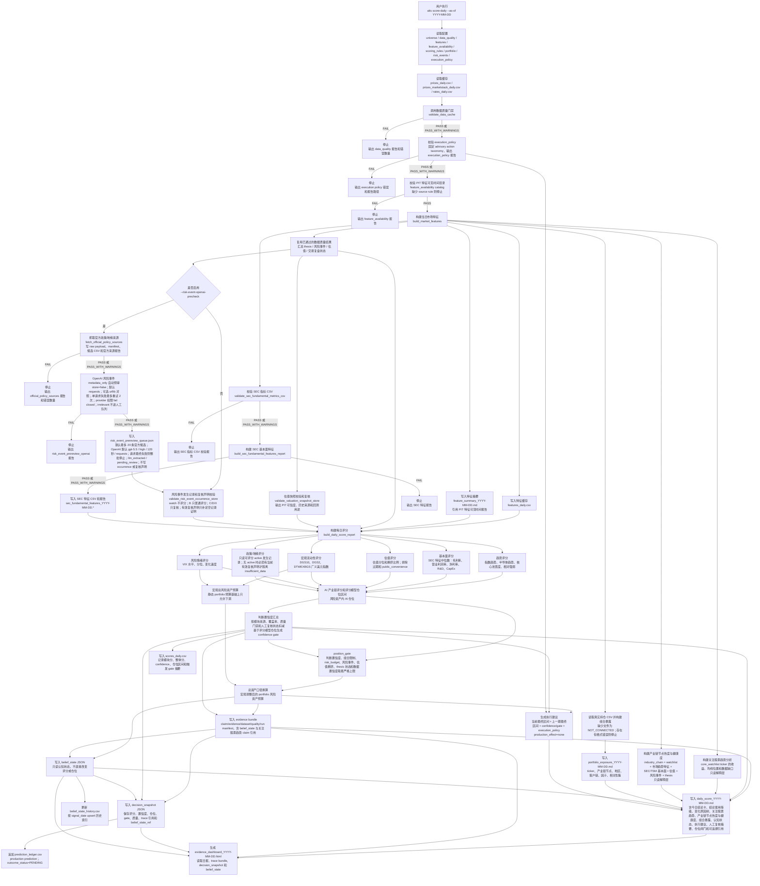
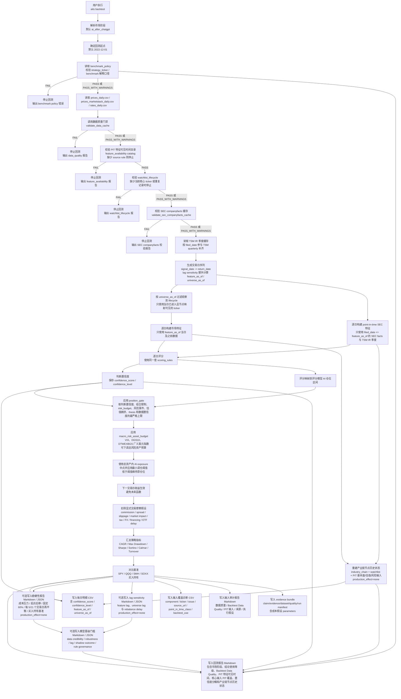
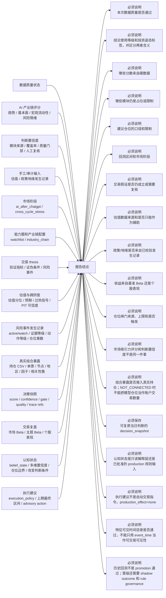
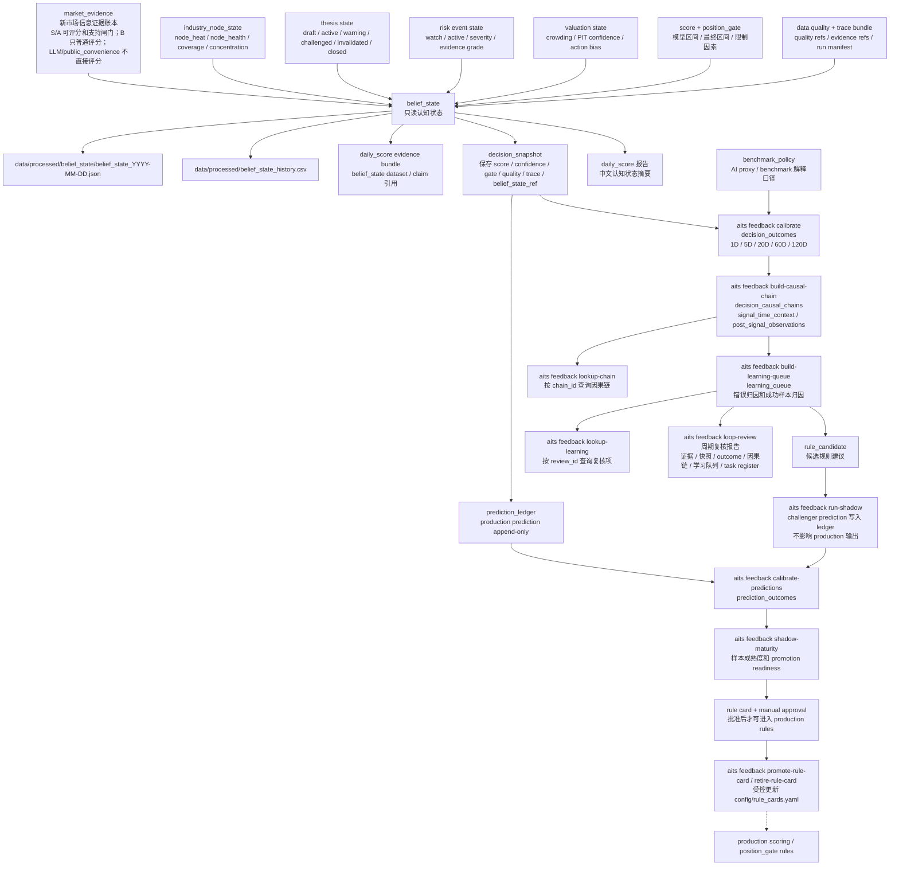
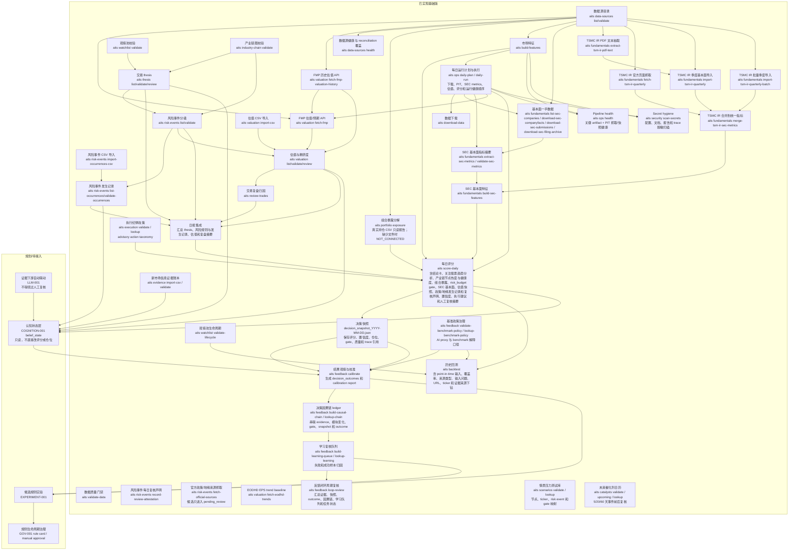

# 系统数据流示意图

本文档是系统从数据输入、中间评估到输出结论的流程图。它不是一次性说明文档，而是工程事实的一部分：后续新增命令、数据源、配置、评分模块、回测路径或报告输出时，必须同步维护本文件。


## 维护边界

必须更新本文件的情况：

- 新增、删除或改名 CLI 命令。
- 新增、删除或改名关键配置文件。
- 改变 `data/raw`、`data/processed`、`outputs/reports`、`outputs/backtests` 的核心文件结构。
- 改变数据质量门禁位置、通过条件或失败后的停止行为。
- 改变评分模块、仓位映射、回测默认市场阶段或报告结论结构。
- 接入或改变交易 thesis、风险事件、估值、新闻、认知状态、复盘归因等模块。

不需要更新本文件的情况：

- 不改变外部行为的内部重构。
- 不改变字段含义、命令输入输出或报告解释的性能优化。
- 单元测试、类型标注、格式化等纯工程维护。

## 总览

```mermaid
flowchart TD
    subgraph Source["数据输入"]
        U["config/universe.yaml<br/>标的池、基准、FRED 宏观序列"]
        P["config/portfolio.yaml<br/>风险资产预算、仓位上限和 risk_budget gate 参数"]
        Q["config/data_quality.yaml<br/>质量阈值 + 价格一致性窗口 + 二源自检阻断开关"]
        F["config/features.yaml<br/>特征窗口和相对强弱组合"]
        FAVC["config/feature_availability.yaml<br/>PIT feature availability 目录<br/>event_time / available_time / decision_time"]
        S["config/scoring_rules.yaml<br/>评分权重、仓位动作阈值和 position_gates 上限"]
        WPC["config/weights/weight_profile_current.yaml<br/>回测校准基础权重 profile、bounds、score-point confidence delta 语义"]
        WPM["config/weights/calibration_protocol.yaml<br/>调权实验 protocol manifest：数据、成本、执行、切分、trial 和 benchmark"]
        W["config/watchlist.yaml<br/>观察池与能力圈"]
        WL["config/watchlist_lifecycle.yaml<br/>观察池 point-in-time 生命周期"]
        I["config/industry_chain.yaml<br/>产业链节点与因果图"]
        R["config/market_regimes.yaml<br/>AI regime 与压力测试区间"]
        BPC["config/benchmark_policy.yaml<br/>AI proxy 与 benchmark 解释口径"]
        SCC["config/scenario_library.yaml<br/>AI 产业链情景压力测试库"]
        CTC["config/catalyst_calendar.yaml<br/>未来催化剂日历和事件前/后复核要求"]
        EPC["config/execution_policy.yaml<br/>advisory execution action taxonomy 和执行纪律"]
        GOVC["config/rule_cards.yaml<br/>production / candidate / retired rule cards"]
        RE["config/risk_events.yaml<br/>L1/L2/L3 风险事件动作规则"]
        REX["data/external/risk_event_occurrences/*.yaml<br/>已触发/观察的风险事件发生记录<br/>S/A/B/C/D/X、严重性、概率、动作等级、lifecycle_state、dedup_group、expiry_time"]
        REXATT["data/external/risk_event_occurrences/review_attestation_*.yaml<br/>人工复核声明：覆盖窗口、复核人、来源范围和下次复核"]
        REXCSV["data/external/risk_event_imports/*.csv<br/>人工复核后的风险事件发生记录导入表"]
        RPRCSV["data/external/risk_event_prereview_imports/*.csv<br/>OpenAI 结构化预审结果导入表"]
        OPSRC["Federal Register / BIS / OFAC / USTR / Congress.gov / GovInfo / Trade.gov CSL<br/>低成本官方政策/地缘来源"]
        LLMI["docs/examples/llm_claim_prereview/*.yaml<br/>LLM claim 预审输入：source_id、source URL、采集时间和待发送内容级别"]
        ME["data/external/market_evidence/*.yaml<br/>新市场信息证据账本"]
        MECSV["data/external/market_evidence_imports/*.csv<br/>人工复核或 LLM 分类后的 evidence 导入表"]
        DS["config/data_sources.yaml<br/>数据源目录、审计字段、来源限制和 provider LLM 权限"]
        SEC["config/sec_companies.yaml<br/>SEC CIK、taxonomy 预期和指标周期"]
        FM["config/fundamental_metrics.yaml<br/>SEC 指标映射、支撑指标和派生规则"]
        FF["config/fundamental_features.yaml<br/>SEC 基本面特征公式和周期偏好"]
        TSMPDF["TSMC IR Management Report PDF<br/>官方季度资料 PDF"]
        TSMTXT["TSMC IR Management Report 文本<br/>官方季度资料的已抽取文本"]
        TSMMAN["TSMC IR 批量导入 manifest CSV<br/>季度、官方 URL 和本地文本路径"]
        TH["data/external/trade_theses/*.yaml<br/>交易假设、验证指标、证伪条件"]
        VS["data/external/valuation_snapshots/*.yaml<br/>估值、预期、拥挤度快照<br/>PIT 可信度和回测用途"]
        VSCSV["data/external/valuation_imports/*.csv<br/>结构化估值/预期导入表"]
        TD["data/external/trades/*.yaml<br/>交易记录、价格、thesis_id"]
        POS["data/external/portfolio_positions/current_positions.csv<br/>真实账户持仓快照<br/>ticker、市值、AI 暴露、节点/地区/因子/相关性标签"]
        MD["外部数据源<br/>FMP / Cboe VIX / Marketstack / FRED"]
        YFD["Yahoo Finance<br/>public_convenience 诊断性第三来源<br/>production_effect=none"]
        FMP["Financial Modeling Prep API<br/>historical-price-eod/non-split-adjusted + dividend-adjusted / quote / TTM metrics / ratios / estimates<br/>price target / ratings / earnings calendar<br/>provider symbol alias 可审计记录"]
        CBOEVIX["Cboe VIX official historical data<br/>VIX_History.csv<br/>^VIX OHLC / no volume"]
        EODHDT["EODHD Earnings Trends API<br/>calendar/trends<br/>epsTrendCurrent / epsTrend90daysAgo"]
        PITMAN["data/raw/pit_snapshots/manifest.csv<br/>forward-only PIT raw snapshot manifest<br/>available_time / checksum / row count"]
    end

    subgraph Cache["本地缓存"]
        DL["aits download-data"]
        PR["data/raw/prices_daily.csv<br/>FMP 股票/ETF + Cboe ^VIX 主价格缓存"]
        MSPR["data/raw/prices_marketstack_daily.csv<br/>Marketstack 第二行情源<br/>cross-provider reconciliation"]
        RR["data/raw/rates_daily.csv<br/>FRED DGS2 / DGS10 / DTWEXBGS"]
        DM["data/raw/download_manifest.csv<br/>provider / endpoint / 参数 / checksum"]
        SFD["aits fundamentals download-sec-companyfacts"]
        SFV["aits fundamentals validate-sec-companyfacts"]
        SFJ["data/raw/sec_companyfacts/*.json"]
        SFM["data/raw/sec_companyfacts/sec_companyfacts_manifest.csv"]
        SFSD["aits fundamentals download-sec-submissions"]
        SFSJ["data/raw/sec_submissions/*.json<br/>filing history / accepted time metadata"]
        SFAD["aits fundamentals download-sec-filing-archive"]
        SFAJ["data/raw/sec_filings/<ticker>/<accession>/index.json<br/>accession directory raw index"]
        SFAC["aits fundamentals sec-accession-coverage"]
        SFACR["outputs/reports/sec_accession_coverage_YYYY-MM-DD.md"]
        SFVR["outputs/reports/sec_companyfacts_validation_YYYY-MM-DD.md"]
        SFE["aits fundamentals extract-sec-metrics"]
        SFVC["aits fundamentals validate-sec-metrics"]
        SFC["data/processed/sec_fundamentals_YYYY-MM-DD.csv"]
        SFR["outputs/reports/sec_fundamentals_YYYY-MM-DD.md"]
        SFCR["outputs/reports/sec_fundamentals_validation_YYYY-MM-DD.md"]
        SFF["aits fundamentals build-sec-features"]
        SFFC["data/processed/sec_fundamental_features_YYYY-MM-DD.csv"]
        SFFR["outputs/reports/sec_fundamental_features_YYYY-MM-DD.md"]
        TSMP["aits fundamentals extract-tsm-ir-pdf-text"]
        TSMF["aits fundamentals fetch-tsm-ir-quarterly"]
        TSMI["aits fundamentals import-tsm-ir-quarterly"]
        TSMIB["aits fundamentals import-tsm-ir-quarterly-batch"]
        TSMM["aits fundamentals merge-tsm-ir-sec-metrics"]
        TSMC["data/processed/tsm_ir_quarterly_metrics.csv"]
        TSMPR["outputs/reports/tsm_ir_pdf_text_YYYY-MM-DD.md"]
        TSMR["outputs/reports/tsm_ir_quarterly_YYYY_Qn_YYYY-MM-DD.md"]
        TSMBR["outputs/reports/tsm_ir_quarterly_batch_YYYY-MM-DD.md"]
        FMPH["data/raw/fmp_analyst_estimates/*.json<br/>FMP analyst estimates 原始历史快照"]
        FMPVH["data/raw/fmp_historical_valuation/*.json<br/>FMP historical key-metrics/ratios 原始响应"]
        FMPFP["data/raw/fmp_forward_pit/*.json<br/>FMP forward-only PIT raw archive"]
        FMPFPN["data/processed/pit_snapshots/fmp_forward_pit_YYYY-MM-DD.csv<br/>FMP as-of 标准化索引"]
        FMPFPR["outputs/reports/fmp_forward_pit_fetch_YYYY-MM-DD.md<br/>FMP PIT 抓取报告"]
        EODHDTR["data/raw/eodhd_earnings_trends/*.json<br/>EODHD Earnings Trends 原始响应"]
        PITF["aits pit-snapshots fetch-fmp-forward<br/>抓取 FMP estimates / price target / ratings / earnings calendar"]
        PITB["aits pit-snapshots build-manifest<br/>从现有 FMP/EODHD raw cache 建立通用 PIT manifest"]
        PITV["aits pit-snapshots validate<br/>校验 PIT manifest / payload checksum / available_time"]
        PITR["outputs/reports/pit_snapshots_validation_YYYY-MM-DD.md<br/>PIT 快照归档质量报告"]
        OPRAW["data/raw/official_policy_sources/YYYY-MM-DD/*<br/>官方来源 raw payload、row count 和 sha256"]
        OPCAND["data/processed/official_policy_source_candidates_YYYY-MM-DD.csv<br/>pending_review 人工复核候选；production_effect=none"]
    end

    subgraph Gate["数据质量门禁"]
        V["aits validate-data<br/>schema / completeness / freshness / duplicate keys / suspicious values<br/>按 consistency_start_date 执行价格波动/复权、宏观变化和 Marketstack reconciliation<br/>Marketstack self-check 默认记录告警，主源和 raw close 冲突仍 fail closed"]
        QR["outputs/reports/data_quality_YYYY-MM-DD.md<br/>声明一致性/宏观变化窗口；问题表标注价格主源 / 第二行情源告警 / 跨源核验 / FRED / manifest 来源"]
        YDG["aits data-sources yahoo-price-diagnostic<br/>只对 Marketstack self-check 异常 ticker/date 拉取 Yahoo raw OHLC<br/>不写主缓存、二源缓存、评分或回测真值"]
        YDR["outputs/reports/yahoo_price_diagnostic_YYYY-MM-DD.md<br/>provider、endpoint、request params、row count、checksum、FMP/Marketstack/Yahoo 对比"]
        Stop["错误时停止后续评分、特征、回测或报告"]
    end

    subgraph Feature["中间评估：市场特征"]
        BF["aits build-features"]
        FT["data/processed/features_daily.csv"]
        FR["outputs/reports/feature_summary_YYYY-MM-DD.md"]
        FAVR["outputs/reports 或 outputs/backtests/feature_availability_YYYY-MM-DD.md<br/>PIT 特征可见时间规则和 source 覆盖"]
    end

    subgraph Score["中间评估：评分和仓位"]
        SD["aits score-daily<br/>默认运行日报前官方来源抓取 + OpenAI 风险事件预审<br/>可用 --skip-risk-event-openai-precheck 跳过"]
        MBG["macro_risk_asset_budget<br/>VIX、DGS10、DTWEXBGS 广义美元指数触发总风险资产预算下调"]
        PG["position_gate<br/>评分仓位、判断置信度、组合限制、风险预算、风险事件、估值拥挤、thesis 和数据置信度取最严格上限<br/>输出 gate_class / target_effect / execution_effect 审计"]
        CONF["判断置信度<br/>按模块来源、覆盖率、质量门禁和人工复核汇总<br/>生成 confidence position gate"]
        FST["关注股票趋势分析<br/>core_watchlist ticker 的 1/5/20 日收益 + MA20/50/100/200 位置<br/>production_effect=none"]
        NH["产业链节点热度与健康度<br/>industry_chain/watchlist + 市场特征 + 基本面/估值/风险/thesis 复核<br/>production_effect=none"]
        PEX["组合暴露分解<br/>真实持仓 CSV + industry_chain/watchlist 映射<br/>production_effect=none"]
        PER["outputs/reports/portfolio_exposure_YYYY-MM-DD.md<br/>ticker / node / region / customer chain / factor / correlation cluster"]
        SC["data/processed/scores_daily.csv<br/>模块分、整体分、confidence、仓位区间和 gate 摘要"]
        EADV["执行建议<br/>execution_policy + 最终仓位变化 + confidence/gate<br/>production_effect=none"]
        EPR["outputs/reports/execution_policy_YYYY-MM-DD.md<br/>动作词表校验和问题清单"]
        DR["outputs/reports/daily_score_YYYY-MM-DD.md<br/>今日结论卡、Base Signal / Risk Caps、结论使用等级、变化原因树、关注股票趋势、认知状态、执行建议和仓位闸门"]
        DSNAP["data/processed/decision_snapshots/decision_snapshot_YYYY-MM-DD.json<br/>当日判断快照、score_architecture、risk lifecycle 和 belief_state_ref"]
        PLED["data/processed/prediction_ledger.csv<br/>append-only production/challenger prediction ledger"]
        BS["data/processed/belief_state/belief_state_YYYY-MM-DD.json<br/>只读认知状态"]
        BSH["data/processed/belief_state_history.csv<br/>只读认知状态历史索引"]
        DRT["outputs/reports/evidence/daily_score_YYYY-MM-DD_trace.json<br/>claim / evidence / dataset / quality / run manifest / belief_state / rule_versions"]
    end

    subgraph Backtest["历史回测"]
        BT["aits backtest"]
        BTG["aits backtest-input-gaps"]
        BTPC["aits backtest-pit-coverage<br/>forward-only PIT 覆盖持续验证"]
        BPCR["outputs/backtests/backtest_pit_coverage_YYYY-MM-DD.md<br/>B/A readiness、历史 C 级原因和升级日期"]
        BWATCH["point-in-time 观察池<br/>按 signal_date 过滤 lifecycle 可见 ticker"]
        BSEC["point-in-time SEC 基本面特征<br/>按 signal_date 只读已披露 companyfacts 与 TSM IR"]
        BVAL["point-in-time 估值快照<br/>按 signal_date 过滤 as_of/captured_at"]
        BRISK["point-in-time 风险事件发生记录和复核声明<br/>按 signal_date 过滤证据、resolved_at 和 reviewed_at"]
        BIG["outputs/backtests/backtest_input_gaps_YYYY-MM-DD_YYYY-MM-DD.md<br/>历史估值/风险事件输入缺口诊断"]
        BD["outputs/backtests/backtest_daily_YYYY-MM-DD_YYYY-MM-DD.csv<br/>含 confidence_score / confidence_level / feature_as_of / universe_as_of / industry_node 状态"]
        BIC["outputs/backtests/backtest_input_coverage_YYYY-MM-DD_YYYY-MM-DD.csv<br/>signal_date 输入覆盖、source_type 和 PIT 字段"]
        BR["outputs/backtests/backtest_YYYY-MM-DD_YYYY-MM-DD.md<br/>含结论使用等级、Backtest Data Quality、判断置信度分桶、产业链节点历史状态和基准政策解释"]
        BROB["outputs/backtests/backtest_robustness_YYYY-MM-DD_YYYY-MM-DD.md/json<br/>成本压力、起点后移、固定仓位、再平衡频率、趋势基线、权重扰动、随机同换手率、样本外切分和买入持有基准对比"]
        BLAG["outputs/backtests/backtest_lag_sensitivity_YYYY-MM-DD_YYYY-MM-DD.md/json<br/>feature/universe lag 0/1/3/5/10/20 敏感性"]
        BMP["outputs/backtests/model_promotion_YYYY-MM-DD_YYYY-MM-DD.md/json<br/>数据可信度、robustness、lag、shadow outcome 和 rule governance 晋级门槛"]
        BGA["aits backtest-gate-attribution<br/>读取 backtest daily + input coverage；production_effect=none"]
        BGAR["outputs/backtests/gate_event_attribution_YYYY-MM-DD_YYYY-MM-DD.md<br/>gate avoided_drawdown / missed_upside 与 event label readiness"]
        BA["outputs/backtests/backtest_audit_YYYY-MM-DD_YYYY-MM-DD.md<br/>输入审计状态、发现和修复建议"]
        BRT["outputs/backtests/evidence/backtest_YYYY-MM-DD_YYYY-MM-DD_trace.json<br/>claim / evidence / dataset / quality / run manifest / rule_versions"]
    end

    subgraph Trace["报告反查"]
        TLK["aits trace lookup<br/>按 claim/evidence/dataset/quality/run id 反查 evidence bundle"]
    end

    subgraph Feedback["反馈校准"]
        FBC["aits feedback calibrate<br/>先执行数据质量门禁，再观察历史 decision_snapshot"]
        DOCSV["data/processed/decision_outcomes.csv<br/>1D/5D/20D/60D/120D outcome"]
        DCR["outputs/reports/decision_calibration_YYYY-MM-DD.md<br/>分桶校准、样本限制和基准政策解释"]
        FPC["aits feedback calibrate-predictions<br/>先执行数据质量门禁，再观察 prediction ledger"]
        POCSV["data/processed/prediction_outcomes.csv<br/>production/challenger prediction outcome"]
        POR["outputs/reports/prediction_outcomes_YYYY-MM-DD.md<br/>按 candidate/model version 分桶"]
        FCO["aits feedback apply-calibration-overlay<br/>读取 context + weight profile + approved overlays<br/>只计算 effective_weights，不改 production scoring"]
        ACO["data/processed/approved_calibration_overlay.json<br/>approved_soft / approved_hard 历史校准 overlay<br/>candidate 或过期项不得影响 production"]
        EW["outputs/current_effective_weights.json<br/>matched overlays、base/effective weights、confidence_delta、position_multiplier 和审计原因"]
        FCP["aits feedback validate-calibration-protocol<br/>校验 nested walk-forward、purging/embargo、trial、benchmark 和 production boundary"]
        FCPR["outputs/reports/calibration_protocol_YYYY-MM-DD.md<br/>调权防过拟合 protocol 校验报告"]
        FSH["aits feedback run-shadow<br/>从 production snapshot/trace 派生 challenger prediction；production_effect=none"]
        FSM["aits feedback shadow-maturity<br/>按 candidate/horizon 评估 forward shadow 样本成熟度"]
        FSMR["outputs/reports/shadow_maturity_YYYY-MM-DD.md<br/>READY_FOR_SHADOW / READY_FOR_GOV_REVIEW 样本门槛"]
        FCC["aits feedback build-causal-chain<br/>串联 snapshot、trace evidence、模块变化、gate 和 outcome"]
        DCC["data/processed/decision_causal_chains.json<br/>signal_time_context + post_signal_observations"]
        DCCR["outputs/reports/decision_causal_chains_YYYY-MM-DD.md<br/>因果链摘要和质量状态"]
        FCL["aits feedback lookup-chain<br/>按 chain_id 查询因果链"]
        FLQ["aits feedback build-learning-queue<br/>结果归因和学习复核队列"]
        DLQ["data/processed/decision_learning_queue.json<br/>归因分类、owner、next step、规则候选标记"]
        DLQR["outputs/reports/decision_learning_queue_YYYY-MM-DD.md<br/>学习队列摘要和样本限制"]
        FLL["aits feedback lookup-learning<br/>按 review_id 查询复核项"]
        FRE["aits feedback build-rule-experiments<br/>候选规则实验台账"]
        REXP["data/processed/rule_experiments.json<br/>replay / forward shadow 计划，production_effect=none"]
        REXPR["outputs/reports/rule_experiments_YYYY-MM-DD.md<br/>规则候选、验证计划和治理边界"]
        FRL["aits feedback lookup-rule-experiment<br/>按 candidate_id 查询规则实验"]
        FGV["aits feedback validate-rule-cards<br/>规则生命周期校验"]
        GVR["outputs/reports/rule_governance_YYYY-MM-DD.md<br/>rule card 校验和复核到期状态"]
        FGL["aits feedback lookup-rule-card<br/>按 rule_id 查询 rule card"]
        FGP["aits feedback promote-rule-card / retire-rule-card<br/>owner approval 后受控切换 production/retired rule"]
        GLR["outputs/reports/rule_lifecycle_promote/retire_YYYY-MM-DD.md<br/>规则生命周期操作审计"]
        FBPV["aits feedback validate-benchmark-policy<br/>AI proxy / benchmark policy 校验"]
        BPR["outputs/reports/benchmark_policy_YYYY-MM-DD.md<br/>基准角色、选择口径和问题清单"]
        FBPL["aits feedback lookup-benchmark-policy<br/>按 ticker 或 basket 查询基准口径"]
        FLR["aits feedback loop-review<br/>周期性闭环复核"]
        FLRR["outputs/reports/feedback_loop_review_YYYY-MM-DD.md<br/>证据、快照、decision/prediction outcome、因果链、学习队列和任务状态"]
        PIR["aits reports investment-review<br/>周报/月报投资复盘"]
        PIRR["outputs/reports/investment_weekly/monthly_review_YYYY-MM-DD.md<br/>判断变化、仓位变化、证据、production vs challenger outcome 和规则学习"]
        EDASH["aits reports dashboard<br/>证据下钻型静态 HTML dashboard"]
        EDASHR["outputs/reports/evidence_dashboard_YYYY-MM-DD.html<br/>结论 -> evidence -> dataset -> quality 下钻"]
        ALERT["score-daily alert evaluation<br/>data/system + investment/risk 只读告警"]
        ALERTR["outputs/reports/alerts_YYYY-MM-DD.md<br/>等级、触发/解除条件、引用和去重键"]
    end

    subgraph Governance["结构校验"]
        WV["aits watchlist validate"]
        WR["outputs/reports/watchlist_validation_YYYY-MM-DD.md"]
        WVL["aits watchlist validate-lifecycle"]
        WLR["outputs/reports/watchlist_lifecycle_YYYY-MM-DD.md"]
        IV["aits industry-chain validate"]
        IR["outputs/reports/industry_chain_validation_YYYY-MM-DD.md"]
        RV["aits risk-events validate"]
        RVR["outputs/reports/risk_events_validation_YYYY-MM-DD.md"]
        ROI["aits risk-events import-occurrences-csv"]
        ROIR["outputs/reports/risk_event_occurrence_import_YYYY-MM-DD.md"]
        RPI["aits risk-events import-prereview-csv<br/>OpenAI 输出只进入待人工复核队列"]
        RPO["aits risk-events precheck-openai<br/>Responses API live 风险事件整理<br/>默认 gpt-5.5 / high / requests<br/>单请求失败最多重试 2 次<br/>provider 权限 fail closed"]
        RPQ["data/processed/risk_event_prereview_queue.json<br/>schema v2：llm_extracted / pending_review 预审队列<br/>记录 model 与 reasoning effort"]
        RPIR["outputs/reports/risk_event_prereview_import_YYYY-MM-DD.md"]
        RPOR["outputs/reports/risk_event_prereview_openai_YYYY-MM-DD.md<br/>request id、response id、checksum 和权限边界"]
        OPF["aits risk-events fetch-official-sources<br/>抓取低成本官方来源；缺 API key 显式跳过"]
        OPFR["outputs/reports/official_policy_sources_YYYY-MM-DD.md<br/>官方来源抓取报告：row count/checksum/候选/跳过来源"]
        LLMP["aits llm precheck-claims<br/>Responses API + Structured Outputs<br/>默认 gpt-5.5 / reasoning.effort=high<br/>单请求失败最多重试 2 次<br/>provider 权限 fail closed"]
        LLMQ["data/processed/llm_claim_prereview_queue.json<br/>schema v2：claim-centric llm_extracted / pending_review 队列<br/>记录 model 与 reasoning effort"]
        LLMR["outputs/reports/llm_claim_prereview_YYYY-MM-DD.md<br/>request id、model、reasoning effort、prompt version、checksum 和权限边界"]
        RAT["aits risk-events record-review-attestation<br/>人工确认无未记录重大风险事件"]
        ROV["aits risk-events validate-occurrences"]
        ROR["outputs/reports/risk_event_occurrences_YYYY-MM-DD.md"]
        DSV["aits data-sources validate"]
        DSR["outputs/reports/data_sources_validation_YYYY-MM-DD.md"]
        DSH["aits data-sources health<br/>provider health score + reconciliation 覆盖"]
        DSHR["outputs/reports/data_sources_health_YYYY-MM-DD.md<br/>manifest/cache/checksum/freshness/coverage"]
        PSMF["aits pit-snapshots fetch-fmp-forward<br/>阶段 2：FMP forward-only PIT 抓取<br/>--continue-on-failure 可用于日常调度非阻断失败报告"]
        PSMB["aits pit-snapshots build-manifest<br/>现有 raw cache 归档"]
        PSV["aits pit-snapshots validate<br/>PIT raw snapshot 质量门禁"]
        PSR["outputs/reports/pit_snapshots_validation_YYYY-MM-DD.md<br/>缺跑不能事后补 strict PIT"]
        EVI["aits evidence import-csv"]
        EV["aits evidence validate"]
        EVIR["outputs/reports/market_evidence_import_YYYY-MM-DD.md"]
        EVR["outputs/reports/market_evidence_YYYY-MM-DD.md"]
        SCV["aits scenarios validate<br/>情景库节点/ticker/risk event/gate 映射校验"]
        SCR["outputs/reports/scenario_library_YYYY-MM-DD.md<br/>情景映射和人工复核要求"]
        SCL["aits scenarios lookup<br/>按 scenario_id 查询情景"]
        CTV["aits catalysts validate / upcoming<br/>未来 5/20/60 天催化剂分桶"]
        CTR["outputs/reports/catalyst_calendar_YYYY-MM-DD.md<br/>upcoming catalyst 和复核要求"]
        CTL["aits catalysts lookup<br/>按 catalyst_id 查询事件"]
        EPV["aits execution validate<br/>校验 advisory action taxonomy"]
        EPRG["outputs/reports/execution_policy_YYYY-MM-DD.md<br/>执行政策校验报告"]
        EPL["aits execution lookup<br/>按 action_id 查询执行动作"]
        PEV["aits portfolio exposure<br/>真实持仓只读暴露分解；缺少文件时 NOT_CONNECTED"]
        ODP["aits ops daily-plan / daily-run<br/>每日运行计划、凭据检查、真实执行和调度顺序"]
        ODPR["outputs/reports/daily_ops_plan_YYYY-MM-DD.md / daily_ops_run_YYYY-MM-DD.md<br/>步骤、环境变量、artifact、门禁、执行状态和跳过声明"]
        OPH["aits ops health<br/>关键 pipeline artifact + PIT 抓取/快照健康检查"]
        OPR["outputs/reports/pipeline_health_YYYY-MM-DD.md<br/>存在性、mtime、row count、freshness、checksum、fetch status"]
        SCS["aits security scan-secrets<br/>本地 secret hygiene 扫描"]
        SCSR["outputs/reports/secret_hygiene_YYYY-MM-DD.md<br/>疑似 secret 脱敏问题清单"]
    end

    subgraph Thesis["交易假设复核"]
        TL["aits thesis list"]
        TV["aits thesis validate"]
        TR["aits thesis review"]
        TVR["outputs/reports/thesis_validation_YYYY-MM-DD.md"]
        TRR["outputs/reports/thesis_review_YYYY-MM-DD.md"]
    end

    subgraph Valuation["估值与拥挤度复核"]
        VF["aits valuation fetch-fmp"]
        VHF["aits valuation fetch-fmp-valuation-history"]
        VET["aits valuation fetch-eodhd-trends"]
        VFR["outputs/reports/fmp_valuation_fetch_YYYY-MM-DD.md"]
        VHFR["outputs/reports/fmp_historical_valuation_fetch_YYYY-MM-DD.md"]
        VETR["outputs/reports/eodhd_earnings_trends_fetch_YYYY-MM-DD.md"]
        VI["aits valuation import-csv"]
        VIR["outputs/reports/valuation_import_YYYY-MM-DD.md"]
        VFH["aits valuation validate-fmp-history"]
        VFHR["outputs/reports/fmp_analyst_history_validation_YYYY-MM-DD.md"]
        VL["aits valuation list"]
        VV["aits valuation validate"]
        VR["aits valuation review"]
        VVR["outputs/reports/valuation_validation_YYYY-MM-DD.md"]
        VRR["outputs/reports/valuation_review_YYYY-MM-DD.md"]
    end

    subgraph TradeReview["交易复盘归因"]
        RT["aits review-trades"]
        RTR["outputs/reports/trade_review_YYYY-MM-DD.md"]
    end

    MD --> DL
    FMP --> DL
    CBOEVIX --> DL
    U --> DL
    DS --> DL
    DL --> PR
    DL --> MSPR
    DL --> RR
    DL --> DM
    SEC --> SFD
    DS --> SFD
    SFD --> SFJ
    SFD --> SFM
    SEC --> SFSD
    DS --> SFSD
    SFSD --> SFSJ
    SFC --> SFAD
    DS --> SFAD
    SFAD --> SFAJ
    SFC --> SFAC
    SFSJ --> SFAC
    SFAJ --> SFAC
    SFAC --> SFACR
    SFJ --> SFV
    SFM --> SFV
    SFV --> SFVR
    SEC --> SFE
    FM --> SFE
    SFJ --> SFE
    SFM --> SFE
    SFE --> SFVR
    SFE --> SFC
    SFE --> SFR
    SFC --> SFVC
    SEC --> SFVC
    FM --> SFVC
    SFVC --> SFCR
    SFC --> SFF
    SEC --> SFF
    FM --> SFF
    FF --> SFF
    SFF --> SFCR
    SFF --> SFFC
    SFF --> SFFR
    DS --> TSMP
    TSMPDF --> TSMP
    TSMP --> TSMTXT
    TSMP --> TSMPR
    DS --> TSMF
    TSMF --> TSMTXT
    TSMF --> TSMC
    TSMF --> TSMR
    TSMTXT --> TSMI
    DS --> TSMI
    TSMI --> TSMC
    TSMI --> TSMR
    TSMTXT --> TSMIB
    TSMMAN --> TSMIB
    DS --> TSMIB
    TSMIB --> TSMC
    TSMIB --> TSMBR
    TSMC --> TSMM
    SEC --> TSMM
    FM --> TSMM
    TSMM --> SFC
    TSMM --> SFCR

    U --> V
    Q --> V
    DS --> V
    WPC --> FCO
    WPM --> FCP
    FCP --> FCPR
    ACO --> FCO
    FCO --> EW
    PR --> V
    MSPR --> V
    RR --> V
    V -->|通过或 PASS_WITH_WARNINGS| QR
    V -->|FAIL| Stop
    QR --> YDG
    PR --> YDG
    MSPR --> YDG
    RR --> YDG
    YFD --> YDG
    YDG --> YDR

    PR --> BF
    RR --> BF
    F --> BF
    FAVC --> BF
    W --> BF
    QR --> BF
    BF --> FT
    BF --> FR
    BF --> FAVR

    FT --> SD
    QR --> SD
    FAVC --> SD
    FAVR --> SD
    S --> SD
    P --> SD
    EPC --> SD
    GOVC --> SD
    SEC --> SD
    FM --> SD
    FF --> SD
    SFC --> SD
    TH --> SD
    RE --> SD
    REX --> SD
    REXATT --> SD
    VS --> SD
    TD --> SD
    POS --> SD
    SD -. "--risk-event-openai-precheck" .-> OPF
    I --> NH
    W --> NH
    FT --> NH
    POS --> PEX
    I --> PEX
    W --> PEX
    SD --> SFCR
    SD --> SFFC
    SD --> SFFR
    SD --> EPR
    SD --> MBG
    SD --> PG
    MBG --> SC
    MBG --> DR
    MBG --> DRT
    MBG --> CONF
    PG --> SC
    PG --> DR
    PG --> DRT
    PG --> CONF
    PG --> EADV
    CONF --> SC
    CONF --> DR
    CONF --> DSNAP
    CONF --> EADV
    EPC --> EADV
    NH --> DR
    NH --> DRT
    PEX --> PER
    PEX --> DR
    EADV --> DR
    EADV --> DRT
    DRT --> DSNAP
    DSNAP --> PLED

    PR --> BT
    RR --> BT
    F --> BT
    FAVC --> BT
    S --> BT
    P --> BT
    W --> BT
    WL --> BT
    R --> BT
    BPC --> BT
    GOVC --> BT
    QR --> BT
    SEC --> BT
    FM --> BT
    FF --> BT
    SFJ --> BT
    SFM --> BT
    TSMC --> BT
    VS --> BT
    RE --> BT
    REX --> BT
    REXATT --> BT
    PR --> BTG
    RR --> BTG
    VS --> BTG
    RE --> BTG
    REX --> BTG
    REXATT --> BTG
    BTG --> BIG
    PITMAN --> BTPC
    BTPC --> BPCR
    BT --> BSEC
    BT --> BVAL
    BT --> BRISK
    BT --> BWATCH
    BWATCH --> BD
    BSEC --> BD
    BVAL --> BD
    BRISK --> BD
    BT --> BD
    BT --> BIC
    BT --> BR
    BT --> BROB
    BT --> BLAG
    BT --> FAVR
    BT --> BMP
    BT --> BA
    BT --> BRT
    BD --> BGA
    BIC --> BGA
    BGA --> BGAR
    FCPR -. "实验准入证据" .-> REXP
    DRT --> TLK
    BRT --> TLK
    DSNAP --> FBC
    PR --> FBC
    RR --> FBC
    BPC --> FBC
    FBC --> DOCSV
    FBC --> DCR
    PLED --> FPC
    PR --> FPC
    RR --> FPC
    FPC --> POCSV
    FPC --> POR
    DSNAP --> FCC
    DOCSV --> FCC
    POCSV --> BMP
    DRT --> FCC
    FCC --> DCC
    FCC --> DCCR
    DCC --> FCL
    DCC --> FLQ
    FLQ --> DLQ
    FLQ --> DLQR
    DLQ --> FLL
    DLQ --> FRE
    FRE --> REXP
    FRE --> REXPR
    REXP --> FRL
    GOVC --> FGV
    REXP --> FGV
    FGV --> GVR
    GOVC --> FGL
    BPC --> FBPV
    FBPV --> BPR
    BPC --> FBPL
    EVI --> FLR
    DSNAP --> FLR
    DOCSV --> FLR
    DCC --> FLR
    DLQ --> FLR
    REXP --> FLR
    FLR --> FLRR
    SC --> PIR
    DSNAP --> PIR
    DOCSV --> PIR
    DLQ --> PIR
    REXP --> PIR
    BS --> PIR
    PIR --> PIRR
    DR --> EDASH
    DRT --> EDASH
    DSNAP --> EDASH
    BS --> EDASH
    EDASH --> EDASHR
    EDASHR --> TLK
    QR --> ALERT
    FT --> ALERT
    SC --> ALERT
    DSNAP --> ALERT
    ROR --> ALERT
    CTV --> ALERT
    ALERT --> ALERTR
    ALERT --> DR

    U --> WV
    W --> WV
    I --> WV
    WV --> WR
    WL --> WVL
    W --> WVL
    U --> WVL
    WVL --> WLR
    I --> IV
    W --> IV
    IV --> IR
    RE --> RV
    I --> RV
    W --> RV
    U --> RV
    RV --> RVR
    RPRCSV --> RPI
    RE --> RPI
    RPI --> RPQ
    RPI --> RPIR
    LLMI --> RPO
    OPCAND -->|日报前自动 metadata_only 预审| RPO
    DS --> RPO
    RE --> RPO
    RPO --> RPQ
    RPO --> RPOR
    RPQ -->|pending_review；不直接评分| SD
    RPQ -->|人工确认后才可整理为 occurrence CSV| REXCSV
    RPQ --> FLR
    OPSRC --> OPF
    DS --> OPF
    OPF --> OPRAW
    OPF --> OPCAND
    OPF --> OPFR
    OPF --> DM
    OPCAND -->|人工复核后才可整理为 occurrence CSV| REXCSV
    OPCAND -->|可作为每日复核 checked_sources 依据| RAT
    LLMI --> LLMP
    DS --> LLMP
    LLMP --> LLMQ
    LLMP --> LLMR
    LLMQ -->|人工确认后才可整理为 evidence CSV| MECSV
    LLMQ -->|风险事件人工确认后才可整理为 occurrence CSV| REXCSV
    LLMQ --> FLR
    RAT --> REXATT
    RAT --> ROR
    REXCSV --> ROI
    ROI --> REX
    ROI --> ROIR
    ROI --> ROR
    RE --> ROV
    REX --> ROV
    REXATT --> ROV
    ROV --> ROR
    DS --> DSV
    DSV --> DSR
    DS --> DSH
    DSH --> DSHR
    DS --> PSMF
    FMP --> PSMF
    PSMF --> FMPFP
    PSMF --> FMPFPN
    PSMF --> FMPFPR
    DS --> PSMB
    FMPH --> PSMB
    FMPVH --> PSMB
    FMPFP --> PSMB
    EODHDTR --> PSMB
    PSMB --> PITMAN
    PITMAN --> PSV
    PSV --> PSR
    MECSV --> EVI
    EVI --> ME
    EVI --> EVIR
    ME --> EV
    EV --> EVR
    SCC --> SCV
    I --> SCV
    W --> SCV
    RE --> SCV
    SCV --> SCR
    SCC --> SCL
    CTC --> CTV
    I --> CTV
    W --> CTV
    RE --> CTV
    CTV --> CTR
    CTC --> CTL
    EPC --> EPV
    EPV --> EPRG
    EPC --> EPL
    POS --> PEV
    I --> PEV
    W --> PEV
    PEV --> PER
    ODP --> ODPR
    ODP -.-> DL
    ODP -.-> PSMF
    ODP -.-> SD
    ODP -.-> OPH
    ODP -.-> SCS
    PR --> OPH
    RR --> OPH
    FT --> OPH
    SC --> OPH
    QR --> OPH
    DR --> OPH
    OPH --> OPR
    SCS --> SCSR

    TH --> TL
    TH --> TV
    TH --> TR
    W --> TV
    I --> TV
    W --> TR
    I --> TR
    TV --> TVR
    TR --> TRR

    FMP --> VF
    FMP --> VHF
    FMP --> PITF
    EODHDT --> VET
    DS --> VF
    DS --> VHF
    DS --> PITF
    DS --> VET
    U --> VF
    U --> VHF
    U --> PITF
    U --> VET
    VHF --> FMPVH
    VHF --> VS
    VHF --> VHFR
    VHF --> VVR
    FMPH --> VF
    FMPVH --> VF
    FMPFPN --> VF
    VF --> VS
    VF --> FMPH
    VF --> VFR
    VF --> VVR
    VS --> VET
    VET --> EODHDTR
    VET --> VS
    VET --> VETR
    VET --> VVR
    PITF --> FMPFP
    PITF --> FMPFPN
    PITF --> FMPFPR
    FMPH --> PITB
    FMPVH --> PITB
    FMPFP --> PITB
    EODHDTR --> PITB
    DS --> PITB
    PITB --> PITMAN
    PITMAN --> PITV
    PITV --> PITR
    FMPH --> VFH
    VFH --> VFHR
    VSCSV --> VI
    VI --> VS
    VI --> VIR
    VI --> VVR
    VS --> VL
    VS --> VV
    VS --> VR
    U --> VV
    W --> VV
    VV --> VVR
    VR --> VRR

    TD --> RT
    PR --> RT
    RR --> RT
    QR --> RT
    RT --> RTR
```

## 每日评分链路



## 回测链路



## 结论输出与解释责任



## 认知状态层

该层对应 `COGNITION-001` 和 `docs/requirements/cognitive_model_2026-05-04.md`。第一版是只读解释层，用于把系统当日“相信什么、依据什么、置信度如何、哪些风险限制仓位、哪些条件会改变判断”结构化保存下来。它不得直接改变生产评分、`position_gate`、回测仓位或交易建议。



## 当前已实现与待接入模块



## 文件和命令责任表

|层级|命令或文件|责任|当前状态|
|---|---|---|---|
|数据源|FMP / Cboe VIX / Marketstack / FRED|FMP 提供股票/ETF 主价格；Cboe VIX official historical data 提供内部 `^VIX`；Marketstack 提供股票/ETF 第二行情源；FRED 提供 DGS2、DGS10 和 `DTWEXBGS` 广义美元指数原始输入|已实现基础版；主源异常或跨源 raw close 未解决冲突仍阻断质量门禁，第二源自身异常默认记录为告警|
|下载|`aits download-data`|拉取并标准化为本地 CSV 缓存，同时追加下载审计 manifest；默认要求 `FMP_API_KEY` 写入 FMP 股票/ETF 主价格，并从 Cboe 补 `^VIX` 到主价格缓存；默认要求 `MARKETSTACK_API_KEY` 写入 Marketstack 第二行情源缓存，临时无 Marketstack key 环境必须显式 `--without-marketstack`；Yahoo 仅可通过 `--price-provider yahoo` 显式迁移调查使用|已实现基础版|
|原始缓存|`data/raw/prices_daily.csv`|FMP 股票/ETF 日线 OHLCV 和调整收盘价主缓存，加 Cboe `^VIX` OHLC；价格主源、Marketstack 第二源和跨源核验问题需在质量报告中分源归因|已实现基础版；主源异常仍阻断质量门禁|
|原始缓存|`data/raw/prices_marketstack_daily.csv`|Marketstack 股票/ETF 日线第二来源缓存，用于 cross-provider reconciliation；self-check 异常默认作为第二源健康告警，不覆盖主价格缓存|已实现基础版|
|原始缓存|`data/raw/rates_daily.csv`|FRED 宏观序列长表，当前包含 DGS2、DGS10 和 `DTWEXBGS`；`DTWEXBGS` 不是 ICE DXY|已实现|
|下载审计|`data/raw/download_manifest.csv`|记录 provider、endpoint、请求参数、下载时间、行数、输出路径和 checksum|已实现|
|质量门禁|`aits validate-data`|校验 schema、完整性、新鲜度、重复键、异常值；价格波动、复权比例和主价格缓存与 Marketstack 第二来源 reconciliation 默认只统计 `config/data_quality.yaml:prices.consistency_start_date` 以来样本；宏观单日变化默认只统计 `config/data_quality.yaml:rates.consistency_start_date` 以来样本；`secondary_source_self_check_fail_closed=false` 时 Marketstack 自身异常只记录告警；主源错误、第二源缺失/不可读、重叠覆盖不足和 raw close 跨源未解决冲突仍 fail closed；adjusted close 分红复权口径差异作为限制或调查项显式输出|已实现|
|质量报告|`outputs/reports/data_quality_YYYY-MM-DD.md`|声明数据是否可用于下游结论，显示价格一致性和宏观变化检查窗口，并在问题表标注价格主源、第二行情源告警、跨源核验、FRED 宏观序列或下载审计清单来源|已实现|
|PIT 特征可见时间目录|`config/feature_availability.yaml` / `outputs/reports/feature_availability_YYYY-MM-DD.md`|统一记录价格、宏观、观察池、SEC/TSM 基本面、估值、风险事件和市场证据等输入族的 `event_time`、`source_published_at`、`available_time`、`decision_time`、默认保守滞后和缺少可见时间时的 A/B 级使用策略；`build-features`、`score-daily`、`backtest` 会写出 PIT 特征可见时间报告，报告包含字段级 source 检查、`available_time` 覆盖率、未来可见时间行数和保守 fallback 策略，失败时停止，trace bundle 记录该目录摘要|已实现基础版|
|特征|`aits build-features`|先执行数据质量门禁，再生成可解释市场特征，并输出 PIT 特征可见时间报告；缺少 availability rule 的 source 会 fail closed，特征摘要引用该报告|已实现|
|特征缓存|`data/processed/features_daily.csv`|保存 tidy 格式特征|已实现|
|组合与风险预算配置|`config/portfolio.yaml`|定义静态总风险资产预算、`macro_risk_asset_budget` 下调阈值、AI 总资产上限、真实组合集中度提示阈值和 `risk_budget` gate 参数；宏观预算层用 VIX、DGS10 和 `DTWEXBGS` 广义美元指数下调总风险资产预算，`risk_budget` gate 继续约束风险资产内 AI 仓位上限|已实现基础版|
|评分|`aits score-daily`|先执行市场数据质量门禁和 PIT feature availability 校验，再校验 `execution_policy`、SEC 指标 CSV、构建 SEC 基本面特征、复核估值快照、风险事件发生记录和当前有效复核声明，读取真实持仓 CSV 生成只读组合暴露；默认会在风险事件发生记录校验前抓取官方政策/地缘来源并调用 OpenAI 风险事件 `metadata_only` 预审，可用 `--skip-risk-event-openai-precheck` 跳过；默认最多处理 20 条官方候选，OpenAI 默认 `gpt-5.5` / `reasoning.effort=high` / 120 秒读超时 / `requests` HTTP client，可用 `--openai-http-client urllib` 做本机传输对照，单个 OpenAI 请求失败时重试 2 次，仍失败则整批 fail closed，输出仅写 `llm_extracted / pending_review` 队列，不写 occurrence、复核声明、评分、仓位闸门或 thesis 状态；无人复核时 OpenAI 候选保留为 backlog-only 线索，不进入 `execution_policy.manual_review_gate_ids`，不会单独把执行动作改成 `wait_manual_review`；随后基于已通过校验/复核的市场特征生成只读关注股票趋势分析，并基于市场特征、SEC/TSM 基本面、估值、风险事件和 thesis 生成只读产业链节点热度与健康度，再用 `macro_risk_asset_budget` 下调总风险资产预算，并通过 `position_gate` 把评分仓位、判断置信度、组合限制、风险预算、风险事件、估值拥挤、thesis 状态和数据置信度取最严格上限，输出 AI 产业链评分、判断置信度、最终仓位区间、advisory 执行建议、日报、decision snapshot、prediction ledger 行和只读 `belief_state`|已实现|
|评分缓存|`data/processed/scores_daily.csv`|保存每日评分结构化结果，component 行记录模块 confidence，overall 行记录整体 confidence、模型/最终/置信度调整仓位区间、静态和宏观调整后总风险资产预算、总资产 AI 仓位区间、宏观预算触发等级和仓位闸门摘要；置信度调整仓位基于评分模型原始仓位计算，并作为 `confidence` gate 参与最终上限约束，用于日报上期对比|已实现|
|日报|`outputs/reports/daily_score_YYYY-MM-DD.md`|开头输出“今日结论卡”，固定呈现状态标签、市场吸引力、判断置信度、评分映射仓位、风险闸门后最终仓位、总风险资产预算、执行动作、主结论、三个核心原因、最大限制和下一步触发条件；正文继续输出结论使用等级、适用范围、变化原因树、什么情况会改变判断、关注股票趋势分析、产业链节点热度与健康度、组合暴露、认知状态摘要、执行建议、宏观风险资产预算、市场数据质量状态、SEC 基本面质量状态、风险事件发生记录状态、当前有效风险事件复核声明数量、估值 PIT 可信度、仓位闸门来源/上限/触发状态、置信度调整后模型仓位、限制说明、人工复核摘要和可追溯引用章节；关注股票趋势分析按 `core_watchlist` 显示逐 ticker 1/5/20 日收益、20/50/100/200 日均线位置、相对均线偏离和数据覆盖；当前项目范围为趋势判断/投研辅助，不触发交易；执行建议、关注股票趋势、节点热度/健康度和组合暴露均明确 `production_effect=none`，不是自动交易指令|已实现|
|结论使用等级|`outputs/reports/daily_score_YYYY-MM-DD.md#结论使用等级` / `outputs/backtests/backtest_YYYY-MM-DD_YYYY-MM-DD.md#结论使用等级`|报告输出 `trend_only`、`actionable`、`review_required`、`research_only`、`data_limited` 或 `backtest_limited` 等使用边界，并与投资姿态标签分开；当前 `score-daily` 和回测以 `trend_judgment` 范围运行，干净通过时也只能显示“趋势判断，不触发交易”，不能自动升级为仓位复核或交易执行；低置信度、人工复核失败、来源不足、数据质量失败和回测覆盖不足会自动降级，说明原因、解除条件和证据引用|已实现基础版|
|每日运行计划|`aits ops daily-plan`|生成本地或云 VM 可用的每日运行计划，列出 `download-data`、带 `--continue-on-failure` 的 `pit-snapshots fetch-fmp-forward`、SEC companyfacts 刷新、SEC metrics 抽取/校验、FMP 估值快照刷新、`score-daily`、`ops health` 和 `security scan-secrets` 的顺序、必需环境变量、预期 artifact、质量门禁和阻断关系；只做计划和环境变量非空检查，不执行下载、API 调用、评分或报告生成；PIT 抓取失败进入脱敏失败报告或 pipeline health 告警，不把失败快照作为可用 PIT 输入，也不阻断 `score-daily` 自身质量门禁；SEC metrics 与估值刷新失败必须阻断日报；缺少关键环境变量时显示 `BLOCKED_ENV`，可用 `--fail-on-missing-env` 作为调度前门禁|已实现基础版|
|每日运行执行器|`aits ops daily-run`|复用 `daily-plan` 的步骤顺序真实调用本地 CLI，先写计划报告，再执行 `download-data`、PIT、SEC companyfacts、SEC metrics 抽取/校验、FMP valuation snapshots、`score-daily`、`ops health` 和 secret scan；执行器内部用当前 Python 解释器调用同一 `ai_trading_system.cli` 模块，避免 Windows 上从 `aits.exe` 父进程递归启动 `aits.exe`；缺少阻断性环境变量时返回 `BLOCKED_ENV`；任一执行步骤退出码非 0 或关键 artifact 报告状态非 `PASS*` 时停止，不继续下游步骤；显式 `--skip-*` 选项会在计划和执行报告中保留限制声明|已实现基础版|
|每日运行报告|`outputs/reports/daily_ops_plan_YYYY-MM-DD.md` / `outputs/reports/daily_ops_run_YYYY-MM-DD.md`|计划报告中文输出计划状态、评估日期、必需环境变量是否可见、逐步骤命令、输出路径、质量门禁和显式跳过声明；执行报告中文输出真实执行状态、开始/结束时间、退出码、耗时、stdout/stderr 行数和预期 artifact 路径，不保存 stdout/stderr 原文、API key、token 或付费内容原文；仍未接入 systemd/cron、通知或云备份|已实现基础版|
|Pipeline health|`aits ops health`|只读检查关键 pipeline artifact，包括价格缓存、利率缓存、数据质量报告、特征缓存、评分缓存、日报、FMP PIT 抓取报告、PIT manifest、PIT 质量报告和 FMP PIT normalized as-of CSV 是否存在、是否为空、mtime、row count、`available_time` 新鲜度、raw payload checksum 和 FMP PIT 抓取报告状态；不把运行健康解释为投资结论有效|已实现基础版|
|Pipeline health 报告|`outputs/reports/pipeline_health_YYYY-MM-DD.md`|中文输出 artifact 检查表、PIT 抓取失败、PIT 缺跑/断更/row count/checksum 问题、错误/警告数量、问题清单和方法边界；第一阶段未接入结构化 run log、后台调度器、异常栈或 API 错误采集|已实现基础版|
|Pipeline health 告警|`outputs/reports/pipeline_health_alerts_YYYY-MM-DD.md`|`aits ops health` 把失败或警告的 health check 转成只读 data/system alert，记录触发/解除条件、claim/evidence 引用和去重键；`production_effect=none`，不改变评分、仓位、回测或执行建议|已实现基础版|
|Secret hygiene 扫描|`aits security scan-secrets`|扫描配置、文档、报告、manifest、trace bundle 等文本文件中的疑似 API key、token、secret、password 或 bearer credential；报告只输出脱敏片段，不输出完整疑似密钥|已实现基础版|
|Secret hygiene 报告|`outputs/reports/secret_hygiene_YYYY-MM-DD.md`|中文输出扫描入口、扫描文件数、疑似 secret 脱敏问题清单和方法边界；第一阶段不替代企业密钥管理、pre-commit hook、CI secret scan 或供应商权限审批|已实现基础版|
|产业链节点热度与健康度|`score-daily` 日报章节 / `backtest_daily_*.csv` / 回测报告摘要|基于 `config/industry_chain.yaml`、`config/watchlist.yaml`、已通过门禁的市场趋势特征、SEC/TSM 基本面特征、估值快照、风险事件发生记录和 thesis 复核，按节点输出热度等级、市场覆盖率、集中度、健康度、健康覆盖率、支持项、风险/限制和数据缺口；回测中按 `signal_date` 重建并在每日明细保存 top 节点、热度、健康等级和数据缺口，同时输出历史状态摘要；只做解释和诊断，不把价格热度写成基本面健康度，也不把估值拥挤或风险事件写成基本面证伪；不改变 production scoring、`position_gate`、回测仓位或执行建议|已实现基础版|
|关注股票趋势分析|`score-daily` 日报章节 / `daily_score` trace bundle|基于 `config/universe.yaml` 的 `ai_chain.core_watchlist` 和已通过门禁的 `features_daily` 价格/趋势特征，逐 ticker 输出 1/5/20 日收益、20/50/100/200 日均线位置、相对 50/200 日均线偏离、趋势状态和缺失窗口；只做趋势判断解释，`production_effect=none`，不改变评分、仓位闸门、执行建议或 prediction ledger|已实现基础版|
|组合暴露分解|`aits portfolio exposure` / `score-daily` 日报章节|基于 `data/external/portfolio_positions/current_positions.csv` 或显式传入的真实持仓 CSV，按 ticker、产业链节点、地区、客户链、因子和相关性簇分解 AI 名义暴露；缺少持仓文件时显示 `NOT_CONNECTED`，存在但格式错误时停止；不得用观察池、模型建议仓位或 AI 产业链评分替代真实账户持仓|已实现基础版|
|组合暴露报告|`outputs/reports/portfolio_exposure_YYYY-MM-DD.md`|中文输出持仓快照日期、总市值、AI 名义暴露、AI 占比、最大单票占 AI 暴露、ETF beta 覆盖率、暴露分组表和问题清单；第一阶段 `production_effect=none`，不改变评分、仓位闸门、执行建议或回测仓位|已实现基础版|
|风险预算 gate|`score-daily` / `backtest` 仓位闸门|在共享 `position_gate` 层读取 `config/portfolio.yaml:risk_budget`；高 VIX 或高 VIX 分位会压低最终 AI 仓位上限，真实持仓接入后单票、节点、相关性簇集中或 ETF beta 覆盖不足也会压低上限；缺少真实持仓时不使用观察池替代组合集中度|已实现基础版|
|日报 Evidence Bundle|`outputs/reports/evidence/daily_score_YYYY-MM-DD_trace.json`|记录日报 `claim`、`evidence`、`dataset`、`quality` 和 `run_manifest`，包括 `belief_state`、关注股票趋势分析 dataset/claim 引用和本次运行适用的 production rule version manifest，用于从核心结论反查输入上下文、数据快照、只读认知状态和规则版本|已实现|
|决策快照|`data/processed/decision_snapshots/decision_snapshot_YYYY-MM-DD.json`|每次 `score-daily` 通过质量门禁后保存 signal_date、market regime、整体分、模块分、判断置信度、模型/最终/置信度调整仓位、静态和宏观调整后总风险资产预算、position gates、质量状态、人工复核、估值状态、风险事件状态、trace bundle 引用、`belief_state_ref`、rule version manifest 和配置路径|已实现基础版|
|Prediction / shadow ledger|`data/processed/prediction_ledger.csv`|每次 `score-daily` 通过质量门禁后追加 production prediction 行，记录 run id、model/rule version、candidate_id、`production_effect`、features/data/trace 引用、decision_time、signal、score、confidence、模型目标仓位和 gate 后仓位；`aits feedback run-shadow` 可从 production `decision_snapshot` 和 trace 派生 challenger prediction 行，强制 `production_effect=none`；后验 outcome 字段初始为 `PENDING`，不得改写 signal-time 输入|已实现基础版|
|证据下钻 dashboard|`aits reports dashboard` / `outputs/reports/evidence_dashboard_YYYY-MM-DD.html`|读取日报 Markdown、日报 evidence bundle、decision snapshot 和可选 belief_state，生成本地静态 HTML；按快速读者、投资复核者和系统审计者分层展示结论卡、执行动作、论证链、仓位 gate、thesis/risk/valuation 状态、claim/evidence/dataset/quality refs、输入路径、row count、checksum 和 trace lookup 命令；`production_effect=none`，不改变评分、仓位、回测或执行建议，也不替代 Markdown 日报和 trace bundle 的审计责任|已实现基础版|
|决策结果校准|`aits feedback calibrate`|先校验 `benchmark_policy`，再复用 `aits validate-data` 同一质量门禁，从历史 `decision_snapshot` 和 `prices_daily.csv` 生成 1D/5D/20D/60D/120D outcome，按总分、置信度、gate、thesis、风险等级和估值状态分桶输出校准报告；结果只能进入规则复核，不能自动修改生产规则|已实现基础版|
|Prediction outcome 校准|`aits feedback calibrate-predictions`|先复用 `aits validate-data` 同一质量门禁，从 append-only prediction ledger 和 `prices_daily.csv` 生成指定 horizon 的 `prediction_outcomes.csv`，按 candidate、model version、production/shadow、置信度和 benchmark excess return 分桶输出报告；结果只能进入 promotion gate、复盘和规则治理，不能改写 prediction ledger 的 signal-time 字段|已实现基础版|
|调权协议校验|`aits feedback validate-calibration-protocol` / `outputs/reports/calibration_protocol_YYYY-MM-DD.md`|读取调权实验 protocol manifest，校验必填数据/配置版本、`ai_after_chatgpt` 日期范围、nested walk-forward、purging/embargo、trial 次数、benchmark set、参数分层、多重测试折扣和 `production_effect=none` 边界；通过只表示实验协议可进入后续研究，不批准 overlay、不改变 production scoring、position_gate 或回测仓位|已实现基础版|
|Gate/event 归因报告|`aits backtest-gate-attribution` / `outputs/backtests/gate_event_attribution_YYYY-MM-DD_YYYY-MM-DD.md`|读取已生成的 `backtest_daily_*.csv` 和 `backtest_input_coverage_*.csv`，按 gate 估算 trigger_count、average_position_reduction、avoided_drawdown、missed_upside、net_effect、false_alarm 和 late_trigger，并汇总风险事件 label readiness；结果是一阶历史解释，不是完整反事实回测，不得相加为生产收益结论|已实现基础版|
|Challenger shadow runner|`aits feedback run-shadow` / `outputs/reports/shadow_predictions_YYYY-MM-DD.md`|读取 `rule_experiments.json` 中 forward shadow 状态可运行的 candidate，复用 production `decision_snapshot`、trace、feature snapshot 和 data quality 引用，追加 challenger prediction 到 `prediction_ledger.csv`；不写正式日报动作、不改变 `scores_daily.csv`、position gate、belief_state 或 production rule|已实现基础版|
|Forward shadow 样本成熟度|`aits feedback shadow-maturity` / `outputs/reports/shadow_maturity_YYYY-MM-DD.md`|读取 `prediction_outcomes.csv`，按 candidate、horizon、market regime 和 `production_effect` 汇总 available/pending/missing、平均收益、胜率、最大回撤和 benchmark excess；样本不足时保持 `READY_FOR_SHADOW` 或 `MISSING`，不能作为 production rule 晋级证据|已实现基础版|
|决策结果缓存|`data/processed/decision_outcomes.csv`|保存每个 `snapshot_id`、观察窗口、AI proxy return、最大回撤、实现波动、SPY/QQQ/SMH/SOXX return 与超额收益、hit/miss、分桶字段、gate/thesis/risk/valuation 状态和 `belief_state` 路径|已实现基础版|
|决策校准报告|`outputs/reports/decision_calibration_YYYY-MM-DD.md`|输出市场阶段、样本数量、观察窗口、数据质量状态、benchmark policy 状态、基准解释边界、样本不足限制、重叠窗口限制、全局摘要和各分桶平均收益/回撤/波动/胜率/超额收益|已实现基础版|
|决策因果链构建|`aits feedback build-causal-chain`|读取历史 `decision_snapshot`、`decision_outcomes.csv` 和 trace bundle 引用，生成 `decision_causal_chain`；`signal_time_context` 只记录 signal_date 当时可见的 evidence、模块分变化、置信度变化、gate 和仓位变化，后验 outcome 只能进入 `post_signal_observations`|已实现基础版|
|决策因果链缓存|`data/processed/decision_causal_chains.json`|保存 `chain_id`、market regime、linked evidence、linked decision snapshot、quality、affected modules、score/confidence/position delta、triggered gates、append-only outcome windows、review status 和预留 `linked_rule_candidate`|已实现基础版|
|决策因果链报告|`outputs/reports/decision_causal_chains_YYYY-MM-DD.md`|输出因果链摘要、数据质量状态、触发 gate、outcome 窗口数量和未来 outcome 不得改写 signal-time 因果解释的治理边界|已实现基础版|
|决策因果链查询|`aits feedback lookup-chain`|按 `chain_id` 从 `decision_causal_chains.json` 反查单条链路，显示市场阶段、质量状态、decision snapshot、evidence、受影响模块、触发 gate 和 outcome 窗口|已实现基础版|
|决策学习队列构建|`aits feedback build-learning-queue`|从 `decision_causal_chains.json` 生成学习复核队列，记录成功/失败方向、`data_issue`、`rule_issue`、`sample_limited` 等归因分类、evidence、owner、next step 和是否需要候选规则；样本不足不得生成规则候选|已实现基础版|
|决策学习队列缓存|`data/processed/decision_learning_queue.json`|保存 `review_id`、关联 `chain_id`、market regime、decision snapshot、evidence、触发 gate、受影响模块、outcome summary、归因分类、复核状态、owner、next step、规则候选需求和治理边界|已实现基础版|
|决策学习队列报告|`outputs/reports/decision_learning_queue_YYYY-MM-DD.md`|中文输出分类摘要、复核队列、样本限制和“不得自动修改 production scoring / position_gate / thesis / 日报结论”的治理边界|已实现基础版|
|决策学习队列查询|`aits feedback lookup-learning`|按 `review_id` 反查学习复核项，显示关联因果链、方向、归因分类、规则候选标记、owner、next step 和原因|已实现基础版|
|候选规则实验台账构建|`aits feedback build-rule-experiments`|从 `decision_learning_queue.json` 中 `rule_candidate_required=true` 且非 `sample_limited` 的复核项生成候选规则实验台账；记录触发原因、关联 causal chain、候选假设、历史 replay 计划、前向 shadow 计划、样本限制、风险、回滚条件和 `production_effect=none`|已实现基础版|
|候选规则实验缓存|`data/processed/rule_experiments.json`|保存 candidate-only 规则实验记录；历史 replay 尚未运行时标记 `NOT_RUN`，前向 shadow 标记 `PENDING`；未完成 replay/shadow 和 `GOV-001` 批准前不得影响 production scoring、position gate、thesis、日报或回测|已实现基础版|
|候选规则实验报告|`outputs/reports/rule_experiments_YYYY-MM-DD.md`|中文报告输出候选规则数量、未运行 replay、待前向 shadow、验证计划和治理边界；不声明候选规则已验证或已批准|已实现基础版|
|候选规则实验查询|`aits feedback lookup-rule-experiment`|按 `candidate_id` 反查候选规则实验，显示关联 learning review、causal chain、触发原因、候选假设、replay/shadow 计划、production effect 和治理状态|已实现基础版|
|规则治理配置|`config/rule_cards.yaml`|登记 production、candidate、retired rule card；每张卡记录 rule id、类型、版本、owner、适用范围、来源配置、上线原因、验证引用、样本限制、已知限制、回滚条件、最后复核和下次复核日期；`score-daily` 和 `backtest` 会校验该 registry，并把适用的 production rule versions 写入 run manifest|已实现基础版|
|规则治理校验|`aits feedback validate-rule-cards`|校验 rule card schema、重复 id、production 审批/基线登记、验证引用、candidate 是否链接 rule experiment、来源配置路径和复核到期状态；不批准规则上线，只做治理台账校验|已实现基础版|
|Rule card promotion / retirement|`aits feedback promote-rule-card` / `aits feedback retire-rule-card` / `outputs/reports/rule_lifecycle_*_YYYY-MM-DD.md`|promotion 只允许 candidate rule card，必须提供 owner、批准理由、model promotion report 引用和 prediction/shadow outcome 引用，写入 `approval=approved`、`validation=shadow_passed` 和 production 生效日；retirement 只允许 production rule card，必须写明退役原因和 `retired_at`；输出后立即复用 rule card validator 校验|已实现基础版|
|规则治理报告|`outputs/reports/rule_governance_YYYY-MM-DD.md`|中文报告输出 rule card 数量、production/candidate 数量、类型分布、审批状态、验证状态和问题清单；`baseline_recorded` 只表示已有 production 行为已纳入审计台账|已实现基础版|
|规则治理查询|`aits feedback lookup-rule-card`|按 `rule_id` 反查 rule card，显示版本、生命周期状态、适用范围、来源配置、审批、验证、复核时间和回滚方式|已实现基础版|
|基准政策配置|`config/benchmark_policy.yaml`|登记默认 AI proxy、默认 benchmark、最低建议角色、SPY/QQQ/SMH/SOXX 的解释角色、适用场景、限制和未来 custom AI basket 治理要求|已实现基础版|
|基准政策校验|`aits feedback validate-benchmark-policy`|校验 benchmark policy schema、重复 ticker/id、默认 AI proxy、默认 benchmark、source config 路径、复核到期、自定义 AI basket 的 point-in-time lifecycle 要求，以及本次 strategy_ticker/benchmarks 是否登记|已实现基础版|
|基准政策报告|`outputs/reports/benchmark_policy_YYYY-MM-DD.md`|中文报告输出 benchmark 数量、custom basket 数量、角色覆盖、默认选择、选中口径摘要和问题清单；planned custom AI basket 不生成正式 basket return|已实现基础版|
|基准政策查询|`aits feedback lookup-benchmark-policy`|按 benchmark id、ticker 或 custom basket id 反查解释角色、适用场景、限制、是否默认基准和是否可作为 AI proxy 候选|已实现基础版|
|情景压力测试配置|`config/scenario_library.yaml`|登记 AI 产业链压力场景、类型、方向、严重度、影响节点、ticker、关联 risk event、position gate 影响、观察条件、证据要求、人工复核要求和解释边界|已实现基础版|
|情景压力测试校验|`aits scenarios validate`|校验 scenario library schema、重复 id、产业链节点、ticker、risk event、position gate、复核到期和 `not_probability_forecast=true`；情景不得伪装为概率预测或直接改 production 规则|已实现基础版|
|情景压力测试报告|`outputs/reports/scenario_library_YYYY-MM-DD.md`|中文报告输出情景数量、类型/严重度摘要、节点/ticker/risk event/gate 映射、观察条件、人工复核要求和治理边界|已实现基础版|
|情景压力测试查询|`aits scenarios lookup`|按 `scenario_id` 反查单个情景，显示类型、方向、严重度、影响节点、ticker、风险事件、gate impact、观察条件和人工复核要求|已实现基础版|
|未来催化剂日历配置|`config/catalyst_calendar.yaml`|登记 catalyst calendar schema、来源策略、复核周期和手工/审计事件；每个事件记录日期、类型、重要性、ticker/节点/risk event 映射、事件前动作、事件后复核目标、来源、采集时间、复核人和置信度|已实现基础版|
|未来催化剂日历校验|`aits catalysts validate`|校验日历 schema、重复 id、review due、未来采集/复核时间、已过期 scheduled 事件、ticker/节点/risk event 引用、高重要性事件前后复核要求和高重要性 public convenience 来源|已实现基础版|
|未来催化剂日历报告|`outputs/reports/catalyst_calendar_YYYY-MM-DD.md`|中文报告输出日历状态、事件数量、未来 5/20/60 天 upcoming catalyst、事件前动作、事件后复核目标、来源和治理边界|已实现基础版|
|未来催化剂查询|`aits catalysts lookup`|按 `catalyst_id` 反查事件日期、类型、重要性、相关 ticker/节点、风险事件、事件前动作、事件后复核目标、来源和复核元数据|已实现基础版|
|执行纪律配置|`config/execution_policy.yaml`|登记 advisory execution policy、再平衡阈值、加仓/减仓阈值、低置信度人工复核、禁止主动加仓 gate、冷却期和固定 action taxonomy|已实现基础版|
|执行纪律校验|`aits execution validate`|校验 execution policy schema、必需 action id、重复 action、报告可用性和复核到期状态；该政策只影响报告动作语言，不改变 production scoring、`position_gate` 或回测仓位|已实现基础版|
|执行纪律报告|`outputs/reports/execution_policy_YYYY-MM-DD.md`|中文报告输出政策版本、阈值、冷却期、advisory action taxonomy 和问题清单；`score-daily` 会写入该报告并在日报执行建议章节引用校验状态|已实现基础版|
|执行动作查询|`aits execution lookup`|按 `action_id` 反查固定动作定义，例如 `maintain`、`small_increase`、`no_new_position`、`reduce_to_target_range`、`wait_manual_review`、`observe_only`|已实现基础版|
|反馈闭环复核|`aits feedback loop-review`|按复核窗口汇总 market evidence、decision snapshots、decision_outcomes、prediction_outcomes、decision_causal_chains、decision_learning_queue、rule_experiments 和 task register 状态；声明 `ai_after_chatgpt` 市场阶段和可执行/需复核/研究用途边界|已实现基础版|
|反馈闭环复核报告|`outputs/reports/feedback_loop_review_YYYY-MM-DD.md`|中文周期报告输出新证据、快照、decision/prediction outcome、因果链、学习队列、规则候选、blocked task 和状态统计；prediction/shadow 样本不足时只标记研究用途，不直接生成调仓建议，也不自动修改生产规则|已实现基础版|
|投资周报/月报复盘|`aits reports investment-review` / `outputs/reports/investment_weekly_review_YYYY-MM-DD.md` / `investment_monthly_review_YYYY-MM-DD.md`|读取 `scores_daily.csv`、decision snapshots、belief_state、decision outcomes、prediction outcomes、learning queue 和 rule experiments，面向投资复核者回答本期结论/仓位是否变化、前三个证据、产业链节点状态、thesis/risk/valuation 状态、production vs challenger shadow 表现、市场验证和规则学习；`production_effect=none`，不改变评分、仓位、回测或执行建议|已实现基础版|
|投资与数据告警|`outputs/reports/alerts_YYYY-MM-DD.md` / `outputs/reports/daily_score_YYYY-MM-DD.md#告警摘要`|`score-daily` 基于数据质量、特征警告、低可信模块、估值健康、risk event gate、thesis 复核、仓位上限变化和未来 5 天 high/critical catalyst 生成只读 data/system 与 investment/risk 告警；每条告警记录等级、触发/解除条件、claim/evidence 引用和去重键；`production_effect=none`，不改变评分、仓位、回测或执行建议|已实现基础版|
|认知模型需求|`docs/requirements/cognitive_model_2026-05-04.md`|定义 AI 产业链可审计认知模型边界、`belief_state` 第一阶段、阶段路线、禁止自动改生产规则的治理边界和关联任务|已登记|
|认知状态缓存|`data/processed/belief_state/belief_state_YYYY-MM-DD.json`|只读认知状态快照，结构化记录市场状态、产业链节点状态、估值、风险、thesis、仓位边界、宏观总风险资产预算、限制因素、多维置信度、trace 引用和 `decision_snapshot` 引用；明确不直接改变评分、闸门、回测仓位或交易建议|已实现基础版|
|认知状态历史|`data/processed/belief_state_history.csv`|认知状态历史索引，按 `signal_date` upsert，记录 `belief_state_id`、路径、生成时间、production_effect、置信度、数据质量、最终仓位边界、限制数量、trace 路径和 decision snapshot 路径|已实现基础版|
|认知状态报告|`outputs/reports/daily_score_YYYY-MM-DD.md#认知状态`|日报中的中文认知状态摘要，明确 `belief_state` 是只读解释层，而不是已批准进入 production 规则的输入|已实现基础版|
|回测|`aits backtest`|先校验 `benchmark_policy`、数据质量门禁和 PIT feature availability，再基于每日评分、`macro_risk_asset_budget` 和同一套 `position_gate` 动态回测；策略实际敞口使用总资产内 AI exposure，风险资产内 AI 相对权重和总风险资产预算在每日明细中分别保留；按显式成本假设扣除 commission、bid-ask spread、linear slippage、market impact、tax、FX、annual financing carry 和 ETF delay，并按 signal_date 构建 point-in-time watchlist lifecycle、SEC 基本面特征、TSM IR 季度补充、估值快照切片、风险事件发生记录、复核声明切片和只读产业链节点热度/健康度历史状态；feature/universe lag 场景会改用更早的 `feature_as_of` 和 `universe_as_of`；可通过 `--robustness-report`、`--lag-sensitivity-report` 或 `--promotion-report` 生成可选稳健性、滞后敏感性和模型晋级门槛报告|已实现|
|回测历史输入缺口诊断|`aits backtest-input-gaps`|先执行数据质量门禁，再按回测 signal_date 诊断历史估值快照、严格 PIT 估值、风险事件 occurrence 和人工复核声明覆盖；报告只列缺口和补数入口，不生成或伪造历史估值/风险事件/无风险声明|已实现基础版|
|回测历史输入缺口报告|`outputs/backtests/backtest_input_gaps_YYYY-MM-DD_YYYY-MM-DD.md`|中文报告列出每个 signal_date 的估值状态、估值快照数量、严格 PIT 估值数量、风险事件 occurrence 数量、当前有效人工复核声明数量和风险覆盖状态；明确 occurrence 为 0 不能自动代表历史无事件|已实现基础版|
|Forward-only PIT 覆盖验证|`aits backtest-pit-coverage`|读取并校验 PIT raw snapshot manifest 后，按输入族、source、ticker 和 `available_time` 汇总自建 forward-only 快照覆盖，输出历史 C 级原因、B/A readiness、first eligible date 和解除条件；manifest 校验失败时停止，不把未通过校验的快照计入回测可信度|已实现基础版|
|Forward-only PIT 覆盖报告|`outputs/backtests/backtest_pit_coverage_YYYY-MM-DD.md`|中文报告输出 manifest 状态、快照数、row count、B 级最小覆盖日期数、最新快照日龄、source 覆盖摘要、升级日期判断和历史 C 级原因；A 级仍要求 strict PIT vendor archive 或等价一手可见时间证明|已实现基础版|
|回测输入覆盖诊断|`outputs/backtests/backtest_input_coverage_YYYY-MM-DD_YYYY-MM-DD.csv`|机器可读输出评分模块覆盖、来源类型、输入问题、证据 URL、ticker 输入、SEC 特征、风险事件证据、来源类型、估值 `point_in_time_class`、`history_source_class`、`backtest_use` 和 `confidence_level` 聚合，便于跨月审计和回归分析|已实现|
|回测报告|`outputs/backtests/backtest_YYYY-MM-DD_YYYY-MM-DD.md`|输出市场阶段、结论使用等级、Backtest Data Quality A/B/C、vendor historical estimates 使用声明、自建快照使用声明、Minimum Feature Lag、Universe PIT、Corporate Actions Handling、核心输入 PIT 覆盖、绩效指标、benchmark policy 状态、基准解释边界、执行成本摘要、宏观风险资产预算摘要、仓位闸门摘要、判断置信度分桶、产业链节点历史状态摘要、数据质量门禁摘要、SEC 基本面、估值快照、风险事件质量摘要、模块覆盖率摘要、月度覆盖率趋势、月度来源类型趋势、月度输入问题下钻、月度输入证据 URL 摘要、月度风险事件证据 URL 明细、月度 ticker 输入摘要、月度 ticker SEC 特征明细、月度估值快照来源和月度风险事件证据来源分布；C 级输入下 Sharpe/CAGR/收益表只作探索性诊断|已实现|
|回测成本假设|`aits backtest --cost-bps --spread-bps --slippage-bps --market-impact-bps --tax-bps --fx-bps --financing-annual-bps --etf-delay-bps`|成本模型第一阶段是显式假设拆分，不等同于真实券商成交回报；每日明细保存每类成本扣减，回测报告显示成本摘要，trace run manifest 记录 `cost_assumptions` 便于复现|已实现基础版|
|回测稳健性报告|`outputs/backtests/backtest_robustness_YYYY-MM-DD_YYYY-MM-DD.md` / `.json`|可选输出，复用同一 point-in-time 输入运行基础动态策略、成本压力、起点后移、固定 60% 总资产 AI exposure 基线、每 5 个/21 个交易日再平衡频率实验、趋势-only / 趋势+风险情绪信号族基线、单模块权重上下扰动、同换手率随机策略，以及时间顺序 in-sample / out-of-sample holdout，并把结果与买入持有 SPY/QQQ/SMH/SOXX 或用户配置基准对比；Markdown 报告和机器可读 JSON 摘要均声明 `production_effect=none`，`remaining_gaps` 为空时仍保留数据可信度、样本长度和 owner 审批限制|已实现|
|回测滞后敏感性报告|`outputs/backtests/backtest_lag_sensitivity_YYYY-MM-DD_YYYY-MM-DD.md` / `.json`|可选输出，默认测试 feature/universe lag `0,1,3,5,10,20` 个交易日并保留 1 个交易日 rebalance delay；复用同一数据质量门禁、同一成本假设和同一 universe PIT 规则；C 级输入下仅用于识别未来函数风险，不解除输入可信度降级|已实现基础版|
|模型晋级门槛报告|`outputs/backtests/model_promotion_YYYY-MM-DD_YYYY-MM-DD.md` / `.json`|可选输出，汇总 Backtest Data Quality、robustness、lag sensitivity、prediction/shadow outcome 和 rule card registry 状态；C 级回测标记 `NOT_PROMOTABLE`，缺少 shadow outcome 或关键证据时只允许进入 `READY_FOR_SHADOW`，`READY_FOR_GOV_REVIEW` 仍需 owner approval 和 rule governance|已实现基础版|
|回测输入审计报告|`outputs/backtests/backtest_audit_YYYY-MM-DD_YYYY-MM-DD.md`|输出 PASS/PASS_WITH_WARNINGS/FAIL、数据质量、Backtest Data Quality、point-in-time 输入、模块覆盖率、来源类型、执行假设、审计发现和修复建议，判断本次回测是否可解释；`--fail-on-audit-warning` 可把非 PASS 审计状态转为命令失败|已实现|
|回测 Evidence Bundle|`outputs/backtests/evidence/backtest_YYYY-MM-DD_YYYY-MM-DD_trace.json`|记录回测 `claim`、`evidence`、`dataset`、`quality`、`run_manifest`、`benchmark_policy`、feature availability 配置引用和本次运行适用的 production rule version manifest，用于从绩效、数据质量、输入覆盖、PIT 可见时间和规则版本结论反查上下文|已实现|
|报告反查|`aits trace lookup`|按 claim/evidence/dataset/quality/run id 读取 evidence bundle 并输出中文摘要和原始 JSON 上下文|已实现|
|数据源健康|`aits data-sources health`|读取 `config/data_sources.yaml` 和 `data/raw/download_manifest.csv`，输出 provider health score、cache path 存在性、latest manifest downloaded_at/row_count/checksum、checksum drift、manifest/cache 新鲜度和 source reconciliation 覆盖状态；`market_prices` 在 FMP + Marketstack 低成本组合下评估覆盖，跨供应商不足不自动平滑数据；inactive/diagnostic-only 来源的历史 manifest checksum 漂移只记为调查警告，active 来源 checksum mismatch 仍 fail closed|已实现基础版|
|数据源健康报告|`outputs/reports/data_sources_health_YYYY-MM-DD.md`|中文报告展示方法边界、领域级 reconciliation 覆盖、provider health、latest manifest 明细、缓存问题和调查项；当前低成本版达到 `BASELINE_DONE`，生产级跨源校验仍依赖 owner 提供长期可用第二来源和授权策略|已实现基础版|
|PIT raw snapshot manifest|`data/raw/pit_snapshots/manifest.csv`|forward-only 自建 PIT 快照索引，记录 source、endpoint、request params、canonical/provider symbol、raw payload path、sha256、bytes、row count、`ingested_at`、`available_time`、PIT 可信度、回测用途和 provider 授权字段；缺跑日期不能事后补写成 strict PIT|已实现基础版|
|FMP forward-only PIT 抓取|`aits pit-snapshots fetch-fmp-forward`|抓取 FMP analyst estimates、price target、ratings 和 earnings calendar，写入 `data/raw/fmp_forward_pit/` 与 `data/processed/pit_snapshots/fmp_forward_pit_YYYY-MM-DD.csv`，`available_time` 固定为本系统下载写入时间；供应商、权限、写入或校验失败时输出脱敏中文失败报告；显式 `--continue-on-failure` 仅用于日常调度继续后续自带质量门禁的步骤，不把失败快照作为可用 PIT 输入；不改变当前评分语义|已实现基础版|
|FMP PIT as-of 修正查询|`aits valuation fetch-fmp --pit-normalized-path`|`eps_revision_90d_pct` 默认从 FMP PIT normalized 索引读取 analyst-estimates 历史，只使用 `available_time <= decision_time` 的同一 fiscal estimate date；自建历史不足 90 天时明确降级，不用未来快照或供应商当前历史视图补洞|已实现基础版|
|PIT manifest 生成|`aits pit-snapshots build-manifest`|从现有 FMP analyst estimates、FMP historical valuation、FMP forward PIT 和 EODHD Earnings Trends raw cache 生成通用 PIT manifest，并立即复用校验报告；不改变当前评分或估值复核语义|已实现基础版|
|PIT manifest 校验|`aits pit-snapshots validate`|校验 manifest schema、必填字段、raw payload 存在性、sha256、bytes、row count、重复 snapshot id、`available_time <= ingested_at`、strict PIT 误标、低可信 strict 声明和 provider LLM/再分发权限；失败时后续不得使用这些快照|已实现基础版|
|PIT 快照质量报告|`outputs/reports/pit_snapshots_validation_YYYY-MM-DD.md`|中文输出状态、manifest 路径、快照数量、来源摘要、样例、错误/警告和方法边界；通过不代表已进入评分，下游仍必须通过 `available_time <= decision_time` 查询|已实现基础版|
|PIT 日常健康检查/告警|`aits ops health` / `outputs/reports/pipeline_health_alerts_YYYY-MM-DD.md`|每日 health 检查要求 FMP PIT 抓取报告、PIT manifest、当日 FMP PIT normalized CSV 和 PIT 质量报告可见，并检查抓取报告状态、manifest/normalized row count、latest `available_time` 和 raw payload sha256；抓取 FAIL/PASS_WITH_WARNINGS、缺跑、断更、row count 异常或 checksum 异常进入 data/system alert|已实现基础版|
|能力圈|`config/watchlist.yaml`|记录核心标的、能力圈和 thesis 要求|已实现基础版|
|观察池生命周期|`config/watchlist_lifecycle.yaml`|记录 ticker 的 `added_at`、`removed_at`、`active_from`、`active_until`、能力圈状态、节点映射可见日期、thesis 要求可见日期、来源和复核人，用于回测防幸存者偏差|已实现基础版|
|观察池生命周期校验|`aits watchlist validate-lifecycle`|校验当前核心/活跃观察池是否都有 point-in-time lifecycle 记录、是否存在重复记录，以及当前活跃 ticker 在评估日是否可用于评分/回测|已实现基础版|
|观察池生命周期报告|`outputs/reports/watchlist_lifecycle_YYYY-MM-DD.md`|输出生命周期记录、当前活跃记录数、错误和警告；回测先校验该报告，失败则停止|已实现基础版|
|产业链|`config/industry_chain.yaml`|记录产业链节点和因果关系|已实现基础版|
|市场阶段|`config/market_regimes.yaml`|记录默认 AI regime 和压力测试区间|已实现|
|风险事件|`config/risk_events.yaml`|记录 L1/L2/L3 风险和动作规则|已实现基础版|
|风险事件校验|`aits risk-events validate`|校验风险等级、产业链引用、相关标的和动作规则|已实现基础版|
|风险事件发生记录|`data/external/risk_event_occurrences/`|记录真实触发或观察中的政策/地缘事件、状态、证据来源、S/A/B/C/D/X 证据等级、严重性、概率、影响范围、时效性、可逆性、动作等级、人工复核人、复核日期、复核决策、理由、下次复核日期和时间线；也可记录人工复核声明，说明指定窗口内已检查来源范围且未发现未记录重大风险事件；保守 source policy 下 `S/A` 可支持评分和仓位闸门，`B` 只支持普通评分，`C/D/X` 只复核|已实现基础版|
|风险事件每日复核声明|`aits risk-events record-review-attestation`|在用户显式提供复核人、来源范围和理由后写入 `review_attestation` YAML；声明只表示人工复核覆盖窗口和列出的来源范围，不会自动触发仓位闸门，也不会覆盖已记录 active/watch 发生记录|已实现基础版|
|风险事件官方来源抓取|`aits risk-events fetch-official-sources`|按 owner 确认的低成本官方来源组合抓取 Federal Register/BIS/OFAC/USTR/Congress.gov/GovInfo/Trade.gov CSL；写入 raw payload、download manifest、待复核候选 CSV 和中文报告；Congress.gov/GovInfo 缺 API key 时显式跳过并报告；候选强制 `pending_review` 和 `production_effect=none`，不得直接评分、触发仓位闸门或写入正式 occurrence|已实现基础版|
|官方政策来源原始缓存|`data/raw/official_policy_sources/YYYY-MM-DD/*`|保存官方来源原始 JSON/XML/HTML payload，文件名包含 source_id 和 checksum 前缀；manifest 记录 provider、endpoint、请求参数、下载时间、row count、输出路径和 checksum；API key 不写入报告或 manifest|已实现基础版|
|官方政策来源待复核候选|`data/processed/official_policy_source_candidates_YYYY-MM-DD.csv`|从官方来源 metadata/title/summary 中抽取政策/地缘候选，记录 source_id、provider、source URL、published_at、matched risk_id/ticker/node、raw payload checksum 和人工复核问题；只能作为 owner 每日复核和 reviewed occurrence CSV 的输入|已实现基础版|
|官方政策来源抓取报告|`outputs/reports/official_policy_sources_YYYY-MM-DD.md`|中文输出抓取状态、来源数、payload 数、候选数、错误/警告、跳过来源、每个 payload 的 row count/checksum 和候选摘要；报告声明不代表已确认事件或无事件结论|已实现基础版|
|风险事件发生记录 CSV 导入|`aits risk-events import-occurrences-csv`|导入人工复核后的事件发生记录 CSV，多证据行按 `occurrence_id` 合并并写入 YAML；关键字段、证据等级、动作等级和人工复核元数据冲突时停止；缺失 `action_class` 默认 `manual_review`|已实现基础版|
|风险事件发生记录导入报告|`outputs/reports/risk_event_occurrence_import_YYYY-MM-DD.md`|记录 CSV 行数、checksum、导入记录数、错误和警告|已实现基础版|
|风险事件发生记录校验|`aits risk-events validate-occurrences`|校验实际发生记录 schema、event_id、日期、新鲜度、证据来源、证据等级和动作等级，并校验复核声明的覆盖窗口、复核人、结论、来源范围和过期状态；`watch` 默认只进入报告和人工复核，`B` 级 active 证据只能普通评分，`C/D/X` 或 public convenience 单源不得自动评分或触发仓位闸门；只有当前有效复核声明才能让空发生记录脱离 `insufficient_data`|已实现基础版|
|风险事件 OpenAI 预审导入|`aits risk-events import-prereview-csv`|导入固定结构化输出，保存 model、reasoning effort、prompt version、request id、request timestamp、source URL、输入/输出 checksum、候选 risk_id、ticker/产业链节点映射和人工复核问题；输出强制为 `llm_extracted` / `pending_review`，不写入正式发生记录|已实现基础版|
|风险事件 OpenAI live 预审|`aits risk-events precheck-openai` / `aits score-daily --risk-event-openai-precheck`|独立命令读取 JSON/YAML source-permission 输入；日报前自动预审读取官方来源候选 CSV 并默认只发送 `metadata_only`，默认最多处理 20 条官方候选；两者都会按 provider `llm_permission` fail closed 后调用 OpenAI Responses API；默认使用 `gpt-5.5`、`reasoning.effort=high`、120 秒请求读超时和 `requests` HTTP client，可用 `--openai-http-client urllib` 做本机传输对照，单个请求失败时重试 2 次，仍失败则整批停止且不写部分队列；失败报告输出 sanitized transport diagnostics，包括 attempt、HTTP client、client request id、endpoint host、payload byte size、input checksum、HTTP status、OpenAI x-request-id 或异常类型，不输出 API key、Authorization header 或未授权全文；仅将相关 `risk_event` claim 或风险事件候选转换为 `llm_extracted` / `pending_review` backlog，`irrelevant` 或无风险候选不增加人工队列；未复核 backlog 不进入 `execution_policy` 的人工复核 gate；保存 request/response id、model、reasoning effort、prompt version、source permission、输入/输出 checksum、候选 risk_id、ticker/节点映射和人工复核问题|已实现基础版|
|风险事件 OpenAI 预审队列|`data/processed/risk_event_prereview_queue.json`|保存 schema v2 的待人工复核预审记录、model 与 reasoning effort；L2/L3 或 active 候选只作为 review queue，不得直接进入评分、仓位闸门或回测；人工确认后必须通过 reviewed occurrence CSV 和 `validate-occurrences` 进入正式发生记录|已实现基础版|
|风险事件 OpenAI 预审报告|`outputs/reports/risk_event_prereview_import_YYYY-MM-DD.md` / `outputs/reports/risk_event_prereview_openai_YYYY-MM-DD.md`|中文报告输出输入行数或 LLM claim 数、model、reasoning effort、checksum、待复核数量、L2/L3 候选、active 候选、错误和警告；live 报告显示 Responses API 调用边界，并在失败或重试成功时输出 sanitized attempt diagnostics 和 HTTP client；CSV 报告声明不发起 API 请求|已实现基础版|
|风险事件 OpenAI 预审模板|`docs/examples/risk_event_prereview/openai_prereview_template.csv` / `docs/examples/risk_event_prereview/openai_live_precheck_template.yaml`|提供固定结构化 CSV 导入示例和 live API source-permission 输入示例；付费供应商内容只有 `external_llm_permitted=true` 或 provider `llm_permission.external_llm_allowed=true` 时才允许进入外部 LLM 预审|已实现基础版|
|LLM claim 预审|`aits llm precheck-claims`|从 JSON/YAML 输入读取 source_id、来源引用、采集时间和待发送内容，先按 `config/data_sources.yaml` 的 provider LLM 权限 fail closed，再调用 OpenAI Responses API 固定结构化输出；默认使用 `gpt-5.5`、`reasoning.effort=high` 和 `requests` HTTP client，请求默认 `store=false`，可用 `--openai-http-client urllib` 做本机传输对照，单个请求失败时重试 2 次，失败报告输出 sanitized transport diagnostics；报告和队列只保存 request id、model、reasoning effort、prompt version、输入/输出 checksum、source permission 和结构化 claim，不保存 API key、Authorization header 或未授权全文|已实现基础版|
|LLM claim 预审队列|`data/processed/llm_claim_prereview_queue.json`|保存 schema v2 的 claim-centric `llm_extracted` / `pending_review` 记录、model、reasoning effort、risk_event_candidate 和 thesis_signal_match 候选；不得直接进入评分、thesis 状态迁移、仓位闸门或回测；人工确认后才可整理为 market_evidence 或 reviewed risk occurrence 导入|已实现基础版|
|LLM claim 预审报告|`outputs/reports/llm_claim_prereview_YYYY-MM-DD.md`|中文报告输出 provider、source、model、reasoning effort、request id、内容发送级别、claim 数量、错误/警告和“不得评分/不得触发仓位闸门”边界；不输出 API key 或未授权全文|已实现基础版|
|LLM claim 输入模板|`docs/examples/llm_claim_prereview/openai_claim_precheck_template.yaml`|提供 source-permission envelope/catalog 驱动输入示例；真实运行前必须确认 provider 的 `llm_permission.external_llm_allowed=true` 且内容级别不超过授权范围|已实现基础版|
|数据源目录|`config/data_sources.yaml`|记录 provider、endpoint、缓存路径、审计字段、校验项、来源限制和 provider 级 LLM 处理权限；外部 LLM 授权未知时默认 fail closed|已实现基础版|
|数据源校验|`aits data-sources validate`|校验数据源目录是否可审计、活跃来源是否声明校验和限制，并校验外部 LLM 处理授权是否有 approval_ref、reviewed_at 和付费供应商 license_scope|已实现基础版|
|SEC 公司映射|`config/sec_companies.yaml`|记录核心标的 ticker、CIK、taxonomy 预期和统一指标周期覆盖范围；TSM 季度通过 TSM IR 合并补齐|已实现基础版|
|SEC 指标映射|`config/fundamental_metrics.yaml`|记录 SEC/TSMC IR taxonomy/concept/unit 到内部基本面指标的映射、年度/季度偏好、支撑指标和显式派生规则；TSMC IR 保留 Management Report 的 `TWD_billions`/`USD_billions` 等披露尺度|已实现基础版|
|SEC 特征公式|`config/fundamental_features.yaml`|记录 SEC 基本面比率特征公式和周期偏好|已实现基础版|
|SEC 基本面下载|`aits fundamentals download-sec-companyfacts`|下载 SEC companyfacts 原始 JSON 并写入审计 manifest|已实现基础版|
|SEC 基本面校验|`aits fundamentals validate-sec-companyfacts`|校验 SEC companyfacts JSON、CIK、taxonomy 和 manifest checksum|已实现基础版|
|SEC 指标抽取|`aits fundamentals extract-sec-metrics`|先执行 SEC companyfacts 质量门禁，通过后抽取收入、毛利、营业利润、净利润、研发和 CapEx 等结构化摘要；只在显式配置且组件事实完全对齐时生成派生指标|已实现基础版|
|SEC 指标校验|`aits fundamentals validate-sec-metrics`|校验 SEC 基本面指标 CSV 的 schema、重复键、未来披露日期、数值合法性和按公司周期覆盖声明计算的配置覆盖率，并输出缺失 `ticker / metric_id / period_type` 观测清单|已实现基础版|
|SEC submissions 下载|`aits fundamentals download-sec-submissions`|下载 active CIK 的 submissions filing history JSON，写入 `data/raw/sec_submissions/` 和 manifest，记录 filing count、additional files、checksum 和请求参数|已实现基础版|
|SEC accession archive 下载|`aits fundamentals download-sec-filing-archive`|按 SEC 指标 CSV 当日实际使用的 accession 下载 accession directory `index.json`，写入 `data/raw/sec_filings/<ticker>/<accession>/index.json` 和 manifest；默认节流低于 SEC fair access 限制，不下载全量历史 filing|已实现基础版|
|SEC accession 覆盖报告|`aits fundamentals sec-accession-coverage` / `outputs/reports/sec_accession_coverage_YYYY-MM-DD.md`|检查 SEC 指标 CSV 已使用 accession 是否有 submissions metadata、accepted time 和 archive index checksum 覆盖；报告 `production_effect=none`，只提高审计追溯，不直接改变评分|已实现基础版|
|SEC 特征构建|`aits fundamentals build-sec-features` / `aits score-daily`|先复用 SEC 指标 CSV 校验门禁，通过后生成毛利率、营业利润率、净利率、R&D 强度和年度 CapEx 强度；分子/分母周期、单位或披露来源不一致时记录覆盖警告并跳过该特征，分母非正数仍作为错误停止；日报也会运行同一条特征构建路径|已实现基础版|
|SEC 指标缓存|`data/processed/sec_fundamentals_YYYY-MM-DD.csv`|保存 SEC 基本面指标结构化抽取结果，是日报 SEC 基本面评分的输入|已实现基础版|
|SEC 特征缓存|`data/processed/sec_fundamental_features_YYYY-MM-DD.csv`|保存 SEC 基本面比率特征，是日报基本面硬数据评分的审计输出|已实现基础版|
|SEC 指标报告|`outputs/reports/sec_fundamentals_YYYY-MM-DD.md`|输出 SEC 缓存校验状态、抽取行数、缺失指标和方法限制|已实现基础版|
|SEC 指标校验报告|`outputs/reports/sec_fundamentals_validation_YYYY-MM-DD.md`|声明抽取后 CSV 是否可进入基本面特征构建和日报评分，并列出缺失观测清单供回测下钻使用|已实现基础版|
|SEC 特征报告|`outputs/reports/sec_fundamental_features_YYYY-MM-DD.md`|输出 SEC 指标 CSV 校验状态、特征公式、特征行数和限制说明|已实现基础版|
|TSMC IR PDF 文本抽取|`aits fundamentals extract-tsm-ir-pdf-text`|从本地官方 TSMC IR PDF 的可抽取文本层生成 Management Report 文本，并记录官方 URL、输入/输出路径、页数、字符数和 checksum；无文本层时停止|已实现基础版|
|TSMC IR PDF 文本抽取报告|`outputs/reports/tsm_ir_pdf_text_YYYY-MM-DD.md`|声明 PDF 文本抽取状态、官方来源、输入 PDF、输出文本、页数、字符数、checksum 和错误/警告|已实现基础版|
|TSMC IR 官方页面抓取|`aits fundamentals fetch-tsm-ir-quarterly`|从 TSMC Investor Relations 官方季度页面发现并下载 Management Report 文本，保存原始文本审计证据后生成季度指标；PDF/二进制资源会停止并要求使用 PDF 文本抽取命令|已实现基础版|
|TSMC IR 季度基本面导入|`aits fundamentals import-tsm-ir-quarterly`|解析 TSMC Investor Relations 官方 Management Report 已抽取文本，生成收入、毛利、营业利润、净利、研发、利润率和 CapEx 等季度指标；`--filed-date` 记录公开/披露日期，用于 point-in-time 回测可见性；金额保留来源披露尺度|已实现基础版|
|TSMC IR 批量季度导入|`aits fundamentals import-tsm-ir-quarterly-batch`|读取 manifest CSV 中的 `fiscal_year/fiscal_period/source_url/input_path/filed_date`，批量解析多个本地官方 Management Report 文本；重复季度、缺文件、非官方 URL 或任一季度解析错误时整批停止写入|已实现基础版|
|TSMC IR 批量 manifest 模板|`docs/examples/fundamentals/tsm_ir_quarterly_manifest_template.csv`|提供历史季度回填的 CSV 字段示例；相对 `input_path` 按 manifest 所在目录解析，`filed_date` 作为历史回测可见日期|已实现基础版|
|TSMC IR 季度指标缓存|`data/processed/tsm_ir_quarterly_metrics.csv`|保存 TSM 官方季度基本面指标、source URL、公开/披露日期、采集时间和 checksum；可通过显式合并命令进入当前统一 SEC-style 指标 CSV，也可被 `aits backtest` 按 signal_date 选择当时最新已披露季度|已实现基础版|
|TSMC IR 季度报告|`outputs/reports/tsm_ir_quarterly_YYYY_Qn_YYYY-MM-DD.md`|输出 TSMC IR 来源、指标行数、checksum、缺失指标和限制说明|已实现基础版|
|TSMC IR 批量季度报告|`outputs/reports/tsm_ir_quarterly_batch_YYYY-MM-DD.md`|输出批量 manifest、每个季度的状态、source URL、source path、checksum、行数和错误/警告；只有整批通过才写 CSV|已实现基础版|
|TSMC IR 指标合并|`aits fundamentals merge-tsm-ir-sec-metrics`|按评估日期选择最新已披露 TSM IR 季度，把收入、毛利、营业利润、净利、研发和 CapEx 转为 SEC-style 指标行，只替换重复 TSM quarterly 键，并复用 SEC 指标 CSV 校验报告|已实现基础版|
|交易假设|`data/external/trade_theses/`|记录交易 thesis、验证指标、证伪条件、状态机当前状态、前状态、状态变化原因、证据引用和人工复核要求|已实现基础版|
|交易假设模板|`docs/examples/trade_theses/`|提供可复制 YAML 模板，不提交个人记录|已实现基础版|
|假设校验|`aits thesis validate`|校验 schema、观察池引用、产业链节点、证伪约束、状态迁移、状态变化元数据和人工复核要求|已实现基础版|
|假设复核|`aits thesis review`|输出 thesis 是否仍成立、处于 warning/challenged、是否需要人工复核或是否证伪触发；日报将 invalidated 视为人工复核失败输入|已实现基础版|
|估值拥挤度|`data/external/valuation_snapshots/`|记录估值分位、预期变化、拥挤度、point-in-time 等级、历史来源等级、可信度、可信度原因和回测用途|已实现基础版|
|FMP historical valuation 原始缓存|`data/raw/fmp_historical_valuation/`|保存 FMP historical `key-metrics` / `ratios` 原始响应、请求参数、下载时间、row count 和 checksum，用于回填当前估值分位的本地历史分布|已实现基础版|
|FMP 历史估值拉取|`aits valuation fetch-fmp-valuation-history`|从 Financial Modeling Prep historical `key-metrics` 和 `ratios` 拉取年度或季度历史倍数，生成 paid vendor 历史估值快照；快照标记为 `backfilled_history_distribution`、`low` confidence 和 `captured_at_forward_only`，不能伪装为严格 point-in-time 历史输入|已实现基础版|
|FMP 历史估值拉取报告|`outputs/reports/fmp_historical_valuation_fetch_YYYY-MM-DD.md`|记录 provider、endpoint、period、limit、请求标的、provider symbol alias、下载时间、原始记录数、checksum、生成历史估值快照数、错误和警告；不输出 API key|已实现基础版|
|FMP analyst estimates 历史缓存|`data/raw/fmp_analyst_estimates/`|保存原始 annual analyst-estimates 响应、请求参数、下载时间、row count 和 checksum，用于同一 fiscal estimate date 的 90 日 EPS revision|已实现基础版|
|FMP analyst history 校验|`aits valuation validate-fmp-history`|校验原始 analyst-estimates JSON 的 schema、checksum、row_count、ticker、请求参数、日期和重复 estimate date|已实现基础版|
|FMP 估值/预期拉取|`aits valuation fetch-fmp`|从 Financial Modeling Prep 拉取 quote、TTM key metrics、TTM ratios 和 annual analyst estimates，按显式 provider symbol alias 处理 `GOOG -> GOOGL`，对负数估值倍数记录警告并跳过该指标，读取历史 analyst 快照计算 `eps_revision_90d_pct`，读取本地估值快照历史计算 `valuation_percentile`，生成 paid_vendor 当前采集快照 YAML，并复用估值快照校验；本地历史可来自真实 point-in-time 快照或 `fetch-fmp-valuation-history` 的 captured_at 审计回填|已实现基础版|
|FMP 拉取报告|`outputs/reports/fmp_valuation_fetch_YYYY-MM-DD.md`|记录 provider、endpoint、请求标的、provider symbol alias、下载时间、返回记录数、checksum、历史 analyst 快照读取数、本地估值历史读取数、生成快照数、字段口径限制、错误和警告；不输出 API key|已实现基础版|
|FMP analyst history 校验报告|`outputs/reports/fmp_analyst_history_validation_YYYY-MM-DD.md`|记录原始历史快照数量、ticker 覆盖、记录数、checksum 校验结果、错误和警告|已实现基础版|
|EODHD Earnings Trends 原始缓存|`data/raw/eodhd_earnings_trends/`|保存 EODHD `calendar/trends` 原始响应、请求参数、下载时间、row count 和 checksum，用于当前采集日可见的 EPS 90 日修正 baseline|已实现基础版|
|EODHD EPS trend baseline 拉取|`aits valuation fetch-eodhd-trends`|从 EODHD Earnings Trends 拉取 `epsTrendCurrent` 和 `epsTrend90daysAgo`，合并进当前可见基础估值快照，生成带 `vendor_current_trend` 和 `captured_at_forward_only` 的 paid vendor 快照；估值倍数、估值分位和拥挤度继承基础快照，不由 trends 推断|已实现基础版|
|EODHD EPS trend baseline 报告|`outputs/reports/eodhd_earnings_trends_fetch_YYYY-MM-DD.md`|记录 provider、endpoint、请求标的、provider symbol、下载时间、trend 记录数、checksum、基础估值快照读取数、生成合并快照数、错误和警告；不输出 API key；报告声明采集日前严格回测不可见|已实现基础版|
|估值 CSV 导入|`aits valuation import-csv`|导入结构化估值/预期 CSV，转换为估值快照 YAML，并复用现有快照校验|已实现基础版|
|估值导入报告|`outputs/reports/valuation_import_YYYY-MM-DD.md`|记录 CSV 行数、checksum、导入快照数、错误和警告|已实现基础版|
|估值模板|`docs/examples/valuation_snapshots/`|提供可复制 YAML 模板，不提交个人记录|已实现基础版|
|估值校验|`aits valuation validate`|校验来源、日期、ticker、指标值、新鲜度、PIT 可信度和回测用途；回填历史分布输出警告，低可信快照不得声明 strict point-in-time 回测用途|已实现基础版|
|估值复核|`aits valuation review`|按 `as_of/captured_at` 选择每个 ticker 最新可见快照，输出估值是否偏贵、拥挤或数据过期，并显示 `valuation_percentile`、`eps_revision_90d_pct` 当前覆盖、PIT 等级、可信度和回测用途|已实现基础版|
|历史估值切片|`src/ai_trading_system/historical_inputs.py`|回测中按 signal_date 过滤估值快照，只保留 as_of/captured_at 不晚于信号日且每个 ticker 最新的快照|已实现基础版|
|历史风险事件切片|`src/ai_trading_system/historical_inputs.py`|回测中按 signal_date 过滤风险事件证据和复核声明，排除当时已解决事件，并把未来 resolved/dismissed 状态重解释为 active/watch；复核声明只保留当时已 review 且 checked_sources 已可见的记录|已实现基础版|
|市场证据账本|`data/external/market_evidence/`|记录新市场信息 evidence_id、来源类型、采集时间、去重键、影响 ticker/产业链节点、S/A/B/C/D/X 证据等级、方向、置信度、人工复核状态和可链接对象；LLM 抽取证据强制 pending_review|已实现基础版|
|市场证据导入|`aits evidence import-csv`|从人工复核或 LLM 分类后的 CSV 导入 market_evidence YAML，记录 CSV 行数、checksum、导入数量和错误|已实现基础版|
|市场证据校验|`aits evidence validate`|校验证据账本 schema、重复 evidence_id/source key、未来日期和来源策略；报告显示按保守 source policy 可作为普通评分输入的 evidence 数；`B` 级须 confirmed 后才能普通评分，`C/D/X`、`llm_extracted` 与 `public_convenience` 只能进入待复核或辅助解释|已实现基础版|
|市场证据报告|`outputs/reports/market_evidence_YYYY-MM-DD.md`|输出 evidence 记录、来源类型、证据等级、复核状态、关联对象和问题清单|已实现基础版|
|交易记录|`data/external/trades/`|记录真实交易、价格、仓位和 thesis_id|已实现基础版|
|交易复盘|`aits review-trades`|先过数据质量门禁，再对比 SPY/QQQ/SMH/SOXX 做基础归因|已实现基础版|
|日报复核摘要|`aits score-daily`|汇总 thesis、风险事件规则与发生记录、估值快照和交易复盘状态；交易复盘复用同一份数据质量门禁结果|已实现基础版|
